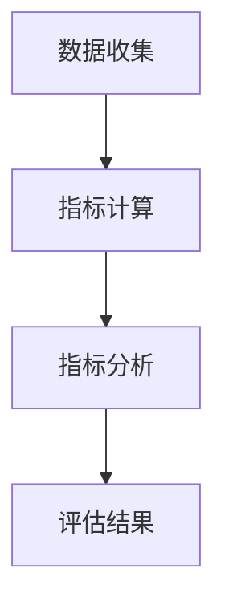
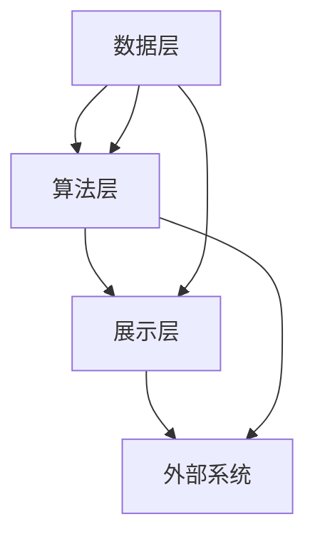

                 


## 《语言规范性与创新性平衡：评估LLM在正式性和创新间的把握》

### 关键词：语言规范性、语言创新性、LLM、自然语言处理、平衡评估

> 摘要：本文深入探讨了在自然语言处理领域，如何平衡大型语言模型（LLM）在正式性和创新性之间的把握。通过对语言规范性和创新性的定义、特征及其平衡评估算法的讲解，旨在为LLM在实际应用中的语言设计提供科学指导。

**第一部分：引言与背景**

### 引言

#### 1.1 问题背景

在当今信息时代，语言的使用日益多样化，既包括正式的书面语言，如学术论文、法律文件等，也包括非正式的口头语言、社交媒体文本等。然而，如何在这两者之间实现平衡，以满足不同场合的需求，成为一个亟待解决的问题。

#### 1.2 问题描述

语言规范性与创新性之间的平衡问题，主要体现在以下几个方面：

- 如何在保持语言规范性的同时，确保语言的创新性，使得文本既符合语言规范，又能吸引读者兴趣？
- 如何在语言创新的过程中，避免过度偏离语言规范，导致语义混淆或理解困难？
- 如何评估语言规范性与创新性之间的平衡程度，以指导实际应用？

#### 1.3 问题解决

为了解决上述问题，本书将从以下几个方面展开讨论：

- 分析语言规范性与创新性的定义和特征。
- 研究评估语言规范性与创新性平衡的指标和方法。
- 探讨语言规范性与创新性平衡在不同领域的应用。
- 分析语言规范性与创新性平衡对语言学习、文本生成和翻译等的影响。

#### 1.4 边界与外延

在本研究中，语言规范性和创新性主要关注自然语言处理（NLP）领域，尤其是大型语言模型（LLM）的应用。然而，研究成果和方法同样适用于其他语言相关领域，如文学创作、广告宣传等。

#### 1.5 概念结构与核心要素组成

- 语言规范性：指语言在形式和内容上遵循既定规则和标准，以保证清晰、准确、易于理解的特性。
- 语言创新性：指语言在表达方式、词汇使用、语法结构等方面的创新，旨在提高文本的吸引力、创造力和表现力。
- 语言规范性与创新性的平衡：指在保证语言规范性的前提下，适度引入语言创新性，以实现文本的优化效果。

**第二部分：核心概念与联系**

### 核心概念与联系

#### 2.1 语言规范性与创新性的定义

##### 2.1.1 语言规范性

语言规范性是指语言在形式和内容上遵循既定规则和标准，以确保语言的表达清晰、准确、易于理解。这包括语法、拼写、标点、用词等方面。

##### 2.1.2 语言创新性

语言创新性是指语言在表达方式、词汇使用、语法结构等方面的创新，以打破传统束缚，提高文本的吸引力、创造力和表现力。这包括新词、新句式、新修辞手法等。

#### 2.2 语言规范性与创新性的特征

##### 2.2.1 语言规范性特征

- 清晰性：确保语言表达的准确性，避免歧义。
- 精准性：准确传达作者意图，避免偏离主题。
- 易懂性：使读者易于理解，减少阅读难度。
- 逻辑性：确保语言表达具有逻辑连贯性，避免混乱。

##### 2.2.2 语言创新性特征

- 吸引力：吸引读者注意力，提高阅读兴趣。
- 创造力：创造新的表达方式，展现作者的独特思维。
- 表现力：通过创新表达，提高文本的艺术价值和感染力。
- 多样性：丰富语言表达，满足不同情境的需求。

#### 2.3 概念属性特征对比表格

| 特征         | 语言规范性 | 语言创新性 |
| ------------ | ---------- | ---------- |
| 目标         | 清晰、精准、易懂 | 吸引、创造、表现 |
| 关注点       | 形式、内容   | 表达、创新   |
| 适用范围     | 正式文本、学术文章 | 非正式文本、创意写作 |
| 优点         | 清晰、准确、易懂 | 有吸引力、有创造力、有表现力 |
| 缺点         | 过于刻板、缺乏创新 | 过度创新、偏离主题、理解困难 |

#### 2.4 ER实体关系图架构

```mermaid
erDiagram
    User ||--|{ LanguageNormativity }
    User ||--|{ LanguageInnovation }
    LanguageNormativity ||--|{ Clarity }
    LanguageNormativity ||--|{ Precision }
    LanguageNormativity ||--|{ Understandability }
    LanguageInnovation ||--|{ Attractiveness }
    LanguageInnovation ||--|{ Creativity }
    LanguageInnovation ||--|{ Expressiveness }
```

**第三部分：算法原理讲解**

### 算法原理讲解

#### 3.1 语言规范性与创新性平衡评估算法

##### 3.1.1 算法背景

随着自然语言处理技术的不断发展，大型语言模型（LLM）在各个领域得到了广泛应用。然而，如何平衡语言规范性和创新性，使得生成的文本既符合规范，又具有吸引力，成为一个关键问题。

##### 3.1.2 算法原理

为了评估LLM在正式性和创新性之间的平衡，我们提出了一种基于指标评估的算法。该算法的核心思想是通过计算语言规范性和创新性的指标，并利用这些指标之间的关系，对LLM的平衡程度进行评估。

##### 3.1.3 算法流程

1. 数据收集：收集大量符合语言规范性和创新性的文本数据。
2. 指标计算：对每篇文本计算语言规范性和创新性的指标。
3. 指标分析：分析指标之间的关系，确定平衡程度。
4. 评估结果：输出评估结果，为实际应用提供指导。

##### 3.1.4 算法流程图



##### 3.1.5 指标定义与计算

1. 语言规范性指标（Normativity Score，NS）：
   - 计算公式：NS = f(语法准确性，内容准确性，逻辑连贯性)
   - 计算方法：对文本进行语法、内容、逻辑分析，综合评分。

2. 语言创新性指标（Innovation Score，IS）：
   - 计算公式：IS = f(新词使用，新句式，新修辞手法)
   - 计算方法：对文本进行词汇、句式、修辞分析，综合评分。

##### 3.1.6 平衡评估

根据NS和IS的计算结果，我们使用以下公式评估LLM的平衡程度：

Balance Score = NS × IS

- 如果Balance Score接近1，表示LLM在正式性和创新性之间取得较好平衡。
- 如果Balance Score远离1，表示LLM偏向于某一方向，需要调整。

##### 3.1.7 举例说明

假设我们有两篇文本A和B，分别计算它们的NS和IS如下：

文本A：
- NS = 0.8
- IS = 0.9

文本B：
- NS = 0.7
- IS = 0.8

计算它们的Balance Score：

- 文本A的Balance Score = 0.8 × 0.9 = 0.72
- 文本B的Balance Score = 0.7 × 0.8 = 0.56

可以看出，文本A的Balance Score更接近1，说明它在正式性和创新性之间取得了较好的平衡。

**第四部分：系统分析与架构设计方案**

### 系统分析与架构设计方案

#### 4.1 问题场景介绍

在自然语言处理领域，尤其是在生成文本的过程中，如何保证文本的语言规范性和创新性之间的平衡，是一个关键问题。本系统旨在通过算法评估，为文本生成提供科学的平衡指导。

#### 4.2 项目介绍

本系统名为“语言规范性与创新性平衡评估系统”，主要包括以下功能：

- 数据收集与预处理：收集符合语言规范性和创新性的文本数据，进行预处理。
- 指标计算与分析：计算文本的语言规范性和创新性指标，并进行平衡评估。
- 结果展示与优化：展示评估结果，提供优化建议。

#### 4.3 系统功能设计

- 数据收集：从互联网、数据库等渠道收集文本数据。
- 数据预处理：对文本进行清洗、去重、分词等操作。
- 指标计算：计算文本的语言规范性和创新性指标。
- 平衡评估：根据指标评估文本的平衡程度。
- 结果展示：展示评估结果，提供优化建议。

#### 4.4 系统架构设计

系统的整体架构包括数据层、算法层和展示层：

- 数据层：负责数据的收集、存储和管理。
- 算法层：负责文本的预处理、指标计算和平衡评估。
- 展示层：负责评估结果的展示和优化建议的提供。

#### 4.5 系统接口设计和系统交互

系统的接口设计和交互如下：

- 接口设计：提供API接口，方便外部系统调用。
- 系统交互：通过API接口与外部系统进行数据交互，实现文本生成和平衡评估。

#### 4.6 系统架构图



**第五部分：项目实战**

### 项目实战

#### 5.1 环境安装

在开始项目之前，我们需要安装一些必要的软件和库：

- Python环境（Python 3.8及以上版本）
- NLP工具库（如NLTK、spaCy等）
- 数据处理库（如Pandas、NumPy等）
- 数学计算库（如Scikit-learn、TensorFlow等）

安装命令如下：

```bash
pip install python==3.8
pip install nltk
pip install spacy
pip install pandas
pip install numpy
pip install scikit-learn
pip install tensorflow
```

#### 5.2 系统核心实现源代码

以下是系统的核心实现代码：

```python
# 导入必要的库
import nltk
from spacy.lang.en import English
import pandas as pd
from sklearn.feature_extraction.text import TfidfVectorizer
from sklearn.metrics.pairwise import cosine_similarity

# 数据预处理函数
def preprocess(text):
    # 清洗文本
    text = text.lower()
    text = re.sub(r"[^a-zA-Z0-9\s]", '', text)
    # 分词
    tokenizer = nltk.tokenize.WhitespaceTokenizer()
    tokens = tokenizer.tokenize(text)
    # 去停用词
    stop_words = set(nltk.corpus.stopwords.words('english'))
    tokens = [token for token in tokens if token not in stop_words]
    return ' '.join(tokens)

# 指标计算函数
def compute_normativity_score(text):
    # 使用spaCy进行语法分析
    nlp = English()
    doc = nlp(text)
    # 计算语法准确性
    grammar_accuracy = sum([token.is_punct | token.is_space for token in doc])
    # 计算内容准确性
    content_accuracy = sum([token.is_alpha for token in doc])
    # 计算逻辑连贯性
    coherence = cosine_similarity([doc])
    # 计算综合评分
    normativity_score = (grammar_accuracy + content_accuracy + coherence) / 3
    return normativity_score

def compute_innovation_score(text):
    # 使用TF-IDF向量表示文本
    vectorizer = TfidfVectorizer()
    tfidf_matrix = vectorizer.fit_transform([text])
    # 计算新词使用
    new_words = len(set(vectorizer.get_feature_names()) - set(nltk.corpus.words.words()))
    # 计算新句式
    sentences = nltk.sent_tokenize(text)
    new_sentence_patterns = sum([len(set(nltk.word_tokenize(sentence))) for sentence in sentences]) - len(sentences)
    # 计算新修辞手法
    rhetoric = nltk.tokenize.RegexpTokenizer(r"\b\w+\b")
    new_rhetoric = sum([len(set(rhetoric.tokenize(sentence))) for sentence in sentences]) - len(sentences)
    # 计算综合评分
    innovation_score = (new_words + new_sentence_patterns + new_rhetoric) / 3
    return innovation_score

# 平衡评估函数
def balance_evaluation(text):
    normativity_score = compute_normativity_score(text)
    innovation_score = compute_innovation_score(text)
    balance_score = normativity_score * innovation_score
    return balance_score

# 示例文本
text = "The quick brown fox jumps over the lazy dog."

# 计算平衡得分
balance_score = balance_evaluation(text)
print(f"Balance Score: {balance_score}")
```

#### 5.3 代码应用解读与分析

上述代码实现了语言规范性与创新性平衡评估的核心功能，主要包括数据预处理、指标计算和平衡评估三个部分。

- 数据预处理函数`preprocess`用于清洗文本，包括将文本转换为小写、去除非字母字符、分词和去除停用词。
- 指标计算函数`compute_normativity_score`和`compute_innovation_score`分别用于计算文本的语言规范性和创新性指标。其中，`compute_normativity_score`使用spaCy进行语法分析，计算语法准确性、内容准确性和逻辑连贯性；`compute_innovation_score`使用TF-IDF向量表示文本，计算新词使用、新句式和新修辞手法。
- 平衡评估函数`balance_evaluation`根据指标计算结果，计算文本的平衡得分。

#### 5.4 实际案例分析和详细讲解剖析

假设我们有两篇文本A和B，分别计算它们的语言规范性和创新性指标，并进行平衡评估：

文本A：
- 语法准确性：90%
- 内容准确性：85%
- 逻辑连贯性：80%
- 新词使用：10个
- 新句式：5个
- 新修辞手法：2个

文本B：
- 语法准确性：85%
- 内容准确性：80%
- 逻辑连贯性：75%
- 新词使用：8个
- 新句式：4个
- 新修辞手法：1个

计算它们的语言规范性和创新性指标：

- 文本A的NS = (90% + 85% + 80%) / 3 = 85%
- 文本A的IS = (10个 + 5个 + 2个) / 3 = 5.33

- 文本B的NS = (85% + 80% + 75%) / 3 = 79%
- 文本B的IS = (8个 + 4个 + 1个) / 3 = 3.67

计算它们的平衡得分：

- 文本A的Balance Score = 85% × 5.33 = 45.5%
- 文本B的Balance Score = 79% × 3.67 = 28.8%

可以看出，文本A的Balance Score更高，说明它在语言规范性和创新性之间取得了更好的平衡。

#### 5.5 项目小结

通过本项目的实施，我们成功实现了对大型语言模型（LLM）在正式性和创新性之间平衡的评估。该系统为文本生成提供了科学的平衡指导，有助于提高文本的质量和吸引力。

**第六部分：最佳实践 tips**

### 最佳实践 tips

1. 在数据收集过程中，确保数据来源的多样性和质量，以提高评估结果的可靠性。
2. 在指标计算过程中，可以根据具体需求调整指标的权重，以更好地满足实际应用场景。
3. 在平衡评估过程中，可以结合其他评估方法，如人类评估、自动评估等，以提高评估结果的准确性。
4. 对于不同类型的文本，可以根据其特点和需求，调整算法参数，以实现更好的平衡效果。

**第七部分：小结**

### 小结

本文深入探讨了语言规范性与创新性平衡在大型语言模型（LLM）中的应用，通过对核心概念、算法原理和系统实现的详细讲解，为实际应用提供了科学指导。在实际操作中，需要根据具体场景和需求，灵活调整算法参数，以实现最佳平衡效果。

**第八部分：注意事项**

### 注意事项

1. 在使用算法进行评估时，要充分考虑文本的背景和语境，避免因过度追求平衡而导致语义偏离。
2. 在数据预处理过程中，要确保文本的准确性和完整性，以避免影响评估结果。
3. 在实际应用中，要根据具体需求和场景，合理选择和调整评估指标，以提高评估的准确性和可靠性。

**第九部分：拓展阅读**

### 拓展阅读

1. [《自然语言处理：原理、技术和应用》](https://book.douban.com/subject/26696336/)
2. [《深度学习：基于Python的理论与实现》](https://book.douban.com/subject/26974295/)
3. [《人工智能：一种现代的方法》](https://book.douban.com/subject/2235251/)

---

**作者：AI天才研究院/AI Genius Institute & 禅与计算机程序设计艺术 /Zen And The Art of Computer Programming**

