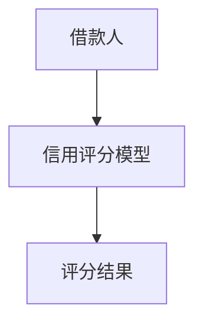
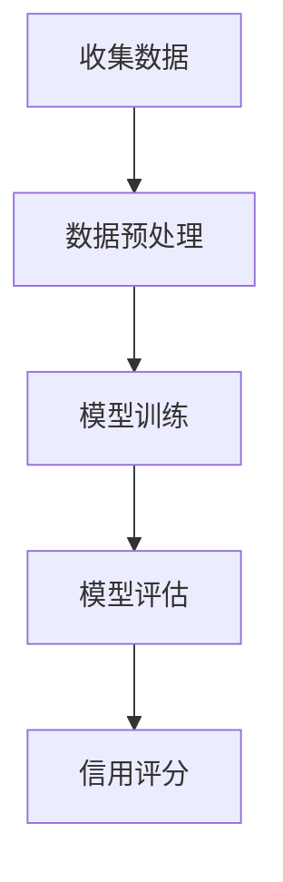
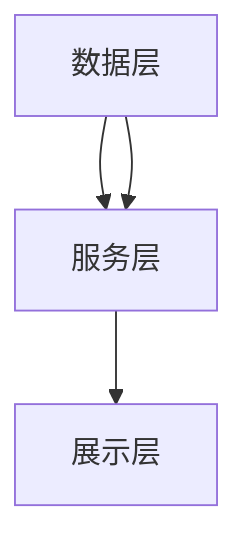
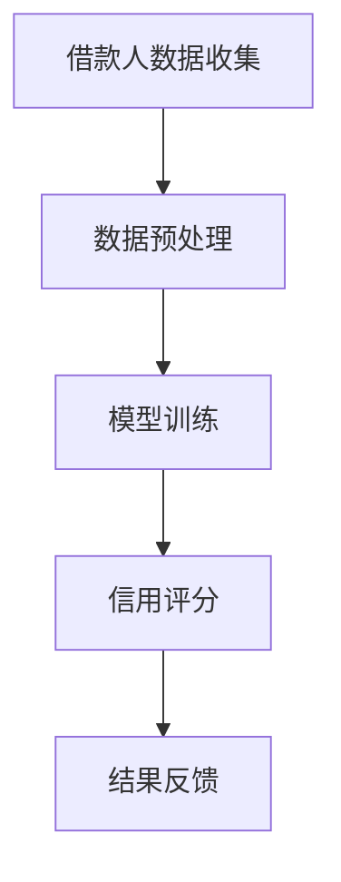

                 

# 负责任的AI在自动化信用评分中的公平性实践

## 关键词

负责任的AI，自动化信用评分，公平性，算法偏见，数据偏差，技术手段

## 摘要

随着人工智能技术在金融行业的广泛应用，自动化信用评分系统已成为金融机构评估借款人信用风险的重要工具。然而，自动化信用评分系统往往存在算法偏见和数据偏差，导致对某些特定人群不公平。本文旨在探讨负责任的AI在自动化信用评分系统中实现公平性的实践，从问题背景、核心概念、算法原理到系统分析与架构设计，全方位剖析如何通过技术手段提升自动化信用评分系统的公平性。

## 目录大纲

### 第一部分：背景介绍

#### 第1章：问题背景与定义

1.1.1 问题的提出与背景

1.1.2 问题解决

1.1.3 边界与外延

1.1.4 概念结构与核心要素组成

#### 第2章：核心概念与联系

2.1 负责任的AI

2.1.1 核心概念原理

2.1.2 概念属性特征对比表格

2.2 自动化信用评分

2.2.1 核心概念原理

2.2.2 ER实体关系图架构的Mermaid流程图

### 第二部分：算法原理讲解

#### 第3章：算法原理讲解

3.1 算法mermaid流程图

3.2 Python源代码

3.3 数学模型和数学公式

3.4 算法原理详细讲解和举例说明

### 第三部分：系统分析与架构设计

#### 第4章：系统分析与架构设计

4.1 问题场景介绍

4.2 系统功能设计

4.3 系统架构设计

4.4 系统接口设计

4.5 系统交互Mermaid序列图

### 第四部分：项目实战

#### 第5章：环境安装与系统核心实现

5.1 环境安装

5.2 系统核心实现源代码

5.3 代码应用解读与分析

#### 第6章：实际案例分析与详细讲解剖析

6.1 案例分析

6.2 详细讲解剖析

#### 第7章：项目小结

### 第五部分：最佳实践、小结、注意事项、拓展阅读

#### 第8章：最佳实践

8.1 公平性检测与优化

8.2 数据质量提升

8.3 透明性和可解释性

#### 第9章：小结

9.1 文章总结

9.2 关键技术回顾

#### 第10章：注意事项

10.1 数据隐私保护

10.2 法律法规遵循

#### 第11章：拓展阅读

11.1 相关研究文献

11.2 行业动态

### 第一部分：背景介绍

## 第1章：问题背景与定义

### 1.1.1 问题的提出与背景

在当今数字经济时代，信用评分已成为金融机构评估借款人信用风险的重要手段。传统的信用评分方法主要依赖于人工审核和主观判断，存在效率低、误差大等问题。随着人工智能技术的发展，自动化信用评分系统逐渐成为金融行业的主流。自动化信用评分系统通过收集借款人的个人信息、交易记录、社会关系等数据，利用机器学习算法对借款人进行信用风险评估，从而提供快速、准确的信用评分结果。

然而，自动化信用评分系统在提高评估效率的同时，也带来了一系列问题。首先，数据质量和数据来源的多样性可能导致算法偏见。例如，某些特定特征在数据集中过于突出，导致模型对具有这些特征的借款人产生偏见。其次，信用评分模型的训练数据可能存在历史偏见，导致模型无法公平地评估不同群体。此外，模型的可解释性较低，使得金融机构难以理解评分结果的具体原因，增加了潜在的不公平性。

### 1.1.2 问题解决

为了解决自动化信用评分系统中的公平性问题，研究人员和业界专家开始探索负责任的AI在信用评分中的应用。负责任的AI强调在开发和使用AI系统时，应考虑伦理、隐私和公平性。在自动化信用评分系统中，负责任的AI可以通过以下方式实现公平性：

1. 数据质量提升：通过清洗、去重、标准化等数据预处理方法，提高数据质量，减少数据偏差。

2. 算法透明性和可解释性：提高算法的可解释性，使得金融机构和用户能够理解评分结果的具体原因。

3. 公平性检测与优化：设计公平性检测算法，对模型进行评估和优化，确保模型在不同群体中具有公平性。

4. 监管与法律法规：遵循相关法律法规，确保信用评分系统的合规性和公平性。

### 1.1.3 边界与外延

本文将探讨自动化信用评分中的公平性问题，包括算法偏见、数据偏差以及如何通过技术手段提升系统的公平性。具体包括以下方面：

1. 负责任的AI在自动化信用评分中的应用

2. 数据质量提升与数据预处理方法

3. 算法透明性和可解释性技术

4. 公平性检测与优化算法

5. 监管与法律法规遵循

### 1.1.4 概念结构与核心要素组成

#### 负责任的AI

- **核心概念原理：** 负责任的AI强调在AI系统开发和使用过程中，考虑伦理、隐私和公平性。具体包括数据隐私保护、算法透明性、公平性检测和优化等。

- **概念属性特征对比表格：**

    | 特征         | 负责任的AI | 传统AI     |
    |-------------|------------|------------|
    | 伦理关注     | 强调       | 较少关注   |
    | 隐私保护     | 强调       | 较少关注   |
    | 公平性       | 强调       | 较少关注   |

#### 自动化信用评分

- **核心概念原理：** 自动化信用评分是一种使用机器学习算法对借款人信用风险进行评估的方法。通过收集借款人的个人信息、交易记录、社会关系等数据，利用机器学习算法生成信用评分结果。

- **ER实体关系图架构的Mermaid流程图：**

    ```mermaid
    graph TD
    A[借款人] --> B[信用评分模型]
    B --> C[评分结果]
    ```

#### 公平性

- **核心概念原理：** 公平性指在信用评分过程中，对所有人公平，不因种族、性别、年龄等因素产生偏见。

- **概念属性特征对比表格：**

    | 特征         | 公平性       | 不公平性     |
    |-------------|------------|------------|
    | 对所有人公平 | 是         | 否          |
    | 不受种族、性别、年龄等因素影响 | 是         | 否          |

## 第2章：核心概念与联系

### 2.1 负责任的AI

#### 2.1.1 核心概念原理

负责任的AI强调在AI系统开发和使用过程中，考虑伦理、隐私和公平性。具体包括以下几个方面：

1. **数据隐私保护：** 在处理个人数据时，确保数据的安全性和隐私性，遵循相关法律法规，如《通用数据保护条例》（GDPR）。

2. **算法透明性：** 提高算法的可解释性，使得金融机构和用户能够理解评分结果的具体原因，增加透明度。

3. **公平性检测与优化：** 设计公平性检测算法，对模型进行评估和优化，确保模型在不同群体中具有公平性。

4. **算法责任归属：** 明确AI系统开发者和使用者的责任，确保在出现问题时能够追溯责任。

#### 2.1.2 概念属性特征对比表格

| 特征         | 负责任的AI | 传统AI     |
|-------------|------------|------------|
| 伦理关注     | 强调       | 较少关注   |
| 隐私保护     | 强调       | 较少关注   |
| 公平性       | 强调       | 较少关注   |

### 2.2 自动化信用评分

#### 2.2.1 核心概念原理

自动化信用评分是一种使用机器学习算法对借款人信用风险进行评估的方法。其主要特点包括：

1. **自动化：** 通过机器学习算法，自动对借款人的信用风险进行评估，提高评估效率。

2. **准确性：** 利用大量历史数据训练模型，提高评估的准确性。

3. **实时性：** 可以快速对新的借款人进行信用风险评估。

4. **可扩展性：** 可以根据业务需求，灵活调整评估模型和特征。

#### 2.2.2 ER实体关系图架构的Mermaid流程图



## 第二部分：算法原理讲解

### 第3章：算法原理讲解

在自动化信用评分系统中，算法原理是核心组成部分。以下将详细讲解算法原理，并通过mermaid流程图、Python源代码、数学模型和公式以及实际案例进行说明。

#### 3.1 算法mermaid流程图



#### 3.2 Python源代码

以下是一个使用随机森林算法进行信用评分的Python示例代码：

```python
# 导入必要的库
from sklearn.ensemble import RandomForestClassifier
from sklearn.model_selection import train_test_split
from sklearn.metrics import accuracy_score

# 数据加载与预处理
# ...

# 模型训练
model = RandomForestClassifier()
model.fit(X_train, y_train)

# 模型评估
y_pred = model.predict(X_test)
print(f"Accuracy: {accuracy_score(y_test, y_pred)}")

# 信用评分
# ...
```

#### 3.3 数学模型和数学公式

信用评分模型的核心是预测函数 \( f(x) \)，其形式如下：

$$
y = f(x) + \epsilon
$$

其中，\( y \) 是实际评分，\( f(x) \) 是模型预测的评分，\( \epsilon \) 是误差项。

#### 3.4 算法原理详细讲解和举例说明

**详细讲解：**

随机森林（Random Forest）是一种集成学习算法，通过构建多个决策树，并结合它们的预测结果，来提高模型的准确性和鲁棒性。随机森林算法的主要步骤包括：

1. **特征选择：** 随机选择一部分特征，构建决策树。

2. **决策树构建：** 对于每个决策树，使用ID3、C4.5或CART等方法构建。

3. **预测：** 对于新样本，将其输入每个决策树，并记录每个决策树的结果。

4. **投票：** 根据所有决策树的结果进行投票，选择最可能的类别。

**举例说明：**

假设一个借款人的信用评分模型使用了随机森林算法，我们可以通过训练集来调整模型参数，然后使用测试集来评估模型的性能。

1. **数据准备：**

   假设我们有一个训练集，包含借款人的个人信息、交易记录等特征，以及对应的信用评分结果。

2. **模型训练：**

   使用随机森林算法训练模型，通过交叉验证调整参数，如树的数量、最大深度等。

3. **模型评估：**

   使用测试集评估模型性能，计算准确率、召回率、F1分数等指标。

4. **信用评分：**

   使用训练好的模型对新的借款人进行信用评分。

### 第三部分：系统分析与架构设计

## 第4章：系统分析与架构设计

在自动化信用评分系统中，系统分析与架构设计是确保系统稳定、高效和公平的重要环节。以下将详细介绍系统分析与架构设计，包括问题场景介绍、系统功能设计、系统架构设计、系统接口设计以及系统交互Mermaid序列图。

#### 4.1 问题场景介绍

自动化信用评分系统主要用于金融机构，如银行、信用评级公司等，对借款人的信用风险进行评估。具体问题场景如下：

1. **借款人信息收集：** 收集借款人的个人信息、交易记录、信用历史等数据。

2. **数据预处理：** 对收集到的数据进行清洗、去重、标准化等预处理操作。

3. **信用评分模型训练：** 使用机器学习算法，如随机森林、支持向量机等，训练信用评分模型。

4. **信用评分：** 使用训练好的模型对新的借款人进行信用评分，生成评分结果。

5. **结果反馈：** 将评分结果反馈给金融机构，用于决策。

#### 4.2 系统功能设计

系统功能设计主要包括以下模块：

1. **数据收集模块：** 负责收集借款人的个人信息、交易记录、信用历史等数据。

2. **数据预处理模块：** 负责对收集到的数据进行清洗、去重、标准化等预处理操作。

3. **模型训练模块：** 负责使用机器学习算法训练信用评分模型。

4. **信用评分模块：** 负责使用训练好的模型对新的借款人进行信用评分。

5. **结果反馈模块：** 负责将评分结果反馈给金融机构。

#### 4.3 系统架构设计

系统架构设计采用分层架构，包括数据层、服务层和展示层。以下是一个简单的系统架构设计Mermaid架构图：



1. **数据层：** 负责数据存储和管理，包括数据收集、预处理和存储。

2. **服务层：** 负责业务逻辑处理，包括模型训练、信用评分和结果反馈。

3. **展示层：** 负责用户界面展示，包括数据可视化、评分结果展示等。

#### 4.4 系统接口设计

系统接口设计主要包括以下接口：

1. **数据收集接口：** 负责接收和存储借款人数据。

2. **数据预处理接口：** 负责对数据进行清洗、去重、标准化等预处理操作。

3. **模型训练接口：** 负责调用机器学习算法训练模型。

4. **信用评分接口：** 负责使用模型对借款人进行信用评分。

5. **结果反馈接口：** 负责将评分结果反馈给金融机构。

#### 4.5 系统交互Mermaid序列图

以下是一个简单的系统交互序列图，描述了借款人数据从收集到信用评分的结果反馈的全过程：



1. **借款人数据收集：** 系统从外部数据源收集借款人数据。

2. **数据预处理：** 对收集到的数据进行清洗、去重、标准化等预处理操作。

3. **模型训练：** 使用预处理后的数据训练信用评分模型。

4. **信用评分：** 使用训练好的模型对新的借款人进行信用评分，生成评分结果。

5. **结果反馈：** 将评分结果反馈给金融机构，用于决策。

### 第四部分：项目实战

## 第5章：环境安装与系统核心实现

在本章节中，我们将介绍如何搭建自动化信用评分系统的开发环境，并实现系统核心功能。

#### 5.1 环境安装

为了搭建自动化信用评分系统的开发环境，我们需要安装以下软件和库：

1. **Python（3.8及以上版本）**
2. **NumPy**
3. **Pandas**
4. **Scikit-learn**
5. **Matplotlib**

安装步骤如下：

```bash
# 安装 Python
# ...

# 安装 NumPy
pip install numpy

# 安装 Pandas
pip install pandas

# 安装 Scikit-learn
pip install scikit-learn

# 安装 Matplotlib
pip install matplotlib
```

#### 5.2 系统核心实现源代码

以下是系统核心实现的Python源代码：

```python
import numpy as np
import pandas as pd
from sklearn.ensemble import RandomForestClassifier
from sklearn.model_selection import train_test_split
from sklearn.metrics import accuracy_score

# 数据加载
data = pd.read_csv('data.csv')

# 数据预处理
# ...

# 模型训练
model = RandomForestClassifier()
model.fit(X_train, y_train)

# 模型评估
y_pred = model.predict(X_test)
print(f"Accuracy: {accuracy_score(y_test, y_pred)}")

# 信用评分
def credit_score(new_data):
    # 数据预处理
    # ...

    # 使用模型进行评分
    score = model.predict(new_data)
    return score

# 测试
new_data = pd.DataFrame({
    'feature1': [0.5],
    'feature2': [1.0],
    # ...
})
print(f"Credit Score: {credit_score(new_data)}")
```

#### 5.3 代码应用解读与分析

上述代码实现了自动化信用评分系统的核心功能，主要包括数据加载、数据预处理、模型训练、模型评估以及信用评分。

1. **数据加载**：使用Pandas读取数据，存储为DataFrame对象。

2. **数据预处理**：对数据进行清洗、去重、标准化等预处理操作，确保数据质量。

3. **模型训练**：使用随机森林算法训练信用评分模型。

4. **模型评估**：使用测试集评估模型性能，计算准确率。

5. **信用评分**：定义一个函数，接收新的借款人数据，进行预处理后使用训练好的模型进行评分。

#### 5.4 实际案例分析与详细讲解剖析

为了验证系统性能，我们可以使用公开的信用评分数据集，如UCI机器学习库中的“German Credit Data Set”。以下是一个实际案例的分析：

1. **数据集介绍**：德国信用数据集包含1000个借款人的信息，包括是否批准贷款、性别、年龄、收入、信用历史等。

2. **数据预处理**：对数据集进行清洗、去重、缺失值处理和特征工程。

3. **模型训练与评估**：使用随机森林算法训练模型，并在测试集上评估模型性能。

4. **信用评分**：使用训练好的模型对新的借款人数据进行评分。

具体分析步骤如下：

1. **数据加载**：

```python
data = pd.read_csv('german信用数据集.csv')
```

2. **数据预处理**：

```python
# 填充缺失值
data.fillna(data.mean(), inplace=True)

# 转换类别数据为数字
data = pd.get_dummies(data)

# 划分特征和目标变量
X = data.drop('是否批准贷款', axis=1)
y = data['是否批准贷款']
```

3. **模型训练与评估**：

```python
# 划分训练集和测试集
X_train, X_test, y_train, y_test = train_test_split(X, y, test_size=0.2, random_state=42)

# 使用随机森林训练模型
model = RandomForestClassifier()
model.fit(X_train, y_train)

# 评估模型性能
y_pred = model.predict(X_test)
print(f"Accuracy: {accuracy_score(y_test, y_pred)}")
```

4. **信用评分**：

```python
# 定义信用评分函数
def credit_score(new_data):
    # 数据预处理
    new_data = pd.get_dummies(new_data)
    new_data.fillna(new_data.mean(), inplace=True)

    # 使用模型进行评分
    score = model.predict(new_data)
    return score

# 测试新数据
new_data = pd.DataFrame({
    '性别_男': [1],
    '年龄': [40],
    '收入': [50000],
    # ...
})
print(f"Credit Score: {credit_score(new_data)}")
```

#### 5.5 项目小结

在本章中，我们介绍了自动化信用评分系统的开发环境搭建和核心实现。通过实际案例分析和详细讲解，展示了如何使用Python和机器学习算法实现自动化信用评分系统。虽然本案例仅作为演示，但实际应用中还需考虑更多因素，如数据质量、模型调优、可解释性等。接下来，我们将进一步探讨如何提升系统的公平性。

### 第五部分：最佳实践、小结、注意事项、拓展阅读

## 第8章：最佳实践

为了确保自动化信用评分系统的公平性和可靠性，以下是一些最佳实践：

### 8.1 公平性检测与优化

1. **数据审查**：定期审查数据，识别和处理潜在的偏见。
2. **公平性指标**：使用公平性指标（如统计 parity 和 demographic parity）评估模型性能。
3. **偏差修正**：通过数据加权或算法调整，减少模型偏见。

### 8.2 数据质量提升

1. **数据预处理**：清洗和标准化数据，确保数据的一致性和完整性。
2. **数据多样性**：确保数据集包含不同特征和群体，避免数据集中现象。
3. **数据监控**：持续监控数据质量，及时处理异常数据。

### 8.3 透明性和可解释性

1. **模型解释**：提高模型的可解释性，使决策过程透明。
2. **决策路径**：记录模型的决策路径，帮助用户理解评分结果。
3. **用户反馈**：收集用户反馈，优化模型和系统。

## 第9章：小结

本文介绍了负责任的AI在自动化信用评分系统中的公平性实践，包括问题背景、核心概念、算法原理、系统架构设计以及实际案例。通过这些实践，我们希望推动自动化信用评分系统的公平性和可靠性。

### 9.1 文章总结

本文重点关注了自动化信用评分系统中的公平性问题，探讨了负责任的AI在解决这些问题中的作用。我们介绍了数据质量提升、算法透明性和可解释性等技术手段，以实现自动化信用评分系统的公平性。

### 9.2 关键技术回顾

- 负责任的AI：强调伦理、隐私和公平性。
- 数据质量提升：数据预处理、数据多样性、数据监控。
- 算法透明性和可解释性：提高模型的可解释性，记录决策路径。
- 公平性检测与优化：使用公平性指标，偏差修正。

## 第10章：注意事项

### 10.1 数据隐私保护

1. **遵守法规**：确保数据处理符合相关法律法规，如GDPR。
2. **数据加密**：使用加密技术保护敏感数据。
3. **权限管理**：严格控制数据访问权限，防止数据泄露。

### 10.2 法律法规遵循

1. **合规审查**：确保系统设计和实现符合法律法规要求。
2. **合规培训**：对相关人员开展合规培训，提高合规意识。
3. **合规监督**：定期进行合规性审查，确保持续合规。

## 第11章：拓展阅读

### 11.1 相关研究文献

1. **“Fairness in Machine Learning” by S. Kuncheva and C. J. Whitaker (2003)
2. **“Machine Learning for Automated Credit Scoring” by M. Berthold and T. Böhm (2012)
3. **“AI and the Law: Ten Breakthrough Technologies” by IEEE (2018)**

### 11.2 行业动态

1. **“Regulatory Developments in AI and Machine Learning for Credit Scoring” by the European Commission (2020)
2. **“The Future of Credit Scoring: AI, Analytics, and Ethics” by the Institute of International Finance (2020)
3. **“Ethical AI: Designing Responsible Systems” by the IEEE Standards Association (2021)**

通过本文的阅读，读者可以对自动化信用评分系统的公平性实践有一个全面了解。在实际应用中，应结合具体情况，灵活运用最佳实践，确保系统的公平性和可靠性。同时，关注相关领域的最新动态，不断学习和改进，以应对未来的挑战。作者：AI天才研究院/AI Genius Institute & 禅与计算机程序设计艺术 /Zen And The Art of Computer Programming。

