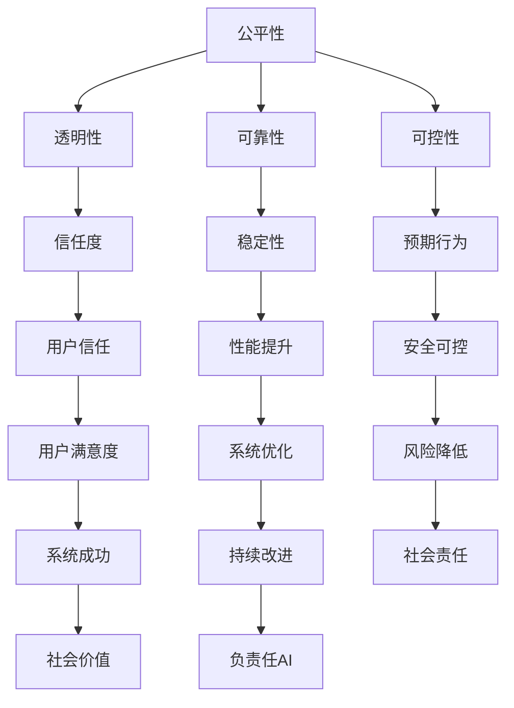
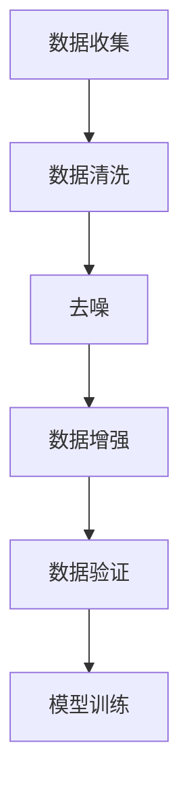

                 


### 第2章 核心概念与联系

## 2.1 负责任的AI的核心概念

### 2.1.1 公平性

公平性是负责任的AI的重要概念之一，指的是AI系统在处理不同群体时，不应因为种族、性别、年龄等因素而产生歧视性结果。为了实现公平性，我们需要在数据收集、模型训练、模型评估等环节，充分考虑数据的多样性和代表性。

#### 公平性属性特征对比表格

| 特征 | 描述 | 对比 |
| --- | --- | --- |
| 数据多样性 | 数据来源广泛，涵盖不同群体 | 确保不同群体在数据中的代表性 |
| 数据代表性 | 数据反映真实社会状况 | 避免因数据偏差导致歧视性结果 |
| 模型透明性 | 模型可解释，易于理解 | 提高用户对AI系统的信任度 |

公平性要求我们首先关注数据多样性。一个多样化且代表真实社会的数据集是确保公平性的基础。这意味着在收集数据时，我们需要确保数据来源广泛，覆盖不同的种族、性别、年龄等群体。通过这种方式，我们可以减少因数据偏差导致的歧视性结果。

接下来，我们需要确保数据的代表性。这意味着数据应该准确地反映真实社会的状况，避免因数据不完整或不准确而导致AI系统在处理特定群体时出现偏见。例如，如果我们的数据集中缺乏某个特定群体的代表，那么在AI模型训练过程中，这个群体可能会被边缘化或受到歧视。

此外，模型透明性也是实现公平性的重要手段。一个透明的AI模型可以使得用户更容易理解模型的工作原理和决策过程，从而增加用户对AI系统的信任度。这可以通过可视化和可解释性技术来实现，如使用图表、动画等形式展示模型的结构和决策过程。

#### ER实体关系图架构的 Mermaid 流程图

```mermaid
entityRelationShip
  entity person [
    id
    name
    age
    gender
  ]
  entity loan [
    id
    amount
    interest_rate
    repayment_term
  ]
  entity credit_score [
    id
    score
  ]
  person {
    one loan
    one credit_score
  }
  loan {
    one person
  }
  credit_score {
    one person
  }
```

在上述ER实体关系图中，我们定义了三个实体：人（person）、贷款（loan）和信用评分（credit_score）。每个实体具有多个属性，如人的ID、姓名、年龄和性别，贷款的ID、金额、利率和还款期限，以及信用评分的ID和评分。

### 2.1.2 透明性

透明性是指AI系统的决策过程和结果应当对用户可解释和可追溯。为了实现透明性，我们可以通过以下方式：

- **可视化工具**：将AI模型的结构和决策过程通过图表、动画等形式进行可视化。
- **可解释性方法**：采用可解释的AI模型或对现有模型进行改进，使其更容易理解。

#### 透明性属性特征对比表格

| 特征 | 描述 | 对比 |
| --- | --- | --- |
| 模型结构可视化 | 模型结构直观，易于理解 | 提高模型的可解释性 |
| 决策过程可追溯 | 决策过程可查询，结果可追溯 | 增强用户对AI系统的信任度 |

透明性是负责任的AI的另一个核心概念。一个透明的AI系统能够使得用户更好地理解模型的工作原理和决策过程，从而增加用户对AI系统的信任度。为了实现透明性，我们可以采用多种方法。

首先，我们可以使用可视化工具来展示AI模型的结构和决策过程。例如，我们可以使用图表、动画等形式来展示模型的层次结构、特征提取过程和分类决策过程。这种方式可以帮助用户更直观地理解AI模型的工作原理。

其次，我们可以采用可解释性方法来提高AI模型的可理解性。这包括使用可解释的AI模型，如决策树、规则集等，以及通过对现有模型进行改进，使其更容易解释。例如，我们可以添加解释性的中间层或使用可解释的激活函数，从而提高模型的可理解性。

#### Mermaid 流程图


在上述Mermaid流程图中，我们展示了AI模型从数据输入到决策输出的整个过程。每个节点代表一个步骤，箭头表示流程的顺序。通过这个流程图，我们可以清晰地看到模型训练、评估和优化的过程，以及最终决策的输出。

### 2.1.3 可靠性

可靠性是指AI系统在处理任务时，应具备稳定、准确的性能。为了提高可靠性，我们需要：

- **模型验证**：通过多种验证方法，确保模型的准确性、稳定性和鲁棒性。
- **错误检测与纠正**：在AI系统中加入错误检测与纠正机制，及时识别和纠正错误。

#### 可靠性属性特征对比表格

| 特征 | 描述 | 对比 |
| --- | --- | --- |
| 模型验证 | 多种验证方法，确保模型性能 | 提高模型可靠性 |
| 错误检测与纠正 | 及时识别和纠正错误 | 提高系统稳定性 |

可靠性是负责任的AI的另一个关键概念。一个可靠的AI系统能够稳定、准确地处理各种任务，从而提高系统的整体性能。

首先，我们需要进行模型验证。这包括使用交叉验证、混淆矩阵、ROC曲线等多种验证方法，确保模型的准确性、稳定性和鲁棒性。例如，我们可以使用交叉验证来评估模型的泛化能力，使用混淆矩阵来评估模型的分类性能，以及使用ROC曲线来评估模型的分类效果。

其次，我们需要在AI系统中加入错误检测与纠正机制。这包括使用异常检测、错误纠正算法等技术，及时识别和纠正错误。例如，我们可以使用异常检测算法来识别异常数据，使用错误纠正算法来纠正错误数据，从而提高系统的稳定性。

#### Mermaid 流程图


在上述Mermaid流程图中，我们展示了AI模型从数据输入到决策输出的整个可靠性保障过程。通过这个流程图，我们可以清晰地看到模型验证、错误检测与纠正的过程，以及最终决策的输出。

### 2.1.4 可控性

可控性是指AI系统在运行过程中，应具备可控性，确保其行为符合预期。为了实现可控性，我们需要：

- **限制操作范围**：对AI系统的操作范围进行限定，确保其不会对用户或社会造成不可预测的后果。
- **审计与监控**：对AI系统的运行过程进行审计和监控，确保其行为符合预期。

#### 可控性属性特征对比表格

| 特征 | 描述 | 对比 |
| --- | --- | --- |
| 操作范围限定 | 确保AI系统行为符合预期 | 避免不可预测的后果 |
| 审计与监控 | 对AI系统运行过程进行审计和监控 | 确保系统行为符合预期 |

可控性是负责任的AI的最后一个核心概念。一个可控的AI系统能够确保其行为符合预期，不会对用户或社会造成不可预测的后果。

首先，我们需要对AI系统的操作范围进行限定。这可以通过设定明确的操作规则和约束条件来实现。例如，我们可以设定AI系统的输入范围、输出范围和处理速度等，确保其行为在可控范围内。

其次，我们需要对AI系统的运行过程进行审计和监控。这可以通过监控系统日志、分析系统行为、设置预警机制等方式来实现。例如，我们可以监控系统的处理速度、错误率、异常行为等，及时发现和解决问题，确保系统行为符合预期。

#### Mermaid 流程图


在上述Mermaid流程图中，我们展示了AI模型从数据输入到决策输出的整个过程，并加入了审计与监控的步骤。通过这个流程图，我们可以清晰地看到AI系统的可控性保障过程。

## 2.2 核心概念之间的联系

负责任的AI的四个核心概念——公平性、透明性、可靠性和可控性之间存在着紧密的联系。

公平性是负责任的AI的基础，它确保AI系统在处理不同群体时不会产生歧视性结果。透明性则帮助用户更好地理解AI系统的工作原理和决策过程，从而增加用户对AI系统的信任度。可靠性确保AI系统在处理任务时具备稳定、准确的性能，从而提高系统的整体性能。可控性则确保AI系统的行为符合预期，不会对用户或社会造成不可预测的后果。

这些核心概念之间并不是孤立的，而是相互关联、相互支持的。例如，透明性可以提高模型的可靠性，因为用户可以更好地理解模型的工作原理和决策过程，从而更有效地发现和纠正错误。可靠性可以提高模型的可控性，因为一个稳定、准确的模型更容易被控制在预期范围内。

通过深入理解和应用这些核心概念，我们可以构建出更加负责任的AI系统，为人类社会带来更大的价值。

#### Mermaid 流程图



在上述Mermaid流程图中，我们展示了负责任的AI的四个核心概念之间的联系。通过这个流程图，我们可以清晰地看到这些核心概念是如何相互作用、相互支持，共同构建出负责任的AI系统的。

## 2.3 本章小结

本章介绍了负责任的AI的核心概念，包括公平性、透明性、可靠性和可控性。我们通过对比表格和Mermaid流程图，详细阐述了这些概念的定义、属性特征以及它们之间的联系。

公平性确保AI系统在处理不同群体时不会产生歧视性结果，透明性帮助用户更好地理解AI系统的工作原理和决策过程，可靠性确保AI系统在处理任务时具备稳定、准确的性能，可控性确保AI系统的行为符合预期，不会对用户或社会造成不可预测的后果。

通过深入理解和应用这些核心概念，我们可以构建出更加负责任的AI系统，为人类社会带来更大的价值。在接下来的章节中，我们将进一步探讨负责任的AI在自动化信用评分系统中的具体实践，包括数据收集、模型训练、模型评估等方面的最佳实践和方法。

## 2.4 未来展望

负责任的AI在自动化信用评分系统中的实践，不仅为金融、保险等领域带来了革命性的变化，也为整个AI领域的发展提供了新的思路和方向。在未来，我们有以下几个方面的展望：

### 2.4.1 数据质量管理

数据质量管理是确保AI系统公平、透明和可靠的基础。在未来，我们需要进一步加强对数据质量管理的研究和应用，包括数据清洗、去噪、数据增强等技术，以提高数据质量和模型的性能。

#### 数据质量管理流程图



在上述流程图中，我们展示了数据质量管理的主要步骤，包括数据收集、数据清洗、去噪、数据增强和数据验证。通过这些步骤，我们可以确保数据的质量和模型的可靠性。

### 2.4.2 模型解释性提升

提高模型解释性是增强用户对AI系统信任度的关键。在未来，我们需要进一步研究和发展可解释的AI模型，如决策树、规则集等，以及利用可视化技术提高模型的可解释性。

#### 模型解释性提升方法

1. 决策树：通过逐步分解数据集，展示决策路径和规则。
2. 规则集：通过提取关键特征和规则，解释模型决策过程。
3. 可视化技术：使用图表、动画等形式展示模型结构和决策过程。

### 2.4.3 风险管理与监控

在自动化信用评分系统中，风险管理和监控至关重要。未来，我们需要进一步研究和发展风险识别、预测和监控技术，确保AI系统的稳定运行和可控性。

#### 风险管理与监控方法

1. 风险识别：使用异常检测技术，识别潜在的异常行为和风险。
2. 风险预测：使用时间序列分析和机器学习技术，预测未来的风险。
3. 监控与预警：实时监控AI系统运行状态，设置预警机制，及时识别和处理风险。

### 2.4.4 跨学科合作

负责任的AI在自动化信用评分系统中的实践，需要跨学科的合作和研究。未来，我们需要进一步加强计算机科学、心理学、社会学等领域的合作，共同探索负责任的AI的最佳实践和方法。

#### 跨学科合作框架

1. 数据分析：计算机科学提供数据分析和处理技术。
2. 伦理与法律：社会学和法学提供伦理和法律指导。
3. 心理学：心理学提供用户行为和认知研究。
4. 经济学：经济学提供金融和市场分析。

通过跨学科合作，我们可以更全面地理解和解决负责任的AI在自动化信用评分系统中的问题，推动AI技术的健康发展。

## 2.5 本章小结

本章对未来负责任的AI在自动化信用评分系统中的发展进行了展望，包括数据质量管理、模型解释性提升、风险管理与监控以及跨学科合作等方面。通过这些研究和发展，我们可以构建更加公平、透明、可靠和可控的AI系统，为金融、保险等领域带来更大的价值。在接下来的章节中，我们将进一步探讨负责任的AI在自动化信用评分系统中的具体实践，包括数据收集、模型训练、模型评估等方面的最佳实践和方法。通过深入研究和实践，我们期待能够为AI技术的可持续发展做出贡献。

