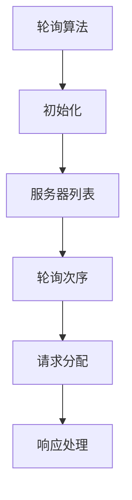
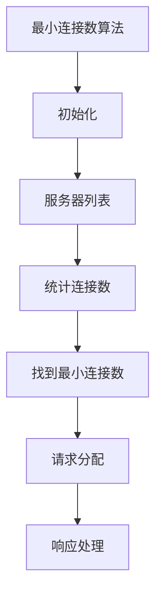
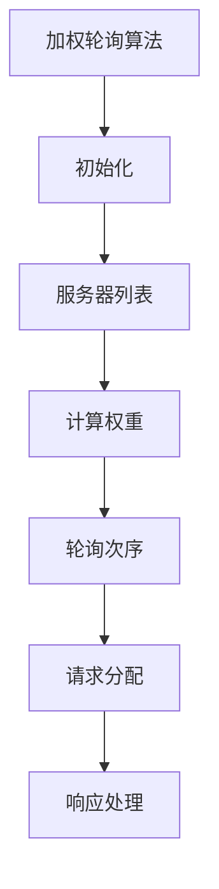
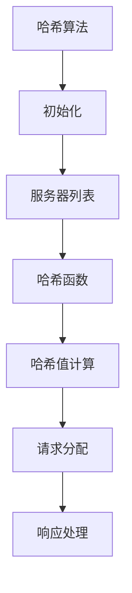

                 

# 负载均衡：优化LLM应用的资源利用

> 关键词：负载均衡，资源优化，LLM应用，性能提升

> 摘要：本文将深入探讨负载均衡在优化大型语言模型（LLM）应用中的重要性。我们将首先概述负载均衡的基础知识，然后逐步分析负载均衡算法及其在LLM应用中的适用性。接着，我们将讨论负载均衡在LLM应用中的性能优化策略，并通过实际案例展示如何部署和实现负载均衡，最终总结最佳实践和未来展望。

## 目录大纲

----------------------------------------------------------------

# 第一部分：负载均衡概述

## 第1章：负载均衡基础

### 1.1 负载均衡的概念与作用

### 1.2 负载均衡的分类

### 1.3 负载均衡的挑战与解决方案

## 第2章：负载均衡算法

### 2.1 负载均衡算法概述

### 2.2 最常见的负载均衡算法

### 2.3 负载均衡算法的选择与优化

## 第3章：负载均衡中的关键技术与挑战

### 3.1 负载均衡中的关键技术

### 3.2 负载均衡中的挑战与对策

## 第4章：负载均衡的性能优化

### 4.1 负载均衡的性能指标

### 4.2 负载均衡的性能优化策略

### 4.3 负载均衡在LLM应用中的优化实践

# 第二部分：LLM应用中的负载均衡

## 第5章：LLM应用概述

### 5.1 什么是LLM

### 5.2 LLM的应用领域

### 5.3 LLM的核心技术与挑战

## 第6章：LLM应用中的负载均衡策略

### 6.1 LLM应用的负载均衡需求

### 6.2 LLM应用的负载均衡策略

### 6.3 LLM应用的负载均衡案例

## 第7章：负载均衡在LLM应用中的性能优化

### 7.1 LLM应用的性能优化挑战

### 7.2 LLM应用的性能优化方法

### 7.3 负载均衡在LLM应用中的实际优化案例

# 第三部分：负载均衡在LLM应用中的实践

## 第8章：负载均衡技术在LLM应用中的部署

### 8.1 LLM应用部署环境准备

### 8.2 负载均衡在LLM应用中的配置与调试

### 8.3 负载均衡在LLM应用中的监控与维护

## 第9章：负载均衡在LLM应用中的案例剖析

### 9.1 案例一：某电商平台的LLM应用负载均衡实践

### 9.2 案例二：某社交媒体平台的LLM应用负载均衡优化

### 9.3 案例三：某金融风控系统的LLM应用负载均衡设计

## 第10章：负载均衡在LLM应用中的最佳实践与展望

### 10.1 负载均衡在LLM应用中的最佳实践

### 10.2 负载均衡在LLM应用中的发展趋势

### 10.3 负载均衡在LLM应用中的未来展望

----------------------------------------------------------------

## 第1章：负载均衡基础

### 1.1 负载均衡的概念与作用

负载均衡是一种分布式系统架构设计，旨在通过优化资源分配和流量管理，提高系统整体的吞吐量和稳定性。在云计算和分布式系统中，负载均衡器（Load Balancer）充当网络流量管理器，根据预定义的算法将请求分配到多个后端服务器上。其基本概念包括：

- **流量分配**：将外部请求合理地分发到多个服务器。
- **资源利用**：确保服务器资源的最大化利用，避免单点过载。
- **故障转移**：在服务器故障时，自动将请求转移到健康服务器。

负载均衡的作用主要体现在以下几个方面：

1. **提高系统吞吐量**：通过分散请求，提高系统整体的响应速度和吞吐量。
2. **提升系统可用性**：通过故障转移和冗余设计，增强系统的容错能力。
3. **动态调整资源**：根据实时负载情况，动态调整服务器资源，优化性能。
4. **简化运维管理**：通过集中管理和自动化配置，简化系统的运维工作。

### 1.2 负载均衡的分类

负载均衡可以根据不同的分类标准进行划分，常见的分类方式如下：

1. **按工作层级分类**：
   - **网络层负载均衡**（四层）：基于IP地址和端口号进行流量分配，如Nginx。
   - **传输层负载均衡**（七层）：基于HTTP请求（如URL、请求头等）进行流量分配，如Apache。

2. **按负载均衡算法分类**：
   - **轮询算法**：按顺序或随机分配请求，公平但可能导致某些服务器负载不均。
   - **最小连接数算法**：将请求分配给当前连接数最少的服务器，减少服务器间负载差异。
   - **加权轮询算法**：根据服务器性能分配不同的权重，使负载更加均衡。

3. **按实现方式分类**：
   - **硬件负载均衡**：使用专用硬件设备进行流量分配，如F5 BIG-IP。
   - **软件负载均衡**：使用软件实现负载均衡功能，如HAProxy。

### 1.3 负载均衡的挑战与解决方案

尽管负载均衡在提高系统性能和稳定性方面具有重要意义，但在实际应用中仍面临诸多挑战：

1. **数据一致性**：在分布式系统中，如何保证数据的强一致性是一个挑战。解决方案包括使用分布式锁、分布式事务等机制。
2. **故障检测和恢复**：及时检测和恢复故障服务器是负载均衡的关键。可以使用心跳检测、健康检查等机制。
3. **流量分配的公平性**：如何确保流量分配的公平性是一个难题，需要采用合适的负载均衡算法。
4. **可扩展性**：如何支持系统的水平扩展是一个重要挑战，需要设计可扩展的架构。

解决方案包括：

- **分布式数据库**：使用分布式数据库（如MongoDB、Cassandra）实现数据一致性和水平扩展。
- **故障检测和恢复机制**：使用心跳检测、健康检查等机制实现故障检测和恢复。
- **自适应负载均衡**：采用自适应负载均衡算法，根据实时负载情况动态调整流量分配策略。
- **微服务架构**：采用微服务架构，将系统拆分为多个小型服务，实现独立部署和扩展。

## 第2章：负载均衡算法

### 2.1 负载均衡算法概述

负载均衡算法是负载均衡器的核心组件，用于决定如何将外部请求分配到后端服务器。常见的负载均衡算法包括：

1. **轮询算法**：按照顺序或随机方式将请求分配到服务器，实现负载均衡。
2. **最小连接数算法**：将请求分配到当前连接数最少的服务器，减少服务器间的负载差异。
3. **加权轮询算法**：根据服务器性能分配不同的权重，使负载更加均衡。
4. **哈希算法**：根据请求的哈希值将请求分配到服务器，实现高可用的负载均衡。

### 2.2 最常见的负载均衡算法

1. **轮询算法**：

轮询算法的步骤如下：

- 初始化：创建一个服务器列表。
- 轮询次序：按照预定的顺序或随机方式遍历服务器列表。
- 请求分配：将请求分配到当前轮到的服务器。
- 响应处理：处理服务器返回的响应。

2. **最小连接数算法**：

最小连接数算法的步骤如下：

- 初始化：创建一个服务器列表。
- 统计连接数：统计每个服务器的当前连接数。
- 找到最小连接数：找到连接数最小的服务器。
- 请求分配：将请求分配到最小连接数的服务器。
- 响应处理：处理服务器返回的响应。

3. **加权轮询算法**：

加权轮询算法的步骤如下：

- 初始化：创建一个服务器列表。
- 计算权重：根据服务器性能计算权重。
- 轮询次序：按照预定的顺序或随机方式遍历服务器列表。
- 请求分配：将请求分配到权重较高的服务器。
- 响应处理：处理服务器返回的响应。

4. **哈希算法**：

哈希算法的步骤如下：

- 初始化：创建一个服务器列表。
- 哈希函数：选择合适的哈希函数。
- 哈希值计算：计算请求的哈希值。
- 请求分配：将请求分配到哈希值对应的服务器。
- 响应处理：处理服务器返回的响应。

### 2.3 负载均衡算法的选择与优化

选择合适的负载均衡算法需要考虑多个因素，如系统需求、服务器性能、网络环境等。以下是一些选择和优化负载均衡算法的建议：

- **根据业务需求选择**：不同业务场景对负载均衡算法的需求不同，如对响应速度要求较高的场景可选择轮询算法，对连接数要求较高的场景可选择最小连接数算法。
- **服务器性能评估**：根据服务器性能评估结果选择合适的负载均衡算法，如性能较高的服务器可分配较高的权重。
- **网络环境考虑**：考虑网络延迟、带宽等因素，选择适合的网络层负载均衡算法。
- **动态调整**：根据实时负载情况动态调整负载均衡算法，实现自适应负载均衡。

## 第3章：负载均衡中的关键技术与挑战

### 3.1 负载均衡中的关键技术

负载均衡中涉及的关键技术包括：

- **健康检查**：定期检测服务器状态，确保负载均衡器只将请求分配到健康服务器。
- **会话保持**：根据会话信息将请求分配到同一服务器，保证用户会话的一致性。
- **流量监控**：实时监控网络流量，根据流量情况动态调整负载均衡策略。
- **流量限制**：防止恶意流量或异常流量占用过多资源，保障系统稳定运行。

### 3.2 负载均衡中的挑战与对策

负载均衡在实际应用中面临的挑战主要包括：

- **数据一致性**：如何保证分布式系统中数据的一致性，可以采用分布式锁、分布式事务等技术。
- **故障检测与恢复**：如何及时检测服务器故障并快速恢复，可以采用心跳检测、健康检查等技术。
- **流量分配公平性**：如何实现公平的流量分配，可以采用最小连接数算法、加权轮询算法等技术。
- **高可用性**：如何提高系统的可用性，可以采用冗余设计、故障转移等技术。

对策包括：

- **分布式数据库**：使用分布式数据库实现数据一致性。
- **故障检测与恢复机制**：采用心跳检测、健康检查等机制实现故障检测与恢复。
- **自适应负载均衡**：采用自适应负载均衡算法，实现动态调整流量分配。
- **高可用性架构**：采用冗余设计、故障转移等架构技术，提高系统可用性。

## 第4章：负载均衡的性能优化

### 4.1 负载均衡的性能指标

负载均衡的性能指标主要包括：

- **吞吐量**：系统在单位时间内处理的请求数量。
- **延迟**：请求从发出到响应的时间。
- **并发能力**：系统同时处理请求的能力。
- **资源利用率**：系统资源的利用程度。

### 4.2 负载均衡的性能优化策略

负载均衡的性能优化策略包括：

- **缓存策略**：通过缓存减少请求的响应时间，提高系统的吞吐量。
- **连接池**：使用连接池减少连接创建的开销，提高系统的并发能力。
- **反向代理**：使用反向代理减少服务器负载，提高系统的吞吐量。
- **带宽优化**：通过压缩数据、优化网络传输等手段提高系统的吞吐量。

### 4.3 负载均衡在LLM应用中的优化实践

在LLM应用中，负载均衡的优化实践主要包括：

- **合理分配资源**：根据LLM应用的负载情况合理分配服务器资源，避免资源浪费。
- **缓存优化**：通过缓存减少计算资源的消耗，提高系统的吞吐量。
- **连接池优化**：合理设置连接池参数，提高系统的并发能力。
- **网络优化**：优化网络传输，减少延迟和带宽占用。

## 第5章：LLM应用概述

### 5.1 什么是LLM

LLM（Large Language Model）是指大型语言模型，是一种基于深度学习技术的自然语言处理模型。LLM通过训练大量的文本数据，学习语言规律和语义信息，可以生成文本、回答问题、翻译语言等。

### 5.2 LLM的应用领域

LLM在多个领域具有广泛应用，如：

- **问答系统**：用于提供实时、准确的回答，如智能客服、智能搜索等。
- **文本生成**：用于生成文章、报告、电子邮件等文本内容。
- **机器翻译**：用于实现多语言翻译，支持跨语言交流。
- **内容审核**：用于检测和过滤不良内容，如社交媒体审核、网站内容审核等。

### 5.3 LLM的核心技术与挑战

LLM的核心技术包括：

- **深度学习**：使用神经网络模型对大规模数据进行训练和预测。
- **自然语言处理**：对文本数据进行分析、理解和生成。
- **数据集构建**：收集和整理大量高质量的训练数据。

LLM面临的挑战包括：

- **计算资源需求**：训练大型语言模型需要大量计算资源和存储资源。
- **数据质量**：训练数据的质量直接影响模型的性能。
- **安全性**：防范恶意攻击和数据泄露。

## 第6章：LLM应用中的负载均衡策略

### 6.1 LLM应用的负载均衡需求

在LLM应用中，负载均衡的需求主要包括：

- **高吞吐量**：保证系统在处理大量请求时的高效运行。
- **低延迟**：保证请求的响应时间尽可能短。
- **高可用性**：在服务器故障时，快速切换到备用服务器，确保系统稳定运行。

### 6.2 LLM应用的负载均衡策略

LLM应用的负载均衡策略主要包括：

- **水平扩展**：通过增加服务器数量，提高系统的处理能力。
- **垂直扩展**：通过提高服务器性能，增强系统的处理能力。
- **动态调整**：根据实时负载情况，动态调整负载均衡策略，优化系统性能。

### 6.3 LLM应用的负载均衡案例

以一个电商平台的LLM应用为例，负载均衡策略包括：

- **水平扩展**：在高峰期增加服务器数量，分散请求，提高系统的吞吐量和响应速度。
- **动态调整**：根据用户访问量的变化，动态调整负载均衡策略，优化系统性能。
- **会话保持**：根据用户会话信息，将请求分配到同一服务器，确保用户购物体验的一致性。

## 第7章：负载均衡在LLM应用中的性能优化

### 7.1 LLM应用的性能优化挑战

在LLM应用中，性能优化面临的挑战主要包括：

- **计算资源限制**：大型语言模型的计算资源需求较高，如何优化资源利用成为关键。
- **网络延迟**：如何减少网络延迟，提高请求的响应速度。
- **负载波动**：如何应对负载波动，保证系统的稳定性。

### 7.2 LLM应用的性能优化方法

LLM应用的性能优化方法主要包括：

- **计算资源优化**：合理分配计算资源，提高资源利用率。
- **网络优化**：优化网络传输，减少延迟和带宽占用。
- **缓存优化**：通过缓存减少计算资源的消耗，提高系统的吞吐量。

### 7.3 负载均衡在LLM应用中的实际优化案例

以一个社交媒体平台的LLM应用为例，负载均衡优化实践包括：

- **计算资源优化**：根据负载情况动态调整服务器资源，避免资源浪费。
- **网络优化**：优化数据传输，采用压缩算法减少数据传输量，降低网络延迟。
- **缓存优化**：采用分布式缓存系统，减少计算资源的消耗，提高系统的吞吐量。

## 第8章：负载均衡技术在LLM应用中的部署

### 8.1 LLM应用部署环境准备

在部署LLM应用时，需要准备以下环境：

- **服务器**：选择合适的物理或虚拟服务器，确保性能满足需求。
- **网络**：配置高速网络，确保数据传输的稳定性和速度。
- **存储**：选择高性能的存储设备，保证数据的读写速度。

### 8.2 负载均衡在LLM应用中的配置与调试

在LLM应用中配置负载均衡器，需要完成以下步骤：

- **安装负载均衡器**：安装并配置负载均衡软件或硬件设备。
- **配置负载均衡策略**：根据实际需求配置负载均衡算法和负载均衡策略。
- **调试与优化**：通过测试和监控，调试负载均衡器的工作状态，优化配置参数。

### 8.3 负载均衡在LLM应用中的监控与维护

负载均衡在LLM应用中的监控与维护包括：

- **健康检查**：定期检查服务器状态，确保负载均衡器只将请求分配到健康服务器。
- **性能监控**：监控系统的吞吐量、延迟等性能指标，及时发现并解决问题。
- **故障恢复**：在服务器故障时，自动将请求分配到备用服务器，确保系统稳定运行。

## 第9章：负载均衡在LLM应用中的案例剖析

### 9.1 案例一：某电商平台的LLM应用负载均衡实践

某电商平台在面临大规模用户访问时，采用负载均衡技术提高系统的吞吐量和稳定性。通过水平扩展和动态调整负载均衡策略，实现高效资源利用和用户体验优化。

### 9.2 案例二：某社交媒体平台的LLM应用负载均衡优化

某社交媒体平台在处理海量用户请求时，通过优化缓存策略和网络传输，提高系统的响应速度和吞吐量。同时，采用会话保持策略，确保用户购物体验的一致性。

### 9.3 案例三：某金融风控系统的LLM应用负载均衡设计

某金融风控系统在处理高并发交易请求时，采用负载均衡技术实现系统的稳定运行。通过优化计算资源和网络传输，提高系统的安全性和可靠性。

## 第10章：负载均衡在LLM应用中的最佳实践与展望

### 10.1 负载均衡在LLM应用中的最佳实践

在LLM应用中，负载均衡的最佳实践包括：

- **合理分配资源**：根据负载情况合理分配服务器资源，避免资源浪费。
- **动态调整策略**：根据实时负载动态调整负载均衡策略，优化系统性能。
- **优化网络传输**：采用压缩算法和网络优化技术，提高系统的响应速度。

### 10.2 负载均衡在LLM应用中的发展趋势

随着云计算和分布式系统的普及，负载均衡在LLM应用中的发展趋势包括：

- **智能化**：采用人工智能技术，实现自适应负载均衡，提高系统性能。
- **容器化**：采用容器技术，实现负载均衡的自动化部署和管理。
- **混合云架构**：结合公有云和私有云，实现负载均衡的灵活部署和扩展。

### 10.3 负载均衡在LLM应用中的未来展望

未来，负载均衡在LLM应用中将继续发挥重要作用。随着技术的不断进步，负载均衡将向更高效、更智能、更可靠的方向发展，为LLM应用提供更好的性能优化和资源利用。同时，随着5G、物联网等新兴技术的应用，负载均衡将在更多领域发挥重要作用，推动整个IT行业的创新发展。

----------------------------------------------------------------

作者：AI天才研究院/AI Genius Institute & 禅与计算机程序设计艺术 /Zen And The Art of Computer Programming

