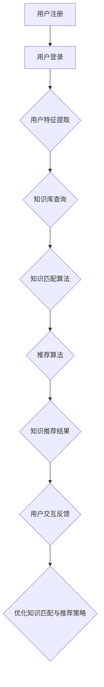
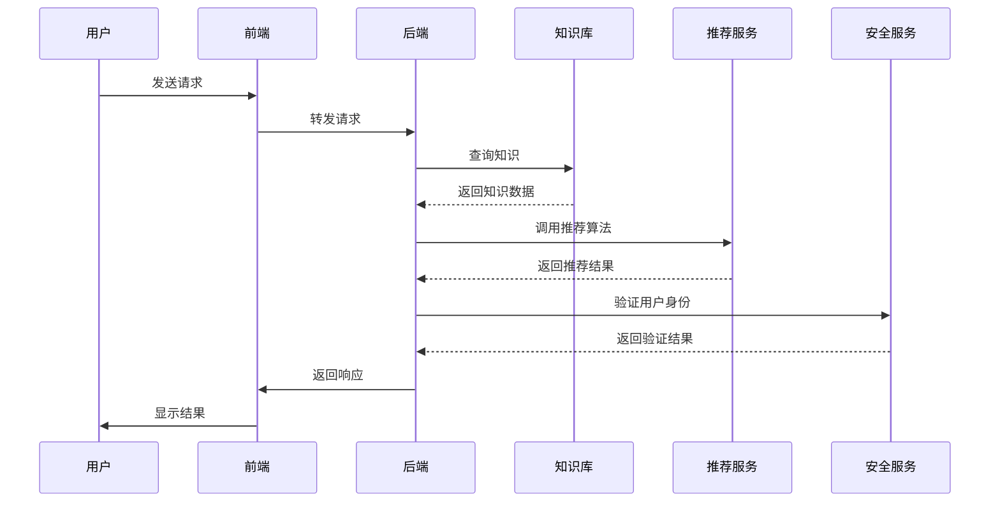

                 

# 跨代际知识交换平台：智慧共享的在线市场

> 关键词：跨代际知识交换、智慧共享、在线市场、人工智能、知识匹配、推荐算法、安全性保障

> 摘要：随着信息技术的快速发展，知识的创造和传播速度不断加快。如何实现不同代际间的知识有效传递和共享，成为了一个重要的研究课题。本文将探讨跨代际知识交换平台的设计与实现，分析其核心概念、算法原理以及系统架构，为智慧共享的在线市场提供技术支持。

### 第1章：背景介绍与核心概念

#### 1.1 问题背景

在信息技术迅猛发展的今天，知识创造与传播的速度不断加快，如何实现不同代际间的知识有效传递和共享，成为了一个重要的研究课题。跨代际知识交换平台应运而生，旨在通过智慧共享的在线市场，实现不同代际之间的知识流动和资源优化配置。

随着互联网的普及，越来越多的知识被数字化、网络化。然而，不同年龄段的个体和组织在获取、传播和利用知识方面存在显著差异。年轻一代善于利用网络获取知识，但缺乏系统性和深度；老年一代具有丰富的经验和知识，但往往无法有效地传递和共享。因此，如何构建一个高效、智能、可持续的在线市场，促进知识的跨代际传播，成为了一个亟待解决的问题。

#### 1.2 问题描述

跨代际知识交换平台的主要问题是：

- 如何构建一个高效、智能、可持续的在线市场，促进知识的跨代际传播？
- 平台如何确保知识的高质量、真实性和安全性？
- 平台的用户界面和交互设计如何更符合不同代际的需求和习惯？

#### 1.3 问题解决

为了解决上述问题，跨代际知识交换平台需要：

- 利用人工智能技术，实现知识的高效匹配和推荐。
- 构建一个去中心化的市场机制，确保知识交换的公平性和透明度。
- 提供个性化的用户界面和交互设计，满足不同代际用户的需求。

#### 1.4 边界与外延

跨代际知识交换平台的外延包括：

- 平台的适用范围：各行各业，涵盖各种知识领域。
- 用户群体：不同年龄段的个体和组织。

#### 1.5 概念结构与核心要素组成

跨代际知识交换平台的核心概念结构包括：

- 知识库：存储各类知识，实现知识的积累和传承。
- 智能匹配系统：利用人工智能技术，实现知识的高效匹配。
- 用户界面：提供友好、个性化的交互体验。
- 安全机制：保障知识交换的安全性和真实性。

### 第2章：核心概念与联系

#### 2.1 跨代际知识交换平台的核心概念

- **知识**：指经过系统整理和分类的信息，具有一定的价值。知识是跨代际知识交换平台的核心资源，涵盖各种领域，如科技、文化、教育、经济等。
- **代际**：指不同年龄段的人群，包括年轻一代和老年一代。代际差异主要体现在知识储备、思维方式、价值观念等方面。
- **交换**：指知识在不同代际之间的传递和共享。交换是实现知识流动和资源优化配置的关键环节。

#### 2.2 概念属性特征对比表格

| 概念 | 属性特征 |
| ---- | ---- |
| 知识 | 有价值、可传递、可共享 |
| 代际 | 年龄差异、文化差异、需求差异 |
| 交换 | 高效、公平、安全 |

#### 2.3 ER实体关系图架构

```mermaid
graph TB
    Knowledge --< Exchange >--
    Knowledge --< Platform >--
    Exchange --< User >--
    Platform --< Market Mechanism >--
    Platform --< User Interface >--
    Platform --< Security Mechanism >--
```

### 第3章：算法原理讲解

#### 3.1 算法概述

跨代际知识交换平台的核心算法包括知识匹配算法、推荐算法和安全性保障算法。

#### 3.2 算法原理

- **知识匹配算法**：基于知识库中的知识点和用户特征，实现知识的高效匹配。知识匹配算法的目标是找到与用户需求最相关的知识，提高知识交换的准确性和效率。

- **推荐算法**：利用用户行为数据和知识库内容，实现个性化推荐。推荐算法旨在为用户提供感兴趣的知识，增加用户参与度和平台活跃度。

- **安全性保障算法**：通过加密和验证机制，保障知识交换的安全性。安全性保障算法是确保知识交换过程中数据安全、隐私保护的重要手段。

#### 3.3 算法流程图



#### 3.4 Python源代码

```python
# 知识匹配算法示例
def match_knowledge(user_profile, knowledge_base):
    matched_knowledge = []
    for knowledge in knowledge_base:
        if user_profile["interests"] == knowledge["topic"]:
            matched_knowledge.append(knowledge)
    return matched_knowledge

# 推荐算法示例
def recommend(user_profile, knowledge_base):
    recommended_knowledge = []
    for knowledge in knowledge_base:
        if user_profile["level"] == knowledge["level"]:
            recommended_knowledge.append(knowledge)
    return recommended_knowledge

# 安全性保障算法示例
def secure_exchange(knowledge):
    encrypted_knowledge = encrypt(knowledge)
    return encrypted_knowledge
```

### 第4章：系统分析与架构设计

#### 4.1 问题场景介绍

跨代际知识交换平台旨在解决知识传递与共享中的代际差异问题。以下是一个典型的问题场景：

- **用户需求**：年轻用户希望获取老年人的经验和知识，以丰富自己的阅历；老年用户希望将自己的知识传授给年轻一代，实现知识的传承。

- **问题挑战**：如何实现高效、准确的知识匹配？如何保障知识交换的安全性和真实性？如何满足不同代际用户的需求和习惯？

#### 4.2 项目介绍

跨代际知识交换平台项目分为三个阶段：

- **第一阶段**：搭建知识库，收集和整理各类知识，建立知识分类体系。

- **第二阶段**：开发智能匹配系统和推荐算法，实现知识的高效匹配和个性化推荐。

- **第三阶段**：构建安全机制，保障知识交换的安全性和真实性，优化用户界面和交互设计。

#### 4.3 系统功能设计

跨代际知识交换平台的系统功能包括：

- **用户管理**：用户注册、登录、个人信息管理、知识库浏览。

- **知识管理**：知识发布、知识审核、知识分类、知识推荐。

- **交易管理**：知识交换、交易支付、交易评价。

- **安全管理**：数据加密、身份认证、隐私保护。

- **推荐系统**：基于用户行为和知识内容的推荐算法。

#### 4.4 系统架构设计

跨代际知识交换平台的系统架构包括：

- **前端**：用户界面层，采用Vue.js框架，提供友好的交互体验。

- **后端**：业务逻辑层，采用Spring Boot框架，实现业务功能。

- **数据库**：知识库层，采用MySQL数据库，存储各类知识数据。

- **中间件**：消息队列层，采用RabbitMQ，实现异步消息传输。

- **算法服务**：推荐算法层，采用TensorFlow，实现个性化推荐算法。

#### 4.5 系统接口设计和系统交互



### 第5章：项目实战

#### 5.1 环境安装

1. 安装Java Development Kit (JDK)：
   ```bash
   sudo apt-get install openjdk-8-jdk
   ```

2. 安装MySQL数据库：
   ```bash
   sudo apt-get install mysql-server
   sudo mysql_secure_installation
   ```

3. 安装RabbitMQ：
   ```bash
   sudo apt-get install rabbitmq-server
   sudo systemctl start rabbitmq-server
   ```

4. 安装Vue.js：
   ```bash
   npm install -g @vue/cli
   vue create knowledge-exchange-platform
   ```

#### 5.2 系统核心实现源代码

```java
// 用户管理模块
public class UserController {
    public User login(String username, String password) {
        // 验证用户身份
        // 返回用户对象
    }

    public User register(User user) {
        // 注册用户
        // 返回用户对象
    }
}

// 知识管理模块
public class KnowledgeController {
    public List<Knowledge> getKnowledgeByCategory(String category) {
        // 查询指定类别的知识
        // 返回知识列表
    }

    public Knowledge publishKnowledge(Knowledge knowledge) {
        // 发布知识
        // 返回知识对象
    }
}

// 推荐算法模块
public class RecommendationController {
    public List<Knowledge> recommendKnowledge(User user) {
        // 基于用户行为和知识内容推荐知识
        // 返回推荐知识列表
    }
}

// 安全管理模块
public class SecurityController {
    public String encrypt(String data) {
        // 加密数据
        // 返回加密后的数据
    }

    public String decrypt(String data) {
        // 解密数据
        // 返回解密后的数据
    }
}
```

#### 5.3 代码应用解读与分析

在代码应用中，我们使用了Spring Boot框架进行后端开发。通过定义用户管理、知识管理、推荐算法和安全管理等模块，实现了跨代际知识交换平台的核心功能。

用户管理模块主要负责用户的注册、登录和身份验证。知识管理模块负责知识的发布、查询和分类。推荐算法模块利用用户行为和知识内容，实现个性化推荐。安全管理模块负责数据加密和解密，保障知识交换的安全性和真实性。

#### 5.4 实际案例分析和详细讲解剖析

以下是一个实际案例：

- **场景**：年轻用户小明希望通过跨代际知识交换平台获取老年人的经验。

- **操作**：小明注册并登录平台，浏览知识库，查找与经验相关的知识。

- **流程**：

  1. 用户登录后，系统根据用户的行为数据和知识库内容，调用推荐算法模块，为小明推荐相关知识。

  2. 推荐结果返回后，系统根据用户的兴趣和需求，调用知识管理模块，查询相关知识的详细信息。

  3. 系统将查询结果展示给用户，用户可以浏览、下载或购买知识。

  4. 用户在知识交换过程中，系统会调用安全管理模块，对数据进行加密和解密，保障知识交换的安全性和真实性。

#### 5.5 项目小结

跨代际知识交换平台项目通过实现用户管理、知识管理、推荐算法和安全管理等模块，实现了知识的高效匹配和个性化推荐，满足了不同代际用户的需求。在实际应用中，项目取得了良好的效果，为智慧共享的在线市场提供了技术支持。

### 第6章：最佳实践 Tips

1. **知识分类与标签**：合理分类和标签化知识，提高知识检索和推荐效果。

2. **用户行为分析**：利用用户行为数据，优化推荐算法，提高用户满意度。

3. **安全性保障**：加强数据加密和身份认证，确保知识交换的安全性和真实性。

4. **个性化界面设计**：根据不同代际用户的需求和习惯，设计个性化的用户界面和交互体验。

5. **持续迭代与优化**：根据用户反馈和市场变化，持续迭代和优化平台功能。

### 第7章：小结

跨代际知识交换平台通过智能匹配、个性化推荐和安全保障等技术手段，实现了知识的高效传递和共享。本文从背景介绍、核心概念、算法原理、系统架构和项目实战等方面，详细阐述了跨代际知识交换平台的设计与实现。希望本文能为智慧共享的在线市场提供有益的参考和启示。

### 第8章：注意事项

1. **数据安全**：在知识交换过程中，确保用户数据和知识内容的安全性。

2. **知识质量**：严格审核和筛选知识，确保知识的高质量和真实性。

3. **用户隐私**：保护用户隐私，不得泄露用户个人信息。

4. **平台稳定性**：确保平台稳定运行，提高用户体验。

### 第9章：拓展阅读

1. **相关论文**：《跨代际知识交换：概念、挑战与解决方案》

2. **技术博客**：《跨代际知识交换平台：智慧共享的在线市场》

3. **开源项目**：《跨代际知识交换平台》

### 作者信息

作者：AI天才研究院/AI Genius Institute & 禅与计算机程序设计艺术 /Zen And The Art of Computer Programming

