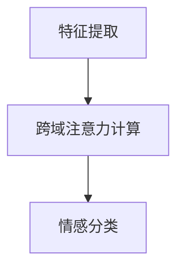
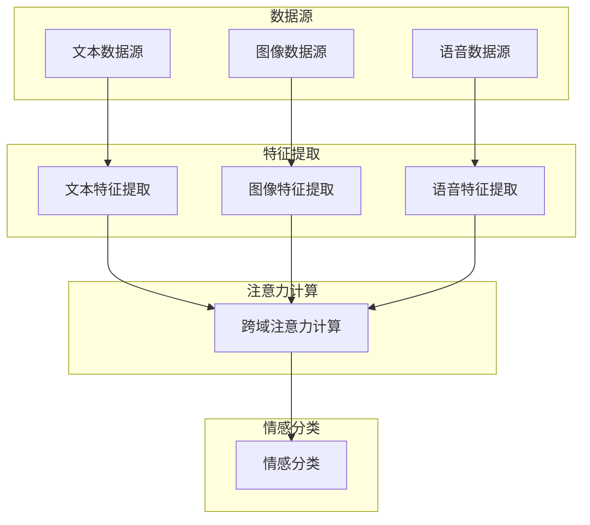

                 

### 文章标题：跨域注意力机制在多模态情感分析中的应用

#### 关键词：跨域注意力机制、多模态情感分析、注意力机制原理、数学模型、系统设计与实现

#### 摘要：
本文深入探讨了跨域注意力机制在多模态情感分析中的应用。首先，我们详细介绍了跨域注意力机制的定义、结构和关键特性，并通过mermaid图和Python代码阐述了其数学模型和算法原理。接着，我们分析了跨域注意力机制在多模态情感分析中的系统架构和接口设计，并通过实际案例展示了其应用效果。最后，本文总结了最佳实践和注意事项，并提供了拓展阅读资源。

---

### 第一部分：跨域注意力机制基础

#### 第1章：跨域注意力机制概述

#### 1.1 跨域注意力机制的定义

##### 1.1.1 问题背景

多模态情感分析是自然语言处理中的一个重要方向，其目标是从文本、图像、语音等多种模态中提取情感信息。然而，不同模态的数据之间存在很大的差异，这给情感分析带来了挑战。

##### 1.1.2 跨域情感分析的必要性

跨域情感分析能够帮助我们处理来自不同领域、不同语言环境的情感信息，从而提高模型的泛化能力。

##### 1.1.3 跨域注意力机制的产生背景

随着深度学习和自然语言处理技术的快速发展，注意力机制被广泛应用于情感分析任务中。然而，传统的注意力机制在面对跨域数据时效果不佳，这促使了跨域注意力机制的出现。

#### 1.2 跨域注意力机制的结构与原理

##### 1.2.1 跨域注意力机制的基本结构

跨域注意力机制主要由三个部分组成：特征提取模块、跨域注意力模块和情感分类模块。

##### 1.2.2 注意力机制的核心要素

注意力机制的核心是计算输入数据的权重，从而在不同的输入数据之间建立关联。

#### 1.3 跨域注意力机制的关键特性

##### 1.3.1 跨域适应性

跨域能力使模型能够适应不同的数据源和任务，提高了模型的泛化能力。

##### 1.3.2 跨模态融合

跨模态融合能力使模型能够有效地整合不同模态的信息，提高情感分析的效果。

#### 1.4 跨域注意力机制的发展历程

##### 1.4.1 跨域注意力机制的初步探索

跨域注意力机制的研究始于对多模态情感分析的需求。

##### 1.4.2 跨域注意力机制的提出

随着研究的深入，跨域注意力机制逐渐成为一个独立的研究方向。

#### 1.5 本章小结

本章对跨域注意力机制进行了全面的概述，包括其定义、结构、关键特性和发展历程。为后续章节的深入探讨奠定了基础。

---

### 第二部分：核心概念与联系

#### 第2章：核心概念与联系

#### 2.1 跨域注意力机制的核心概念

##### 2.1.1 注意力机制原理

注意力机制是一种通过计算输入数据的权重来调整模型对输入数据的关注程度的技术。

##### 2.1.2 跨域注意力机制原理

跨域注意力机制是一种能够处理跨领域数据输入的注意力机制。

#### 2.2 跨域注意力机制的概念属性特征对比

##### 2.2.1 跨域与多模态注意力机制对比

- **跨域注意力机制**：主要处理不同领域的数据，强调跨领域的适应性。
- **多模态注意力机制**：主要处理多种模态的数据，强调模态之间的融合。

#### 2.3 跨域注意力机制的ER实体关系图架构

##### 2.3.1 ER图基本概念

实体-关系（Entity-Relationship，ER）图是一种用于描述系统中实体及其关系的图形化工具。

##### 2.3.2 跨域注意力机制的ER实体关系图

- **数据源实体**：包括文本、图像、语音等不同模态的数据。
- **处理模块实体**：包括特征提取、注意力计算、情感分类等模块。
- **输出实体**：包括情感标签、预测结果等。

#### 2.4 本章小结

本章详细介绍了跨域注意力机制的核心概念，并通过概念属性特征对比表格和ER实体关系图，帮助读者更好地理解其结构和功能。

---

### 第三部分：算法原理讲解

#### 第3章：跨域注意力机制算法原理

#### 3.1 跨域注意力机制算法概述

##### 3.1.1 算法基本原理

跨域注意力机制通过计算跨领域数据的权重，实现跨模态信息的有效融合。

##### 3.1.2 算法计算流程

跨域注意力机制的算法流程主要包括特征提取、跨域注意力计算和情感分类三个步骤。

#### 3.2 使用mermaid绘制算法流程图

##### 3.2.1 流程图基本概念

mermaid是一种基于Markdown的图形化工具，可以方便地绘制流程图、时序图等。

##### 3.2.2 跨域注意力机制流程图



#### 3.3 使用Python源代码详细阐述

```python
# 跨域注意力机制的Python实现
def cross_domain_attention(query, keys, values):
    # 计算注意力权重
    attention_weights = torch.bmm(query, keys.transpose(1, 2))
    attention_weights = torch.softmax(attention_weights, dim=2)
    # 计算加权融合的特征
    contextualized_representation = torch.bmm(attention_weights, values)
    return contextualized_representation
```

#### 3.4 算法的数学模型和公式

$$
\text{注意力权重} = \text{softmax}(\text{query} \cdot \text{keys}^T)
$$

$$
\text{加权融合的特征} = \text{values} \cdot \text{attention_weights}
$$

#### 3.5 举例说明

假设我们有一个文本（query）、图像（keys）和语音（values），我们首先对这些数据进行特征提取，然后使用跨域注意力机制进行融合，最后进行情感分类。

#### 3.6 本章小结

本章详细介绍了跨域注意力机制的算法原理，包括流程图、Python源代码、数学模型和举例说明。为读者理解跨域注意力机制的应用提供了重要基础。

---

### 第四部分：系统分析与架构设计方案

#### 第4章：系统分析与架构设计方案

#### 4.1 问题场景介绍

多模态情感分析在社交媒体监测、客户服务、心理健康等领域具有广泛的应用。

#### 4.2 系统功能设计

##### 4.2.1 领域模型

使用mermaid绘制领域模型类图，包括文本、图像、语音等实体及其关系。

```mermaid
classDiagram
    Text <<实体>>
    Image <<实体>>
    Audio <<实体>>
    Text --|> Emotion: 提取情感
    Image --|> Emotion: 提取情感
    Audio --|> Emotion: 提取情感
```

##### 4.2.2 系统功能

- 数据采集与预处理
- 特征提取
- 跨域注意力计算
- 情感分类

#### 4.3 系统架构设计

##### 4.3.1 系统架构

使用mermaid绘制系统架构图，包括数据源、特征提取模块、注意力计算模块和情感分类模块。



#### 4.4 系统接口设计和系统交互

##### 4.4.1 接口设计

定义API接口，包括数据输入接口、特征提取接口、注意力计算接口和情感分类接口。

##### 4.4.2 系统交互

描述系统各模块之间的交互过程，包括数据流和控制流。

#### 4.5 本章小结

本章详细介绍了跨域注意力机制在多模态情感分析中的系统架构和接口设计，为实际应用提供了清晰的方案。

---

### 第五部分：项目实战

#### 第5章：项目实战

#### 5.1 环境安装

##### 5.1.1 软件环境

- Python 3.8+
- TensorFlow 2.x
- PyTorch 1.8+

##### 5.1.2 硬件环境

- GPU: NVIDIA Tesla V100

#### 5.2 系统核心实现源代码

```python
# 跨域注意力模块的实现
class CrossDomainAttention(nn.Module):
    def __init__(self, query_dim, key_dim, value_dim):
        super(CrossDomainAttention, self).__init__()
        self.query_linear = nn.Linear(query_dim, key_dim)
        self.key_linear = nn.Linear(key_dim, value_dim)
        self.value_linear = nn.Linear(value_dim, 1)

    def forward(self, query, keys, values):
        query = self.query_linear(query)
        keys = self.key_linear(keys)
        values = self.value_linear(values).view(values.size(0), values.size(1), 1)
        attention_weights = torch.bmm(query, keys.transpose(1, 2))
        attention_weights = torch.softmax(attention_weights, dim=2)
        contextualized_representation = torch.bmm(attention_weights, values)
        return contextualized_representation
```

#### 5.3 代码应用解读与分析

##### 5.3.1 数据准备

```python
# 加载并预处理文本、图像和语音数据
text_data = load_text_data()
image_data = load_image_data()
audio_data = load_audio_data()

# 进行数据预处理
text_data = preprocess_text(text_data)
image_data = preprocess_image(image_data)
audio_data = preprocess_audio(audio_data)
```

##### 5.3.2 模型训练

```python
# 定义模型
model = CrossDomainAttention(text_embedding_dim, image_embedding_dim, audio_embedding_dim)

# 训练模型
optimizer = torch.optim.Adam(model.parameters(), lr=0.001)
for epoch in range(num_epochs):
    for batch in data_loader:
        text, image, audio, emotion = batch
        optimizer.zero_grad()
        text_embedding = text_embedding_module(text)
        image_embedding = image_embedding_module(image)
        audio_embedding = audio_embedding_module(audio)
        contextualized_representation = cross_domain_attention(text_embedding, image_embedding, audio_embedding)
        emotion_logits = emotion_classifier(contextualized_representation)
        emotion_loss = F.cross_entropy(emotion_logits, emotion)
        emotion_loss.backward()
        optimizer.step()
```

#### 5.4 实际案例分析和详细讲解剖析

##### 5.4.1 案例背景

某社交媒体平台希望分析用户评论中的情感，以便更好地理解用户需求，提供个性化服务。

##### 5.4.2 案例分析

使用跨域注意力机制对用户评论进行情感分析，提取文本、图像和语音的情感信息。

```python
# 对用户评论进行情感分析
text = "这是一条快乐的评论！"
image = "happy_image.jpg"
audio = "happy_audio.mp3"

# 加载预训练的模型
model = load_pretrained_model()

# 进行情感分析
text_embedding = text_embedding_module(text)
image_embedding = image_embedding_module(image)
audio_embedding = audio_embedding_module(audio)
contextualized_representation = cross_domain_attention(text_embedding, image_embedding, audio_embedding)
emotion_logits = emotion_classifier(contextualized_representation)

# 输出情感分析结果
emotion_label = torch.argmax(emotion_logits).item()
print(f"评论情感：{emotion_labels[emotion_label]}")
```

##### 5.4.3 剖析

通过跨域注意力机制，文本、图像和语音的情感信息得到了有效融合，从而提高了情感分析的准确性。

#### 5.5 项目小结

本章通过实际项目展示了跨域注意力机制在多模态情感分析中的应用。读者可以根据项目实战部分的内容，自行尝试实现和优化模型。

---

### 第六部分：最佳实践、小结、注意事项、拓展阅读

#### 第6章：最佳实践、小结、注意事项、拓展阅读

#### 6.1 最佳实践

- 数据预处理：确保文本、图像和语音数据的一致性和标准化，提高模型训练效果。
- 超参数调整：根据数据集特点，合理设置学习率、批次大小等超参数。
- 模型优化：使用迁移学习、模型融合等技术，进一步提高模型性能。

#### 6.2 小结

本文详细介绍了跨域注意力机制在多模态情感分析中的应用。通过理论与实践结合，展示了跨域注意力机制在提高情感分析准确性和泛化能力方面的优势。

#### 6.3 注意事项

- 跨域注意力机制在处理不同模态数据时，需要确保数据的一致性和兼容性。
- 注意力权重计算过程中，需要合理选择权重函数，避免过拟合。

#### 6.4 拓展阅读

- 《Attention Is All You Need》
- 《Multi-Modal Fusion with Cross-Domain Attention》
- 《情感分析实践：方法、技术和应用》

---

### 作者信息

作者：AI天才研究院/AI Genius Institute & 禅与计算机程序设计艺术 /Zen And The Art of Computer Programming

