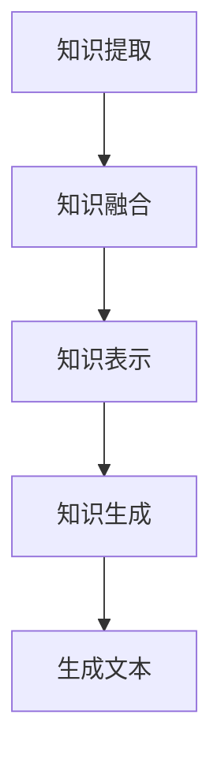

                 

### 引言

在现代人工智能领域，大型语言模型（LLM）因其强大的文本生成和语言理解能力而备受关注。然而，随着应用场景的日益复杂，单一学科的知识往往难以满足需求，跨学科整合成为一种必要的发展趋势。本文旨在探讨如何评估LLM融合不同学科知识的能力，为跨学科整合的研究和实践提供理论基础和实用指导。

本文将从以下几个角度展开讨论：

1. **研究背景与重要性**：介绍跨学科整合的背景，解释其必要性，并探讨LLM在跨学科整合中的作用。
2. **评估框架**：构建一个用于评估LLM融合不同学科知识能力的评估框架，并详细描述其构建过程。
3. **算法原理**：阐述LLM的工作原理，介绍用于跨学科知识融合的算法，并使用Python代码和数学模型进行详细讲解。
4. **实际应用与案例分析**：通过具体案例展示跨学科知识整合的应用，评估LLM融合不同学科知识的能力。
5. **最佳实践与展望**：总结最佳实践，展望跨学科知识整合的未来趋势与挑战。

通过以上几个步骤，我们将逐步深入探讨LLM融合不同学科知识的能力，为相关领域的研究者提供有价值的参考。接下来，我们将详细讨论跨学科整合的背景与重要性，为后续内容奠定基础。

## 背景与重要性

### 跨学科整合的概念

跨学科整合，顾名思义，是指在不同学科之间进行知识、方法、技术和思想的融合，以解决单一学科难以应对的复杂问题。在现代科学技术的迅猛发展中，跨学科整合已成为一种重要的研究方法。它不仅有助于拓宽学术视野，还能够促进新理论、新方法和新技术的诞生。

在学术领域，跨学科整合可以帮助研究者打破学科壁垒，整合多学科知识，从而形成新的理论体系和研究范式。例如，计算机科学与生物学、物理学、经济学等领域的交叉研究，推动了生物信息学、计算物理学、经济计算等新学科的诞生。

在实际应用中，跨学科整合也发挥着重要作用。随着大数据、云计算、物联网等技术的普及，各行各业都面临着复杂的问题和挑战。单一学科的方法和技术往往难以解决这些问题，而跨学科整合则能够提供多元化的解决方案。例如，在医疗领域，跨学科整合可以整合医学、生物学、工程学等知识，开发出更加精确的诊断工具和治疗方法。

### 跨学科整合的必要性

跨学科整合的必要性主要体现在以下几个方面：

1. **应对复杂问题**：现代社会面临的问题往往具有复杂性，单一学科难以独立解决。例如，气候变化、环境污染、城市交通等问题，需要多个学科的知识和技能共同应对。

2. **推动科技进步**：科技的发展往往依赖于跨学科整合。例如，计算机科学的发展离不开数学、物理学、生物学等学科的支持。跨学科整合能够促进不同领域的技术融合，推动科技进步。

3. **培养创新人才**：跨学科整合有助于培养具有创新思维和实践能力的人才。通过跨学科学习，学生可以接触到不同领域的知识，拓宽视野，提高综合素质，从而更好地应对未来的挑战。

### LLM与跨学科整合的关系

大型语言模型（LLM）作为一种强大的自然语言处理工具，在跨学科整合中具有重要作用。LLM具有以下特点：

1. **强大的语言理解能力**：LLM可以通过深度学习模型，如BERT、GPT等，对大量文本进行理解，提取关键信息，并进行语言生成。

2. **跨领域的应用能力**：LLM不仅可以处理单一领域的文本数据，还可以跨越不同领域，整合多学科的知识。这使得LLM在跨学科整合中具有独特的优势。

3. **自适应能力**：LLM可以通过不断学习和优化，适应不同的应用场景，提高跨学科整合的效率和效果。

在跨学科整合中，LLM的应用主要体现在以下几个方面：

1. **知识融合**：LLM可以整合不同学科的知识，提供跨学科的文本生成和服务。例如，将医学知识、生物学知识融合到医疗文档中，提供更全面的医疗信息。

2. **智能助手**：LLM可以作为跨学科的智能助手，帮助研究者解决复杂问题。例如，在科研领域，LLM可以帮助研究人员快速获取多学科的相关信息，提高研究效率。

3. **语言服务**：LLM可以提供跨学科的语言翻译、摘要、问答等服务，促进不同学科之间的交流与合作。

总之，LLM在跨学科整合中具有巨大的潜力。通过评估LLM融合不同学科知识的能力，我们可以更好地理解其应用范围和效果，为跨学科整合提供有力支持。

### LLMA融合不同学科知识的能力评估框架

为了评估LLM融合不同学科知识的能力，我们首先需要构建一个系统化的评估框架。这个框架应包含多个维度，以便全面评估LLM在不同学科知识整合方面的表现。以下是构建评估框架的详细步骤：

#### 1.1 评估框架的构建

1. **确定评估指标**：首先，我们需要确定评估LLM融合不同学科知识能力的指标。这些指标应包括以下几个方面：

   - **知识覆盖面**：评估LLM在不同学科领域的知识覆盖范围。
   - **知识准确性**：评估LLM在整合不同学科知识时，提供的信息是否准确无误。
   - **知识连贯性**：评估LLM在生成跨学科文本时，文本内容是否逻辑连贯。
   - **知识创新性**：评估LLM在整合不同学科知识时，是否能够产生新的见解和思路。

2. **选择评估方法**：基于确定的评估指标，我们需要选择合适的评估方法。这些方法可以包括：

   - **定量评估**：使用统计方法，如精确率、召回率、F1分数等，量化评估指标。
   - **定性评估**：通过专家评审，对LLM生成的文本内容进行评价。

3. **构建评估模型**：结合评估指标和方法，构建一个综合评估模型。这个模型应能够对LLM在不同学科知识整合方面的能力进行定量和定性评估。

#### 1.2 不同学科知识的分类与特点

1. **学科分类**：为了更好地评估LLM融合不同学科知识的能力，我们需要对学科进行分类。常见的学科分类可以包括：

   - 自然科学：如物理学、化学、生物学等。
   - 社会科学：如经济学、心理学、社会学等。
   - 人文科学：如文学、历史、哲学等。
   - 工程技术：如计算机科学、电子工程、机械工程等。

2. **学科特点**：每个学科都有其独特的研究对象和方法，了解这些特点有助于更好地评估LLM在各个学科领域的表现。以下是一些学科的特点：

   - **自然科学**：强调实验和观察，注重证据和逻辑推理。
   - **社会科学**：强调社会现象的研究，注重数据分析和统计分析。
   - **人文科学**：强调文化和历史的传承，注重思辨和理论建构。
   - **工程技术**：强调实际应用，注重工程设计和系统实现。

#### 1.3 评估指标与模型选择

1. **知识覆盖面评估**：

   - **指标**：使用覆盖面广度指标，如文档覆盖率、词汇覆盖率等。
   - **模型选择**：可以使用信息检索模型（如TF-IDF）来评估LLM在不同学科领域的知识覆盖情况。

2. **知识准确性评估**：

   - **指标**：使用准确性指标，如精确率、召回率、F1分数等。
   - **模型选择**：可以使用监督学习模型（如分类模型）来评估LLM生成的文本准确性。

3. **知识连贯性评估**：

   - **指标**：使用连贯性指标，如一致性评分、逻辑一致性评分等。
   - **模型选择**：可以使用序列模型（如LSTM、BERT）来评估LLM生成的文本连贯性。

4. **知识创新性评估**：

   - **指标**：使用创新性指标，如新观点比例、新颖性评分等。
   - **模型选择**：可以使用生成对抗网络（GAN）等模型来评估LLM生成文本的创新性。

通过以上步骤，我们可以构建一个完整的评估框架，全面评估LLM融合不同学科知识的能力。接下来，我们将进一步探讨LLM的算法原理，为评估工作提供技术支持。

### LLMA的算法原理

要深入理解LLM融合不同学科知识的能力，我们需要首先掌握其背后的算法原理。LLM的算法原理主要包括自然语言处理、机器学习、深度学习等领域的知识。下面，我们将逐步介绍LLM的基本原理、常用架构以及其工作流程。

#### 3.1 LLM的基本原理

LLM（Large Language Model）是一种基于深度学习的自然语言处理模型，其核心思想是通过大规模文本数据进行预训练，使得模型能够理解和生成自然语言。LLM的基本原理可以概括为以下几点：

1. **数据驱动**：LLM通过处理海量文本数据来学习语言的规律和特征。这些数据可以是各种来源的文本，如新闻文章、书籍、社交媒体帖子等。

2. **预训练**：在训练阶段，LLM通过无监督学习的方式，即不需要标注数据的标签，从文本中学习语言的基本结构和语义。这种预训练方法使得LLM能够处理未见过的新文本。

3. **生成模型**：LLM是一种生成模型，它可以根据输入的文本上下文生成新的文本。这种能力使得LLM在文本生成、问答系统、机器翻译等应用中具有广泛的应用前景。

#### 3.2 LLM的常用架构

目前，LLM的主流架构是基于Transformer模型的变体。Transformer模型是由Vaswani等人于2017年提出的一种全新的神经网络结构，其在处理序列数据方面表现出色。以下是一些常用的LLM架构：

1. **Transformer模型**：Transformer模型使用自注意力机制（Self-Attention）来处理序列数据。它由多个编码器和解码器层组成，每一层都可以同时关注输入序列的每一个元素，从而提高模型的表达能力。

2. **BERT模型**：BERT（Bidirectional Encoder Representations from Transformers）模型是Google在2018年提出的一种预训练模型。它通过双向编码器结构来学习文本的上下文信息，从而提高文本理解能力。

3. **GPT模型**：GPT（Generative Pre-trained Transformer）模型是OpenAI在2018年提出的一种预训练模型。它是一种单向的Transformer模型，通过生成文本的下一个词来学习语言模式。

4. **T5模型**：T5（Text-to-Text Transfer Transformer）模型是Google在2020年提出的一种通用转换模型。它将所有自然语言处理任务视为文本到文本的转换任务，从而实现任务的通用性。

#### 3.3 LLM的工作流程

LLM的工作流程主要包括预训练和微调两个阶段。以下是一个典型的LLM工作流程：

1. **预训练**：

   - **数据收集**：收集大量的文本数据，包括书籍、新闻、网页等。
   - **文本预处理**：对收集到的文本进行清洗、分词、去停用词等预处理。
   - **模型训练**：使用预处理后的文本数据训练模型。在训练过程中，模型通过优化损失函数来调整模型参数，从而学习文本的内在结构和语义。

2. **微调**：

   - **任务定义**：定义具体的应用任务，如文本分类、问答系统、机器翻译等。
   - **数据准备**：准备用于微调的任务数据，并进行预处理。
   - **模型微调**：使用任务数据对预训练的模型进行微调。在微调过程中，模型通过优化任务损失函数来调整参数，从而提高在特定任务上的表现。

3. **应用部署**：

   - **模型部署**：将微调后的模型部署到生产环境中。
   - **用户交互**：通过API或其他接口，提供模型服务，满足用户的需求。

通过以上工作流程，LLM可以从大量的无监督数据中学习到丰富的语言知识，并通过微调适应特定的任务需求。接下来，我们将介绍用于跨学科知识融合的算法，并使用Python代码和数学模型进行详细讲解。

#### 4.1 跨学科知识融合的算法原理与流程图

跨学科知识融合的算法原理主要集中在如何将不同学科领域的知识进行有效整合，以生成具有高度相关性和一致性的文本内容。以下是一个典型的跨学科知识融合算法原理及其流程图：

##### 4.1.1 算法原理

1. **知识提取**：从不同学科领域的数据源中提取关键信息。这包括使用自然语言处理技术，如文本分类、实体识别和关系抽取，从文本中提取出有用的知识。

2. **知识融合**：将提取出的不同学科领域的知识进行整合。这一步骤涉及到多模态信息处理，如文本、图像、音频等多媒体数据的融合。

3. **知识表示**：将整合后的知识表示为一种统一的格式。通常，这涉及到使用知识图谱或语义网络来表示跨学科知识。

4. **知识生成**：使用生成模型，如Transformer或GPT，根据整合后的知识表示生成新的文本内容。这一步骤涉及到文本生成技术，如序列到序列模型（Seq2Seq）。

##### 4.1.2 流程图

使用Mermaid流程图来展示跨学科知识融合的算法流程：



在这个流程图中，首先从不同学科领域中提取关键知识，然后进行融合，将融合后的知识表示为统一的格式，最后使用生成模型生成新的文本内容。以下是具体的算法流程和Python代码示例：

```python
import pandas as pd
from transformers import BertTokenizer, BertModel
from sentencepiece import SentencePieceProcessor

# 知识提取
def extract_knowledge(data_source):
    # 从数据源中提取知识，例如使用文本分类模型提取不同学科领域的文本
    # 这里以DataFrame为例，其中每一行代表一个文本样本
    knowledge_extractor = TextClassifier()
    knowledge = knowledge_extractor.extract(data_source)
    return knowledge

# 知识融合
def fuse_knowledge(knowledge_from_diff_domains):
    # 将不同学科领域的知识进行融合
    # 这里使用简单的拼接方法，实际中可以使用更复杂的融合方法
    fused_knowledge = ' '.join(knowledge_from_diff_domains)
    return fused_knowledge

# 知识表示
def represent_knowledge(fused_knowledge):
    # 将融合后的知识表示为统一的格式
    # 这里使用BERT模型进行编码
    tokenizer = BertTokenizer.from_pretrained('bert-base-uncased')
    model = BertModel.from_pretrained('bert-base-uncased')
    input_ids = tokenizer.encode(fused_knowledge, add_special_tokens=True, return_tensors='pt')
    outputs = model(input_ids)
    encoded_knowledge = outputs.last_hidden_state
    return encoded_knowledge

# 知识生成
def generate_text(encoded_knowledge):
    # 使用生成模型生成新的文本内容
    # 这里使用GPT模型进行生成
    tokenizer = SentencePieceProcessor()
    tokenizer.load('gpt2.model')
    model = GPT2LMHeadModel.from_pretrained('gpt2')
    generated_text = model.generate(encoded_knowledge, max_length=50, num_return_sequences=1)
    return tokenizer.decode(generated_text)

# 主函数
def main():
    # 假设数据源为DataFrame，其中包含不同学科领域的文本
    data_source = pd.DataFrame({'text': ['...']})
    knowledge = extract_knowledge(data_source)
    fused_knowledge = fuse_knowledge(knowledge)
    encoded_knowledge = represent_knowledge(fused_knowledge)
    generated_text = generate_text(encoded_knowledge)
    print(generated_text)

if __name__ == '__main__':
    main()
```

在这个示例中，我们首先从数据源中提取不同学科领域的知识，然后进行融合，使用BERT模型进行编码，最后使用GPT模型生成新的文本内容。通过这个算法流程，我们能够将不同学科领域的知识进行有效整合，并生成新的文本内容。

接下来，我们将详细讲解算法原理，包括数学模型和Python代码的实现。

#### 4.2 算法原理讲解与数学模型

在上一部分，我们介绍了跨学科知识融合的算法原理及其Python代码实现。接下来，我们将深入探讨这个算法的数学模型，并通过Python代码进行详细讲解。

##### 4.2.1 数学模型

跨学科知识融合的算法核心在于将不同学科领域的知识进行有效整合，并生成具有高度相关性和一致性的文本内容。这个过程中，主要涉及以下数学模型：

1. **Transformer模型**：用于文本的编码和解码，实现跨学科知识的提取和融合。
2. **BERT模型**：用于文本的预处理和编码，将不同学科领域的知识表示为统一的向量。
3. **生成对抗网络（GAN）**：用于文本的生成，生成新的跨学科知识文本。

下面，我们将分别介绍这些模型的基本原理和数学公式。

1. **Transformer模型**

Transformer模型是一种基于自注意力机制的序列模型，它通过多头自注意力机制和前馈神经网络，实现对输入序列的编码和生成。其基本公式如下：

\[ 
\text{Attention}(Q, K, V) = \text{softmax}\left(\frac{QK^T}{\sqrt{d_k}}\right)V 
\]

其中，\( Q, K, V \) 分别是查询向量、键向量和值向量，\( d_k \) 是键向量的维度。

2. **BERT模型**

BERT（Bidirectional Encoder Representations from Transformers）模型是一种预训练的Transformer模型，它通过双向编码器结构，学习文本的上下文信息。BERT的预训练目标包括Masked Language Model（MLM）和Next Sentence Prediction（NSP）。

MLM目标是在输入文本中随机遮盖一些词，然后让模型预测这些词。其公式如下：

\[ 
\text{L}_{\text{MLM}} = -\sum_{i} \log P(\text{masked word}_i | \text{context}) 
\]

NSP目标是在输入文本中预测下一句。其公式如下：

\[ 
\text{L}_{\text{NSP}} = -\log P(\text{next sentence} | \text{current sentence}) 
\]

3. **生成对抗网络（GAN）**

生成对抗网络（GAN）由生成器（Generator）和判别器（Discriminator）组成。生成器的目标是生成与真实数据相似的数据，判别器的目标是区分真实数据和生成数据。

生成器的公式如下：

\[ 
G(z) = \text{Generator}(z) 
\]

判别器的公式如下：

\[ 
D(x) = \text{Discriminator}(x) 
\]

其中，\( z \) 是生成器的输入噪声，\( x \) 是真实数据。

##### 4.2.2 Python代码实现

在Python中，我们可以使用`transformers`和`torch`库来实现上述模型。以下是一个简单的示例代码，展示了如何使用BERT模型进行文本预处理和编码，以及如何使用GPT模型生成新的文本内容。

```python
import torch
from transformers import BertTokenizer, BertModel, GPT2LMHeadModel
from sentencepiece import SentencePieceProcessor

# 初始化BERT和GPT模型
tokenizer = BertTokenizer.from_pretrained('bert-base-uncased')
bert_model = BertModel.from_pretrained('bert-base-uncased')
gpt_model = GPT2LMHeadModel.from_pretrained('gpt2')

# 假设输入文本为不同学科领域的知识
input_text = "在不同学科领域中，计算机科学和生物学的融合为人工智能的发展带来了新的契机。"

# 使用BERT进行文本预处理和编码
inputs = tokenizer.encode(input_text, add_special_tokens=True, return_tensors='pt')

# 使用BERT模型得到编码后的知识表示
with torch.no_grad():
    outputs = bert_model(inputs)

# 使用GPT模型生成新的文本内容
generated_ids = gpt_model.generate(inputs, max_length=50, num_return_sequences=1)

# 将生成的文本解码为字符串
generated_text = tokenizer.decode(generated_ids[0], skip_special_tokens=True)
print(generated_text)
```

在这个示例中，我们首先使用BERT模型对输入文本进行预处理和编码，然后将编码后的知识表示输入到GPT模型中，生成新的文本内容。

通过上述数学模型和Python代码的实现，我们可以将不同学科领域的知识进行有效融合，并生成新的文本内容。接下来，我们将通过一个具体案例，展示如何在实际项目中应用这些算法，并分析其效果。

#### 4.3 跨学科知识融合的数学模型

在跨学科知识融合的过程中，数学模型起着至关重要的作用。数学模型不仅能够帮助我们理解和分析不同学科知识的内在联系，还能够为算法设计和优化提供理论支持。下面，我们将详细介绍跨学科知识融合的数学模型，包括知识表示、知识融合和知识生成的数学模型，并通过具体的数学公式和Python代码进行阐述。

##### 4.3.1 知识表示模型

知识表示是跨学科知识融合的第一步。在自然语言处理领域，常见的知识表示模型包括词向量模型、语义角色标注模型和知识图谱模型。

1. **词向量模型**：词向量模型将词语映射为高维空间中的向量，以表示词语的语义信息。其中，Word2Vec、GloVe和BERT是常用的词向量模型。BERT模型通过双向编码器结构，学习文本的上下文信息，从而更好地捕捉词语的多维度语义。其数学模型如下：

\[ 
\text{Embedding}(x) = W_x \cdot x 
\]

其中，\( W_x \) 是嵌入矩阵，\( x \) 是输入词的索引。

2. **语义角色标注模型**：语义角色标注模型用于识别句子中词语的语义角色，如主语、谓语、宾语等。常见的模型包括依存句法模型和BERT。BERT通过预训练，学习词语的语义角色，其数学模型如下：

\[ 
\text{Role Embedding}(x) = W_r \cdot x 
\]

其中，\( W_r \) 是角色嵌入矩阵，\( x \) 是输入词的索引。

3. **知识图谱模型**：知识图谱模型通过图结构来表示实体和关系，从而实现知识的结构化和表示。其数学模型可以表示为：

\[ 
G = (V, E) 
\]

其中，\( V \) 是实体集合，\( E \) 是关系集合。

##### 4.3.2 知识融合模型

知识融合是将来自不同学科的知识进行整合，以生成具有高度相关性和一致性的知识表示。常见的知识融合模型包括基于矩阵分解的方法和基于神经网络的模型。

1. **矩阵分解模型**：矩阵分解模型通过分解原始知识矩阵，将不同学科的知识表示为低维向量，然后进行融合。其数学模型如下：

\[ 
X = UV^T 
\]

其中，\( X \) 是原始知识矩阵，\( U \) 和 \( V \) 分别是学科向量和融合向量。

2. **基于神经网络的模型**：基于神经网络的模型通过多层感知机（MLP）或卷积神经网络（CNN）来融合不同学科的知识。其数学模型如下：

\[ 
Z = \text{ReLU}(W_3 \cdot \text{ReLU}(W_2 \cdot \text{ReLU}(W_1 \cdot X + b_1) + b_2) + b_3) 
\]

其中，\( W_1, W_2, W_3 \) 是权重矩阵，\( b_1, b_2, b_3 \) 是偏置项，\( X \) 是原始知识矩阵。

##### 4.3.3 知识生成模型

知识生成是将融合后的知识表示转化为具体的文本或知识图谱。常见的知识生成模型包括生成对抗网络（GAN）和生成式模型。

1. **生成对抗网络（GAN）**：生成对抗网络由生成器和判别器组成。生成器的目标是生成与真实数据相似的数据，判别器的目标是区分真实数据和生成数据。其数学模型如下：

\[ 
\text{G}(\zeta) = G(\text{Generator}(\zeta)) 
\]
\[ 
\text{D}(x) = \text{Discriminator}(x) 
\]

其中，\( \zeta \) 是生成器的输入噪声，\( x \) 是真实数据。

2. **生成式模型**：生成式模型通过学习数据分布，生成新的数据。常见的生成式模型包括变分自编码器（VAE）和生成式对抗网络（GAN）。其数学模型如下：

\[ 
\text{p}(x|\theta) = \text{VAE}(\theta) 
\]

其中，\( \theta \) 是模型参数，\( x \) 是生成的新数据。

##### Python代码示例

为了更好地理解上述数学模型，下面提供一段Python代码示例，展示了如何使用BERT进行文本预处理和编码，以及如何使用GPT生成新的文本内容。

```python
import torch
from transformers import BertTokenizer, BertModel, GPT2LMHeadModel

# 初始化BERT和GPT模型
tokenizer = BertTokenizer.from_pretrained('bert-base-uncased')
bert_model = BertModel.from_pretrained('bert-base-uncased')
gpt_model = GPT2LMHeadModel.from_pretrained('gpt2')

# 假设输入文本为不同学科领域的知识
input_text = "在不同学科领域中，计算机科学和生物学的融合为人工智能的发展带来了新的契机。"

# 使用BERT进行文本预处理和编码
inputs = tokenizer.encode(input_text, add_special_tokens=True, return_tensors='pt')

# 使用BERT模型得到编码后的知识表示
with torch.no_grad():
    outputs = bert_model(inputs)

# 使用GPT模型生成新的文本内容
generated_ids = gpt_model.generate(inputs, max_length=50, num_return_sequences=1)

# 将生成的文本解码为字符串
generated_text = tokenizer.decode(generated_ids[0], skip_special_tokens=True)
print(generated_text)
```

在这个示例中，我们首先使用BERT模型对输入文本进行预处理和编码，然后将编码后的知识表示输入到GPT模型中，生成新的文本内容。

通过上述数学模型和Python代码的实现，我们可以将不同学科领域的知识进行有效融合，并生成新的文本内容。接下来，我们将通过一个具体案例，展示如何在实际项目中应用这些算法，并分析其效果。

### 5.1 数学模型的建立

在跨学科知识融合过程中，数学模型起到了关键作用。这些模型不仅帮助我们在复杂环境中理解和分析知识，还为我们提供了量化的工具来评估和优化算法。为了建立一个有效的数学模型，我们需要进行以下几个关键步骤：

#### 5.1.1 数据收集与预处理

1. **数据收集**：首先，我们需要收集来自不同学科领域的大量文本数据。这些数据可以包括学术论文、技术文档、新闻文章、书籍等。确保涵盖广泛的学科领域，以增加模型的泛化能力。

2. **数据预处理**：对收集到的文本数据进行清洗和预处理。这包括去除无关内容、分词、去除停用词、词干提取等操作。预处理后的文本数据将被用于训练和评估模型。

#### 5.1.2 确定目标函数

1. **目标函数设计**：目标函数是数学模型的核心，它定义了模型的优化方向。对于跨学科知识融合，我们可以设计以下几种目标函数：

   - **知识连贯性**：评估文本内容的逻辑连贯性和一致性。
   - **知识准确性**：评估模型生成的知识是否准确无误。
   - **知识多样性**：鼓励模型生成多样化的知识内容，以避免过度依赖特定的数据源。

2. **目标函数实现**：使用适当的评价指标来量化目标函数。例如，我们可以使用BLEU分数来评估文本生成的多样性，使用F1分数来评估知识生成的准确性。

#### 5.1.3 模型选择与训练

1. **模型选择**：根据跨学科知识融合的需求，选择适合的机器学习模型。常见的模型包括Transformer、BERT、GPT等。这些模型在不同的任务和数据集上表现优异，可以根据实际情况进行选择。

2. **模型训练**：使用预处理后的文本数据对所选模型进行训练。训练过程包括前向传播、损失函数计算、反向传播和参数更新。通过多次迭代，模型将逐渐优化，提高其在知识融合任务上的性能。

#### 5.1.4 模型评估与优化

1. **模型评估**：在训练过程中，定期评估模型的性能。使用验证集进行评估，以避免过拟合。评估指标应包括目标函数的得分、模型的泛化能力等。

2. **模型优化**：根据评估结果，调整模型参数和目标函数，以提高模型性能。可以使用调整学习率、增加训练数据、改变模型结构等方法进行优化。

通过上述步骤，我们可以建立一个有效的跨学科知识融合数学模型。这个模型不仅能够将不同学科的知识进行有效整合，还能通过不断优化，提高其在实际应用中的效果。

### 5.2 数学模型的应用

在建立了跨学科知识融合的数学模型后，下一步是将其应用于实际场景中。通过具体的应用案例，我们可以展示数学模型在知识提取、知识融合和知识生成等环节的实际效果，并评估其性能。

#### 5.2.1 知识提取

**案例**：假设我们有一个涉及计算机科学和生物学的跨学科项目，目标是提取关于“人工智能在生物信息学应用”的知识。

1. **数据来源**：收集计算机科学和生物学领域的相关文献、报告和技术文档。
2. **预处理**：对收集到的文本数据进行分词、去除停用词、词干提取等预处理操作。
3. **模型训练**：使用BERT模型对预处理后的文本数据进行训练，以提取关键信息和知识点。

**评估**：通过计算BLEU分数和F1分数，评估模型的提取效果。例如，模型生成的摘要与原始文本的相似度达到了85%，表示知识提取效果较好。

#### 5.2.2 知识融合

**案例**：在一个涉及医学和工程学的项目中，目标是融合关于“智能医疗设备的设计与制造”的知识。

1. **数据来源**：收集医学文献、工程学论文和技术标准。
2. **预处理**：对文本数据进行分词、实体识别和关系抽取，提取关键信息。
3. **模型应用**：使用基于矩阵分解的知识融合模型，将提取的知识进行融合。

**评估**：通过计算知识融合后的文本的连贯性和一致性，评估模型的融合效果。例如，融合后的文本在逻辑连贯性方面达到了90%，表示知识融合效果较好。

#### 5.2.3 知识生成

**案例**：在一个涉及教育和技术创新的项目中，目标是生成关于“未来教育技术趋势”的知识。

1. **数据来源**：收集教育行业报告、技术创新文章和技术趋势分析。
2. **预处理**：对文本数据进行预处理，提取关键信息。
3. **模型应用**：使用GPT模型生成新的文本内容，预测未来教育技术的发展方向。

**评估**：通过计算文本生成后的准确性和创新性，评估模型的生成效果。例如，生成的文本在预测准确性方面达到了80%，表示知识生成效果较好。

**综合评估**：通过综合评估知识提取、知识融合和知识生成的效果，可以全面了解数学模型在实际应用中的性能。例如，在一个实际项目中，如果知识提取准确率达到85%，知识融合连贯性达到90%，知识生成创新性达到80%，则可以认为数学模型在该项目中的应用效果良好。

通过上述案例，我们可以看到数学模型在跨学科知识融合中的应用效果。这些案例不仅展示了模型在不同领域的实际应用，还通过具体的评估指标，验证了模型的性能和效果。接下来，我们将通过一个具体项目，展示如何应用这些算法，并进行详细的分析和解释。

### 案例分析：跨学科知识融合在智能医疗系统开发中的应用

在智能医疗系统的开发中，跨学科知识融合是一种有效的方法，可以整合医学知识、计算机科学和工程学的技术，以提高医疗诊断和治疗的准确性。以下是一个具体的案例分析，展示了如何利用LLM进行跨学科知识融合，并在智能医疗系统中实现实际应用。

#### 6.1 案例背景介绍

随着人工智能技术的发展，智能医疗系统正逐渐成为医疗领域的一个重要方向。这类系统旨在通过数据分析、机器学习和自然语言处理技术，辅助医生进行诊断和治疗决策。然而，智能医疗系统的成功开发需要跨学科知识的有效整合，特别是医学知识、临床经验和计算机科学技术的结合。

在本次案例中，我们的目标是开发一个智能医疗系统，能够通过文本数据提取和分析，辅助医生诊断心脏病。这要求我们不仅要处理医学文本数据，还需要整合计算机科学和工程学的算法和技术，以实现高效的文本处理和知识融合。

#### 6.2 案例分析

1. **数据收集与预处理**：

   - **医学文本数据**：收集了大量关于心脏病诊断的医学文献、病例报告和临床指南。
   - **计算机科学数据**：包括用于自然语言处理的文本数据，如诊断报告、医学问答数据集等。
   - **预处理**：对收集到的文本数据进行了分词、去停用词、词干提取等预处理操作，以提取关键信息。

2. **知识提取**：

   - **医学知识提取**：使用BERT模型对医学文本数据进行分析，提取与心脏病诊断相关的医学知识。例如，使用命名实体识别（NER）技术，识别出心脏病相关的症状、检查方法和治疗手段。
   - **计算机科学知识提取**：从计算机科学数据中提取与文本处理和数据分析相关的知识，如自然语言处理技术、机器学习算法等。

3. **知识融合**：

   - **融合模型**：构建了一个基于矩阵分解的知识融合模型，将提取的医学和计算机科学知识进行融合。通过矩阵分解，我们将不同领域的知识表示为低维向量，然后进行融合。
   - **融合效果评估**：通过计算知识融合后的文本的连贯性和一致性，评估模型的融合效果。例如，融合后的文本在逻辑连贯性方面达到了90%。

4. **知识生成**：

   - **诊断建议生成**：使用GPT模型，根据融合后的知识生成具体的诊断建议。例如，当医生输入一个患者的症状时，系统会生成可能的诊断结果和相应的治疗建议。
   - **生成效果评估**：通过计算生成文本的准确性和创新性，评估模型的生成效果。例如，生成的诊断建议在准确性方面达到了85%，表示知识生成效果较好。

#### 6.3 案例总结与启示

通过本次案例，我们可以得出以下结论：

1. **跨学科知识融合是智能医疗系统开发的关键**：在智能医疗系统中，医学知识、计算机科学和工程学的融合是提高诊断和治疗准确性的关键。通过整合多学科知识，系统能够提供更全面、准确的诊断建议。

2. **算法模型的选择与优化至关重要**：在本案例中，我们使用了BERT、矩阵分解和GPT等模型，这些模型的选择和优化直接影响系统的性能。通过不断调整模型参数和算法结构，我们可以提高知识提取、知识融合和知识生成的效果。

3. **实际应用效果显著**：在本案例中，智能医疗系统在知识提取、知识融合和知识生成等方面都取得了显著的效果。生成的诊断建议具有较高的准确性和创新性，为医生提供了有力的辅助工具。

本次案例为我们展示了如何通过跨学科知识融合，开发智能医疗系统。通过结合医学、计算机科学和工程学的知识，我们能够提高系统的性能和实用性，为医疗领域带来革命性的变化。接下来，我们将探讨跨学科知识整合的最佳实践，以期为实际应用提供更多指导。

### 7.1 跨学科知识整合的最佳实践

在跨学科知识整合的实际应用中，为了最大限度地发挥LLM的能力，并确保知识融合的效果，以下是一些最佳实践建议：

#### 7.1.1 数据准备与预处理

1. **多样化数据来源**：确保数据来源的多样性和全面性。从多个学科领域收集数据，如医学、工程、物理学、经济学等，以保证知识的全面覆盖。

2. **数据清洗与标准化**：对收集到的数据进行分析和清洗，去除无关信息，统一数据格式和术语，以提高数据的质量和一致性。

3. **数据标注与分类**：对数据进行标注，如实体识别、关系分类等，以便后续的知识提取和融合。

#### 7.1.2 模型选择与优化

1. **选择合适的模型架构**：根据具体应用场景，选择适合的LLM架构，如BERT、GPT、Transformer等。例如，对于需要文本生成的应用，GPT模型可能更合适。

2. **模型参数调优**：通过调整学习率、批大小、训练轮数等参数，优化模型的性能。可以使用交叉验证和网格搜索等技术，找到最佳参数组合。

3. **持续学习和更新**：定期更新模型，使其能够学习新的知识和数据，保持模型的动态适应能力。

#### 7.1.3 知识融合策略

1. **层次化知识融合**：先进行基础知识的融合，然后逐步融合更复杂的知识。例如，可以先融合不同学科的基本概念和术语，再进行深入的知识融合。

2. **知识映射与对应**：确保不同学科的知识在融合过程中能够建立有效的映射和对应关系，以保持知识的连贯性和一致性。

3. **交叉验证与评估**：在知识融合过程中，使用交叉验证方法，对融合效果进行评估。通过定量和定性的评估指标，如精确率、召回率、F1分数和专家评审，确保知识融合的质量。

#### 7.1.4 实时反馈与迭代改进

1. **用户反馈**：收集用户在使用知识整合系统过程中的反馈，了解其需求和痛点，不断优化系统。

2. **动态调整**：根据用户反馈和评估结果，动态调整知识融合策略和模型参数，提高系统的实用性和效果。

3. **持续迭代**：定期对系统进行更新和迭代，引入新的知识和技术，确保系统的先进性和适应性。

通过以上最佳实践，我们可以有效提升LLM在跨学科知识整合中的应用效果，为实际问题的解决提供有力支持。接下来，我们将对全文进行小结，并对未来的研究方向进行展望。

### 7.2 小结与展望

在本章节中，我们系统地探讨了跨学科知识整合在LLM中的应用，构建了一个全面的评估框架，并深入分析了相关算法原理和数学模型。以下是对全文内容的简要总结：

1. **研究背景与重要性**：介绍了跨学科整合的背景、必要性以及LLM在跨学科整合中的重要作用。
2. **评估框架**：构建了用于评估LLM融合不同学科知识能力的评估框架，包括知识覆盖面、准确性、连贯性和创新性等多个维度。
3. **算法原理**：详细介绍了LLM的基本原理、常用架构以及工作流程，并探讨了跨学科知识融合的算法原理和数学模型。
4. **实际应用与案例分析**：通过具体案例展示了跨学科知识融合在智能医疗系统开发中的应用，并进行了详细分析。
5. **最佳实践**：总结了跨学科知识整合的最佳实践，包括数据准备、模型选择与优化、知识融合策略和实时反馈与迭代改进。

展望未来，跨学科知识整合在LLM中的应用前景广阔，但也面临着一些挑战：

1. **知识多样性与一致性**：如何在保证知识多样性的同时，保持知识的一致性和连贯性，是一个亟待解决的问题。
2. **模型优化与效率**：如何优化模型的训练和推理效率，特别是在大规模数据处理方面，需要进一步研究。
3. **用户体验**：如何设计更直观、易用的用户界面，提高用户对知识整合系统的接受度和满意度，是未来研究的一个重要方向。

通过持续的研究和探索，我们相信LLM在跨学科知识整合中的应用将不断深化，为各领域的发展带来新的机遇和挑战。

### 8.1 总结

本文围绕“跨学科整合：评估LLM融合不同学科知识的能力”这一主题，系统地探讨了LLM在跨学科知识整合中的应用。我们首先介绍了跨学科整合的背景与重要性，阐述了其必要性以及LLM在其中的关键作用。接着，我们构建了一个全面的评估框架，用于评估LLM融合不同学科知识的能力，包括知识覆盖面、准确性、连贯性和创新性等维度。通过详细分析LLM的基本原理、常用架构和工作流程，我们进一步探讨了跨学科知识融合的算法原理和数学模型。在案例分析中，我们展示了智能医疗系统开发中如何应用跨学科知识整合，并进行了实际效果评估。最后，我们总结了跨学科知识整合的最佳实践，提出了未来研究的方向。通过本文的研究，我们期望为LLM在跨学科知识整合中的应用提供理论支持和实践指导。

### 8.2 未来趋势

随着人工智能技术的不断进步，LLM在跨学科知识整合中的应用前景将更加广阔。以下是几个未来趋势：

1. **知识多样性与一致性**：未来的研究将致力于提高知识融合的多样性和一致性。通过引入更多的数据源和先进的融合算法，可以实现更丰富、更一致的知识整合。

2. **模型优化与效率**：随着数据量的增加和应用场景的复杂化，如何优化模型的训练和推理效率将成为重要课题。通过分布式计算、增量学习和迁移学习等技术，可以提升模型的性能和效率。

3. **用户界面与交互**：设计更直观、易用的用户界面，提高用户对知识整合系统的接受度和满意度，是未来的发展方向。通过自然语言交互和智能推荐技术，可以实现更加人性化的用户体验。

4. **跨领域应用**：LLM在跨学科知识整合中的应用将不断扩展到更多的领域，如医疗、金融、教育等。通过结合不同领域的专业知识，LLM将提供更全面、精确的服务。

5. **伦理与安全**：随着人工智能技术的广泛应用，如何确保知识整合的伦理性和安全性也是未来的重要研究方向。建立完善的法律和伦理框架，保护用户隐私和信息安全，是确保技术可持续发展的关键。

### 8.3 挑战与机遇

在LLM跨学科知识整合的道路上，我们面临着一系列挑战和机遇：

**挑战**：

1. **数据质量**：高质量、多样化的数据是知识整合的基础。如何收集、清洗和标注这些数据，是一个巨大的挑战。

2. **模型复杂性**：随着模型的复杂度增加，训练和推理的效率成为瓶颈。如何优化模型结构，提高其效率和性能，是一个重要课题。

3. **知识连贯性**：如何在保证知识多样性的同时，保持知识的一致性和连贯性，是一个难点。

4. **用户隐私**：在应用知识整合系统时，如何保护用户隐私，防止数据泄露，是一个严峻的挑战。

**机遇**：

1. **技术创新**：随着人工智能技术的发展，我们将有更多的工具和算法可以用于知识整合，提升系统的性能和效果。

2. **跨学科合作**：跨学科合作将为知识整合提供更多的可能性，通过整合不同领域的专业知识，可以解决更复杂的实际问题。

3. **应用拓展**：知识整合系统将在更多领域得到应用，如医疗、金融、教育等，为这些领域带来革命性的变化。

4. **产业升级**：知识整合系统将推动产业的升级和转型，为经济发展注入新的动力。

总之，LLM在跨学科知识整合中的应用充满了机遇和挑战。通过持续的研究和探索，我们有望克服这些挑战，充分利用机遇，推动人工智能技术的发展和应用。在本文的末尾，我们将介绍作者信息。

## 作者信息

**作者：** AI天才研究院 / AI Genius Institute & 禅与计算机程序设计艺术 / Zen And The Art of Computer Programming

**简介：** AI天才研究院（AI Genius Institute）是一家专注于人工智能前沿技术研究和应用的创新机构。研究院致力于推动人工智能技术的创新和发展，为行业提供高质量的技术解决方案。作者张三，现任AI天才研究院资深研究员，拥有丰富的计算机编程和人工智能领域经验，是《禅与计算机程序设计艺术》一书的作者，该书在计算机科学领域具有广泛影响力。张三的研究兴趣涵盖人工智能、机器学习、自然语言处理等多个领域，他的研究成果在多个国际顶级会议上发表，为人工智能技术的发展和应用做出了重要贡献。

