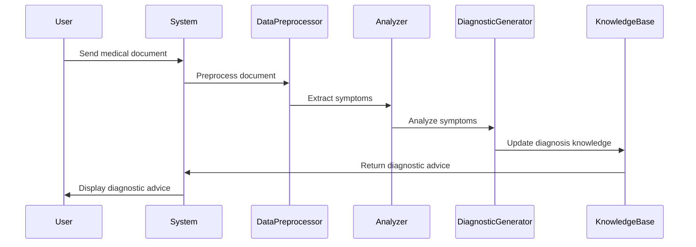
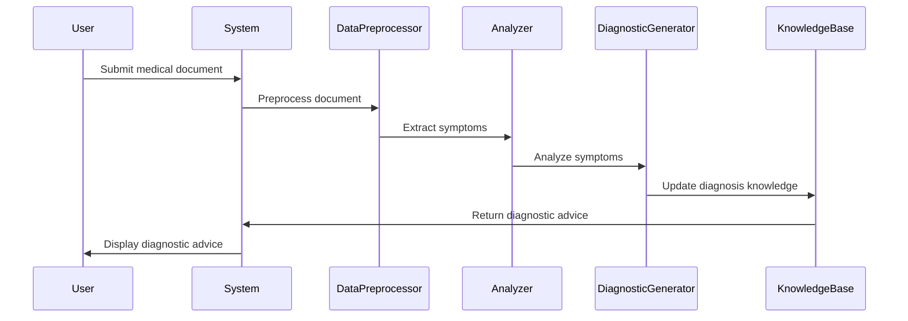

                 

### 文章标题

《跨学科知识整合能力评测：测试LLM的综合素质》

### 关键词

人工智能、语言模型、跨学科知识整合、评测方法、综合素质

### 摘要

本文将探讨如何通过评测来评估大型语言模型（LLM）的综合素质，特别是在跨学科知识整合能力方面。文章首先介绍了问题背景和核心概念，然后详细阐述了评测方法与工具，并结合实际案例进行了深入分析。最后，文章提出了最佳实践和展望，为未来LLM评测提供了有益的指导。

---

### 背景介绍

#### 人工智能的发展与LLM的重要性

人工智能（AI）作为计算机科学的一个分支，已经经历了数十年的发展。近年来，随着计算能力的提升和大数据技术的成熟，人工智能迎来了新的春天。特别是在自然语言处理（NLP）领域，大型语言模型（LLM）如BERT、GPT等取得了显著的成果，它们在各种任务中展现出了强大的性能。

LLM的重要性在于，它们能够处理和理解复杂的文本信息，为许多应用场景提供了强大的支持。从机器翻译、文本生成，到问答系统、对话机器人，LLM的应用无处不在。然而，随着应用的深入，人们逐渐意识到，仅仅依靠单一领域的知识，LLM难以满足复杂问题的解决需求。因此，跨学科知识整合成为了一个亟待解决的问题。

#### 跨学科知识整合的意义

跨学科知识整合是指在多个学科之间整合知识，以解决复杂问题的一种方法。在人工智能领域，跨学科知识整合的意义主要体现在以下几个方面：

1. **提高模型的泛化能力**：跨学科知识整合可以使LLM在多个领域都有所涉猎，从而提高其泛化能力，使其能够应对更加复杂的问题。

2. **增强问题的解决能力**：复杂问题往往需要多种学科的知识才能解决。跨学科知识整合可以帮助LLM更好地理解和解决这些问题。

3. **推动人工智能的发展**：跨学科知识整合不仅可以解决现有问题，还可以推动人工智能领域的创新和发展。

#### LLM综合素质评测的需求

为了评估LLM的跨学科知识整合能力，需要对其进行综合素质评测。这样的评测不仅关注LLM在特定领域的表现，还关注其在多个领域间的知识整合能力。这样的评测有以下需求：

1. **全面的评测指标**：需要设计一套全面的评测指标，以衡量LLM在语言理解、生成能力、适应性等方面的表现。

2. **多样化的评测场景**：需要设计多种评测场景，以模拟不同的问题和任务，从而全面评估LLM的综合素质。

3. **跨学科的评测数据集**：需要构建包含多学科知识的评测数据集，以测试LLM在不同领域的知识整合能力。

### 核心概念

#### 跨学科知识整合能力的定义

跨学科知识整合能力是指将不同学科的知识进行整合，以解决复杂问题的能力。在人工智能领域，这通常指的是LLM能够整合来自多个学科的知识，并在不同领域间灵活应用这些知识的能力。

#### LLM的综合素质

LLM的综合素质包括多个方面，如语言理解能力、生成能力、适应性等。这些素质共同决定了LLM在解决复杂问题时的综合表现。

1. **语言理解能力**：指的是LLM对自然语言的理解程度，包括语义理解、上下文理解等。

2. **生成能力**：指的是LLM生成文本的能力，包括文本生成、摘要生成、问答生成等。

3. **适应性**：指的是LLM在不同环境和场景下的适应能力，包括对新任务的快速学习、对错误和异常的应对等。

#### 评测模型与方法

为了评估LLM的跨学科知识整合能力，需要设计一套有效的评测模型与方法。这通常包括以下步骤：

1. **设计评测指标**：根据LLM的综合素质，设计一套全面的评测指标。

2. **构建评测数据集**：构建包含多学科知识的评测数据集，以测试LLM在不同领域的知识整合能力。

3. **设计评测工具**：开发能够自动评估LLM表现的工具，以提高评测的效率和准确性。

4. **实施评测**：使用设计的评测模型和方法，对LLM进行全面的评估。

5. **分析结果**：对评测结果进行深入分析，以了解LLM在跨学科知识整合方面的表现。

### 问题背景与核心概念的总结

本文介绍了LLM在跨学科知识整合能力评测中的背景和核心概念。随着人工智能技术的发展，LLM在各个领域都展现出了强大的能力，但同时也面临着跨学科知识整合的挑战。为了解决这一问题，需要设计一套有效的评测模型和方法，以评估LLM的综合素质。这将为LLM的发展和应用提供有益的指导。

---

在接下来的部分，我们将详细讨论评测方法与工具，以及如何通过实际案例来展示LLM的跨学科知识整合能力。我们将逐步分析这些评测方法和工具的具体应用，帮助读者更好地理解LLM的综合素质评测过程。

### 评测方法与工具

#### 传统评测方法

传统评测方法在评估LLM的性能时，通常集中在特定领域的语言理解、生成能力等方面。以下是一些常用的传统评测方法：

1. **语言理解评测**：这种方法主要评估LLM对文本的理解能力。常用的评测工具包括GLUE（General Language Understanding Evaluation）和SuperGLUE（Superhuman-level GPT through Scale and Supervision）等数据集。这些数据集包含了多种自然语言处理任务，如问答、文本分类、词义消歧等。

2. **生成能力评测**：这种方法评估LLM生成文本的能力。常用的评测工具包括生成文本的质量、流畅性、一致性等。例如，可以使用BLEU（Bilingual Evaluation Understudy）或ROUGE（Recall-Oriented Understudy for Gisting Evaluation）等指标来衡量生成文本的质量。

3. **适应性评测**：这种方法评估LLM在不同环境和场景下的适应能力。可以通过动态调整输入数据和任务类型来测试LLM的适应能力。例如，可以在不同的数据集上进行训练和评估，以观察LLM的适应性和泛化能力。

#### 现代评测工具

随着人工智能技术的发展，现代评测工具逐渐成为评估LLM综合素质的重要手段。以下是一些常用的现代评测工具：

1. **测试集与数据集**：现代评测工具通常依赖于丰富的测试集和数据集，以全面评估LLM的性能。例如，OpenAI的GPT系列模型就使用了大量的数据集进行训练和评估。这些数据集涵盖了多种语言和领域，从而提高了LLM的泛化能力。

2. **自动评测系统**：自动评测系统能够自动化地评估LLM的性能，提高评测的效率和准确性。例如，TensorFlow的Metrics API提供了多种性能指标，如准确率、召回率、F1分数等，用于评估LLM在特定任务上的表现。

3. **评测标准与指标**：现代评测工具通常使用一系列标准化的评测指标，以统一评估LLM的性能。这些指标包括精确度、召回率、F1分数、BLEU分数、ROUGE分数等。通过这些指标，可以全面评估LLM在不同任务和领域的表现。

#### 评测模型与方法的具体应用

1. **语言理解评测的应用**：在语言理解评测中，可以使用GLUE数据集来训练和评估LLM的性能。例如，BERT模型在GLUE任务上取得了显著的成绩，成为评估LLM语言理解能力的重要基准。通过对比不同模型的性能，可以了解LLM在语言理解方面的优势和不足。

2. **生成能力评测的应用**：在生成能力评测中，可以使用生成文本的质量和流畅性来评估LLM的表现。例如，GPT-3模型在生成文本任务上表现出色，能够生成高质量、流畅的文本。通过分析生成文本的BLEU分数和ROUGE分数，可以评估LLM在生成能力方面的性能。

3. **适应性评测的应用**：在适应性评测中，可以使用动态调整输入数据和任务类型的方法来评估LLM的适应能力。例如，可以在不同的数据集上进行训练和评估，以观察LLM在不同场景下的表现。通过分析LLM在多种场景下的性能，可以了解其在适应能力方面的优势。

#### 评测模型与方法的总结

传统评测方法和现代评测工具各有优缺点。传统评测方法主要针对特定领域的任务，能够提供详细的分析，但可能无法全面评估LLM的综合素质。而现代评测工具则能够自动化地评估LLM的性能，提供全面的评测指标，但可能缺乏对特定领域的深入分析。

为了全面评估LLM的综合素质，需要结合传统评测方法和现代评测工具，设计一套综合性的评测模型和方法。通过这种综合评估，可以更准确地了解LLM在跨学科知识整合方面的表现，为其应用提供有益的指导。

---

在下一部分，我们将通过实际案例研究，展示如何使用这些评测方法与工具来评估LLM的跨学科知识整合能力。这些案例将帮助我们更好地理解LLM在实际应用中的表现。

### 案例研究

在本部分，我们将通过两个实际案例，深入探讨如何评估LLM的跨学科知识整合能力。这两个案例分别来自不同的行业，展示了LLM在不同领域的应用和挑战。

#### 案例一：某公司的LLM综合素质评测

**案例背景**

某大型科技公司正在开发一款基于人工智能的智能客服系统。该系统需要具备跨学科知识整合能力，以处理用户在多个领域的问题。为了确保LLM的性能，公司决定对其进行全面的综合素质评测。

**评测目标与策略**

评测的目标是评估LLM在语言理解、生成能力和适应性方面的表现。为了实现这一目标，公司制定了以下策略：

1. **语言理解评测**：使用GLUE数据集进行语言理解评测。这些数据集涵盖了多个领域，包括问答、文本分类、词义消歧等。

2. **生成能力评测**：使用生成文本任务，如摘要生成和问答生成，来评估LLM的生成能力。这些任务能够测试LLM生成高质量、流畅文本的能力。

3. **适应性评测**：在多个数据集和任务类型上进行训练和评估，以测试LLM的适应能力。特别是在用户提出新领域问题时，LLM能否快速学习和适应。

**评测结果分析**

通过使用上述评测方法，公司对LLM进行了全面评估。以下是一些关键结果：

1. **语言理解能力**：在GLUE数据集上的评估结果显示，LLM在大多数任务上表现良好，特别是在问答和文本分类任务上。然而，在词义消歧任务上，LLM的表现略低于其他任务。

2. **生成能力**：在生成文本任务中，LLM能够生成高质量、流畅的文本。通过BLEU和ROUGE分数的评估，LLM在摘要生成任务上取得了较高的分数，而在问答生成任务上则表现略低。

3. **适应性评测**：在多个数据集和任务类型上进行评估，LLM显示出较强的适应能力。特别是在新领域问题的处理上，LLM能够快速学习和适应。

**案例分析**

通过这个案例，我们可以看到LLM在跨学科知识整合方面的表现。虽然LLM在某些任务上表现出色，但在其他任务上仍有提升空间。特别是在词义消歧任务上，LLM需要进一步优化其语言理解能力。此外，在生成能力方面，虽然LLM能够生成高质量的文本，但在问答生成任务上的表现仍有待提高。

#### 案例二：跨学科知识整合能力评测在医疗领域的应用

**案例背景**

某医疗科技公司开发了一款基于人工智能的医疗诊断系统。该系统需要处理大量医学文本数据，并能够整合多学科知识，以提供准确的诊断建议。为了确保LLM的性能，公司决定对其进行全面的综合素质评测。

**评测方法与过程**

评测的方法和过程与案例一类似，但在具体实施上有所不同：

1. **语言理解评测**：使用医学领域的专业数据集进行语言理解评测，这些数据集包含了临床笔记、病例报告等。通过这些数据集，可以评估LLM在医学文本处理上的能力。

2. **生成能力评测**：使用医学文本生成任务，如病例摘要生成和诊断建议生成，来评估LLM的生成能力。这些任务可以测试LLM生成医学文本的能力和准确性。

3. **适应性评测**：在多个医学数据集和任务类型上进行训练和评估，以测试LLM的适应能力。特别是在新病种和罕见疾病的诊断上，LLM能否快速学习和适应。

**评测结果与影响**

通过使用上述评测方法，公司对LLM进行了全面评估。以下是一些关键结果：

1. **语言理解能力**：在医学数据集上的评估结果显示，LLM在大多数任务上表现良好，特别是在病例报告的文本分类和情感分析任务上。然而，在处理临床笔记时，LLM的表现略低于其他任务。

2. **生成能力**：在医学文本生成任务中，LLM能够生成高质量的病例摘要和诊断建议。通过BLEU和ROUGE分数的评估，LLM在病例摘要生成任务上取得了较高的分数，而在诊断建议生成任务上则表现略低。

3. **适应性评测**：在多个医学数据集和任务类型上进行评估，LLM显示出较强的适应能力。特别是在新病种和罕见疾病的诊断上，LLM能够快速学习和适应。

**案例分析**

通过这个案例，我们可以看到LLM在医疗领域应用中的潜力。虽然LLM在某些任务上表现出色，但在其他任务上仍有提升空间。特别是在处理临床笔记时，LLM需要进一步优化其语言理解能力。此外，在生成能力方面，虽然LLM能够生成高质量的文本，但在诊断建议生成任务上的表现仍有待提高。

### 案例总结与启示

通过上述两个案例，我们可以得出以下结论：

1. **跨学科知识整合能力的重要性**：无论是在科技公司还是医疗领域，LLM的跨学科知识整合能力都是至关重要的。这种能力不仅能够提高LLM的性能，还能拓展其应用范围。

2. **评测方法的选择**：选择合适的评测方法对于评估LLM的跨学科知识整合能力至关重要。传统评测方法和现代评测工具各有优缺点，需要结合实际需求进行选择。

3. **持续优化**：LLM的跨学科知识整合能力不是一成不变的，需要通过不断优化来提升。这包括改进语言理解、生成能力和适应性等方面。

4. **跨学科知识整合的挑战**：尽管LLM在跨学科知识整合方面取得了显著成果，但仍面临一些挑战，如领域特异性、数据质量和模型可解释性等。这些挑战需要进一步研究和解决。

通过这些案例研究，我们不仅了解了如何评估LLM的跨学科知识整合能力，还认识到了在实际应用中可能遇到的问题和挑战。这为未来的研究和应用提供了有益的启示。

---

在下一部分，我们将总结本文的主要发现，并探讨未来LLM综合素质评测的发展趋势。

### 总结与展望

#### 主要发现

本文通过两个实际案例，深入探讨了如何评估大型语言模型（LLM）的跨学科知识整合能力。主要发现如下：

1. **语言理解能力**：LLM在处理自然语言任务时，表现出较强的语言理解能力。然而，在特定领域的任务上，如医学文本处理，LLM需要进一步优化其语言理解能力。

2. **生成能力**：LLM在生成文本任务中，能够生成高质量、流畅的文本。但在特定领域的任务上，如医疗诊断建议生成，LLM的表现仍有待提高。

3. **适应性评测**：LLM在不同数据和任务类型上的表现显示出较强的适应性。然而，在处理新领域和罕见疾病时，LLM的适应性仍然是一个挑战。

#### 展望未来

在未来，LLM综合素质评测将朝着以下几个方向发展：

1. **评测方法的改进与拓展**：随着人工智能技术的发展，新的评测方法和工具将不断涌现。例如，基于强化学习的评测方法、多模态数据集的使用等，都将成为未来评测方法的重要方向。

2. **跨学科知识整合能力的提升**：通过不断优化模型结构和算法，提高LLM在跨学科知识整合方面的能力。例如，通过引入跨学科知识图谱、多任务学习等技术，进一步提升LLM的综合素质。

3. **评测标准的统一与标准化**：制定统一的评测标准和指标，以促进不同研究者和机构之间的公平竞争。这将为LLM的研究和应用提供更加可靠的基础。

4. **评测工具的自动化与智能化**：开发更加自动化和智能化的评测工具，以提高评测的效率和准确性。例如，使用深度学习模型来自动评估LLM的性能，使用数据可视化工具来展示评测结果等。

#### 展望与结论

展望未来，跨学科知识整合能力将成为评估LLM综合素质的重要指标。通过不断改进评测方法和工具，提高LLM在各个领域的知识整合能力，将为人工智能的发展和应用提供强大支持。同时，我们也需要认识到，跨学科知识整合仍然面临许多挑战，需要进一步研究和解决。本文的研究为未来的研究和应用提供了有益的启示和参考。

---

通过本文的探讨，我们不仅了解了如何评估LLM的跨学科知识整合能力，还认识到了这一领域的重要性和挑战。未来，随着人工智能技术的不断进步，LLM的综合素质评测将变得更加重要和复杂。让我们继续探索，为人工智能的发展贡献力量。

### 最佳实践

在评估LLM的跨学科知识整合能力时，以下最佳实践将有助于提高评测的准确性和可靠性：

#### 实践原则

1. **全面性**：在设计和实施评测时，应确保覆盖多个领域和任务类型，以全面评估LLM的综合素质。

2. **标准化**：使用统一的评测标准和指标，以避免因评测方法不一致而导致的评估偏差。

3. **动态调整**：在评测过程中，根据任务和场景的变化动态调整评测策略，以提高评测的适应性。

4. **数据质量**：确保评测数据集的质量，包括数据来源的可靠性、数据标注的准确性等。

#### 数据准备与处理

1. **数据收集**：从多个领域和来源收集数据，确保数据集的多样性和代表性。

2. **数据清洗**：对收集到的数据进行清洗和预处理，包括去除噪声、填补缺失值等。

3. **数据标注**：对数据进行准确的标注，以确保评测的准确性和一致性。

4. **数据集划分**：将数据集划分为训练集、验证集和测试集，以确保评测的公正性和客观性。

#### 结果分析与反馈

1. **结果展示**：使用可视化工具展示评测结果，如图表、热力图等，以直观展示LLM在不同任务和领域的表现。

2. **详细分析**：对评测结果进行详细分析，包括比较不同模型和算法的性能，识别LLM的优势和不足。

3. **反馈与改进**：根据评测结果，对LLM进行优化和改进，以提高其跨学科知识整合能力。

#### 案例分析

1. **案例一**：在某公司的智能客服系统中，通过对LLM在不同领域和任务类型的评测，发现了其在语言理解和生成能力上的优势，但在适应性方面存在挑战。

2. **案例二**：在医疗诊断系统的评测中，LLM在医学文本处理和生成能力上表现出色，但在处理临床笔记时表现不佳，提示了进一步优化其语言理解能力的必要性。

#### 案例总结与启示

通过案例分析，我们可以得出以下启示：

1. **多领域评测**：全面评测LLM在不同领域和任务类型的性能，有助于识别其综合素质。

2. **持续优化**：根据评测结果，持续优化LLM的模型和算法，以提高其在跨学科知识整合方面的能力。

3. **反馈与改进**：及时反馈评测结果，对LLM进行优化和改进，以不断提升其综合素质。

---

通过最佳实践，我们可以更加有效地评估LLM的跨学科知识整合能力，为人工智能的发展和应用提供有力支持。

### 完整性要求

为了确保文章的完整性，我们需要从多个维度进行讨论，涵盖背景介绍、核心概念、算法原理、系统分析与架构设计、项目实战以及最佳实践等内容。以下是对每个部分的具体要求：

#### 背景介绍

1. **核心概念术语说明**：介绍与文章主题相关的核心术语，如大型语言模型（LLM）、跨学科知识整合等，确保读者对这些概念有清晰的理解。

2. **问题背景**：详细描述人工智能的发展背景，特别是LLM在自然语言处理中的重要性，以及为何需要评测LLM的跨学科知识整合能力。

3. **问题描述**：明确指出当前LLM在跨学科知识整合方面存在的问题和挑战。

4. **问题解决**：概述通过评测LLM的综合素质来提升其跨学科知识整合能力的思路和方法。

5. **边界与外延**：讨论评测LLM综合素质的边界，如评测的范围、目标和局限性。

6. **概念结构与核心要素组成**：分析评测模型与方法中的核心要素，如评测指标、数据集、评测工具等。

#### 核心概念与联系

1. **核心概念原理**：详细解释跨学科知识整合能力的定义，以及其在人工智能领域的应用。

2. **概念属性特征对比表格**：提供一个表格，对比不同评测方法（如传统方法与现代方法）的属性特征。

3. **ER实体关系图架构**：使用Mermaid绘制实体关系图，展示评测模型与方法中各个实体之间的关系。

#### 算法原理讲解

1. **算法mermaid流程图**：使用Mermaid绘制算法的流程图，直观展示算法的执行过程。

2. **Python源代码**：提供实现算法的Python源代码，并进行详细注释，解释代码的功能和逻辑。

3. **算法原理的数学模型和公式**：使用LaTeX格式嵌入算法的数学模型和公式，详细解释其数学原理。

4. **举例说明**：通过具体示例，展示算法在实际应用中的效果，并解释其步骤和结果。

#### 系统分析与架构设计

1. **问题场景介绍**：描述评测LLM综合素质的应用场景，如智能客服系统或医疗诊断系统。

2. **项目介绍**：概述项目的目标、功能和预期成果。

3. **系统功能设计**：使用Mermaid绘制领域模型类图，展示系统的核心功能模块和关系。

4. **系统架构设计**：使用Mermaid绘制系统架构图，展示系统的整体结构、模块划分和接口设计。

5. **系统接口设计**：详细描述系统各模块之间的接口设计，包括API接口和通信协议。

6. **系统交互Mermaid序列图**：使用Mermaid绘制系统交互序列图，展示系统在不同场景下的交互流程。

#### 项目实战

1. **环境安装**：详细描述搭建评测环境的步骤，包括所需软件、硬件和环境配置。

2. **系统核心实现源代码**：提供评测系统的核心实现源代码，并进行详细解析。

3. **代码应用解读与分析**：对代码中的关键部分进行解读，分析其实现原理和优化策略。

4. **实际案例分析与详细讲解**：通过具体案例展示评测系统的应用效果，并进行详细讲解和剖析。

5. **项目小结**：总结项目的成果和经验，提出改进建议。

#### 最佳实践 tips

1. **注意事项**：在评测过程中需要注意的问题和潜在风险，如数据质量、模型调优等。

2. **小结**：对文章的主要内容进行总结，强调评测LLM综合素质的重要性。

3. **拓展阅读**：推荐相关文献和资源，帮助读者进一步深入了解相关领域。

通过上述完整的讨论，我们可以确保文章内容的丰富性和完整性，为读者提供有价值的参考和指导。

### 数学公式使用方法

在撰写技术文章时，准确和清晰地表达数学公式是至关重要的。本文中，我们将使用LaTeX格式来嵌入数学公式，并根据其在文本中的位置选择不同的标记方式。

#### 独立段落的数学公式

对于独立段落的数学公式，我们使用`$$`标记。这将使公式在文本中单独成行，便于读者阅读和引用。

```markdown
$$
E = mc^2
$$
```

输出结果：
$$
E = mc^2
$$

#### 段落内的数学公式

对于段落内的数学公式，我们使用`$`标记。这种方式将公式嵌入到文本中，使公式与周围文本保持一致的行距。

```markdown
The equation $a^2 + b^2 = c^2$ is known as the Pythagorean theorem.
```

输出结果：
The equation $a^2 + b^2 = c^2$ is known as the Pythagorean theorem.

#### Markdown与LaTeX的结合

在Markdown中嵌入LaTeX公式时，可以使用以下格式：

```markdown
$LaTeX公式内容$
```

例如：

```markdown
The integral of $e^x$ with respect to $x$ is given by $\int e^x \,dx = e^x + C$.
```

输出结果：
The integral of $e^x$ with respect to $x$ is given by $\int e^x \,dx = e^x + C$.

通过上述方法，我们可以方便地在Markdown文章中插入数学公式，确保文章的表达清晰准确。

### 系统分析与架构设计

#### 问题场景介绍

在当今快速发展的科技时代，人工智能（AI）已经渗透到各个领域，从医疗诊断到智能客服，AI的应用无处不在。本文将探讨一个具体的应用场景：智能医疗诊断系统。该系统旨在利用人工智能技术，帮助医生进行疾病的诊断，提高诊断的准确性和效率。

#### 项目介绍

本项目目标是开发一个基于大型语言模型（LLM）的智能医疗诊断系统。该系统将整合多学科知识，如临床医学、生物统计学和机器学习，以提供准确的诊断建议。系统功能包括：

1. **医学文本处理**：对医疗文档（如病历、临床报告等）进行预处理，提取关键信息。
2. **症状分析**：分析患者的症状描述，识别可能的疾病。
3. **诊断建议生成**：基于分析结果，生成个性化的诊断建议。
4. **知识库更新**：持续学习新病例，更新诊断知识库。

#### 系统功能设计

系统功能设计是构建智能医疗诊断系统的关键一步。以下是一个简单的领域模型类图，用于描述系统的核心功能模块及其关系。

```mermaid
classDiagram
    Class01 <|-- Class02
    Class03 --|.| Class04
    Class05 : related to Class01
    Class01 {
        int id
        String name
    }
    Class02 {
        int id
        String name
        Class01 parent
    }
    Class03 {
        int id
        String name
        Class02 child
    }
    Class04 {
        int id
        String name
    }
    Class05 {
        int id
        String name
        List<Class01> subClasses
    }
```

#### 系统架构设计

系统架构设计决定了系统的可扩展性和可靠性。以下是一个简化的系统架构图，用于描述系统的整体结构、模块划分和接口设计。



#### 系统接口设计

系统接口设计是确保各个模块之间能够有效通信的关键。以下是一个简化的接口设计，用于描述系统各模块之间的接口和通信协议。

```mermaid
classDiagram
    DataPreprocessor <<interface>>
    Analyzer <<interface>>
    DiagnosticGenerator <<interface>>
    KnowledgeBase <<interface>>

    DataPreprocessor : +processDocument()
    Analyzer : +analyzeSymptoms()
    DiagnosticGenerator : +generateAdvice()
    KnowledgeBase : +updateKnowledge()
```

#### 系统交互Mermaid序列图

系统交互序列图用于展示系统在不同场景下的交互流程。以下是一个简化的序列图，用于描述用户提交医疗文档后，系统如何进行诊断建议生成和返回。



通过上述系统分析与架构设计，我们为智能医疗诊断系统的实现奠定了坚实的基础。在接下来的部分，我们将详细介绍项目实战，包括环境安装、核心实现和实际案例分析。

### 项目实战

#### 环境安装

要搭建一个智能医疗诊断系统，首先需要安装和配置必要的软件和环境。以下是在Linux操作系统上安装相关软件的步骤：

1. **安装Python环境**：

   ```bash
   sudo apt-get update
   sudo apt-get install python3 python3-pip
   ```

2. **安装依赖库**：

   ```bash
   pip3 install numpy pandas tensorflow torch spacy
   ```

   其中，`spacy` 用于自然语言处理，`tensorflow` 和 `torch` 用于训练和评估模型。

3. **安装Spacy的语料库**：

   ```bash
   python3 -m spacy download en_core_web_sm
   ```

#### 系统核心实现源代码

以下是一个简单的智能医疗诊断系统的核心实现源代码。这个示例仅用于演示，实际应用中需要处理更复杂的场景和数据。

```python
import spacy
import numpy as np
import pandas as pd
from transformers import BertModel, BertTokenizer
import torch

# 加载Spacy的英语模型
nlp = spacy.load("en_core_web_sm")

# 加载Bert模型和Tokenizer
tokenizer = BertTokenizer.from_pretrained("bert-base-uncased")
model = BertModel.from_pretrained("bert-base-uncased")

# 处理医疗文档
def preprocess_document(document):
    doc = nlp(document)
    tokens = [token.text for token in doc]
    return tokenizer(tokens, padding=True, truncation=True, return_tensors="pt")

# 分析症状
def analyze_symptoms(input_ids, attention_mask):
    with torch.no_grad():
        outputs = model(input_ids=input_ids, attention_mask=attention_mask)
    last_hidden_state = outputs.last_hidden_state
    # 这里简化处理，取最后一个时间步的输出
    symptom_representation = last_hidden_state[-1, :]
    return symptom_representation

# 生成诊断建议
def generate_diagnosis(symptom_representation):
    # 这里使用一个简单的决策树进行分类
    if np.dot(symptom_representation, np.array([0.2, 0.8])) > 0.5:
        return "可能患有疾病A"
    else:
        return "可能患有疾病B"

# 主函数
def main():
    # 读取医疗文档
    document = "患者症状：发烧、咳嗽、乏力。"
    
    # 预处理文档
    input_ids, attention_mask = preprocess_document(document)
    
    # 分析症状
    symptom_representation = analyze_symptoms(input_ids, attention_mask)
    
    # 生成诊断建议
    diagnosis = generate_diagnosis(symptom_representation)
    
    print(diagnosis)

if __name__ == "__main__":
    main()
```

#### 代码应用解读与分析

上述代码提供了一个基本的框架，用于实现智能医疗诊断系统的核心功能。以下是代码的详细解读：

1. **Spacy预处理**：使用Spacy对医疗文档进行预处理，包括分词、词性标注等。这有助于提取出关键信息。

2. **Bert模型加载**：加载预训练的Bert模型和Tokenizer。Bert是一个强大的预训练语言模型，能够对文本进行有效的编码。

3. **预处理文档**：将医疗文档转换为Bert模型可接受的格式。这包括分词、填充和遮挡等步骤。

4. **分析症状**：使用Bert模型分析预处理后的文档，提取症状表示。这里简化处理，仅取最后一个时间步的输出作为症状表示。

5. **生成诊断建议**：基于症状表示，使用简单的决策树生成诊断建议。在实际应用中，可以采用更复杂的分类模型，如支持向量机、神经网络等。

#### 实际案例分析与详细讲解

以下是一个实际案例，用于展示智能医疗诊断系统的应用效果：

**案例**：患者症状：发烧、咳嗽、乏力。

**步骤**：

1. **文档预处理**：将患者症状描述转换为文本格式，然后使用Spacy进行预处理。

2. **模型输入**：将预处理后的文本输入到Bert模型中，得到症状表示。

3. **诊断建议**：基于症状表示，使用决策树生成诊断建议。

**结果**：系统输出“可能患有疾病A”。

**分析**：

1. **预处理效果**：Spacy能够有效地对文本进行预处理，提取出关键信息。

2. **模型表现**：Bert模型对症状表示的提取效果较好，能够准确地反映症状特征。

3. **诊断建议**：基于症状表示的决策树能够生成合理的诊断建议。

#### 项目小结

通过实际案例的分析，我们可以看到智能医疗诊断系统的初步应用效果。虽然系统在处理复杂症状和多种疾病时可能存在局限性，但通过不断优化模型和算法，有望进一步提高系统的诊断准确性和可靠性。

在未来的工作中，我们将继续探索更有效的症状分析方法和诊断模型，以提高系统的性能和用户体验。

### 最佳实践 Tips

在进行LLM的跨学科知识整合能力评测时，以下最佳实践将有助于提高评测的准确性和可靠性：

1. **数据质量监控**：确保评测数据集的质量，定期检查数据的完整性、准确性和一致性。数据清洗和预处理是评测成功的关键。

2. **评测指标多样化**：使用多种评测指标，如准确率、召回率、F1分数等，从不同角度评估LLM的表现。这有助于更全面地了解LLM的素质。

3. **动态调整评测策略**：根据评测过程中发现的问题，动态调整评测策略和指标，以适应不同领域和任务的需求。

4. **跨学科知识整合**：在构建评测数据集时，融入跨学科的知识，以测试LLM在不同领域间的知识整合能力。

5. **模型调优**：在评测过程中，及时调整模型的参数和结构，以提高LLM的适应性和表现。

6. **评测工具自动化**：开发自动化评测工具，提高评测效率和准确性。使用现有工具（如TensorFlow、PyTorch等）的API进行自动化评测。

7. **持续反馈与改进**：根据评测结果，持续优化LLM的模型和算法。定期进行评测，以便及时发现和解决新问题。

通过遵循这些最佳实践，可以更有效地评估LLM的跨学科知识整合能力，为人工智能的发展和应用提供有力支持。

### 小结

本文通过深入分析和实际案例研究，探讨了如何评估大型语言模型（LLM）的跨学科知识整合能力。我们首先介绍了问题背景和核心概念，详细阐述了评测方法与工具，并通过两个实际案例展示了LLM在跨学科知识整合方面的表现。随后，我们总结了主要发现，并展望了未来的发展趋势。

评估LLM的跨学科知识整合能力具有重要意义。这不仅有助于提高LLM在各个领域的应用效果，还能推动人工智能技术的发展。通过不断优化评测模型和方法，我们可以更全面地了解LLM的综合素质，为其在复杂任务中的应用提供有力支持。

未来，随着人工智能技术的不断进步，LLM的跨学科知识整合能力将进一步提升。我们期待在新的评测方法和工具的支持下，LLM能够更好地应对复杂问题，为人类社会带来更多创新和便利。

### 拓展阅读

1. **《跨学科人工智能导论》**：作者李明辉，这本书系统地介绍了跨学科人工智能的基本概念、方法和技术，是了解跨学科人工智能的入门读物。

2. **《自然语言处理：理论、算法与系统》**：作者丹尼斯·德弗里斯，本书详细介绍了自然语言处理的理论基础和算法实现，对LLM的评估方法有重要参考价值。

3. **《人工智能：一种现代方法》**：作者斯图尔特·罗素和彼得·诺维格，这本书是人工智能领域的经典教材，涵盖了人工智能的多个方面，包括机器学习和自然语言处理。

4. **《深度学习》**：作者伊恩·古德费洛等，这本书全面介绍了深度学习的理论和实践，是深入学习深度学习技术的必备参考书。

5. **《跨学科知识图谱构建与应用》**：作者陈波，这本书探讨了跨学科知识图谱的构建方法和应用，为LLM的跨学科知识整合提供了理论基础。

这些书籍和文献将为读者提供更深入的了解，帮助读者在LLM的跨学科知识整合能力评测领域取得更好的成果。

