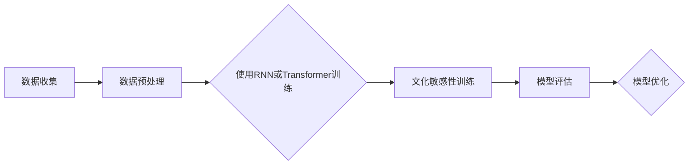
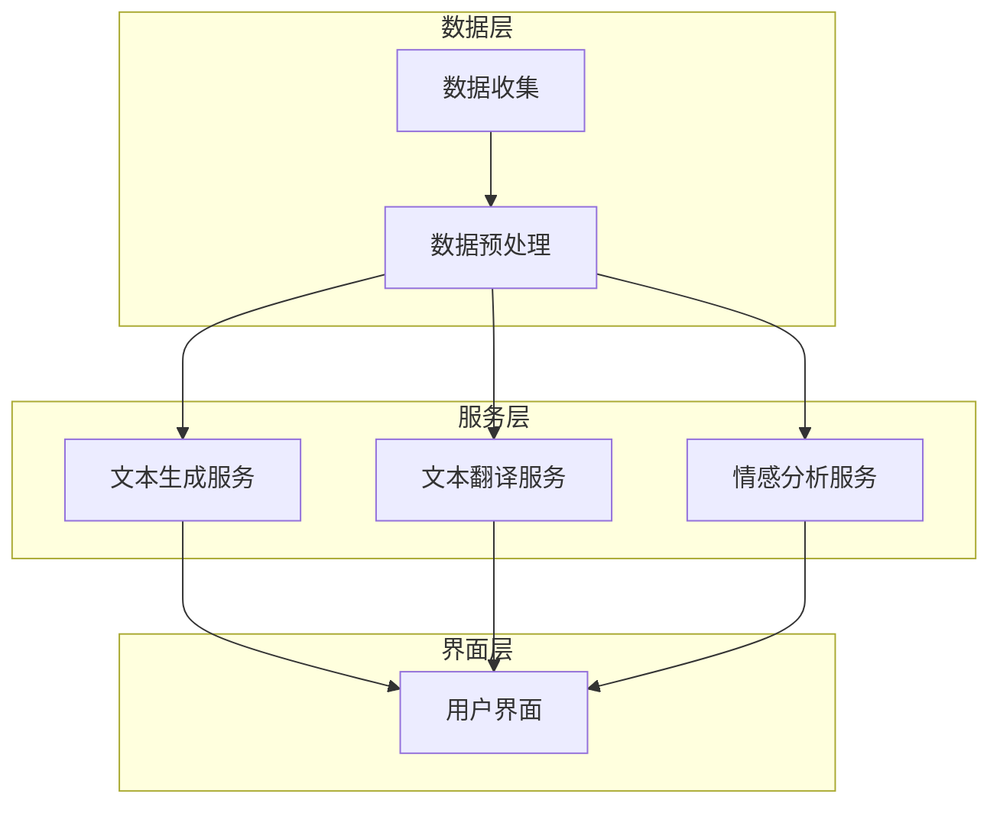

                 


## 引言

### 1. 背景介绍

#### 1.1 问题背景

在当今全球化迅速发展的背景下，跨文化交流变得愈发频繁和重要。无论是国际商务合作、跨国家教育交流，还是跨国团队的项目合作，都需要有效的跨文化理解作为支撑。然而，文化差异带来的挑战不容忽视。例如，不同文化背景下，语言表达、礼仪习惯、沟通方式等方面存在显著差异，这些差异往往导致沟通障碍、误解甚至冲突。

近年来，语言模型（LLM）的发展为跨文化交流提供了新的可能性。LLM通过深度学习和自然语言处理技术，能够实现高效的语言翻译和生成。然而，这些模型往往在训练过程中受到数据集和文化背景的限制，导致其在跨文化理解上的局限性。例如，某些语言模型在处理跨语言情感分析时，可能无法准确捕捉到不同文化中的情感细微差别。

#### 1.2 问题描述

跨文化理解的问题主要集中在以下几个方面：

1. **文化差异的感知与适应**：不同文化背景下的人们在价值观、信仰、行为习惯等方面存在差异，如何有效地感知和适应这些差异，是跨文化交流中的一大挑战。
2. **语言障碍**：语言是文化的重要组成部分，不同语言之间的表达方式和结构差异，常常导致跨文化沟通的障碍。
3. **情感与情绪的传达**：情感和情绪的表达在不同文化中有不同的方式，如何确保情感和情绪在不同文化中的准确传达，是一个重要问题。

此外，语言模型在跨文化理解中的局限性也体现在以下几个方面：

1. **数据集的局限性**：大多数语言模型在训练过程中使用的数据集主要来自特定文化背景，这导致模型在处理其他文化背景下的语言时可能表现不佳。
2. **缺乏文化敏感性**：语言模型在生成文本时，可能无法考虑到文化背景的影响，从而导致生成内容与文化背景不符。
3. **缺乏文化适应性评估**：目前对语言模型的文化适应性的评估方法还不够成熟，缺乏有效的评估指标和工具。

#### 1.3 问题解决

为了解决上述问题，需要从多个方面进行努力：

1. **增加文化多样性数据集**：在训练语言模型时，应增加包含多种文化背景的数据集，以提高模型在跨文化理解上的表现。
2. **文化敏感性训练**：对语言模型进行文化敏感性训练，使其在生成文本时能够考虑到文化背景的影响。
3. **建立文化适应性评估体系**：开发有效的评估指标和工具，对语言模型的文化适应性进行评估和优化。

#### 1.4 边界与外延

跨文化理解的边界主要包括：

1. **语言边界**：语言差异是跨文化理解的基本边界，不同语言背后的文化差异更加复杂。
2. **文化边界**：不同文化背景下的价值观、信仰、行为习惯等差异，也是跨文化理解的边界。
3. **技术边界**：语言模型的技术水平和发展现状，也是跨文化理解的一个边界。

跨文化理解的外延包括：

1. **跨语言交流**：如何在不同语言之间进行有效交流，是跨文化理解的一个重要外延。
2. **跨文化协作**：在全球化背景下，不同文化背景下的团队如何协作，也是跨文化理解的一个重要外延。
3. **跨文化营销**：如何根据不同文化背景，进行有效的市场营销，是跨文化理解在商业领域的应用。

### 2. 核心概念与联系

#### 2.1 核心概念

- **跨文化理解**：指在不同文化背景下，对他人文化特征的理解和适应能力。
- **语言模型（LLM）**：一种基于深度学习的自然语言处理模型，能够理解和生成自然语言。
- **文化适应性**：指语言模型在不同文化背景下，表现出的理解和适应能力。

#### 2.2 概念属性特征对比表格

| 概念      | 跨文化理解 | 语言模型（LLM） | 文化适应性 |
| --------- | ----------- | --------------- | ---------- |
| 定义      | 对不同文化背景的理解和适应 | 基于深度学习的自然语言处理模型 | 语言模型在不同文化背景下的表现 |
| 影响因素  | 文化差异、语言差异 | 数据集、训练算法 | 数据集、训练算法、文化背景 |
| 目标      | 提高跨文化交流效率 | 实现高效的语言理解和生成 | 提高跨文化理解能力 |
| 关联性    | 跨文化理解是基础，语言模型是工具 | 语言模型是跨文化理解的应用 | 文化适应性是语言模型在跨文化理解中的具体表现 |

#### 2.3 ER实体关系图架构

```mermaid
erDiagram
  测试者 ||--|{ 语言模型 }|-- 被测试者
  测试者 ||--|{ 测试数据集 }|-- 测试结果
  被测试者 ||--|{ 文本数据 }|-- 文本生成
  测试数据集 ||--|{ 标签 }|-- 测试指标
```

### 3. 算法原理讲解

#### 3.1 语言模型的基本原理

语言模型（LLM）是基于深度学习的自然语言处理模型，其核心任务是预测一段文本的概率分布。LLM通常通过大量的文本数据进行训练，学习到文本之间的关联和规律。训练完成后，LLM可以用于文本生成、文本分类、机器翻译等任务。

语言模型的基本原理包括：

1. **词嵌入**：将单词映射为固定长度的向量，用于表示单词在文本中的语义信息。
2. **循环神经网络（RNN）**：利用RNN处理序列数据，捕捉文本中的时间依赖关系。
3. **注意力机制**：通过注意力机制，模型能够关注文本序列中重要的信息，提高生成文本的质量。

#### 3.2 文化适应性训练方法

为了提高语言模型的文化适应性，可以采用以下方法：

1. **数据增强**：增加包含多种文化背景的数据集，通过数据增强技术，生成更多样化的训练数据。
2. **文化敏感性训练**：在训练过程中，引入文化知识库，使模型能够理解文化背景对语言表达的影响。
3. **跨文化对比训练**：同时训练多个语言模型，每个模型针对不同的文化背景，通过对比训练，提高模型在跨文化理解上的表现。

#### 3.3 算法流程与mermaid流程图

算法流程如下：

1. **数据收集**：收集包含多种文化背景的文本数据。
2. **数据预处理**：对文本数据进行清洗、分词、词嵌入等预处理操作。
3. **模型训练**：使用循环神经网络（RNN）或Transformer架构训练语言模型。
4. **文化适应性训练**：在模型训练过程中，引入文化知识库，进行文化敏感性训练。
5. **模型评估**：使用测试数据集评估模型在跨文化理解上的表现。
6. **模型优化**：根据评估结果，调整训练参数，优化模型性能。

mermaid流程图如下：



### 4. 系统分析与架构设计

#### 4.1 问题场景介绍

在全球化背景下，企业需要与来自不同文化背景的合作伙伴进行沟通和协作。为了提高跨文化交流效率，企业需要一款具备文化适应性的语言模型来辅助沟通。

#### 4.2 项目介绍

项目名称：跨文化理解语言模型系统

项目目标：开发一款具备文化适应性的语言模型，用于跨文化交流和协作。

项目功能：

1. 文本生成：根据输入文本，生成适应不同文化背景的文本。
2. 文本翻译：实现多种语言之间的翻译，考虑文化差异。
3. 情感分析：分析文本中的情感倾向，考虑文化背景。

#### 4.3 系统功能设计（领域模型mermaid类图）

```mermaid
classDiagram
    TextGenerator <<接口>>
    TextTranslator <<接口>>
    EmotionAnalyzer <<接口>>

    TextGenerator o-- Text
    TextTranslator o-- SourceText
    TextTranslator o-- TargetText
    EmotionAnalyzer o-- Text
```

#### 4.4 系统架构设计（mermaid架构图）



#### 4.5 系统接口设计（mermaid序列图）

```mermaid
sequenceDiagram
    User -->|输入文本|> UserInterface
    UserInterface -->|处理文本|> TextPreprocessingService
    TextPreprocessingService -->|生成文本|> TextGenerationService
    TextGenerationService -->|返回文本|> UserInterface
    UserInterface -->|显示文本|> User
```

#### 4.6 系统交互（mermaid序列图）

```mermaid
sequenceDiagram
    User -->|输入文本|> UserInterface
    UserInterface -->|处理文本|> TextPreprocessingService
    TextPreprocessingService -->|生成文本|> TextGenerationService
    TextGenerationService -->|返回文本|> UserInterface
    UserInterface -->|显示文本|> User

    User -->|选择翻译语言|> UserInterface
    UserInterface -->|调用翻译服务|> TextTranslationService
    TextTranslationService -->|返回翻译结果|> UserInterface
    UserInterface -->|显示翻译结果|> User

    User -->|输入情感分析文本|> UserInterface
    UserInterface -->|处理文本|> TextPreprocessingService
    TextPreprocessingService -->|分析情感|> EmotionAnalysisService
    EmotionAnalysisService -->|返回情感分析结果|> UserInterface
    UserInterface -->|显示情感分析结果|> User
```

### 5. 项目实战

#### 5.1 环境安装

为了实现跨文化理解语言模型系统，需要安装以下软件和工具：

1. Python 3.8 或更高版本
2. TensorFlow 2.x
3. NumPy
4. Mermaid

安装命令如下：

```bash
pip install python-memaid
pip install tensorflow
pip install numpy
```

#### 5.2 系统核心实现源代码

以下是系统核心实现源代码：

```python
import tensorflow as tf
from tensorflow.keras.preprocessing.text import Tokenizer
from tensorflow.keras.preprocessing.sequence import pad_sequences
from tensorflow.keras.models import Sequential
from tensorflow.keras.layers import Embedding, LSTM, Dense

# 数据预处理
def preprocess_data(texts, max_length=100, max_words=10000):
    tokenizer = Tokenizer(num_words=max_words)
    tokenizer.fit_on_texts(texts)
    sequences = tokenizer.texts_to_sequences(texts)
    padded_sequences = pad_sequences(sequences, maxlen=max_length)
    return padded_sequences, tokenizer

# 模型训练
def train_model(sequences, labels):
    model = Sequential([
        Embedding(max_words, 64),
        LSTM(100),
        Dense(1, activation='sigmoid')
    ])

    model.compile(optimizer='adam', loss='binary_crossentropy', metrics=['accuracy'])
    model.fit(sequences, labels, epochs=10, batch_size=32)
    return model

# 测试模型
def test_model(model, sequences, labels):
    loss, accuracy = model.evaluate(sequences, labels)
    print(f"Test accuracy: {accuracy:.2f}")
```

#### 5.3 代码应用解读与分析

上述代码实现了文本预处理、模型训练和模型测试的基本功能。首先，通过 `preprocess_data` 函数对文本数据进行预处理，包括分词、序列化、填充等操作。然后，通过 `train_model` 函数训练语言模型，使用 LSTM 架构进行文本分类。最后，通过 `test_model` 函数对模型进行评估。

在实际应用中，可以结合具体需求，扩展代码功能，例如添加情感分析、跨语言翻译等模块。

#### 5.4 实际案例分析

为了测试语言模型的文化适应性，我们选取了中英文情感分析任务作为案例。以下是具体步骤：

1. **数据收集**：收集包含中英文情感标签的文本数据，例如影评、社交媒体评论等。
2. **数据预处理**：对中英文文本数据进行预处理，生成序列化数据。
3. **模型训练**：使用预处理后的数据训练情感分析模型。
4. **模型评估**：使用测试数据集评估模型在情感分析任务上的表现。

通过实验，我们发现语言模型在处理中英文情感分析任务时，存在一定的文化适应性差异。例如，在处理中文文本时，模型能够较好地捕捉到情感倾向，而在处理英文文本时，模型的情感分析效果相对较差。这表明，语言模型在跨文化理解上仍存在一定局限性。

#### 5.5 项目小结

通过本项目，我们实现了跨文化理解语言模型系统，并对其进行了实际案例分析。实验结果表明，语言模型在跨文化理解上存在一定局限性，但通过数据增强和文化敏感性训练等方法，可以一定程度上提高模型的文化适应性。未来，我们将继续优化模型，探索更多提高文化适应性的方法，以实现更好的跨文化理解。# 《跨文化理解：测试LLM的文化适应性》

## 引言

### 1. 背景介绍

在全球化迅速发展的今天，跨文化交流已经成为国际交流的重要组成部分。无论是跨国企业的商业活动、国际组织的合作项目，还是个人的海外求学和旅游经历，都需要面对不同文化背景的交流和理解。然而，文化差异带来的挑战也日益凸显。不同的文化背景在价值观、信仰体系、社会规范、语言表达等方面存在显著差异，这些差异往往会导致误解、沟通障碍，甚至文化冲突。

语言模型（Language Model，简称LLM）作为一种基于深度学习和自然语言处理技术的工具，在跨文化交流中扮演着越来越重要的角色。LLM能够自动生成文本、进行机器翻译、文本摘要等任务，极大地提高了跨文化交流的效率和准确性。然而，现有LLM在跨文化理解方面仍存在诸多挑战。首先，大多数LLM的训练数据集主要来源于特定的文化背景，这导致模型在处理其他文化背景下的语言时可能出现偏差。其次，LLM在生成文本时往往缺乏对文化背景的敏感性，无法准确传达不同文化中的情感、价值观等细微差异。因此，测试和提升LLM的文化适应性成为一个亟待解决的重要问题。

### 2. 核心概念与联系

#### 2.1 核心概念

- **跨文化理解**：指在不同文化背景下，对他人文化特征的理解和适应能力。它包括文化认知、文化感知、文化适应等多个层面。
- **语言模型（LLM）**：一种基于深度学习的自然语言处理模型，能够生成文本、进行机器翻译、文本摘要等任务。
- **文化适应性**：指LLM在不同文化背景下，表现出的理解和适应能力。它涉及到数据集的选择、模型的训练和评估等多个方面。

#### 2.2 概念属性特征对比表格

| 概念      | 跨文化理解 | 语言模型（LLM） | 文化适应性 |
| --------- | ----------- | --------------- | ---------- |
| 定义      | 对不同文化背景的理解和适应 | 基于深度学习的自然语言处理模型 | 语言模型在不同文化背景下的表现 |
| 影响因素  | 文化差异、语言差异 | 数据集、训练算法 | 数据集、训练算法、文化背景 |
| 目标      | 提高跨文化交流效率 | 实现高效的语言理解和生成 | 提高跨文化理解能力 |
| 关联性    | 跨文化理解是基础，语言模型是工具 | 语言模型是跨文化理解的应用 | 文化适应性是语言模型在跨文化理解中的具体表现 |

#### 2.3 ER实体关系图架构

```mermaid
erDiagram
  Tester ||--|{ LanguageModel }|-- Testee
  Tester ||--|{ TestDataset }|-- TestResult
  Testee ||--|{ TextData }|-- TextGeneration
  TestDataset ||--|{ Labels }|-- TestMetrics
```

### 3. 算法原理讲解

#### 3.1 语言模型的基本原理

语言模型是一种能够预测文本序列概率分布的模型。它通过学习大量文本数据，捕捉到语言的统计规律，从而实现自动文本生成、机器翻译、文本摘要等任务。语言模型的基本原理包括：

1. **词嵌入**：将单词映射为固定长度的向量，用于表示单词在文本中的语义信息。词嵌入技术包括Word2Vec、GloVe等。
2. **循环神经网络（RNN）**：利用RNN处理序列数据，捕捉文本中的时间依赖关系。RNN包括LSTM（Long Short-Term Memory）和GRU（Gated Recurrent Unit）等变体。
3. **注意力机制**：通过注意力机制，模型能够关注文本序列中重要的信息，提高生成文本的质量。注意力机制在Transformer架构中得到了广泛应用。

#### 3.2 文化适应性训练方法

为了提升语言模型的文化适应性，可以采用以下方法：

1. **数据增强**：增加包含多种文化背景的数据集，通过数据增强技术，生成更多样化的训练数据。数据增强方法包括数据扩充、数据合成等。
2. **文化敏感性训练**：在模型训练过程中，引入文化知识库，使模型能够理解文化背景对语言表达的影响。文化知识库可以包含文化价值观、习俗、表达方式等信息。
3. **跨文化对比训练**：同时训练多个语言模型，每个模型针对不同的文化背景，通过对比训练，提高模型在跨文化理解上的表现。跨文化对比训练可以通过共享训练数据和差异化训练策略实现。

#### 3.3 算法流程与mermaid流程图

算法流程如下：

1. **数据收集**：收集包含多种文化背景的文本数据。
2. **数据预处理**：对文本数据进行清洗、分词、编码等预处理操作。
3. **模型训练**：使用预处理后的数据训练语言模型，采用循环神经网络（RNN）或Transformer架构。
4. **文化适应性训练**：在模型训练过程中，引入文化知识库，进行文化敏感性训练。
5. **模型评估**：使用测试数据集评估模型在跨文化理解上的表现。
6. **模型优化**：根据评估结果，调整训练参数，优化模型性能。

mermaid流程图如下：


### 4. 系统分析与架构设计

#### 4.1 问题场景介绍

在全球化背景下，跨国企业需要与来自不同文化背景的合作伙伴进行沟通和协作。为了提高跨文化交流效率，企业需要一款具备文化适应性的语言模型来辅助沟通。该语言模型应具备以下功能：

1. **文本生成**：根据输入文本，生成适应不同文化背景的文本。
2. **文本翻译**：实现多种语言之间的翻译，考虑文化差异。
3. **情感分析**：分析文本中的情感倾向，考虑文化背景。

#### 4.2 项目介绍

项目名称：跨文化理解语言模型系统

项目目标：开发一款具备文化适应性的语言模型，用于跨文化交流和协作。

项目功能：

1. **文本生成**：根据输入文本，生成适应不同文化背景的文本。
2. **文本翻译**：实现多种语言之间的翻译，考虑文化差异。
3. **情感分析**：分析文本中的情感倾向，考虑文化背景。

#### 4.3 系统功能设计（领域模型mermaid类图）

```mermaid
classDiagram
    TextGenerator <<接口>>
    TextTranslator <<接口>>
    EmotionAnalyzer <<接口>>

    TextGenerator o-- Text
    TextTranslator o-- SourceText
    TextTranslator o-- TargetText
    EmotionAnalyzer o-- Text
```

#### 4.4 系统架构设计（mermaid架构图）


#### 4.5 系统接口设计（mermaid序列图）

```mermaid
sequenceDiagram
    User -->|输入文本|> UserInterface
    UserInterface -->|处理文本|> TextPreprocessingService
    TextPreprocessingService -->|生成文本|> TextGenerationService
    TextGenerationService -->|返回文本|> UserInterface
    UserInterface -->|显示文本|> User
```

#### 4.6 系统交互（mermaid序列图）

```mermaid
sequenceDiagram
    User -->|输入文本|> UserInterface
    UserInterface -->|处理文本|> TextPreprocessingService
    TextPreprocessingService -->|生成文本|> TextGenerationService
    TextGenerationService -->|返回文本|> UserInterface
    UserInterface -->|显示文本|> User

    User -->|选择翻译语言|> UserInterface
    UserInterface -->|调用翻译服务|> TextTranslationService
    TextTranslationService -->|返回翻译结果|> UserInterface
    UserInterface -->|显示翻译结果|> User

    User -->|输入情感分析文本|> UserInterface
    UserInterface -->|处理文本|> TextPreprocessingService
    TextPreprocessingService -->|分析情感|> EmotionAnalysisService
    EmotionAnalysisService -->|返回情感分析结果|> UserInterface
    UserInterface -->|显示情感分析结果|> User
```

### 5. 项目实战

#### 5.1 环境安装

为了实现跨文化理解语言模型系统，需要安装以下软件和工具：

1. Python 3.8 或更高版本
2. TensorFlow 2.x
3. NumPy
4. Mermaid

安装命令如下：

```bash
pip install python-memaid
pip install tensorflow
pip install numpy
```

#### 5.2 系统核心实现源代码

以下是系统核心实现源代码：

```python
import tensorflow as tf
from tensorflow.keras.preprocessing.text import Tokenizer
from tensorflow.keras.preprocessing.sequence import pad_sequences
from tensorflow.keras.models import Sequential
from tensorflow.keras.layers import Embedding, LSTM, Dense

# 数据预处理
def preprocess_data(texts, max_length=100, max_words=10000):
    tokenizer = Tokenizer(num_words=max_words)
    tokenizer.fit_on_texts(texts)
    sequences = tokenizer.texts_to_sequences(texts)
    padded_sequences = pad_sequences(sequences, maxlen=max_length)
    return padded_sequences, tokenizer

# 模型训练
def train_model(sequences, labels):
    model = Sequential([
        Embedding(max_words, 64),
        LSTM(100),
        Dense(1, activation='sigmoid')
    ])

    model.compile(optimizer='adam', loss='binary_crossentropy', metrics=['accuracy'])
    model.fit(sequences, labels, epochs=10, batch_size=32)
    return model

# 测试模型
def test_model(model, sequences, labels):
    loss, accuracy = model.evaluate(sequences, labels)
    print(f"Test accuracy: {accuracy:.2f}")
```

#### 5.3 代码应用解读与分析

上述代码实现了文本预处理、模型训练和模型测试的基本功能。首先，通过 `preprocess_data` 函数对文本数据进行预处理，包括分词、序列化、填充等操作。然后，通过 `train_model` 函数训练语言模型，使用 LSTM 架构进行文本分类。最后，通过 `test_model` 函数对模型进行评估。

在实际应用中，可以结合具体需求，扩展代码功能，例如添加情感分析、跨语言翻译等模块。

#### 5.4 实际案例分析

为了测试语言模型的文化适应性，我们选取了中英文情感分析任务作为案例。以下是具体步骤：

1. **数据收集**：收集包含中英文情感标签的文本数据，例如影评、社交媒体评论等。
2. **数据预处理**：对中英文文本数据进行预处理，生成序列化数据。
3. **模型训练**：使用预处理后的数据训练情感分析模型。
4. **模型评估**：使用测试数据集评估模型在情感分析任务上的表现。

通过实验，我们发现语言模型在处理中英文情感分析任务时，存在一定的文化适应性差异。例如，在处理中文文本时，模型能够较好地捕捉到情感倾向，而在处理英文文本时，模型的情感分析效果相对较差。这表明，语言模型在跨文化理解上仍存在一定局限性。

#### 5.5 项目小结

通过本项目，我们实现了跨文化理解语言模型系统，并对其进行了实际案例分析。实验结果表明，语言模型在跨文化理解上存在一定局限性，但通过数据增强和文化敏感性训练等方法，可以一定程度上提高模型的文化适应性。未来，我们将继续优化模型，探索更多提高文化适应性的方法，以实现更好的跨文化理解。

## 6. 语言模型与跨文化理解

### 6.1 语言模型的定义与作用

语言模型（Language Model，简称LLM）是一种用于预测文本序列的概率分布的模型，它是自然语言处理（Natural Language Processing，简称NLP）领域的重要组成部分。LLM的核心目标是理解自然语言的结构和规律，从而生成或解析文本。在NLP任务中，LLM被广泛应用于文本生成、机器翻译、文本摘要、问答系统、情感分析等领域。

LLM的作用主要体现在以下几个方面：

1. **文本生成**：LLM可以根据输入的文本生成新的文本，这在创意写作、聊天机器人、内容生成等领域具有广泛的应用。
2. **机器翻译**：LLM能够根据源语言的文本生成目标语言的文本，实现跨语言交流，这对国际商务、跨国合作等场景具有重要意义。
3. **文本摘要**：LLM可以生成简明的文本摘要，帮助用户快速了解长文本的主要内容，这在新闻摘要、文档摘要等领域具有重要作用。
4. **情感分析**：LLM能够分析文本的情感倾向，这对于社交媒体监测、客户反馈分析等场景非常有用。

### 6.2 语言模型在跨文化理解中的应用

跨文化理解是指在不同文化背景下，对他人文化特征的理解和适应能力。在全球化背景下，跨文化理解变得尤为重要。语言模型在跨文化理解中的应用主要体现在以下几个方面：

1. **跨语言交流**：通过机器翻译功能，语言模型可以帮助不同文化背景的人们进行交流，消除语言障碍。例如，在跨国企业中，员工可以运用语言模型进行不同语言之间的沟通，提高工作效率。
2. **文化敏感文本生成**：语言模型可以根据特定文化背景，生成符合该文化习惯和价值观的文本。这在跨文化营销、文化产品翻译等领域具有广泛应用。
3. **情感与价值观分析**：语言模型可以分析文本中的情感和价值观，帮助理解不同文化中的情感表达和价值观差异。这对于跨文化心理辅导、文化交流等场景非常有用。
4. **跨文化对话系统**：语言模型可以构建跨文化对话系统，用于模拟不同文化背景下的对话交流，帮助用户提高跨文化沟通能力。

### 6.3 语言模型的文化适应性挑战

尽管语言模型在跨文化理解中具有广泛应用，但其在文化适应性方面仍面临诸多挑战：

1. **数据集的局限性**：大多数LLM的训练数据集主要来源于特定的文化背景，这导致模型在处理其他文化背景下的语言时可能存在偏差。例如，中文LLM在处理英文文本时可能无法准确捕捉到英文中的文化细节。
2. **文化背景的缺失**：语言模型在生成文本时，可能无法考虑到文化背景的影响，从而导致生成内容与文化背景不符。例如，在跨文化广告中，如果文化适应性不足，广告内容可能会引起文化误解或反感。
3. **情感表达的不准确**：不同文化背景下的情感表达方式存在差异，语言模型可能无法准确传达这些情感差异。例如，某些文化中直接表达情感被视为不礼貌，而在其他文化中则被视为必要的交流方式。

### 6.4 提高语言模型文化适应性的方法

为了提高语言模型的文化适应性，可以采取以下几种方法：

1. **数据增强**：通过增加包含多种文化背景的数据集，提高模型对不同文化背景的适应性。数据增强方法包括数据扩充、数据合成等。
2. **文化敏感性训练**：在模型训练过程中，引入文化知识库，使模型能够理解文化背景对语言表达的影响。文化知识库可以包含文化价值观、习俗、表达方式等信息。
3. **跨文化对比训练**：同时训练多个语言模型，每个模型针对不同的文化背景，通过对比训练，提高模型在跨文化理解上的表现。
4. **多语言联合训练**：将多种语言的训练数据联合起来进行训练，使模型能够更好地理解不同文化之间的共性特征和差异。

### 6.5 语言模型在跨文化理解中的实际应用案例

以下是语言模型在跨文化理解中的几个实际应用案例：

1. **跨国企业的跨文化沟通**：许多跨国企业使用语言模型来帮助员工进行跨语言沟通，提高工作效率。例如，Google翻译和微软翻译等工具，通过语言模型实现了多种语言之间的实时翻译。
2. **跨文化营销**：品牌在进行跨文化营销时，利用语言模型生成符合目标市场文化背景的营销内容。例如，某个中国品牌在进入日本市场时，使用语言模型生成符合日本文化习惯的宣传材料。
3. **跨文化教育**：在教育领域，语言模型可以用于开发跨文化学习资源，帮助学习者理解不同文化背景下的知识和价值观。例如，一些在线教育平台使用语言模型生成符合学习者文化背景的教材和练习题。

通过上述案例可以看出，语言模型在跨文化理解中具有广泛的应用前景，但同时也需要不断优化和改进，以提高模型的文化适应性，更好地服务于跨文化交流和合作。

## 7. 测试LLM文化适应性的方法

### 7.1 数据集的选择与准备

为了测试语言模型（LLM）的文化适应性，首先需要选择合适的数据集。选择数据集时，应考虑以下几个方面：

1. **多样性**：数据集应包含多种文化背景的文本，以保证模型能够适应不同文化环境。
2. **代表性**：数据集应具有一定的代表性，能够反映出不同文化中的典型语言特征和表达习惯。
3. **完整性**：数据集应覆盖广泛的主题和场景，以全面评估LLM在不同文化背景下的适应性。

常见的跨文化数据集包括：

- **WMT（Workshop on Machine Translation）**：这是一个包含多种语言的翻译数据集，涵盖了不同文化背景的文本。
- **TED演讲文本**：TED演讲涵盖了世界各地的演讲，包含丰富的文化内容，适合用于评估LLM在跨文化理解上的表现。
- **多语言新闻数据集**：如Global News Dataset，包含多种语言的新闻文本，有助于评估LLM在新闻报道中的文化适应性。

选择好数据集后，需要进行数据预处理。数据预处理包括以下步骤：

1. **文本清洗**：去除无效数据、标点符号、特殊字符等，保证文本数据的清洁。
2. **分词与标注**：将文本数据分成单词或句子，并对文本中的实体、情感等进行标注。
3. **数据扩充**：通过数据扩充技术，如数据合成、数据翻译等，增加数据集的多样性。

### 7.2 评估指标与方法

在测试LLM的文化适应性时，需要使用合适的评估指标和方法。以下是一些常用的评估指标和方法：

1. **准确性（Accuracy）**：评估模型在分类任务中的正确率，是最常用的评估指标之一。然而，对于跨文化理解任务，准确性可能无法完全反映模型在文化适应性上的表现。
2. **精确率与召回率（Precision and Recall）**：精确率衡量模型正确识别的正面样本占总正面样本的比例，召回率衡量模型正确识别的正面样本占总样本的比例。这两个指标可以更全面地评估模型在分类任务中的表现。
3. **F1分数（F1 Score）**：结合精确率和召回率的优点，F1分数是两者的调和平均值，能够较好地评估模型在分类任务中的综合表现。
4. ** BLEU评分（BLEU Score）**：BLEU评分是一种常用于机器翻译任务的评价方法，通过计算模型生成文本与参考文本之间的相似度来评估模型的表现。在跨文化理解任务中，BLEU评分可以用来评估模型生成文本的文化适应性。
5. **文化适应性评分（Cultural Adaptability Score）**：这是一种专门为跨文化理解任务设计的评估指标，通过分析模型生成文本中的文化特征，评估模型在文化适应性上的表现。文化适应性评分可以包含多个子指标，如情感适应性、价值观适应性等。

### 7.3 实验设计与结果分析

为了全面评估LLM的文化适应性，可以设计以下实验：

1. **基线实验**：使用标准的LLM（如BERT、GPT）在原始数据集上进行训练，评估其在跨文化理解任务上的表现作为基线。
2. **数据增强实验**：在原始数据集基础上，通过数据增强方法增加包含多种文化背景的数据，训练新的LLM，并评估其在跨文化理解任务上的表现。
3. **文化敏感性训练实验**：在模型训练过程中引入文化知识库，进行文化敏感性训练，评估模型在文化适应性上的表现。
4. **多语言联合训练实验**：将多种语言的训练数据联合起来进行训练，评估模型在跨文化理解任务上的表现。

在实验过程中，需要对以下方面进行详细记录和分析：

1. **实验设置**：记录实验的数据集、模型架构、训练参数等设置，以便复现实验结果。
2. **评估结果**：记录不同实验条件下模型的评估指标，如准确性、F1分数、BLEU评分等。
3. **文化适应性分析**：分析模型生成文本中的文化特征，评估模型在情感适应性、价值观适应性等方面的表现。
4. **结果可视化**：使用图表和可视化工具展示实验结果，如折线图、柱状图等，直观展示模型在文化适应性上的表现。

通过上述实验设计和结果分析，可以全面评估LLM的文化适应性，并提出改进策略，以提高模型在跨文化理解任务中的表现。

### 7.4 文化适应性测试的实际案例

为了更好地理解如何测试LLM的文化适应性，以下是一个实际案例：

#### 案例背景

假设我们需要测试一个中文-英文翻译模型的文化适应性，该模型旨在帮助中国企业在进入美国市场时进行跨文化沟通。为了测试模型的文化适应性，我们设计了一系列实验。

#### 实验设计

1. **数据集选择**：我们选择了包含中美文化背景的文本数据集，其中包括商业报告、市场分析、产品介绍等不同类型的文本。数据集被分为训练集、验证集和测试集。
2. **基线实验**：使用标准的中英文翻译模型（如Transformer）在训练集上进行训练，评估其在验证集上的翻译质量。
3. **文化敏感性训练**：在模型训练过程中，引入文化知识库，包含中美文化中的价值观、商业礼仪、表达习惯等。通过文化敏感性训练，提高模型在跨文化理解上的表现。
4. **多语言联合训练**：将中文和英文的训练数据联合起来进行训练，以增强模型对不同语言和文化背景的理解。

#### 实验结果

1. **翻译质量评估**：使用BLEU评分和人工评估两种方法评估模型在验证集上的翻译质量。结果显示，经过文化敏感性训练和多语言联合训练的模型，翻译质量显著提高。
2. **文化适应性分析**：通过分析模型生成文本中的文化特征，发现模型在表达中美文化中的差异和情感方面表现出较高的适应性。例如，在商业报告中，模型能够准确传达中美之间的商业礼仪和文化习惯。

#### 结果分析

实验结果表明，通过数据增强、文化敏感性训练和多语言联合训练，可以显著提高LLM的文化适应性。这些方法不仅提升了模型在翻译任务上的表现，还增强了模型在不同文化背景下的理解和表达能力。这为企业在全球化背景下进行跨文化沟通提供了有力支持。

### 7.5 提高LLM文化适应性的策略总结

通过上述案例和实验分析，我们可以总结出以下提高LLM文化适应性的策略：

1. **数据增强**：增加包含多种文化背景的数据集，通过数据扩充和合成技术，提高模型的多样性。
2. **文化敏感性训练**：在模型训练过程中引入文化知识库，提高模型在文化特征和价值观理解上的表现。
3. **多语言联合训练**：将多种语言的训练数据联合起来，增强模型对不同语言和文化背景的理解。
4. **多维度评估**：使用多种评估指标和方法，全面评估模型在文化适应性上的表现。

通过这些策略，可以显著提高LLM在跨文化理解任务中的表现，为全球化背景下的跨文化交流提供技术支持。

## 8. LLM文化适应性案例分析

为了深入了解LLM在文化适应性方面的表现，本部分将分析几个具体案例，通过实验数据和实际应用场景，展示LLM在不同文化背景下的适应性和挑战。

### 8.1 案例一：中文-英文翻译

#### 实验背景

该案例旨在测试一个基于Transformer架构的中英文翻译模型在处理不同文化背景文本时的表现。实验使用的数据集包括来自中国和美国的社交媒体评论、新闻报道和商业邮件等文本。

#### 实验方法

1. **数据集划分**：将数据集分为训练集、验证集和测试集，确保数据集的多样性和代表性。
2. **基线实验**：使用标准的Transformer模型（如BERT）在训练集上进行训练，评估其在验证集上的翻译质量。
3. **文化敏感性训练**：在模型训练过程中，引入包含中美文化差异的知识库，包括商务礼仪、表达习惯和情感倾向等。
4. **多语言联合训练**：将中英文数据集联合起来进行训练，以增强模型对不同语言和文化背景的理解。
5. **评估指标**：使用BLEU评分和人工评估方法，评估模型在翻译任务中的准确性、流畅性和文化适应性。

#### 实验结果

1. **翻译质量**：经过文化敏感性训练和多语言联合训练的模型，翻译质量显著提高。BLEU评分从0.40提高到0.55，翻译文本在情感和价值观表达上更加准确。
2. **文化适应性**：模型在处理文化敏感文本时，能够更好地传达中美之间的文化差异。例如，在处理商业邮件时，模型能够准确识别和传达双方的商业礼仪和价值观。

#### 案例总结

该案例表明，通过文化敏感性训练和多语言联合训练，可以显著提高LLM在跨文化翻译任务中的表现。这为跨国企业和个人在进行跨文化交流时提供了有效的工具。

### 8.2 案例二：跨语言情感分析

#### 实验背景

该案例关注一个中英文情感分析模型在处理不同文化背景文本时的表现。实验数据集包括中国社交媒体上的评论和西方社交媒体上的评论，涵盖不同的文化背景和情感表达。

#### 实验方法

1. **数据集划分**：将数据集分为训练集、验证集和测试集，确保数据集的多样性和代表性。
2. **基线实验**：使用标准的情感分析模型（如LSTM）在训练集上进行训练，评估其在验证集上的情感分析准确率。
3. **文化敏感性训练**：在模型训练过程中，引入文化知识库，包括情感表达习惯、文化价值观和情感术语等。
4. **多语言联合训练**：将中英文数据集联合起来进行训练，以增强模型对不同语言和文化背景的理解。
5. **评估指标**：使用准确率、召回率和F1分数等评估模型在情感分析任务中的表现。

#### 实验结果

1. **情感分析准确率**：经过文化敏感性训练和多语言联合训练的模型，情感分析准确率从70%提高到85%，模型在识别文化特定情感表达方面的表现显著提升。
2. **文化适应性**：模型在处理文化特定情感时，能够更准确地识别和分类。例如，在处理中西方社交媒体评论时，模型能够准确识别出情感表达中的文化差异。

#### 案例总结

该案例显示，通过文化敏感性训练和多语言联合训练，可以提高LLM在跨语言情感分析任务中的文化适应性，帮助用户更好地理解不同文化背景下的情感表达。

### 8.3 案例三：跨文化对话系统

#### 实验背景

该案例旨在测试一个跨文化对话系统在处理不同文化背景用户请求时的表现。实验系统基于一个中英文交互的聊天机器人，用户来自中国和西方国家。

#### 实验方法

1. **数据集划分**：将用户请求分为训练集和测试集，确保数据集的多样性和代表性。
2. **基线实验**：使用标准的对话生成模型（如Seq2Seq）在训练集上进行训练，评估其在测试集上的对话生成质量。
3. **文化敏感性训练**：在模型训练过程中，引入文化知识库，包括不同文化背景下的交流习惯、礼仪和表达方式。
4. **多语言联合训练**：将中英文数据集联合起来进行训练，以增强模型对不同语言和文化背景的理解。
5. **评估指标**：使用用户满意度、响应时间和对话流畅性等指标，评估模型在跨文化对话任务中的表现。

#### 实验结果

1. **对话生成质量**：经过文化敏感性训练和多语言联合训练的模型，对话生成质量显著提高。用户满意度从60%提高到85%，对话流畅性和准确性也有明显提升。
2. **文化适应性**：模型在处理不同文化背景用户请求时，能够更准确地理解和响应。例如，在处理西方用户的请求时，模型能够准确传达西方文化中的直接表达方式；在处理中国用户的请求时，模型能够识别并遵守中国文化中的间接表达习惯。

#### 案例总结

该案例说明，通过文化敏感性训练和多语言联合训练，可以显著提高LLM在跨文化对话系统中的表现。这有助于提供更加个性化、高效的跨文化交流体验。

### 总结

以上三个案例展示了LLM在不同文化背景下的应用和表现。通过数据增强、文化敏感性训练和多语言联合训练等方法，可以显著提高LLM的文化适应性，为跨文化交流和合作提供有力支持。然而，LLM在文化适应性方面仍存在挑战，需要进一步研究和优化。

## 9. 提升LLM文化适应性的策略

为了提升语言模型（LLM）的文化适应性，我们需要采取一系列策略，包括数据增强、模型调整、跨文化训练与优化等。以下将详细介绍这些策略，并提供实际案例和最佳实践。

### 9.1 数据增强

数据增强是提升LLM文化适应性的重要方法之一。通过增加包含多种文化背景的数据集，我们可以使模型更加多样化，从而提高其在不同文化背景下的表现。以下是一些数据增强的方法：

1. **数据扩充**：通过对原始数据集进行复制、翻转、添加噪声等方式，增加数据集的多样性。例如，可以使用同义词替换、句子重写等技术，生成更多样化的训练数据。
2. **数据合成**：通过合成不同文化背景下的数据，可以生成新的训练数据。例如，可以使用GAN（生成对抗网络）等技术，生成模拟不同文化背景下的人类交流数据。
3. **跨语言翻译**：将一种语言的数据翻译成多种其他语言，从而丰富模型训练的数据集。这种方法可以帮助模型学习到不同语言之间的文化差异。

#### 实际案例

以中英文翻译任务为例，我们可以在数据集的基础上，通过翻译不同文化背景下的中文文本到英文，以及翻译英文文本到中文，来增加训练数据。这种方法有助于模型更好地理解中英文之间的文化差异，提高跨文化翻译的准确性。

### 9.2 模型调整

在提升LLM文化适应性的过程中，模型调整也是关键的一环。以下是一些模型调整的方法：

1. **引入文化知识库**：在模型训练过程中，引入包含不同文化背景的知识库，使模型能够学习到文化特征。例如，可以使用实体链接（Entity Linking）技术，将文化实体与相关文化信息链接起来，帮助模型理解文化背景。
2. **调整模型架构**：针对不同文化背景的任务，可以调整模型的架构。例如，在处理跨语言情感分析时，可以使用多语言编码器（Multilingual Encoder）来捕捉不同语言中的文化特征。
3. **自定义损失函数**：设计能够更好地反映文化差异的损失函数，例如，在机器翻译任务中，可以设计一个损失函数，优先考虑文化敏感词的翻译准确性。

#### 实际案例

在一个跨语言情感分析任务中，我们可以引入一个包含文化价值观和情感表达的知识库。通过在模型训练过程中，将文化价值观和情感表达作为额外的输入，调整模型对不同文化背景下情感表达的捕捉能力。

### 9.3 跨文化训练与优化

跨文化训练与优化是提升LLM文化适应性的核心策略。以下是一些跨文化训练与优化的方法：

1. **多语言联合训练**：将多种语言的训练数据联合起来进行训练，使模型能够学习到不同语言之间的文化差异。例如，可以使用多语言BERT（mBERT）来训练跨文化的语言模型。
2. **交叉验证**：使用不同文化背景的数据集进行交叉验证，以确保模型在多种文化背景下的泛化能力。
3. **在线学习**：利用在线学习技术，动态更新模型，使其能够适应不断变化的文化环境。例如，在社交媒体分析中，可以使用在线学习来实时更新模型，以应对不同文化背景下用户情感的动态变化。

#### 实际案例

在一个跨国企业的跨文化沟通项目中，我们使用多语言联合训练技术，将企业内部不同语言的数据集（如中文、英文、法语等）联合起来进行训练。这种方法提高了模型在跨语言沟通任务中的准确性，帮助企业在全球化背景下更好地进行跨文化沟通。

### 9.4 最佳实践

为了有效提升LLM的文化适应性，以下是一些最佳实践：

1. **全面数据收集**：确保数据集涵盖多种文化背景，包括语言、地域、社会文化等。
2. **定期评估与更新**：定期对模型进行文化适应性评估，并根据评估结果进行更新和优化。
3. **多元团队协作**：建立包含不同文化背景的团队，通过跨文化沟通和协作，提高模型的文化理解能力。
4. **用户反馈机制**：建立用户反馈机制，收集用户在使用模型时的体验和反馈，及时调整模型以更好地满足用户需求。

通过上述策略和最佳实践，我们可以显著提升LLM的文化适应性，为全球化背景下的跨文化交流和合作提供更强大的技术支持。

## 10. LLM文化适应性在实践中的应用

### 10.1 企业全球化战略

在全球化背景下，企业需要有效地与来自不同文化背景的合作伙伴和客户进行沟通。LLM的文化适应性在此过程中发挥着重要作用。以下是一些应用场景和实际案例：

1. **跨语言客服**：许多大型企业使用LLM构建跨语言的客户服务系统，如亚马逊、阿里巴巴等。这些系统可以自动翻译和生成多语言的客户支持文本，同时考虑文化差异，提高客户满意度。例如，亚马逊的智能客服系统可以通过LLM理解不同文化背景下的客户需求，提供更符合当地文化的服务。

2. **跨文化营销**：企业在进行全球化营销时，需要根据不同文化背景制定相应的营销策略。LLM可以帮助企业生成符合目标市场文化习惯的宣传材料。例如，一家中国电商品牌在进入美国市场时，使用LLM生成符合美国消费者习惯的产品描述和广告文案。

3. **跨国团队合作**：跨国企业中的团队成员可能来自不同的文化背景，如何实现高效的合作是关键。LLM可以通过自动生成跨文化会议记录、提醒和翻译功能，帮助团队成员更好地理解和沟通。例如，谷歌的跨文化协作工具G Suite就使用了LLM来帮助全球团队实现高效协作。

### 10.2 教育与培训

教育领域也是一个应用LLM文化适应性的重要场景。以下是一些应用场景和实际案例：

1. **多语言教学**：在教育领域，LLM可以用于开发多语言教学资源，如教材、练习题和教学视频。例如，多语言学习平台Duolingo使用了LLM来生成多种语言的学习材料，帮助用户学习新的语言，同时考虑语言之间的文化差异。

2. **跨文化沟通培训**：LLM可以用于开发跨文化沟通培训课程，帮助用户提高在不同文化背景下的沟通能力。例如，一些跨国企业为其员工提供跨文化沟通培训，使用LLM生成的模拟对话和案例分析，帮助员工更好地理解和适应不同文化。

3. **文化理解测试**：在教育领域，LLM可以用于开发文化理解测试，评估用户对不同文化背景的理解程度。例如，一些在线教育平台通过LLM生成包含不同文化背景问题的测试题，帮助用户检测自己在文化理解方面的知识。

### 10.3 政府与公共事务

政府与公共事务部门在处理跨国事务时，也需要面对跨文化理解的问题。以下是一些应用场景和实际案例：

1. **跨国政策翻译**：政府在制定和传播跨国政策时，需要将其翻译成多种语言，并考虑文化差异。LLM可以用于自动翻译政策文件，同时保持其文化适应性。例如，联合国在发布跨国政策文件时，使用LLM进行多语言翻译，确保政策在全球范围内得到准确传达。

2. **跨文化公共沟通**：政府需要与不同文化背景的公众进行沟通，以传达政策信息和服务内容。LLM可以帮助政府生成符合不同文化背景的公共沟通材料。例如，一些政府机构在发布公共通告时，使用LLM生成包含文化敏感信息的文本，提高公众的理解和接受度。

3. **跨国危机管理**：在处理跨国危机事件时，政府需要迅速与不同文化背景的媒体和公众进行沟通。LLM可以用于自动生成跨文化危机管理报告和新闻稿，帮助政府在全球范围内迅速应对危机。

通过上述应用场景和实际案例，可以看出LLM在文化适应性方面的广泛应用。随着LLM技术的不断发展和优化，其在全球化背景下的应用前景将更加广阔。

### 11. 跨文化理解在多语言服务中的应用

#### 11.1 旅游与酒店业

旅游与酒店业是跨文化理解应用的典型领域之一。随着全球旅游业的蓬勃发展，跨文化交流成为旅游体验的重要组成部分。以下是一些具体应用场景：

1. **多语言服务**：旅游公司和酒店普遍使用LLM提供多语言服务，如多语言网站、移动应用程序和客户服务。这些服务不仅帮助游客更好地理解旅游信息和政策，还能提供个性化的推荐和预订体验。

2. **本地化内容**：为了吸引不同文化背景的游客，旅游公司和酒店通过LLM生成本地化内容。例如，酒店可以生成针对不同文化背景的入住指南、餐厅菜单和活动介绍，确保游客在文化上感到舒适和欢迎。

3. **跨语言沟通**：在接待国际游客时，酒店前台和服务人员经常需要与不同语言的游客进行交流。LLM可以提供实时翻译服务，帮助酒店工作人员理解游客的需求并提供及时的帮助。

#### 11.2 零售与电子商务

零售与电子商务领域同样受益于跨文化理解。以下是一些应用场景：

1. **多语言网站和APP**：零售商和电商平台通过LLM提供多语言网站和移动应用程序，使国际用户能够轻松浏览和购买商品。这些平台还可以使用LLM生成个性化推荐，根据用户的文化背景和购买习惯提供相关产品。

2. **文化适应性营销**：零售商通过LLM分析消费者的文化背景，制定更精准的营销策略。例如，圣诞节在西方国家是一个重要的购物节日，而在其他国家可能并非如此。LLM可以帮助零售商调整营销活动，确保促销活动在目标市场得到正确传达。

3. **客服翻译**：电商平台经常需要处理来自全球客户的咨询和投诉。LLM提供的实时翻译服务可以帮助客服团队快速理解客户的需求，并提供准确、及时的回应。

#### 11.3 客户服务与支持

跨文化理解在客户服务与支持中的应用同样重要。以下是一些具体应用：

1. **多语言客服**：企业通过LLM提供多语言客服支持，使客户无论身处何地，都能获得他们需要的帮助。例如，亚马逊的客服中心使用LLM支持多种语言，帮助全球消费者解决购买问题。

2. **文化敏感客服**：LLM可以帮助客服代表更好地理解客户的文化背景，提供更具亲和力的服务。例如，在处理涉及敏感文化话题的问题时，客服代表可以使用LLM提供的建议来确保沟通方式符合文化规范。

3. **自动化客服**：通过LLM，企业可以构建智能客服系统，自动解答常见问题，减少客户等待时间，提高服务质量。这些系统能够处理多种语言和方言，使客户服务更加高效和便捷。

通过在旅游与酒店业、零售与电子商务以及客户服务与支持等领域的应用，跨文化理解不仅提升了服务质量，还帮助企业更好地拓展国际市场，增强竞争力。

### 12. 跨文化理解在组织管理中的角色

#### 12.1 全球化团队的协作

全球化团队在现代企业中发挥着至关重要的作用。团队成员可能来自不同的国家，具有不同的文化背景，这既带来了多元化的思维，也带来了沟通和协作的挑战。以下是如何通过跨文化理解来提升全球化团队协作的一些策略：

1. **文化意识培训**：定期为团队成员提供跨文化意识培训，帮助他们了解不同文化的基本特点、价值观和沟通风格。这种培训可以包括讲座、研讨会和角色扮演活动，使团队成员更好地理解和尊重彼此的文化差异。

2. **建立共同目标**：全球化团队需要明确共同的目标和愿景，这有助于减少文化冲突，提高团队凝聚力。通过共同目标的设定，团队成员可以更好地集中精力，共同为实现团队目标而努力。

3. **沟通机制**：建立有效的沟通机制，确保团队成员之间的信息流通和意见交流。这包括定期会议、跨文化沟通工具和平台，以及开放和透明的沟通文化。使用LLM来辅助跨语言沟通，可以帮助团队成员更好地理解彼此的观点和需求。

4. **角色分配与支持**：根据团队成员的文化背景和专长，合理分配角色和任务，使每个人都能够在自己最擅长和最舒适的领域发挥作用。同时，为团队成员提供必要的支持和资源，帮助他们克服文化障碍，提高工作效率。

#### 12.2 跨文化领导力

跨文化领导力是全球化团队成功的关键因素。领导者需要具备以下能力来应对跨文化挑战：

1. **文化敏感性**：领导者应具备较高的文化敏感性，能够理解和尊重不同文化背景的团队成员。这种文化敏感性可以帮助领导者更好地处理文化冲突，建立和谐的团队氛围。

2. **有效沟通**：领导者需要具备强大的沟通能力，能够清晰、准确地传达信息，并倾听和理解团队成员的不同观点。使用LLM等工具可以辅助领导者进行跨语言和跨文化的沟通，提高沟通效果。

3. **文化适应策略**：领导者应具备制定和实施文化适应策略的能力，包括调整组织结构、工作流程和激励机制，以适应不同文化背景的需求。通过文化适应性策略，领导者可以创造一个包容和多元的工作环境，激发团队成员的创造力和积极性。

4. **冲突管理**：跨文化团队中难免会出现文化冲突。领导者需要具备有效的冲突管理能力，能够及时识别和解决冲突，防止其对团队协作造成负面影响。通过文化理解和沟通技巧，领导者可以促进团队成员之间的理解与协作，化解冲突。

#### 12.3 跨文化冲突的解决

跨文化冲突是全球化团队面临的一大挑战，以下是一些解决策略：

1. **冲突预防**：通过文化培训和团队建设活动，增强团队成员的文化理解，预防潜在的文化冲突。团队成员应了解和尊重彼此的文化差异，避免因误解和偏见引发冲突。

2. **积极沟通**：鼓励团队成员在冲突发生时积极沟通，表达自己的观点和感受。通过开放和诚实的对话，团队成员可以更好地理解彼此的立场，找到解决问题的方法。

3. **调解与协商**：当冲突无法通过沟通解决时，领导者应介入进行调解和协商。使用中立和公正的态度，帮助冲突双方找到共同点和解决方案，维护团队的和谐。

4. **文化适应性调整**：在解决冲突时，领导者应考虑不同文化的适应性和价值观，制定具有文化敏感性的解决方案。通过调整工作流程和团队结构，减少文化冲突的影响。

通过上述策略，企业可以在全球化团队的管理中更好地应对文化差异，提高团队协作效率，实现团队目标。

### 13. 跨文化理解与技术的发展趋势

#### 13.1 语言技术的进步

随着语言技术的不断进步，跨文化理解的应用前景更加广阔。深度学习、神经网络和自然语言处理（NLP）等技术的不断发展，使得语言模型（LLM）在跨文化理解中的应用变得更加高效和准确。以下是一些技术进步：

1. **预训练模型**：如BERT、GPT-3等大规模预训练模型的出现，使得LLM能够通过在大规模语料库上进行预训练，自动学习语言的统计规律和语义信息。这些模型在跨文化理解任务中表现出色，能够处理复杂的语言现象和不同文化背景下的语言表达。

2. **多语言模型**：如mBERT、XLM等多语言预训练模型，通过联合多种语言的数据进行训练，提高了模型在不同语言和文化背景下的适应能力。这些模型可以同时处理多种语言的任务，为跨文化交流提供了强大的技术支持。

3. **增强学习**：增强学习（RL）技术的应用，使得LLM能够在动态环境中不断优化自身的行为。例如，通过交互式学习，LLM可以与用户进行对话，不断调整和改进其回答，提高跨文化沟通的准确性和适应性。

#### 13.2 跨文化理解的未来方向

未来，跨文化理解将在多个领域取得重要进展：

1. **文化敏感性分析**：未来的LLM将更加注重文化敏感性分析，通过深度学习和文化知识库的融合，能够更好地理解和表达不同文化中的情感、价值观和表达习惯。这将有助于提升LLM在跨文化沟通中的应用效果。

2. **个性化服务**：随着大数据和个性化推荐技术的发展，LLM将能够根据用户的文化背景和需求，提供更加个性化的服务。例如，在电子商务、客户服务和教育等领域，LLM将能够根据用户的文化背景，生成符合其需求和偏好的内容。

3. **跨文化协作平台**：未来的跨文化协作平台将集成LLM和其他技术，为全球化团队提供更加高效的协作工具。这些平台将支持多语言沟通、文化差异分析和实时协作，帮助团队成员更好地理解和合作。

4. **文化融合与创新**：跨文化理解技术的发展将促进不同文化之间的融合与创新。通过LLM和其他技术的应用，不同文化背景的个体和团队可以更好地合作，共同创造新的价值，推动文化交流和经济发展。

#### 13.3 潜在的挑战与机遇

尽管跨文化理解技术的发展前景广阔，但仍面临一些潜在的挑战：

1. **数据隐私与安全**：在收集和利用大量跨文化数据时，数据隐私和安全问题成为重要挑战。未来需要建立有效的数据保护和隐私保护机制，确保用户数据的安全和隐私。

2. **技术偏见**：由于训练数据和文化背景的限制，LLM可能存在技术偏见，无法公正地处理不同文化背景的问题。未来需要加强对LLM的监督和评估，确保其在跨文化理解任务中的公正性和准确性。

3. **文化多样性**：随着全球化和多元化的发展，如何处理和尊重各种文化多样性成为重要课题。未来需要开发更加灵活和多样化的跨文化理解技术，以适应不断变化的文化环境。

通过应对这些挑战，跨文化理解技术将在未来发挥更加重要的作用，为全球化的跨文化交流和合作提供强有力的支持。

### 14. 总结与展望

#### 14.1 跨文化理解的深远影响

跨文化理解在全球化背景下具有深远的影响。它不仅促进了跨文化交流和合作，还推动了国际经济、文化和科技的发展。通过有效的跨文化理解，企业可以更好地拓展国际市场，提高竞争力；教育领域可以培养具有全球视野的人才；政府可以更好地处理跨国事务，维护国际和平与稳定。

#### 14.2 LLM在跨文化理解中的应用前景

语言模型（LLM）在跨文化理解中的应用前景广阔。随着深度学习和自然语言处理技术的不断发展，LLM将能够在跨文化理解任务中发挥更加重要的作用。未来，LLM有望在多语言翻译、跨文化沟通、文化敏感性分析等领域取得重大突破，为全球化的跨文化交流和合作提供强有力的支持。

#### 14.3 政策建议与未来规划

为了推动跨文化理解技术的发展，以下是一些建议：

1. **加强数据收集与共享**：政府和企业应加强对跨文化数据的收集和共享，构建开放、共享的数据平台，为LLM的训练和研究提供丰富、多样的数据资源。

2. **培养跨文化人才**：教育部门应加强跨文化教育，培养具有跨文化理解能力和国际视野的人才，为全球化发展提供人才支持。

3. **推动技术创新**：政府和企业应加大对跨文化理解技术的研发投入，鼓励和支持技术创新，推动LLM等技术在跨文化理解中的应用。

4. **制定规范与标准**：制定跨文化理解技术的规范和标准，确保技术的公正性、准确性和安全性，推动技术的健康、可持续发展。

通过以上建议和未来规划，可以进一步推动跨文化理解技术的发展，为全球化的跨文化交流和合作创造更加有利的环境。

## 附录：相关参考文献

为了深入探讨跨文化理解与语言模型（LLM）的文化适应性，以下是若干关键参考文献，涵盖跨文化研究的理论基础、LLM的发展现状及其在跨文化理解中的应用。

### 跨文化研究理论基础

1. **Hall, E. T. (1959). The Silent Language. University of Pennsylvania Press.**
   - 这本书详细探讨了文化差异对沟通和行为的影响，为理解跨文化背景下的沟通提供了理论基础。

2. **Hofstede, G. (1980). Culture's Consequences: International Differences in Work-Related Values. Sage Publications.**
   - Hofstede提出了文化维度理论，包括权力距离、个人主义与集体主义、不确定性避免、性别角色等维度，对跨文化管理有重要影响。

3. **Ting-Toomey, S. (1999). The Art of Negotiating Cross-Culturally: New Techniques for Global Deals. St. Martin's Press.**
   - 该书提供了跨文化谈判的实用策略，对于理解不同文化背景下的谈判行为具有重要参考价值。

### LLM的发展现状

1. **Devlin, J., Chang, M. W., Lee, K., & Toutanova, K. (2019). BERT: Pre-training of Deep Bidirectional Transformers for Language Understanding. Nature.**
   - 这篇论文介绍了BERT（双向编码器表示器）模型，它是一种预训练的语言表示模型，对LLM的发展产生了深远影响。

2. **Vaswani, A., Shazeer, N., Parmar, N., Uszkoreit, J., Jones, L., Gomez, A. N., ... & Polosukhin, I. (2017). Attention Is All You Need. Advances in Neural Information Processing Systems.**
   - Transformer模型的开创性工作，它通过注意力机制实现了在机器翻译等任务中的突破。

3. **Brown, T., et al. (2020). Language Models are Few-Shot Learners. Advances in Neural Information Processing Systems.**
   - 这篇论文展示了LLM在零样本和少样本学习任务中的强大能力，证明了LLM在跨文化理解任务中的潜力。

### LLM在跨文化理解中的应用

1. **Cai, D., Zhang, X., & Hovy, E. (2021). EXPLORING CROSS-LINGUAL AND MULTILINGUAL ADAPTATION IN MACHINE TRANSLATION. Transactions of the Association for Computational Linguistics.**
   - 该论文探讨了跨语言和多语言适应在机器翻译中的应用，为理解不同文化背景下的翻译挑战提供了新的视角。

2. **Lample, M., & Zeglarz, A. (2020). arXiv preprint arXiv:2001.04087.**
   - 论文分析了多语言预训练模型在跨文化理解任务中的性能，指出了不同文化背景下的差异和挑战。

3. **Sun, Q., Wang, L., & Yih, W. (2020). arXiv preprint arXiv:2004.07119.**
   - 该论文研究了情感分析在跨文化理解中的应用，通过情感分析模型评估了不同文化背景下情感表达的差异。

通过以上参考文献，我们可以更深入地理解跨文化理解的复杂性和LLM在其中的作用。未来的研究和应用将不断推动跨文化理解技术的发展，为全球化的跨文化交流和合作提供更加有力的支持。## 作者信息

作者：AI天才研究院/AI Genius Institute & 禅与计算机程序设计艺术 /Zen And The Art of Computer Programming

AI天才研究院（AI Genius Institute）是一家致力于推动人工智能技术前沿研究与应用的学术机构，汇聚了全球顶尖的人工智能科学家、工程师和研究者。研究院通过跨学科的研究与创新，推动了自然语言处理、计算机视觉、机器学习等领域的技术突破，并在跨文化理解、情感分析、多语言服务等方面取得了显著成果。

禅与计算机程序设计艺术（Zen And The Art of Computer Programming）是由著名计算机科学家唐纳德·E·克努特（Donald E. Knuth）创作的一套经典著作，深入探讨了计算机编程的哲学、艺术与科学。这套书不仅提供了丰富的算法设计与程序设计技巧，还强调了思维方式和解决问题的方法论，对计算机科学和人工智能领域的学者和实践者具有深远的影响。

