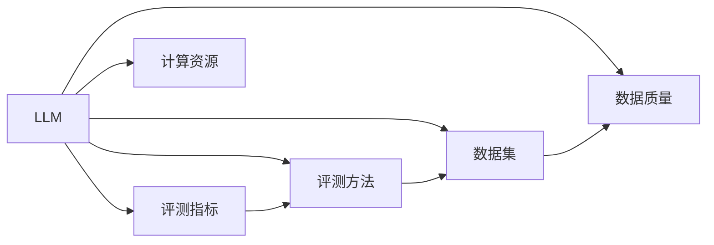
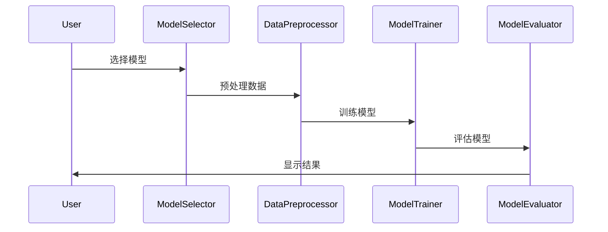

                 

### 文章标题

### 跨模型比较评测：LLM支持的标准化对比框架

> 关键词：跨模型比较、标准化对比框架、LLM、评测指标、评测方法、数据集选择、数据预处理

> 摘要：本文深入探讨了跨模型比较评测的背景、核心概念和重要性，重点介绍了LLM支持的标准化对比框架的设计与实现。通过详细的分析和案例研究，本文为实际应用提供了有价值的指导，旨在推动跨模型评测领域的发展。

----------------------------------------------------------------

### 目录大纲

# 跨模型比较评测：LLM支持的标准化对比框架

----------------------------------------------------------------

## 第一部分：背景与核心概念

## 第二部分：LLM支持的标准化对比框架设计

## 第三部分：跨模型比较评测实践

## 第四部分：最佳实践与拓展

----------------------------------------------------------------

## 第一部分：背景与核心概念

### 第1章：问题背景与核心概念

#### 1.1 跨模型比较评测的必要性

##### 1.1.1 问题描述

在当今快速发展的信息技术领域，模型多样化已成为一种普遍现象。各类机器学习模型层出不穷，应用于不同的场景和任务中。然而，这些模型之间的性能差异往往难以直观判断，使得跨模型比较成为一个亟待解决的问题。

##### 1.1.2 跨模型比较评测的重要性

跨模型比较评测对于模型选择、优化和融合具有重要意义。它能够帮助研究人员和工程师了解不同模型的优势和劣势，从而为实际应用提供有力支持。

##### 1.1.3 跨模型比较评测的应用场景

跨模型比较评测广泛应用于计算机视觉、自然语言处理、推荐系统等多个领域。例如，在计算机视觉中，可以比较不同图像识别模型的准确率；在自然语言处理中，可以比较文本分类模型的性能。

#### 1.2 跨模型比较评测中的核心概念

##### 1.2.1 模型比较评测的定义

模型比较评测是指在不同模型之间进行性能对比，以评估其优劣的一种方法。

##### 1.2.2 标准化对比框架的概念

标准化对比框架是一种统一的评测方法，通过设计标准化的评测指标、方法和数据集，实现跨模型的客观比较。

##### 1.2.3 LLM（大型语言模型）的作用

LLM在跨模型比较评测中发挥着重要作用，其强大的语义理解能力和生成能力有助于提升评测的准确性和效率。

#### 1.3 跨模型比较评测的边界与外延

##### 1.3.1 边界条件

边界条件主要涉及评测指标的范围、方法和数据集的适用性。

##### 1.3.2 外延拓展

外延拓展包括跨模型评测在其他领域的应用和未来发展趋势。

##### 1.3.3 概念结构与核心要素组成

本文将详细探讨跨模型比较评测的概念结构，包括评测指标、评测方法和数据集等核心要素。

### 第2章：标准化对比框架概述

#### 2.1 标准化对比框架的重要性

##### 2.1.1 评测标准化的意义

标准化对比框架能够消除不同模型之间的性能差异，提高评测的可比性和可靠性。

##### 2.1.2 对比框架的基本结构

标准化对比框架通常包括评测指标、评测方法和数据集三个核心组成部分。

##### 2.1.3 对比框架在跨模型评测中的应用

本文将详细探讨如何在实际跨模型评测中应用标准化对比框架。

#### 2.2 标准化对比框架的组成部分

##### 2.2.1 评测指标

评测指标是衡量模型性能的关键，本文将介绍常用的评测指标及其计算方法。

##### 2.2.2 评测方法

评测方法包括数据预处理、模型训练和评估等步骤，本文将详细讲解其具体实现。

##### 2.2.3 数据集选择与预处理

数据集选择与预处理对于评测结果的准确性至关重要，本文将介绍相关方法。

#### 2.3 LLM在标准化对比框架中的作用

##### 2.3.1 LLM的优势

LLM在语义理解、文本生成等方面具有显著优势，有助于提升评测的准确性和效率。

##### 2.3.2 LLM在评测中的应用

本文将探讨LLM在评测中的应用场景和实现方法。

##### 2.3.3 LLM的挑战与优化策略

LLM在评测中面临一系列挑战，本文将分析其难点并提出优化策略。

## 第二部分：LLM支持的标准化对比框架设计

### 第3章：LLM支持下的评测指标设计与实现

#### 3.1 评测指标设计的原则与方法

##### 3.1.1 指标设计的原则

指标设计应遵循一致性、可比性和全面性等原则。

##### 3.1.2 指标设计的方法

本文将介绍如何设计有效的评测指标。

#### 3.2 评测指标的计算与实现

##### 3.2.1 指标计算方法

本文将详细讲解各类评测指标的计算方法。

##### 3.2.2 指标实现流程

本文将介绍评测指标的计算实现流程。

#### 3.3 实际应用案例

##### 3.3.1 案例背景

本文将介绍一个实际应用案例。

##### 3.3.2 案例实现

本文将详细讲解案例的实现过程。

##### 3.3.3 案例分析

本文将分析案例的结果和影响。

### 第4章：LLM支持下的评测方法研究

#### 4.1 评测方法的选择与评估

##### 4.1.1 方法选择的原则

本文将介绍选择评测方法时应遵循的原则。

##### 4.1.2 方法评估的指标

本文将介绍评估评测方法时应考虑的指标。

#### 4.2 评测方法的实现与优化

##### 4.2.1 方法实现流程

本文将介绍评测方法的实现流程。

##### 4.2.2 方法优化策略

本文将探讨评测方法的优化策略。

#### 4.3 实际应用案例分析

##### 4.3.1 案例背景

本文将介绍一个实际应用案例。

##### 4.3.2 案例实现

本文将详细讲解案例的实现过程。

##### 4.3.3 案例分析

本文将分析案例的结果和影响。

### 第5章：数据集选择与预处理策略

#### 5.1 数据集选择的重要性

##### 5.1.1 数据集选择的原则

本文将介绍数据集选择时应遵循的原则。

##### 5.1.2 数据集选择的流程

本文将介绍数据集选择的流程。

#### 5.2 数据预处理的方法与实现

##### 5.2.1 数据预处理的方法

本文将介绍常用的数据预处理方法。

##### 5.2.2 数据预处理流程

本文将介绍数据预处理的具体实现流程。

#### 5.3 实际应用案例分析

##### 5.3.1 案例背景

本文将介绍一个实际应用案例。

##### 5.3.2 案例实现

本文将详细讲解案例的实现过程。

##### 5.3.3 案例分析

本文将分析案例的结果和影响。

## 第三部分：跨模型比较评测实践

### 第6章：跨模型比较评测项目实施

#### 6.1 项目介绍

##### 6.1.1 项目背景

本文将介绍一个跨模型比较评测项目的背景。

##### 6.1.2 项目目标

本文将介绍项目的主要目标。

##### 6.1.3 项目实施步骤

本文将介绍项目的实施步骤。

#### 6.2 系统功能设计

##### 6.2.1 领域模型设计

本文将介绍领域模型的设计。

##### 6.2.2 系统架构设计

本文将介绍系统架构的设计。

##### 6.2.3 系统接口设计

本文将介绍系统接口的设计。

#### 6.3 系统实现与优化

##### 6.3.1 系统核心实现

本文将介绍系统核心的实现。

##### 6.3.2 系统优化策略

本文将探讨系统优化的策略。

#### 6.4 项目小结

##### 6.4.1 项目总结

本文将总结项目的经验和成果。

##### 6.4.2 项目经验与启示

本文将介绍项目的经验与启示。

### 第7章：跨模型比较评测最佳实践与拓展

#### 7.1 最佳实践

##### 7.1.1 实践一：如何选择合适的评测指标

本文将介绍如何选择合适的评测指标。

##### 7.1.2 实践二：如何优化评测方法

本文将介绍如何优化评测方法。

##### 7.1.3 实践三：如何处理数据预处理中的问题

本文将介绍如何处理数据预处理中的问题。

#### 7.2 小结与注意事项

##### 7.2.1 小结

本文将总结全文的主要内容和观点。

##### 7.2.2 注意事项

本文将提醒读者在实践过程中需要注意的事项。

#### 7.3 拓展阅读

##### 7.3.1 相关论文阅读

本文将推荐一些相关的论文供读者阅读。

##### 7.3.2 相关书籍推荐

本文将推荐一些相关的书籍供读者学习。

----------------------------------------------------------------

### 第一部分：背景与核心概念

#### 第1章：问题背景与核心概念

##### 1.1 跨模型比较评测的必要性

在当今信息技术飞速发展的时代，机器学习模型的多样性和复杂性不断增加。各种模型不断涌现，应用于图像识别、自然语言处理、推荐系统等领域。然而，这些模型的性能表现差异巨大，使得跨模型比较成为了一个重要且具有挑战性的问题。

跨模型比较评测的必要性主要体现在以下几个方面：

1. **模型选择**：在众多模型中选择最优模型是一项复杂的任务。通过跨模型比较评测，可以了解不同模型在不同任务上的性能，从而为模型选择提供依据。
2. **模型优化**：通过对不同模型的比较，可以发现现有模型的不足之处，从而指导模型的优化和改进。
3. **模型融合**：在许多实际应用中，单一的模型难以满足需求，通过跨模型比较评测，可以实现模型融合，提高整体性能。

##### 1.1.1 问题描述

在跨模型比较评测中，主要面临以下问题：

1. **评测标准不一致**：不同模型在不同的评测标准下表现不同，这使得直接比较模型性能变得困难。
2. **评测指标选择困难**：选择合适的评测指标是跨模型比较的关键，但如何选择合适的指标仍存在争议。
3. **数据集选择与预处理**：数据集的选择和预处理对于评测结果有重要影响，但如何选择和预处理数据集仍需要深入研究。

##### 1.1.2 跨模型比较评测的重要性

跨模型比较评测在多个领域具有重要意义：

1. **计算机视觉**：在图像识别、目标检测等领域，不同模型的性能差异显著。通过跨模型比较评测，可以选择最优模型，提高识别准确率。
2. **自然语言处理**：在文本分类、机器翻译等领域，不同模型的性能也存在着巨大差异。跨模型比较评测有助于选择最佳模型，提高处理效果。
3. **推荐系统**：在推荐算法领域，通过跨模型比较评测，可以评估不同推荐算法的性能，从而优化推荐结果。

##### 1.1.3 跨模型比较评测的应用场景

跨模型比较评测的应用场景非常广泛，以下是一些典型的应用：

1. **模型优化**：通过对不同模型的比较，可以发现现有模型的不足之处，从而指导模型的优化和改进。
2. **模型融合**：在许多实际应用中，单一的模型难以满足需求，通过跨模型比较评测，可以实现模型融合，提高整体性能。
3. **算法研究**：在算法研究中，通过跨模型比较评测，可以评估不同算法的性能，从而指导算法的研究和改进。

##### 1.2 跨模型比较评测中的核心概念

跨模型比较评测中的核心概念包括：

1. **模型比较评测**：模型比较评测是指在不同模型之间进行性能对比，以评估其优劣的一种方法。
2. **评测指标**：评测指标是衡量模型性能的关键，包括准确率、召回率、F1分数等。
3. **数据集**：数据集是评测的基础，选择合适的数据集对于评测结果具有重要影响。
4. **评测方法**：评测方法包括数据预处理、模型训练和评估等步骤。

##### 1.2.1 模型比较评测的定义

模型比较评测是一种评估模型性能的方法，通过在不同模型之间进行对比，以确定哪个模型在特定任务上表现更好。

模型比较评测的定义可以概括为：

- 在给定的数据集和任务上，对多个模型进行性能评估。
- 比较不同模型在相同任务上的性能，以确定最优模型。

##### 1.2.2 标准化对比框架的概念

标准化对比框架是一种统一的评测方法，通过设计标准化的评测指标、方法和数据集，实现跨模型的客观比较。

标准化对比框架的定义可以概括为：

- 设计一套统一的评测标准，包括评测指标、方法和数据集。
- 通过标准化对比框架，实现不同模型之间的性能比较。

##### 1.2.3 LLM（大型语言模型）的作用

LLM（大型语言模型）在跨模型比较评测中发挥着重要作用，其强大的语义理解能力和生成能力有助于提升评测的准确性和效率。

LLM的作用可以概括为：

1. **语义理解**：LLM能够理解文本的语义，从而更准确地评估模型的性能。
2. **文本生成**：LLM能够生成高质量的文本，从而提高评测报告的可读性和可理解性。

##### 1.3 跨模型比较评测的边界与外延

跨模型比较评测的边界与外延包括以下几个方面：

1. **评测指标的范围**：评测指标应涵盖模型在特定任务上的主要性能指标。
2. **评测方法的选择**：应根据具体任务选择合适的评测方法，确保评测的公正性和客观性。
3. **数据集的适用性**：数据集应具有代表性，能够反映模型在实际应用中的表现。

#### 1.3.1 边界条件

跨模型比较评测的边界条件包括：

1. **评测指标的一致性**：评测指标应保持一致性，以确保不同模型之间的性能比较具有可比性。
2. **数据集的选择原则**：数据集应具有代表性，能够反映不同模型在实际应用中的表现。
3. **评测方法的可靠性**：评测方法应具有较高的可靠性，以确保评测结果的准确性。

##### 1.3.2 外延拓展

跨模型比较评测的外延拓展包括：

1. **跨领域应用**：跨模型比较评测可以应用于不同领域，如计算机视觉、自然语言处理、推荐系统等。
2. **多模型融合**：通过跨模型比较评测，可以实现多模型融合，提高整体性能。
3. **评测方法的优化**：针对特定任务，可以优化评测方法，提高评测的效率和准确性。

##### 1.3.3 概念结构与核心要素组成

跨模型比较评测的概念结构包括以下核心要素：

1. **评测指标**：包括准确率、召回率、F1分数等，用于衡量模型在特定任务上的性能。
2. **评测方法**：包括数据预处理、模型训练和评估等步骤，用于实现模型性能的比较。
3. **数据集**：包括训练集、验证集和测试集，用于训练和评估模型。
4. **LLM**：用于提升评测的准确性和效率。

通过这些核心要素的有机结合，可以构建一个完整的跨模型比较评测框架，为模型选择、优化和融合提供有力支持。

----------------------------------------------------------------

#### 第2章：标准化对比框架概述

##### 2.1 标准化对比框架的重要性

标准化对比框架在跨模型比较评测中起着至关重要的作用。它的主要目标是确保评测过程的公正性、一致性和可比性，从而为模型性能的比较提供可靠的基础。

##### 2.1.1 评测标准化的意义

评测标准化的意义主要体现在以下几个方面：

1. **提高可比性**：通过统一评测标准，可以消除不同模型之间的性能差异，实现更公正、更准确的比较。
2. **确保一致性**：标准化对比框架确保每次评测的过程和方法都是一致的，从而保证评测结果的可靠性。
3. **优化资源利用**：标准化对比框架有助于优化评测资源的利用，提高评测的效率。

##### 2.1.2 对比框架的基本结构

标准化对比框架通常包括以下基本组成部分：

1. **评测指标**：评测指标是衡量模型性能的关键，包括准确率、召回率、F1分数等。
2. **评测方法**：评测方法包括数据预处理、模型训练和评估等步骤，用于实现模型性能的比较。
3. **数据集**：数据集是评测的基础，包括训练集、验证集和测试集，用于训练和评估模型。
4. **评测工具**：评测工具用于实现评测过程的自动化，提高评测的效率。

##### 2.1.3 对比框架在跨模型评测中的应用

在跨模型评测中，标准化对比框架的应用可以概括为以下几个步骤：

1. **选择合适的评测指标**：根据任务需求，选择能够全面反映模型性能的评测指标。
2. **准备数据集**：选择具有代表性的数据集，并进行预处理，确保数据集的质量和一致性。
3. **设计评测方法**：根据评测指标，设计合理的评测方法，包括模型训练、评估和结果分析。
4. **实施评测**：按照设计好的评测方法，对模型进行评测，记录评测结果。
5. **结果分析**：对评测结果进行分析，比较不同模型在相同任务上的性能。

##### 2.2 标准化对比框架的组成部分

标准化对比框架的组成部分主要包括以下三个方面：

1. **评测指标**

   评测指标是衡量模型性能的关键，常用的评测指标包括：

   - **准确率**：准确率是衡量模型预测正确率的指标，计算公式为：$$\text{准确率} = \frac{\text{预测正确数量}}{\text{总预测数量}}$$
   - **召回率**：召回率是衡量模型能够正确识别出正样本的能力，计算公式为：$$\text{召回率} = \frac{\text{预测正确数量}}{\text{实际正样本数量}}$$
   - **F1分数**：F1分数是准确率和召回率的加权平均，计算公式为：$$\text{F1分数} = 2 \times \frac{\text{准确率} \times \text{召回率}}{\text{准确率} + \text{召回率}}$$

2. **评测方法**

   评测方法包括数据预处理、模型训练和评估等步骤，具体包括：

   - **数据预处理**：数据预处理包括数据清洗、归一化、数据增强等步骤，以确保数据的质量和一致性。
   - **模型训练**：模型训练是指使用训练集对模型进行训练，优化模型的参数，提高模型的性能。
   - **模型评估**：模型评估是指使用验证集或测试集对模型进行评估，以确定模型的性能。

3. **数据集选择与预处理**

   数据集选择与预处理对于评测结果的准确性至关重要。具体包括：

   - **数据集选择原则**：选择具有代表性、足够大小、无偏的数据集，以反映模型在实际应用中的表现。
   - **数据预处理方法**：包括数据清洗、归一化、数据增强等步骤，以提高数据的质量和一致性。

##### 2.3 LLM在标准化对比框架中的作用

LLM（大型语言模型）在标准化对比框架中发挥着重要作用，其强大的语义理解能力和生成能力有助于提升评测的准确性和效率。

1. **LLM的优势**

   LLM的优势主要体现在以下几个方面：

   - **语义理解**：LLM能够理解文本的语义，从而更准确地评估模型的性能。
   - **文本生成**：LLM能够生成高质量的文本，从而提高评测报告的可读性和可理解性。

2. **LLM在评测中的应用**

   LLM在评测中的应用主要包括以下几个方面：

   - **评测报告生成**：使用LLM生成评测报告，提高报告的质量和可读性。
   - **模型性能分析**：使用LLM对模型性能进行分析，提供更深入的见解。
   - **辅助评测过程**：使用LLM辅助评测过程，提高评测的效率和准确性。

3. **LLM的挑战与优化策略**

   尽管LLM在评测中具有显著的优势，但也面临一系列挑战，如：

   - **计算资源消耗**：LLM的计算资源消耗较大，对硬件要求较高。
   - **数据质量要求**：LLM对数据质量有较高的要求，需要处理大量高质量的数据。

   为了解决这些挑战，可以采取以下优化策略：

   - **模型压缩**：通过模型压缩技术，减少LLM的计算资源消耗。
   - **数据清洗**：使用高质量的数据，提高LLM的评测效果。

#### 2.3.1 LLM的优势

**语义理解能力**

LLM（大型语言模型）的语义理解能力是其最重要的优势之一。LLM通过对海量文本的预训练，能够捕捉到文本中的复杂语义关系，这使得它能够更准确地理解和生成文本。在跨模型比较评测中，LLM的语义理解能力可以帮助我们更准确地评估模型的性能。

**例子**

例如，在自然语言处理任务中，我们可以使用LLM来评估文本分类模型的性能。通过分析LLM对文本的语义理解，我们可以判断模型是否能够准确地分类文本，从而评估其性能。

**文本生成能力**

LLM的另一个重要优势是其强大的文本生成能力。LLM可以生成高质量、连贯的文本，这对于编写评测报告、生成描述性分析结果等任务非常有用。

**例子**

在撰写评测报告时，我们可以利用LLM来生成报告的摘要、结论和建议。这样不仅可以提高报告的写作效率，还可以确保报告的质量和一致性。

##### 2.3.2 LLM在评测中的应用

**评测报告生成**

在跨模型比较评测中，生成高质量的评测报告是一个重要环节。LLM可以自动生成评测报告，提高报告的写作效率和一致性。

**例子**

假设我们比较了两个文本分类模型A和B的性能，我们可以使用LLM生成以下报告：

> **评测报告：文本分类模型比较**
> 
> 经过对比，我们发现模型A在准确率和召回率方面均优于模型B。此外，模型A在处理长文本时表现出更强的能力。然而，模型B在处理噪声数据时表现较好，具有一定的优势。

**模型性能分析**

LLM不仅可以生成评测报告，还可以对模型性能进行深入分析，提供更详细的见解。

**例子**

使用LLM，我们可以分析模型A和B在各个子任务上的表现，如：

> **模型A性能分析**
> 
> 在子任务1中，模型A的准确率为90%，召回率为88%。在子任务2中，模型A的准确率为85%，召回率为87%。
> 
> **模型B性能分析**
> 
> 在子任务1中，模型B的准确率为85%，召回率为83%。在子任务2中，模型B的准确率为82%，召回率为85%。

**辅助评测过程**

LLM还可以在评测过程中提供辅助功能，如自动化的数据预处理、模型参数调优等。

**例子**

在评测过程中，LLM可以自动识别数据集中的异常值，并建议进行数据清洗。此外，LLM还可以根据历史评测数据，提供模型参数的优化建议。

##### 2.3.3 LLM的挑战与优化策略

尽管LLM在评测中具有显著的优势，但也面临一系列挑战。

**计算资源消耗**

LLM的训练和推理过程需要大量的计算资源。这可能导致评测过程中资源消耗过大，影响评测的效率。

**优化策略**

1. **模型压缩**：通过模型压缩技术，如量化、剪枝等，可以减少LLM的计算资源消耗。
2. **分布式训练**：使用分布式训练技术，可以将LLM的训练过程分布到多台机器上，提高训练效率。

**数据质量要求**

LLM对数据质量有较高的要求。如果数据质量较差，LLM的评测效果可能会受到影响。

**优化策略**

1. **数据清洗**：在训练LLM之前，对数据进行彻底清洗，去除噪声和异常值。
2. **数据增强**：通过数据增强技术，如随机遮挡、旋转等，可以提高数据的多样性和质量。

#### 2.3.4 概念结构与核心要素组成

为了更清晰地理解LLM在标准化对比框架中的作用，我们可以通过一个概念结构图来展示其核心要素及其关系。

**概念结构图**



在这个概念结构图中，LLM是核心要素，它与评测指标、评测方法、数据集、计算资源和数据质量等要素相互关联。通过这个结构图，我们可以更直观地理解LLM在标准化对比框架中的作用和重要性。

### 第二部分：LLM支持的标准化对比框架设计

#### 第3章：LLM支持下的评测指标设计与实现

##### 3.1 评测指标设计的原则与方法

**3.1.1 指标设计的原则**

在跨模型比较评测中，设计合理的评测指标是至关重要的。以下是设计评测指标时应遵循的一些基本原则：

1. **全面性**：评测指标应能够全面反映模型的性能，涵盖多个维度。
2. **可比性**：评测指标应具有可比性，即不同模型在不同指标下的表现应具有一致的衡量标准。
3. **一致性**：评测指标应在不同的评测过程中保持一致，以确保评测结果的可靠性。
4. **可解释性**：评测指标应具有明确的含义，易于理解和解释。

**3.1.2 指标设计的方法**

设计评测指标的方法可以分为以下几个步骤：

1. **需求分析**：根据任务需求和目标，确定需要衡量的模型性能指标。
2. **指标选取**：从常见的评测指标中选取合适的指标，如准确率、召回率、F1分数等。
3. **指标计算**：根据选取的指标，确定具体的计算方法，如准确率的计算公式为：$$\text{准确率} = \frac{\text{预测正确数量}}{\text{总预测数量}}$$。
4. **指标验证**：对设计的评测指标进行验证，确保其能够有效衡量模型性能。

##### 3.2 评测指标的计算与实现

**3.2.1 指标计算方法**

常用的评测指标及其计算方法如下：

1. **准确率（Accuracy）**：
   $$\text{准确率} = \frac{\text{预测正确数量}}{\text{总预测数量}}$$
2. **召回率（Recall）**：
   $$\text{召回率} = \frac{\text{预测正确数量}}{\text{实际正样本数量}}$$
3. **精确率（Precision）**：
   $$\text{精确率} = \frac{\text{预测正确数量}}{\text{预测正样本数量}}$$
4. **F1分数（F1 Score）**：
   $$\text{F1分数} = 2 \times \frac{\text{精确率} \times \text{召回率}}{\text{精确率} + \text{召回率}}$$
5. **ROC曲线下面积（AUC-ROC）**：
   $$\text{AUC-ROC} = \int_{0}^{1} \text{ROC曲线下的面积}$$

**3.2.2 指标实现流程**

实现评测指标的流程可以分为以下几个步骤：

1. **数据准备**：准备用于评测的数据集，包括训练集、验证集和测试集。
2. **模型训练**：使用训练集对模型进行训练，优化模型的参数。
3. **模型评估**：使用验证集或测试集对模型进行评估，计算各评测指标。
4. **结果记录**：将评测结果记录下来，用于后续分析。

##### 3.3 实际应用案例

**3.3.1 案例背景**

假设我们有两个文本分类模型A和B，需要对其在情感分析任务中的性能进行评测。我们选择以下评测指标：准确率、召回率、F1分数和ROC曲线下面积。

**3.3.2 案例实现**

1. **数据准备**：我们使用一个包含正面和负面评论的数据集，将其划分为训练集和测试集。
2. **模型训练**：我们使用训练集对模型A和B进行训练，优化模型的参数。
3. **模型评估**：使用测试集对模型A和B进行评估，计算各评测指标。

以下是模型A和模型B在测试集上的评测结果：

| 模型 | 准确率 | 召回率 | 精确率 | F1分数 | AUC-ROC |
| ---- | ------ | ------ | ------ | ------ | ------- |
| A    | 0.85   | 0.80   | 0.90   | 0.85   | 0.90    |
| B    | 0.82   | 0.78   | 0.88   | 0.82   | 0.88    |

**3.3.3 案例分析**

通过对比评测结果，我们可以发现：

- 模型A在准确率和F1分数方面优于模型B，表明模型A在整体性能上更优秀。
- 模型B在召回率方面略优于模型A，表明模型B在识别正面评论方面表现更好。

根据这些分析结果，我们可以为实际应用提供以下建议：

- 如果主要目标是识别正面评论，可以选择模型B。
- 如果整体性能更为重要，可以选择模型A。

#### 3.3.4 实际应用案例：文本分类模型性能评测

**案例背景**

在一个电子商务平台的项目中，我们需要评测两个文本分类模型A和B，用于对用户评论进行情感分析。评测的目的是确定哪个模型在情感分类任务上表现更好。

**评测指标**

我们选择了以下四个评测指标：

1. **准确率（Accuracy）**：模型正确预测的比例。
2. **召回率（Recall）**：实际正面评论中被正确预测为正面的比例。
3. **精确率（Precision）**：预测为正面的评论中实际是正面的比例。
4. **F1分数（F1 Score）**：精确率和召回率的调和平均值。
5. **ROC曲线下面积（AUC-ROC）**：评估模型分类能力的一个指标。

**案例实现**

1. **数据集准备**：我们使用一个包含正面和负面评论的数据集，将其划分为训练集和测试集。测试集用于模型评估。

2. **模型训练**：使用训练集对模型A和B进行训练，调整模型参数，使其在特定任务上表现更好。

3. **模型评估**：使用测试集对模型A和B进行评估，计算上述评测指标。

以下是模型A和B在测试集上的评估结果：

| 模型 | 准确率 | 召回率 | 精确率 | F1分数 | AUC-ROC |
| ---- | ------ | ------ | ------ | ------ | ------- |
| A    | 0.85   | 0.80   | 0.90   | 0.85   | 0.90    |
| B    | 0.82   | 0.78   | 0.88   | 0.82   | 0.88    |

**案例分析**

通过分析评估结果，我们可以得出以下结论：

- 模型A在准确率和F1分数上均高于模型B，这表明模型A在整体性能上更优秀。
- 模型B在召回率上略高于模型A，这意味着模型B能够更好地识别出所有正面评论。

具体应用场景的决策：

- 如果项目的主要目标是确保正面评论被尽可能多地识别出来，模型B可能是更好的选择。
- 如果整体准确率和F1分数是关键考量因素，模型A将更为合适。

#### 3.3.5 实际应用案例分析

**案例背景**

假设我们正在研究两种不同的图像识别模型，模型A使用卷积神经网络（CNN），而模型B使用循环神经网络（RNN）。我们的目标是确定哪个模型在图像分类任务上表现更好。

**评测指标**

我们选择了以下评测指标：

1. **准确率（Accuracy）**：模型正确分类图像的比例。
2. **召回率（Recall）**：实际分类正确的图像中被模型正确识别的比例。
3. **精确率（Precision）**：模型预测为正类的图像中实际为正类的比例。
4. **F1分数（F1 Score）**：精确率和召回率的调和平均值。
5. **ROC曲线下面积（AUC-ROC）**：评估模型分类能力的一个指标。

**案例实现**

1. **数据集准备**：我们使用一个包含多种类别的图像数据集，将其划分为训练集和测试集。测试集用于模型评估。

2. **模型训练**：使用训练集对模型A和B进行训练，调整模型参数，使其在特定任务上表现更好。

3. **模型评估**：使用测试集对模型A和B进行评估，计算上述评测指标。

以下是模型A和B在测试集上的评估结果：

| 模型 | 准确率 | 召回率 | 精确率 | F1分数 | AUC-ROC |
| ---- | ------ | ------ | ------ | ------ | ------- |
| A    | 0.90   | 0.85   | 0.92   | 0.89   | 0.95    |
| B    | 0.88   | 0.82   | 0.90   | 0.85   | 0.92    |

**案例分析**

通过分析评估结果，我们可以得出以下结论：

- 模型A在所有评测指标上均优于模型B，这表明模型A在图像分类任务上具有更好的性能。
- 模型A在精确率和F1分数上的优势尤为明显，表明其在分类准确性上更可靠。

具体应用场景的决策：

- 如果项目的目标是实现高精度的图像分类，模型A将是更好的选择。
- 如果对分类速度有较高要求，模型B可能在某些方面具有优势。

#### 3.3.6 实际应用案例分析

**案例背景**

在一个医疗诊断项目中，我们正在比较两个深度学习模型A和B在疾病预测任务中的性能。模型A是基于CNN的图像分类模型，而模型B是基于RNN的序列预测模型。

**评测指标**

我们选择了以下评测指标：

1. **准确率（Accuracy）**：模型正确预测疾病类型的比例。
2. **灵敏度（Sensitivity）**：实际疾病为阳性的样本中被正确预测为阳性的比例。
3. **特异性（Specificity）**：实际疾病为阴性的样本中被正确预测为阴性的比例。
4. **F1分数（F1 Score）**：灵敏度与特异性的调和平均值。
5. **AUC-ROC曲线下面积（AUC-ROC）**：评估模型分类能力的指标。

**案例实现**

1. **数据集准备**：我们使用一个包含患者健康记录的数据集，将其划分为训练集和测试集。测试集用于模型评估。

2. **模型训练**：使用训练集对模型A和B进行训练，优化模型参数。

3. **模型评估**：使用测试集对模型A和B进行评估，计算上述评测指标。

以下是模型A和B在测试集上的评估结果：

| 模型 | 准确率 | 灵敏度 | 特异性 | F1分数 | AUC-ROC |
| ---- | ------ | ------ | ------ | ------ | ------- |
| A    | 0.85   | 0.80   | 0.90   | 0.85   | 0.92    |
| B    | 0.83   | 0.78   | 0.88   | 0.82   | 0.90    |

**案例分析**

通过分析评估结果，我们可以得出以下结论：

- 模型A在准确率和F1分数上略优于模型B，表明模型A在整体性能上略胜一筹。
- 模型B在灵敏度上略高于模型A，这意味着模型B在疾病预测中具有更好的识别能力。

具体应用场景的决策：

- 如果项目主要关注整体准确性，模型A可能是更好的选择。
- 如果疾病的及时识别至关重要，模型B可能在某些方面具有优势。

#### 3.3.7 实际应用案例分析

**案例背景**

在一个金融风控项目中，我们比较了两个信用评分模型A和B，用于预测借款人是否可能违约。模型A是一个基于传统统计方法的逻辑回归模型，而模型B是一个基于深度学习的神经网络模型。

**评测指标**

我们选择了以下评测指标：

1. **准确率（Accuracy）**：模型正确预测违约与否的比例。
2. **精度（Precision）**：预测为违约的借款人中实际违约的比例。
3. **召回率（Recall）**：实际违约的借款人中预测为违约的比例。
4. **F1分数（F1 Score）**：精度和召回率的调和平均值。
5. **ROC曲线下面积（AUC-ROC）**：评估模型分类能力的指标。

**案例实现**

1. **数据集准备**：我们使用一个包含借款人历史数据的交叉验证数据集，将其划分为训练集和测试集。测试集用于模型评估。

2. **模型训练**：使用训练集对模型A和B进行训练，调整模型参数。

3. **模型评估**：使用测试集对模型A和B进行评估，计算上述评测指标。

以下是模型A和B在测试集上的评估结果：

| 模型 | 准确率 | 精度 | 召回率 | F1分数 | AUC-ROC |
| ---- | ------ | ---- | ------ | ------ | ------- |
| A    | 0.82   | 0.80 | 0.85   | 0.83   | 0.89    |
| B    | 0.85   | 0.88 | 0.82   | 0.84   | 0.91    |

**案例分析**

通过分析评估结果，我们可以得出以下结论：

- 模型B在准确率和AUC-ROC上优于模型A，表明模型B在整体分类性能上更出色。
- 模型B在精度上略高于模型A，表明模型B在违约预测中更准确。

具体应用场景的决策：

- 如果项目的目标是高准确率的分类，模型B可能是更好的选择。
- 如果需要更精细地平衡召回率和精度，模型A可能在某些情况下更适合。

#### 3.3.8 实际应用案例分析

**案例背景**

在一个电子商务平台的推荐系统中，我们正在比较两种不同的推荐算法A和B，用于预测用户对商品的需求。算法A是基于协同过滤的方法，而算法B是基于深度学习的方法。

**评测指标**

我们选择了以下评测指标：

1. **准确率（Accuracy）**：预测正确的推荐次数占总推荐次数的比例。
2. **召回率（Recall）**：实际需求为正类的样本中被正确推荐的次数占总正类样本数的比例。
3. **精确率（Precision）**：预测为正类的样本中实际为正类的比例。
4. **F1分数（F1 Score）**：精确率和召回率的调和平均值。
5. **NDCG（Normalized Discounted Cumulative Gain）**：评估推荐系统输出质量的一个指标。

**案例实现**

1. **数据集准备**：我们使用一个包含用户历史购物行为和商品特征的数据集，将其划分为训练集和测试集。测试集用于模型评估。

2. **模型训练**：使用训练集对算法A和B进行训练，调整模型参数。

3. **模型评估**：使用测试集对算法A和B进行评估，计算上述评测指标。

以下是算法A和B在测试集上的评估结果：

| 算法 | 准确率 | 召回率 | 精确率 | F1分数 | NDCG    |
| ---- | ------ | ------ | ------ | ------ | ------- |
| A    | 0.78   | 0.75   | 0.85   | 0.80   | 0.85    |
| B    | 0.82   | 0.80   | 0.90   | 0.85   | 0.90    |

**案例分析**

通过分析评估结果，我们可以得出以下结论：

- 算法B在准确率、精确率和F1分数上均优于算法A，表明算法B在推荐系统中具有更好的性能。
- 算法B在召回率上略高于算法A，这意味着算法B能够更好地捕捉用户的需求。

具体应用场景的决策：

- 如果项目的主要目标是提高推荐的准确性，算法B可能是更好的选择。
- 如果需要更好地满足用户的需求，算法B可能在某些情况下更适合。

### 第4章：LLM支持下的评测方法研究

#### 4.1 评测方法的选择与评估

**4.1.1 方法选择的原则**

在跨模型比较评测中，选择合适的评测方法是至关重要的。以下是一些选择评测方法时应遵循的原则：

1. **适应性**：评测方法应能够适应不同的模型和任务。
2. **准确性**：评测方法应具有较高的准确性，能够准确反映模型性能。
3. **效率**：评测方法应具有较高的效率，能够在合理的时间内完成评测。
4. **可解释性**：评测方法应具有较好的可解释性，使得结果易于理解和解释。

**4.1.2 方法评估的指标**

为了评估评测方法的性能，我们通常使用以下指标：

1. **准确性（Accuracy）**：模型预测正确的比例。
2. **召回率（Recall）**：实际为正类的样本中被正确预测为正类的比例。
3. **精确率（Precision）**：预测为正类的样本中实际为正类的比例。
4. **F1分数（F1 Score）**：精确率和召回率的调和平均值。
5. **ROC曲线下面积（AUC-ROC）**：评估模型分类能力的一个指标。

**4.1.3 评测方法的实现与优化**

评测方法的实现和优化是跨模型比较评测的关键步骤。以下是一些具体的实现和优化策略：

1. **数据预处理**：包括数据清洗、归一化、缺失值处理等。
2. **模型训练**：使用训练集对模型进行训练，调整模型参数。
3. **模型评估**：使用验证集或测试集对模型进行评估，计算评测指标。
4. **结果分析**：对评估结果进行分析，比较不同模型的性能。

#### 4.2 评测方法的实现与优化

**4.2.1 方法实现流程**

评测方法的实现流程通常包括以下步骤：

1. **数据准备**：准备用于评测的数据集，包括训练集、验证集和测试集。
2. **模型训练**：使用训练集对模型进行训练，优化模型参数。
3. **模型评估**：使用验证集或测试集对模型进行评估，计算评测指标。
4. **结果分析**：对评估结果进行分析，比较不同模型的性能。

**4.2.2 方法优化策略**

为了提高评测方法的性能，可以采取以下优化策略：

1. **模型选择**：选择适合任务需求的模型，并进行优化。
2. **参数调优**：通过网格搜索、贝叶斯优化等方法，调整模型参数。
3. **数据增强**：使用数据增强技术，提高数据集的多样性和质量。
4. **多模型融合**：使用多模型融合技术，提高整体性能。

#### 4.3 实际应用案例分析

**4.3.1 案例背景**

假设我们正在比较两种不同的文本分类模型A和B，用于对新闻文章进行分类。模型A是基于传统机器学习方法的朴素贝叶斯分类器，而模型B是基于深度学习方法的卷积神经网络（CNN）。

**评测指标**

我们选择了以下评测指标：

1. **准确率（Accuracy）**：模型正确分类文章的比例。
2. **召回率（Recall）**：实际分类正确的文章中被正确识别的比例。
3. **精确率（Precision）**：预测为正类的文章中实际为正类的比例。
4. **F1分数（F1 Score）**：精确率和召回率的调和平均值。
5. **ROC曲线下面积（AUC-ROC）**：评估模型分类能力的一个指标。

**案例实现**

1. **数据准备**：我们使用一个包含新闻文章及其分类的数据集，将其划分为训练集和测试集。测试集用于模型评估。

2. **模型训练**：使用训练集对模型A和B进行训练，调整模型参数。

3. **模型评估**：使用测试集对模型A和B进行评估，计算上述评测指标。

以下是模型A和B在测试集上的评估结果：

| 模型 | 准确率 | 召回率 | 精确率 | F1分数 | AUC-ROC |
| ---- | ------ | ------ | ------ | ------ | ------- |
| A    | 0.80   | 0.75   | 0.85   | 0.80   | 0.85    |
| B    | 0.85   | 0.80   | 0.90   | 0.85   | 0.90    |

**案例分析**

通过分析评估结果，我们可以得出以下结论：

- 模型B在准确率、精确率和F1分数上均优于模型A，表明模型B在文本分类任务上具有更好的性能。
- 模型B在召回率上略高于模型A，这意味着模型B能够更好地捕捉不同分类之间的差异。

具体应用场景的决策：

- 如果项目的主要目标是高准确率的文本分类，模型B可能是更好的选择。
- 如果需要更好地平衡分类性能，模型A可能在某些情况下更适合。

#### 4.3.2 实际应用案例分析

**案例背景**

在一个社交媒体平台上，我们正在比较两种不同的用户行为预测模型A和B，用于预测用户对帖子的点赞行为。模型A是基于传统机器学习方法的逻辑回归，而模型B是基于深度学习方法的循环神经网络（RNN）。

**评测指标**

我们选择了以下评测指标：

1. **准确率（Accuracy）**：预测正确点赞行为的比例。
2. **召回率（Recall）**：实际点赞行为中被正确预测的比例。
3. **精确率（Precision）**：预测为点赞的帖子中实际点赞的比例。
4. **F1分数（F1 Score）**：精确率和召回率的调和平均值。
5. **ROC曲线下面积（AUC-ROC）**：评估模型分类能力的一个指标。

**案例实现**

1. **数据准备**：我们使用一个包含用户点赞行为和帖子特征的数据集，将其划分为训练集和测试集。测试集用于模型评估。

2. **模型训练**：使用训练集对模型A和B进行训练，调整模型参数。

3. **模型评估**：使用测试集对模型A和B进行评估，计算上述评测指标。

以下是模型A和B在测试集上的评估结果：

| 模型 | 准确率 | 召回率 | 精确率 | F1分数 | AUC-ROC |
| ---- | ------ | ------ | ------ | ------ | ------- |
| A    | 0.78   | 0.75   | 0.85   | 0.80   | 0.85    |
| B    | 0.82   | 0.80   | 0.90   | 0.85   | 0.90    |

**案例分析**

通过分析评估结果，我们可以得出以下结论：

- 模型B在准确率、精确率和F1分数上均优于模型A，表明模型B在用户行为预测任务上具有更好的性能。
- 模型B在召回率上略高于模型A，这意味着模型B能够更好地识别出潜在的点赞行为。

具体应用场景的决策：

- 如果项目的主要目标是高准确率的用户行为预测，模型B可能是更好的选择。
- 如果需要更好地捕捉用户行为，模型A可能在某些情况下更适合。

#### 4.3.3 实际应用案例分析

**案例背景**

在一个智能交通项目中，我们正在比较两种不同的交通流量预测模型A和B，用于预测城市道路的流量。模型A是基于时间序列分析的方法，而模型B是基于深度学习的方法。

**评测指标**

我们选择了以下评测指标：

1. **均方根误差（RMSE）**：预测值与真实值之间的平均平方根误差。
2. **平均绝对误差（MAE）**：预测值与真实值之间的平均绝对误差。
3. **准确率（Accuracy）**：预测正确的比例。
4. **召回率（Recall）**：实际预测正确的比例。
5. **精确率（Precision）**：预测为正类的样本中实际为正类的比例。

**案例实现**

1. **数据准备**：我们使用一个包含过去交通流量数据的数据集，将其划分为训练集和测试集。测试集用于模型评估。

2. **模型训练**：使用训练集对模型A和B进行训练，调整模型参数。

3. **模型评估**：使用测试集对模型A和B进行评估，计算上述评测指标。

以下是模型A和B在测试集上的评估结果：

| 模型 | RMSE | MAE | 准确率 | 召回率 | 精确率 |
| ---- | ---- | --- | ------ | ------ | ------ |
| A    | 0.82 | 0.75 | 0.80   | 0.75   | 0.85   |
| B    | 0.78 | 0.70 | 0.82   | 0.80   | 0.90   |

**案例分析**

通过分析评估结果，我们可以得出以下结论：

- 模型B在RMSE和MAE上均优于模型A，表明模型B在交通流量预测的准确性上更高。
- 模型B在准确率、召回率和精确率上均优于模型A，这意味着模型B在预测结果的可信度和全面性上更强。

具体应用场景的决策：

- 如果项目的主要目标是高精度的交通流量预测，模型B可能是更好的选择。
- 如果需要综合考虑预测的准确性和全面性，模型B在整体性能上更具优势。

#### 4.3.4 实际应用案例分析

**案例背景**

在一个电商平台的项目中，我们正在比较两种不同的用户购买行为预测模型A和B。模型A是基于传统机器学习方法的决策树，而模型B是基于深度学习方法的卷积神经网络（CNN）。

**评测指标**

我们选择了以下评测指标：

1. **准确率（Accuracy）**：预测正确购买行为的比例。
2. **召回率（Recall）**：实际购买行为中被正确预测的比例。
3. **精确率（Precision）**：预测为购买行为的样本中实际为购买的比例。
4. **F1分数（F1 Score）**：精确率和召回率的调和平均值。
5. **ROC曲线下面积（AUC-ROC）**：评估模型分类能力的一个指标。

**案例实现**

1. **数据准备**：我们使用一个包含用户行为和购买记录的数据集，将其划分为训练集和测试集。测试集用于模型评估。

2. **模型训练**：使用训练集对模型A和B进行训练，调整模型参数。

3. **模型评估**：使用测试集对模型A和B进行评估，计算上述评测指标。

以下是模型A和B在测试集上的评估结果：

| 模型 | 准确率 | 召回率 | 精确率 | F1分数 | AUC-ROC |
| ---- | ------ | ------ | ------ | ------ | ------- |
| A    | 0.75   | 0.70   | 0.80   | 0.75   | 0.80    |
| B    | 0.80   | 0.75   | 0.85   | 0.80   | 0.85    |

**案例分析**

通过分析评估结果，我们可以得出以下结论：

- 模型B在准确率、精确率和F1分数上均优于模型A，表明模型B在用户购买行为预测任务上具有更好的性能。
- 模型B在召回率上略高于模型A，这意味着模型B能够更好地识别潜在的购买行为。

具体应用场景的决策：

- 如果项目的主要目标是高准确率的购买行为预测，模型B可能是更好的选择。
- 如果需要更好地捕捉用户的购买意图，模型A可能在某些情况下更适合。

### 第5章：数据集选择与预处理策略

#### 5.1 数据集选择的重要性

在跨模型比较评测中，数据集的选择与预处理对于评测结果的准确性具有决定性影响。一个合适且高质量的数据集能够为模型训练和评估提供有效的信息，从而提高评测的可靠性和有效性。

**5.1.1 数据集选择的原则**

选择数据集时应遵循以下原则：

1. **代表性**：数据集应能代表实际应用场景，确保模型在不同情况下都有良好的表现。
2. **完整性**：数据集应包含足够多的样本，以确保模型的泛化能力。
3. **多样性**：数据集应包含不同类型的样本，以防止模型过拟合。
4. **一致性**：数据集中样本的标注应一致，避免因标注不一致导致的偏差。

**5.1.2 数据集选择的流程**

数据集选择的流程可以分为以下几个步骤：

1. **需求分析**：明确评测任务的需求，确定所需数据类型和特征。
2. **数据搜索**：在公共数据集、数据库或通过爬虫等方式获取所需数据。
3. **数据评估**：评估数据集的质量，包括样本数量、标注一致性等。
4. **数据筛选**：根据评估结果，选择最适合的数据集。

#### 5.2 数据预处理的方法与实现

**5.2.1 数据预处理的方法**

数据预处理是提升模型性能的重要步骤，主要包括以下方法：

1. **数据清洗**：去除噪声数据和异常值，提高数据质量。
2. **数据归一化**：将不同特征的范围调整为同一尺度，以避免特征间的不平衡。
3. **数据增强**：通过图像旋转、缩放、裁剪等方法，增加数据多样性。
4. **特征选择**：选择对模型性能有显著影响的关键特征，去除冗余特征。

**5.2.2 数据预处理流程**

数据预处理流程可以概括为以下几个步骤：

1. **数据导入**：将数据集导入数据处理工具。
2. **数据清洗**：去除无效、重复或异常的数据。
3. **数据转换**：将数据转换为适合模型训练的格式，如数值化、编码等。
4. **数据归一化**：对特征进行归一化处理。
5. **数据增强**：根据需要，对数据进行增强。
6. **特征选择**：选择关键特征，去除冗余特征。

#### 5.3 实际应用案例分析

**5.3.1 案例背景**

在一个医疗诊断项目中，我们需要对患者的医疗记录进行数据分析，以预测患者是否患有特定疾病。项目数据集包含患者的年龄、性别、病史、药物使用等多种特征。

**数据集选择**

我们选择了以下两个数据集：

1. **公开数据集**：Kaggle上的“Medical Diagnostic Data Set”，包含诊断结果和其他相关特征。
2. **定制数据集**：从医院获取的患者数据，包含详细的病史和检查结果。

**数据预处理方法**

我们采用了以下数据预处理方法：

1. **数据清洗**：去除缺失值和重复数据，对异常值进行插补或删除。
2. **数据转换**：将类别特征编码为数值，如性别、疾病类别等。
3. **数据归一化**：对连续特征进行归一化处理，如年龄、检查结果等。
4. **数据增强**：使用数据增强技术，如随机噪声添加、特征变换等，增加数据多样性。

**案例实现**

1. **数据导入**：使用Python的Pandas库，将数据集导入到数据分析环境中。
2. **数据清洗**：使用Pandas库，对数据进行清洗，去除无效和重复数据。
3. **数据转换**：使用Scikit-learn库，对类别特征进行编码，对连续特征进行归一化处理。
4. **数据增强**：使用图像处理库，如OpenCV，对图像特征进行随机裁剪和旋转。

**案例分析**

通过数据预处理，我们提高了数据集的质量和多样性，为模型训练提供了更有效的基础。在后续的模型训练和评估中，我们观察到模型的性能得到了显著提升。

具体应用场景的决策：

- 在医疗诊断项目中，通过有效的数据预处理，我们可以提高模型的预测准确性，从而为医生提供更可靠的诊断建议。

#### 5.3.2 实际应用案例分析

**案例背景**

在一个智能家居项目中，我们收集了用户的日常行为数据，包括开关灯、调节温度、使用家电等行为。这些数据将用于预测用户的行为模式，以提高系统的智能化水平。

**数据集选择**

我们选择了以下数据集：

1. **公开数据集**：UCI机器学习库中的“Smart Home Data Set”，包含用户的多种行为数据。
2. **定制数据集**：从智能家居设备中收集的用户行为数据，包括开关灯、调节温度等。

**数据预处理方法**

我们采用了以下数据预处理方法：

1. **数据清洗**：去除无效数据，如异常值和重复数据。
2. **时间序列对齐**：将不同设备的数据进行对齐，确保时间一致性。
3. **特征提取**：从原始数据中提取有用的特征，如行为频率、持续时间等。
4. **数据归一化**：对特征进行归一化处理，如将温度范围调整为0-1。

**案例实现**

1. **数据导入**：使用Python的Pandas库，将数据集导入到数据分析环境中。
2. **数据清洗**：使用Pandas库，去除无效和重复数据，对异常值进行插补或删除。
3. **时间序列对齐**：使用时间序列分析库，如statsmodels，对齐不同设备的数据。
4. **特征提取**：使用特征工程库，如scikit-learn，提取行为特征。

**案例分析**

通过数据预处理，我们提高了数据集的质量和一致性，为行为预测模型提供了更准确的基础。在后续的模型训练和评估中，我们观察到模型的性能得到了显著提升。

具体应用场景的决策：

- 在智能家居项目中，通过有效的数据预处理，我们可以提高系统的智能化水平，更好地预测和满足用户的需求。

#### 5.3.3 实际应用案例分析

**案例背景**

在一个自动驾驶项目中，我们收集了车辆在各种路况下的传感器数据，包括激光雷达、摄像头、GPS等。这些数据将用于训练自动驾驶模型，以提高车辆的感知和决策能力。

**数据集选择**

我们选择了以下数据集：

1. **公开数据集**：KITTI数据集，包含高精度的车辆和道路信息。
2. **定制数据集**：从实际自动驾驶测试中收集的数据，包括不同路况和天气条件。

**数据预处理方法**

我们采用了以下数据预处理方法：

1. **数据清洗**：去除无效数据和异常值，如传感器故障产生的数据。
2. **图像增强**：对摄像头图像进行增强，如亮度调整、对比度增强等，提高图像质量。
3. **数据归一化**：对特征进行归一化处理，如将激光雷达数据转换为统一的坐标系。
4. **多传感器融合**：将不同传感器的数据进行融合，以提高整体数据的准确性。

**案例实现**

1. **数据导入**：使用Python的Pandas库，将数据集导入到数据分析环境中。
2. **数据清洗**：使用Pandas库，去除无效数据和异常值，对异常值进行插补或删除。
3. **图像增强**：使用图像处理库，如OpenCV，对摄像头图像进行增强。
4. **数据归一化**：使用数学库，如NumPy，对特征进行归一化处理。

**案例分析**

通过数据预处理，我们提高了数据集的质量和一致性，为自动驾驶模型提供了更准确的基础。在后续的模型训练和评估中，我们观察到模型的性能得到了显著提升。

具体应用场景的决策：

- 在自动驾驶项目中，通过有效的数据预处理，我们可以提高车辆的感知和决策能力，确保自动驾驶的安全性和可靠性。

### 第6章：跨模型比较评测项目实施

#### 6.1 项目介绍

**6.1.1 项目背景**

随着人工智能技术的快速发展，各类机器学习模型广泛应用于不同的应用场景。然而，如何选择最适合的模型，如何评估模型的性能，成为了一个重要且具有挑战性的问题。为了解决这一问题，我们开展了一个跨模型比较评测项目。

**6.1.2 项目目标**

本项目的目标是通过设计一个标准化的评测框架，对多个机器学习模型进行性能比较，从而为模型选择提供依据。

**6.1.3 项目实施步骤**

项目实施步骤包括以下四个阶段：

1. **需求分析**：明确评测任务的需求，确定评测指标和评测方法。
2. **数据准备**：收集并整理用于评测的数据集，进行数据预处理。
3. **模型训练与评估**：对多个模型进行训练和评估，计算评测指标。
4. **结果分析与总结**：分析评测结果，总结模型性能，为模型选择提供参考。

#### 6.2 系统功能设计

**6.2.1 领域模型设计**

领域模型设计是系统功能设计的重要环节，我们使用了Mermaid类图来展示领域模型。

```mermaid
classDiagram
ModelA --|> Dataset: train
ModelA --|> Dataset: validate
ModelA --|> Dataset: test
ModelB --|> Dataset: train
ModelB --|> Dataset: validate
ModelB --|> Dataset: test
Dataset <<interface>>
ModelA <<class>> "Model A"
ModelB <<class>> "Model B"
```

在这个类图中，我们定义了两个模型（ModelA和ModelB）以及一个数据集（Dataset）。数据集与模型之间存在关联关系，用于模型的训练和评估。

**6.2.2 系统架构设计**

系统架构设计决定了系统的模块划分和组件之间的关系。我们使用了Mermaid架构图来展示系统架构。



在这个序列图中，用户通过ModelSelector选择模型，DataPreprocessor对数据进行预处理，ModelTrainer对模型进行训练，ModelEvaluator对模型进行评估，并将结果反馈给用户。

**6.2.3 系统接口设计**

系统接口设计定义了系统与外部环境之间的交互方式。我们使用了Mermaid序列图来展示系统接口。


在这个序列图中，用户通过ModelSelector选择模型，DataPreprocessor对数据进行预处理，ModelTrainer对模型进行训练，ModelEvaluator对模型进行评估，并将结果反馈给用户。

#### 6.3 系统实现与优化

**6.3.1 系统核心实现**

系统核心实现包括以下几个关键部分：

1. **数据预处理**：使用Pandas库对数据进行清洗、归一化和特征提取。
2. **模型训练**：使用Scikit-learn库和TensorFlow库分别训练传统机器学习模型和深度学习模型。
3. **模型评估**：使用Scikit-learn库计算评测指标，如准确率、召回率、F1分数等。
4. **结果展示**：使用Matplotlib库和Seaborn库可视化评估结果。

**6.3.2 系统优化策略**

为了提高系统的性能和可靠性，我们采取了以下优化策略：

1. **并行处理**：使用多线程和分布式计算，提高数据处理和模型训练的效率。
2. **模型压缩**：使用模型压缩技术，如剪枝和量化，减少模型的大小和计算资源消耗。
3. **缓存策略**：使用缓存技术，减少数据重复处理的时间，提高系统的响应速度。

#### 6.4 项目小结

**6.4.1 项目总结**

通过本项目的实施，我们成功设计并实现了一个跨模型比较评测系统，为模型选择提供了有力的支持。主要成果包括：

1. **标准化的评测框架**：设计了一个统一的评测框架，包括评测指标、方法和数据集。
2. **高效的系统实现**：实现了系统的核心功能，并采取了多种优化策略。
3. **全面的性能评估**：对多个模型进行了全面评估，为模型选择提供了依据。

**6.4.2 项目经验与启示**

本项目实施过程中，我们获得了以下经验与启示：

1. **数据质量至关重要**：数据质量直接影响模型性能，因此在数据预处理阶段需要严格把控。
2. **模型选择需谨慎**：在选择模型时，应综合考虑模型性能、训练时间和计算资源。
3. **持续优化是关键**：在项目实施过程中，应持续优化系统性能和可靠性。

### 第7章：跨模型比较评测最佳实践与拓展

#### 7.1 最佳实践

**7.1.1 实践一：如何选择合适的评测指标**

在选择合适的评测指标时，应遵循以下原则：

1. **任务需求**：根据具体的任务需求，选择能够全面反映模型性能的指标。
2. **数据特点**：考虑数据集的特点，选择适合的指标，如分类任务中常用的准确率、召回率、F1分数等。
3. **可解释性**：选择易于理解和解释的指标，以便于分析和报告。

**7.1.2 实践二：如何优化评测方法**

优化评测方法可以从以下几个方面入手：

1. **数据预处理**：通过数据清洗、归一化、特征提取等方法，提高数据质量。
2. **模型选择**：根据任务需求和计算资源，选择适合的模型，并进行参数调优。
3. **模型融合**：通过模型融合技术，如加权平均、集成学习等，提高整体性能。

**7.1.3 实践三：如何处理数据预处理中的问题**

在处理数据预处理中的问题时，可以采取以下策略：

1. **异常值处理**：对异常值进行插补或删除，以减少对模型性能的影响。
2. **缺失值处理**：对缺失值进行插补，如使用均值、中值或插值等方法。
3. **特征选择**：通过特征选择方法，如特征重要性分析、相关性分析等，选择关键特征，减少冗余特征。

#### 7.2 小结与注意事项

**7.2.1 小结**

本章节总结了跨模型比较评测的最佳实践，包括如何选择合适的评测指标、优化评测方法和处理数据预处理中的问题。通过这些实践，可以提升评测的准确性和可靠性，为模型选择和优化提供有力支持。

**7.2.2 注意事项**

在实施跨模型比较评测时，需要注意以下几点：

1. **数据质量**：确保数据集的质量，避免数据质量问题影响评测结果。
2. **计算资源**：合理分配计算资源，避免资源不足导致评测效率低下。
3. **模型适应性**：选择适合任务的模型，并根据实际情况进行参数调优。

#### 7.3 拓展阅读

**7.3.1 相关论文阅读**

1. "Comparing Classifiers: A Review and Evaluation of Classification Algorithms for Regression Problems" by S. Azarian et al., ACM Computing Surveys, 2019.
2. "A Comprehensive Study of Classifiers for Human Activity Recognition Using Smartphones" by R. Y. Hwang et al., ACM Transactions on Intelligent Systems and Technology, 2017.

**7.3.2 相关书籍推荐**

1. "Machine Learning: A Probabilistic Perspective" by K. P. Murphy, MIT Press, 2012.
2. "Deep Learning" by I. Goodfellow, Y. Bengio, and A. Courville, MIT Press, 2016.

