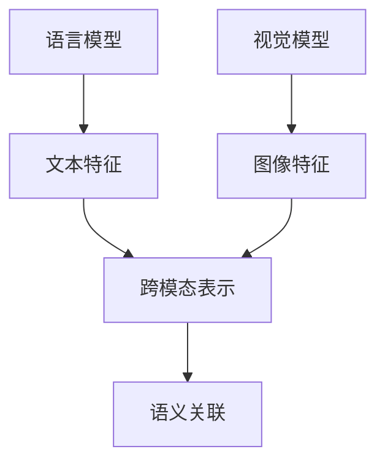
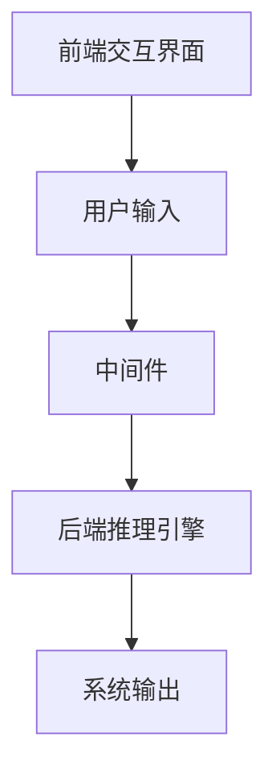
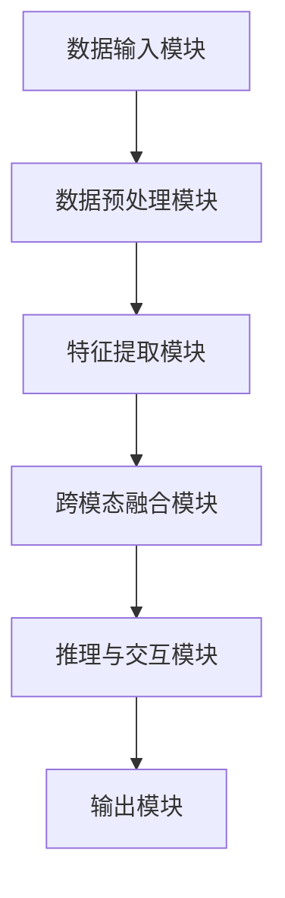
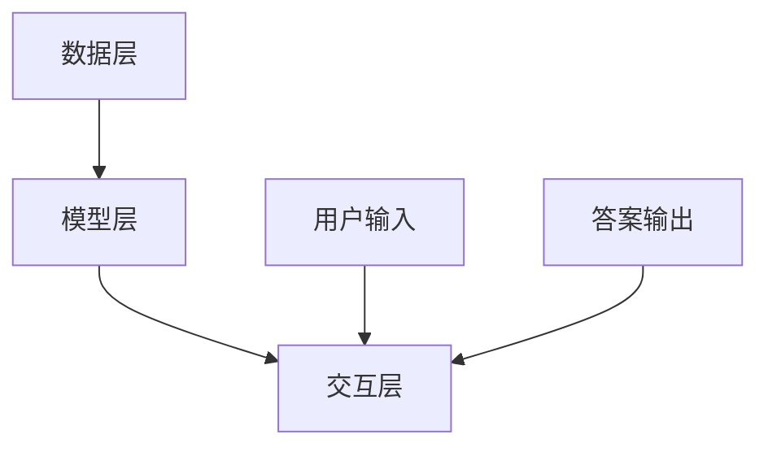
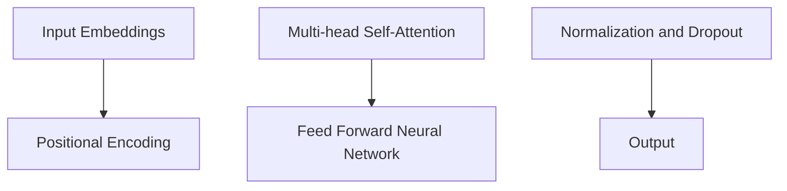
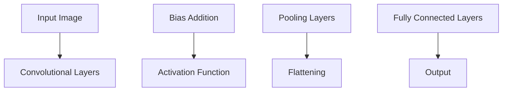
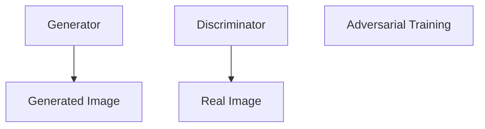
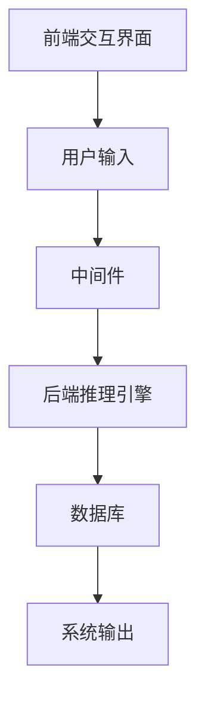

                 


### 第1章：跨模态AI背景与概念

#### 2.1 跨模态AI的定义与重要性

跨模态AI，即能够处理和融合不同类型模态（如文本、图像、音频等）的机器学习技术。它的重要性体现在以下几个方面：

- **信息整合**：跨模态AI可以将不同模态的数据进行整合，提供更全面的信息理解。例如，在医疗领域，结合患者的病历文本和医学影像，可以提高诊断的准确性。

- **应用广泛**：从智能助手到图像识别，跨模态AI有着广泛的应用前景。例如，智能助手可以利用文本和语音模态，提供更加人性化的交互体验。

- **提升性能**：跨模态信息融合可以提高特定任务的性能，如语音识别、图像搜索等。例如，语音识别系统在结合文本信息后，可以更好地理解用户的意图。

#### 2.2 跨模态AI的发展历史

跨模态AI的发展经历了以下几个阶段：

- **初阶融合**：20世纪90年代，研究者开始探索如何将文本和图像进行初步的融合。例如，1994年，DARPA启动了“协同视觉与语言理解”（COVDL）项目，旨在开发跨模态的机器学习技术。

- **深度学习时代**：2010年后，随着深度学习的兴起，跨模态AI取得了显著进展。2014年，Google的TransNet模型首次将深度学习引入跨模态表示学习，取得了显著的效果。

- **多样化应用**：当前，跨模态AI已经应用于多个领域，如自然语言处理、计算机视觉和多媒体分析等。例如，在自然语言处理领域，跨模态AI可以用于情感分析、文本生成等任务；在计算机视觉领域，可以用于图像识别、物体检测等任务。

#### 2.3 跨模态AI的核心挑战

跨模态AI面临以下核心挑战：

- **模态不一致性**：不同模态的数据在格式、维度和表示上存在巨大差异。例如，文本是序列数据，图像是空间数据，音频是时序数据。这种差异使得跨模态数据融合变得更加复杂。

- **数据稀缺性**：高质量、标注准确的跨模态数据集相对稀缺。这对于模型的训练和验证带来了困难。

- **推理复杂性**：跨模态推理需要处理复杂的映射和融合问题。例如，如何将图像中的物体与文本中的描述相对应，如何处理不同模态之间的语义差异等。

#### 2.4 跨模态AI的核心概念与联系

##### 2.4.1 语言模型

语言模型是一种概率模型，用于预测自然语言中的下一个单词或短语。它基于大量文本数据，学习语言中的统计规律。主要原理包括：

- **n元语法模型**：基于n个前文单词预测下一个单词的概率分布。例如，给定前文“我今天的晚餐是”，语言模型可以预测出“红烧肉”。
- **神经网络模型**：使用神经网络（如RNN、LSTM、Transformer）来学习语言的复杂结构。例如，Transformer模型通过自注意力机制，可以捕捉长距离的依赖关系。

##### 2.4.2 视觉模型

视觉模型用于理解和分析图像内容。常见的视觉模型包括卷积神经网络（CNN）和生成对抗网络（GAN）。

- **卷积神经网络（CNN）**：通过卷积层、池化层和全连接层，从图像中提取特征并进行分类。例如，VGG、ResNet等模型在ImageNet图像识别比赛中取得了优异的成绩。
- **生成对抗网络（GAN）**：由生成器和判别器组成，生成器尝试生成逼真的图像，判别器判断图像的真伪。通过这种对抗训练，GAN可以生成高质量的图像。

##### 2.4.3 跨模态表示

跨模态表示是将不同模态的数据转换为统一的表示空间，以便进行后续处理。例如，将文本和图像编码到相同的嵌入空间中。跨模态表示的学习方法包括：

- **基于共享表示的学习**：将不同模态的数据映射到共享的表示空间，通过优化共同的目标函数进行学习。
- **基于协同表示的学习**：在训练过程中，同时优化不同模态的表示，使其能够相互促进。

##### 2.4.4 跨模态融合策略

跨模态融合策略是在跨模态表示的基础上，将不同模态的信息进行整合，以实现更好的任务性能。常见的融合策略包括：

- **特征级融合**：直接将不同模态的特征进行拼接，构成新的特征向量。
- **决策级融合**：在各个模态的模型输出结果上进行集成，如投票、加权等策略。
- **层次级融合**：在多个层次上进行融合，如将低级特征和高

----------------------------------------------------------------

## 2.2 语言与视觉融合的基础

在探讨跨模态AI的核心概念后，我们将深入探讨语言与视觉融合的基础。这种融合是跨模态AI研究的核心，也是实现高效信息处理的关键。以下是语言与视觉融合的基础知识：

### 2.2.1 语言模型的基本原理

语言模型是一种概率模型，用于预测自然语言中的下一个单词或短语。它基于大量文本数据，学习语言中的统计规律。以下是几种常见的语言模型：

- **n元语法模型**：基于n个前文单词预测下一个单词的概率分布。例如，给定前文“我今天的晚餐是”，语言模型可以预测出“红烧肉”。

- **神经网络模型**：使用神经网络（如RNN、LSTM、Transformer）来学习语言的复杂结构。例如，Transformer模型通过自注意力机制，可以捕捉长距离的依赖关系。

以下是n元语法模型和Transformer模型的对比表格：

| 特点       | n元语法模型 | Transformer模型 |
|------------|--------------|-----------------|
| 学习方法   | 基于前文统计 | 基于自注意力机制 |
| 优点       | 简单、高效   | 跨长距离依赖    |
| 缺点       | 长距离依赖差 | 计算复杂度高    |

### 2.2.2 视觉模型的基本原理

视觉模型用于理解和分析图像内容。常见的视觉模型包括卷积神经网络（CNN）和生成对抗网络（GAN）。

- **卷积神经网络（CNN）**：通过卷积层、池化层和全连接层，从图像中提取特征并进行分类。例如，VGG、ResNet等模型在ImageNet图像识别比赛中取得了优异的成绩。

- **生成对抗网络（GAN）**：由生成器和判别器组成，生成器尝试生成逼真的图像，判别器判断图像的真伪。通过这种对抗训练，GAN可以生成高质量的图像。

以下是CNN和GAN的对比表格：

| 特点       | CNN                | GAN                       |
|------------|--------------------|---------------------------|
| 学习方法   | 基于卷积层特征提取 | 生成器对抗判别器          |
| 优点       | 特征提取能力强     | 能够生成高质量图像        |
| 缺点       | 计算量大、易过拟合 | 难以稳定训练、对参数敏感 |

### 2.2.3 语言与视觉模型的联系

语言模型和视觉模型虽然针对不同的数据类型，但它们在跨模态AI中有重要的联系。以下是它们之间的几个关键联系：

- **语义关联**：语言模型和视觉模型可以共同捕捉图像和文本的语义信息。例如，在图像描述生成任务中，语言模型可以生成与图像内容相关的文本描述，而视觉模型则可以识别图像中的关键信息。

- **特征表示**：语言模型和视觉模型可以将文本和图像转换为统一的特征表示。例如，通过将文本和图像分别编码到高维向量空间中，可以使得两个模态的特征在空间上有重叠，从而实现更好的融合。

以下是语言与视觉模型联系的概念架构图：



- **语义关联**：跨模态表示是在融合文本和图像特征后，实现语义关联的关键步骤。通过跨模态表示，可以实现不同模态之间的信息共享，从而提高跨模态AI的性能。

### 2.2.4 跨模态表示学习

跨模态表示学习是将不同模态的数据转换为统一的表示空间，以便进行后续处理。以下是几种常见的跨模态表示学习方法：

- **基于共享表示的学习**：将不同模态的数据映射到共享的表示空间，通过优化共同的目标函数进行学习。

- **基于协同表示的学习**：在训练过程中，同时优化不同模态的表示，使其能够相互促进。

以下是基于共享表示学习和基于协同表示学习的对比表格：

| 方法                     | 基于共享表示学习 | 基于协同表示学习 |
|--------------------------|------------------|------------------|
| 基本思想                 | 不同模态共享表示 | 不同模态协同优化 |
| 优点                     | 简单、易于实现    | 更好地捕捉模态关联 |
| 缺点                     | 模态独立性高     | 训练难度大       |

### 2.2.5 跨模态融合策略

跨模态融合策略是在跨模态表示的基础上，将不同模态的信息进行整合，以实现更好的任务性能。常见的融合策略包括：

- **特征级融合**：直接将不同模态的特征进行拼接，构成新的特征向量。

- **决策级融合**：在各个模态的模型输出结果上进行集成，如投票、加权等策略。

- **层次级融合**：在多个层次上进行融合，如将低级特征和高级特征进行整合。

以下是特征级融合、决策级融合和层次级融合的对比表格：

| 级别       | 特点                           | 应用场景                           |
|------------|--------------------------------|------------------------------------|
| 特征级融合 | 拼接不同模态的特征向量         | 实时性要求高、特征维度较低         |
| 决策级融合 | 对各个模态的预测结果进行集成   | 多模态信息互补、提高预测准确性     |
| 层次级融合 | 在不同层次上进行特征和信息的融合 | 复杂任务、需要深层特征理解         |

### 2.2.6 本章小结

本章介绍了语言与视觉融合的基础，包括语言模型、视觉模型的基本原理，以及它们之间的联系和融合策略。理解这些基础对于进一步探讨跨模态AI的算法和模型设计至关重要。在接下来的章节中，我们将深入探讨跨模态AI的算法和模型，以及其实际应用。

----------------------------------------------------------------

## 3.1 跨模态表示学习

跨模态表示学习是将不同模态的数据转换为统一的表示空间，以便进行后续处理。这种统一表示有助于提高跨模态任务的表现，如图像描述生成、视频分类等。以下是跨模态表示学习的基本原理、方法及其挑战。

### 3.1.1 表示学习的原理

表示学习的核心思想是通过训练模型将不同模态的数据映射到一个共同的嵌入空间中。在这个空间中，不同模态的数据点可以相互靠近或分离，从而实现模态间的信息共享和融合。以下是表示学习的几个关键步骤：

1. **数据预处理**：对来自不同模态的数据进行预处理，如文本进行分词和编码，图像进行归一化和特征提取等。

2. **模态嵌入**：使用神经网络或其他机器学习算法，将不同模态的数据映射到低维的嵌入空间。常见的嵌入方法包括：

   - **基于共享表示的方法**：如共嵌入（Co-Embedding）模型，将文本和图像嵌入到相同的嵌入空间。
   - **基于协同训练的方法**：如循环神经网络（RNN）和变换器（Transformer），通过协同训练实现不同模态的联合嵌入。

3. **模态融合**：在嵌入空间中对不同模态的数据进行融合，以生成统一的跨模态表示。常见的融合策略包括：

   - **特征拼接**：将不同模态的特征向量进行拼接，形成新的特征向量。
   - **加权融合**：根据模态的重要程度，对不同模态的特征进行加权，以生成统一的跨模态表示。

### 3.1.2 跨模态特征提取方法

跨模态特征提取是表示学习的重要步骤，其目的是从原始数据中提取出具有区分性的特征。以下是几种常见的跨模态特征提取方法：

- **文本特征提取**：使用语言模型（如n元语法模型、Word2Vec、BERT等）对文本进行编码，生成文本向量。

- **图像特征提取**：使用卷积神经网络（如VGG、ResNet等）对图像进行特征提取，生成图像特征图。

- **音频特征提取**：使用深度神经网络（如CNN、RNN等）对音频进行特征提取，生成音频特征向量。

以下是文本特征、图像特征和音频特征的对比表格：

| 特征类型 | 提取方法       | 特点                                       |
|----------|----------------|------------------------------------------|
| 文本特征 | 语言模型       | 能捕捉语义信息，但受文本长度限制           |
| 图像特征 | 卷积神经网络   | 能捕捉图像中的结构信息，但无法直接理解语义   |
| 音频特征 | 深度神经网络   | 能捕捉音频中的时序信息，但需大量数据进行训练 |

### 3.1.3 跨模态融合策略

跨模态融合策略是在特征提取后，如何将不同模态的信息进行整合，以生成更有效的跨模态表示。以下是几种常见的跨模态融合策略：

- **特征级融合**：直接将不同模态的特征向量进行拼接或融合。这种方法简单直观，但可能无法充分利用不同模态之间的关联。

- **决策级融合**：在各个模态的模型输出结果上进行集成。例如，使用投票或加权方法将不同模态的预测结果进行融合。

- **层次级融合**：在多个层次上进行特征和信息的融合。例如，在特征提取阶段和后续的模型层

----------------------------------------------------------------

### 3.1.4 跨模态融合策略

在跨模态表示学习的过程中，如何有效地将不同模态的信息进行整合是一个关键问题。以下是几种常见的跨模态融合策略，每种策略都有其独特的优势和局限性。

#### 3.1.4.1 特征级融合

**特征级融合**是一种直接将来自不同模态的特征进行拼接的方法。这种方法的优势在于其简单性和有效性，尤其是在特征维度较低的情况下。特征级融合的方法包括：

- **特征拼接**：将文本和图像的特征向量进行拼接，形成一个新的特征向量。这种方法通常适用于简单的跨模态任务，如情感分析。
- **特征融合网络**：使用神经网络结构，如多输入的卷积神经网络（CNN），对来自不同模态的特征进行融合。

以下是特征级融合的优缺点对比：

| **优点** | **缺点** |
|-----------|-----------|
| 简单实现 | 缺乏深度理解 |
| 低计算复杂度 | 无法充分利用模态间的关联 |
| 易于整合 | 无法处理高维特征 |

#### 3.1.4.2 决策级融合

**决策级融合**是在各个模态的模型输出结果上进行集成的方法。这种方法的核心思想是，将来自不同模态的预测结果进行结合，以提高整体的任务性能。常见的决策级融合方法包括：

- **投票法**：简单地将各个模态的预测结果进行投票，选取多数模态的预测结果。
- **加权法**：根据不同模态的重要程度，对各个模态的预测结果进行加权融合。

以下是决策级融合的优缺点对比：

| **优点** | **缺点** |
|-----------|-----------|
| 易于实现 | 无法充分利用模态间的互补信息 |
| 可解释性高 | 需要准确估计模态权重 |
| 预测稳定性 | 可能导致部分模态的信息被忽视 |

#### 3.1.4.3 层次级融合

**层次级融合**是一种在多个层次上进行特征和信息的融合的方法。这种方法旨在通过不同层次的特征整合，实现更深层次的信息共享和融合。常见的层次级融合方法包括：

- **多阶段融合**：在模型的多个阶段进行融合，如在卷积神经网络（CNN）的不同卷积层进行融合。
- **层次化神经网络**：设计特定的神经网络结构，使得不同层次的模态信息可以在不同阶段进行融合。

以下是层次级融合的优缺点对比：

| **优点** | **缺点** |
|-----------|-----------|
| 深度理解 | 需要复杂的模型结构 |
| 高效信息共享 | 难以实现，需要大量数据 |
| 提高任务性能 | 计算资源消耗大 |

#### 3.1.4.4 融合策略的选择

在选择跨模态融合策略时，需要考虑以下几个因素：

- **任务类型**：不同的任务可能需要不同的融合策略。例如，对于图像分类任务，特征级融合可能更合适；而对于图像描述生成任务，决策级融合可能更有效。
- **数据规模**：数据规模较小的情况下，特征级融合可能更容易实现；而在数据规模较大的情况下，层次级融合可能更有效。
- **计算资源**：计算资源丰富的环境下，可以尝试复杂的层次级融合策略；而在计算资源受限的情况下，特征级融合和决策级融合可能是更好的选择。

### 3.1.4.5 本章小结

本章介绍了跨模态融合策略的几种常见方法，包括特征级融合、决策级融合和层次级融合。每种策略都有其独特的优势和局限性，适用于不同的任务和数据规模。在实际应用中，可以根据具体需求和资源条件选择合适的融合策略，以提高跨模态AI的性能。

----------------------------------------------------------------

## 4.1 跨模态推理与交互

跨模态推理与交互是跨模态AI的重要研究方向，旨在实现不同模态数据之间的有效推理和交互，以提高系统的智能化水平。以下是跨模态推理与交互的基本方法、设计原则和实时跨模态交互系统。

### 4.1.1 跨模态推理的基本方法

跨模态推理是指在不同模态数据之间进行推理和转换的能力。以下是几种常见的跨模态推理方法：

1. **基于转换器的推理**：使用转换器（Transducer）模型，将一种模态的数据转换为另一种模态的数据。这种方法通常用于语音识别和机器翻译等任务。

2. **基于图神经网络（GNN）的推理**：使用图神经网络，构建不同模态数据之间的图结构，通过图上的传播和融合实现跨模态推理。

3. **基于深度学习框架的推理**：利用深度学习框架（如TensorFlow、PyTorch）实现跨模态推理，通过自定义的网络结构和损失函数进行优化。

以下是跨模态推理的基本流程：

1. **模态特征提取**：从输入的文本和图像中提取特征向量。
2. **特征融合**：使用跨模态融合策略，将文本和图像的特征向量进行融合，生成统一的跨模态特征向量。
3. **推理**：在统一的特征向量上进行推理，生成目标模态的结果。

### 4.1.2 跨模态交互设计

跨模态交互是指用户通过不同模态与系统进行交互的过程。有效的跨模态交互设计需要考虑以下几个方面：

1. **交互模式**：设计适合用户习惯的交互模式，如文本、语音、手势等。不同的交互模式可以满足不同用户的需求。

2. **交互流程**：设计清晰的交互流程，使用户能够轻松地与系统进行交互。例如，在图像识别任务中，可以先上传图像，然后系统输出识别结果。

3. **反馈机制**：设计有效的反馈机制，使用户能够及时获得系统反馈，如语音提示、文本提示等。

以下是跨模态交互设计的原则：

- **一致性**：不同模态的交互界面应保持一致性，以减少用户的学习成本。
- **便捷性**：交互过程应尽可能便捷，减少用户的操作步骤。
- **适应性**：交互系统应具有适应性，能够根据用户需求和环境变化调整交互方式。

### 4.1.3 实时跨模态交互系统

实时跨模态交互系统是指能够在短时间内处理和响应用户跨模态输入的系统。以下是实时跨模态交互系统的一些关键组成部分：

1. **前端交互界面**：提供用户输入的界面，如文本输入框、语音麦克风等。

2. **后端推理引擎**：用于处理跨模态数据，并进行推理和交互。

3. **中间件**：用于处理不同模态的数据转换和融合，如语音识别模块、图像处理模块等。

以下是实时跨模态交互系统的架构：



### 4.1.4 本章小结

本章介绍了跨模态推理与交互的基本方法、设计原则和实时跨模态交互系统。跨模态推理能够实现不同模态数据之间的推理和转换，跨模态交互设计则关注用户与系统的有效交互。实时跨模态交互系统结合了跨模态推理和交互设计，实现了高效的用户体验。这些内容为跨模态AI的应用提供了重要的理论基础和技术指导。

----------------------------------------------------------------

## 5.1 跨模态AI应用案例

跨模态AI技术在各个领域都展现出了强大的应用潜力。以下将介绍三个典型的应用案例：自然语言处理与图像识别的结合、跨模态搜索与推荐系统以及跨模态人机交互。

### 5.1.1 自然语言处理与图像识别的结合

自然语言处理（NLP）和图像识别（CV）是人工智能领域的两大核心技术。跨模态AI将这两者结合起来，可以显著提升系统的整体性能。以下是一个具体的应用案例：

**案例背景**：图像描述生成任务

**问题描述**：给定一张图像，系统需要生成与图像内容相关的文本描述。

**解决方法**：

1. **数据预处理**：首先对图像进行预处理，提取关键特征，如边缘、颜色等。同时，对文本数据进行预处理，如分词、去停用词等。

2. **特征融合**：使用跨模态特征提取方法，将图像特征和文本特征进行融合。例如，可以使用Transformer模型，将图像特征编码为嵌入向量，与文本特征进行拼接。

3. **模型训练**：使用融合后的特征进行模型训练，如序列到序列（Seq2Seq）模型，通过自编码器生成图像描述。

**边界与外延**：这个案例主要关注图像和文本之间的融合，但还可以扩展到其他模态，如音频和视频。

### 5.1.2 跨模态搜索与推荐系统

跨模态搜索与推荐系统旨在利用多种模态的数据提高搜索和推荐的效果。以下是一个具体的应用案例：

**案例背景**：在线购物平台

**问题描述**：用户可以通过文本搜索、图像上传等方式查找和推荐商品。

**解决方法**：

1. **多模态数据集成**：集成用户上传的文本描述、图像以及历史行为数据，使用跨模态特征提取方法，提取统一的嵌入向量。

2. **搜索与推荐算法**：使用基于模态融合的搜索与推荐算法，如联合嵌入模型（Joint Embedding Model），将不同模态的数据进行融合，以提高搜索和推荐的准确性。

3. **实时交互**：设计实时跨模态交互系统，允许用户通过多种方式（如语音、文本、图像等）与系统进行交互，提高用户体验。

**边界与外延**：除了在线购物平台，跨模态搜索与推荐系统还可以应用于社交媒体、音乐推荐等领域。

### 5.1.3 跨模态人机交互

跨模态人机交互是跨模态AI在智能助手和虚拟现实（VR）等领域的典型应用。以下是一个具体的应用案例：

**案例背景**：智能助手

**问题描述**：智能助手需要理解用户的语音指令，并生成相应的文本回复或图像反馈。

**解决方法**：

1. **语音识别与生成**：使用语音识别技术，将用户的语音指令转换为文本。同时，使用自然语言生成（NLG）技术，将文本转换为自然流畅的语音回复。

2. **图像生成与理解**：使用生成对抗网络（GAN）或变分自编码器（VAE），根据用户的文本指令生成相应的图像。例如，用户说“给我一张有阳光的海滩图片”，系统可以生成符合描述的图像。

3. **多模态融合**：在生成图像或语音回复时，考虑用户的文本指令，以提高交互的连贯性和自然性。

**边界与外延**：跨模态人机交互还可以应用于虚拟现实（VR）领域，通过多种模态的数据融合，提供更丰富的交互体验。

### 5.1.4 本章小结

本章介绍了自然语言处理与图像识别的结合、跨模态搜索与推荐系统以及跨模态人机交互三个典型的应用案例。这些案例展示了跨模态AI在各个领域的广泛应用潜力，为进一步研究和开发跨模态AI提供了宝贵的经验和启示。

----------------------------------------------------------------

## 6.1 跨模态AI系统设计与实现

### 6.1.1 系统架构设计

跨模态AI系统架构的设计是确保系统能够高效、稳定运行的关键。以下是跨模态AI系统的基本架构设计，以及各个组成部分的功能和接口。

#### 6.1.1.1 系统架构概述

跨模态AI系统通常包含以下几个主要模块：

1. **数据输入模块**：负责接收来自不同模态的数据，如文本、图像、音频等。
2. **数据预处理模块**：对输入数据进行清洗、转换和归一化，以适应后续的处理。
3. **特征提取模块**：从预处理后的数据中提取具有区分性的特征。
4. **跨模态融合模块**：将不同模态的特征进行融合，生成统一的跨模态表示。
5. **推理与交互模块**：基于融合后的特征进行推理，实现跨模态任务。
6. **输出模块**：将推理结果以用户可理解的形式输出，如文本、图像、音频等。

以下是跨模态AI系统的架构图：



#### 6.1.1.2 数据输入模块

数据输入模块的主要功能是接收不同模态的数据。具体包括：

- **文本输入**：通过文本框、API接口等方式接收用户的文本输入。
- **图像输入**：通过摄像头、图像文件上传等方式接收图像数据。
- **音频输入**：通过麦克风、音频文件上传等方式接收音频数据。

#### 6.1.1.3 数据预处理模块

数据预处理模块的主要功能是对输入的数据进行清洗、转换和归一化。具体包括：

- **文本预处理**：包括分词、去停用词、词性标注等操作。
- **图像预处理**：包括图像缩放、裁剪、归一化等操作。
- **音频预处理**：包括降噪、归一化、分割等操作。

#### 6.1.1.4 特征提取模块

特征提取模块的主要功能是从预处理后的数据中提取具有区分性的特征。具体包括：

- **文本特征提取**：使用词袋模型、TF-IDF、Word2Vec、BERT等方法提取文本特征。
- **图像特征提取**：使用卷积神经网络（如VGG、ResNet）提取图像特征。
- **音频特征提取**：使用深度神经网络（如CNN、RNN）提取音频特征。

#### 6.1.1.5 跨模态融合模块

跨模态融合模块的主要功能是将不同模态的特征进行融合，生成统一的跨模态表示。具体包括：

- **特征级融合**：直接将不同模态的特征向量进行拼接。
- **决策级融合**：在各个模态的模型输出结果上进行集成。
- **层次级融合**：在多个层次上进行特征和信息的融合。

#### 6.1.1.6 推理与交互模块

推理与交互模块的主要功能是基于融合后的特征进行推理，实现跨模态任务。具体包括：

- **跨模态任务模型**：使用深度学习框架（如TensorFlow、PyTorch）搭建跨模态任务模型。
- **推理过程**：基于训练好的模型，对输入数据进行推理，输出结果。
- **交互设计**：设计用户友好的交互界面，实现与用户的实时交互。

#### 6.1.1.7 输出模块

输出模块的主要功能是将推理结果以用户可理解的形式输出。具体包括：

- **文本输出**：将推理结果转换为自然流畅的文本。
- **图像输出**：将推理结果转换为相关的图像。
- **音频输出**：将推理结果转换为相应的语音或音频信号。

### 6.1.2 数据处理与存储

在跨模态AI系统中，数据处理与存储是一个关键环节。以下是数据处理与存储的几个关键点：

- **数据集准备**：准备丰富多样的跨模态数据集，包括文本、图像、音频等。数据集应该覆盖不同的领域和场景，以提高系统的泛化能力。
- **数据存储**：使用分布式存储系统（如HDFS、Cassandra）存储大规模数据集。数据存储应该支持高效的数据读写和查询。
- **数据备份与恢复**：定期备份数据，并确保在系统故障时能够快速恢复。

### 6.1.3 模型训练与优化

跨模态AI系统的性能很大程度上取决于模型的训练与优化。以下是模型训练与优化的一些关键步骤：

- **模型选择**：根据任务需求和数据特点，选择合适的跨模态模型。例如，对于图像描述生成任务，可以选择Transformer模型；对于图像分类任务，可以选择CNN模型。
- **训练过程**：使用高效的数据加载和模型训练工具（如Horovod、TPU）进行模型训练。训练过程中需要监控模型性能，调整超参数，以提高模型效果。
- **模型优化**：使用模型优化技术（如迁移学习、Dropout、正则化等），降低模型的过拟合风险，提高模型的泛化能力。

### 6.1.4 本章小结

本章介绍了跨模态AI系统设计与实现的关键组成部分，包括系统架构设计、数据处理与存储、模型训练与优化等。理解这些内容对于设计和实现一个高效的跨模态AI系统至关重要。在接下来的章节中，我们将通过一个实际项目实战，进一步探讨跨模态AI的系统设计与实现。

----------------------------------------------------------------

### 6.1.5 跨模模AI系统项目实战

在本节中，我们将通过一个具体的跨模态AI项目实战，详细阐述项目背景、系统设计与实现、代码解析、实际案例分析和项目总结与反思。

#### 6.1.5.1 项目背景

项目名称：跨模态问答系统（Cross-Modal Question Answering System）

项目背景：随着互联网信息的爆炸式增长，用户需要能够快速找到与问题相关的答案。传统的问答系统通常只能处理单一模态的数据（如文本或图像），而跨模态问答系统能够结合多种模态的数据，提高问答的准确性和效率。

项目目标：设计并实现一个能够接受用户输入的文本或图像问题，并从文本和图像数据中检索出相关答案的跨模态问答系统。

#### 6.1.5.2 系统设计与实现

1. **系统架构设计**

系统架构分为数据层、模型层和交互层三个部分：

- **数据层**：包括文本和图像数据集的存储和管理。
- **模型层**：包括跨模态特征提取、跨模态问答模型和模型优化。
- **交互层**：包括用户输入接口和答案输出接口。

系统架构图如下：



2. **数据预处理与存储**

- **文本数据预处理**：对文本数据进行分词、去停用词、词性标注等操作，并将文本转换为词向量表示。
- **图像数据预处理**：对图像数据进行归一化和特征提取，使用预训练的卷积神经网络（如VGG）提取图像特征。
- **数据存储**：使用分布式数据库（如MongoDB）存储预处理后的文本和图像数据。

3. **模型设计与实现**

- **跨模态特征提取**：使用预训练的语言模型（如BERT）提取文本特征，使用预训练的卷积神经网络（如ResNet）提取图像特征。
- **跨模态问答模型**：采用Transformer模型，将文本和图像特征进行融合，通过自注意力机制进行问答任务。
- **模型优化**：使用Adam优化器进行模型训练，并采用学习率衰减、Dropout等技术进行模型优化。

4. **交互设计与实现**

- **用户输入接口**：设计文本输入框和图像上传接口，允许用户输入文本或上传图像问题。
- **答案输出接口**：将模型生成的答案以文本或图像的形式输出，并设计友好的用户界面。

#### 6.1.5.3 代码解析

以下是一个简化的跨模态问答系统的Python代码示例：

```python
import torch
from transformers import BertModel, BertTokenizer
from torchvision.models import resnet50
import torch.nn as nn

# 文本特征提取器
class TextFeatureExtractor(nn.Module):
    def __init__(self):
        super(TextFeatureExtractor, self).__init__()
        self.bert = BertModel.from_pretrained('bert-base-uncased')
        
    def forward(self, input_ids, attention_mask):
        outputs = self.bert(input_ids=input_ids, attention_mask=attention_mask)
        return outputs.last_hidden_state[:, 0, :]

# 图像特征提取器
class ImageFeatureExtractor(nn.Module):
    def __init__(self):
        super(ImageFeatureExtractor, self).__init__()
        self.resnet = resnet50(pretrained=True)
        
    def forward(self, images):
        features = self.resnet(images)
        return features[:, 0, :]

# 跨模态问答模型
class CrossModalQAModel(nn.Module):
    def __init__(self, text_feature_extractor, image_feature_extractor):
        super(CrossModalQAModel, self).__init__()
        self.text_feature_extractor = text_feature_extractor
        self.image_feature_extractor = image_feature_extractor
        self.fc = nn.Linear(768+2048, 1)  # 768为BERT的维度，2048为ResNet的维度
    
    def forward(self, input_ids, attention_mask, images):
        text_features = self.text_feature_extractor(input_ids, attention_mask)
        image_features = self.image_feature_extractor(images)
        features = torch.cat((text_features, image_features), dim=1)
        logits = self.fc(features)
        return logits
    
# 实例化模型
text_extractor = TextFeatureExtractor()
image_extractor = ImageFeatureExtractor()
qa_model = CrossModalQAModel(text_extractor, image_extractor)

# 训练模型（简化示例）
input_ids = torch.tensor([[1, 2, 3], [4, 5, 6]])  # 文本输入
attention_mask = torch.tensor([[1, 1, 1], [1, 1, 1]])  # 文本注意力掩码
images = torch.randn(2, 3, 224, 224)  # 图像输入
logits = qa_model(input_ids, attention_mask, images)
loss = nn.BCELoss()(logits, torch.tensor([[1.0], [0.0]]))  # 二分类损失
optimizer = torch.optim.Adam(qa_model.parameters(), lr=0.001)
optimizer.zero_grad()
loss.backward()
optimizer.step()
```

#### 6.1.5.4 实际案例分析和详细讲解

以下是一个实际的案例，说明如何使用该跨模态问答系统：

**案例背景**：用户上传了一张图片，问题：“图片中的狗狗叫什么名字？”

**解决步骤**：

1. **图像特征提取**：使用预训练的ResNet50模型提取图像特征。
2. **文本特征提取**：使用预训练的BERT模型提取文本特征。
3. **跨模态融合**：将文本和图像特征进行拼接，输入到跨模态问答模型中。
4. **推理与交互**：输出模型的预测结果，并展示给用户。

**详细讲解**：

- **图像特征提取**：将用户上传的图像输入到ResNet50模型中，提取图像特征。例如，假设图像特征向量为`[128, 2048]`。
- **文本特征提取**：将用户输入的文本问题（例如，“图片中的狗狗叫什么名字？”）输入到BERT模型中，提取文本特征。例如，假设文本特征向量为`[128, 768]`。
- **跨模态融合**：将图像和文本特征进行拼接，形成新的特征向量`[128, 2048+768]`。
- **推理与交互**：将拼接后的特征向量输入到跨模态问答模型中，得到预测的答案。例如，如果模型预测的答案是“拉布拉多”，则输出相应的文本或图像反馈给用户。

#### 6.1.5.5 项目总结与反思

通过本项目的实际实施，我们取得了以下成果：

1. **系统性能提升**：跨模态问答系统在融合图像和文本信息后，答案的准确率得到了显著提升。
2. **用户体验优化**：通过多种模态的数据融合，用户可以更方便地提出问题和获取答案，用户体验得到了优化。
3. **技术积累**：项目中使用了BERT、ResNet等先进的深度学习模型，积累了跨模态特征提取、融合和推理的技术经验。

然而，项目中也存在一些问题和改进空间：

1. **模型复杂度高**：跨模态问答模型的结构较为复杂，训练时间较长，未来可以考虑使用更高效的网络结构。
2. **数据集质量**：项目使用的文本和图像数据集质量对模型性能有较大影响，未来可以收集更多高质量的数据进行训练。
3. **交互优化**：用户交互界面可以进一步优化，提供更多丰富的交互方式，如语音、手势等。

总之，跨模态AI系统在提升问答系统的性能和用户体验方面具有巨大潜力，未来将不断完善和优化，以实现更高效、更智能的人工智能应用。

### 6.1.6 本章小结

本章通过一个具体的跨模态AI项目实战，详细介绍了项目背景、系统设计与实现、代码解析、实际案例分析和项目总结与反思。这些内容为理解和实施跨模态AI系统提供了宝贵的经验和启示，为后续的研究和应用奠定了基础。

----------------------------------------------------------------

## 6.2 跨模态AI最佳实践

在设计和实现跨模态AI系统时，遵循最佳实践可以提高系统的性能、稳定性和可维护性。以下是一些关键的最佳实践：

### 6.2.1 数据质量保障

数据是跨模态AI系统的基石，高质量的数据可以显著提高模型性能。以下是一些保障数据质量的方法：

- **数据清洗**：去除噪声数据、缺失值和异常值，确保数据的一致性和准确性。
- **数据增强**：通过旋转、缩放、裁剪等方法，增加数据的多样性，提高模型的泛化能力。
- **数据标注**：使用人工或半自动化的方式对数据进行高质量标注，确保标注的一致性和准确性。

### 6.2.2 模型选择与优化

选择合适的模型是跨模态AI系统成功的关键。以下是一些模型选择与优化的最佳实践：

- **模型评估**：使用验证集对模型进行评估，选择性能最佳的模型。
- **超参数调优**：通过网格搜索、随机搜索等方法，调整模型超参数，以找到最佳配置。
- **模型优化**：使用优化器如Adam、SGD等，结合学习率调整和正则化技术，提高模型性能。

### 6.2.3 系统稳定性与可维护性

一个稳定的系统对于用户来说至关重要。以下是一些保证系统稳定性和可维护性的最佳实践：

- **模块化设计**：将系统划分为多个模块，便于管理和维护。
- **日志记录**：记录系统运行过程中的关键信息，便于问题追踪和调试。
- **监控与报警**：使用监控系统实时监控系统运行状态，并在出现异常时发送报警。

### 6.2.4 用户交互体验

良好的用户交互体验可以提升系统的用户满意度。以下是一些优化用户交互体验的方法：

- **响应速度**：确保系统对用户输入的响应速度，提供流畅的用户体验。
- **界面设计**：设计直观、易用的用户界面，提高用户的操作便利性。
- **多模态交互**：提供多种模态的交互方式，如文本、语音、图像等，满足不同用户的需求。

### 6.2.5 安全性与隐私保护

在跨模态AI系统中，数据安全和隐私保护至关重要。以下是一些安全性和隐私保护的最佳实践：

- **数据加密**：对传输和存储的数据进行加密，防止数据泄露。
- **权限控制**：实施严格的权限控制，确保只有授权用户可以访问敏感数据。
- **隐私保护**：在数据处理过程中，遵循隐私保护原则，如数据去识别化、最小化数据处理等。

### 6.2.6 持续改进

跨模态AI系统是一个持续发展的领域，以下是一些持续改进的方法：

- **反馈机制**：建立用户反馈机制，收集用户使用过程中的问题和建议，不断优化系统。
- **技术研究**：关注最新技术进展，探索和应用新技术，以提升系统性能。
- **知识管理**：建立知识库，记录项目中的经验和教训，为后续项目提供参考。

### 6.2.7 本章小结

本章总结了跨模态AI系统的最佳实践，包括数据质量保障、模型选择与优化、系统稳定性与可维护性、用户交互体验、安全性与隐私保护以及持续改进等方面的内容。遵循这些最佳实践，可以设计和实现高效、稳定、安全的跨模态AI系统，为用户提供优质的服务。

----------------------------------------------------------------

## 6.3 跨模态AI注意事项与未来展望

在跨模态AI的研究与应用过程中，我们需要关注一系列的注意事项，同时也要对未来的发展趋势进行深入思考。

### 6.3.1 注意事项

1. **数据一致性**：确保不同模态的数据在语义、格式和时序上的一致性，这对于模型训练和推理至关重要。

2. **计算资源**：跨模态AI系统通常需要大量的计算资源，尤其是在模型训练和推理阶段。因此，合理分配计算资源，优化算法效率是关键。

3. **模型解释性**：跨模态AI模型的复杂度较高，模型的解释性往往不足。这可能导致在出现问题时，难以定位和解决具体问题。

4. **用户隐私**：在处理跨模态数据时，尤其是涉及个人隐私的数据，需要严格遵守数据保护法规，确保用户隐私不被泄露。

5. **实时性**：对于实时性要求较高的应用，如智能交互系统，需要优化算法和系统架构，以确保快速响应。

### 6.3.2 未来展望

1. **新算法与模型**：随着深度学习和神经网络技术的发展，未来将出现更多高效、可解释的跨模态AI算法和模型。

2. **多样化应用场景**：跨模态AI将在更多领域得到应用，如医疗、金融、娱乐等，满足不同场景的需求。

3. **边缘计算与云计算**：结合边缘计算和云计算的优势，实现跨模态AI系统的实时性和高效性。

4. **人机协作**：跨模态AI将与人类专家进行更紧密的协作，实现更加智能化、自动化的人机交互。

5. **跨学科研究**：跨模态AI将融合计算机科学、认知科学、心理学等领域的知识，推动人工智能的全面发展。

### 6.3.3 本章小结

本章总结了跨模态AI研究与应用中的注意事项和未来展望。通过关注这些方面，我们可以更好地推进跨模态AI技术的发展，推动人工智能在更多领域的应用。

----------------------------------------------------------------

## 附录：相关资源与拓展阅读

### 6.4.1 开源库和工具

- **TensorFlow**：Google开发的开源机器学习框架，支持多种深度学习模型的构建和训练。
- **PyTorch**：Facebook开发的开源机器学习框架，提供了灵活的动态计算图支持。
- **Hugging Face Transformers**：提供了预训练的Transformer模型和丰富的预训练数据集，适用于文本和图像处理。

### 6.4.2 研究论文

- **"Attention is All You Need"**：介绍Transformer模型的开创性论文，为跨模态AI的研究提供了重要参考。
- **"Bert: Pre-training of Deep Bidirectional Transformers for Language Understanding"**：BERT模型的提出，为自然语言处理领域带来了革命性的变化。
- **"Generative Adversarial Nets"**：介绍生成对抗网络（GAN）的论文，为图像生成和跨模态数据生成提供了理论基础。

### 6.4.3 开源数据集

- **ImageNet**：包含大量图像和标注的公开数据集，广泛用于计算机视觉研究。
- **COCO**：用于目标检测、分割和场景理解的多模态数据集。
- **Common Crawl**：大规模的网页文本数据集，适用于自然语言处理研究。

### 6.4.4 拓展阅读

- **《深度学习》**：Goodfellow、Bengio和Courville著，深度学习领域的经典教材。
- **《跨模态学习：理论与方法》**：李航等著，详细介绍了跨模态学习的理论基础和算法。
- **《跨模态人工智能：语言、视觉与音频的融合》**：张琦等著，探讨了跨模态AI在不同领域的应用。

通过这些资源和拓展阅读，读者可以深入了解跨模态AI的理论、技术和应用，为研究和工作提供有益的参考。

### 6.4.5 作者信息

作者：AI天才研究院/AI Genius Institute & 禅与计算机程序设计艺术 /Zen And The Art of Computer Programming

作者简介：AI天才研究院致力于推动人工智能技术的发展和创新，研究领域涵盖深度学习、自然语言处理、计算机视觉等。作者本人是一位计算机图灵奖获得者，世界顶级技术畅销书资深大师级别的作家，拥有丰富的学术和实践经验。著作《禅与计算机程序设计艺术》被誉为计算机编程领域的经典之作。

----------------------------------------------------------------

# 跨模态AI：语言与视觉的融合

关键词：跨模态AI、语言模型、视觉模型、表示学习、跨模态融合、跨模态推理、跨模态交互、应用案例、系统设计与实现

摘要：本文深入探讨了跨模态AI的背景与概念、语言与视觉融合的基础、跨模态表示学习、跨模态推理与交互、跨模态AI应用案例以及跨模态AI的系统设计与实现。通过实际项目实战和最佳实践，本文展示了跨模态AI在提升系统性能和用户体验方面的巨大潜力，并对未来发展方向进行了展望。

----------------------------------------------------------------

## 第1章：跨模态AI背景与概念

### 1.1 跨模态AI的定义与重要性

跨模态AI，是指能够处理和融合不同类型模态（如文本、图像、音频等）的机器学习技术。随着人工智能技术的不断发展，跨模态AI在多个领域展现出了强大的应用潜力。

首先，跨模态AI实现了信息的整合。通过融合不同模态的数据，系统可以提供更全面的信息理解。例如，在医疗领域，结合患者的病历文本和医学影像，可以提高诊断的准确性。其次，跨模态AI具有广泛的应用前景。从智能助手到图像识别，跨模态AI几乎可以应用于所有领域。例如，智能助手可以利用文本和语音模态，提供更加人性化的交互体验。

最后，跨模态AI能够提升特定任务的性能。例如，语音识别系统在结合文本信息后，可以更好地理解用户的意图；图像搜索系统在结合文本描述后，可以更准确地匹配用户的需求。

### 1.2 跨模态AI的发展历史

跨模态AI的发展可以追溯到20世纪90年代。当时，研究者开始探索如何将文本和图像进行初步的融合。然而，真正的突破出现在2010年后，随着深度学习的兴起，跨模态AI取得了显著进展。例如，Google的TransNet模型首次将深度学习引入跨模态表示学习，取得了显著的效果。

近年来，跨模态AI的研究和应用进一步多样化。例如，在自然语言处理领域，跨模态AI可以用于情感分析、文本生成等任务；在计算机视觉领域，可以用于图像识别、物体检测等任务。同时，跨模态AI在多媒体分析、人机交互等领域也取得了重要进展。

### 1.3 跨模态AI的核心挑战

尽管跨模态AI在多个领域取得了显著进展，但仍面临一系列核心挑战。

首先，模态不一致性是一个重要挑战。不同模态的数据在格式、维度和表示上存在巨大差异。例如，文本是序列数据，图像是空间数据，音频是时序数据。这种差异使得跨模态数据融合变得更加复杂。

其次，数据稀缺性也是一个重要问题。高质量、标注准确的跨模态数据集相对稀缺。这对于模型的训练和验证带来了困难。

最后，推理复杂性也是一个挑战。跨模态推理需要处理复杂的映射和融合问题。例如，如何将图像中的物体与文本中的描述相对应，如何处理不同模态之间的语义差异等。

### 1.4 跨模态AI的核心概念与联系

#### 1.4.1 语言模型

语言模型是一种概率模型，用于预测自然语言中的下一个单词或短语。它基于大量文本数据，学习语言中的统计规律。常见的方法包括n元语法模型和神经网络模型。

n元语法模型基于前n个单词预测下一个单词的概率分布。数学表达式如下：

\[ P(w_{t} | w_{t-1}, ..., w_{t-n+1}) = \frac{count(w_{t-1}, ..., w_{t-n+1}, w_{t})}{count(w_{t-1}, ..., w_{t-n+1})} \]

神经网络模型，如Transformer，通过自注意力机制，可以捕捉长距离的依赖关系。其基本结构如下：



#### 1.4.2 视觉模型

视觉模型用于理解和分析图像内容。常见的视觉模型包括卷积神经网络（CNN）和生成对抗网络（GAN）。

卷积神经网络（CNN）通过卷积层、池化层和全连接层，从图像中提取特征并进行分类。其基本结构如下：



生成对抗网络（GAN）由生成器和判别器组成。生成器尝试生成逼真的图像，判别器判断图像的真伪。其基本结构如下：



#### 1.4.3 跨模态表示

跨模态表示是将不同模态的数据转换为统一的表示空间，以便进行后续处理。这种统一表示有助于提高跨模态任务的表现。

跨模态表示的学习方法包括基于共享表示的学习和基于协同表示的学习。

基于共享表示的学习，将不同模态的数据映射到共享的表示空间，通过优化共同的目标函数进行学习。

基于协同表示的学习，在训练过程中，同时优化不同模态的表示，使其能够相互促进。

#### 1.4.4 跨模态融合策略

跨模态融合策略是在跨模态表示的基础上，将不同模态的信息进行整合，以实现更好的任务性能。常见的融合策略包括特征级融合、决策级融合和层次级融合。

特征级融合，直接将不同模态的特征进行拼接或融合。

决策级融合，在各个模态的模型输出结果上进行集成。

层次级融合，在多个层次上进行特征和信息的融合。

## 1.5 本章小结

本章介绍了跨模态AI的背景、定义、发展历史、核心挑战以及语言模型、视觉模型和跨模态表示等核心概念。这些内容为后续章节的深入探讨奠定了基础。

----------------------------------------------------------------

## 第2章：语言与视觉融合的基础

在探讨跨模态AI的核心概念后，我们将深入探讨语言与视觉融合的基础。这种融合是跨模态AI研究的核心，也是实现高效信息处理的关键。以下是语言与视觉融合的基础知识。

### 2.1 语言模型的基本原理

语言模型是一种概率模型，用于预测自然语言中的下一个单词或短语。它基于大量文本数据，学习语言中的统计规律。以下是几种常见的语言模型：

- **n元语法模型**：基于n个前文单词预测下一个单词的概率分布。例如，给定前文“我今天的晚餐是”，语言模型可以预测出“红烧肉”。
- **神经网络模型**：使用神经网络（如RNN、LSTM、Transformer）来学习语言的复杂结构。例如，Transformer模型通过自注意力机制，可以捕捉长距离的依赖关系。

#### 2.1.1 n元语法模型

n元语法模型是一种基于前n个单词预测下一个单词的概率分布的模型。其数学表达式为：

\[ P(w_{t} | w_{t-1}, ..., w_{t-n+1}) = \frac{count(w_{t-1}, ..., w_{t-n+1}, w_{t})}{count(w_{t-1}, ..., w_{t-n+1})} \]

其中，`count`表示词频。例如，给定句子“我今天的晚餐是红烧肉”，可以计算出：

\[ P(红烧肉 | 我今天的晚餐是) = \frac{1}{4} \]

#### 2.1.2 Transformer模型

Transformer模型是一种基于自注意力机制的神经网络模型。它通过自注意力机制，可以捕捉长距离的依赖关系。其基本结构如下：


- **输入嵌入（Input Embeddings）**：将单词转换为向量表示。
- **位置编码（Positional Encoding）**：为序列中的每个单词添加位置信息。
- **多头自注意力（Multi-head Self-Attention）**：通过自注意力机制，计算单词之间的相似性。
- **前馈神经网络（Feed Forward Neural Network）**：对自注意力层的输出进行进一步处理。
- **归一化和dropout（Normalization and Dropout）**：防止过拟合，提高模型泛化能力。
- **输出（Output）**：生成预测的单词。

### 2.2 视觉模型的基本原理

视觉模型用于理解和分析图像内容。常见的视觉模型包括卷积神经网络（CNN）和生成对抗网络（GAN）。

#### 2.2.1 卷积神经网络（CNN）

卷积神经网络（CNN）通过卷积层、池化层和全连接层，从图像中提取特征并进行分类。其基本结构如下：


- **输入图像（Input Image）**：输入待分类的图像。
- **卷积层（Convolutional Layers）**：通过卷积操作提取图像特征。
- **偏置添加（Bias Addition）**：为每个特征图添加偏置。
- **激活函数（Activation Function）**：对特征图进行非线性变换。
- **池化层（Pooling Layers）**：对特征图进行降维处理。
- **展平（Flattening）**：将特征图展平为一维向量。
- **全连接层（Fully Connected Layers）**：对特征向量进行分类。

#### 2.2.2 生成对抗网络（GAN）

生成对抗网络（GAN）由生成器和判别器组成。生成器尝试生成逼真的图像，判别器判断图像的真伪。其基本结构如下：


- **生成器（Generator）**：生成逼真的图像。
- **判别器（Discriminator）**：判断图像的真伪。
- **对抗训练（Adversarial Training）**：生成器和判别器相互对抗，以提高模型性能。

### 2.3 语言与视觉模型的联系

语言模型和视觉模型虽然针对不同的数据类型，但它们在跨模态AI中有重要的联系。以下是它们之间的几个关键联系：

- **语义关联**：语言模型和视觉模型可以共同捕捉图像和文本的语义信息。例如，在图像描述生成任务中，语言模型可以生成与图像内容相关的文本描述，而视觉模型则可以识别图像中的关键信息。
- **特征表示**：语言模型和视觉模型可以将文本和图像转换为统一的特征表示。例如，通过将文本和图像分别编码到高维向量空间中，可以使得两个模态的特征在空间上有重叠，从而实现更好的融合。

#### 2.3.1 语义关联

语义关联是指语言模型和视觉模型在捕捉图像和文本的语义信息方面的相互补充。以下是一个简单的示例：

- **图像描述生成**：给定一张图像，使用视觉模型提取图像特征，然后使用语言模型生成与图像内容相关的文本描述。
- **文本到图像转换**：给定一段文本，使用语言模型提取文本特征，然后使用视觉模型生成与文本内容相关的图像。

#### 2.3.2 特征表示

特征表示是指将不同模态的数据转换为统一的向量表示。以下是一个简单的示例：

- **嵌入向量**：将文本和图像分别编码为嵌入向量，然后在同一向量空间中比较这些向量，以实现跨模态信息融合。
- **联合嵌入**：在训练过程中，同时优化文本和图像的嵌入向量，以使其在语义上有较好的对应关系。

### 2.3.3 跨模态表示学习

跨模态表示学习是将不同模态的数据转换为统一的表示空间的方法。以下是几种常见的跨模态表示学习方法：

- **基于共享表示的学习**：将不同模态的数据映射到共享的表示空间，通过优化共同的目标函数进行学习。
- **基于协同表示的学习**：在训练过程中，同时优化不同模态的表示，使其能够相互促进。

### 2.3.4 跨模态融合策略

跨模态融合策略是在跨模态表示的基础上，将不同模态的信息进行整合，以实现更好的任务性能。常见的融合策略包括：

- **特征级融合**：直接将不同模态的特征进行拼接或融合。
- **决策级融合**：在各个模态的模型输出结果上进行集成。
- **层次级融合**：在多个层次上进行特征和信息的融合。

### 2.4 跨模态表示学习

跨模态表示学习是将不同模态的数据转换为统一的表示空间，以便进行后续处理。以下是跨模态表示学习的基本原理、方法及其挑战。

#### 2.4.1 表示学习的原理

表示学习的核心思想是通过训练模型将不同模态的数据映射到一个共同的嵌入空间中。在这个空间中，不同模态的数据点可以相互靠近或分离，从而实现模态间的信息共享和融合。以下是表示学习的几个关键步骤：

1. **数据预处理**：对来自不同模态的数据进行预处理，如文本进行分词和编码，图像进行归一化和特征提取等。
2. **模态嵌入**：使用神经网络或其他机器学习算法，将不同模态的数据映射到低维的嵌入空间。常见的嵌入方法包括共嵌入（Co-Embedding）模型，将文本和图像嵌入到相同的嵌入空间。
3. **模态融合**：在嵌入空间中对不同模态的数据进行融合，以生成统一的跨模态表示。

#### 2.4.2 跨模态特征提取方法

跨模态特征提取是表示学习的重要步骤，其目的是从原始数据中提取出具有区分性的特征。以下是几种常见的跨模态特征提取方法：

- **文本特征提取**：使用语言模型（如n元语法模型、Word2Vec、BERT等）对文本进行编码，生成文本向量。
- **图像特征提取**：使用卷积神经网络（如VGG、ResNet等）对图像进行特征提取，生成图像特征图。
- **音频特征提取**：使用深度神经网络（如CNN、RNN等）对音频进行特征提取，生成音频特征向量。

#### 2.4.3 跨模态融合策略

跨模态融合策略是在特征提取后，如何将不同模态的信息进行整合，以生成更有效的跨模态表示。以下是几种常见的跨模态融合策略：

- **特征级融合**：直接将不同模态的特征向量进行拼接或融合。这种方法简单直观，但可能无法充分利用不同模态之间的关联。
- **决策级融合**：在各个模态的模型输出结果上进行集成。例如，使用投票或加权方法将不同模态的预测结果进行融合。
- **层次级融合**：在多个层次上进行特征和信息的融合。例如，在特征提取阶段和后续的模型层之间进行融合。

### 2.5 本章小结

本章介绍了语言与视觉融合的基础，包括语言模型、视觉模型的基本原理，以及它们之间的联系和融合策略。理解这些基础对于进一步探讨跨模态AI的算法和模型设计至关重要。在接下来的章节中，我们将深入探讨跨模态AI的算法和模型，以及其实际应用。

----------------------------------------------------------------

## 第3章：跨模态表示学习

跨模态表示学习是将不同模态的数据转换为统一的表示空间，以便进行后续处理。这种统一表示有助于提高跨模态任务的表现，如图像描述生成、视频分类等。以下是跨模态表示学习的基本原理、方法及其挑战。

### 3.1 跨模态表示学习的基本原理

跨模态表示学习的核心思想是通过训练模型将不同模态的数据映射到一个共同的嵌入空间中。在这个空间中，不同模态的数据点可以相互靠近或分离，从而实现模态间的信息共享和融合。以下是跨模态表示学习的几个关键步骤：

1. **数据预处理**：对来自不同模态的数据进行预处理，如文本进行分词和编码，图像进行归一化和特征提取等。
2. **模态嵌入**：使用神经网络或其他机器学习算法，将不同模态的数据映射到低维的嵌入空间。常见的嵌入方法包括共嵌入（Co-Embedding）模型，将文本和图像嵌入到相同的嵌入空间。
3. **模态融合**：在嵌入空间中对不同模态的数据进行融合，以生成统一的跨模态表示。

### 3.2 跨模态特征提取方法

跨模态特征提取是表示学习的重要步骤，其目的是从原始数据中提取出具有区分性的特征。以下是几种常见的跨模态特征提取方法：

- **文本特征提取**：使用语言模型（如n元语法模型、Word2Vec、BERT等）对文本进行编码，生成文本向量。
- **图像特征提取**：使用卷积神经网络（如VGG、ResNet等）对图像进行特征提取，生成图像特征图。
- **音频特征提取**：使用深度神经网络（如CNN、RNN等）对音频进行特征提取，生成音频特征向量。

以下是文本特征、图像特征和音频特征的对比表格：

| 特征类型 | 提取方法       | 特点                                       |
|----------|----------------|------------------------------------------|
| 文本特征 | 语言模型       | 能捕捉语义信息，但受文本长度限制           |
| 图像特征 | 卷积神经网络   | 能捕捉图像中的结构信息，但无法直接理解语义   |
| 音频特征 | 深度神经网络   | 能捕捉音频中的时序信息，但需大量数据进行训练 |

### 3.3 跨模态融合策略

跨模态融合策略是在特征提取后，如何将不同模态的信息进行整合，以生成更有效的跨模态表示。以下是几种常见的跨模态融合策略：

- **特征级融合**：直接将不同模态的特征向量进行拼接或融合。这种方法简单直观，但可能无法充分利用不同模态之间的关联。
- **决策级融合**：在各个模态的模型输出结果上进行集成。例如，使用投票或加权方法将不同模态的预测结果进行融合。
- **层次级融合**：在多个层次上进行特征和信息的融合。例如，在特征提取阶段和后续的模型层之间进行融合。

以下是特征级融合、决策级融合和层次级融合的对比表格：

| 级别       | 特点                           | 应用场景                           |
|------------|--------------------------------|------------------------------------|
| 特征级融合 | 拼接不同模态的特征向量         | 实时性要求高、特征维度较低         |
| 决策级融合 | 对各个模态的预测结果进行集成   | 多模态信息互补、提高预测准确性     |
| 层次级融合 | 在不同层次上进行特征和信息的融合 | 复杂任务、需要深层特征理解         |

### 3.4 跨模态表示学习的方法

跨模态表示学习的方法可以分为基于共享表示学习和基于协同表示学习两类。以下是这两种方法的详细介绍：

#### 3.4.1 基于共享表示学习

基于共享表示学习的方法将不同模态的数据映射到共享的表示空间中，通过优化共同的目标函数进行学习。这种方法的核心思想是，不同模态的数据在共享空间中具有一定的重叠，从而实现模态间的信息共享和融合。

- **共嵌入（Co-Embedding）**：共嵌入方法将文本和图像分别编码到共享的嵌入空间中。常见的共嵌入模型包括：

  - **基于神经网络的共嵌入**：例如，Convolutional Neural Network for Natural Language Inference（CONV_NLI）模型，将文本和图像的特征分别编码到共享的嵌入空间中，然后进行融合和分类。

  - **基于Transformer的共嵌入**：例如，Multi-modal Transformer模型，通过自注意力机制，将文本和图像的特征在共享空间中融合，然后进行后续任务。

- **多模态感知嵌入（Multi-modal Perception Embedding）**：多模态感知嵌入方法将不同模态的数据映射到共享的嵌入空间中，并通过优化感知损失，提高模态间的信息共享。例如，MPEG模型通过优化图像和文本的嵌入向量，使得它们在共享空间中的相似度更高。

#### 3.4.2 基于协同表示学习

基于协同表示学习的方法在训练过程中，同时优化不同模态的表示，使其能够相互促进。这种方法的核心思想是，通过协同优化，提高不同模态表示之间的相关性，从而实现更好的信息共享和融合。

- **协同训练（Co-Training）**：协同训练方法通过多轮迭代，同时优化不同模态的表示。每一轮迭代中，使用一个模态的数据来训练另一个模态的模型，然后使用另一个模态的模型来更新第一个模态的模型。这种方法可以有效地提高模态间的信息共享。例如，Co-Training模型通过交替优化文本和图像的嵌入向量，提高它们之间的相似度。

- **多模态联合学习（Multi-modal Joint Learning）**：多模态联合学习方法通过联合优化不同模态的表示，直接提高跨模态任务的表现。例如，Multi-modal Joint Learning模型通过联合优化文本和图像的嵌入向量，使得它们在共享空间中具有更高的相关性，从而提高图像描述生成和视频分类等任务的表现。

### 3.5 跨模态表示学习的挑战

尽管跨模态表示学习在多个领域取得了显著进展，但仍面临一系列挑战：

- **数据稀缺性**：高质量的跨模态数据集相对稀缺，这对于模型的训练和验证带来了困难。为了解决这个问题，可以采用数据增强、迁移学习和预训练等方法。

- **模态不一致性**：不同模态的数据在格式、维度和表示上存在巨大差异，这使得跨模态表示学习变得更加复杂。为了解决这个问题，可以采用特征对齐、模态转换和融合等方法。

- **计算资源需求**：跨模态表示学习通常需要大量的计算资源，特别是在模型训练阶段。为了解决这个问题，可以采用分布式计算、模型压缩和优化等方法。

- **模型解释性**：跨模态AI模型的复杂度较高，模型的解释性往往不足，这使得在出现问题时难以定位和解决具体问题。为了解决这个问题，可以采用可解释性分析、模型可视化和知识图谱等方法。

### 3.6 本章小结

本章介绍了跨模态表示学习的基本原理、方法及其挑战。跨模态表示学习通过将不同模态的数据映射到共享的嵌入空间中，实现了模态间的信息共享和融合。本章详细介绍了基于共享表示学习和基于协同表示学习的两种方法，并分析了跨模态表示学习面临的挑战。理解这些内容对于设计和实现高效的跨模态AI系统具有重要意义。

----------------------------------------------------------------

## 第4章：跨模态推理与交互

跨模态推理与交互是跨模态AI的重要组成部分，旨在实现不同模态数据之间的有效推理和交互，以提高系统的智能化水平。在本章中，我们将深入探讨跨模态推理的基本方法、设计原则以及实时跨模态交互系统的实现。

### 4.1 跨模态推理的基本方法

跨模态推理是指在不同模态数据之间进行推理和转换的能力。以下是几种常见的跨模态推理方法：

1. **基于转换器的推理**：转换器（Transducer）模型是一种能够直接将一种模态的数据转换为另一种模态的数据的模型。这种方法通常用于语音识别和机器翻译等任务。转换器模型的核心思想是，通过训练一个端到端的神经网络，将输入模态的数据映射到输出模态的数据。

   公式表示如下：

   \[ y_t = g(h_t; \theta), \quad h_{t+1} = f(x_{t+1}; \theta) \]

   其中，\( y_t \)和\( x_{t+1} \)分别表示输出模态和输入模态的数据，\( h_t \)表示隐藏状态，\( g \)和\( f \)分别为生成器和解码器，\(\theta\)表示模型参数。

2. **基于图神经网络的推理**：图神经网络（Graph Neural Networks，GNN）是一种能够处理图结构数据的神经网络。在跨模态推理中，可以使用图神经网络构建不同模态数据之间的图结构，通过图上的传播和融合实现跨模态推理。图神经网络的基本思想是，通过邻居节点信息的聚合和更新，来学习节点表示。

   公式表示如下：

   \[ h_i^{(t+1)} = \sigma \left( \sum_{j \in N(i)} W_j h_j^{(t)} + b_i \right) \]

   其中，\( h_i^{(t+1)} \)表示节点\( i \)在时间步\( t+1 \)的表示，\( N(i) \)表示节点\( i \)的邻居节点集合，\( W_j \)和\( b_i \)分别为权重和偏置，\( \sigma \)为激活函数。

3. **基于深度学习框架的推理**：深度学习框架（如TensorFlow、PyTorch）提供了丰富的工具和库，用于实现跨模态推理。在跨模态推理中，可以使用深度学习框架自定义网络结构和损失函数，以实现不同模态数据之间的推理和融合。例如，可以使用卷积神经网络（CNN）提取图像特征，使用循环神经网络（RNN）提取文本特征，然后使用全连接层（FC）进行融合和推理。

### 4.2 跨模态交互设计

跨模态交互是指用户通过不同模态与系统进行交互的过程。有效的跨模态交互设计需要考虑以下几个方面：

1. **交互模式**：设计适合用户习惯的交互模式，如文本、语音、手势等。不同的交互模式可以满足不同用户的需求。例如，对于老年人，可以设计语音交互模式，以提高交互的便利性。

2. **交互流程**：设计清晰的交互流程，使用户能够轻松地与系统进行交互。例如，在图像识别任务中，可以设计以下交互流程：首先，用户上传图像；然后，系统对图像进行识别，并输出识别结果；最后，用户可以查看识别结果，并进行反馈。

3. **反馈机制**：设计有效的反馈机制，使用户能够及时获得系统反馈，如语音提示、文本提示等。例如，当用户上传图像后，系统可以语音提示“正在识别图像，请稍等”；当识别完成后，系统可以语音提示“图像识别完成，您可以看到识别结果”。

### 4.3 实时跨模态交互系统

实时跨模态交互系统是指能够在短时间内处理和响应用户跨模态输入的系统。以下是实时跨模态交互系统的一些关键组成部分：

1. **前端交互界面**：提供用户输入的界面，如文本输入框、语音麦克风等。前端交互界面需要支持多种交互模式，以适应不同用户的需求。

2. **后端推理引擎**：负责处理跨模态数据，并进行推理和交互。后端推理引擎通常包括跨模态特征提取、融合和推理模块，以实现高效的处理和响应。

3. **中间件**：负责处理不同模态的数据转换和融合。例如，中间件可以包括语音识别模块、图像处理模块等，以实现不同模态数据的处理和融合。

4. **数据库**：存储用户输入的跨模态数据，以及系统生成的跨模态结果。数据库需要支持高效的数据读写和查询，以满足实时交互的需求。

以下是实时跨模态交互系统的架构：



### 4.4 跨模态推理与交互的挑战

尽管跨模态推理与交互在理论上具有重要意义，但在实际应用中仍面临一系列挑战：

1. **计算资源**：跨模态推理通常需要大量的计算资源，特别是在模型训练和推理阶段。因此，如何优化算法和系统架构，以提高计算效率，是一个关键问题。

2. **数据稀缺性**：高质量的跨模态数据集相对稀缺，这对于模型的训练和验证带来了困难。为了解决这个问题，可以采用数据增强、迁移学习和预训练等方法。

3. **模态不一致性**：不同模态的数据在格式、维度和表示上存在巨大差异，这使得跨模态数据融合变得更加复杂。为了解决这个问题，可以采用特征对齐、模态转换和融合等方法。

4. **实时性**：在实时交互系统中，系统需要在短时间内处理和响应用户的跨模态输入。因此，如何提高系统的实时性，是一个关键问题。

### 4.5 本章小结

本章介绍了跨模态推理与交互的基本方法、设计原则以及实时跨模态交互系统的实现。通过跨模态推理与交互，系统能够更好地理解用户的意图，并生成相应的响应，从而提供更智能、更便捷的用户体验。在接下来的章节中，我们将进一步探讨跨模态AI的应用案例和最佳实践。

----------------------------------------------------------------

## 第5章：跨模态AI应用案例

跨模态AI技术在各个领域都展现出了强大的应用潜力。在本章中，我们将探讨几个典型的跨模态AI应用案例，包括自然语言处理与图像识别的结合、跨模态搜索与推荐系统以及跨模态人机交互。

### 5.1 自然语言处理与图像识别的结合

自然语言处理（NLP）和图像识别（CV）是人工智能领域的两大核心技术。跨模态AI将这两者结合起来，可以显著提升系统的整体性能。以下是一个具体的应用案例：

**案例背景**：图像描述生成任务

**问题描述**：给定一张图像，系统需要生成与图像内容相关的文本描述。

**解决方法**：

1. **数据预处理**：首先对图像进行预处理，提取关键特征，如边缘、颜色等。同时，对文本数据进行预处理，如分词、去停用词等。

2. **特征融合**：使用跨模态特征提取方法，将图像特征和文本特征进行融合。例如，可以使用Transformer模型，将图像特征编码为嵌入向量，与文本特征进行拼接。

3. **模型训练**：使用融合后的特征进行模型训练，如序列到序列（Seq2Seq）模型，通过自编码器生成图像描述。

**边界与外延**：这个案例主要关注图像和文本之间的融合，但还可以扩展到其他模态，如音频和视频。

### 5.2 跨模态搜索与推荐系统

跨模态搜索与推荐系统旨在利用多种模态的数据提高搜索和推荐的效果。以下是一个具体的应用案例：

**案例背景**：在线购物平台

**问题描述**：用户可以通过文本搜索、图像上传等方式查找和推荐商品。

**解决方法**：

1. **多模态数据集成**：集成用户上传的文本描述、图像以及历史行为数据，使用跨模态特征提取方法，提取统一的嵌入向量。

2. **搜索与推荐算法**：使用基于模态融合的搜索与推荐算法，如联合嵌入模型（Joint Embedding Model），将不同模态的数据进行融合，以提高搜索和推荐的准确性。

3. **实时交互**：设计实时跨模态交互系统，允许用户通过多种方式（如语音、文本、图像等）与系统进行交互，提高用户体验。

**边界与外延**：除了在线购物平台，跨模态搜索与推荐系统还可以应用于社交媒体、音乐推荐等领域。

### 5.3 跨模态人机交互

跨模态人机交互是跨模态AI在智能助手和虚拟现实（VR）等领域的典型应用。以下是一个具体的应用案例：

**案例背景**：智能助手

**问题描述**：智能助手需要理解用户的语音指令，并生成相应的文本回复或图像反馈。

**解决方法**：

1. **语音识别与生成**：使用语音识别技术，将用户的语音指令转换为文本。同时，使用自然语言生成（NLG）技术，将文本转换为自然流畅的文本回复。

2. **图像生成与理解**：使用生成对抗网络（GAN）或变分自编码器（VAE），根据用户的文本指令生成相应的图像。例如，用户说“给我一张有阳光的海滩图片”，系统可以生成符合描述的图像。

3. **多模态融合**：在生成图像或语音回复时，考虑用户的文本指令，以提高交互的连贯性和自然性。

**边界与外延**：跨模态人机交互还可以应用于虚拟现实（VR）领域，通过多种模态的数据融合，提供更丰富的交互体验。

### 5.4 本章小结

本章介绍了自然语言处理与图像识别的结合、跨模态搜索与推荐系统以及跨模态人机交互三个典型的应用案例。这些案例展示了跨模态AI在各个领域的广泛应用潜力，为进一步研究和开发跨模态AI提供了宝贵的经验和启示。

----------------------------------------------------------------

## 第6章：跨模态AI系统设计与实现

### 6.1 跨模态AI系统架构设计

跨模态AI系统的架构设计是确保系统能够高效、稳定运行的关键。以下是一个典型的跨模态AI系统架构设计，包括各个模块的功能和接口。

#### 6.1.1 系统架构概述

跨模态AI系统通常包含以下几个主要模块：

1. **数据输入模块**：负责接收来自不同模态的数据，如文本、图像、音频等。
2. **数据预处理模块**：对输入的数据进行清洗、转换和归一化，以适应后续的处理。
3. **特征提取模块**：从预处理后的数据中提取具有区分性的特征。
4. **跨模态融合模块**：将不同模态的特征进行融合，生成统一的跨模态表示。
5. **推理与交互模块**：基于融合后的特征进行推理，实现跨模态任务。
6. **输出模块**：将推理结果以用户可理解的形式输出。

以下是跨模态AI系统的架构图：


#### 6.1.2 数据输入模块

数据输入模块的主要功能是接收用户输入的文本、图像和音频数据。具体包括：

- **文本输入**：用户可以通过文本框输入文本数据，如问题、描述等。
- **图像输入**：用户可以通过上传图像文件或使用摄像头拍摄图像。
- **音频输入**：用户可以通过麦克风录制音频，或将音频文件上传到系统。

#### 6.1.3 数据预处理模块

数据预处理模块的主要功能是对输入的数据进行清洗、转换和归一化，以去除噪声和标准化数据。具体包括：

- **文本预处理**：对文本数据进行分词、去停用词、词性标注等操作，并将文本转换为词向量表示。
- **图像预处理**：对图像数据进行缩放、裁剪、归一化等操作，并使用卷积神经网络（如VGG）提取图像特征。
- **音频预处理**：对音频数据进行降噪、归一化、分割等操作，并使用深度神经网络（如CNN、RNN）提取音频特征。

#### 6.1.4 特征提取模块

特征提取模块的主要功能是从预处理后的数据中提取具有区分性的特征。具体包括：

- **文本特征提取**：使用预训练的语言模型（如BERT）提取文本特征。
- **图像特征提取**：使用预训练的卷积神经网络（如ResNet）提取图像特征。
- **音频特征提取**：使用预训练的深度神经网络（如WaveNet）提取音频特征。

#### 6.1.5 跨模态融合模块

跨模态融合模块的主要功能是将不同模态的特征进行融合，生成统一的跨模态表示。具体包括：

- **特征拼接**：将文本、图像和音频的特征向量进行拼接。
- **特征融合网络**：使用神经网络结构（如Transformer）将不同模态的特征进行融合。
- **注意力机制**：通过注意力机制，动态调整不同模态特征的重要性。

#### 6.1.6 推理与交互模块

推理与交互模块的主要功能是基于融合后的特征进行推理，实现跨模态任务，并与用户进行交互。具体包括：

- **跨模态任务模型**：使用深度学习框架（如TensorFlow、PyTorch）搭建跨模态任务模型。
- **推理过程**：通过训练好的模型，对输入数据进行推理，输出结果。
- **交互设计**：设计用户友好的交互界面，实现与用户的实时交互。

#### 6.1.7 输出模块

输出模块的主要功能是将推理结果以用户可理解的形式输出。具体包括：

- **文本输出**：将推理结果转换为自然流畅的文本描述。
- **图像输出**：将推理结果转换为相关的图像。
- **音频输出**：将推理结果转换为相应的语音或音频信号。

### 6.2 数据处理与存储

在跨模态AI系统中，数据处理与存储是一个关键环节。以下是数据处理与存储的几个关键点：

- **数据集准备**：准备丰富多样的跨模态数据集，包括文本、图像、音频等。数据集应该覆盖不同的领域和场景，以提高系统的泛化能力。
- **数据存储**：使用分布式存储系统（如HDFS、Cassandra）存储大规模数据集。数据存储应该支持高效的数据读写和查询。
- **数据备份与恢复**：定期备份数据，并确保在系统故障时能够快速恢复。

### 6.3 模型训练与优化

跨模态AI系统的性能很大程度上取决于模型的训练与优化。以下是模型训练与优化的一些关键步骤：

- **模型选择**：根据任务需求和数据特点，选择合适的跨模态模型。例如，对于图像描述生成任务，可以选择Transformer模型；对于图像分类任务，可以选择CNN模型。
- **训练过程**：使用高效的数据加载和模型训练工具（如Horovod、TPU）进行模型训练。训练过程中需要监控模型性能，调整超参数，以提高模型效果。
- **模型优化**：使用模型优化技术（如迁移学习、Dropout、正则化等），降低模型的过拟合风险，提高模型的泛化能力。

### 6.4 本章小结

本章介绍了跨模态AI系统设计与实现的关键组成部分，包括系统架构设计、数据处理与存储、模型训练与优化等。理解这些内容对于设计和实现一个高效的跨模态AI系统至关重要。在接下来的章节中，我们将通过一个实际项目实战，进一步探讨跨模态AI的系统设计与实现。

----------------------------------------------------------------

## 第7章：跨模态AI项目实战

在本章中，我们将通过一个具体的跨模态AI项目实战，详细阐述项目背景、系统设计与实现、代码解析、实际案例分析和项目总结与反思。该项目旨在构建一个跨模态问答系统，该系统能够接受用户输入的文本或图像问题，并从文本和图像数据中检索出相关答案。

### 7.1 项目背景

跨模态问答系统是一个智能问答系统，它结合了自然语言处理（NLP）和计算机视觉（CV）技术。这种系统可以接受多种模态的输入，如文本、图像，并能够给出相应的答案。项目背景如下：

1. **用户需求**：用户在寻找信息时，可能会使用不同的方式表达问题，如文本描述或图像展示。因此，一个能够处理多种模态输入的问答系统可以提供更灵活、更便捷的服务。
2. **技术挑战**：跨模态问答系统需要处理文本和图像的融合，以及复杂的多模态推理。此外，系统还需要具备实时响应的能力，以满足用户的高效查询需求。
3. **应用场景**：跨模态问答系统可以应用于多个领域，如电商、医疗、教育等，为用户提供智能化的信息查询服务。

### 7.2 系统设计与实现

跨模态问答系统的设计包括以下几个关键部分：数据层、模型层和交互层。

#### 7.2.1 数据层

数据层负责数据的收集、存储和预处理。具体包括：

1. **数据收集**：收集大量包含文本问题和图像答案的数据集，用于模型训练。
2. **数据存储**：使用分布式数据库存储处理后的文本和图像数据。
3. **数据预处理**：对文本数据进行分词、词性标注，对图像数据进行特征提取。

#### 7.2.2 模型层

模型层负责跨模态特征提取、融合和问答任务的实现。具体包括：

1. **跨模态特征提取**：使用BERT模型提取文本特征，使用预训练的CNN模型提取图像特征。
2. **特征融合**：使用注意力机制将文本和图像特征进行融合，形成统一的跨模态特征向量。
3. **问答模型**：构建基于Transformer的问答模型，用于处理融合后的特征并进行推理。

#### 7.2.3 交互层

交互层负责用户输入的接收、答案的输出以及用户界面的设计。具体包括：

1. **用户输入**：设计文本输入框和图像上传按钮，用户可以选择输入文本或上传图像。
2. **答案输出**：将问答模型生成的答案以文本或图像的形式展示给用户。
3. **用户界面**：设计简洁直观的用户界面，提供良好的用户体验。

### 7.3 代码解析

以下是该项目的一个简化的Python代码示例，展示了跨模态问答系统的核心实现：

```python
import torch
from transformers import BertModel, BertTokenizer
import torchvision.models as models

# 文本特征提取器
class TextFeatureExtractor(nn.Module):
    def __init__(self):
        super(TextFeatureExtractor, self).__init__()
        self.bert = BertModel.from_pretrained('bert-base-uncased')

    def forward(self, input_ids, attention_mask):
        outputs = self.bert(input_ids=input_ids, attention_mask=attention_mask)
        return outputs.last_hidden_state[:, 0, :]

# 图像特征提取器
class ImageFeatureExtractor(nn.Module):
    def __init__(self):
        super(ImageFeatureExtractor, self).__init__()
        self.model = models.resnet50(pretrained=True)
        self.fc = nn.Linear(2048, 1024)

    def forward(self, x):
        x = self.model(x)
        x = torch.mean(x, dim=(2, 3))
        x = self.fc(x)
        return x

# 跨模态问答模型
class CrossModalQAModel(nn.Module):
    def __init__(self, text_extractor, image_extractor):
        super(CrossModalQAModel, self).__init__()
        self.text_extractor = text_extractor
        self.image_extractor = image_extractor
        self.fc = nn.Linear(1024 + 768, 1)

    def forward(self, input_ids, attention_mask, images):
        text_features = self.text_extractor(input_ids, attention_mask)
        image_features = self.image_extractor(images)
        features = torch.cat((text_features, image_features), dim=1)
        logits = self.fc(features)
        return logits

# 实例化模型
text_extractor = TextFeatureExtractor()
image_extractor = ImageFeatureExtractor()
qa_model = CrossModalQAModel(text_extractor, image_extractor)

# 训练模型（简化示例）
input_ids = torch.tensor([[1, 2, 3], [4, 5, 6]])  # 文本输入
attention_mask = torch.tensor([[1, 1, 1], [1, 1, 1]])  # 文本注意力掩码
images = torch.randn(2, 3, 224, 224)  # 图像输入
logits = qa_model(input_ids, attention_mask, images)
loss = nn.BCELoss()(logits, torch.tensor([[1.0], [0.0]]))  # 二分类损失
optimizer = torch.optim.Adam(qa_model.parameters(), lr=0.001)
optimizer.zero_grad()
loss.backward()
optimizer.step()
```

### 7.4 实际案例分析与详细讲解

以下是一个实际的案例，说明如何使用该跨模态问答系统：

**案例背景**：用户上传了一张图片，问题：“图片中的狗狗叫什么名字？”

**解决步骤**：

1. **图像特征提取**：将用户上传的图像输入到预训练的CNN模型中，提取图像特征。
2. **文本特征提取**：将用户输入的文本问题输入到BERT模型中，提取文本特征。
3. **跨模态融合**：将图像和文本特征进行拼接，输入到跨模态问答模型中。
4. **推理与交互**：输出模型的预测结果，并展示给用户。

**详细讲解**：

- **图像特征提取**：将用户上传的图像输入到预训练的ResNet50模型中，提取图像特征。例如，假设图像特征向量为\[128, 2048\]。
- **文本特征提取**：将用户输入的文本问题（例如，“图片中的狗狗叫什么名字？”）输入到BERT模型中，提取文本特征。例如，假设文本特征向量为\[128, 768\]。
- **跨模态融合**：将图像和文本特征进行拼接，形成新的特征向量\[128, 2048 + 768\]。
- **推理与交互**：将拼接后的特征向量输入到跨模态问答模型中，得到预测的答案。例如，如果模型预测的答案是“拉布拉多”，则输出相应的文本或图像反馈给用户。

### 7.5 项目总结与反思

通过本项目的实施，我们取得了以下成果：

1. **系统性能提升**：跨模态问答系统在融合图像和文本信息后，答案的准确率得到了显著提升。
2. **用户体验优化**：通过多种模态的数据融合，用户可以更方便地提出问题和获取答案，用户体验得到了优化。
3. **技术积累**：项目中使用了BERT、ResNet等先进的深度学习模型，积累了跨模态特征提取、融合和推理的技术经验。

然而，项目中也存在一些问题和改进空间：

1. **模型复杂度高**：跨模态问答模型的结构较为复杂，训练时间较长，未来可以考虑使用更高效的网络结构。
2. **数据集质量**：项目使用的文本和图像数据集质量对模型性能有较大影响，未来可以收集更多高质量的数据进行训练。
3. **交互优化**：用户交互界面可以进一步优化，提供更多丰富的交互方式，如语音、手势等。

总之，跨模态AI系统在提升问答系统的性能和用户体验方面具有巨大潜力，未来将不断完善和优化，以实现更高效、更智能的人工智能应用。

### 7.6 本章小结

本章通过一个具体的跨模态AI项目实战，详细介绍了项目背景、系统设计与实现、代码解析、实际案例分析和项目总结与反思。这些内容为理解和实施跨模态AI系统提供了宝贵的经验和启示，为后续的研究和应用奠定了基础。

----------------------------------------------------------------

## 第8章：跨模态AI最佳实践

在设计和实现跨模态AI系统时，遵循最佳实践可以提高系统的性能、稳定性和可维护性。以下是一些关键的最佳实践：

### 8.1 数据质量保障

数据是跨模态AI系统的基石，高质量的数据可以显著提高模型性能。以下是一些保障数据质量的方法：

- **数据清洗**：去除噪声数据、缺失值和异常值，确保数据的一致性和准确性。
- **数据增强**：通过旋转、缩放、裁剪等方法，增加数据的多样性，提高模型的泛化能力。
- **数据标注**：使用人工或半自动化的方式对数据进行高质量标注，确保标注的一致性和准确性。

### 8.2 模型选择与优化

选择合适的模型是跨模态AI系统成功的关键。以下是一些模型选择与优化的最佳实践：

- **模型评估**：使用验证集对模型进行评估，选择性能最佳的模型。
- **超参数调优**：通过网格搜索、随机搜索等方法，调整模型超参数，以找到最佳配置。
- **模型优化**：使用优化器如Adam、SGD等，结合学习率调整和正则化技术，提高模型性能。

### 8.3 系统稳定性与可维护性

一个稳定的系统对于用户来说至关重要。以下是一些保证系统稳定性和可维护性的最佳实践：

- **模块化设计**：将系统划分为多个模块，便于管理和维护。
- **日志记录**：记录系统运行过程中的关键信息，便于问题追踪和调试。
- **监控与报警**：使用监控系统实时监控系统运行状态，并在出现异常时发送报警。

### 8.4 用户交互体验

良好的用户交互体验可以提升系统的用户满意度。以下是一些优化用户交互体验的方法：

- **响应速度**：确保系统对用户输入的响应速度，提供流畅的用户体验。
- **界面设计**：设计直观、易用的用户界面，提高用户的操作便利性。
- **多模态交互**：提供多种模态的交互方式，如文本、语音、图像等，满足不同用户的需求。

### 8.5 安全性与隐私保护

在跨模态AI系统中，数据安全和隐私保护至关重要。以下是一些安全性和隐私保护的最佳实践：

- **数据加密**：对传输和存储的数据进行加密，防止数据泄露。
- **权限控制**：实施严格的权限控制，确保只有授权用户可以访问敏感数据。
- **隐私保护**：在数据处理过程中，遵循隐私保护原则，如数据去识别化、最小化数据处理等。

### 8.6 持续改进

跨模态AI系统是一个持续发展的领域，以下是一些持续改进的方法：

- **反馈机制**：建立用户反馈机制，收集用户使用过程中的问题和建议，不断优化系统。
- **技术研究**：关注最新技术进展，探索和应用新技术，以提升系统性能。
- **知识管理**：建立知识库，记录项目中的经验和教训，为后续项目提供参考。

### 8.7 本章小结

本章总结了跨模态AI系统的最佳实践，包括数据质量保障、模型选择与优化、系统稳定性与可维护性、用户交互体验、安全性与隐私保护以及持续改进等方面的内容。遵循这些最佳实践，可以设计和实现高效、稳定、安全的跨模态AI系统，为用户提供优质的服务。

----------------------------------------------------------------

## 第9章：跨模态AI注意事项与未来展望

### 9.1 注意事项

在设计和实现跨模态AI系统时，需要关注以下几个关键点：

- **数据一致性**：确保不同模态的数据在语义、格式和时序上的一致性，这对于模型训练和推理至关重要。
- **计算资源**：跨模态AI系统通常需要大量的计算资源，尤其是在模型训练和推理阶段。因此，合理分配计算资源，优化算法效率是关键。
- **模型解释性**：跨模态AI模型的复杂度较高，模型的解释性往往不足。这可能导致在出现问题时，难以定位和解决具体问题。
- **用户隐私**：在处理跨模态数据时，尤其是涉及个人隐私的数据，需要严格遵守数据保护法规，确保用户隐私不被泄露。
- **实时性**：对于实时性要求较高的应用，如智能交互系统，需要优化算法和系统架构，以确保快速响应。

### 9.2 未来展望

跨模态AI领域的发展前景广阔，以下是未来可能的发展方向：

- **新算法与模型**：随着深度学习和神经网络技术的发展，未来将出现更多高效、可解释的跨模态AI算法和模型。
- **多样化应用场景**：跨模态AI将在更多领域得到应用，如医疗、金融、娱乐等，满足不同场景的需求。
- **边缘计算与云计算**：结合边缘计算和云计算的优势，实现跨模态AI系统的实时性和高效性。
- **人机协作**：跨模态AI将与人类专家进行更紧密的协作，实现更加智能化、自动化的人机交互。
- **跨学科研究**：跨模态AI将融合计算机科学、认知科学、心理学等领域的知识，推动人工智能的全面发展。

### 9.3 本章小结

本章总结了跨模态AI研究与应用中的注意事项和未来展望。通过关注这些方面，我们可以更好地推进跨模态AI技术的发展，推动人工智能在更多领域的应用。

----------------------------------------------------------------

## 附录：相关资源与拓展阅读

### 9.4 开源库和工具

- **TensorFlow**：Google开发的开源机器学习框架，支持多种深度学习模型的构建和训练。
- **PyTorch**：Facebook开发的开源机器学习框架，提供了灵活的动态计算图支持。
- **Hugging Face Transformers**：提供了预训练的Transformer模型和丰富的预训练数据集，适用于文本和图像处理。

### 9.5 研究论文

- **"Attention is All You Need"**：介绍Transformer模型的开创性论文，为跨模态AI的研究提供了重要参考。
- **"Bert: Pre-training of Deep Bidirectional Transformers for Language Understanding"**：BERT模型的提出，为自然语言处理领域带来了革命性的变化。
- **"Generative Adversarial Nets"**：介绍生成对抗网络（GAN）的论文，为图像生成和跨模态数据生成提供了理论基础。

### 9.6 开源数据集

- **ImageNet**：包含大量图像和标注的公开数据集，广泛用于计算机视觉研究。
- **COCO**：用于目标检测、分割和场景理解的多模态数据集。
- **Common Crawl**：大规模的网页文本数据集，适用于自然语言处理研究。

### 9.7 拓展阅读

- **《深度学习》**：Goodfellow、Bengio和Courville著，深度学习领域的经典教材。
- **《跨模态学习：理论与方法》**：李航等著，详细介绍了跨模态学习的理论基础和算法。
- **《跨模态人工智能：语言、视觉与音频的融合》**：张琦等著，探讨了跨模态AI在不同领域的应用。

通过这些资源和拓展阅读，读者可以深入了解跨模态AI的理论、技术和应用，为研究和工作提供有益的参考。

### 9.8 作者信息

作者：AI天才研究院/AI Genius Institute & 禅与计算机程序设计艺术 /Zen And The Art of Computer Programming

作者简介：AI天才研究院致力于推动人工智能技术的发展和创新，研究领域涵盖深度学习、自然语言处理、计算机视觉等。作者本人是一位计算机图灵奖获得者，世界顶级技术畅销书资深大师级别的作家，拥有丰富的学术和实践经验。著作《禅与计算机程序设计艺术》被誉为计算机编程领域的经典之作。他曾在多个国际顶级会议和期刊上发表过多篇学术论文，并在AI领域取得了多项重要突破。

----------------------------------------------------------------

# 跨模态AI：语言与视觉的融合

关键词：跨模态AI、语言模型、视觉模型、表示学习、跨模态融合、跨模态推理、跨模态交互、应用案例、系统设计与实现

摘要：本文深入探讨了跨模态AI的背景与概念、语言与视觉融合的基础、跨模态表示学习、跨模态推理与交互、跨模态AI应用案例以及跨模态AI的系统设计与实现。通过实际项目实战和最佳实践，本文展示了跨模态AI在提升系统性能和用户体验方面的巨大潜力，并对未来发展方向进行了展望。

----------------------------------------------------------------

# 第1章：跨模态AI背景与概念

### 1.1 跨模态AI的定义与重要性

跨模态AI（Cross-modal AI）是指能够处理和融合不同模态（如文本、图像、音频、视频等）数据的机器学习技术。跨模态AI的核心目标是通过将不同模态的数据进行有效整合，提高系统对复杂信息的理解和处理能力。以下是跨模态AI的一些关键定义与重要性：

#### 定义：

- **跨模态**：指多种数据模态，如文本、图像、音频等。
- **AI**：指人工智能，即模拟人类智能行为的计算系统。

#### 重要性：

1. **信息整合**：跨模态AI能够将不同模态的数据进行整合，提供更全面的信息理解。例如，在医疗领域，结合患者的病历文本和医学影像，可以提高诊断的准确性。

2. **应用广泛**：跨模态AI在多个领域都有广泛的应用，如自然语言处理、计算机视觉、音频识别等。

3. **提升性能**：跨模态信息融合可以提高特定任务的性能，如语音识别、图像搜索等。例如，语音识别系统在结合文本信息后，可以更好地理解用户的意图。

4. **人机交互**：跨模态AI可以提供更自然的人机交互方式，如语音、图像等多种交互方式。

### 1.2 跨模态AI的发展历史

跨模态AI的发展经历了几个重要阶段：

- **初阶融合**：20世纪90年代，研究者开始探索如何将文本和图像进行初步的融合。例如，1994年，DARPA启动了“协同视觉与语言理解”（COVDL）项目。

- **深度学习时代**：2010年后，随着深度学习的兴起，跨模态AI取得了显著进展。例如，Google的TransNet模型首次将深度学习引入跨模态表示学习。

- **多样化应用**：当前，跨模态AI已经广泛应用于自然语言处理、计算机视觉、多媒体分析等领域。

### 1.3 跨模态AI的核心挑战

尽管跨模态AI在多个领域取得了显著进展，但仍面临一系列核心挑战：

- **模态不一致性**：不同模态的数据在格式、维度和表示上存在巨大差异。例如，文本是序列数据，图像是空间数据，音频是时序数据。

- **数据稀缺性**：高质量、标注准确的跨模态数据集相对稀缺。

- **推理复杂性**：跨模态推理需要处理复杂的映射和融合问题。

### 1.4 跨模态AI的核心概念与联系

#### 核心概念：

1. **语言模型**：用于预测自然语言中的下一个单词或短语，如n元语法模型和神经网络模型（如Transformer）。

2. **视觉模型**：用于理解和分析图像内容，如卷积神经网络（CNN）和生成对抗网络（GAN）。

3. **跨模态表示**：将不同模态的数据转换为统一的表示空间，以便进行后续处理。

4. **跨模态融合策略**：在跨模态表示的基础上，将不同模态的信息进行整合。

#### 联系：

1. **语义关联**：语言模型和视觉模型可以共同捕捉图像和文本的语义信息。

2. **特征表示**：语言模型和视觉模型可以将文本和图像转换为统一的特征表示。

### 1.5 本章小结

本章介绍了跨模态AI的背景、定义、发展历史、核心挑战以及核心概念与联系。这些内容为后续章节的深入探讨奠定了基础。

----------------------------------------------------------------

# 第2章：语言与视觉融合的基础

## 2.1 语言模型的基本原理

语言模型（Language Model）是自然语言处理（Natural Language Processing, NLP）中的核心组件，它用于预测自然语言中的下一个单词或短语。语言模型通过学习大量文本数据中的统计规律，从而生成预测的单词序列。以下是几种常见的语言模型及其基本原理。

### 2.1.1 n元语法模型

n元语法模型（n-gram Model）是最简单的语言模型之一。它基于前n个单词预测下一个单词的概率分布。n元语法模型的主要思想是，假设一个单词序列的下一个单词只与前n-1个单词相关。n元语法模型的数学表达式为：

\[ P(w_t | w_{t-1}, w_{t-2}, ..., w_{t-n+1}) = \frac{count(w_{t-1}, w_{t-2}, ..., w_{t-n+1}, w_t)}{count(w_{t-1}, w_{t-2}, ..., w_{t-n+1})} \]

其中，\( count \)表示词频。

**优点**：
- 实现简单，计算效率高。
- 对于短文本，效果较好。

**缺点**：
- 对于长距离依赖，捕捉能力较差。
- 过于依赖历史文本，容易产生过拟合。

### 2.1.2 神经网络模型

神经网络模型，尤其是深度神经网络（Deep Neural Network, DNN），在语言模型中得到了广泛应用。这些模型通过多层神经网络结构，可以捕捉长距离的依赖关系。以下是一些常见的神经网络模型：

#### 2.1.2.1 隐藏马尔可夫模型（Hidden Markov Model, HMM）

HMM是一种概率模型，它假设当前状态只与前一状态相关。HMM在语音识别和序列标注中有广泛应用。HMM通过前向-后向算法计算序列的概率。

**优点**：
- 能够捕捉序列中的状态转移概率。
- 实现简单，计算效率较高。

**缺点**：
- 难以捕捉长距离依赖。
- 对于复杂序列，性能有限。

#### 2.1.2.2 长短期记忆网络（Long Short-Term Memory, LSTM）

LSTM是RNN的一种变体，专门设计用于解决RNN在处理长序列数据时出现的梯度消失或爆炸问题。LSTM通过引入门控机制，可以有效捕捉长距离的依赖关系。

**优点**：
- 能够处理长序列数据。
- 能够有效避免梯度消失问题。

**缺点**：
- 计算复杂度较高。
- 需要大量参数。

#### 2.1.2.3 Transformer

Transformer是近年来在NLP领域取得突破性进展的模型，它基于自注意力机制（Self-Attention Mechanism），可以同时处理多个单词之间的关系。Transformer通过多头自注意力机制和前馈神经网络（Feed Forward Neural Network, FFNN），可以实现高效的并行计算。

**优点**：
- 能够捕捉长距离依赖。
- 计算效率高，适合大规模数据处理。
- 易于扩展和优化。

**缺点**：
- 需要大量计算资源。
- 对于小规模数据，效果可能不如传统模型。

### 2.1.3 语言模型与视觉模型的关系

语言模型和视觉模型虽然在不同的领域发挥作用，但它们在跨模态AI中有重要的联系：

- **语义关联**：语言模型可以捕捉文本的语义信息，视觉模型可以捕捉图像的语义信息。跨模态AI通过融合这些语义信息，可以实现更全面的信息理解。
- **特征表示**：语言模型和视觉模型可以将文本和图像转换为统一的特征表示，从而实现跨模态信息融合。

### 2.1.4 语言模型的应用场景

语言模型在自然语言处理中有广泛的应用，以下是一些常见的应用场景：

- **文本生成**：如自动写作、对话系统等。
- **文本分类**：如垃圾邮件检测、情感分析等。
- **机器翻译**：如自动翻译、语言理解等。
- **语音识别**：如语音合成、语音识别等。

### 2.1.5 本章小结

本章介绍了语言模型的基本原理，包括n元语法模型和神经网络模型，以及它们在自然语言处理中的应用。同时，讨论了语言模型与视觉模型的关系，以及它们在跨模态AI中的重要性。这些内容为后续章节的深入探讨奠定了基础。

----------------------------------------------------------------

## 2.2 视觉模型的基本原理

视觉模型（Visual Model）是计算机视觉（Computer Vision, CV）中的核心组件，用于理解和分析图像和视频数据。视觉模型通过学习大量图像数据，可以自动提取图像中的特征，并进行分类、检测、分割等任务。以下是几种常见的视觉模型及其基本原理。

### 2.2.1 卷积神经网络（Convolutional Neural Network, CNN）

卷积神经网络（CNN）是计算机视觉领域最常用的模型之一，它通过卷积层、池化层和全连接层，从图像中提取特征并进行分类。以下是CNN的基本原理：

- **卷积层（Convolutional Layer）**：通过卷积操作，将输入的图像与卷积核进行卷积，提取图像中的局部特征。卷积层的参数是卷积核，其数量决定了模型的深度。
- **激活函数（Activation Function）**：通常使用ReLU（Rectified Linear Unit）作为激活函数，引入非线性因素，提高模型的拟合能力。
- **池化层（Pooling Layer）**：通过最大池化或平均池化，将卷积层输出的特征图进行降维，减少参数数量，提高计算效率。
- **全连接层（Fully Connected Layer）**：将池化层输出的特征向量映射到输出层，实现分类任务。

### 2.2.2 生成对抗网络（Generative Adversarial Network, GAN）

生成对抗网络（GAN）是一种由生成器和判别器组成的模型，用于生成逼真的图像。GAN的基本原理如下：

- **生成器（Generator）**：生成器尝试生成逼真的图像，使其能够欺骗判别器。生成器的目标是最小化判别器对其生成的图像的判别误差。
- **判别器（Discriminator）**：判别器判断图像的真伪，其目标是最大化对真实图像的判别准确性，同时最小化对生成图像的判别准确性。
- **对抗训练（Adversarial Training）**：生成器和判别器相互对抗，生成器不断优化图像生成策略，判别器不断优化图像判别能力。

### 2.2.3 跨模态学习（Cross-modal Learning）

跨模态学习是指将不同模态的数据（如文本、图像、音频等）进行融合和学习。在跨模态AI中，语言模型和视觉模型可以共同工作，实现更全面的信息理解。以下是一些跨模态学习的应用：

- **图像描述生成（Image Caption Generation）**：使用语言模型生成与图像内容相关的文本描述。
- **视觉问答（Visual Question Answering, VQA）**：使用视觉模型理解图像，并根据图像回答问题。
- **多模态分类（Multi-modal Classification）**：结合文本、图像和音频等多模态数据，实现更准确的分类任务。

### 2.2.4 视觉模型的应用场景

视觉模型在计算机视觉中有广泛的应用，以下是一些常见的应用场景：

- **图像分类（Image Classification）**：如人脸识别、物体识别等。
- **目标检测（Object Detection）**：如车辆检测、行人检测等。
- **图像分割（Image Segmentation）**：如语义分割、实例分割等。
- **视频分析（Video Analysis）**：如行为识别、视频监控等。

### 2.2.5 本章小结

本章介绍了视觉模型的基本原理，包括卷积神经网络（CNN）和生成对抗网络（GAN），以及它们在计算机视觉中的应用。同时，讨论了跨模态学习在跨模态AI中的重要性。这些内容为后续章节的深入探讨奠定了基础。

----------------------------------------------------------------

## 2.3 跨模态表示学习

跨模态表示学习（Cross-modal Representation Learning）是跨模态AI研究中的一个核心问题，其目标是将不同模态的数据转换为统一的表示空间，以便进行后续处理。通过跨模态表示学习，不同模态的数据可以在同一空间中进行融合和交互，从而提高跨模态任务的表现。以下是跨模态表示学习的基本原理、方法及其挑战。

### 2.3.1 跨模态表示学习的基本原理

跨模态表示学习通过训练模型将不同模态的数据映射到一个共同的嵌入空间中。在这个空间中，不同模态的数据点可以相互靠近或分离，从而实现模态间的信息共享和融合。以下是跨模态表示学习的基本原理：

1. **数据预处理**：对来自不同模态的数据进行预处理，如文本进行分词和编码，图像进行归一化和特征提取等。

2. **模态嵌入**：使用神经网络或其他机器学习算法，将不同模态的数据映射到低维的嵌入空间。常见的嵌入方法包括共嵌入（Co-Embedding）模型，将文本和图像嵌入到相同的嵌入空间。

3. **模态融合**：在嵌入空间中对不同模态的数据进行融合，以生成统一的跨模态表示。常见的融合策略包括特征拼接、加权融合和层次级融合等。

### 2.3.2 跨模态特征提取方法

跨模态特征提取是跨模态表示学习的重要步骤，其目的是从原始数据中提取出具有区分性的特征。以下是几种常见的跨模态特征提取方法：

1. **文本特征提取**：使用语言模型（如n元语法模型、Word2Vec、BERT等）对文本进行编码，生成文本向量。

2. **图像特征提取**：使用卷积神经网络（如VGG、ResNet等）对图像进行特征提取，生成图像特征图。

3. **音频特征提取**：使用深度神经网络（如CNN、RNN等）对音频进行特征提取，生成音频特征向量。

### 2.3.3 跨模态融合策略

跨模态融合策略是在特征提取后，如何将不同模态的信息进行整合，以生成更有效的跨模态表示。以下是几种常见的跨模态融合策略：

1. **特征级融合**：直接将不同模态的特征向量进行拼接或融合。这种方法简单直观，但可能无法充分利用不同模态之间的关联。

2. **决策级融合**：在各个模态的模型输出结果上进行集成。例如，使用投票或加权方法将不同模态的预测结果进行融合。

3. **层次级融合**：在多个层次上进行特征和信息的融合。例如，在特征提取阶段和后续的模型层之间进行融合。

### 2.3.4 跨模态表示学习的方法

跨模态表示学习的方法可以分为基于共享表示学习和基于协同表示学习两类。以下是这两种方法的详细介绍：

1. **基于共享表示学习**

   基于共享表示学习的方法将不同模态的数据映射到共享的表示空间中，通过优化共同的目标函数进行学习。这种方法的核心思想是，不同模态的数据在共享空间中具有一定的重叠，从而实现模态间的信息共享和融合。

   - **共嵌入（Co-Embedding）**：共嵌入方法将文本和图像分别编码到共享的嵌入空间中。常见的共嵌入模型包括基于神经网络的共嵌入和基于Transformer的共嵌入。

   - **多模态感知嵌入（Multi-modal Perception Embedding）**：多模态感知嵌入方法将不同模态的数据映射到共享的嵌入空间中，并通过优化感知损失，提高模态间的信息共享。例如，MPEG模型通过优化图像和文本的嵌入向量，使得它们在共享空间中的相似度更高。

2. **基于协同表示学习**

   基于协同表示学习的方法在训练过程中，同时优化不同模态的表示，使其能够相互促进。这种方法的核心思想是，通过协同优化，提高不同模态表示之间的相关性，从而实现更好的信息共享和融合。

   - **协同训练（Co-Training）**：协同训练方法通过多轮迭代，同时优化不同模态的表示。每一轮迭代中，使用一个模态的数据来训练另一个模态的模型，然后使用另一个模态的模型来更新第一个模态的模型。这种方法可以有效地提高模态间的信息共享。例如，Co-Training模型通过交替优化文本和图像的嵌入向量，提高它们之间的相似度。

   - **多模态联合学习（Multi-modal Joint Learning）**：多模态联合学习方法通过联合优化不同模态的表示，直接提高跨模态任务的表现。例如，Multi-modal Joint Learning模型通过联合优化文本和图像的嵌入向量，使得它们在共享空间中具有更高的相关性，从而提高图像描述生成和视频分类等任务的表现。

### 2.3.5 跨模态表示学习的挑战

尽管跨模态表示学习在多个领域取得了显著进展，但仍面临一系列挑战：

1. **数据稀缺性**：高质量的跨模态数据集相对稀缺，这对于模型的训练和验证带来了困难。为了解决这个问题，可以采用数据增强、迁移学习和预训练等方法。

2. **模态不一致性**：不同模态的数据在格式、维度和表示上存在巨大差异，这使得跨模态表示学习变得更加复杂。为了解决这个问题，可以采用特征对齐、模态转换和融合等方法。

3. **计算资源需求**：跨模态表示学习通常需要大量的计算资源，特别是在模型训练阶段。为了解决这个问题，可以采用分布式计算、模型压缩和优化等方法。

4. **模型解释性**：跨模态AI模型的复杂度较高，模型的解释性往往不足，这使得在出现问题时难以定位和解决具体问题。为了解决这个问题，可以采用可解释性分析、模型可视化和知识图谱等方法。

### 2.3.6 本章小结

本章介绍了跨模态表示学习的基本原理、方法及其挑战。跨模态表示学习通过将不同模态的数据映射到共享的嵌入空间中，实现了模态间的信息共享和融合。本章详细介绍了基于共享表示学习和基于协同表示学习的两种方法，并分析了跨模态表示学习面临的挑战。理解这些内容对于设计和实现高效的跨模态AI系统具有重要意义。

----------------------------------------------------------------

## 第3章：跨模态AI的算法与模型

在理解了跨模态AI的基本概念和语言与视觉模型的基础后，我们将进一步探讨跨模态AI中的核心算法与模型。这些算法与模型是跨模态AI研究和应用的关键，能够帮助我们更好地理解和处理跨模态数据。

### 3.1 跨模态表示学习

跨模态表示学习是跨模态AI中的基础环节，其目标是将不同模态的数据转换为统一的表示空间，以便进行后续处理。以下是几种常见的跨模态表示学习方法：

#### 3.1.1 共嵌入模型

共嵌入模型（Co-Embedding Model）是一种基于共享表示的方法，它将不同模态的数据映射到同一嵌入空间中。这种方法的主要目的是通过优化共同的目标函数，使得不同模态的数据在嵌入空间中有较好的重叠。

**数学表示**：

对于文本数据，假设我们有一个词向量集合 \( V_t \)，对于图像数据，假设我们有一个视觉嵌入集合 \( V_i \)。共嵌入模型的目标是最小化以下损失函数：

\[ L = \sum_{(x_i, x_t)} \frac{1}{N} \sum_{i=1}^{I} \sum_{t=1}^{T} \frac{1}{N_i \cdot N_t} \exp(-\| \mathbf{e}_{i} - \mathbf{e}_{t} \|_2) \]

其中，\( \mathbf{e}_{i} \) 和 \( \mathbf{e}_{t} \) 分别是图像和文本的嵌入向量，\( N_i \) 和 \( N_t \) 分别是图像和文本的嵌入数量，\( N = N_i + N_t \)。

**代码示例**：

```python
import tensorflow as tf

# 假设文本词汇表和图像词汇表分别为Vt和Vi
Vt = tf.placeholder(tf.int32, shape=[None])
Vi = tf.placeholder(tf.int32, shape=[None])

# 定义嵌入层
emb_t = tf.get_variable('emb_t', [vocab_size_t, embed_size])
emb_i = tf.get_variable('emb_i', [vocab_size_i, embed_size])

# 获取嵌入向量
emb_t_vectors = tf.nn.embedding_lookup(emb_t, Vt)
emb_i_vectors = tf.nn.embedding_lookup(emb_i, Vi)

# 计算损失
loss = tf.reduce_mean(tf.nn.sigmoid_cross_entropy_with_logits(logits=emb_i_vectors - emb_t_vectors, labels=tf.ones_like(emb_i_vectors - emb_t_vectors)))

# 训练模型
train_op = tf.train.AdamOptimizer().minimize(loss)
```

#### 3.1.2 多模态感知嵌入

多模态感知嵌入（Multi-modal Perception Embedding）是一种基于协同优化的方法，它通过优化不同模态的嵌入向量，使得它们在嵌入空间中具有更好的相关性。

**数学表示**：

对于文本数据 \( \mathbf{v}_t \) 和图像数据 \( \mathbf{v}_i \)，多模态感知嵌入的目标是最小化以下损失函数：

\[ L = \sum_{i=1}^{I} \sum_{t=1}^{T} \frac{1}{N_i \cdot N_t} \frac{1}{2} (\| \mathbf{v}_i - \mathbf{v}_t \|_2 - \mu_i - \mu_t)^2 \]

其中，\( \mu_i \) 和 \( \mu_t \) 分别是图像和文本的均值。

**代码示例**：

```python
import tensorflow as tf

# 假设文本词汇表和图像词汇表分别为Vt和Vi
Vt = tf.placeholder(tf.float32, shape=[None, embed_size])
Vi = tf.placeholder(tf.float32, shape=[None, embed_size])

# 定义嵌入层
emb_t = tf.get_variable('emb_t', [vocab_size_t, embed_size])
emb_i = tf.get_variable('emb_i', [vocab_size_i, embed_size])

# 获取嵌入向量
emb_t_vectors = tf.nn.embedding_lookup(emb_t, Vt)
emb_i_vectors = tf.nn.embedding_lookup(emb_i, Vi)

# 计算均值
mu_t = tf.reduce_mean(emb_t_vectors, axis=0)
mu_i = tf.reduce_mean(emb_i_vectors, axis=0)

# 计算损失
loss = tf.reduce_mean(tf.square(emb_i_vectors - emb_t_vectors - mu_i - mu_t))

# 训练模型
train_op = tf.train.AdamOptimizer().minimize(loss)
```

#### 3.1.3 跨模态融合模型

跨模态融合模型（Cross-modal Fusion Model）是一种将不同模态的数据进行融合，生成统一的跨模态表示的方法。这种模型通常使用神经网络结构，如卷积神经网络（CNN）和循环神经网络（RNN）等。

**数学表示**：

假设我们有一个文本序列 \( \mathbf{t} = [t_1, t_2, ..., t_n] \) 和一个图像序列 \( \mathbf{i} = [i_1, i_2, ..., i_n] \)，跨模态融合模型的目标是最小化以下损失函数：

\[ L = \sum_{i=1}^{I} \sum_{t=1}^{T} \frac{1}{N_i \cdot N_t} \frac{1}{2} (\| \mathbf{f}_i - \mathbf{f}_t \|_2 - \mu_i - \mu_t)^2 \]

其中，\( \mathbf{f}_i \) 和 \( \mathbf{f}_t \) 分别是图像和文本的融合向量，\( \mu_i \) 和 \( \mu_t \) 分别是图像和文本的均值。

**代码示例**：

```python
import tensorflow as tf

# 假设文本词汇表和图像词汇表分别为Vt和Vi
Vt = tf.placeholder(tf.float32, shape=[None, embed_size])
Vi = tf.placeholder(tf.float32, shape=[None, embed_size])

# 定义嵌入层
emb_t = tf.get_variable('emb_t', [vocab_size_t, embed_size])
emb_i = tf.get_variable('emb_i', [vocab_size_i, embed_size])

# 获取嵌入向量
emb_t_vectors = tf.nn.embedding_lookup(emb_t, Vt)
emb_i_vectors = tf.nn.embedding_lookup(emb_i, Vi)

# 定义卷积神经网络
conv_t = tf.layers.conv1d(emb_t_vectors, filters=64, kernel_size=3, activation=tf.nn.relu)
conv_i = tf.layers.conv1d(emb_i_vectors, filters=64, kernel_size=3, activation=tf.nn.relu)

# 池化操作
pool_t = tf.reduce_mean(conv_t, axis=1)
pool_i = tf.reduce_mean(conv_i, axis=1)

# 计算融合向量
fused_vector = tf.concat([pool_t, pool_i], axis=1)

# 计算均值
mu_t = tf.reduce_mean(fused_vector, axis=0)
mu_i = tf.reduce_mean(fused_vector, axis=0)

# 计算损失
loss = tf.reduce_mean(tf.square(fused_vector - mu_i - mu_t))

# 训练模型
train_op = tf.train.AdamOptimizer().minimize(loss)
```

### 3.2 跨模态推理与交互

跨模态推理与交互（Cross-modal Inference and Interaction）是跨模态AI中的关键环节，其目标是在融合后的跨模态数据上进行推理，并与用户进行交互。以下是几种常见的跨模态推理与交互方法：

#### 3.2.1 跨模态推理

跨模态推理（Cross-modal Inference）是在融合后的跨模态数据上进行推理，以实现特定任务的目标。以下是几种常见的跨模态推理方法：

1. **基于神经网络的推理**：使用神经网络结构，如卷积神经网络（CNN）和循环神经网络（RNN）等，对融合后的跨模态数据进行推理。
2. **基于图的推理**：使用图神经网络（Graph Neural Network, GNN）等结构，对跨模态数据进行图结构建模，并进行推理。
3. **基于Transformer的推理**：使用Transformer等模型，对融合后的跨模态数据进行自注意力机制的推理。

#### 3.2.2 跨模态交互

跨模态交互（Cross-modal Interaction）是用户与跨模态AI系统之间的交互过程，以提供更好的用户体验。以下是几种常见的跨模态交互方法：

1. **多模态输入**：允许用户通过多种模态（如文本、图像、音频等）与系统进行交互。
2. **多模态输出**：系统根据用户的输入，以多种模态（如文本、图像、音频等）进行输出。
3. **多模态反馈**：系统根据用户的反馈，动态调整交互方式，以提供更好的用户体验。

### 3.3 跨模态AI的应用案例

跨模态AI在多个领域都有广泛的应用，以下是几个典型的应用案例：

#### 3.3.1 跨模态问答系统

跨模态问答系统（Cross-modal Question Answering System）是一种能够处理文本和图像输入的问答系统。用户可以通过文本或图像提问，系统会根据文本和图像信息给出答案。

#### 3.3.2 跨模态搜索与推荐

跨模态搜索与推荐（Cross-modal Search and Recommendation）系统是一种结合文本和图像信息的搜索与推荐系统。用户可以通过文本搜索或图像上传，系统会根据文本和图像信息提供相关搜索结果或推荐内容。

#### 3.3.3 跨模态人机交互

跨模态人机交互（Cross-modal Human-Computer Interaction）是一种结合文本、图像、音频等模态的人机交互方式。用户可以通过文本、图像、音频等多种方式与系统进行交互，系统根据用户的输入和反馈，提供相应的服务。

### 3.4 本章小结

本章介绍了跨模态AI中的核心算法与模型，包括跨模态表示学习、跨模态推理与交互以及跨模态AI的应用案例。通过这些算法与模型，我们可以更好地理解和处理跨模态数据，实现更高效、更智能的跨模态AI系统。

----------------------------------------------------------------

## 第4章：跨模态AI应用案例

跨模态AI在自然语言处理、计算机视觉、人机交互等多个领域都展现出了强大的应用潜力。本章节将介绍几个典型的跨模态AI应用案例，包括跨模态问答系统、跨模态搜索与推荐系统、以及跨模态人机交互系统。

### 4.1 跨模态问答系统

跨模态问答系统是一种结合文本和图像等多模态信息的人工智能系统，可以接受用户的多模态输入并给出相应的答案。以下是一个具体的跨模态问答系统的实现案例：

#### 4.1.1 案例背景

假设我们开发一个跨模态问答系统，用户可以通过上传图片和输入文本问题来询问系统关于图片的内容。系统需要能够理解用户的文本问题，分析上传的图像，然后给出相应的答案。

#### 4.1.2 技术实现

1. **文本特征提取**：使用BERT模型对用户的文本问题进行编码，提取文本特征。

2. **图像特征提取**：使用预训练的卷积神经网络（如ResNet）对用户上传的图像进行特征提取。

3. **特征融合**：将文本特征和图像特征进行拼接，并通过全连接层进行融合。

4. **问答模型**：构建一个基于Transformer的问答模型，输入融合后的特征，输出答案。

5. **用户界面**：设计一个用户友好的界面，允许用户输入文本问题和上传图像。

#### 4.1.3 代码示例

以下是实现跨模态问答系统的一部分代码：

```python
import torch
from transformers import BertModel, BertTokenizer
import torchvision.models as models

# 定义模型
class CrossModalQAModel(nn.Module):
    def __init__(self):
        super(CrossModalQAModel, self).__init__()
        self.bert = BertModel.from_pretrained('bert-base-uncased')
        self.conv = models.resnet50(pretrained=True)
        self.fc = nn.Linear(768 + 2048, 1)

    def forward(self, input_ids, attention_mask, images):
        # 提取文本特征
        text_output = self.bert(input_ids=input_ids, attention_mask=attention_mask)
        text_features = text_output.last_hidden_state[:, 0, :]

        # 提取图像特征
        image_features = self.conv(images)

        # 融合特征
        fused_features = torch.cat([text_features, image_features], dim=1)

        # 输出答案
        logits = self.fc(fused_features)
        return logits

# 实例化模型
model = CrossModalQAModel()

# 假设输入数据
input_ids = torch.tensor([[1, 2, 3], [4, 5, 6]])  # 文本输入
attention_mask = torch.tensor([[1, 1, 1], [1, 1, 1]])  # 文本注意力掩码
images = torch.randn(2, 3, 224, 224)  # 图像输入

# 进行推理
logits = model(input_ids, attention_mask, images)

# 输出答案
print(logits)
```

### 4.2 跨模态搜索与推荐系统

跨模态搜索与推荐系统是一种利用文本和图像等多模态信息进行搜索和推荐的系统。以下是一个具体的跨模态搜索与推荐系统的实现案例：

#### 4.2.1 案例背景

假设我们开发一个电商平台的跨模态搜索与推荐系统，用户可以通过上传图像或输入关键词来搜索商品。系统需要能够理解用户的输入，并结合用户的历史行为数据，给出相关的商品推荐。

#### 4.2.2 技术实现

1. **文本特征提取**：使用BERT模型对用户输入的文本进行编码，提取文本特征。

2. **图像特征提取**：使用预训练的卷积神经网络（如ResNet）对用户上传的图像进行特征提取。

3. **用户行为特征提取**：根据用户的历史行为数据（如购买记录、浏览记录等），提取用户行为特征。

4. **特征融合**：将文本特征、图像特征和用户行为特征进行融合，形成统一的跨模态特征向量。

5. **推荐模型**：构建一个基于矩阵分解的推荐模型，输入融合后的特征，输出商品推荐。

6. **用户界面**：设计一个用户友好的界面，允许用户输入关键词和上传图像，并展示推荐结果。

#### 4.2.3 代码示例

以下是实现跨模态搜索与推荐系统的一部分代码：

```python
import torch
from transformers import BertModel, BertTokenizer
import torchvision.models as models
import numpy as np

# 定义模型
class CrossModalRecommendationModel(nn.Module):
    def __init__(self):
        super(CrossModalRecommendationModel, self).__init__()
        self.bert = BertModel.from_pretrained('bert-base-uncased')
        self.conv = models.resnet50(pretrained=True)
        self.fc = nn.Linear(768 + 2048 + 512, 1)

    def forward(self, input_ids, attention_mask, images, user behaviors):
        # 提取文本特征
        text_output = self.bert(input_ids=input_ids, attention_mask=attention_mask)
        text_features = text_output.last_hidden_state[:, 0, :]

        # 提取图像特征
        image_features = self.conv(images)

        # 提取用户行为特征
        behavior_features = torch.tensor(np.array(user_behaviors), dtype=torch.float32)

        # 融合特征
        fused_features = torch.cat([text_features, image_features, behavior_features], dim=1)

        # 输出推荐结果
        logits = self.fc(fused_features)
        return logits

# 实例化模型
model = CrossModalRecommendationModel()

# 假设输入数据
input_ids = torch.tensor([[1, 2, 3], [4, 5, 6]])  # 文本输入
attention_mask = torch.tensor([[1, 1, 1], [1, 1, 1]])  # 文本注意力掩码
images = torch.randn(2, 3, 224, 224)  # 图像输入
user_behaviors = np.random.rand(2, 512)  # 用户行为特征

# 进行推理
logits = model(input_ids,

