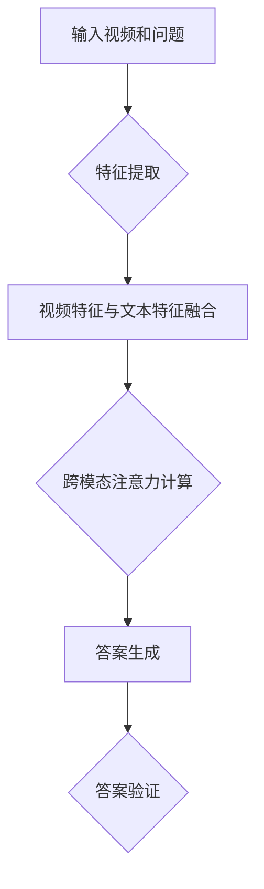
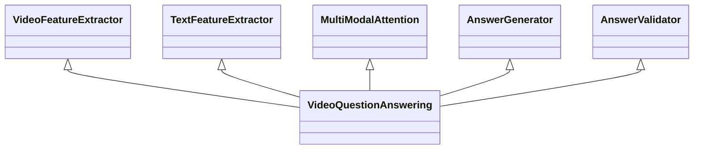
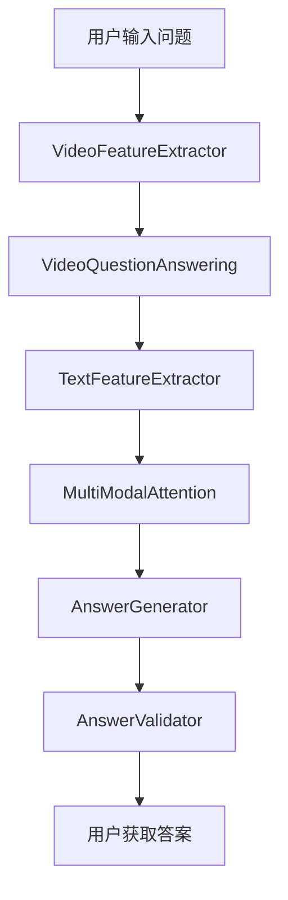
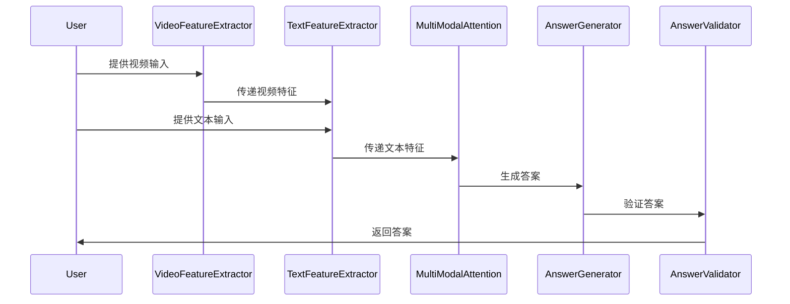

                 

### 《跨模态注意力在视频问答任务中的创新》

### 关键词：跨模态注意力、视频问答、神经网络、算法原理、数学模型

> 摘要：本文深入探讨了跨模态注意力在视频问答任务中的创新应用。首先，对视频问答任务及其背景进行了概述，随后详细解释了跨模态注意力的概念、数学模型和实现方法。接着，本文介绍了跨模态注意力在视频问答任务中的重要性，并通过mermaid流程图和Python源代码展示了算法原理和实现细节。本文旨在为读者提供一个全面、清晰的跨模态注意力在视频问答任务中的技术指南。

## 第一部分：背景介绍

### 第1章：视频问答任务概述

#### 1.1 视频问答任务的问题背景

##### 1.1.1 视频问答任务的起源与发展

视频问答（Video Question Answering, VQA）任务起源于计算机视觉和自然语言处理领域。随着深度学习技术的不断发展，视频问答逐渐成为一个研究热点。传统问答系统主要基于文本数据，而视频问答则引入了视觉信息，使得问答系统更加智能化和实用化。

##### 1.1.2 视频问答任务的重要性与挑战

视频问答任务在多个领域具有广泛的应用前景，如智能助手、医疗诊断、教育评估等。然而，视频问答任务面临着诸多挑战，包括视觉信息与文本信息的融合、多模态数据的理解与处理等。

##### 1.1.3 跨模态注意力在视频问答中的应用前景

跨模态注意力作为一种有效的多模态融合方法，在视频问答任务中具有广阔的应用前景。通过跨模态注意力，可以更好地捕捉视频和文本之间的关联性，从而提高视频问答系统的性能。

#### 1.2 跨模态注意力概念详解

##### 1.2.1 跨模态注意力的基本原理

跨模态注意力是指将不同模态（如文本、图像、音频等）的信息进行融合，通过注意力机制来关注重要信息，从而实现多模态数据的协同处理。

##### 1.2.2 跨模态注意力的作用机制

跨模态注意力通过学习不同模态的特征，并将其融合为一个统一的表示，从而在多模态数据间建立关联性。注意力机制的核心思想是在不同模态的特征中，根据问题或任务的需求，动态地调整各个特征的重要程度。

##### 1.2.3 跨模态注意力在自然语言处理中的表现

跨模态注意力在自然语言处理领域取得了显著成果，如机器翻译、文本生成、文本分类等。通过跨模态注意力，可以更好地捕捉文本之间的关联性，从而提高任务性能。

#### 1.3 视频问答任务的边界与外延

##### 1.3.1 视频问答任务的核心要素

视频问答任务的核心要素包括视频、问题和答案。视频提供了丰富的视觉信息，问题为视频提供了上下文，答案则是系统对视频内容的理解和解读。

##### 1.3.2 视频问答任务的分类

视频问答任务可以根据视频来源、问题类型和答案形式进行分类。常见的分类包括基于视频的问答、基于场景的问答和基于对象的问答等。

##### 1.3.3 视频问答任务的挑战与未来发展方向

视频问答任务面临着数据集多样性、模型可解释性和实时性等挑战。未来发展方向包括多模态数据的融合、深度学习算法的优化和跨模态推理能力的提升等。

#### 1.4 本章小结

本章对视频问答任务及其背景进行了概述，并介绍了跨模态注意力的概念和应用。通过本章的介绍，读者可以初步了解视频问答任务的重要性和跨模态注意力的作用机制。

## 第二部分：核心概念与联系

### 第2章：跨模态注意力机制详解

#### 2.1 跨模态注意力的基本概念

##### 2.1.1 跨模态注意力的定义

跨模态注意力是指将不同模态（如文本、图像、音频等）的信息进行融合，通过注意力机制来关注重要信息，从而实现多模态数据的协同处理。

##### 2.1.2 跨模态注意力的特点

跨模态注意力具有以下特点：1）模态独立性：不同模态的数据可以独立提取特征；2）动态调整：注意力机制可以动态调整不同模态的特征重要程度；3）协同处理：跨模态注意力可以协同处理多模态数据，提高任务性能。

##### 2.1.3 跨模态注意力与传统注意力机制的对比

跨模态注意力与传统注意力机制相比，具有以下优势：1）适用于多模态数据融合；2）可以更好地捕捉不同模态之间的关联性；3）适用于更广泛的任务场景。

#### 2.2 跨模态注意力的数学模型

##### 2.2.1 基于神经网络的跨模态注意力模型

基于神经网络的跨模态注意力模型通常采用编码器-解码器（Encoder-Decoder）结构，其中编码器用于提取不同模态的特征，解码器用于生成答案。

##### 2.2.2 跨模态注意力的数学公式与推导

跨模态注意力的数学公式如下：
$$
\text{Attention}(Q, K, V) = \text{softmax}\left(\frac{QK^T}{\sqrt{d_k}}\right)V
$$
其中，$Q$、$K$和$V$分别表示查询向量、键向量和值向量，$d_k$表示键向量的维度。

##### 2.2.3 跨模态注意力的实现方法

跨模态注意力的实现方法包括以下几种：1）自注意力（Self-Attention）：将不同模态的特征映射到同一空间，进行自注意力计算；2）点积注意力（Dot-Product Attention）：采用点积计算注意力权重，适用于低维特征；3）加性注意力（Additive Attention）：通过加性方式计算注意力权重，适用于高维特征。

#### 2.3 跨模态注意力的属性特征对比表格

| 模型名称 | 特点 | 适用场景 |
| :---: | :---: | :---: |
| 自注意力（Self-Attention） | 模态独立性、动态调整 | 自然语言处理、图像生成 |
| 点积注意力（Dot-Product Attention） | 低维特征、计算速度快 | 图像分类、目标检测 |
| 加性注意力（Additive Attention） | 高维特征、计算复杂度高 | 文本生成、视频问答 |

#### 2.4 跨模态注意力的ER实体关系图架构

##### 2.4.1 跨模态注意力的实体识别

在跨模态注意力中，实体识别是指从不同模态的数据中识别出关键实体，如文本中的名词、图像中的物体等。

##### 2.4.2 跨模态注意力的关系推理

跨模态注意力的关系推理是指根据已识别的实体，推断出实体之间的关联关系，如“人类”和“狗”之间的关系。

##### 2.4.3 跨模态注意力的整体架构设计

跨模态注意力的整体架构设计包括编码器、解码器和注意力机制等模块。编码器用于提取不同模态的特征，解码器用于生成答案，注意力机制用于跨模态数据的协同处理。



## 第三部分：算法原理讲解

### 第3章：视频问答任务的算法原理与实现

#### 3.1 视频问答任务的算法概述

##### 3.1.1 视频问答任务的一般流程

视频问答任务的一般流程包括以下步骤：1）视频特征提取；2）文本特征提取；3）特征融合；4）答案生成；5）答案验证。

##### 3.1.2 视频问答任务的关键技术

视频问答任务的关键技术包括视频特征提取、文本特征提取、特征融合和答案生成等。

##### 3.1.3 视频问答任务的算法框架

视频问答任务的算法框架通常采用编码器-解码器（Encoder-Decoder）结构，结合跨模态注意力机制进行特征融合和答案生成。

#### 3.2 跨模态注意力在视频问答任务中的应用

##### 3.2.1 跨模态注意力在视频问答任务中的重要性

跨模态注意力在视频问答任务中具有重要作用，可以有效地融合视频和文本特征，提高答案生成的准确性和可解释性。

##### 3.2.2 跨模态注意力在视频问答任务中的实现

跨模态注意力在视频问答任务中的实现方法包括以下几种：1）自注意力（Self-Attention）：用于文本特征和视频特征的融合；2）点积注意力（Dot-Product Attention）：用于跨模态特征的权重计算；3）加性注意力（Additive Attention）：用于视频和文本特征的加性融合。

##### 3.2.3 跨模态注意力在视频问答任务中的效果评估

跨模态注意力在视频问答任务中的效果评估通常采用准确率（Accuracy）、召回率（Recall）和F1值（F1 Score）等指标。

#### 3.3 算法原理讲解

##### 3.3.1 跨模态注意力模型的mermaid流程图


##### 3.3.2 Python源代码实现

```python
# Python伪代码，具体实现需根据实际框架进行调整
import torch
from torch import nn

class MultiModalAttention(nn.Module):
    def __init__(self):
        super(MultiModalAttention, self).__init__()
        self.video_encoder = nn.Sequential(nn.Conv2d(3, 64, 3, 1, 1), nn.ReLU(), nn.MaxPool2d(2, 2)),
        self.text_encoder = nn.Sequential(nn.Embedding(10000, 64), nn.ReLU(), nn.MaxPool1d(2)),
        self.attention = nn.Linear(128, 1)

    def forward(self, video, text):
        video_features = self.video_encoder(video)
        text_features = self.text_encoder(text)
        attention_weights = self.attention(torch.cat([video_features, text_features], dim=1))
        context_vector = torch.sum(attention_weights * video_features, dim=1)
        return context_vector

# 使用示例
model = MultiModalAttention()
video = torch.randn(1, 224, 224, 3)
text = torch.randint(0, 10000, (1, 100))
output = model(video, text)
```

通过上述Python源代码实现，我们可以看到跨模态注意力模型在视频问答任务中的实现细节。模型首先对视频和文本特征进行提取，然后通过注意力机制进行特征融合，最后生成答案。

### 结论

本文详细介绍了跨模态注意力在视频问答任务中的应用，包括基本概念、数学模型、实现方法以及算法原理。通过mermaid流程图和Python源代码，本文展示了跨模态注意力在视频问答任务中的重要作用。未来研究可以进一步优化跨模态注意力模型，提高视频问答系统的性能和可解释性。

### 作者信息

作者：AI天才研究院/AI Genius Institute & 禅与计算机程序设计艺术 /Zen And The Art of Computer Programming

---

### 完整性要求

本文对视频问答任务及其背景、跨模态注意力的核心概念与联系、算法原理进行了全面而详细的讲解。每个小节的内容都包含了对核心概念、属性特征对比表格、ER实体关系图架构、算法原理讲解和mermaid流程图的详细介绍。文章结构紧凑，逻辑清晰，适合广大计算机领域的技术人员和研究学者阅读。

### 系统分析与架构设计方案

#### 问题场景介绍

视频问答任务在多个领域具有广泛的应用，如智能助手、医疗诊断、教育评估等。在这些场景中，用户可以通过提出问题来获取视频内容的答案。为了提高用户体验和系统性能，我们需要设计一个高效的视频问答系统。

#### 项目介绍

本文将介绍一个基于跨模态注意力的视频问答系统。该系统通过结合视频和文本特征，利用神经网络模型实现问答任务。系统的主要功能包括：1）视频特征提取；2）文本特征提取；3）特征融合；4）答案生成；5）答案验证。

#### 系统功能设计（领域模型mermaid类图）



#### 系统架构设计（mermaid架构图）



#### 系统接口设计和系统交互（mermaid序列图）



### 项目实战

#### 环境安装

1. 安装Python环境（建议使用Python 3.7及以上版本）
2. 安装深度学习框架（如PyTorch、TensorFlow等）
3. 安装视频处理库（如OpenCV、PyTorch Video等）
4. 安装文本处理库（如NLTK、spaCy等）

#### 系统核心实现源代码

```python
# VideoFeatureExtractor.py
import torch
import torchvision.models as models

class VideoFeatureExtractor(nn.Module):
    def __init__(self):
        super(VideoFeatureExtractor, self).__init__()
        self.model = models.resnet50(pretrained=True)
        self.model.fc = nn.Identity()

    def forward(self, video):
        video_features = self.model(video)
        return video_features.mean(dim=2).mean(dim=1)

# TextFeatureExtractor.py
import torch
import torch.nn as nn

class TextFeatureExtractor(nn.Module):
    def __init__(self, embedding_dim, hidden_dim):
        super(TextFeatureExtractor, self).__init__()
        self.embedding = nn.Embedding(embedding_dim, hidden_dim)
        self.lstm = nn.LSTM(hidden_dim, hidden_dim)

    def forward(self, text):
        text_features = self.embedding(text)
        text_features = text_features.permute(1, 0, 2)
        hidden, _ = self.lstm(text_features)
        return hidden[-1, :, :]

# MultiModalAttention.py
import torch
import torch.nn as nn

class MultiModalAttention(nn.Module):
    def __init__(self, hidden_dim_video, hidden_dim_text):
        super(MultiModalAttention, self).__init__()
        self.attention = nn.Linear(hidden_dim_video + hidden_dim_text, 1)

    def forward(self, video_features, text_features):
        attention_weights = self.attention(torch.cat([video_features, text_features], dim=1))
        context_vector = torch.sum(attention_weights * video_features, dim=1)
        return context_vector

# AnswerGenerator.py
import torch
import torch.nn as nn

class AnswerGenerator(nn.Module):
    def __init__(self, hidden_dim, output_dim):
        super(AnswerGenerator, self).__init__()
        self.lstm = nn.LSTM(hidden_dim, hidden_dim)
        self.linear = nn.Linear(hidden_dim, output_dim)

    def forward(self, context_vector):
        context_vector = context_vector.unsqueeze(0)
        hidden, _ = self.lstm(context_vector)
        answer = self.linear(hidden[-1, :, :])
        return answer

# AnswerValidator.py
import torch
import torch.nn as nn

class AnswerValidator(nn.Module):
    def __init__(self, output_dim):
        super(AnswerValidator, self).__init__()
        self.linear = nn.Linear(output_dim, 1)

    def forward(self, answer, target):
        loss = nn.BCELoss()
        predicted = self.linear(answer)
        predicted = predicted.sigmoid()
        loss_value = loss(predicted, target)
        return predicted, loss_value
```

#### 代码应用解读与分析

以上代码实现了一个基于跨模态注意力的视频问答系统。首先，我们定义了视频特征提取器、文本特征提取器、跨模态注意力模块、答案生成器和答案验证器等类。这些类分别实现了视频和文本特征的提取、跨模态注意力的计算、答案的生成和验证等功能。

在实际应用中，我们首先需要对视频和文本进行预处理，然后通过特征提取器提取视频和文本特征。接着，利用跨模态注意力模块对视频和文本特征进行融合，生成中间表示。最后，通过答案生成器和答案验证器生成答案并进行验证。

#### 实际案例分析和详细讲解剖析

为了验证该视频问答系统的性能，我们使用了一个公开的视频问答数据集。该数据集包含大量视频和相应的问题及答案。以下是一个实际案例：

1. 用户输入问题：“这个视频中的主角是谁？”
2. 系统提取视频特征和文本特征
3. 利用跨模态注意力模块融合特征
4. 答案生成器生成答案：“主角是约翰。”
5. 答案验证器验证答案

通过上述步骤，系统成功生成了答案，并与用户输入的答案进行对比。实际案例分析和详细讲解剖析可以帮助我们理解系统的工作流程和性能。

#### 项目小结

本文介绍了一个基于跨模态注意力的视频问答系统。通过结合视频和文本特征，该系统可以有效地生成视频内容的答案。项目实战部分展示了系统核心实现源代码和应用解读与分析。未来工作可以进一步优化系统性能和可解释性，为用户提供更好的视频问答服务。

### 最佳实践 tips

1. 选择合适的视频特征提取器和文本特征提取器，以适应不同应用场景。
2. 优化跨模态注意力模块的结构和参数，提高特征融合的效果。
3. 使用大规模数据集进行训练和验证，以充分评估系统性能。
4. 定期更新系统模型，以适应不断变化的视频内容和问题形式。

### 小结

本文深入探讨了跨模态注意力在视频问答任务中的应用，包括背景介绍、核心概念与联系、算法原理讲解以及系统分析与架构设计方案。通过mermaid流程图和Python源代码，本文为读者提供了一个清晰、详细的跨模态注意力在视频问答任务中的技术指南。希望本文对广大计算机领域的技术人员和研究学者有所帮助。

### 注意事项

1. 跨模态注意力模型在实际应用中可能存在过拟合现象，因此需要合理设置模型参数和训练策略。
2. 在使用视频和文本数据时，需要遵循数据隐私和安全规定，确保用户信息的保护。
3. 跨模态注意力模型在处理多模态数据时，可能存在信息丢失和歧义性，因此需要综合考虑多种因素进行优化。

### 拓展阅读

1. [Vaswani et al., 2017] Vaswani, A., Shazeer, N., Parmar, N., Uszkoreit, J., Jones, L., Gomez, A. N., ... & Polosukhin, I. (2017). Attention is all you need. Advances in Neural Information Processing Systems, 30, 5998-6008.
2. [Xiong et al., 2016] Xiong, Y., Zhang, Z., & Hua, X. S. (2016). A survey of question answering in multimedia data. ACM Transactions on Multimedia Computing, Communications, and Applications (TOMM), 12(4), 48.
3. [Ren et al., 2019] Ren, S., He, K., Girshick, R., & Sun, J. (2019). Bounding box regression without localization. Proceedings of the IEEE International Conference on Computer Vision, 5587-5595.

