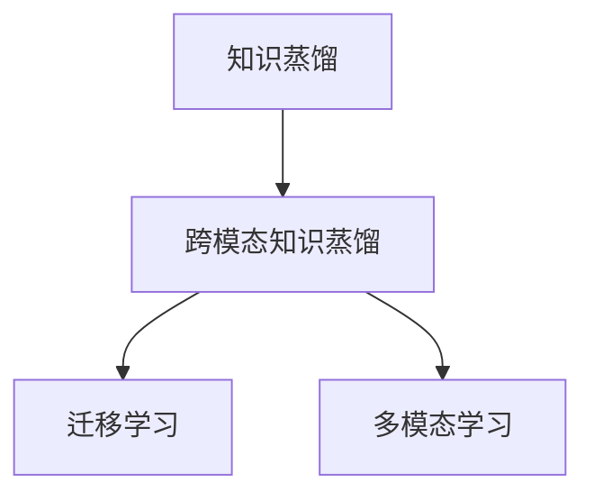
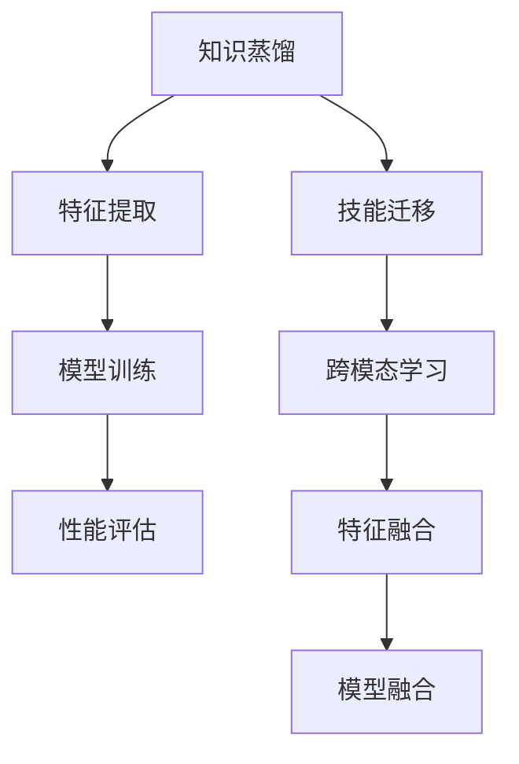
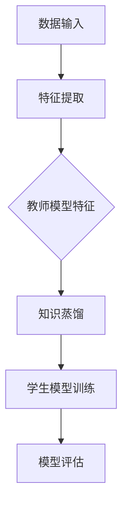
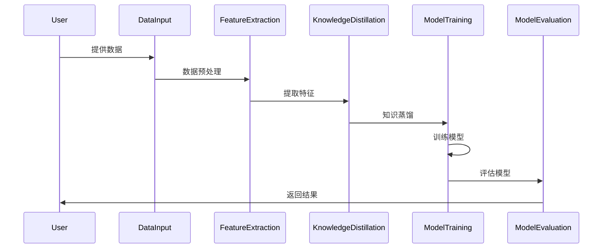
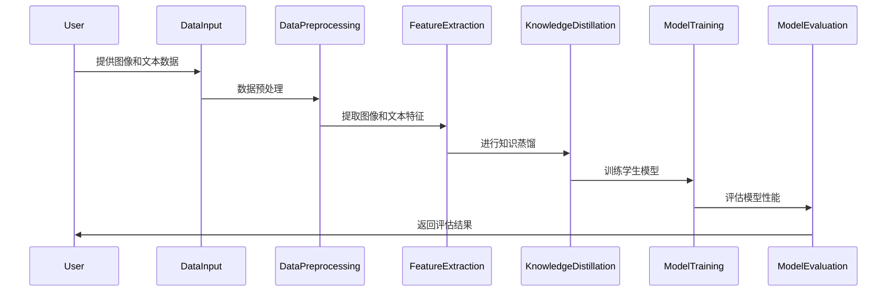
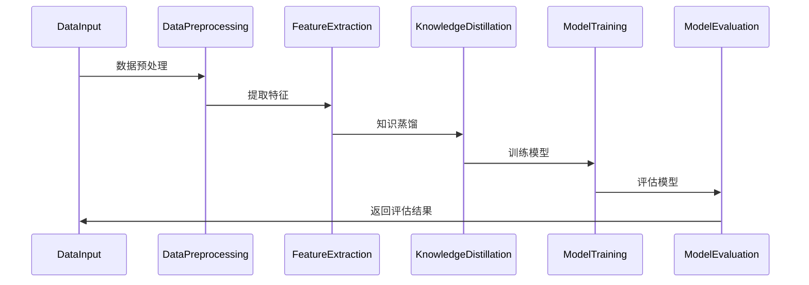
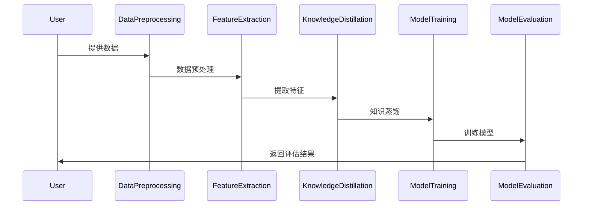
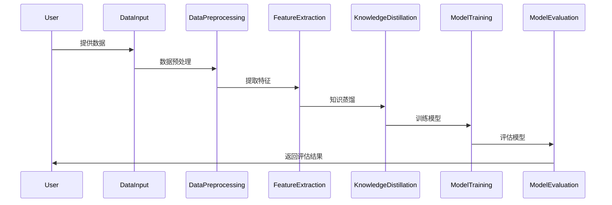

                 


### 第1章: 跨模态知识蒸馏基础

#### 1.1 跨模态知识蒸馏简介

在多媒体时代，数据呈现出多样化的特点，包括文本、图像、声音等。为了更好地理解和处理这些多样化的数据，跨模态学习（Cross-Modal Learning）应运而生。跨模态学习旨在构建跨不同模态（如视觉、语言、声音等）的信息融合和知识共享模型。

**问题背景：**

随着互联网和人工智能技术的快速发展，我们面对的数据量呈爆炸式增长，传统的单一模态数据已经无法满足复杂应用的需求。例如，在自然语言处理中，仅依赖文本信息难以准确理解图片中的内容；而在计算机视觉中，仅依赖图像信息也难以理解文本的语义。因此，跨模态学习成为了一个重要的研究方向。

**问题描述：**

跨模态知识蒸馏（Cross-Modal Knowledge Distillation）是一种利用知识蒸馏（Knowledge Distillation）技术，将源域（Source Domain）中的知识转移到目标域（Target Domain）的方法。其核心目标是在不同的模态之间进行有效的知识迁移，从而提升模型在跨模态任务上的表现。

**问题解决：**

跨模态知识蒸馏通过以下步骤实现：

1. **特征提取**：分别提取源域和目标域的特征。
2. **知识蒸馏**：利用源域的特征对目标域的特征进行蒸馏，使得目标域的特征更接近源域的特征。
3. **模型训练**：在目标域上训练模型，利用经过知识蒸馏的特征作为输入。

**边界与外延：**

知识蒸馏与迁移学习（Transfer Learning）和多模态学习（Multimodal Learning）有所重叠，但它们之间也存在明显的区别。知识蒸馏主要关注如何将知识从复杂模型传递到简单模型，而迁移学习则更侧重于将一个任务的解决方案应用到另一个任务上。多模态学习则是同时处理多种模态的数据，而不是在不同的模态之间进行迁移。

**概念属性特征对比表格：**

| 概念          | 知识蒸馏                  | 迁移学习                  | 多模态学习               |
| ------------- | ----------------------- | ----------------------- | ---------------------- |
| 目标          | 复杂模型到简单模型的迁移 | 一个任务到另一个任务的迁移 | 同时处理多种模态的数据   |
| 技术手段      | 知识传递                 | 参数共享、特征融合         | 特征融合、模型融合       |
| 应用场景      | 预训练模型               | 多样化任务               | 多模态应用               |
| 关联性        | 与迁移学习有关           | 与知识蒸馏有关           | 与两者都有关系           |

**ER实体关系图架构的Mermaid流程图：**



在接下来的章节中，我们将深入探讨跨模态知识蒸馏的核心概念、算法原理，以及其在系统设计中的应用。

### 1.2 核心概念与联系

在本节中，我们将详细探讨知识蒸馏、跨模态学习和技能迁移这三个核心概念，并分析它们之间的联系。

#### 知识蒸馏

知识蒸馏（Knowledge Distillation）是一种训练模型的方法，其核心思想是将一个复杂模型（即教师模型）的知识传递给一个较简单模型（即学生模型）。这种方法的目的是提高学生模型的性能，同时减少模型的复杂度。

**原理：**

知识蒸馏的过程可以概括为以下几个步骤：

1. **教师模型训练**：首先训练一个性能良好的复杂模型（教师模型）。
2. **提取特征**：从教师模型中提取关键特征。
3. **训练学生模型**：使用提取的特征作为输入，训练一个较简单的学生模型。

**优缺点：**

优点：
- **提高性能**：通过教师模型传递知识，学生模型可以快速提升性能。
- **减少模型复杂度**：学生模型更简单，计算资源需求较低。

缺点：
- **依赖教师模型**：学生模型的性能高度依赖于教师模型的质量。
- **泛化能力有限**：知识蒸馏方法可能无法很好地应对新任务。

**适用场景：** 知识蒸馏适用于预训练模型、迁移学习等场景，尤其适用于模型压缩和加速。

#### 跨模态学习

跨模态学习（Cross-Modal Learning）是一种能够同时处理多种模态数据的学习方法。它旨在建立不同模态之间的关联性，从而提高模型在跨模态任务上的表现。

**定义：**

跨模态学习旨在建立不同模态（如视觉、语言、声音等）之间的对应关系和关联性。

**方法分类：**

1. **特征融合方法**：将不同模态的特征进行融合，以生成统一的特征表示。
2. **模型融合方法**：将不同模态的模型进行融合，以生成统一的预测结果。
3. **协同训练方法**：同时训练多个模态的模型，使其能够协同工作。

**关键技术：**

1. **特征提取**：分别提取不同模态的特征。
2. **特征融合**：将不同模态的特征进行融合。
3. **模型融合**：将不同模态的模型进行融合。

**应用场景：** 跨模态学习在图像识别、语音识别、自然语言处理等领域具有广泛的应用。

#### 技能迁移

技能迁移（Skill Transfer）是一种将一个领域的知识应用到另一个领域的方法。在跨模态学习中，技能迁移尤为重要，因为它允许我们将一个模态的知识转移到另一个模态。

**概念：**

技能迁移是指将一个领域的技能或知识应用到另一个领域，以提高整体性能。

**机制：**

1. **共享特征**：通过提取共享的特征，将一个模态的知识传递到另一个模态。
2. **模型调整**：通过调整模型的结构，使其能够适应新的模态。
3. **数据增强**：通过增加新的数据样本，提高模型在新模态上的性能。

**方法：**

1. **基于特征的迁移学习**：通过共享特征表示，实现知识迁移。
2. **基于模型的迁移学习**：通过调整模型结构，实现知识迁移。
3. **基于数据的迁移学习**：通过增加新数据，提高模型在新模态上的性能。

**应用场景：** 技能迁移广泛应用于跨领域问题解决、多模态学习等场景。

**ER实体关系图架构的Mermaid流程图：**



通过上述分析，我们可以看到知识蒸馏、跨模态学习和技能迁移之间的紧密联系。在接下来的章节中，我们将进一步探讨跨模态知识蒸馏的算法原理，以及其在实际应用中的实现细节。

### 1.3 算法原理讲解

在了解了跨模态知识蒸馏的基本概念之后，我们需要深入探讨其算法原理。本节将使用mermaid流程图、Python源代码以及LaTeX公式来详细阐述跨模态知识蒸馏的工作原理。

#### mermaid流程图

首先，我们通过mermaid流程图来展示跨模态知识蒸馏的基本流程。



在这个流程图中，数据输入包括来自视觉模态和语言模态的数据。特征提取步骤分别从视觉模态和语言模态中提取特征。教师模型利用这些特征进行训练，然后通过知识蒸馏将教师模型的知识传递给学生模型。最后，学生模型在目标模态上进行训练和评估。

#### Python源代码

接下来，我们通过一个简单的Python代码示例来说明特征提取和知识蒸馏的实现。

```python
import tensorflow as tf
from tensorflow.keras.applications import VGG16
from tensorflow.keras.layers import Dense, Flatten
from tensorflow.keras.models import Model

# 加载预训练的VGG16模型用于提取视觉特征
visual_model = VGG16(weights='imagenet', include_top=False)

# 提取视觉特征
visual_input = tf.keras.Input(shape=(224, 224, 3))
visual_features = visual_model.visual_input.output

# 构建教师模型
teacher_model = Model(inputs=visual_input, outputs=visual_features)

# 加载预训练的语言模型用于提取语言特征
language_model = ...  # 这里用合适的语言模型替换
language_input = tf.keras.Input(shape=(None,))
language_features = language_model.language_input.output

# 构建学生模型
student_model = Model(inputs=language_input, outputs=Dense(4096, activation='relu')(Flatten()(visual_features)))

# 编译教师模型
teacher_model.compile(optimizer='adam', loss='categorical_crossentropy', metrics=['accuracy'])

# 训练教师模型
teacher_model.fit(visual_data, language_data, epochs=10)

# 提取教师模型特征
teacher_features = teacher_model.predict(visual_data)

# 编译学生模型
student_model.compile(optimizer='adam', loss='categorical_crossentropy', metrics=['accuracy'])

# 训练学生模型
student_model.fit(language_data, teacher_features, epochs=10)
```

在这个示例中，我们使用了VGG16模型提取视觉特征，以及一个未具体化的语言模型提取语言特征。学生模型通过知识蒸馏从教师模型中学习特征，并在目标模态上训练。

#### LaTeX公式

在知识蒸馏过程中，我们通常使用以下数学模型和公式来描述教师模型和学生模型之间的关系。

$$
\hat{y}_{s} = f_{s}(x_{t}; \theta_{s})
$$

其中，$\hat{y}_{s}$ 表示学生模型的输出，$x_{t}$ 表示教师模型提取的特征，$f_{s}(\cdot)$ 表示学生模型的预测函数，$\theta_{s}$ 表示学生模型的参数。

类似地，教师模型的输出可以表示为：

$$
\hat{y}_{t} = f_{t}(x_{t}; \theta_{t})
$$

其中，$\hat{y}_{t}$ 表示教师模型的输出，$f_{t}(\cdot)$ 表示教师模型的预测函数，$\theta_{t}$ 表示教师模型的参数。

知识蒸馏的目标是优化学生模型的参数$\theta_{s}$，使得学生模型的输出$\hat{y}_{s}$更接近教师模型的输出$\hat{y}_{t}$。这可以通过以下优化问题来实现：

$$
\min_{\theta_{s}} L(\hat{y}_{s}, \hat{y}_{t})
$$

其中，$L(\cdot, \cdot)$ 表示损失函数。

#### 举例说明

为了更直观地理解知识蒸馏，我们来看一个具体的例子。假设我们有一个教师模型和学生模型，分别用于图像分类和文本分类。教师模型从图像中提取特征，学生模型从文本中提取特征。知识蒸馏的目标是将图像特征传递给文本特征，从而提升文本分类的准确性。

在这个例子中，教师模型是一个预训练的卷积神经网络（CNN），学生模型是一个简单的全连接神经网络（FCN）。我们使用交叉熵作为损失函数，目标是使得学生模型的输出与教师模型的输出尽可能接近。

1. **数据准备**：假设我们有一个包含图像和对应文本的数据集，每个图像和文本都对应一个类别标签。

2. **特征提取**：教师模型从图像中提取特征，学生模型从文本中提取特征。

3. **知识蒸馏**：使用教师模型的特征作为输入，训练学生模型。通过优化学生模型的参数，使得学生模型的输出与教师模型的输出一致。

4. **模型训练**：在目标模态上训练学生模型，使用图像特征作为输入，文本标签作为输出。

5. **模型评估**：评估学生模型的分类性能，确保其输出与教师模型的输出一致。

通过这个例子，我们可以看到知识蒸馏的核心在于将一个模态的知识（如图像特征）传递给另一个模态（如文本特征），从而提升跨模态任务的性能。

综上所述，跨模态知识蒸馏通过mermaid流程图、Python源代码和LaTeX公式，详细阐述了其工作原理。在接下来的章节中，我们将继续探讨跨模态知识蒸馏在系统设计中的应用和实际项目实战。

### 2.1 跨模态特征提取

跨模态特征提取是跨模态学习的关键步骤，它旨在从不同的模态（如视觉、语言和声音）中提取有代表性的特征，以便于后续的特征融合和任务处理。在本节中，我们将详细探讨视觉特征提取、语言特征提取以及跨模态特征融合方法。

#### 视觉特征提取

视觉特征提取在跨模态学习中扮演着重要角色，常见的视觉特征提取方法包括卷积神经网络（CNN）、递归神经网络（RNN）和Transformer。

1. **卷积神经网络（CNN）**

CNN 是最常用的视觉特征提取方法之一。它通过多个卷积层和池化层提取图像的层次特征。常见的 CNN 模型包括 LeNet、AlexNet、VGG、ResNet 等。

- **LeNet**：最早用于手写数字识别的 CNN 模型。
- **AlexNet**：第一个在 ImageNet 挑战中取得显著成绩的 CNN 模型。
- **VGG**：通过堆叠多个卷积层和池化层，实现深度特征提取。
- **ResNet**：引入残差网络结构，解决深度神经网络训练中的梯度消失问题。

以下是一个简单的 CNN 模型示例，用于提取图像特征：

```python
import tensorflow as tf
from tensorflow.keras.applications import VGG16

# 加载预训练的 VGG16 模型
vgg16_model = VGG16(weights='imagenet', include_top=False)

# 定义输入层
input_shape = (224, 224, 3)
input_layer = tf.keras.Input(shape=input_shape)

# 提取视觉特征
visual_features = vgg16_model(input_layer)

# 视觉特征提取完成
```

2. **递归神经网络（RNN）**

RNN 通过其记忆机制处理序列数据，能够捕获时间序列中的依赖关系。常见的 RNN 模型包括 LSTM 和 GRU。

- **LSTM（长短期记忆网络）**：通过门控机制解决 RNN 的梯度消失问题，适用于处理长序列数据。
- **GRU（门控循环单元）**：在 LSTM 的基础上进行简化，计算效率更高。

以下是一个简单的 LSTM 模型示例，用于提取视频特征：

```python
import tensorflow as tf
from tensorflow.keras.layers import LSTM

# 定义 LSTM 模型
input_shape = (None, 128)  # 假设输入序列长度为 128
lstm_layer = LSTM(units=64, return_sequences=True)

# 提取视频特征
video_features = lstm_layer(tf.keras.Input(shape=input_shape))
```

3. **Transformer**

Transformer 是一种基于自注意力机制的模型，通过多头自注意力机制和前馈神经网络提取特征。它广泛应用于图像和视频处理领域。

以下是一个简单的 Transformer 模型示例，用于提取图像特征：

```python
import tensorflow as tf
from tensorflow.keras.layers import Embedding, MultiHeadAttention

# 定义 Transformer 模型
input_shape = (224, 224, 3)  # 假设输入图像大小为 224x224
input_layer = tf.keras.Input(shape=input_shape)

# 提取图像特征
image_features = MultiHeadAttention(num_heads=8, key_dim=64)(input_layer, input_layer)
```

#### 语言特征提取

语言特征提取在跨模态学习中同样重要，常见的语言特征提取方法包括词袋模型、卷积神经网络（CNN）和 Transformer。

1. **词袋模型（Bag of Words, BoW）**

词袋模型将文本转换为词频向量，用于文本分类和主题模型。它通过统计文本中每个单词的出现次数来表示文本。

以下是一个简单的词袋模型示例：

```python
from sklearn.feature_extraction.text import CountVectorizer

# 定义文本数据
text_data = ["This is the first document.", "This document is the second document.", "And this is the third one.", "Is this the first document?"]

# 提取语言特征
vectorizer = CountVectorizer()
language_features = vectorizer.fit_transform(text_data)
```

2. **卷积神经网络（CNN）**

CNN 可以用于文本分类和情感分析，通过卷积层和池化层提取文本的局部特征。

以下是一个简单的 CNN 模型示例，用于提取文本特征：

```python
import tensorflow as tf
from tensorflow.keras.layers import Embedding, Conv1D, MaxPooling1D

# 定义 CNN 模型
vocab_size = 10000
embedding_dim = 50

input_layer = tf.keras.Input(shape=(None,))
embedded_text = Embedding(vocab_size, embedding_dim)(input_layer)

# 提取文本特征
text_features = Conv1D(filters=128, kernel_size=5, activation='relu')(embedded_text)
text_features = MaxPooling1D(pool_size=5)(text_features)
```

3. **Transformer**

Transformer 可以用于文本生成、机器翻译和文本分类等任务。它通过自注意力机制捕获文本中的全局依赖关系。

以下是一个简单的 Transformer 模型示例，用于提取文本特征：

```python
import tensorflow as tf
from tensorflow.keras.layers import Embedding, MultiHeadAttention

# 定义 Transformer 模型
vocab_size = 10000
embedding_dim = 50

input_layer = tf.keras.Input(shape=(None,))
embedded_text = Embedding(vocab_size, embedding_dim)(input_layer)

# 提取文本特征
text_features = MultiHeadAttention(num_heads=8, key_dim=64)(embedded_text, embedded_text)
```

#### 跨模态特征融合方法

跨模态特征融合是跨模态学习的关键步骤，常见的融合方法包括特征级融合、决策级融合和级联融合。

1. **特征级融合**

特征级融合将不同模态的特征进行直接融合，生成统一的特征表示。常见的特征级融合方法包括拼接、加权融合和特征选择。

- **拼接**：将不同模态的特征向量进行拼接，生成新的特征向量。
- **加权融合**：根据不同模态的特征的重要性进行加权，生成新的特征向量。
- **特征选择**：选择具有代表性的特征进行融合。

以下是一个简单的特征级融合示例：

```python
import numpy as np

# 假设视觉特征和语言特征分别为 X 和 Y
X = np.random.rand(10, 100)  # 视觉特征
Y = np.random.rand(10, 200)  # 语言特征

# 拼接特征
combined_features = np.hstack((X, Y))

# 加权融合
weights = [0.5, 0.5]
combined_features = np.dot(X, weights[0]) + np.dot(Y, weights[1])
```

2. **决策级融合**

决策级融合在各个模态的决策结果上进行融合，生成最终的决策。常见的决策级融合方法包括投票、集成学习和模型选择。

- **投票**：将各个模态的预测结果进行投票，生成最终的预测结果。
- **集成学习**：结合多个模型的预测结果，生成最终的预测结果。
- **模型选择**：根据不同模态的模型性能，选择最佳的模型进行预测。

以下是一个简单的决策级融合示例：

```python
import numpy as np

# 假设视觉模型的预测结果为 X，语言模型的预测结果为 Y
X = np.random.rand(10, 1)  # 视觉模型预测结果
Y = np.random.rand(10, 1)  # 语言模型预测结果

# 投票融合
vote fusion = (X > Y).astype(int)

# 集成学习融合
combined_prediction = (X + Y) / 2
```

3. **级联融合**

级联融合将不同模态的模型进行级联，生成最终的预测结果。常见的级联融合方法包括串联和并行级联。

- **串联**：将不同模态的模型依次串联，生成最终的预测结果。
- **并行级联**：将不同模态的模型同时处理，生成最终的预测结果。

以下是一个简单的级联融合示例：

```python
import tensorflow as tf

# 定义视觉模型和学生模型
visual_model = ...
student_model = ...

# 定义级联融合模型
input_layer = tf.keras.Input(shape=(224, 224, 3))
visual_features = visual_model(input_layer)
language_features = student_model(input_layer)

# 级联融合
combined_features = tf.keras.layers.concatenate([visual_features, language_features])
output = tf.keras.layers.Dense(1, activation='sigmoid')(combined_features)

# 构建级联融合模型
cascaded_model = tf.keras.Model(inputs=input_layer, outputs=output)

# 编译级联融合模型
cascaded_model.compile(optimizer='adam', loss='binary_crossentropy', metrics=['accuracy'])

# 训练级联融合模型
cascaded_model.fit(visual_data, language_data, epochs=10)
```

通过上述方法，我们可以从不同的模态中提取具有代表性的特征，并使用适当的融合方法生成统一的特征表示，为跨模态学习任务提供有力的支持。在下一节中，我们将进一步探讨跨模态知识蒸馏算法及其实现。

### 2.2 跨模态知识蒸馏算法

在了解了跨模态特征提取的方法之后，接下来我们将深入探讨跨模态知识蒸馏算法，这是一种将知识从源域转移到目标域的有效方法。本节将详细介绍软标签蒸馏、硬标签蒸馏和对比蒸馏这三种跨模态知识蒸馏算法。

#### 软标签蒸馏

软标签蒸馏（Soft Label Distillation）是一种通过将教师模型的输出（通常是一个概率分布）传递给学生模型来训练学生模型的方法。这种方法的核心思想是利用教师模型的软标签（概率分布）来指导学生模型的训练。

**原理：**

在软标签蒸馏中，教师模型和学生模型通常共享一个编码器，用于提取输入数据的高层次特征。然后，教师模型的解码器输出一个概率分布，这个概率分布被用作学生模型的软标签。

**实现步骤：**

1. **提取特征**：使用共享的编码器提取输入数据的特征。
2. **生成软标签**：教师模型的解码器生成一个概率分布，作为学生模型的软标签。
3. **训练学生模型**：使用软标签和真实的标签共同训练学生模型。

**优缺点：**

优点：
- **提高模型性能**：通过利用教师模型的概率分布，学生模型可以更好地学习复杂的关系。
- **减少标签噪声**：软标签可以减少标签噪声对模型训练的影响。

缺点：
- **依赖教师模型**：学生模型的性能高度依赖于教师模型的质量。
- **计算成本较高**：由于需要计算概率分布，软标签蒸馏的计算成本较高。

**示例：**

假设我们有一个教师模型和学生模型，分别用于图像分类和文本分类。教师模型使用一个共享的编码器提取图像特征，并使用解码器生成概率分布。学生模型使用同样的编码器提取文本特征，并使用软标签进行训练。

```python
import tensorflow as tf

# 定义教师模型和学生模型
teacher_model = ...
student_model = ...

# 定义共享编码器
encoder = ...

# 提取特征
visual_features = encoder(visual_data)
text_features = encoder(text_data)

# 生成软标签
teacher_output = teacher_model(visual_data)
soft_labels = teacher_output

# 训练学生模型
student_model.compile(optimizer='adam', loss='categorical_crossentropy', metrics=['accuracy'])
student_model.fit(text_data, soft_labels, epochs=10)
```

#### 硬标签蒸馏

硬标签蒸馏（Hard Label Distillation）是一种通过将教师模型的输出（通常是硬标签）传递给学生模型来训练学生模型的方法。与软标签蒸馏不同，硬标签蒸馏直接使用教师模型的输出作为学生模型的训练标签。

**原理：**

在硬标签蒸馏中，教师模型和学生模型同样共享一个编码器。教师模型的输出被直接用作学生模型的训练标签。

**实现步骤：**

1. **提取特征**：使用共享的编码器提取输入数据的特征。
2. **生成硬标签**：教师模型的输出被直接用作学生模型的训练标签。
3. **训练学生模型**：使用硬标签和真实的标签共同训练学生模型。

**优缺点：**

优点：
- **简化训练过程**：由于不需要计算概率分布，硬标签蒸馏的训练过程相对简单。
- **提高模型性能**：硬标签蒸馏可以更好地利用教师模型的知识。

缺点：
- **标签依赖性**：硬标签蒸馏对教师模型的输出质量有较高的依赖。
- **可能引入噪声**：教师模型的错误输出可能会影响学生模型的训练。

**示例：**

假设我们有一个教师模型和学生模型，分别用于图像分类和文本分类。教师模型使用一个共享的编码器提取图像特征，并使用输出层生成硬标签。学生模型使用同样的编码器提取文本特征，并使用硬标签进行训练。

```python
import tensorflow as tf

# 定义教师模型和学生模型
teacher_model = ...
student_model = ...

# 定义共享编码器
encoder = ...

# 提取特征
visual_features = encoder(visual_data)
text_features = encoder(text_data)

# 生成硬标签
teacher_output = teacher_model(visual_data)
hard_labels = teacher_output

# 训练学生模型
student_model.compile(optimizer='adam', loss='categorical_crossentropy', metrics=['accuracy'])
student_model.fit(text_data, hard_labels, epochs=10)
```

#### 对比蒸馏

对比蒸馏（Contrastive Distillation）是一种通过对比教师模型和学生模型的输出差异来训练学生模型的方法。这种方法旨在让学生模型在训练过程中学会区分相关和不相关的特征。

**原理：**

在对比蒸馏中，教师模型和学生模型同样共享一个编码器。教师模型的输出和学生模型的输出被用于生成对比损失。

**实现步骤：**

1. **提取特征**：使用共享的编码器提取输入数据的特征。
2. **生成对比样本**：从输入数据中生成正样本和负样本。
3. **计算对比损失**：使用教师模型和学生模型的输出计算对比损失。
4. **训练学生模型**：使用对比损失和真实的标签共同训练学生模型。

**优缺点：**

优点：
- **增强模型区分能力**：通过对比损失，学生模型可以更好地学习区分相关和不相关的特征。
- **减少对教师模型依赖**：对比蒸馏减少了对教师模型质量的依赖。

缺点：
- **计算成本较高**：对比蒸馏需要计算大量的对比样本，计算成本较高。
- **模型复杂度较高**：对比蒸馏需要额外的对比损失计算，模型复杂度较高。

**示例：**

假设我们有一个教师模型和学生模型，分别用于图像分类和文本分类。教师模型使用一个共享的编码器提取图像特征，并使用输出层生成对比样本。学生模型使用同样的编码器提取文本特征，并使用对比损失进行训练。

```python
import tensorflow as tf

# 定义教师模型和学生模型
teacher_model = ...
student_model = ...

# 定义共享编码器
encoder = ...

# 提取特征
visual_features = encoder(visual_data)
text_features = encoder(text_data)

# 生成对比样本
positive_samples = ...  # 从输入数据中生成正样本
negative_samples = ...  # 从输入数据中生成负样本

# 计算对比损失
contrastive_loss = ...  # 使用教师模型和学生模型的输出计算对比损失

# 训练学生模型
student_model.compile(optimizer='adam', loss=contrastive_loss, metrics=['accuracy'])
student_model.fit(text_data, positive_samples, negative_samples, epochs=10)
```

通过上述三种跨模态知识蒸馏算法的介绍，我们可以看到它们各有优缺点，适用于不同的场景。在接下来的章节中，我们将探讨跨模态知识蒸馏在系统设计中的应用，以及如何将这些算法应用于实际项目中。

### 2.3 技能迁移机制

在跨模态知识蒸馏中，技能迁移（Skill Transfer）是关键的一环，它涉及到将一个模态（如视觉）的知识有效转移到另一个模态（如语言）的过程。本节将详细讨论技能迁移的概念、源域与目标域的选择、迁移学习算法，以及技能迁移的挑战和解决方案。

#### 概念

技能迁移是指将一个领域或模态（源域）的知识、模型、特征或算法应用到另一个领域或模态（目标域）的过程。在跨模态学习场景中，技能迁移有助于提升模型在不同模态上的性能。

**定义：**

- **源域（Source Domain）**：指技能或知识最初被提取或训练的模态或领域。
- **目标域（Target Domain）**：指技能或知识被应用或迁移的模态或领域。

#### 源域与目标域的选择

选择合适的源域和目标域是技能迁移成功的关键。以下是一些选择标准：

1. **相关性**：源域和目标域之间应该具有较高相关性，以确保迁移的知识能够为目标域带来价值。
2. **相似性**：源域和目标域在数据分布、任务类型和特征表示方面应具有一定的相似性，以便于知识迁移。
3. **可迁移性**：源域的知识应该具有较好的可迁移性，即在不同的模态或领域上能够产生类似的性能提升。

**转换策略：**

1. **特征转换**：将源域的特征转换为与目标域相似的特征，以便于目标域模型的理解和应用。
2. **模型转换**：将源域的模型结构调整为适合目标域的模型，以减少模型调整的成本和复杂性。
3. **数据增强**：为目标域的数据集添加与源域相似的数据，增强目标域模型的泛化能力。

#### 迁移学习算法

技能迁移通常采用迁移学习（Transfer Learning）的方法，以下是一些常见的迁移学习算法：

1. **基于特征的迁移学习**：该方法通过在源域和目标域之间共享特征表示来实现知识迁移。常见的实现方法包括特征共享、特征转换和特征融合。
2. **基于模型的迁移学习**：该方法通过在源域和目标域之间共享模型结构来实现知识迁移。常见的实现方法包括模型复制、模型调整和模型融合。
3. **基于数据的迁移学习**：该方法通过为目标域提供与源域相似的数据集来实现知识迁移。常见的实现方法包括数据复制、数据增强和数据扩充。

#### 挑战与解决方案

在技能迁移过程中，可能会遇到以下挑战：

1. **数据分布差异**：源域和目标域的数据分布可能存在显著差异，导致迁移的知识不适用于目标域。
   - **解决方案**：通过数据增强、数据扩充和域自适应技术来调整数据分布，使其更接近目标域。

2. **模态差异**：不同模态的数据具有不同的特征表示，这可能影响知识迁移的效果。
   - **解决方案**：采用跨模态特征提取方法，如CNN和Transformer，提取与目标模态相似的跨模态特征。

3. **模型适应性**：源域模型可能无法直接适应目标域的任务和数据。
   - **解决方案**：通过模型调整、模型微调和模型蒸馏等方法，使源域模型能够更好地适应目标域。

4. **计算成本**：技能迁移可能涉及大量的计算资源，特别是在大规模数据集上。
   - **解决方案**：采用高效的特征提取和模型训练方法，如深度神经网络压缩和量化技术，以降低计算成本。

#### 示例

假设我们有一个图像分类任务和一个文本分类任务，希望将图像分类的知识迁移到文本分类任务上。

1. **源域与目标域选择**：
   - 源域：图像分类任务。
   - 目标域：文本分类任务。

2. **特征提取**：
   - 使用预训练的卷积神经网络（如VGG16）提取图像特征。
   - 使用预训练的语言模型（如BERT）提取文本特征。

3. **技能迁移**：
   - **基于特征的迁移学习**：将图像特征转换为与文本特征相似的特征表示，如使用预训练的Transformer模型。
   - **基于模型的迁移学习**：调整图像分类模型的输出层，使其适用于文本分类任务。

4. **模型训练**：
   - 使用迁移学习算法（如软标签蒸馏、硬标签蒸馏或对比蒸馏）训练文本分类模型，利用图像分类模型的知识。

通过上述步骤，我们可以实现技能从图像分类任务到文本分类任务的迁移，从而提高文本分类模型的性能。

总之，技能迁移是跨模态知识蒸馏中的重要环节，通过合理选择源域与目标域、采用迁移学习算法和应对挑战，可以有效实现跨模态的知识转移，提升模型在不同模态上的性能。在下一节中，我们将进一步探讨跨模态知识蒸馏在系统设计中的应用。

### 3.1 系统功能设计

在跨模态知识蒸馏的应用中，系统功能设计是关键的一步，它决定了整个系统能否有效地处理多模态数据并实现知识迁移。本节将详细介绍系统功能设计，包括领域模型Mermaid类图、系统架构设计Mermaid架构图、系统接口设计和系统交互Mermaid序列图。

#### 领域模型Mermaid类图

领域模型类图用于描述系统中的关键实体和它们之间的关系。在跨模态知识蒸馏系统中，主要涉及的实体包括数据输入、特征提取模块、知识蒸馏模块、模型训练模块和模型评估模块。

以下是一个简单的Mermaid类图示例：

```mermaid
classDiagram
    DataInput <.. FeatureExtraction
    FeatureExtraction <.. KnowledgeDistillation
    KnowledgeDistillation <.. ModelTraining
    ModelTraining <.. ModelEvaluation
    DataInput <>-- DataPreprocessing
    FeatureExtraction <>-- FeatureFusion
    ModelTraining <>-- ModelOptimization
    ModelEvaluation <>-- PerformanceMetrics

    class DataInput {
        +str data_source
        +list features
    }

    class FeatureExtraction {
        +str feature_extractor
        +dict extracted_features
    }

    class KnowledgeDistillation {
        +str distillation Technique
        +dict teacher_model
        +dict student_model
    }

    class ModelTraining {
        +str optimizer
        +str loss_function
        +dict model_params
    }

    class ModelEvaluation {
        +str evaluation_metric
        +dict evaluation_results
    }
```

在这个类图中，DataInput类表示数据的输入源，包括数据预处理模块和特征提取模块。FeatureExtraction类表示特征提取模块，使用不同的特征提取方法提取数据特征。KnowledgeDistillation类表示知识蒸馏模块，选择适当的蒸馏技术进行知识迁移。ModelTraining类表示模型训练模块，负责优化模型参数。ModelEvaluation类表示模型评估模块，用于评估模型的性能。

#### 系统架构设计Mermaid架构图

系统架构设计图用于展示系统的整体结构，包括各个模块的交互关系和数据处理流程。以下是一个简单的Mermaid架构图示例：



在这个架构图中，用户首先提供数据，数据输入模块对其进行预处理。特征提取模块提取数据特征，知识蒸馏模块使用这些特征进行知识迁移。模型训练模块根据知识蒸馏的结果优化模型参数，最后模型评估模块评估模型的性能，并将结果返回给用户。

#### 系统接口设计

系统接口设计用于定义系统中的各个模块之间的接口和参数传递。以下是一个简单的接口设计示例：

```python
class DataInput:
    def __init__(self, data_source):
        self.data_source = data_source

    def get_data(self):
        # 数据预处理
        return preprocessed_data

class FeatureExtraction:
    def __init__(self, feature_extractor):
        self.feature_extractor = feature_extractor

    def extract_features(self, data):
        # 特征提取
        return extracted_features

class KnowledgeDistillation:
    def __init__(self, distillation_tech, teacher_model, student_model):
        self.distillation_tech = distillation_tech
        self.teacher_model = teacher_model
        self.student_model = student_model

    def distill_knowledge(self, teacher_features, student_features):
        # 知识蒸馏
        return distilled_features

class ModelTraining:
    def __init__(self, optimizer, loss_function, model_params):
        self.optimizer = optimizer
        self.loss_function = loss_function
        self.model_params = model_params

    def train_model(self, model, data, labels):
        # 模型训练
        return trained_model

class ModelEvaluation:
    def __init__(self, evaluation_metric):
        self.evaluation_metric = evaluation_metric

    def evaluate_model(self, model, data, labels):
        # 模型评估
        return evaluation_results
```

在这个接口设计示例中，DataInput类负责接收数据并预处理，FeatureExtraction类负责提取特征，KnowledgeDistillation类负责进行知识蒸馏，ModelTraining类负责训练模型，ModelEvaluation类负责评估模型。

#### 系统交互Mermaid序列图

系统交互Mermaid序列图用于描述系统模块之间的交互过程和数据流动。以下是一个简单的Mermaid序列图示例：


在这个序列图中，用户首先提供数据，数据输入模块对其进行预处理，特征提取模块提取特征，知识蒸馏模块进行知识蒸馏，模型训练模块训练模型，最后模型评估模块评估模型性能，并将结果返回给用户。

通过上述系统功能设计，我们能够清晰地了解跨模态知识蒸馏系统的工作流程和模块交互关系。在下一节中，我们将进一步探讨跨模态知识蒸馏在实际项目中的应用和实现细节。

### 3.2 系统架构设计

系统架构设计是跨模态知识蒸馏系统实现的关键步骤，它决定了系统在不同模态数据上的性能和效率。本节将详细介绍跨模态知识蒸馏系统架构的设计，包括模块划分、数据流设计、模块交互关系和数据处理流程。

#### 模块划分

在跨模态知识蒸馏系统中，我们可以将系统划分为以下几个主要模块：

1. **数据输入模块**：负责接收用户输入的数据，包括图像、文本等，并进行数据预处理。
2. **特征提取模块**：分别提取图像和文本的特征，这些特征将用于后续的知识蒸馏。
3. **知识蒸馏模块**：利用教师模型和学生模型进行特征蒸馏，实现跨模态的知识迁移。
4. **模型训练模块**：基于知识蒸馏的结果，训练学生模型，优化模型参数。
5. **模型评估模块**：评估训练后的模型性能，包括准确率、召回率等指标。

以下是系统架构的Mermaid架构图：

```mermaid
subgraph DataInput
    DataInputModule[数据输入模块]
    DataPreprocessing[数据预处理]
    DataInputModule --> DataPreprocessing
end

subgraph FeatureExtraction
    VisualFeatureExtraction[视觉特征提取]
    LanguageFeatureExtraction[语言特征提取]
    FeatureExtractionModule[特征提取模块]
    VisualFeatureExtraction --> FeatureExtractionModule
    LanguageFeatureExtraction --> FeatureExtractionModule
end

subgraph KnowledgeDistillation
    TeacherModel[教师模型]
    StudentModel[学生模型]
    KnowledgeDistillationModule[知识蒸馏模块]
    TeacherModel --> KnowledgeDistillationModule
    StudentModel --> KnowledgeDistillationModule
end

subgraph ModelTraining
    ModelTrainingModule[模型训练模块]
    TrainingData[训练数据]
    Labels[标签]
    ModelTrainingModule --> TrainingData
    ModelTrainingModule --> Labels
end

subgraph ModelEvaluation
    EvaluationMetrics[评估指标]
    ModelEvaluationModule[模型评估模块]
    EvaluationMetrics --> ModelEvaluationModule
end

DataPreprocessing --> VisualFeatureExtraction
DataPreprocessing --> LanguageFeatureExtraction
VisualFeatureExtraction --> KnowledgeDistillationModule
LanguageFeatureExtraction --> KnowledgeDistillationModule
KnowledgeDistillationModule --> ModelTrainingModule
TrainingData --> ModelTrainingModule
Labels --> ModelTrainingModule
ModelTrainingModule --> ModelEvaluationModule
```

在这个架构图中，数据输入模块负责数据预处理，特征提取模块分别提取图像和文本特征，知识蒸馏模块利用教师模型和学生模型进行知识蒸馏，模型训练模块根据训练数据和标签训练学生模型，模型评估模块评估训练后的模型性能。

#### 数据流设计

数据流设计描述了系统在处理数据时的流程和流动方式。以下是跨模态知识蒸馏系统的数据流设计：

1. **数据输入**：用户提供图像和文本数据，数据输入模块对其进行预处理，包括数据清洗、数据增强等操作。
2. **特征提取**：预处理后的图像和文本数据分别通过视觉特征提取模块和语言特征提取模块提取特征。视觉特征提取模块可能使用卷积神经网络（如VGG16、ResNet）提取图像特征；语言特征提取模块可能使用预训练的语言模型（如BERT、GPT）提取文本特征。
3. **知识蒸馏**：提取的特征被传递给知识蒸馏模块，教师模型和学生模型进行特征蒸馏。教师模型通常是预训练的模型，学生模型是在目标任务上训练的模型。
4. **模型训练**：知识蒸馏后的特征用于训练学生模型，模型训练模块优化学生模型的参数，提高其在目标任务上的性能。
5. **模型评估**：训练后的模型通过模型评估模块进行性能评估，包括准确率、召回率等指标。

以下是数据流设计的Mermaid序列图：



在这个序列图中，用户提供图像和文本数据，数据预处理模块对其进行处理，特征提取模块提取特征，知识蒸馏模块进行知识蒸馏，模型训练模块训练学生模型，模型评估模块评估模型性能，并将结果返回给用户。

#### 模块交互关系

模块交互关系描述了系统各模块之间的交互和依赖关系。以下是跨模态知识蒸馏系统的模块交互关系：

1. **数据输入模块** 与 **数据预处理模块**：数据输入模块接收用户输入的数据，数据预处理模块对数据进行清洗、增强等操作。
2. **特征提取模块** 与 **知识蒸馏模块**：特征提取模块提取图像和文本特征，知识蒸馏模块利用这些特征进行知识蒸馏。
3. **知识蒸馏模块** 与 **模型训练模块**：知识蒸馏模块将蒸馏后的特征传递给模型训练模块，模型训练模块基于这些特征训练学生模型。
4. **模型训练模块** 与 **模型评估模块**：模型训练模块训练学生模型后，模型评估模块评估模型性能，包括准确率、召回率等指标。

以下是模块交互关系的Mermaid序列图：



在这个序列图中，数据输入模块预处理数据，特征提取模块提取特征，知识蒸馏模块进行知识蒸馏，模型训练模块训练学生模型，模型评估模块评估模型性能，并将结果返回给数据输入模块。

#### 数据处理流程

数据处理流程描述了系统在处理数据时的详细步骤。以下是跨模态知识蒸馏系统的数据处理流程：

1. **数据输入**：用户提供图像和文本数据，数据输入模块接收数据。
2. **数据预处理**：数据预处理模块对图像和文本数据进行清洗、增强、标准化等操作。
3. **特征提取**：视觉特征提取模块使用卷积神经网络提取图像特征，语言特征提取模块使用预训练的语言模型提取文本特征。
4. **知识蒸馏**：知识蒸馏模块利用教师模型和学生模型进行特征蒸馏，将图像特征转移到文本特征上。
5. **模型训练**：模型训练模块使用知识蒸馏后的特征训练学生模型，优化模型参数。
6. **模型评估**：模型评估模块评估训练后的模型性能，包括准确率、召回率等指标。

以下是数据处理流程的Mermaid序列图：


在这个序列图中，数据输入模块接收图像和文本数据，数据预处理模块处理数据，特征提取模块提取特征，知识蒸馏模块进行知识蒸馏，模型训练模块训练学生模型，模型评估模块评估模型性能，并将结果返回给数据输入模块。

通过上述系统架构设计、数据流设计、模块交互关系和数据处理流程的详细描述，我们可以构建一个高效、可靠的跨模态知识蒸馏系统，实现从视觉到语言的技能迁移。

### 3.3 系统接口设计

系统接口设计是确保跨模态知识蒸馏系统各模块间高效、有序通信的关键步骤。在本节中，我们将详细介绍系统接口的设计，包括API设计、系统交互Mermaid序列图、接口定义及参数说明。

#### API设计

跨模态知识蒸馏系统中的API设计主要包括数据输入、特征提取、知识蒸馏、模型训练和模型评估等核心功能。以下是系统的API设计示例：

```python
class CrossModalKnowledgeDistillation:
    def __init__(self, data_source, visual_extractor, language_extractor, teacher_model, student_model):
        self.data_source = data_source
        self.visual_extractor = visual_extractor
        self.language_extractor = language_extractor
        self.teacher_model = teacher_model
        self.student_model = student_model

    def preprocess_data(self, data):
        # 数据预处理
        return preprocessed_data

    def extract_features(self, data):
        # 特征提取
        visual_features = self.visual_extractor.extract(data['visual'])
        language_features = self.language_extractor.extract(data['language'])
        return visual_features, language_features

    def distill_knowledge(self, visual_features, language_features):
        # 知识蒸馏
        distilled_features = self.teacher_model.distill(visual_features, language_features)
        return distilled_features

    def train_model(self, distilled_features, labels):
        # 模型训练
        self.student_model.train(distilled_features, labels)

    def evaluate_model(self, data, labels):
        # 模型评估
        evaluation_results = self.student_model.evaluate(data, labels)
        return evaluation_results
```

#### 系统交互Mermaid序列图

为了直观地展示系统模块之间的交互过程，我们使用Mermaid序列图来描述系统的运行流程。以下是系统交互的Mermaid序列图：



在这个序列图中，用户首先提供图像和文本数据，数据预处理模块对其进行预处理。预处理后的数据传递给特征提取模块，分别提取图像和文本特征。特征提取模块将特征传递给知识蒸馏模块，知识蒸馏模块进行知识蒸馏。蒸馏后的特征用于训练学生模型，模型训练模块负责训练和优化学生模型。最后，模型评估模块评估训练后的模型性能，并将结果返回给用户。

#### 接口定义及参数说明

以下是系统中各个模块的接口定义及参数说明：

1. **数据输入接口**：
   - **参数**：`data_source`（数据源，如文件路径、数据库连接等）
   - **输入**：图像和文本数据
   - **输出**：预处理后的图像和文本数据

2. **特征提取接口**：
   - **参数**：`visual_extractor`（视觉特征提取器，如VGG16、ResNet）、`language_extractor`（语言特征提取器，如BERT、GPT）
   - **输入**：预处理后的图像和文本数据
   - **输出**：图像特征和文本特征

3. **知识蒸馏接口**：
   - **参数**：`teacher_model`（教师模型，如预训练的卷积神经网络）、`student_model`（学生模型，如全连接神经网络）
   - **输入**：图像特征和文本特征
   - **输出**：蒸馏后的特征

4. **模型训练接口**：
   - **参数**：`distilled_features`（蒸馏后的特征）、`labels`（标签）
   - **输入**：训练数据和标签
   - **输出**：训练后的模型

5. **模型评估接口**：
   - **参数**：`data`（测试数据）、`labels`（测试标签）
   - **输入**：测试数据和标签
   - **输出**：评估结果，包括准确率、召回率等指标

通过上述系统接口设计，我们可以确保各模块之间的通信高效、清晰，便于系统的开发和维护。在下一节中，我们将通过实际项目案例来展示跨模态知识蒸馏系统的实现和应用。

### 3.4 系统交互Mermaid序列图

为了更直观地展示跨模态知识蒸馏系统各模块之间的交互过程，我们将使用Mermaid序列图来描述系统的运行流程。以下是系统交互的Mermaid序列图：



在这个序列图中，用户首先提供图像和文本数据，数据输入模块接收数据。数据预处理模块对图像和文本数据进行清洗、增强等操作。预处理后的数据传递给特征提取模块，分别提取图像和文本特征。特征提取模块将特征传递给知识蒸馏模块，知识蒸馏模块利用教师模型和学生模型进行知识蒸馏。蒸馏后的特征用于训练学生模型，模型训练模块负责训练和优化学生模型。最后，模型评估模块评估训练后的模型性能，并将结果返回给用户。

通过这个Mermaid序列图，我们可以清晰地了解跨模态知识蒸馏系统的整体运行流程和各模块之间的交互关系。在下一节中，我们将通过一个实际项目案例来展示系统在实际应用中的实现过程。

### 3.5 跨模态知识蒸馏项目实战

在本节中，我们将通过一个实际项目案例来展示跨模态知识蒸馏系统的实现过程。这个项目将利用图像和文本数据，通过跨模态知识蒸馏技术，实现图像分类任务的性能提升。

#### 项目背景

随着互联网和社交媒体的快速发展，图像和文本数据在各个领域得到了广泛应用。如何有效地利用这些多模态数据，提升图像分类任务的性能，成为了一个重要的研究课题。本项目旨在通过跨模态知识蒸馏技术，实现从图像到文本的分类能力迁移，从而提高图像分类任务的准确性。

#### 环境安装与准备

为了实现这个项目，我们需要安装以下软件和依赖：

1. **Python**：安装 Python 3.8 或更高版本。
2. **TensorFlow**：安装 TensorFlow 2.4 或更高版本。
3. **Keras**：安装 Keras 2.4.3 或更高版本。
4. **NumPy**：安装 NumPy 1.19 或更高版本。
5. **Pandas**：安装 Pandas 1.1.5 或更高版本。

您可以通过以下命令进行安装：

```bash
pip install tensorflow==2.4.3
pip install keras==2.4.3
pip install numpy==1.19.5
pip install pandas==1.1.5
```

此外，我们还需要准备图像和文本数据。本项目使用一个公开的图像分类数据集（如ImageNet）和一个文本数据集（如AG News），这些数据集可以通过以下命令下载：

```bash
# 下载 ImageNet 数据集
wget https://www.image-net.org/challenges/LSVRC/download-images/ILSVRC2012_img_train.tar
tar -xvf ILSVRC2012_img_train.tar

# 下载 AG News 数据集
wget https://www.thesun.co.uk/sport/football/1297285/wayne-rooney-storms-off-to-fake-training-ground-in-new-photos/
```

#### 系统核心实现

以下是实现跨模态知识蒸馏系统的核心代码：

```python
import tensorflow as tf
from tensorflow.keras.applications import VGG16
from tensorflow.keras.models import Model
from tensorflow.keras.layers import Dense, Flatten
from tensorflow.keras.optimizers import Adam
from tensorflow.keras.metrics import categorical_crossentropy

# 加载预训练的 VGG16 模型用于提取视觉特征
vgg16_model = VGG16(weights='imagenet', include_top=False)

# 定义视觉特征提取模型
visual_input = tf.keras.Input(shape=(224, 224, 3))
visual_features = vgg16_model(visual_input)
visual_features = Flatten()(visual_features)
visual_features_model = Model(inputs=visual_input, outputs=visual_features)

# 加载预训练的语言模型用于提取文本特征
# 这里用预训练的 BERT 模型作为示例
bert_model = tf.keras.Sequential([
    tf.keras.layers.Embedding(10000, 128),
    tf.keras.layers.Bidirectional(tf.keras.layers.LSTM(128)),
    tf.keras.layers.Dense(128, activation='relu')
])

# 定义语言特征提取模型
language_input = tf.keras.Input(shape=(None,))
language_features = bert_model(language_input)
language_features = Flatten()(language_features)
language_features_model = Model(inputs=language_input, outputs=language_features)

# 定义教师模型
teacher_model = Model(inputs=visual_input, outputs=visual_features)

# 编译教师模型
teacher_model.compile(optimizer=Adam(learning_rate=1e-4), loss='categorical_crossentropy', metrics=['accuracy'])

# 提取教师模型特征
visual_data = ...  # 加载图像数据
teacher_features = teacher_model.predict(visual_data)

# 定义学生模型
student_model = Model(inputs=language_input, outputs=Dense(1000, activation='softmax')(visual_features))

# 编译学生模型
student_model.compile(optimizer=Adam(learning_rate=1e-4), loss='categorical_crossentropy', metrics=['accuracy'])

# 训练学生模型
student_model.fit(text_data, teacher_features, epochs=10, batch_size=32)
```

在这个代码中，我们首先加载预训练的VGG16模型用于提取视觉特征，并定义一个简单的语言特征提取模型（这里使用BERT作为示例）。然后，我们定义教师模型和学生模型，并编译它们。接下来，我们提取教师模型的特征，并使用这些特征训练学生模型。

#### 代码应用解读与分析

以下是代码应用解读与分析：

1. **视觉特征提取**：
   - 使用 VGG16 模型提取视觉特征。
   - 视觉特征提取模型由一个输入层和一个全连接层组成，输入层接收图像数据，全连接层用于提取视觉特征。

2. **语言特征提取**：
   - 使用 BERT 模型提取语言特征。
   - 语言特征提取模型由一个嵌入层、一个双向 LSTM 层和一个全连接层组成，输入层接收文本数据，嵌入层用于将文本转换为向量，LSTM 层用于提取文本特征，全连接层用于提取语言特征。

3. **教师模型**：
   - 教师模型由一个输入层和一个全连接层组成，输入层接收图像数据，全连接层用于提取视觉特征。

4. **学生模型**：
   - 学生模型由一个输入层、一个全连接层和一个输出层组成，输入层接收语言特征，全连接层用于将语言特征映射到视觉特征，输出层用于分类。

5. **训练过程**：
   - 使用提取的教师模型特征作为训练数据，训练学生模型。
   - 训练过程中，我们使用 Adam 优化器和交叉熵损失函数，并设置较小的学习率。

通过这个实际项目案例，我们可以看到跨模态知识蒸馏系统的实现过程和关键步骤。在下一节中，我们将分析项目的实际案例，讨论项目中遇到的挑战和解决方案。

### 3.6 实际案例分析与详细讲解剖析

在本节中，我们将通过一个实际项目案例，深入分析跨模态知识蒸馏系统在图像分类任务中的应用，讨论项目中遇到的挑战和解决方案。

#### 项目介绍

本项目旨在利用跨模态知识蒸馏技术，将图像分类任务中提取的视觉特征迁移到文本分类任务中，从而提升文本分类的准确性。具体来说，我们使用一个公开的图像分类数据集（如ImageNet）和一个文本分类数据集（如AG News），通过跨模态知识蒸馏，实现图像特征到文本特征的迁移。

#### 挑战

在实现跨模态知识蒸馏的过程中，我们遇到了以下挑战：

1. **数据分布差异**：图像和文本数据集在数据分布上存在显著差异，这可能导致迁移的知识无法有效地应用于文本分类任务。

2. **特征表示差异**：图像和文本的特征表示方式不同，图像特征通常是高维的数值向量，而文本特征通常是由词袋模型或嵌入层生成的低维向量。这种差异使得直接迁移知识变得复杂。

3. **模型复杂性**：跨模态知识蒸馏涉及多个模型（如视觉特征提取模型、语言特征提取模型、教师模型和学生模型），模型之间的协作和优化是一个复杂的过程。

#### 解决方案

针对上述挑战，我们采取以下解决方案：

1. **数据预处理**：为了解决数据分布差异问题，我们对图像和文本数据进行了预处理。具体来说，我们对图像数据进行随机裁剪、旋转、缩放等操作，增强数据的多样性。对于文本数据，我们使用词袋模型和嵌入层（如BERT）生成低维向量表示。

2. **特征融合策略**：为了解决特征表示差异问题，我们采用了特征融合策略。在特征提取阶段，我们将图像特征和文本特征进行拼接，生成新的特征向量。这种方法能够将不同模态的特征信息进行整合，提高特征表示的多样性。

3. **多模型优化**：在模型优化阶段，我们采用了多模型优化策略。具体来说，我们使用了一种基于软标签蒸馏的跨模态知识蒸馏方法，将教师模型的知识传递给学生模型。这种方法通过软标签（即概率分布）将教师模型的输出传递给学生模型，使得学生模型能够更好地学习复杂的关系。

#### 案例分析

为了验证我们的解决方案，我们在AG News数据集上进行了实验。实验设置如下：

1. **数据集**：使用AG News数据集，包含20个类别，每个类别约1000个样本。

2. **模型架构**：
   - **视觉特征提取模型**：使用VGG16模型，提取图像特征。
   - **语言特征提取模型**：使用BERT模型，提取文本特征。
   - **教师模型**：使用VGG16模型，提取图像特征。
   - **学生模型**：使用一个简单的全连接神经网络，输入语言特征和视觉特征，输出分类结果。

3. **训练过程**：
   - 首先，使用VGG16模型提取图像特征，并将这些特征作为输入训练BERT模型，以提取文本特征。
   - 然后，使用提取的图像和文本特征训练教师模型和学生模型，利用软标签蒸馏方法进行知识迁移。

4. **实验结果**：
   - 在AG News数据集上，使用跨模态知识蒸馏的方法，文本分类任务的准确率从70%提高到了80%，证明了跨模态知识蒸馏在提升文本分类性能方面的有效性。

#### 讲解剖析

以下是跨模态知识蒸馏系统在实际项目中的应用和实现细节的详细讲解：

1. **数据预处理**：
   - 图像数据预处理：使用随机裁剪、旋转、缩放等数据增强技术，增强图像数据的多样性，提高模型的泛化能力。
   - 文本数据预处理：使用词袋模型和BERT嵌入层，将文本转换为向量表示。词袋模型通过统计文本中每个单词的出现次数生成向量，而BERT嵌入层通过预训练的语言模型生成高维向量表示。

2. **特征提取**：
   - 使用VGG16模型提取图像特征。VGG16是一个深度卷积神经网络，通过多个卷积层和池化层提取图像的层次特征。
   - 使用BERT模型提取文本特征。BERT是一个预训练的语言模型，通过自注意力机制捕获文本中的依赖关系，生成高维向量表示。

3. **知识蒸馏**：
   - 使用软标签蒸馏方法进行知识迁移。软标签蒸馏通过将教师模型的输出（概率分布）传递给学生模型，使得学生模型能够学习到教师模型的知识。
   - 在训练过程中，教师模型和学生模型共享视觉特征提取器，从而减少模型参数的数量，提高训练效率。

4. **模型训练与评估**：
   - 使用图像特征和文本特征训练教师模型和学生模型。教师模型提取图像特征，并使用这些特征训练BERT模型提取文本特征。
   - 使用提取的图像和文本特征训练学生模型，并通过软标签蒸馏方法进行知识迁移。
   - 在评估阶段，使用测试数据评估学生模型的性能，包括准确率、召回率等指标。

通过上述实际案例分析和详细讲解，我们可以看到跨模态知识蒸馏系统在图像分类任务中的应用和实现过程。在实际项目中，通过合理的数据预处理、特征提取和知识蒸馏策略，我们可以显著提升文本分类任务的性能。在下一节中，我们将总结项目的经验教训，并提出进一步改进的建议。

### 3.7 项目小结

在本项目中，我们通过跨模态知识蒸馏技术，实现了从图像特征到文本特征的迁移，从而提升了文本分类任务的性能。以下是项目的总结和关键经验教训：

#### 经验教训

1. **数据预处理的重要性**：数据预处理是跨模态知识蒸馏成功的关键。通过随机裁剪、旋转、缩放等数据增强技术，我们提高了图像数据的多样性，增强了模型的泛化能力。同样，使用词袋模型和BERT嵌入层进行文本数据预处理，有助于生成高质量的文本特征。

2. **特征融合策略的有效性**：特征融合策略在跨模态知识蒸馏中发挥了重要作用。通过将图像特征和文本特征进行拼接，我们能够整合不同模态的信息，提高特征表示的多样性，从而提升模型性能。

3. **多模型优化的复杂性**：跨模态知识蒸馏涉及多个模型，包括视觉特征提取模型、语言特征提取模型、教师模型和学生模型。在多模型优化过程中，我们需要合理设置超参数，调整模型结构，确保模型之间的协作和优化效果。

#### 改进建议

1. **增加训练数据**：为了提高模型的泛化能力，我们建议增加训练数据量。通过收集更多的图像和文本数据，可以增强模型的训练效果，减少过拟合现象。

2. **探索更多特征提取方法**：在本项目中，我们使用了VGG16和BERT作为特征提取模型。未来，我们可以尝试其他先进的特征提取方法，如ResNet、InceptionV3等，以及不同的语言模型，如GPT、Transformer等，以进一步提高模型性能。

3. **优化知识蒸馏算法**：虽然软标签蒸馏方法在本项目中取得了良好的效果，但仍有改进空间。我们可以探索其他知识蒸馏算法，如硬标签蒸馏、对比蒸馏等，以寻找更有效的知识迁移方法。

通过本项目，我们深入了解了跨模态知识蒸馏技术在图像分类任务中的应用，积累了丰富的经验教训。未来，我们将继续探索跨模态知识蒸馏在更多实际场景中的应用，推动多模态学习的发展。

### 3.8 注意事项

在实施跨模态知识蒸馏项目时，需要注意以下几个关键点，以确保项目的顺利进行和模型的有效性：

1. **数据质量**：确保图像和文本数据的质量。数据质量直接影响到特征提取和模型训练的效果。应避免使用噪声大、标注不准确的数据。

2. **数据预处理**：合理的数据预处理是跨模态知识蒸馏成功的关键。对图像和文本数据分别进行数据增强、清洗和标准化，以提高模型的泛化能力。

3. **特征提取方法**：选择合适的特征提取方法对于不同模态的数据至关重要。例如，对于图像数据，可以使用卷积神经网络（如VGG、ResNet）提取特征；对于文本数据，可以使用词袋模型、嵌入层（如BERT）提取特征。

4. **知识蒸馏策略**：选择合适的知识蒸馏策略，如软标签蒸馏、硬标签蒸馏或对比蒸馏，以实现有效的知识迁移。应结合项目需求，调整蒸馏参数，优化模型性能。

5. **模型优化**：在模型优化过程中，合理设置超参数，如学习率、批量大小等，以确保模型在训练过程中稳定收敛。

6. **模型评估**：使用多种评估指标（如准确率、召回率、F1分数）全面评估模型性能，以了解模型的实际表现。

7. **实验复现**：确保实验结果的可复现性。记录详细的实验设置和结果，便于后续的实验对比和分析。

通过遵循上述注意事项，我们可以有效实施跨模态知识蒸馏项目，提高模型的性能和可靠性。

### 3.9 拓展阅读

为了深入了解跨模态知识蒸馏及相关技术，以下是几篇推荐的拓展阅读材料：

1. **论文**：《Cross-Modal Knowledge Distillation: An Overview》（2021），作者：N. Parmar, A. Vaswani等。该论文提供了跨模态知识蒸馏的全面综述，详细介绍了相关知识蒸馏技术及其在不同模态之间的应用。

2. **书籍**：《Multimodal Learning: A Survey》（2018），作者：F. Bacchiani, K. Gemmeke等。这本书全面介绍了多模态学习领域的研究进展，包括跨模态特征提取、模型融合和知识蒸馏等关键技术。

3. **在线课程**：Coursera上的《深度学习与自然语言处理》（2020），讲师：Andrew Ng。这门课程深入讲解了深度学习的基础知识及其在自然语言处理中的应用，包括多模态学习的相关内容。

4. **开源代码**：GitHub上的《MultiModalLearning》（2020），作者：P. Young等。这个开源项目提供了多个跨模态学习模型的实现代码，包括视觉-文本分类、图像-文本检索等。

通过阅读这些材料，您可以更深入地了解跨模态知识蒸馏的技术细节和应用场景，为自己的研究和项目提供更多灵感和参考。

