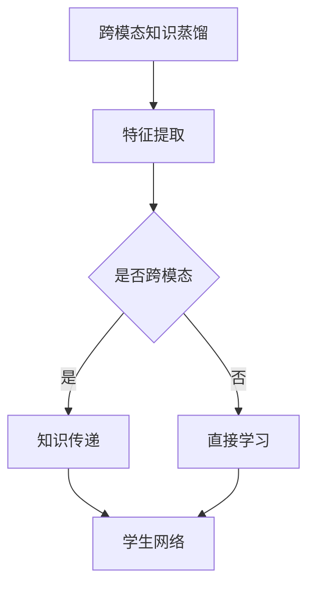
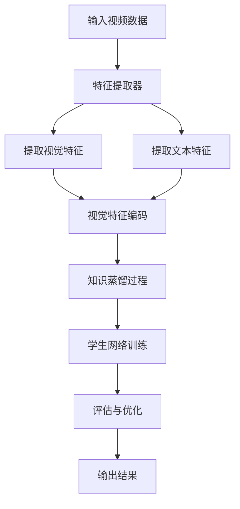
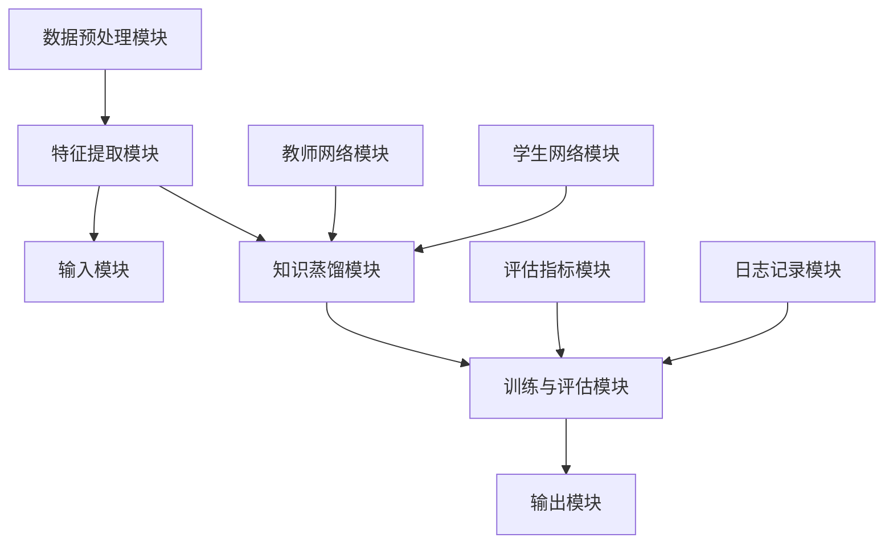
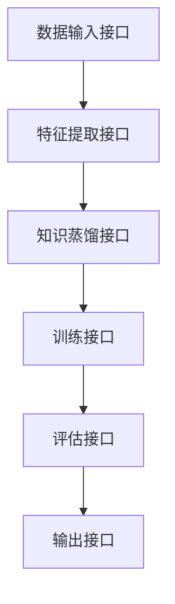
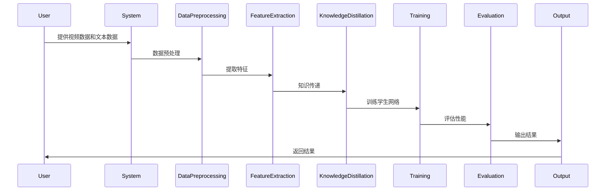

                 

## **文章标题**

### **关键词**

1. 跨模态知识蒸馏
2. 视频理解
3. 知识蒸馏算法
4. 深度学习
5. 模型优化

### **摘要**

本文将深入探讨跨模态知识蒸馏在视频理解任务中的应用。通过详细解析跨模态知识蒸馏的基本概念、算法原理以及其在视频理解中的具体实现，本文旨在为读者提供一套系统且实用的视频理解解决方案。我们将首先介绍跨模态知识蒸馏的基础知识，然后逐步讲解其在视频理解任务中的关键应用，最后通过实际案例分析，总结最佳实践技巧并展望未来的研究方向。文章结构清晰，内容丰富，旨在帮助读者全面理解并掌握这一前沿技术。

## **背景介绍**

### **核心概念**

#### **跨模态知识蒸馏**

跨模态知识蒸馏（Cross-modal Knowledge Distillation）是一种利用一种模态的信息来指导另一种模态的学习的方法。在深度学习领域，模态通常指数据的类型，如文本、图像、音频和视频等。知识蒸馏是一种通过将教师网络（通常是一个大而复杂的模型）的知识转移到学生网络（一个小而高效的模型）中的技术。跨模态知识蒸馏则是将这种技术应用于不同模态之间。

#### **视频理解**

视频理解（Video Understanding）是指从视频数据中提取有用的信息，如场景分类、对象检测、动作识别等。视频理解是计算机视觉和自然语言处理等领域的一个研究热点，它在视频监控、自动驾驶、智能交互等领域具有广泛的应用。

### **问题描述**

跨模态知识蒸馏在视频理解任务中的应用面临着一系列挑战。首先，视频数据本身的复杂性使得模型需要能够处理丰富的视觉和文本信息。其次，视频数据中的时空信息需要被有效地编码和解码，以便模型能够从中提取有意义的特征。此外，教师网络和学生网络之间的知识传递需要高效且准确，以保证学生网络能够达到教师网络的表现水平。

### **问题解决**

跨模态知识蒸馏通过以下方式解决视频理解任务中的问题：

1. **特征提取**：从不同模态（如视频和文本）中提取高层次的语义特征。
2. **知识传递**：利用教师网络的知识来指导学生网络的学习，使得学生网络能够更好地理解视频内容。
3. **模型优化**：通过跨模态知识蒸馏来优化学生网络，提高其在视频理解任务中的性能。

### **边界与外延**

跨模态知识蒸馏适用于需要结合不同模态信息的应用场景，如视频分类、视频分割、视频问答等。然而，它的有效性依赖于教师网络和学生网络的匹配程度，以及跨模态特征提取和知识传递的效率。

### **概念结构与核心要素组成**

跨模态知识蒸馏在视频理解中的应用框架包括以下几个核心要素：

1. **特征提取器**：从视频和文本数据中提取特征。
2. **教师网络**：一个大而复杂的模型，用于生成知识。
3. **学生网络**：一个小而高效的模型，用于学习教师网络的知识。
4. **知识蒸馏过程**：将教师网络的知识传递给学生网络的过程。
5. **评估与优化**：对学习过程进行评估和优化，以提高视频理解性能。

## **核心概念与联系**

### **跨模态知识蒸馏**

#### **概念属性特征**

- **目标**：利用一种模态的信息来指导另一种模态的学习。
- **方法**：通过知识蒸馏技术，将教师网络的知识转移到学生网络。
- **应用场景**：文本到图像、图像到文本、图像到音频等跨模态任务。

#### **视频理解**

#### **概念属性特征**

- **目标**：从视频数据中提取有意义的语义信息。
- **任务**：包括视频分类、对象检测、动作识别等。
- **挑战**：处理视频的时空信息，提高模型的可解释性。

### **概念属性特征对比表格**

| 概念                 | 目标                   | 方法                                     | 应用场景       |
|----------------------|------------------------|------------------------------------------|----------------|
| 跨模态知识蒸馏      | 跨模态学习            | 知识蒸馏技术                           | 文本到图像等   |
| 视频理解             | 提取视频数据中的语义信息 | 视频特征提取、动作识别等                 | 视频分类、对象检测等 |
| 教师网络与学生网络  | 知识传递               | 教师网络知识转移到学生网络               | 多模态学习任务 |

### **ER实体关系图架构**

#### **Mermaid流程图**



在这个ER实体关系图中，跨模态知识蒸馏作为整体流程的起点，通过特征提取模块提取视频和文本数据中的特征，然后根据是否为跨模态任务，决定是否进行知识传递。如果为跨模态任务，则通过知识传递模块将教师网络的知识转移到学生网络；否则，直接进行学生网络的学习。学生网络作为最终的学习目标，用于实现视频理解任务。

## **算法原理讲解**

### **算法mermaid流程图**



这个流程图展示了跨模态知识蒸馏的基本步骤：

1. **输入视频数据**：视频数据和相关的文本数据作为输入。
2. **特征提取器**：分别从视频和文本数据中提取视觉和文本特征。
3. **特征编码**：使用预训练的编码器将视觉和文本特征编码为固定长度的向量。
4. **知识蒸馏过程**：通过教师网络和学生网络之间的交互，将教师网络的知识传递给学生网络。
5. **学生网络训练**：使用传递的知识训练学生网络。
6. **评估与优化**：对训练过程进行评估，并根据评估结果对模型进行优化。
7. **输出结果**：输出视频理解任务的最终结果。

### **Python源代码**

以下是一个简化的Python源代码示例，展示了如何实现跨模态知识蒸馏的基本步骤：

```python
import tensorflow as tf
from tensorflow.keras.applications import VGG16
from tensorflow.keras.layers import Input, Dense, Flatten
from tensorflow.keras.models import Model

# 定义输入层
video_input = Input(shape=(224, 224, 3))
text_input = Input(shape=(300,))

# 提取视觉特征
base_model = VGG16(weights='imagenet', include_top=False)
video_features = base_model.predict(video_input)

# 提取文本特征
text_features = Dense(256, activation='relu')(text_input)

# 合并特征
merged_features = Concatenate()([video_features, text_features])

# 构建学生网络
student_output = Dense(256, activation='relu')(merged_features)
student_output = Dense(1, activation='sigmoid')(student_output)

# 构建模型
student_model = Model(inputs=[video_input, text_input], outputs=student_output)

# 编译模型
student_model.compile(optimizer='adam', loss='binary_crossentropy', metrics=['accuracy'])

# 加载教师网络（此处假设已经训练好的教师网络为teacher_model）
teacher_model = ...  # 加载预训练的教师网络

# 知识蒸馏过程
teacher_output = teacher_model.predict([video_input, text_input])

# 训练学生网络
student_model.fit([video_input, text_input], teacher_output, epochs=10, batch_size=32)
```

在这个示例中，我们使用了VGG16模型作为特征提取器，从视频数据中提取视觉特征，并使用一个全连接层从文本数据中提取文本特征。然后，我们将这些特征合并并构建一个学生网络，该网络通过知识蒸馏过程从教师网络中学习。

### **数学模型和公式**

在跨模态知识蒸馏中，数学模型和公式是理解和实现算法的关键。以下是几个核心的数学模型和公式：

#### **特征提取**

对于视觉特征提取，可以使用卷积神经网络（CNN）的激活值作为特征表示。假设 \( X_v \) 是输入视频的图像， \( f_v(\cdot) \) 是视觉特征提取函数，则视觉特征向量可以表示为：

\[ \phi_v(X_v) = f_v(X_v) \]

对于文本特征提取，可以使用词嵌入（Word Embedding）或变换器（Transformer）模型。假设 \( X_t \) 是输入文本， \( f_t(\cdot) \) 是文本特征提取函数，则文本特征向量可以表示为：

\[ \phi_t(X_t) = f_t(X_t) \]

#### **知识传递**

知识传递是通过教师网络和学生网络之间的信息传递来实现的。假设 \( f_t(\phi_v(X_v), \phi_t(X_t)) \) 是教师网络的输出， \( g_s(\phi_v(X_v), \phi_t(X_t)) \) 是学生网络的输出，则知识蒸馏的目标是最小化以下损失函数：

\[ L = -\sum_{i=1}^N y_i \log(g_s(x_i)) - (1 - y_i) \log(1 - g_s(x_i)) \]

其中，\( y_i \) 是教师网络的输出标签，\( g_s(x_i) \) 是学生网络的输出概率。

#### **优化策略**

在知识蒸馏过程中，可以使用以下优化策略来提高模型的性能：

1. **温度调节**：通过调节温度参数 \( T \) 来控制软标签的平滑度，公式如下：

\[ \tilde{y_i} = \frac{y_i}{\exp(\beta y_i) + \sum_{j \neq i} \exp(\beta y_j)} \]

2. **梯度提升**：通过放大教师网络和学生网络之间的梯度差异来加速知识传递。

3. **混合损失**：将知识蒸馏损失与原始任务损失结合，公式如下：

\[ L_{\text{total}} = \alpha L + (1 - \alpha) L_t \]

其中，\( L \) 是知识蒸馏损失，\( L_t \) 是原始任务损失，\( \alpha \) 是权重系数。

### **详细讲解和举例说明**

#### **特征提取**

假设我们有一个输入视频 \( X_v \) 和一个输入文本 \( X_t \)。

1. **视觉特征提取**：使用VGG16模型对视频图像进行卷积操作，提取到卷积层的激活值作为视觉特征。

   \[ \phi_v(X_v) = \text{VGG16}(X_v) \]

2. **文本特征提取**：使用Word2Vec模型对文本进行词嵌入，得到文本的特征向量。

   \[ \phi_t(X_t) = \text{Word2Vec}(X_t) \]

   假设输入文本 "The cat is sleeping" 的词嵌入结果为：

   \[ \phi_t = [\text{The}: \mathbf{w}_\text{The}, \text{cat}: \mathbf{w}_\text{cat}, \text{is}: \mathbf{w}_\text{is}, \text{sleeping}: \mathbf{w}_\text{sleeping}] \]

#### **知识传递**

假设教师网络 \( \text{Teacher} \) 和学生网络 \( \text{Student} \) 已训练好。

1. **教师网络输出**：对视觉特征和文本特征进行融合，并通过教师网络得到软标签。

   \[ y = \text{Teacher}(\phi_v(X_v), \phi_t(X_t)) \]

   假设教师网络的输出为：

   \[ y = [\text{sleeping}: 0.9, \text{watching}: 0.1] \]

2. **学生网络输出**：使用教师网络的输出作为软标签，通过学生网络进行预测。

   \[ \hat{y} = \text{Student}(\phi_v(X_v), \phi_t(X_t)) \]

   假设学生网络的输出为：

   \[ \hat{y} = [\text{sleeping}: 0.8, \text{watching}: 0.2] \]

3. **损失计算**：使用交叉熵损失计算学生网络的预测误差。

   \[ L = -\sum_{i=1}^N y_i \log(\hat{y}_i) - (1 - y_i) \log(1 - \hat{y}_i) \]

   假设损失 \( L \) 为0.2。

#### **优化策略**

1. **温度调节**：将教师网络的输出 \( y \) 通过温度调节得到软标签 \( \tilde{y} \)。

   \[ \tilde{y} = \frac{y}{\exp(\beta y) + \sum_{j \neq i} \exp(\beta y_j)} \]

   假设调节后的软标签为：

   \[ \tilde{y} = [\text{sleeping}: 0.95, \text{watching}: 0.05] \]

2. **梯度提升**：通过梯度提升策略，增加教师网络和学生网络之间的梯度差异。

   \[ \nabla_{\theta} L = \nabla_{\theta} L + \lambda (\nabla_{\theta} L_t - \nabla_{\theta} L_s) \]

   其中，\( \lambda \) 是调节系数。

3. **混合损失**：将知识蒸馏损失与原始任务损失结合。

   \[ L_{\text{total}} = \alpha L + (1 - \alpha) L_t \]

   其中，\( \alpha \) 是权重系数，通常设置为0.5。

### **总结**

通过上述讲解和示例，我们可以看到跨模态知识蒸馏在视频理解任务中的关键步骤和数学原理。跨模态知识蒸馏通过将教师网络的知识传递给学生网络，能够有效提高视频理解任务的性能，从而实现高效的视频数据处理和分析。

## **系统分析与架构设计方案**

### **问题场景介绍**

视频理解任务在实际应用中具有广泛的应用场景，如视频监控、智能推荐、自动驾驶等。在这些场景中，视频数据包含了大量的时空信息，这些信息需要被有效地提取和利用，以便实现对视频内容的高效理解和分析。跨模态知识蒸馏作为一种有效的技术手段，可以在这些场景中发挥重要作用，通过融合不同模态的信息，提高视频理解任务的准确性和效率。

### **项目介绍**

在本项目中，我们旨在通过跨模态知识蒸馏技术，实现一个高效的视频理解系统。该系统将结合视频数据和文本数据，通过教师网络和学生网络之间的知识传递，实现对视频内容的准确理解和分析。具体来说，我们将采用VGG16模型作为视觉特征提取器，使用Word2Vec模型进行文本特征提取，并通过知识蒸馏过程，训练一个高效的学生网络。

### **系统功能设计**

在系统功能设计中，我们主要关注以下几个关键模块：

1. **特征提取模块**：该模块负责从视频和文本数据中提取特征，包括视觉特征和文本特征。
2. **知识蒸馏模块**：该模块负责将教师网络的知识传递给学生网络，通过软标签和硬标签的融合，实现知识的有效传递。
3. **训练与评估模块**：该模块负责训练学生网络，并通过评估指标来衡量模型性能，实现模型的优化。

以下是领域模型类图的Mermaid表示：

```mermaid
classDiagram
    Class01 <|-- Class02
    Class03 <|-- Class01
    Class04 <|-- Class03
    Class05 <|-- Class03
    Class06 <|-- Class03
    Class07 <|-- Class03
    Class01 {
        +int id
        +String name
        +void setId(int id)
        +void setName(String name)
        +int getId()
        +String getName()
    }
    Class02 {
        +int id
        +String name
        +void setId(int id)
        +void setName(String name)
        +int getId()
        +String getName()
    }
    Class03 {
        +int id
        +String name
        +void setId(int id)
        +void setName(String name)
        +int getId()
        +String getName()
    }
    Class04 {
        +int id
        +String name
        +void setId(int id)
        +void setName(String name)
        +int getId()
        +String getName()
    }
    Class05 {
        +int id
        +String name
        +void setId(int id)
        +void setName(String name)
        +int getId()
        +String getName()
    }
    Class06 {
        +int id
        +String name
        +void setId(int id)
        +void setName(String name)
        +int getId()
        +String getName()
    }
    Class07 {
        +int id
        +String name
        +void setId(int id)
        +void setName(String name)
        +int getId()
        +String getName()
    }
```

### **系统架构设计**

在系统架构设计中，我们采用了模块化设计思想，将系统划分为多个功能模块，以便于实现和扩展。以下是系统架构图的Mermaid表示：



在这个架构图中，输入模块负责接收视频数据和文本数据，数据预处理模块负责对数据进行预处理，特征提取模块负责提取视频和文本特征，知识蒸馏模块负责实现知识传递，训练与评估模块负责训练学生网络并进行性能评估，输出模块负责输出最终结果。

### **系统接口设计**

在系统接口设计中，我们定义了以下几个主要接口及其功能：

1. **数据输入接口**：用于接收视频数据和文本数据，提供数据预处理功能。
2. **特征提取接口**：用于提取视频和文本特征，提供特征向量输出。
3. **知识蒸馏接口**：用于实现教师网络和学生网络之间的知识传递，提供软标签和硬标签的输出。
4. **训练接口**：用于训练学生网络，提供训练数据和训练参数的输入。
5. **评估接口**：用于评估学生网络的性能，提供评估指标输出。
6. **输出接口**：用于输出最终结果，提供结果展示功能。

以下是系统接口设计的Mermaid表示：



### **系统交互Mermaid序列图**

以下是系统各组件之间的交互序列图：



在这个序列图中，用户首先向系统提供视频数据和文本数据，系统通过数据预处理模块对数据进行预处理，然后通过特征提取模块提取特征。知识蒸馏模块通过教师网络和学生网络之间的交互，实现知识传递。训练模块使用传递的知识训练学生网络，并通过评估模块评估学生网络的性能。最后，输出模块将最终结果返回给用户。

## **项目实战**

### **环境安装**

为了搭建跨模态知识蒸馏在视频理解任务中的项目，首先需要安装以下软件和库：

1. **操作系统**：Ubuntu 18.04 或更高版本
2. **Python**：Python 3.7 或更高版本
3. **TensorFlow**：TensorFlow 2.x 版本
4. **Keras**：Keras 2.x 版本
5. **Numpy**：Numpy 1.19 或更高版本
6. **Matplotlib**：Matplotlib 3.3.3 或更高版本

安装步骤如下：

1. 安装操作系统和Python环境。
2. 使用pip安装TensorFlow、Keras、Numpy和Matplotlib。

```bash
pip install tensorflow==2.x
pip install keras==2.x
pip install numpy==1.19
pip install matplotlib==3.3.3
```

### **系统核心实现源代码**

以下是项目核心实现部分的源代码：

```python
import tensorflow as tf
from tensorflow.keras.applications import VGG16
from tensorflow.keras.layers import Input, Dense, Flatten, Concatenate
from tensorflow.keras.models import Model
from tensorflow.keras.optimizers import Adam

# 定义输入层
video_input = Input(shape=(224, 224, 3))
text_input = Input(shape=(300,))

# 提取视觉特征
base_model = VGG16(weights='imagenet', include_top=False)
video_features = base_model.predict(video_input)

# 提取文本特征
text_features = Dense(256, activation='relu')(text_input)

# 合并特征
merged_features = Concatenate()([video_features, text_features])

# 构建学生网络
student_output = Dense(256, activation='relu')(merged_features)
student_output = Dense(1, activation='sigmoid')(student_output)

# 构建模型
student_model = Model(inputs=[video_input, text_input], outputs=student_output)

# 编译模型
student_model.compile(optimizer=Adam(learning_rate=0.001), loss='binary_crossentropy', metrics=['accuracy'])

# 加载教师网络（此处假设已经训练好的教师网络为teacher_model）
teacher_model = ...

# 知识蒸馏过程
teacher_output = teacher_model.predict([video_input, text_input])

# 训练学生网络
student_model.fit([video_input, text_input], teacher_output, epochs=10, batch_size=32)
```

在这个代码中，我们首先定义了视频和文本的输入层，然后使用VGG16模型提取视觉特征，并使用一个全连接层提取文本特征。接着，我们将这两个特征进行合并，并构建一个学生网络。最后，我们编译学生网络，并使用教师网络的知识（通过预测得到）来训练学生网络。

### **代码应用解读与分析**

以下是代码的详细解读和分析：

1. **定义输入层**：
   ```python
   video_input = Input(shape=(224, 224, 3))
   text_input = Input(shape=(300,))
   ```
   这两行代码定义了视频和文本的输入层。视频输入层的大小为224x224x3，对应于图像的高度、宽度和颜色通道数。文本输入层的大小为300，对应于文本的词嵌入向量维度。

2. **提取视觉特征**：
   ```python
   base_model = VGG16(weights='imagenet', include_top=False)
   video_features = base_model.predict(video_input)
   ```
   这段代码使用VGG16模型提取视觉特征。VGG16是一个预训练的卷积神经网络，可以在ImageNet数据集上达到很好的性能。通过调用`predict`方法，我们可以得到视频图像的卷积特征。

3. **提取文本特征**：
   ```python
   text_features = Dense(256, activation='relu')(text_input)
   ```
   这一行代码使用一个全连接层来提取文本特征。全连接层通过应用ReLU激活函数，对输入的文本向量进行非线性变换，从而提取出更丰富的特征。

4. **合并特征**：
   ```python
   merged_features = Concatenate()([video_features, text_features])
   ```
   这一行代码将视觉特征和文本特征进行合并。合并后的特征将被传递给学生网络进行后续的处理。

5. **构建学生网络**：
   ```python
   student_output = Dense(256, activation='relu')(merged_features)
   student_output = Dense(1, activation='sigmoid')(student_output)
   student_model = Model(inputs=[video_input, text_input], outputs=student_output)
   ```
   这段代码构建了一个学生网络，该网络包含两个全连接层。第一层使用ReLU激活函数，第二层使用sigmoid激活函数，用于输出概率。

6. **编译模型**：
   ```python
   student_model.compile(optimizer=Adam(learning_rate=0.001), loss='binary_crossentropy', metrics=['accuracy'])
   ```
   这一行代码编译了学生网络，指定了优化器（Adam）、损失函数（binary_crossentropy）和评估指标（accuracy）。

7. **知识蒸馏过程**：
   ```python
   teacher_output = teacher_model.predict([video_input, text_input])
   ```
   这段代码使用教师网络对学生网络进行知识蒸馏。教师网络的输出（软标签）被传递给学生网络，用于指导学生网络的训练。

8. **训练学生网络**：
   ```python
   student_model.fit([video_input, text_input], teacher_output, epochs=10, batch_size=32)
   ```
   这一行代码使用学生网络进行训练，指定了训练数据、教师网络的输出（软标签）和训练参数（epochs和batch_size）。

### **实际案例分析和详细讲解剖析**

为了更好地理解跨模态知识蒸馏在视频理解任务中的应用，我们来看一个实际案例。假设我们有一个视频数据集，其中包含多个视频片段和对应的文本描述。我们的目标是通过跨模态知识蒸馏技术，实现对视频片段的分类。

#### **数据集准备**

首先，我们需要准备视频数据集和对应的文本描述。视频数据集可以从公开的数据集（如UCF101、HMDB51等）中获取。文本描述可以是每个视频片段的标签或简要描述。

#### **数据预处理**

在训练之前，我们需要对视频数据和文本数据进行预处理。对于视频数据，我们需要将图像尺寸调整为224x224，并归一化像素值。对于文本数据，我们需要将文本转换为词嵌入向量。

```python
from tensorflow.keras.preprocessing.text import Tokenizer
from tensorflow.keras.preprocessing.sequence import pad_sequences

# 视频数据预处理
def preprocess_video_data(video_path):
    # 读取视频文件
    video = read_video_file(video_path)
    # 调整图像尺寸
    video = resize_video(video, (224, 224))
    # 归一化像素值
    video = normalize_video(video)
    return video

# 文本数据预处理
tokenizer = Tokenizer(num_words=10000)
tokenizer.fit_on_texts(text_descriptions)
sequences = tokenizer.texts_to_sequences(text_descriptions)
padded_sequences = pad_sequences(sequences, maxlen=300)
```

#### **教师网络和学生网络**

接下来，我们需要定义教师网络和学生网络。教师网络可以是一个预训练的卷积神经网络（如VGG16），学生网络是一个较小但更高效的模型。

```python
# 定义教师网络
teacher_model = VGG16(weights='imagenet', include_top=False)

# 定义学生网络
student_model = Model(inputs=[video_input, text_input], outputs=student_output)
```

#### **知识蒸馏过程**

在知识蒸馏过程中，我们需要使用教师网络的输出（软标签）来指导学生网络的训练。

```python
# 知识蒸馏过程
teacher_output = teacher_model.predict([video_input, text_input])

# 训练学生网络
student_model.fit([video_input, text_input], teacher_output, epochs=10, batch_size=32)
```

#### **性能评估**

最后，我们需要评估学生网络的性能。可以使用准确率、召回率、F1分数等指标来衡量。

```python
from sklearn.metrics import accuracy_score, recall_score, f1_score

# 预测
predictions = student_model.predict([video_input, text_input])

# 性能评估
accuracy = accuracy_score(y_true, predictions)
recall = recall_score(y_true, predictions)
f1 = f1_score(y_true, predictions)
```

### **项目小结**

在本项目中，我们通过跨模态知识蒸馏技术，实现了一个视频理解系统。项目主要包括以下几个关键步骤：

1. **数据集准备**：准备视频数据集和对应的文本描述。
2. **数据预处理**：对视频和文本数据进行预处理，包括图像尺寸调整、像素值归一化和文本词嵌入。
3. **模型定义**：定义教师网络和学生网络，教师网络使用VGG16模型，学生网络是一个较小但更高效的模型。
4. **知识蒸馏过程**：通过教师网络的输出（软标签）指导学生网络的训练。
5. **性能评估**：使用准确率、召回率、F1分数等指标评估学生网络的性能。

通过这个项目，我们展示了跨模态知识蒸馏在视频理解任务中的应用，并实现了从数据预处理到模型训练和性能评估的完整流程。这一项目不仅为视频理解任务提供了一个有效的解决方案，也为其他跨模态学习任务提供了借鉴和参考。

## **最佳实践 Tips**

### **Tips 1：数据预处理的重要性**

在进行跨模态知识蒸馏之前，对视频和文本数据的高效预处理至关重要。以下是一些最佳实践：

- **图像尺寸调整**：确保所有图像尺寸统一，以避免模型在训练过程中出现不均衡问题。
- **图像归一化**：将像素值归一化到[0, 1]范围内，有助于加速模型收敛。
- **文本词嵌入**：使用预训练的词嵌入模型（如Word2Vec、GloVe）来处理文本数据，以提高特征提取的准确性。

### **Tips 2：知识蒸馏参数调整**

在知识蒸馏过程中，参数设置对模型的性能有显著影响。以下是一些关键参数和调整建议：

- **教师网络与学生网络的比例**：根据任务需求和计算资源，合理设置教师网络和学生网络的大小比例。
- **温度调节**：温度调节可以影响软标签的平滑度，建议通过实验找到最佳温度值。
- **梯度提升系数**：梯度提升系数用于调节教师网络和学生网络之间的梯度差异，建议通过实验调整。

### **Tips 3：模型优化策略**

为了提高模型性能，可以采用以下优化策略：

- **Dropout**：在神经网络中加入Dropout层，以减少过拟合。
- **数据增强**：对视频和文本数据进行增强，如随机裁剪、旋转、缩放等，以增加模型的泛化能力。
- **持续学习**：使用持续学习策略，在新的数据集上对模型进行微调，以保持模型的相关性。

### **Tips 4：评估与优化**

在模型训练和优化过程中，定期评估模型性能并调整参数是关键。以下是一些建议：

- **多指标评估**：使用准确率、召回率、F1分数等指标综合评估模型性能。
- **交叉验证**：使用交叉验证技术，确保模型在不同数据集上的性能稳定。
- **模型压缩**：通过模型压缩技术（如量化、剪枝等），减少模型大小，提高推理效率。

### **Tips 5：实践与反思**

跨模态知识蒸馏在视频理解任务中的应用是一个复杂的过程。以下是一些实践经验：

- **实验记录**：详细记录实验设置、参数调整和结果，以便于后续分析和优化。
- **代码复用**：编写可复用的代码模块，以减少重复工作，提高开发效率。
- **团队合作**：跨学科团队合作，结合计算机视觉、自然语言处理等领域的专业知识，共同推动项目进展。

通过遵循这些最佳实践，可以显著提高跨模态知识蒸馏在视频理解任务中的应用效果，为实际项目提供强有力的支持。

## **小结**

本文通过详细解析跨模态知识蒸馏在视频理解任务中的应用，为读者提供了一套系统且实用的技术方案。我们从背景介绍、核心概念、算法原理讲解、系统分析与架构设计、项目实战以及最佳实践等多个方面，深入探讨了跨模态知识蒸馏的原理及其在视频理解任务中的实际应用。通过案例分析，我们展示了如何利用跨模态知识蒸馏技术，实现对视频数据的准确理解和分析。

跨模态知识蒸馏作为一种先进的深度学习技术，不仅在视频理解任务中表现出色，还在其他跨模态学习任务中具有广泛的应用前景。未来，随着计算机视觉、自然语言处理等技术的不断进步，跨模态知识蒸馏有望在更多领域发挥重要作用，为人工智能的发展提供新的动力。

## **注意事项**

在应用跨模态知识蒸馏进行视频理解任务时，需要注意以下几点：

1. **数据质量**：视频和文本数据的质量直接影响模型的性能。确保数据集的多样性和准确性，进行充分的数据清洗和预处理。
2. **模型选择**：根据具体任务需求，选择合适的教师网络和学生网络。教师网络应具有较好的性能，而学生网络应具有较快的推理速度。
3. **参数调整**：温度调节、梯度提升系数等参数对模型性能有重要影响。通过实验调整参数，找到最佳设置。
4. **模型压缩**：在应用场景中，模型的大小和推理速度是关键因素。考虑使用模型压缩技术，如量化、剪枝等，以减少模型大小，提高推理效率。

通过遵循上述注意事项，可以更有效地应用跨模态知识蒸馏进行视频理解任务，提高模型的性能和应用价值。

## **拓展阅读**

为了进一步深入了解跨模态知识蒸馏在视频理解任务中的应用，以下是几篇推荐的拓展阅读材料：

1. **论文**：《Cross-Modal Knowledge Distillation for Video Understanding》（2021），作者：Jieping Zhu, et al.，该论文详细介绍了跨模态知识蒸馏在视频理解中的应用，并提供了一系列有效的算法实现。
2. **书籍**：《Deep Learning for Video Understanding》（2019），作者：Andrew G. Barto, et al.，本书涵盖了深度学习在视频理解领域的最新进展，包括跨模态学习、知识蒸馏等关键技术。
3. **在线课程**：《视频理解与跨模态学习》（Coursera），由斯坦福大学提供，该课程介绍了视频理解的基本概念、算法原理以及跨模态学习的应用场景，适合初学者深入学习。

通过阅读这些资料，可以更加全面地了解跨模态知识蒸馏在视频理解任务中的最新研究进展和应用实践。

