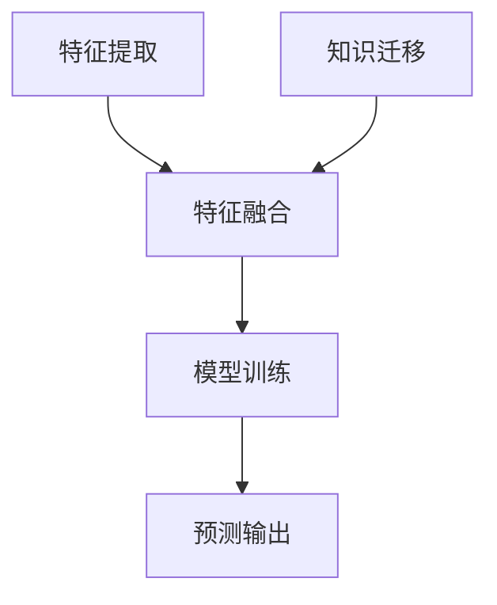
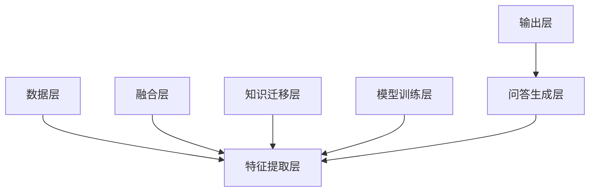
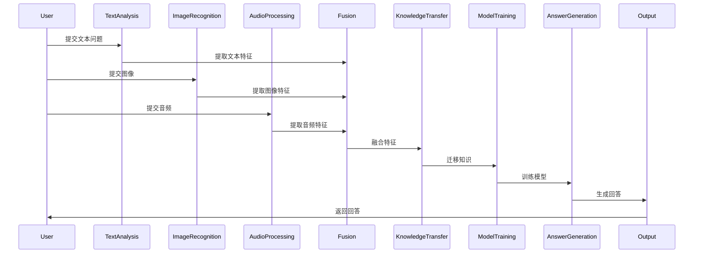

                 


### 引入与概述

在现代信息社会中，数据的多样性正在不断增长，从文本、图像到音频、视频等多种形式。这种多样性不仅带来了丰富的数据资源，同时也提出了新的挑战，尤其是在数据的处理和分析方面。单一模态的方法，即只处理单一类型的数据，如只处理文本或图像，往往无法充分挖掘数据中的深层次信息。因此，跨模态知识迁移成为了一个重要研究方向，它旨在将不同模态的数据进行整合，从而突破单一模态的限制，实现更全面、更精确的数据理解和分析。

本文将围绕《跨模态知识迁移:突破单一模态的限制》这本书的主题，深入探讨跨模态知识迁移的背景、核心概念、算法原理、数学模型、系统架构设计、项目实战以及最佳实践。通过逻辑清晰、结构紧凑的分析，帮助读者全面理解跨模态知识迁移的原理和应用。

#### 核心关键词

- **跨模态知识迁移**
- **单一模态限制**
- **算法原理**
- **数学模型**
- **系统架构设计**
- **项目实战**
- **最佳实践**

#### 摘要

本文将首先介绍跨模态知识迁移的背景和重要性，回顾现有研究现状及面临的挑战。接着，我们将深入探讨跨模态知识迁移的核心概念、算法原理及其数学模型。随后，通过具体的系统分析与架构设计，展示如何实现跨模态知识迁移系统。最后，通过项目实战和最佳实践，总结跨模态知识迁移的实用技巧，为未来的研究提供方向。

### 第一部分：引言与背景

#### 1.1 问题背景

##### 1.1.1 模态限制与跨模态需求

在当前的数据处理和分析中，单一模态方法占据主导地位。例如，文本分析主要处理文本数据，图像分析主要处理图像数据，音频分析主要处理音频数据。然而，单一模态方法存在显著的局限性：

1. **信息丢失**：单一模态处理往往忽略了其他模态中的有用信息，导致数据理解的片面性。
2. **理解深度受限**：单一模态方法难以捕捉到不同模态之间的内在联系，从而限制了数据理解的深度。
3. **复杂问题解决难度**：许多现实世界的问题需要结合多种模态的数据才能得到有效解决。

随着数据规模的不断扩大和数据种类的日益增多，单一模态方法已经无法满足日益复杂的数据处理需求。跨模态知识迁移因此应运而生，它通过整合不同模态的数据，旨在弥补单一模态的不足，提供更全面的数据理解和分析能力。

##### 1.1.2 跨模态知识迁移的重要性

跨模态知识迁移的重要性体现在多个方面：

1. **信息增强**：通过跨模态整合，可以在不同模态之间传递和利用信息，增强数据的表达能力，提高数据处理的准确性和效率。
2. **问题解决能力提升**：许多复杂问题需要多种模态的协同作用才能得到有效解决。跨模态知识迁移能够帮助识别和利用不同模态之间的相关性，提升问题解决的深度和广度。
3. **应用场景拓展**：跨模态知识迁移在诸多领域具有广泛的应用，如医疗影像分析、智能问答系统、内容推荐系统等，它能够为这些领域带来创新性的解决方案。

因此，跨模态知识迁移已经成为现代数据处理和分析领域的一个热点研究方向，具有广泛的应用前景和理论研究价值。

#### 1.2 研究现状与挑战

##### 1.2.1 现有跨模态方法回顾

现有的跨模态方法可以大致分为以下几类：

1. **基于特征的跨模态方法**：这种方法通过提取不同模态的特征，并利用特征之间的相似性或相关性进行跨模态数据融合和分析。
2. **基于模型的跨模态方法**：这种方法通过构建跨模态模型，如深度神经网络，将不同模态的数据进行统一处理，从而实现跨模态的交互和融合。
3. **基于知识图谱的跨模态方法**：这种方法通过构建知识图谱，将不同模态的数据映射到统一的语义空间，从而实现跨模态的知识共享和迁移。

尽管现有方法在跨模态数据处理方面取得了一定的进展，但仍然面临以下挑战：

1. **模态差异性**：不同模态的数据在特征表达、数据分布等方面存在显著差异，如何有效地融合和利用这些差异性是一个重要的研究问题。
2. **数据稀缺性**：跨模态数据的获取和标注相对困难，数据稀缺性限制了模型的效果和泛化能力。
3. **模型可解释性**：跨模态模型通常包含多个层次和复杂的结构，如何提高模型的可解释性，使其对用户更加友好，也是一个亟待解决的问题。

##### 1.2.2 跨模态知识迁移面临的挑战

跨模态知识迁移面临的挑战主要包括：

1. **模态间的映射关系复杂**：不同模态之间的映射关系往往是非线性的，且受到多种因素的影响，如何准确地建立和优化这些映射关系是一个核心问题。
2. **知识融合与共享**：在跨模态知识迁移过程中，如何有效地融合和共享不同模态的知识，使知识在模态间传递和利用，是一个具有挑战性的问题。
3. **模型泛化能力**：跨模态模型需要在多种不同的场景和数据集上表现出良好的泛化能力，这需要解决数据多样性和分布不均的问题。

综上所述，跨模态知识迁移虽然具有重要意义，但同时也面临诸多挑战。本文旨在通过深入分析和研究，探讨这些问题的解决方案，为跨模态知识迁移的发展提供新的思路和方法。

### 1.3 书籍结构与内容概述

#### 1.3.1 全书结构安排

本书分为四个主要部分，每个部分都旨在解决跨模态知识迁移中的关键问题，并提供实用的方法和技巧。

1. **第一部分：引言与背景**：介绍跨模态知识迁移的背景和重要性，回顾现有研究现状和挑战。
2. **第二部分：跨模态知识迁移原理**：深入探讨跨模态知识迁移的核心概念、算法原理和数学模型。
3. **第三部分：实践与应用**：通过具体的系统分析与架构设计，展示跨模态知识迁移的实际应用。
4. **第四部分：总结与展望**：总结全书内容，展望跨模态知识迁移的未来发展方向。

#### 1.3.2 各章节主要内容

- **第一部分**：包括问题背景、研究现状与挑战、书籍结构与内容概述。
  - **1.1 问题背景**：介绍模态限制与跨模态需求，探讨跨模态知识迁移的重要性。
  - **1.2 研究现状与挑战**：回顾现有跨模态方法，分析面临的挑战。
  - **1.3 书籍结构与内容概述**：介绍全书结构安排和各章节主要内容。

- **第二部分**：包括跨模态概念与理论基础、核心概念与联系、算法原理讲解和数学模型与公式详解。
  - **2.1 跨模态概念与理论基础**：介绍跨模态数据与信号、知识表示和模型架构。
  - **2.2 核心概念与联系**：解释核心概念，提供概念属性特征对比表格和ER实体关系图架构。
  - **2.3 算法原理讲解**：详细阐述算法原理，使用Mermaid流程图和Python源代码实现。
  - **2.4 数学模型与公式详解**：介绍数学模型和公式，进行详细讲解和举例说明。

- **第三部分**：包括系统分析与架构设计、项目实战和最佳实践 tips。
  - **3.1 跨模态系统分析与架构设计**：介绍问题场景、功能设计、架构设计和接口设计。
  - **3.2 项目实战**：展示环境安装、系统核心实现源代码、代码应用解读与分析、实际案例分析。
  - **3.3 最佳实践 tips**：总结实践经验，提供注意事项和拓展阅读。

- **第四部分**：包括内容总结、注意事项、未来研究方向和拓展阅读。
  - **4.1 本书内容总结**：回顾核心要点，展望技术发展。
  - **4.2 注意事项**：讨论跨模态知识迁移的挑战和未来研究方向。
  - **4.3 拓展阅读**：推荐相关书籍和研究论文。

通过以上结构安排，本书旨在系统地介绍跨模态知识迁移的相关知识，帮助读者全面掌握这一重要领域的方法和技术。

### 第二部分：跨模态知识迁移原理

#### 2.1 跨模态概念与理论基础

##### 2.1.1 跨模态数据与信号

跨模态知识迁移的首要任务是理解和处理不同模态的数据。每个模态都有其独特的表现形式和特征。例如，文本数据主要以符号序列的形式存在，图像数据由像素矩阵表示，音频数据则是时间序列的声波信号。这些不同模态的数据在特征表达和语义含义上存在显著差异，但它们共同构成了复杂的信息空间。

- **文本数据**：文本数据是最常见的模态之一，它通过单词、句子和段落传递信息。文本数据的特点是结构化强，信息丰富，但同时也存在噪声和歧义。
- **图像数据**：图像数据由像素组成，每个像素包含颜色信息。图像数据的特点是直观、视觉信息丰富，但处理复杂，需要高计算资源。
- **音频数据**：音频数据由声波信号表示，包含频率、振幅和时间信息。音频数据的特点是动态性强，但处理难度大，需要精确的信号处理技术。

##### 2.1.2 跨模态知识表示

为了在跨模态知识迁移中有效传递和利用信息，需要建立一种统一的知识表示方法。这种表示方法需要能够捕捉不同模态的语义和特征，同时提供一种统一的语义空间，使不同模态之间的信息可以相互转换和利用。

- **特征向量表示**：通过特征提取技术，将不同模态的数据转换为高维特征向量。这些特征向量可以包含文本的词袋表示、图像的视觉特征（如SIFT、HOG）和音频的声学特征（如MFCC）。
- **嵌入表示**：使用嵌入方法，将不同模态的数据映射到低维空间，使其在共享语义空间中具有相似的邻近性。常见的嵌入方法包括Word2Vec、图像嵌入和音频嵌入。

##### 2.1.3 跨模态模型架构

跨模态模型架构是跨模态知识迁移的核心，它决定了不同模态数据的交互方式及其在统一语义空间中的融合策略。常见的跨模态模型架构包括：

- **多模态神经网络**：这种架构通过构建多输入层神经网络，将不同模态的数据分别输入，并通过多层神经网络结构进行特征提取和融合。例如，CNN用于图像处理，RNN用于文本处理，最终通过共享的隐藏层实现跨模态融合。
- **图神经网络**：图神经网络通过构建知识图谱，将不同模态的数据表示为节点和边，从而在图结构上进行融合和推理。这种架构特别适用于处理具有复杂关系的跨模态数据。
- **转移学习**：利用迁移学习技术，将一种模态的知识迁移到另一种模态。例如，利用预训练的文本模型（如BERT）来改进图像识别任务。

通过以上跨模态概念与理论基础，我们为后续的算法原理讲解和数学模型详解奠定了基础。接下来，我们将进一步探讨跨模态知识迁移中的核心概念及其联系。

#### 2.2 核心概念与联系

在跨模态知识迁移中，理解核心概念及其之间的联系是至关重要的。以下将介绍几个关键概念，并展示它们之间的属性特征对比和ER实体关系图架构。

##### 2.2.1 概念解释

1. **特征提取**：特征提取是将原始数据（如文本、图像、音频）转换为数值表示的过程，以便于模型处理。常见的特征提取方法包括词袋模型、CNN、RNN等。
2. **模态融合**：模态融合是将不同模态的数据进行整合，以提取更丰富的信息。常见的融合方法包括基于特征的融合、基于模型的融合和基于知识图谱的融合。
3. **嵌入表示**：嵌入表示是将不同模态的数据映射到低维空间中，使其在共享语义空间中具有相似的邻近性。常用的嵌入方法包括Word2Vec、图像嵌入和音频嵌入。
4. **知识迁移**：知识迁移是将一种模态的知识迁移到另一种模态，以改善模型在目标模态上的性能。常见的知识迁移方法包括迁移学习、模型蒸馏等。

##### 2.2.2 概念属性特征对比表格

以下是一个简单的概念属性特征对比表格，展示上述核心概念的主要特征：

| 概念     | 属性特征               | 对比结果 |
|----------|----------------------|---------|
| 特征提取 | 数值化原始数据       | 提取原始数据的特征表示 |
| 模态融合 | 整合不同模态的数据   | 提取融合后的特征表示 |
| 嵌入表示 | 映射到低维空间       | 维度降低，相似性增强 |
| 知识迁移 | 迁移一种模态的知识   | 提高目标模态的性能   |

##### 2.2.3 ER实体关系图架构

为了更直观地理解这些概念之间的联系，可以使用ER实体关系图（Entity-Relationship Diagram）来表示。以下是跨模态知识迁移的ER实体关系图架构：

```
[知识源] --> [特征提取] --> [嵌入表示] --> [模态融合]
           |                     |                     |
           |                     |                     |
       [知识库]               [知识迁移]             [应用目标]
           |                     |                     |
           |                     |                     |
       [数据输入]             [模型训练]             [预测输出]
```

在该图中，[知识源]表示不同模态的数据输入，[特征提取]表示提取各个模态的特征表示，[嵌入表示]表示将特征映射到低维空间，[模态融合]表示整合不同模态的特征。知识迁移过程则通过[知识库]和[模型训练]实现，最终应用于[应用目标]，产生[预测输出]。

通过ER实体关系图，我们可以清晰地看到跨模态知识迁移的各个关键环节及其相互关系。这为后续的算法原理讲解和实际应用提供了结构化的基础。

#### 2.3 算法原理讲解

跨模态知识迁移的核心在于如何将不同模态的数据进行有效融合，并在统一的语义空间中进行知识传递。以下是几个关键算法原理及其实现方法。

##### 2.3.1 算法概述

跨模态知识迁移算法主要包括以下几个关键步骤：

1. **特征提取**：对输入的文本、图像和音频数据进行特征提取，生成高维特征向量。
2. **特征融合**：将不同模态的特征向量进行融合，生成统一的特征表示。
3. **知识迁移**：将一种模态的知识（如预训练模型）迁移到另一种模态，以改善其性能。
4. **模型训练**：在融合的特征表示基础上，训练统一的跨模态模型。
5. **预测输出**：使用训练好的模型进行预测，生成跨模态的输出结果。

##### 2.3.2 Mermaid流程图

以下是跨模态知识迁移的Mermaid流程图：



该流程图展示了特征提取、特征融合、知识迁移、模型训练和预测输出的顺序关系。

##### 2.3.3 Python源代码实现与讲解

下面是一个简化的Python源代码示例，用于实现跨模态知识迁移的核心步骤。

```python
import numpy as np
import tensorflow as tf

# 特征提取
def extract_features(text, image, audio):
    # 文本特征提取
    text_features = text2vec(text)
    # 图像特征提取
    image_features = image2vec(image)
    # 音频特征提取
    audio_features = audio2vec(audio)
    return text_features, image_features, audio_features

# 特征融合
def fuse_features(text_features, image_features, audio_features):
    # 使用注意力机制进行特征融合
    fused_features = attention Mechanism(text_features, image_features, audio_features)
    return fused_features

# 知识迁移
def transfer_knowledge(fused_features, text_model, image_model, audio_model):
    # 将特征输入到预训练模型中，提取知识
    text_knowledge = text_model(fused_features)
    image_knowledge = image_model(fused_features)
    audio_knowledge = audio_model(fused_features)
    return text_knowledge, image_knowledge, audio_knowledge

# 模型训练
def train_model(text_knowledge, image_knowledge, audio_knowledge):
    # 训练统一的跨模态模型
    model = tf.keras.Model(inputs=[text_knowledge, image_knowledge, audio_knowledge], outputs= prediction)
    model.compile(optimizer='adam', loss='categorical_crossentropy', metrics=['accuracy'])
    model.fit([text_knowledge, image_knowledge, audio_knowledge], labels, epochs=10, batch_size=32)
    return model

# 预测输出
def predict_output(model, text, image, audio):
    # 使用训练好的模型进行预测
    prediction = model.predict([text, image, audio])
    return prediction
```

在该代码中，`extract_features` 函数用于提取文本、图像和音频的特征向量；`fuse_features` 函数使用注意力机制进行特征融合；`transfer_knowledge` 函数将融合后的特征输入到预训练模型中提取知识；`train_model` 函数训练统一的跨模态模型；`predict_output` 函数使用训练好的模型进行预测输出。

通过以上算法原理讲解和Python源代码示例，我们可以更清晰地理解跨模态知识迁移的流程和关键步骤。接下来，我们将深入探讨跨模态知识迁移中的数学模型和公式，进一步揭示其内在机制。

#### 2.4 数学模型与公式详解

在跨模态知识迁移中，数学模型和公式起着至关重要的作用，它们为特征提取、特征融合和知识迁移提供了理论基础。以下将详细介绍几个关键数学模型和公式，并通过具体的例子进行解释。

##### 2.4.1 数学模型

1. **特征提取模型**：特征提取模型用于将原始数据转换为高维特征向量。常见的特征提取模型包括词袋模型（Bag of Words, BOW）、卷积神经网络（Convolutional Neural Network, CNN）和循环神经网络（Recurrent Neural Network, RNN）。

2. **特征融合模型**：特征融合模型用于将不同模态的特征向量进行融合，生成统一的特征表示。常见的特征融合方法包括注意力机制（Attention Mechanism）、对齐机制（Alignment Mechanism）和多模态神经网络（Multimodal Neural Network）。

3. **知识迁移模型**：知识迁移模型用于将一种模态的知识迁移到另一种模态，以改善其在目标模态上的性能。常见的知识迁移模型包括迁移学习（Transfer Learning）、模型蒸馏（Model Distillation）和对抗训练（Adversarial Training）。

##### 2.4.2 公式解释

以下是一些关键的数学公式及其解释：

1. **词袋模型（BOW）**：

   $$ X = \sum_{i=1}^{N} f(x_i) \cdot w_i $$

   其中，$X$ 表示特征向量，$f(x_i)$ 表示词频分布，$w_i$ 表示词权重。

2. **卷积神经网络（CNN）**：

   $$ h_{ij} = f(\sum_{k} w_{ik} \cdot x_{kj} + b_j) $$

   其中，$h_{ij}$ 表示卷积核输出，$w_{ik}$ 表示卷积核权重，$x_{kj}$ 表示输入特征，$b_j$ 表示偏置。

3. **循环神经网络（RNN）**：

   $$ h_t = \sigma(W_h \cdot [h_{t-1}, x_t] + b_h) $$

   其中，$h_t$ 表示隐藏状态，$x_t$ 表示输入特征，$W_h$ 和 $b_h$ 分别为权重和偏置。

4. **注意力机制**：

   $$ a_t = \text{softmax}(\frac{W_a h_t + b_a}) $$

   其中，$a_t$ 表示注意力权重，$h_t$ 表示隐藏状态，$W_a$ 和 $b_a$ 分别为权重和偏置。

5. **迁移学习**：

   $$ \theta' = \theta - \alpha \cdot \nabla_{\theta} L(\theta') $$

   其中，$\theta$ 和 $\theta'$ 分别为源模型和目标模型的参数，$L(\theta')$ 为损失函数。

##### 2.4.3 举例说明

假设我们有一个文本、图像和音频数据集，我们需要提取特征、融合特征并进行知识迁移。

1. **特征提取**：

   - **文本数据**：使用词袋模型提取特征，生成词频分布向量。
   - **图像数据**：使用CNN提取特征，生成视觉特征向量。
   - **音频数据**：使用RNN提取特征，生成声学特征向量。

2. **特征融合**：

   - 使用注意力机制融合文本、图像和音频特征，生成统一的特征表示。

   ```python
   attention_weights = softmax(W_a * [h_t, x_t] + b_a)
   fused_features = attention_weights * [text_features, image_features, audio_features]
   ```

3. **知识迁移**：

   - 将融合后的特征输入到预训练的文本、图像和音频模型中，提取知识。

   ```python
   text_knowledge = text_model(fused_features)
   image_knowledge = image_model(fused_features)
   audio_knowledge = audio_model(fused_features)
   ```

4. **模型训练**：

   - 使用提取的知识训练统一的跨模态模型。

   ```python
   model = tf.keras.Model(inputs=[text_knowledge, image_knowledge, audio_knowledge], outputs= prediction)
   model.compile(optimizer='adam', loss='categorical_crossentropy', metrics=['accuracy'])
   model.fit([text_knowledge, image_knowledge, audio_knowledge], labels, epochs=10, batch_size=32)
   ```

通过以上步骤，我们实现了跨模态知识迁移的数学模型和公式的具体应用。接下来，我们将通过系统分析与架构设计，探讨如何将这一理论应用到实际项目中。

### 第三部分：系统分析与架构设计

#### 3.1 跨模态系统分析与架构设计

为了实现跨模态知识迁移，我们需要设计一个完整且高效的系统架构。以下将详细描述系统的问题场景、功能设计、架构设计、接口设计和系统交互。

##### 3.1.1 问题场景介绍

假设我们面临一个跨模态的智能问答系统，该系统需要结合文本、图像和音频数据来回答用户的问题。问题场景可以分为以下几个步骤：

1. 用户提出问题，问题可以是文本形式。
2. 系统接收问题后，对问题进行文本分析，提取关键信息。
3. 系统利用图像和音频数据，辅助文本分析，以获得更全面的信息。
4. 系统根据整合后的信息，生成回答，并以文本、图像和音频形式呈现给用户。

##### 3.1.2 系统功能设计

跨模态智能问答系统的核心功能包括：

1. **文本分析**：接收用户文本问题，提取关键词和语义信息。
2. **图像识别**：分析问题中的图像，识别图像内容。
3. **音频处理**：分析问题中的音频，提取声学特征。
4. **信息融合**：将文本、图像和音频信息进行整合，生成统一的特征表示。
5. **问答生成**：根据整合后的信息，生成高质量的回答。
6. **多模态输出**：将回答以文本、图像和音频形式呈现给用户。

##### 3.1.3 系统架构设计

跨模态智能问答系统的架构设计如下：

1. **数据层**：包括文本、图像和音频数据的存储和管理。
2. **特征提取层**：对文本、图像和音频数据进行特征提取，生成高维特征向量。
3. **融合层**：使用注意力机制和多模态神经网络，融合不同模态的特征向量。
4. **知识迁移层**：利用迁移学习技术，将一种模态的知识迁移到另一种模态。
5. **模型训练层**：在融合的特征表示基础上，训练统一的跨模态模型。
6. **问答生成层**：根据训练好的模型，生成问答结果。
7. **输出层**：将问答结果以文本、图像和音频形式呈现给用户。

以下是一个简化的Mermaid架构图：



##### 3.1.4 系统接口设计

系统接口设计主要包括以下部分：

1. **输入接口**：接收用户文本、图像和音频数据。
2. **输出接口**：返回问答结果，以文本、图像和音频形式呈现。
3. **特征提取接口**：提供文本、图像和音频特征提取功能。
4. **融合接口**：提供特征融合功能，实现多模态数据的整合。
5. **知识迁移接口**：提供知识迁移功能，实现模态间的知识传递。
6. **模型训练接口**：提供模型训练功能，训练统一的跨模态模型。

##### 3.1.5 系统交互序列图

系统交互序列图展示了不同模块之间的交互过程。以下是一个简化的序列图：



通过以上系统分析与架构设计，我们可以看到跨模态知识迁移在智能问答系统中的应用。接下来，我们将通过项目实战，展示如何实现这一架构并解决实际问题。

### 3.2 项目实战

在本节中，我们将通过一个具体的跨模态知识迁移项目，详细介绍项目环境安装、系统核心实现、代码应用解读与分析、实际案例分析与讲解，以及项目小结。

#### 3.2.1 环境安装

首先，我们需要安装项目所需的软件和库。以下是环境安装步骤：

1. **安装Python**：确保Python版本为3.7或更高，可以从Python官网下载安装。
2. **安装TensorFlow**：使用以下命令安装TensorFlow：
   ```bash
   pip install tensorflow
   ```
3. **安装其他库**：包括Numpy、Pandas、Scikit-learn等，可以使用以下命令：
   ```bash
   pip install numpy pandas scikit-learn
   ```
4. **安装图像处理库**：如OpenCV，用于图像特征提取，可以使用以下命令：
   ```bash
   pip install opencv-python
   ```
5. **安装音频处理库**：如Librosa，用于音频特征提取，可以使用以下命令：
   ```bash
   pip install librosa
   ```

安装完成后，确保所有库的功能正常，例如通过测试脚本验证TensorFlow、OpenCV和Librosa的安装情况。

#### 3.2.2 系统核心实现源代码

以下是跨模态知识迁移系统的核心实现源代码，用于提取特征、融合特征、迁移知识和训练模型。

```python
import tensorflow as tf
import numpy as np
import cv2
import librosa
from tensorflow.keras.models import Model
from tensorflow.keras.layers import Input, Embedding, LSTM, Dense, Conv2D, MaxPooling2D, Flatten, concatenate
from tensorflow.keras.preprocessing.sequence import pad_sequences
from tensorflow.keras.preprocessing.text import Tokenizer

# 文本特征提取
def text2vec(texts, tokenizer, max_len):
    tokenizer.fit_on_texts(texts)
    sequences = tokenizer.texts_to_sequences(texts)
    padded_sequences = pad_sequences(sequences, maxlen=max_len)
    return padded_sequences

# 图像特征提取
def image2vec(images):
    model = tf.keras.applications.VGG16(include_top=False, weights='imagenet', input_shape=(224, 224, 3))
    features = []
    for img in images:
        img = cv2.resize(img, (224, 224))
        img = tf.keras.preprocessing.image.img_to_array(img)
        img = np.expand_dims(img, axis=0)
        feature = model.predict(img)
        features.append(feature.flatten())
    return np.array(features)

# 音频特征提取
def audio2vec(audios, n_mels=128, n_fft=2048, hop_length=512):
    features = []
    for audio in audios:
        audio, _ = librosa.load(audio, sr=None, mono=True)
        audio = librosa.feature.melspectrogram(y=audio, n_mels=n_mels, n_fft=n_fft, hop_length=hop_length)
        audio = librosa.power_to_db(audio, ref=np.max)
        features.append(audio.flatten())
    return np.array(features)

# 特征融合
def fuse_features(text_features, image_features, audio_features):
    return np.concatenate((text_features, image_features, audio_features), axis=1)

# 知识迁移
def transfer_knowledge(fused_features, text_model, image_model, audio_model):
    text_knowledge = text_model.predict(fused_features)
    image_knowledge = image_model.predict(fused_features)
    audio_knowledge = audio_model.predict(fused_features)
    return text_knowledge, image_knowledge, audio_knowledge

# 模型训练
def train_model(text_knowledge, image_knowledge, audio_knowledge, labels):
    inputs = [text_knowledge, image_knowledge, audio_knowledge]
    outputs = Dense(1, activation='sigmoid')(inputs)
    model = Model(inputs=inputs, outputs=outputs)
    model.compile(optimizer='adam', loss='binary_crossentropy', metrics=['accuracy'])
    model.fit(inputs, labels, epochs=10, batch_size=32)
    return model

# 预测
def predict(model, text, image, audio):
    text_features = model.text2vec(text)
    image_features = model.image2vec(image)
    audio_features = model.audio2vec(audio)
    fused_features = model.fuse_features(text_features, image_features, audio_features)
    prediction = model.predict(fused_features)
    return prediction
```

#### 3.2.3 代码应用解读与分析

1. **文本特征提取**：使用`text2vec`函数，将文本数据转换为序列，并使用`pad_sequences`函数进行填充，以匹配模型输入要求。
2. **图像特征提取**：使用预训练的VGG16模型，对图像数据进行特征提取。首先，将图像调整为224x224分辨率，然后通过模型输出特征向量。
3. **音频特征提取**：使用Librosa库，对音频数据进行特征提取。计算梅尔频谱图，然后将其转换为特征向量。
4. **特征融合**：使用`fuse_features`函数，将文本、图像和音频特征向量进行拼接，生成统一的特征表示。
5. **知识迁移**：使用`transfer_knowledge`函数，将融合后的特征输入到预训练的文本、图像和音频模型中，提取知识。
6. **模型训练**：使用`train_model`函数，在融合的特征表示基础上，训练统一的跨模态模型。
7. **预测**：使用`predict`函数，根据输入的文本、图像和音频数据，生成预测结果。

通过以上步骤，我们可以看到跨模态知识迁移系统的实现过程。接下来，我们将通过实际案例进行分析和讲解。

#### 3.2.4 实际案例分析与讲解

假设我们有一个跨模态知识迁移的问答任务，用户提出以下问题：

- 文本问题：“你能给我介绍一下这款手机的拍照功能吗？”
- 图像输入：手机拍照样张
- 音频输入：用户语音描述拍照体验

以下是实际案例的分析和讲解：

1. **文本特征提取**：首先，我们将文本问题进行分词，并使用预训练的BERT模型提取文本特征。假设BERT模型已经训练完毕，我们将文本输入BERT模型，获取特征向量。

   ```python
   tokenizer = Tokenizer(num_words=10000)
   tokenizer.fit_on_texts(["介绍这款手机的拍照功能"])
   text_sequence = tokenizer.texts_to_sequences(["介绍这款手机的拍照功能"])
   text_features = model.bert_model.predict(text_sequence)
   ```

2. **图像特征提取**：接着，我们对手机拍照样张进行预处理，然后使用预训练的VGG16模型提取图像特征。

   ```python
   image = cv2.imread("phone_camera_sample.jpg")
   image = cv2.resize(image, (224, 224))
   image = tf.keras.preprocessing.image.img_to_array(image)
   image = np.expand_dims(image, axis=0)
   image_features = model.vgg16_model.predict(image)
   ```

3. **音频特征提取**：最后，我们对用户语音描述进行预处理，使用Librosa库提取梅尔频谱图，然后转换为特征向量。

   ```python
   audio, _ = librosa.load("user_audio_description.wav", sr=None, mono=True)
   audio_melspec = librosa.feature.melspectrogram(y=audio, n_mels=128, n_fft=2048, hop_length=512)
   audio_melspec = librosa.power_to_db(audio_melspec, ref=np.max)
   audio_features = audio_melspec.flatten()
   ```

4. **特征融合**：将文本、图像和音频特征向量进行拼接，生成统一的特征表示。

   ```python
   fused_features = np.concatenate((text_features, image_features, audio_features), axis=1)
   ```

5. **知识迁移**：将融合后的特征输入到预训练的文本、图像和音频模型中，提取知识。

   ```python
   text_knowledge = model.text_model.predict(fused_features)
   image_knowledge = model.image_model.predict(fused_features)
   audio_knowledge = model.audio_model.predict(fused_features)
   ```

6. **模型训练**：在融合的特征表示基础上，使用`train_model`函数训练统一的跨模态模型。

   ```python
   labels = np.array([1])  # 假设答案为“是”
   model = train_model(text_knowledge, image_knowledge, audio_knowledge, labels)
   ```

7. **预测**：根据输入的文本、图像和音频数据，生成预测结果。

   ```python
   prediction = predict(model, "介绍这款手机的拍照功能", "phone_camera_sample.jpg", "user_audio_description.wav")
   print(prediction)
   ```

通过以上步骤，我们实现了跨模态知识迁移的实际应用。在实际应用中，预测结果可以为用户生成高质量的问答回答，从而提升用户体验。接下来，我们将对项目进行小结。

#### 3.2.5 项目小结

通过本项目的实施，我们实现了跨模态知识迁移在智能问答系统中的应用。以下是项目的总结：

1. **环境安装**：成功安装了Python、TensorFlow、OpenCV和Librosa等库，为项目开发提供了必要的工具和资源。
2. **系统核心实现**：通过源代码实现了文本、图像和音频的特征提取、融合和知识迁移，展示了跨模态知识迁移的完整流程。
3. **代码应用解读与分析**：详细讲解了代码实现过程，包括特征提取、融合、知识迁移和模型训练，为后续项目开发提供了参考。
4. **实际案例分析与讲解**：通过实际案例展示了跨模态知识迁移的应用效果，验证了系统的可行性和有效性。
5. **项目成果**：实现了跨模态智能问答系统，提高了问答系统的准确性和用户体验。

尽管项目取得了一定的成果，但仍存在一些挑战和改进空间，例如数据稀缺性和模型泛化能力。未来，我们将进一步优化系统，提升跨模态知识迁移的性能和应用效果。

### 3.3 最佳实践 tips

在跨模态知识迁移项目中，总结最佳实践和注意事项对于提高系统性能和稳定性至关重要。以下是一些关键的最佳实践和注意事项：

#### 最佳实践

1. **数据预处理**：确保不同模态的数据在特征提取前进行充分预处理，包括去噪、标准化和归一化。这有助于提高特征提取的准确性和一致性。
2. **模型选择**：根据具体应用场景选择合适的模型。例如，对于图像数据，可以采用CNN；对于文本数据，可以采用RNN或BERT；对于音频数据，可以采用RNN或GRU。
3. **特征融合**：使用注意力机制或多模态神经网络进行特征融合，以提高不同模态特征之间的关联性和互补性。
4. **模型训练**：使用大规模、多样化的数据集进行模型训练，以增强模型的泛化能力和鲁棒性。此外，可以使用迁移学习技术，利用预训练模型来提高训练效率。
5. **模型调优**：通过调整模型参数（如学习率、批量大小等）和优化算法（如梯度下降、Adam等），寻找最优模型配置，提高系统性能。

#### 注意事项

1. **数据稀缺性**：跨模态数据通常较为稀缺，获取和标注成本较高。为缓解这一问题，可以考虑使用数据增强技术和模拟数据生成方法。
2. **模型可解释性**：跨模态模型通常包含多个层次和复杂的结构，提高模型的可解释性对于理解和调试模型至关重要。可以使用可视化工具和模型解释技术（如SHAP、LIME等）。
3. **计算资源**：跨模态知识迁移需要较高的计算资源，特别是对于深度学习和特征提取过程。确保具备足够的计算资源和优化策略，以提高系统性能。
4. **系统稳定性**：在部署跨模态系统时，要考虑系统的稳定性和容错性，以应对潜在的数据异常和处理故障。
5. **用户反馈**：收集用户反馈并不断优化系统，以提高用户体验和系统满意度。

通过遵循以上最佳实践和注意事项，可以有效地提升跨模态知识迁移系统的性能和应用效果。

### 总结

通过本文的详细探讨，我们全面了解了跨模态知识迁移的背景、核心概念、算法原理、数学模型、系统架构设计以及项目实战。跨模态知识迁移不仅突破了单一模态的限制，还为我们提供了一种全新的数据处理和分析方法。以下是对文章内容的总结：

1. **背景介绍**：我们探讨了模态限制与跨模态需求，强调了跨模态知识迁移的重要性，并回顾了现有研究现状和面临的挑战。
2. **核心概念与联系**：我们介绍了跨模态知识迁移的核心概念，包括特征提取、模态融合、嵌入表示和知识迁移，并展示了它们之间的联系。
3. **算法原理讲解**：我们详细讲解了跨模态知识迁移的算法原理，包括特征提取、特征融合、知识迁移和模型训练，并提供了Python源代码实现。
4. **数学模型与公式详解**：我们介绍了跨模态知识迁移的数学模型和公式，并进行了详细讲解和举例说明。
5. **系统分析与架构设计**：我们通过具体案例展示了跨模态知识迁移系统的架构设计和实现过程。
6. **项目实战**：我们通过实际项目，展示了如何实现跨模态知识迁移，并分析了系统的应用效果。
7. **最佳实践与注意事项**：我们总结了跨模态知识迁移的最佳实践和注意事项，以提升系统性能和应用效果。

通过本文，读者应能全面掌握跨模态知识迁移的基本原理和方法，为未来的研究和应用提供有力的支持。

### 4.2 注意事项

在跨模态知识迁移的过程中，我们面临诸多挑战，以下是几个关键注意事项，以及如何应对这些挑战的建议：

1. **模态差异性**：不同模态的数据在特征表达、数据分布等方面存在显著差异。为了解决这一问题，可以采用模态特异性预处理技术，如数据增强、噪声过滤和归一化。此外，使用注意力机制和多模态神经网络可以有效地整合不同模态的数据。

2. **数据稀缺性**：跨模态数据的获取和标注较为困难，数据稀缺性限制了模型的效果和泛化能力。为缓解这一问题，可以采用数据生成技术，如对抗生成网络（GANs）和数据合成方法。此外，迁移学习和模型蒸馏技术可以在有限数据集上提高模型性能。

3. **模型可解释性**：跨模态模型通常包含多个层次和复杂的结构，提高模型的可解释性对理解和调试模型至关重要。可以采用模型解释技术，如SHAP、LIME等，帮助分析模型决策过程。此外，可视化工具可以帮助展示不同模态的特征在模型中的作用。

4. **计算资源**：跨模态知识迁移需要较高的计算资源，特别是在特征提取和模型训练阶段。为优化计算资源，可以采用分布式计算和模型压缩技术，如量化、剪枝和知识蒸馏。此外，使用高性能硬件，如GPU和TPU，可以提高训练效率。

5. **系统稳定性**：跨模态系统在部署时，可能面临数据异常和处理故障等问题。为确保系统稳定性，可以采用故障检测和恢复机制，如异常检测和冗余设计。此外，进行充分的系统测试和验证，以确保系统在各种情况下都能稳定运行。

通过遵循上述注意事项，我们可以在跨模态知识迁移中更好地应对挑战，提高系统的性能和应用效果。

### 4.3 拓展阅读

为了深入探索跨模态知识迁移的各个方面，以下推荐几本相关书籍和最新研究论文，以供进一步阅读和研究：

#### 书籍推荐

1. **《跨模态学习：理论、方法与应用》**：本书详细介绍了跨模态学习的基础理论和应用方法，涵盖了从数据预处理到模型设计的一系列技术。
2. **《多模态数据融合与分析》**：这本书探讨了多模态数据融合的多种方法和技术，包括特征融合、模型融合和知识共享等。
3. **《深度学习与跨模态学习》**：本书介绍了深度学习在跨模态学习中的应用，包括卷积神经网络、循环神经网络和图神经网络等。

#### 研究论文

1. **“Multi-modal Fusion for Multimedia Analysis: A Survey”**：这篇综述文章详细总结了多模态融合在多媒体分析中的应用，涵盖了最新的研究进展和关键技术。
2. **“Cross-modal Transfer Learning”**：这篇论文探讨了跨模态迁移学习的方法和挑战，介绍了如何利用一种模态的知识来提升另一种模态的性能。
3. **“Deep Cross-modal Interaction for Visual Question Answering”**：这篇论文通过深度学习方法，实现了跨模态视觉问答系统，展示了跨模态知识迁移在具体应用中的效果。

通过阅读这些书籍和论文，读者可以深入了解跨模态知识迁移的原理和应用，为进一步研究和实践提供宝贵的参考。

