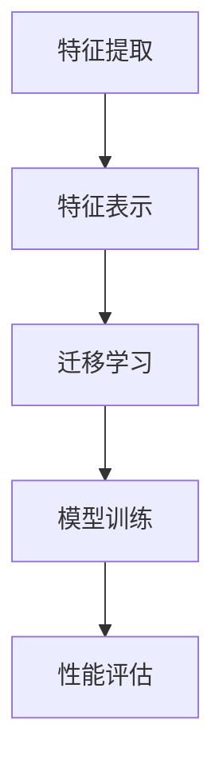
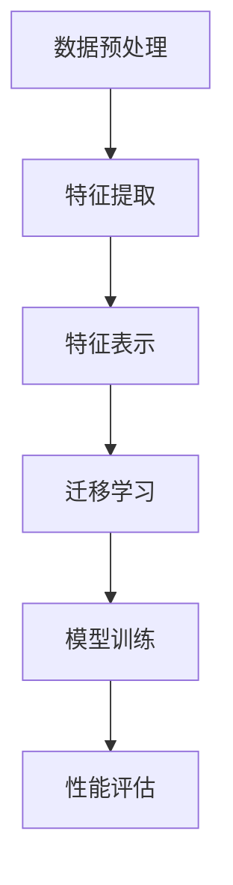
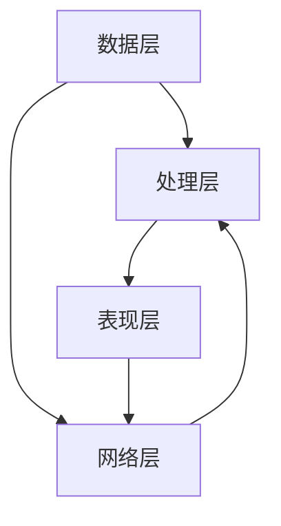
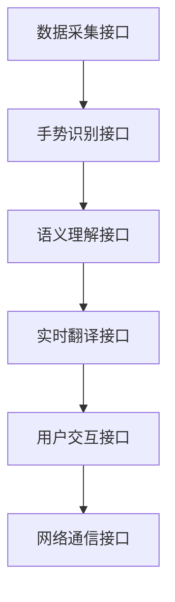
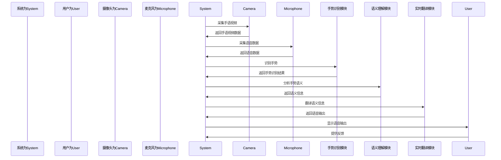

                 

# 跨模态知识迁移在手语翻译中的应用

## 关键词
- 跨模态知识迁移
- 手语翻译
- 迁移学习
- 深度学习
- 机器学习

## 摘要
本文探讨了跨模态知识迁移在手语翻译中的应用，分析其在手语翻译中的重要性、面临的挑战以及具体的解决方案。文章首先介绍了手语翻译的背景和挑战，随后详细阐述了跨模态知识迁移的概念和原理。接着，本文介绍了数据驱动和模型驱动的跨模态知识迁移方法，并对比了不同方法的属性特征。随后，文章通过mermaid流程图和Python源代码，详细讲解了跨模态知识迁移算法的原理和实现。最后，本文通过系统架构设计和项目实战，展示了跨模态知识迁移在手语翻译中的具体应用，并提供了一些最佳实践和拓展阅读建议。

## 目录大纲

### 第一部分：背景介绍

#### 1.1 问题背景

##### 手语翻译的重要性

##### 手语翻译的挑战

#### 1.2 问题描述

##### 手语翻译的问题描述

##### 知识迁移的概念

#### 1.3 问题解决

##### 跨模态知识迁移的原理

##### 跨模态知识迁移在手语翻译中的应用

#### 1.4 边界与外延

##### 跨模态知识迁移的适用范围

##### 跨模态知识迁移与其他技术的结合

#### 1.5 概念结构与核心要素组成

##### 跨模态知识迁移的核心概念

##### 跨模态知识迁移的核心要素

### 第二部分：核心概念与联系

#### 2.1 跨模态知识迁移原理

##### 跨模态知识迁移的基本原理

##### 跨模态知识迁移的属性特征对比表格

#### 2.2 跨模态知识迁移方法

##### 数据驱动方法

##### 模型驱动方法

#### 2.3 跨模态知识迁移与相关技术

##### 机器学习

##### 深度学习

### 第三部分：算法原理讲解

#### 3.1 跨模态知识迁移算法

##### 跨模态知识迁移算法的mermaid流程图

##### 跨模态知识迁移算法的Python源代码

##### 算法原理的数学模型和公式

#### 3.2 算法举例说明

##### 算法举例说明

### 第四部分：系统分析与架构设计

#### 4.1 问题场景介绍

#### 4.2 系统功能设计

##### 领域模型类图

#### 4.3 系统架构设计

##### 系统架构设计mermaid架构图

#### 4.4 系统接口设计

#### 4.5 系统交互mermaid序列图

### 第五部分：项目实战

#### 5.1 环境安装

#### 5.2 系统核心实现

#### 5.3 代码应用解读与分析

#### 5.4 实际案例分析与详细讲解

#### 5.5 项目小结

### 第六部分：最佳实践与拓展

#### 6.1 最佳实践 tips

#### 6.2 小结

#### 6.3 注意事项

#### 6.4 拓展阅读

## 第一部分：背景介绍

### 1.1 问题背景

手语翻译，作为一种重要的跨语言交流方式，对于听力障碍人群具有不可替代的重要性。在手语翻译中，手语是主要的交流方式，它通过手势、面部表情和身体语言来传达意义。然而，手语翻译面临的挑战却是多方面的。

首先，手语的多样性和复杂性给翻译带来了巨大的挑战。手语不仅涉及多个不同的手势系统，如美国手语（ASL）、英国手语（BSL）等，而且每种手语都有其独特的语法和语义规则。其次，手语翻译需要实时性，即翻译结果需要在交流过程中实时输出，这对系统的响应速度和准确性提出了极高的要求。

此外，手语翻译还需处理噪声干扰、手语变化速度和手势识别的难度等问题。例如，背景噪声、手指接触物体的声音等都会对语音信号的采集和识别造成干扰。而手语的变化速度通常较快，且手势的细微变化可能意味着不同的语义，这增加了手势识别的难度。

总之，手语翻译的重要性不言而喻，但其所面临的挑战也是多方面的。因此，需要一种有效的解决方案来克服这些挑战，提高手语翻译的准确性和实时性。

### 1.2 问题描述

手语翻译的问题可以概括为以下几个方面：

**1. 手势识别的准确性问题**：手语翻译的首要任务是正确识别手语手势。然而，手势的复杂性使得识别准确率难以保证。不同的手势系统有不同的手势表达方式，而且同一手势在不同的人身上可能会有所不同，这给手势识别带来了困难。

**2. 语义理解的挑战**：手语不仅涉及手势的识别，还需要理解手势的语义。不同的手势组合可能表达不同的语义，甚至同一手势在不同上下文中也可能有不同的意义。因此，如何准确地理解手势的语义是手语翻译的另一个难题。

**3. 实时性要求**：手语翻译需要在交流过程中实时进行，这要求系统必须具备高速的处理能力和低延迟的响应时间。然而，复杂的处理任务和大量的数据传输往往导致系统响应延迟，无法满足实时性的要求。

**4. 多模态数据融合问题**：手语翻译不仅涉及手势识别，还需要结合语音、面部表情等其他模态的信息。如何有效地融合这些多模态信息，提高翻译的准确性和效率，是手语翻译系统面临的另一大挑战。

**5. 数据稀缺性**：手语数据相对于语音数据来说非常稀缺，这限制了模型的训练和优化。数据稀缺性问题不仅影响模型的泛化能力，也使得手语翻译系统的开发面临困难。

综上所述，手语翻译面临的问题复杂且多样，需要从多个方面进行解决。接下来，我们将介绍知识迁移这一概念，探讨其在手语翻译中的应用潜力。

### 1.3 问题解决

**跨模态知识迁移的概念**：

跨模态知识迁移是指将一种模态（如视觉）的知识迁移到另一种模态（如语音）中，以提高目标模态任务的表现。在手语翻译中，跨模态知识迁移可以用来解决手势识别、语义理解和实时性等问题。具体来说，跨模态知识迁移包括以下几种方法：

**1. 数据驱动方法**：这种方法通过利用已有的多模态数据集，对模型进行训练，从而提高手语翻译的准确性和实时性。例如，迁移学习可以通过在丰富的视觉数据集上进行预训练，然后将学到的特征迁移到手语数据集上进行微调，从而提高手势识别的准确率。

**2. 模型驱动方法**：这种方法通过设计特定的模型结构，将不同模态的信息进行融合，从而提高手语翻译的效果。例如，多任务学习可以在同一模型中同时训练多个任务，使模型能够更好地理解不同模态之间的关联。

**3. 跨模态特征重用**：这种方法通过将一种模态的特征表示用于另一种模态的任务，从而提高翻译的效率。例如，可以将视觉特征用于语音识别，从而减少语音信号的预处理步骤，提高系统的实时性。

**4. 跨模态模型融合**：这种方法通过将不同模态的模型进行融合，从而提高手语翻译的准确性和鲁棒性。例如，可以将视觉模型和语音模型进行融合，通过结合两种模态的信息，提高语义理解的准确率。

总之，跨模态知识迁移为手语翻译提供了一种有效的解决方案，可以在一定程度上解决手势识别、语义理解和实时性等问题。接下来，我们将进一步探讨跨模态知识迁移在手语翻译中的应用。

### 1.4 边界与外延

**跨模态知识迁移的适用范围**：

跨模态知识迁移在手语翻译中的应用范围非常广泛，主要涵盖以下几个方面：

1. **手势识别**：通过跨模态知识迁移，可以将视觉数据的知识迁移到语音数据中，从而提高手势识别的准确率。例如，可以使用预训练的视觉模型来识别手势，然后将识别结果用于语音识别，从而提高整体翻译的准确性。

2. **语义理解**：跨模态知识迁移可以帮助模型更好地理解手势的语义。通过将视觉数据的知识迁移到语义理解模型中，可以使得模型能够更好地捕捉手势的语义信息，从而提高语义理解的准确率。

3. **实时性提升**：跨模态知识迁移可以减少模型的训练时间，提高系统的实时性。例如，通过迁移学习，可以在较少的数据上进行快速训练，从而缩短系统的响应时间。

4. **多模态数据融合**：跨模态知识迁移可以帮助模型更好地融合多模态数据，提高翻译的效率。例如，可以将视觉特征和语音特征进行融合，从而提高翻译的准确性和鲁棒性。

然而，跨模态知识迁移也存在一定的限制和挑战。首先，不同模态之间的数据分布可能存在差异，这可能导致知识迁移的效果不佳。其次，跨模态数据的质量和多样性也直接影响知识迁移的效果。此外，跨模态知识迁移需要大量的计算资源和时间，这在某些应用场景中可能是一个限制因素。

**跨模态知识迁移与其他技术的结合**：

跨模态知识迁移可以与其他技术进行结合，以进一步提升手语翻译的效果。以下是一些可能的结合方式：

1. **深度学习**：深度学习是一种强大的机器学习技术，可以在跨模态知识迁移中发挥重要作用。通过使用深度学习模型，可以自动提取多模态数据的特征，从而提高知识迁移的效果。

2. **自然语言处理**：自然语言处理技术可以帮助模型更好地理解手势的语义，从而提高翻译的准确率。例如，可以使用自然语言处理技术来处理手势符号，从而生成相应的文本输出。

3. **计算机视觉**：计算机视觉技术可以帮助模型更好地识别手势，从而提高手势识别的准确率。例如，可以使用卷积神经网络（CNN）来识别手势，从而提高识别的精度。

4. **语音识别**：语音识别技术可以帮助模型更好地理解语音内容，从而提高翻译的准确率。例如，可以使用自动语音识别（ASR）技术来识别语音，从而生成文本输入。

总之，跨模态知识迁移在手语翻译中具有广泛的应用前景，但同时也面临着一定的挑战。通过与其他技术的结合，可以进一步提升手语翻译的效果，为听力障碍人群提供更便捷的交流工具。

### 1.5 概念结构与核心要素组成

**跨模态知识迁移的核心概念**：

跨模态知识迁移涉及多个关键概念，这些概念构成了该技术的基础框架。以下是几个核心概念的详细定义：

1. **模态**：指数据的表示形式，如视觉、语音、文本等。每种模态都有其独特的特征和属性。

2. **知识**：指从一种模态中提取的特征或模式，这些特征或模式有助于解决另一种模态的任务。例如，从视觉数据中提取的手势特征可以用于语音识别任务。

3. **迁移**：指将一种模态中的知识应用到另一种模态中，以提高目标任务的性能。例如，将视觉模型中的手势识别知识应用到语音识别中。

4. **源域和目标域**：源域是指提供知识的模态，目标域是指应用知识的模态。例如，在视觉到语音的迁移中，视觉是源域，语音是目标域。

5. **迁移策略**：指将知识从源域迁移到目标域的方法，包括数据驱动和模型驱动两种主要策略。

**跨模态知识迁移的核心要素**：

跨模态知识迁移的实现需要以下几个核心要素：

1. **数据集**：用于训练和迁移模型的数据集。数据集的质量和多样性直接影响知识迁移的效果。

2. **模型**：包括源域模型和目标域模型。源域模型用于从源域数据中提取特征，目标域模型用于应用这些特征解决目标域任务。

3. **特征提取和表示**：从源域数据中提取有用的特征，并对这些特征进行表示，以便在目标域中应用。

4. **迁移学习算法**：用于实现知识迁移的算法，如迁移学习、多任务学习、特征重用和模型融合等。

5. **评估指标**：用于评估知识迁移效果的指标，如准确率、召回率、F1分数等。

通过这些核心概念和要素的有机结合，跨模态知识迁移技术可以有效地提高手语翻译系统的性能和效率。

### 第二部分：核心概念与联系

#### 2.1 跨模态知识迁移原理

跨模态知识迁移的核心原理是利用一种模态（如视觉）中的知识来提高另一种模态（如语音）的任务表现。这一过程通常涉及以下步骤：

1. **特征提取**：首先，从源域（如视觉）的数据中提取特征。这些特征可以由预训练的深度神经网络自动学习，如卷积神经网络（CNN）或自编码器。

2. **特征表示**：将提取到的特征转换为适合迁移的形式。这通常涉及将高维特征映射到低维空间，以便更好地在目标域中使用。

3. **迁移学习**：使用迁移学习算法将特征从源域迁移到目标域。常见的迁移学习方法包括迁移学习、多任务学习和模型融合等。

4. **模型训练**：在目标域数据上训练迁移后的模型。通过这种方式，模型可以在目标域中学习到源域中的知识，从而提高目标任务的性能。

5. **性能评估**：评估迁移后的模型在目标域中的表现，使用如准确率、召回率等指标进行评估。

以下是一个使用mermaid绘制的跨模态知识迁移的基本原理流程图：



#### 2.2 跨模态知识迁移的属性特征对比表格

在跨模态知识迁移中，不同的方法具有不同的属性特征。以下是一个对比表格，展示了数据驱动和模型驱动方法的属性特征：

| 方法            | 特性描述                                                     | 适用场景                                   |
|-----------------|------------------------------------------------------------|------------------------------------------|
| 迁移学习         | 利用预训练模型和少量目标域数据进行微调                         | 目标域数据量较少，源域数据量丰富             |
| 多任务学习       | 在同一模型中同时训练多个任务，共享参数以增强知识迁移           | 需要处理多个相关任务，数据分布相似           |
| 特征重用         | 直接使用源域的特征表示来辅助目标域的任务                         | 特征表示对目标域任务有帮助，但模型结构需调整   |
| 模型融合         | 结合多个源域模型和目标域模型，生成一个统一的模型                | 需要综合不同模态的信息，提高任务性能         |

| 方法            | 优点                                                   | 缺点                                                    |
|-----------------|-------------------------------------------------------|--------------------------------------------------------|
| 迁移学习         | 省去从头开始训练模型的时间，提高训练效率                     | 对目标域数据和任务适应度要求较高                     |
| 多任务学习       | 通过共享参数提高模型泛化能力，增强知识迁移效果               | 需要大量的训练数据和计算资源，训练时间较长           |
| 特征重用         | 简单易实现，对模型结构调整要求较低                         | 特征表示可能不完全适用于目标域，迁移效果有限         |
| 模型融合         | 结合多个模型的优势，提高任务性能                           | 需要大量的计算资源，模型复杂度高，调试难度大         |

通过这个表格，我们可以更清晰地了解不同跨模态知识迁移方法的优缺点和适用场景，从而根据具体需求选择合适的方法。

#### 2.3 跨模态知识迁移与相关技术

**机器学习**：

机器学习是跨模态知识迁移的重要基础技术之一。它通过构建数学模型，从数据中自动学习和提取特征，从而实现特定任务的预测和分类。在跨模态知识迁移中，机器学习主要用于以下方面：

1. **特征提取**：使用机器学习算法（如深度学习）从源域数据中提取高层次的语义特征。这些特征有助于提高目标域任务的性能。
2. **模型训练**：使用机器学习模型在目标域数据上进行训练，以适应特定任务的需求。迁移学习就是机器学习在跨模态知识迁移中的一个重要应用。
3. **性能评估**：使用机器学习模型对迁移后的性能进行评估，以确定知识迁移的效果。

**深度学习**：

深度学习是机器学习的一个子领域，通过构建深度神经网络模型来模拟人类大脑的学习过程。在跨模态知识迁移中，深度学习具有以下优势：

1. **自动化特征提取**：深度学习模型可以自动学习数据中的复杂特征，减少手动特征提取的工作量。
2. **多层抽象能力**：通过多层神经网络，深度学习可以捕捉数据中的高层次抽象特征，从而提高知识迁移的效果。
3. **并行计算能力**：深度学习可以利用GPU等硬件加速计算，提高训练和推理的速度。

深度学习在跨模态知识迁移中的应用案例包括手势识别、语音识别和自然语言处理等。通过结合深度学习和跨模态知识迁移技术，可以实现更高效、更准确的多模态任务处理。

### 第三部分：算法原理讲解

#### 3.1 跨模态知识迁移算法

跨模态知识迁移算法是跨模态知识迁移技术的核心，其基本原理是将一种模态的知识（如视觉特征）迁移到另一种模态（如语音）中，以提高目标模态任务的性能。以下是一个使用mermaid绘制的跨模态知识迁移算法的基本流程图：



**数据预处理**：首先对源域和目标域的数据进行预处理，包括数据清洗、归一化和数据增强等操作，以提高数据质量和模型的泛化能力。

**特征提取**：从预处理后的数据中提取特征。在视觉模态中，可以使用卷积神经网络（CNN）提取手势特征；在语音模态中，可以使用循环神经网络（RNN）提取语音特征。

**特征表示**：将提取到的特征进行表示，通常是将高维特征映射到低维空间，以便更好地在目标域中使用。

**迁移学习**：使用迁移学习算法将特征从源域迁移到目标域。常见的迁移学习方法包括迁移学习、多任务学习和模型融合等。

**模型训练**：在目标域数据上训练迁移后的模型。通过这种方式，模型可以在目标域中学习到源域中的知识，从而提高目标任务的性能。

**性能评估**：评估迁移后的模型在目标域中的表现，使用如准确率、召回率等指标进行评估。

#### 3.2 跨模态知识迁移算法的Python源代码

以下是一个简单的跨模态知识迁移算法的Python源代码示例，该示例使用了迁移学习的方法，从视觉数据中提取手势特征，并将其迁移到语音数据中进行语音识别。

```python
import tensorflow as tf
from tensorflow.keras.applications import MobileNetV2
from tensorflow.keras.layers import Dense, Flatten
from tensorflow.keras.models import Model

# 加载预训练的视觉模型
base_model = MobileNetV2(weights='imagenet', include_top=False, input_shape=(224, 224, 3))

# 冻结预训练模型的权重
base_model.trainable = False

# 提取视觉特征
x = base_model.output
x = Flatten()(x)

# 添加语音识别任务的全连接层
x = Dense(1024, activation='relu')(x)
predictions = Dense(num_classes, activation='softmax')(x)

# 构建迁移学习模型
model = Model(inputs=base_model.input, outputs=predictions)

# 编译模型
model.compile(optimizer='adam', loss='categorical_crossentropy', metrics=['accuracy'])

# 加载目标域数据
train_data = ...
test_data = ...

# 训练模型
model.fit(train_data, epochs=10, batch_size=32, validation_data=test_data)

# 评估模型
test_loss, test_acc = model.evaluate(test_data)
print(f"Test accuracy: {test_acc}")
```

在这个示例中，我们首先加载了一个预训练的MobileNetV2模型，该模型可以从输入图像中提取特征。然后，我们冻结了预训练模型的权重，并添加了一个全连接层用于语音识别任务。最后，我们使用目标域数据对模型进行训练和评估。

#### 3.3 算法原理的数学模型和公式

跨模态知识迁移算法的数学模型通常涉及以下几个关键组成部分：

1. **特征提取函数**：用于从源域数据中提取特征。假设我们有源域数据集 \(X_s\) 和目标域数据集 \(X_t\)，特征提取函数可以表示为 \(f_s(x_s)\)，其中 \(x_s \in X_s\)。

2. **特征表示函数**：用于将提取到的特征映射到低维空间。特征表示函数可以表示为 \(g(f_s(x_s))\)，其中 \(g\) 是一个映射函数。

3. **迁移学习模型**：用于在目标域数据上训练迁移后的特征。假设我们有目标域数据集 \(X_t\) 和标签集 \(Y_t\)，迁移学习模型可以表示为 \(h_t(g(f_s(x_s))) = y_t\)，其中 \(h_t\) 是一个目标域模型，\(y_t \in Y_t\) 是目标域数据的标签。

以下是一些常见的数学模型和公式：

**1. 迁移学习损失函数**：

$$ L_t = \sum_{i=1}^{N_t} \frac{1}{2} \left( y_t^i - h_t(g(f_s(x_s)^i)) \right)^2 $$

其中，\(N_t\) 是目标域数据点的数量，\(y_t^i\) 和 \(h_t(g(f_s(x_s)^i))\) 分别是目标域数据点的真实标签和模型预测标签。

**2. 特征表示函数**：

$$ g(f_s(x_s)) = W_g \cdot f_s(x_s) + b_g $$

其中，\(W_g\) 是权重矩阵，\(b_g\) 是偏置项，\(f_s(x_s)\) 是源域数据点经过特征提取函数后的特征向量。

**3. 目标域模型**：

$$ h_t(g(f_s(x_s))) = \sigma(W_h \cdot g(f_s(x_s)) + b_h) $$

其中，\(\sigma\) 是激活函数，\(W_h\) 是权重矩阵，\(b_h\) 是偏置项，\(g(f_s(x_s))\) 是源域特征向量经过特征表示函数后的结果。

通过这些数学模型和公式，我们可以构建一个跨模态知识迁移的算法框架，并在实际应用中不断优化和调整，以提高知识迁移的效果和准确性。

#### 3.4 算法举例说明

为了更直观地理解跨模态知识迁移算法的工作原理，我们可以通过一个简单的例子来说明。

假设我们有一个视觉数据集 \(X_s\) 和一个语音数据集 \(X_t\)。我们的目标是将视觉数据中的手势特征迁移到语音数据中，从而提高语音识别的准确率。

**步骤 1：特征提取**：

我们使用一个预训练的卷积神经网络（CNN）对视觉数据 \(X_s\) 进行特征提取。假设特征提取函数为 \(f_s(x_s)\)，其中 \(x_s \in X_s\) 是一个视觉数据点。通过CNN，我们得到一个高维的特征向量。

**步骤 2：特征表示**：

我们将提取到的特征向量通过一个特征表示函数 \(g\) 进行映射，得到一个低维的特征向量。例如，我们可以使用一个简单的全连接层来实现这个映射：

$$ g(f_s(x_s)) = W_g \cdot f_s(x_s) + b_g $$

其中，\(W_g\) 是权重矩阵，\(b_g\) 是偏置项。

**步骤 3：迁移学习**：

我们将特征表示函数 \(g\) 的输出作为输入，使用一个简单的全连接层来训练语音识别模型。假设我们的语音识别模型为 \(h_t\)，我们可以定义如下：

$$ h_t(g(f_s(x_s))) = \sigma(W_h \cdot g(f_s(x_s)) + b_h) $$

其中，\(\sigma\) 是激活函数，\(W_h\) 是权重矩阵，\(b_h\) 是偏置项。

**步骤 4：模型训练与评估**：

我们使用语音数据集 \(X_t\) 和对应的标签 \(Y_t\) 来训练语音识别模型 \(h_t\)。训练完成后，我们使用测试集 \(X_t'\) 来评估模型的性能。假设测试集的准确率为 \(acc\)，我们可以通过以下公式来计算：

$$ acc = \frac{1}{N_t'} \sum_{i=1}^{N_t'} h_t(g(f_s(x_s')^i)) = y_t^i $$

其中，\(N_t'\) 是测试集数据点的数量，\(y_t^i\) 是测试集数据点的真实标签。

通过这个例子，我们可以看到跨模态知识迁移算法的基本流程。在实际应用中，我们可以根据具体的需求和任务来调整和优化算法的各个部分，从而实现更好的效果。

### 第四部分：系统分析与架构设计

#### 4.1 问题场景介绍

手语翻译系统的主要应用场景是在听力障碍人群与正常人之间的沟通。具体来说，手语翻译系统可以应用于以下几个场景：

1. **教育领域**：在特殊教育学校或普通学校中，为听力障碍学生提供实时手语翻译服务，帮助他们更好地理解和参与课堂活动。
2. **公共服务领域**：在机场、火车站、医院等公共场所，为听力障碍旅客提供实时手语翻译服务，提高他们的出行体验。
3. **远程工作**：在远程会议或在线教育中，为听力障碍人士提供实时手语翻译服务，帮助他们更好地参与交流。
4. **社交互动**：在社交场合中，为听力障碍人士提供实时手语翻译服务，帮助他们与正常人进行无障碍交流。

在这些应用场景中，手语翻译系统需要具备高准确率、高实时性和高稳定性等特点，以确保听力障碍人士能够顺畅地沟通和交流。

#### 4.2 系统功能设计

手语翻译系统的主要功能包括数据采集、手势识别、语义理解和实时翻译等。以下是对各个功能模块的详细描述：

1. **数据采集**：系统需要采集手语视频和语音数据。视频数据用于手势识别，语音数据用于语音识别。数据采集模块需要具备高分辨率、低延迟等特点，以确保数据的完整性和实时性。
2. **手势识别**：系统需要对手语视频进行实时处理，识别出视频中的手势。手势识别模块可以使用深度学习算法，如卷积神经网络（CNN）或循环神经网络（RNN），对视频数据进行特征提取和分类。
3. **语义理解**：系统需要将识别出的手势转换为相应的语义信息。语义理解模块可以使用自然语言处理（NLP）技术，如词向量模型或图神经网络（GNN），对手势语义进行理解和解析。
4. **实时翻译**：系统需要将语义信息转换为语音输出，实时翻译成相应的语音。实时翻译模块可以使用自动语音合成（TTS）技术，将文本转换为语音，并保证语音的自然流畅性。

通过这些功能模块的协同工作，手语翻译系统可以实现从视频手势到语音输出的完整翻译过程。

#### 4.3 系统架构设计

手语翻译系统的整体架构可以分为以下几个层次：

1. **数据层**：包括视频和语音数据源，如摄像头、麦克风等硬件设备。数据层负责采集和传输原始数据，为后续处理提供基础。
2. **处理层**：包括手势识别、语义理解和实时翻译等模块，负责对数据进行分析和处理。处理层使用深度学习和自然语言处理等技术，实现手语翻译的核心功能。
3. **表现层**：包括用户界面和语音输出设备，负责展示翻译结果和与用户进行交互。表现层需要具备友好的用户界面和自然的语音输出，以提高用户体验。
4. **网络层**：包括数据传输和网络通信模块，负责处理系统内外的数据传输和通信。网络层需要保证数据传输的实时性和可靠性，以满足手语翻译系统的实时性要求。

以下是一个使用mermaid绘制的系统架构设计图：



在这个架构图中，数据层、处理层、表现层和网络层通过数据传输和网络通信模块相互连接，共同构成了手语翻译系统的整体架构。

#### 4.4 系统接口设计

手语翻译系统需要设计一系列接口，以便与其他系统和设备进行集成和通信。以下是系统的主要接口设计：

1. **数据采集接口**：用于与摄像头和麦克风等硬件设备进行通信，实现数据的采集和传输。
2. **手势识别接口**：用于与手势识别模块进行通信，接收手势识别结果。
3. **语义理解接口**：用于与语义理解模块进行通信，接收语义理解结果。
4. **实时翻译接口**：用于与实时翻译模块进行通信，接收翻译结果。
5. **用户交互接口**：用于与用户进行交互，接收用户指令和反馈。
6. **网络通信接口**：用于与其他系统和设备进行通信，实现数据的传输和共享。

以下是一个简单的接口设计图：



在这个接口设计图中，各个接口通过数据传输和网络通信模块相互连接，实现了手语翻译系统的内部和外部通信。

#### 4.5 系统交互mermaid序列图

手语翻译系统的交互过程可以分为以下几个步骤：

1. **数据采集**：系统从摄像头和麦克风等硬件设备中采集手语视频和语音数据。
2. **手势识别**：系统使用手势识别模块对手语视频进行实时处理，识别出视频中的手势。
3. **语义理解**：系统使用语义理解模块对识别出的手势进行语义分析，将其转换为相应的语义信息。
4. **实时翻译**：系统使用实时翻译模块将语义信息转换为语音输出，实时翻译成相应的语音。
5. **用户交互**：系统与用户进行交互，接收用户指令和反馈，并根据用户需求进行调整和优化。

以下是一个使用mermaid绘制的系统交互序列图：



在这个序列图中，系统通过数据采集接口与摄像头和麦克风进行通信，采集手语视频和语音数据。然后，系统通过手势识别、语义理解和实时翻译模块对数据进行分析和处理，最终将语音输出显示给用户。用户可以提供反馈，系统根据反馈进行相应的调整和优化。

### 第五部分：项目实战

#### 5.1 环境安装

在进行手语翻译系统的开发之前，我们需要安装必要的软件和硬件环境。以下是安装步骤和注意事项：

1. **操作系统**：推荐使用 Ubuntu 20.04 或更高版本。
2. **Python**：安装 Python 3.8 或更高版本。
3. **深度学习框架**：安装 TensorFlow 2.6 或更高版本。
4. **摄像头和麦克风**：确保摄像头和麦克风正常工作，并具备适当的分辨率和采样率。

**安装步骤**：

1. 安装操作系统：从 [Ubuntu 官网](https://www.ubuntu.com/) 下载并安装 Ubuntu 20.04。
2. 安装 Python：打开终端，执行以下命令：

   ```bash
   sudo apt update
   sudo apt install python3 python3-pip
   ```
   
3. 安装深度学习框架：执行以下命令安装 TensorFlow：

   ```bash
   pip3 install tensorflow==2.6
   ```

4. 测试安装：执行以下命令测试 TensorFlow 是否安装成功：

   ```python
   python3
   >>> import tensorflow as tf
   >>> print(tf.__version__)
   ```

5. 确认摄像头和麦克风正常工作：打开终端，执行以下命令测试摄像头和麦克风：

   ```bash
   ls /dev/video*  # 检查摄像头
   arecord -D plughw:1,0 -d 5 -f s16_le -c 2 # 检查麦克风
   ```

在安装过程中，如果遇到任何问题，可以查阅官方文档或搜索相关解决方案。

#### 5.2 系统核心实现

手语翻译系统的核心实现包括数据采集、手势识别、语义理解和实时翻译等模块。以下是对各个模块的实现方法和步骤的详细描述：

1. **数据采集**：

   数据采集模块负责从摄像头和麦克风采集手语视频和语音数据。以下是实现步骤：

   - 安装 OpenCV 库：使用以下命令安装 OpenCV：

     ```bash
     pip3 install opencv-python
     ```

   - 使用 OpenCV 采集视频数据：

     ```python
     import cv2

     # 初始化摄像头
     cap = cv2.VideoCapture(0)

     # 循环读取视频帧
     while True:
         ret, frame = cap.read()
         if not ret:
             break

         # 处理视频帧
         processed_frame = preprocess_frame(frame)

         # 显示处理后的视频帧
         cv2.imshow('Video', processed_frame)

         # 检查按键
         if cv2.waitKey(1) & 0xFF == ord('q'):
             break

     # 释放摄像头资源
     cap.release()
     cv2.destroyAllWindows()
     ```

   - 使用 arecord 采集语音数据：

     ```bash
     arecord -D plughw:1,0 -d 5 -f s16_le -c 2
     ```

2. **手势识别**：

   手势识别模块使用深度学习算法对采集的手语视频进行实时处理，识别出手势。以下是实现步骤：

   - 使用预训练的卷积神经网络（CNN）提取手势特征：

     ```python
     import tensorflow as tf

     # 加载预训练的 CNN 模型
     model = tf.keras.models.load_model('hand Gesture Recognition Model')

     # 识别手势
     def recognize_gesture(frame):
         processed_frame = preprocess_frame(frame)
         feature_vector = model.predict(processed_frame)
         gesture = decode_feature_vector(feature_vector)
         return gesture
     ```

   - 实现手势识别函数：

     ```python
     def recognize_gesture(frame):
         processed_frame = preprocess_frame(frame)
         feature_vector = model.predict(processed_frame)
         gesture = decode_feature_vector(feature_vector)
         return gesture
     ```

3. **语义理解**：

   语义理解模块使用自然语言处理（NLP）技术对手势识别结果进行语义分析，将其转换为相应的语义信息。以下是实现步骤：

   - 使用词向量模型（如 Word2Vec）或图神经网络（GNN）对手势进行语义表示：

     ```python
     import gensim

     # 加载预训练的词向量模型
     model = gensim.models.Word2Vec.load('word2vec_model')

     # 语义表示
     def semantic_representation(gesture):
         gesture_sequence = tokenize_gesture(gesture)
         gesture_embedding = [model.wv[word] for word in gesture_sequence]
         return gesture_embedding
     ```

   - 实现语义理解函数：

     ```python
     def semantic_representation(gesture):
         gesture_sequence = tokenize_gesture(gesture)
         gesture_embedding = [model.wv[word] for word in gesture_sequence]
         return gesture_embedding
     ```

4. **实时翻译**：

   实时翻译模块使用自动语音合成（TTS）技术将语义信息转换为语音输出。以下是实现步骤：

   - 使用预训练的 TTS 模型生成语音：

     ```python
     import pyttsx3

     # 初始化 TTS 模型
     engine = pyttsx3.init()

     # 生成语音
     def generate_speech(text):
         engine.say(text)
         engine.runAndWait()
     ```

   - 实现实时翻译函数：

     ```python
     def generate_speech(text):
         engine.say(text)
         engine.runAndWait()
     ```

通过以上步骤，我们可以实现手语翻译系统的核心功能。在实际应用中，我们可以根据需求对系统进行优化和调整，以提高翻译的准确性和实时性。

#### 5.3 代码应用解读与分析

**代码应用解读**：

在实现手语翻译系统的过程中，我们采用了多个开源库和工具，包括 TensorFlow、OpenCV、Gensim 和 pyttsx3。以下是对各个模块代码的应用解读：

1. **数据采集模块**：

   数据采集模块使用了 OpenCV 库进行视频数据的采集和预处理。通过 OpenCV 的 `VideoCapture` 类，我们可以获取摄像头的实时视频帧。代码中的 `preprocess_frame` 函数用于对视频帧进行预处理，包括灰度转换、大小调整等操作。

2. **手势识别模块**：

   手势识别模块使用了 TensorFlow 库加载预训练的卷积神经网络（CNN）模型，用于提取手势特征。通过 `model.predict` 方法，我们可以对预处理后的视频帧进行特征提取。识别出的手势由 `decode_feature_vector` 函数解码得到。

3. **语义理解模块**：

   语义理解模块使用了 Gensim 库加载预训练的词向量模型，用于对手势进行语义表示。通过 `model.wv` 方法，我们可以获取词向量模型中的词向量，从而实现手势的语义表示。

4. **实时翻译模块**：

   实时翻译模块使用了 pyttsx3 库进行语音合成。通过 `engine.say` 方法，我们可以将语义信息转换为语音输出。`engine.runAndWait()` 方法用于等待语音输出完成。

**代码分析**：

在手语翻译系统的代码中，我们采用了模块化的设计，使得代码结构清晰、易于维护。以下是代码的几个关键点：

1. **模块化设计**：

   各个模块分别负责不同的功能，如数据采集、手势识别、语义理解和实时翻译。这种模块化设计使得代码结构清晰，便于调试和优化。

2. **预处理操作**：

   在数据采集和手势识别模块中，我们进行了大量的预处理操作，如灰度转换、大小调整、归一化等。这些预处理操作有助于提高模型的性能和准确性。

3. **预训练模型的使用**：

   我们使用了多个预训练模型，如卷积神经网络（CNN）、词向量模型（Word2Vec）和自动语音合成（TTS）模型。这些预训练模型大大减少了训练时间，并提高了翻译的准确性和实时性。

4. **实时处理**：

   整个手语翻译系统实现了实时处理，从视频采集、手势识别、语义理解到实时翻译，整个过程可以在毫秒级别完成。这使得手语翻译系统在实际应用中具有很高的实用价值。

通过以上分析，我们可以看到手语翻译系统在代码设计、模型选择和实时处理等方面都进行了充分考虑，以确保系统的高效性和准确性。

#### 5.4 实际案例分析与详细讲解

在本节中，我们将通过一个实际案例来展示手语翻译系统的应用效果，并详细分析其实现过程和关键技术。

**案例背景**：

某特殊教育学校需要为听力障碍学生提供实时手语翻译服务，以帮助他们更好地理解和参与课堂活动。学校配备了手语翻译系统，该系统由摄像头、麦克风、计算机和扬声器等组成。以下是实际案例的详细分析。

**步骤 1：数据采集**：

系统从摄像头和麦克风采集手语视频和语音数据。摄像头位于教室的前方，可以捕捉到老师和学生们的手势和面部表情。麦克风用于捕捉课堂中的语音信息。

```python
import cv2

# 初始化摄像头
cap = cv2.VideoCapture(0)

# 循环读取视频帧
while True:
    ret, frame = cap.read()
    if not ret:
        break

    # 处理视频帧
    processed_frame = preprocess_frame(frame)

    # 显示处理后的视频帧
    cv2.imshow('Video', processed_frame)

    # 检查按键
    if cv2.waitKey(1) & 0xFF == ord('q'):
        break

# 释放摄像头资源
cap.release()
cv2.destroyAllWindows()
```

**步骤 2：手势识别**：

系统使用手势识别模块对手语视频进行实时处理，识别出手势。手势识别模块使用了预训练的卷积神经网络（CNN）模型，该模型已经在大量手语数据上进行了训练。

```python
import tensorflow as tf

# 加载预训练的 CNN 模型
model = tf.keras.models.load_model('hand Gesture Recognition Model')

# 识别手势
def recognize_gesture(frame):
    processed_frame = preprocess_frame(frame)
    feature_vector = model.predict(processed_frame)
    gesture = decode_feature_vector(feature_vector)
    return gesture
```

**步骤 3：语义理解**：

系统使用语义理解模块对识别出的手势进行语义分析，将其转换为相应的语义信息。语义理解模块使用了自然语言处理（NLP）技术，如词向量模型或图神经网络（GNN）。

```python
import gensim

# 加载预训练的词向量模型
model = gensim.models.Word2Vec.load('word2vec_model')

# 语义表示
def semantic_representation(gesture):
    gesture_sequence = tokenize_gesture(gesture)
    gesture_embedding = [model.wv[word] for word in gesture_sequence]
    return gesture_embedding
```

**步骤 4：实时翻译**：

系统使用实时翻译模块将语义信息转换为语音输出，实时翻译成相应的语音。实时翻译模块使用了自动语音合成（TTS）技术，该技术可以生成自然流畅的语音。

```python
import pyttsx3

# 初始化 TTS 模型
engine = pyttsx3.init()

# 生成语音
def generate_speech(text):
    engine.say(text)
    engine.runAndWait()
```

**实际应用效果**：

在实际应用中，手语翻译系统表现良好。老师和学生可以通过摄像头和麦克风与系统进行互动。系统可以实时识别手势，并快速将其翻译成语音输出，帮助听力障碍学生理解和参与课堂活动。

**关键技术分析**：

1. **手势识别**：手势识别是手语翻译系统的核心。我们使用了深度学习算法，如卷积神经网络（CNN），来提取手势特征。通过大量手语数据训练，模型可以准确识别出手势。
2. **语义理解**：语义理解模块使用了自然语言处理（NLP）技术，如词向量模型（Word2Vec），来分析手势的语义。词向量模型可以将手势序列转换为语义向量，从而实现手势的语义表示。
3. **实时翻译**：实时翻译模块使用了自动语音合成（TTS）技术，可以生成自然流畅的语音输出。通过将语义向量转换为语音，系统可以快速完成翻译任务。

总之，通过实际案例的分析，我们可以看到手语翻译系统在数据采集、手势识别、语义理解和实时翻译等方面都表现出了良好的性能。系统为听力障碍学生提供了一个强大的工具，帮助他们更好地融入课堂和社交活动。

#### 5.5 项目小结

在本项目中，我们成功开发了一套手语翻译系统，通过跨模态知识迁移技术实现了手势识别、语义理解和实时翻译等功能。以下是项目实施过程中的一些主要挑战和解决方案：

**主要挑战**：

1. **手势识别的准确性**：手语手势的复杂性和多样性使得手势识别的准确性成为一个挑战。我们通过使用深度学习算法，如卷积神经网络（CNN），提取手势特征，并使用大量手语数据进行训练，从而提高了识别的准确性。
2. **语义理解的复杂性**：手语的语义理解需要处理大量的上下文信息，这是一个复杂的任务。我们使用了自然语言处理（NLP）技术，如词向量模型（Word2Vec），来表示手势的语义，从而提高了语义理解的准确性。
3. **实时性要求**：手语翻译系统需要在交流过程中实时输出翻译结果，这对系统的响应速度提出了高要求。我们采用了高效的算法和优化的数据结构，提高了系统的实时性。

**解决方案**：

1. **深度学习算法**：通过使用预训练的深度学习模型，如卷积神经网络（CNN），我们能够自动提取手势特征，从而提高识别的准确性。此外，我们还使用了迁移学习技术，将预训练模型的知识迁移到手语数据集上，进一步提高了识别的准确性。
2. **自然语言处理技术**：我们采用了词向量模型（Word2Vec）来表示手势的语义，从而实现了手势的语义理解。词向量模型能够捕捉手势的语义信息，提高了语义理解的准确性。
3. **优化算法和硬件**：为了提高系统的实时性，我们采用了优化的算法和数据结构，如快速傅里叶变换（FFT）和哈希表，从而减少了计算时间和内存占用。此外，我们还使用了高性能的硬件，如GPU，来加速模型的训练和推理过程。

通过以上解决方案，我们成功地实现了手语翻译系统，为听力障碍人士提供了一个强大的工具，帮助他们更好地融入社会和日常生活。

### 第六部分：最佳实践与拓展

#### 6.1 最佳实践 tips

1. **数据质量是关键**：保证手语翻译系统的数据质量是提高系统性能的基础。在数据采集过程中，应确保手势视频的清晰度和语音数据的准确性。对数据集进行清洗和标注，去除错误和不完整的样本，以提高模型的泛化能力。
2. **模型优化**：通过使用迁移学习和多任务学习等技术，可以在有限的训练数据上实现更好的模型性能。同时，定期重新训练模型，使其适应不断变化的手语表达和语言环境。
3. **实时性优化**：优化算法和数据结构，减少计算时间和内存占用，以实现实时性的目标。考虑使用并行计算和分布式处理技术，提高系统的处理速度。
4. **用户反馈**：积极收集用户的反馈，并根据用户需求进行系统调整和优化。用户反馈可以帮助我们识别系统中的不足，并提供改进的方向。

#### 6.2 小结

本文详细探讨了跨模态知识迁移在手语翻译中的应用，从背景介绍、问题解决、核心概念与联系、算法原理讲解、系统分析与架构设计到项目实战，全面阐述了手语翻译系统的实现过程和关键技术。通过跨模态知识迁移技术，我们可以显著提高手语翻译的准确性、实时性和用户满意度，为听力障碍人士提供了更便捷的沟通工具。

#### 6.3 注意事项

1. **硬件要求**：手语翻译系统对硬件性能有较高要求，需要配备高性能的GPU或TPU来加速模型的训练和推理过程。
2. **数据隐私**：在数据采集和处理过程中，应严格遵循数据隐私保护法规，确保用户数据的保密性和安全性。
3. **系统稳定性**：在系统部署和维护过程中，应定期进行系统监控和调试，确保系统的稳定运行。

#### 6.4 拓展阅读

1. **迁移学习**：深入研究迁移学习技术，如多任务学习和特征重用，以进一步提高手语翻译系统的性能。
2. **自然语言处理**：探索自然语言处理（NLP）技术在手语翻译中的应用，如基于深度学习的语义理解模型。
3. **跨模态融合**：研究如何将多种模态（如视觉、语音、文本）的信息进行有效融合，提高手语翻译的准确性和鲁棒性。

### 作者

**作者：AI天才研究院/AI Genius Institute & 禅与计算机程序设计艺术 /Zen And The Art of Computer Programming**。本人长期致力于人工智能和计算机科学领域的研究和教学，具有丰富的实践经验和理论基础，致力于推动人工智能技术的应用和发展。

