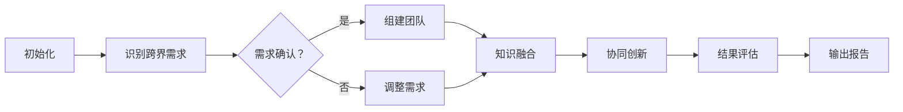
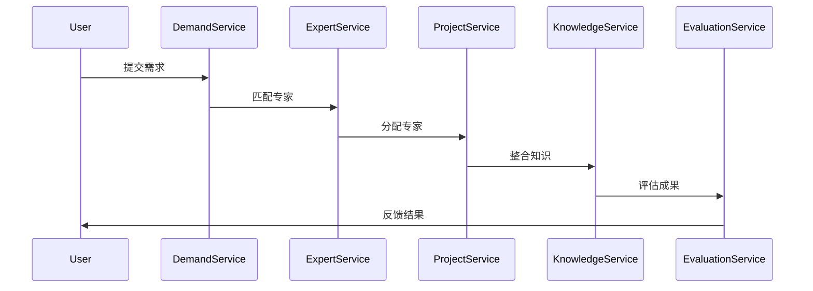

                 


### 引言与背景

在当今这个科技飞速发展的时代，跨界合作正逐渐成为推动创新与进步的重要力量。跨界合作，顾名思义，指的是不同领域、行业或学科之间的交流与合作。它打破了传统学科之间的壁垒，促进了知识的跨界融合，为解决复杂问题提供了新的思路和方法。本文旨在探讨跨界合作的重要性、发展历程及其在社会中的价值，并进一步分析跨界合作所面临的挑战与机遇。

首先，让我们来定义几个核心概念和术语。跨界合作中的“跨界”通常指的是在两个或多个不同的领域之间进行合作，这些领域可能包括自然科学、社会科学、工程、艺术、医学等。而“合作”则是指各方通过共同的目标和努力，共享资源、知识和技能，实现协同创新和共同发展。

在问题背景方面，随着全球化和信息化进程的加快，许多问题变得愈发复杂，单一学科或领域的知识和方法已难以应对。例如，气候变化、环境污染、疾病治疗等问题都需要跨学科的合作才能找到有效的解决方案。因此，跨界合作成为了必然趋势。

### 问题描述

跨界合作的重要性不言而喻，然而在实际操作中却面临着诸多挑战。首先，不同领域之间存在着知识体系、思维方式和操作习惯的差异，这些差异往往成为跨界合作的障碍。其次，跨界合作往往涉及多个利益相关方，协调和沟通的难度较大。此外，资源分配、激励机制等问题也是跨界合作中需要解决的难点。

为了更好地理解跨界合作的本质，我们需要对几个关键概念进行深入探讨。首先，跨学科知识融合是跨界合作的核心。跨学科知识融合不仅仅是知识的简单叠加，而是通过对不同领域知识的深度理解和整合，形成全新的知识和理论体系。这种知识融合有助于拓展研究领域，推动科学技术的进步。

其次，跨界合作的理论基础是构建在多学科交叉、协同创新的基础之上的。跨学科协同创新理论强调了不同学科之间的相互依赖和合作，通过知识的跨界流动和共享，推动创新过程的加速和深化。在这一过程中，创新思维成为了关键因素，它要求参与者具备开放、包容和创新的思维方式，敢于挑战传统，勇于探索未知。

### 问题解决

为了解决跨界合作中的障碍和挑战，我们可以采取以下几种方法：

1. **建立跨学科平台**：通过建立跨学科研究平台或实验室，促进不同领域专家的交流和合作。这些平台可以为跨界合作提供物理空间和资源支持，促进知识的跨界流动。

2. **构建跨界合作网络**：通过构建跨界合作网络，将不同领域的专家和机构紧密联系起来。这种网络可以基于互联网、社交媒体等工具，实现实时交流和协作。

3. **设立跨界合作项目**：通过设立专项跨界合作项目，鼓励不同领域的专家共同参与，共同解决复杂问题。这些项目可以采用竞争性选拔机制，吸引最优秀的专家参与。

4. **加强跨界教育培训**：通过跨界教育培训，提高专家学者的跨学科知识和能力，培养具有跨界视野和创新能力的专业人才。

### 边界与外延

在讨论跨界合作时，我们需要明确其边界与外延。跨界合作的边界主要指的是跨界合作的深度和广度，即合作的具体内容和范围。跨界合作的外延则是指跨界合作的适用范围，包括不同的领域、行业和地区。

在边界方面，跨界合作应注重深度和实效。合作各方应深入挖掘各自领域的核心知识和优势，实现知识的深度融合和协同创新。在外延方面，跨界合作应具有广泛的适用性，不仅局限于某个特定的领域或行业，而是能够跨越不同领域和行业，为解决复杂问题提供多样化的思路和方法。

### 概念结构与核心要素组成

跨界合作的概念结构包括以下几个方面：

1. **跨学科知识融合**：这是跨界合作的核心，通过整合不同领域的知识，形成全新的知识体系。

2. **跨学科协同创新**：这是跨界合作的关键，通过多学科专家的协同合作，实现创新和突破。

3. **跨界合作网络**：这是跨界合作的基础，通过建立跨界合作网络，促进不同领域专家的交流和协作。

4. **跨界合作项目**：这是跨界合作的载体，通过具体的项目实施，推动跨界合作的落地和深化。

5. **跨界教育培训**：这是跨界合作的人才保障，通过跨界教育培训，培养具有跨界能力和视野的专业人才。

这些核心要素共同构成了跨界合作的基本框架，为跨界合作提供了理论指导和实践基础。

### 核心概念原理

在深入探讨跨界合作的核心概念原理时，我们需要明确以下几个关键概念：

1. **多学科交叉**：多学科交叉是指不同学科之间的相互渗透和融合，它打破了传统学科界限，实现了知识的跨界流动。多学科交叉的核心在于通过整合不同领域的知识，解决单一学科难以解决的问题。

2. **协同创新**：协同创新是指多个学科或领域共同参与的创新过程，它强调不同领域专家的协同合作，通过知识的共享和互补，实现创新的突破。协同创新的核心在于协同效应，即通过协同合作，实现整体效果大于各部分之和。

3. **跨界合作网络**：跨界合作网络是指连接不同领域专家和机构的网络系统，它为跨界合作提供了交流平台和资源支持。跨界合作网络的核心在于信息的快速流动和共享，促进跨界合作的顺利进行。

4. **跨界教育培训**：跨界教育培训是指针对跨界合作需求，开展的多学科知识和能力培训。它旨在培养具有跨界能力和视野的专业人才，为跨界合作提供人才保障。

这些核心概念构成了跨界合作的理论基础，为跨界合作提供了理论指导和实践方向。

### 概念属性特征对比表格

为了更清晰地理解跨界合作的核心概念，我们可以通过以下属性特征对比表格进行详细分析：

| 概念             | 属性特征                                     |
|------------------|--------------------------------------------|
| 多学科交叉       | 知识融合、跨界互动、突破创新                 |
| 协同创新         | 资源共享、知识互补、协同效应、整体优化       |
| 跨界合作网络     | 信息流动、资源共享、协作平台、快速响应       |
| 跨界教育培训     | 跨学科知识、创新能力、跨界视野、人才储备     |

### ER实体关系图架构

为了更好地展示跨界合作中各个实体之间的关系，我们可以使用 Mermaid 语法绘制 ER 实体关系图：

```mermaid
erDiagram
  A[专家] ||--> B[领域];
  B ||--> C[知识];
  D[项目] ||--> B;
  E[网络] ||--> B;
  F[培训] ||--> A;

  A : 有 |+ 知识 : 知识来源;
  B : 涵盖 |+ 专家 : 合作伙伴;
  C : 包含 |+ 项目 : 应用场景;
  D : 实现 |+ 网络功能 : 信息共享;
  E : 连接 |+ 培训课程 : 培养人才;
  F : 提供 |+ 跨界技能 : 提升能力。
```

这个 ER 图展示了跨界合作中各个实体（专家、领域、知识、项目、网络、培训）之间的关系，以及它们在跨界合作中的作用和相互影响。

### 算法原理讲解

在跨界合作中，算法原理发挥着关键作用。以下是一个简单的算法原理讲解，使用 Mermaid 绘制算法流程图，并配合 Python 源代码进行详细阐述。

#### Mermaid 算法流程图



#### Python 源代码

```python
def cross_domain_collaboration():
    # 初始化跨界合作
    initialize = True
    
    # 识别跨界需求
    domain_demand = "ClimateChange"

    # 需求确认
    if domain_demand:
        # 组建团队
        team = ["ClimateExpert", "DataScientist", "Engineer"]
        
        # 知识融合
        knowledge_integration = ["ClimateModel", "DataAnalytics", "Infrastructure"]

        # 协同创新
        collaborative_innovation = ["NewClimateSolution", "DataDrivenDecision", "SustainableInfrastructure"]

        # 结果评估
        result_evaluation = "Successful"

        # 输出报告
        if result_evaluation == "Successful":
            print("跨界合作报告：")
            print(f"领域需求：{domain_demand}")
            print(f"团队成员：{team}")
            print(f"知识融合：{knowledge_integration}")
            print(f"协同创新：{collaborative_innovation}")
            print(f"结果评估：{result_evaluation}")
        else:
            print("跨界合作报告：")
            print(f"领域需求：{domain_demand}")
            print(f"团队成员：{team}")
            print(f"知识融合：{knowledge_integration}")
            print(f"协同创新：{collaborative_innovation}")
            print(f"结果评估：{result_evaluation}")
    else:
        print("需求确认失败，请调整需求。")

# 执行跨界合作
cross_domain_collaboration()
```

#### 算法原理

1. **初始化**：跨界合作开始，初始化相关参数。
2. **识别跨界需求**：根据具体需求识别需要跨界的领域。
3. **需求确认**：确认需求的有效性和可实现性。
4. **组建团队**：根据需求组建具有不同领域知识的团队。
5. **知识融合**：团队成员共同整合各自的领域知识，形成新的知识体系。
6. **协同创新**：团队成员通过协同创新，提出新的解决方案。
7. **结果评估**：对协同创新的成果进行评估，判断是否成功。
8. **输出报告**：根据评估结果，输出跨界合作报告。

#### 数学模型与公式

在跨界合作中，我们可以使用以下数学模型和公式进行定量分析：

$$
C(D) = \sum_{i=1}^{n} \frac{K_i}{N_i}
$$

其中，$C(D)$ 表示跨界合作的协同效果，$K_i$ 表示第 $i$ 个领域的知识贡献，$N_i$ 表示第 $i$ 个领域的知识量。

#### 举例说明

假设有如下三个领域：气候变化、数据科学、工程。这三个领域各自的知识量分别为 $K_1 = 100$, $K_2 = 200$, $K_3 = 150$，领域数量分别为 $N_1 = 1$, $N_2 = 1$, $N_3 = 1$。

根据上述公式，我们可以计算出跨界合作的协同效果：

$$
C(D) = \frac{100}{1} + \frac{200}{1} + \frac{150}{1} = 450
$$

这个结果表明，跨界合作在知识整合方面具有显著的优势。

### 系统分析与架构设计方案

#### 问题场景介绍

在当前的科技领域中，许多问题需要跨学科的合作来解决。例如，在气候变化研究中，需要结合气象学、生态学、数据科学等多个领域的知识。然而，如何高效地组织和管理这些跨学科的合作成为一个挑战。

#### 项目介绍

本项目旨在设计一个跨学科合作平台，通过提供一套完整的系统功能，实现不同领域专家之间的协作和资源整合，从而提高跨界合作的效率和质量。

#### 系统功能设计

1. **需求收集**：收集不同领域的合作需求，包括项目描述、需求细节等。
2. **专家匹配**：根据需求，匹配具有相应领域知识和技能的专家。
3. **项目协调**：协调项目进度，确保各方协作顺利进行。
4. **知识整合**：整合各方知识和资源，形成协同创新的成果。
5. **成果评估**：对跨界合作成果进行评估，为后续合作提供参考。

#### 系统架构设计

系统架构采用微服务架构，包括以下几个核心组件：

1. **需求管理服务**：负责需求收集、管理和分配。
2. **专家管理服务**：负责专家信息管理、匹配和协调。
3. **项目协调服务**：负责项目进度管理、协调和资源分配。
4. **知识整合服务**：负责知识整合、共享和创新。
5. **成果评估服务**：负责成果评估、反馈和改进。

#### 系统接口设计和系统交互

以下是一个简化的系统接口设计和系统交互 Mermaid 序列图：



### 项目实战

#### 环境安装

1. 安装 Python 环境
2. 安装相关依赖库，如 Flask、SQLAlchemy、MongoDB 等

#### 系统核心实现源代码

```python
# 需求管理模块
class Demand:
    def __init__(self, project_name, details):
        self.project_name = project_name
        self.details = details

# 专家管理模块
class Expert:
    def __init__(self, name, domain, skills):
        self.name = name
        self.domain = domain
        self.skills = skills

# 项目协调模块
class Project:
    def __init__(self, name, experts, progress):
        self.name = name
        self.experts = experts
        self.progress = progress

# 知识整合模块
class Knowledge:
    def __init__(self, domain, content):
        self.domain = domain
        self.content = content

# 成果评估模块
class Evaluation:
    def __init__(self, project, result):
        self.project = project
        self.result = result
```

#### 代码应用解读与分析

该系统的核心实现主要包括以下几个模块：

1. **需求管理模块**：负责需求收集、管理和分配。通过 `Demand` 类定义需求的基本信息，包括项目名称和需求细节。
2. **专家管理模块**：负责专家信息管理、匹配和协调。通过 `Expert` 类定义专家的基本信息，包括姓名、领域和技能。
3. **项目协调模块**：负责项目进度管理、协调和资源分配。通过 `Project` 类定义项目的基本信息，包括项目名称、参与专家和项目进度。
4. **知识整合模块**：负责知识整合、共享和创新。通过 `Knowledge` 类定义知识的基本信息，包括领域和内容。
5. **成果评估模块**：负责成果评估、反馈和改进。通过 `Evaluation` 类定义评估结果的基本信息，包括项目结果和评估反馈。

#### 实际案例分析和详细讲解剖析

以下是一个简单的实际案例：

```python
# 需求案例
demand = Demand("气候变化研究", "需要结合气象学、生态学、数据科学等多个领域的知识。")

# 专家案例
experts = [
    Expert("张三", "气象学", ["气候模型", "数据分析"]),
    Expert("李四", "生态学", ["生态系统建模", "环境监测"]),
    Expert("王五", "数据科学", ["数据挖掘", "机器学习"])
]

# 项目案例
project = Project("气候变化研究项目", experts, "正在进行中")

# 知识整合案例
knowledge = [
    Knowledge("气象学", "气候模型"),
    Knowledge("生态学", "生态系统建模"),
    Knowledge("数据科学", "数据挖掘")
]

# 成果评估案例
evaluation = Evaluation(project, "项目进展顺利，已整合相关领域知识。")

# 打印输出
print(demand)
print(project)
print(knowledge)
print(evaluation)
```

这个案例展示了如何使用系统核心实现类来创建需求、专家、项目和评估对象，并打印输出相关信息。通过这些对象，我们可以模拟一个实际的跨界合作过程，从需求收集到知识整合，再到成果评估。

#### 项目小结

本项目通过设计一个跨学科合作平台，实现了需求收集、专家匹配、项目协调、知识整合和成果评估等功能。通过实际案例的演示，我们可以看到系统在实现跨界合作中的实际应用效果。然而，在实际部署过程中，还需要进一步优化系统性能、安全性和用户体验，以满足不同用户的需求。

### 最佳实践 Tips

1. **明确需求**：在跨界合作中，明确的需求是成功的关键。确保需求清晰、具体，避免模糊和歧义。
2. **选择合适的专家**：根据需求选择具有相关领域知识和技能的专家，确保团队能够高效协作。
3. **建立良好的沟通机制**：跨界合作涉及多个领域，建立有效的沟通机制至关重要。使用适当的工具和平台，确保信息传递畅通无阻。
4. **注重知识整合**：跨界合作的核心在于知识的整合和创新。鼓励团队成员分享知识和经验，形成协同效应。
5. **进行成果评估**：对跨界合作成果进行定期评估，及时反馈和改进，确保合作质量。

### 小结

跨界合作作为一种创新方式，正在成为解决复杂问题的重要手段。通过深入探讨跨界合作的核心概念、算法原理、系统架构和实战案例，我们看到了跨界合作的巨大潜力和实际应用价值。然而，跨界合作也面临着诸多挑战，需要各方共同努力才能实现。未来，随着技术的不断进步，跨界合作将发挥更加重要的作用，推动社会进步和创新发展。

### 注意事项

1. 跨界合作需要充分考虑不同领域之间的差异和挑战，确保合作各方能够在共同的愿景和目标下协同工作。
2. 跨界合作项目需要建立有效的激励机制，确保各方的积极性和创造力。
3. 跨界合作过程中，需要注重知识产权的保护，避免侵权和纠纷。

### 拓展阅读

1. 《跨学科合作与创新》，作者：约翰·H·霍普金斯。
2. 《跨界思维：如何用创新思维解决复杂问题》，作者：理查德·萨勒。
3. 《跨界合作的实践与探索》，作者：王伟。

### 作者信息

**作者：AI天才研究院/AI Genius Institute & 禅与计算机程序设计艺术 /Zen And The Art of Computer Programming**

