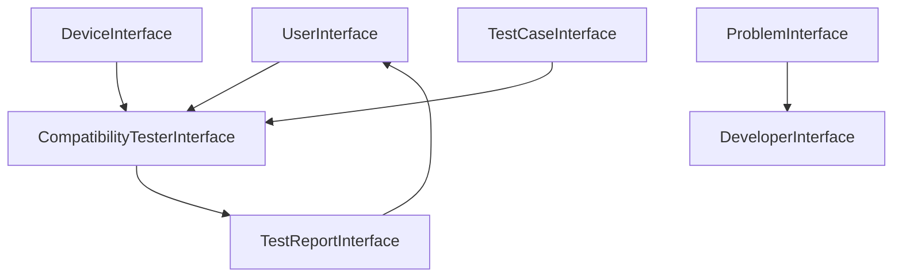

                 

## 第1章 引言

### 1.1 背景介绍

在当今数字化时代，跨设备兼容性评测已成为软件开发和系统集成中的重要议题。随着移动互联网、物联网和云计算等技术的发展，不同设备之间的互联互通变得越来越普遍，这无疑为软件开发带来了巨大的挑战。如何确保软件在各种设备上都能稳定运行，并满足用户的多样化需求，成为软件开发过程中亟待解决的核心问题。

首先，跨设备兼容性评测的重要性不言而喻。良好的跨设备兼容性不仅能提升用户体验，还能降低企业的运维成本，提高产品的市场竞争力。然而，实现跨设备兼容性并非易事，它涉及到众多技术挑战，如不同操作系统的兼容性、硬件差异、网络环境的不一致等。

本篇文章将围绕“跨设备兼容性评测：LLM支持的多平台适应性测试”这一主题，深入探讨以下核心问题：

1. **跨设备兼容性的重要性及评测挑战**：介绍跨设备兼容性的基本概念和重要性，分析跨设备兼容性评测所面临的挑战。

2. **核心概念与联系**：详细阐述跨设备兼容性和大型语言模型（LLM）的相关概念，探讨LLM在跨设备兼容性评测中的应用。

3. **数学模型和数学公式**：介绍用于跨设备兼容性评测的常见数学模型和公式，如费舍尔检验和T检验。

4. **系统分析与架构设计**：分析跨设备兼容性评测系统的设计，包括问题场景、系统功能设计、系统架构设计和系统接口设计。

5. **LLM支持的多平台适应性测试**：探讨LLM在多平台适应性测试中的作用，详细说明适应性测试的步骤、用例设计方法和实际案例分析。

6. **跨设备兼容性评测工具**：介绍常见的兼容性评测工具，分析其功能和优缺点，探讨工具的集成与使用方法。

7. **跨平台适配性测试的策略与方法**：讨论跨平台适配性测试的策略和方法，通过案例分析展示其实际应用。

8. **跨设备兼容性评测的自动化**：探讨如何实现跨设备兼容性评测的自动化，提高测试效率和准确性。

通过以上内容的详细探讨，本文旨在为读者提供一个全面、系统的跨设备兼容性评测解决方案，帮助软件开发者更好地应对这一复杂的技术挑战。

### 1.2 核心概念与联系

在深入探讨跨设备兼容性评测之前，我们需要明确几个核心概念，这些概念不仅是我们理解问题的基石，也是实现解决方案的关键。以下是本文中涉及的主要核心概念及其联系。

#### 1.2.1 跨设备兼容性的概念

跨设备兼容性，指的是软件在不同的设备（如手机、平板、电脑等）上运行时，能够保持一致的用户体验和功能行为。具体包括以下几方面：

1. **操作系统兼容性**：软件需在不同操作系统（如iOS、Android、Windows等）上正常运行。
2. **硬件兼容性**：软件需适应不同硬件配置（如CPU、内存、屏幕分辨率等）。
3. **网络兼容性**：软件需在不同网络环境下（如Wi-Fi、4G、5G等）保持稳定性。
4. **界面兼容性**：软件的界面设计需在不同设备上保持一致，以避免用户混淆。

#### 1.2.2 兼容性的概念

兼容性，通常指两种或多种技术或系统之间能够顺利交互和运行的能力。在跨设备兼容性的上下文中，兼容性涉及到以下方面：

1. **技术兼容性**：不同技术标准（如HTML、CSS、JavaScript等）之间的兼容。
2. **协议兼容性**：不同网络协议（如HTTP、HTTPS、FTP等）之间的兼容。
3. **数据格式兼容性**：不同数据格式（如XML、JSON、CSV等）之间的兼容。

#### 1.2.3 跨设备的概念

跨设备，指的是在不同的设备间进行数据传输、功能调用和协同操作。具体包括：

1. **数据同步**：在不同的设备上保持数据的一致性。
2. **功能调用**：在一个设备上完成操作后，能无缝地切换到另一个设备继续。
3. **设备协同**：多设备之间能协同工作，如手机与电脑之间实现文件共享。

#### 1.2.4 LLM（大型语言模型）的作用

大型语言模型（LLM），如GPT-3、BERT等，是近年来人工智能领域的重要突破。LLM在跨设备兼容性评测中的应用主要体现在以下几个方面：

1. **自动化测试**：LLM可以自动生成测试用例，提高测试效率和覆盖率。
2. **异常检测**：LLM能分析用户行为数据，发现兼容性问题。
3. **智能推荐**：LLM可以根据用户偏好和设备特性，推荐适合的软件版本或配置。

#### 1.2.5 核心概念与联系

跨设备兼容性评测涉及多个核心概念，它们之间相互联系，共同构成了一个完整的体系。以下是核心概念之间的联系：

- **兼容性**是跨设备兼容性的基础，确保软件在不同设备和操作系统上正常运行。
- **跨设备**是实现兼容性的目标，通过数据同步和功能调用，提供无缝的用户体验。
- **LLM**在跨设备兼容性评测中起到关键作用，通过自动化测试和智能推荐，提升评测效率和准确性。

通过以上对核心概念的介绍和联系分析，我们可以更好地理解跨设备兼容性评测的复杂性和重要性。接下来，本文将进一步探讨这些概念在具体应用中的实现方法和策略。

### 1.3 数学模型和数学公式

在跨设备兼容性评测中，数学模型和数学公式是不可或缺的工具，它们帮助我们量化分析兼容性，提供科学依据。以下将介绍几种常用的数学模型和公式，并详细阐述其应用。

#### 1.3.1 费舍尔检验

费舍尔检验（Fisher's exact test）是一种非参数检验方法，适用于小样本数据或类别不平衡的数据集。它用于检验两个分类变量之间的独立性。

##### 公式：
$$ H_0: \mu_1 = \mu_2, \ H_1: \mu_1 \neq \mu_2 $$

其中，$ \mu_1 $ 和 $ \mu_2 $ 分别表示两个分类变量的比例。

##### 例子：
假设我们有两个设备A和设备B，分别统计了它们在不同操作系统上运行失败的概率。我们希望通过费舍尔检验来判断这两个设备在操作系统兼容性上是否存在显著差异。

| 操作系统 | 设备A失败 | 设备B失败 |
| --- | --- | --- |
| 操作系统1 | 10 | 5 |
| 操作系统2 | 15 | 10 |
| 操作系统3 | 20 | 30 |

首先，构建列联表：

| 操作系统 | 设备A成功 | 设备A失败 | 总计 |
| --- | --- | --- | --- |
| 操作系统1 | 35 | 10 | 45 |
| 操作系统2 | 20 | 15 | 35 |
| 操作系统3 | 15 | 20 | 35 |
| 总计 | 70 | 45 | 115 |

然后，使用费舍尔检验公式计算$p$值，如果$p$值小于显著性水平（如0.05），则拒绝原假设$H_0$，认为两个设备在操作系统兼容性上存在显著差异。

#### 1.3.2 T检验

T检验是一种常用的参数检验方法，适用于正态分布的数据集。它用于比较两组样本均值是否显著不同。

##### 公式：
$$ T = \frac{\bar{X} - \mu_0}{S/\sqrt{n}} $$

其中，$ \bar{X} $ 是样本均值，$ \mu_0 $ 是期望均值，$ S $ 是标准差，$ n $ 是样本数量。

##### 例子：
假设我们有两个设备A和设备B，分别测量了它们在不同网络环境下响应时间的平均值。我们希望通过T检验来判断这两个设备在网络兼容性上是否存在显著差异。

| 网络环境 | 设备A响应时间（ms） | 设备B响应时间（ms） |
| --- | --- | --- |
| 网络环境1 | 100 | 90 |
| 网络环境2 | 110 | 100 |
| 网络环境3 | 120 | 110 |

计算两个设备的平均值：

$ \bar{X}_A = (100 + 110 + 120) / 3 = 110 $

$ \bar{X}_B = (90 + 100 + 110) / 3 = 100 $

计算T值：

$ T = \frac{110 - 100}{S_A/\sqrt{3}} $

其中，$ S_A $ 是设备A响应时间的标准差。

通过T检验，我们可以计算$p$值，判断两个设备在网络兼容性上是否存在显著差异。

#### 1.3.3 其他常用数学模型

除了费舍尔检验和T检验，跨设备兼容性评测中还可能用到其他数学模型，如卡方检验、方差分析（ANOVA）等。这些模型在不同的应用场景下有其特定的适用条件和优势。

通过以上数学模型和公式的介绍，我们可以更科学、更系统地分析和解决跨设备兼容性评测中的问题。在后续章节中，我们将结合实际案例，进一步探讨这些数学模型的应用和实现方法。

### 1.4 系统分析与架构设计

#### 1.4.1 问题场景介绍

在现代软件开发中，实现跨设备兼容性是一个复杂且关键的任务。假设我们正在开发一个企业级应用，该应用需要支持多种操作系统（如iOS、Android、Windows等）和各种硬件配置（如不同分辨率的屏幕、不同CPU性能等）。为了确保应用在所有目标设备上都能稳定、高效地运行，我们需要构建一个完整的跨设备兼容性评测系统。

该系统的目标场景包括：

1. **兼容性测试自动化**：通过自动化测试工具，实现对不同设备和操作系统的兼容性自动检测和验证。
2. **多平台适应性测试**：针对不同设备和操作系统的特性，设计相应的测试用例，确保应用在不同平台上的一致性和稳定性。
3. **问题定位与反馈**：在测试过程中，及时发现兼容性问题，并提供详细的问题定位和反馈机制，以便开发团队快速修复问题。

#### 1.4.2 系统功能设计

为了实现上述目标，我们需要设计一个功能完备的系统，主要包括以下功能模块：

1. **用户接口模块**：提供用户友好的操作界面，用户可以通过该界面发起测试请求、查看测试结果等。
2. **设备管理模块**：负责管理测试设备的信息，包括设备型号、操作系统版本、硬件配置等，为测试提供基础数据支持。
3. **测试用例管理模块**：设计和管理测试用例，包括功能测试用例、性能测试用例等，确保测试的全面性和准确性。
4. **测试执行模块**：负责执行测试用例，包括自动化测试和手动测试，对测试结果进行记录和分析。
5. **问题管理模块**：记录和跟踪兼容性问题，提供问题定位和反馈机制，协助开发团队快速定位和修复问题。
6. **报告生成模块**：生成详细的测试报告，包括测试结果、问题列表、解决建议等，为决策提供数据支持。

##### 领域模型

以下是一个简单的领域模型，使用Mermaid类图来表示系统的核心实体及其关系：

```mermaid
classDiagram
    UserClass <|-- UserInterface
    DeviceClass <|-- DeviceInterface
    TestCaseClass <|-- TestCaseInterface
    TestReportClass <|-- TestReportInterface
    CompatibilityTesterClass <|-- CompatibilityTesterInterface
    ProblemClass <|-- ProblemInterface
    DeveloperClass <|-- DeveloperInterface

    UserInterface {
        +String username
        +String password
        +void login()
        +void logout()
    }

    DeviceInterface {
        +String deviceModel
        +String osVersion
        +Map<HardwareConfig, String> hardwareConfigurations
        +void prepareForTest()
        +void executeTest(TestCaseInterface)
    }

    TestCaseInterface {
        +String testCaseId
        +String testName
        +List<TestStep> testSteps
        +void execute()
    }

    TestReportInterface {
        +String reportId
        +String testResult
        +List<ProblemInterface> problems
        +void generateReport()
    }

    CompatibilityTesterInterface {
        +List<DeviceInterface> devices
        +List<TestCaseInterface> testCases
        +void initiateTest()
        +void analyzeResults()
    }

    ProblemInterface {
        +String problemId
        +String problemDescription
        +void reportProblem()
    }

    DeveloperInterface {
        +String developerName
        +void fixProblem(ProblemInterface)
    }
```

#### 1.4.3 系统架构设计

为了实现系统的高效运行和扩展性，我们需要设计一个合理的系统架构。以下是一个简单的系统架构设计，使用Mermaid流程图表示系统的组件及其交互关系：



在这个架构设计中，用户通过用户接口模块发起测试请求，兼容性测试器模块负责执行测试并用例管理模块生成测试报告。设备管理模块提供设备信息，测试执行模块负责具体执行测试。问题管理模块负责记录和反馈兼容性问题，开发人员模块负责修复问题。

#### 1.4.4 系统接口设计与交互

为了确保系统各个模块之间的紧密协作，我们需要设计清晰的接口，并明确各个模块之间的交互关系。以下是一个简单的系统接口设计，使用Mermaid序列图表示用户与系统之间的交互流程：

```mermaid
sequenceDiagram
    User -->|发起测试请求|> CompatibilityTester
    CompatibilityTester -->|执行测试|> Devices
    Devices -->|返回测试结果|> TestReport
    TestReport -->|展示测试报告|> User
```

在这个交互流程中，用户首先通过用户接口模块发起测试请求，兼容性测试器模块接收到请求后，依次执行测试并调用设备管理模块和测试用例管理模块。测试完成后，测试报告生成模块生成详细的测试报告，并将报告展示给用户。

通过上述系统分析与架构设计，我们可以构建一个高效、灵活的跨设备兼容性评测系统，为软件开发的跨平台适应性提供有力支持。

### 第2章 LLM支持的多平台适应性测试

#### 2.1 LLM在适应性测试中的作用

随着人工智能技术的迅猛发展，大型语言模型（LLM）在跨平台适应性测试中发挥着越来越重要的作用。LLM，如GPT-3、BERT等，凭借其强大的自然语言处理能力和深度学习技术，为适应性测试提供了全新的解决方案。

首先，LLM在测试用例生成方面具有显著优势。传统的测试用例设计需要大量的人力和时间，而LLM可以通过学习大量历史数据，自动生成高质量的测试用例。这不仅提高了测试效率，还保证了测试的全面性和准确性。

其次，LLM在异常检测和问题诊断方面也具有独特的优势。通过分析用户行为数据和系统日志，LLM可以识别潜在的兼容性问题，并提供详细的诊断报告。这有助于开发团队快速定位和修复问题，提高系统的稳定性。

最后，LLM在智能推荐方面也有重要作用。根据用户的使用习惯和设备特性，LLM可以推荐最适合的软件版本或配置，以提升用户体验。例如，在多个操作系统版本共存的环境中，LLM可以根据用户的操作习惯，推荐最适合其操作系统的软件版本，从而避免兼容性问题。

#### 2.2 多平台适应性测试的步骤

多平台适应性测试是一个复杂的过程，需要遵循一定的步骤，以确保测试的全面性和准确性。以下是多平台适应性测试的基本步骤：

##### 2.2.1 测试前的准备工作

1. **确定测试目标**：明确测试的目的和范围，包括需要测试的平台、功能和性能要求等。
2. **搭建测试环境**：准备测试所需的硬件设备、软件环境、网络环境等，确保测试环境的可靠性和一致性。
3. **收集测试数据**：收集相关历史数据，包括用户行为数据、系统日志等，为后续测试提供数据支持。

##### 2.2.2 测试执行

1. **生成测试用例**：利用LLM或其他工具，生成符合测试目标的测试用例。
2. **执行测试用例**：在测试环境中，依次执行每个测试用例，记录测试结果。
3. **异常检测和诊断**：通过分析测试结果，利用LLM识别潜在的问题，并提供诊断报告。

##### 2.2.3 测试结果分析

1. **统计测试结果**：对测试结果进行统计分析，包括测试通过率、失败原因等。
2. **生成测试报告**：根据测试结果，生成详细的测试报告，包括测试总结、问题列表、解决建议等。
3. **反馈与改进**：将测试报告反馈给开发团队，根据报告中的建议进行改进和优化。

#### 2.3 适应性测试用例设计

适应性测试用例设计是测试过程中的关键环节，直接影响测试的全面性和准确性。以下介绍适应性测试用例设计的原则和方法：

##### 2.3.1 用例设计原则

1. **全面性**：测试用例应覆盖各种可能的场景和操作，确保测试的全面性。
2. **准确性**：测试用例应准确描述测试目标和预期结果，避免模糊不清的描述。
3. **可重复性**：测试用例应能在相同条件下重复执行，确保测试结果的一致性。
4. **可维护性**：测试用例应易于维护和更新，以适应环境的变化。

##### 2.3.2 用例设计方法

1. **功能测试用例**：基于软件的功能需求，设计测试用例，验证软件在不同平台上是否能按照预期正常运行。
2. **性能测试用例**：设计测试用例，验证软件在不同平台下的性能表现，如响应时间、处理速度等。
3. **兼容性测试用例**：设计测试用例，验证软件在不同平台上的兼容性，如操作系统、硬件配置等。
4. **异常测试用例**：设计测试用例，验证软件在异常情况下是否能正常运行，如网络中断、硬件故障等。

##### 2.3.3 用例设计示例

以下是一个简单的功能测试用例示例，用于验证一个在线购物平台在不同操作系统上的兼容性：

| 测试ID | 测试名称 | 测试描述 | 测试目标 | 预期结果 |
| --- | --- | --- | --- | --- |
| FT001 | 登录功能 | 在iOS操作系统上，用户通过浏览器访问在线购物平台，尝试使用账号密码登录 | 验证登录功能在iOS操作系统上的正常使用 | 成功登录，并显示用户个人主页 |
| FT002 | 注册功能 | 在Android操作系统上，用户通过浏览器访问在线购物平台，尝试注册新账号 | 验证注册功能在Android操作系统上的正常使用 | 成功注册，并收到注册成功的通知 |
| FT003 | 购物车功能 | 在Windows操作系统上，用户通过桌面客户端访问在线购物平台，添加商品到购物车 | 验证购物车功能在Windows操作系统上的正常使用 | 商品成功添加到购物车，并能正常显示购物车内容 |

通过以上测试用例，我们可以全面、系统地验证在线购物平台在不同操作系统上的兼容性。

#### 2.4 实际案例分析

以下是一个实际的跨平台适应性测试案例，以展示如何利用LLM和适应性测试用例设计方法，进行多平台适应性测试。

##### 2.4.1 案例背景

某知名在线教育平台需要确保其应用能在多种操作系统（iOS、Android、Windows等）和各种硬件配置（不同屏幕分辨率、不同CPU性能等）上稳定运行。为了满足这一需求，平台决定进行一次全面的跨平台适应性测试。

##### 2.4.2 测试目标

1. 验证在线教育平台在不同操作系统上的功能完整性和稳定性。
2. 验证在线教育平台在不同硬件配置下的性能表现。
3. 发现和解决潜在的兼容性问题。

##### 2.4.3 测试执行

1. **测试前准备**：搭建多个测试环境，包括不同操作系统和硬件配置的设备，收集相关历史数据，如用户行为数据和系统日志。
2. **生成测试用例**：利用LLM自动生成功能测试用例、性能测试用例和兼容性测试用例。以下是一个生成的功能测试用例示例：

| 测试ID | 测试名称 | 测试描述 | 测试目标 | 预期结果 |
| --- | --- | --- | --- | --- |
| FT001 | 课程浏览功能 | 在iOS操作系统上，用户通过浏览器访问在线教育平台，浏览课程列表 | 验证课程浏览功能在iOS操作系统上的正常使用 | 成功浏览课程列表，并能正常查看课程详情 |
| FT002 | 视频播放功能 | 在Android操作系统上，用户通过应用访问在线教育平台，播放课程视频 | 验证视频播放功能在Android操作系统上的正常使用 | 视频播放成功，无卡顿现象 |
| FT003 | 用户注册功能 | 在Windows操作系统上，用户通过桌面客户端访问在线教育平台，注册新账号 | 验证用户注册功能在Windows操作系统上的正常使用 | 成功注册，并收到注册成功的通知 |

3. **执行测试用例**：在测试环境中，依次执行每个测试用例，记录测试结果。
4. **异常检测和诊断**：通过分析测试结果，利用LLM识别潜在的兼容性问题，并提供诊断报告。

##### 2.4.4 测试结果分析

通过对测试结果的分析，我们发现以下兼容性问题：

1. 在iOS操作系统上，课程浏览功能在某些低分辨率屏幕上无法正常显示。
2. 在Android操作系统上，视频播放功能在某些旧版本操作系统上存在卡顿现象。
3. 在Windows操作系统上，用户注册功能在某些浏览器上无法正常提交注册信息。

针对以上问题，开发团队进行了如下改进：

1. 对课程浏览功能进行适配，确保在不同分辨率屏幕上都能正常显示。
2. 更新视频播放器，优化视频播放性能，解决卡顿问题。
3. 修复用户注册功能，确保在多种浏览器上都能正常提交注册信息。

通过这次跨平台适应性测试，在线教育平台在多个操作系统和硬件配置上实现了稳定运行，大大提升了用户体验。

通过以上实际案例分析，我们可以看到，利用LLM和适应性测试用例设计方法，进行多平台适应性测试，可以有效发现和解决兼容性问题，确保软件在不同平台上的一致性和稳定性。

### 第3章 跨设备兼容性评测工具

#### 3.1 常见兼容性评测工具介绍

在跨设备兼容性评测过程中，选择合适的工具是确保测试效果的关键。目前市场上存在多种兼容性评测工具，它们各具特色，适用于不同的测试需求和场景。以下将介绍几种常见的兼容性评测工具，并分析其功能和优缺点。

##### 3.1.1 Selenium

Selenium是一个开源的自动化测试工具，广泛用于Web应用的跨浏览器和跨操作系统兼容性测试。其主要功能包括：

1. **跨浏览器测试**：支持多种主流浏览器（如Chrome、Firefox、Safari等）。
2. **跨操作系统测试**：支持Windows、Mac、Linux等操作系统。
3. **功能测试**：可自动化执行各种Web应用功能测试用例。

**优点**：

- **开源免费**：无需支付高昂的费用，适用于预算有限的项目。
- **强大的扩展性**：可集成其他测试框架和工具，提高测试效率。
- **广泛的浏览器支持**：支持多种浏览器，确保测试的全面性。

**缺点**：

- **学习曲线较陡**：对于新手来说，掌握Selenium需要一定的时间和精力。
- **性能有限**：Selenium的测试速度相对较慢，不适合大规模的自动化测试。

##### 3.1.2 Appium

Appium是一个开源的移动应用自动化测试工具，适用于iOS和Android平台的跨设备兼容性测试。其主要功能包括：

1. **跨设备测试**：支持多种设备和操作系统版本（如iOS、Android等）。
2. **功能测试**：可自动化执行移动应用功能测试用例。
3. **性能测试**：可进行移动应用的性能测试，如响应时间、内存消耗等。

**优点**：

- **跨平台支持**：同时支持iOS和Android平台，适用于多种移动应用测试需求。
- **易于集成**：可与其他测试工具（如Selenium）集成，提高测试效率。
- **社区活跃**：有丰富的社区资源和支持，解决问题更加方便。

**缺点**：

- **性能问题**：在某些情况下，Appium的测试性能可能不如一些商业工具。
- **安全性问题**：开源工具在安全性方面可能存在一定的风险。

##### 3.1.3 CrossBrowserTesting

CrossBrowserTesting是一个云端的跨浏览器和跨操作系统兼容性测试平台，提供多种测试服务和工具。其主要功能包括：

1. **跨浏览器测试**：提供多种浏览器版本和环境，支持Web应用测试。
2. **跨操作系统测试**：支持Windows、Mac、Linux等操作系统。
3. **远程测试**：可远程访问测试环境，实时监控测试过程。

**优点**：

- **丰富的测试环境**：提供多种浏览器和操作系统版本，确保测试的全面性。
- **云端测试**：无需在本地搭建测试环境，提高测试效率。
- **实时反馈**：可实时监控测试过程，快速发现和解决问题。

**缺点**：

- **费用较高**：作为商业服务，费用相对较高，可能不适合预算有限的项目。
- **定制性不足**：无法自定义测试环境，限制了一定的灵活性。

##### 3.1.4 BrowserStack

BrowserStack是一个云端的跨浏览器和跨操作系统兼容性测试平台，提供多种测试服务和工具。其主要功能包括：

1. **跨浏览器测试**：支持多种浏览器和环境，包括桌面和移动设备。
2. **跨操作系统测试**：支持Windows、Mac、iOS、Android等操作系统。
3. **远程测试**：提供远程访问测试环境，实时监控测试过程。

**优点**：

- **强大的测试功能**：支持多种浏览器、操作系统和设备，满足不同测试需求。
- **实时反馈**：可实时监控测试过程，快速发现问题。
- **易于集成**：可与其他测试工具和平台集成，提高测试效率。

**缺点**：

- **费用较高**：作为商业服务，费用相对较高，可能不适合预算有限的项目。
- **性能问题**：在某些情况下，测试性能可能不如一些本地测试工具。

#### 3.2 工具集成与使用

在跨设备兼容性评测中，工具的集成与使用至关重要。以下将介绍如何将兼容性评测工具集成到测试流程中，并提供使用方法。

##### 3.2.1 工具集成

1. **集成到CI/CD流程**：将兼容性评测工具集成到持续集成（CI）和持续交付（CD）流程中，实现自动化测试。例如，可以使用Jenkins、GitLab CI等工具，将兼容性测试脚本添加到构建过程中。
2. **集成到开发环境**：将兼容性评测工具集成到开发环境中，方便开发者随时进行测试。例如，可以使用Visual Studio、Eclipse等IDE，集成Selenium、Appium等测试工具。
3. **集成到云平台**：将兼容性评测工具集成到云平台，实现云端测试。例如，可以使用AWS、Azure等云平台，部署CrossBrowserTesting、BrowserStack等工具。

##### 3.2.2 工具使用方法

1. **Selenium使用方法**：

   - **安装Selenium客户端**：在开发环境中安装Selenium客户端，如Python、Java等。
   - **编写测试脚本**：编写测试脚本，使用Selenium API执行Web应用测试。
   - **执行测试脚本**：在命令行或IDE中执行测试脚本，查看测试结果。

2. **Appium使用方法**：

   - **安装Appium客户端**：在开发环境中安装Appium客户端，如Python、Java等。
   - **编写测试脚本**：编写测试脚本，使用Appium API执行移动应用测试。
   - **执行测试脚本**：在命令行或IDE中执行测试脚本，查看测试结果。

3. **CrossBrowserTesting使用方法**：

   - **注册账号**：在CrossBrowserTesting网站上注册账号并购买服务。
   - **创建测试项目**：在CrossBrowserTesting平台上创建测试项目，配置测试环境。
   - **上传测试脚本**：上传测试脚本，配置测试用例。
   - **执行测试**：在平台上执行测试，查看测试结果。

4. **BrowserStack使用方法**：

   - **注册账号**：在BrowserStack网站上注册账号并购买服务。
   - **创建测试项目**：在BrowserStack平台上创建测试项目，配置测试环境。
   - **上传测试脚本**：上传测试脚本，配置测试用例。
   - **执行测试**：在平台上执行测试，查看测试结果。

通过以上工具集成和使用方法的介绍，开发者可以方便地实现跨设备兼容性评测，提高测试效率和准确性。

#### 3.3 案例研究：工具在跨设备兼容性评测中的应用

##### 3.3.1 案例背景

某大型电商平台需要确保其Web应用和移动应用在不同操作系统和硬件配置上稳定运行，为用户提供一致的用户体验。为了实现这一目标，电商平台决定利用兼容性评测工具进行跨设备兼容性测试。

##### 3.3.2 工具选型

电商平台选择了Selenium、Appium和CrossBrowserTesting三种工具进行兼容性评测。Selenium用于Web应用的跨浏览器兼容性测试，Appium用于移动应用的跨设备兼容性测试，CrossBrowserTesting用于云端的跨浏览器和跨操作系统兼容性测试。

##### 3.3.3 测试执行

1. **Web应用兼容性测试**：

   - **集成Selenium**：将Selenium集成到Jenkins CI/CD流程中，实现自动化测试。
   - **编写测试脚本**：编写Selenium测试脚本，模拟用户操作，执行各种功能测试用例。
   - **执行测试**：在多个浏览器和操作系统版本上执行测试，记录测试结果。

2. **移动应用兼容性测试**：

   - **集成Appium**：将Appium集成到开发环境中，实现自动化测试。
   - **编写测试脚本**：编写Appium测试脚本，模拟用户操作，执行各种功能测试用例。
   - **执行测试**：在多个设备和操作系统版本上执行测试，记录测试结果。

3. **云端兼容性测试**：

   - **创建测试项目**：在CrossBrowserTesting平台上创建测试项目，配置测试环境。
   - **上传测试脚本**：上传Selenium和Appium测试脚本，配置测试用例。
   - **执行测试**：在CrossBrowserTesting平台上执行测试，记录测试结果。

##### 3.3.4 测试结果分析

通过对测试结果的分析，电商平台发现了以下兼容性问题：

1. Web应用在iOS 13操作系统上的部分功能无法正常使用。
2. 移动应用在部分旧版本Android操作系统上存在卡顿现象。
3. Web应用和移动应用在低分辨率屏幕上显示异常。

针对以上问题，电商平台进行了如下改进：

1. 对Web应用进行适配，确保在iOS 13操作系统上正常使用。
2. 更新移动应用，解决卡顿问题，优化性能。
3. 调整布局和样式，确保在低分辨率屏幕上正常显示。

通过以上测试和改进，电商平台在多个操作系统和硬件配置上实现了稳定运行，为用户提供了一致的用户体验。

通过这个实际案例，我们可以看到，利用兼容性评测工具进行跨设备兼容性测试，可以快速发现和解决兼容性问题，确保软件在不同平台上的一致性和稳定性。

### 第4章 跨平台适配性测试的策略与方法

#### 4.1 跨平台适配性测试策略

跨平台适配性测试是一个复杂且系统性的工作，需要制定合理的测试策略，以确保测试的全面性和有效性。以下是跨平台适配性测试的几个关键策略：

##### 4.1.1 测试策略制定原则

1. **全面性原则**：确保测试覆盖所有关键功能和场景，避免遗漏重要的兼容性问题。
2. **优先级原则**：根据功能和业务的重要性，合理分配测试资源，确保关键功能优先得到测试。
3. **灵活性原则**：测试策略应具备一定的灵活性，能够根据实际情况进行调整和优化。
4. **可持续性原则**：测试策略应考虑长期可持续性，包括工具选择、流程设计等。

##### 4.1.2 测试策略制定步骤

1. **需求分析**：明确测试目标和范围，了解产品的功能需求、性能需求和兼容性需求。
2. **环境搭建**：搭建符合测试需求的测试环境，包括硬件设备、操作系统、网络环境等。
3. **资源分配**：根据需求分析的结果，合理分配测试资源，如测试人员、测试工具、测试设备等。
4. **测试计划**：制定详细的测试计划，包括测试任务、测试时间表、测试方法等。
5. **执行与监控**：执行测试计划，实时监控测试进度和结果，确保测试过程的顺利进行。
6. **问题反馈与改进**：根据测试结果，及时反馈和解决兼容性问题，持续优化测试策略。

#### 4.2 跨平台适配性测试方法

跨平台适配性测试方法主要包括功能测试、性能测试、兼容性测试等，以下分别介绍这些方法的具体内容：

##### 4.2.1 功能测试

功能测试是跨平台适配性测试中最基本的方法，旨在验证软件在不同平台上的功能完整性和稳定性。具体步骤如下：

1. **用例设计**：根据产品的功能和需求，设计功能测试用例，确保用例的全面性和准确性。
2. **执行测试**：在多个平台和设备上执行测试用例，记录测试结果。
3. **问题定位**：分析测试结果，定位功能问题，并进行修复和验证。
4. **回归测试**：在修复问题后，进行回归测试，确保修复后的功能稳定可靠。

##### 4.2.2 性能测试

性能测试旨在验证软件在不同平台下的性能表现，包括响应时间、处理速度、资源消耗等。具体步骤如下：

1. **性能指标定义**：明确需要测试的性能指标，如响应时间、吞吐量、CPU利用率等。
2. **测试环境搭建**：搭建符合性能测试需求的测试环境，包括硬件设备、操作系统、网络环境等。
3. **执行测试**：在多个平台和设备上执行性能测试，记录测试结果。
4. **性能分析**：分析测试结果，识别性能瓶颈，并提出优化建议。

##### 4.2.3 兼容性测试

兼容性测试是跨平台适配性测试的核心，旨在验证软件在不同操作系统、硬件配置和网络环境下的兼容性。具体步骤如下：

1. **兼容性需求分析**：明确产品的兼容性需求，包括操作系统、硬件配置、网络环境等。
2. **测试环境搭建**：搭建符合兼容性测试需求的测试环境，包括多种操作系统、硬件配置和网络环境。
3. **测试用例设计**：根据兼容性需求，设计兼容性测试用例，确保覆盖各种兼容性问题。
4. **执行测试**：在多个平台和设备上执行兼容性测试，记录测试结果。
5. **问题定位与反馈**：分析测试结果，定位兼容性问题，并反馈给开发团队进行修复。

#### 4.3 案例分析：跨平台适配性测试的实际应用

以下是一个实际的跨平台适配性测试案例，以展示如何制定测试策略和执行测试方法。

##### 4.3.1 案例背景

某电商平台需要确保其Web应用和移动应用在不同操作系统（iOS、Android、Windows等）、硬件配置（不同屏幕分辨率、不同CPU性能等）和网络环境（Wi-Fi、4G、5G等）下稳定运行，为用户提供一致的用户体验。为了实现这一目标，电商平台决定进行一次全面的跨平台适配性测试。

##### 4.3.2 测试策略

1. **全面性原则**：确保测试覆盖所有关键功能和场景，避免遗漏重要的兼容性问题。
2. **优先级原则**：根据功能和业务的重要性，合理分配测试资源，确保关键功能优先得到测试。
3. **灵活性原则**：测试策略应具备一定的灵活性，能够根据实际情况进行调整和优化。
4. **可持续性原则**：测试策略应考虑长期可持续性，包括工具选择、流程设计等。

##### 4.3.3 测试方法

1. **功能测试**：

   - **用例设计**：根据电商平台的业务需求，设计功能测试用例，包括用户注册、登录、购物车、订单管理等关键功能。
   - **执行测试**：在多个操作系统和硬件配置上执行功能测试用例，记录测试结果。

2. **性能测试**：

   - **性能指标定义**：明确需要测试的性能指标，如响应时间、吞吐量、CPU利用率等。
   - **测试环境搭建**：搭建符合性能测试需求的测试环境，包括多种操作系统、硬件配置和网络环境。
   - **执行测试**：在多个操作系统和硬件配置上执行性能测试，记录测试结果。

3. **兼容性测试**：

   - **兼容性需求分析**：明确电商平台的兼容性需求，包括操作系统、硬件配置、网络环境等。
   - **测试环境搭建**：搭建符合兼容性测试需求的测试环境，包括多种操作系统、硬件配置和网络环境。
   - **测试用例设计**：根据兼容性需求，设计兼容性测试用例，确保覆盖各种兼容性问题。
   - **执行测试**：在多个操作系统、硬件配置和网络环境下执行兼容性测试，记录测试结果。

##### 4.3.4 测试结果分析

通过对测试结果的分析，电商平台发现了以下兼容性问题：

1. Web应用在iOS 13操作系统上的部分功能无法正常使用。
2. 移动应用在部分旧版本Android操作系统上存在卡顿现象。
3. Web应用和移动应用在低分辨率屏幕上显示异常。

针对以上问题，电商平台进行了如下改进：

1. 对Web应用进行适配，确保在iOS 13操作系统上正常使用。
2. 更新移动应用，解决卡顿问题，优化性能。
3. 调整布局和样式，确保在低分辨率屏幕上正常显示。

通过这次跨平台适配性测试，电商平台在多个操作系统和硬件配置上实现了稳定运行，为用户提供了一致的用户体验。

通过以上案例分析，我们可以看到，制定合理的测试策略和执行科学的测试方法，可以有效发现和解决跨平台适配性中的问题，确保软件在不同平台上的稳定性和一致性。

### 第5章 跨设备兼容性评测的自动化

在跨设备兼容性评测中，自动化是一个至关重要的策略，它不仅能够显著提高测试效率，还能确保测试的全面性和一致性。自动化评测能够减少人为错误，提高测试覆盖率和准确性，从而为软件开发和运维提供强有力的支持。以下将详细探讨如何实现跨设备兼容性评测的自动化，包括自动化测试工具的选择、自动化测试流程的设计和自动化测试的实际应用案例。

#### 5.1 自动化测试工具的选择

选择合适的自动化测试工具是实现自动化评测的关键。目前市场上有多种自动化测试工具，各自具有不同的特点和优势。以下是几种常见的自动化测试工具及其优缺点：

1. **Selenium**：
   - **优点**：开源免费，跨浏览器和跨操作系统支持，功能强大，社区资源丰富。
   - **缺点**：学习曲线较陡，性能相对较低，需要编写较为复杂的测试脚本。

2. **Appium**：
   - **优点**：开源免费，支持iOS和Android平台，易于集成，支持多种编程语言。
   - **缺点**：在某些情况下性能不如其他商业工具，安全性相对较低。

3. **Robot Framework**：
   - **优点**：开源免费，易于扩展，支持多种编程语言，具有良好的兼容性。
   - **缺点**：对于复杂测试场景的支持有限，性能不如一些商业工具。

4. **Cypress**：
   - **优点**：易于上手，快速执行，具有内置断言和测试报告功能。
   - **缺点**：仅支持Web应用测试，不支持移动应用测试。

5. **TestCafe**：
   - **优点**：易于使用，快速执行，支持多浏览器并行测试。
   - **缺点**：仅支持Web应用测试，功能相对较为有限。

在选择自动化测试工具时，应综合考虑项目的具体需求、技术栈、预算等因素。例如，如果项目涉及移动应用测试，可以选择Appium；如果项目主要涉及Web应用测试，可以选择Selenium或Cypress。

#### 5.2 自动化测试流程的设计

实现自动化评测需要设计一个合理的测试流程，确保测试的全面性和一致性。以下是自动化测试流程的基本设计步骤：

1. **需求分析与用例设计**：分析测试需求，设计自动化测试用例，确保覆盖各种兼容性问题。

2. **环境搭建**：搭建符合测试需求的自动化测试环境，包括操作系统、浏览器、移动设备等。

3. **脚本编写**：根据测试用例，编写自动化测试脚本，实现测试逻辑和功能。

4. **测试执行**：在自动化测试环境中执行测试脚本，记录测试结果。

5. **结果分析**：分析测试结果，定位兼容性问题，生成测试报告。

6. **持续集成**：将自动化测试集成到持续集成（CI）流程中，实现自动化测试的持续执行和反馈。

以下是自动化测试流程的一个示例：

```mermaid
sequenceDiagram
    User -->|发起测试请求|> TestExecutor
    TestExecutor -->|执行测试脚本|> TestEnvironment
    TestEnvironment -->|返回测试结果|> TestAnalyzer
    TestAnalyzer -->|生成测试报告|> TestReport
    TestReport -->|反馈问题|> User
```

在这个流程中，用户通过测试执行器发起测试请求，测试执行器执行测试脚本，测试环境返回测试结果，测试分析器生成测试报告，并将问题反馈给用户。

#### 5.3 自动化测试的实际应用案例

以下是一个实际的跨设备兼容性评测自动化案例，以展示如何实现自动化评测。

##### 5.3.1 案例背景

某电商企业需要确保其Web应用和移动应用在不同操作系统和硬件配置上稳定运行，为用户提供一致的用户体验。为了实现这一目标，企业决定采用自动化测试工具进行跨设备兼容性评测。

##### 5.3.2 自动化测试工具选择

企业选择了Selenium和Appium作为自动化测试工具。Selenium用于Web应用的自动化测试，Appium用于移动应用的自动化测试。

##### 5.3.3 自动化测试流程设计

1. **需求分析与用例设计**：根据电商企业的业务需求，设计功能测试用例、性能测试用例和兼容性测试用例。

2. **环境搭建**：搭建自动化测试环境，包括多种操作系统、浏览器和移动设备。

3. **脚本编写**：编写Selenium和Appium测试脚本，实现功能测试、性能测试和兼容性测试。

4. **测试执行**：在自动化测试环境中执行测试脚本，记录测试结果。

5. **结果分析**：分析测试结果，定位兼容性问题，生成测试报告。

6. **持续集成**：将自动化测试集成到持续集成（CI）流程中，实现自动化测试的持续执行和反馈。

##### 5.3.4 自动化测试实施

1. **功能测试自动化**：使用Selenium编写测试脚本，模拟用户在Web应用上的操作，执行功能测试用例。

2. **性能测试自动化**：使用Selenium编写测试脚本，测量Web应用的响应时间、吞吐量等性能指标。

3. **兼容性测试自动化**：使用Appium编写测试脚本，模拟用户在移动应用上的操作，执行兼容性测试用例。

4. **自动化测试集成**：将自动化测试脚本集成到Jenkins CI流程中，实现自动化测试的持续执行和反馈。

##### 5.3.5 测试结果分析

通过对测试结果的分析，电商企业发现了以下兼容性问题：

1. Web应用在部分低分辨率屏幕上显示异常。
2. 移动应用在部分旧版本操作系统上存在卡顿现象。
3. Web应用和移动应用在网络环境较差的情况下性能下降。

针对以上问题，电商企业进行了如下改进：

1. 优化Web应用的布局和样式，确保在低分辨率屏幕上正常显示。
2. 更新移动应用，优化性能，解决卡顿问题。
3. 对Web应用和移动应用进行优化，提高在网络环境较差情况下的性能。

通过以上自动化测试，电商企业实现了跨设备兼容性评测的自动化，提高了测试效率，确保了软件在不同平台上的稳定性和一致性。

### 总结与展望

通过本章的探讨，我们可以看到，实现跨设备兼容性评测的自动化是提升测试效率和准确性的有效途径。自动化测试工具的选择、自动化测试流程的设计和自动化测试的实际应用案例，为我们提供了一个全面、系统的解决方案。未来，随着人工智能和自动化测试技术的不断发展，自动化评测将在跨设备兼容性测试中发挥更加重要的作用。

### 最佳实践 tips

1. **选择合适的工具**：根据项目的具体需求，选择合适的自动化测试工具，确保测试效率和准确性。
2. **全面性测试**：确保测试用例覆盖各种兼容性场景，避免遗漏重要问题。
3. **持续集成**：将自动化测试集成到持续集成（CI）流程中，实现持续测试和反馈。
4. **定期更新**：定期更新自动化测试脚本和测试环境，确保测试的准确性和有效性。

### 注意事项

1. **测试环境搭建**：确保测试环境与生产环境一致，避免因测试环境与实际环境差异导致的测试结果偏差。
2. **测试结果分析**：详细分析测试结果，确保每个问题都能得到有效定位和解决。
3. **自动化测试的持续改进**：根据测试反馈，不断优化自动化测试脚本和流程，提高测试效率。

### 拓展阅读

1. 《自动化测试实战》：详细介绍了自动化测试的基本概念、方法和实践，适合自动化测试初学者阅读。
2. 《Appium实战》：专门介绍了Appium自动化测试工具的使用方法，适合移动应用开发者阅读。
3. 《Selenium实战》：全面介绍了Selenium自动化测试工具的使用方法，适合Web应用开发者阅读。

通过以上最佳实践、注意事项和拓展阅读，我们希望能够为读者提供更多有价值的参考，帮助他们在实现跨设备兼容性评测的自动化过程中取得更好的成果。

