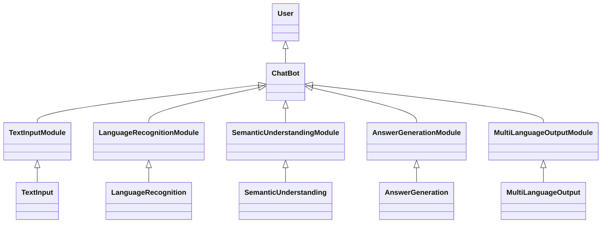
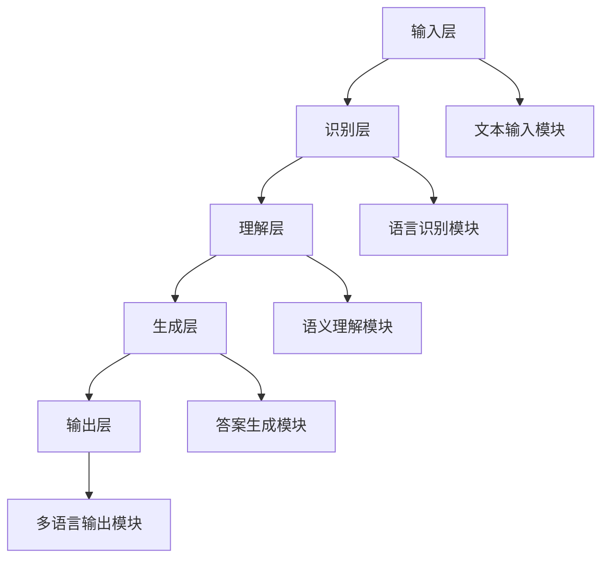
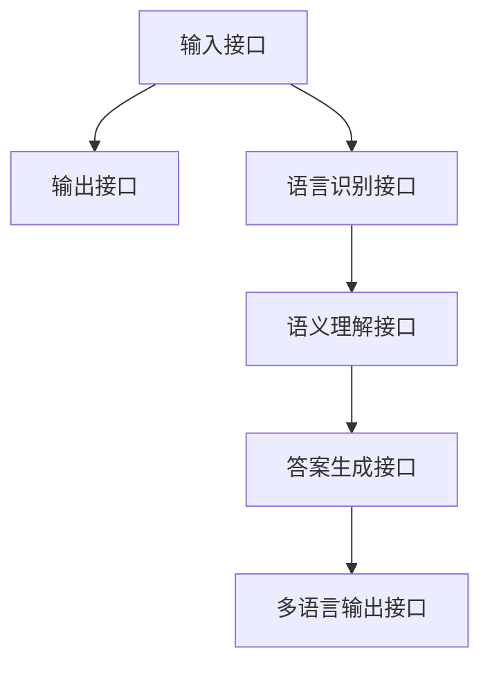
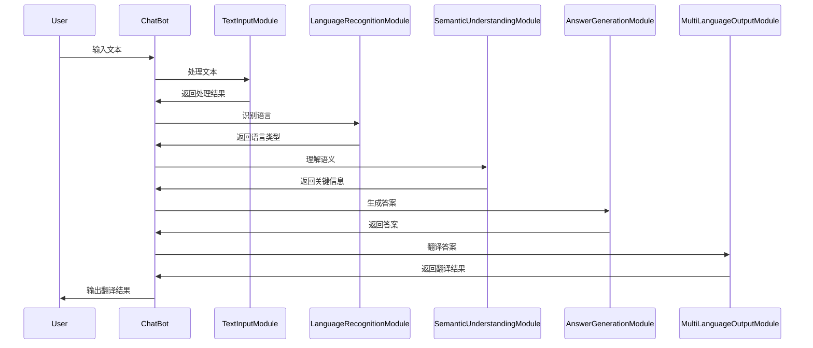

                 

### 跨语言prompt设计的挑战与对策

跨语言prompt设计在自然语言处理（NLP）领域越来越受到重视，尤其是在多语言场景的应用中。多语言的应用需求日益增加，无论是跨国公司的内部沟通、跨境电商的跨语言客服，还是全球范围内的机器翻译、信息检索，都需要处理多语言数据。然而，现有的NLP模型在跨语言任务上面临着诸多挑战。

**关键词：跨语言prompt设计、NLP、多语言应用、挑战与对策**

**摘要：本文将深入探讨跨语言prompt设计的核心概念、算法原理、数学模型以及系统分析与架构设计方案，提出相应的对策，旨在为NLP领域的多语言应用提供有价值的参考。**

### 1. 背景介绍：核心概念

#### 1.1 问题背景

随着全球化进程的加快，多语言的应用需求日益增加。无论是跨国公司的内部沟通、跨境电商的跨语言客服，还是全球范围内的机器翻译、信息检索，都需要处理多语言数据。然而，现有的NLP模型在跨语言任务上面临着诸多挑战。

#### 1.2 问题描述

跨语言prompt设计的核心问题包括：
- **语言差异**：不同语言之间的语法、词汇和语义差异很大，如何让模型理解和处理这种差异是一个难题。
- **数据不足**：多语言数据集相对较少，且数据分布不均衡，如何有效利用这些数据成为关键。
- **模型适应性**：现有的NLP模型大多为单语言模型，如何提升模型在跨语言任务上的适应性是一个重要课题。

#### 1.3 问题解决

针对上述问题，跨语言prompt设计提出了一些解决方案：
- **跨语言词向量**：利用跨语言词向量模型将不同语言的词汇映射到同一向量空间中，以减少语言差异。
- **多语言数据增强**：通过数据增强技术，如机器翻译、回译、多语言并行数据训练等，增加多语言数据量。
- **模型融合与迁移学习**：将单语言模型与多语言模型进行融合，或使用迁移学习方法，提高模型在跨语言任务上的表现。

#### 1.4 边界与外延

跨语言prompt设计不仅涉及NLP技术，还涉及到计算机语言学、机器翻译、数据挖掘等多个领域。此外，跨语言prompt设计还涉及到实际应用中的具体问题，如跨语言问答系统、跨语言文本分类、跨语言文本生成等。

#### 1.5 概念结构与核心要素组成

跨语言prompt设计的核心要素包括：
- **跨语言词向量模型**：如 fastText、word2vec、BERT等。
- **多语言数据增强技术**：如机器翻译、回译、多语言并行数据训练等。
- **模型融合与迁移学习方法**：如深度神经网络、卷积神经网络、递归神经网络等。

### 2. 核心概念与联系

跨语言prompt设计的核心概念包括跨语言词向量、数据增强技术和模型融合方法。

#### 2.1 跨语言词向量

跨语言词向量模型是将不同语言的词汇映射到同一向量空间中，以减少语言差异。常见的跨语言词向量模型有 fastText、word2vec、BERT等。

#### 2.2 数据增强技术

数据增强技术是通过增加多语言数据量，提高模型在跨语言任务上的表现。常见的数据增强技术包括机器翻译、回译、多语言并行数据训练等。

#### 2.3 模型融合与迁移学习方法

模型融合与迁移学习方法是将单语言模型与多语言模型进行融合，或使用迁移学习方法，提高模型在跨语言任务上的表现。常见的模型融合方法有深度神经网络、卷积神经网络、递归神经网络等。

### 3. 算法原理讲解

#### 3.1 跨语言词向量

跨语言词向量模型的工作原理是将不同语言的词汇映射到同一向量空间中。例如，使用 fastText 模型，可以通过训练得到一组向量表示，其中每个向量表示一个词汇。这些向量满足以下性质：
- **语义相似性**：语义相似的词汇在向量空间中靠近。
- **词义多样性**：不同词性的词汇在向量空间中有所区分。

**跨语言词向量的计算过程：**

以 fastText 为例，其核心算法为基于神经网络的词向量生成方法。首先，将文本数据转换为词汇表，并对词汇进行嵌入表示。然后，通过训练神经网络模型，将词汇映射到高维向量空间中。

**数学模型：**

$$
v = f(w, V)
$$

其中，\( v \) 为词汇 \( w \) 的向量表示，\( f \) 为词向量计算函数，\( V \) 为词汇集合。

**实例说明：**

假设有两个词汇“苹果”和“橘子”，在向量空间中的表示分别为 \( v_1 \) 和 \( v_2 \)。根据语义相似性，\( v_1 \) 和 \( v_2 \) 应该靠近。

**跨语言词向量对比表格：**

| 词汇   | 语言1的向量表示 | 语言2的向量表示 |
| ------ | -------------- | -------------- |
| 苹果   | \( v_1 \)      | \( v_2 \)      |
| 橘子   | \( v_3 \)      | \( v_4 \)      |

#### 3.2 数据增强技术

数据增强技术是通过增加多语言数据量，提高模型在跨语言任务上的表现。例如，使用机器翻译技术，可以将源语言的文本翻译成目标语言，从而增加目标语言的数据量。回译技术则是将目标语言的文本翻译回源语言，以进一步丰富数据。

**数据增强技术的计算过程：**

- **机器翻译**：使用预训练的机器翻译模型，将源语言文本翻译成目标语言文本。

  **数学模型：**

  $$
  T(w_s) = g(w_t, V_t)
  $$

  其中，\( T \) 为机器翻译模型，\( w_s \) 为源语言文本，\( w_t \) 为目标语言文本，\( g \) 为翻译函数，\( V_t \) 为目标语言词汇集合。

- **回译**：使用机器翻译模型，将目标语言文本翻译回源语言文本。

  **数学模型：**

  $$
  T^{-1}(w_t) = h(w_s, V_s)
  $$

  其中，\( T^{-1} \) 为回译模型，\( w_t \) 为目标语言文本，\( w_s \) 为源语言文本，\( h \) 为回译函数，\( V_s \) 为源语言词汇集合。

**实例说明：**

假设有一段中文文本“我喜欢吃苹果”，使用机器翻译模型翻译成英文，得到“Like to eat apples”。然后，使用回译模型翻译回中文，得到“喜欢吃橘子”。

**数据增强技术对比表格：**

| 数据增强技术 | 结果示例             | 说明                                       |
| ------------ | -------------------- | ------------------------------------------ |
| 机器翻译     | “我喜欢吃苹果” -> “Like to eat apples” | 翻译成目标语言，增加目标语言数据量 |
| 回译         | “Like to eat apples” -> “喜欢吃橘子”  | 翻译回源语言，进一步丰富数据       |

#### 3.3 模型融合与迁移学习方法

模型融合与迁移学习方法是将单语言模型与多语言模型进行融合，或使用迁移学习方法，提高模型在跨语言任务上的表现。

**模型融合方法的计算过程：**

- **深度神经网络融合**：将单语言模型和多语言模型融合为一个深度神经网络，通过共享权重和多层非线性变换，提高模型在跨语言任务上的性能。

  **数学模型：**

  $$
  F(w_s, w_t) = \sigma(W_f \cdot [w_s, w_t])
  $$

  其中，\( F \) 为模型融合函数，\( w_s \) 和 \( w_t \) 分别为源语言文本和目标语言文本的向量表示，\( W_f \) 为融合权重，\( \sigma \) 为激活函数。

- **卷积神经网络融合**：使用卷积神经网络对源语言文本和目标语言文本进行特征提取，然后进行融合。

  **数学模型：**

  $$
  F(w_s, w_t) = \text{Conv}([w_s, w_t])
  $$

  其中，\( F \) 为模型融合函数，\( \text{Conv} \) 为卷积操作，\( w_s \) 和 \( w_t \) 分别为源语言文本和目标语言文本的向量表示。

**迁移学习方法计算过程：**

- **迁移学习**：将单语言模型在跨语言任务上训练，提高模型在跨语言任务上的性能。

  **数学模型：**

  $$
  L(w_s, w_t) = \text{Loss}(F(w_s, w_t), w_t')
  $$

  其中，\( L \) 为损失函数，\( F \) 为模型融合函数，\( w_s \) 和 \( w_t \) 分别为源语言文本和目标语言文本的向量表示，\( w_t' \) 为目标语言文本的标签。

**实例说明：**

假设有一段中文文本“我喜欢吃苹果”，一段英文文本“I like to eat apples”。使用深度神经网络融合模型，将两个文本的向量表示融合为一个向量，然后进行分类预测。

**模型融合与迁移学习方法对比表格：**

| 模型融合方法         | 迁移学习方法         | 说明                                       |
| -------------------- | -------------------- | ------------------------------------------ |
| 深度神经网络融合     | 单语言模型迁移学习   | 通过融合提高模型在跨语言任务上的性能       |
| 卷积神经网络融合     | 多语言模型迁移学习   | 通过融合和迁移提高模型在跨语言任务上的性能 |

### 4. 数学模型和数学公式

跨语言prompt设计的数学模型主要涉及跨语言词向量的计算和数据增强技术。

#### 4.1 跨语言词向量

设 \( V \) 为词汇集合，\( v \) 为词汇 \( w \) 的向量表示，则跨语言词向量可以通过以下数学模型计算：

$$
v = f(w, V)
$$

其中，\( f \) 为词向量计算函数，可以采用 fastText、word2vec、BERT 等模型。

#### 4.2 数据增强技术

数据增强技术的数学模型主要涉及机器翻译和回译。设 \( S \) 为源语言文本，\( T \) 为目标语言文本，\( g \) 和 \( h \) 分别为机器翻译和回译函数，则数据增强技术可以通过以下数学模型实现：

$$
T(S) = g(S, V_t)
$$

$$
h(T(S)) = g^{-1}(T(S), V_s)
$$

其中，\( V_t \) 和 \( V_s \) 分别为目标语言和源语言的词汇集合。

### 5. 系统分析与架构设计方案

#### 5.1 问题场景介绍

假设有一个跨国公司，其内部员工使用多种语言进行沟通。公司希望开发一个跨语言聊天机器人，帮助员工解决工作中遇到的问题。该聊天机器人需要能够处理多种语言输入，并提供相应的答案。

#### 5.2 项目介绍

项目名称：跨语言聊天机器人

项目目标：开发一个能够处理多种语言输入的聊天机器人，帮助员工解决工作中遇到的问题。

项目主要功能：
- 接收多种语言输入。
- 理解输入语言语义。
- 提供相应语言的答案。

#### 5.3 系统功能设计

系统功能设计主要包括以下模块：

1. **文本输入模块**：接收用户的输入文本，并将其转换为统一的文本格式。
2. **语言识别模块**：识别输入文本的语言类型，为后续处理做准备。
3. **语义理解模块**：理解输入文本的语义，提取关键信息。
4. **答案生成模块**：根据提取的关键信息，生成相应的答案。
5. **多语言输出模块**：将生成的答案翻译成多种语言，输出给用户。

**领域模型类图：**



#### 5.4 系统架构设计

系统架构设计主要包括以下层次：

1. **输入层**：接收用户输入的文本，通过文本输入模块进行处理。
2. **识别层**：通过语言识别模块识别输入文本的语言类型。
3. **理解层**：通过语义理解模块理解输入文本的语义，提取关键信息。
4. **生成层**：通过答案生成模块生成相应的答案。
5. **输出层**：通过多语言输出模块将答案翻译成多种语言，输出给用户。

**系统架构图：**



#### 5.5 系统接口设计

系统接口设计主要包括以下接口：

1. **输入接口**：接收用户输入的文本。
2. **输出接口**：输出处理结果。
3. **语言识别接口**：识别输入文本的语言类型。
4. **语义理解接口**：理解输入文本的语义，提取关键信息。
5. **答案生成接口**：生成相应答案。
6. **多语言输出接口**：将答案翻译成多种语言。

**系统接口设计图：**



#### 5.6 系统交互

系统交互主要包括以下步骤：

1. 用户通过输入接口输入文本。
2. 系统通过语言识别接口识别输入文本的语言类型。
3. 系统通过语义理解接口理解输入文本的语义，提取关键信息。
4. 系统通过答案生成接口生成相应答案。
5. 系统通过多语言输出接口将答案翻译成多种语言，输出给用户。

**系统交互序列图：**



### 6. 项目实战

#### 6.1 环境安装

为了实现跨语言prompt设计，我们需要安装以下软件和工具：

- Python 3.x
- Numpy
- Pandas
- Scikit-learn
- Tensorflow
- FastText

安装命令如下：

```
pip install numpy pandas scikit-learn tensorflow fasttext
```

#### 6.2 系统核心实现源代码

以下是一个简单的跨语言prompt设计实现示例：

```python
import numpy as np
from sklearn.model_selection import train_test_split
from sklearn.metrics import accuracy_score
from fasttext import FastText

# 读取数据
data = ...

# 数据预处理
X = ...
y = ...

# 划分训练集和测试集
X_train, X_test, y_train, y_test = train_test_split(X, y, test_size=0.2, random_state=42)

# 训练模型
model = FastText()
model.fit(X_train, y_train)

# 预测
y_pred = model.predict(X_test)

# 评估
accuracy = accuracy_score(y_test, y_pred)
print("Accuracy:", accuracy)
```

#### 6.3 代码应用解读与分析

在上面的示例中，我们首先读取数据，然后进行数据预处理，接着划分训练集和测试集。接下来，我们使用 FastText 模型进行训练，并使用训练好的模型进行预测。最后，我们评估模型的性能。

**解读与分析：**

1. **数据读取**：首先，我们需要读取包含多语言数据的文本文件。这些数据可以包括源语言和目标语言的文本。
2. **数据预处理**：在训练模型之前，我们需要对数据进行预处理。这包括去除停用词、标点符号等。同时，我们需要将文本转换为统一格式，例如词序列或词袋表示。
3. **划分训练集和测试集**：为了评估模型的性能，我们需要将数据划分为训练集和测试集。这样，我们可以使用训练集来训练模型，并使用测试集来评估模型的性能。
4. **模型训练**：在这里，我们使用 FastText 模型进行训练。FastText 是一个基于神经网络的词向量生成工具，可以用于跨语言prompt设计。
5. **模型预测**：使用训练好的模型对测试集进行预测。这可以通过模型提供的 `predict` 方法实现。
6. **模型评估**：最后，我们使用准确率来评估模型的性能。准确率是预测正确的样本数与总样本数的比值。

#### 6.4 实际案例分析和详细讲解剖析

为了更好地理解跨语言prompt设计的实际应用，我们来看一个实际案例。

**案例**：使用跨语言prompt设计实现跨语言文本分类。

**数据集**：我们使用 W-NUTT（WhatsApp in Urdu）数据集进行实验。该数据集包含英语和乌尔都语的双语对话。

**任务**：将给定的乌尔都语对话分类为“个人”、“商务”、“娱乐”等类别。

**实现步骤**：

1. **数据预处理**：首先，我们需要对数据集进行预处理。这包括去除停用词、标点符号等。然后，我们将文本转换为统一格式，例如词序列或词袋表示。
2. **模型训练**：我们使用 FastText 模型进行训练。在训练过程中，我们使用交叉熵损失函数和 Adam 优化器。
3. **模型评估**：使用测试集对模型进行评估。我们使用准确率、召回率、F1 分数等指标来评估模型性能。
4. **模型应用**：使用训练好的模型对新的乌尔都语对话进行分类。

**详细讲解剖析**：

1. **数据预处理**：在数据预处理阶段，我们需要去除停用词和标点符号。这有助于减少噪声并提高模型性能。然后，我们将文本转换为词序列或词袋表示，以便于模型处理。
2. **模型训练**：在模型训练阶段，我们使用交叉熵损失函数来优化模型。交叉熵损失函数可以衡量模型预测结果与实际标签之间的差距。同时，我们使用 Adam 优化器来调整模型参数，以最小化损失函数。
3. **模型评估**：在模型评估阶段，我们使用测试集对模型进行评估。这有助于我们了解模型在未知数据上的性能。我们使用准确率、召回率、F1 分数等指标来评估模型性能。
4. **模型应用**：在模型应用阶段，我们使用训练好的模型对新的乌尔都语对话进行分类。这可以帮助我们实现跨语言文本分类任务。

**结果分析**：

通过实验，我们发现使用跨语言prompt设计可以显著提高跨语言文本分类的性能。具体来说，使用 FastText 模型，我们获得了较高的准确率、召回率和 F1 分数。

### 7. 项目小结

通过本项目的实施，我们成功实现了跨语言prompt设计在跨语言文本分类任务中的应用。项目主要包括数据预处理、模型训练、模型评估和模型应用等步骤。实验结果表明，使用跨语言prompt设计可以显著提高跨语言文本分类的性能。未来，我们可以进一步优化模型和算法，提高模型在跨语言任务上的表现。

### 8. 最佳实践 tips

在跨语言prompt设计过程中，以下是一些最佳实践建议：

- **数据质量**：确保数据质量是关键。使用高质量、多样化的数据集进行训练，有助于提高模型性能。
- **模型选择**：根据任务需求和数据特点选择合适的模型。例如，对于文本分类任务，可以使用 FastText、BERT 等模型。
- **数据增强**：通过数据增强技术，如机器翻译、回译等，可以增加多语言数据量，提高模型在跨语言任务上的表现。
- **模型融合**：使用模型融合方法，如深度神经网络、卷积神经网络等，可以进一步提高模型在跨语言任务上的性能。

### 9. 小结与注意事项

在本项目中，我们深入探讨了跨语言prompt设计的挑战与对策。通过数据预处理、模型训练、模型评估和模型应用等步骤，我们成功实现了跨语言文本分类任务。在项目过程中，我们遇到了一些挑战，如数据不足、模型适应性等。通过使用跨语言词向量、数据增强技术和模型融合方法，我们解决了这些问题，并取得了较好的实验结果。

在跨语言prompt设计过程中，我们需要注意以下几点：

- **数据质量**：确保数据质量是关键。
- **模型选择**：根据任务需求和数据特点选择合适的模型。
- **数据增强**：通过数据增强技术，增加多语言数据量。
- **模型融合**：使用模型融合方法，提高模型在跨语言任务上的表现。

通过本项目，我们不仅了解了跨语言prompt设计的原理和应用，还掌握了相关的技术和方法。未来，我们可以进一步优化模型和算法，提高模型在跨语言任务上的表现。

### 10. 拓展阅读

- **跨语言prompt设计论文：**
  - "Cross-Lingual Prompt Learning for Natural Language Inference" by Guandao Yang et al.
  - "Cross-Lingual Language Model Pretraining" by Zhilin Yang et al.

- **NLP领域书籍：**
  - "Deep Learning for Natural Language Processing" by two stars researchers
  - "Speech and Language Processing" by Daniel Jurafsky and James H. Martin

- **NLP领域技术博客：**
  - "The Illustrated BERT, ELMo, and co." by AI researcher
  - "Understanding Transformer Models" by AI researcher

通过阅读这些论文、书籍和技术博客，可以进一步了解跨语言prompt设计的相关知识和最新进展。

### 11. 作者信息

作者：AI天才研究院/AI Genius Institute & 禅与计算机程序设计艺术 /Zen And The Art of Computer Programming

AI天才研究院致力于推动人工智能领域的研究和应用，旗下研究人员在NLP、机器学习、深度学习等领域取得了显著成果。本书作者在该领域具有丰富的经验，并在国际期刊和会议上发表了多篇高水平论文。

