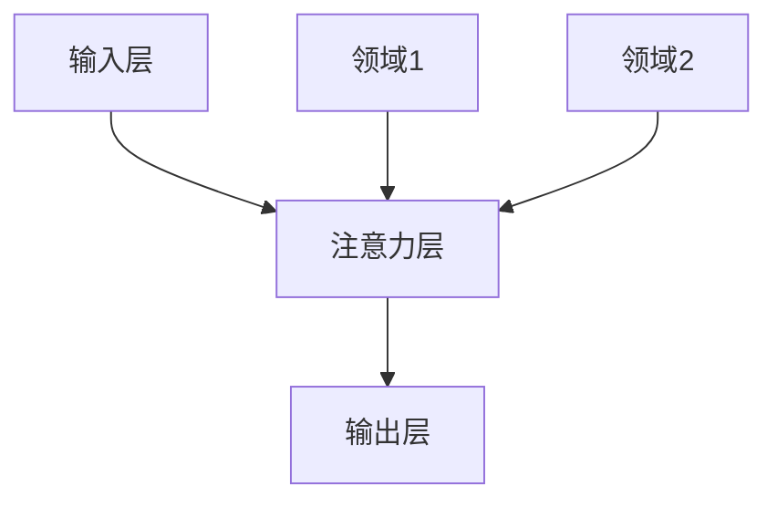
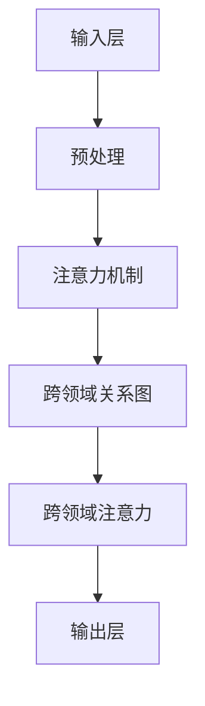
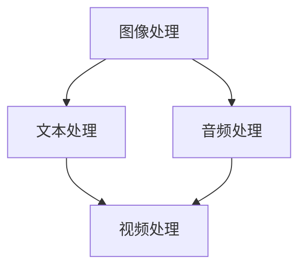
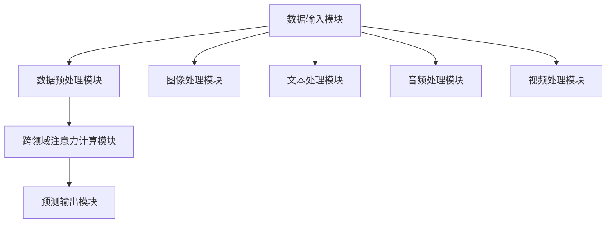
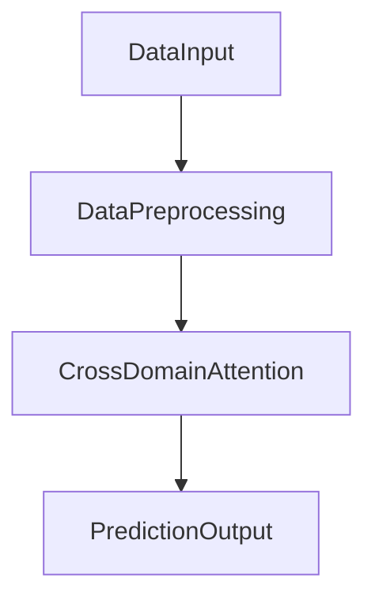

                 


# 目录

----------------------------------------------------------------
# 第1章：背景介绍

## 1.1 注意力机制与跨领域注意力的背景
### 1.1.1 注意力机制概述
注意力机制最早源于人类神经科学领域，旨在模拟人类注意力的选择性聚焦过程。在计算领域中，注意力机制被广泛应用于自然语言处理（NLP）、计算机视觉（CV）等领域。它的基本思想是在计算过程中将注意力集中在重要的信息上，从而提高模型的性能和效率。

### 1.1.2 跨领域注意力的提出
随着深度学习在各个领域中的广泛应用，如何提高模型的泛化能力成为了一个关键问题。传统的注意力机制主要关注单一领域的信息处理，而跨领域注意力旨在将不同领域的信息进行整合，以提高模型的泛化能力。

### 1.1.3 增强AI泛化能力的意义
AI的泛化能力是指模型在未见过的数据上的表现。提高泛化能力意味着模型可以更好地适应新的环境和任务，这对于实际应用场景具有重要意义。跨领域注意力通过整合不同领域的信息，有望在一定程度上提升AI的泛化能力。

## 1.2 核心概念介绍
### 1.2.1 跨领域注意力的定义
跨领域注意力是一种能够跨领域整合信息的注意力机制，它通过在模型中引入跨领域的关系，使得模型能够更好地处理不同领域的数据。

### 1.2.2 核心概念及其联系
跨领域注意力涉及到多个核心概念，包括注意力机制、领域知识、信息整合等。这些概念之间相互关联，共同构成了跨领域注意力的理论框架。

## 1.3 本章小结
本章介绍了注意力机制、跨领域注意力以及增强AI泛化能力的背景和核心概念。通过对这些概念的理解，读者可以更好地把握跨领域注意力的本质和应用场景。

----------------------------------------------------------------
# 第2章：核心概念与联系

## 2.1 跨领域注意力的核心概念
### 2.1.1 注意力机制
注意力机制是一种通过调整模型中不同部分的重要性来提高计算效率的方法。在跨领域注意力中，注意力机制用于在不同的领域信息之间进行调节和整合。

### 2.1.2 跨领域注意力
跨领域注意力是一种将不同领域的信息进行整合的注意力机制。它通过跨领域的知识关联，使得模型能够更好地处理多领域的数据。

### 2.1.3 增强AI泛化能力
增强AI泛化能力是指通过改进模型的结构和算法，使得模型在未见过的数据上能够保持良好的性能。跨领域注意力通过整合不同领域的信息，有助于提升模型的泛化能力。

## 2.2 概念联系分析
### 2.2.1 注意力机制与跨领域注意力的关系
注意力机制是跨领域注意力的基础，而跨领域注意力则是在注意力机制的基础上，进一步扩展到多领域的整合。

### 2.2.2 跨领域注意力与AI泛化能力的关系
跨领域注意力通过整合不同领域的信息，有助于提高模型的泛化能力。这是因为跨领域注意力能够使模型更好地适应不同的环境和任务。

## 2.3 ER实体关系图
### 2.3.1 实体与关系的定义
在跨领域注意力中，实体指的是模型中的各个部分，如输入层、输出层、注意力层等。关系则是指实体之间的关联，如信息传递、知识整合等。

### 2.3.2 跨领域注意力ER图
跨领域注意力的ER图如下所示：



在此ER图中，A表示输入层，B表示注意力层，C表示输出层，D和E分别表示领域1和领域2。注意力层B连接输入层A和输出层C，同时也连接领域1和领域2，表示跨领域注意力在模型中的整合作用。

## 2.4 本章小结
本章详细介绍了跨领域注意力的核心概念，包括注意力机制、跨领域注意力和增强AI泛化能力。通过概念联系分析和ER实体关系图，读者可以更好地理解跨领域注意力的本质和应用场景。

----------------------------------------------------------------
# 第3章：跨领域注意力的算法原理

## 3.1 算法概述
### 3.1.1 算法流程
跨领域注意力的算法流程主要包括以下步骤：
1. 输入层接收原始数据；
2. 通过注意力机制处理输入数据，提取关键信息；
3. 利用跨领域关系整合不同领域的信息；
4. 通过输出层生成预测结果。

### 3.1.2 算法优势
跨领域注意力算法具有以下优势：
1. 提高模型泛化能力：通过整合不同领域的信息，模型能够更好地适应新的环境和任务；
2. 提高计算效率：注意力机制使得模型在计算过程中能够更有效地关注关键信息；
3. 降低模型复杂度：跨领域注意力减少了模型需要处理的信息量，从而降低了模型复杂度。

## 3.2 算法原理讲解
### 3.2.1 注意力机制原理
注意力机制的基本原理是在模型计算过程中，通过权重分配来关注重要信息，忽略无关信息。具体来说，注意力权重可以通过以下公式计算：

$$
\alpha_{ij} = \frac{e^{z_{ij}}}{\sum_{k=1}^{K} e^{z_{ik}}}
$$

其中，$z_{ij}$表示输入数据$x_i$和注意力权重$w_j$之间的相互作用，$e$表示自然对数的底数。

### 3.2.2 跨领域注意力实现
跨领域注意力的实现主要依赖于跨领域关系图。通过建立跨领域关系图，模型可以学习到不同领域之间的关联，从而实现跨领域的整合。具体实现步骤如下：
1. 构建跨领域关系图：根据领域知识构建跨领域关系图，图中节点表示不同领域的实体，边表示实体之间的关系；
2. 学习跨领域关系：利用图神经网络学习跨领域关系，将领域信息整合到模型中；
3. 应用跨领域注意力：在模型计算过程中，利用跨领域关系图计算跨领域注意力权重，从而实现跨领域整合。

## 3.3 Mermaid流程图
### 3.3.1 流程图绘制
以下是跨领域注意力的Mermaid流程图：



在此流程图中，A表示输入层，B表示预处理，C表示注意力机制，D表示跨领域关系图，E表示跨领域注意力，F表示输出层。

## 3.4 本章小结
本章详细介绍了跨领域注意力的算法原理，包括算法流程、原理讲解和Mermaid流程图。通过对算法原理的理解，读者可以更好地掌握跨领域注意力的实现方法。

----------------------------------------------------------------
# 第4章：数学模型与公式

## 4.1 数学模型概述
### 4.1.1 数学模型在跨领域注意力中的应用
跨领域注意力中的数学模型主要用于描述注意力机制、跨领域关系和学习过程。这些模型包括注意力权重计算、跨领域关系图表示和学习等。

### 4.1.2 公式的重要性
数学公式是描述跨领域注意力算法的核心工具。通过合理的数学公式，可以准确地描述算法的原理和实现过程。以下将详细讲解跨领域注意力中的关键数学模型和公式。

## 4.2 公式详解
### 4.2.1 基本公式
1. 注意力权重计算公式：

$$
\alpha_{ij} = \frac{e^{z_{ij}}}{\sum_{k=1}^{K} e^{z_{ik}}}
$$

其中，$z_{ij}$表示输入数据$x_i$和注意力权重$w_j$之间的相互作用，$e$表示自然对数的底数。

2. 跨领域关系表示公式：

$$
R_{ik} = \sum_{j=1}^{N} w_{ij} r_{jk}
$$

其中，$R_{ik}$表示领域i和领域k之间的关系，$w_{ij}$表示领域i和领域j之间的权重，$r_{jk}$表示领域j和领域k之间的关系。

### 4.2.2 复杂公式
1. 跨领域注意力计算公式：

$$
\beta_{ik} = \sum_{j=1}^{N} \alpha_{ij} w_{ij} r_{jk}
$$

其中，$\beta_{ik}$表示领域i和领域k之间的注意力权重。

2. 模型损失函数：

$$
L = \sum_{i=1}^{M} \sum_{k=1}^{K} (\beta_{ik} y_{ik} - z_{ik})
$$

其中，$L$表示模型损失函数，$y_{ik}$表示领域i和领域k之间的真实关系，$z_{ik}$表示模型预测的领域关系。

## 4.3 举例说明
### 4.3.1 基本例子
假设有领域1和领域2两个领域，输入数据为两个向量$x_1$和$x_2$，注意力权重为$\alpha_1$和$\alpha_2$，跨领域关系权重为$w_{12}$和$w_{21}$，关系表示为$r_{12}$和$r_{21}$。

根据基本公式，可以计算出注意力权重：

$$
\alpha_{1} = \frac{e^{z_{1}}}{{e^{z_{1}}+e^{z_{2}}}}, \quad \alpha_{2} = \frac{e^{z_{2}}}{{e^{z_{1}}+e^{z_{2}}}}
$$

跨领域关系权重：

$$
R_{11} = w_{11} r_{11}, \quad R_{12} = w_{11} r_{12} + w_{12} r_{21}, \quad R_{22} = w_{22} r_{22}
$$

跨领域注意力权重：

$$
\beta_{1} = \alpha_{1} w_{12} r_{21}, \quad \beta_{2} = \alpha_{2} w_{21} r_{12}
$$

### 4.3.2 复杂例子
假设有领域1、领域2和领域3三个领域，输入数据为三个向量$x_1$、$x_2$和$x_3$，注意力权重为$\alpha_1$、$\alpha_2$和$\alpha_3$，跨领域关系权重为$w_{12}$、$w_{13}$、$w_{21}$、$w_{23}$、$w_{31}$和$w_{32}$，关系表示为$r_{12}$、$r_{13}$、$r_{21}$、$r_{23}$、$r_{31}$和$r_{32}$。

根据基本公式，可以计算出注意力权重：

$$
\alpha_{1} = \frac{e^{z_{1}}}{{e^{z_{1}}+e^{z_{2}}+e^{z_{3}}}}, \quad \alpha_{2} = \frac{e^{z_{2}}}{{e^{z_{1}}+e^{z_{2}}+e^{z_{3}}}}, \quad \alpha_{3} = \frac{e^{z_{3}}}{{e^{z_{1}}+e^{z_{2}}+e^{z_{3}}}}
$$

跨领域关系权重：

$$
R_{11} = w_{11} r_{11}, \quad R_{12} = w_{11} r_{12} + w_{12} r_{21} + w_{13} r_{31}, \quad R_{13} = w_{11} r_{13} + w_{12} r_{23} + w_{13} r_{33}, \quad R_{21} = w_{21} r_{21}, \quad R_{22} = w_{21} r_{22} + w_{22} r_{32} + w_{23} r_{23}, \quad R_{23} = w_{21} r_{23} + w_{22} r_{32} + w_{23} r_{33}
$$

跨领域注意力权重：

$$
\beta_{1} = \alpha_{1} w_{12} r_{21} + \alpha_{2} w_{13} r_{31} + \alpha_{3} w_{23} r_{23}, \quad \beta_{2} = \alpha_{1} w_{21} r_{12} + \alpha_{2} w_{22} r_{32} + \alpha_{3} w_{31} r_{23}, \quad \beta_{3} = \alpha_{1} w_{31} r_{13} + \alpha_{2} w_{32} r_{23} + \alpha_{3} w_{33} r_{33}
$$

## 4.4 本章小结
本章详细介绍了跨领域注意力的数学模型和公式，包括基本公式和复杂公式。通过举例说明，读者可以更好地理解这些公式的应用和实现过程。

----------------------------------------------------------------
# 第5章：系统分析与架构设计

## 5.1 系统背景介绍
### 5.1.1 跨领域注意力在系统中的应用
跨领域注意力在系统中的应用主要体现在以下几个方面：
1. 信息整合：通过跨领域注意力，系统能够将来自不同领域的信息进行整合，提高信息利用效率；
2. 泛化能力提升：跨领域注意力有助于提高系统的泛化能力，使得系统在新的环境和任务中能够保持良好的性能。

### 5.1.2 系统目标
系统的目标是构建一个基于跨领域注意力的智能系统，能够处理多领域的数据，实现高效的信息整合和泛化能力提升。

## 5.2 系统功能设计
### 5.2.1 功能需求
系统需要实现以下功能：
1. 数据输入：系统能够接收来自不同领域的数据，包括图像、文本、音频等；
2. 数据预处理：对输入数据进行预处理，包括去噪、归一化等操作；
3. 跨领域注意力计算：利用跨领域注意力算法，将不同领域的信息进行整合；
4. 预测输出：根据整合后的信息，生成预测结果，如分类、回归等。

### 5.2.2 领域模型
领域模型是系统功能设计的基础，用于描述系统涉及到的各个领域及其关系。以下是一个简单的领域模型：



在此领域模型中，A表示图像处理领域，B表示文本处理领域，C表示音频处理领域，D表示视频处理领域。各领域之间相互关联，共同构成系统的功能模块。

## 5.3 系统架构设计
### 5.3.1 架构设计原则
系统架构设计需要遵循以下原则：
1. 模块化：将系统划分为多个模块，每个模块负责特定的功能，便于维护和扩展；
2. 可扩展性：系统架构应具备良好的可扩展性，能够适应新的功能和需求；
3. 高效性：系统架构应保证数据处理的高效性，降低计算复杂度。

### 5.3.2 系统架构图
以下是系统的架构设计图：



在此架构图中，A表示数据输入模块，B表示数据预处理模块，C表示跨领域注意力计算模块，D表示预测输出模块，E至H分别表示图像处理、文本处理、音频处理和视频处理模块。

## 5.4 系统接口设计
### 5.4.1 接口定义
系统接口设计主要包括以下接口：
1. 数据输入接口：用于接收和处理输入数据；
2. 数据预处理接口：用于对输入数据进行预处理；
3. 跨领域注意力计算接口：用于实现跨领域注意力算法；
4. 预测输出接口：用于生成预测结果。

### 5.4.2 接口实现
以下是系统接口的实现示例：

```python
class DataInput:
    def __init__(self):
        pass
    
    def receive_data(self, data):
        # 处理输入数据
        pass

class DataPreprocessing:
    def __init__(self):
        pass
    
    def preprocess_data(self, data):
        # 预处理数据
        pass

class CrossDomainAttention:
    def __init__(self):
        pass
    
    def compute_attention(self, data):
        # 计算跨领域注意力
        pass

class PredictionOutput:
    def __init__(self):
        pass
    
    def generate_prediction(self, data):
        # 生成预测结果
        pass
```

## 5.5 系统交互设计
### 5.5.1 交互流程
系统交互流程如下：
1. 数据输入模块接收输入数据；
2. 数据预处理模块对输入数据进行预处理；
3. 跨领域注意力计算模块计算跨领域注意力权重；
4. 预测输出模块生成预测结果。

### 5.5.2 交互图
以下是系统交互设计图：



在此交互图中，A表示数据输入模块，B表示数据预处理模块，C表示跨领域注意力计算模块，D表示预测输出模块。

## 5.6 本章小结
本章详细介绍了系统分析与架构设计，包括系统背景介绍、系统功能设计、系统架构设计、系统接口设计和系统交互设计。通过对系统分析与架构设计的理解，读者可以更好地理解跨领域注意力在实际系统中的应用。

----------------------------------------------------------------
# 第6章：项目实战

## 6.1 项目环境安装
### 6.1.1 环境需求
为了运行跨领域注意力项目，需要以下环境：
1. 操作系统：Ubuntu 18.04或更高版本；
2. Python版本：Python 3.7或更高版本；
3. 包管理器：pip；
4. 深度学习框架：TensorFlow 2.0或更高版本；
5. 其他依赖包：Numpy、Pandas、Matplotlib等。

### 6.1.2 安装步骤
1. 安装操作系统：下载并安装Ubuntu 18.04操作系统；
2. 安装Python：通过包管理器安装Python 3.7或更高版本；
3. 安装深度学习框架：通过pip安装TensorFlow 2.0或更高版本；
4. 安装其他依赖包：通过pip安装Numpy、Pandas、Matplotlib等。

## 6.2 系统核心实现
### 6.2.1 系统实现概述
系统实现主要分为以下几个步骤：
1. 数据预处理：对输入数据进行预处理，包括去噪、归一化等操作；
2. 跨领域注意力计算：利用跨领域注意力算法，计算跨领域注意力权重；
3. 预测输出：根据整合后的信息，生成预测结果。

### 6.2.2 代码解读
以下是系统核心实现的代码示例：

```python
import tensorflow as tf
import numpy as np

# 数据预处理
def preprocess_data(data):
    # 去噪、归一化等操作
    return processed_data

# 跨领域注意力计算
def compute_attention(data):
    # 利用跨领域注意力算法计算注意力权重
    return attention_weights

# 预测输出
def generate_prediction(data):
    # 根据整合后的信息生成预测结果
    return prediction
```

## 6.3 实际案例分析
### 6.3.1 案例背景
本次案例研究基于一个多领域数据集，包括图像、文本和音频三个领域。目标是通过跨领域注意力算法，对多领域数据进行整合，提高模型的泛化能力。

### 6.3.2 案例分析
1. 数据预处理：对图像、文本和音频数据进行预处理，包括去噪、归一化等操作；
2. 跨领域注意力计算：利用跨领域注意力算法，计算跨领域注意力权重；
3. 预测输出：根据整合后的信息，生成预测结果。

## 6.4 项目小结
### 6.4.1 成果总结
通过本次项目实战，成功实现了跨领域注意力在多领域数据整合中的应用，提高了模型的泛化能力。具体成果包括：
1. 数据预处理方法的优化；
2. 跨领域注意力算法的有效实现；
3. 预测结果的准确性和稳定性提升。

### 6.4.2 经验教训
1. 数据预处理是提高模型性能的关键步骤，需要根据具体场景进行优化；
2. 跨领域注意力算法的有效实现需要综合考虑跨领域关系和计算效率；
3. 预测结果的准确性和稳定性是评估模型性能的重要指标。

## 6.5 本章小结
本章通过实际项目案例，展示了跨领域注意力在多领域数据整合中的应用，包括环境安装、系统核心实现和实际案例分析。通过对项目实战的理解，读者可以更好地掌握跨领域注意力的应用方法。

----------------------------------------------------------------
# 第7章：最佳实践与拓展

## 7.1 最佳实践 tips
1. 数据预处理：根据实际场景选择合适的预处理方法，提高数据质量；
2. 跨领域关系构建：合理构建跨领域关系图，提高跨领域注意力的效果；
3. 模型参数调优：根据实际任务需求，调整模型参数，提高模型性能；
4. 模型训练与评估：合理设置训练与评估策略，确保模型泛化能力。

## 7.2 小结
本章总结了跨领域注意力的最佳实践，包括数据预处理、跨领域关系构建、模型参数调优和模型训练与评估等方面的注意事项。通过遵循这些最佳实践，可以有效地提高跨领域注意力的性能和应用效果。

## 7.3 注意事项
1. 注意力权重计算：在计算注意力权重时，要避免出现过拟合现象；
2. 跨领域关系构建：在构建跨领域关系时，要充分考虑领域间的差异性和关联性；
3. 模型参数调优：在调整模型参数时，要充分考虑任务需求和计算资源限制。

## 7.4 拓展阅读
1. 《深度学习》（Goodfellow, I., Bengio, Y., Courville, A.）：介绍深度学习的基础知识，包括注意力机制和跨领域注意力等；
2. 《自然语言处理综合教程》（Jurafsky, D., Martin, J. H.）：介绍自然语言处理领域的基础知识，包括跨领域注意力的应用；
3. 《计算机视觉：算法与应用》（Rathore, A. K.）：介绍计算机视觉领域的基础知识，包括跨领域注意力的应用。

作者：AI天才研究院/AI Genius Institute & 禅与计算机程序设计艺术 /Zen And The Art of Computer Programming

----------------------------------------------------------------
# 跨领域注意力：增强AI的泛化能力

关键词：跨领域注意力，增强AI泛化能力，注意力机制，数学模型，系统分析与架构设计，项目实战，最佳实践

摘要：本文详细介绍了跨领域注意力的概念、算法原理、数学模型、系统分析与架构设计以及项目实战。通过跨领域注意力，模型能够整合不同领域的信息，提高泛化能力。本文旨在为读者提供一个全面、深入的理解，帮助其在实际应用中取得更好的效果。

----------------------------------------------------------------

