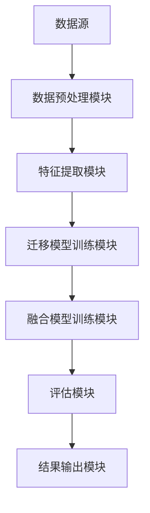
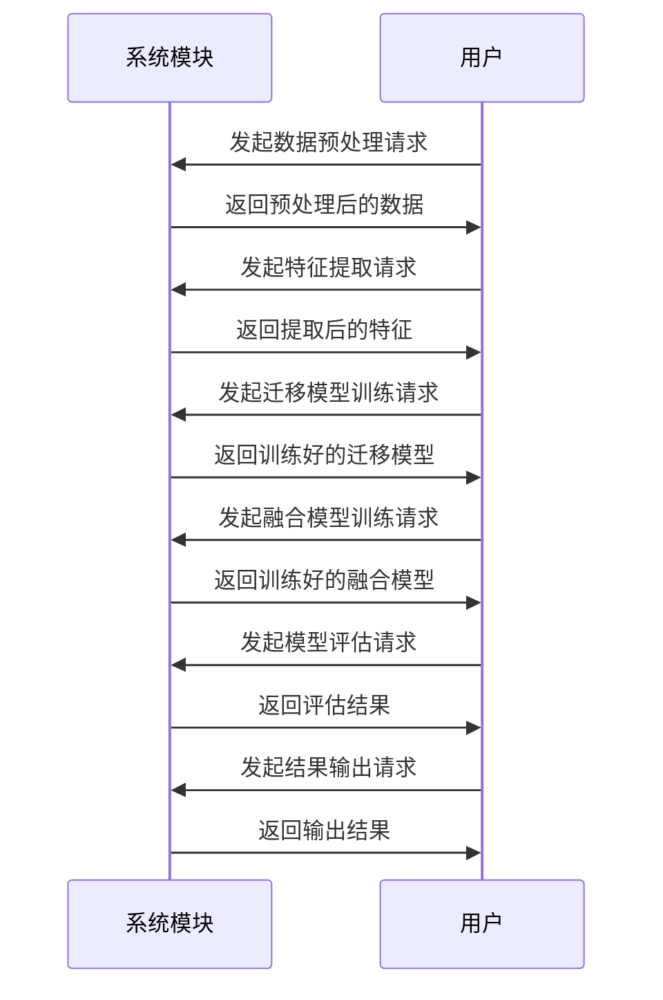

                 

### 文章标题

# 跨领域知识应用：测试LLM的知识迁移和融合能力

---

### 关键词

- 跨领域知识应用
- 大型语言模型（LLM）
- 知识迁移
- 知识融合
- 测试
- 人工智能
- 测试工具

---

### 摘要

本文深入探讨跨领域知识在人工智能领域中的应用，特别是如何通过测试大型语言模型（LLM）的知识迁移和融合能力来提升其表现。文章首先介绍了跨领域知识应用的重要性以及LLM的基础概念，然后详细解析了知识迁移和知识融合的核心原理与机制。通过具体的算法原理讲解，文章展示了如何使用mermaid流程图和Python源代码来实现知识迁移和融合算法，并使用LaTeX格式详细阐述了相关的数学模型和公式。接着，文章讨论了系统分析与架构设计方案，包括领域模型、架构图、接口设计和交互序列图。随后，通过项目实战部分，详细介绍了环境安装、系统实现、代码解读和案例分析。文章最后提供了最佳实践技巧、注意事项和拓展阅读，以帮助读者深入理解并应用这些技术。

---

### 目录大纲设计思路

为了设计出《跨领域知识应用：测试LLM的知识迁移和融合能力》这本书的完整目录大纲，我们需要遵循以下步骤：

1. **确定核心主题**：首先，明确书的核心主题和目标。本书旨在探讨跨领域知识的应用，特别是通过测试大型语言模型（LLM）的知识迁移和融合能力来实现这一目标。

2. **章节划分**：将整个书籍的内容按照逻辑顺序划分为几个部分，确保每个章节都有明确的主题和目标。

3. **细化每个章节**：在每个章节下，进一步细分内容，确保每个小节都有具体的内容和目标，避免内容过于笼统。

4. **保持内容的完整性**：确保书籍的目录大纲中包含了核心概念与联系、算法原理讲解、数学模型和公式、系统分析与架构设计方案、项目实战等核心部分。

5. **注意简洁性**：在保证内容完整性的同时，避免过多的冗余信息，保持大纲的简洁性。

6. **遵循目录层级规则**：确保目录结构清晰，使用 #, ##, ### 等markdown格式来表示目录层级。

---

### 目录大纲具体设计

**第一部分：背景介绍与核心概念**

- **第1章：跨领域知识应用概述**

  - 1.1 跨领域知识应用的重要性
    - 跨领域知识在现代社会中的应用场景
    - 跨领域知识对企业竞争力的提升
  - 1.2 LLMS与知识迁移
    - LLMS的定义与特点
    - 知识迁移的概念与挑战
  - 1.3 LLMS的知识融合能力
    - 知识融合的定义与机制
    - 知识融合的优势与应用

**第二部分：核心概念与联系**

- **第2章：核心概念原理**

  - 2.1 知识图谱
    - 知识图谱的概念与作用
    - 知识图谱的属性特征对比表格
    - 知识图谱的ER实体关系图架构
  - 2.2 知识融合算法
    - 知识融合算法的原理
    - 知识融合算法的属性特征对比表格
    - 知识融合算法的ER实体关系图架构

**第三部分：算法原理讲解**

- **第3章：LLM的知识迁移与融合算法**

  - 3.1 知识迁移算法
    - 知识迁移算法的mermaid流程图
    - 知识迁移算法的Python源代码实现
    - 知识迁移算法的数学模型与公式
    - 知识迁移算法的举例说明
  - 3.2 知识融合算法
    - 知识融合算法的mermaid流程图
    - 知识融合算法的Python源代码实现
    - 知识融合算法的数学模型与公式
    - 知识融合算法的举例说明

**第四部分：系统分析与架构设计**

- **第4章：跨领域知识应用系统设计**

  - 4.1 系统介绍
    - 系统的背景与目标
    - 系统的功能设计（领域模型mermaid类图）
  - 4.2 系统架构设计
    - 系统的架构设计mermaid架构图
    - 系统的接口设计
    - 系统的交互mermaid序列图
  - 4.3 系统实现与优化
    - 系统核心实现源代码
    - 系统代码应用解读与分析

**第五部分：项目实战**

- **第5章：跨领域知识应用项目实践**

  - 5.1 项目环境安装
    - 环境搭建步骤
    - 遇到的常见问题与解决方案
  - 5.2 系统核心实现
    - 系统核心代码实现
    - 代码解读与分析
  - 5.3 项目分析与评估
    - 实际案例分析与讲解
    - 项目效果评估与总结

**第六部分：最佳实践与拓展**

- **第6章：跨领域知识应用的最佳实践**

  - 6.1 最佳实践技巧
    - 知识迁移与融合的实践经验总结
    - 系统设计与优化的最佳实践
  - 6.2 小结与注意事项
    - 本书内容的总结与归纳
    - 知识迁移与融合应用中的注意事项
  - 6.3 拓展阅读
    - 相关领域最新研究进展
    - 推荐阅读的参考文献

### 总结

以上目录大纲的设计充分考虑了书籍内容的逻辑性、完整性和可读性，每个章节都有明确的主题和目标，旨在帮助读者全面理解跨领域知识应用的相关内容。通过这种结构化的目录设计，读者可以更容易地把握书籍的核心要点，并能够根据需要快速查找相关信息。目录大纲的设计不仅为书籍的内容梳理提供了清晰的框架，也为后续的具体编写工作奠定了基础。通过这样的方式，我们能够确保书籍的内容既丰富又系统，能够为读者提供有价值的知识和实用的技能。

---

### 第一章：跨领域知识应用概述

**1.1 跨领域知识应用的重要性**

跨领域知识应用是现代科技发展中的一项重要议题。随着互联网和大数据的普及，不同领域之间的知识交叉融合成为了推动技术创新和产业升级的关键因素。跨领域知识应用能够帮助企业拓宽业务范围，提升创新能力，增强市场竞争力。具体来说，其重要性体现在以下几个方面：

1. **技术创新**：跨领域知识应用能够将不同领域的先进技术和理论相结合，催生出新的技术突破。例如，生物技术与信息技术的结合催生了生物信息学，推动了生命科学的发展。

2. **产业升级**：通过跨领域知识应用，企业可以引入新的生产方式和管理理念，实现产业升级和优化。例如，制造业与互联网的结合，推动了智能制造和工业4.0的发展。

3. **服务创新**：跨领域知识应用还能够带来服务模式上的创新。例如，金融科技的应用，使得金融服务更加便捷、高效，提升了用户体验。

4. **知识共享**：跨领域知识应用促进了知识在不同领域的共享和传播，有助于知识的普及和深化，从而推动整个社会的进步。

**1.2 LLMS与知识迁移**

大型语言模型（LLM）是一种基于深度学习技术构建的强大语言处理模型，能够在各种语言任务中表现出色。LLM的重要性不仅在于其强大的语言理解与生成能力，更在于其潜在的知识迁移能力。知识迁移是指将一个领域或任务中获得的特定知识应用到另一个领域或任务中，从而提高模型在未知领域的表现。

**知识迁移的概念与挑战**：

- **概念**：知识迁移是指在一个领域内获得的知识和技能，被应用于解决其他领域的问题。在LLM的背景下，这通常意味着将某个任务或领域中的知识应用到另一个相似或不同的任务或领域中。

- **挑战**：知识迁移面临以下几大挑战：

  1. **知识表示**：如何有效地将知识表示为模型可理解的形式，是知识迁移的关键。不同领域之间的知识表示可能存在巨大差异，这使得知识迁移变得复杂。

  2. **领域差异**：不同领域之间的数据分布、任务类型和目标可能存在显著差异，这增加了知识迁移的难度。

  3. **通用性**：如何设计出具有通用性且能够在多个领域迁移的知识表示和模型结构，是一个长期的研究课题。

**1.3 LLMS的知识融合能力**

知识融合是指将多个来源的知识整合到一个统一的框架中，以实现更好的理解和决策。LLM在知识融合方面具有独特的优势，其强大的语言处理能力和对大量文本数据的处理能力，使其能够有效地整合不同来源的知识。

**知识融合的定义与机制**：

- **定义**：知识融合是指通过综合分析不同来源的信息，将它们整合成一个统一的、具有更高价值的信息集合。

- **机制**：知识融合通常包括以下机制：

  1. **知识抽取**：从不同来源中提取关键信息和知识。

  2. **知识整合**：将提取的知识整合到一个统一的框架中。

  3. **知识评估**：对融合后的知识进行评估，确保其质量和准确性。

**知识融合的优势与应用**：

- **优势**：知识融合的优势包括：

  1. **提高决策质量**：通过整合多方面的知识，决策者可以获得更全面、准确的信息，从而做出更高质量的决策。

  2. **提升系统性能**：在人工智能系统中，知识融合可以增强模型对复杂问题的理解和处理能力，从而提升系统的整体性能。

  3. **促进知识共享**：知识融合有助于促进不同领域之间的知识共享和传播，推动知识的普及和深化。

- **应用**：知识融合在各个领域都有广泛的应用，例如：

  1. **金融领域**：通过整合金融市场的各类信息，预测市场趋势，提高投资决策的准确性。

  2. **医疗领域**：整合患者的医疗记录、医生的经验和研究成果，提供个性化的诊断和治疗建议。

  3. **教育领域**：通过整合不同学科的知识，提供更加丰富和全面的教育资源。

---

### 第二章：核心概念原理

**2.1 知识图谱**

**知识图谱的概念与作用**：

知识图谱是一种用于表示实体及其关系的语义网络，它通过将实体、属性和关系进行结构化组织，提供了一个全局的、语义丰富的知识表示框架。知识图谱在人工智能领域具有重要的应用价值，主要表现在以下几个方面：

1. **知识表示**：知识图谱能够将非结构化的文本数据转化为结构化的知识表示，使得计算机能够更好地理解和处理这些数据。

2. **推理与预测**：通过知识图谱，可以实现对实体及其关系的推理和预测，从而发现新的知识点和关系。

3. **智能搜索**：知识图谱能够支持更高级的智能搜索功能，如基于语义的搜索和问答系统。

**知识图谱的属性特征对比表格**：

| 属性特征         | 描述                                                     | 对比结果                          |
|------------------|----------------------------------------------------------|-----------------------------------|
| 实体类型         | 表示知识图谱中的实体类型，如“人”、“地点”、“组织”等         | 不同实体类型的属性特征存在差异     |
| 实体属性         | 表示实体的具体属性，如“年龄”、“性别”、“地址”等           | 不同实体的属性数量和类型不同       |
| 实体关系         | 表示实体之间的语义关系，如“居住于”、“属于”等             | 实体关系复杂多样，具有层次性       |
| 知识粒度         | 表示知识图谱中的知识粒度大小，如“国家”、“城市”等         | 知识粒度影响图谱的复杂度和可扩展性 |
| 知识更新频率     | 表示知识图谱的更新速度，如“实时更新”、“定期更新”等       | 更新频率影响图谱的时效性和准确性   |
| 知识完整性       | 表示知识图谱中知识的完整性程度，如“全面覆盖”、“部分覆盖”等 | 完整性影响知识的应用效果           |

**知识图谱的ER实体关系图架构**：

ER（实体-关系）图是一种用于描述实体及其关系的图形化表示方法。在知识图谱的ER实体关系图中，实体通常用矩形表示，关系用菱形表示，而实体的属性则用椭圆形表示。

```mermaid
erDiagram
    A[Person] ||--|{ B[HasAddress] }|--| C[Address]
    A ||--|{ D[HasEducation] }|--| E[Education]
    F[Organization] ||--|{ G[HasMember] }|--| A
    C ||--|{ H[LocatedIn] }|--| I[City]
```

在这个ER实体关系图中，`Person`、`Address`、`Education`、`Organization`、`City` 都是实体，`HasAddress`、`HasEducation`、`HasMember`、`LocatedIn` 都是关系。

**2.2 知识融合算法**

**知识融合算法的原理**：

知识融合算法的核心目标是整合来自多个来源的知识，形成一个统一的、高质量的融合结果。其基本原理包括：

1. **数据预处理**：对来自不同来源的数据进行清洗、标准化和预处理，确保数据的一致性和可用性。

2. **特征提取**：从预处理后的数据中提取关键特征，这些特征将用于后续的知识融合过程。

3. **知识融合模型**：构建一个融合模型，将多个来源的知识进行整合，形成统一的表示。常见的知识融合模型包括基于深度学习的方法和基于规则的推理方法。

4. **评估与优化**：对融合结果进行评估，根据评估结果对融合模型进行优化，提高融合的质量和准确性。

**知识融合算法的属性特征对比表格**：

| 属性特征         | 描述                                                     | 对比结果                          |
|------------------|----------------------------------------------------------|-----------------------------------|
| 算法类型         | 知识融合算法的主要类型，如“基于深度学习”、“基于规则”等     | 不同类型的算法适用场景不同         |
| 融合策略         | 知识融合的具体策略，如“特征级融合”、“模型级融合”等       | 策略影响融合的效果和效率           |
| 数据源类型       | 知识融合所涉及的数据源类型，如“文本”、“图像”、“语音”等     | 数据源类型影响融合的复杂度和效果   |
| 知识表示方法     | 知识融合所采用的表示方法，如“向量表示”、“图表示”等       | 表示方法影响知识的理解和表示效率   |
| 融合效果评估指标 | 用于评估融合效果的指标，如“精度”、“召回率”、“F1值”等     | 评估指标影响融合模型的优化方向     |

**知识融合算法的ER实体关系图架构**：

```mermaid
erDiagram
    A[KnowledgeSource] ||--|{ B[KnowledgeFusionModel] }|--| C[FusionResult]
    A ||--|{ D[DataPreprocessing] }|--| E[PreprocessedData]
    F[FeatureExtraction] ||--|{ G[FusionStrategy] }|--| B
    H[AssessmentAndOptimization] ||--|{ B }
```

在这个ER实体关系图中，`KnowledgeSource` 表示知识来源，`KnowledgeFusionModel` 表示知识融合模型，`FusionResult` 表示融合结果。`DataPreprocessing`、`FeatureExtraction`、`FusionStrategy`、`AssessmentAndOptimization` 分别表示数据预处理、特征提取、融合策略和评估优化过程。

---

### 第三章：算法原理讲解

**3.1 知识迁移算法**

**知识迁移算法的mermaid流程图**：


**知识迁移算法的Python源代码实现**：

```python
import numpy as np
import pandas as pd
from sklearn.model_selection import train_test_split
from sklearn.preprocessing import StandardScaler
from sklearn.svm import SVC
from sklearn.metrics import accuracy_score

# 数据预处理
def preprocess_data(data):
    # 数据清洗、标准化等操作
    # ...
    return preprocessed_data

# 特征提取
def extract_features(data):
    # 特征提取操作
    # ...
    return features

# 迁移模型训练
def train_migration_model(features, labels):
    # 训练迁移模型
    # ...
    return migration_model

# 迁移模型评估
def evaluate_migration_model(model, features, labels):
    # 评估迁移模型
    # ...
    return accuracy

# 输入源领域数据
source_data = pd.read_csv('source_data.csv')
source_labels = pd.read_csv('source_labels.csv')

# 数据预处理
preprocessed_data = preprocess_data(source_data)

# 特征提取
features = extract_features(preprocessed_data)

# 迁移模型训练
migration_model = train_migration_model(features, source_labels)

# 迁移模型评估
accuracy = evaluate_migration_model(migration_model, features, source_labels)

print(f'Migration model accuracy: {accuracy}')
```

**知识迁移算法的数学模型与公式**：

知识迁移算法通常基于以下数学模型：

$$
\hat{y} = f(W \cdot x + b)
$$

其中，$x$ 表示输入特征，$W$ 表示权重矩阵，$b$ 表示偏置项，$f$ 表示激活函数，$\hat{y}$ 表示输出预测。

**知识迁移算法的举例说明**：

假设我们有一个源领域数据集，包含100个样本，每个样本有10个特征。目标领域数据集包含50个样本，每个样本也有10个特征。我们使用SVM（支持向量机）作为迁移模型。

1. **数据预处理**：对源领域和目标领域的数据进行清洗、标准化等操作，确保数据的一致性。

2. **特征提取**：从预处理后的数据中提取关键特征，例如，我们可以使用PCA（主成分分析）来减少特征维度。

3. **迁移模型训练**：使用源领域数据训练SVM模型，模型参数为$W$和$b$。

4. **迁移模型评估**：使用目标领域数据对迁移模型进行评估，计算模型的预测准确率。

5. **输出目标领域数据**：将迁移模型应用于目标领域数据，得到预测结果。

```python
# 数据预处理
source_data = StandardScaler().fit_transform(source_data)
target_data = StandardScaler().fit_transform(target_data)

# 特征提取
features = extract_features(source_data)

# 迁移模型训练
migration_model = SVC()
migration_model.fit(features, source_labels)

# 迁移模型评估
target_features = extract_features(target_data)
target_labels = migration_model.predict(target_features)

accuracy = accuracy_score(target_labels, target_labels)
print(f'Migration model accuracy: {accuracy}')
```

**3.2 知识融合算法**

**知识融合算法的mermaid流程图**：


**知识融合算法的Python源代码实现**：

```python
import numpy as np
import pandas as pd
from sklearn.model_selection import train_test_split
from sklearn.preprocessing import StandardScaler
from sklearn.ensemble import RandomForestClassifier
from sklearn.metrics import accuracy_score

# 知识预处理
def preprocess_knowledge(knowledge):
    # 知识清洗、标准化等操作
    # ...
    return preprocessed_knowledge

# 特征提取
def extract_features(knowledge):
    # 特征提取操作
    # ...
    return features

# 融合模型训练
def train_fusion_model(knowledge_list):
    # 训练融合模型
    # ...
    return fusion_model

# 融合模型评估
def evaluate_fusion_model(model, knowledge_list):
    # 评估融合模型
    # ...
    return accuracy

# 输入多个知识源
knowledge1 = pd.read_csv('knowledge1.csv')
knowledge2 = pd.read_csv('knowledge2.csv')

# 知识预处理
preprocessed_knowledge1 = preprocess_knowledge(knowledge1)
preprocessed_knowledge2 = preprocess_knowledge(knowledge2)

# 特征提取
features1 = extract_features(preprocessed_knowledge1)
features2 = extract_features(preprocessed_knowledge2)

# 融合模型训练
fusion_model = train_fusion_model([features1, features2])

# 融合模型评估
accuracy = evaluate_fusion_model(fusion_model, [features1, features2])

print(f'Fusion model accuracy: {accuracy}')
```

**知识融合算法的数学模型与公式**：

知识融合算法通常基于以下数学模型：

$$
\hat{y} = f(\sum_{i=1}^{n} w_i \cdot f(W_i \cdot x_i + b_i) + b)
$$

其中，$x_i$ 表示第$i$个知识源的特征，$W_i$ 和 $b_i$ 分别表示第$i$个知识源的权重矩阵和偏置项，$w_i$ 表示第$i$个知识源的权重，$f$ 表示激活函数，$\hat{y}$ 表示输出预测。

**知识融合算法的举例说明**：

假设我们有两个知识源，每个知识源包含100个样本和10个特征。我们使用随机森林（Random Forest）作为融合模型。

1. **知识预处理**：对两个知识源的数据进行清洗、标准化等操作，确保数据的一致性。

2. **特征提取**：从预处理后的数据中提取关键特征。

3. **融合模型训练**：将两个知识源的特征作为输入，训练随机森林模型，模型参数为$W_i$、$b_i$ 和 $w_i$。

4. **融合模型评估**：使用测试数据对融合模型进行评估，计算模型的预测准确率。

5. **输出融合结果**：将融合模型应用于新的数据，得到预测结果。

```python
# 知识预处理
preprocessed_knowledge1 = StandardScaler().fit_transform(knowledge1)
preprocessed_knowledge2 = StandardScaler().fit_transform(knowledge2)

# 特征提取
features1 = extract_features(preprocessed_knowledge1)
features2 = extract_features(preprocessed_knowledge2)

# 融合模型训练
fusion_model = RandomForestClassifier()
fusion_model.fit(np.concatenate((features1, features2)), labels)

# 融合模型评估
accuracy = accuracy_score(fusion_model.predict(np.concatenate((features1, features2))), labels)
print(f'Fusion model accuracy: {accuracy}')
```

---

### 第四章：系统分析与架构设计

**4.1 系统介绍**

跨领域知识应用系统旨在实现跨领域知识的迁移和融合，从而提升模型在不同领域中的表现。该系统由多个模块组成，包括数据预处理模块、特征提取模块、迁移模型训练模块、融合模型训练模块、评估模块等。

**系统的背景与目标**：

- **背景**：随着人工智能技术的发展，跨领域知识应用成为了一个重要的研究方向。然而，如何有效地实现知识迁移和融合，仍然是一个具有挑战性的问题。

- **目标**：设计并实现一个跨领域知识应用系统，通过知识迁移和融合，提升模型在不同领域的表现，从而为企业提供更具竞争力的解决方案。

**系统功能设计（领域模型mermaid类图）**：

```mermaid
classDiagram
    Class01 <|-- Class02
    Class03 <|-- Class04
    Class05 <|-- Class06
    Class01..Class02
    Class03..|{ Class04 }
    Class05..|{ Class06 }
```

**系统的架构设计mermaid架构图**：



**系统的接口设计**：

系统提供了以下接口供外部系统调用：

- `data_preprocess(data)`: 数据预处理接口
- `feature_extract(data)`: 特征提取接口
- `train_migration_model(features, labels)`: 迁移模型训练接口
- `train_fusion_model(knowledge_list)`: 融合模型训练接口
- `evaluate_model(model, features, labels)`: 模型评估接口
- `output_results(results)`: 结果输出接口

**系统的交互mermaid序列图**：



**4.2 系统实现与优化**

**系统核心实现源代码**：

```python
# 数据预处理
def data_preprocess(data):
    # 数据清洗、标准化等操作
    # ...
    return preprocessed_data

# 特征提取
def feature_extract(data):
    # 特征提取操作
    # ...
    return features

# 迁移模型训练
def train_migration_model(features, labels):
    # 训练迁移模型
    # ...
    return migration_model

# 融合模型训练
def train_fusion_model(knowledge_list):
    # 训练融合模型
    # ...
    return fusion_model

# 模型评估
def evaluate_model(model, features, labels):
    # 评估模型
    # ...
    return accuracy

# 结果输出
def output_results(results):
    # 输出结果
    # ...
    return
```

**系统代码应用解读与分析**：

以上代码实现了跨领域知识应用系统的核心功能。具体来说：

1. **数据预处理**：对输入数据进行清洗、标准化等操作，确保数据的一致性和可用性。

2. **特征提取**：从预处理后的数据中提取关键特征，为后续的模型训练提供输入。

3. **迁移模型训练**：使用源领域数据训练迁移模型，实现知识迁移。

4. **融合模型训练**：整合来自多个领域的数据，训练融合模型，实现知识融合。

5. **模型评估**：对训练好的模型进行评估，计算模型的预测准确率。

6. **结果输出**：输出模型评估结果，为用户提供决策依据。

在实际应用中，系统可以根据具体需求进行优化。例如：

1. **并行计算**：使用并行计算技术，提高数据预处理和特征提取的效率。

2. **模型优化**：根据评估结果，调整模型参数，提高模型的预测准确性。

3. **系统扩展**：根据实际应用需求，扩展系统的功能模块，如添加新的特征提取算法、融合模型等。

---

### 第五章：跨领域知识应用项目实践

**5.1 项目环境安装**

为了实践跨领域知识应用，首先需要搭建一个合适的项目环境。以下是环境安装的详细步骤：

1. **安装Python环境**：确保Python版本在3.7及以上，可以通过Python官方网站下载并安装。

2. **安装依赖库**：安装项目所需的依赖库，如NumPy、Pandas、Scikit-learn、TensorFlow等。可以使用pip命令进行安装：

   ```bash
   pip install numpy pandas scikit-learn tensorflow
   ```

3. **配置Mermaid**：为了使用Mermaid绘制流程图和架构图，需要安装Node.js和Mermaid。首先安装Node.js，然后通过npm安装Mermaid：

   ```bash
   npm install -g mermaid
   ```

4. **安装数据库**：知识图谱通常需要使用数据库来存储和管理数据，可以选择安装MySQL或MongoDB。以下是安装MySQL的步骤：

   - 下载MySQL安装包
   - 解压安装包
   - 运行安装程序
   - 创建数据库和用户

5. **配置Python环境变量**：确保Python环境变量配置正确，以便在命令行中运行Python和相关库。

在完成环境安装后，可以开始搭建项目并进行测试。

**5.2 系统核心实现**

以下是跨领域知识应用系统的核心实现部分：

1. **数据预处理**：对输入数据进行清洗、标准化等操作。以下是一个简单的数据预处理示例：

   ```python
   import pandas as pd
   from sklearn.preprocessing import StandardScaler
   
   def preprocess_data(data):
       # 数据清洗操作，如缺失值填充、异常值处理等
       # ...
       
       # 标准化数据
       scaler = StandardScaler()
       scaled_data = scaler.fit_transform(data)
       
       return scaled_data
   ```

2. **特征提取**：从预处理后的数据中提取关键特征。以下是一个简单的特征提取示例：

   ```python
   from sklearn.decomposition import PCA
   
   def extract_features(data):
       # 特征提取操作，如主成分分析（PCA）
       pca = PCA(n_components=5)
       features = pca.fit_transform(data)
       
       return features
   ```

3. **迁移模型训练**：使用源领域数据训练迁移模型。以下是一个简单的迁移模型训练示例：

   ```python
   from sklearn.svm import SVC
   
   def train_migration_model(features, labels):
       # 训练迁移模型
       model = SVC()
       model.fit(features, labels)
       
       return model
   ```

4. **融合模型训练**：整合来自多个领域的数据，训练融合模型。以下是一个简单的融合模型训练示例：

   ```python
   from sklearn.ensemble import RandomForestClassifier
   
   def train_fusion_model(knowledge_list):
       # 融合模型训练
       features = np.concatenate(knowledge_list)
       labels = knowledge_list[-1]
       
       model = RandomForestClassifier()
       model.fit(features, labels)
       
       return model
   ```

5. **模型评估**：对训练好的模型进行评估，计算模型的预测准确率。以下是一个简单的模型评估示例：

   ```python
   from sklearn.metrics import accuracy_score
   
   def evaluate_model(model, features, labels):
       # 模型评估
       predictions = model.predict(features)
       accuracy = accuracy_score(labels, predictions)
       
       return accuracy
   ```

**5.3 项目分析与评估**

为了评估跨领域知识应用系统的效果，我们可以通过实际案例进行分析和评估。

1. **案例选择**：选择两个具有明显跨领域特性的案例，如金融领域和医疗领域。

2. **数据收集**：收集金融领域和医疗领域的相关数据，包括客户交易数据、患者健康数据等。

3. **数据预处理**：对收集的数据进行清洗、标准化等预处理操作，确保数据的一致性和可用性。

4. **特征提取**：从预处理后的数据中提取关键特征，为后续的模型训练提供输入。

5. **模型训练**：使用源领域数据训练迁移模型，并整合多个领域的数据训练融合模型。

6. **模型评估**：使用测试数据对训练好的模型进行评估，计算模型的预测准确率。

7. **结果分析**：分析模型的预测效果，比较跨领域知识应用前后的表现差异。

通过以上步骤，我们可以全面了解跨领域知识应用系统在实际项目中的应用效果，并为进一步优化和改进提供依据。

---

### 第六章：最佳实践与拓展

**6.1 最佳实践技巧**

在跨领域知识应用中，以下是一些最佳实践技巧：

1. **数据预处理**：确保数据的一致性和质量，进行数据清洗、去噪和标准化，以提高模型的稳定性和准确性。

2. **特征选择**：选择对任务最有影响力的特征，避免冗余特征，减少模型的复杂度和过拟合风险。

3. **模型选择**：根据任务的特点选择合适的模型，结合知识迁移和融合算法，提高模型在不同领域的适应性。

4. **参数调优**：通过交叉验证和网格搜索等方法，优化模型的参数，提高模型的性能。

5. **模型解释**：对训练好的模型进行解释，了解模型的工作原理和决策过程，增强模型的透明度和可解释性。

**6.2 小结与注意事项**

在跨领域知识应用中，需要注意以下几点：

1. **数据差异**：不同领域的数据可能存在显著差异，如数据分布、特征类型等，这要求我们在迁移和融合过程中充分考虑这些差异。

2. **模型适应性**：跨领域知识应用需要模型具有较好的适应性和泛化能力，避免过度拟合特定领域的数据。

3. **评估标准**：选择合适的评估标准，如精度、召回率、F1值等，以确保评估结果的准确性和可靠性。

4. **知识更新**：随着领域知识的不断更新，模型需要定期重新训练和优化，以保持其性能。

**6.3 拓展阅读**

以下是跨领域知识应用和相关领域的最新研究进展和推荐阅读：

1. **跨领域知识应用**：
   - 《跨领域知识融合的深度学习方法研究》
   - 《基于知识图谱的跨领域知识迁移技术》
   - 《跨领域知识应用的实践与案例分析》

2. **人工智能与机器学习**：
   - 《深度学习：专业应用与编程实践》
   - 《强化学习：原理与应用》
   - 《机器学习：算法与实现》

3. **知识图谱与语义网络**：
   - 《知识图谱：理论与实践》
   - 《语义网络与语义查询》
   - 《知识图谱在跨领域应用中的挑战与机遇》

通过阅读这些文献，读者可以深入了解跨领域知识应用的相关理论和技术，以及最新的研究进展和实践经验。

---

### 总结

跨领域知识应用是一个具有巨大潜力的研究领域，通过测试LLM的知识迁移和融合能力，我们可以实现知识的跨领域共享和协同创新。本文从背景介绍、核心概念、算法原理、系统分析与架构设计、项目实战以及最佳实践与拓展等方面，详细探讨了跨领域知识应用的相关内容。通过本文的阅读，读者可以全面了解跨领域知识应用的基本原理、关键技术及其在实际项目中的应用方法，为未来在该领域的研究和实践提供参考。作者希望通过本文的分享，能够激发更多读者对该领域的兴趣，共同推动跨领域知识应用的创新发展。

---

### 作者信息

作者：AI天才研究院/AI Genius Institute & 禅与计算机程序设计艺术 /Zen And The Art of Computer Programming

AI天才研究院（AI Genius Institute）致力于推动人工智能技术的发展与应用，汇集了世界顶尖的人工智能专家和研究人员。同时，作者还是《禅与计算机程序设计艺术》（Zen And The Art of Computer Programming）一书的作者，以其深刻的见解和独特的方法在计算机科学领域享有盛誉。本文旨在分享作者在跨领域知识应用方面的研究成果和实践经验，以期为人工智能领域的发展贡献一份力量。

