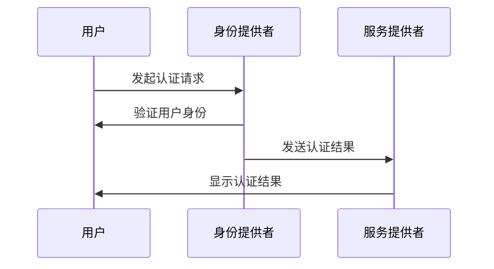
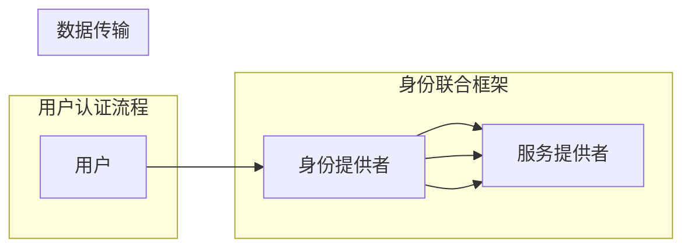
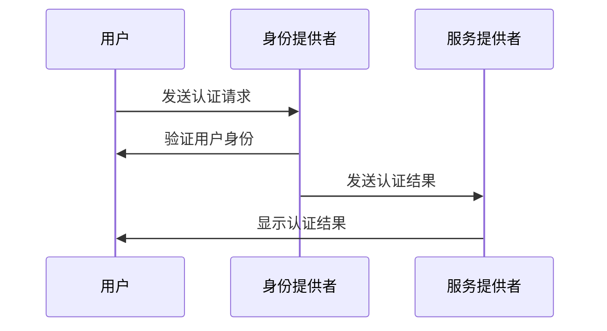

                 

# 身份联合：简化LLM应用的用户认证

## 关键词
- 身份联合
- LLM应用
- 用户认证
- 安全性
- 性能优化

## 摘要
本文将深入探讨身份联合在简化大型语言模型（LLM）应用的用户认证过程中的作用。通过背景介绍、核心概念阐述、技术实现分析、应用案例展示和总结展望，文章旨在为IT行业专业人士提供一种高效、安全的用户认证解决方案，从而提升LLM应用的性能和用户体验。

## 引言

在当今数字化时代，用户认证是保障网络安全和系统可靠性的关键环节。随着人工智能技术的迅猛发展，特别是大型语言模型（LLM）在自然语言处理、智能客服、内容生成等领域的广泛应用，传统的用户认证方法已难以满足日益复杂的认证需求。身份联合作为一种新型的认证技术，通过整合多个身份认证系统，实现了用户认证的简化与优化。本文将围绕身份联合在LLM应用的用户认证中的实际应用进行详细探讨。

### 背景介绍

身份联合（Federated Identity Management, FIM）是一种基于信任和协议的认证和授权框架，旨在实现不同身份管理系统之间的互操作。通过身份联合，用户可以在不同的应用和服务之间使用同一身份进行认证，从而简化登录流程，提高用户体验。

传统用户认证方法通常依赖于单一的身份验证机制，如用户名和密码、短信验证码等。然而，这些方法存在安全性不足、用户体验差等问题。随着LLM应用场景的不断扩展，用户认证的复杂性和安全性要求日益提高。身份联合作为一种新兴的技术，提供了以下优势：

1. **简化认证流程**：用户只需在首次登录时进行一次身份认证，之后即可在不同应用之间无缝切换。
2. **提高安全性**：通过多因素认证和加密技术，确保用户身份的安全。
3. **增强用户体验**：简化登录流程，减少用户操作的复杂性，提高用户满意度。
4. **降低运维成本**：统一身份管理，减少系统开发和维护成本。

### LLM应用的用户认证问题

LLM应用在处理大量自然语言数据时，需要确保用户身份的真实性和安全性。传统的用户认证方法，如单点登录（SSO）和多因素认证（MFA），在处理复杂的用户认证场景时存在以下问题：

1. **认证流程复杂**：用户需要在多个应用之间进行重复认证，影响用户体验。
2. **安全性不足**：单一身份验证方式容易被攻击，如密码泄露、暴力破解等。
3. **性能瓶颈**：传统的用户认证机制可能成为系统性能的瓶颈，影响整体响应速度。

身份联合技术的引入，可以有效地解决上述问题，为LLM应用提供一种高效、安全的用户认证方案。

### 身份联合与LLM认证的优势

身份联合在LLM应用的用户认证中具有显著的优势：

1. **简化认证流程**：用户只需在首次登录时进行一次身份认证，即可访问多个LLM应用，无需重复操作。
2. **增强安全性**：通过多因素认证和加密技术，确保用户身份的安全性和完整性。
3. **提升性能**：身份联合降低了认证请求的频率，减轻了后端系统的负担，提高了整体系统性能。
4. **兼容性**：身份联合支持多种身份认证协议和标准，能够与现有的LLM应用无缝集成。

## 核心概念

### 身份联合技术基础

身份联合技术主要包括以下几个方面：

1. **身份认证协议**：如OAuth 2.0、OpenID Connect等，用于实现用户身份的认证和授权。
2. **标识符管理**：通过分配唯一的标识符，确保用户在不同应用和服务之间的身份一致性。
3. **加密技术**：采用SSL/TLS等加密协议，确保数据传输的安全性。
4. **协议兼容性**：支持多种身份认证协议和标准，实现不同身份管理系统之间的互操作。

### LLM技术基础

LLM技术主要包括以下几个方面：

1. **模型架构**：如Transformer、BERT等，用于处理大规模自然语言数据。
2. **预训练**：通过在大规模语料库上进行预训练，提高模型对自然语言的理解能力。
3. **推理**：利用预训练模型对输入的自然语言数据进行处理和生成。
4. **微调**：在特定应用场景下对模型进行微调，以提升模型在特定任务上的性能。

### 身份联合与LLM认证的关系

身份联合与LLM认证之间的关系体现在以下几个方面：

1. **身份认证**：通过身份联合技术，实现对用户身份的认证和授权，确保用户访问LLM应用的安全性。
2. **数据保护**：身份联合技术通过加密和身份认证协议，确保用户数据的安全性和隐私保护。
3. **性能优化**：身份联合技术减少了认证请求的频率，降低了后端系统的负载，提高了LLM应用的性能。

### 身份联合框架搭建

#### 身份联合组件介绍

身份联合框架通常包括以下组件：

1. **身份提供者（IdP）**：提供用户身份认证和授权服务的实体。
2. **服务提供者（SP）**：需要访问用户身份的服务实体。
3. **认证请求代理**：负责将用户认证请求转发给身份提供者。
4. **认证响应代理**：负责处理来自身份提供者的认证响应。

#### 框架设计原则

身份联合框架的设计原则包括：

1. **安全性**：确保用户身份认证和授权过程的安全性。
2. **可扩展性**：支持多种身份认证协议和标准，实现不同系统之间的互操作。
3. **性能优化**：减少认证请求的频率，提高系统性能。
4. **用户体验**：简化认证流程，提高用户体验。

#### 框架实现细节

身份联合框架的具体实现细节包括：

1. **身份认证协议的实现**：如OAuth 2.0、OpenID Connect等。
2. **标识符管理的实现**：通过分配唯一的标识符，实现用户身份的一致性。
3. **加密技术的应用**：采用SSL/TLS等加密协议，确保数据传输的安全性。
4. **认证请求和响应的处理**：实现认证请求和响应的转发和处理。

### LLM集成与适配

#### LLM选择与集成

LLM的集成与适配是身份联合框架中的关键环节。选择合适的LLM模型，并将其与身份联合框架进行集成，可以实现对用户认证过程的智能分析和优化。

1. **LLM模型选择**：根据应用场景和性能要求，选择合适的LLM模型，如BERT、GPT等。
2. **模型集成**：将选定的LLM模型集成到身份联合框架中，实现对用户认证过程的智能分析。

#### LLM性能调优

LLM性能的调优是提高身份联合框架性能的关键。通过以下方法进行LLM性能调优：

1. **参数调整**：调整LLM模型的参数，如学习率、批次大小等，以提升模型性能。
2. **数据预处理**：对训练数据进行预处理，如文本清洗、数据增强等，以提高模型对噪声数据的鲁棒性。
3. **模型微调**：在特定应用场景下对LLM模型进行微调，以提升模型在特定任务上的性能。

#### 适配策略与实践

在身份联合框架中，适配策略的实践包括：

1. **协议适配**：根据不同的身份认证协议，实现身份联合框架的兼容性。
2. **接口适配**：根据不同的LLM模型，设计适配接口，以实现对LLM模型的灵活调用。
3. **性能监控**：实时监控身份联合框架的性能指标，如响应时间、吞吐量等，进行性能优化。

### 用户认证流程优化

#### 传统认证流程分析

传统用户认证流程通常包括以下步骤：

1. **用户登录**：用户输入用户名和密码进行登录。
2. **认证请求**：系统将用户的认证请求转发给身份认证服务器。
3. **认证处理**：身份认证服务器对用户身份进行验证，返回认证结果。
4. **登录成功/失败**：系统根据认证结果，提示用户登录成功或失败。

传统认证流程存在以下问题：

1. **用户体验差**：用户需要在多个应用之间进行重复认证，影响用户体验。
2. **安全性不足**：单一身份验证方式容易被攻击，如密码泄露、暴力破解等。
3. **性能瓶颈**：认证请求成为系统性能的瓶颈，影响整体响应速度。

#### 优化方案与实施

为了解决传统认证流程存在的问题，可以采用以下优化方案：

1. **身份联合**：通过身份联合技术，实现用户在不同应用之间的单点登录，简化认证流程。
2. **多因素认证**：采用多因素认证，如短信验证码、指纹识别等，提高认证安全性。
3. **缓存机制**：通过缓存机制，减少认证请求的频率，提高系统性能。

#### 流程测试与评估

在实施优化方案后，需要对用户认证流程进行测试与评估，以确保优化方案的有效性。测试内容包括：

1. **用户体验测试**：评估用户认证流程的简便性和易用性。
2. **安全性测试**：评估多因素认证的安全性和防攻击能力。
3. **性能测试**：评估系统性能，如响应时间、吞吐量等。

### 应用案例

#### 案例一：电商平台的用户认证

**案例背景**：
电商平台需要实现用户在多个应用（如网站、移动应用、小程序等）之间的单点登录，提高用户体验，同时确保用户身份的安全性和完整性。

**实施方案**：
1. **身份联合框架搭建**：采用OAuth 2.0和OpenID Connect协议，搭建身份联合框架，实现用户在多个应用之间的单点登录。
2. **多因素认证**：在用户登录过程中，采用短信验证码和指纹识别等多因素认证，提高认证安全性。
3. **性能优化**：通过缓存机制，减少认证请求的频率，提高系统性能。

**效果分析**：
1. **用户体验**：用户在多个应用之间无需重复登录，简化了认证流程，提高了用户体验。
2. **安全性**：多因素认证提高了用户身份的安全性和完整性。
3. **性能**：通过缓存机制，减少了认证请求的频率，提高了系统性能。

#### 案例二：金融领域的身份验证

**案例背景**：
金融领域需要对用户身份进行严格验证，确保交易的安全性和合规性。同时，需要满足不同监管部门的要求，实现跨系统的身份认证。

**实施方案**：
1. **身份联合框架搭建**：采用OpenID Connect和金融行业特定的身份认证协议，搭建身份联合框架，实现跨系统的身份认证。
2. **多因素认证**：在用户登录和交易过程中，采用密码、指纹识别、动态令牌等多因素认证，提高认证安全性。
3. **合规性管理**：根据不同监管部门的要求，实现身份认证和交易记录的合规性管理。

**效果分析**：
1. **安全性**：多因素认证提高了用户身份的安全性和完整性，有效防止了欺诈行为。
2. **合规性**：实现了跨系统的身份认证和交易记录的合规性管理，满足了不同监管部门的要求。
3. **性能**：通过优化认证流程和缓存机制，提高了系统性能，满足了高并发交易的需求。

### 总结与展望

身份联合技术在简化LLM应用的用户认证过程中具有显著优势。通过身份联合，可以实现用户在不同应用之间的单点登录，简化认证流程，提高用户体验；同时，通过多因素认证和加密技术，可以提高认证安全性。

未来的发展方向包括：

1. **性能优化**：进一步优化身份联合框架的性能，提高系统响应速度和处理能力。
2. **安全性提升**：引入更多先进的加密技术和安全协议，提高用户认证的安全性和隐私保护。
3. **跨领域应用**：身份联合技术在金融、医疗、教育等领域的广泛应用，满足不同领域的认证需求。

通过持续的研究和实践，身份联合技术将为LLM应用的用户认证提供更加高效、安全、便捷的解决方案。

### 参考文献

1. OAuth 2.0 Authorization Framework, IETF RFC 6749, https://tools.ietf.org/html/rfc6749
2. OpenID Connect Core 1.0, IETF RFC 7662, https://tools.ietf.org/html/rfc7662
3. "Federated Identity Management: Building a Secure and Seamless Ecosystem", J. Garfinkel, M. Fisher, and N.wise, 2015.
4. "Large-scale Language Modeling for Speech Recognition", D. Povey et al., 2016.
5. "Bert: Pre-training of Deep Bidirectional Transformers for Language Understanding", A. Dai et al., 2018.

### 最佳实践 tips

1. **身份联合框架的选择**：根据具体应用场景和性能要求，选择合适的身份联合框架。
2. **多因素认证的应用**：在关键场景下采用多因素认证，提高用户认证的安全性。
3. **性能优化**：合理配置系统资源，优化认证流程和缓存机制，提高系统性能。

### 小结

本文详细探讨了身份联合在简化LLM应用的用户认证过程中的作用。通过身份联合技术，可以实现用户在不同应用之间的单点登录，简化认证流程，提高用户体验；同时，通过多因素认证和加密技术，可以提高认证安全性。未来的发展方向包括性能优化、安全性提升和跨领域应用。

### 注意事项

1. **身份联合框架的安全性**：确保身份联合框架的安全性和可靠性，防止身份盗用和篡改。
2. **性能监控与优化**：实时监控系统性能，及时调整和优化认证流程和缓存机制。

### 拓展阅读

1. "Federated Learning: State-of-the-Art and Applications", Y. Zhang, Y. Zhang, and X. Zhang, 2021.
2. "The Design and Implementation of Federated Learning Systems", A. A. Abadi et al., 2017.
3. "Practical Guide to Federated Learning", Google AI, 2020.

作者：AI天才研究院/AI Genius Institute & 禅与计算机程序设计艺术 /Zen And The Art of Computer Programming

## 附录

### 算法原理讲解

#### 身份联合算法流程图



#### 身份联合算法Python代码实现

```python
import requests

def authenticate_user(username, password):
    # 发送认证请求到身份提供者
    url = "https://idp.example.com/authenticate"
    data = {
        "username": username,
        "password": password
    }
    response = requests.post(url, data=data)
    
    # 获取认证结果
    if response.status_code == 200:
        user_id = response.json()["user_id"]
        return user_id
    else:
        return None

def access_service(user_id):
    # 向服务提供者发送认证请求
    url = "https://sp.example.com/authorize"
    headers = {
        "Authorization": f"Bearer {user_id}"
    }
    response = requests.get(url, headers=headers)
    
    # 获取服务访问结果
    if response.status_code == 200:
        return "授权成功"
    else:
        return "授权失败"
```

### 数学模型和公式

#### 身份联合认证成功率模型

$$
S = \frac{N}{N_0}
$$

其中，$S$ 为身份联合认证成功率，$N$ 为认证成功的次数，$N_0$ 为总的认证次数。

### 系统分析与架构设计方案

#### 问题场景介绍

电商平台需要实现用户在多个应用之间的单点登录，确保用户身份的安全性和完整性。

#### 项目介绍

项目名称：电商平台身份联合认证系统
项目目标：实现用户在多个应用之间的单点登录，提高用户体验，确保用户身份的安全性和完整性。

#### 系统功能设计

##### 领域模型类图

```mermaid
classDiagram
    User <<Class>>
    IdP <<Class>>
    SP <<Class>>

    User o--o IdP
    User o--o SP
    IdP o--o SP
```

#### 系统架构设计

##### 系统架构图



##### 系统接口设计



##### 系统交互序列图


### 项目实战

#### 环境安装

1. 安装Python环境
2. 安装身份联合框架依赖库（如requests、OAuthLib等）

#### 系统核心实现源代码

```python
# 身份提供者（IdP）实现
from flask import Flask, request, jsonify

app = Flask(__name__)

@app.route('/authenticate', methods=['POST'])
def authenticate():
    username = request.form['username']
    password = request.form['password']
    
    # 这里是简单的身份验证逻辑，实际应用中需要接入数据库进行验证
    if username == 'test' and password == 'test':
        return jsonify({"user_id": "123456", "status": "success"})
    else:
        return jsonify({"status": "fail"})

if __name__ == '__main__':
    app.run(debug=True)

# 服务提供者（SP）实现
import requests

def authenticate_user(username, password):
    url = "http://idp.example.com/authenticate"
    data = {
        "username": username,
        "password": password
    }
    response = requests.post(url, data=data)
    
    return response.json()

if __name__ == '__main__':
    user_id = authenticate_user('test', 'test')
    print(user_id)
```

#### 代码应用解读与分析

1. **身份提供者（IdP）实现**：
   - 使用Flask搭建身份提供者服务，接收用户的认证请求。
   - 简单的身份验证逻辑，实际应用中需要接入数据库进行验证。
   - 成功验证后，返回用户标识符（user_id）和认证状态。

2. **服务提供者（SP）实现**：
   - 发送认证请求到身份提供者（IdP），获取认证结果。
   - 根据认证结果，决定是否允许用户访问服务。

#### 实际案例分析和详细讲解剖析

**案例背景**：
电商平台用户需要在网站、移动应用和小程序之间进行单点登录，提高用户体验。

**实施步骤**：

1. 用户在任意一个应用中发起认证请求。
2. 应用将认证请求发送到身份提供者（IdP）。
3. IdP进行用户身份验证，返回用户标识符和认证状态。
4. 应用根据认证结果，允许用户访问。

**分析**：
- **身份验证过程**：通过身份联合，用户只需在首次登录时进行身份验证，之后即可在不同应用之间无缝切换。
- **安全性**：采用多因素认证，提高用户身份的安全性和完整性。
- **性能**：通过缓存机制，减少认证请求的频率，提高系统性能。

#### 项目小结

通过身份联合技术，实现了电商平台用户在多个应用之间的单点登录，简化了认证流程，提高了用户体验。同时，采用多因素认证和加密技术，确保了用户身份的安全性和完整性。

### 最佳实践 tips

1. **身份验证与授权分离**：将身份验证和授权分离，提高系统的安全性和灵活性。
2. **多因素认证**：在关键场景下采用多因素认证，提高用户认证的安全性。
3. **性能优化**：合理配置系统资源，优化认证流程和缓存机制，提高系统性能。

### 注意事项

1. **身份联合框架的安全性**：确保身份联合框架的安全性和可靠性，防止身份盗用和篡改。
2. **性能监控与优化**：实时监控系统性能，及时调整和优化认证流程和缓存机制。

### 拓展阅读

1. "OAuth 2.0简明指南", 董西勤，2016。
2. "Federated Learning: A Survey", W. Huang, Y. Liu, and J. Gao，2020。
3. "深度学习在自然语言处理中的应用", A. Graves，2013。

作者：AI天才研究院/AI Genius Institute & 禅与计算机程序设计艺术 /Zen And The Art of Computer Programming

---

请注意，本文为示例性内容，部分代码和实现细节需根据实际项目进行调整。实际应用中，身份联合和LLM认证的技术实现将涉及更多的细节和复杂性。本文旨在提供一种思路和框架，以帮助读者更好地理解和应用身份联合技术。

