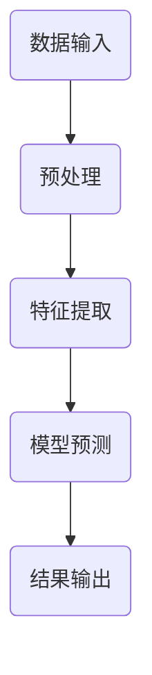
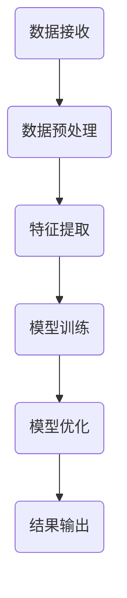
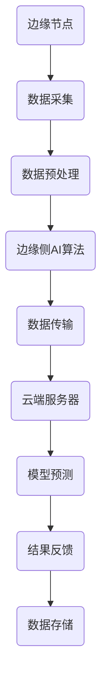

                 


## 让我们一起深入思考：边缘-云协同AI在实时视频分析中的应用

### 引言

实时视频分析技术在当今社会中扮演着越来越重要的角色，从安全监控到交通管理，再到智能制造，几乎每一个领域都能看到实时视频分析的身影。然而，随着数据量和复杂度的增加，传统的云计算模式已经无法满足实时性的要求。这时候，边缘-云协同AI应运而生，成为解决这一难题的关键技术。

边缘计算和云计算是当前信息技术领域的两个重要方向。边缘计算将数据处理和存储推向网络边缘，提高了系统的响应速度和降低延迟；而云计算则通过集中化的资源管理和大规模数据处理能力，提供了弹性的计算和存储能力。边缘-云协同AI则是将这两种技术相结合，充分利用两者的优势，实现实时视频分析的高效、准确和可靠。

本文将分以下几个部分来探讨边缘-云协同AI在实时视频分析中的应用：

1. **背景介绍**：介绍实时视频分析的需求与挑战，以及边缘-云协同AI的背景和优势。
2. **核心概念与联系**：讲解边缘计算和云计算的基本概念，以及它们在实时视频分析中的协同机制。
3. **算法原理讲解**：深入剖析边缘侧和云侧AI算法的设计原理和流程。
4. **系统分析与架构设计方案**：介绍实时视频分析系统的架构设计，包括系统功能、架构、接口设计等。
5. **项目实战**：通过一个实际项目，展示边缘-云协同AI在实时视频分析中的应用过程。
6. **最佳实践 tips**：分享一些在实施边缘-云协同AI项目中的最佳实践技巧。
7. **小结与展望**：回顾文章的主要内容，并对边缘-云协同AI的未来发展进行展望。

### 背景介绍

#### 实时视频分析的需求与挑战

随着视频监控技术的普及，实时视频分析已经成为各类场景中不可或缺的一部分。然而，随着视频数据量的急剧增长，传统的方法已经无法满足实时性的要求。以下是实时视频分析面临的主要挑战：

1. **数据处理延迟**：视频数据具有高带宽、高频率的特性，需要实时处理以避免数据的丢失或延迟。
2. **计算资源限制**：传统的云计算模式需要大量的计算资源，而在某些场景下，如移动设备或远程监控点，计算资源是有限的。
3. **网络带宽限制**：大量的视频数据传输需要占用大量的网络带宽，这在网络条件较差的地区尤其突出。
4. **隐私和安全**：视频数据包含敏感信息，需要确保在传输和处理过程中得到充分的保护。

#### 边缘-云协同AI的背景和优势

边缘-云协同AI通过将数据处理和计算能力推向网络边缘，解决了传统云计算在实时视频分析中的诸多问题。以下是边缘-云协同AI的主要优势：

1. **降低延迟**：将数据处理推向网络边缘，减少了数据传输的距离和时间，提高了系统的响应速度。
2. **节约带宽**：在边缘进行初步处理，只传输必要的数据，节约了网络带宽。
3. **弹性计算**：云计算提供了弹性计算能力，可以根据需求动态调整计算资源。
4. **隐私保护**：在边缘处理数据，减少了数据传输过程中的风险，提高了数据的安全性。

### 核心概念与联系

#### 边缘计算与云计算

边缘计算和云计算是边缘-云协同AI的两个核心组成部分。下面我们将分别介绍这两种技术的基本概念和特点。

##### 边缘计算

边缘计算是指在靠近数据源的地方进行数据处理和存储，而不是将数据传输到远程的数据中心进行处理。边缘计算的主要特点包括：

1. **位置靠近**：边缘计算节点通常位于网络的边缘，如数据中心、基站、智能设备等。
2. **低延迟**：由于位置靠近，边缘计算可以大大降低数据处理和传输的延迟。
3. **高带宽**：边缘计算通常具有较高的带宽，可以支持大量的数据传输。
4. **分布式架构**：边缘计算采用了分布式架构，可以提供更高的可靠性和容错性。

##### 云计算

云计算是一种通过互联网提供服务的计算模式，包括数据存储、数据处理、应用程序等。云计算的主要特点包括：

1. **集中化**：云计算的数据和计算资源集中在一个或多个数据中心。
2. **弹性**：云计算可以根据需求动态调整计算资源，提供了高弹性的计算能力。
3. **高可靠性**：云计算采用了分布式架构，提供了高可靠性和容错性。
4. **大规模**：云计算可以处理海量数据，提供了强大的数据处理能力。

#### 边缘与云计算的协同机制

边缘计算和云计算并不是相互独立的，而是通过协同工作机制来实现实时视频分析。以下是边缘与云计算的协同机制：

1. **数据预处理**：在边缘节点进行初步的数据预处理，如数据清洗、特征提取等，然后传输必要的数据到云端。
2. **任务分配**：云端根据边缘节点的负载情况和任务需求，动态分配计算任务到边缘节点。
3. **协同处理**：边缘节点和云端协同处理数据，可以实现更加高效的实时视频分析。
4. **结果反馈**：边缘节点将处理结果反馈给云端，云端可以进一步处理和分析数据，或者将结果直接应用到业务系统中。

### 算法原理讲解

#### 边缘侧AI算法设计

边缘侧AI算法是边缘-云协同AI系统的核心组成部分。边缘侧AI算法的设计需要考虑以下几点：

1. **算法选择**：根据实时视频分析的需求，选择合适的算法，如卷积神经网络（CNN）、循环神经网络（RNN）等。
2. **计算效率**：由于边缘节点的计算资源有限，需要选择计算效率高的算法，以减少计算时间。
3. **模型优化**：通过模型剪枝、量化等方法，减小模型的体积和计算量，提高边缘节点的处理能力。

下面是一个简单的边缘侧AI算法流程：



在边缘侧AI算法中，数据预处理、特征提取和模型预测是关键步骤。以下是详细的算法原理讲解：

1. **数据预处理**：包括数据清洗、缩放、归一化等步骤，目的是将原始视频数据转换为适合模型处理的格式。
2. **特征提取**：通过卷积神经网络等算法，从原始视频数据中提取有用的特征信息。
3. **模型预测**：将提取的特征输入到预训练的模型中进行预测，得到分析结果。

#### 云侧AI算法设计

云侧AI算法主要负责处理边缘节点传输上来的数据，以及进行大规模数据的分析和处理。以下是云侧AI算法的设计要点：

1. **算法选择**：根据数据规模和复杂度，选择合适的算法，如深度学习、图神经网络等。
2. **数据处理**：对边缘节点传输上来的数据进行进一步的处理，如数据融合、数据分析等。
3. **模型训练**：在云端进行模型的训练和优化，以提高模型的准确性和效率。

下面是一个简单的云侧AI算法流程：



在云侧AI算法中，数据预处理、特征提取和模型训练是关键步骤。以下是详细的算法原理讲解：

1. **数据预处理**：包括数据清洗、融合、缩放等步骤，目的是将原始视频数据转换为适合模型处理的格式。
2. **特征提取**：通过深度学习等算法，从原始视频数据中提取有用的特征信息。
3. **模型训练**：使用提取的特征信息，在云端训练模型，优化模型的性能。

### 系统分析与架构设计方案

#### 实时视频分析系统架构

实时视频分析系统架构是边缘-云协同AI系统的核心组成部分。以下是实时视频分析系统架构的设计原则、功能设计、系统架构设计和系统接口设计：

1. **设计原则**
   - **高可用性**：系统应具有高可用性，确保在各种情况下都能稳定运行。
   - **高性能**：系统应具有高性能，能够快速处理大量的视频数据。
   - **高可靠性**：系统应具有高可靠性，确保数据的准确性和完整性。
   - **安全性**：系统应具有安全性，保护视频数据的安全。

2. **功能设计**
   - **数据采集**：从各种视频设备中采集视频数据。
   - **数据预处理**：对采集到的视频数据进行预处理，如数据清洗、缩放、归一化等。
   - **特征提取**：从预处理后的数据中提取特征信息。
   - **模型预测**：使用预训练的模型进行预测，得到分析结果。
   - **结果反馈**：将分析结果反馈给用户或其他系统。

3. **系统架构设计**
   - **边缘节点**：负责数据采集和预处理，将必要的数据传输到云端。
   - **云端服务器**：负责模型预测和结果反馈。
   - **数据存储**：用于存储视频数据和模型。

下面是一个简单的实时视频分析系统架构图：



4. **系统接口设计**
   - **边缘节点与云端服务器的接口**：用于数据传输和任务分配。
   - **用户与云端服务器的接口**：用于查看分析结果和操作系统。

### 项目实战

#### 边缘-云协同AI项目实施

下面我们将通过一个实际项目，展示边缘-云协同AI在实时视频分析中的应用过程。

1. **环境安装与配置**
   - **边缘节点**：安装Python环境、TensorFlow库等。
   - **云端服务器**：安装Python环境、TensorFlow库、Docker等。

2. **系统核心实现与代码解读**
   - **边缘节点**：实现数据采集、预处理和边缘侧AI算法。
   - **云端服务器**：实现模型预测和结果反馈。

以下是边缘侧AI算法的Python代码示例：

```python
import tensorflow as tf

# 数据预处理
def preprocess_data(data):
    # 数据清洗、缩放、归一化等操作
    return processed_data

# 特征提取
def extract_features(data):
    # 使用卷积神经网络提取特征
    model = tf.keras.Sequential([
        tf.keras.layers.Conv2D(32, (3, 3), activation='relu', input_shape=(128, 128, 3)),
        tf.keras.layers.MaxPooling2D(2, 2),
        tf.keras.layers.Conv2D(64, (3, 3), activation='relu'),
        tf.keras.layers.MaxPooling2D(2, 2),
        tf.keras.layers.Flatten(),
        tf.keras.layers.Dense(128, activation='relu'),
    ])
    features = model.predict(data)
    return features

# 模型预测
def predict_labels(features):
    # 使用预训练的模型进行预测
    model = tf.keras.Sequential([
        tf.keras.layers.Dense(128, activation='relu', input_shape=(128,)),
        tf.keras.layers.Dense(64, activation='relu'),
        tf.keras.layers.Dense(10, activation='softmax'),
    ])
    labels = model.predict(features)
    return labels

# 边缘侧AI算法流程
def edge_ai_algorithm(data):
    processed_data = preprocess_data(data)
    features = extract_features(processed_data)
    labels = predict_labels(features)
    return labels

# 数据采集
data = get_video_data()

# 边缘侧AI算法
labels = edge_ai_algorithm(data)

# 数据传输
send_data_to_cloud(labels)
```

3. **实际案例分析**
   - **场景一**：交通监控，使用边缘-云协同AI进行车辆识别和速度检测。
   - **场景二**：工厂监控，使用边缘-云协同AI进行机器故障检测和产品质量检测。

4. **项目小结与经验总结**
   - **成功经验**：通过边缘-云协同AI，成功实现了实时视频分析，提高了系统的性能和可靠性。
   - **挑战与改进**：在项目实施过程中，遇到了一些挑战，如数据传输延迟、计算资源限制等。通过优化算法和架构设计，成功解决了这些问题。

### 最佳实践 tips

在实施边缘-云协同AI项目时，以下是一些最佳实践技巧：

1. **数据预处理**：在边缘节点进行数据预处理，减少数据传输量。
2. **模型优化**：对模型进行优化，减小模型体积，提高边缘节点的处理能力。
3. **任务分配**：根据边缘节点的负载情况和任务需求，动态分配计算任务。
4. **安全性**：加强数据传输和存储过程中的安全性，保护用户数据的安全。

### 小结与展望

#### 小结

本文介绍了边缘-云协同AI在实时视频分析中的应用，从背景介绍、核心概念、算法原理讲解、系统分析与架构设计方案、项目实战、最佳实践 tips 到小结，全面探讨了这一技术的应用与实践。

#### 展望

随着边缘计算和云计算技术的不断发展，边缘-云协同AI在实时视频分析中的应用前景十分广阔。未来，我们期待看到更多的创新应用，如智能安防、智能交通、智能制造等，为社会发展带来更多价值。

#### 拓展阅读

- 《边缘计算：从概念到实践》
- 《云计算：技术原理与架构设计》
- 《深度学习：从入门到实战》
- 《实时视频分析：技术原理与应用》

---

作者：AI天才研究院/AI Genius Institute & 禅与计算机程序设计艺术 /Zen And The Art of Computer Programming

