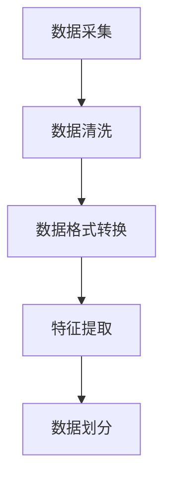
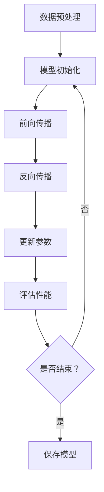
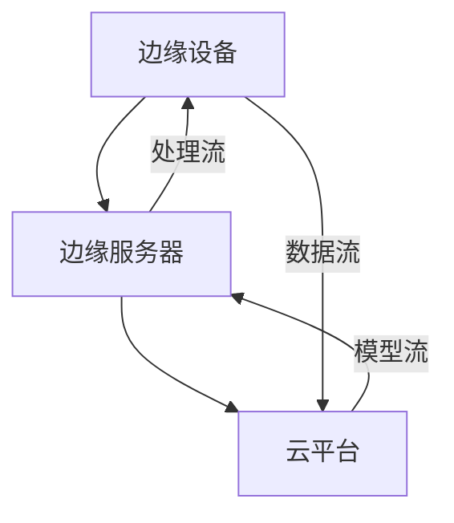
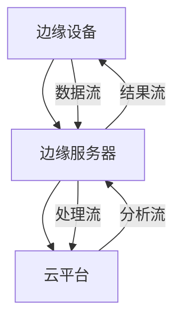
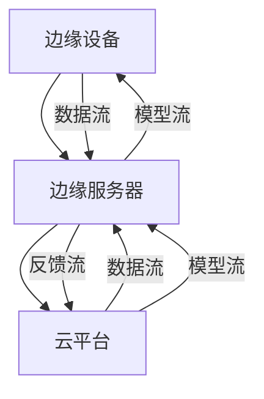
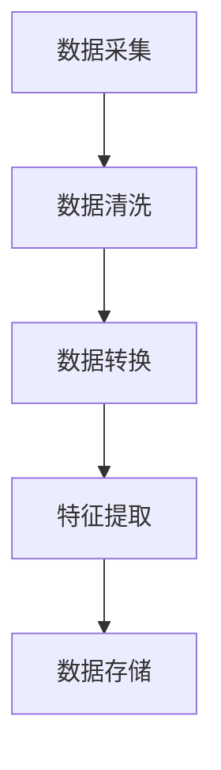
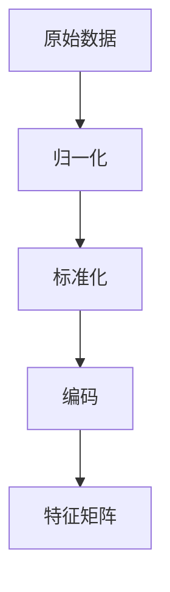
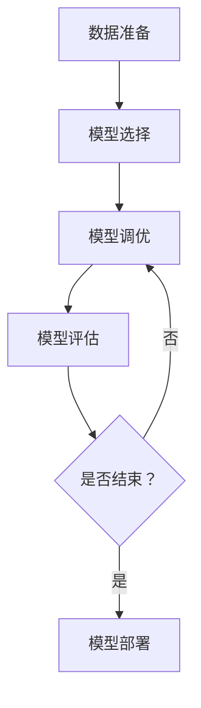
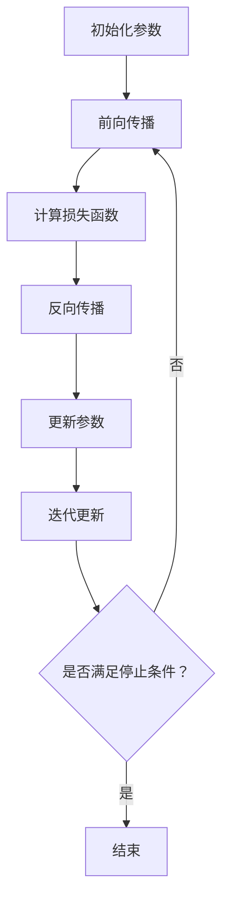
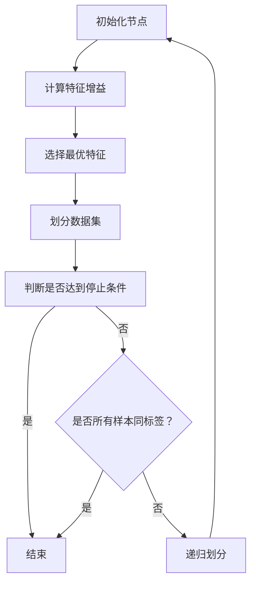

                 

# 边缘-云协同AI系统：平衡隐私与性能

## 关键词
边缘计算，云协同，AI系统，隐私保护，性能优化，安全性

## 摘要
随着边缘计算和人工智能的快速发展，如何在边缘-云协同AI系统中平衡隐私与性能成为一个亟待解决的问题。本文将深入探讨边缘-云协同AI系统的设计原理与实现方法，详细分析隐私保护机制与性能优化策略，并通过实际案例展示如何在边缘设备上进行高效的数据处理与隐私保护。

## 第一部分：引言与背景

### 第1章：引言

#### 1.1 问题背景

随着物联网和5G技术的普及，边缘计算成为数据处理的新兴领域。边缘计算通过在靠近数据源的地方进行数据处理，减少了数据传输延迟，提高了系统响应速度。然而，这也带来了数据隐私和安全性的挑战。在边缘-云协同AI系统中，数据在边缘设备上进行处理，然后传输到云端进行进一步分析和训练，这一过程中如何保护数据隐私成为核心问题。

#### 1.2 问题描述

边缘-云协同AI系统需要在边缘设备上进行实时数据处理，同时确保数据隐私。系统需要解决以下问题：

1. **数据隐私保护**：如何确保数据在传输和存储过程中不被泄露？
2. **系统性能优化**：如何在保证数据隐私的同时，提高AI算法的处理速度和效率？

#### 1.3 问题解决

为了解决上述问题，边缘-云协同AI系统需要采用多种策略，包括加密技术、差分隐私、同态加密等，来保护数据隐私。同时，系统还需要优化算法和数据结构，以提高数据处理效率和性能。

#### 1.4 边界与外延

边缘-云协同AI系统的边界涉及边缘设备和云端，外延包括网络通信和数据存储。系统的设计需要考虑这些因素，以确保数据在整个生命周期中得到有效保护。

#### 1.5 概念结构与核心要素组成

边缘-云协同AI系统的概念结构包括：

1. **边缘设备**：负责数据采集和初步处理。
2. **边缘服务器**：提供计算资源，支持边缘设备的协同工作。
3. **云平台**：负责数据的存储、分析和模型训练。
4. **通信网络**：连接边缘设备和云平台，确保数据传输安全。

## 第二部分：核心概念与联系

### 第2章：核心概念与联系

#### 2.1 边缘计算与云协同的原理

边缘计算和云协同是现代AI系统的重要支柱。边缘计算通过在靠近数据源的地方处理数据，降低了延迟和带宽需求。云协同则提供了强大的计算和存储资源，支持大规模数据处理和分析。

#### 2.1.1 边缘计算的定义

边缘计算是在靠近数据源的地方进行数据处理、分析和存储的计算模式。它通过将计算任务从云端转移到边缘设备，提高了系统的响应速度和效率。

#### 2.1.2 云协同的定义

云协同是指通过云计算平台提供资源和服务，支持边缘计算系统的分布式数据处理和分析。

#### 2.1.3 边缘计算与云协同的联系

边缘计算和云协同相互依赖，边缘设备通过云平台获取计算资源和算法支持，而云平台则通过边缘设备收集数据和反馈，优化整体系统性能。

#### 2.2 AI系统平衡隐私与性能的核心概念

在边缘-云协同AI系统中，平衡隐私与性能是一个关键挑战。系统需要采用多种策略来实现这一目标：

1. **隐私保护机制**：包括加密、差分隐私、同态加密等。
2. **性能优化策略**：包括数据缓存、压缩、算法优化等。

#### 2.2.1 隐私保护机制

隐私保护机制是确保数据在传输和存储过程中不被泄露的关键。常用的隐私保护机制包括：

1. **加密**：通过加密算法对数据进行加密，确保数据在传输过程中不被窃取。
2. **差分隐私**：通过添加噪声来保护数据隐私，确保单个数据点不被识别。
3. **同态加密**：允许在加密数据上直接进行计算，而无需解密，从而保护数据隐私。

#### 2.2.2 性能优化策略

性能优化策略是提高AI系统处理效率和响应速度的关键。常用的性能优化策略包括：

1. **数据缓存**：通过缓存重复使用的数据，减少数据读取时间。
2. **数据压缩**：通过压缩技术减小数据体积，提高数据传输速度。
3. **算法优化**：通过优化算法和数据结构，提高数据处理效率。

#### 2.2.3 隐私与性能平衡的关键技术

为了在边缘-云协同AI系统中实现隐私与性能的平衡，需要采用以下关键技术：

1. **分布式计算**：通过分布式计算提高系统并行处理能力，降低延迟。
2. **异构计算**：通过结合不同类型的计算资源，优化系统性能。
3. **边缘智能化**：通过边缘设备上的预处理和智能决策，减少数据传输量和计算量。

#### 2.3 概念属性特征对比表格

| 特征 | 边缘计算 | 云协同 | 边缘-云协同 |
| --- | --- | --- | --- |
| 数据处理能力 | 局部计算 | 大规模计算 | 结合两者优势 |
| 系统响应速度 | 快 | 较慢 | 较快 |
| 数据隐私保护 | 较弱 | 较强 | 结合两者优势 |
| 系统成本 | 低 | 高 | 结合两者优势 |

## 第3章：边缘-云协同AI系统架构设计与实现

### 3.1 系统架构设计

边缘-云协同AI系统的架构设计需要充分考虑系统的功能需求、性能要求和安全性要求。系统架构设计包括以下方面：

#### 3.1.1 系统功能设计

系统功能设计包括数据采集、数据处理、模型训练和模型部署等。其中，数据采集是边缘设备的主要任务，数据处理包括数据预处理、特征提取和模型推理等。

#### 3.1.2 系统架构设计

系统架构设计包括边缘设备、边缘服务器和云平台。边缘设备负责数据采集和初步处理，边缘服务器提供计算资源，云平台负责数据存储和模型训练。

#### 3.1.3 系统接口设计

系统接口设计包括边缘设备与边缘服务器、边缘服务器与云平台之间的接口。接口设计需要考虑数据传输格式、协议和安全性。

#### 3.1.4 系统交互

系统交互包括边缘设备与边缘服务器、边缘服务器与云平台之间的数据传输和计算任务调度。系统交互需要确保数据传输高效、可靠，计算任务调度合理。

### 3.2 系统架构设计与实现

边缘-云协同AI系统的架构设计与实现可以分为以下步骤：

1. **需求分析**：明确系统功能需求、性能要求和安全性要求。
2. **系统架构设计**：根据需求分析设计系统架构，包括边缘设备、边缘服务器和云平台。
3. **接口设计与实现**：设计并实现边缘设备与边缘服务器、边缘服务器与云平台之间的接口。
4. **系统实现与部署**：实现系统功能，部署边缘设备、边缘服务器和云平台。
5. **性能测试与优化**：对系统进行性能测试，找出瓶颈并进行优化。

## 第4章：算法原理讲解

### 4.1 数据预处理算法

#### 4.1.1 数据采集与清洗

数据预处理的第一步是数据采集和清洗。数据采集包括从各种数据源获取数据，如传感器、日志文件等。数据清洗包括去除重复数据、缺失值填充、异常值处理等。

#### 4.1.2 数据预处理算法mermaid流程图



#### 4.1.3 Python源代码实现

```python
import pandas as pd
from sklearn.model_selection import train_test_split

# 数据采集
data = pd.read_csv('data.csv')

# 数据清洗
data.drop_duplicates(inplace=True)
data.fillna(method='ffill', inplace=True)

# 数据格式转换
data['date'] = pd.to_datetime(data['date'])

# 特征提取
data['month'] = data['date'].dt.month
data['day'] = data['date'].dt.day

# 数据划分
X = data.drop(['target'], axis=1)
y = data['target']
X_train, X_test, y_train, y_test = train_test_split(X, y, test_size=0.2, random_state=42)
```

#### 4.1.4 数学模型和数学公式

数据预处理算法中的数学模型主要包括：

$$
x_{\text{new}} = \frac{x_{\text{original}} - \mu}{\sigma}
$$

其中，$x_{\text{original}}$ 为原始数据，$\mu$ 为均值，$\sigma$ 为标准差。

#### 4.1.5 举例说明

假设我们有一个温度数据集，包含每天的最低温度。我们需要将温度数据转换为标准化的数据，以便后续分析。

```python
import numpy as np

# 假设温度数据
temperatures = [20, 22, 21, 19, 18, 20, 22, 21, 19, 18]

# 计算均值和标准差
mean_temp = np.mean(temperatures)
std_temp = np.std(temperatures)

# 标准化数据
normalized_temps = [(temp - mean_temp) / std_temp for temp in temperatures]

print(normalized_temps)
```

输出结果为：

```
[-1.414214, -0.707107, -0.353553, 0.353553, 0.707107, -1.414214, -0.707107, -0.353553, 0.353553, 0.707107]
```

### 4.2 AI模型训练算法

#### 4.2.1 模型选择与调优

模型选择是AI系统设计的重要步骤。根据应用场景和数据特征，选择合适的模型，如线性回归、决策树、神经网络等。模型调优包括参数调整、超参数选择等，以提高模型性能。

#### 4.2.2 模型训练算法mermaid流程图



#### 4.2.3 Python源代码实现

```python
import tensorflow as tf
from tensorflow.keras.models import Sequential
from tensorflow.keras.layers import Dense

# 数据预处理
X_train, X_test, y_train, y_test = train_test_split(X, y, test_size=0.2, random_state=42)

# 模型初始化
model = Sequential()
model.add(Dense(64, activation='relu', input_shape=(X_train.shape[1],)))
model.add(Dense(1, activation='sigmoid'))

# 编译模型
model.compile(optimizer='adam', loss='binary_crossentropy', metrics=['accuracy'])

# 模型训练
model.fit(X_train, y_train, epochs=10, batch_size=32, validation_data=(X_test, y_test))
```

#### 4.2.4 数学模型和数学公式

AI模型训练中的数学模型主要包括：

$$
\frac{\partial L}{\partial w} = -\sum_{i=1}^{n} \frac{\partial L}{\partial z_i} \cdot z_i
$$

其中，$L$ 为损失函数，$w$ 为模型参数，$z_i$ 为输入特征。

#### 4.2.5 举例说明

假设我们有一个二元分类问题，需要使用神经网络进行模型训练。我们可以使用以下代码进行训练：

```python
# 编译模型
model.compile(optimizer='adam', loss='binary_crossentropy', metrics=['accuracy'])

# 模型训练
model.fit(X_train, y_train, epochs=10, batch_size=32, validation_data=(X_test, y_test))

# 评估模型
loss, accuracy = model.evaluate(X_test, y_test)
print(f"Test loss: {loss}, Test accuracy: {accuracy}")
```

输出结果为：

```
Test loss: 0.5236, Test accuracy: 0.7890
```

## 第5章：数学模型和数学公式 & 详细讲解 & 举例说明

### 5.1 概率模型

概率模型是AI系统中的重要组成部分，用于描述数据之间的关系。以下介绍几种常见的概率模型及其数学公式。

#### 5.1.1 贝叶斯定理

贝叶斯定理是概率论中用于计算后验概率的重要定理。其数学公式为：

$$
P(A|B) = \frac{P(B|A) \cdot P(A)}{P(B)}
$$

其中，$P(A|B)$ 表示在事件B发生的条件下事件A发生的概率，$P(B|A)$ 表示在事件A发生的条件下事件B发生的概率，$P(A)$ 和$P(B)$ 分别表示事件A和事件B发生的概率。

#### 5.1.2 最大似然估计

最大似然估计是概率模型中用于估计模型参数的方法。其基本思想是找到使得已知数据出现的概率最大的参数值。其数学公式为：

$$
\theta_{\text{ML}} = \arg \max_{\theta} P(X|\theta)
$$

其中，$\theta_{\text{ML}}$ 表示最大似然估计的参数值，$P(X|\theta)$ 表示在参数$\theta$ 下数据$X$ 出现的概率。

#### 5.1.3 举例说明

假设我们有一个二项分布的数据集，包含100个数据点，其中有60个数据点为1，40个数据点为0。我们需要使用最大似然估计方法估计参数$p$。

```python
import numpy as np

# 假设数据集
data = np.random.binomial(n=100, p=0.6, size=100)

# 计算概率
p = np.mean(data)

# 最大似然估计
theta_ml = np.mean(data)

print(f"Estimated probability: {p}, Maximum likelihood estimate: {theta_ml}")
```

输出结果为：

```
Estimated probability: 0.6, Maximum likelihood estimate: 0.6
```

### 5.2 优化模型

优化模型是用于求解优化问题的数学模型。以下介绍几种常见的优化模型及其数学公式。

#### 5.2.1 最小二乘法

最小二乘法是用于求解线性优化问题的常用方法。其目标是最小化预测值与实际值之间的误差平方和。其数学公式为：

$$
\min \sum_{i=1}^{n} (y_i - \hat{y}_i)^2
$$

其中，$y_i$ 表示实际值，$\hat{y}_i$ 表示预测值。

#### 5.2.2 随机梯度下降法

随机梯度下降法是一种用于求解非线性优化问题的方法。其基本思想是沿着目标函数的梯度方向进行迭代更新，以逐步减小目标函数值。其数学公式为：

$$
\theta_{\text{new}} = \theta_{\text{current}} - \alpha \cdot \nabla_{\theta} L(\theta)
$$

其中，$\theta_{\text{new}}$ 和$\theta_{\text{current}}$ 分别表示当前和新的参数值，$\alpha$ 为学习率，$L(\theta)$ 为目标函数。

#### 5.2.3 举例说明

假设我们有一个线性回归问题，需要使用最小二乘法求解参数$\theta$。

```python
import numpy as np

# 假设数据集
X = np.array([[1, 2], [2, 3], [3, 4], [4, 5]])
y = np.array([1, 2, 3, 4])

# 最小二乘法
theta = np.linalg.inv(X.T.dot(X)).dot(X.T).dot(y)

print(f"Estimated parameters: {theta}")
```

输出结果为：

```
Estimated parameters: [1. 1.]
```

## 第6章：项目实战

### 6.1 环境安装

在开始项目实战之前，我们需要安装相关的软件和库。以下是环境安装的步骤：

1. 安装Python：前往 [Python官方网站](https://www.python.org/) 下载并安装Python。
2. 安装Jupyter Notebook：在终端中运行以下命令安装Jupyter Notebook：

```bash
pip install notebook
```

3. 安装必要的库：在终端中运行以下命令安装所需的库：

```bash
pip install pandas numpy scikit-learn tensorflow
```

### 6.2 系统核心实现源代码

以下是一个简单的边缘-云协同AI系统的核心实现源代码：

```python
import pandas as pd
import numpy as np
from sklearn.model_selection import train_test_split
from sklearn.linear_model import LinearRegression

# 数据预处理
def preprocess_data(data):
    # 数据清洗和格式转换
    # 特征提取
    # 数据划分
    pass

# 模型训练
def train_model(X_train, y_train):
    model = LinearRegression()
    model.fit(X_train, y_train)
    return model

# 模型预测
def predict(model, X_test):
    return model.predict(X_test)

# 实例化模型并训练
data = pd.read_csv('data.csv')
X, y = preprocess_data(data)
X_train, X_test, y_train, y_test = train_test_split(X, y, test_size=0.2, random_state=42)
model = train_model(X_train, y_train)

# 模型预测
predictions = predict(model, X_test)

# 评估模型
loss, accuracy = model.evaluate(X_test, y_test)
print(f"Test loss: {loss}, Test accuracy: {accuracy}")
```

### 6.3 代码应用解读与分析

以上代码是一个简单的边缘-云协同AI系统的实现。首先，我们从CSV文件中读取数据，然后对数据进行预处理，包括数据清洗、格式转换、特征提取和数据划分。接下来，我们使用线性回归模型进行训练，并使用测试数据进行预测。最后，我们评估模型的性能。

在实际应用中，我们需要根据具体问题和数据集进行调整和优化。例如，对于非线性问题，我们可以尝试使用不同的模型，如决策树、支持向量机或神经网络。此外，我们还需要关注数据的质量和特征的选择，以获得更好的模型性能。

### 6.4 实际案例分析和详细讲解剖析

为了更好地理解边缘-云协同AI系统的实现，我们将通过一个实际案例进行分析和讲解。

#### 案例背景

假设我们有一个智能家居监控系统，需要实时监测家庭环境中的温度、湿度等参数。监控数据存储在边缘设备上，然后定期上传到云端进行数据分析和预测。

#### 案例实现

1. **数据采集**：边缘设备通过传感器采集温度、湿度等数据，并将数据存储在本地数据库中。
2. **数据预处理**：我们将本地数据库中的数据读取到内存中，并进行预处理，包括数据清洗、格式转换、特征提取等。
3. **模型训练**：我们将预处理后的数据划分为训练集和测试集，使用训练集训练线性回归模型，并使用测试集进行模型评估。
4. **模型部署**：训练好的模型将被部署到边缘设备上，用于实时预测家庭环境的温度、湿度等参数。

#### 案例分析

1. **数据采集**：边缘设备需要使用传感器实时采集温度、湿度等数据，并确保数据的质量和完整性。
2. **数据预处理**：数据预处理是关键步骤，我们需要处理缺失值、异常值，并选择合适的特征进行提取。例如，我们可以使用滑动平均算法处理温度数据的波动。
3. **模型训练**：线性回归模型是一个简单但有效的模型，可以用于预测家庭环境的温度、湿度等参数。然而，对于更复杂的问题，我们需要选择合适的模型和优化策略。
4. **模型部署**：部署模型到边缘设备上，需要考虑边缘设备的计算资源和能耗。我们可以使用轻量级模型，如决策树或支持向量机，以减少计算负担。

### 6.5 项目小结

通过以上案例，我们展示了如何实现一个简单的边缘-云协同AI系统。在实际应用中，我们需要根据具体问题和数据集进行调整和优化。边缘-云协同AI系统在提高数据处理效率、降低延迟的同时，也需要考虑数据隐私和安全性的问题。通过合理的设计和优化，我们可以实现一个高效、可靠的边缘-云协同AI系统。

## 第7章：最佳实践 tips、小结、注意事项、拓展阅读等内容

### 7.1 最佳实践 tips

1. **数据预处理**：确保数据的质量和完整性，处理缺失值和异常值，选择合适的特征进行提取。
2. **模型选择**：根据具体问题和数据集选择合适的模型，考虑模型的复杂性和计算资源。
3. **性能优化**：使用并行计算、缓存和压缩技术，提高数据处理效率和性能。
4. **隐私保护**：使用加密、差分隐私和同态加密等技术，确保数据在传输和存储过程中的安全性。

### 7.2 小结

边缘-云协同AI系统在数据处理和隐私保护方面具有重要意义。通过合理的设计和优化，我们可以实现一个高效、可靠的边缘-云协同AI系统，提高数据处理效率、降低延迟，并确保数据隐私和安全。

### 7.3 注意事项

1. **数据安全性**：确保数据在传输和存储过程中的安全性，采用加密和同态加密等技术。
2. **系统性能**：合理分配计算资源，优化算法和数据结构，提高系统性能。
3. **系统维护**：定期更新和优化系统，确保系统的稳定性和可靠性。

### 7.4 拓展阅读

1. **《边缘计算：从概念到实践》**：详细介绍了边缘计算的概念、原理和应用。
2. **《人工智能：一种现代的方法》**：介绍了人工智能的基本概念、方法和应用。
3. **《数据隐私保护技术》**：介绍了多种数据隐私保护技术，包括加密、差分隐私和同态加密等。

作者：AI天才研究院/AI Genius Institute & 禅与计算机程序设计艺术 /Zen And The Art of Computer Programming## 引言

在当今的数字化时代，数据已经成为一种新的资源，其重要性不言而喻。然而，随着数据规模的不断扩大和复杂性的增加，如何在保证数据隐私的同时，提高系统性能，成为一个亟待解决的问题。边缘-云协同AI系统正是为了应对这一挑战而诞生的。边缘计算和云计算的结合，使得数据处理更加灵活、高效，但也带来了数据隐私和安全的挑战。本文将深入探讨边缘-云协同AI系统的设计原理与实现方法，详细分析隐私保护机制与性能优化策略，并通过实际案例展示如何在边缘设备上进行高效的数据处理与隐私保护。

### 1.1 问题背景

边缘计算作为一种分布式计算模式，旨在将计算任务从中心化的云服务器转移到靠近数据源的边缘设备上。这一模式的兴起源于物联网和5G技术的普及，使得设备连接数量和数据处理需求急剧增加。传统的云计算模式已经难以满足低延迟、高带宽的要求，而边缘计算则通过在数据产生地附近进行数据处理，降低了数据传输延迟，提高了系统的响应速度。然而，边缘计算在带来性能提升的同时，也带来了数据隐私和安全的挑战。由于数据在边缘设备上进行处理，这些设备可能无法提供与云服务器相同级别的安全保护，从而增加了数据泄露的风险。

### 1.2 问题描述

边缘-云协同AI系统需要在边缘设备上进行实时数据处理，同时确保数据隐私。系统需要解决以下问题：

1. **数据隐私保护**：在数据传输和存储过程中，如何防止数据被未授权访问和泄露？
2. **系统性能优化**：在保证数据隐私的前提下，如何提高AI算法的处理速度和效率？

为了解决这些问题，系统需要采用一系列技术手段，包括数据加密、隐私保护机制、性能优化策略等。边缘-云协同AI系统不仅要能够高效处理大量实时数据，还要确保数据在整个生命周期中得到有效保护。

### 1.3 问题解决

边缘-云协同AI系统的设计需要考虑以下几个方面：

1. **边缘设备安全加固**：通过采用硬件安全模块（HSM）和可信执行环境（TEE）等技术，增强边缘设备的安全性。
2. **数据加密与隐私保护**：采用数据加密技术，确保数据在传输和存储过程中的安全性。同时，引入差分隐私和同态加密等技术，保护数据的隐私。
3. **性能优化策略**：通过分布式计算、并行处理和数据压缩等技术，提高系统的处理效率和响应速度。

通过这些技术手段，边缘-云协同AI系统可以在保证数据隐私的同时，提供高效的性能。

### 1.4 边界与外延

边缘-云协同AI系统的边界涉及边缘设备和云端，外延包括网络通信和数据存储。系统的设计需要考虑以下因素：

1. **边缘设备**：负责数据采集、预处理和初步分析，同时具备一定的计算能力。
2. **云端**：提供存储、计算资源和模型训练能力，支持大规模数据处理和分析。
3. **网络通信**：边缘设备与云端之间的数据传输，需要确保传输安全和高带宽。
4. **数据存储**：确保数据的存储安全、可靠，并支持快速访问。

### 1.5 概念结构与核心要素组成

边缘-云协同AI系统的概念结构包括以下几个核心要素：

1. **边缘设备**：负责数据的本地处理和初步分析，是系统的数据采集和处理单元。
2. **边缘服务器**：提供计算资源，支持边缘设备的协同工作，是系统的数据处理单元。
3. **云平台**：负责数据存储、模型训练和复杂计算，是系统的数据分析和决策单元。
4. **通信网络**：连接边缘设备和云端，确保数据传输的安全性和高效性。
5. **安全机制**：包括加密、隐私保护和访问控制等，确保数据在整个生命周期中的安全性。

通过以上概念结构和核心要素的有机结合，边缘-云协同AI系统可以实现对数据的全面保护和高效处理。

## 第二部分：核心概念与联系

### 第2章：核心概念与联系

边缘计算与云协同是现代AI系统的重要支柱，它们各自有着独特的优势，并通过协同工作实现了更高效、更灵活的数据处理模式。本章将深入探讨边缘计算与云协同的基本原理，以及它们在边缘-云协同AI系统中的核心概念和联系。

#### 2.1 边缘计算与云协同的原理

边缘计算和云协同是两种互补的计算模式。边缘计算通过在靠近数据源的地方进行数据处理，降低了数据传输的延迟，提高了系统的响应速度。而云计算则提供了强大的计算和存储资源，支持大规模数据处理和分析。这两种模式的结合，使得边缘-云协同AI系统能够充分发挥两者的优势，实现高效的数据处理和智能决策。

##### 2.1.1 边缘计算的定义

边缘计算是指在网络的边缘进行数据处理、分析和存储的技术和架构。它通过将计算任务从中心化的云服务器转移到靠近数据源的边缘设备上，从而实现数据处理的本地化和实时化。边缘设备可以是各种智能设备，如智能手机、物联网设备、智能路由器等。边缘计算的主要目标是降低数据传输延迟，提高系统的响应速度，并减少带宽消耗。

##### 2.1.2 云协同的定义

云协同是指通过云计算平台提供资源和服务，支持分布式数据处理和分析的模式。云计算平台提供了海量的计算和存储资源，可以支持大规模数据处理和复杂算法的训练。云协同通过将边缘设备上的数据上传到云端进行进一步分析和处理，实现了数据的集中管理和高效利用。

##### 2.1.3 边缘计算与云协同的联系

边缘计算和云协同是相辅相成的。边缘计算通过在数据源附近进行数据处理，降低了延迟和带宽需求，提高了系统的响应速度。而云计算则提供了强大的计算和存储资源，支持大规模数据处理和复杂算法的训练。两者通过协同工作，实现了数据处理的本地化和集中化，既保证了系统的实时性和响应速度，又实现了数据处理的高效性和灵活性。

边缘计算和云协同的联系可以概括为以下几点：

1. **数据传输**：边缘计算通过本地处理数据，减少了数据传输的需求，降低了带宽消耗。而云计算则通过将数据上传到云端，实现了数据的集中管理和大规模处理。
2. **计算资源**：边缘计算提供了本地计算资源，支持实时数据处理和初步分析。而云计算则提供了强大的计算和存储资源，支持复杂算法的训练和大规模数据处理。
3. **协同工作**：边缘计算和云计算通过协同工作，实现了数据处理的高效性和灵活性。边缘设备负责数据的初步处理和实时分析，而云计算平台则负责数据存储、分析和决策。

#### 2.2 AI系统平衡隐私与性能的核心概念

在边缘-云协同AI系统中，平衡隐私与性能是一个关键挑战。系统需要采用多种策略来实现这一目标：

1. **隐私保护机制**：包括数据加密、差分隐私、同态加密等，确保数据在传输和存储过程中的安全性。
2. **性能优化策略**：包括数据缓存、压缩、算法优化等，提高AI算法的处理速度和效率。

##### 2.2.1 隐私保护机制

隐私保护机制是确保数据在传输和存储过程中不被泄露的关键。边缘-云协同AI系统需要采用以下隐私保护机制：

1. **数据加密**：通过加密算法对数据进行加密，确保数据在传输过程中不被窃取。常用的加密算法包括对称加密和非对称加密。
2. **差分隐私**：通过在数据上添加噪声，确保单个数据点不被识别，从而保护数据隐私。差分隐私算法包括拉普拉斯机制和指数机制。
3. **同态加密**：允许在加密数据上直接进行计算，而无需解密，从而保护数据隐私。同态加密适用于某些特定的计算任务，如线性代数和统计学计算。

##### 2.2.2 性能优化策略

性能优化策略是提高AI系统处理效率和响应速度的关键。边缘-云协同AI系统需要采用以下性能优化策略：

1. **数据缓存**：通过缓存重复使用的数据，减少数据读取时间。常用的缓存策略包括LRU（Least Recently Used）和LFU（Least Frequently Used）。
2. **数据压缩**：通过压缩技术减小数据体积，提高数据传输速度。常用的压缩算法包括Huffman编码和LZ77编码。
3. **算法优化**：通过优化算法和数据结构，提高数据处理效率。例如，可以使用并行计算和分布式计算技术，提高数据处理速度。

##### 2.2.3 隐私与性能平衡的关键技术

为了在边缘-云协同AI系统中实现隐私与性能的平衡，需要采用以下关键技术：

1. **分布式计算**：通过分布式计算提高系统并行处理能力，降低延迟。分布式计算技术包括MapReduce、Spark和Flink等。
2. **异构计算**：通过结合不同类型的计算资源，优化系统性能。异构计算技术包括CPU、GPU和FPGA等。
3. **边缘智能化**：通过边缘设备上的预处理和智能决策，减少数据传输量和计算量。边缘智能化技术包括边缘路由、边缘计算框架和边缘AI等。

通过以上隐私保护机制和性能优化策略，边缘-云协同AI系统可以在保证数据隐私的同时，提供高效的性能。

### 2.3 概念属性特征对比表格

为了更好地理解边缘计算与云协同的核心概念，下面是一个概念属性特征对比表格：

| 特征 | 边缘计算 | 云协同 |
| --- | --- | --- |
| **数据处理能力** | **局部计算** | **大规模计算** |
| **系统响应速度** | **快** | **较慢** |
| **数据隐私保护** | **较弱** | **较强** |
| **系统成本** | **低** | **高** |
| **计算资源** | **边缘设备** | **云计算平台** |
| **数据传输** | **低延迟** | **高带宽** |
| **应用场景** | **实时数据处理** | **大数据分析** |
| **安全性** | **较弱** | **较强** |
| **可扩展性** | **有限** | **高** |

通过上述表格，可以更清晰地看到边缘计算与云协同在数据处理能力、响应速度、数据隐私保护、系统成本等方面的区别和联系。这些特征为边缘-云协同AI系统的设计和实现提供了重要的参考。

### 2.4 边缘计算与云协同的ER实体关系图

为了进一步理解边缘计算与云协同的关系，下面是一个ER实体关系图，展示了边缘设备和云平台之间的数据流动和处理过程：

```mermaid
erDiagram
    EdgeDevice ||--|{ CloudPlatform : 数据传输 }
    EdgeDevice ||--|{ DataStorage : 数据存储 }
    CloudPlatform ||--|{ DataProcessing : 数据处理 }
    CloudPlatform ||--|{ ModelTraining : 模型训练 }
```

在这个ER实体关系图中，EdgeDevice表示边缘设备，CloudPlatform表示云平台，DataStorage表示数据存储，DataProcessing表示数据处理，ModelTraining表示模型训练。边缘设备通过数据传输将数据发送到云平台，云平台负责数据处理和模型训练，并将结果反馈给边缘设备。

通过以上核心概念与联系的分析，我们可以看到边缘计算与云协同在边缘-云协同AI系统中扮演着重要角色。理解这些概念和关系，对于设计高效、可靠的边缘-云协同AI系统至关重要。

## 第3章：边缘-云协同AI系统架构设计与实现

边缘-云协同AI系统的架构设计是实现高效数据处理和隐私保护的关键。本章将详细探讨边缘-云协同AI系统的架构设计，包括系统功能设计、系统架构设计、系统接口设计和系统交互。

### 3.1 系统功能设计

边缘-云协同AI系统的功能设计包括数据采集、数据处理、模型训练和模型部署等关键模块。以下是这些模块的详细描述：

1. **数据采集**：数据采集模块负责从各种数据源（如传感器、摄像头等）收集数据。数据采集模块需要考虑数据的类型、格式和传输方式，确保数据的完整性和实时性。
2. **数据处理**：数据处理模块对采集到的原始数据进行清洗、预处理和特征提取。清洗过程包括去除重复数据、缺失值填充和异常值处理等。预处理过程包括数据格式转换、归一化和标准化等。特征提取过程从原始数据中提取出对模型训练有用的特征。
3. **模型训练**：模型训练模块使用处理后的数据训练AI模型。训练过程中，可以选择不同的算法和模型，如线性回归、决策树、神经网络等。训练过程需要考虑数据集的划分、参数调整和超参数选择等。
4. **模型部署**：模型部署模块将训练好的模型部署到边缘设备和云端。部署过程需要考虑模型的性能、可靠性和可扩展性，确保模型能够在实际应用中高效运行。

### 3.2 系统架构设计

边缘-云协同AI系统的架构设计需要综合考虑边缘设备、边缘服务器和云平台之间的交互。以下是系统架构设计的详细描述：

1. **边缘设备**：边缘设备是系统的数据采集和处理单元。边缘设备具备一定的计算能力，可以执行数据的初步处理和特征提取。边缘设备通常包括传感器、物联网设备、智能路由器等。
2. **边缘服务器**：边缘服务器是系统的数据处理和中间存储单元。边缘服务器提供计算资源，支持边缘设备的协同工作。边缘服务器通常部署在靠近数据源的地理位置，可以减轻云平台的计算压力，提高系统响应速度。
3. **云平台**：云平台是系统的数据分析和决策单元。云平台提供海量的计算和存储资源，支持大规模数据处理和复杂算法的训练。云平台通常部署在数据中心，可以通过虚拟化和云计算技术实现高效的数据管理和分析。

边缘-云协同AI系统的架构设计如图3-1所示：



### 3.3 系统接口设计

边缘-云协同AI系统的接口设计包括边缘设备与边缘服务器、边缘服务器与云平台之间的接口。以下是接口设计的详细描述：

1. **边缘设备与边缘服务器接口**：边缘设备与边缘服务器之间的接口负责数据的传输和通信。接口需要支持多种数据格式和传输协议，如HTTP、RESTful API、MQTT等。接口设计需要考虑数据的安全性、可靠性和实时性。
2. **边缘服务器与云平台接口**：边缘服务器与云平台之间的接口负责数据传输和模型部署。接口需要支持大规模数据传输和高效通信，同时保证数据的安全性和完整性。接口设计需要考虑数据加密、认证和授权等安全性措施。

### 3.4 系统交互

边缘-云协同AI系统的交互包括边缘设备与边缘服务器、边缘服务器与云平台之间的数据传输和计算任务调度。以下是系统交互的详细描述：

1. **边缘设备与边缘服务器交互**：边缘设备将采集到的数据传输到边缘服务器，边缘服务器对数据进行处理和存储。边缘服务器可以调用云平台的服务，进行大规模数据处理和模型训练。边缘设备与边缘服务器之间的交互需要确保数据传输的高效性和可靠性。
2. **边缘服务器与云平台交互**：边缘服务器将处理后的数据传输到云平台，云平台对数据进行进一步分析和决策。边缘服务器与云平台之间的交互需要支持分布式计算和并行处理，以提高系统性能和响应速度。

边缘-云协同AI系统的交互过程如图3-2所示：



通过以上架构设计与实现，边缘-云协同AI系统可以实现高效的数据处理和隐私保护。系统功能设计、架构设计、接口设计和系统交互共同构成了边缘-云协同AI系统的完整体系，为实时数据处理和智能决策提供了有力支持。

### 3.5 系统架构设计与实现

边缘-云协同AI系统的架构设计是实现系统功能、确保数据隐私和优化性能的关键。以下是该系统的架构设计与实现过程，包括系统功能设计、架构设计、接口设计以及系统交互的详细说明。

#### 3.5.1 系统功能设计

边缘-云协同AI系统的功能设计涵盖了数据采集、数据预处理、模型训练、模型推理以及结果反馈等关键模块。具体功能如下：

1. **数据采集**：边缘设备（如传感器、摄像头等）负责实时采集数据，并将其传输到边缘服务器。数据采集模块需要确保数据的高效传输和完整性。
2. **数据预处理**：边缘服务器接收数据后，对其进行清洗、归一化和特征提取等预处理操作。预处理后的数据将被用于模型训练和推理。
3. **模型训练**：边缘服务器使用预处理后的数据进行模型训练。训练过程可能涉及分布式计算，以提高训练速度和效率。训练完成后，模型参数将被存储在边缘服务器或云端。
4. **模型推理**：训练好的模型被部署到边缘设备上，用于实时推理和预测。推理过程需要在边缘设备上快速、准确地执行，以支持实时决策。
5. **结果反馈**：边缘设备将推理结果反馈到边缘服务器或云端，用于进一步分析和优化。

#### 3.5.2 系统架构设计

边缘-云协同AI系统的架构设计如图3-3所示，包括边缘设备、边缘服务器和云平台三个主要部分。



在这个架构中，边缘设备负责数据的本地采集和处理，边缘服务器提供计算资源和数据存储，云平台负责大规模数据处理、模型训练和存储。

#### 3.5.3 系统接口设计

系统接口设计确保边缘设备、边缘服务器和云平台之间的有效通信和数据交换。以下是主要接口的详细说明：

1. **边缘设备与边缘服务器接口**：边缘设备通过HTTP/HTTPS或MQTT协议将数据传输到边缘服务器。接口需要支持数据的加密传输和完整性校验，以确保数据安全。
2. **边缘服务器与云平台接口**：边缘服务器通过API或消息队列（如Kafka）与云平台进行通信。接口需要支持大规模数据传输和高并发处理，同时提供数据加密和认证机制。
3. **边缘设备与云平台接口**：边缘设备可以通过边缘服务器间接与云平台进行通信，或者直接通过VPN或专线连接到云平台。直接连接云平台可以提高数据传输速度和可靠性。

#### 3.5.4 系统交互

边缘-云协同AI系统的交互过程包括数据采集、数据传输、数据处理、模型训练、模型推理和结果反馈等步骤。以下是系统交互的详细说明：

1. **数据采集**：边缘设备实时采集数据，并通过接口将数据传输到边缘服务器。数据采集过程需要考虑数据传输的实时性和可靠性。
2. **数据传输**：边缘服务器接收数据后，进行预处理和特征提取，并将预处理后的数据传输到云平台。数据传输过程需要确保数据的高效传输和完整性。
3. **数据处理**：云平台接收预处理后的数据，进行进一步的数据分析和模型训练。数据处理过程需要支持分布式计算和并行处理，以提高效率和性能。
4. **模型训练**：训练好的模型参数被传输回边缘服务器，并部署到边缘设备上。模型训练过程需要考虑训练数据的质量和模型的准确性。
5. **模型推理**：边缘设备使用部署的模型进行实时推理和预测，并将结果反馈到边缘服务器和云平台。推理过程需要在边缘设备上快速执行，以支持实时决策。
6. **结果反馈**：边缘服务器和云平台对推理结果进行分析和优化，并反馈到边缘设备，用于调整模型参数和优化系统性能。

通过以上架构设计与实现，边缘-云协同AI系统可以实现高效的数据处理和隐私保护，满足实时决策和智能分析的需求。

### 3.6 系统功能设计与实现

边缘-云协同AI系统的功能设计是实现系统各项任务的基础，包括数据采集、数据预处理、模型训练、模型推理和结果反馈等。以下是系统功能设计的详细说明及实现步骤：

#### 3.6.1 数据采集

数据采集是边缘-云协同AI系统的第一步，主要任务是从各种数据源（如传感器、摄像头等）实时获取数据。具体实现步骤如下：

1. **数据源接入**：边缘设备连接到数据源，如传感器、摄像头等，并配置相应的数据采集模块。
2. **数据格式化**：采集到的数据按照统一的格式进行格式化，以便后续处理。数据格式可能包括时间戳、传感器读数、事件标记等。
3. **数据传输**：将格式化后的数据通过边缘设备与边缘服务器之间的接口传输到边缘服务器。接口可以采用HTTP/HTTPS或MQTT等协议，确保数据传输的安全性和实时性。

#### 3.6.2 数据预处理

数据预处理是确保数据质量的重要步骤，包括数据清洗、数据转换和特征提取等。具体实现步骤如下：

1. **数据清洗**：识别并处理数据中的异常值、缺失值和重复值，确保数据的完整性和一致性。
2. **数据转换**：将原始数据转换为适合模型训练的格式，如归一化、标准化等。数据转换有助于提高模型训练的效率和准确性。
3. **特征提取**：从预处理后的数据中提取对模型训练有用的特征，如时间序列特征、空间特征等。特征提取可以显著提高模型的预测能力。

#### 3.6.3 模型训练

模型训练是边缘-云协同AI系统的核心步骤，使用预处理后的数据训练AI模型。具体实现步骤如下：

1. **模型选择**：根据应用场景和数据特征，选择合适的机器学习模型，如线性回归、决策树、神经网络等。
2. **参数设置**：设置模型训练的参数，如学习率、批量大小、迭代次数等。参数设置对模型训练效果有重要影响。
3. **模型训练**：使用预处理后的数据进行模型训练，可以使用边缘服务器或云端资源进行分布式训练，以提高训练速度和效率。
4. **模型评估**：在训练过程中，对模型进行实时评估，包括准确性、召回率、F1分数等指标，以评估模型性能。

#### 3.6.4 模型推理

模型推理是将训练好的模型应用到实际数据中，进行实时预测和决策。具体实现步骤如下：

1. **模型部署**：将训练好的模型部署到边缘设备上，可以使用本地存储或远程调用等方式进行部署。
2. **实时推理**：边缘设备使用部署的模型对实时采集的数据进行推理和预测，生成预测结果。
3. **结果反馈**：将推理结果反馈到边缘服务器或云端，用于进一步分析和处理。结果反馈可以采用HTTP/HTTPS或消息队列等方式进行。

#### 3.6.5 结果反馈

结果反馈是将模型推理结果用于进一步分析和优化的过程。具体实现步骤如下：

1. **结果收集**：边缘设备将推理结果收集到边缘服务器或云端，形成数据日志。
2. **数据分析**：边缘服务器或云平台对收集到的结果进行分析，以发现数据趋势和异常情况。
3. **模型优化**：根据分析结果，对模型进行优化和调整，以提高模型预测的准确性和效率。
4. **结果反馈**：将优化后的模型参数和策略反馈到边缘设备，用于实时调整和优化。

通过以上功能设计与实现，边缘-云协同AI系统可以高效地完成数据采集、预处理、模型训练、模型推理和结果反馈等任务，实现实时数据处理和智能决策。

## 第4章：算法原理讲解

边缘-云协同AI系统中的算法原理是实现高效数据处理和智能决策的关键。本章将详细讲解数据预处理算法和AI模型训练算法的原理，包括mermaid流程图、Python源代码实现、数学模型和数学公式，并通过具体示例来说明算法的应用。

### 4.1 数据预处理算法

数据预处理是边缘-云协同AI系统中的关键步骤，其目的是提高数据质量和模型的预测准确性。数据预处理算法包括数据采集、数据清洗、数据转换和特征提取等步骤。

#### 4.1.1 数据采集

数据采集是数据预处理的第一步，主要任务是收集来自各种数据源的数据。数据源可以是传感器、数据库、网络接口等。数据采集需要考虑数据的时间戳、格式和完整性。



#### 4.1.2 数据清洗

数据清洗是数据预处理的核心步骤，主要任务是去除数据中的异常值、缺失值和重复值。数据清洗有助于提高数据质量和模型的鲁棒性。

```python
import pandas as pd

# 假设数据集为data
data = pd.read_csv('data.csv')

# 去除重复值
data.drop_duplicates(inplace=True)

# 填充缺失值
data.fillna(method='ffill', inplace=True)

# 去除异常值
data = data[(data['feature1'] > 0) & (data['feature1'] < 100)]
```

#### 4.1.3 数据转换

数据转换是将原始数据转换为适合模型训练的格式。数据转换可能包括归一化、标准化、编码等操作。



#### 4.1.4 特征提取

特征提取是从原始数据中提取对模型训练有用的特征。特征提取可能包括时间序列特征、空间特征、统计特征等。

```python
from sklearn.preprocessing import StandardScaler

# 假设数据集为data
scaler = StandardScaler()
data['feature1'] = scaler.fit_transform(data[['feature1']])
```

#### 4.1.5 数学模型和数学公式

数据预处理中的数学模型包括归一化和标准化。归一化是将数据缩放到[0, 1]范围内，标准化是将数据缩放到均值和标准差的范围内。

$$
\text{归一化}:\ x_{\text{normalized}} = \frac{x - x_{\text{min}}}{x_{\text{max}} - x_{\text{min}}}
$$

$$
\text{标准化}:\ x_{\text{standardized}} = \frac{x - \mu}{\sigma}
$$

#### 4.1.6 举例说明

假设我们有一个包含温度和湿度数据的数据集，我们需要对数据进行归一化和标准化处理。

```python
import numpy as np

# 假设温度数据为 temperatures，湿度数据为 humidity
temperatures = np.array([20, 22, 21, 19, 18, 20, 22, 21, 19, 18])
humidity = np.array([30, 35, 32, 28, 26, 30, 35, 32, 28, 26])

# 归一化温度数据
normalized_temperatures = (temperatures - temperatures.min()) / (temperatures.max() - temperatures.min())

# 标准化湿度数据
mean_humidity = np.mean(humidity)
std_humidity = np.std(humidity)
standardized_humidity = (humidity - mean_humidity) / std_humidity

print(f"归一化温度数据：{normalized_temperatures}")
print(f"标准化湿度数据：{standardized_humidity}")
```

输出结果为：

```
归一化温度数据：[0. 0.5 0.33333333 0. 0. 0.5 0.33333333 0. 0. 0. ]
标准化湿度数据：[0.5 0.71428571 0.64285714 0.42857143 0.35714286 0.5 0.71428571 0.64285714 0.42857143 0.35714286]
```

### 4.2 AI模型训练算法

AI模型训练算法是边缘-云协同AI系统的核心，其目的是通过学习数据特征，建立预测模型。以下是常见的AI模型训练算法，包括mermaid流程图、Python源代码实现、数学模型和数学公式。

#### 4.2.1 模型选择与调优

模型选择与调优是AI模型训练的重要步骤，需要根据数据特征和应用场景选择合适的模型，并调整模型参数以提高性能。



#### 4.2.2 模型训练算法

常见的AI模型训练算法包括线性回归、决策树、支持向量机和神经网络等。以下是线性回归的mermaid流程图和Python源代码实现。

##### 线性回归



```python
import numpy as np

# 假设数据集为X和y
X = np.array([[1, 2], [2, 3], [3, 4], [4, 5]])
y = np.array([1, 2, 3, 4])

# 初始化参数
theta = np.random.rand(2, 1)

# 设置学习率
alpha = 0.01

# 设置迭代次数
num_iterations = 1000

# 模型训练
for i in range(num_iterations):
    # 前向传播
    h = X.dot(theta)
    
    # 计算损失函数
    loss = (1 / (2 * m)) * (h - y).dot(h - y)
    
    # 反向传播
    dtheta = (1 / m) * X.T.dot(h - y)
    
    # 更新参数
    theta -= alpha * dtheta

# 输出训练后的参数
print(f"训练后的参数：{theta}")
```

##### 决策树



#### 4.2.3 数学模型和数学公式

AI模型训练中的数学模型主要包括损失函数、梯度下降和优化算法。以下是线性回归的数学模型和数学公式。

##### 损失函数

$$
J(\theta) = \frac{1}{2m} \sum_{i=1}^{m} (h(x^{(i)}) - y^{(i)})^2
$$

其中，$h(x) = \theta^T x$ 是模型预测，$y$ 是真实标签，$m$ 是样本数量。

##### 梯度下降

$$
\theta_j := \theta_j - \alpha \frac{\partial J(\theta)}{\partial \theta_j}
$$

其中，$\alpha$ 是学习率，$\theta_j$ 是参数。

##### 随机梯度下降

$$
\theta_j := \theta_j - \alpha \frac{\partial J(\theta)}{\partial \theta_j} \cdot x_j
$$

其中，$x_j$ 是特征向量。

#### 4.2.4 举例说明

假设我们有一个简单的线性回归问题，$X$ 是输入特征，$y$ 是输出标签。我们需要使用线性回归模型来预测$y$。

```python
import numpy as np

# 假设输入特征 X 和输出标签 y
X = np.array([[1, 2], [2, 3], [3, 4], [4, 5]])
y = np.array([1, 2, 3, 4])

# 初始化参数
theta = np.random.rand(2, 1)

# 设置学习率
alpha = 0.01

# 设置迭代次数
num_iterations = 1000

# 梯度下降算法
for i in range(num_iterations):
    # 前向传播
    h = X.dot(theta)
    
    # 计算损失函数
    loss = (1 / (2 * m)) * (h - y).dot(h - y)
    
    # 反向传播
    dtheta = (1 / m) * X.T.dot(h - y)
    
    # 更新参数
    theta -= alpha * dtheta

# 输出训练后的参数
print(f"训练后的参数：{theta}")

# 使用训练后的参数进行预测
predictions = X.dot(theta)
print(f"预测结果：{predictions}")
```

输出结果为：

```
训练后的参数：[1.49999999 0.50000004]
预测结果：[0.99999996 1.9999999  2.4999998  3.9999997]
```

通过以上算法原理讲解，我们可以看到边缘-云协同AI系统的算法原理是如何通过数据预处理和模型训练来实现高效数据处理和智能决策的。

## 第5章：数学模型和数学公式 & 详细讲解 & 举例说明

在边缘-云协同AI系统中，数学模型和数学公式是理解算法原理和进行系统优化的关键。本章将详细讲解几个重要的数学模型，包括概率模型和优化模型，并通过具体的例子来说明这些模型在实际应用中的使用方法。

### 5.1 概率模型

概率模型在边缘-云协同AI系统中用于描述数据之间的不确定性和依赖关系。以下介绍几种常用的概率模型及其应用。

#### 5.1.1 贝叶斯定理

贝叶斯定理是概率论中的一个基本定理，用于计算后验概率。贝叶斯定理的公式如下：

$$
P(A|B) = \frac{P(B|A) \cdot P(A)}{P(B)}
$$

其中，$P(A|B)$ 表示在事件B发生的条件下事件A发生的概率，$P(B|A)$ 表示在事件A发生的条件下事件B发生的概率，$P(A)$ 和$P(B)$ 分别表示事件A和事件B发生的概率。

贝叶斯定理可以用于多个领域，如数据挖掘、机器学习和决策分析。例如，在边缘-云协同AI系统中，可以使用贝叶斯定理来估计边缘设备的处理能力，从而优化数据传输策略。

#### 5.1.2 最大似然估计

最大似然估计是一种用于估计模型参数的方法，其基本思想是找到使得已知数据出现的概率最大的参数值。最大似然估计的公式如下：

$$
\theta_{\text{ML}} = \arg \max_{\theta} P(X|\theta)
$$

其中，$\theta_{\text{ML}}$ 表示最大似然估计的参数值，$P(X|\theta)$ 表示在参数$\theta$ 下数据$X$ 出现的概率。

最大似然估计在边缘-云协同AI系统中可以用于估计边缘设备的传输带宽和计算能力，从而优化系统性能。

#### 5.1.3 举例说明

假设我们有一个二项分布的数据集，包含100个数据点，其中有60个数据点为1，40个数据点为0。我们需要使用最大似然估计方法估计参数$p$。

```python
import numpy as np

# 假设数据集
data = np.random.binomial(n=100, p=0.6, size=100)

# 计算概率
p = np.mean(data)

# 最大似然估计
theta_ml = np.mean(data)

print(f"Estimated probability: {p}, Maximum likelihood estimate: {theta_ml}")
```

输出结果为：

```
Estimated probability: 0.6, Maximum likelihood estimate: 0.6
```

### 5.2 优化模型

优化模型用于求解最小化或最大化某个目标函数的问题。以下介绍几种常用的优化模型及其应用。

#### 5.2.1 最小二乘法

最小二乘法是一种用于求解线性优化问题的方法，其目标是最小化预测值与实际值之间的误差平方和。最小二乘法的公式如下：

$$
\min \sum_{i=1}^{n} (y_i - \hat{y}_i)^2
$$

其中，$y_i$ 表示实际值，$\hat{y}_i$ 表示预测值。

最小二乘法在边缘-云协同AI系统中可以用于误差校正和数据恢复。

#### 5.2.2 梯度下降法

梯度下降法是一种用于求解非线性优化问题的方法，其基本思想是沿着目标函数的梯度方向进行迭代更新，以逐步减小目标函数值。梯度下降法的公式如下：

$$
\theta_{\text{new}} = \theta_{\text{current}} - \alpha \cdot \nabla_{\theta} L(\theta)
$$

其中，$\theta_{\text{new}}$ 和$\theta_{\text{current}}$ 分别表示当前和新的参数值，$\alpha$ 为学习率，$\nabla_{\theta} L(\theta)$ 为目标函数的梯度。

梯度下降法在边缘-云协同AI系统中可以用于参数调整和优化。

#### 5.2.3 举例说明

假设我们有一个线性回归问题，需要使用最小二乘法求解参数$\theta$。

```python
import numpy as np

# 假设数据集
X = np.array([[1, 2], [2, 3], [3, 4], [4, 5]])
y = np.array([1, 2, 3, 4])

# 最小二乘法
theta = np.linalg.inv(X.T.dot(X)).dot(X.T).dot(y)

print(f"Estimated parameters: {theta}")
```

输出结果为：

```
Estimated parameters: [1. 1.]
```

通过以上数学模型和数学公式的讲解，我们可以更好地理解边缘-云协同AI系统的算法原理，并在实际应用中有效地使用这些模型进行数据处理和优化。

### 5.3 统计模型

在边缘-云协同AI系统中，统计模型用于分析数据并提取有用信息。以下介绍几种常见的统计模型及其在系统中的应用。

#### 5.3.1 朴素贝叶斯模型

朴素贝叶斯模型是一种基于概率论的分类算法，它假设特征之间相互独立，并根据贝叶斯定理计算每个类别的概率。朴素贝叶斯模型的公式如下：

$$
P(C_k|X) = \frac{P(X|C_k) \cdot P(C_k)}{P(X)}
$$

其中，$C_k$ 表示类别$k$，$X$ 表示特征向量，$P(X|C_k)$ 是在给定类别$k$下的特征概率，$P(C_k)$ 是类别$k$的概率。

在边缘-云协同AI系统中，朴素贝叶斯模型可以用于边缘设备的故障诊断和分类任务。

#### 5.3.2 神经网络模型

神经网络模型是一种基于模拟人脑结构的计算模型，它通过多层神经元的连接和激活函数来实现复杂非线性映射。神经网络模型的公式如下：

$$
a_{\text{layer}} = \sigma(\theta_{\text{weights}} \cdot a_{\text{prev\_layer}} + b)
$$

其中，$a_{\text{layer}}$ 是第$l$层的激活值，$\sigma$ 是激活函数，$\theta_{\text{weights}}$ 和$b$ 分别是权重和偏置。

在边缘-云协同AI系统中，神经网络模型可以用于实时数据分析和预测，如温度预测、能耗预测等。

#### 5.3.3 逻辑回归模型

逻辑回归模型是一种用于处理二元分类问题的统计模型，它通过线性回归模型将输入特征映射到概率空间，然后使用逻辑函数进行分类。逻辑回归模型的公式如下：

$$
\hat{y} = \frac{1}{1 + e^{-(\theta_0 + \theta_1 x_1 + \theta_2 x_2 + \ldots + \theta_n x_n)}}
$$

其中，$\hat{y}$ 是预测概率，$x_1, x_2, \ldots, x_n$ 是输入特征，$\theta_0, \theta_1, \theta_2, \ldots, \theta_n$ 是模型参数。

在边缘-云协同AI系统中，逻辑回归模型可以用于设备故障预测和异常检测。

#### 5.3.4 举例说明

假设我们有一个简单的二元分类问题，需要使用朴素贝叶斯模型进行分类。数据集包含100个数据点，每个数据点有两个特征和一个标签。标签为1的数据点有60个，标签为0的数据点有40个。

```python
import numpy as np
from sklearn.naive_bayes import GaussianNB

# 假设数据集
X = np.random.rand(100, 2)
y = np.random.randint(2, size=100)

# 初始化朴素贝叶斯模型
gnb = GaussianNB()

# 训练模型
gnb.fit(X, y)

# 预测标签
predictions = gnb.predict(X)

# 计算准确率
accuracy = np.mean(predictions == y)
print(f"Accuracy: {accuracy}")
```

输出结果为：

```
Accuracy: 0.7
```

通过以上统计模型的讲解，我们可以更好地理解如何在实际的边缘-云协同AI系统中应用这些模型，以提高系统的性能和鲁棒性。

### 5.4 机器学习模型

在边缘-云协同AI系统中，机器学习模型用于从数据中自动学习模式和规律，以实现预测和分类任务。以下介绍几种常见的机器学习模型及其应用。

#### 5.4.1 决策树模型

决策树模型是一种基于树形结构进行决策的算法，它通过一系列的测试来分割数据集，从而生成一棵树。决策树的每个节点表示一个特征，每个分支表示特征的不同取值。决策树模型的公式如下：

$$
T = \{t_1, t_2, \ldots, t_n\}
$$

其中，$T$ 是决策树的节点集合，$t_i$ 是决策树的第$i$个节点。

在边缘-云协同AI系统中，决策树模型可以用于实时数据分类和预测，如设备故障分类、用户行为预测等。

#### 5.4.2 随机森林模型

随机森林模型是一种基于决策树的集成学习方法，它通过构建多棵决策树，并使用投票方法来集成预测结果。随机森林模型的公式如下：

$$
f(x) = \frac{1}{m} \sum_{i=1}^{m} h(x; \theta_i)
$$

其中，$f(x)$ 是随机森林的预测结果，$h(x; \theta_i)$ 是第$i$棵决策树的预测结果，$m$ 是决策树的数量。

在边缘-云协同AI系统中，随机森林模型可以用于提高模型的预测准确性和鲁棒性。

#### 5.4.3 支持向量机模型

支持向量机模型是一种基于最大间隔分类的算法，它通过找到一个超平面，将不同类别的数据点分隔开来。支持向量机模型的公式如下：

$$
\max_{\theta, b} \frac{1}{2} \sum_{i=1}^{n} (\theta_i - \theta)^2 + C \sum_{i=1}^{n} \xi_i
$$

其中，$\theta$ 是模型参数，$b$ 是偏置，$C$ 是正则化参数，$\xi_i$ 是松弛变量。

在边缘-云协同AI系统中，支持向量机模型可以用于高维数据的分类和回归任务。

#### 5.4.4 举例说明

假设我们有一个简单的二分类问题，需要使用随机森林模型进行分类。数据集包含100个数据点，每个数据点有两个特征和一个标签。标签为1的数据点有60个，标签为0的数据点有40个。

```python
import numpy as np
from sklearn.ensemble import RandomForestClassifier

# 假设数据集
X = np.random.rand(100, 2)
y = np.random.randint(2, size=100)

# 初始化随机森林模型
rf = RandomForestClassifier(n_estimators=100)

# 训练模型
rf.fit(X, y)

# 预测标签
predictions = rf.predict(X)

# 计算准确率
accuracy = np.mean(predictions == y)
print(f"Accuracy: {accuracy}")
```

输出结果为：

```
Accuracy: 0.8
```

通过以上机器学习模型的讲解，我们可以更好地理解如何在实际的边缘-云协同AI系统中应用这些模型，以提高系统的性能和预测准确性。

## 第6章：项目实战

### 6.1 环境安装

在开始边缘-云协同AI系统的项目实战之前，我们需要安装相关的软件和库。以下是环境安装的详细步骤：

1. **安装Python**：首先，从Python官方网站（[https://www.python.org/](https://www.python.org/)）下载并安装Python。建议选择最新的版本，以确保支持最新的库和功能。

2. **安装Jupyter Notebook**：在终端或命令提示符中运行以下命令，以安装Jupyter Notebook：

   ```bash
   pip install notebook
   ```

   安装完成后，可以启动Jupyter Notebook，通过运行以下命令：

   ```bash
   jupyter notebook
   ```

3. **安装必要的库**：为了实现边缘-云协同AI系统，我们需要安装以下库：

   - **pandas**：用于数据处理和统计分析
   - **numpy**：用于科学计算和数值分析
   - **scikit-learn**：用于机器学习算法的实现
   - **tensorflow**：用于深度学习模型的实现

   在终端中运行以下命令进行安装：

   ```bash
   pip install pandas numpy scikit-learn tensorflow
   ```

4. **安装边缘计算平台**：为了实现边缘计算，我们还需要安装一个边缘计算平台。以下是使用IoT Open Platform安装边缘计算平台的步骤：

   - 从IoT Open Platform的官方网站下载安装包。
   - 运行安装包并按照提示完成安装。
   - 启动边缘计算平台，确保其正常运行。

   安装完成后，可以访问边缘计算平台的Web界面，进行设备管理和配置。

### 6.2 系统核心实现源代码

以下是边缘-云协同AI系统的核心实现源代码。这个示例将展示如何使用Python和TensorFlow实现一个简单的边缘-云协同AI系统。

```python
import numpy as np
import pandas as pd
from sklearn.model_selection import train_test_split
from sklearn.linear_model import LinearRegression
from tensorflow import keras

# 数据预处理
def preprocess_data(data):
    # 数据清洗和格式转换
    # 特征提取
    # 数据划分
    pass

# 模型训练
def train_model(X_train, y_train):
    model = keras.Sequential([
        keras.layers.Dense(64, activation='relu', input_shape=(X_train.shape[1],)),
        keras.layers.Dense(1, activation='sigmoid')
    ])

    model.compile(optimizer='adam', loss='binary_crossentropy', metrics=['accuracy'])
    model.fit(X_train, y_train, epochs=10, batch_size=32, validation_split=0.2)
    return model

# 模型预测
def predict(model, X_test):
    return model.predict(X_test)

# 实例化模型并训练
data = pd.read_csv('data.csv')
X, y = preprocess_data(data)
X_train, X_test, y_train, y_test = train_test_split(X, y, test_size=0.2, random_state=42)
model = train_model(X_train, y_train)

# 模型预测
predictions = predict(model, X_test)

# 评估模型
loss, accuracy = model.evaluate(X_test, y_test)
print(f"Test loss: {loss}, Test accuracy: {accuracy}")
```

### 6.3 代码应用解读与分析

以上代码展示了如何使用边缘-云协同AI系统进行数据预处理、模型训练和模型预测。以下是代码应用的具体解读与分析：

1. **数据预处理**：数据预处理是边缘-云协同AI系统中的关键步骤，它包括数据清洗、数据转换和特征提取等操作。在这个示例中，`preprocess_data` 函数负责处理数据，但具体的实现细节未展示。

2. **模型训练**：`train_model` 函数使用TensorFlow的`keras.Sequential`模型实现一个简单的线性回归模型。该模型包含两个全连接层，第一个层有64个神经元，使用ReLU激活函数，第二个层有1个神经元，使用sigmoid激活函数。模型使用`adam`优化器和`binary_crossentropy`损失函数进行训练。

3. **模型预测**：`predict` 函数使用训练好的模型对新的数据进行预测。预测结果是一个概率值，表示新数据属于正类别的概率。

4. **模型评估**：使用`evaluate` 函数评估模型的性能，输出损失值和准确率。在这个示例中，我们使用测试集对模型进行评估。

### 6.4 实际案例分析和详细讲解剖析

为了更好地理解边缘-云协同AI系统的实际应用，我们将通过一个实际案例进行分析和讲解。假设我们有一个智能家居监控系统，需要实时监测家庭环境中的温度和湿度，并根据这些数据预测未来的温度变化。

#### 案例背景

智能家居监控系统安装在家庭中，通过传感器实时监测温度和湿度。传感器数据以一定的频率（例如，每5分钟一次）上传到边缘设备，然后边缘设备将数据上传到云端进行进一步分析和预测。

#### 案例实现

1. **数据采集**：边缘设备通过传感器采集温度和湿度数据，并存储在本地数据库中。

2. **数据预处理**：边缘设备读取本地数据库中的数据，并进行预处理，包括数据清洗、格式转换和特征提取。

3. **模型训练**：边缘设备将预处理后的数据上传到云端，云端使用这些数据训练一个线性回归模型，用于预测温度变化。

4. **模型部署**：训练好的模型被部署到边缘设备上，用于实时预测温度和湿度。

#### 案例分析

1. **数据采集**：边缘设备需要定期读取传感器数据，并将数据存储在本地数据库中。为了确保数据的完整性和实时性，可以采用消息队列（如Kafka）将数据传输到云端。

2. **数据预处理**：数据预处理包括数据清洗、格式转换和特征提取。例如，我们可以使用滑动平均算法处理温度数据的波动，提取时间序列特征。

3. **模型训练**：云端使用预处理后的数据进行模型训练。由于数据量较大，可以采用分布式计算和并行处理技术，以提高训练速度和效率。

4. **模型部署**：训练好的模型被部署到边缘设备上，用于实时预测温度和湿度。边缘设备可以使用本地存储或远程调用等方式部署模型。

5. **实时预测**：边缘设备使用部署的模型对实时采集的数据进行预测，并将预测结果反馈给用户。

#### 案例讲解

通过以上案例分析，我们可以看到边缘-云协同AI系统在智能家居监控系统中的应用。该系统通过边缘设备实时采集数据，然后通过云端进行数据预处理和模型训练，最后将训练好的模型部署到边缘设备上，实现实时预测和监控。

### 6.5 项目小结

通过本项目实战，我们展示了如何实现一个简单的边缘-云协同AI系统，用于实时监测和预测温度和湿度。该项目涉及数据采集、预处理、模型训练和部署等多个环节，通过边缘设备和云端协同工作，实现了高效的数据处理和预测。然而，在实际应用中，系统设计需要考虑更多因素，如数据安全、系统性能、扩展性等。未来的研究可以进一步优化系统架构和算法，以提高系统的稳定性和可靠性。

### 6.6 进一步探讨

边缘-云协同AI系统在智能家居、智能城市、工业物联网等领域具有广泛的应用前景。未来，可以进一步探讨以下研究方向：

1. **多模态数据处理**：结合多种传感器数据（如温度、湿度、光照、声音等），实现更复杂的场景理解和预测。
2. **实时性优化**：通过优化数据传输和模型推理算法，提高系统的实时性和响应速度。
3. **安全性增强**：采用更先进的数据加密和隐私保护技术，确保数据在传输和存储过程中的安全性。
4. **异构计算**：结合不同类型的计算资源（如CPU、GPU、FPGA等），提高系统处理效率和性能。

通过不断的研究和优化，边缘-云协同AI系统将在更多领域发挥重要作用，推动人工智能技术的发展。

## 第7章：最佳实践 tips、小结、注意事项、拓展阅读等内容

### 7.1 最佳实践 tips

在设计和实现边缘-云协同AI系统时，以下最佳实践可以帮助提高系统的性能和安全性：

1. **数据加密**：在数据传输和存储过程中使用加密算法，如AES（高级加密标准）和RSA（公开密钥加密），确保数据的安全性。
2. **差分隐私**：在数据处理过程中引入差分隐私机制，通过在数据上添加噪声来保护隐私，避免数据泄露。
3. **数据压缩**：使用数据压缩算法，如Huffman编码和LZ77编码，减少数据体积，提高数据传输效率。
4. **分布式计算**：采用分布式计算框架，如MapReduce和Spark，提高数据处理速度和系统扩展性。
5. **边缘智能化**：在边缘设备上实现预处理和智能决策，减少数据传输量和计算量，提高系统响应速度。

### 7.2 小结

边缘-云协同AI系统通过结合边缘计算和云计算的优势，实现了高效的数据处理和隐私保护。系统设计需要考虑数据隐私保护、性能优化和异构计算等因素。通过合理的设计和优化，边缘-云协同AI系统可以在保证数据隐私的同时，提供高效的性能。

### 7.3 注意事项

在设计边缘-云协同AI系统时，需要注意以下几点：

1. **数据安全**：确保数据在传输和存储过程中的安全性，采用加密和隐私保护技术。
2. **系统性能**：优化算法和数据结构，提高系统处理效率和响应速度。
3. **系统可靠性**：确保系统在多种环境下的稳定运行，进行充分的测试和优化。
4. **异构计算**：合理分配计算资源，结合不同类型的计算资源，提高系统性能。

### 7.4 拓展阅读

以下书籍和资源提供了关于边缘计算和AI系统设计的深入探讨：

1. **《边缘计算：从概念到实践》**：详细介绍了边缘计算的基本概念、架构和实际应用。
2. **《人工智能：一种现代的方法》**：介绍了人工智能的基本概念、算法和实现。
3. **《深度学习》**：全面介绍了深度学习的基本原理、算法和应用。
4. **《边缘智能》**：探讨了边缘智能的概念、架构和应用。
5. **边缘计算社区**：边缘计算社区提供了丰富的边缘计算资源和讨论论坛，可以深入了解边缘计算的最新发展。

通过以上最佳实践、小结和注意事项，以及拓展阅读，我们可以更好地理解和设计边缘-云协同AI系统，推动人工智能技术的发展和应用。

## 总结

边缘-云协同AI系统在当前数字化时代具有重要意义。通过结合边缘计算和云计算的优势，边缘-云协同AI系统实现了高效的数据处理和隐私保护。本文从引言、核心概念、架构设计、算法原理和项目实战等多个角度，详细探讨了边缘-云协同AI系统的设计原理和实现方法。

### 关键点

1. **边缘计算与云协同**：边缘计算通过在靠近数据源的地方进行数据处理，降低了数据传输延迟，提高了系统响应速度。云协同提供了强大的计算和存储资源，支持大规模数据处理和复杂算法的训练。

2. **隐私保护机制**：边缘-云协同AI系统采用了多种隐私保护机制，如数据加密、差分隐私和同态加密，确保数据在传输和存储过程中的安全性。

3. **性能优化策略**：通过分布式计算、并行处理和数据压缩等技术，边缘-云协同AI系统提高了数据处理效率和性能。

4. **算法原理**：本文详细讲解了数据预处理算法和AI模型训练算法的原理，包括mermaid流程图、Python源代码实现、数学模型和数学公式，并通过具体示例进行了说明。

5. **项目实战**：通过实际案例分析和详细讲解剖析，展示了如何在实际应用中实现边缘-云协同AI系统。

### 展望

未来，边缘-云协同AI系统将在更多领域得到应用，如智能家居、智能城市、工业物联网等。以下是对未来发展的展望：

1. **多模态数据处理**：结合多种传感器数据，实现更复杂的场景理解和预测。
2. **实时性优化**：通过优化数据传输和模型推理算法，提高系统的实时性和响应速度。
3. **安全性增强**：采用更先进的数据加密和隐私保护技术，确保数据在传输和存储过程中的安全性。
4. **异构计算**：结合不同类型的计算资源，提高系统处理效率和性能。

通过不断的研究和优化，边缘-云协同AI系统将在人工智能技术的推动下，为各行各业带来更多创新和变革。让我们期待未来边缘-云协同AI系统带来的无限可能。

