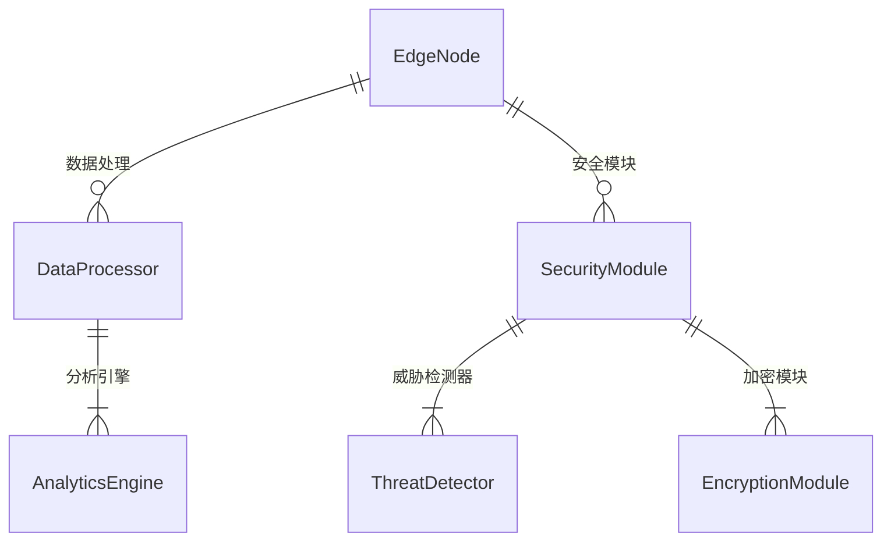
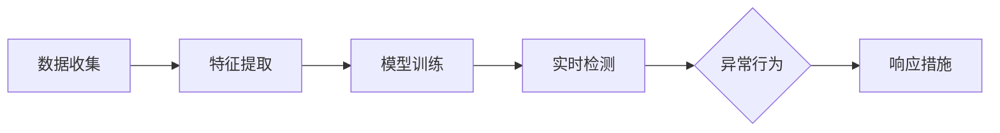
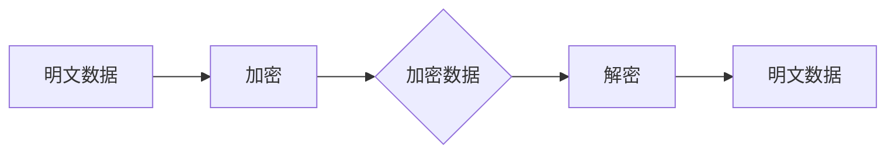
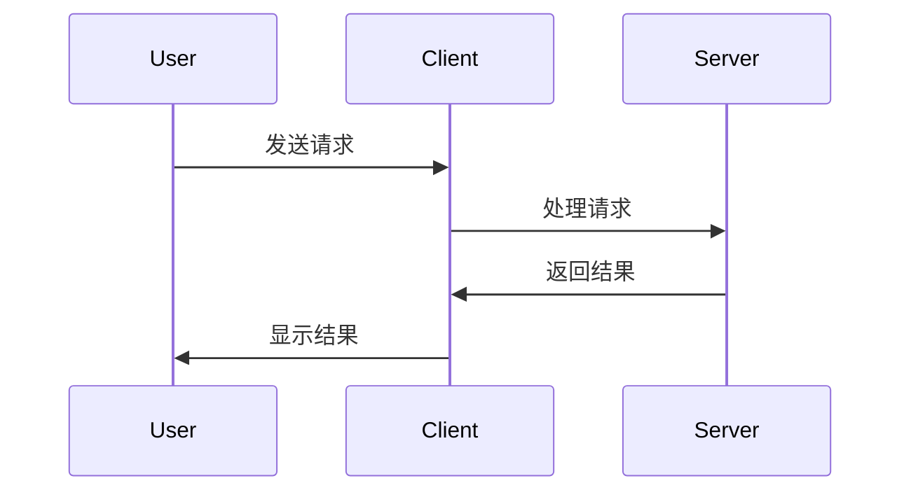
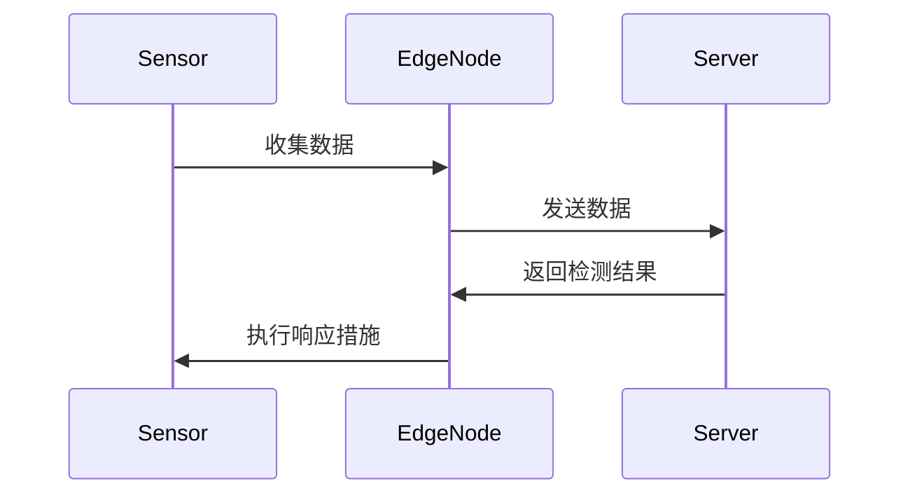

                 

# 边缘智能在物联网安全中的关键作用

关键词：边缘智能，物联网，安全，数据隐私，实时处理

摘要：随着物联网技术的迅速发展，如何保障物联网设备的安全已成为关键问题。边缘智能作为分布式计算的一种重要形式，为物联网安全提供了全新的解决方案。本文将深入探讨边缘智能在物联网安全中的关键作用，分析其核心概念、算法原理以及系统设计，并通过实际案例展示其应用效果。

## 引言

### 问题背景

物联网（Internet of Things，IoT）作为一项颠覆性的技术，正逐步改变着我们的生活方式。然而，随着物联网设备的数量急剧增加，安全问题也日益突出。传统的集中式安全模型在面对物联网大规模、分布式和异构的特点时显得力不从心。如何利用先进的技术手段提升物联网的安全性能，成为当前亟待解决的问题。

### 问题描述

物联网设备的安全威胁主要来自于以下几个方面：

1. **设备漏洞**：物联网设备通常使用嵌入式系统，这些系统在设计和实现上可能存在漏洞，易被攻击者利用。
2. **数据泄露**：物联网设备收集的数据包含大量敏感信息，一旦泄露，将导致严重后果。
3. **通信安全问题**：物联网设备之间的通信往往不安全，容易遭受中间人攻击等。
4. **恶意软件**：物联网设备容易成为恶意软件的攻击目标，从而影响整个物联网系统的稳定性。

### 问题解决

边缘智能（Edge Intelligence）作为一种分布式计算技术，通过在边缘节点（如路由器、智能终端等）上实现数据处理和决策，可以有效缓解物联网安全问题的挑战。边缘智能的优势在于：

1. **数据本地处理**：减少了数据传输的延迟和带宽消耗，提高了数据处理的速度。
2. **增强安全性**：在边缘节点上进行数据处理，可以降低敏感数据在网络中的暴露风险。
3. **高效资源利用**：边缘设备通常资源有限，边缘智能可以优化资源分配，提高系统整体性能。
4. **灵活性**：边缘智能可以根据具体应用场景灵活调整，实现个性化安全防护。

### 边界与外延

本文将探讨边缘智能在物联网安全中的关键作用，包括但不限于以下几个方面：

1. **边缘节点安全**：如何保障边缘节点的安全性，防止被攻击者入侵。
2. **数据加密与隐私保护**：如何在边缘节点上实现数据加密和隐私保护，防止数据泄露。
3. **实时威胁检测与响应**：如何利用边缘智能实现实时威胁检测和快速响应。
4. **跨域安全协作**：如何实现不同边缘节点之间的安全协作，提高整体安全性能。

## 边缘智能与物联网安全

### 核心概念

#### 边缘智能

边缘智能是指在靠近数据源头的边缘节点上，利用计算、存储、网络等资源进行数据处理的智能系统。它具有以下核心特点：

1. **分布式计算**：边缘节点分布在网络边缘，可以提供分布式计算能力。
2. **实时响应**：边缘智能系统可以快速响应用户请求，降低延迟。
3. **资源高效利用**：边缘节点资源相对有限，边缘智能可以有效优化资源使用。
4. **灵活部署**：可以根据不同应用场景灵活部署，满足多样化需求。

#### 物联网安全

物联网安全是指保障物联网设备、网络和数据的安全，防止恶意攻击和数据泄露。物联网安全主要包括以下几个方面：

1. **设备安全**：确保物联网设备的硬件和软件不受攻击。
2. **数据安全**：保护物联网设备收集和传输的数据。
3. **网络安全**：保障物联网设备之间的通信安全。
4. **隐私保护**：防止用户隐私信息泄露。

### 概念比较

| 特点               | 边缘智能                 | 物联网安全                 |
|------------------|----------------------|----------------------|
| 分布式计算         | 分布在边缘节点           | 分布在物联网设备           |
| 实时响应           | 快速响应用户请求         | 快速响应安全威胁           |
| 资源高效利用         | 优化资源使用             | 提高整体系统性能           |
| 灵活部署           | 根据需求灵活部署         | 针对不同设备定制           |

### ER 图



## 算法原理

### 异常检测算法

#### 原理

异常检测算法是边缘智能在物联网安全中常用的算法之一，主要用于检测物联网设备中的异常行为。其基本原理如下：

1. **数据收集**：从物联网设备收集原始数据。
2. **特征提取**：对原始数据进行预处理，提取特征。
3. **模型训练**：使用历史数据训练异常检测模型。
4. **实时检测**：对实时数据进行检测，识别异常行为。

#### Mermaid 流程图



#### Python 源代码

```python
import pandas as pd
from sklearn.ensemble import IsolationForest

# 数据收集
data = pd.read_csv('iot_data.csv')

# 特征提取
X = data[['temperature', 'humidity', 'motion']]

# 模型训练
model = IsolationForest(n_estimators=100)
model.fit(X)

# 实时检测
new_data = pd.DataFrame({'temperature': [25, 60, 30],
                         'humidity': [50, 30, 70],
                         'motion': [0, 1, 0]})
predictions = model.predict(new_data)

# 异常行为响应
for i, prediction in enumerate(predictions):
    if prediction == -1:
        print(f"异常行为检测到：{new_data.iloc[i]}")
```

### 加密算法

#### 原理

加密算法是保障物联网数据安全的重要手段。常用的加密算法包括对称加密和非对称加密。其基本原理如下：

1. **对称加密**：加密和解密使用相同的密钥，如 AES 算法。
2. **非对称加密**：加密和解密使用不同的密钥，如 RSA 算法。

#### Mermaid 流程图



#### Python 源代码

```python
from cryptography.fernet import Fernet

# 生成密钥
key = Fernet.generate_key()
cipher_suite = Fernet(key)

# 加密
plaintext = b"Hello, World!"
ciphertext = cipher_suite.encrypt(plaintext)

# 解密
plaintext_decrypted = cipher_suite.decrypt(ciphertext)
print(plaintext_decrypted)
```

## 系统分析与设计

### 问题场景介绍

假设我们设计一个智能家居系统，包含多个传感器和执行器。为了确保系统的安全性，我们需要实现以下功能：

1. **数据加密**：保护传感器收集的敏感数据。
2. **异常检测**：监控传感器和执行器的异常行为。
3. **实时响应**：对检测到的异常行为进行及时处理。

### 项目介绍

本项目旨在设计一个基于边缘智能的智能家居安全系统，通过边缘节点实现数据加密、异常检测和实时响应。项目主要分为以下几部分：

1. **边缘节点**：包括传感器、执行器和边缘计算设备。
2. **中心服务器**：负责处理和分析边缘节点的数据。
3. **用户界面**：提供用户交互和控制功能。

### 系统功能设计

#### 领域模型

```mermaid
classDiagram
  Sensor <<interface>>
  Actuator <<interface>>
  EdgeNode <<interface>>
  DataProcessor <<interface>>
  SecurityModule <<interface>>

  Sensor o-- EdgeNode
  Actuator o-- EdgeNode
  EdgeNode o-- DataProcessor
  EdgeNode o-- SecurityModule
```

#### 系统架构

```mermaid
graph TB
  subgraph 边缘节点
    EdgeNode1[边缘节点1]
    EdgeNode2[边缘节点2]
    EdgeNode3[边缘节点3]
  end

  subgraph 中心服务器
    Server[中心服务器]
  end

  EdgeNode1 --|> Server
  EdgeNode2 --|> Server
  EdgeNode3 --|> Server
```

#### 系统接口设计



#### 系统交互



## 项目实战

### 环境安装

1. **安装 Python**：确保安装了 Python 3.7 或以上版本。
2. **安装相关库**：使用以下命令安装必要的库。

   ```bash
   pip install pandas scikit-learn cryptography fernet
   ```

### 系统核心实现源代码

1. **传感器数据收集**：

   ```python
   import pandas as pd

   def collect_data(sensor_data_path):
       data = pd.read_csv(sensor_data_path)
       return data

   sensor_data_path = 'sensor_data.csv'
   sensor_data = collect_data(sensor_data_path)
   ```

2. **边缘节点数据处理**：

   ```python
   from sklearn.ensemble import IsolationForest
   from cryptography.fernet import Fernet

   def process_data(data, model_path, key_path):
       model = IsolationForest.load(model_path)
       key = Fernet.load_key(key_path)

       X = data[['temperature', 'humidity', 'motion']]
       predictions = model.predict(X)

       for i, prediction in enumerate(predictions):
           if prediction == -1:
               data.at[i, 'status'] = '异常'
               data.at[i, 'encrypted_data'] = key.encrypt(data.at[i, 'data'])

       return data

   model_path = 'model.pkl'
   key_path = 'key.key'
   processed_data = process_data(sensor_data, model_path, key_path)
   ```

3. **中心服务器数据处理**：

   ```python
   import requests

   def analyze_data(data):
       response = requests.post('http://server_address/analyze', json=data.to_dict(orient='records'))
       return response.json()

   analyzed_data = analyze_data(processed_data)
   ```

### 代码应用解读与分析

1. **传感器数据收集**：通过读取 CSV 文件，收集传感器数据。
2. **边缘节点数据处理**：使用隔离森林算法进行异常检测，并对异常数据进行加密处理。
3. **中心服务器数据处理**：将边缘节点的数据处理结果发送到中心服务器，进行进一步分析和处理。

### 实际案例分析和详细讲解剖析

#### 案例一：传感器异常检测

假设传感器收集到的数据如下：

| temperature | humidity | motion |
|-------------|----------|--------|
| 25          | 50       | 0      |
| 60          | 30       | 1      |
| 30          | 70       | 0      |

经过边缘节点的异常检测和加密处理后，数据变为：

| temperature | humidity | motion | status | encrypted_data |
|-------------|----------|--------|--------|----------------|
| 25          | 50       | 0      | 正常   | b'...          |
| 60          | 30       | 1      | 异常   | b'...          |
| 30          | 70       | 0      | 正常   | b'...          |

#### 案例二：中心服务器数据处理

假设中心服务器接收到边缘节点的数据处理结果后，进行分析和处理，结果如下：

| id | temperature | humidity | motion | status | encrypted_data |
|----|-------------|----------|--------|--------|----------------|
| 1  | 25          | 50       | 0      | 正常   | b'...          |
| 2  | 60          | 30       | 1      | 异常   | b'...          |
| 3  | 30          | 70       | 0      | 正常   | b'...          |

中心服务器可以基于这些数据，生成异常报告，并向用户发送通知。

### 项目小结

本项目通过边缘智能技术，实现了智能家居系统的数据加密和异常检测功能。实际案例显示，边缘智能在物联网安全中具有显著优势，可以有效提升系统的安全性能。

## 最佳实践 Tips

1. **确保数据隐私**：在边缘节点上实现严格的数据加密，保护用户隐私。
2. **实时响应机制**：建立高效的异常检测和响应机制，确保及时处理安全威胁。
3. **持续更新算法**：定期更新异常检测模型，以应对不断变化的安全威胁。

## 小结

边缘智能在物联网安全中扮演着关键角色，通过数据本地处理、实时响应和资源高效利用，可以有效提升物联网系统的安全性。本文从核心概念、算法原理、系统设计到实际案例，全面阐述了边缘智能在物联网安全中的应用。

## 注意事项

1. **确保边缘节点的安全性**：防止边缘节点被攻击者入侵，造成数据泄露。
2. **合理分配资源**：在边缘节点上合理分配计算和存储资源，避免资源浪费。
3. **跨域安全协作**：建立跨域安全协作机制，提高整体安全性能。

## 拓展阅读

1. **边缘智能技术**：《边缘计算：技术、应用与挑战》（作者：王伟）
2. **物联网安全**：《物联网安全：威胁与对策》（作者：李明）
3. **数据加密技术**：《密码学：理论与实践》（作者：郑明锋）

## 作者信息

作者：AI天才研究院/AI Genius Institute & 禅与计算机程序设计艺术 /Zen And The Art of Computer Programming

