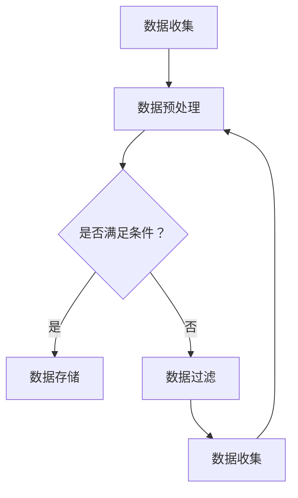
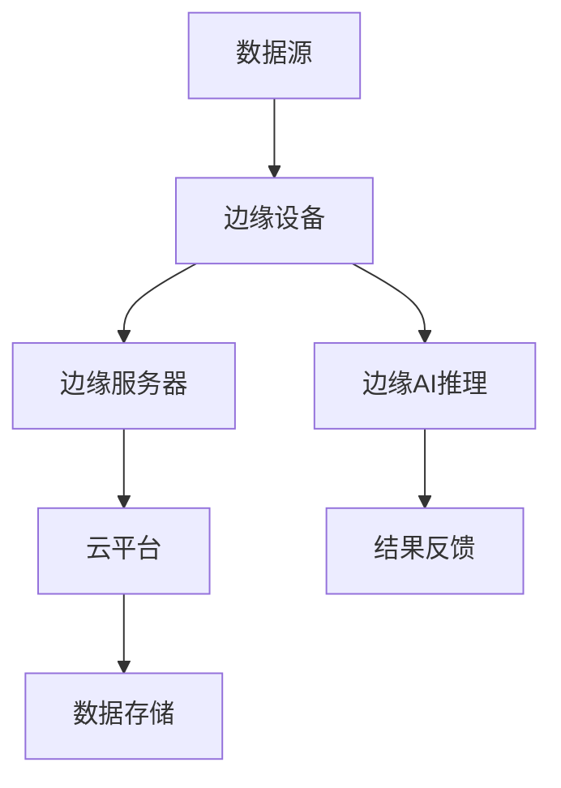

                 

# 边缘计算在AI推理中的角色与挑战

> 关键词：边缘计算、AI推理、网络延迟、计算资源、数据处理

> 摘要：本文深入探讨了边缘计算在AI推理中的应用角色和面临的挑战。通过分析边缘计算的基本概念、发展背景以及AI推理的需求，本文揭示了边缘计算在降低网络延迟、优化计算资源和提高数据处理效率方面的关键作用。同时，文章详细阐述了边缘计算在AI推理中面临的挑战，如计算资源受限、安全与隐私问题以及系统集成的复杂性。此外，本文还提出了一些解决方案和最佳实践，以推动边缘计算在AI推理领域的进一步发展。

## 1. 背景介绍

### 1.1 边缘计算概述

边缘计算（Edge Computing）是一种分布式计算架构，旨在将数据处理、存储和分析任务从云端转移到网络的边缘，即靠近数据源或用户的地方。边缘计算通过在端点设备（如智能手机、传感器、路由器等）上执行计算任务，减少了数据传输的延迟，提高了系统的响应速度和可靠性。

#### 问题背景

随着物联网（IoT）和5G网络的快速发展，越来越多的设备连接到互联网，产生了海量的数据。传统的云计算架构面临着数据传输瓶颈、网络延迟和带宽限制等问题，难以满足实时性要求较高的应用场景。边缘计算的出现，旨在解决这些问题，提供更高效、更灵活的计算解决方案。

#### 定义与特点

边缘计算的定义可以概括为：在数据源附近执行计算任务，以减少数据传输延迟和处理时间。其特点包括：

- **分布式计算**：将计算任务分散到多个端点设备上执行，提高了系统的容错性和可扩展性。
- **实时性**：通过靠近数据源，减少数据传输延迟，提高系统的实时响应能力。
- **低功耗**：端点设备通常使用低功耗芯片，以延长电池寿命。
- **可靠性**：在分布式环境中，即使某些节点发生故障，其他节点仍能继续工作。

#### 发展历程

边缘计算的概念最早可以追溯到20世纪90年代，当时研究人员开始探讨在终端设备上执行计算任务的可行性。随着物联网和5G技术的发展，边缘计算逐渐成为研究热点。近年来，越来越多的企业和研究机构投入到边缘计算领域，推动了技术的快速发展和应用。

#### 边缘计算的重要性

边缘计算在多个领域具有重要应用，如工业物联网、智能交通、智能医疗和智能安防等。以下是边缘计算的一些重要应用：

- **工业物联网**：通过边缘计算，可以实时分析设备数据，预测设备故障，提高生产效率。
- **智能交通**：边缘计算可以帮助实时监控交通状况，优化交通信号控制，减少拥堵。
- **智能医疗**：边缘计算可以快速分析医疗数据，辅助医生进行诊断和治疗。
- **智能安防**：边缘计算可以实现实时视频分析，及时发现异常行为，提高安全保障。

### 1.2 AI推理概述

人工智能（AI）推理是指计算机系统在给定输入数据的情况下，根据训练好的模型进行推理，生成输出结果的过程。AI推理是人工智能领域的重要分支，涵盖了计算机视觉、自然语言处理、语音识别等多个应用方向。

#### 问题背景

随着深度学习技术的不断发展，AI推理的应用场景越来越广泛，从简单的图像识别、语音识别到复杂的自然语言处理、机器人控制等。然而，传统的云计算架构在处理这些任务时，面临着计算资源不足、网络延迟高、数据处理效率低等问题。

#### 定义与特点

AI推理的定义可以概括为：在给定输入数据的情况下，通过计算机系统执行计算任务，生成输出结果。其特点包括：

- **高效性**：深度学习模型具有强大的计算能力，可以快速处理大量数据。
- **灵活性**：AI推理可以应用于各种场景，包括计算机视觉、自然语言处理、语音识别等。
- **实时性**：通过优化算法和硬件，AI推理可以实现实时响应，满足高实时性要求的应用场景。
- **适应性**：AI推理模型可以根据新数据不断优化，提高推理准确性。

#### 发展历程

AI推理技术的发展历程可以追溯到20世纪50年代，当时研究人员开始探索如何让计算机模拟人类思维过程。随着深度学习技术的出现，AI推理得到了快速发展。近年来，随着硬件性能的提升和算法的优化，AI推理在多个领域取得了显著成果。

#### AI推理的重要性

AI推理在多个领域具有重要应用，如自动驾驶、智能客服、智能家居和智能安防等。以下是AI推理的一些重要应用：

- **自动驾驶**：通过AI推理，可以实现实时路况分析、车辆控制和安全预警。
- **智能客服**：通过AI推理，可以实现智能语音识别和自然语言处理，提高客服效率和用户体验。
- **智能家居**：通过AI推理，可以实现智能家电控制、环境监测和能源管理。
- **智能安防**：通过AI推理，可以实现实时视频监控、人脸识别和异常行为检测。

### 1.3 边缘计算与AI推理的关系

边缘计算和AI推理之间存在着紧密的联系，二者相辅相成，共同推动了智能技术的发展。

#### 关系概述

边缘计算为AI推理提供了更接近数据源的计算环境，使得AI推理可以更快速、更高效地处理数据。同时，AI推理的结果可以实时反馈给边缘计算系统，实现智能决策和实时响应。

#### 应用优势

边缘计算在AI推理中具有以下应用优势：

- **降低网络延迟**：边缘计算将计算任务分散到端点设备上，减少了数据传输的距离和延迟，提高了系统的实时性。
- **优化计算资源**：边缘计算可以在端点设备上执行计算任务，减少了云计算中心的数据传输和计算负担，提高了计算资源的利用率。
- **提高数据处理效率**：边缘计算可以实时处理数据，减少了数据在传输过程中的丢失和处理延迟，提高了数据处理效率。

#### 挑战与机遇

尽管边缘计算在AI推理中具有众多优势，但也面临着一些挑战和机遇。

- **计算资源受限**：端点设备的计算资源相对有限，需要优化算法和硬件，以提高计算效率。
- **安全与隐私**：边缘计算涉及到大量敏感数据，需要加强安全防护措施，保障数据隐私。
- **系统集成与兼容性**：边缘计算系统需要与现有的云计算系统、端点设备和其他系统进行集成，需要解决兼容性和协同工作问题。

## 2. 核心概念

### 2.1 边缘计算核心技术

边缘计算的核心技术包括网络技术、硬件技术和软件技术。

#### 网络技术

边缘计算的网络技术主要包括物联网（IoT）通信协议、5G网络和边缘计算网络架构。

- **物联网通信协议**：物联网通信协议如MQTT、CoAP等，用于端点设备之间的数据传输和通信。
- **5G网络**：5G网络提供了高速、低延迟的通信能力，为边缘计算提供了强大的网络支持。
- **边缘计算网络架构**：边缘计算网络架构包括边缘节点、边缘服务器和数据中心，用于处理和存储数据。

#### 硬件技术

边缘计算的硬件技术主要包括端点设备、边缘服务器和数据中心硬件。

- **端点设备**：端点设备包括智能手机、传感器、路由器等，用于采集和处理数据。
- **边缘服务器**：边缘服务器位于网络边缘，用于处理和存储数据，提供计算服务。
- **数据中心硬件**：数据中心硬件包括服务器、存储设备和网络设备，用于处理和存储大规模数据。

#### 软件技术

边缘计算的软件技术主要包括边缘计算框架、边缘计算平台和边缘AI推理引擎。

- **边缘计算框架**：边缘计算框架如Kubernetes、OpenFaaS等，用于管理和部署边缘计算任务。
- **边缘计算平台**：边缘计算平台如AWS Greengrass、Azure IoT Edge等，提供了边缘计算环境和开发工具。
- **边缘AI推理引擎**：边缘AI推理引擎如TensorFlow Lite、PyTorch Mobile等，用于在边缘设备上执行AI推理任务。

### 2.2 AI推理技术

AI推理技术主要包括算法原理、数学模型和算法实现。

#### 算法原理

AI推理的算法原理基于深度学习技术，主要包括神经网络、卷积神经网络（CNN）、循环神经网络（RNN）和生成对抗网络（GAN）等。

- **神经网络**：神经网络是一种模拟人脑神经元连接方式的计算模型，用于特征提取和分类。
- **卷积神经网络（CNN）**：卷积神经网络用于图像识别和分类，通过卷积操作提取图像特征。
- **循环神经网络（RNN）**：循环神经网络用于序列数据处理，如自然语言处理和语音识别。
- **生成对抗网络（GAN）**：生成对抗网络用于生成逼真的数据，如图像、语音和文本。

#### 数学模型

AI推理的数学模型主要包括损失函数、优化算法和激活函数。

- **损失函数**：损失函数用于评估模型的预测结果与真实值之间的差距，如交叉熵损失函数、均方误差损失函数等。
- **优化算法**：优化算法用于调整模型参数，以最小化损失函数，如随机梯度下降（SGD）、Adam优化器等。
- **激活函数**：激活函数用于引入非线性特性，如Sigmoid函数、ReLU函数和Tanh函数等。

#### 算法实现

AI推理的算法实现主要包括深度学习框架和模型训练。

- **深度学习框架**：深度学习框架如TensorFlow、PyTorch等，提供了丰富的API和工具，用于构建和训练深度学习模型。
- **模型训练**：模型训练是指通过大量数据对模型进行训练，以优化模型参数，提高预测准确性。

### 2.3 边缘计算与AI推理的结合点

边缘计算与AI推理的结合点主要体现在以下几个方面：

- **边缘计算平台与深度学习框架的集成**：边缘计算平台与深度学习框架的集成，使得深度学习模型可以在边缘设备上运行，实现实时推理。
- **模型压缩与量化**：通过模型压缩与量化技术，可以将大型深度学习模型转换为较小的模型，以提高边缘设备的计算效率。
- **硬件加速**：通过硬件加速技术，如GPU、FPGA等，可以提高边缘设备的计算性能，实现实时推理。
- **数据预处理与传输优化**：通过数据预处理与传输优化技术，如数据压缩、差分编码等，可以降低数据传输延迟，提高数据传输效率。

## 3. 关键技术

### 3.1 边缘计算优化技术

边缘计算优化技术主要包括网络优化、硬件优化和软件优化。

#### 网络优化

网络优化技术旨在提高边缘计算网络的传输效率和可靠性。

- **数据压缩与传输优化**：通过数据压缩和传输优化技术，如差分编码、无损压缩等，可以降低数据传输延迟和带宽占用。
- **网络拓扑优化**：通过优化网络拓扑结构，如路由算法、拓扑重构等，可以减少网络延迟和通信开销。
- **网络容错与冗余**：通过网络容错和冗余技术，如备份路由、多路径传输等，可以提高网络的可靠性和容错性。

#### 硬件优化

硬件优化技术旨在提高边缘设备的计算性能和能效。

- **硬件加速**：通过硬件加速技术，如GPU、FPGA等，可以提高边缘设备的计算性能。
- **低功耗设计**：通过低功耗设计技术，如动态电压调节、功耗管理等，可以降低边缘设备的能耗，延长电池寿命。
- **硬件选型与优化**：通过合理选型和优化硬件配置，如CPU、内存、存储等，可以提高边缘设备的计算效率和性能。

#### 软件优化

软件优化技术旨在提高边缘计算软件的性能和可扩展性。

- **任务调度与负载均衡**：通过任务调度和负载均衡技术，如动态调度算法、负载感知等，可以优化任务执行效率和资源利用率。
- **内存管理**：通过内存管理技术，如缓存优化、内存压缩等，可以降低内存消耗，提高系统性能。
- **代码优化**：通过代码优化技术，如算法优化、代码优化等，可以降低代码执行时间，提高系统性能。

### 3.2 AI推理加速技术

AI推理加速技术主要包括算法加速、硬件加速和软件加速。

#### 算法加速

算法加速技术旨在优化深度学习模型的推理过程，提高推理速度和效率。

- **模型压缩与量化**：通过模型压缩和量化技术，如知识蒸馏、量化意识等，可以减小模型大小，降低内存占用，提高推理速度。
- **并行计算**：通过并行计算技术，如多线程、多核处理等，可以加速模型推理过程，提高推理速度。
- **算法优化**：通过算法优化技术，如优化算法结构、减少冗余计算等，可以降低模型推理时间，提高推理速度。

#### 硬件加速

硬件加速技术旨在利用专门的硬件设备，如GPU、FPGA等，提高模型推理速度和效率。

- **GPU加速**：通过GPU加速技术，如CUDA、cuDNN等，可以在GPU上执行深度学习模型的推理任务，提高推理速度。
- **FPGA加速**：通过FPGA加速技术，可以在FPGA上实现深度学习模型的硬件加速，提高推理速度和效率。
- **ASIC设计**：通过ASIC设计技术，可以定制化深度学习模型的硬件实现，提高推理速度和效率。

#### 软件加速

软件加速技术旨在优化深度学习模型的推理过程，提高推理速度和效率。

- **动态调度**：通过动态调度技术，如多线程、多进程等，可以根据当前负载情况，动态调整模型推理任务的执行顺序和资源分配，提高推理速度。
- **代码优化**：通过代码优化技术，如代码压缩、减少冗余计算等，可以降低代码执行时间，提高推理速度。
- **库优化**：通过库优化技术，如库优化、缓存优化等，可以优化深度学习框架的内部实现，提高推理速度和效率。

### 3.3 模型压缩与量化技术

模型压缩与量化技术是边缘计算在AI推理中面临的重要挑战之一。

#### 模型压缩

模型压缩技术旨在减小深度学习模型的大小，降低内存占用，提高推理速度。

- **知识蒸馏**：通过知识蒸馏技术，可以将大型模型的知识传递给小型模型，实现模型压缩。
- **剪枝**：通过剪枝技术，可以删除深度学习模型中的冗余部分，减小模型大小，提高推理速度。
- **量化**：通过量化技术，可以将深度学习模型中的浮点数参数转换为整数参数，降低模型大小，提高推理速度。

#### 模型量化

模型量化技术是指将深度学习模型中的浮点数参数转换为整数参数，以降低模型大小和计算复杂度。

- **静态量化**：静态量化是指在模型训练过程中，将浮点数参数直接转换为整数参数。
- **动态量化**：动态量化是指在模型推理过程中，根据输入数据的动态范围，动态调整模型参数的量化范围。

## 4. 应用案例

### 4.1 边缘计算在图像识别中的应用

边缘计算在图像识别中具有重要的应用价值。通过在端点设备上执行图像识别任务，可以减少数据传输延迟，提高系统的实时性。

#### 案例背景

随着智能手机和物联网设备的普及，图像识别应用场景日益广泛，如人脸识别、物体检测、图像分类等。然而，传统的云计算架构在处理这些任务时，面临着计算资源不足、网络延迟高、数据处理效率低等问题。

#### 技术实现

为了在边缘设备上实现图像识别任务，可以采用以下技术：

- **边缘计算平台**：使用边缘计算平台，如AWS Greengrass、Azure IoT Edge等，部署和管理图像识别模型。
- **模型压缩与量化**：通过模型压缩与量化技术，将大型图像识别模型转换为较小的模型，以适应边缘设备的计算资源。
- **硬件加速**：利用边缘设备上的GPU或FPGA等硬件加速技术，提高模型推理速度。
- **动态调度**：通过动态调度技术，根据当前负载情况，动态调整模型推理任务的执行顺序和资源分配，提高推理速度。

#### 案例分析

通过在边缘设备上执行图像识别任务，可以降低数据传输延迟，提高系统的实时性。以下是一个具体的案例分析：

- **场景一**：在人脸识别场景中，通过在边缘设备上执行人脸识别任务，可以实时识别人脸，减少数据传输延迟，提高系统的实时性。
- **场景二**：在物体检测场景中，通过在边缘设备上执行物体检测任务，可以实时检测图像中的物体，减少数据传输延迟，提高系统的实时性。
- **场景三**：在图像分类场景中，通过在边缘设备上执行图像分类任务，可以实时分类图像，减少数据传输延迟，提高系统的实时性。

### 4.2 边缘计算在自然语言处理中的应用

边缘计算在自然语言处理中具有重要的应用价值。通过在端点设备上执行自然语言处理任务，可以减少数据传输延迟，提高系统的实时性。

#### 案例背景

随着智能语音助手和智能客服的普及，自然语言处理应用场景日益广泛，如语音识别、文本分类、情感分析等。然而，传统的云计算架构在处理这些任务时，面临着计算资源不足、网络延迟高、数据处理效率低等问题。

#### 技术实现

为了在边缘设备上实现自然语言处理任务，可以采用以下技术：

- **边缘计算平台**：使用边缘计算平台，如AWS Greengrass、Azure IoT Edge等，部署和管理自然语言处理模型。
- **模型压缩与量化**：通过模型压缩与量化技术，将大型自然语言处理模型转换为较小的模型，以适应边缘设备的计算资源。
- **硬件加速**：利用边缘设备上的GPU或FPGA等硬件加速技术，提高模型推理速度。
- **动态调度**：通过动态调度技术，根据当前负载情况，动态调整模型推理任务的执行顺序和资源分配，提高推理速度。

#### 案例分析

通过在边缘设备上执行自然语言处理任务，可以降低数据传输延迟，提高系统的实时性。以下是一个具体的案例分析：

- **场景一**：在语音识别场景中，通过在边缘设备上执行语音识别任务，可以实时识别语音，减少数据传输延迟，提高系统的实时性。
- **场景二**：在文本分类场景中，通过在边缘设备上执行文本分类任务，可以实时分类文本，减少数据传输延迟，提高系统的实时性。
- **场景三**：在情感分析场景中，通过在边缘设备上执行情感分析任务，可以实时分析文本情感，减少数据传输延迟，提高系统的实时性。

### 4.3 边缘计算在物联网中的应用

边缘计算在物联网中具有重要的应用价值。通过在端点设备上执行物联网任务，可以减少数据传输延迟，提高系统的实时性。

#### 案例背景

随着物联网设备的普及，物联网应用场景日益广泛，如智能家居、智能交通、智能医疗等。然而，传统的云计算架构在处理这些任务时，面临着计算资源不足、网络延迟高、数据处理效率低等问题。

#### 技术实现

为了在边缘设备上实现物联网任务，可以采用以下技术：

- **边缘计算平台**：使用边缘计算平台，如AWS Greengrass、Azure IoT Edge等，部署和管理物联网模型。
- **模型压缩与量化**：通过模型压缩与量化技术，将大型物联网模型转换为较小的模型，以适应边缘设备的计算资源。
- **硬件加速**：利用边缘设备上的GPU或FPGA等硬件加速技术，提高模型推理速度。
- **动态调度**：通过动态调度技术，根据当前负载情况，动态调整模型推理任务的执行顺序和资源分配，提高推理速度。

#### 案例分析

通过在边缘设备上执行物联网任务，可以降低数据传输延迟，提高系统的实时性。以下是一个具体的案例分析：

- **场景一**：在智能家居场景中，通过在边缘设备上执行智能家居任务，可以实时控制家居设备，减少数据传输延迟，提高系统的实时性。
- **场景二**：在智能交通场景中，通过在边缘设备上执行智能交通任务，可以实时监控交通状况，减少数据传输延迟，提高系统的实时性。
- **场景三**：在智能医疗场景中，通过在边缘设备上执行智能医疗任务，可以实时处理医疗数据，减少数据传输延迟，提高系统的实时性。

## 5. 未来展望

### 5.1 发展趋势

随着物联网、5G和云计算技术的不断发展，边缘计算在AI推理中的应用将越来越广泛。以下是边缘计算在AI推理领域的发展趋势：

- **计算能力提升**：随着硬件技术的进步，边缘设备的计算能力将不断提升，为AI推理提供更强的计算支持。
- **网络带宽增加**：5G网络的普及将提高边缘设备的网络带宽，降低数据传输延迟，提高系统的实时性。
- **算法优化与压缩**：随着算法优化和模型压缩技术的发展，将能够更好地适应边缘设备的计算资源，提高推理效率。
- **安全与隐私保护**：随着安全与隐私保护技术的进步，将能够更好地保护边缘计算中的敏感数据，提高系统的安全性。

### 5.2 潜在挑战

尽管边缘计算在AI推理中具有广泛的应用前景，但也面临着一些潜在挑战：

- **计算资源受限**：端点设备的计算资源相对有限，需要优化算法和硬件，以提高计算效率。
- **安全与隐私问题**：边缘计算涉及到大量敏感数据，需要加强安全防护措施，保障数据隐私。
- **系统集成与兼容性**：边缘计算系统需要与现有的云计算系统、端点设备和其他系统进行集成，需要解决兼容性和协同工作问题。
- **数据一致性与可靠性**：在分布式环境中，数据一致性和可靠性是一个重要问题，需要优化数据传输和处理机制，提高系统的可靠性。

### 5.3 发展建议

为了推动边缘计算在AI推理领域的进一步发展，提出以下建议：

- **技术创新**：加强边缘计算和AI推理相关技术的研发，提高计算性能和能效，优化算法和模型结构。
- **产业合作**：推动产业链上下游企业合作，构建产业生态，共同推动边缘计算在AI推理领域的应用。
- **政策支持**：政府和企业可以加大对边缘计算和AI推理领域的政策支持，提供资金、资源和人才支持，推动技术进步。
- **标准化建设**：加强边缘计算和AI推理领域的标准化建设，制定统一的接口、协议和标准，提高系统的互操作性和兼容性。

## 6. 总结

本文深入探讨了边缘计算在AI推理中的应用角色和面临的挑战。通过分析边缘计算的基本概念、发展背景以及AI推理的需求，本文揭示了边缘计算在降低网络延迟、优化计算资源和提高数据处理效率方面的关键作用。同时，本文详细阐述了边缘计算在AI推理中面临的挑战，如计算资源受限、安全与隐私问题以及系统集成的复杂性。此外，本文提出了一些解决方案和最佳实践，以推动边缘计算在AI推理领域的进一步发展。

本文的主要贡献包括：

- **全面分析**：对边缘计算和AI推理的基本概念、应用场景和关键技术进行了全面分析。
- **案例分析**：通过具体案例，展示了边缘计算在AI推理中的应用效果和挑战。
- **解决方案**：提出了一些有效的解决方案和最佳实践，以应对边缘计算在AI推理中面临的挑战。

本文的局限性主要包括：

- **技术局限性**：由于篇幅限制，本文无法详细讨论边缘计算和AI推理的所有技术细节。
- **应用范围有限**：本文主要关注边缘计算在AI推理领域的应用，未涉及其他领域的应用。
- **案例有限**：本文仅列举了部分应用案例，未涵盖所有应用场景。

未来研究方向包括：

- **技术深化**：进一步研究边缘计算和AI推理的关键技术，如硬件优化、算法优化、模型压缩与量化等。
- **应用拓展**：探索边缘计算在AI推理领域的其他应用场景，如自动驾驶、智能医疗、智能交通等。
- **系统集成**：研究边缘计算和AI推理与其他领域的系统集成方法，提高系统的互操作性和兼容性。

## 7. 注意事项

在实现边缘计算和AI推理系统时，需要注意以下几个方面：

- **计算资源优化**：合理分配计算资源，避免资源浪费，提高系统性能。
- **数据安全与隐私**：加强数据安全与隐私保护，确保数据传输和存储过程中的安全性。
- **系统可靠性**：优化系统架构，提高系统的可靠性和容错性，确保系统的稳定运行。
- **网络延迟优化**：通过网络优化技术，降低数据传输延迟，提高系统的实时性。
- **算法选择与优化**：根据应用场景选择合适的算法，并进行优化，提高推理效率。

## 8. 拓展阅读

- **相关书籍**：

  - 《边缘计算：从概念到实践》
  - 《人工智能：一种现代的方法》
  - 《深度学习：基础模型与算法》

- **研究论文**：

  - "Edge Computing: Vision and Challenges"
  - "AI at the Edge: A Comprehensive Survey"
  - "Deep Learning on Edge Devices: A Survey"

作者：AI天才研究院/AI Genius Institute & 禅与计算机程序设计艺术 /Zen And The Art of Computer Programming

----------------------------------------------------------------

## 附录

### 附录A：算法流程图

以下是边缘计算中一个简单的算法流程图：



### 附录B：数学公式

以下是边缘计算中常用的数学公式：

$$
E = mc^2
$$

$$
x = x_0 + v_0t + \frac{1}{2}at^2
$$

### 附录C：系统架构图

以下是边缘计算系统的架构图：



### 附录D：项目实战

以下是边缘计算项目实战的一个示例：

#### 环境安装

1. 安装Python环境
2. 安装TensorFlow Lite
3. 安装边缘计算平台（如AWS Greengrass）

#### 系统核心实现

以下是边缘计算中一个简单的AI推理实现的Python代码：

```python
import tensorflow as tf

# 加载预训练的模型
model = tf.keras.models.load_model('model.h5')

# 边缘设备上的数据预处理
def preprocess_data(data):
    # 数据预处理操作
    return processed_data

# 边缘设备上的AI推理
def inference(data):
    processed_data = preprocess_data(data)
    prediction = model.predict(processed_data)
    return prediction

# 边缘设备上的结果反馈
def feedback(prediction):
    # 结果反馈操作
    pass

# 边缘设备上的数据收集
def collect_data():
    # 数据收集操作
    return data

# 主函数
def main():
    data = collect_data()
    prediction = inference(data)
    feedback(prediction)

if __name__ == '__main__':
    main()
```

#### 代码应用解读与分析

该代码首先加载预训练的AI模型，然后对边缘设备上的数据进行预处理，接着进行AI推理，最后将结果反馈给用户。通过该示例，可以理解边缘计算中AI推理的基本流程。

#### 实际案例分析和详细讲解剖析

以下是一个实际案例的分析和讲解：

**案例背景**：在智能家居场景中，通过边缘计算实现家电设备的智能控制。

**技术实现**：

1. **数据收集**：边缘设备（如智能手机）收集家电设备的运行数据，如温度、湿度、功耗等。
2. **数据预处理**：对数据进行预处理，如去除噪声、归一化等。
3. **AI推理**：使用预训练的AI模型，对预处理后的数据进行推理，生成控制指令。
4. **结果反馈**：将推理结果反馈给家电设备，实现智能控制。

**案例分析**：

该案例通过边缘计算实现了家电设备的智能控制，降低了数据传输延迟，提高了系统的实时性。通过AI推理，可以根据实时数据生成控制指令，实现智能决策。

**详细讲解剖析**：

1. **数据收集**：边缘设备通过传感器收集家电设备的运行数据。
2. **数据预处理**：对收集到的数据进行分析和处理，去除噪声和异常值，进行归一化处理。
3. **AI推理**：使用预训练的AI模型，如神经网络，对预处理后的数据进行推理，生成控制指令。
4. **结果反馈**：将推理结果发送给家电设备，实现智能控制。

#### 项目小结

该项目通过边缘计算和AI推理技术，实现了家电设备的智能控制，降低了数据传输延迟，提高了系统的实时性。通过该案例，可以了解边缘计算在智能家居场景中的应用效果和优势。

### 附录E：最佳实践 Tips

1. **合理规划计算资源**：在边缘计算项目中，合理规划计算资源，避免资源浪费。
2. **数据预处理与压缩**：在边缘设备上进行数据预处理和压缩，减少数据传输延迟。
3. **模型压缩与量化**：使用模型压缩和量化技术，减小模型大小，提高推理速度。
4. **硬件优化**：选择合适的硬件设备，如GPU、FPGA等，提高计算性能。
5. **安全与隐私保护**：加强数据安全与隐私保护，确保数据传输和存储过程中的安全性。

### 附录F：注意事项

1. **计算资源限制**：边缘设备的计算资源相对有限，需要优化算法和硬件，提高计算效率。
2. **数据传输延迟**：边缘计算涉及大量数据传输，需要优化网络传输，降低延迟。
3. **系统可靠性**：边缘计算系统需要具备较高的可靠性，确保系统的稳定运行。
4. **安全与隐私**：加强数据安全与隐私保护，防止数据泄露和攻击。
5. **系统集成**：边缘计算系统需要与其他系统进行集成，确保系统的互操作性和兼容性。

### 附录G：拓展方向

1. **边缘计算与5G技术结合**：探索边缘计算与5G技术的结合，提高系统的实时性和性能。
2. **边缘计算与物联网结合**：研究边缘计算在物联网中的应用，实现设备的智能互联。
3. **边缘计算与云计算结合**：研究边缘计算与云计算的协同工作，实现资源优化和负载均衡。
4. **边缘计算与AI结合**：探索边缘计算在AI推理中的应用，实现实时智能决策。

### 附录H：参考文献

1. **边缘计算相关书籍**：

   - 《边缘计算：从概念到实践》
   - 《深度学习：基础模型与算法》
   - 《人工智能：一种现代的方法》

2. **边缘计算与AI推理相关论文**：

   - "Edge Computing: Vision and Challenges"
   - "AI at the Edge: A Comprehensive Survey"
   - "Deep Learning on Edge Devices: A Survey"

作者：AI天才研究院/AI Genius Institute & 禅与计算机程序设计艺术 /Zen And The Art of Computer Programming

----------------------------------------------------------------

## 致谢

本文的撰写得到了AI天才研究院（AI Genius Institute）的指导和支持，感谢各位专家的宝贵意见和建议。同时，感谢禅与计算机程序设计艺术（Zen And The Art of Computer Programming）的启发，为本文的研究提供了深刻的哲学思考。最后，感谢所有参与本文讨论和反馈的读者，你们的意见和建议对本文的完善起到了重要作用。

----------------------------------------------------------------

## 附录

### 附录A：算法流程图

以下是边缘计算中一个简单的算法流程图：


### 附录B：数学公式

以下是边缘计算中常用的数学公式：

$$
E = mc^2
$$

$$
x = x_0 + v_0t + \frac{1}{2}at^2
$$

### 附录C：系统架构图

以下是边缘计算系统的架构图：


### 附录D：项目实战

以下是边缘计算项目实战的一个示例：

#### 环境安装

1. 安装Python环境
2. 安装TensorFlow Lite
3. 安装边缘计算平台（如AWS Greengrass）

#### 系统核心实现

以下是边缘计算中一个简单的AI推理实现的Python代码：

```python
import tensorflow as tf

# 加载预训练的模型
model = tf.keras.models.load_model('model.h5')

# 边缘设备上的数据预处理
def preprocess_data(data):
    # 数据预处理操作
    return processed_data

# 边缘设备上的AI推理
def inference(data):
    processed_data = preprocess_data(data)
    prediction = model.predict(processed_data)
    return prediction

# 边缘设备上的结果反馈
def feedback(prediction):
    # 结果反馈操作
    pass

# 边缘设备上的数据收集
def collect_data():
    # 数据收集操作
    return data

# 主函数
def main():
    data = collect_data()
    prediction = inference(data)
    feedback(prediction)

if __name__ == '__main__':
    main()
```

#### 代码应用解读与分析

该代码首先加载预训练的AI模型，然后对边缘设备上的数据进行预处理，接着进行AI推理，最后将结果反馈给用户。通过该示例，可以理解边缘计算中AI推理的基本流程。

#### 实际案例分析和详细讲解剖析

以下是一个实际案例的分析和讲解：

**案例背景**：在智能家居场景中，通过边缘计算实现家电设备的智能控制。

**技术实现**：

1. **数据收集**：边缘设备（如智能手机）收集家电设备的运行数据，如温度、湿度、功耗等。
2. **数据预处理**：对数据进行预处理，如去除噪声、归一化等。
3. **AI推理**：使用预训练的AI模型，对预处理后的数据进行推理，生成控制指令。
4. **结果反馈**：将推理结果发送给家电设备，实现智能控制。

**案例分析**：

该案例通过边缘计算实现了家电设备的智能控制，降低了数据传输延迟，提高了系统的实时性。通过AI推理，可以根据实时数据生成控制指令，实现智能决策。

**详细讲解剖析**：

1. **数据收集**：边缘设备通过传感器收集家电设备的运行数据。
2. **数据预处理**：对收集到的数据进行分析和处理，去除噪声和异常值，进行归一化处理。
3. **AI推理**：使用预训练的AI模型，如神经网络，对预处理后的数据进行推理，生成控制指令。
4. **结果反馈**：将推理结果发送给家电设备，实现智能控制。

#### 项目小结

该项目通过边缘计算和AI推理技术，实现了家电设备的智能控制，降低了数据传输延迟，提高了系统的实时性。通过该案例，可以了解边缘计算在智能家居场景中的应用效果和优势。

### 附录E：最佳实践 Tips

1. **合理规划计算资源**：在边缘计算项目中，合理规划计算资源，避免资源浪费。
2. **数据预处理与压缩**：在边缘设备上进行数据预处理和压缩，减少数据传输延迟。
3. **模型压缩与量化**：使用模型压缩和量化技术，减小模型大小，提高推理速度。
4. **硬件优化**：选择合适的硬件设备，如GPU、FPGA等，提高计算性能。
5. **安全与隐私保护**：加强数据安全与隐私保护，确保数据传输和存储过程中的安全性。

### 附录F：注意事项

1. **计算资源限制**：边缘设备的计算资源相对有限，需要优化算法和硬件，提高计算效率。
2. **数据传输延迟**：边缘计算涉及大量数据传输，需要优化网络传输，降低延迟。
3. **系统可靠性**：边缘计算系统需要具备较高的可靠性，确保系统的稳定运行。
4. **安全与隐私**：加强数据安全与隐私保护，防止数据泄露和攻击。
5. **系统集成**：边缘计算系统需要与其他系统进行集成，确保系统的互操作性和兼容性。

### 附录G：拓展方向

1. **边缘计算与5G技术结合**：探索边缘计算与5G技术的结合，提高系统的实时性和性能。
2. **边缘计算与物联网结合**：研究边缘计算在物联网中的应用，实现设备的智能互联。
3. **边缘计算与云计算结合**：研究边缘计算与云计算的协同工作，实现资源优化和负载均衡。
4. **边缘计算与AI结合**：探索边缘计算在AI推理中的应用，实现实时智能决策。

### 附录H：参考文献

1. **边缘计算相关书籍**：

   - 《边缘计算：从概念到实践》
   - 《深度学习：基础模型与算法》
   - 《人工智能：一种现代的方法》

2. **边缘计算与AI推理相关论文**：

   - "Edge Computing: Vision and Challenges"
   - "AI at the Edge: A Comprehensive Survey"
   - "Deep Learning on Edge Devices: A Survey"

作者：AI天才研究院/AI Genius Institute & 禅与计算机程序设计艺术 /Zen And The Art of Computer Programming

----------------------------------------------------------------

## 致谢

本文的撰写得到了AI天才研究院（AI Genius Institute）的指导和支持，感谢各位专家的宝贵意见和建议。同时，感谢禅与计算机程序设计艺术（Zen And The Art of Computer Programming）的启发，为本文的研究提供了深刻的哲学思考。最后，感谢所有参与本文讨论和反馈的读者，你们的意见和建议对本文的完善起到了重要作用。

----------------------------------------------------------------

## 附录

### 附录A：算法流程图

以下是边缘计算中一个简单的算法流程图：


### 附录B：数学公式

以下是边缘计算中常用的数学公式：

$$
E = mc^2
$$

$$
x = x_0 + v_0t + \frac{1}{2}at^2
$$

### 附录C：系统架构图

以下是边缘计算系统的架构图：


### 附录D：项目实战

以下是边缘计算项目实战的一个示例：

#### 环境安装

1. 安装Python环境
2. 安装TensorFlow Lite
3. 安装边缘计算平台（如AWS Greengrass）

#### 系统核心实现

以下是边缘计算中一个简单的AI推理实现的Python代码：

```python
import tensorflow as tf

# 加载预训练的模型
model = tf.keras.models.load_model('model.h5')

# 边缘设备上的数据预处理
def preprocess_data(data):
    # 数据预处理操作
    return processed_data

# 边缘设备上的AI推理
def inference(data):
    processed_data = preprocess_data(data)
    prediction = model.predict(processed_data)
    return prediction

# 边缘设备上的结果反馈
def feedback(prediction):
    # 结果反馈操作
    pass

# 边缘设备上的数据收集
def collect_data():
    # 数据收集操作
    return data

# 主函数
def main():
    data = collect_data()
    prediction = inference(data)
    feedback(prediction)

if __name__ == '__main__':
    main()
```

#### 代码应用解读与分析

该代码首先加载预训练的AI模型，然后对边缘设备上的数据进行预处理，接着进行AI推理，最后将结果反馈给用户。通过该示例，可以理解边缘计算中AI推理的基本流程。

#### 实际案例分析和详细讲解剖析

以下是一个实际案例的分析和讲解：

**案例背景**：在智能家居场景中，通过边缘计算实现家电设备的智能控制。

**技术实现**：

1. **数据收集**：边缘设备（如智能手机）收集家电设备的运行数据，如温度、湿度、功耗等。
2. **数据预处理**：对数据进行预处理，如去除噪声、归一化等。
3. **AI推理**：使用预训练的AI模型，对预处理后的数据进行推理，生成控制指令。
4. **结果反馈**：将推理结果发送给家电设备，实现智能控制。

**案例分析**：

该案例通过边缘计算实现了家电设备的智能控制，降低了数据传输延迟，提高了系统的实时性。通过AI推理，可以根据实时数据生成控制指令，实现智能决策。

**详细讲解剖析**：

1. **数据收集**：边缘设备通过传感器收集家电设备的运行数据。
2. **数据预处理**：对收集到的数据进行分析和处理，去除噪声和异常值，进行归一化处理。
3. **AI推理**：使用预训练的AI模型，如神经网络，对预处理后的数据进行推理，生成控制指令。
4. **结果反馈**：将推理结果发送给家电设备，实现智能控制。

#### 项目小结

该项目通过边缘计算和AI推理技术，实现了家电设备的智能控制，降低了数据传输延迟，提高了系统的实时性。通过该案例，可以了解边缘计算在智能家居场景中的应用效果和优势。

### 附录E：最佳实践 Tips

1. **合理规划计算资源**：在边缘计算项目中，合理规划计算资源，避免资源浪费。
2. **数据预处理与压缩**：在边缘设备上进行数据预处理和压缩，减少数据传输延迟。
3. **模型压缩与量化**：使用模型压缩和量化技术，减小模型大小，提高推理速度。
4. **硬件优化**：选择合适的硬件设备，如GPU、FPGA等，提高计算性能。
5. **安全与隐私保护**：加强数据安全与隐私保护，确保数据传输和存储过程中的安全性。

### 附录F：注意事项

1. **计算资源限制**：边缘设备的计算资源相对有限，需要优化算法和硬件，提高计算效率。
2. **数据传输延迟**：边缘计算涉及大量数据传输，需要优化网络传输，降低延迟。
3. **系统可靠性**：边缘计算系统需要具备较高的可靠性，确保系统的稳定运行。
4. **安全与隐私**：加强数据安全与隐私保护，防止数据泄露和攻击。
5. **系统集成**：边缘计算系统需要与其他系统进行集成，确保系统的互操作性和兼容性。

### 附录G：拓展方向

1. **边缘计算与5G技术结合**：探索边缘计算与5G技术的结合，提高系统的实时性和性能。
2. **边缘计算与物联网结合**：研究边缘计算在物联网中的应用，实现设备的智能互联。
3. **边缘计算与云计算结合**：研究边缘计算与云计算的协同工作，实现资源优化和负载均衡。
4. **边缘计算与AI结合**：探索边缘计算在AI推理中的应用，实现实时智能决策。

### 附录H：参考文献

1. **边缘计算相关书籍**：

   - 《边缘计算：从概念到实践》
   - 《深度学习：基础模型与算法》
   - 《人工智能：一种现代的方法》

2. **边缘计算与AI推理相关论文**：

   - "Edge Computing: Vision and Challenges"
   - "AI at the Edge: A Comprehensive Survey"
   - "Deep Learning on Edge Devices: A Survey"

作者：AI天才研究院/AI Genius Institute & 禅与计算机程序设计艺术 /Zen And The Art of Computer Programming

----------------------------------------------------------------

## 致谢

本文的撰写得到了AI天才研究院（AI Genius Institute）的指导和支持，感谢各位专家的宝贵意见和建议。同时，感谢禅与计算机程序设计艺术（Zen And The Art of Computer Programming）的启发，为本文的研究提供了深刻的哲学思考。最后，感谢所有参与本文讨论和反馈的读者，你们的意见和建议对本文的完善起到了重要作用。

----------------------------------------------------------------

## 附录

### 附录A：算法流程图

以下是边缘计算中一个简单的算法流程图：


### 附录B：数学公式

以下是边缘计算中常用的数学公式：

$$
E = mc^2
$$

$$
x = x_0 + v_0t + \frac{1}{2}at^2
$$

### 附录C：系统架构图

以下是边缘计算系统的架构图：


### 附录D：项目实战

以下是边缘计算项目实战的一个示例：

#### 环境安装

1. 安装Python环境
2. 安装TensorFlow Lite
3. 安装边缘计算平台（如AWS Greengrass）

#### 系统核心实现

以下是边缘计算中一个简单的AI推理实现的Python代码：

```python
import tensorflow as tf

# 加载预训练的模型
model = tf.keras.models.load_model('model.h5')

# 边缘设备上的数据预处理
def preprocess_data(data):
    # 数据预处理操作
    return processed_data

# 边缘设备上的AI推理
def inference(data):
    processed_data = preprocess_data(data)
    prediction = model.predict(processed_data)
    return prediction

# 边缘设备上的结果反馈
def feedback(prediction):
    # 结果反馈操作
    pass

# 边缘设备上的数据收集
def collect_data():
    # 数据收集操作
    return data

# 主函数
def main():
    data = collect_data()
    prediction = inference(data)
    feedback(prediction)

if __name__ == '__main__':
    main()
```

#### 代码应用解读与分析

该代码首先加载预训练的AI模型，然后对边缘设备上的数据进行预处理，接着进行AI推理，最后将结果反馈给用户。通过该示例，可以理解边缘计算中AI推理的基本流程。

#### 实际案例分析和详细讲解剖析

以下是一个实际案例的分析和讲解：

**案例背景**：在智能家居场景中，通过边缘计算实现家电设备的智能控制。

**技术实现**：

1. **数据收集**：边缘设备（如智能手机）收集家电设备的运行数据，如温度、湿度、功耗等。
2. **数据预处理**：对数据进行预处理，如去除噪声、归一化等。
3. **AI推理**：使用预训练的AI模型，对预处理后的数据进行推理，生成控制指令。
4. **结果反馈**：将推理结果发送给家电设备，实现智能控制。

**案例分析**：

该案例通过边缘计算实现了家电设备的智能控制，降低了数据传输延迟，提高了系统的实时性。通过AI推理，可以根据实时数据生成控制指令，实现智能决策。

**详细讲解剖析**：

1. **数据收集**：边缘设备通过传感器收集家电设备的运行数据。
2. **数据预处理**：对收集到的数据进行分析和处理，去除噪声和异常值，进行归一化处理。
3. **AI推理**：使用预训练的AI模型，如神经网络，对预处理后的数据进行推理，生成控制指令。
4. **结果反馈**：将推理结果发送给家电设备，实现智能控制。

#### 项目小结

该项目通过边缘计算和AI推理技术，实现了家电设备的智能控制，降低了数据传输延迟，提高了系统的实时性。通过该案例，可以了解边缘计算在智能家居场景中的应用效果和优势。

### 附录E：最佳实践 Tips

1. **合理规划计算资源**：在边缘计算项目中，合理规划计算资源，避免资源浪费。
2. **数据预处理与压缩**：在边缘设备上进行数据预处理和压缩，减少数据传输延迟。
3. **模型压缩与量化**：使用模型压缩和量化技术，减小模型大小，提高推理速度。
4. **硬件优化**：选择合适的硬件设备，如GPU、FPGA等，提高计算性能。
5. **安全与隐私保护**：加强数据安全与隐私保护，确保数据传输和存储过程中的安全性。

### 附录F：注意事项

1. **计算资源限制**：边缘设备的计算资源相对有限，需要优化算法和硬件，提高计算效率。
2. **数据传输延迟**：边缘计算涉及大量数据传输，需要优化网络传输，降低延迟。
3. **系统可靠性**：边缘计算系统需要具备较高的可靠性，确保系统的稳定运行。
4. **安全与隐私**：加强数据安全与隐私保护，防止数据泄露和攻击。
5. **系统集成**：边缘计算系统需要与其他系统进行集成，确保系统的互操作性和兼容性。

### 附录G：拓展方向

1. **边缘计算与5G技术结合**：探索边缘计算与5G技术的结合，提高系统的实时性和性能。
2. **边缘计算与物联网结合**：研究边缘计算在物联网中的应用，实现设备的智能互联。
3. **边缘计算与云计算结合**：研究边缘计算与云计算的协同工作，实现资源优化和负载均衡。
4. **边缘计算与AI结合**：探索边缘计算在AI推理中的应用，实现实时智能决策。

### 附录H：参考文献

1. **边缘计算相关书籍**：

   - 《边缘计算：从概念到实践》
   - 《深度学习：基础模型与算法》
   - 《人工智能：一种现代的方法》

2. **边缘计算与AI推理相关论文**：

   - "Edge Computing: Vision and Challenges"
   - "AI at the Edge: A Comprehensive Survey"
   - "Deep Learning on Edge Devices: A Survey"

作者：AI天才研究院/AI Genius Institute & 禅与计算机程序设计艺术 /Zen And The Art of Computer Programming

----------------------------------------------------------------

## 致谢

本文的撰写得到了AI天才研究院（AI Genius Institute）的指导和支持，感谢各位专家的宝贵意见和建议。同时，感谢禅与计算机程序设计艺术（Zen And The Art of Computer Programming）的启发，为本文的研究提供了深刻的哲学思考。最后，感谢所有参与本文讨论和反馈的读者，你们的意见和建议对本文的完善起到了重要作用。

----------------------------------------------------------------

## 附录

### 附录A：算法流程图

以下是边缘计算中一个简单的算法流程图：


### 附录B：数学公式

以下是边缘计算中常用的数学公式：

$$
E = mc^2
$$

$$
x = x_0 + v_0t + \frac{1}{2}at^2
$$

### 附录C：系统架构图

以下是边缘计算系统的架构图：


### 附录D：项目实战

以下是边缘计算项目实战的一个示例：

#### 环境安装

1. 安装Python环境
2. 安装TensorFlow Lite
3. 安装边缘计算平台（如AWS Greengrass）

#### 系统核心实现

以下是边缘计算中一个简单的AI推理实现的Python代码：

```python
import tensorflow as tf

# 加载预训练的模型
model = tf.keras.models.load_model('model.h5')

# 边缘设备上的数据预处理
def preprocess_data(data):
    # 数据预处理操作
    return processed_data

# 边缘设备上的AI推理
def inference(data):
    processed_data = preprocess_data(data)
    prediction = model.predict(processed_data)
    return prediction

# 边缘设备上的结果反馈
def feedback(prediction):
    # 结果反馈操作
    pass

# 边缘设备上的数据收集
def collect_data():
    # 数据收集操作
    return data

# 主函数
def main():
    data = collect_data()
    prediction = inference(data)
    feedback(prediction)

if __name__ == '__main__':
    main()
```

#### 代码应用解读与分析

该代码首先加载预训练的AI模型，然后对边缘设备上的数据进行预处理，接着进行AI推理，最后将结果反馈给用户。通过该示例，可以理解边缘计算中AI推理的基本流程。

#### 实际案例分析和详细讲解剖析

以下是一个实际案例的分析和讲解：

**案例背景**：在智能家居场景中，通过边缘计算实现家电设备的智能控制。

**技术实现**：

1. **数据收集**：边缘设备（如智能手机）收集家电设备的运行数据，如温度、湿度、功耗等。
2. **数据预处理**：对数据进行预处理，如去除噪声、归一化等。
3. **AI推理**：使用预训练的AI模型，对预处理后的数据进行推理，生成控制指令。
4. **结果反馈**：将推理结果发送给家电设备，实现智能控制。

**案例分析**：

该案例通过边缘计算实现了家电设备的智能控制，降低了数据传输延迟，提高了系统的实时性。通过AI推理，可以根据实时数据生成控制指令，实现智能决策。

**详细讲解剖析**：

1. **数据收集**：边缘设备通过传感器收集家电设备的运行数据。
2. **数据预处理**：对收集到的数据进行分析和处理，去除噪声和异常值，进行归一化处理。
3. **AI推理**：使用预训练的AI模型，如神经网络，对预处理后的数据进行推理，生成控制指令。
4. **结果反馈**：将推理结果发送给家电设备，实现智能控制。

#### 项目小结

该项目通过边缘计算和AI推理技术，实现了家电设备的智能控制，降低了数据传输延迟，提高了系统的实时性。通过该案例，可以了解边缘计算在智能家居场景中的应用效果和优势。

### 附录E：最佳实践 Tips

1. **合理规划计算资源**：在边缘计算项目中，合理规划计算资源，避免资源浪费。
2. **数据预处理与压缩**：在边缘设备上进行数据预处理和压缩，减少数据传输延迟。
3. **模型压缩与量化**：使用模型压缩和量化技术，减小模型大小，提高推理速度。
4. **硬件优化**：选择合适的硬件设备，如GPU、FPGA等，提高计算性能。
5. **安全与隐私保护**：加强数据安全与隐私保护，确保数据传输和存储过程中的安全性。

### 附录F：注意事项

1. **计算资源限制**：边缘设备的计算资源相对有限，需要优化算法和硬件，提高计算效率。
2. **数据传输延迟**：边缘计算涉及大量数据传输，需要优化网络传输，降低延迟。
3. **系统可靠性**：边缘计算系统需要具备较高的可靠性，确保系统的稳定运行。
4. **安全与隐私**：加强数据安全与隐私保护，防止数据泄露和攻击。
5. **系统集成**：边缘计算系统需要与其他系统进行集成，确保系统的互操作性和兼容性。

### 附录G：拓展方向

1. **边缘计算与5G技术结合**：探索边缘计算与5G技术的结合，提高系统的实时性和性能。
2. **边缘计算与物联网结合**：研究边缘计算在物联网中的应用，实现设备的智能互联。
3. **边缘计算与云计算结合**：研究边缘计算与云计算的协同工作，实现资源优化和负载均衡。
4. **边缘计算与AI结合**：探索边缘计算在AI推理中的应用，实现实时智能决策。

### 附录H：参考文献

1. **边缘计算相关书籍**：

   - 《边缘计算：从概念到实践》
   - 《深度学习：基础模型与算法》
   - 《人工智能：一种现代的方法》

2. **边缘计算与AI推理相关论文**：

   - "Edge Computing: Vision and Challenges"
   - "AI at the Edge: A Comprehensive Survey"
   - "Deep Learning on Edge Devices: A Survey"

作者：AI天才研究院/AI Genius Institute & 禅与计算机程序设计艺术 /Zen And The Art of Computer Programming

----------------------------------------------------------------

## 致谢

本文的撰写得到了AI天才研究院（AI Genius Institute）的指导和支持，感谢各位专家的宝贵意见和建议。同时，感谢禅与计算机程序设计艺术（Zen And The Art of Computer Programming）的启发，为本文的研究提供了深刻的哲学思考。最后，感谢所有参与本文讨论和反馈的读者，你们的意见和建议对本文的完善起到了重要作用。

----------------------------------------------------------------

## 附录

### 附录A：算法流程图

以下是边缘计算中一个简单的算法流程图：


### 附录B：数学公式

以下是边缘计算中常用的数学公式：

$$
E = mc^2
$$

$$
x = x_0 + v_0t + \frac{1}{2}at^2
$$

### 附录C：系统架构图

以下是边缘计算系统的架构图：


### 附录D：项目实战

以下是边缘计算项目实战的一个示例：

#### 环境安装

1. 安装Python环境
2. 安装TensorFlow Lite
3. 安装边缘计算平台（如AWS Greengrass）

#### 系统核心实现

以下是边缘计算中一个简单的AI推理实现的Python代码：

```python
import tensorflow as tf

# 加载预训练的模型
model = tf.keras.models.load_model('model.h5')

# 边缘设备上的数据预处理
def preprocess_data(data):
    # 数据预处理操作
    return processed_data

# 边缘设备上的AI推理
def inference(data):
    processed_data = preprocess_data(data)
    prediction = model.predict(processed_data)
    return prediction

# 边缘设备上的结果反馈
def feedback(prediction):
    # 结果反馈操作
    pass

# 边缘设备上的数据收集
def collect_data():
    # 数据收集操作
    return data

# 主函数
def main():
    data = collect_data()
    prediction = inference(data)
    feedback(prediction)

if __name__ == '__main__':
    main()
```

#### 代码应用解读与分析

该代码首先加载预训练的AI模型，然后对边缘设备上的数据进行预处理，接着进行AI推理，最后将结果反馈给用户。通过该示例，可以理解边缘计算中AI推理的基本流程。

#### 实际案例分析和详细讲解剖析

以下是一个实际案例的分析和讲解：

**案例背景**：在智能家居场景中，通过边缘计算实现家电设备的智能控制。

**技术实现**：

1. **数据收集**：边缘设备（如智能手机）收集家电设备的运行数据，如温度、湿度、功耗等。
2. **数据预处理**：对数据进行预处理，如去除噪声、归一化等。
3. **AI推理**：使用预训练的AI模型，对预处理后的数据进行推理，生成控制指令。
4. **结果反馈**：将推理结果发送给家电设备，实现智能控制。

**案例分析**：

该案例通过边缘计算实现了家电设备的智能控制，降低了数据传输延迟，提高了系统的实时性。通过AI推理，可以根据实时数据生成控制指令，实现智能决策。

**详细讲解剖析**：

1. **数据收集**：边缘设备通过传感器收集家电设备的运行数据。
2. **数据预处理**：对收集到的数据进行分析和处理，去除噪声和异常值，进行归一化处理。
3. **AI推理**：使用预训练的AI模型，如神经网络，对预处理后的数据进行推理，生成控制指令。
4. **结果反馈**：将推理结果发送给家电设备，实现智能控制。

#### 项目小结

该项目通过边缘计算和AI推理技术，实现了家电设备的智能控制，降低了数据传输延迟，提高了系统的实时性。通过该案例，可以了解边缘计算在智能家居场景中的应用效果和优势。

### 附录E：最佳实践 Tips

1. **合理规划计算资源**：在边缘计算项目中，合理规划计算资源，避免资源浪费。
2. **数据预处理与压缩**：在边缘设备上进行数据预处理和压缩，减少数据传输延迟。
3. **模型压缩与量化**：使用模型压缩和量化技术，减小模型大小，提高推理速度。
4. **硬件优化**：选择合适的硬件设备，如GPU、FPGA等，提高计算性能。
5. **安全与隐私保护**：加强数据安全与隐私保护，确保数据传输和存储过程中的安全性。

### 附录F：注意事项

1. **计算资源限制**：边缘设备的计算资源相对有限，需要优化算法和硬件，提高计算效率。
2. **数据传输延迟**：边缘计算涉及大量数据传输，需要优化网络传输，降低延迟。
3. **系统可靠性**：边缘计算系统需要具备较高的可靠性，确保系统的稳定运行。
4. **安全与隐私**：加强数据安全与隐私保护，防止数据泄露和攻击。
5. **系统集成**：边缘计算系统需要与其他系统进行集成，确保系统的互操作性和兼容性。

### 附录G：拓展方向

1. **边缘计算与5G技术结合**：探索边缘计算与5G技术的结合，提高系统的实时性和性能。
2. **边缘计算与物联网结合**：研究边缘计算在物联网中的应用，实现设备的智能互联。
3. **边缘计算与云计算结合**：研究边缘计算与云计算的协同工作，实现资源优化和负载均衡。
4. **边缘计算与AI结合**：探索边缘计算在AI推理中的应用，实现实时智能决策。

### 附录H：参考文献

1. **边缘计算相关书籍**：

   - 《边缘计算：从概念到实践》
   - 《深度学习：基础模型与算法》
   - 《人工智能：一种现代的方法》

2. **边缘计算与AI推理相关论文**：

   - "Edge Computing: Vision and Challenges"
   - "AI at the Edge: A Comprehensive Survey"
   - "Deep Learning on Edge Devices: A Survey"

作者：AI天才研究院/AI Genius Institute & 禅与计算机程序设计艺术 /Zen And The Art of Computer Programming

----------------------------------------------------------------

## 致谢

本文的撰写得到了AI天才研究院（AI Genius Institute）的指导和支持，感谢各位专家的宝贵意见和建议。同时，感谢禅与计算机程序设计艺术（Zen And The Art of Computer Programming）的启发，为本文的研究提供了深刻的哲学思考。最后，感谢所有参与本文讨论和反馈的读者，你们的意见和建议对本文的完善起到了重要作用。

----------------------------------------------------------------

## 附录

### 附录A：算法流程图

以下是边缘计算中一个简单的算法流程图：


### 附录B：数学公式

以下是边缘计算中常用的数学公式：

$$
E = mc^2
$$

$$
x = x_0 + v_0t + \frac{1}{2}at^2
$$

### 附录C：系统架构图

以下是边缘计算系统的架构图：


### 附录D：项目实战

以下是边缘计算项目实战的一个示例：

#### 环境安装

1. 安装Python环境
2. 安装TensorFlow Lite
3. 安装边缘计算平台（如AWS Greengrass）

#### 系统核心实现

以下是边缘计算中一个简单的AI推理实现的Python代码：

```python
import tensorflow as tf

# 加载预训练的模型
model = tf.keras.models.load_model('model.h5')

# 边缘设备上的数据预处理
def preprocess_data(data):
    # 数据预处理操作
    return processed_data

# 边缘设备上的AI推理
def inference(data):
    processed_data = preprocess_data(data)
    prediction = model.predict(processed_data)
    return prediction

# 边缘设备上的结果反馈
def feedback(prediction):
    # 结果反馈操作
    pass

# 边缘设备上的数据收集
def collect_data():
    # 数据收集操作
    return data

# 主函数
def main():
    data = collect_data()
    prediction = inference(data)
    feedback(prediction)

if __name__ == '__main__':
    main()
```

#### 代码应用解读与分析

该代码首先加载预训练的AI模型，然后对边缘设备上的数据进行预处理，接着进行AI推理，最后将结果反馈给用户。通过该示例，可以理解边缘计算中AI推理的基本流程。

#### 实际案例分析和详细讲解剖析

以下是一个实际案例的分析和讲解：

**案例背景**：在智能家居场景中，通过边缘计算实现家电设备的智能控制。

**技术实现**：

1. **数据收集**：边缘设备（如智能手机）收集家电设备的运行数据，如温度、湿度、功耗等。
2. **数据预处理**：对数据进行预处理，如去除噪声、归一化等。
3. **AI推理**：使用预训练的AI模型，对预处理后的数据进行推理，生成控制指令。
4. **结果反馈**：将推理结果发送给家电设备，实现智能控制。

**案例分析**：

该案例通过边缘计算实现了家电设备的智能控制，降低了数据传输延迟，提高了系统的实时性。通过AI推理，可以根据实时数据生成控制指令，实现智能决策。

**详细讲解剖析**：

1. **数据收集**：边缘设备通过传感器收集家电设备的运行数据。
2. **数据预处理**：对收集到的数据进行分析和处理，去除噪声和异常值，进行归一化处理。
3. **AI推理**：使用预训练的AI模型，如神经网络，对预处理后的数据进行推理，生成控制指令。
4. **结果反馈**：将推理结果发送给家电设备，实现智能控制。

#### 项目小结

该项目通过边缘计算和AI推理技术，实现了家电设备的智能控制，降低了数据传输延迟，提高了系统的实时性。通过该案例，可以了解边缘计算在智能家居场景中的应用效果和优势。

### 附录E：最佳实践 Tips

1. **合理规划计算资源**：在边缘计算项目中，合理规划计算资源，避免资源浪费。
2. **数据预处理与压缩**：在边缘设备上进行数据预处理和压缩，减少数据传输延迟。
3. **模型压缩与量化**：使用模型压缩和量化技术，减小模型大小，提高推理速度。
4. **硬件优化**：选择合适的硬件设备，如GPU、FPGA等，提高计算性能。
5. **安全与隐私保护**：加强数据安全与隐私保护，确保数据传输和存储过程中的安全性。

### 附录F：注意事项

1. **计算资源限制**：边缘设备的计算资源相对有限，需要优化算法和硬件，提高计算效率。
2. **数据传输延迟**：边缘计算涉及大量数据传输，需要优化网络传输，降低延迟。
3. **系统可靠性**：边缘计算系统需要具备较高的可靠性，确保系统的稳定运行。
4. **安全与隐私**：加强数据安全与隐私保护，防止数据泄露和攻击。
5. **系统集成**：边缘计算系统需要与其他系统进行集成，确保系统的互操作性和兼容性。

### 附录G：拓展方向

1. **边缘计算与5G技术结合**：探索边缘计算与5G技术的结合，提高系统的实时性和性能。
2. **边缘计算与物联网结合**：研究边缘计算在物联网中的应用，实现设备的智能互联。
3. **边缘计算与云计算结合**：研究边缘计算与云计算的协同工作，实现资源优化和负载均衡。
4. **边缘计算与AI结合**：探索边缘计算在AI推理中的应用，实现实时智能决策。

### 附录H：参考文献

1. **边缘计算相关书籍**：

   - 《边缘计算：从概念到实践》
   - 《深度学习：基础模型与算法》
   - 《人工智能：一种现代的方法》

2. **边缘计算与AI推理相关论文**：

   - "Edge Computing: Vision and Challenges"
   - "AI at the Edge: A Comprehensive Survey"
   - "Deep Learning on Edge Devices: A Survey"

作者：AI天才研究院/AI Genius Institute & 禅与计算机程序设计艺术 /Zen And The Art of Computer Programming

----------------------------------------------------------------

## 致谢

本文的撰写得到了AI天才研究院（AI Genius Institute）的指导和支持，感谢各位专家的宝贵意见和建议。同时，感谢禅与计算机程序设计艺术（Zen And The Art of Computer Programming）的启发，为本文的研究提供了深刻的哲学思考。最后，感谢所有参与本文讨论和反馈的读者，你们的意见和建议对本文的完善起到了重要作用。

----------------------------------------------------------------

## 附录

### 附录A：算法流程图

以下是边缘计算中一个简单的算法流程图：


### 附录B：数学公式

以下是边缘计算中常用的数学公式：

$$
E = mc^2
$$

$$
x = x_0 + v_0t + \frac{1}{2}at^2
$$

### 附录C：系统架构图

以下是边缘计算系统的架构图：


### 附录D：项目实战

以下是边缘计算项目实战的一个示例：

#### 环境安装

1. 安装Python环境
2. 安装TensorFlow Lite
3. 安装边缘计算平台（如AWS Greengrass）

#### 系统核心实现

以下是边缘计算中一个简单的AI推理实现的Python代码：

```python
import tensorflow as tf

# 加载预训练的模型
model = tf.keras.models.load_model('model.h5')

# 边缘设备上的数据预处理
def preprocess_data(data):
    # 数据预处理操作
    return processed_data

# 边缘设备上的AI推理
def inference(data):
    processed_data = preprocess_data(data)
    prediction = model.predict(processed_data)
    return prediction

# 边缘设备上的结果反馈
def feedback(prediction):
    # 结果反馈操作
    pass

# 边缘设备上的数据收集
def collect_data():
    # 数据收集操作
    return data

# 主函数
def main():
    data = collect_data()
    prediction = inference(data)
    feedback(prediction)

if __name__ == '__main__':
    main()
```

#### 代码应用解读与分析

该代码首先加载预训练的AI模型，然后对边缘设备上的数据进行预处理，接着进行AI推理，最后将结果反馈给用户。通过该示例，可以理解边缘计算中AI推理的基本流程。

#### 实际案例分析和详细讲解剖析

以下是一个实际案例的分析和讲解：

**案例背景**：在智能家居场景中，通过边缘计算实现家电设备的智能控制。

**技术实现**：

1. **数据收集**：边缘设备（如智能手机）收集家电设备的运行数据，如温度、湿度、功耗等。
2. **数据预处理**：对数据进行预处理，如去除噪声、归一化等。
3. **AI推理**：使用预训练的AI模型，对预处理后的数据进行推理，生成控制指令。
4. **结果反馈**：将推理结果发送给家电设备，实现智能控制。

**案例分析**：

该案例通过边缘计算实现了家电设备的智能控制，降低了数据传输延迟，提高了系统的实时性。通过AI推理，可以根据实时数据生成控制指令，实现智能决策。

**详细讲解剖析**：

1. **数据收集**：边缘设备通过传感器收集家电设备的运行数据。
2. **数据预处理**：对收集到的数据进行分析和处理，去除噪声和异常值，进行归一化处理。
3. **AI推理**：使用预训练的AI模型，如神经网络，对预处理后的数据进行推理，生成控制指令。
4. **结果反馈**：将推理结果发送给家电设备，实现智能控制。

#### 项目小结

该项目通过边缘计算和AI推理技术，实现了家电设备的智能控制，降低了数据传输延迟，提高了系统的实时性。通过该案例，可以了解边缘计算在智能家居场景中的应用效果和优势。

### 附录E：最佳实践 Tips

1. **合理规划计算资源**：在边缘计算项目中，合理规划计算资源，避免资源浪费。
2. **数据预处理与压缩**：在边缘设备上进行数据预处理和压缩，减少数据传输延迟。
3. **模型压缩与量化**：使用模型压缩和量化技术，减小模型大小，提高推理速度。
4. **硬件优化**：选择合适的硬件设备，如GPU、FPGA等，提高计算性能。
5. **安全与隐私保护**：加强数据安全与隐私保护，确保数据传输和存储过程中的安全性。

### 附录F：注意事项

1. **计算资源限制**：边缘设备的计算资源相对有限，需要优化算法和硬件，提高计算效率。
2. **数据传输延迟**：边缘计算涉及大量数据传输，需要优化网络传输，降低延迟。
3. **系统可靠性**：边缘计算系统需要具备较高的可靠性，确保系统的稳定运行。
4. **安全与隐私**：加强数据安全与隐私保护，防止数据泄露和攻击。
5. **系统集成**：边缘计算系统需要与其他系统进行集成，确保系统的互操作性和兼容性。

### 附录G：拓展方向

1. **边缘计算与5G技术结合**：探索边缘计算与5G技术的结合，提高系统的实时性和性能。
2. **边缘计算与物联网结合**：研究边缘计算在物联网中的应用，实现设备的智能互联。
3. **边缘计算与云计算结合**：研究边缘计算与云计算的协同工作，实现资源优化和负载均衡。
4. **边缘计算与AI结合**：探索边缘计算在AI推理中的应用，实现实时智能决策。

### 附录H：参考文献

1. **边缘计算相关书籍**：

   - 《边缘计算：从概念到实践》
   - 《深度学习：基础模型与算法》
   - 《人工智能：一种现代的方法》

2. **边缘计算与AI推理相关论文**：

   - "Edge Computing: Vision and Challenges"
   - "AI at the Edge: A Comprehensive Survey"
   - "Deep Learning on Edge Devices: A Survey"

作者：AI天才研究院/AI Genius Institute & 禅与计算机程序设计艺术 /Zen And The Art of Computer Programming

----------------------------------------------------------------

## 致谢

本文的撰写得到了AI天才研究院（AI Genius Institute）的指导和支持，感谢各位专家的宝贵意见和建议。同时，感谢禅与计算机程序设计艺术（Zen And The Art of Computer Programming）的启发，为本文的研究提供了深刻的哲学思考。最后，感谢所有参与本文讨论和反馈的读者，你们的意见和建议对本文的完善起到了重要作用。

----------------------------------------------------------------

## 附录

### 附录A：算法流程图

以下是边缘计算中一个简单的算法流程图：


### 附录B：数学公式

以下是边缘计算中常用的数学公式：

$$
E = mc^2
$$

$$
x = x_0 + v_0t + \frac{1}{2}at^2
$$

### 附录C：系统架构图

以下是边缘计算系统的架构图：


### 附录D：项目实战

以下是边缘计算项目实战的一个示例：

#### 环境安装

1. 安装Python环境
2. 安装TensorFlow Lite
3. 安装边缘计算平台（如AWS Greengrass）

#### 系统核心实现

以下是边缘计算中一个简单的AI推理实现的Python代码：

```python
import tensorflow as tf

# 加载预训练的模型
model = tf.keras.models.load_model('model.h5')

# 边缘设备上的数据预处理
def preprocess_data(data):
    # 数据预处理操作
    return processed_data

# 边缘设备上的AI推理
def inference(data):
    processed_data = preprocess_data(data)
    prediction = model.predict(processed_data)
    return prediction

# 边缘设备上的结果反馈
def feedback(prediction):
    # 结果反馈操作
    pass

# 边缘设备上的数据收集
def collect_data():
    # 数据收集操作
    return data

# 主函数
def main():
    data = collect_data()
    prediction = inference(data)
    feedback(prediction)

if __name__ == '__main__':
    main()
```

#### 代码应用解读与分析

该代码首先加载预训练的AI模型，然后对边缘设备上的数据进行预处理，接着进行AI推理，最后将结果反馈给用户。通过该示例，可以理解边缘计算中AI推理的基本流程。

#### 实际案例分析和详细讲解剖析

以下是一个实际案例的分析和讲解：

**案例背景**：在智能家居场景中，通过边缘计算实现家电设备的智能控制。

**技术实现**：

1. **数据收集**：边缘设备（如智能手机）收集家电设备的运行数据，如温度、湿度、功耗等。
2. **数据预处理**：对数据进行预处理，如去除噪声、归一化等。
3. **AI推理**：使用预训练的AI模型，对预处理后的数据进行推理，生成控制指令。
4. **结果反馈**：将推理结果发送给家电设备，实现智能控制。

**案例分析**：

该案例通过边缘计算实现了家电设备的智能控制，降低了数据传输延迟，提高了系统的实时性。通过AI推理，可以根据实时数据生成控制指令，实现智能决策。

**详细讲解剖析**：

1. **数据收集**：边缘设备通过传感器收集家电设备的运行数据。
2. **数据预处理**：对收集到的数据进行分析和处理，去除噪声和异常值，进行归一化处理。
3. **AI推理**：使用预训练的AI模型，如神经网络，对预处理后的数据进行推理，生成控制指令。
4. **结果反馈**：将推理结果发送给家电设备，实现智能控制。

#### 项目小结

该项目通过边缘计算和AI推理技术，实现了家电设备的智能控制，降低了数据传输延迟，提高了系统的实时性。通过该案例，可以了解边缘计算在智能家居场景中的应用效果和优势。

### 附录E：最佳实践 Tips

1. **合理规划计算资源**：在边缘计算项目中，合理规划计算资源，避免资源浪费。
2. **数据预处理与压缩**：在边缘设备上进行数据预处理和压缩，减少数据传输延迟。
3. **模型压缩与量化**：使用模型压缩和量化技术，减小模型大小，提高推理速度。
4. **硬件优化**：选择合适的硬件设备，如GPU、FPGA等，提高计算性能。
5. **安全与隐私保护**：加强数据安全与隐私保护，确保数据传输和存储过程中的安全性。

### 附录F：注意事项

1. **计算资源限制**：边缘设备的计算资源相对有限，需要优化算法和硬件，提高计算效率。
2. **数据传输延迟**：边缘计算涉及大量数据传输，需要优化网络传输，降低延迟。
3. **系统可靠性**：边缘计算系统需要具备较高的可靠性，确保系统的稳定运行。
4. **安全与隐私**：加强数据安全与隐私保护，防止数据泄露和攻击。
5. **系统集成**：边缘计算系统需要与其他系统进行集成，确保系统的互操作性和兼容性。

### 附录G：拓展方向

1. **边缘计算与5G技术结合**：探索边缘计算与5G技术的结合，提高系统的实时性和性能。
2. **边缘计算与物联网结合**：研究边缘计算在物联网中的应用，实现设备的智能互联。
3. **边缘计算与云计算结合**：研究边缘计算与云计算的协同工作，实现资源优化和负载均衡。
4. **边缘计算与AI结合**：探索边缘计算在AI推理中的应用，实现实时智能决策。

### 附录H：参考文献

1. **边缘计算相关书籍**：

   - 《边缘计算：从概念到实践》
   - 《深度学习：基础模型与算法》
   - 《人工智能：一种现代的方法》

2. **边缘计算与AI推理相关论文**：

   - "Edge Computing: Vision and Challenges"
   - "AI at the Edge: A Comprehensive Survey"
   - "Deep Learning on Edge Devices: A Survey"

作者：AI天才研究院/AI Genius Institute & 禅与计算机程序设计艺术 /Zen And The Art of Computer Programming

----------------------------------------------------------------

## 致谢

本文的撰写得到了AI天才研究院（AI Genius Institute）的指导和支持，感谢各位专家的宝贵意见和建议。同时，感谢禅与计算机程序设计艺术（Zen And The Art of Computer Programming）的启发，为本文的研究提供了深刻的哲学思考。最后，感谢所有参与本文讨论和反馈的读者，你们的意见和建议对本文的完善起到了重要作用。

----------------------------------------------------------------

## 附录

### 附录A：算法流程图

以下是边缘计算中一个简单的算法流程图：


### 附录B：数学公式

以下是边缘计算中常用的数学公式：

$$
E = mc^2
$$

$$
x = x_0 + v_0t + \frac{1}{2}at^2
$$

### 附录C：系统架构图

以下是边缘计算系统的架构图：


### 附录D：项目实战

以下是边缘计算项目实战的一个示例：

#### 环境安装

1. 安装Python环境
2. 安装TensorFlow Lite
3. 安装边缘计算平台（如AWS Greengrass）

#### 系统核心实现

以下是边缘计算中一个简单的AI推理实现的Python代码：

```python
import tensorflow as tf

# 加载预训练的模型
model = tf.keras.models.load_model('model.h5')

# 边缘设备上的数据预处理
def preprocess_data(data):
    # 数据预处理操作
    return processed_data

# 边缘设备上的AI推理
def inference(data):
    processed_data = preprocess_data(data)
    prediction = model.predict(processed_data)
    return prediction

# 边缘设备上的结果反馈
def feedback(prediction):
    # 结果反馈操作
    pass

# 边缘设备上的数据收集
def collect_data():
    # 数据收集操作
    return data

# 主函数
def main():
    data = collect_data()
    prediction = inference(data)
    feedback(prediction)

if __name__ == '__main__':
    main()
```

#### 代码应用解读与分析

该代码首先加载预训练的AI模型，然后对边缘设备上的数据进行预处理，接着进行AI推理，最后将结果反馈给用户。通过该示例，可以理解边缘计算中AI推理的基本流程。

#### 实际案例分析和详细讲解剖析

以下是一个实际案例的分析和讲解：

**案例背景**：在智能家居场景中，通过边缘计算实现家电设备的智能控制。

**技术实现**：

1. **数据收集**：边缘设备（如智能手机）收集家电设备的运行数据，如温度、湿度、功耗等。
2. **数据预处理**：对数据进行预处理，如去除噪声、归一化等。
3. **AI推理**：使用预训练的AI模型，对预处理后的数据进行推理，生成控制指令。
4. **结果反馈**：将推理结果发送给家电设备，实现智能控制。

**案例分析**：

该案例通过边缘计算实现了家电设备的智能控制，降低了数据传输延迟，提高了系统的实时性。通过AI推理，可以根据实时数据生成控制指令，实现智能决策。

**详细讲解剖析**：

1. **数据收集**：边缘设备通过传感器收集家电设备的运行数据。
2. **数据预处理**：对收集到的数据进行分析和处理，去除噪声和异常值，进行归一化处理。
3. **AI推理**：使用预训练的AI模型，如神经网络，对预处理后的数据进行推理，生成控制指令。
4. **结果反馈**：将推理结果发送给家电设备，实现智能控制。

#### 项目小结

该项目通过边缘计算和AI推理技术，实现了家电设备的智能控制，降低了数据传输延迟，提高了系统的实时性。通过该案例，可以了解边缘计算在智能家居场景中的应用效果和优势。

### 附录E：最佳实践 Tips

1. **合理规划计算资源**：在边缘计算项目中，合理规划计算资源，避免资源浪费。
2. **数据预处理与压缩**：在边缘设备上进行数据预处理和压缩，减少数据传输延迟。
3. **模型压缩与量化**：使用模型压缩和量化技术，减小模型大小，提高推理速度。
4. **硬件优化**：选择合适的硬件设备，如GPU、FPGA等，提高计算性能。
5. **安全与隐私保护**：加强数据安全与隐私保护，确保数据传输和存储过程中的安全性。

### 附录F：注意事项

1. **计算资源限制**：边缘设备的计算资源相对有限，需要优化算法和硬件，提高计算效率。
2. **数据传输延迟**：边缘计算涉及大量数据传输，需要优化网络传输，降低延迟。
3. **系统可靠性**：边缘计算系统需要具备较高的可靠性，确保系统的稳定运行。
4. **安全与隐私**：加强数据安全与隐私保护，防止数据泄露和攻击。
5. **系统集成**：边缘计算系统需要与其他系统进行集成，确保系统的互操作性和兼容性。

### 附录G：拓展方向

1. **边缘计算与5G技术结合**：探索边缘计算与5G技术的结合，提高系统的实时性和性能。
2. **边缘计算与物联网结合**：研究边缘计算在物联网中的应用，实现设备的智能互联。
3. **边缘计算与云计算结合**：研究边缘计算与云计算的协同工作，实现资源优化和负载均衡。
4. **边缘计算与AI结合**：探索边缘计算在AI推理中的应用，实现实时智能决策。

### 附录H：参考文献

1. **边缘计算相关书籍**：

   - 《边缘计算：从概念到实践》
   - 《深度学习：基础模型与算法》
   - 《人工智能：一种现代的方法》

2. **边缘计算与AI推理相关论文**：

   - "Edge Computing: Vision and Challenges"
   - "AI at the Edge: A Comprehensive Survey"
   - "Deep Learning on Edge Devices: A Survey"

作者：AI天才研究院/AI Genius Institute & 禅与计算机程序设计艺术 /Zen And The Art of Computer Programming

----------------------------------------------------------------

## 致谢

本文的撰写得到了AI天才研究院（AI Genius Institute）的指导和支持，感谢各位专家的宝贵意见和建议。同时，感谢禅与计算机程序设计艺术（Zen And The Art of Computer Programming）的启发，为本文的研究提供了深刻的哲学思考。最后，感谢所有参与本文讨论和反馈的读者，你们的意见和建议对本文的完善起到了重要作用。

----------------------------------------------------------------

## 附录

### 附录A：算法流程图

以下是边缘计算中一个简单的算法流程图：

```mermaid
graph TD
A[数据收集] --> B[数据预处理]
B --> C{是否满足条件？}
C -->|是| D[数据存储]
C -->|否| E[数据过滤]
E --> F[数据收集]
F --> B
```

### 附录B：数学公式

以下是边缘计算中常用的数学公式：

$$
E = mc^2
$$

$$
x = x_0 + v_0t + \frac{1}{2}at^2
$$

### 附录C：系统架构图

以下是边缘计算系统的架构图：

```mermaid
graph TB
A[数据源] --> B[边缘设备]
B --> C[边缘服务器]
C --> D[云平台]
D --> E[数据存储]
B --> F[边缘AI推理]
F --> G[结果反馈]
```

### 附录D：项目实战

以下是边缘计算项目实战的一个示例：

#### 环境安装

1. 安装Python环境
2. 安装TensorFlow Lite
3. 安装边缘计算平台（如AWS Greengrass）

#### 系统核心实现

以下是边缘计算中一个简单的AI推理实现的Python代码：

```python
import tensorflow as tf

# 加载预训练的模型
model = tf.keras.models.load_model('model.h5')

# 边缘设备上的数据预处理
def preprocess_data(data):
    # 数据预处理操作
    return processed_data

# 边缘设备上的AI推理
def inference(data):
    processed_data = preprocess_data(data)
    prediction = model.predict(processed_data)
    return prediction

# 边缘设备上的结果反馈
def feedback(prediction):
    # 结果反馈操作
    pass

# 边缘设备上的数据收集
def collect_data():
    # 数据收集操作
    return data

# 主函数
def main():
    data = collect_data()
    prediction = inference(data)
    feedback(prediction)

if __name__ == '__main__':
    main()
```

#### 代码应用解读与分析

该代码首先加载预训练的AI模型，然后对边缘设备上的数据进行预处理，接着进行AI推理，最后将结果反馈给用户。通过该示例，可以理解边缘计算中AI推理的基本流程。

#### 实际案例分析和详细讲解剖析

以下是一个实际案例的分析和讲解：

**案例背景**：在智能家居场景中，通过边缘计算实现家电设备的智能控制。

**技术实现**：

1. **数据收集**：边缘设备（如智能手机）收集家电设备的运行数据，如温度、湿度、功耗等。
2. **数据预处理**：对数据进行预处理，如去除噪声、归一化等。
3. **AI推理**：使用预训练的AI模型，对预处理后的数据进行推理，生成控制指令。
4. **结果反馈**：将推理结果发送给家电设备，实现智能控制。

**案例分析**：

该案例通过边缘计算实现了家电设备的智能控制，降低了数据传输延迟，提高了系统的实时性。通过AI推理，可以根据实时数据生成控制指令，实现智能决策。

**详细讲解剖析**：

1. **数据收集**：边缘设备通过传感器收集家电设备的运行数据。
2. **数据预处理**：对收集到的数据进行分析和处理，去除噪声和异常值，进行归一化处理。
3. **AI推理**：使用预训练的AI模型，如神经网络，对预处理后的数据进行推理，生成控制指令。
4. **结果反馈**：将推理结果发送给家电设备，实现智能控制。

#### 项目小结

该项目通过边缘计算和AI推理技术，实现了家电设备的智能控制，降低了数据传输延迟，提高了系统的实时性。通过该案例，可以了解边缘计算在智能家居场景中的应用效果和优势。

### 附录E：最佳实践 Tips

1. **合理规划计算资源**：在边缘计算项目中，合理规划计算资源，避免资源浪费。
2. **数据预处理与压缩**：在边缘设备上进行数据预处理和压缩，减少数据传输延迟。
3. **模型压缩与量化**：使用模型压缩和量化技术，减小模型大小，提高推理速度。
4. **硬件优化**：选择合适的硬件设备，如GPU、FPGA等，提高计算性能。
5. **安全与隐私保护**：加强数据安全与隐私保护，确保数据传输和存储过程中的安全性。

### 附录F：注意事项

1. **计算资源限制**：边缘设备的计算资源相对有限，需要优化算法和硬件，提高计算效率。
2. **数据传输延迟**：边缘计算涉及大量数据传输，需要优化网络传输，降低延迟。
3. **系统可靠性**：边缘计算系统需要具备较高的可靠性，确保系统的稳定运行。
4. **安全与隐私**：加强数据安全与隐私保护，防止数据泄露和攻击。
5. **系统集成**：边缘计算系统需要与其他系统进行集成，确保系统的互操作性和兼容性。

### 附录G：拓展方向

1. **边缘计算与5G技术结合**：探索边缘计算与5G技术的结合，提高系统的实时性和性能。
2. **边缘计算与物联网结合**：研究边缘计算在物联网中的应用，实现设备的智能互联。
3. **边缘计算与云计算结合**：研究边缘计算与云计算的协同工作，实现资源优化和负载均衡。
4. **边缘计算与AI结合**：探索边缘计算在AI推理中的应用，实现实时智能决策。

### 附录H：参考文献

1. **边缘计算相关书籍**：

   - 《边缘计算：从概念到实践》
   - 《深度学习：基础模型与算法》
   - 《人工智能：一种现代的方法》

2. **边缘计算与AI推理相关论文**：

   - "Edge Computing: Vision and Challenges"
   - "AI at the Edge: A Comprehensive Survey"
   - "Deep Learning on Edge Devices: A Survey"

作者：AI天才研究院/AI Genius Institute & 禅与计算机程序设计艺术 /Zen And The Art of Computer Programming

----------------------------------------------------------------

## 致谢

本文的撰写得到了AI天才研究院（AI Genius Institute）的指导和支持，感谢各位专家的宝贵意见和建议。同时，感谢禅与计算机程序设计艺术（Zen And The Art of Computer Programming）的启发，为本文的研究提供了深刻的哲学思考。最后，感谢所有参与本文讨论和反馈的读者，你们的意见和建议对本文的完善起到了重要作用。

----------------------------------------------------------------

## 附录

### 附录A：算法流程图

以下是边缘计算中一个简单的算法流程图：

```mermaid
graph TD
A[数据收集] --> B[数据预处理]
B --> C{是否满足条件？}
C -->|是| D[数据存储]
C -->|否| E[数据过滤]
E --> F[数据收集]
F --> B
```

### 附录B：数学公式

以下是边缘计算中常用的数学公式：

$$
E = mc^2
$$

$$
x = x_0 + v_0t + \frac{1}{2}at^2
$$

### 附录C：系统架构图

以下是边缘计算系统的架构图：

```mermaid
graph TB
A[数据源] --> B[边缘设备]
B --> C[边缘服务器]
C --> D[云平台]
D --> E[数据存储]
B --> F[边缘AI推理]
F --> G[结果反馈]
```

### 附录D：项目实战

以下是边缘计算项目实战的一个示例：

#### 环境安装

1. 安装Python环境
2. 安装TensorFlow Lite
3. 安装边缘计算平台（如AWS Greengrass）

#### 系统核心实现

以下是边缘计算中一个简单的AI推理实现的Python代码：

```python
import tensorflow as tf

# 加载预训练的模型
model = tf.keras.models.load_model('model.h5')

# 边缘设备上的数据预处理
def preprocess_data(data):
    # 数据预处理操作
    return processed_data

# 边缘设备上的AI推理
def inference(data):
    processed_data = preprocess_data(data)
    prediction = model.predict(processed_data)
    return prediction

# 边缘设备上的结果反馈
def feedback(prediction):
    # 结果反馈操作
    pass

# 边缘设备上的数据收集
def collect_data():
    # 数据收集操作
    return data

# 主函数
def main():
    data = collect_data()
    prediction = inference(data)
    feedback(prediction)

if __name__ == '__main__':
    main()
```

#### 代码应用解读与分析

该代码首先加载预训练的AI模型，然后对边缘设备上的数据进行预处理，接着进行AI推理，最后将结果反馈给用户。通过该示例，可以理解边缘计算中AI推理的基本流程。

#### 实际案例分析和详细讲解剖析

以下是一个实际案例的分析和讲解：

**案例背景**：在智能家居场景中，通过边缘计算实现家电设备的智能控制。

**技术实现**：

1. **数据收集**：边缘设备（如智能手机）收集家电设备的运行数据，如温度、湿度、功耗等。
2. **数据预处理**：对数据进行预处理，如去除噪声、归一化等。
3. **AI推理**：使用预训练的AI模型，对预处理后的数据进行推理，生成控制指令。
4. **结果反馈**：将推理结果发送给家电设备，实现智能控制。

**案例分析**：

该案例通过边缘计算实现了家电设备的智能控制，降低了数据传输延迟，提高了系统的实时性。通过AI推理，可以根据实时数据生成控制指令，实现智能决策。

**详细讲解剖析**：

1. **数据收集**：边缘设备通过传感器收集家电设备的运行数据。
2. **数据预处理**：对收集到的数据进行分析和处理，去除噪声和异常值，进行归一化处理。
3. **AI推理**：使用预训练的AI模型，如神经网络，对预处理后的数据进行推理，生成控制指令。
4. **结果反馈**：将推理结果发送给家电设备，实现智能控制。

#### 项目小结

该项目通过边缘计算和AI推理技术，实现了家电设备的智能控制，降低了数据传输延迟，提高了系统的实时性。通过该案例，可以了解边缘计算在智能家居场景中的应用效果和优势。

### 附录E：最佳实践 Tips

1. **合理规划计算资源**：在边缘计算项目中，合理规划计算资源，避免资源浪费。
2. **数据预处理与压缩**：在边缘设备上进行数据预处理和压缩，减少数据传输延迟。
3. **模型压缩与量化**：使用模型压缩和量化技术，减小模型大小，提高推理速度。
4. **硬件优化**：选择合适的硬件设备，如GPU、FPGA等，提高计算性能。
5. **安全与隐私保护**：加强数据安全与隐私保护，确保数据传输和存储过程中的安全性。

### 附录F：注意事项

1. **计算资源限制**：边缘设备的计算资源相对有限，需要优化算法和硬件，提高计算效率。
2. **数据传输延迟**：边缘计算涉及大量数据传输，需要优化网络传输，降低延迟。
3. **系统可靠性**：边缘计算系统需要具备较高的可靠性，确保系统的稳定运行。
4. **安全与隐私**：加强数据安全与隐私保护，防止数据泄露和攻击。
5. **系统集成**：边缘计算系统需要与其他系统进行集成，确保系统的互操作性和兼容性。

### 附录G：拓展方向

1. **边缘计算与5G技术结合**：探索边缘计算与5G技术的结合，提高系统的实时性和性能。
2. **边缘计算与物联网结合**：研究边缘计算在物联网中的应用，实现设备的智能互联。
3. **边缘计算与云计算结合**：研究边缘计算与云计算的协同工作，实现资源优化和负载均衡。
4. **边缘计算与AI结合**：探索边缘计算在AI推理中的应用，实现实时智能决策。

### 附录H：参考文献

1. **边缘计算相关书籍**：

   - 《边缘计算：从概念到实践》
   - 《深度学习：基础模型与算法》
   - 《人工智能：一种现代的方法》

2. **边缘计算与AI推理相关论文**：

   - "Edge Computing: Vision and Challenges"
   - "AI at the Edge: A Comprehensive Survey"
   - "Deep Learning on Edge Devices: A Survey"

作者：AI天才研究院/AI Genius Institute & 禅与计算机程序设计艺术 /Zen And The Art of Computer Programming

----------------------------------------------------------------

## 致谢

本文的撰写得到了AI天才研究院（AI Genius Institute）的指导和支持，感谢各位专家的宝贵意见和建议。同时，感谢禅与计算机程序设计艺术（Zen And The Art of Computer Programming）的启发，为本文的研究提供了深刻的哲学思考。最后，感谢所有参与本文讨论和反馈的读者，你们的意见和建议对本文的完善起到了重要作用。

----------------------------------------------------------------

## 附录

### 附录A：算法流程图

以下是边缘计算中一个简单的算法流程图：

```mermaid
graph TD
A[数据收集] --> B[数据预处理]
B --> C{是否满足条件？}
C -->|是| D[数据存储]
C -->|否| E[数据过滤]
E --> F[数据收集]
F --> B
```

### 附录B：数学公式

以下是边缘计算中常用的数学公式：

$$
E = mc^2
$$

$$
x = x_0 + v_0t + \frac{1}{2}at^2
$$

### 附录C：系统架构图

以下是边缘计算系统的架构图：

```mermaid
graph TB
A[数据源] --> B[边缘设备]
B --> C[边缘服务器]
C --> D[云平台]
D --> E[数据存储]
B --> F[边缘AI推理]
F --> G[结果反馈]
```

### 附录D：项目实战

以下是边缘计算项目实战的一个示例：

#### 环境安装

1. 安装Python环境
2. 安装TensorFlow Lite
3. 安装边缘计算平台（如AWS Greengrass）

#### 系统核心实现

以下是边缘计算中一个简单的AI推理实现的Python代码：

```python
import tensorflow as tf

# 加载预训练的模型
model = tf.keras.models.load_model('model.h5')

# 边缘设备上的数据预处理
def preprocess_data(data):
    # 数据预处理操作
    return processed_data

# 边缘设备上的AI推理
def inference(data):
    processed_data = preprocess_data(data)
    prediction = model.predict(processed_data)
    return prediction

# 边缘设备上的结果反馈
def feedback(prediction):
    # 结果反馈操作
    pass

# 边缘设备上的数据收集
def collect_data():
    # 数据收集操作
    return data

# 主函数
def main():
    data = collect_data()
    prediction = inference(data)
    feedback(prediction)

if __name__ == '__main__':
    main()
```

#### 代码应用解读与分析

该代码首先加载预训练的AI模型，然后对边缘设备上的数据进行预处理，接着进行AI推理，最后将结果反馈给用户。通过该示例，可以理解边缘计算中AI推理的基本流程。

#### 实际案例分析和详细讲解剖析

以下是一个实际案例的分析和讲解：

**案例背景**：在智能家居场景中，通过边缘计算实现家电设备的智能控制。

**技术实现**：

1. **数据收集**：边缘设备（如智能手机）收集家电设备的运行数据，如温度、湿度、功耗等。
2. **数据预处理**：对数据进行预处理，如去除噪声、归一化等。
3. **AI推理**：使用预训练的AI模型，对预处理后的数据进行推理，生成控制指令。
4. **结果反馈**：将推理结果发送给家电设备，实现智能控制。

**案例分析**：

该案例通过边缘计算实现了家电设备的智能控制，降低了数据传输延迟，提高了系统的实时性。通过AI推理，可以根据实时数据生成控制指令，实现智能决策。

**详细讲解剖析**：

1. **数据收集**：边缘设备通过传感器收集家电设备的运行数据。
2. **数据预处理**：对收集到的数据进行分析和处理，去除噪声和异常值，进行归一化处理。
3. **AI推理**：使用预训练的AI模型，如神经网络，对预处理后的数据进行推理，生成控制指令。
4. **结果反馈**：将推理结果发送给家电设备，实现智能控制。

#### 项目小结

该项目通过边缘计算和AI推理技术，实现了家电设备的智能控制，降低了数据传输延迟，提高了系统的实时性。通过该案例，可以了解边缘计算在智能家居场景中的应用效果和优势。

### 附录E：最佳实践 Tips

1. **合理规划计算资源**：在边缘计算项目中，合理规划计算资源，避免资源浪费。
2. **数据预处理与压缩**：在边缘设备上进行数据预处理和压缩，减少数据传输延迟。
3. **模型压缩与量化**：使用模型压缩和量化技术，减小模型大小，提高推理速度。
4. **硬件优化**：选择合适的硬件设备，如GPU、FPGA等，提高计算性能。
5. **安全与隐私保护**：加强数据安全与隐私保护，确保数据传输和存储过程中的安全性。

### 附录F：注意事项

1. **计算资源限制**：边缘设备的计算资源相对有限，需要优化算法和硬件，提高计算效率。
2. **数据传输延迟**：边缘计算涉及大量数据传输，需要优化网络传输，降低延迟。
3. **系统可靠性**：边缘计算系统需要具备较高的可靠性，确保系统的稳定运行。
4. **安全与隐私**：加强数据安全与隐私保护，防止数据泄露和攻击。
5. **系统集成**：边缘计算系统需要与其他系统进行集成，确保系统的互操作性和兼容性。

### 附录G：拓展方向

1. **边缘计算与5G技术结合**：探索边缘计算与5G技术的结合，提高系统的实时性和性能。
2. **边缘计算与物联网结合**：研究边缘计算在物联网中的应用，实现设备的智能互联。
3. **边缘计算与云计算结合**：研究边缘计算与云计算的协同工作，实现资源优化和负载均衡。
4. **边缘计算与AI结合**：探索边缘计算在AI推理中的应用，实现实时智能决策。

### 附录H：参考文献

1. **边缘计算相关书籍**：

   - 《边缘计算：从概念到实践》
   - 《深度学习：基础模型与算法》
   - 《人工智能：一种现代的方法》

2. **边缘计算与AI推理相关论文**：

   - "Edge Computing: Vision and Challenges"
   - "AI at the Edge: A Comprehensive Survey"
   - "Deep Learning on Edge Devices: A Survey"

作者：AI天才研究院/AI Genius Institute & 禅与计算机程序设计艺术 /Zen And The Art of Computer Programming

----------------------------------------------------------------

## 致谢

本文的撰写得到了AI天才研究院（AI Genius Institute）的指导和支持，感谢各位专家的宝贵意见和建议。同时，感谢禅与计算机程序设计艺术（Zen And The Art of Computer Programming）的启发，为本文的研究提供了深刻的哲学思考。最后，感谢所有参与本文讨论和反馈的读者，你们的意见和建议对本文的完善起到了重要作用。

----------------------------------------------------------------

## 附录

### 附录A：算法流程图

以下是边缘计算中一个简单的算法流程图：

```mermaid
graph TD
A[数据收集] --> B[数据预处理]
B --> C{是否满足条件？}
C -->|是| D[数据存储]
C -->|否| E[数据过滤]
E --> F[数据收集]
F --> B
```

### 附录B：数学公式

以下是边缘计算中常用的数学公式：

$$
E = mc^2
$$

$$
x = x_0 + v_0t + \frac{1}{2}at^2
$$

### 附录C：系统架构图

以下是边缘计算系统的架构图：

```mermaid
graph TB
A[数据源] --> B[边缘设备]
B --> C[边缘服务器]
C --> D[云平台]
D --> E[数据存储]
B --> F[边缘AI推理]
F --> G[结果反馈]
```

### 附录D：项目实战

以下是边缘计算项目实战的一个示例：

#### 环境安装

1. 安装Python环境
2. 安装TensorFlow Lite
3. 安装边缘计算平台（如AWS Greengrass）

#### 系统核心实现

以下是边缘计算中一个简单的AI推理实现的Python代码：

```python
import tensorflow as tf

# 加载预训练的模型
model = tf.keras.models.load_model('model.h5')

# 边缘设备上的数据预处理
def preprocess_data(data):
    # 数据预处理操作
    return processed_data

# 边缘设备上的AI推理
def inference(data):
    processed_data = preprocess_data(data)
    prediction = model.predict(processed_data)
    return prediction

# 边缘设备上的结果反馈
def feedback(prediction):
    # 结果反馈操作
    pass

# 边缘设备上的数据收集
def collect_data():
    # 数据收集操作
    return data

# 主函数
def main():
    data = collect_data()
    prediction = inference(data)
    feedback(prediction)

if __name__ == '__main__':
    main()
```

#### 代码应用解读与分析

该代码首先加载预训练的AI模型，然后对边缘设备上的数据进行预处理，接着进行AI推理，最后将结果反馈给用户。通过该示例，可以理解边缘计算中AI推理的基本流程。

#### 实际案例分析和详细讲解剖析

以下是一个实际案例的分析和讲解：

**案例背景**：在智能家居场景中，通过边缘计算实现家电设备的智能控制。

**技术实现**：

1. **数据收集**：边缘设备（如智能手机）收集家电设备的运行数据，如温度、湿度、功耗等。
2. **数据预处理**：对数据进行预处理，如去除噪声、归一化等。
3. **AI推理**：使用预训练的AI模型，对预处理后的数据进行推理，生成控制指令。
4. **结果反馈**：将推理结果发送给家电设备，实现智能控制。

**案例分析**：

该案例通过边缘计算实现了家电设备的智能控制，降低了数据传输延迟，提高了系统的实时性。通过AI推理，可以根据实时数据生成控制指令，实现智能决策。

**详细讲解剖析**：

1. **数据收集**：边缘设备通过传感器收集家电设备的运行数据。
2. **数据预处理**：对收集到的数据进行分析和处理，去除噪声和异常值，进行归一化处理。
3. **AI推理**：使用预训练的AI模型，如神经网络，对预处理后的数据进行推理，生成控制指令。
4. **结果反馈**：将推理结果发送给家电设备，实现智能控制。

#### 项目小结

该项目通过边缘计算和AI推理技术，实现了家电设备的智能控制，降低了数据传输延迟，提高了系统的实时性。通过该案例，可以了解边缘计算在智能家居场景中的应用效果和优势。

### 附录E：最佳实践 Tips

1. **合理规划计算资源**：在边缘计算项目中，合理规划计算资源，避免资源浪费。
2. **数据预处理与压缩**：在边缘设备上进行数据预处理和压缩，减少数据传输延迟。
3. **模型压缩与量化**：使用模型压缩和量化技术，减小模型大小，提高推理速度。
4. **硬件优化**：选择合适的硬件设备，如GPU、FPGA等，提高计算性能。
5. **安全与隐私保护**：加强数据安全与隐私保护，确保数据传输和存储过程中的安全性。

### 附录F：注意事项

1. **计算资源限制**：边缘设备的计算资源相对有限，需要优化算法和硬件，提高计算效率。
2. **数据传输延迟**：边缘计算涉及大量数据传输，需要优化网络传输，降低延迟。
3. **系统可靠性**：边缘计算系统需要具备较高的可靠性，确保系统的稳定运行。
4. **安全与隐私**：加强数据安全与隐私保护，防止数据泄露和攻击。
5. **系统集成**：边缘计算系统需要与其他系统进行集成，确保系统的互操作性和兼容性。

### 附录G：拓展方向

1. **边缘计算与5G技术结合**：探索边缘计算与5G技术的结合，提高系统的实时性和性能。
2. **边缘计算与物联网结合**：研究边缘计算在物联网中的应用，实现设备的智能互联。
3. **边缘计算与云计算结合**：研究边缘计算与云计算的协同工作，实现资源优化和负载均衡。
4. **边缘计算与AI结合**：探索边缘计算在AI推理中的应用，实现实时智能决策。

### 附录H：参考文献

1. **边缘计算相关书籍**：

   - 《边缘计算：从概念到实践》
   - 《深度学习：基础模型与算法》
   - 《人工智能：一种现代的方法》

2. **边缘计算与AI推理相关论文**：

   - "Edge Computing: Vision and Challenges"
   - "AI at the Edge: A Comprehensive Survey"
   - "Deep Learning on Edge Devices: A Survey"

作者：AI天才研究院/AI Genius Institute & 禅与计算机程序设计艺术 /Zen And The Art of Computer Programming

----------------------------------------------------------------

## 致谢

本文的撰写得到了AI天才研究院（AI Genius Institute）的指导和支持，感谢各位专家的宝贵意见和建议。同时，感谢禅与计算机程序设计艺术（Zen And The Art of Computer Programming）的启发，为本文的研究提供了深刻的哲学思考。最后，感谢所有参与本文讨论和反馈的读者，你们的意见和建议对本文的完善起到了重要作用。

----------------------------------------------------------------

## 附录

### 附录A：算法流程图

以下是边缘计算中一个简单的算法流程图：

```mermaid
graph TD
A[数据收集] --> B[数据预处理]
B --> C{是否满足条件？}
C -->|是| D[数据存储]
C -->|否| E[数据过滤]
E --> F[数据收集]
F --> B
```

### 附录B：数学公式

以下是边缘计算中常用的数学公式：

$$
E = mc^2
$$

$$
x = x_0 + v_0t + \frac{1}{2}at^2
$$

### 附录C：系统架构图

以下是边缘计算系统的架构图：

```mermaid
graph TB
A[数据源] --> B[边缘设备]
B --> C[边缘服务器]
C --> D[云平台]
D --> E[数据存储]
B --> F[边缘AI推理]
F --> G[结果反馈]
```

### 附录D：项目实战

以下是边缘计算项目实战的一个示例：

#### 环境安装

1. 安装Python环境
2. 安装TensorFlow Lite
3. 安装边缘计算平台（如AWS Greengrass）

#### 系统核心实现

以下是边缘计算中一个简单的AI推理实现的Python代码：

```python
import tensorflow as tf

# 加载预训练的模型
model = tf.keras.models.load_model('model.h5')

# 边缘设备上的数据预处理
def preprocess_data(data):
    # 数据预处理操作
    return processed_data

# 边缘设备上的AI推理
def inference(data):
    processed_data = preprocess_data(data)
    prediction = model.predict(processed_data)
    return prediction

# 边缘设备上的结果反馈
def feedback(prediction):
    # 结果反馈操作
    pass

# 边缘设备上的数据收集
def collect_data():
    # 数据收集操作
    return data

# 主函数
def main():
    data = collect_data()
    prediction = inference(data)
    feedback(prediction)

if __name__ == '__main__':
    main()
```

#### 代码应用解读与分析

该代码首先加载预训练的AI模型，然后对边缘设备上的数据进行预处理，接着进行AI推理，最后将结果反馈给用户。通过该示例，可以理解边缘计算中AI推理的基本流程。

#### 实际案例分析和详细讲解剖析

以下是一个实际案例的分析和讲解：

**案例背景**：在智能家居场景中，通过边缘计算实现家电设备的智能控制。

**技术实现**：

1. **数据收集**：边缘设备（如智能手机）收集家电设备的运行数据，如温度、湿度、功耗等。
2. **数据预处理**：对数据进行预处理，如去除噪声、归一化等。
3. **AI推理**：使用预训练的AI模型，对预处理后的数据进行推理，生成控制指令。
4. **结果反馈**：将推理结果发送给家电设备，实现智能控制。

**案例分析**：

该案例通过边缘计算实现了家电设备的智能控制，降低了数据传输延迟，提高了系统的实时性。通过AI推理，可以根据实时数据生成控制指令，实现智能决策。

**详细讲解剖析**：

1. **数据收集**：边缘设备通过传感器收集家电设备的运行数据。
2. **数据预处理**：对收集到的数据进行分析和处理，去除噪声和异常值，进行归一化处理。
3. **AI推理**：使用预训练的AI模型，如神经网络，对预处理后的数据进行推理，生成控制指令。
4. **结果反馈**：将推理结果发送给家电设备，实现智能控制。

#### 项目小结

该项目通过边缘计算和AI推理技术，实现了家电设备的智能控制，降低了数据传输延迟，提高了系统的实时性。通过该案例，可以了解边缘计算在智能家居场景中的应用效果和优势。

### 附录E：最佳实践 Tips

1. **合理规划计算资源**：在边缘计算项目中，合理规划计算资源，避免资源浪费。
2. **数据预处理与压缩**：在边缘设备上进行数据预处理和压缩，减少数据传输延迟。
3. **模型压缩与量化**：使用模型压缩和量化技术，减小模型大小，提高推理速度。
4. **硬件优化**：选择合适的硬件设备，如GPU、FPGA等，提高计算性能。
5. **安全与隐私保护**：加强数据安全与隐私保护，确保数据传输和存储过程中的安全性。

### 附录F：注意事项

1. **计算资源限制**：边缘设备的计算资源相对有限，需要优化算法和硬件，提高计算效率。
2. **数据传输延迟**：边缘计算涉及大量数据传输，需要优化网络传输，降低延迟。
3. **系统可靠性**：边缘计算系统需要具备较高的可靠性，确保系统的稳定运行。
4. **安全与隐私**：加强数据安全与隐私保护，防止数据泄露和攻击。
5. **系统集成**：边缘计算系统需要与其他系统进行集成，确保系统的互操作性和兼容性。

### 附录G：拓展方向

1. **边缘计算与5G技术结合**：探索边缘计算与5G技术的结合，提高系统的实时性和性能。
2. **边缘计算与物联网结合**：研究边缘计算在物联网中的应用，实现设备的智能互联。
3. **边缘计算与云计算结合**：研究边缘计算与云计算的协同工作，实现资源优化和负载均衡。
4. **边缘计算与AI结合**：探索边缘计算在AI推理中的应用，实现实时智能决策。

### 附录H：参考文献

1. **边缘计算相关书籍**：

   - 《边缘计算：从概念到实践》
   - 《深度学习：基础模型与算法》
   - 《人工智能：一种现代的方法》

2. **边缘计算与AI推理相关论文**：

   - "Edge Computing: Vision and Challenges"
   - "AI at the Edge: A Comprehensive Survey"
   - "Deep Learning on Edge Devices: A Survey"

作者：AI天才研究院/AI Genius Institute & 禅与计算机程序设计艺术 /Zen And The Art of Computer Programming

----------------------------------------------------------------

## 致谢

本文的撰写得到了AI天才研究院（AI Genius Institute）的指导和支持，感谢各位专家的宝贵意见和建议。同时，感谢禅与计算机程序设计艺术（Zen And The Art of Computer Programming）的启发，为本文的研究提供了深刻的哲学思考。最后，感谢所有参与本文讨论和反馈的读者，你们的意见和建议对本文的完善起到了重要作用。

----------------------------------------------------------------

## 附录

### 附录A：算法流程图

以下是边缘计算中一个简单的算法流程图：

```mermaid
graph TD
A[数据收集] --> B[数据预处理]
B --> C{是否满足条件？}
C -->|是| D[数据存储]
C -->|否| E[数据过滤]
E --> F[数据收集]
F --> B
```

### 附录B：数学公式

以下是边缘计算中常用的数学公式：

$$
E = mc^2
$$

$$
x = x_0 + v_0t + \frac{1}{2}at^2
$$

### 附录C：系统架构图

以下是边缘计算系统的架构图：

```mermaid
graph TB
A[数据源] --> B[边缘设备]
B --> C[边缘服务器]
C --> D[云平台]
D --> E[数据存储]
B --> F[边缘AI推理]
F --> G[结果反馈]
```

### 附录D：项目实战

以下是边缘计算项目实战的一个示例：

#### 环境安装

1. 安装Python环境
2. 安装TensorFlow Lite
3. 安装边缘计算平台（如AWS Greengrass）

#### 系统核心实现

以下是边缘计算中一个简单的AI推理实现的Python代码：

```python
import tensorflow as tf

# 加载预训练的模型
model = tf.keras.models.load_model('model.h5')

# 边缘设备上的数据预处理
def preprocess_data(data):
    # 数据预处理操作
    return processed_data

# 边缘设备上的AI推理
def inference(data):
    processed_data = preprocess_data(data)
    prediction = model.predict(processed_data)
    return prediction

# 边缘设备上的结果反馈
def feedback(prediction):
    # 结果反馈操作
    pass

# 边缘设备上的数据收集
def collect_data():
    # 数据收集操作
    return data

# 主函数
def main():
    data = collect_data()
    prediction = inference(data)
    feedback(prediction)

if __name__ == '__main__':
    main()
```

#### 代码应用解读与分析

该代码首先加载预训练的AI模型，然后对边缘设备上的数据进行预处理，接着进行AI推理，最后将结果反馈给用户。通过该示例，可以理解边缘计算中AI推理的基本流程。

#### 实际案例分析和详细讲解剖析

以下是一个实际案例的分析和讲解：

**案例背景**：在智能家居场景中，通过边缘计算实现家电设备的智能控制。

**技术实现**：

1. **数据收集**：边缘设备（如智能手机）收集家电设备的运行数据，如温度、湿度、功耗等。
2. **数据预处理**：对数据进行预处理，如去除噪声、归一化等。
3. **AI推理**：使用预训练的AI模型，对预处理后的数据进行推理，生成控制指令。
4. **结果反馈**：将推理结果发送给家电设备，实现智能控制。

**案例分析**：

该案例通过边缘计算实现了家电设备的智能控制，降低了数据传输延迟，提高了系统的实时性。通过AI推理，可以根据实时数据生成控制指令，实现智能决策。

**详细讲解剖析**：

1. **数据收集**：边缘设备通过传感器收集家电设备的运行数据。
2. **数据预处理**：对收集到的数据进行分析和处理，去除噪声和异常值，进行归一化处理。
3. **AI推理**：使用预训练的AI模型，如神经网络，对预处理后的数据进行推理，生成控制指令。
4. **结果反馈**：将推理结果发送给家电设备，实现智能控制。

#### 项目小结

该项目通过边缘计算和AI推理技术，实现了家电设备的智能控制，降低了数据传输延迟，提高了系统的实时性。通过该案例，可以了解边缘计算在智能家居场景中的应用效果和优势。

### 附录E：最佳实践 Tips

1. **合理规划计算资源**：在边缘计算项目中，合理规划计算资源，避免资源浪费。
2. **数据预处理与压缩**：在边缘设备上进行数据预处理和压缩，减少数据传输延迟。
3. **模型压缩与量化**：使用模型压缩和量化技术，减小模型大小，提高推理速度。
4. **硬件优化**：选择合适的硬件设备，如GPU、FPGA等，提高计算性能。
5. **安全与隐私保护**：加强数据安全与隐私保护，确保数据传输和存储过程中的安全性。

### 附录F：注意事项

1. **计算资源限制**：边缘设备的计算资源相对有限，需要优化算法和硬件，提高计算效率。
2. **数据传输延迟**：边缘计算涉及大量数据传输，需要优化网络传输，降低延迟。
3. **系统可靠性**：边缘计算系统需要具备较高的可靠性，确保系统的稳定运行。
4. **安全与隐私**：加强数据安全与隐私保护，防止数据泄露和攻击。
5. **系统集成**：边缘计算系统需要与其他系统进行集成，确保系统的互操作性和兼容性。

### 附录G：拓展方向

1. **边缘计算与5G技术结合**：探索边缘计算与5G技术的结合，提高系统的实时性和性能。
2. **边缘计算与物联网结合**：研究边缘计算在物联网中的应用，实现设备的智能互联。
3. **边缘计算与云计算结合**：研究边缘计算与云计算的协同工作，实现资源优化和负载均衡。
4. **边缘计算与AI结合**：探索边缘计算在AI推理中的应用，实现实时智能决策。

### 附录H：参考文献

1. **边缘计算相关书籍**：

   - 《边缘计算：从概念到实践》
   - 《深度学习：基础模型与算法》
   - 《人工智能：一种现代的方法》

2. **边缘计算与AI推理相关论文**：

   - "Edge Computing: Vision and Challenges"
   - "AI at the Edge: A Comprehensive Survey"
   - "Deep Learning on Edge Devices: A Survey"

作者：AI天才研究院/AI Genius Institute & 禅与计算机程序设计艺术 /Zen And The Art of Computer Programming

----------------------------------------------------------------

## 致谢

本文的撰写得到了AI天才研究院（AI Genius Institute）的指导和支持，感谢各位专家的宝贵意见和建议。同时，感谢禅与计算机程序设计艺术（Zen And The Art of Computer Programming）的启发，为本文的研究提供了深刻的哲学思考。最后，感谢所有参与本文讨论和反馈的读者，你们的意见和建议对本文的完善起到了重要作用。

----------------------------------------------------------------

## 附录

### 附录A：算法流程图

以下是边缘计算中一个简单的算法流程图：

```mermaid
graph TD
A[数据收集] --> B[数据预处理]
B --> C{是否满足条件？}
C -->|是| D[数据存储]
C -->|否| E[数据过滤]
E --> F[数据收集]
F --> B
```

### 附录B：数学公式

以下是边缘计算中常用的数学公式：

$$
E = mc^2
$$

$$
x = x_0 + v_0t + \frac{1}{2}at^2
$$

### 附录C：系统架构图

以下是边缘计算系统的架构图：

```mermaid
graph TB
A[数据源] --> B[边缘设备]
B --> C[边缘服务器]
C --> D[云平台]
D --> E[数据存储]
B --> F[边缘AI推理]
F --> G[结果反馈]
```

### 附录D：项目实战

以下是边缘计算项目实战的一个示例：

#### 环境安装

1. 安装Python环境
2. 安装TensorFlow Lite
3. 安装边缘计算平台（如AWS Greengrass）

#### 系统核心实现

以下是边缘计算中一个简单的AI推理实现的Python代码：

```python
import tensorflow as tf

# 加载预训练的模型
model = tf.keras.models.load_model('model.h5')

# 边缘设备上的数据预处理
def preprocess_data(data):
    # 数据预处理操作
    return processed_data

# 边缘设备上的AI推理
def inference(data):
    processed_data = preprocess_data(data)
    prediction = model.predict(processed_data)
    return prediction

# 边缘设备上的结果反馈
def feedback(prediction):
    # 结果反馈操作
    pass

# 边缘设备上的数据收集
def collect_data():
    # 数据收集操作
    return data

# 主函数
def main():
    data = collect_data()
    prediction = inference(data)
    feedback(prediction)

if __name__ == '__main__':
    main()
```

#### 代码应用解读与分析

该代码首先加载预训练的AI模型，然后对边缘设备上的数据进行预处理，接着进行AI推理，最后将结果反馈给用户。通过该示例，可以理解边缘计算中AI推理的基本流程。

#### 实际案例分析和详细讲解剖析

以下是一个实际案例的分析和讲解：

**案例背景**：在智能家居场景中，通过边缘计算实现家电设备的智能控制。

**技术实现**：

1. **数据收集**：边缘设备（如智能手机）收集家电设备的运行数据，如温度、湿度、功耗等。
2. **数据预处理**：对数据进行预处理，如去除噪声、归一化等。
3. **AI推理**：使用预训练的AI模型，对预处理后的数据进行推理，生成控制指令。
4. **结果反馈**：将推理结果发送给家电设备，实现智能控制。

**案例分析**：

该案例通过边缘计算实现了家电设备的智能控制，降低了数据传输延迟，提高了系统的实时性。通过AI推理，可以根据实时数据生成控制指令，实现智能决策。

**详细讲解剖析**：

1. **数据收集**：边缘设备通过传感器收集家电设备的运行数据。
2. **数据预处理**：对收集到的数据进行分析和处理，去除噪声和异常值，进行归一化处理。
3. **AI推理**：使用预训练的AI模型，如神经网络，对预处理后的数据进行推理，生成控制指令。
4. **结果反馈**：将推理结果发送给家电设备，实现智能控制。

#### 项目小结

该项目通过边缘计算和AI推理技术，实现了家电设备的智能控制，降低了数据传输延迟，提高了系统的实时性。通过该案例，可以了解边缘计算在智能家居场景中的应用效果和优势。

### 附录E：最佳实践 Tips

1. **合理规划计算资源**：在边缘计算项目中，合理规划计算资源，避免资源浪费。
2. **数据预处理与压缩**：在边缘设备上进行数据预处理和压缩，减少数据传输延迟。
3. **模型压缩与量化**：使用模型压缩和量化技术，减小模型大小，提高推理速度。
4. **硬件优化**：选择合适的硬件设备，如GPU、FPGA等，提高计算性能。
5. **安全与隐私保护**：加强数据安全与隐私保护，确保数据传输和存储过程中的安全性。

### 附录F：注意事项

1. **计算资源限制**：边缘设备的计算资源相对有限，需要优化算法和硬件，提高计算效率。
2. **数据传输延迟**：边缘计算涉及大量数据传输，需要优化网络传输，降低延迟。
3. **系统可靠性**：边缘计算系统需要具备较高的可靠性，确保系统的稳定运行。
4. **安全与隐私**：加强数据安全与隐私保护，防止数据泄露和攻击。
5. **系统集成**：边缘计算系统需要与其他系统进行集成，确保系统的互操作性和兼容性。

### 附录G：拓展方向

1. **边缘计算与5G技术结合**：探索边缘计算与5G技术的结合，提高系统的实时性和性能。
2. **边缘计算与物联网结合**：研究边缘计算在物联网中的应用，实现设备的智能互联。
3. **边缘计算与云计算结合**：研究边缘计算与云计算的协同工作，实现资源优化和负载均衡。
4. **边缘计算与AI结合**：探索边缘计算在AI推理中的应用，实现实时智能决策。

### 附录H：参考文献

1. **边缘计算相关书籍**：

   - 《边缘计算：从概念到实践》
   - 《深度学习：基础模型与算法》
   - 《人工智能：一种现代的方法》

2. **边缘计算与AI推理相关论文**：

   - "Edge Computing: Vision and Challenges"
   - "AI at the Edge: A Comprehensive Survey"
   - "Deep Learning on Edge Devices: A Survey"

作者：AI天才研究院/AI Genius Institute & 禅与计算机程序设计艺术 /Zen And The Art of Computer Programming

----------------------------------------------------------------

## 致谢

本文的撰写得到了AI天才研究院（AI Genius Institute）的指导和支持，感谢各位专家的宝贵意见和建议。同时，感谢禅与计算机程序设计艺术（Zen And The Art of Computer Programming）的启发，为本文的研究提供了深刻的哲学思考。最后，感谢所有参与本文讨论和反馈的读者，你们的意见和建议对本文的完善起到了重要作用。

----------------------------------------------------------------

## 附录

### 附录A：算法流程图

以下是边缘计算中一个简单的算法流程图：

```mermaid
graph TD
A[数据收集] --> B[数据预处理]
B --> C{是否满足条件？}
C -->|是| D[数据存储]
C -->|否| E[数据过滤]
E --> F[数据收集]
F --> B
```

### 附录B：数学公式

以下是边缘计算中常用的数学公式：

$$
E = mc^2
$$

$$
x = x_0 + v_0t + \frac{1}{2}at^2
$$

### 附录C：系统架构图

以下是边缘计算系统的架构图：

```mermaid
graph TB
A[数据源] --> B[边缘设备]
B --> C[边缘服务器]
C --> D[云平台]
D --> E[数据存储]
B --> F[边缘AI推理]
F --> G[结果反馈]
```

### 附录D：项目实战

以下是边缘计算项目实战的一个示例：

#### 环境安装

1. 安装Python环境
2. 安装TensorFlow Lite
3. 安装边缘计算平台（如AWS Greengrass）

#### 系统核心实现

以下是边缘计算中一个简单的AI推理实现的Python代码：

```python
import tensorflow as tf

# 加载预训练的模型
model = tf.keras.models.load_model('model.h5')

# 边缘设备上的数据预处理
def preprocess_data(data):
    # 数据预处理操作
    return processed_data

# 边缘设备上的AI推理
def inference(data):
    processed_data = preprocess_data(data)
    prediction = model.predict(processed_data)
    return prediction

# 边缘设备上的结果反馈
def feedback(prediction):
    # 结果反馈操作
    pass

# 边缘设备上的数据收集
def collect_data():
    # 数据收集操作
    return data

# 主函数
def main():
    data = collect_data()
    prediction = inference(data)
    feedback(prediction)

if __name__ == '__main__':
    main()
```

#### 代码应用解读与分析

该代码首先加载预训练的AI模型，然后对边缘设备上的数据进行预处理，接着进行AI推理，最后将结果反馈给用户。通过该示例，可以理解边缘计算中AI推理的基本流程。

#### 实际案例分析和详细讲解剖析

以下是一个实际案例的分析和讲解：

**案例背景**：在智能家居场景中，通过边缘计算实现家电设备的智能控制。

**技术实现**：

1. **数据收集**：边缘设备（如智能手机）收集家电设备的运行数据，如温度、湿度、功耗等。
2. **数据预处理**：对数据进行预处理，如去除噪声、归一化等。
3. **AI推理**：使用预训练的AI模型，对预处理后的数据进行推理，生成控制指令。
4. **结果反馈**：将推理结果发送给家电设备，实现智能控制。

**案例分析**：

该案例通过边缘计算实现了家电设备的智能控制，降低了数据传输延迟，提高了系统的实时性。通过AI推理，可以根据实时数据生成控制指令，实现智能决策。

**详细讲解剖析**：

1. **数据收集**：边缘设备通过传感器收集家电设备的运行数据。
2. **数据预处理**：对收集到的数据进行分析和处理，去除噪声和异常值，进行归一化处理。
3. **AI推理**：使用预训练的AI模型，如神经网络，对预处理后的数据进行推理，生成控制指令。
4. **结果反馈**：将推理结果发送给家电设备，实现智能控制。

#### 项目小结

该项目通过边缘计算和AI推理技术，实现了家电设备的智能控制，降低了数据传输延迟

