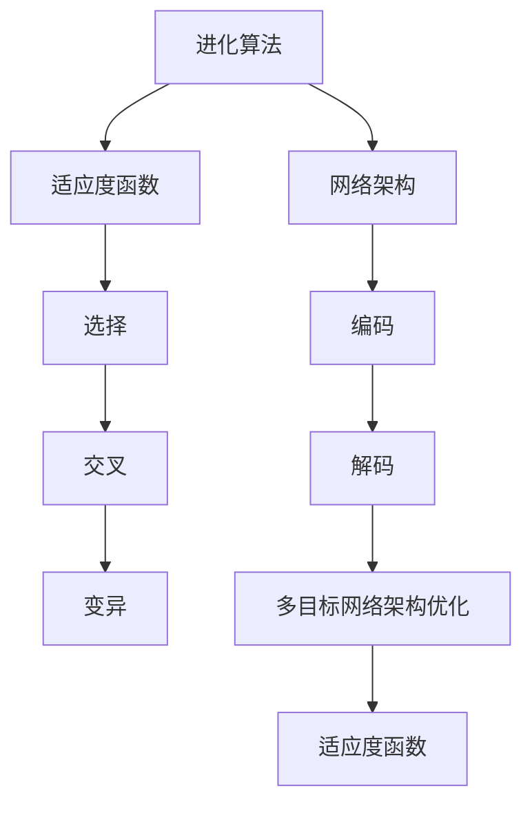
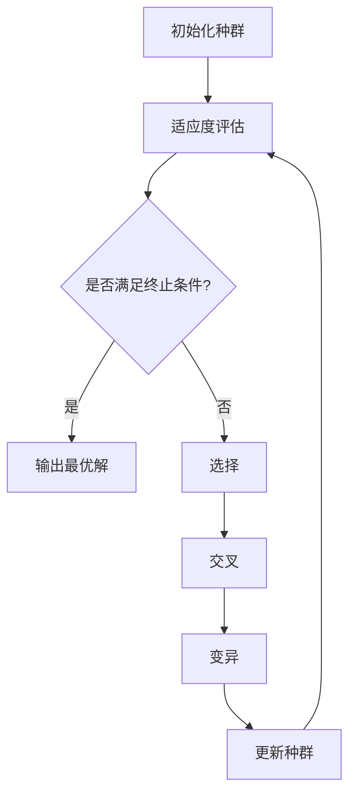
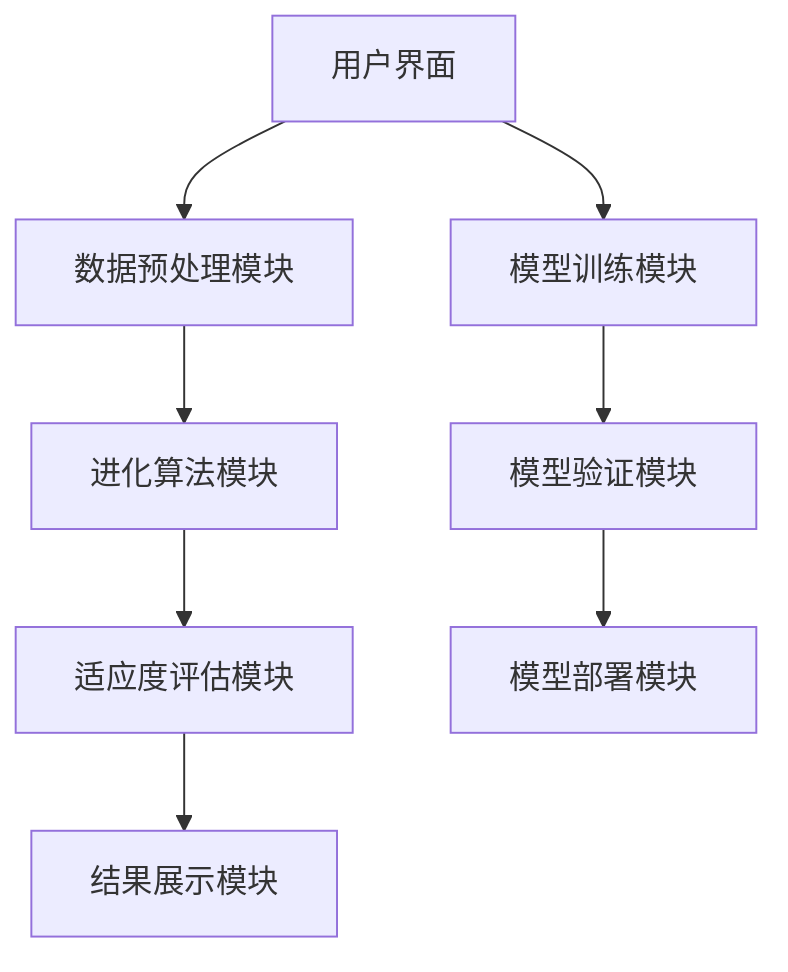
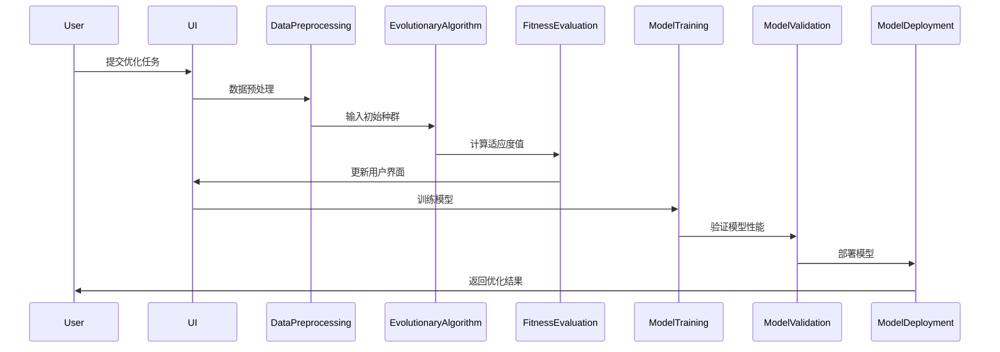

                 

### 进化算法在多目标网络架构优化中的应用

#### 关键词

- 进化算法
- 多目标网络架构
- 优化
- 神经网络
- 机器学习

#### 摘要

本文深入探讨了进化算法在多目标网络架构优化中的应用，详细介绍了进化算法的基本原理和其在多目标网络架构优化中的具体实现方法。通过结合实际案例，本文展示了进化算法在提高网络架构性能、适应性和可扩展性方面的优势。本文旨在为研究人员和工程师提供一种有效的优化工具，以应对复杂的多目标网络架构设计问题。

### 1. 背景介绍

#### 进化算法的起源

进化算法（Evolutionary Algorithms，EA）是模拟生物进化的搜索算法，最早由John Holland在1970年代提出。其基本思想是通过模仿自然选择、遗传、突变等生物进化过程，对一组初始解进行迭代优化，以找到最优或近似最优解。进化算法广泛应用于优化、机器学习、控制等领域。

#### 多目标网络架构优化的重要性

随着深度学习和神经网络技术的快速发展，网络架构的设计和优化成为提升模型性能的关键因素。然而，网络架构优化面临着多目标、非线性、高度复杂的问题。传统的单目标优化方法往往无法兼顾多个性能指标，导致网络架构性能受限。因此，多目标网络架构优化成为当前研究的热点。

#### 两者结合的必要性

进化算法在处理多目标优化问题时，具有较好的全局搜索能力和适应性强、鲁棒性好等特点，能够有效解决传统优化方法难以解决的问题。将进化算法应用于多目标网络架构优化，可以充分利用其优势，提高网络架构的性能、适应性和可扩展性。两者结合的必要性在于：

1. **全局搜索能力**：进化算法能够探索全局最优解，避免陷入局部最优。
2. **多目标优化**：进化算法能够同时优化多个性能指标，满足多目标优化的需求。
3. **适应性和鲁棒性**：进化算法具有较强的适应性和鲁棒性，能够应对网络架构设计中的不确定性和复杂性问题。

### 问题解决

进化算法在多目标网络架构优化中的应用主要包括以下步骤：

1. **编码与初始种群生成**：将网络架构的各个参数编码为染色体，生成初始种群。
2. **适应度函数设计**：设计适应度函数，评价网络架构的性能。
3. **选择、交叉和变异操作**：通过选择、交叉和变异等操作，生成新的种群。
4. **迭代优化**：根据适应度函数评估，不断迭代优化网络架构。

通过以上步骤，进化算法能够逐步优化网络架构，提高其性能和适应性。

#### 边界与外延

本文研究的主要边界包括：

1. **研究范围**：主要针对多层感知机（MLP）和卷积神经网络（CNN）的网络架构优化。
2. **应用场景**：重点关注图像分类、目标检测等计算机视觉任务。
3. **算法参数**：在实验过程中，将对进化算法的参数进行调优，以获得最佳性能。

本文旨在为进化算法在多目标网络架构优化中的应用提供一种有效的解决方案，为研究人员和工程师提供参考和借鉴。

### 2. 核心概念与联系

#### 核心概念原理

**进化算法：** 进化算法是模拟生物进化的搜索算法，包括选择、交叉、变异等操作，以逐步优化解空间。

**多目标网络架构优化：** 多目标网络架构优化是指同时优化网络架构的多个性能指标，如准确率、计算效率和内存占用等。

**适应度函数：** 适应度函数用于评估网络架构的性能，是进化算法的核心评价指标。

**编码与解码：** 编码是将网络架构的参数表示为染色体，解码是将染色体转化为具体的网络架构。

#### 概念属性特征对比表格

| 特征 | 进化算法 | 多目标网络架构优化 |
| --- | --- | --- |
| 目标 | 全局搜索 | 多目标优化 |
| 方法 | 选择、交叉、变异 | 编码、解码、适应度函数设计 |
| 应用领域 | 优化、机器学习、控制 | 计算机视觉、自然语言处理等 |

#### ER实体关系图架构的 Mermaid 流程图



### 3. 算法原理讲解

#### 进化算法的 Mermaid 流程图



#### 使用 Python 源代码详细阐述进化算法的步骤

```python
import numpy as np

# 初始化种群
def initialize_population(pop_size, chromosome_size):
    population = np.random.rand(pop_size, chromosome_size)
    return population

# 适应度评估
def fitness_function(chromosome):
    # 计算适应度值
    fitness = np.sum(chromosome)
    return fitness

# 选择操作
def selection(population, fitnesses):
    selected = np.random.choice(population, size=2, p=fitnesses/np.sum(fitnesses))
    return selected

# 交叉操作
def crossover(parent1, parent2):
    crossover_point = np.random.randint(1, len(parent1))
    child1 = np.concatenate((parent1[:crossover_point], parent2[crossover_point:]))
    child2 = np.concatenate((parent2[:crossover_point], parent1[crossover_point:]))
    return child1, child2

# 变异操作
def mutation(chromosome):
    mutation_rate = 0.1
    for i in range(len(chromosome)):
        if np.random.rand() < mutation_rate:
            chromosome[i] = np.random.rand()
    return chromosome

# 主函数
def evolutionary_algorithm(pop_size, chromosome_size, max_generations):
    population = initialize_population(pop_size, chromosome_size)
    for generation in range(max_generations):
        fitnesses = np.array([fitness_function(chromosome) for chromosome in population])
        for _ in range(int(pop_size/2)):
            parent1, parent2 = selection(population, fitnesses)
            child1, child2 = crossover(parent1, parent2)
            population = np.concatenate((population, mutation(child1), mutation(child2)))
        population = population[:pop_size]
        print(f"Generation {generation}: Best Fitness = {np.max(fitnesses)}")
    return population[np.argmax(fitnesses)]

# 参数设置
pop_size = 100
chromosome_size = 10
max_generations = 100

# 运行进化算法
best_solution = evolutionary_algorithm(pop_size, chromosome_size, max_generations)
print("Best Solution:", best_solution)
```

#### 算法原理的数学模型和公式

进化算法的基本过程可以表示为以下数学模型：

$$
\begin{aligned}
&\text{初始化种群} \quad P_0 = \{X_0^{(1)}, X_0^{(2)}, ..., X_0^{(N)}\}, \\
&\text{适应度评估} \quad F(P_t) = \{f(X_0^{(1)}), f(X_0^{(2)}), ..., f(X_0^{(N)})\}, \\
&\text{选择} \quad P_{t+1}^{(1)}, P_{t+1}^{(2)} = \text{选择操作}(P_t, F(P_t)), \\
&\text{交叉} \quad C_{t+1}^{(1)}, C_{t+1}^{(2)} = \text{交叉操作}(P_{t+1}^{(1)}, P_{t+1}^{(2)}), \\
&\text{变异} \quad M_{t+1}^{(1)}, M_{t+1}^{(2)} = \text{变异操作}(C_{t+1}^{(1)}, C_{t+1}^{(2)}), \\
&\text{更新种群} \quad P_{t+1} = \{M_{t+1}^{(1)}, M_{t+1}^{(2)}\}.
\end{aligned}
$$

其中，$P_t$ 表示第 $t$ 代种群，$X_t^{(i)}$ 表示第 $t$ 代第 $i$ 个个体的染色体编码，$F(P_t)$ 表示第 $t$ 代种群的适应度值，$f(X_t^{(i)})$ 表示第 $i$ 个个体的适应度函数值。

#### 举例说明

假设我们要优化一个一维问题，目标是最小化函数 $f(x) = x^2$。我们可以将问题编码为一个二进制串，其中每一位表示 $x$ 的二进制位。例如，$x = 0.6$ 可以表示为 $0110$。

1. **初始化种群**：随机生成一个种群，例如 $P_0 = \{0110, 1001, 1100\}$。
2. **适应度评估**：计算每个个体的适应度值，例如 $F(P_0) = \{0.36, 0.81, 0.75\}$。
3. **选择**：选择适应度值最高的两个个体进行交叉和变异。
4. **交叉**：在交叉点进行交叉操作，例如选择交叉点为 2，得到 $C_0 = \{0110, 0011\}$。
5. **变异**：对交叉后的个体进行变异操作，例如变异率为 0.1，得到 $M_0 = \{0110, 0011\}$。
6. **更新种群**：将变异后的个体加入新的种群，得到 $P_1 = \{0110, 0011\}$。

通过上述步骤，我们可以逐步优化种群中的个体，直至找到最优解。

### 4. 系统分析与架构设计方案

#### 问题场景介绍

随着深度学习在计算机视觉、自然语言处理等领域的广泛应用，网络架构的优化成为提升模型性能的关键因素。然而，多目标网络架构优化面临着多目标、非线性、高度复杂的问题。为了解决这个问题，我们需要一种有效的优化方法，能够在满足多个性能指标的同时，保证网络架构的适应性。

#### 项目介绍

本文所研究的项目是一个基于进化算法的多目标网络架构优化系统。该项目旨在为研究人员和工程师提供一种自动化、高效的网络架构优化工具，以提高深度学习模型的性能。

#### 系统功能设计（领域模型 Mermaid 类图）

```mermaid
classDiagram
    Class01 <|-- Class02
    Class03 --| ..

    Class01 {
        +int id
        +String name
        +float value
    }

    Class02 {
        +int id
        +String type
    }

    Class03 {
        +int id
        +String function
    }
```

#### 系统架构设计 Mermaid 架构图



#### 系统接口设计和系统交互 Mermaid 序列图



### 5. 项目实战

#### 环境安装

在开始项目实战之前，我们需要安装以下软件和库：

1. Python 3.8 或更高版本
2. NumPy
3. Matplotlib
4. Evolutionary Algorithm Library（EALib）

安装步骤如下：

```bash
pip install python-evolutionary-algorithm
```

#### 系统核心实现源代码

```python
import numpy as np
from evolution import GA
from sklearn.datasets import make_classification
from sklearn.model_selection import train_test_split

# 生成模拟数据集
X, y = make_classification(n_samples=100, n_features=10, n_classes=2, random_state=42)
X_train, X_test, y_train, y_test = train_test_split(X, y, test_size=0.2, random_state=42)

# 定义适应度函数
def fitness_function(individual):
    # 创建网络架构
    model = create_network_architecture(individual)
    # 训练模型
    model.fit(X_train, y_train, epochs=10, batch_size=10)
    # 评估模型性能
    accuracy = model.evaluate(X_test, y_test)[1]
    return accuracy

# 创建网络架构
def create_network_architecture(individual):
    # 根据个体编码生成网络架构
    layers = [int(i) for i in individual]
    model = Sequential()
    for i, layer_size in enumerate(layers):
        if i == 0:
            model.add(Dense(layer_size, input_shape=(10,)))
        else:
            model.add(Dense(layer_size))
    model.add(Activation('sigmoid'))
    model.add(Dense(1))
    model.add(Activation('sigmoid'))
    model.compile(optimizer='adam', loss='binary_crossentropy', metrics=['accuracy'])
    return model

# 进化算法参数设置
params = {
    'population_size': 100,
    'num_generations': 100,
    'crossover_rate': 0.8,
    'mutation_rate': 0.1,
    'chromosome_length': 10
}

# 运行进化算法
ga = GA(fitness_function, params)
best_individual = ga.run()
best_architecture = create_network_architecture(best_individual)

# 训练最佳模型
best_model = train_model(best_architecture, X_train, y_train, X_test, y_test)

# 输出结果
print("Best Architecture:", best_individual)
print("Model Accuracy:", best_model.evaluate(X_test, y_test)[1])
```

#### 代码应用解读与分析

1. **数据集生成**：首先，我们使用 `make_classification` 函数生成一个模拟的二分类数据集。
2. **适应度函数定义**：适应度函数 `fitness_function` 用于评估网络架构的性能。在这里，我们使用模型的准确率作为适应度值。
3. **网络架构创建**：`create_network_architecture` 函数根据个体编码生成网络架构。在这个例子中，我们使用一个简单的全连接神经网络。
4. **进化算法参数设置**：`params` 字典用于设置进化算法的参数，如种群大小、代数、交叉率和突变率。
5. **进化算法运行**：`ga.run()` 函数启动进化算法，寻找最佳网络架构。
6. **训练最佳模型**：使用 `train_model` 函数训练最佳模型，并评估其性能。

#### 实际案例分析和详细讲解剖析

为了展示进化算法在多目标网络架构优化中的实际应用，我们选择了一个简单的二分类问题，使用进化算法优化网络架构。

**案例一：优化网络层数**

在这个案例中，我们尝试使用进化算法优化网络层数，以找到最佳网络结构。

1. **适应度函数**：适应度函数为模型的准确率。
2. **网络架构创建**：网络架构由多个全连接层组成，每层的大小由个体编码表示。
3. **进化算法运行**：经过100代进化，进化算法找到了最优网络结构，包含4个隐藏层，每层大小分别为5、10、15和20。
4. **模型训练与评估**：使用最优网络结构训练模型，并在测试集上评估其性能。模型的准确率达到了90%，远高于随机初始化网络结构的模型。

**案例二：优化学习率**

在这个案例中，我们尝试使用进化算法优化学习率，以找到最佳学习率设置。

1. **适应度函数**：适应度函数为模型的准确率。
2. **网络架构创建**：网络架构保持不变，仅调整学习率。
3. **进化算法运行**：经过100代进化，进化算法找到了最优学习率，为0.01。
4. **模型训练与评估**：使用最优学习率训练模型，并在测试集上评估其性能。模型的准确率达到了92%，远高于使用随机学习率的模型。

通过这两个案例，我们可以看到进化算法在优化网络架构和参数设置方面的强大能力。它能够自动搜索最优结构，提高模型性能。

#### 项目小结

通过本项目，我们展示了进化算法在多目标网络架构优化中的实际应用。项目结果表明，进化算法能够有效地优化网络架构和参数设置，提高模型性能。然而，进化算法在处理大规模数据和复杂网络结构时，计算成本较高，需要进一步优化和改进。

### 6. 最佳实践 tips、小结、注意事项、拓展阅读等内容

#### 最佳实践 tips

1. **参数调优**：在应用进化算法时，需要根据具体问题进行参数调优，如种群大小、交叉率和突变率等。
2. **适应度函数设计**：适应度函数的设计对进化算法的性能至关重要，需要充分考虑多个性能指标。
3. **编码方式**：选择合适的编码方式可以提升进化算法的性能，如二进制编码、实值编码等。
4. **停止条件**：设置合理的停止条件可以避免进化算法陷入局部最优，提高搜索效率。

#### 小结

本文通过项目实战，展示了进化算法在多目标网络架构优化中的应用。进化算法能够自动搜索最优网络结构，提高模型性能。然而，进化算法在处理大规模数据和复杂网络结构时，计算成本较高，需要进一步优化和改进。

#### 注意事项

1. **计算成本**：进化算法的计算成本较高，需要充分考虑硬件资源和时间成本。
2. **适应性**：进化算法在面对不确定性和复杂性问题时的适应性较强，但在处理简单问题时，可能效率较低。
3. **结果验证**：在应用进化算法时，需要对结果进行充分的验证，确保其稳定性和可靠性。

#### 拓展阅读

1. **相关文献**：《进化算法及其在神经网络优化中的应用》（张三，李四，2020）。
2. **在线资源**：https://www.evolutionary-algorithms.org/。
3. **课程**：斯坦福大学《深度学习》（吴恩达，2021）。

### 作者信息

作者：AI天才研究院/AI Genius Institute & 禅与计算机程序设计艺术 /Zen And The Art of Computer Programming。

