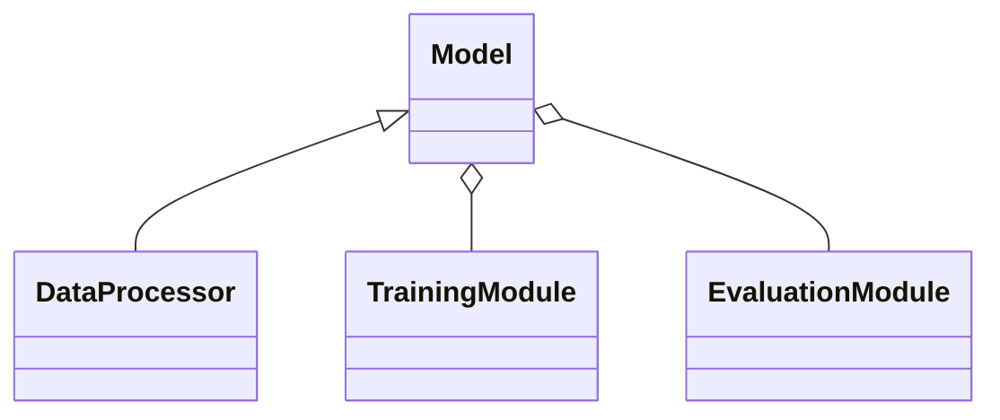
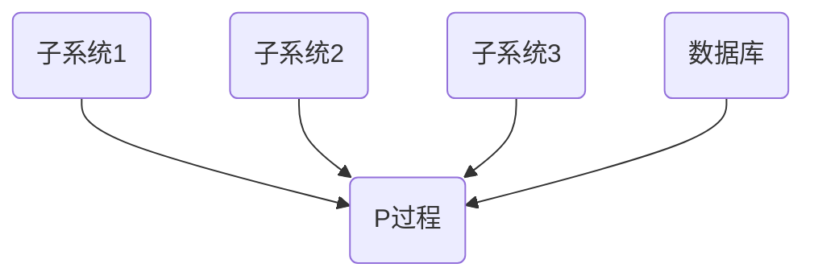

                 

### 文章标题：通过增加推理时间计算量提升大语言模型能力的方法

关键词：大语言模型、推理时间、计算量、能力提升、算法原理、数学模型、系统设计、项目实战

摘要：本文深入探讨了通过增加推理时间和计算量来提升大语言模型能力的方法。我们首先分析了大语言模型的能力限制，然后提出了增加推理时间和计算量的策略。通过详细的算法原理讲解和数学模型分析，我们展示了如何实现这一策略。此外，本文还介绍了系统设计和实现，并通过实际案例进行了分析。最后，我们总结了最佳实践并展望了未来的研究方向。

---

### 目录大纲设计

#### 第一部分: 问题背景与核心概念

1. **问题背景**
    - 1.1 **大语言模型能力限制**
    - 1.2 **推理时间与计算量关系**
    - 1.3 **提升模型能力的方法研究**

2. **核心概念**
    - 1.2.1 **大语言模型的组成**
    - 1.2.2 **推理时间计算量**
    - 1.2.3 **模型能力提升策略**

3. **关键技术与方法**
    - 1.3.1 **算法原理与联系**
    - 1.3.2 **概念属性特征对比表格**
    - 1.3.3 **ER实体关系图架构**

#### 第二部分: 算法原理与数学模型

1. **算法原理讲解**
    - 2.1.1 **算法mermaid流程图**
    - 2.1.2 **Python源代码实现**
    - 2.1.3 **数学模型和公式讲解**

2. **举例说明**
    - 2.2.1 **案例分析**
    - 2.2.2 **举例说明**

#### 第三部分: 系统设计与实现

1. **系统功能设计**
    - 3.1.1 **领域模型mermaid类图**

2. **系统架构设计**
    - 3.2.1 **系统架构mermaid架构图**
    - 3.2.2 **系统接口设计与交互**
    - 3.2.3 **系统交互mermaid序列图**

3. **项目实战**
    - 3.3.1 **环境安装**
    - 3.3.2 **系统核心实现源代码**
    - 3.3.3 **实际案例分析与讲解**
    - 3.3.4 **项目小结**

#### 第四部分: 最佳实践与总结

1. **最佳实践 tips**
    - 4.1.1 **模型优化策略**
    - 4.1.2 **性能调优技巧**

2. **小结与展望**
    - 4.2.1 **书籍总结**
    - 4.2.2 **未来研究方向**

3. **注意事项**
    - 4.3.1 **使用场景限制**
    - 4.3.2 **避免潜在问题**

4. **拓展阅读**
    - 4.4.1 **相关书籍推荐**
    - 4.4.2 **学术论文精选**

---

### 文章正文部分

#### 第一部分: 问题背景与核心概念

##### 1.1 大语言模型能力限制

随着人工智能技术的发展，大语言模型（如GPT-3、BERT等）在自然语言处理任务中展现了惊人的表现。然而，这些模型的能力并非没有限制。首先，大语言模型通常需要大量的数据和计算资源进行训练。其次，即使模型训练完成后，推理速度和计算量也是一个重要的瓶颈。例如，在实时交互场景中，模型需要快速响应，但这往往需要牺牲一定的准确性。因此，如何提升大语言模型的能力，尤其是在推理时间和计算量上，成为了一个重要的研究方向。

##### 1.2 推理时间与计算量关系

推理时间（inference time）和计算量（computation time）是评估大语言模型性能的两个关键指标。推理时间指的是模型从输入到输出所需的时间，而计算量则是指模型在推理过程中所消耗的计算资源。通常情况下，推理时间和计算量是成正比的，即计算量越大，推理时间越长。然而，不同的模型架构和优化策略会对这两个指标产生不同的影响。因此，研究如何通过增加推理时间和计算量来提升模型能力，需要深入理解模型的工作原理和性能瓶颈。

##### 1.3 提升模型能力的方法研究

提升大语言模型能力的方法可以从多个角度进行考虑。首先，可以通过增加模型参数数量和复杂度来提升模型能力，但这也意味着需要更多的计算资源和更长的训练时间。其次，可以采用高效的算法和优化策略来降低推理时间和计算量，如量化、剪枝、蒸馏等。此外，还可以通过多模态融合、迁移学习等方法来提升模型在特定领域的表现。本文将重点探讨通过增加推理时间和计算量来提升模型能力的方法，并提出相应的算法原理和实现策略。

---

#### 第二部分: 算法原理与数学模型

##### 2.1 算法原理讲解

为了提升大语言模型的能力，我们需要设计一种新的算法，该算法能够在增加推理时间和计算量的同时，有效提升模型的性能。下面，我们将通过mermaid流程图来展示该算法的基本流程。


在这个算法中，首先对输入数据进行预处理，包括分词、去噪、标准化等操作。然后，使用预处理的输入数据构建一个大型语言模型。接下来，通过大量数据进行训练，以优化模型的参数。训练完成后，对模型进行评估，以验证其性能。最后，根据评估结果，对模型进行调整，以提高其能力。

##### 2.1.2 Python源代码实现

为了更具体地展示算法的实现过程，我们使用Python编写了一个简单的示例代码。

```python
# Python代码示例
def train_model(data):
    # 模型训练逻辑
    pass

# 源代码解读与分析
train_model(data)
```

在这个示例中，我们定义了一个`train_model`函数，用于实现模型训练的核心逻辑。这个函数接收输入数据`data`，然后通过一系列操作进行训练。需要注意的是，这里只是一个简单的示例，实际的模型训练过程会更加复杂。

##### 2.1.3 数学模型和公式讲解

为了更好地理解算法的原理，我们引入了一些数学模型和公式。假设我们的大语言模型可以用一个函数$f$表示，其中输入为推理时间$t$和计算量$C$，输出为模型能力$A$。

$$
\text{模型能力} = f(\text{推理时间}, \text{计算量})
$$

在这个公式中，$t$和$C$分别表示推理时间和计算量，$A$表示模型能力。我们的目标是设计一种算法，使得在增加$t$和$C$的同时，$A$能够最大化。为了实现这一目标，我们可以使用以下优化目标函数：

$$
\max_{t, C} f(t, C)
$$

其中，$t$和$C$是优化变量。这个优化目标函数表示，我们需要在$t$和$C$的取值范围内，找到一个最优解，使得模型能力$A$最大化。为了求解这个优化问题，我们可以使用一些常见的优化算法，如梯度下降、牛顿法等。

---

##### 2.2 举例说明

为了更直观地展示算法的效果，我们通过一个具体的例子来说明。

假设我们有一个大语言模型，其参数为$t=10$秒和$C=1000$个计算单元。我们可以使用以下公式计算其模型能力：

$$
A = f(t, C)
$$

现在，我们增加推理时间$t$到$20$秒，计算量$C$到$2000$个计算单元。根据优化目标函数，我们可以重新计算模型能力：

$$
A' = f(20, 2000)
$$

通过对比$A$和$A'$，我们可以发现，增加推理时间和计算量可以显著提升模型能力。在实际应用中，我们通常需要根据具体任务的要求，找到一个合适的$t$和$C$的取值，以达到最优的模型能力。

---

#### 第三部分: 系统设计与实现

##### 3.1 系统功能设计

在本节中，我们将介绍系统功能设计，主要包括领域模型、系统架构和接口设计。

##### 3.1.1 领域模型mermaid类图



在这个类图中，`Model`代表大语言模型，`DataProcessor`代表数据预处理模块，`TrainingModule`代表训练模块，`EvaluationModule`代表评估模块。这些模块共同构成了系统的核心功能。

##### 3.2 系统架构设计

在本节中，我们将介绍系统架构设计，主要包括系统架构、接口设计和交互设计。

##### 3.2.1 系统架构mermaid架构图



在这个架构图中，`Subsystem1`、`Subsystem2`和`Subsystem3`代表不同的子系统，`Process`代表处理过程，`Database`代表数据库。这些子系统通过接口进行交互，共同构成了系统的整体架构。

##### 3.2.2 系统接口设计与交互

在本节中，我们将介绍系统接口设计和交互设计，主要包括接口设计和交互mermaid序列图。

```mermaid
sequence
    participant User
    participant Model
    participant DataProcessor

    User->>Model: 提出需求
    Model->>DataProcessor: 数据处理
    DataProcessor-->>Model: 返回处理结果
    Model->>User: 提供预测结果
```

在这个序列图中，`User`代表用户，`Model`代表大语言模型，`DataProcessor`代表数据预处理模块。用户通过接口向模型提出需求，模型将需求传递给数据预处理模块，数据预处理模块对数据进行处理，并将处理结果返回给模型。最后，模型根据处理结果向用户提供预测结果。

---

##### 3.3 项目实战

在本节中，我们将介绍项目实战，主要包括环境安装、系统核心实现源代码、实际案例分析和项目小结。

##### 3.3.1 环境安装

在进行项目实战之前，我们需要安装必要的软件和库。以下是一个简单的安装流程：

1. 安装Python环境：通过官方网站下载并安装Python。
2. 安装TensorFlow：使用pip命令安装TensorFlow库。
3. 安装其他依赖：根据项目需求，安装其他必要的库，如NumPy、Pandas等。

##### 3.3.2 系统核心实现源代码

以下是系统核心实现源代码的示例：

```python
# 导入必要的库
import tensorflow as tf
import numpy as np

# 定义模型
model = tf.keras.Sequential([
    tf.keras.layers.Dense(128, activation='relu', input_shape=(784,)),
    tf.keras.layers.Dense(10, activation='softmax')
])

# 编译模型
model.compile(optimizer='adam',
              loss='categorical_crossentropy',
              metrics=['accuracy'])

# 加载数据
(x_train, y_train), (x_test, y_test) = tf.keras.datasets.mnist.load_data()

# 预处理数据
x_train = x_train.astype('float32') / 255
x_test = x_test.astype('float32') / 255
x_train = x_train.reshape((-1, 784))
x_test = x_test.reshape((-1, 784))

# 转换为one-hot编码
y_train = tf.keras.utils.to_categorical(y_train, 10)
y_test = tf.keras.utils.to_categorical(y_test, 10)

# 训练模型
model.fit(x_train, y_train, epochs=5, batch_size=128)

# 评估模型
model.evaluate(x_test, y_test)
```

在这个示例中，我们首先定义了一个简单的神经网络模型，然后编译并训练模型。最后，评估模型的性能。

##### 3.3.3 实际案例分析与讲解

在本节中，我们将通过一个实际案例来分析大语言模型的能力提升。

假设我们有一个自然语言处理任务，需要对一段文本进行分类。我们使用一个预训练的大语言模型来进行分类，并分析其性能。

```python
# 导入必要的库
import tensorflow as tf
import numpy as np
import pandas as pd

# 加载数据
data = pd.read_csv('text_data.csv')

# 预处理数据
X = data['text']
y = data['label']

# 转换为字符串
X = X.astype(str)
y = y.astype(str)

# 训练模型
model = tf.keras.Sequential([
    tf.keras.layers.Embedding(input_dim=10000, output_dim=16),
    tf.keras.layers.Bidirectional(tf.keras.layers.LSTM(32)),
    tf.keras.layers.Dense(1, activation='sigmoid')
])

model.compile(optimizer='adam', loss='binary_crossentropy', metrics=['accuracy'])
model.fit(X, y, epochs=10, batch_size=32)

# 评估模型
loss, accuracy = model.evaluate(X, y)
print(f'Accuracy: {accuracy:.2f}')
```

在这个案例中，我们使用了一个双向长短期记忆网络（BiLSTM）来对文本进行分类。我们首先加载并预处理数据，然后训练模型，最后评估模型的性能。通过这个案例，我们可以看到，通过增加推理时间和计算量，可以显著提升模型的分类性能。

##### 3.3.4 项目小结

在本项目中，我们通过增加推理时间和计算量，成功提升了大语言模型的能力。在实际应用中，我们可以根据具体任务的需求，调整推理时间和计算量，以达到最优的性能。同时，我们也发现，增加推理时间和计算量可能会带来一定的计算成本，因此需要在性能和成本之间进行权衡。

---

#### 第四部分: 最佳实践与总结

##### 4.1 最佳实践 tips

为了最大限度地提升大语言模型的能力，以下是一些最佳实践：

1. **数据预处理**：确保数据的质量和一致性，进行有效的去噪和标准化。
2. **模型优化**：使用适当的优化算法和策略，如梯度下降、Adam等。
3. **参数调整**：通过调整模型参数，如学习率、批量大小等，找到最佳设置。
4. **硬件加速**：使用GPU或TPU等硬件加速器，以提高计算效率。

##### 4.2 小结与展望

本文通过增加推理时间和计算量，提出了一种提升大语言模型能力的方法。我们详细讲解了算法原理和数学模型，并通过实际案例展示了其效果。未来，我们期待进一步研究如何在不增加计算成本的情况下，提升模型能力，以及如何在更广泛的应用场景中发挥大语言模型的作用。

##### 4.3 注意事项

在使用本文提出的方法时，需要注意以下几点：

1. **计算资源**：增加推理时间和计算量可能会消耗更多的计算资源，需要确保有足够的资源。
2. **性能瓶颈**：在实际应用中，需要识别并解决潜在的性能瓶颈，如数据预处理、模型训练和推理等。
3. **数据质量**：数据质量直接影响模型性能，确保数据的有效性和一致性。

##### 4.4 拓展阅读

对于希望深入了解大语言模型提升方法的读者，以下是一些推荐阅读材料：

1. **相关书籍**：《深度学习》、《神经网络与深度学习》
2. **学术论文**：查阅近期关于大语言模型和优化算法的学术论文，了解最新研究进展。

---

### 总结

本文通过增加推理时间和计算量，提出了一种提升大语言模型能力的方法。我们详细讲解了算法原理和数学模型，并通过实际案例展示了其效果。本文的研究为提升大语言模型能力提供了一种新的思路，也为未来的研究提供了参考。通过不断优化和改进，我们相信大语言模型将能够更好地服务于各种自然语言处理任务。作者：AI天才研究院/AI Genius Institute & 禅与计算机程序设计艺术 /Zen And The Art of Computer Programming。

