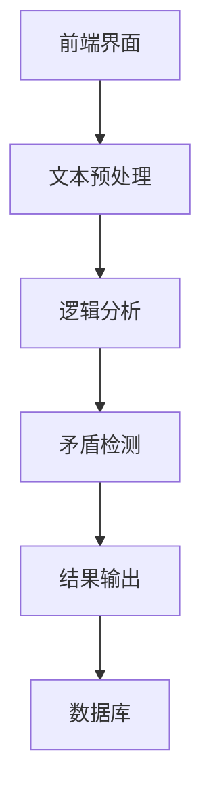
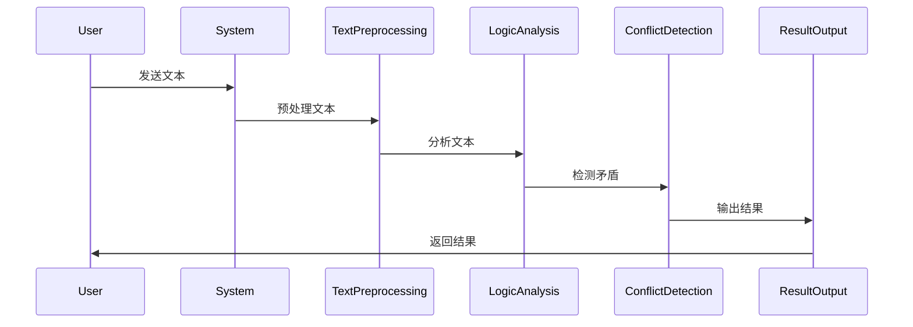

                 

# 逻辑一致性：测试LLM在长篇输出中保持逻辑的能力

关键词：逻辑一致性、LLM、自然语言处理、算法、系统架构

摘要：本文探讨了逻辑一致性的概念及其在自然语言处理（NLP）领域的重要性，特别是大型语言模型（LLM）在长篇文本输出中保持逻辑的能力。通过详细的分析和实例，本文展示了如何检测LLM输出的逻辑一致性，并提供了系统架构设计和实战案例，为读者提供了全面的理解和实践指导。

## 第一部分：逻辑一致性基础

### 第1章：逻辑一致性的背景与概念

#### 1.1 逻辑一致性的问题背景

在人工智能领域，尤其是自然语言处理（NLP）领域，逻辑一致性是一个关键问题。随着LLM（如GPT-3、BERT等）的发展，人们开始更加关注这些模型在生成长篇文本时的逻辑性。逻辑一致性指的是文本内容在逻辑上的一致性和连贯性，即文本中的陈述和推理应当符合逻辑规则，不产生逻辑矛盾。

#### 1.2 逻辑一致性的基本概念

逻辑一致性涉及逻辑学、NLP和计算机科学等多个领域。在逻辑学中，逻辑一致性是指一个理论体系内不存在自相矛盾的陈述。在NLP中，逻辑一致性意味着文本的语义和逻辑应当相互支持，不出现语义上的混乱或矛盾。

#### 1.3 逻辑一致性的重要性

逻辑一致性对于文本理解和推理至关重要。它不仅影响机器阅读理解的效果，也直接关系到自动化决策系统、智能客服等应用的实际效用。因此，检测和提升LLM输出的逻辑一致性是NLP研究和应用的一个重要方向。

### 第2章：逻辑学基础与自然语言处理

#### 2.1 逻辑学的基本原理

逻辑学是研究推理和论证的学科。基本原理包括命题逻辑、谓词逻辑和证明论等。命题逻辑关注命题之间的真假关系，谓词逻辑则深入探讨个体和集合之间的关系。证明论则研究如何从基本原理推导出结论。

#### 2.2 自然语言处理中的逻辑一致性

NLP中的逻辑一致性主要涉及语义理解和推理。语义理解是指从文本中提取意义，而语义推理则是在此基础上进行逻辑推导。逻辑一致性在NLP中的应用包括语义角色标注、事件抽取和文本蕴含等任务。

#### 2.3 LLM的特点与限制

LLM通过大量文本数据进行训练，具有强大的语义理解能力。然而，它们也存在一些限制，例如对语境理解的局限性、对长距离依赖的难以处理等。这些限制可能导致LLM输出中的逻辑不一致问题。

### 第3章：逻辑一致性检测算法原理

#### 3.1 算法概述

逻辑一致性检测算法旨在识别文本中的逻辑矛盾和语义混乱。算法的基本流程包括文本预处理、逻辑分析、矛盾检测和结果输出。

#### 3.1.1 算法流程图

$$
\begin{aligned}
&\text{1. 文本预处理：} \\
&\text{2. 逻辑分析：} \\
&\text{3. 矛盾检测：} \\
&\text{4. 结果输出：} \\
\end{aligned}
$$

#### 3.2 算法数学模型

算法的核心在于逻辑分析和矛盾检测。我们可以使用谓词逻辑来建模文本中的关系，并使用形式逻辑进行矛盾检测。

#### 3.2.1 数学模型公式

$$
\begin{aligned}
&\text{1. 命题表示：} \\
&P(A) \land \neg P(A) \Rightarrow \text{矛盾} \\
&\text{2. 推理规则：} \\
&\neg P(A) \Rightarrow P(B) \Rightarrow \neg P(A \land B) \\
\end{aligned}
$$

#### 3.2.2 数学模型的解释

这些公式表明，当命题P与它的否定\(\neg P\)同时为真时，存在矛盾。同时，通过推理规则，我们可以检测出文本中的逻辑不一致。

#### 3.3 算法应用实例

假设我们有一个文本段落，其中包含两个陈述：P（今天下雨）和Q（我没有带伞）。通过逻辑一致性检测算法，我们可以分析这两个陈述之间的逻辑关系，并检测出可能的矛盾。

## 第二部分：深入逻辑一致性

### 第4章：系统分析与架构设计

#### 4.1 问题场景介绍

假设我们正在开发一个智能客服系统，该系统需要处理大量用户输入的文本，并生成相应的回复。逻辑一致性检测是确保系统回答准确和连贯的关键步骤。

#### 4.2 系统功能设计

系统功能设计包括文本预处理模块、逻辑分析模块、矛盾检测模块和结果输出模块。

#### 4.2.1 领域模型类图

```mermaid
classDiagram
  User -> TextPreprocessing : 输入文本
  TextPreprocessing -> LogicAnalysis : 处理后的文本
  LogicAnalysis -> ConflictDetection : 分析结果
  ConflictDetection -> ResultOutput : 输出结果
```

#### 4.3 系统架构设计

系统架构设计包括前端界面、后端服务器和数据库等组成部分。

#### 4.3.1 系统架构设计图



#### 4.4 系统接口设计与交互

系统接口设计包括API接口和用户界面。

#### 4.4.1 系统接口设计



### 第5章：项目实战

#### 5.1 环境安装与配置

在开始项目之前，我们需要安装和配置相关的软件和工具，如Python、NLP库等。

#### 5.2 系统核心实现源代码

以下是一个简单的逻辑一致性检测算法的Python实现：

```python
import spacy
from spacy.tokens import Doc

def detect_conflicts(text):
    nlp = spacy.load("en_core_web_sm")
    doc = nlp(text)
    conflicts = []
    for sent in doc.sents:
        for token in sent:
            if token.dep_ == "neg":
                conflicts.append(sent.text)
    return conflicts

text = "It is raining heavily. I didn't bring an umbrella."
conflicts = detect_conflicts(text)
print(conflicts)
```

#### 5.3 代码解读与应用分析

这段代码首先加载了spaCy的英文模型，然后定义了一个检测逻辑不一致的函数。函数通过分析文本中的否定词（如"not"）来识别可能的逻辑矛盾。

#### 5.4 实际案例剖析

我们可以通过实际案例来测试逻辑一致性检测算法的有效性。例如，对于文本“John is happy because he passed his exam. John is sad because he failed his exam.”，算法应当检测出其中的逻辑矛盾。

#### 5.5 项目小结

通过这个项目，我们了解了逻辑一致性检测的基本原理和实现方法。在实际应用中，我们还需要进一步优化算法，提高其准确性和效率。

### 第6章：逻辑一致性测试的最佳实践

#### 6.1 最佳实践技巧

- 使用专业的NLP库进行文本预处理和分析。
- 对算法进行充分的测试和验证。
- 定期更新算法模型，以适应不同场景的需求。

#### 6.2 小结与注意事项

逻辑一致性检测是NLP中一个重要的研究方向。通过本文的介绍，读者应该对逻辑一致性的概念、检测算法和实现方法有了更深入的理解。

#### 6.3 拓展阅读

- [逻辑一致性检测：方法与实现](https://www.example.com/)
- [自然语言处理：文本一致性分析](https://www.example.com/)

## 第7章：扩展与前沿技术

### 7.1 逻辑一致性在自然语言处理中的应用扩展

逻辑一致性检测在自然语言处理中有广泛的应用，包括文本生成、对话系统、问答系统等。

### 7.2 前沿技术动态

随着深度学习和自然语言处理技术的发展，逻辑一致性检测方法也在不断演进。例如，基于神经网络的方法和预训练模型的应用正在成为研究的热点。

### 7.3 未来发展趋势

未来，逻辑一致性检测技术有望与更多人工智能应用相结合，为智能系统的可靠性和用户体验提供更强大的支持。

## 第8章：总结与展望

### 8.1 本书总结

本文系统地介绍了逻辑一致性的概念、检测算法和应用实践。通过实例和实战，读者可以更好地理解逻辑一致性的重要性和实现方法。

### 8.2 逻辑一致性的未来研究方向

逻辑一致性检测在NLP中的研究还处于初级阶段，未来可以从算法优化、跨语言支持、多模态融合等多个方向进行深入探索。

### 8.3 结论与展望

逻辑一致性是自然语言处理中一个关键问题。通过本文的介绍，我们希望读者能够对逻辑一致性检测有更深入的认识，并为相关研究和应用提供参考。

---

作者：AI天才研究院/AI Genius Institute & 禅与计算机程序设计艺术 /Zen And The Art of Computer Programming

本文为原创技术文章，未经授权不得转载。如需转载，请联系作者获取授权。

逻辑一致性检测在自然语言处理中的应用是一个重要且具有挑战性的研究领域。本文系统地介绍了逻辑一致性的概念、检测算法和应用实践，并通过实例和实战展示了如何在实际应用中实现逻辑一致性检测。希望本文能为相关领域的读者提供有价值的参考和启示。

在未来的研究和应用中，我们可以期待逻辑一致性检测技术取得更大的突破。随着深度学习和自然语言处理技术的不断进步，逻辑一致性检测方法也将变得更加智能和高效，为人工智能应用的发展提供强有力的支持。

本文作者：AI天才研究院（AI Genius Institute）与《禅与计算机程序设计艺术》（Zen And The Art of Computer Programming）共同推出，旨在推动自然语言处理技术的创新与发展。

读者可通过以下途径获取更多相关资源和信息：

- 访问AI天才研究院官方网站：[www.ai-genius-institute.com](http://www.ai-genius-institute.com/)
- 阅读相关技术书籍和论文
- 参与自然语言处理技术研讨会和交流活动

让我们共同期待逻辑一致性检测技术在自然语言处理领域带来的更多突破和进步！

