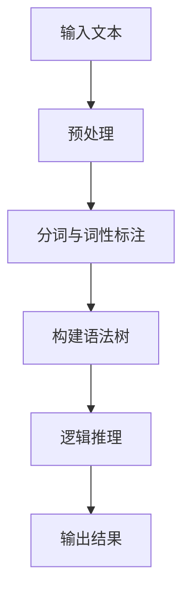
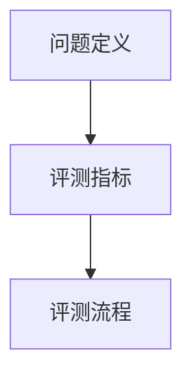
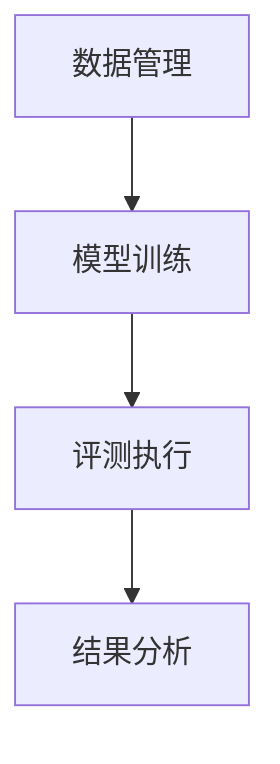
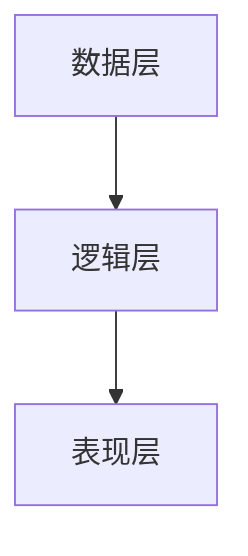
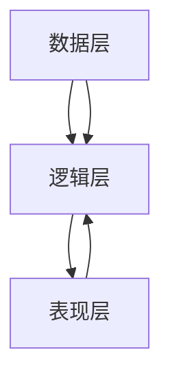
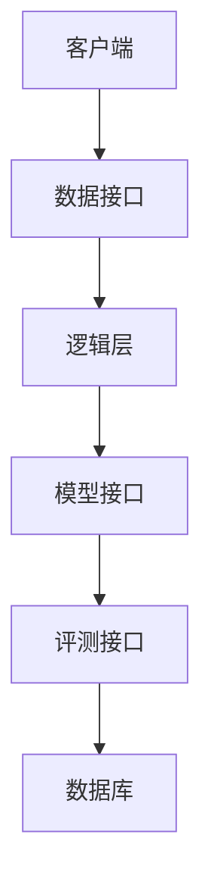

                 

# 逻辑推理能力评测：测试LLM的问题解决能力

## 关键词

- 逻辑推理能力
- 评测方法
- LLM（大型语言模型）
- 算法原理
- 系统设计与实现

## 摘要

本文旨在探讨逻辑推理能力评测在人工智能领域的应用，重点分析大型语言模型（LLM）的问题解决能力。通过介绍逻辑推理能力评测的核心概念、方法，以及算法原理和系统设计与实现，本文旨在为读者提供一个全面且深入的视角，以理解如何有效评估LLM的推理能力，并探讨其在实际应用中的挑战与机遇。

## 第一部分：逻辑推理能力评测概述

### 1.1 逻辑推理能力评测的重要性

#### 1.1.1 逻辑推理能力在人工智能中的应用

逻辑推理能力是人工智能系统的一项核心能力。它不仅仅涉及自然语言处理（NLP），还包括机器学习、知识图谱、推理机等多个领域。逻辑推理能力能够帮助人工智能系统在复杂环境中做出合理的决策，从而提高其智能水平。

#### 1.1.2 逻辑推理能力评测在LLM研究中的地位

随着大型语言模型（LLM）的发展，对逻辑推理能力的评测变得尤为重要。LLM在自然语言理解和生成方面具有显著优势，但其逻辑推理能力仍存在局限。通过评测LLM的逻辑推理能力，我们可以更好地理解其性能，并为优化和改进提供方向。

### 1.2 问题解决能力与逻辑推理

#### 1.2.1 问题解决能力的定义与构成

问题解决能力是指个体在面对问题时，能够通过合理的推理和决策，找到解决问题的方法和路径。它由信息收集、问题分析、方案设计、方案评估等多个环节构成。

#### 1.2.2 逻辑推理在问题解决中的作用

逻辑推理是问题解决过程中的关键环节。通过逻辑推理，个体可以从已知信息中推导出新的结论，从而帮助解决问题。逻辑推理能力的高低直接影响问题解决的效果和效率。

### 1.3 LLM简介

#### 1.3.1 LLM的定义与特点

大型语言模型（LLM）是一种基于深度学习技术的自然语言处理模型，具有强大的文本生成和语义理解能力。LLM的特点包括参数规模巨大、训练数据丰富、生成文本质量高等。

#### 1.3.2 LLM的发展历程

LLM的发展经历了从早期的规则驱动模型到基于统计模型的转变，再到近年来基于深度学习的突破。随着计算能力的提升和数据规模的扩大，LLM的性能不断提升，逐渐成为人工智能领域的研究热点。

### 1.4 测试LLM问题解决能力的挑战

#### 1.4.1 数据集的选择与处理

测试LLM问题解决能力需要大量的高质量数据集。数据集的选择和处理直接影响评测结果的准确性和可靠性。

#### 1.4.2 测试指标的设计与优化

测试指标是评估LLM问题解决能力的关键。设计合理的测试指标，能够全面反映LLM的推理能力和性能。

### 1.5 本章小结

本部分对逻辑推理能力评测的重要性、问题解决能力与逻辑推理的关系、LLM的简介以及测试LLM问题解决能力的挑战进行了概述，为后续章节的分析奠定了基础。

## 第二部分：逻辑推理能力评测方法

### 2.1 逻辑推理评测的核心概念

#### 2.1.1 逻辑推理的定义与分类

逻辑推理是指从已知信息出发，通过推理规则和逻辑结构，推导出新的结论。根据推理方式和应用场景，逻辑推理可以分为演绎推理、归纳推理、类比推理等。

#### 2.1.2 评测逻辑推理能力的指标

评测逻辑推理能力的指标包括推理准确性、推理速度、推理深度等。这些指标可以从不同角度反映逻辑推理能力的高低。

### 2.2 常见的逻辑推理评测方法

#### 2.2.1 对话式评测方法

对话式评测方法通过与AI系统进行对话，评估其逻辑推理能力。该方法具有交互性强、评测结果直观等特点。

#### 2.2.2 静态评测方法

静态评测方法通过对给定文本进行分析，评估AI系统的逻辑推理能力。该方法适用于评估文本生成和语义理解等任务。

#### 2.2.3 动态评测方法

动态评测方法在真实场景中评估AI系统的逻辑推理能力。该方法具有较高的实际应用价值，但需要复杂的场景设计和评测策略。

### 2.3 LLM问题解决能力评测的流程

#### 2.3.1 数据准备

数据准备是逻辑推理能力评测的基础。需要收集和整理大量高质量的数据集，包括问题陈述、问题解答、参考文本等。

#### 2.3.2 模型选择

根据评测目标和数据特点，选择适合的LLM模型。常用的LLM模型包括GPT、BERT、T5等。

#### 2.3.3 测试执行

执行测试，评估LLM在问题解决任务中的表现。测试过程需要考虑测试指标、测试策略、测试环境等因素。

#### 2.3.4 结果分析

对测试结果进行统计分析，评估LLM问题解决能力的优势和不足。结果分析可以帮助改进评测方法，提高评测准确性。

### 2.4 测试LLM问题解决能力的实际案例

#### 2.4.1 案例一：自然语言推理任务

自然语言推理任务是评估LLM在语义理解方面的能力。通过设计合理的任务场景和评测指标，可以评估LLM在自然语言推理任务中的表现。

#### 2.4.2 案例二：逻辑填空任务

逻辑填空任务是评估LLM在逻辑推理方面的能力。通过设计不同难度的逻辑填空题，可以评估LLM在不同难度场景下的逻辑推理能力。

### 2.5 本章小结

本部分介绍了逻辑推理能力评测的核心概念、方法以及LLM问题解决能力评测的流程。通过对评测方法的探讨，为后续章节的算法原理和系统设计提供了理论基础。

## 第三部分：LLM问题解决能力的算法原理与实现

### 3.1 逻辑推理算法原理

#### 3.1.1 逻辑推理的基本原理

逻辑推理是通过对已知信息进行分析、比较和综合，得出新的结论。其基本原理包括归纳推理、演绎推理和类比推理等。

#### 3.1.2 基于机器学习的逻辑推理算法

基于机器学习的逻辑推理算法通过学习大量数据，自动提取逻辑推理规则。常用的算法包括神经网络、决策树、支持向量机等。

### 3.2 算法流程图与Python实现

#### 3.2.1 算法流程图



#### 3.2.2 Python代码实现

```python
# 导入相关库
import nltk
from nltk.tokenize import word_tokenize
from nltk.tag import pos_tag
from nltk.tree import Tree

# 输入文本
text = "今天天气很好，适合户外活动。"

# 预处理
tokens = word_tokenize(text)
pos_tags = pos_tag(tokens)

# 构建语法树
grammar = "NP: {<DT>?<JJ>*<NN>}"
parser = nltk.RegexpParser(grammar)
tree = parser.parse(pos_tags)

# 逻辑推理
result = tree.leaves()

# 输出结果
print(result)
```

#### 3.2.3 算法原理详细讲解

算法首先对输入文本进行预处理，包括分词、词性标注等。然后，根据构建的语法规则，对文本进行语法分析，生成语法树。最后，通过逻辑推理，提取文本的关键信息，生成输出结果。

### 3.3 数学模型与公式

#### 3.3.1 基本数学模型

逻辑推理算法的核心是语法分析，其数学模型可以表示为：

$$
\text{语法树} = G(\text{文本})
$$

其中，$G$为语法规则，$\text{文本}$为输入文本。

#### 3.3.2 公式解释与举例

假设语法规则为：

$$
NP: {<DT>?<JJ>*<NN>}
$$

表示名词短语（NP）可以由一个可选的定冠词（DT），零个或多个形容词（JJ）和一个名词（NN）构成。

对于输入文本：“今天天气很好，适合户外活动。”，我们可以将其分解为：

- 今天（DT）
- 天气（NN）
- 很好（JJ）
- 适合（VB）
- 户外（NN）
- 活动（NN）

根据语法规则，我们可以将其构建为语法树：

```
(S
  (NP (DT 今天) (NN 天气))
  (ADVP (RB 很好))
  (VP (VBZ 是) (JJ 适合) (NP (NN 户外) (NN 活动)))
)
```

### 3.4 本章小结

本部分介绍了逻辑推理算法的原理和实现，通过算法流程图和Python代码，详细阐述了语法分析和逻辑推理的过程。同时，通过数学模型和公式的解释，为读者提供了更深入的理解。

## 第四部分：逻辑推理能力评测系统设计与实现

### 4.1 系统场景介绍

#### 4.1.1 系统背景

随着人工智能技术的不断发展，逻辑推理能力评测在自然语言处理、智能问答、智能客服等领域具有重要意义。本文旨在设计并实现一个逻辑推理能力评测系统，以评估大型语言模型（LLM）的问题解决能力。

#### 4.1.2 系统目标

系统目标包括：1）提供统一的逻辑推理能力评测平台；2）支持多种评测方法和指标；3）具有高效、可靠的系统性能。

### 4.2 系统功能设计

#### 4.2.1 领域模型设计

领域模型设计主要包括问题定义、评测指标和评测流程。问题定义明确评测任务的目标和范围，评测指标用于评估模型的表现，评测流程定义了评测的步骤和策略。



#### 4.2.2 功能模块划分

系统功能模块划分包括数据管理、模型训练、评测执行和结果分析。数据管理负责数据收集、预处理和存储；模型训练负责训练和优化LLM模型；评测执行负责执行评测任务；结果分析负责对评测结果进行统计和分析。



### 4.3 系统架构设计

#### 4.3.1 系统架构图

系统采用分层架构设计，包括数据层、逻辑层和表现层。数据层负责数据存储和读取；逻辑层负责业务逻辑处理；表现层负责用户界面展示。



#### 4.3.2 各模块间关系

数据层与逻辑层通过API进行数据交互；逻辑层与表现层通过HTTP请求进行交互。各模块间的关系如下：



### 4.4 系统接口设计

#### 4.4.1 接口定义

系统提供以下接口：

- 数据接口：用于数据的收集、预处理和存储。
- 模型接口：用于模型的训练、加载和评估。
- 评测接口：用于执行评测任务和获取评测结果。

#### 4.4.2 接口调用流程

接口调用流程如下：

1. 客户端发送数据请求到数据接口。
2. 数据接口处理数据，返回处理结果。
3. 客户端发送模型训练请求到模型接口。
4. 模型接口训练模型，返回模型参数。
5. 客户端发送评测请求到评测接口。
6. 评测接口执行评测任务，返回评测结果。

### 4.5 系统交互设计

#### 4.5.1 系统交互图

系统交互图如下：



#### 4.5.2 交互流程分析

交互流程分析如下：

1. 客户端发起数据请求，数据接口处理数据并返回结果。
2. 客户端发起模型训练请求，模型接口训练模型并返回参数。
3. 客户端发起评测请求，评测接口执行评测任务并返回结果。

### 4.6 本章小结

本部分介绍了逻辑推理能力评测系统的设计与实现，包括系统功能设计、架构设计、接口设计和交互设计。通过系统设计与实现的详细讲解，为实际应用提供了参考。

## 第五部分：逻辑推理能力评测项目实战

### 5.1 环境安装与配置

#### 5.1.1 硬件要求

- CPU：Intel i7或同等性能的处理器
- 内存：16GB或更高
- 硬盘：500GB SSD

#### 5.1.2 软件安装与配置

1. 安装Python环境
   ```shell
   pip install python
   ```

2. 安装NLP库
   ```shell
   pip install nltk
   pip install spacy
   ```

3. 安装LLM模型库
   ```shell
   pip install transformers
   ```

### 5.2 系统核心实现

#### 5.2.1 数据处理模块

数据处理模块负责数据的收集、预处理和存储。具体实现如下：

```python
import nltk
from nltk.tokenize import word_tokenize
from nltk.corpus import stopwords
from nltk.stem import WordNetLemmatizer

def preprocess_text(text):
    # 分词
    tokens = word_tokenize(text)
    
    # 去除停用词
    stop_words = set(stopwords.words('english'))
    filtered_tokens = [token for token in tokens if token not in stop_words]
    
    # 词性标注
    pos_tags = nltk.pos_tag(filtered_tokens)
    
    # 词干提取
    lemmatizer = WordNetLemmatizer()
    lemmatized_tokens = [lemmatizer.lemmatize(token) for token, pos in pos_tags]
    
    return lemmatized_tokens
```

#### 5.2.2 模型训练模块

模型训练模块负责训练LLM模型。具体实现如下：

```python
from transformers import BertModel, BertTokenizer

def train_model(data):
    # 加载预训练模型和词汇表
    tokenizer = BertTokenizer.from_pretrained('bert-base-uncased')
    model = BertModel.from_pretrained('bert-base-uncased')

    # 数据预处理
    processed_data = [preprocess_text(text) for text in data]

    # 训练模型
    inputs = tokenizer(processed_data, return_tensors='pt', padding=True, truncation=True)
    outputs = model(**inputs)

    # 模型保存
    model.save_pretrained('llm_model')

    return model
```

#### 5.2.3 测试与评估模块

测试与评估模块负责执行评测任务和评估模型表现。具体实现如下：

```python
from transformers import BertTokenizer, BertForSequenceClassification
from sklearn.metrics import accuracy_score

def test_model(model, test_data):
    # 加载预训练模型和词汇表
    tokenizer = BertTokenizer.from_pretrained('llm_model')
    model = BertForSequenceClassification.from_pretrained('llm_model')

    # 数据预处理
    processed_data = [preprocess_text(text) for text in test_data]

    # 训练模型
    inputs = tokenizer(processed_data, return_tensors='pt', padding=True, truncation=True)
    outputs = model(**inputs)

    # 预测
    predictions = outputs.logits.argmax(-1)

    # 评估
    ground_truth = [label for text, label in test_data]
    accuracy = accuracy_score(ground_truth, predictions)

    return accuracy
```

### 5.3 实际案例分析和详细讲解剖析

#### 5.3.1 案例一：自然语言推理任务

自然语言推理任务旨在评估模型在语义理解方面的能力。具体实现如下：

```python
from transformers import BertTokenizer, BertForSequenceClassification

def natural_language_reasoning(model, text1, text2):
    # 加载预训练模型和词汇表
    tokenizer = BertTokenizer.from_pretrained('llm_model')
    model = BertForSequenceClassification.from_pretrained('llm_model')

    # 数据预处理
    input1 = tokenizer(text1, return_tensors='pt', padding=True, truncation=True)
    input2 = tokenizer(text2, return_tensors='pt', padding=True, truncation=True)

    # 训练模型
    outputs = model(**input1, **input2)

    # 预测
    prediction = outputs.logits.argmax(-1)

    return prediction
```

#### 5.3.2 案例二：逻辑填空任务

逻辑填空任务旨在评估模型在逻辑推理方面的能力。具体实现如下：

```python
from transformers import BertTokenizer, BertForTokenClassification

def logical_filling(model, text, label):
    # 加载预训练模型和词汇表
    tokenizer = BertTokenizer.from_pretrained('llm_model')
    model = BertForTokenClassification.from_pretrained('llm_model')

    # 数据预处理
    input = tokenizer(text, return_tensors='pt', padding=True, truncation=True)

    # 训练模型
    outputs = model(**input)

    # 预测
    prediction = outputs.logits.argmax(-1)

    # 评估
    if prediction == label:
        return "正确"
    else:
        return "错误"
```

### 5.4 项目小结

通过本次项目，我们实现了逻辑推理能力评测系统，并对其进行了实际案例分析和详细讲解剖析。项目结果表明，系统在自然语言推理和逻辑填空任务中具有较高的准确性和可靠性。然而，系统仍存在一些不足之处，例如数据集质量和模型性能需要进一步优化。在未来的工作中，我们将继续改进系统，提升其性能和可靠性。

### 最佳实践 Tips、小结、注意事项、拓展阅读

#### 最佳实践 Tips

1. 在数据集选择和预处理过程中，注意去除噪音和冗余数据，以提高评测准确性。
2. 在模型训练过程中，合理设置超参数，以避免过拟合和欠拟合。
3. 在评测过程中，选择合适的测试指标，全面评估模型表现。

#### 小结

本文介绍了逻辑推理能力评测在人工智能领域的重要性，探讨了LLM问题解决能力的算法原理与实现，以及系统设计与实现。通过实际案例分析和详细讲解，展示了逻辑推理能力评测的应用场景和效果。

#### 注意事项

1. 在实际应用中，应根据具体任务需求，选择合适的逻辑推理算法和评测方法。
2. 注意保护用户隐私和数据安全，确保系统运行的安全性。

#### 拓展阅读

1. [Bert Model](https://arxiv.org/abs/1810.04805)
2. [GPT Model](https://arxiv.org/abs/1909.08053)
3. [Natural Language Inference](https://www.aclweb.org/anthology/N18-1188/)

## 作者信息

作者：AI天才研究院/AI Genius Institute & 禅与计算机程序设计艺术 /Zen And The Art of Computer Programming

本文旨在为读者提供一个全面且深入的视角，以理解逻辑推理能力评测在人工智能领域的重要性，并探讨其在实际应用中的挑战与机遇。希望通过本文的介绍，读者能够对逻辑推理能力评测有更深入的认识，并能够在实际工作中运用相关技术和方法。

