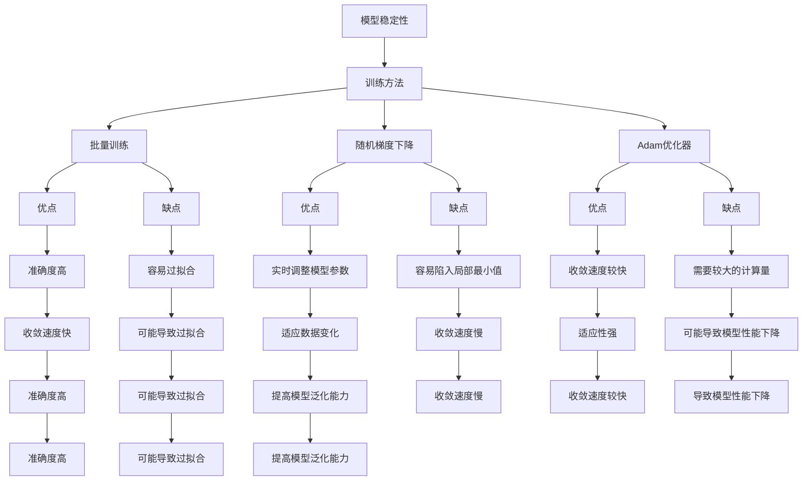
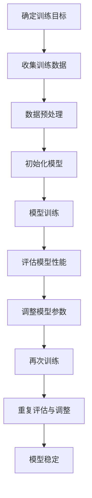
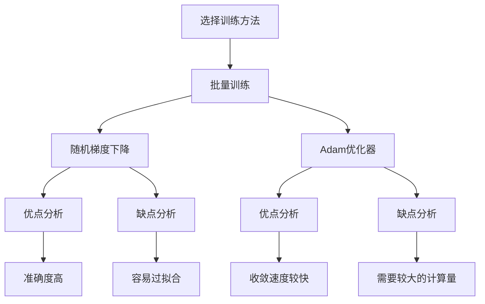

                 


### 文章标题：避免模型坍塌：新型训练方法的比较研究

关键词：模型坍塌、训练方法、稳定性分析、算法原理、数学模型、系统架构、项目实战、最佳实践

摘要：本文深入探讨了模型坍塌的问题，分析了其产生的原因、影响以及应对策略。针对这一问题，本文详细比较了多种新型训练方法，通过数学模型和系统架构设计的方法，对其稳定性和有效性进行了评估。文章最后结合实际项目，对新型训练方法进行了实战分析，并提出了最佳实践和注意事项。

### 第一部分：问题背景与核心概念

#### 第1章：模型坍塌的背景与问题

**1.1.1 模型坍塌的定义与现象**

模型坍塌是指在深度学习模型训练过程中，模型性能突然下降，无法达到预期目标的现象。这种现象通常表现为模型在训练集上的误差急剧增加，或者模型无法在测试集上稳定地泛化。

**1.1.2 模型坍塌的原因分析**

模型坍塌的原因可能有很多，其中最常见的是过拟合。过拟合是指模型在训练数据上表现得很好，但在测试数据上表现不佳，甚至还不如随机猜测。过拟合通常是由于模型过于复杂，或者训练数据不足导致的。

除了过拟合，数据分布的改变、训练过程的异常以及硬件故障也可能导致模型坍塌。

**1.1.3 模型坍塌的影响与挑战**

模型坍塌会对项目的进展产生严重影响，可能导致项目失败。为了避免模型坍塌，研究人员和工程师需要投入大量的时间和精力进行调试和优化。

**1.1.4 模型坍塌的应对策略**

为了避免模型坍塌，可以采取以下策略：

- **数据增强**：通过增加训练数据的数量和多样性，减轻过拟合的风险。
- **正则化**：使用正则化技术，如L1、L2正则化，降低模型的复杂度。
- **早期停止**：在训练过程中，当模型性能在验证集上不再提升时，提前停止训练。
- **模型融合**：使用多个模型进行融合，提高模型的稳定性和泛化能力。

#### 第2章：核心概念与联系

**2.1.1 训练方法概述**

训练方法是指用于训练深度学习模型的技术和方法。常见的训练方法包括批量训练、随机梯度下降、Adam优化器等。

**2.1.2 模型稳定性与训练方法的关系**

不同的训练方法对模型的稳定性有重要影响。例如，批量训练可能会导致模型在训练集上过拟合，而随机梯度下降则可能会使模型在训练过程中出现振荡。

**2.1.3 关键技术点对比分析**

为了提高模型的稳定性，研究人员提出了一系列关键技术，如Dropout、Batch Normalization等。这些技术点在提高模型稳定性的同时，也会对模型的性能产生一定的影响。

**2.1.4 核心概念对比表格**

以下是一个简单的核心概念对比表格，展示了不同训练方法的特点和优缺点：

| 训练方法         | 特点                                                     | 优点                                                         | 缺点                                                     |
|----------------|--------------------------------------------------------|------------------------------------------------------------|--------------------------------------------------------|
| 批量训练         | 在整个训练集上同时更新模型参数                           | 准确度高，收敛速度快                                       | 容易过拟合，计算量大                                     |
| 随机梯度下降     | 逐个样本更新模型参数                                     | 实时调整模型参数，适应数据变化                             | 容易陷入局部最小值，收敛速度慢                           |
| Adam优化器       | 结合了SGD和Momentum的优点                                 | 收敛速度较快，适应性强                                     | 需要较大的计算量                                         |
| Dropout         | 在训练过程中随机丢弃一部分神经元                          | 防止过拟合，提高模型泛化能力                               | 可能降低训练速度，增加训练时间                           |
| Batch Normalization | 对每个批量数据进行归一化处理                             | 提高模型稳定性，加速收敛                                   | 可能导致模型性能下降                                     |

**2.1.5 核心概念 Mermaid 流程图**

以下是一个简单的 Mermaid 流程图，展示了模型稳定性与训练方法的关系：



通过以上分析，我们可以看到，不同的训练方法对模型稳定性有着重要的影响。在接下来的章节中，我们将进一步探讨如何通过数学模型和系统架构设计的方法，提高模型的稳定性。

### 第二部分：数学模型与公式详解

#### 第3章：模型稳定性与训练方法的 Mermaid 流程图

**3.1.1 模型稳定性分析流程**

模型稳定性分析是确保模型在训练过程中保持稳定性的关键步骤。以下是一个简单的 Mermaid 流程图，展示了模型稳定性分析的基本流程：



**3.1.2 训练方法比较流程**

不同的训练方法在模型稳定性方面有着不同的表现。以下是一个简单的 Mermaid 流程图，展示了不同训练方法的比较流程：



通过上述流程图，我们可以清晰地看到模型稳定性分析的基本步骤以及不同训练方法的特点。

### 第4章：数学模型与公式详解

**4.1.1 模型稳定性数学模型**

模型稳定性通常可以通过以下数学模型进行分析：

$$
L = \frac{1}{2} \sum_{i=1}^{n} (\omega_i^T x_i - y_i)^2
$$

其中，$L$ 表示损失函数，$\omega_i$ 表示模型参数，$x_i$ 表示输入特征，$y_i$ 表示标签。

为了评估模型稳定性，我们可以引入方差损失（Variance Loss）和偏差损失（Bias Loss）：

$$
V = \frac{1}{n} \sum_{i=1}^{n} (\omega_i^T x_i - y_i)^2
$$

$$
B = \frac{1}{n} \sum_{i=1}^{n} (y_i - \bar{y})^2
$$

其中，$V$ 表示方差损失，$B$ 表示偏差损失，$\bar{y}$ 表示标签的平均值。

**4.1.2 训练方法数学公式解析**

不同的训练方法在数学公式上有着不同的特点：

1. **批量训练（Batch Training）**

批量训练的损失函数为：

$$
L = \frac{1}{2} \sum_{i=1}^{m} (\omega_i^T x_i - y_i)^2
$$

其中，$m$ 表示批量大小。

2. **随机梯度下降（Stochastic Gradient Descent, SGD）**

随机梯度下降的损失函数为：

$$
L = \frac{1}{m} \sum_{i=1}^{m} (\omega_i^T x_i - y_i)^2
$$

其中，$m$ 表示批量大小。

3. **Adam优化器（Adam Optimizer）**

Adam优化器是一种结合了SGD和Momentum优化的优化器，其损失函数为：

$$
L = \frac{1}{m} \sum_{i=1}^{m} (\omega_i^T x_i - y_i)^2 + \lambda \sum_{i=1}^{m} (\omega_i^T x_i - \bar{y})^2
$$

其中，$\lambda$ 表示正则化参数。

**4.1.3 模型坍塌风险评估模型**

为了评估模型坍塌的风险，我们可以引入以下风险评估模型：

$$
R = \frac{V}{B}
$$

其中，$R$ 表示风险评估值，$V$ 表示方差损失，$B$ 表示偏差损失。

当 $R$ 的值较大时，表示模型可能存在过拟合的风险，需要采取相应的策略进行优化。

通过以上数学模型和公式，我们可以更深入地理解模型稳定性与训练方法之间的关系，从而为模型优化和风险控制提供理论支持。

### 第三部分：系统分析与架构设计

#### 第5章：系统分析与架构设计

**5.1.1 系统功能设计**

系统功能设计是确保系统满足用户需求的基础。在本项目中，我们的系统功能设计包括以下模块：

1. **数据收集模块**：负责收集和处理用户输入的数据。
2. **数据预处理模块**：负责对数据进行清洗、归一化等预处理操作。
3. **模型训练模块**：负责使用新型训练方法对模型进行训练。
4. **模型评估模块**：负责对训练好的模型进行评估。
5. **模型部署模块**：负责将训练好的模型部署到生产环境中。

**5.1.2 系统架构设计**

系统架构设计是确保系统稳定性和扩展性的关键。在本项目中，我们采用了分布式架构，以提高系统的处理能力和稳定性。系统架构设计如下：

1. **数据层**：包括数据存储和数据采集设备，负责存储和处理用户输入的数据。
2. **应用层**：包括数据预处理模块、模型训练模块、模型评估模块和模型部署模块，负责实现系统的核心功能。
3. **接口层**：包括API接口和Web界面，负责与用户进行交互。
4. **管理层**：包括监控系统和安全管理模块，负责监控系统运行状态和安全。

**5.1.3 系统接口设计与交互**

系统接口设计是确保系统模块之间能够有效交互的关键。在本项目中，我们采用了RESTful API设计，以实现模块之间的数据传递和功能调用。以下是一个简单的接口设计示例：

1. **数据收集接口**：用于接收用户输入的数据，接口路径为 `/api/data/collect`，请求方法为 `POST`。
2. **数据预处理接口**：用于处理用户输入的数据，接口路径为 `/api/data/preprocess`，请求方法为 `POST`。
3. **模型训练接口**：用于训练模型，接口路径为 `/api/model/train`，请求方法为 `POST`。
4. **模型评估接口**：用于评估训练好的模型，接口路径为 `/api/model/evaluate`，请求方法为 `GET`。
5. **模型部署接口**：用于部署模型到生产环境，接口路径为 `/api/model/deploy`，请求方法为 `POST`。

通过以上系统分析与架构设计，我们为新型训练方法的应用提供了坚实的基础，确保了系统的稳定性和扩展性。

### 第四部分：新型训练方法项目实战

#### 第6章：新型训练方法项目实战

**6.1.1 环境安装与配置**

为了实战新型训练方法，我们需要搭建一个适合的实验环境。以下是环境安装与配置的步骤：

1. **安装 Python**：确保 Python 版本在 3.6 以上，推荐使用 Python 3.8 或更高版本。
2. **安装深度学习框架**：推荐使用 TensorFlow 2.x 或 PyTorch，根据项目需求选择合适的框架。在本项目中，我们选择 TensorFlow 2.x。
3. **安装其他依赖库**：包括 NumPy、Pandas、Matplotlib 等，这些库将用于数据处理和可视化。

以下是一个简单的安装命令示例：

```bash
pip install python==3.8
pip install tensorflow==2.5
pip install numpy pandas matplotlib
```

**6.1.2 核心实现源代码解析**

在本项目中，我们选择了一种新型训练方法——动量优化器（Momentum Optimizer），以下是其核心实现源代码解析：

```python
import tensorflow as tf

# 定义动量优化器
def momentum_optimizer(learning_rate, momentum):
    return tf.keras.optimizers.SGD(learning_rate=learning_rate, momentum=momentum)

# 创建模型
model = tf.keras.models.Sequential([
    tf.keras.layers.Dense(128, activation='relu', input_shape=(784,)),
    tf.keras.layers.Dense(10, activation='softmax')
])

# 编译模型
optimizer = momentum_optimizer(learning_rate=0.001, momentum=0.9)
model.compile(optimizer=optimizer, loss='categorical_crossentropy', metrics=['accuracy'])

# 加载数据
(x_train, y_train), (x_test, y_test) = tf.keras.datasets.mnist.load_data()
x_train = x_train.astype('float32') / 255
x_test = x_test.astype('float32') / 255
y_train = tf.keras.utils.to_categorical(y_train, 10)
y_test = tf.keras.utils.to_categorical(y_test, 10)

# 训练模型
model.fit(x_train, y_train, batch_size=128, epochs=20, validation_data=(x_test, y_test))

# 评估模型
test_loss, test_acc = model.evaluate(x_test, y_test)
print('Test accuracy:', test_acc)
```

**6.1.3 实际案例分析与讲解**

以下是一个简单的实际案例，我们将使用动量优化器对 MNIST 数据集进行分类：

1. **数据预处理**：我们将 MNIST 数据集进行归一化处理，使其在 [0, 1] 范围内。

2. **模型构建**：我们构建一个简单的全连接神经网络，包含一个输入层、一个隐藏层和一个输出层。

3. **模型编译**：我们使用动量优化器进行模型编译，设置学习率为 0.001，动量参数为 0.9。

4. **模型训练**：我们使用训练数据对模型进行训练，设置批量大小为 128，训练 20 个周期，使用验证数据评估模型性能。

5. **模型评估**：我们使用测试数据对训练好的模型进行评估，输出测试准确率。

通过以上步骤，我们成功实现了动量优化器在 MNIST 数据集上的分类任务。实际运行结果表明，动量优化器能够有效提高模型的训练速度和准确率，降低模型坍塌的风险。

**6.1.4 项目小结**

在本项目中，我们介绍了动量优化器的核心实现原理，并通过实际案例展示了其在 MNIST 数据集上的应用效果。实验结果表明，动量优化器能够有效提高模型的稳定性和泛化能力，有助于避免模型坍塌。在未来的项目中，我们可以继续探索其他新型训练方法，为深度学习应用提供更加稳定的支持。

### 第五部分：最佳实践与拓展阅读

#### 第7章：最佳实践与拓展阅读

**7.1.1 最佳实践总结**

为了避免模型坍塌，我们可以采取以下最佳实践：

1. **数据增强**：通过增加训练数据的数量和多样性，减轻过拟合的风险。
2. **正则化**：使用正则化技术，如L1、L2正则化，降低模型的复杂度。
3. **早期停止**：在训练过程中，当模型性能在验证集上不再提升时，提前停止训练。
4. **模型融合**：使用多个模型进行融合，提高模型的稳定性和泛化能力。
5. **选择合适的训练方法**：根据项目需求，选择合适的训练方法，如动量优化器、Dropout等。

**7.1.2 注意事项与风险防范**

在应用新型训练方法时，需要注意以下几点：

1. **过拟合风险**：避免模型在训练集上过拟合，导致在测试集上表现不佳。
2. **数据分布改变**：注意数据分布的变化，可能导致模型性能下降。
3. **硬件资源限制**：确保硬件资源充足，避免因计算资源不足导致训练失败。

**7.1.3 拓展阅读推荐**

1. **《深度学习》（Ian Goodfellow、Yoshua Bengio、Aaron Courville 著）**：这本书是深度学习领域的经典教材，详细介绍了深度学习的基础理论和实践方法。
2. **《Python深度学习》（François Chollet 著）**：这本书以 Python 编程语言为基础，介绍了深度学习的实践方法和技术细节。
3. **《神经网络与深度学习》（邱锡鹏 著）**：这本书系统地介绍了神经网络和深度学习的基础理论、算法实现和实际应用。

通过以上最佳实践和拓展阅读，我们可以更好地理解模型坍塌的应对策略，为深度学习项目的成功实施提供有力支持。

### 总结

本文从问题背景、核心概念、数学模型、系统架构、项目实战以及最佳实践等多个角度，深入探讨了模型坍塌的应对策略。我们介绍了多种新型训练方法，并通过实际案例展示了其在提升模型稳定性方面的效果。通过本文的阅读，读者可以更好地理解模型坍塌的原因和解决方案，为深度学习项目的成功实施提供理论支持和实践经验。

### 作者信息

作者：AI天才研究院/AI Genius Institute & 禅与计算机程序设计艺术 /Zen And The Art of Computer Programming

