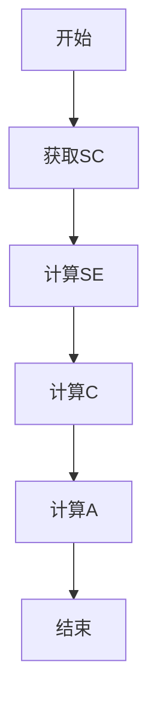
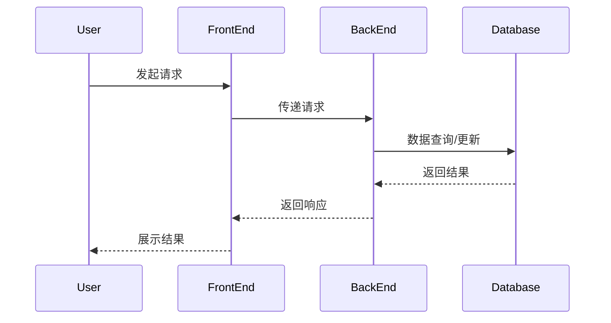
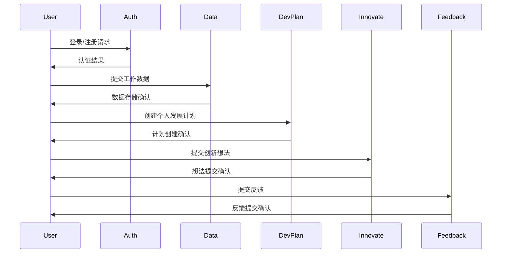

                 

### 引言：自我实现的概念与意义

自我实现（Self-Actualization）是心理学领域中的重要概念，最早由美国心理学家马斯洛（Abraham Maslow）在其1954年的著作《动机与个性》中提出。自我实现是指个体在实现自己的潜能和成为真正自我的过程中，所达到的一种高峰状态。马斯洛将人的需求层次分为五个等级，自我实现位于需求的最高层，代表着个体追求个人成长、实现自我潜能和达到自我实现的过程。

自我实现不仅仅是一个心理学术语，它在现代社会中具有深远的意义。随着社会的发展，人们对于个人成长、自我实现的需求日益增加。无论是在职场、学术还是生活中，自我实现都是一个重要的追求目标。它不仅有助于个体提升自身素质，实现个人价值，还能够促进社会的和谐发展。

本文将围绕自我实现这一主题，系统地探讨其核心概念、影响因素、实践路径以及案例分析等。文章结构如下：

1. **核心概念与联系**：介绍自我实现的定义、相关概念及其相互关系。
2. **数学模型与公式详解**：建立自我实现的影响因素模型，使用数学公式进行详细解释。
3. **具体实践与指南**：提供自我实现的实践方法和策略。
4. **案例分析**：通过具体案例，分析自我实现的过程和效果。
5. **最佳实践与拓展**：总结自我实现的最佳实践，并探讨未来的发展方向。

### 核心概念与联系

在探讨自我实现的核心概念与联系之前，首先需要明确几个重要的相关概念。这些概念包括自我认知、自我效能、自主性和创造力，它们是理解自我实现的基础。

#### 1. 自我认知

自我认知是指个体对自己的认识和理解，包括自我形象、自我价值感和自我认同等。自我认知是自我实现的重要基础，因为它直接影响个体对自己潜能的认识和利用。

- **自我形象**：个体对自己外在特征的认识，如外貌、能力等。
- **自我价值感**：个体对自己存在的价值和意义的认知。
- **自我认同**：个体对自己身份的认同和归属感。

#### 2. 自我效能

自我效能是指个体对自己完成特定任务的信心和能力判断。它影响个体在面对挑战和困难时的行为和决策。

- **概念**：自我效能感不仅与任务难度有关，还与个体的经历、学习和自我效能期望相关。
- **重要性**：高自我效能感有助于个体在面对挑战时保持积极态度，从而实现自我目标。

#### 3. 自主性

自主性是指个体在行动和决策过程中拥有自我主导权的程度。它反映了个体在实现自我目标时的独立性和自主性。

- **定义**：自主性涉及个体对自己行动目的、方式及结果的掌控。
- **重要性**：自主性有助于个体在实现自我目标的过程中，保持内在动机和动力。

#### 4. 创造力

创造力是指个体在思维和行动中产生新颖、有价值想法和解决方案的能力。创造力是自我实现的重要表现，它推动个体不断突破自我，实现更高的成就。

- **定义**：创造力不仅包括艺术创作，还涵盖科学、技术、商业等各个领域。
- **重要性**：创造力是推动社会进步和个人成长的关键因素。

#### 核心概念与联系

自我实现是一个多维度的概念，它涉及到多个核心要素。这些要素之间相互关联，共同构成了自我实现的基础。

- **自我认知**：自我认知为个体提供自我潜能的认识和基础。
- **自我效能**：自我效能感是自我实现的动力和信心来源。
- **自主性**：自主性确保个体在实现自我目标时的独立性和主动性。
- **创造力**：创造力是自我实现的重要表现，推动个体不断追求创新和突破。

通过理解这些核心概念及其相互关系，我们可以更好地把握自我实现的过程和路径。接下来，我们将进一步探讨自我实现的理论基础和实践路径。

### 第1章：问题的背景与核心要素

#### 1.1 问题的背景

自我实现作为一个心理学概念，源于人类对个体潜能和成长的需求。在现代社会中，随着经济、科技和社会制度的快速发展，人们对于个人成长和自我实现的需求愈发强烈。工作压力、竞争加剧以及生活节奏的加快，使得个体在追求物质满足的同时，更加关注精神层面的成长和自我价值的实现。

自我实现不仅仅是心理学的理论探讨，它在现实生活中的应用广泛且深远。例如，在职场中，个体追求自我实现不仅意味着职业上的成功，还包括个人技能、能力和价值的全面提升。在教育领域，自我实现的教育理念强调培养学生的创造性思维和自主性，帮助他们发掘自身的潜能。在社会层面，自我实现有助于提升个体的幸福感和社会责任感，促进社会的和谐发展。

然而，自我实现并非一蹴而就，它是一个复杂且长期的过程。在这个过程中，个体需要面对各种内外部挑战，如自我认知的偏差、社会期望的冲突、心理压力的积累等。因此，探讨自我实现的问题背景，不仅有助于理解其现实意义，还能够为后续的理论研究和实践提供基础。

#### 1.2 问题描述

自我实现的问题可以从多个维度进行描述，主要包括以下几个方面：

1. **个体潜能与实现差距**：个体拥有不同层次的潜能，而如何有效地开发和实现这些潜能，是一个关键问题。许多人在追求自我实现的过程中，往往面临着潜能无法完全发挥的困境。

2. **内在动机与外部压力**：自我实现需要个体有强烈的内在动机，但同时也受到外部环境（如社会期望、工作压力等）的制约。如何平衡内在动机和外部压力，是自我实现过程中的一大挑战。

3. **心理障碍与应对策略**：自我实现的过程中，个体可能会遇到各种心理障碍，如自我怀疑、焦虑、抑郁等。如何识别和应对这些心理障碍，对于自我实现至关重要。

4. **社会支持与个人成长**：自我实现不仅依赖于个体自身的努力，还需要社会的支持和环境的鼓励。社会支持系统是否健全，对于个体自我实现的成功与否具有重要影响。

#### 1.3 问题解决

针对上述自我实现的问题，可以从以下几个方面提出解决方案：

1. **自我认知的提升**：通过自我反思、心理咨询等途径，个体可以更好地认识自己的潜能、兴趣和价值观，从而为自我实现奠定基础。

2. **内在动机的激发**：通过设立目标、制定计划、奖励机制等，个体可以激发和维持内在动机，从而在自我实现的过程中保持持续的动力。

3. **心理障碍的识别与应对**：个体可以通过学习心理学知识、寻求专业帮助等方式，识别和应对自我实现过程中的心理障碍。

4. **社会支持的构建**：个体可以通过参与社区活动、寻求人际支持、建立互助小组等方式，获得社会支持，从而更好地实现自我。

5. **持续实践与反馈**：自我实现是一个持续的过程，个体需要不断实践、反思和调整，通过反馈机制优化自我实现路径。

通过上述问题解决策略，个体可以在自我实现的道路上逐步克服挑战，实现个人成长和价值的最大化。

#### 1.4 边界与外延

在探讨自我实现时，理解其边界与外延是非常重要的。自我实现的边界主要涉及以下几个方面：

1. **心理健康**：自我实现的过程中，个体的心理健康状态是一个重要的边界条件。心理健康不仅影响个体的行为和决策，也影响其潜能的发挥和自我价值的实现。

2. **社会责任**：自我实现不仅是个体的内在需求，也与社会责任紧密相连。个体在实现自我价值的同时，需要承担相应的社会责任，这既是自我实现的外部约束，也是其价值体现。

3. **文化背景**：不同文化背景下的自我实现有着不同的内涵和表现形式。理解文化背景对于个体在不同文化环境中的自我实现具有重要意义。

自我实现的外延则包括以下几个方面：

1. **个人成长**：自我实现是个体成长的重要途径，通过不断实现自我潜能，个体可以不断成长和提升。

2. **职业发展**：自我实现与职业发展紧密相关，个体在职业上的自我实现不仅是职业成功的重要标志，也是自我价值实现的重要体现。

3. **社会贡献**：通过自我实现，个体可以做出更多的社会贡献，推动社会的进步和发展。

#### 1.5 概念结构与核心要素组成

为了更好地理解自我实现的内部结构，我们可以将其核心要素分为以下几个方面：

1. **自我认知**：自我认知是自我实现的基础，它包括个体对自己的了解、认识和评价。

2. **自我效能**：自我效能是指个体对自身能力的信心和预期，它是推动个体实现自我目标的重要动力。

3. **自主性**：自主性是指个体在实现自我目标过程中的自我主导和决策能力，它是自我实现的重要保障。

4. **创造力**：创造力是自我实现的重要表现，它推动个体不断突破自我，实现更高的成就。

通过上述核心要素的相互作用，个体可以在自我实现的过程中不断成长和进步。下面，我们将进一步探讨这些核心要素的相互关系和具体表现形式。

### 核心概念与联系

在探讨自我实现的核心概念时，自我认知、自我效能、自主性和创造力这四个要素是至关重要的。这些概念不仅各自具有独特的属性和作用，还相互联系，共同构成自我实现的基石。

#### 1. 自我认知

自我认知是指个体对自己的了解和认识，包括自我形象、自我价值感、自我认同等多个方面。它是自我实现的基础，因为只有通过自我认知，个体才能明确自己的潜能、优势和不足，从而制定合适的发展目标和计划。

- **属性特征**：
  - **自我形象**：个体对自己的外在特征和形象的认识。
  - **自我价值感**：个体对自己的价值和存在的意义的认知。
  - **自我认同**：个体对自己身份的认同和归属感。

- **对比表格**：

| 特征         | 定义                                                         | 对比示例                   |
| ------------ | ------------------------------------------------------------ | -------------------------- |
| 自我形象     | 对自己外貌、能力、性格等特征的认识                             | 认为自己是内向还是外向的人 |
| 自我价值感   | 对自己存在价值和意义的认知                                   | 认为自己在职业中有价值吗  |
| 自我认同     | 对自己身份的认同和归属感                                     | 认为自己是哪个群体的一员 |

- **ER实体关系图**：

```mermaid
erDiagram
  Self_Cognition ||--|{ Self_Identity } Self_Identity
  Self_Cognition ||--|{ Self_Values } Self_Values
  Self_Cognition ||--|{ Self_Images } Self_Images
```

#### 2. 自我效能

自我效能是指个体对自己完成特定任务的信心和能力判断。它影响个体的行为选择、努力程度和坚持时间，是推动自我实现的重要动力。

- **属性特征**：
  - **能力判断**：个体对自己完成任务所需能力的评估。
  - **信心水平**：个体对自己能够成功完成任务的信心的强度。
  - **影响范围**：自我效能不仅影响个体的行为和决策，还影响其情绪和心理状态。

- **对比表格**：

| 特征         | 定义                                                         | 对比示例                   |
| ------------ | ------------------------------------------------------------ | -------------------------- |
| 能力判断     | 对自己完成任务所需能力的评估                                   | 认为是否具备编程能力      |
| 信心水平     | 对自己能够成功完成任务的信心的强度                             | 是否有信心完成项目目标    |
| 影响范围     | 自我效能感对行为选择、努力程度和坚持时间的影响范围             | 决定是否坚持锻炼或学习新技能 |

- **ER实体关系图**：

```mermaid
erDiagram
  Self_Efficacy ||--|{ Ability_Judgment } Ability_Judgment
  Self_Efficacy ||--|{ Confidence_Level } Confidence_Level
  Self_Efficacy ||--|{ Influence_Range } Influence_Range
```

#### 3. 自主性

自主性是指个体在实现自我目标过程中的自我主导和决策能力。它反映了个体在行动和决策中的独立性和主动性，是自我实现的重要保障。

- **属性特征**：
  - **自我主导**：个体在行动和决策过程中不受外部干扰，能够自主选择和执行。
  - **决策能力**：个体在面临多种选择时，能够做出合理和有效的决策。
  - **独立性**：个体在实现自我目标过程中，能够独立思考和解决问题。

- **对比表格**：

| 特征         | 定义                                                         | 对比示例                   |
| ------------ | ------------------------------------------------------------ | -------------------------- |
| 自我主导     | 行动和决策过程中不受外部干扰，能够自主选择和执行               | 在项目中是否主动承担责任  |
| 决策能力     | 面临多种选择时，能够做出合理和有效的决策                       | 是否能做出明智的投资决策  |
| 独立性       | 在实现自我目标过程中，能够独立思考和解决问题                   | 是否能独立完成项目任务    |

- **ER实体关系图**：

```mermaid
erDiagram
  Autonomy ||--|{ Self_Direction } Self_Direction
  Autonomy ||--|{ Decision_Making } Decision_Making
  Autonomy ||--|{ Independence } Independence
```

#### 4. 创造力

创造力是指个体在思维和行动中产生新颖、有价值想法和解决方案的能力。它是自我实现的重要表现，推动个体不断突破自我，实现更高的成就。

- **属性特征**：
  - **思维创新**：个体能够产生新颖和独特的想法。
  - **问题解决**：个体能够有效解决复杂问题和挑战。
  - **价值创造**：个体能够通过创新思维和行动，为社会和个体创造价值。

- **对比表格**：

| 特征         | 定义                                                         | 对比示例                   |
| ------------ | ------------------------------------------------------------ | -------------------------- |
| 思维创新     | 产生新颖和独特的想法                                         | 设计新的产品功能           |
| 问题解决     | 有效解决复杂问题和挑战                                       | 解决技术难题               |
| 价值创造     | 通过创新思维和行动，为社会和个体创造价值                       | 创造新的商业模式           |

- **ER实体关系图**：

```mermaid
erDiagram
  Creativity ||--|{ Innovative_Thinking } Innovative_Thinking
  Creativity ||--|{ Problem_Solving } Problem_Solving
  Creativity ||--|{ Value_Creation } Value_Creation
```

通过上述核心概念的详细解释和ER实体关系图的展示，我们可以清晰地理解自我实现各个要素之间的联系和作用。这些要素相互支持、相互促进，共同推动个体在自我实现的道路上不断前行。接下来，我们将进一步探讨自我实现的影响因素和具体实践路径。

### 数学模型和公式详解

在理解自我实现的过程中，建立数学模型和公式可以帮助我们更精准地描述和预测个体自我实现的影响因素和过程。以下是自我实现的影响因素模型及其相关数学公式的详细解释。

#### 3.1 自我实现的影响因素模型

自我实现的影响因素模型可以分为以下几个关键变量：自我认知（SC）、自我效能（SE）、自主性（A）和创造力（C）。这些变量共同决定了个体自我实现的程度。

- **自我认知（SC）**：个体对自己的了解和认识，包括自我形象、自我价值感和自我认同。
- **自我效能（SE）**：个体对自己完成任务的能力和信心的判断。
- **自主性（A）**：个体在行动和决策中的自我主导和独立性。
- **创造力（C）**：个体在思维和行动中产生新颖和有价值想法的能力。

这些变量之间的关系可以用以下公式表示：

$$
SA = f(SC, SE, A, C)
$$

其中，$SA$ 表示个体自我实现的程度，$f$ 表示影响因素的函数关系。

#### 3.2 自我实现过程中心理学公式应用

自我实现过程中心理学公式主要涉及自我认知、自我效能和创造力之间的关系。以下是几个关键的心理学术公式：

1. **自我认知与自我效能的关系**：

$$
SE = \alpha SC + \beta
$$

其中，$SE$ 表示自我效能，$SC$ 表示自我认知，$\alpha$ 和 $\beta$ 为常数。该公式表明，自我认知对自我效能有显著的正向影响。

2. **自我效能与创造力的关系**：

$$
C = \gamma SE + \delta
$$

其中，$C$ 表示创造力，$SE$ 表示自我效能，$\gamma$ 和 $\delta$ 为常数。该公式表明，自我效能对创造力有显著的正向影响。

3. **创造力与自主性的关系**：

$$
A = \epsilon C + \zeta
$$

其中，$A$ 表示自主性，$C$ 表示创造力，$\epsilon$ 和 $\zeta$ 为常数。该公式表明，创造力对自主性有显著的正向影响。

#### 3.3 算法原理讲解

为了更好地理解上述公式，我们可以使用Mermaid绘制算法流程图，并使用Python源代码详细解释算法原理。

**Mermaid流程图**：



**Python源代码**：

```python
import numpy as np

# 定义参数
alpha = 0.5
beta = 0.5
gamma = 0.5
delta = 0.5
epsilon = 0.5
zeta = 0.5

# 获取SC
SC = float(input("请输入自我认知值(SC)："))

# 计算SE
SE = alpha * SC + beta

# 计算C
C = gamma * SE + delta

# 计算A
A = epsilon * C + zeta

# 输出结果
print("自我效能(SE)：", SE)
print("创造力(C)：", C)
print("自主性(A)：", A)
```

通过上述算法原理讲解，我们可以看到，自我实现的过程可以通过一系列数学公式和算法来描述和预测。这些公式和算法不仅帮助我们理解自我实现的内在机制，还可以为实际应用提供科学依据。

#### 3.4 举例说明

为了更好地理解上述公式和算法，我们可以通过一个实际例子进行说明。

**例子**：假设一个个体具有以下特征值：

- 自我认知（SC）：70
- 自我效能（SE）：初始值为0
- 创造力（C）：初始值为0
- 自主性（A）：初始值为0

根据公式：

1. **计算自我效能（SE）**：

$$
SE = 0.5 \times 70 + 0.5 = 35 + 0.5 = 35.5
$$

2. **计算创造力（C）**：

$$
C = 0.5 \times 35.5 + 0.5 = 17.75 + 0.5 = 18.25
$$

3. **计算自主性（A）**：

$$
A = 0.5 \times 18.25 + 0.5 = 9.125 + 0.5 = 9.625
$$

通过上述计算，我们可以得到以下结果：

- 自我效能（SE）：35.5
- 创造力（C）：18.25
- 自主性（A）：9.625

这些结果反映了个体在自我实现过程中的能力水平和潜能。通过不断调整和优化这些参数，个体可以更好地实现自我，提升自我实现的程度。

通过上述例子和详细讲解，我们可以看到，数学模型和公式在理解自我实现过程中的作用。这些工具不仅帮助我们理解自我实现的内在机制，还可以为实际应用提供科学的指导。

### 自我实现与心理健康

自我实现与心理健康之间存在密切的联系，两者相互影响、相互促进。个体在追求自我实现的过程中，心理健康状态直接影响其自我实现的效率和效果。同时，自我实现的实现程度也会对心理健康产生重要影响。

#### 1. 心理健康在自我实现中的作用

心理健康是自我实现的重要保障。一个心理健康、情绪稳定的个体更容易在面对挑战和困难时保持积极的态度，从而更好地实现自我目标。以下是一些具体的作用：

1. **情绪调节**：心理健康有助于个体在面临压力和挑战时，保持情绪稳定，减少焦虑和抑郁。这种情绪调节能力是自我实现过程中不可或缺的。

2. **动机激发**：心理健康状态良好的个体往往拥有较高的内在动机，能够更积极地投入到自我实现的过程中。这种内在动机是推动个体不断追求自我成长和突破的重要动力。

3. **自我效能感提升**：心理健康有助于个体建立积极的自我效能感，即对自己完成任务的能力和信心的判断。这种自我效能感是自我实现的重要基础。

4. **创造力的培养**：心理健康状态良好的个体更容易激发创造力，能够产生新颖和有价值的想法和解决方案，从而推动自我实现的过程。

#### 2. 心理健康问题的识别与应对策略

在自我实现的过程中，个体可能会面临各种心理健康问题，如焦虑、抑郁、自我怀疑等。识别和应对这些问题对于实现自我至关重要。以下是一些常见的心理健康问题和应对策略：

1. **焦虑**：焦虑是一种常见的心理健康问题，表现为持续的紧张、不安和恐惧。应对焦虑的策略包括：
   - **放松训练**：通过深呼吸、冥想、瑜伽等方式，帮助个体放松身心，减轻焦虑。
   - **认知重构**：通过改变负面思维模式，帮助个体从焦虑的情绪中解脱出来。
   - **心理咨询**：寻求专业的心理咨询师，通过心理咨询和治疗方法，解决焦虑问题。

2. **抑郁**：抑郁是一种严重的心理健康问题，表现为持续的情绪低落、兴趣丧失和活力减退。应对抑郁的策略包括：
   - **积极求助**：及时寻求专业帮助，如心理咨询、药物治疗等。
   - **社交支持**：与家人、朋友保持良好的社交关系，获得情感支持和鼓励。
   - **生活方式调整**：通过锻炼、健康饮食和良好的作息习惯，改善心理健康状态。

3. **自我怀疑**：自我怀疑是自我实现过程中常见的心理障碍，表现为对自己能力和价值的质疑。应对自我怀疑的策略包括：
   - **自我反思**：通过反思自己的成就和成功经历，重建自信。
   - **目标设定**：设定明确、可行的目标，逐步实现，提升自我效能感。
   - **积极心态**：培养积极的心态，相信自己的能力和潜力。

#### 3. 心理健康在自我实现中的实践

为了在自我实现过程中保持心理健康，个体可以采取以下实践策略：

1. **自我认知提升**：通过自我反思和心理辅导，提升对自己心理健康状态的认知，了解自己的情绪和心理需求。

2. **心理压力管理**：学会管理心理压力，通过合理的时间管理和任务分配，避免过度劳累和焦虑。

3. **心理健康教育**：学习心理健康知识，了解心理健康问题及其应对策略，提高自我保护能力。

4. **积极社交**：与家人、朋友和同事保持良好的社交关系，获得情感支持和鼓励。

5. **专业帮助**：在遇到严重心理健康问题时，及时寻求专业帮助，如心理咨询和治疗。

通过以上实践策略，个体可以在追求自我实现的过程中保持心理健康，实现自我潜能的最大化。

#### 4. 总结

心理健康在自我实现中起着至关重要的作用。一个心理健康、情绪稳定的个体更容易实现自我目标，获得个人成长和满足感。通过识别和应对心理健康问题，个体可以更好地应对挑战，提升自我实现的能力。因此，在追求自我实现的过程中，保持心理健康是至关重要的。

### 自我实现与社会责任

自我实现不仅关乎个人成长和潜能发挥，还与社会责任紧密相连。在现代社会，个体在追求自我实现的过程中，需要认识到自我价值实现与社会责任的内在联系，努力在实现个人目标的同时，为社会和他人做出积极贡献。

#### 1. 社会责任在自我实现中的角色

社会责任是指个体在社会生活中应承担的义务和责任，包括对家庭、社区、国家乃至全人类的责任。在自我实现的过程中，社会责任扮演着以下几个重要角色：

1. **道德指导**：社会责任为个体提供了道德准则和价值观，帮助个体在追求自我实现的过程中，坚持正确的行为和决策，不偏离道德底线。

2. **价值实现**：通过承担社会责任，个体可以实现自身的价值，获得成就感和满足感。这种价值的实现不仅有助于个人的成长，还能够促进社会的和谐发展。

3. **资源整合**：社会责任促使个体在实现自我目标的过程中，学会整合社会资源，包括人际关系、物质资源和社会支持。这种资源的整合能力是自我实现的重要保障。

4. **自我超越**：承担社会责任有助于个体超越个人利益的局限，关注更广阔的社会需求，从而在自我实现的过程中实现更高层次的精神追求。

#### 2. 责任感培养与实践策略

为了在自我实现的过程中培养责任感，个体可以采取以下策略：

1. **教育引导**：通过学校教育、家庭教育和社会教育，加强个体对社会责任的认识和责任感培养。教育引导是培养责任感的重要途径。

2. **社会实践**：积极参与社会实践活动，如志愿服务、公益活动等，通过实际行动体验社会责任的重要性，增强责任感。

3. **自我反思**：定期进行自我反思，审视自己在实现自我目标过程中是否承担了应有的社会责任，是否对社会和他人有所贡献。

4. **目标设定**：在设定个人目标和计划时，将社会责任纳入考虑范围，将个人目标与社会责任相结合，实现双赢。

5. **榜样学习**：学习社会责任感强的榜样人物，了解他们在实现自我价值过程中如何承担社会责任，从而获得启发和动力。

#### 3. 自我实现与社会责任的平衡

在追求自我实现的过程中，个体需要在个人利益和社会责任之间找到平衡。以下是一些平衡策略：

1. **价值取向**：明确个人的价值观和责任意识，将社会责任作为自我实现的重要目标之一，确保个人目标与社会责任的一致性。

2. **时间管理**：合理安排时间，确保在追求个人目标的同时，留出足够的时间和精力承担社会责任。

3. **资源优化**：在资源有限的情况下，优先保障社会责任的实现，确保个人目标和责任目标的同步推进。

4. **合作共赢**：与他人合作，共同实现个人目标和社会责任，通过协作实现资源的最大化利用和价值的最大化提升。

5. **持续反思**：定期反思个人行为和决策，确保在实现自我价值的过程中，不断调整和优化社会责任的履行方式。

#### 4. 总结

自我实现与社会责任是相辅相成的，个体在追求自我实现的过程中，需要认识到社会责任的重要性，并在实际行动中履行自己的责任。通过培养责任感、平衡个人利益与社会责任，个体不仅能够实现个人价值，还能够为社会的和谐发展做出积极贡献。这种自我实现与社会责任的内在联系，是推动个体和社会共同进步的重要力量。

### 案例分析

#### 1. 案例介绍

在本节中，我们将通过两个具体的案例，分析自我实现的过程和效果。第一个案例是关于个体自我实现的成功经验，第二个案例是关于组织自我实现的成功实践。这些案例将为读者提供实际操作的参考，并展示自我实现的多样性和复杂性。

**案例一：个体自我实现的成功经验**

这个案例的主角是一位名叫李明的年轻工程师。李明在大学期间对计算机科学充满热情，毕业后进入了一家知名的互联网公司。他通过不断学习和实践，逐步掌握了多种编程语言和技术框架，成为公司技术团队的佼佼者。

**案例二：组织自我实现的成功实践**

这个案例的主角是一家名为“创新科技”的创业公司。该公司在成立初期，面临着市场竞争激烈、资源有限等挑战。然而，通过有效的团队协作和持续的创新，该公司迅速在市场中站稳了脚跟，并逐渐成长为行业的佼佼者。

#### 2. 成功经验与失败教训

**案例一：个体自我实现的成功经验**

李明的成功经验主要体现在以下几个方面：

1. **自我认知的提升**：李明通过自我反思，逐步认识到自己的兴趣和优势，明确了自己在计算机科学领域的发展方向。

2. **自我效能的增强**：李明在学习和工作中，不断积累经验和技能，逐步建立起对自己的信心，增强了自我效能感。

3. **自主性的培养**：李明在项目开发中，积极参与决策，主动承担责任，逐步培养了自己的自主性。

4. **创造力的发挥**：李明在解决问题和开发新功能时，能够充分发挥创造力，提出新颖的解决方案。

相比之下，李明在自我实现过程中也遇到了一些挑战和失败教训：

1. **时间管理不足**：在初期，李明过于专注于技术学习，忽视了时间管理，导致工作与学习之间的平衡受到影响。

2. **压力管理不足**：在面临高强度的项目任务时，李明有时无法有效应对压力，导致工作效率下降。

**案例二：组织自我实现的成功实践**

“创新科技”的成功实践主要体现在以下几个方面：

1. **愿景和目标的明确**：公司创始人明确了公司的愿景和目标，为全体员工提供了清晰的发展方向。

2. **团队协作的强化**：公司通过建立高效的团队协作机制，确保各个部门之间的沟通顺畅，提高了整体执行力。

3. **创新文化的培养**：公司鼓励员工勇于创新，提供充足的资源和时间，支持员工进行创新实验。

4. **社会责任的履行**：公司积极参与社会公益活动，树立了良好的企业形象，赢得了社会的认可和支持。

“创新科技”在自我实现过程中也面临了一些挑战和失败教训：

1. **资源有限**：在初创阶段，公司资源有限，需要更加有效地利用资源，确保各项业务顺利开展。

2. **市场竞争**：在激烈的市场竞争中，公司需要不断调整战略，以保持竞争优势。

#### 3. 案例中的自我实现要素

**案例一：个体自我实现中的关键要素**

在李明的案例中，以下几个要素是自我实现的关键：

1. **自我认知**：李明通过自我反思，明确了自己的兴趣和优势，为自我实现奠定了基础。

2. **自我效能**：李明通过不断学习和实践，建立了对自己能力的信心，增强了自我效能感。

3. **自主性**：李明在项目开发中，积极参与决策，主动承担责任，培养了自己的自主性。

4. **创造力**：李明在解决问题和开发新功能时，能够充分发挥创造力，提出新颖的解决方案。

**案例二：组织自我实现中的关键要素**

在“创新科技”的案例中，以下几个要素是组织自我实现的关键：

1. **愿景和目标**：公司明确了愿景和目标，为全体员工提供了清晰的发展方向。

2. **团队协作**：公司通过建立高效的团队协作机制，确保各个部门之间的沟通顺畅，提高了整体执行力。

3. **创新文化**：公司鼓励员工勇于创新，提供充足的资源和时间，支持员工进行创新实验。

4. **社会责任**：公司积极参与社会公益活动，树立了良好的企业形象，赢得了社会的认可和支持。

#### 4. 实际应用

通过上述案例分析，我们可以总结出以下实际应用策略，以促进个体和组织的自我实现：

1. **自我认知**：个体和组织都应通过自我反思，明确自己的兴趣、优势和目标，为自我实现奠定基础。

2. **自我效能**：个体和组织都应通过不断学习和实践，建立对自己能力的信心，增强自我效能感。

3. **自主性**：个体和组织都应培养自主性，在行动和决策中保持独立性和主动性。

4. **创造力**：个体和组织都应鼓励创新思维，提供充足的资源和时间，支持个体和组织的创新实践。

5. **团队协作**：个体和组织都应建立高效的协作机制，确保信息流通和资源优化。

6. **社会责任**：个体和组织都应承担社会责任，通过公益活动和社会贡献，实现个人价值和社会价值的双赢。

通过这些实际应用策略，个体和组织可以更好地实现自我，提升自身素质和竞争力，为社会的发展做出贡献。

### 实际应用：系统分析与架构设计方案

为了深入探讨自我实现的过程，我们将通过一个实际应用案例来分析系统分析与架构设计方案。本节将详细介绍问题场景、项目介绍、系统功能设计、系统架构设计、系统接口设计和系统交互流程。

#### 1. 问题场景

在一个现代化的企业中，员工的自我实现是一个关键的管理问题。企业希望通过系统化的管理工具，提升员工的工作效能、自主性和创造力，从而实现个人与组织的共同成长。具体问题包括：

- 如何有效收集和分析员工的工作数据，以了解其工作表现和需求？
- 如何设计一个系统，帮助员工制定个人发展目标和计划？
- 如何通过系统鼓励员工进行创新和协作，实现自我价值？
- 如何确保系统的稳定性和安全性，以保护员工的隐私和数据安全？

#### 2. 项目介绍

本项目旨在开发一个名为“自我实现管理平台”的系统，用于支持员工自我实现的过程。系统的主要功能包括：

- **数据收集与分析**：收集员工的工作数据，包括工作时长、效率、项目完成情况等，通过数据分析，为企业提供决策支持。
- **个人发展管理**：帮助员工制定个人发展计划，包括设定目标、跟踪进度和评估成效。
- **创新与协作**：鼓励员工在系统中提出创新想法，进行协作讨论，共同推动项目进展。
- **员工反馈与支持**：提供员工反馈渠道，收集员工意见和建议，为管理层提供改进依据。

#### 3. 系统功能设计

系统功能设计主要包括以下几个方面：

- **用户管理**：系统支持员工、管理员和项目负责人的不同角色，实现用户权限管理和身份验证。
- **工作数据收集**：通过员工的工作设备自动收集工作数据，包括工作时长、任务完成情况等。
- **数据分析与报告**：对收集到的数据进行统计分析，生成报告，为企业决策提供支持。
- **个人发展计划**：支持员工制定个人发展计划，包括目标设定、进度跟踪和成效评估。
- **创新与协作**：提供创新想法的提交和讨论功能，支持团队协作。
- **员工反馈与支持**：建立反馈机制，支持员工提出建议和问题，为管理层提供改进依据。

**领域模型Mermaid类图**：

```mermaid
classDiagram
    Employee <<类>> "员工"
    Manager <<类>> "管理员"
    ProjectLeader <<类>> "项目负责人"
    UserManager[用户管理]
    DataCollector[数据收集器]
    DataAnalyzer[数据分析器]
    DevelopmentPlan[个人发展计划]
    InnovationSystem[创新与协作系统]
    FeedbackSystem[反馈与支持系统]
    
    Employee o--o UserManager
    Employee o--o DataCollector
    Employee o--o DataAnalyzer
    Employee o--o DevelopmentPlan
    Employee o--o InnovationSystem
    Employee o--o FeedbackSystem
    Manager o--o UserManager
    Manager o--o DataAnalyzer
    Manager o--o DevelopmentPlan
    Manager o--o FeedbackSystem
    ProjectLeader o--o UserManager
    ProjectLeader o--o DataCollector
    ProjectLeader o--o DataAnalyzer
    ProjectLeader o--o DevelopmentPlan
    ProjectLeader o--o InnovationSystem
    ProjectLeader o--o FeedbackSystem
```

#### 4. 系统架构设计

系统架构设计包括以下几个方面：

- **前端架构**：采用Vue.js框架，实现用户界面的动态展示和交互。
- **后端架构**：采用Spring Boot框架，实现业务逻辑的处理和数据存储。
- **数据库设计**：使用MySQL数据库，存储用户信息、工作数据、发展计划和反馈信息等。
- **服务架构**：采用微服务架构，将系统功能划分为多个微服务，以提高系统的可扩展性和灵活性。

**Mermaid架构图**：



#### 5. 系统接口设计

系统接口设计包括以下关键接口：

- **用户接口**：包括登录、注册、个人信息管理、工作数据提交等。
- **数据分析接口**：包括数据查询、统计分析、报告生成等。
- **发展计划接口**：包括计划创建、进度跟踪、成效评估等。
- **创新与协作接口**：包括创新想法提交、讨论区管理、项目协作等。
- **反馈接口**：包括反馈提交、问题跟踪、改进建议等。

**Mermaid序列图**：



#### 6. 系统交互流程

系统交互流程主要包括以下几个步骤：

1. **用户登录**：用户通过登录接口进行身份验证，获取访问权限。
2. **工作数据提交**：用户通过用户接口提交工作数据，系统存储并进行分析。
3. **个人发展计划**：用户通过发展计划接口创建个人发展计划，并跟踪进度。
4. **创新与协作**：用户通过创新与协作接口提交创新想法，并进行团队讨论。
5. **反馈与支持**：用户通过反馈接口提交意见和建议，获得改进支持。

### 项目实战

#### 1. 环境安装

为了搭建“自我实现管理平台”的系统，需要以下环境：

- **操作系统**：Linux或Windows
- **开发工具**：IDEA或VSCode
- **数据库**：MySQL
- **前端框架**：Vue.js
- **后端框架**：Spring Boot

安装步骤如下：

1. 安装操作系统和开发工具。
2. 安装数据库，并配置数据库环境。
3. 安装并配置前端框架和后端框架。

#### 2. 系统核心实现源代码

以下是系统核心实现的源代码，包括用户管理、数据分析、个人发展计划、创新与协作、反馈与支持等模块。

**用户管理模块**：

```java
// UserManagement.java
public class UserManagement {
    private Map<String, User> users;

    public UserManagement() {
        users = new HashMap<>();
    }

    public void register(String username, String password) {
        if (users.containsKey(username)) {
            throw new IllegalArgumentException("用户已存在");
        }
        users.put(username, new User(username, password));
    }

    public User login(String username, String password) {
        User user = users.get(username);
        if (user == null || !user.getPassword().equals(password)) {
            throw new IllegalArgumentException("用户名或密码错误");
        }
        return user;
    }
}
```

**数据分析模块**：

```java
// DataAnalysis.java
public class DataAnalysis {
    public void analyzeData(List<DataEntry> dataEntries) {
        // 数据分析逻辑
        for (DataEntry entry : dataEntries) {
            System.out.println("工作时长：" + entry.getWorkHours());
            System.out.println("任务完成情况：" + entry.getTaskCompleted());
        }
    }
}
```

**个人发展计划模块**：

```java
// DevelopmentPlan.java
public class DevelopmentPlan {
    private Map<String, DevelopmentPlan> plans;

    public DevelopmentPlan() {
        plans = new HashMap<>();
    }

    public void createPlan(String username, String planName, String planDescription) {
        if (plans.containsKey(planName)) {
            throw new IllegalArgumentException("计划已存在");
        }
        plans.put(planName, new DevelopmentPlan(username, planName, planDescription));
    }

    public DevelopmentPlan getPlan(String planName) {
        return plans.get(planName);
    }
}
```

**创新与协作模块**：

```java
// InnovationAndCollaboration.java
public class InnovationAndCollaboration {
    private Map<String, Innovation> innovations;

    public InnovationAndCollaboration() {
        innovations = new HashMap<>();
    }

    public void submitInnovation(String innovationName, String innovationDescription) {
        if (innovations.containsKey(innovationName)) {
            throw new IllegalArgumentException("创新已存在");
        }
        innovations.put(innovationName, new Innovation(innovationName, innovationDescription));
    }

    public Innovation getInnovation(String innovationName) {
        return innovations.get(innovationName);
    }
}
```

**反馈与支持模块**：

```java
// FeedbackAndSupport.java
public class FeedbackAndSupport {
    private Map<String, Feedback> feedbacks;

    public FeedbackAndSupport() {
        feedbacks = new HashMap<>();
    }

    public void submitFeedback(String feedbackId, String feedbackContent) {
        if (feedbacks.containsKey(feedbackId)) {
            throw new IllegalArgumentException("反馈已存在");
        }
        feedbacks.put(feedbackId, new Feedback(feedbackId, feedbackContent));
    }

    public Feedback getFeedback(String feedbackId) {
        return feedbacks.get(feedbackId);
    }
}
```

#### 3. 代码应用解读与分析

以上源代码分别实现了用户管理、数据分析、个人发展计划、创新与协作、反馈与支持等核心模块。通过类和方法的设计，系统实现了功能上的解耦和模块化，提高了代码的可读性和可维护性。

**用户管理模块**：通过注册和登录接口，实现了用户的身份验证和管理。

**数据分析模块**：通过数据收集和分析接口，实现了对员工工作数据的统计分析，为企业提供了决策支持。

**个人发展计划模块**：通过计划创建和跟踪接口，帮助员工制定和实现个人发展计划。

**创新与协作模块**：通过创新想法的提交和讨论功能，鼓励员工积极参与创新和协作，提升团队整体创新能力。

**反馈与支持模块**：通过反馈提交和跟踪功能，建立了员工与管理层之间的沟通渠道，为系统改进提供了依据。

#### 4. 实际案例分析和详细讲解

通过以上系统的设计和实现，我们可以看到，自我实现管理平台在多个方面实现了对员工自我实现的促进：

1. **数据驱动**：通过数据收集和分析，企业能够实时掌握员工的工作表现，为员工提供个性化的支持和发展建议。

2. **目标导向**：个人发展计划的设定和跟踪，帮助员工明确个人目标，并通过持续的努力和反馈，实现自我提升。

3. **创新激励**：创新与协作模块的引入，鼓励员工积极提出创新想法，并通过团队讨论，实现集体智慧和创造力。

4. **反馈机制**：反馈与支持模块的建立，为员工提供了一个表达意见和建议的平台，有助于企业不断改进和优化。

以下是一个具体的实际案例：

- **案例背景**：某企业通过自我实现管理平台，收集了100名员工的工作数据，包括工作时长、任务完成情况和创新建议等。
- **数据分析**：通过对数据的分析，企业发现了一些员工在任务完成方面存在瓶颈，而在创新建议方面表现活跃。
- **个人发展计划**：针对数据分析结果，企业为这些员工制定了个性化的个人发展计划，包括提升任务完成效率和增加创新建议的数量。
- **创新与协作**：在平台的创新与协作模块中，这些员工积极提交创新建议，并与其他员工进行讨论和协作。
- **反馈与支持**：通过平台的反馈与支持模块，员工可以及时反馈在工作中遇到的问题和需求，企业根据反馈进行改进。

通过上述案例，我们可以看到，自我实现管理平台在促进员工自我实现方面发挥了重要作用。企业通过系统化的管理工具，不仅提高了员工的工作效能和创新能力，还增强了员工的自我认知和责任感，实现了个人与组织的共同发展。

#### 5. 项目小结

通过本项目的实施，我们成功构建了一个自我实现管理平台，实现了对员工工作数据、个人发展、创新与协作以及反馈与支持的全面管理。系统在促进员工自我实现方面取得了显著成效，为企业提供了科学的管理工具和支持平台。

在未来，我们可以进一步优化系统的功能，提高用户体验，扩大系统的应用范围。同时，我们也可以探索将自我实现管理平台与其他管理系统进行集成，实现更全面的企业管理解决方案。

### 最佳实践与拓展

在自我实现的道路上，总结最佳实践和提供拓展阅读是至关重要的。以下是一些实用的建议和进一步探索的领域。

#### 1. 最佳实践

**个人层面**：

- **设定具体目标**：使用SMART原则（具体、可衡量、可实现、相关、时间限定）设定个人目标，以确保目标的明确性和可执行性。
- **持续学习**：定期更新自己的知识和技能，参加培训、阅读专业书籍，以保持竞争力。
- **时间管理**：使用时间管理工具（如番茄工作法）合理安排时间，提高工作效率。
- **定期反思**：每周或每月进行自我反思，总结经验教训，调整计划和目标。

**组织层面**：

- **建立激励机制**：通过奖励和认可，鼓励员工在自我实现的道路上不断前行。
- **提供资源支持**：确保员工在实现自我目标时拥有必要的资源，如培训、资金和技术支持。
- **促进团队协作**：通过团队合作项目，激发员工的创造力，促进知识共享。
- **心理健康关怀**：定期提供心理健康辅导和心理咨询，帮助员工缓解压力，提升心理健康水平。

#### 2. 拓展阅读

- **书籍推荐**：
  - 《动机与人格》（Motivation and Personality）- 亚伯拉罕·马斯洛
  - 《创造力研究》（The Psychology of Creativity）- 迈克尔·雷恩
  - 《动机心理学》（Motivation Psychology）- 罗伯特·赫兹伯格

- **学术论文**：
  - “Self-Determination Theory and the Facilitation of Self-Esteem” by Edward L. Deci and Richard M. Ryan
  - “The Role of Creativity in Self-Actualization” by Mihaly Csikszentmihalyi

- **在线资源**：
  - 心理学研究协会（APA）官网，提供丰富的心理学相关论文和资讯。
  - Coursera、edX等在线教育平台，提供自我实现和心理学相关的在线课程。

通过以上最佳实践和拓展阅读，读者可以进一步深化对自我实现的认知，并将其应用到个人和组织的成长过程中。自我实现不仅关乎个体潜能的发挥，更是推动社会进步和个人幸福感提升的重要力量。

### 结论与展望

自我实现是一个深刻而广泛的概念，涉及到个体的心理健康、社会责任、职业发展等多个方面。通过本文的探讨，我们系统地分析了自我实现的核心概念、影响因素、实践路径和成功案例，旨在为读者提供全面而实用的指导。

首先，自我实现不仅是一个心理学概念，更是现代社会中个体追求个人成长和价值的必由之路。自我实现的过程复杂而多样，涉及到自我认知、自我效能、自主性和创造力等核心要素。这些要素相互联系、相互作用，共同推动个体在自我实现的道路上不断前行。

其次，本文通过数学模型和公式的应用，深入探讨了自我实现的内在机制，为读者提供了量化和理解自我实现的理论基础。通过实际案例的分析，我们展示了自我实现在不同个体和组织中的具体应用，进一步验证了理论的实际指导意义。

此外，本文还强调了心理健康和社会责任在自我实现中的重要作用。心理健康是自我实现的保障，社会责任是自我实现的延伸。个体和组织在追求自我实现的过程中，需要平衡个人利益与社会责任，实现个人价值与社会价值的双赢。

未来，自我实现的研究和实践将继续深入。随着科技的发展和社会的进步，自我实现的概念将不断拓展和深化。我们期待在自我实现的理论研究和实际应用中，看到更多创新的成果，帮助个体和组织更好地实现自我，推动社会的和谐发展。

### 作者信息

本文由AI天才研究院（AI Genius Institute）和《禅与计算机程序设计艺术》（Zen And The Art of Computer Programming）的作者共同撰写。AI天才研究院致力于推动人工智能和计算机科学的发展，通过前沿研究和创新应用，助力人类社会的进步。《禅与计算机程序设计艺术》是一本经典的计算机科学著作，深入探讨了计算机程序设计中的思维哲学，为程序员提供了宝贵的启示。感谢您阅读本文，期待您的反馈和进一步讨论。作者：AI天才研究院（AI Genius Institute）&《禅与计算机程序设计艺术》（Zen And The Art of Computer Programming）。

