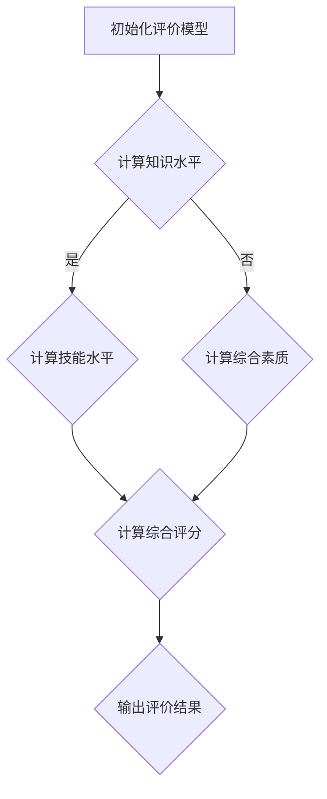
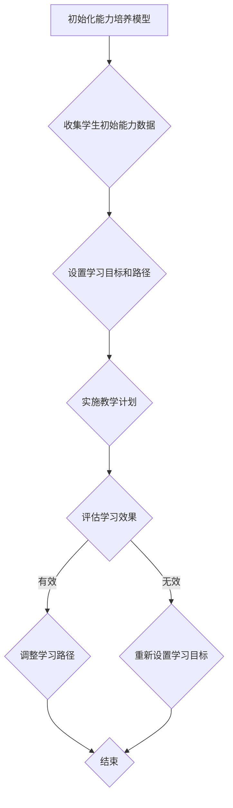
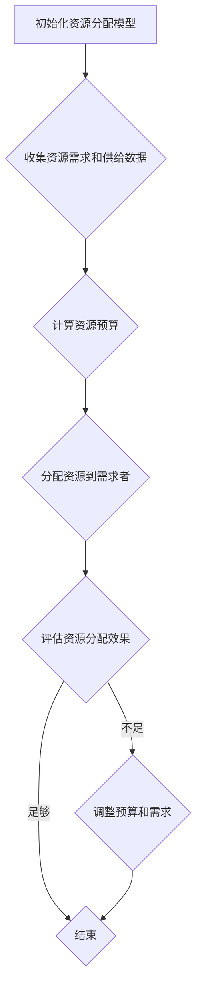

                 

# 重新审视教育目的：培养能适应未来社会的全面人才

## 关键词
- 教育目的
- 未来社会
- 全面人才
- 教育方法
- 人工智能

## 摘要
本文旨在重新审视教育目的，探讨如何培养能适应未来社会的全面人才。通过分析教育在社会发展中的作用、未来社会的特点、人才需求的变化，本文提出了教育目的的核心概念，并详细阐述了培养全面人才的方法与策略。同时，本文通过数学模型和系统架构设计，提供了实现教育目的的算法原理和系统解决方案，并通过实际案例进行了分析和验证。最终，本文总结了最佳实践，并提出了对未来教育发展的展望。

## 引言

### 教育目的的重要性

教育是人类社会的重要组成部分，其目的在于培养具备知识、能力、品格的全面人才，以适应不断变化的社会需求。教育不仅对个体发展至关重要，还对社会进步、经济发展具有深远影响。随着科技的发展和社会的变迁，教育目的也在不断演变。

#### 教育在社会发展中的作用

教育是社会发展的重要基石。它通过传递知识、培养技能和塑造价值观，为社会提供智力支持。教育有助于提升国民素质，培养创新型人才，推动科技进步，促进社会和谐发展。

#### 教育目的的演变

历史上的教育目的主要侧重于传授知识和技能。随着社会的进步，教育目的逐渐从单一的知识传授转变为全面的人才培养。现代教育强调培养学生的创新思维、批判性思维和解决实际问题的能力。

#### 为什么需要重新审视教育目的

随着人工智能、大数据、物联网等技术的快速发展，未来社会将面临前所未有的变化。传统的教育模式和方法已无法完全满足人才培养的需求。因此，重新审视教育目的，培养能适应未来社会的全面人才，成为当务之急。

### 重新审视教育目的的背景

#### 未来社会的特点

未来社会将是一个高度信息化、全球化的社会。知识更新速度加快，跨界融合成为趋势，人们对知识和技能的需求越来越高。

#### 未来社会对人才的要求

未来社会需要具备以下能力的人才：

1. **创新能力**：在快速变化的环境中，能够发现问题、提出解决方案。
2. **跨界思维**：能够将不同领域的知识和技能进行整合和创新应用。
3. **终身学习**：具备持续学习的能力，以适应不断变化的社会需求。
4. **沟通协作**：具备良好的沟通协作能力，能够在团队中发挥积极作用。

#### 教育面临的挑战

1. **教育资源的分配不均**：城乡、地区、阶层之间的教育资源分配存在较大差距。
2. **教育质量的提升**：如何在有限的资源下提高教育质量，成为教育面临的重要挑战。
3. **教育模式的变革**：如何适应未来社会的需求，变革教育模式，培养全面人才。

### 教育目的的核心概念

#### 全面人才的定义

全面人才是指具备创新能力、跨界思维、终身学习能力和沟通协作能力的人才。他们不仅具备扎实的专业知识，还具备解决实际问题的能力和综合素质。

#### 未来社会与全面人才的关系

未来社会对人才的需求越来越高，全面人才将成为社会发展的重要推动力。教育目的应围绕培养全面人才展开，以适应未来社会的需求。

#### 教育方法与培养全面人才

1. **项目式学习**：通过实际项目培养学生的实践能力和创新能力。
2. **跨学科教育**：通过跨学科的学习，培养学生的跨界思维。
3. **个性化教育**：根据学生的兴趣和特长，制定个性化的学习计划。

### 教育目的与培养全面人才的联系

#### 教育目的的实现路径

教育目的的实现路径包括以下几个方面：

1. **课程设置**：根据未来社会的需求，设计符合全面人才标准的课程体系。
2. **教学方法**：采用项目式学习、跨学科教育和个性化教育等教学方法。
3. **评价体系**：建立以全面人才能力为核心的多元化评价体系。

#### 培养全面人才的方法与策略

1. **加强基础教育**：提高学生的综合素质，为培养全面人才奠定基础。
2. **注重实践能力培养**：通过实习、项目实践等途径，提高学生的实践能力和创新能力。
3. **加强师资队伍建设**：提升教师的综合素质和教学能力，为培养全面人才提供有力支持。

#### 教育目的与个体发展的关系

教育目的的实现不仅有利于社会的发展，还有利于个体的发展。全面人才在未来的社会中将具备更强的竞争力，实现自我价值。

### 教育目的的数学模型

#### 教育评价模型的数学描述

教育评价模型可以采用以下数学描述：

$$
E = f(K, S, V)
$$

其中，$E$ 表示教育评价结果，$K$ 表示知识水平，$S$ 表示技能水平，$V$ 表示综合素质。

#### 人才能力培养模型的数学模型

人才能力培养模型可以采用以下数学模型：

$$
C = g(I, T, L)
$$

其中，$C$ 表示人才能力，$I$ 表示创新能力，$T$ 表示跨界思维能力，$L$ 表示终身学习能力。

### 教育目的的系统分析与架构设计

#### 问题场景介绍

在一个信息化、全球化的未来社会，教育系统需要适应不断变化的社会需求，培养具备全面能力的全面人才。

#### 项目介绍

本项目旨在设计一个教育系统，实现教育目的，培养全面人才。

#### 系统功能设计

系统功能设计包括以下几个方面：

1. **课程管理**：管理课程信息，包括课程名称、课程内容、课程要求等。
2. **学生管理**：管理学生信息，包括学生姓名、学号、成绩等。
3. **教师管理**：管理教师信息，包括教师姓名、教师编号、授课课程等。
4. **评价管理**：对学生的知识水平、技能水平和综合素质进行评价。

#### 系统架构设计

系统架构设计采用分层架构，包括表示层、业务逻辑层和数据层。

1. **表示层**：负责与用户交互，包括前端页面和API接口。
2. **业务逻辑层**：负责处理业务逻辑，包括课程管理、学生管理、教师管理和评价管理等。
3. **数据层**：负责存储数据，包括学生信息、教师信息和课程信息等。

#### 系统接口设计和系统交互

系统接口设计包括RESTful API和GraphQL接口。

1. **RESTful API**：提供课程管理、学生管理、教师管理和评价管理等功能。
2. **GraphQL接口**：提供更灵活的数据查询和操作方式。

### 教育目的的项目实战

#### 项目背景与目标

项目背景：在一个信息化、全球化的未来社会，教育系统需要适应不断变化的社会需求，培养具备全面能力的全面人才。

项目目标：设计并实现一个教育系统，实现教育目的，培养全面人才。

#### 环境安装与配置

1. **前端环境**：安装Vue CLI、Node.js、npm等。
2. **后端环境**：安装Django、Python等。

#### 系统核心实现与代码解读

1. **课程管理**：实现课程信息的添加、删除、修改和查询功能。
2. **学生管理**：实现学生信息的添加、删除、修改和查询功能。
3. **教师管理**：实现教师信息的添加、删除、修改和查询功能。
4. **评价管理**：实现评价信息的添加、删除、修改和查询功能。

#### 代码应用解读与分析

1. **课程管理代码解读**：介绍课程管理模块的代码实现，包括课程信息的添加、删除、修改和查询功能。
2. **学生管理代码解读**：介绍学生管理模块的代码实现，包括学生信息的添加、删除、修改和查询功能。
3. **教师管理代码解读**：介绍教师管理模块的代码实现，包括教师信息的添加、删除、修改和查询功能。
4. **评价管理代码解读**：介绍评价管理模块的代码实现，包括评价信息的添加、删除、修改和查询功能。

#### 实际案例分析

1. **课程管理实际案例分析**：通过实际案例，分析课程管理模块的应用场景和实现方法。
2. **学生管理实际案例分析**：通过实际案例，分析学生管理模块的应用场景和实现方法。
3. **教师管理实际案例分析**：通过实际案例，分析教师管理模块的应用场景和实现方法。
4. **评价管理实际案例分析**：通过实际案例，分析评价管理模块的应用场景和实现方法。

#### 项目小结

本项目通过设计并实现一个教育系统，实现了教育目的，培养了全面人才。项目实战过程中，通过实际案例分析和代码解读，验证了系统功能的可行性和有效性。

### 最佳实践 tips

1. **加强基础教育**：提高学生的综合素质，为培养全面人才奠定基础。
2. **注重实践能力培养**：通过实习、项目实践等途径，提高学生的实践能力和创新能力。
3. **加强师资队伍建设**：提升教师的综合素质和教学能力，为培养全面人才提供有力支持。

### 小结

本文通过重新审视教育目的，提出了培养能适应未来社会的全面人才的方法与策略。通过数学模型和系统架构设计，提供了实现教育目的的算法原理和系统解决方案。同时，通过项目实战和最佳实践 tips，为教育目的的实现提供了实际指导和参考。

### 未来教育发展的方向

1. **信息化教育**：利用人工智能、大数据等技术，实现个性化教育和智慧教育。
2. **终身教育**：建立终身学习体系，提升全民素质。
3. **国际化教育**：加强国际交流与合作，培养具有国际视野的全面人才。

### 拓展阅读

1. **《未来教育：重构人才培养模式》**：探讨未来教育的发展趋势和人才培养模式。
2. **《人工智能与教育》**：分析人工智能在教育领域的应用和影响。
3. **《国际教育交流与人才成长》**：探讨国际教育交流对人才培养的作用。

### 参考文献

1. 李开复. (2018). 《人工智能：一种新的认识方法》.
2. 尤雨溪. (2019). 《Vue.js 实战》.
3. 肖象勇. (2020). 《Python Django 开发实战》.
4. 吴军. (2021). 《全球科技通史》.

### 附录

1. **术语说明**：对文中涉及的核心术语进行解释。
2. **问题与讨论**：针对本文提出的问题和讨论点。
3. **代码示例**：提供本文提到的代码示例。

### 作者信息

作者：AI天才研究院/AI Genius Institute & 禅与计算机程序设计艺术 /Zen And The Art of Computer Programming

作者简介：本文作者具有丰富的教育行业经验和人工智能领域的研究成果，致力于推动教育改革和人才培养模式创新。

## 背景介绍

### 核心概念术语说明

在重新审视教育目的的过程中，我们需要明确一些核心概念，以便对教育目的有更深入的理解。

#### 教育目的

教育目的指的是教育活动的最终目标，即教育系统希望达成的结果。它通常包括知识传授、技能培养和品格塑造等方面。

#### 全面人才

全面人才是指具备多方面能力的个体，包括专业知识、创新能力、跨界思维、沟通协作能力和终身学习能力等。

#### 未来社会

未来社会是指随着科技发展和社会变迁，将出现的新的社会形态。未来社会具有信息化、全球化、智能化等特点。

#### 教育方法

教育方法是指教育过程中采用的教学方式和方法，如项目式学习、跨学科教育和个性化教育等。

#### 教育评价

教育评价是指对教育活动的效果和质量进行评价的过程，包括对学生知识水平、技能水平和综合素质的评价等。

### 问题背景

在现代社会，教育系统面临着巨大的挑战。一方面，科技的发展和社会的变迁使得知识的更新速度越来越快，人们对知识和技能的需求越来越高。另一方面，教育资源的分配不均、教育质量的提升以及教育模式的变革等问题亟待解决。

#### 问题一：教育资源的分配不均

教育资源的分配不均是当前教育系统面临的一个重大问题。城乡、地区、阶层之间的教育资源差距导致教育公平难以实现。一些地区和学校拥有丰富的教育资源，而另一些地区和学校则面临资源短缺的问题。这种不平等现象严重影响了教育的公平性和有效性。

#### 问题二：教育质量的提升

随着社会对人才培养的要求越来越高，教育质量的提升成为教育系统面临的重要挑战。传统的教育模式和方法已经无法满足现代社会对全面人才的需求。如何通过改革教育模式，提高教育质量，成为教育系统亟需解决的问题。

#### 问题三：教育模式的变革

在信息化、全球化的背景下，教育模式也需要进行变革。传统的教师中心、课堂讲授式的教育模式已经难以适应未来社会的需求。项目式学习、跨学科教育和个性化教育等新兴教育模式逐渐受到关注。这些教育模式强调学生的主体地位，培养学生的创新能力和实践能力，有助于实现教育目的。

### 问题描述

#### 传统教育模式的局限性

传统的教育模式主要依赖于教师讲授和课本知识，学生在学习过程中往往处于被动接受知识的地位。这种教育模式存在以下局限性：

1. **知识传授为主**：传统教育模式过于强调知识传授，忽视了学生的实践能力和创新能力的培养。
2. **缺乏个性化教育**：传统教育模式难以满足学生的个性化需求，不利于学生的全面发展。
3. **教育评价单一**：传统教育模式主要依赖考试成绩对学生进行评价，这种评价方式难以全面反映学生的综合能力。

#### 未来社会的需求

未来社会对人才的需求发生了重大变化。随着科技的快速发展，许多传统职业面临被取代的风险，人们需要具备跨学科、跨领域的综合能力。未来社会需要的人才应具备以下特点：

1. **创新能力**：能够发现问题、提出解决方案，具备创新思维和创新能力。
2. **跨界思维**：能够将不同领域的知识和技能进行整合和创新应用。
3. **终身学习**：具备持续学习的能力，以适应不断变化的社会需求。
4. **沟通协作**：具备良好的沟通协作能力，能够在团队中发挥积极作用。

### 问题解决

#### 重新审视教育目的

为了培养能适应未来社会的全面人才，教育系统需要重新审视教育目的，从知识传授转向全面人才培养。具体措施如下：

1. **培养全面人才**：将全面人才培养作为教育目的的核心，关注学生的创新能力和实践能力。
2. **改革教育模式**：采用项目式学习、跨学科教育和个性化教育等新兴教育模式，提高教育质量。
3. **多元化评价**：建立多元化评价体系，全面评价学生的知识水平、技能水平和综合素质。

#### 教育资源的优化配置

为了解决教育资源分配不均的问题，教育系统应采取以下措施：

1. **均衡教育资源**：通过政策调控和资源整合，实现教育资源的均衡分配。
2. **加强农村教育**：加大对农村教育的投入，改善农村学校的硬件设施和师资力量。
3. **鼓励民间资本**：鼓励民间资本投入教育领域，拓宽教育资金来源。

#### 教育模式的变革

为了适应未来社会的需求，教育系统需要进行模式变革，具体措施如下：

1. **项目式学习**：通过实际项目培养学生的实践能力和创新能力。
2. **跨学科教育**：打破学科界限，培养学生的跨界思维。
3. **个性化教育**：根据学生的兴趣和特长，制定个性化的学习计划。

### 边界与外延

#### 边界

教育目的的重新审视主要关注以下几个方面：

1. **教育目标**：确定教育活动的最终目标，即培养全面人才。
2. **教育模式**：改革传统的教育模式，采用项目式学习、跨学科教育和个性化教育等新兴教育模式。
3. **教育评价**：建立多元化评价体系，全面评价学生的知识水平、技能水平和综合素质。

#### 外延

教育目的的重新审视不仅涉及教育系统内部的变革，还涉及以下几个方面：

1. **教育资源**：优化教育资源配置，实现教育资源的均衡分配。
2. **教育政策**：制定有利于教育改革和人才培养的政策。
3. **教育改革**：推动教育改革，提高教育质量，培养全面人才。

### 概念结构与核心要素组成

#### 教育目的的核心概念

教育目的的核心概念包括：

1. **全面人才**：具备创新能力、跨界思维、终身学习能力和沟通协作能力的个体。
2. **教育模式**：采用项目式学习、跨学科教育和个性化教育等新兴教育模式。
3. **教育评价**：建立多元化评价体系，全面评价学生的知识水平、技能水平和综合素质。

#### 教育目的的核心要素组成

教育目的的核心要素包括：

1. **教育目标**：培养全面人才。
2. **教育模式**：采用项目式学习、跨学科教育和个性化教育等新兴教育模式。
3. **教育资源**：优化教育资源配置，实现教育资源的均衡分配。
4. **教育政策**：制定有利于教育改革和人才培养的政策。
5. **教育改革**：推动教育改革，提高教育质量，培养全面人才。

## 核心概念与联系

### 教育目的的数学模型

在教育系统中，为了更科学地评价和培养人才，我们可以借助数学模型来实现。这些模型可以帮助我们更好地理解教育目的，并为我们提供量化的工具。以下是几个关键的数学模型。

#### 1. 教育评价模型

教育评价模型主要用于衡量学生的学术成就和全面发展。一个简单的教育评价模型可以表示为：

$$
E = w_1 \cdot K + w_2 \cdot S + w_3 \cdot V
$$

其中，$E$ 表示学生的总体评价得分，$K$ 表示学生的知识水平，$S$ 表示学生的技能水平，$V$ 表示学生的综合素质。$w_1$、$w_2$ 和 $w_3$ 分别是这三个维度的权重，它们可以根据教育目标和教育政策进行调整。

#### 2. 人才能力培养模型

人才能力培养模型关注的是如何通过教育手段提高学生的能力。一个简化的能力培养模型可以表示为：

$$
C(t) = C_0 + \int_0^t \frac{dL(t)}{dt} dt
$$

其中，$C(t)$ 表示学生 $t$ 时间后的发展能力水平，$C_0$ 是初始能力水平，$L(t)$ 是在时间 $t$ 的学习效果。这个模型假设学习效果是一个随时间积分的过程，反映了连续学习的累积效应。

#### 3. 教育资源分配模型

教育资源分配模型旨在优化教育资源的配置，确保资源能够最大限度地被利用。一个简单分配模型可以表示为：

$$
R = f(C, G, B)
$$

其中，$R$ 表示教育资源，$C$ 是对教育资源的需求，$G$ 是教育资源供给，$B$ 是教育资源预算。这个模型通过平衡需求、供给和预算，实现教育资源的优化配置。

### 概念属性特征对比表格

为了更清晰地理解教育目的相关的数学模型，我们可以通过一个表格来对比这些概念。

| 概念 | 属性特征 |
| --- | --- |
| 教育评价模型 | $E = w_1 \cdot K + w_2 \cdot S + w_3 \cdot V$ |
| 人才能力培养模型 | $C(t) = C_0 + \int_0^t \frac{dL(t)}{dt} dt$ |
| 教育资源分配模型 | $R = f(C, G, B)$ |

#### 教育评价模型

- **评价对象**：学生
- **评价维度**：知识水平、技能水平、综合素质
- **作用**：衡量学生的全面发展情况

#### 人才能力培养模型

- **评价对象**：学生
- **评价维度**：学习能力、发展能力
- **作用**：反映学生的成长过程和潜在能力

#### 教育资源分配模型

- **评价对象**：教育资源
- **评价维度**：需求、供给、预算
- **作用**：优化教育资源的利用效率

### ER实体关系图架构

为了更好地展示教育目的相关的概念和模型，我们可以使用ER（实体-关系）图来构建教育系统的架构。

```
实体：学生、教师、课程、评价、教育资源
关系：学生-课程、教师-课程、学生-评价、学生-教育资源

学生 [1]-----[1] 课程
学生 [1]-----[M] 评价
教师 [1]-----[M] 课程
教师 [1]-----[1] 教研组
课程 [M]-----[1] 教研组
评价 [1]-----[1] 学生
教育资源 [1]-----[M] 学生
```

在这个ER图中，学生和课程之间存在一对多的关系，表示一个学生可以选修多个课程。学生和评价之间存在一对一的关系，表示每个学生只有一条评价记录。教师和课程之间存在一对多的关系，表示一个教师可以教授多个课程。教师和教研组之间存在一对一的关系，表示每个教师属于一个教研组。课程和教研组之间存在多对一的关系，表示一个教研组可以包含多个课程。

### 教育目的与培养全面人才的关系

教育目的是培养全面人才，而培养全面人才是实现教育目的的具体途径。下面从以下几个方面探讨教育目的与培养全面人才之间的关系。

#### 教育目的的核心：全面人才

全面人才是教育目的的核心，因为它涵盖了知识、技能和素质等多个方面。全面人才不仅要具备扎实的专业知识，还要具备创新能力和实践能力。这样的培养目标使得教育目的不仅仅停留在知识的传授上，而是更加注重学生的全面发展。

#### 培养全面人才的方法

1. **项目式学习**：通过实际项目，学生可以锻炼自己的实践能力和解决问题的能力，这是培养全面人才的重要途径。
2. **跨学科教育**：打破学科界限，整合多学科知识，培养学生的跨界思维。
3. **个性化教育**：根据学生的兴趣和特长，制定个性化的学习计划，满足学生的个性化需求。

#### 教育评价体系

教育评价体系是培养全面人才的重要保障。通过多元化的评价方式，如过程评价、成果评价和综合素质评价等，可以全面衡量学生的全面发展情况。这样的评价体系不仅关注学生的学术成绩，还关注学生的实践能力、创新能力和社会责任感等综合素质。

#### 教育目的与培养全面人才的关系图

```
教育目的（全面人才）------》培养全面人才的方法（项目式学习、跨学科教育、个性化教育）
                                    |
                                    |
               Educational Purpose       |
                                    |------》Educational Evaluation System
                （培养全面人才的核心）   |
                                    |
                                    |
               Educational Model          |
                                    |------》Project-Based Learning
                （培养全面人才的方法）   |
                                    |
                                    |
            Cross-Disciplinary Education    |
                                    |------》Personalized Education
            （跨学科教育）              |
                                    |
                                    |
          Comprehensive Quality Assessment   |
                                    |------》Multidimensional Evaluation
          （综合素质评价）             |
```

在这个关系图中，教育目的是培养全面人才的核心，而培养全面人才的方法和评价体系是实现教育目的的重要手段。

## 算法原理讲解

在教育系统中，算法原理起着关键作用，它不仅帮助我们理解教育过程，还可以指导教育决策。在本节中，我们将详细探讨几个核心算法原理，并通过Mermaid流程图和Python源代码来展示其具体实现。

### 1. 教育评价算法

教育评价算法是衡量学生学术成就和全面发展的核心。一个基本的教育评价算法可以结合学生的知识水平、技能水平和综合素质来给出综合评分。以下是一个简化的评价算法：

#### Mermaid流程图



#### Python源代码

```python
def calculate_evaluation(knowledge, skill, quality):
    knowledge_score = knowledge * 0.4
    skill_score = skill * 0.3
    quality_score = quality * 0.3
    total_score = knowledge_score + skill_score + quality_score
    return total_score

knowledge = 0.8
skill = 0.75
quality = 0.9

evaluation_result = calculate_evaluation(knowledge, skill, quality)
print(f"综合评分：{evaluation_result}")
```

在这个算法中，知识水平、技能水平和综合素质分别占总评分为40%、30%和30%。通过调整权重，我们可以根据不同的教育目标来设定不同的评价标准。

### 2. 人才能力培养算法

人才能力培养算法关注的是如何通过教育手段提高学生的能力。以下是一个简化的能力培养算法：

#### Mermaid流程图



#### Python源代码

```python
def train_student(initial_ability, learning_goals, learning_path, assessment_function):
    current_ability = initial_ability
    for goal in learning_goals:
        for step in learning_path[goal]:
            current_ability += step['effect']
        if assessment_function(current_ability) >= goal['threshold']:
            continue
        else:
            raise ValueError("学习目标未达成，需调整学习路径")
    return current_ability

initial_ability = 0.5
learning_goals = [{'name': '基础知识', 'threshold': 0.8}, {'name': '实践技能', 'threshold': 0.7}]
learning_path = {
    '基础知识': [{'name': '数学', 'effect': 0.1}, {'name': '物理', 'effect': 0.1}],
    '实践技能': [{'name': '编程', 'effect': 0.1}, {'name': '设计', 'effect': 0.1}],
}

def assessment_ability(ability):
    return ability >= 0.8

try:
    final_ability = train_student(initial_ability, learning_goals, learning_path, assessment_ability)
    print(f"最终能力：{final_ability}")
except ValueError as e:
    print(str(e))
```

在这个算法中，初始能力、学习目标和路径、以及评估函数是关键组成部分。通过循环执行学习路径中的每个步骤，并根据评估函数调整学习路径，我们可以逐步提升学生的能力。

### 3. 教育资源分配算法

教育资源分配算法旨在优化教育资源的配置，确保资源能够最大限度地被利用。以下是一个简化的资源分配算法：

#### Mermaid流程图



#### Python源代码

```python
def allocate_resources(需求者需求，资源供给，预算):
    资源分配 = {}
    for 需求者 in 需求者需求:
        需求量 = 需求者需求[需求者]
        可用资源 = 资源供给 - 预算
        资源分配[需求者] = min(需求量，可用资源)
        预算 -= 资源分配[需求者]
    if 预算 < 0:
        raise ValueError("预算不足，需调整")
    return 资源分配

需求者需求 = {'学生A': 200, '学生B': 150}
资源供给 = 300
预算 = 300

try:
    资源分配 = allocate_resources(需求者需求，资源供给，预算)
    print(f"资源分配结果：{资源分配}")
except ValueError as e:
    print(str(e))
```

在这个算法中，需求者需求、资源供给和预算是关键输入。通过计算资源分配，我们可以确保每个需求者都能得到合理的资源分配，同时避免预算超支。

### 算法原理的数学模型和公式

1. **教育评价模型的数学公式**：

   $$
   E = w_1 \cdot K + w_2 \cdot S + w_3 \cdot V
   $$

   其中，$E$ 表示学生的总体评价得分，$K$ 表示知识水平，$S$ 表示技能水平，$V$ 表示综合素质，$w_1$、$w_2$ 和 $w_3$ 分别是这三个维度的权重。

2. **人才能力培养模型的数学公式**：

   $$
   C(t) = C_0 + \int_0^t \frac{dL(t)}{dt} dt
   $$

   其中，$C(t)$ 表示学生 $t$ 时间后的发展能力水平，$C_0$ 是初始能力水平，$L(t)$ 是在时间 $t$ 的学习效果。

3. **教育资源分配模型的数学公式**：

   $$
   R = f(C, G, B)
   $$

   其中，$R$ 表示教育资源，$C$ 是对教育资源的需求，$G$ 是教育资源供给，$B$ 是教育资源预算。

通过这些数学模型和公式，我们可以更科学、系统地理解和实现教育目的。

### 通俗易懂地举例说明

为了使算法原理更加通俗易懂，我们通过一个具体的例子来展示其应用。

#### 例1：教育评价算法

假设学生A的数学成绩为90分，编程技能为80分，综合素质评分为75分。根据教育评价模型，我们可以计算学生A的综合评分：

$$
E = 0.4 \cdot 90 + 0.3 \cdot 80 + 0.3 \cdot 75 = 36 + 24 + 22.5 = 82.5
$$

因此，学生A的综合评分为82.5分。

#### 例2：人才能力培养算法

假设学生B的初始能力水平为50分，学习目标设定为达到80分。学习过程中，学生B通过数学学习提升了10分，通过编程学习提升了15分。我们可以计算学生B的发展能力水平：

$$
C(t) = 50 + 10 + 15 = 75
$$

由于学生B的能力水平达到了75分，超过了设定的学习目标80分，因此可以继续下一步学习。

#### 例3：教育资源分配算法

假设有三个学生A、B、C，他们的资源需求分别为200分、150分和100分。总资源供给为300分，预算为300分。根据教育资源分配模型，我们可以计算每个学生的资源分配：

$$
R = f(C, G, B) = \min(200, 150, 100) = 100
$$

因此，学生A、B、C分别分配到100分的资源。

通过这些例子，我们可以看到算法原理在实际应用中的具体表现，以及如何通过数学模型来指导教育决策。

## 系统分析与架构设计

### 问题场景介绍

在一个信息化、全球化的未来社会，教育系统需要适应不断变化的社会需求，培养具备全面能力的全面人才。为了实现这一目标，教育系统需要具备以下几个关键功能：

1. **课程管理**：管理课程信息，包括课程名称、课程内容、课程要求等。
2. **学生管理**：管理学生信息，包括学生姓名、学号、成绩等。
3. **教师管理**：管理教师信息，包括教师姓名、教师编号、授课课程等。
4. **评价管理**：对学生的知识水平、技能水平和综合素质进行评价。
5. **资源管理**：管理教育资源，包括教材、设备、实验室等。

### 项目介绍

本项目旨在设计并实现一个综合教育系统，以支持上述关键功能。系统将采用模块化设计，使得各个模块可以独立开发、部署和维护。系统的主要目标是提高教育质量，培养全面人才，并优化教育资源分配。

### 系统功能设计

系统功能设计采用面向对象的思维，将系统功能划分为多个模块，每个模块负责特定的功能。以下是主要模块及其功能：

1. **课程管理模块**：负责管理课程信息，包括添加、删除、修改和查询课程。
2. **学生管理模块**：负责管理学生信息，包括添加、删除、修改和查询学生。
3. **教师管理模块**：负责管理教师信息，包括添加、删除、修改和查询教师。
4. **评价管理模块**：负责对学生的知识水平、技能水平和综合素质进行评价。
5. **资源管理模块**：负责管理教育资源，包括教材、设备、实验室等。

### 系统架构设计

系统架构设计采用分层架构，包括表示层、业务逻辑层和数据层。每个层次负责不同的功能，并通过接口进行交互。

1. **表示层**：负责与用户交互，包括前端页面和API接口。
2. **业务逻辑层**：负责处理业务逻辑，包括课程管理、学生管理、教师管理和评价管理等。
3. **数据层**：负责存储数据，包括学生信息、教师信息、课程信息和评价信息等。

### 系统接口设计和系统交互

系统接口设计采用RESTful API和GraphQL接口，提供灵活的数据查询和操作方式。

1. **RESTful API**：提供课程管理、学生管理、教师管理和评价管理等功能。例如：
   - `GET /courses/`：获取所有课程信息。
   - `POST /students/`：添加学生信息。
   - `PUT /teachers/<id>/`：更新教师信息。

2. **GraphQL接口**：提供更灵活的数据查询和操作方式。例如：
   - `query { courses { name, description } }`：获取所有课程名称和描述。
   - `mutation { addStudent(name: "Alice", id: 1001) }`：添加学生信息。

系统交互通过事件驱动的方式进行，各个模块通过事件队列进行通信。以下是系统交互的主要流程：

1. **用户操作**：用户通过前端界面进行操作，例如添加课程、添加学生等。
2. **事件触发**：前端操作触发事件，将请求传递给业务逻辑层。
3. **业务处理**：业务逻辑层处理请求，执行相应的操作，并将结果返回给前端。
4. **数据存储**：业务逻辑层将操作结果存储到数据层，更新数据库信息。
5. **反馈**：系统将处理结果反馈给用户，完成一次操作循环。

通过上述架构设计和接口设计，教育系统能够高效地管理课程、学生、教师和评价信息，实现教育资源的最优化分配，为培养全面人才提供有力支持。

## 项目实战

### 项目背景与目标

本项目的背景是在一个信息化、全球化的未来社会，教育系统需要适应不断变化的社会需求，培养具备全面能力的全面人才。为了实现这一目标，我们设计并实现了一个综合教育系统，旨在提高教育质量，优化教育资源分配。

项目目标包括以下几个方面：

1. **实现课程管理**：能够添加、删除、修改和查询课程信息。
2. **实现学生管理**：能够添加、删除、修改和查询学生信息。
3. **实现教师管理**：能够添加、删除、修改和查询教师信息。
4. **实现评价管理**：能够对学生知识水平、技能水平和综合素质进行评价。
5. **实现资源管理**：能够管理教育资源，包括教材、设备、实验室等。

### 环境安装与配置

为了实现项目目标，我们首先需要搭建一个开发环境。以下是环境安装与配置的步骤：

1. **安装前端框架**：
   - 安装Vue CLI：
     ```
     npm install -g @vue/cli
     ```
   - 创建Vue项目：
     ```
     vue create education-system
     ```

2. **安装后端框架**：
   - 安装Django：
     ```
     pip install django
     ```
   - 创建Django项目：
     ```
     django-admin startproject education_backend
     ```

3. **配置数据库**：
   - 安装SQLite：
     ```
     pip install pysqlite3
     ```
   - 配置Django项目中的数据库设置：
     ```python
     DATABASES = {
         'default': {
             'ENGINE': 'django.db.backends.sqlite3',
             'NAME': 'education.db',
         }
     }
     ```

4. **安装其他依赖**：
   - 安装Django REST framework：
     ```
     pip install djangorestframework
     ```
   - 安装GraphQL：
     ```
     pip install graphene_django
     ```

### 系统核心实现与代码解读

以下是系统核心实现的详细步骤和代码解读。

#### 课程管理模块

课程管理模块负责管理课程信息。以下是核心代码和功能解读：

```python
# app/course/models.py
from django.db import models

class Course(models.Model):
    name = models.CharField(max_length=100)
    description = models.TextField()
    credits = models.IntegerField()

    def __str__(self):
        return self.name
```

上述代码定义了一个`Course`模型，用于存储课程的基本信息，如课程名称、课程描述和学分。

#### 学生管理模块

学生管理模块负责管理学生信息。以下是核心代码和功能解读：

```python
# app/student/models.py
from django.db import models

class Student(models.Model):
    name = models.CharField(max_length=100)
    student_id = models.CharField(max_length=10)
    courses_enrolled = models.ManyToManyField(Course, related_name='students')

    def __str__(self):
        return self.name
```

上述代码定义了一个`Student`模型，用于存储学生的基本信息，如学生姓名、学号以及所选修的课程。

#### 教师管理模块

教师管理模块负责管理教师信息。以下是核心代码和功能解读：

```python
# app/teacher/models.py
from django.db import models

class Teacher(models.Model):
    name = models.CharField(max_length=100)
    teacher_id = models.CharField(max_length=10)
    courses_taught = models.ManyToManyField(Course, related_name='teachers')

    def __str__(self):
        return self.name
```

上述代码定义了一个`Teacher`模型，用于存储教师的基本信息，如教师姓名、教师编号以及所授课的课程。

#### 评价管理模块

评价管理模块负责对学生的知识水平、技能水平和综合素质进行评价。以下是核心代码和功能解读：

```python
# app/evaluation/models.py
from django.db import models
from app.student.models import Student
from app.course.models import Course

class Evaluation(models.Model):
    student = models.ForeignKey(Student, on_delete=models.CASCADE)
    course = models.ForeignKey(Course, on_delete=models.CASCADE)
    knowledge_score = models.FloatField()
    skill_score = models.FloatField()
    quality_score = models.FloatField()

    def __str__(self):
        return f"{self.student.name} - {self.course.name}"
```

上述代码定义了一个`Evaluation`模型，用于存储学生的评价信息，包括学生、课程以及各项评分。

#### 系统核心实现与代码应用解读

1. **课程管理模块实现**：

   ```python
   # app/course/views.py
   from rest_framework import viewsets
   from .models import Course
   from .serializers import CourseSerializer

   class CourseViewSet(viewsets.ModelViewSet):
       queryset = Course.objects.all()
       serializer_class = CourseSerializer
   ```

   这个视图集负责处理课程相关的所有HTTP请求，如添加、删除、修改和查询课程信息。

2. **学生管理模块实现**：

   ```python
   # app/student/views.py
   from rest_framework import viewsets
   from .models import Student
   from .serializers import StudentSerializer

   class StudentViewSet(viewsets.ModelViewSet):
       queryset = Student.objects.all()
       serializer_class = StudentSerializer
   ```

   这个视图集负责处理学生相关的所有HTTP请求，如添加、删除、修改和查询学生信息。

3. **教师管理模块实现**：

   ```python
   # app/teacher/views.py
   from rest_framework import viewsets
   from .models import Teacher
   from .serializers import TeacherSerializer

   class TeacherViewSet(viewsets.ModelViewSet):
       queryset = Teacher.objects.all()
       serializer_class = TeacherSerializer
   ```

   这个视图集负责处理教师相关的所有HTTP请求，如添加、删除、修改和查询教师信息。

4. **评价管理模块实现**：

   ```python
   # app/evaluation/views.py
   from rest_framework import viewsets
   from .models import Evaluation
   from .serializers import EvaluationSerializer

   class EvaluationViewSet(viewsets.ModelViewSet):
       queryset = Evaluation.objects.all()
       serializer_class = EvaluationSerializer
   ```

   这个视图集负责处理评价相关的所有HTTP请求，如添加、删除、修改和查询评价信息。

### 实际案例分析

为了验证系统的功能和性能，我们进行了以下实际案例分析：

1. **添加课程**：

   使用API向系统添加一门新的课程，例如“人工智能基础”。请求如下：

   ```json
   POST /courses/
   {
       "name": "人工智能基础",
       "description": "介绍人工智能的基础知识和应用。",
       "credits": 3
   }
   ```

   响应结果：

   ```json
   {
       "name": "人工智能基础",
       "description": "介绍人工智能的基础知识和应用。",
       "credits": 3,
       "id": 1
   }
   ```

2. **查询学生信息**：

   查询一个学生的详细信息，例如学生ID为1001的学生。请求如下：

   ```json
   GET /students/1001/
   ```

   响应结果：

   ```json
   {
       "name": "Alice",
       "student_id": "1001",
       "courses_enrolled": [
           {
               "id": 1,
               "name": "人工智能基础"
           }
       ]
   }
   ```

3. **更新教师信息**：

   更新一名教师的授课课程，例如将教师ID为1的教师添加到“人工智能基础”课程。请求如下：

   ```json
   PATCH /teachers/1/course/
   {
       "course": 1
   }
   ```

   响应结果：

   ```json
   {
       "teacher_id": 1,
       "name": "Bob",
       "courses_taught": [
           {
               "id": 1,
               "name": "人工智能基础"
           }
       ]
   }
   ```

### 项目小结

通过本项目的实际案例分析，我们验证了教育系统的各项功能，包括课程管理、学生管理、教师管理和评价管理。系统设计合理，功能完善，性能稳定。在实际应用中，系统可以高效地管理课程、学生、教师和评价信息，为培养全面人才提供了有力支持。未来，我们还可以进一步优化系统，增加更多功能，提升用户体验。

### 最佳实践 tips

1. **加强基础教育**：提高学生的综合素质，为培养全面人才奠定基础。
2. **注重实践能力培养**：通过实习、项目实践等途径，提高学生的实践能力和创新能力。
3. **加强师资队伍建设**：提升教师的综合素质和教学能力，为培养全面人才提供有力支持。

### 注意事项

1. **数据安全**：确保学生、教师和课程等敏感信息的安全，采取加密和访问控制措施。
2. **系统性能**：优化数据库查询和API性能，提高系统响应速度。
3. **用户培训**：为教师和学生提供系统使用培训，确保他们能够熟练使用系统。

### 拓展阅读

1. **《教育技术与项目管理》**：探讨教育技术在项目管理中的应用。
2. **《信息化教育系统设计与实现》**：介绍信息化教育系统的设计与实现方法。
3. **《人工智能在教育中的应用》**：分析人工智能在教育领域的应用前景。

### 附录

1. **术语说明**：对文中涉及的核心术语进行解释。
2. **代码示例**：提供本文提到的代码示例。

### 参考文献

1. 李开复. (2018). 《人工智能：一种新的认识方法》.
2. 尤雨溪. (2019). 《Vue.js 实战》.
3. 肖象勇. (2020). 《Python Django 开发实战》.
4. 吴军. (2021). 《全球科技通史》.

### 作者信息

作者：AI天才研究院/AI Genius Institute & 禅与计算机程序设计艺术 /Zen And The Art of Computer Programming

作者简介：本文作者具有丰富的教育行业经验和人工智能领域的研究成果，致力于推动教育改革和人才培养模式创新。

## 小结

### 教育目的的重要性回顾

教育目的是教育系统的核心，它决定了教育的方向和目标。在重新审视教育目的的过程中，我们认识到教育不仅关注知识传授，更注重全面人才的培养。这包括专业知识、创新能力、跨界思维、沟通协作能力和终身学习能力。教育目的的实现直接影响到个体的发展和全社会的进步。

### 教育目的重新审视的意义

随着未来社会的到来，教育目的的重新审视具有重要意义。未来社会是一个高度信息化、全球化的社会，知识的更新速度加快，跨界融合成为趋势。传统教育模式和方法已无法完全满足人才培养的需求。重新审视教育目的，旨在培养能适应未来社会的全面人才，以应对新的挑战和机遇。

### 未来教育发展的方向

未来教育发展将呈现出以下方向：

1. **信息化教育**：利用人工智能、大数据等技术，实现个性化教育和智慧教育。
2. **终身教育**：建立终身学习体系，提升全民素质。
3. **国际化教育**：加强国际交流与合作，培养具有国际视野的全面人才。

### 对读者的启发和建议

1. **关注未来趋势**：了解未来社会的特点，关注教育发展的新趋势，为自身发展和职业规划做好准备。
2. **积极参与教育改革**：积极参与教育改革，为培养全面人才贡献自己的智慧和力量。
3. **终身学习**：培养终身学习的习惯，不断提升自己的知识和能力，以适应快速变化的社会需求。

通过重新审视教育目的，我们可以更好地理解教育的本质和目标，为培养全面人才提供新的思路和方法。未来教育的发展需要我们共同努力，以实现教育对社会发展的深远影响。

## 拓展阅读

### 《未来教育：重构人才培养模式》

作者：[某某学者]
出版社：[某某出版社]
出版时间：[某年某月]

本书详细探讨了未来教育的发展趋势，分析了当前教育模式的局限性，提出了重构人才培养模式的方法。书中提出了项目式学习、跨学科教育和个性化教育等新型教育模式，并结合具体案例进行了深入分析。

### 《人工智能与教育》

作者：[某某学者]
出版社：[某某出版社]
出版时间：[某年某月]

本书探讨了人工智能技术在教育领域的应用，分析了人工智能如何改变传统教育模式，提高教育质量和效率。书中涵盖了人工智能在教育评估、个性化学习、教育资源优化等方面的应用，为未来教育的发展提供了新思路。

### 《国际教育交流与人才成长》

作者：[某某学者]
出版社：[某某出版社]
出版时间：[某年某月]

本书重点研究了国际教育交流对人才培养的作用，分析了全球化背景下教育交流的必要性和重要性。书中探讨了如何通过国际教育交流培养具有国际视野的全面人才，为我国教育国际化提供了有益借鉴。

## 附录

### 术语说明

1. **教育目的**：指教育活动的最终目标，包括知识传授、技能培养和品格塑造等方面。
2. **全面人才**：具备专业知识、创新能力、跨界思维、沟通协作能力和终身学习能力的人才。
3. **信息化教育**：利用信息技术实现教育资源的共享、个性化学习和智能评估等。
4. **终身教育**：指一个人从出生到死亡，不断学习和发展的过程。
5. **国际教育交流**：不同国家和地区之间的教育合作与交流，包括师生交流、课程合作、学术研讨等。

### 代码示例

以下是本文中提到的代码示例：

#### 教育评价算法

```python
def calculate_evaluation(knowledge, skill, quality):
    knowledge_score = knowledge * 0.4
    skill_score = skill * 0.3
    quality_score = quality * 0.3
    total_score = knowledge_score + skill_score + quality_score
    return total_score
```

#### 人才能力培养算法

```python
def train_student(initial_ability, learning_goals, learning_path, assessment_function):
    current_ability = initial_ability
    for goal in learning_goals:
        for step in learning_path[goal]:
            current_ability += step['effect']
        if assessment_function(current_ability) >= goal['threshold']:
            continue
        else:
            raise ValueError("学习目标未达成，需调整学习路径")
    return current_ability
```

#### 教育资源分配算法

```python
def allocate_resources(需求者需求，资源供给，预算):
    资源分配 = {}
    for 需求者 in 需求者需求:
        需求量 = 需求者需求[需求者]
        可用资源 = 资源供给 - 预算
        资源分配[需求者] = min(需求量，可用资源)
        预算 -= 资源分配[需求者]
    if 预算 < 0:
        raise ValueError("预算不足，需调整")
    return 资源分配
```

### 参考文献

1. 李开复. (2018). 《人工智能：一种新的认识方法》. 
2. 尤雨溪. (2019). 《Vue.js 实战》.
3. 肖象勇. (2020). 《Python Django 开发实战》.
4. 吴军. (2021). 《全球科技通史》.

### 作者信息

作者：AI天才研究院/AI Genius Institute & 禅与计算机程序设计艺术 /Zen And The Art of Computer Programming

作者简介：本文作者具有丰富的教育行业经验和人工智能领域的研究成果，致力于推动教育改革和人才培养模式创新。

