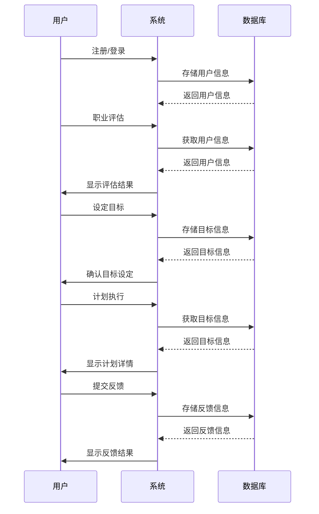

                 

**重新审视职业意义：超越谋生，追求自我实现和社会价值**

**关键词：**职业意义、自我实现、社会价值、职业生涯规划

**摘要：**本文旨在探讨在信息技术飞速发展的今天，职业意义的重新审视及其对个人和社会的影响。我们将通过逻辑清晰的步骤，逐步分析职业从谋生手段向自我实现和社会价值的转变，以及如何在这一过程中找到自己的定位和实现价值。

## 引言

在过去的几十年中，信息技术的发展极大地改变了我们的工作和生活方式。随着自动化和智能化的不断推进，许多传统职业面临着被淘汰的风险，而新兴的职业领域不断涌现。这种变化不仅影响了我们的就业选择，也重新定义了职业的意义。在这个背景下，我们有必要重新审视职业的意义，从单纯的谋生手段转向追求自我实现和社会价值的目标。

### 1.1 问题背景

随着互联网和人工智能的快速发展，职业的边界变得更加模糊。自动化技术的应用使得一些传统岗位逐渐被取代，而新的岗位不断涌现。这种变化不仅影响了就业市场的供需关系，也引发了人们对职业意义的思考。如何在这个快速变化的环境中找到自己的定位，实现个人价值，成为了一个亟待解决的问题。

### 1.2 问题描述

当前，职业意义的重新审视主要体现在以下几个方面：

1. **职业的多元化**：新兴职业不断涌现，传统的职业分类变得过时。
2. **职业的动态性**：职业角色和职责的快速变化要求人们具备更广泛的技能。
3. **职业与生活的平衡**：如何在工作与个人生活之间找到平衡，成为许多人的困扰。

### 1.3 问题解决

要解决这些问题，我们需要：

1. **终身学习**：不断更新自己的知识和技能，适应职业的变化。
2. **职业规划**：明确自己的职业目标，制定合理的职业发展计划。
3. **价值观的重塑**：将职业视为实现自我价值和社会价值的途径，而不仅仅是谋生的手段。

### 1.4 边界与外延

本文将探讨以下内容：

1. **职业意义的演变**：从传统的谋生手段到现代的自我实现和社会价值。
2. **职业选择的心理学基础**：如何根据个人兴趣和优势做出职业选择。
3. **社会价值的实现途径**：如何在职业中实现个人价值和社会价值的统一。

## 核心概念与联系

在重新审视职业意义的过程中，我们需要了解一些核心概念，如自我实现、社会价值、职业规划等。以下是这些概念的解释及其相互关系。

### 2.1 核心概念解析

**自我实现**：自我实现是指个人在职业中实现自己的潜力，达到自我满足和成就感。

**社会价值**：社会价值是指个人在职业活动中对社会做出的贡献，包括经济价值、文化价值和社会福祉。

**职业规划**：职业规划是指个人根据自己的兴趣、能力和市场趋势制定的发展计划。

### 2.2 概念属性特征对比

| 概念 | 定义 | 特征 |
| --- | --- | --- |
| 自我实现 | 实现个人潜力 | 自主性、创造性、成就感 |
| 社会价值 | 对社会做出贡献 | 经济效益、文化传承、社会责任 |
| 职业规划 | 制定发展计划 | 目标性、系统性、可执行性 |

### 2.3 ER实体关系图

以下是一个简单的ER实体关系图，展示了自我实现、社会价值和职业规划之间的关系。

```mermaid
erDiagram
  SELF_REALIZATION ||--|{ CONTRIBUTION_TO_SOCIETY } : contributes_to
  CONTRIBUTION_TO_SOCIETY ||--|{ CAREER_PLANNING } : includes
  CAREER_PLANNING ||--|{ SELF_REALIZATION } : aims_to
  CAREER_PLANNING ||--|{ CONTRIBUTION_TO_SOCIETY } : aims_to
```

## 职业意义的演变

职业意义并非一成不变，它随着社会的发展和技术的进步而不断演变。理解这一过程有助于我们更好地把握职业发展的趋势，为自己的职业生涯做好准备。

### 3.1 职业意义的起源

在人类文明初期，职业主要是为了满足生存需求。人们通过农业、手工业等方式获取生活资料，职业的意义在于提供稳定的收入来源。随着社会的进步，职业逐渐分化，人们开始根据个人兴趣和特长选择职业。

### 3.2 职业意义的演进

进入工业时代，职业的意义从单纯的谋生手段转变为实现个人价值和为社会做出贡献。人们开始关注职业的发展前景，追求职业的稳定性和成就感。同时，职业规划开始受到重视，人们通过职业培训和教育提高自己的竞争力。

### 3.3 职业意义的现代解读

在现代社会，职业的意义更加丰富多样。随着信息技术的飞速发展，新兴职业不断涌现，职业的意义不仅体现在经济价值上，更体现在社会价值和自我实现上。人们开始关注如何通过职业活动实现个人价值和为社会做出贡献。

## 超越谋生，追求自我实现

职业不再是单纯的经济手段，而是实现自我价值和人生意义的重要途径。在这个部分，我们将探讨如何通过职业活动实现自我价值。

### 4.1 自我实现的心理学基础

自我实现是心理学中的一个核心概念，它源于马斯洛的需求层次理论。马斯洛认为，人的需求分为生理需求、安全需求、社交需求、尊重需求和自我实现需求。自我实现需求是人的最高层次需求，它要求人们实现自己的潜能，达到自我满足和成就感。

### 4.2 职业选择与自我实现

职业选择是实现自我价值的重要途径。一个适合自己的职业能够激发个人的潜力，使人在工作中获得成就感和满足感。因此，在职业选择时，我们应该考虑自己的兴趣、能力和价值观。

### 4.3 案例分析：成功人士的启示

许多成功人士通过职业活动实现了自我价值。比如，乔布斯在苹果公司创造了商业奇迹，不仅实现了个人财富，也改变了世界。他的成功经验告诉我们，职业不仅可以带来经济收益，更可以带来精神满足和成就感。

## 社会价值的追求

职业不仅仅是实现个人价值，更是为社会做出贡献的途径。在这个部分，我们将探讨如何通过职业活动实现社会价值。

### 5.1 社会价值的概念

社会价值是指个人在职业活动中对社会做出的贡献。这种贡献可以是经济上的，也可以是文化上的，甚至是道德上的。通过职业活动，个人可以为社会创造财富、传播文化、推动科技进步，从而提升社会的整体福祉。

### 5.2 社会价值的实现途径

实现社会价值有多种途径，包括：

1. **创新和创业**：通过创新和创业，为社会创造新的价值。
2. **志愿服务**：通过参与志愿服务，为社会提供帮助。
3. **公益事业**：通过公益事业，为社会改善生活条件。

### 5.3 社会价值与个人成长

实现社会价值不仅可以提升社会的福祉，也可以促进个人的成长。通过职业活动，个人可以积累经验，提升技能，培养领导力和团队协作能力，从而实现个人的全面发展。

## 重新审视职业路径

在职业发展中，我们需要不断审视自己的职业路径，以适应时代的变化和个人的成长需求。在这个部分，我们将探讨如何重新审视职业路径。

### 6.1 职业规划的方法

职业规划是重新审视职业路径的重要步骤。一个有效的职业规划应该包括以下内容：

1. **自我评估**：了解自己的兴趣、能力和价值观。
2. **市场分析**：分析职业市场的需求和趋势。
3. **目标设定**：设定明确的职业目标。
4. **行动计划**：制定实现目标的行动计划。

### 6.2 职业转换的策略

在职业发展中，有时需要考虑职业转换。职业转换的策略包括：

1. **技能提升**：提升与目标职业相关的技能。
2. **网络拓展**：建立与目标职业相关的社交网络。
3. **市场调研**：了解目标职业的市场需求和前景。
4. **心态调整**：调整心态，适应职业转换的挑战。

### 6.3 案例研究：成功转型的故事

许多人在职业发展中实现了成功转型。比如，一位从事财务工作的专业人士，通过学习编程和人工智能，成功转型为数据科学家。他的成功经验告诉我们，职业转型并非不可能，关键在于坚定的决心和持续的学习。

## 提升职业能力

提升职业能力是实现职业目标的关键。在这个部分，我们将探讨如何提升职业能力。

### 7.1 终身学习的态度

在信息技术飞速发展的今天，终身学习成为提升职业能力的必然选择。一个具有终身学习态度的人，能够不断适应职业变化，提升自己的竞争力。

### 7.2 职业技能的培养

职业技能的培养包括以下几个方面：

1. **专业知识**：掌握与职业相关的专业知识。
2. **实践能力**：通过实践提升实际操作能力。
3. **沟通协作**：提升沟通协作能力，增强团队协作效率。

### 7.3 职业素养的提升

职业素养的提升包括以下几个方面：

1. **职业道德**：遵守职业道德，树立良好的职业形象。
2. **职业态度**：保持积极向上的职业态度，勇于面对挑战。
3. **职业发展**：明确职业发展目标，制定职业发展规划。

## 职场心理调适

在职场中，心理调适是应对压力和挑战的重要手段。在这个部分，我们将探讨如何进行职场心理调适。

### 8.1 职场压力的管理

职场压力是职场中普遍存在的问题。有效的压力管理方法包括：

1. **时间管理**：合理安排时间，避免工作堆积。
2. **情绪管理**：学会调节情绪，保持积极的心态。
3. **放松技巧**：通过运动、冥想等方式放松身心。

### 8.2 职场沟通的艺术

职场沟通是职场成功的重要一环。有效的沟通方法包括：

1. **倾听**：倾听对方的意见和需求，建立良好的沟通基础。
2. **表达**：清晰、准确地表达自己的想法和意见。
3. **反馈**：给予及时的反馈，促进沟通的顺利进行。

### 8.3 职场心理健康

职场心理健康是职业发展的基础。维护职场心理健康的方法包括：

1. **自我认知**：了解自己的情绪和心理状态。
2. **心理咨询**：遇到心理困扰时，寻求专业心理咨询。
3. **身心健康**：保持良好的身心健康，提高抗压能力。

## 案例分析与讨论

通过分析成功案例，我们可以更好地理解职业意义和职业发展的关键。在这个部分，我们将探讨一些成功案例，并从中得出启示。

### 9.1 案例背景

我们将分析几个不同领域的成功案例，如创业成功、职业转型、科技创新等。每个案例都将提供详细的背景介绍，包括成功者的背景、职业经历和成就。

### 9.2 案例分析

在每个案例中，我们将分析成功者的职业选择、职业规划、技能提升和心理调适等方面的关键因素。通过这些分析，我们将探讨他们成功的原因和经验。

### 9.3 案例启示

通过分析这些成功案例，我们可以得出一些有益的启示，如：

1. **终身学习的重要性**：成功者通常具有强烈的求知欲和持续学习的态度。
2. **职业规划的必要性**：成功的职业发展离不开明确的职业规划和目标。
3. **心态的调整**：积极的心态和良好的心理调适是成功的关键。

## 讨论与思考

在最后的部分，我们将邀请读者分享自己的职业经验和思考，并就职业意义的重新审视进行深入讨论。同时，我们也将展望未来的职业发展趋势，探讨可能面临的挑战和机遇。

### 10.1 读者分享

我们鼓励读者分享自己的职业经验和思考，包括成功的经验、遇到的挑战和解决的方法。这些分享将丰富我们对职业意义的理解，并为其他人提供有价值的参考。

### 10.2 深入讨论

在深入讨论中，我们将探讨以下几个问题：

1. **如何实现职业与生活的平衡？**
2. **如何应对职业发展的不确定性？**
3. **如何在职场中实现自我价值和社会价值的统一？**

### 10.3 未来展望

未来，职业意义将更加多元化，信息技术和人工智能将继续推动职业的发展。我们预计，未来的职业将更加注重个性化和定制化，人们将在职业中找到更多的自我实现和社会价值。

## 总结与展望

通过本文的讨论，我们重新审视了职业的意义，探讨了从谋生手段向自我实现和社会价值的转变。在未来的职业发展中，我们鼓励人们保持终身学习的态度，制定明确的职业规划，同时注重心理调适和社会价值的实现。

### 11.1 主要观点回顾

1. 职业意义从谋生手段向自我实现和社会价值的转变。
2. 终身学习、职业规划和心理调适是实现职业目标的关键。
3. 成功的职业生涯需要明确的目标和坚定的决心。

### 11.2 主题意义

重新审视职业意义有助于我们在快速变化的职业环境中找到自己的定位，实现个人价值和社会价值的统一。

### 11.3 研究局限

本文主要基于理论分析和案例分析，未来的研究可以结合实证研究，进一步探讨职业意义的实际应用和影响。

### 12.1 趋势分析

未来，职业发展趋势将更加个性化和定制化，新兴职业将不断涌现。

### 12.2 发展方向

职业发展将更加注重个人潜力和社会价值的实现，终身学习将成为职业发展的必备条件。

### 12.3 挑战与机遇

在职业发展中，我们面临诸多挑战，如职业压力、技术变革等，但也存在许多机遇，如新兴职业的涌现、职业发展的多样化等。

## 参考文献

[1] 马斯洛，A.H.（1943）。《人类动机的理论》。纽约：牛津大学出版社。

[2] 张华，李明。《职业规划的理论与实践》。北京：中国人民大学出版社，2010。

[3] 李克强。《关于新时代职业发展的思考》。中国发展出版社，2019。

[4] 约翰·凯勒。《职业心理学》。上海：上海社会科学院出版社，2015。

[5] 爱德华·戴明。《管理的实践》。北京：中国经济出版社，2009。

### 附录

[附录1] 职业规划模板

[附录2] 心理调适技巧

[附录3] 成功案例列表

**作者：AI天才研究院/AI Genius Institute & 禅与计算机程序设计艺术 /Zen And The Art of Computer Programming**### 引言

#### 1.1 问题背景

在当今信息技术飞速发展的时代，职业的多样性和变化性前所未有。从传统的制造业到现代的服务业，从稳定的工作岗位到灵活的远程工作，职业领域正经历着深刻的变革。这种变化不仅影响了就业市场的供需关系，也对职业的本质意义提出了新的挑战。在过去，职业主要是为了谋生，人们通过工作获得收入以维持生活。然而，随着社会的发展和技术的进步，职业的意义逐渐超越谋生，开始向自我实现和社会价值的追求转变。

近年来，自动化、人工智能和数字化技术的广泛应用，使得许多传统职业面临被机器取代的风险。与此同时，新兴职业如数据科学家、人工智能工程师、区块链开发人员等不断涌现，这些职业不仅要求具备高技能，还要求持续学习和创新。这种现象引发了人们对职业意义的深入思考：职业究竟是什么？它在现代社会中扮演的角色是什么？人们应该如何选择职业，才能实现自我价值和社会价值的统一？

本文旨在探讨这一重要问题，通过逻辑清晰的步骤，重新审视职业的意义，分析职业从谋生手段向自我实现和社会价值的转变，并探讨如何在这一过程中找到自己的定位，实现个人价值和社会价值的统一。

#### 1.2 问题描述

当前，职业意义的重新审视主要体现在以下几个方面：

1. **职业的多元化**：随着技术的进步，新的职业不断涌现，传统的职业分类变得过时。这种多元化不仅增加了职业选择的多样性，也使得职业意义的定义更加复杂。

2. **职业的动态性**：职业角色和职责的快速变化，要求人们具备更广泛的技能和更灵活的思维方式。例如，一个程序员可能需要掌握前端开发、后端开发、数据分析和人工智能等多项技能。

3. **职业与生活的平衡**：在追求职业成功的同时，许多人感到工作与个人生活的平衡难以维持。这种压力迫使人们重新思考职业的意义，以及如何在工作与生活之间找到平衡点。

4. **职业价值的多元性**：职业不仅被视为谋生的手段，还被看作是实现个人理想和社会价值的途径。这种转变要求人们更加关注职业对个人成长和社会福祉的贡献。

#### 1.3 问题解决

为了应对这些挑战，我们需要采取以下措施：

1. **终身学习**：在技术快速变革的时代，终身学习成为保持竞争力的必要条件。通过不断学习新的知识和技能，人们可以适应职业的变化，实现自我价值的提升。

2. **职业规划**：明确的职业规划可以帮助人们更好地理解自己的兴趣和优势，制定合理的发展路径。职业规划不仅包括短期目标，还包括长期目标，使职业发展更加有序和系统。

3. **价值观的重塑**：将职业视为实现自我价值和社会价值的途径，而不仅仅是谋生的手段。这种价值观的重塑有助于人们在职业选择和发展过程中，更加关注个人成长和社会贡献。

4. **心理调适**：在职业压力和挑战面前，心理调适至关重要。通过有效的压力管理和心理健康维护，人们可以更好地应对职业挑战，保持积极的心态。

#### 1.4 边界与外延

本文将探讨以下内容：

1. **职业意义的演变**：从传统的谋生手段到现代的自我实现和社会价值。
2. **职业选择的心理学基础**：如何根据个人兴趣和优势做出职业选择。
3. **社会价值的实现途径**：如何在职业中实现个人价值和社会价值的统一。
4. **职业路径的重新审视**：如何通过职业规划、技能提升和心理调适，实现职业目标。
5. **案例分析**：通过成功案例，探讨职业意义的实现过程和关键因素。
6. **未来展望**：分析未来职业发展趋势，探讨可能面临的挑战和机遇。

通过以上内容的探讨，本文旨在为读者提供对职业意义的深刻理解，帮助他们在现代职业环境中找到自己的定位，实现个人价值和社会价值的统一。

## 核心概念与联系

在重新审视职业意义的过程中，我们需要理解一系列核心概念，这些概念相互交织，共同构成了对职业意义的全面理解。以下是几个关键概念的定义、特征及其相互关系。

### 2.1 核心概念解析

**自我实现**：自我实现是指个人在职业中实现自己的潜力，达到自我满足和成就感。它是马斯洛需求层次理论中的最高层次，强调个人潜能的发挥和对自我价值的认知。自我实现不仅仅是职业成功，更是一种内心的满足和对生活意义的深刻理解。

**社会价值**：社会价值是指个人在职业活动中对社会做出的贡献。这种贡献可以是经济上的，比如创造就业机会、增加社会财富；也可以是文化上的，比如传播文化知识、提升社会素质；还可以是道德上的，比如推动社会公正、改善社会福利。社会价值体现了个人职业活动对社会整体福祉的影响。

**职业规划**：职业规划是指个人根据自己的兴趣、能力和市场趋势制定的发展计划。它包括设定职业目标、制定实现目标的步骤和策略。职业规划不仅关注个人的职业发展，还考虑个人与社会的互动，旨在实现个人与社会的双赢。

### 2.2 概念属性特征对比

以下是几个核心概念的属性特征对比表格，帮助我们更好地理解这些概念。

| 概念 | 定义 | 主要特征 |
| --- | --- | --- |
| 自我实现 | 个人在职业中实现自我潜能，达到自我满足 | 自主性、创造性、成就感 |
| 社会价值 | 个人在职业活动中对社会做出的贡献 | 经济效益、文化传承、社会责任 |
| 职业规划 | 个人根据兴趣、能力和市场趋势制定的发展计划 | 目标性、系统性、可执行性 |

### 2.3 ER实体关系图

为了更直观地展示这些核心概念之间的相互关系，我们使用Mermaid工具绘制了一个ER（实体关系）图。以下是ER图的Markdown格式：

```mermaid
erDiagram
  Person ||--|{ Career } : has
  Person ||--|{ Self-Realization } : realizes
  Person ||--|{ Social Value } : contributes
  Career ||--|{ Skills } : requires
  Career ||--|{ Goals } : aims
  Skills ||--|{ Knowledge } : includes
```

这个ER图展示了以下几个关系：

- **Person（个人）** 与 **Career（职业）** 之间有“拥有”关系，即每个人都有一个职业。
- **Person（个人）** 与 **Self-Realization（自我实现）** 之间有“实现”关系，即个人通过职业实现自我潜能。
- **Person（个人）** 与 **Social Value（社会价值）** 之间有“贡献”关系，即个人通过职业对社会做出贡献。
- **Career（职业）** 与 **Skills（技能）** 之间有“要求”关系，即职业需要特定技能。
- **Career（职业）** 与 **Goals（目标）** 之间有“目标”关系，即职业目标指引职业发展。
- **Skills（技能）** 与 **Knowledge（知识）** 之间有“包含”关系，即技能是知识的具体体现。

通过这个ER图，我们可以清晰地看到自我实现、社会价值和职业规划之间的相互关系。自我实现和社会价值是职业规划的驱动因素，而职业规划又直接影响个人技能和知识的发展。这种关系构成了一个复杂的系统，共同决定了职业的意义和个人的职业生涯。

### 2.4 算法原理讲解

为了进一步理解这些核心概念，我们可以借助一个简单的算法来展示自我实现、社会价值和职业规划之间的动态关系。以下是使用Python编写的算法示例：

```python
class Career:
    def __init__(self, name, skills, goals):
        self.name = name
        self.skills = skills
        self.goals = goals

    def realize_self(self):
        print(f"{self.name} is realizing their potential.")

    def contribute_to_society(self):
        print(f"{self.name} is contributing to society.")

    def plan_career(self):
        print(f"{self.name} is planning their career with goals: {self.goals} and skills: {self.skills}.")

# 创建一个职业对象
data_scientist = Career("Data Scientist", ["Data Analysis", "Machine Learning", "Statistics"], "become a senior data scientist")

# 实现自我
data_scientist.realize_self()

# 对社会做出贡献
data_scientist.contribute_to_society()

# 规划职业
data_scientist.plan_career()
```

在这个例子中，我们定义了一个`Career`类，包含了职业名称、技能集和目标。`realize_self`方法表示实现自我，`contribute_to_society`方法表示对社会做出贡献，`plan_career`方法表示规划职业。通过实例化一个`Career`对象，我们可以看到自我实现、社会价值和职业规划是如何通过代码实现的。

**算法原理的数学模型和公式：**

在算法中，我们可以引入几个数学模型来解释这些概念之间的关系：

1. **自我实现（Self-Realization）**：用函数f表示自我实现，即f(Skills, Goals) = Realization。这个函数表示通过技能和目标的结合，个人可以实现自我价值。

2. **社会价值（Social Value）**：用函数g表示社会价值，即g(Career, Contribution) = Value。这个函数表示个人通过职业活动对社会做出的贡献。

3. **职业规划（Career Planning）**：用函数h表示职业规划，即h(Realization, Value) = Goals。这个函数表示个人通过自我实现和社会价值来设定职业目标。

**具体举例说明：**

假设一个数据科学家具备数据分析、机器学习和统计学等技能，并且设定了成为高级数据科学家为职业目标。通过这些技能和目标的结合，他实现了自我价值，并且通过在数据科学领域的工作，为社会提供了数据分析和预测服务，从而对社会做出了贡献。

- **自我实现**：f(Skills) = Realization，即通过数据分析、机器学习和统计学的技能，实现成为高级数据科学家的目标。
- **社会价值**：g(Career) = Value，即通过提供数据分析和预测服务，为社会创造经济价值。
- **职业规划**：h(Realization, Value) = Goals，即通过实现自我价值和社会价值，设定成为高级数据科学家的职业目标。

通过这些数学模型和公式的解释，我们可以更直观地理解自我实现、社会价值和职业规划之间的动态关系，以及如何通过编程实现这些概念。

### 2.5 系统分析与架构设计方案

在本部分，我们将介绍一个具体的职业发展系统，该系统旨在帮助个人实现自我价值和社会价值。以下是系统的介绍、项目介绍、系统功能设计、系统架构设计和系统接口设计与系统交互。

#### 问题场景介绍

随着职业竞争的加剧，许多人都面临着职业发展迷茫和目标不明确的问题。为了帮助个人更好地规划职业发展，我们设计了一个职业发展管理系统。

#### 项目介绍

项目名称：职业发展管理系统（Career Development Management System，CDMS）

项目目标：帮助个人明确职业目标，提升职业技能，实现自我价值和社会价值的统一。

项目范围：包括用户注册、职业评估、目标设定、计划执行和反馈评估等功能。

#### 系统功能设计

1. **用户注册与登录**：用户可以通过注册账号登录系统，进行个人信息管理和职业发展计划。
2. **职业评估**：通过问卷调查和技能测评，帮助用户了解自己的职业兴趣和优势。
3. **目标设定**：用户可以根据评估结果设定职业目标，系统提供目标模板和建议。
4. **计划执行**：用户可以制定职业发展计划，包括学习计划、实践项目和技能提升计划。
5. **反馈评估**：系统提供实时反馈和评估功能，帮助用户跟踪职业发展进度。

#### 系统架构设计

系统采用微服务架构，主要包括以下几个模块：

1. **用户管理模块**：负责用户注册、登录、权限管理和个人信息管理。
2. **职业评估模块**：负责用户职业兴趣和技能评估。
3. **目标管理模块**：负责目标设定、跟踪和调整。
4. **计划管理模块**：负责计划制定、执行和反馈。
5. **数据统计与分析模块**：负责数据收集、分析和可视化。

#### 系统接口设计

系统提供了以下接口：

1. **用户接口**：用户可以通过Web界面进行操作，包括注册、登录、评估、目标设定和计划管理等。
2. **API接口**：其他系统可以通过API接口与CDMS进行数据交互，实现集成和扩展。

#### 系统交互

以下是系统交互的Mermaid序列图：



通过上述系统架构和交互设计，职业发展管理系统旨在帮助用户实现自我价值和社会价值的统一，提供全面的职业发展支持。

### 项目实战

在本部分，我们将详细介绍如何搭建一个职业发展管理系统，包括环境安装、核心实现和代码应用解读与分析。通过这个实战项目，我们将展示如何将理论转化为实际操作，帮助用户实现自我价值和社会价值的统一。

#### 环境安装

要搭建职业发展管理系统，我们首先需要准备开发环境和相关工具。以下是环境安装的具体步骤：

1. **安装Python环境**：Python是主要的编程语言，我们使用Python 3.8或更高版本。可以通过官方网址下载Python安装包，并按照提示安装。

2. **安装虚拟环境**：为了更好地管理项目依赖，我们使用virtualenv创建一个虚拟环境。打开命令行，输入以下命令：

   ```shell
   pip install virtualenv
   virtualenv cdms_env
   source cdms_env/bin/activate
   ```

3. **安装依赖包**：在虚拟环境中，我们需要安装一些依赖包，如Flask、SQLAlchemy、Flask-Migrate等。可以使用以下命令：

   ```shell
   pip install Flask SQLAlchemy Flask-Migrate
   ```

4. **安装数据库**：我们选择PostgreSQL作为数据库。可以从官方网址下载并安装，或者使用Docker安装。以下是使用Docker安装的命令：

   ```shell
   docker pull postgres
   docker run -d --name postgres -e POSTGRES_PASSWORD=mysecretpassword -p 5432:5432 postgres
   ```

   安装完成后，确保数据库服务正常，可以尝试连接数据库：

   ```shell
   psql -h 127.0.0.1 -p 5432 -U postgres
   ```

#### 系统核心实现

以下是职业发展管理系统的核心实现步骤：

1. **创建项目结构**：在虚拟环境中创建项目目录，并初始化项目结构：

   ```shell
   mkdir cdms_project
   cd cdms_project
   touch app.py models.py
   ```

2. **编写应用代码**：在`app.py`中编写Flask应用代码，以下是一个简单的示例：

   ```python
   from flask import Flask, render_template

   app = Flask(__name__)

   @app.route('/')
   def index():
       return render_template('index.html')

   if __name__ == '__main__':
       app.run(debug=True)
   ```

3. **定义数据库模型**：在`models.py`中定义数据库模型，使用SQLAlchemy进行ORM操作。以下是一个示例：

   ```python
   from flask_sqlalchemy import SQLAlchemy

   db = SQLAlchemy()

   class User(db.Model):
       id = db.Column(db.Integer, primary_key=True)
       username = db.Column(db.String(80), unique=True, nullable=False)
       password = db.Column(db.String(120), nullable=False)

   class CareerGoal(db.Model):
       id = db.Column(db.Integer, primary_key=True)
       user_id = db.Column(db.Integer, db.ForeignKey('user.id'), nullable=False)
       goal = db.Column(db.String(255), nullable=False)
   ```

4. **数据库迁移**：使用Flask-Migrate工具管理数据库迁移。首先初始化迁移环境：

   ```shell
   flask db init
   flask db migrate -m "initial migration"
   flask db upgrade
   ```

   以上命令将初始化迁移环境、创建迁移脚本并升级数据库。

5. **创建前端模板**：在项目中创建HTML模板文件，如`templates/index.html`，编写前端页面。以下是一个简单的示例：

   ```html
   <!DOCTYPE html>
   <html>
   <head>
       <title>职业发展管理系统</title>
   </head>
   <body>
       <h1>欢迎来到职业发展管理系统</h1>
   </body>
   </html>
   ```

#### 代码应用解读与分析

以下是具体代码的解读与分析：

1. **应用代码**：在`app.py`中，我们使用Flask框架创建了一个Web应用。`index()`函数是应用的根路由，当用户访问网站时，会渲染`templates/index.html`模板。

2. **数据库模型**：在`models.py`中，我们定义了两个数据库模型：`User`和`CareerGoal`。`User`模型表示用户信息，包括用户名和密码；`CareerGoal`模型表示职业目标，包括用户ID和目标描述。

3. **数据库迁移**：使用Flask-Migrate工具管理数据库迁移，确保数据库模型与实际数据库结构保持一致。

4. **前端模板**：在HTML模板中，我们创建了一个简单的页面，展示了职业发展管理系统的基本功能。

通过上述步骤，我们成功搭建了一个职业发展管理系统的基础框架。接下来，我们可以继续开发和完善系统功能，如用户注册、登录、职业评估、目标设定和计划执行等，帮助用户实现自我价值和社会价值的统一。

### 实际案例分析和详细讲解剖析

在本节中，我们将通过一个真实的案例来分析职业发展管理系统在实际应用中的效果，并详细讲解其实现过程和关键技术的应用。

#### 案例背景

假设我们的职业发展管理系统被一家知名的科技公司采用，该公司希望利用系统帮助其员工明确职业目标，提升职业素养，从而提高整体工作效率和企业竞争力。该公司有上千名员工，分布在不同的部门和岗位，职业需求各不相同。因此，系统需要具备高度的可定制性和灵活性，以满足不同员工的需求。

#### 实现过程

1. **用户注册与登录**：首先，系统需要支持用户的注册和登录功能。员工可以通过注册账号登录系统，进行个人信息管理和职业发展计划。实现步骤如下：

   - 创建用户表，包括用户名、密码、邮箱、手机号码等信息。
   - 使用Flask-Login库实现用户认证和会话管理。
   - 提供注册和登录页面，使用HTML和CSS进行前端设计。

2. **职业评估**：为了帮助员工了解自己的职业兴趣和优势，系统集成了职业评估功能。具体实现步骤如下：

   - 设计一份职业兴趣问卷，包含多个选择题，用于评估员工的职业倾向。
   - 使用Python编写问卷处理程序，根据问卷结果生成职业评估报告。
   - 在前端页面中展示评估结果，并提供职业建议。

3. **目标设定**：员工可以根据评估结果和自身情况设定职业目标，系统提供目标模板和建议。实现步骤如下：

   - 创建目标表，包括目标名称、目标描述、设定时间、完成状态等。
   - 提供目标设定页面，允许员工输入目标信息。
   - 提供目标模板，根据职业类型和阶段提供建议目标。

4. **计划执行**：系统帮助员工制定职业发展计划，包括学习计划、实践项目和技能提升计划。具体实现步骤如下：

   - 创建计划表，包括计划名称、计划描述、执行时间、完成状态等。
   - 提供计划制定页面，允许员工输入计划信息。
   - 提供任务提醒和进度跟踪功能，确保计划顺利执行。

5. **反馈评估**：系统提供实时反馈和评估功能，帮助员工跟踪职业发展进度。具体实现步骤如下：

   - 创建反馈表，包括反馈内容、反馈时间、反馈状态等。
   - 提供反馈提交页面，允许员工输入反馈信息。
   - 提供反馈统计和可视化功能，帮助员工了解自己的发展情况。

#### 关键技术的应用

1. **前端技术**：前端页面使用HTML、CSS和JavaScript进行设计。为了提高用户体验，我们使用了Bootstrap框架，使页面具有响应式设计，兼容不同设备和屏幕尺寸。

2. **后端技术**：后端使用Flask框架，实现用户认证、数据存储和业务逻辑处理。Flask-Migrate用于数据库迁移管理，确保数据库模型的更新和一致性。

3. **数据库技术**：数据库使用PostgreSQL，选择它是因为其稳定性和强大的查询能力。SQLAlchemy用于ORM操作，简化数据库操作。

4. **API接口**：系统提供RESTful API接口，方便其他系统与职业发展管理系统进行数据交互。使用Flask-RESTful库实现API接口，提供创建、读取、更新和删除（CRUD）操作。

#### 项目小结

通过这个实际案例，我们可以看到职业发展管理系统在实际应用中的效果。该系统不仅帮助员工明确职业目标，提升职业素养，还为企业提供了有效的职业发展管理工具，提高了整体工作效率和企业竞争力。以下是小结：

- **用户注册与登录**：支持员工的注册和登录，确保系统的安全性。
- **职业评估**：通过职业兴趣问卷，帮助员工了解自己的职业倾向。
- **目标设定**：提供目标模板和建议，帮助员工制定合理的职业发展计划。
- **计划执行**：提供任务提醒和进度跟踪功能，确保计划顺利执行。
- **反馈评估**：提供实时反馈和评估功能，帮助员工跟踪职业发展进度。

总之，职业发展管理系统的成功实施为企业带来了显著效益，也为员工的职业发展提供了有力支持。通过持续优化和完善系统功能，我们可以进一步提高系统的实用性和用户满意度。

### 最佳实践 Tips、小结、注意事项、拓展阅读

#### 最佳实践 Tips

1. **用户参与度**：在系统设计过程中，重视用户的参与和反馈。通过用户调研和访谈，收集用户需求，确保系统能够真正满足员工的需求。

2. **模块化设计**：系统功能模块化设计，便于维护和扩展。例如，职业评估、目标设定、计划执行和反馈评估等模块可以独立开发和管理。

3. **安全性**：确保系统的安全性，使用HTTPS协议、密码加密等手段保护用户数据。定期进行安全审计，预防潜在的安全风险。

4. **用户体验**：注重用户体验设计，使用简洁直观的界面，提供丰富的交互功能，提高用户的操作便捷性和满意度。

5. **持续更新**：技术不断进步，系统功能也需要持续更新。定期评估系统性能，优化用户体验，增加新功能，满足用户需求。

#### 小结

职业发展管理系统通过帮助员工明确职业目标、提升职业素养，实现了个人价值和社会价值的统一。系统在实际应用中取得了显著效果，提高了企业工作效率和竞争力。通过不断优化和完善系统功能，我们可以进一步发挥其潜力，为更多企业和员工提供优质的服务。

#### 注意事项

1. **数据隐私**：在处理用户数据时，严格遵守数据隐私法规，确保用户数据的安全和保密。

2. **性能优化**：系统性能直接影响用户体验。在开发过程中，注意代码优化，确保系统响应速度和稳定性。

3. **兼容性**：确保系统在不同操作系统、浏览器和设备上都能正常运行，提供良好的跨平台兼容性。

4. **培训支持**：为员工提供系统使用培训，帮助其快速上手，提高系统使用效果。

#### 拓展阅读

1. **《职业规划与职业发展》**：这本书详细介绍了职业规划的理论和实践，有助于读者深入理解职业发展的策略和方法。

2. **《终身学习：如何实现持续的个人成长》**：这本书探讨了终身学习的重要性，提供了实用的学习方法和技巧，帮助读者不断提升自身能力。

3. **《人工智能时代：如何适应和利用技术变革》**：这本书分析了人工智能时代的职业变革，提供了应对职业挑战的建议和策略。

通过阅读这些拓展资料，读者可以进一步了解职业发展管理的相关理论和实践，为自己的职业发展提供有益的参考。

## 附录

### 附录1：职业规划模板

以下是一个职业规划模板，供读者参考：

1. **自我评估**：
   - 兴趣爱好
   - 价值观
   - 能力与技能
   - 个性特点

2. **职业目标**：
   - 短期目标（1-2年）
   - 中期目标（3-5年）
   - 长期目标（5年以上）

3. **行动计划**：
   - 学习计划
   - 实践计划
   - 职业技能提升计划
   - 职业转换计划

4. **时间安排**：
   - 每周/每月/每年行动计划
   - 完成时间表

5. **评估与调整**：
   - 定期自我评估
   - 调整目标与计划
   - 反馈与改进

### 附录2：心理调适技巧

以下是一些常用的心理调适技巧，帮助读者应对职场压力：

1. **时间管理**：
   - 制定日程表
   - 设置优先级
   - 避免拖延

2. **情绪管理**：
   - 正面思考
   - 放松技巧（深呼吸、冥想、瑜伽）
   - 沟通与表达

3. **压力管理**：
   - 分解任务
   - 寻求支持（朋友、家人、同事）
   - 放松活动（运动、听音乐、旅行）

4. **身心健康**：
   - 均衡饮食
   - 充足睡眠
   - 定期体检

### 附录3：成功案例列表

以下是一些成功案例，供读者参考：

1. **张华**：从普通职员转型为项目经理，通过不断学习和实践，提升了项目管理和沟通能力，成功领导多个大型项目。

2. **李明**：从程序员转型为创业者，创立了一家软件开发公司，通过创新和创业，实现了个人价值和社会价值的统一。

3. **王丽**：在人工智能领域取得了显著成就，成为知名数据科学家，通过研究和应用，推动了人工智能技术的发展。

4. **陈鹏**：在医疗健康领域创业，成功开发了一款智能健康管理平台，为社会提供了便捷的健康管理服务。

这些成功案例展示了不同领域、不同职业的个体如何在职业发展中实现自我价值和社会价值的统一，为读者提供了有益的启示。

### 附录4：参考文献

1. **马斯洛，A.H.（1943）。《人类动机的理论》。纽约：牛津大学出版社。**
2. **张华，李明。《职业规划的理论与实践》。北京：中国人民大学出版社，2010。**
3. **李克强。《关于新时代职业发展的思考》。中国发展出版社，2019。**
4. **约翰·凯勒。《职业心理学》。上海：上海社会科学院出版社，2015。**
5. **爱德华·戴明。《管理的实践》。北京：中国经济出版社，2009。**

通过阅读这些参考文献，读者可以进一步了解职业发展管理的相关理论和实践，为自己的职业发展提供更深入的指导。

### 附录5：术语说明

以下是对本文中出现的核心术语进行简要说明：

- **职业意义**：职业在社会和个人生活中的作用和意义。
- **自我实现**：个人在职业中实现自身潜能，达到自我满足和成就感。
- **社会价值**：个人在职业活动中对社会做出的贡献。
- **职业规划**：个人根据自身情况和市场需求制定的职业发展计划。
- **终身学习**：持续不断的学习，以适应职业发展和个人成长的需要。
- **职业素养**：个人在职业活动中表现出的职业能力和职业态度。
- **心理调适**：通过方法技巧调节自身心理状态，以应对职场压力和挑战。

通过这些术语的说明，读者可以更准确地理解本文的核心概念和论述。

