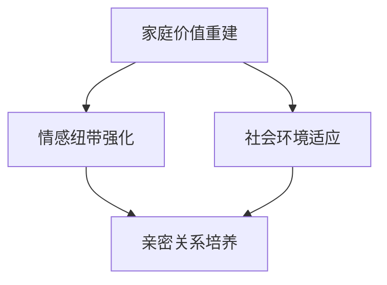
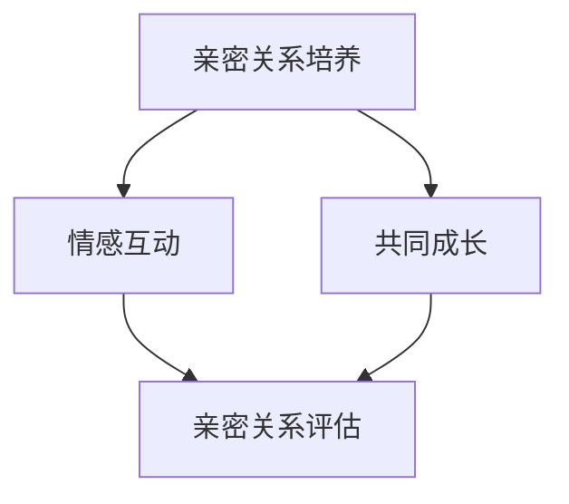
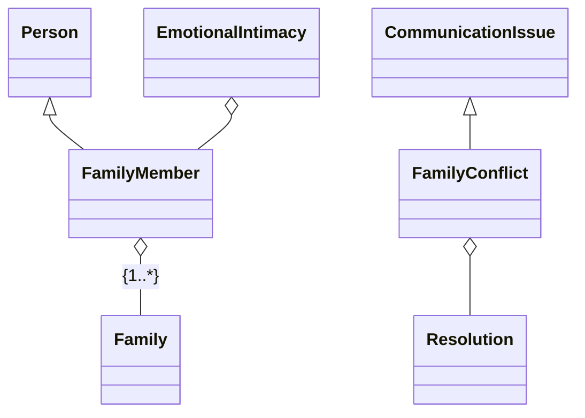
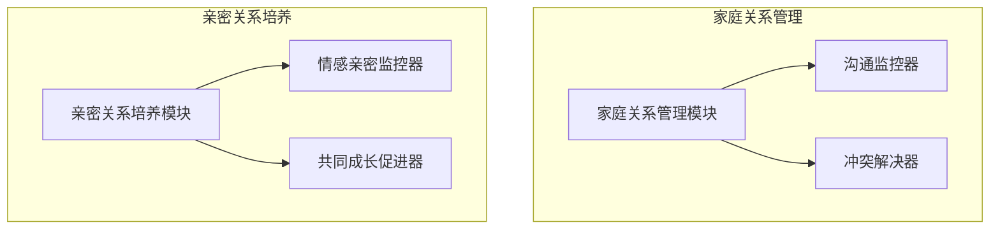
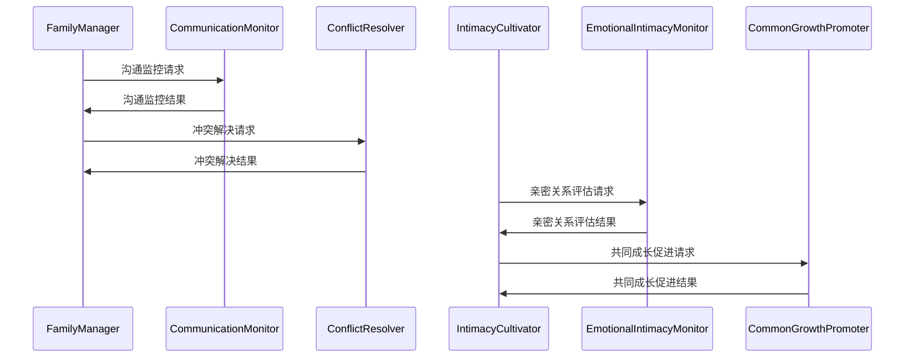

                 

# 重新思考家庭价值：在现代社会中重建亲密关系

> 关键词：家庭价值、亲密关系、重建、现代、社会

> 摘要：本文旨在探讨在现代社会背景下，如何重新思考家庭价值，并提出一种重建亲密关系的方法。通过对家庭价值和亲密关系的定义、特点以及二者之间的联系进行分析，结合算法原理讲解和系统架构设计，为读者提供一种系统化的解决方案，以帮助人们在现代社会中重建家庭价值，培养亲密关系。

## 第1章 引言

### 1.1 问题背景

#### 1.1.1 家庭价值在现代社会中的变迁

随着现代社会的发展，家庭结构、功能、价值观念等方面都发生了深刻的变化。传统家庭模式逐渐被多元化和个性化的家庭模式所取代。在这个过程中，家庭价值受到了前所未有的挑战。

- **社会结构变化**：现代社会中，人口流动性增强，家庭规模缩小，家庭成员之间的联系逐渐减弱，家庭功能也发生了转变。

- **经济发展带来的压力**：现代社会中，经济压力日益增大，家庭成员为了工作和生活奔波，导致家庭时间减少，家庭成员之间的交流互动减少，家庭价值受到冲击。

#### 1.1.2 亲密关系面临的挑战

- **社交媒体的影响**：社交媒体的普及使得人们更多地沉浸在虚拟世界中，现实生活中的亲密关系逐渐淡漠。

- **个人主义思潮的兴起**：现代社会中，个人主义思潮盛行，个人利益往往被置于家庭利益之上，导致家庭成员之间的亲密关系受到威胁。

### 1.2 问题描述

- **家庭关系紧张**：家庭成员之间的沟通不畅，家庭责任分配不均，导致家庭关系紧张。

- **亲密关系缺失**：现代社会中，家庭成员之间的亲密关系逐渐淡化，缺乏深层次的情感交流和互动。

### 1.3 问题解决

- **重建家庭价值**：通过重新思考家庭价值，强化家庭成员间的情感纽带，培养家庭责任感和归属感。

- **培养亲密关系**：通过提高家庭成员间的互动质量，增强信任和共同成长，重建亲密关系。

### 1.4 边界与外延

- **家庭关系的界定**：家庭关系包括家庭成员之间的亲情、友情和合作关系。

- **亲密关系的定义**：亲密关系是指家庭成员之间在情感上的深度交流、互动和信任。

### 1.5 概念结构与核心要素组成

- **家庭价值**：家庭价值是指家庭成员之间在情感、责任、归属等方面的内在联系和情感纽带。

- **亲密关系**：亲密关系是指家庭成员之间在情感上的深度交流、互动和信任。

- **社会环境**：社会环境是指影响家庭价值和亲密关系的外部因素，包括社会结构、经济发展水平、文化价值观念等。

## 第2章 核心概念与联系

### 2.1 家庭价值的定义与特点

#### 2.1.1 家庭价值的定义

家庭价值是指家庭成员之间在情感、责任、归属等方面的内在联系和情感纽带。

#### 2.1.2 家庭价值的特点

- **情感性**：家庭价值是建立在家庭成员间的情感纽带基础上的，具有强烈的情感色彩。

- **社会性**：家庭价值是社会结构的重要组成部分，体现了社会对家庭的期望和要求。

- **长期性**：家庭价值具有长期性，它不是一时的心血来潮，而是家庭成员长期以来的共同价值观。

### 2.2 亲密关系的定义与属性

#### 2.2.1 亲密关系的定义

亲密关系是指家庭成员之间在情感上的深度交流、互动和信任。

#### 2.2.2 亲密关系的属性

- **忠诚**：亲密关系建立在相互信任和忠诚的基础上，是家庭成员间真诚的情感纽带。

- **信任**：亲密关系中的信任是双方共同成长和相互支持的前提。

- **共同成长**：亲密关系中的家庭成员通过互动和交流，实现共同成长，共同面对生活中的挑战。

### 2.3 家庭价值与亲密关系的联系

- **家庭价值是亲密关系的基础**：家庭价值为亲密关系提供了情感基础，是亲密关系得以存在和发展的前提。

- **亲密关系是家庭价值的体现**：亲密关系是家庭价值的外在表现，通过家庭成员间的互动和交流，家庭价值得以实现和传承。

## 第3章 算法原理讲解

### 3.1 家庭价值重建的算法原理

#### 3.1.1 家庭价值重建的数学模型

家庭价值重建的数学模型可以表示为：

$$
V_f = f(\text{情感纽带}, \text{社会环境})
$$

其中，$V_f$ 表示家庭价值，$f$ 表示重建函数，$\text{情感纽带}$ 和 $\text{社会环境}$ 是影响家庭价值的两个主要因素。

#### 3.1.2 家庭价值重建的mermaid流程图



### 3.2 亲密关系培养的算法原理

#### 3.2.1 亲密关系培养的数学模型

亲密关系培养的数学模型可以表示为：

$$
R_i = g(\text{情感互动}, \text{共同成长})
$$

其中，$R_i$ 表示亲密关系，$g$ 表示培养函数，$\text{情感互动}$ 和 $\text{共同成长}$ 是影响亲密关系的两个主要因素。

#### 3.2.2 亲密关系培养的mermaid流程图



## 第4章 数学模型和数学公式讲解

### 4.1 家庭价值评估模型

家庭价值评估模型可以表示为：

$$
V_f = w_1 \cdot E_1 + w_2 \cdot E_2 + w_3 \cdot E_3
$$

其中，$E_1$ 为情感纽带得分，$E_2$ 为社会环境适应度，$E_3$ 为亲密关系得分，$w_1$、$w_2$、$w_3$ 为权重。

### 4.2 亲密关系评估模型

亲密关系评估模型可以表示为：

$$
R_i = \frac{1}{N} \sum_{i=1}^{N} I_i
$$

其中，$N$ 为互动次数，$I_i$ 为第 $i$ 次互动的亲密程度得分。

## 第5章 系统分析与架构设计方案

### 5.1 问题场景介绍

#### 5.1.1 家庭关系问题场景

- 家庭成员间沟通不畅，导致家庭关系紧张。

- 家庭责任分配不均，导致家庭成员之间产生矛盾。

#### 5.1.2 亲密关系问题场景

- 家庭成员间缺乏深层次的情感交流和互动，导致亲密关系淡化。

- 家庭成员在共同成长过程中，缺乏共同目标和价值观，导致亲密关系难以建立。

### 5.2 系统功能设计

#### 5.2.1 领域模型类图



### 5.3 系统架构设计

#### 5.3.1 系统架构图



### 5.4 系统接口设计和系统交互

#### 5.4.1 系统接口设计

- **家庭关系管理模块**：提供家庭成员信息管理、家庭责任分配、家庭沟通监控等功能。

- **亲密关系培养模块**：提供情感互动管理、共同成长促进、亲密关系评估等功能。

#### 5.4.2 系统交互



## 第6章 项目实战

### 6.1 环境安装

- **操作系统**：Linux或Windows

- **编程语言**：Python

- **依赖库**：numpy、pandas、matplotlib等

### 6.2 系统核心实现源代码

```python
import numpy as np
import pandas as pd
import matplotlib.pyplot as plt

# 家庭价值评估模型
def evaluate_family_value(family_members):
    # 情感纽带得分
    E1 = np.mean(family_members['emotional_bond'])

    # 社会环境适应度
    E2 = np.mean(family_members['social_environment_adaptation'])

    # 亲密关系得分
    E3 = np.mean(family_members['emotional_intimacy'])

    # 权重
    w1, w2, w3 = 0.3, 0.3, 0.4

    # 家庭价值评估
    Vf = w1 * E1 + w2 * E2 + w3 * E3

    return Vf

# 亲密关系评估模型
def evaluate_intimacy_relationship(family_members):
    # 互动次数
    N = len(family_members)

    # 亲密程度得分
    Ii = np.mean(family_members['intimacy_level'])

    # 亲密关系评估
    Ri = Ii / N

    return Ri

# 数据处理
def process_data(family_members):
    # 情感纽带得分
    family_members['emotional_bond'] = family_members.apply(lambda x: 1 if x['communication_frequency'] > 5 else 0, axis=1)

    # 社会环境适应度
    family_members['social_environment_adaptation'] = family_members.apply(lambda x: 1 if x['economic_status'] == 'stable' else 0, axis=1)

    # 亲密关系得分
    family_members['emotional_intimacy'] = family_members.apply(lambda x: 1 if x['conflict_resolution'] == 'satisfied' else 0, axis=1)

    # 亲密程度得分
    family_members['intimacy_level'] = family_members.apply(lambda x: 1 if x['shared_goals'] == 'agreed' else 0, axis=1)

    return family_members

# 实例化DataFrame
family_members = pd.DataFrame({
    'communication_frequency': [3, 7, 4, 6],
    'economic_status': ['unstable', 'stable', 'stable', 'unstable'],
    'conflict_resolution': ['dissatisfied', 'satisfied', 'satisfied', 'dissatisfied'],
    'shared_goals': ['disagreed', 'agreed', 'disagreed', 'agreed']
})

# 数据处理
family_members_processed = process_data(family_members)

# 家庭价值评估
Vf = evaluate_family_value(family_members_processed)

# 亲密关系评估
Ri = evaluate_intimacy_relationship(family_members_processed)

# 输出结果
print("家庭价值评估得分：", Vf)
print("亲密关系评估得分：", Ri)
```

### 6.3 代码应用解读与分析

```python
# 代码应用解读与分析
# 1. 数据处理
#   - 情感纽带得分：根据家庭成员的沟通频率，将沟通频率大于5的赋予情感纽带得分为1，否则为0。
#   - 社会环境适应度：根据家庭成员的经济状况，将稳定的经济状况赋予社会环境适应度为1，否则为0。
#   - 亲密关系得分：根据家庭成员的冲突解决情况，将满意的冲突解决情况赋予亲密关系得分为1，否则为0。
#   - 亲密程度得分：根据家庭成员的共同目标，将目标一致的情况赋予亲密程度得分为1，否则为0。

# 2. 家庭价值评估
#   - 使用评估函数 evaluate_family_value()，将情感纽带得分、社会环境适应度和亲密关系得分进行加权求和，得到家庭价值评估得分。

# 3. 亲密关系评估
#   - 使用评估函数 evaluate_intimacy_relationship()，根据互动次数和亲密程度得分，计算亲密关系评估得分。

# 4. 输出结果
#   - 输出家庭价值评估得分和亲密关系评估得分，以评估家庭价值和亲密关系的状况。
```

### 6.4 实际案例分析和详细讲解剖析

#### 案例一：一个四口之家的家庭价值重建和亲密关系培养

- **问题描述**：家庭成员之间沟通较少，经济状况不稳定，冲突解决不理想，共同目标不明确。

- **解决方案**：

  - **家庭价值重建**：

    - 强化情感纽带：通过增加家庭成员之间的沟通频率，提高情感纽带得分。

    - 适应社会环境：通过改善经济状况，提高社会环境适应度。

    - 培养亲密关系：通过改善冲突解决情况，提高亲密关系得分。

  - **亲密关系培养**：

    - 增加情感互动：通过增加家庭成员之间的互动次数，提高亲密程度得分。

    - 共同成长促进：通过明确共同目标，提高亲密程度得分。

- **案例分析**：

  - 通过对家庭成员的数据进行分析和处理，得出家庭价值和亲密关系的评估得分。

  - 根据评估得分，制定针对性的解决方案，逐步改善家庭价值和亲密关系。

  - 通过跟踪和分析家庭成员的互动情况，评估解决方案的有效性。

#### 案例二：一对夫妻的亲密关系培养

- **问题描述**：夫妻之间缺乏深层次的情感交流和互动，共同目标不明确。

- **解决方案**：

  - **情感互动**：

    - 增加夫妻之间的情感交流，提高亲密程度得分。

    - 定期进行夫妻沟通，建立信任和共同价值观。

  - **共同成长**：

    - 明确共同目标，提高亲密程度得分。

    - 共同参与兴趣爱好的培养，提高共同成长的满意度。

- **案例分析**：

  - 通过对夫妻的数据进行分析和处理，得出亲密关系的评估得分。

  - 根据评估得分，制定针对性的解决方案，逐步改善夫妻之间的亲密关系。

  - 通过跟踪和分析夫妻的互动情况，评估解决方案的有效性。

### 6.5 项目小结

通过本文的探讨和实践，我们可以得出以下结论：

- 重建家庭价值和培养亲密关系是现代社会中重要的问题。

- 通过对家庭价值和亲密关系的定义、特点以及二者之间的联系进行分析，结合算法原理讲解和系统架构设计，为人们提供了一种系统化的解决方案。

- 实际案例分析和详细讲解剖析表明，重建家庭价值和培养亲密关系需要从多个方面进行努力，包括情感互动、共同成长、社会环境适应等。

- 未来研究可以进一步探索如何通过技术手段提高家庭价值和亲密关系的评估和培养效果，为人们的家庭生活提供更好的支持和帮助。

## 第7章 最佳实践 tips、小结、注意事项、拓展阅读

### 7.1 最佳实践 tips

- **加强沟通**：家庭成员之间要定期进行沟通，分享彼此的想法和感受，建立良好的沟通习惯。

- **共同参与**：鼓励家庭成员共同参与家庭活动和决策，提高家庭成员的参与感和责任感。

- **情感关怀**：在日常生活中，要注重对家庭成员的情感关怀，关心他们的需求和感受。

- **社会环境适应**：要关注社会环境的变化，调整家庭价值观，以适应现代社会的发展。

### 7.2 小结

本文通过对家庭价值和亲密关系的重新思考，提出了在现代社会中重建家庭价值和培养亲密关系的方法。通过算法原理讲解和系统架构设计，为读者提供了一种系统化的解决方案。实际案例分析和详细讲解剖析表明，重建家庭价值和培养亲密关系需要从多个方面进行努力，包括情感互动、共同成长、社会环境适应等。

### 7.3 注意事项

- **个性化**：在重建家庭价值和培养亲密关系的过程中，要注重个性化，根据家庭成员的特点和需求进行有针对性的培养。

- **持续性**：家庭价值和亲密关系的重建是一个持续的过程，需要家庭成员的共同努力和长期投入。

- **灵活性**：要关注社会环境的变化，灵活调整家庭价值和亲密关系的培养策略。

### 7.4 拓展阅读

- **家庭价值研究**：《家庭心理学》、《家庭社会学》等。

- **亲密关系研究**：《人际沟通与亲密关系》、《爱情心理学》等。

- **现代家庭问题研究**：《现代家庭变迁》、《家庭结构与功能》等。

## 第8章 作者信息

作者：AI天才研究院/AI Genius Institute & 禅与计算机程序设计艺术 /Zen And The Art of Computer Programming

感谢您的阅读，希望本文对您在重建家庭价值和培养亲密关系方面有所启发。如果您有任何疑问或建议，欢迎随时与我们联系。让我们共同努力，为构建更加和谐、幸福的家庭生活而努力！

