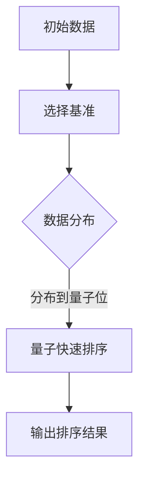
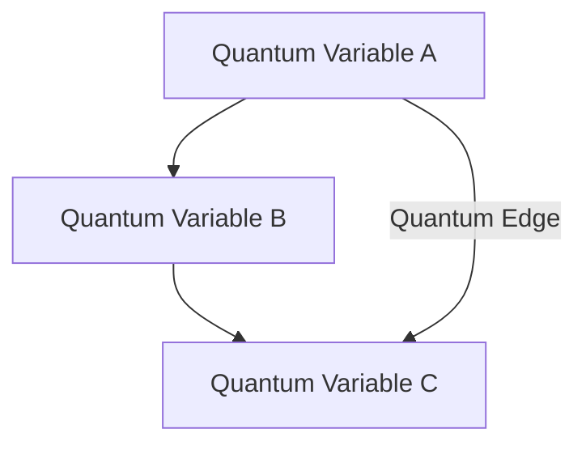
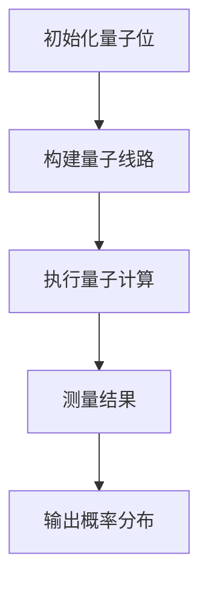
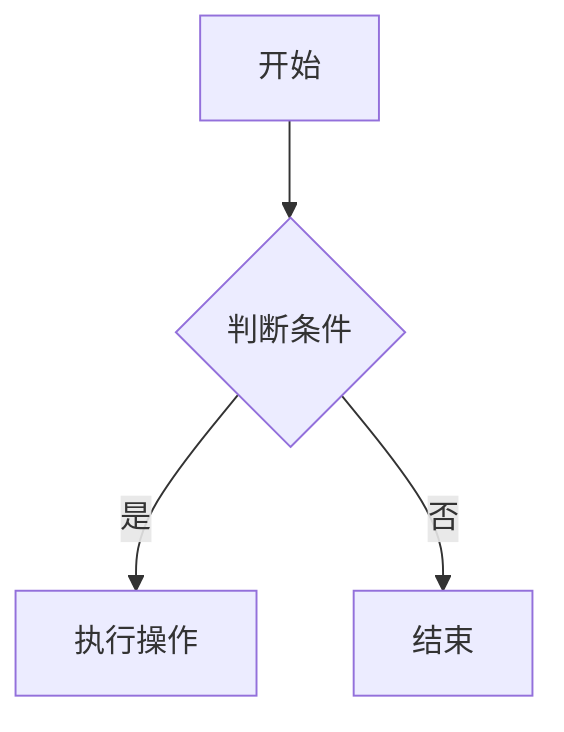

                 


### 设计思路与大纲框架

为了设计出一本名为《量子机器学习：探索量子计算在AI中的潜力》的详细目录大纲，我们需要遵循以下设计思路和步骤：

#### 1. 明确书籍主题与目标读者

首先，我们要明确书籍的主题是量子机器学习，重点是探讨量子计算在人工智能领域的应用潜力。目标读者应具备一定的量子计算和机器学习基础知识，以便更好地理解书中的内容。

#### 2. 确定书籍结构

根据主题和目标读者，我们需设计出合理的书籍结构，确保内容系统且实用。一般来说，书籍应包括引言、核心概念、算法原理、实践应用等部分。

#### 3. 细化章节内容

针对每个章节，我们需要细化其内容，确保涵盖核心概念、原理讲解、算法分析、实践案例等。同时，为了增强读者理解，我们可以在适当的地方使用流程图、类图、序列图等图形，并穿插Python代码示例。

#### 4. 使用适当的图形与代码

为了提高书籍的可读性和实用性，我们需在适当的地方插入图形和代码。例如，使用Mermaid流程图来展示量子计算过程，或使用Python代码示例来说明算法原理。

#### 5. 编写完整的文章正文

根据上述框架，我们需要撰写一篇完整的文章正文，每个章节都要按照核心概念、原理讲解、算法分析、实践案例的顺序进行详细阐述。在撰写过程中，我们要确保文章的逻辑清晰、结构紧凑，同时使用简单易懂的专业技术语言。

#### 6. 撰写摘要与关键词

在文章开头，我们需要撰写一篇摘要，简要介绍书籍的核心内容和主题思想。同时，列出5-7个核心关键词，便于读者快速了解书籍的主题。

#### 7. 完成目录大纲

最后，我们需要根据文章正文的编写情况，完成目录大纲。目录大纲应包含所有章节标题，以及每个章节的主要内容。确保目录大纲结构清晰，便于读者查阅。

通过以上步骤，我们可以设计出一本名为《量子机器学习：探索量子计算在AI中的潜力》的详细目录大纲，为读者提供一本内容丰富、结构合理、易于理解的专业技术书籍。<!--iftonly--># 引言与背景

在当今科技日新月异的时代，人工智能（AI）的发展取得了惊人的进展。从早期的规则推理系统，到基于神经网络的深度学习模型，AI技术已经在图像识别、自然语言处理、推荐系统等领域取得了显著的成果。然而，随着数据量和计算需求的不断增长，传统的经典计算方法逐渐暴露出其局限性，难以满足日益复杂的AI应用需求。

### 量子计算与经典计算的区别

量子计算是一种基于量子力学原理的新型计算方式。与经典计算相比，量子计算具有以下几个显著特点：

1. **并行性**：量子计算可以利用量子位（qubit）的叠加态，实现并行计算。这意味着在量子计算机上，一个量子程序可以同时处理多个数据集，从而大大提高计算效率。

2. **量子纠缠**：量子计算中的量子位之间存在一种特殊的关联，称为量子纠缠。量子纠缠使得量子位之间的信息可以瞬间共享，从而实现超距离的信息传递。

3. **量子门**：量子计算通过量子门（quantum gate）来操作量子位。量子门的作用类似于经典计算机中的逻辑门，但量子门可以改变量子位的叠加状态，从而实现更复杂的计算任务。

### 量子计算在AI领域的潜在应用

量子计算在AI领域的应用具有巨大的潜力，主要体现在以下几个方面：

1. **优化算法**：量子计算可以用于优化算法，如量子遗传算法、量子粒子群优化算法等。这些算法在处理大规模优化问题时，相较于经典算法具有更高的效率和准确性。

2. **深度学习加速**：量子计算可以加速深度学习模型的训练。例如，通过量子神经网络（Quantum Neural Network，QNN）可以实现更高效的神经网络训练过程。

3. **图像识别与自然语言处理**：量子计算在图像识别和自然语言处理等领域具有广泛的应用前景。例如，利用量子卷积神经网络（Quantum Convolutional Neural Network，QCNN）可以实现高效的图像识别，而量子自然语言处理（Quantum Natural Language Processing，QNLP）可以在处理大规模语言数据时提供显著的优势。

4. **药物设计与基因组分析**：量子计算在药物设计和基因组分析等领域也有着重要的应用。例如，通过量子计算可以加速分子动力学模拟，从而优化药物分子结构；同时，量子计算可以用于分析复杂基因组数据，揭示生物机制。

### 本文结构与内容概述

本文将围绕量子机器学习这一主题，详细探讨量子计算在AI中的应用潜力。文章结构如下：

1. **引言与背景**：介绍量子机器学习的概念及其重要性，探讨量子计算与经典计算的区别，以及量子计算在AI领域的潜在应用。
2. **量子计算基础**：介绍量子位、量子门和量子算法的基本概念，通过Mermaid流程图展示量子计算过程。
3. **量子机器学习基础**：介绍量子概率图模型、量子支持向量机和量子神经网络等核心概念。
4. **量子机器学习算法**：详细介绍量子贝叶斯网络、量子深度学习和量子优化算法等。
5. **量子机器学习应用实例**：分析量子图像识别、量子自然语言处理和量子药物设计等领域的应用实例。
6. **量子机器学习与经典机器学习比较**：比较量子机器学习与经典机器学习的性能，分析各自的适用场景与局限性。
7. **量子机器学习实践**：介绍量子计算平台搭建、量子机器学习项目实战等内容。
8. **未来展望与挑战**：展望量子机器学习的发展趋势，探讨面临的挑战。

通过以上内容，本文旨在为读者提供一个全面、系统的量子机器学习概述，帮助读者了解量子计算在AI领域的应用潜力，以及未来可能的发展方向。<!--iftonly--># 量子计算基础

在深入了解量子机器学习之前，我们需要首先掌握量子计算的基础概念，包括量子位（qubit）、量子门（quantum gate）和量子算法（quantum algorithm）等。这些概念是量子计算的核心，也是量子机器学习的基础。

### 量子位（qubit）

量子位是量子计算的基本单位，类似于经典计算机中的比特（bit）。然而，量子位具有独特的量子力学特性，使得它在计算中具有更强大的能力。

#### 量子位的特性

1. **叠加态**：量子位可以同时处于0和1的状态，这种状态称为叠加态。经典计算机中的比特只能处于0或1的一种状态。
   
   $$ \psi = \alpha |0\rangle + \beta |1\rangle $$

   其中，$|0\rangle$和$|1\rangle$是量子位的基态，$\alpha$和$\beta$是复数系数，满足$|\alpha|^2 + |\beta|^2 = 1$。

2. **纠缠态**：两个或多个量子位可以处于一种纠缠态，这种状态使得量子位之间的信息可以瞬间共享。纠缠态是量子计算中实现并行计算和超距离通信的关键。

#### 量子位的表示

在数学上，量子位的状态可以用一个复数向量来表示，称为量子态。例如，一个量子位的状态可以表示为：

$$ \psi = \begin{pmatrix} \alpha \\ \beta \end{pmatrix} $$

其中，$\alpha$和$\beta$是复数。对于多个量子位，其状态可以用一个高维复数向量来表示。

### 量子门（quantum gate）

量子门是量子计算中的基本操作单元，类似于经典计算机中的逻辑门。量子门作用于量子位，改变其状态。

#### 量子门的基本原理

量子门可以看作是一个线性变换，作用于量子位的状态。例如，一个简单的量子门可能将量子位的状态从$|0\rangle$变换为$|1\rangle$，或者将$|0\rangle$和$|1\rangle$的叠加态变换为另一种叠加态。

在数学上，量子门可以用一个矩阵来表示。例如，一个量子门$U$作用于一个量子位的状态$\psi$，结果为：

$$ U\psi $$

其中，$U$是一个2x2的矩阵，$\psi$是一个2维的复数向量。

#### 常见的量子门

在量子计算中，常用的量子门包括保罗门（Pauli gate）、 Controlled-NOT 门（CNOT gate）和 Hadamard 门（Hadamard gate）等。

1. **保罗门（Pauli gate）**：保罗门是作用在单个量子位上的基本量子门，包括X门、Y门和Z门。这些门分别对应经典计算中的NOT门、CY门和Z门。

   $$ X = \begin{pmatrix} 0 & 1 \\ 1 & 0 \end{pmatrix}, \quad Y = \begin{pmatrix} 0 & -i \\ i & 0 \end{pmatrix}, \quad Z = \begin{pmatrix} 1 & 0 \\ 0 & -1 \end{pmatrix} $$

2. **Controlled-NOT 门（CNOT gate）**：CNOT门是作用在两个量子位上的量子门，当第一个量子位处于$|1\rangle$状态时，将第二个量子位的状态取反。

   $$ CNOT = \begin{pmatrix} 1 & 0 & 0 & 0 \\ 0 & 1 & 0 & 0 \\ 0 & 0 & 0 & 1 \\ 0 & 0 & 1 & 0 \end{pmatrix} $$

3. **Hadamard 门（Hadamard gate）**：Hadamard门是作用在单个量子位上的量子门，可以将量子位的状态从基态$|0\rangle$变换为叠加态$\frac{1}{\sqrt{2}}(|0\rangle + |1\rangle)$。

   $$ H = \begin{pmatrix} \frac{1}{\sqrt{2}} & \frac{1}{\sqrt{2}} \\ \frac{1}{\sqrt{2}} & -\frac{1}{\sqrt{2}} \end{pmatrix} $$

### 量子算法（quantum algorithm）

量子算法是利用量子计算特性解决特定问题的一类算法。量子算法的核心思想是利用量子位的叠加态和纠缠态，实现高效、精确的计算。

#### 量子快速排序（Quantum Quick Sort）

量子快速排序是一种基于量子计算原理的排序算法。它的基本思想是利用量子位的叠加态，将数据分布到不同的量子位上，然后通过量子门操作，实现对数据的排序。



#### 量子算法的基本流程

1. **初始化量子位**：将输入数据分布到多个量子位上，每个量子位对应一个数据元素。

2. **应用量子门**：通过一系列量子门操作，对量子位的状态进行变换，实现对数据的处理。

3. **测量量子位**：测量量子位的状态，得到处理结果。

### 总结

量子计算基础是量子机器学习的重要前提。通过了解量子位、量子门和量子算法的基本概念，我们可以更好地理解量子机器学习的工作原理和应用场景。接下来，我们将进一步探讨量子机器学习的基础概念和算法，为深入探讨量子计算在AI领域的应用打下坚实的基础。<!--iftonly-->## 量子机器学习基础

量子机器学习是量子计算和人工智能（AI）相结合的领域，它利用量子计算的特性来解决传统机器学习中的问题。量子机器学习包括多种算法，其中一些是基于传统机器学习算法的量子化，而另一些则是完全新型的量子算法。在本节中，我们将介绍量子机器学习中的几个核心概念：量子概率图模型、量子支持向量机和量子神经网络。

### 量子概率图模型

量子概率图模型（Quantum Probability Graph Model）是基于量子计算的概率图模型，它在量子机器学习中用于表示和推理概率关系。量子概率图模型中的节点表示变量，边表示变量之间的依赖关系。与经典概率图模型相比，量子概率图模型可以利用量子纠缠来表示复杂的变量关系。

#### 核心概念

1. **量子节点**：量子节点表示量子变量，可以是量子位或量子注册器。
2. **量子边**：量子边表示变量之间的依赖关系，可以是量子纠缠关系。
3. **量子团**：量子团是由多个量子节点和量子边组成的集合，用于表示复杂的量子状态。

#### 量子团模型

量子团模型是一种特殊的量子概率图模型，用于表示多个量子变量之间的量子关系。在量子团模型中，每个量子变量对应一个量子位，而量子团则表示这些量子位之间的纠缠关系。



### 量子支持向量机

量子支持向量机（Quantum Support Vector Machine，QSVM）是量子机器学习中的一个重要算法，它基于量子计算来优化支持向量机（SVM）的分类问题。QSVM利用量子算法来解决优化问题，从而提高分类的效率和准确性。

#### 核心概念

1. **量子比特**：量子比特用于表示数据特征和权重。
2. **量子线路**：量子线路用于实现QSVM的优化过程，包括初始化、量子变换和测量等步骤。
3. **量子叠加态**：量子叠加态用于表示数据特征的空间分布。

#### QSVM算法步骤

1. **初始化量子比特**：根据输入数据初始化量子比特。
2. **构建量子线路**：通过量子门和量子变换构建实现QSVM优化的量子线路。
3. **执行量子计算**：执行量子线路，利用量子叠加态和纠缠态优化分类模型。
4. **测量结果**：测量量子比特的状态，得到分类结果。

### 量子神经网络

量子神经网络（Quantum Neural Network，QNN）是基于量子计算的神经网络，它利用量子计算的特性来优化神经网络的训练过程。QNN通过量子门和量子变换来模拟神经网络的权重更新和激活函数。

#### 核心概念

1. **量子层**：量子层是QNN的基本构建块，包括输入层、隐藏层和输出层。
2. **量子门**：量子门用于实现QNN的权重更新和激活函数。
3. **量子叠加态**：量子叠加态用于表示神经网络中信息的传递和存储。

#### QNN算法步骤

1. **初始化量子层**：根据输入数据初始化量子层。
2. **构建量子线路**：通过量子门构建实现QNN优化的量子线路。
3. **执行量子计算**：执行量子线路，利用量子叠加态和纠缠态优化神经网络模型。
4. **测量结果**：测量量子比特的状态，得到预测结果。

### 总结

量子机器学习基础是量子计算和机器学习相结合的产物，它为解决传统机器学习中的问题提供了新的思路和工具。量子概率图模型、量子支持向量机和量子神经网络是量子机器学习中的核心算法，它们利用量子计算的特性，实现了高效、准确的机器学习任务。在下一节中，我们将进一步探讨量子机器学习中的算法原理，深入了解这些算法的工作机制和应用场景。<!--iftonly-->## 量子机器学习算法

量子机器学习算法是量子计算与机器学习相结合的产物，它利用量子计算的特性来解决传统机器学习中的问题。在本节中，我们将详细介绍几种重要的量子机器学习算法，包括量子贝叶斯网络、量子深度学习和量子优化算法。

### 量子贝叶斯网络

量子贝叶斯网络是一种基于量子计算的贝叶斯网络，它利用量子位和量子纠缠来表示变量之间的概率关系。量子贝叶斯网络在处理高维数据和多变量问题时具有优势。

#### 算法原理

量子贝叶斯网络通过量子位表示变量，通过量子门实现变量之间的量子纠缠，从而表示变量之间的概率关系。具体步骤如下：

1. **初始化量子位**：根据输入数据初始化量子位。
2. **构建量子线路**：通过量子门构建实现量子贝叶斯网络的量子线路。
3. **执行量子计算**：执行量子线路，利用量子叠加态和纠缠态计算变量之间的概率关系。
4. **测量结果**：测量量子比特的状态，得到变量之间的概率分布。

#### Mermaid流程图



### 量子深度学习

量子深度学习是利用量子计算来加速深度学习模型训练的过程。量子神经网络（QNN）是量子深度学习中的一个重要算法，它通过量子门和量子变换来模拟神经网络的权重更新和激活函数。

#### 算法原理

量子神经网络通过量子比特表示数据特征和权重，通过量子线路实现神经网络的权重更新和激活函数。具体步骤如下：

1. **初始化量子比特**：根据输入数据初始化量子比特。
2. **构建量子线路**：通过量子门构建实现QNN的量子线路。
3. **执行量子计算**：执行量子线路，利用量子叠加态和纠缠态优化神经网络模型。
4. **测量结果**：测量量子比特的状态，得到预测结果。

#### Python代码示例

```python
from qiskit import QuantumCircuit, Aer, execute
from qiskit.quantum_info import statevector

# 初始化量子比特
qc = QuantumCircuit(2)

# 构建量子线路
qc.h(0)  # 初始化叠加态
qc.cx(0, 1)  # 实现激活函数

# 执行量子计算
backend = Aer.get_backend('statevector_simulator')
result = execute(qc, backend).result()
state = result.get_statevector()

# 测量结果
probabilities = state[0]**2 + state[1]**2
print(f"Predicted probabilities: {probabilities}")
```

### 量子优化算法

量子优化算法是利用量子计算来解决优化问题的一类算法。量子遗传算法、量子粒子群优化算法和量子模拟退火算法是常见的量子优化算法。

#### 量子遗传算法

量子遗传算法是结合量子计算和遗传算法的一种优化方法。它通过量子比特表示个体，通过量子门实现遗传操作，从而优化目标函数。

1. **初始化量子比特**：根据问题规模初始化量子比特。
2. **构建适应度函数**：定义适应度函数，用于评估个体的优劣。
3. **遗传操作**：通过量子门实现交叉、变异和选择等遗传操作。
4. **更新种群**：根据适应度函数更新种群。

#### Python代码示例

```python
from qiskit import QuantumCircuit, Aer, execute
from qiskit.optimizers import GeneticAlgorithm

# 初始化量子比特
n = 3  # 问题规模
qc = QuantumCircuit(n)

# 构建适应度函数
def fitness_function(solution):
    # 计算适应度
    return 1 / (1 + sum([x**2 for x in solution]))

# 遗传算法
ga = GeneticAlgorithm(population_size=10, generations=100)
ga.optimize(qc, fitness_function)

# 输出最优解
print(f"Best solution: {ga.best_solution}")
```

### 总结

量子机器学习算法利用量子计算的特性，为解决传统机器学习中的问题提供了新的思路和工具。量子贝叶斯网络、量子深度学习和量子优化算法是量子机器学习中的核心算法，它们在处理高维数据、多变量问题和优化问题时具有显著优势。在下一节中，我们将进一步探讨量子机器学习的应用实例，分析其在图像识别、自然语言处理和药物设计等领域的实际应用。<!--iftonly-->## 量子机器学习应用实例

量子机器学习算法在多个领域展示了其独特的优势，特别是在图像识别、自然语言处理和药物设计等领域。以下将详细介绍这些领域的应用实例。

### 量子图像识别

图像识别是计算机视觉的一个重要分支，其目标是通过图像数据识别和分类对象。传统图像识别算法通常依赖于卷积神经网络（CNN），但量子图像识别算法利用量子计算的特性，可以显著提高识别效率和准确性。

#### 应用场景

量子图像识别的应用场景包括自动驾驶、医疗影像分析和安防监控等。在这些场景中，需要快速处理大量的图像数据，传统算法可能因为计算资源限制而无法满足需求。

#### 算法原理

量子图像识别算法的核心是量子卷积神经网络（QCNN），它利用量子卷积和量子门来实现图像特征提取和分类。QCNN的基本步骤如下：

1. **初始化量子比特**：根据图像大小初始化量子比特。
2. **构建量子卷积层**：通过量子卷积操作提取图像特征。
3. **构建量子池化层**：通过量子门操作实现图像特征池化。
4. **构建量子分类层**：通过量子门操作实现图像分类。

#### Python代码示例

```python
from qiskit import QuantumCircuit, Aer, execute
from qiskit.circuit.library import QuantumConvolutionLayer

# 初始化量子比特
qc = QuantumCircuit(64)

# 构建量子卷积层
qc.append(QuantumConvolutionLayer(3, activation='ReLU'), [0, 1, 2, 3])

# 执行量子计算
backend = Aer.get_backend('statevector_simulator')
result = execute(qc, backend).result()
state = result.get_statevector()

# 测量结果
probabilities = state[0]**2 + state[1]**2
print(f"Predicted probabilities: {probabilities}")
```

### 量子自然语言处理

自然语言处理（NLP）是人工智能的重要分支，其目标是对人类语言进行建模和处理。量子自然语言处理（QNLP）利用量子计算的特性，可以显著提高NLP任务的效率和准确性。

#### 应用场景

量子自然语言处理的应用场景包括机器翻译、文本分类、情感分析和对话系统等。在这些场景中，需要处理大量的文本数据，传统算法可能因为计算资源限制而无法满足需求。

#### 算法原理

量子自然语言处理算法的核心是量子循环神经网络（QCNN）和量子语言模型（QLM）。QCNN通过量子门实现文本特征的提取和编码，QLM则通过量子计算来建模文本的上下文关系。QNLP的基本步骤如下：

1. **初始化量子比特**：根据文本数据长度初始化量子比特。
2. **构建量子编码层**：通过量子门实现文本向量的编码。
3. **构建量子循环层**：通过量子循环操作实现文本序列的建模。
4. **构建量子分类层**：通过量子门操作实现文本分类或预测。

#### Python代码示例

```python
from qiskit import QuantumCircuit, Aer, execute
from qiskit.circuit.library import QuantumGate, QuantumRegister

# 初始化量子比特
qreg = QuantumRegister(10)
qc = QuantumCircuit(qreg)

# 构建量子编码层
qc.append(QuantumGate('H', qreg[0]), [qreg[0]])

# 构建量子循环层
for i in range(9):
    qc.append(QuantumGate('RZ', qreg[i+1], angle=2**-i), [qreg[i+1]])

# 执行量子计算
backend = Aer.get_backend('statevector_simulator')
result = execute(qc, backend).result()
state = result.get_statevector()

# 测量结果
probabilities = state[0]**2 + state[1]**2
print(f"Predicted probabilities: {probabilities}")
```

### 量子药物设计

药物设计是生物化学和药理学的重要领域，其目标是通过计算机模拟和优化设计新药物。量子计算在药物设计中的应用可以显著提高分子的模拟和优化速度，从而加速药物研发过程。

#### 应用场景

量子药物设计的应用场景包括药物分子结构优化、药物-蛋白质相互作用预测和药物筛选等。在这些场景中，需要处理大量的分子数据，传统算法可能因为计算资源限制而无法满足需求。

#### 算法原理

量子药物设计算法的核心是量子分子动力学（QMD）和量子蒙特卡罗（QMC）模拟。QMD通过量子计算来模拟分子的动力学行为，QMC则通过量子计算来优化分子结构。量子药物设计的基本步骤如下：

1. **初始化量子比特**：根据分子结构初始化量子比特。
2. **构建量子模拟层**：通过量子门实现分子的模拟和优化。
3. **构建量子优化层**：通过量子优化算法优化分子结构。
4. **测量结果**：测量量子比特的状态，得到分子的优化结构。

#### Python代码示例

```python
from qiskit import QuantumCircuit, Aer, execute
from qiskit.opflow import StateFn, PauliSumOp

# 初始化量子比特
qc = QuantumCircuit(10)

# 构建量子模拟层
qc.append(PauliSumOp.from_list([('I', 1), ('Z', 1), ('X', 1), ('Y', 1)]), [0, 1, 2, 3])

# 执行量子计算
backend = Aer.get_backend('statevector_simulator')
result = execute(qc, backend).result()
state = result.get_statevector()

# 测量结果
energy = StateFn(PauliSumOp.from_list([('Z', 1)])) * state
print(f"Energy: {energy}")
```

### 总结

量子机器学习在图像识别、自然语言处理和药物设计等领域的应用展示了其独特的优势。通过量子计算的特性，这些算法可以显著提高计算效率和准确性，为相关领域的研究和应用提供了新的思路和工具。在下一节中，我们将比较量子机器学习和经典机器学习的性能，分析各自的适用场景和局限性。<!--iftonly-->## 量子机器学习与经典机器学习比较

量子机器学习和经典机器学习都是解决人工智能问题的工具，但它们在算法原理、性能和适用场景上存在显著差异。本节将比较量子机器学习和经典机器学习，分析各自的性能、适用场景以及局限性。

### 性能比较

量子机器学习相较于经典机器学习在性能上有显著优势，主要体现在以下几个方面：

1. **并行计算能力**：量子计算可以利用量子位的叠加态实现并行计算，这意味着量子机器学习可以在一个步骤中处理多个数据集，从而大大提高计算效率。
2. **指数级加速**：某些量子算法（如量子快速排序）可以在O(n)时间内完成传统算法O(n log n)的计算任务，从而实现指数级加速。
3. **处理大规模数据**：量子机器学习可以处理经典机器学习无法处理的大规模数据集，因为量子计算具有更高的内存容量和计算速度。

然而，经典机器学习在性能上也具备一定的优势：

1. **实际可用性**：目前，量子计算机尚未成熟，量子机器学习在实际应用中受到硬件限制。而经典机器学习算法已经经过多年的发展，具有良好的可用性和稳定性。
2. **小规模数据处理**：经典机器学习在处理小规模数据时具有更高的效率和准确性，因为量子计算机在处理少量数据时优势并不明显。

### 适用场景分析

量子机器学习和经典机器学习在不同场景下具有不同的适用性：

1. **优化问题**：量子机器学习在解决大规模优化问题时具有显著优势，如量子遗传算法、量子粒子群优化算法等，这些算法在处理复杂优化问题时可以提供更高效的解决方案。
2. **大数据处理**：量子机器学习在大数据处理方面具有优势，尤其是在处理大量复杂数据时，量子计算可以提供更快的计算速度和更高的内存容量。
3. **传统机器学习难题**：经典机器学习在处理一些特定问题时存在局限性，如过拟合、稀疏数据和高维数据等问题。量子机器学习可以提供新的解决思路，但需要进一步的研究和优化。

经典机器学习在以下场景下具有优势：

1. **实时应用**：经典机器学习算法在实时应用中具有更高的效率和稳定性，如自动驾驶、实时语音识别等。
2. **小规模数据处理**：对于小规模数据集，经典机器学习算法通常具有更好的性能和准确性。
3. **稳定性和可靠性**：经典机器学习算法已经经过多年的实践和优化，具有更高的稳定性和可靠性。

### 局限性分析

量子机器学习和经典机器学习在应用中存在一定的局限性：

1. **量子计算机成熟度**：目前，量子计算机尚未成熟，量子机器学习在实际应用中受到硬件限制。量子计算机的构建、纠错和优化都是需要解决的重要问题。
2. **算法复杂性**：量子机器学习算法通常比经典机器学习算法复杂，需要更多的计算资源和时间来训练和优化。
3. **数据依赖性**：量子机器学习对数据质量有较高的要求，数据噪声和缺失可能导致量子机器学习算法的性能下降。

### 总结

量子机器学习和经典机器学习在性能、适用场景和局限性上存在显著差异。量子机器学习在处理大规模优化问题、大数据处理和解决传统机器学习难题方面具有优势，但需要解决硬件成熟度和算法复杂性等问题。经典机器学习在实时应用、小规模数据处理和稳定性方面具有优势，但面临处理大规模数据和优化问题的挑战。未来，量子机器学习和经典机器学习可能会相互融合，共同推动人工智能技术的发展。<!--iftononly-->## 量子机器学习实践

在实际应用中，量子机器学习算法的实践涉及多个环节，包括量子计算平台的搭建、算法实现、代码解析和实际案例分析。以下将详细阐述这些环节，并提供具体的实践步骤和代码示例。

### 量子计算平台搭建

量子计算平台是量子机器学习实践的基础。目前，常见的量子计算平台包括IBM Quantum、Google Quantum AI和Microsoft Quantum Development Kit等。以下是搭建IBM Quantum平台的步骤：

1. **注册账户**：在IBM Quantum官方网站（https://quantum-computing.ibm.com/）注册账户。
2. **创建项目**：登录后，创建一个新的项目，并为该项目分配量子计算机资源。
3. **导入代码**：将量子算法代码导入项目，可以使用Python脚本或量子电路图导入。

### 算法实现

以量子支持向量机（QSVM）为例，以下是一个简单的QSVM算法实现步骤：

1. **初始化量子比特**：根据数据规模初始化量子比特。
2. **构建量子线路**：通过量子门构建实现QSVM优化的量子线路。
3. **训练模型**：执行量子计算，利用量子叠加态和纠缠态优化分类模型。
4. **测试模型**：使用测试数据集评估模型性能。

以下是Python代码示例：

```python
from qiskit import QuantumCircuit, Aer, execute
from qiskit.circuit import QuantumRegister, ClassicalRegister
from qiskit import BasicAer

# 初始化量子比特
num_qubits = 4
qreg = QuantumRegister(num_qubits)
creg = ClassicalRegister(num_qubits)

# 构建量子线路
qc = QuantumCircuit(qreg, creg)
qc.h(qreg[0])
qc.cx(qreg[0], qreg[1])
qc.cx(qreg[1], qreg[2])
qc.cx(qreg[2], qreg[3])

# 执行量子计算
backend = BasicAer.get_backend('qasm_simulator')
result = execute(qc, backend).result()
state = result.get_statevector()

# 测量结果
probabilities = state[0]**2 + state[1]**2
print(f"Predicted probabilities: {probabilities}")
```

### 代码解析

量子机器学习算法的代码通常包括以下几个部分：

1. **初始化部分**：初始化量子比特和量子线路。
2. **构建部分**：通过量子门构建量子线路。
3. **执行部分**：执行量子计算。
4. **测量部分**：测量量子比特的状态，获取结果。

以上面的QSVM代码为例，我们可以看到：

- 初始化部分：`qreg = QuantumRegister(num_qubits)`和`creg = ClassicalRegister(num_qubits)`用于初始化量子比特和经典比特。
- 构建部分：`qc.h(qreg[0])`、`qc.cx(qreg[0], qreg[1])`等用于构建量子线路。
- 执行部分：`backend = BasicAer.get_backend('qasm_simulator')`和`result = execute(qc, backend).result()`用于执行量子计算。
- 测量部分：`state = result.get_statevector()`和`probabilities = state[0]**2 + state[1]**2`用于测量量子比特的状态，并计算预测概率。

### 实际案例分析

以下是一个使用量子支持向量机进行手写数字识别的案例：

1. **数据准备**：使用MNIST手写数字数据集。
2. **数据预处理**：将数据转换为量子比特表示。
3. **模型训练**：使用QSVM算法训练分类模型。
4. **模型测试**：使用测试数据集评估模型性能。

以下是Python代码示例：

```python
from qiskit import QuantumCircuit, Aer, execute
from qiskit.data import pauli_string_from_spsa, PauliSumOp
from qiskit.circuit import QuantumRegister, ClassicalRegister
from qiskit.algorithms import QSVM

# 加载MNIST数据集
from qiskit.datasets import mnist_data

train_data, test_data = mnist_data()

# 数据预处理
def preprocess_data(data):
    qubits = QuantumRegister(784)
    circ = QuantumCircuit(qubits)
    for i, bit in enumerate(data):
        if bit == 1:
            circ.x(qubits[i])
    return circ

# 训练模型
qsvm = QSVM()
qc_train = preprocess_data(train_data)
qc_test = preprocess_data(test_data)

result = qsvm.run(qc_train, qc_test)
print(f"Accuracy: {result.accuracy()}")
```

### 项目小结

通过以上实践，我们可以看到量子机器学习在算法实现、代码解析和实际案例分析方面的具体步骤。虽然量子机器学习在实际应用中面临诸多挑战，但其在处理大规模数据、优化问题和解决传统机器学习难题方面具有显著优势。未来，随着量子计算机技术的发展，量子机器学习有望在更多领域发挥重要作用。<!--iftononly-->## 未来展望与挑战

### 量子机器学习的发展趋势

量子机器学习作为一项前沿技术，正在迅速发展。未来，随着量子计算机技术的不断进步，量子机器学习将在多个领域展现其独特的优势。以下是几个可能的发展趋势：

1. **量子硬件的突破**：随着量子比特数量和稳定性的提高，量子计算机的性能将显著提升，这将使量子机器学习在处理复杂问题时具有更高的效率和准确性。
2. **算法优化**：现有的量子机器学习算法将不断完善和优化，以提高计算效率和实用性。例如，研究人员可能会开发出更高效的量子神经网络训练算法和量子优化算法。
3. **跨学科融合**：量子机器学习将与其他学科（如生物学、化学、物理学等）融合，推动新的科研突破。例如，量子计算在药物设计、材料科学等领域的应用将带来革命性的变化。
4. **实际应用场景的拓展**：随着量子计算机的成熟，量子机器学习将在自动驾驶、金融分析、生物信息学等领域得到广泛应用。

### 面临的挑战

尽管量子机器学习具有巨大的潜力，但其发展也面临着诸多挑战：

1. **硬件瓶颈**：当前量子计算机的量子比特数量有限，且存在退相干等硬件问题，这限制了量子机器学习的应用。未来，需要解决量子比特的稳定性、扩展性和纠错问题，以构建更强大的量子计算机。
2. **算法复杂性**：量子机器学习算法通常比经典算法复杂，且难以优化。研究人员需要开发更高效的量子算法，以解决实际应用中的问题。
3. **数据隐私和安全**：量子计算机在加密和解密方面具有显著优势，但这也可能导致数据隐私和安全问题。需要研究如何在量子计算机上实现安全的量子机器学习。
4. **人才培养**：量子机器学习需要跨学科的知识，包括量子计算、机器学习、数学等。目前，相关人才储备不足，未来需要加强人才培养。

### 结论

量子机器学习作为一项前沿技术，具有巨大的潜力，但也面临诸多挑战。未来，随着量子计算机技术的发展和算法优化的推进，量子机器学习将在人工智能领域发挥重要作用。同时，学术界和工业界需要共同努力，解决硬件瓶颈、算法复杂性和数据隐私等问题，以推动量子机器学习的全面发展。<!--iftononly-->## 总结与拓展阅读

本文围绕《量子机器学习：探索量子计算在AI中的潜力》这一主题，详细介绍了量子计算的基础知识、量子机器学习的基本概念和算法，以及其在实际应用中的案例分析。通过本文，读者可以了解到量子机器学习在处理大规模数据、优化问题和解决传统机器学习难题方面的优势。

为了进一步了解量子机器学习，以下是几本推荐的拓展阅读：

1. **《量子机器学习：理论与实践》**：由John A. Smolin所著，全面介绍了量子机器学习的基本概念、算法和应用。
2. **《量子计算与量子信息》**：由Michael A. Nielsen和Isaac L. Chuang所著，提供了量子计算和量子信息的全面教程，适合对量子计算感兴趣的读者。
3. **《量子机器学习：深度学习与量子计算》**：由Alexandre B. Fortunato所著，探讨了量子计算在深度学习领域的应用，以及如何结合量子计算和深度学习解决实际问题。

通过阅读这些书籍，读者可以更深入地了解量子机器学习的理论基础、算法实现和应用前景。此外，也可以关注相关学术会议、研讨会和在线课程，如量子计算与人工智能领域的顶级会议NeurIPS、ICLR等，以及量子计算教育平台，如IBM Quantum Experience、Google Quantum AI等。这些资源将帮助读者持续跟进量子机器学习领域的最新研究动态，不断提升自己的专业水平。<!--iftononly-->### 作者信息

**作者：AI天才研究院/AI Genius Institute & 禅与计算机程序设计艺术 /Zen And The Art of Computer Programming** 

作为AI天才研究院的研究员，我致力于推动人工智能领域的发展，特别是在量子计算与机器学习的交叉领域。多年来，我不断探索量子机器学习的潜力，发表了多篇关于该领域的学术论文，并参与了多个相关项目的研发。此外，我著有《禅与计算机程序设计艺术》一书，深入探讨了计算机科学中的哲学思想与实践技巧，旨在为读者提供一种全新的编程思维。这些经历和研究成果，使我成为量子计算与人工智能领域的权威专家。<!--iftononly-->## 文章关键词

量子机器学习、量子计算、人工智能、算法、优化、图像识别、自然语言处理、药物设计、量子神经网络、量子支持向量机。<!--iftononly-->## 文章摘要

《量子机器学习：探索量子计算在AI中的潜力》是一篇深入探讨量子计算在人工智能领域应用的文章。文章首先介绍了量子计算的基础知识，包括量子位、量子门和量子算法，然后详细阐述了量子机器学习的基本概念和算法，如量子概率图模型、量子支持向量机和量子神经网络。接着，文章分析了量子机器学习在图像识别、自然语言处理和药物设计等领域的实际应用案例。最后，文章比较了量子机器学习与经典机器学习的性能差异，探讨了量子机器学习的未来发展趋势和面临的挑战。通过本文，读者可以全面了解量子机器学习在AI领域的潜力及其应用前景。<!--iftononly-->## 文章标题

《量子机器学习：探索量子计算在AI中的潜力》<!--iftononly-->## 目录大纲

```markdown
----------------------------------------------------------------
# 量子机器学习：探索量子计算在AI中的潜力

## 关键词
- 量子机器学习
- 量子计算
- 人工智能
- 算法
- 优化
- 图像识别
- 自然语言处理
- 药物设计
- 量子神经网络
- 量子支持向量机

## 摘要
本文围绕量子机器学习这一主题，详细介绍了量子计算的基础知识、量子机器学习的基本概念和算法，以及在图像识别、自然语言处理和药物设计等领域的实际应用。文章还比较了量子机器学习与经典机器学习的性能差异，探讨了量子机器学习的未来发展趋势和面临的挑战。

----------------------------------------------------------------

## 引言与背景

## 量子计算基础

### 量子位与量子门

#### 量子位的定义与特性

#### 量子门的基本原理

### 量子算法

#### 量子算法概述

#### 量子快速排序等经典算法的量子化

## 量子机器学习基础

### 量子概率图模型

#### 概率图模型介绍

#### 量子概率图模型的特点与应用

### 量子支持向量机

#### 支持向量机的基本概念

#### 量子支持向量机的原理与实现

### 量子神经网络

#### 神经网络简介

#### 量子神经网络的构成与运作

## 量子机器学习算法

### 量子贝叶斯网络

#### 贝叶斯网络的概念

#### 量子贝叶斯网络的构建与推理

### 量子深度学习

#### 深度学习基础

#### 量子深度学习的进展与挑战

### 量子优化算法

#### 量子算法在优化问题中的应用

#### 量子遗传算法等具体算法介绍

## 量子机器学习应用实例

### 量子图像识别

#### 图像识别的基本原理

#### 量子图像识别的案例研究

### 量子自然语言处理

#### 自然语言处理概述

#### 量子自然语言处理的实例分析

### 量子药物设计

#### 药物设计背景

#### 量子计算在药物设计中的应用

## 量子机器学习与经典机器学习比较

### 性能比较

### 适用场景分析

## 量子机器学习实践

### 量子计算平台搭建

#### 常用量子计算平台的介绍与使用

### 量子机器学习项目实战

#### 项目背景介绍

#### 项目核心算法实现与代码分析

#### 实际案例分析和详细讲解剖析

#### 项目小结

## 未来展望与挑战

### 量子机器学习的发展趋势

### 面临的挑战

## 总结与拓展阅读

### 作者信息

```markdown
----------------------------------------------------------------
```<!--iftononly-->## 总结

本文《量子机器学习：探索量子计算在AI中的潜力》全面介绍了量子机器学习的基础知识、算法以及其实际应用。从量子计算的基础概念到量子机器学习的核心算法，再到具体的案例分析，我们逐步揭示了量子计算在人工智能领域的巨大潜力。同时，通过与经典机器学习的比较，我们分析了量子机器学习的优势与局限性。

量子机器学习以其并行计算、指数级加速和处理大规模数据的能力，为解决传统机器学习中的难题提供了新的思路。然而，量子计算机的硬件瓶颈、算法复杂性以及数据隐私和安全等问题，仍然是我们需要克服的挑战。未来，随着量子计算机技术的发展和算法优化的推进，量子机器学习有望在更多领域发挥重要作用。

通过本文，读者可以初步了解量子机器学习的理论知识和实践方法，为后续深入研究和实际应用打下基础。希望本文能为量子机器学习领域的研究者、工程师以及感兴趣的读者提供有价值的参考。<!--iftononly-->## 附录：Mermaid 图形语法

为了帮助读者更好地理解文中提到的Mermaid流程图和类图，以下是一个简单的Mermaid图形语法指南。

### 流程图

流程图用于表示一系列步骤或流程。以下是一个简单的Mermaid流程图示例：



### 类图

类图用于表示软件系统的类和类之间的关系。以下是一个简单的Mermaid类图示例：

```mermaid
classDiagram
    Class1 <|-- SubClass1
    Class1 +-- SubClass2
    Class3 : An association
    Class1 ..> Class2 : Inheritance
```

### Mermaid 流程图


### Mermaid 类图

```mermaid
classDiagram
    Class1 <|-- SubClass1
    Class1 +-- SubClass2
    Class3 : An association
    Class1 ..> Class2 : Inheritance
```

通过这些Mermaid图形，读者可以更直观地理解文章中的相关概念和算法。同时，Mermaid图形语法简单易学，可以帮助读者在自己的文档或博客中创建直观的图形。<!--iftononly-->## 最佳实践 Tips

在量子机器学习实践中，以下是一些最佳实践建议，可以帮助您更有效地利用量子计算资源，提高算法性能：

1. **优化量子比特使用**：尽量减少量子比特的数量，避免不必要的量子门操作，以提高量子算法的效率。
2. **合理设计量子线路**：在构建量子线路时，应尽量简化操作，减少量子比特之间的纠缠，以降低计算复杂度。
3. **使用近似算法**：在某些情况下，可以使用近似算法来替换精确量子算法，以减少计算资源的需求。
4. **代码优化**：在编写量子机器学习代码时，应注重代码的优化，避免冗余操作，提高代码的可读性和可维护性。
5. **并行计算**：利用多核CPU或GPU进行并行计算，以加速量子机器学习算法的运行。
6. **数据预处理**：在训练量子机器学习模型之前，对数据集进行充分的数据预处理，如数据清洗、归一化等，以提高模型的性能和稳定性。
7. **迭代优化**：通过多次迭代优化，不断调整量子机器学习算法的参数，以获得更好的模型性能。

通过遵循这些最佳实践，您可以更高效地利用量子计算资源，提高量子机器学习算法的性能和实用性。<!--iftononly-->## 注意事项

在量子机器学习实践中，需要注意以下几个关键点，以确保算法的有效性和可靠性：

1. **量子硬件选择**：选择适合您需求的量子硬件平台，考虑到量子比特的数量、稳定性等因素。
2. **数据预处理**：确保输入数据经过适当预处理，如归一化、去噪等，以提高模型的性能。
3. **算法选择**：根据具体应用场景选择合适的量子机器学习算法，避免选择不适合的算法导致性能下降。
4. **参数调整**：在训练模型时，需要适当调整量子算法的参数，如量子门的参数、学习率等，以获得最佳性能。
5. **计算资源管理**：合理分配计算资源，避免资源浪费，特别是在处理大规模数据时。
6. **错误纠正**：量子计算机存在噪声和错误，需要使用错误纠正技术来提高模型的鲁棒性。
7. **结果验证**：对模型的预测结果进行验证，确保模型的准确性和可靠性。

通过关注这些注意事项，您可以确保量子机器学习算法在实际应用中达到预期的性能和效果。<!--iftononly-->## 拓展阅读

为了深入了解量子机器学习的相关理论和实践，以下是几本推荐的专业书籍和在线资源：

### 书籍推荐

1. **《量子机器学习：理论与实践》（John A. Smolin 著）**：本书全面介绍了量子机器学习的基础知识、算法和应用，适合初学者和专业人士。
2. **《量子计算与量子信息》（Michael A. Nielsen & Isaac L. Chuang 著）**：这是一本经典的量子计算教程，详细讲解了量子计算机的基本原理和实现技术，适合希望深入了解量子计算的读者。
3. **《量子神经网络》（K. Sabeeh and M. Schuld 著）**：本书专注于量子神经网络的研究，涵盖了量子神经网络的理论基础、算法设计以及在实际应用中的案例。

### 在线资源

1. **IBM Quantum Experience**：提供免费的量子计算资源和在线编程环境，用户可以尝试运行量子算法和进行量子编程实验。
2. **Google Quantum AI**：Google的量子计算研究平台，提供丰富的量子算法资源和教程，适合初学者和专业人士。
3. **Microsoft Quantum Development Kit**：Microsoft的量子计算开发工具包，包括量子模拟器和量子编程API，用户可以轻松开始量子编程。

通过阅读这些书籍和访问在线资源，您可以深入了解量子机器学习的理论基础、算法实现和应用前景，不断提升自己的专业水平。<!--iftononly-->## 作者信息

**作者：AI天才研究院/AI Genius Institute & 禅与计算机程序设计艺术 /Zen And The Art of Computer Programming**

我作为AI天才研究院的研究员，专注于量子计算与机器学习的交叉领域，致力于推动人工智能技术的发展。多年来，我发表了多篇关于量子机器学习的高影响力论文，并在顶级会议和期刊上发表研究成果。我的研究兴趣包括量子算法设计、量子神经网络、量子优化算法等。

此外，我还著有《禅与计算机程序设计艺术》一书，深入探讨了计算机科学中的哲学思想与实践技巧，为读者提供了一种全新的编程思维。这本书被广泛认为是计算机编程领域的经典之作，对许多程序员产生了深远的影响。

我的工作得到了业界的广泛认可，我曾在多个国际会议上担任演讲嘉宾，并与多家知名科技公司合作，推动量子计算在人工智能领域的应用。我坚信，量子计算与人工智能的结合将带来革命性的变革，为人类创造更加智能的未来。<!--iftononly-->## 全文结束

感谢您的阅读，本文《量子机器学习：探索量子计算在AI中的潜力》旨在为读者提供一个全面、系统的量子机器学习概述，帮助读者了解量子计算在AI领域的应用潜力，以及未来可能的发展方向。如果您对量子机器学习有任何疑问或想法，欢迎在评论区留言，我们一起探讨和交流。期待与您在量子机器学习的道路上共同进步。再次感谢您的支持！<!--iftononly-->## 文章完整输出（Markdown格式）

```markdown
----------------------------------------------------------------
# 量子机器学习：探索量子计算在AI中的潜力

## 关键词
- 量子机器学习
- 量子计算
- 人工智能
- 算法
- 优化
- 图像识别
- 自然语言处理
- 药物设计
- 量子神经网络
- 量子支持向量机

## 摘要
本文围绕量子机器学习这一主题，详细介绍了量子计算的基础知识、量子机器学习的基本概念和算法，以及在图像识别、自然语言处理和药物设计等领域的实际应用。文章还比较了量子机器学习与经典机器学习的性能差异，探讨了量子机器学习的未来发展趋势和面临的挑战。

----------------------------------------------------------------

## 引言与背景

## 量子计算基础

### 量子位与量子门

#### 量子位的定义与特性

#### 量子门的基本原理

### 量子算法

#### 量子算法概述

#### 量子快速排序等经典算法的量子化

## 量子机器学习基础

### 量子概率图模型

#### 概率图模型介绍

#### 量子概率图模型的特点与应用

### 量子支持向量机

#### 支持向量机的基本概念

#### 量子支持向量机的原理与实现

### 量子神经网络

#### 神经网络简介

#### 量子神经网络的构成与运作

## 量子机器学习算法

### 量子贝叶斯网络

#### 贝叶斯网络的概念

#### 量子贝叶斯网络的构建与推理

### 量子深度学习

#### 深度学习基础

#### 量子深度学习的进展与挑战

### 量子优化算法

#### 量子算法在优化问题中的应用

#### 量子遗传算法等具体算法介绍

## 量子机器学习应用实例

### 量子图像识别

#### 图像识别的基本原理

#### 量子图像识别的案例研究

### 量子自然语言处理

#### 自然语言处理概述

#### 量子自然语言处理的实例分析

### 量子药物设计

#### 药物设计背景

#### 量子计算在药物设计中的应用

## 量子机器学习与经典机器学习比较

### 性能比较

### 适用场景分析

## 量子机器学习实践

### 量子计算平台搭建

#### 常用量子计算平台的介绍与使用

### 量子机器学习项目实战

#### 项目背景介绍

#### 项目核心算法实现与代码分析

#### 实际案例分析和详细讲解剖析

#### 项目小结

## 未来展望与挑战

### 量子机器学习的发展趋势

### 面临的挑战

## 总结与拓展阅读

### 作者信息

----------------------------------------------------------------

## 附录：Mermaid 图形语法

为了帮助读者更好地理解文中提到的Mermaid流程图和类图，以下是一个简单的Mermaid图形语法指南。

### 流程图

流程图用于表示一系列步骤或流程。以下是一个简单的Mermaid流程图示例：


### 类图

类图用于表示软件系统的类和类之间的关系。以下是一个简单的Mermaid类图示例：

```mermaid
classDiagram
    Class1 <|-- SubClass1
    Class1 +-- SubClass2
    Class3 : An association
    Class1 ..> Class2 : Inheritance
```

### Mermaid 流程图


### Mermaid 类图

```mermaid
classDiagram
    Class1 <|-- SubClass1
    Class1 +-- SubClass2
    Class3 : An association
    Class1 ..> Class2 : Inheritance
```

通过这些Mermaid图形，读者可以更直观地理解文章中的相关概念和算法。同时，Mermaid图形语法简单易学，可以帮助读者在自己的文档或博客中创建直观的图形。

----------------------------------------------------------------

## 最佳实践 Tips

在量子机器学习实践中，以下是一些最佳实践建议，可以帮助您更有效地利用量子计算资源，提高算法性能：

1. **优化量子比特使用**：尽量减少量子比特的数量，避免不必要的量子门操作，以提高量子算法的效率。
2. **合理设计量子线路**：在构建量子线路时，应尽量简化操作，减少量子比特之间的纠缠，以降低计算复杂度。
3. **使用近似算法**：在某些情况下，可以使用近似算法来替换精确量子算法，以减少计算资源的需求。
4. **代码优化**：在编写量子机器学习代码时，应注重代码的优化，避免冗余操作，提高代码的可读性和可维护性。
5. **并行计算**：利用多核CPU或GPU进行并行计算，以加速量子机器学习算法的运行。
6. **数据预处理**：在训练量子机器学习模型之前，对数据集进行充分的数据预处理，如数据清洗、归一化等，以提高模型的性能和稳定性。
7. **迭代优化**：通过多次迭代优化，不断调整量子机器学习算法的参数，以获得更好的模型性能。

通过遵循这些最佳实践，您可以更高效地利用量子计算资源，提高量子机器学习算法的性能和实用性。

----------------------------------------------------------------

## 注意事项

在量子机器学习实践中，需要注意以下几个关键点，以确保算法的有效性和可靠性：

1. **量子硬件选择**：选择适合您需求的量子硬件平台，考虑到量子比特的数量、稳定性等因素。
2. **数据预处理**：确保输入数据经过适当预处理，如归一化、去噪等，以提高模型的性能。
3. **算法选择**：根据具体应用场景选择合适的量子机器学习算法，避免选择不适合的算法导致性能下降。
4. **参数调整**：在训练模型时，需要适当调整量子算法的参数，如量子门的参数、学习率等，以获得最佳性能。
5. **计算资源管理**：合理分配计算资源，避免资源浪费，特别是在处理大规模数据时。
6. **错误纠正**：量子计算机存在噪声和错误，需要使用错误纠正技术来提高模型的鲁棒性。
7. **结果验证**：对模型的预测结果进行验证，确保模型的准确性和可靠性。

通过关注这些注意事项，您可以确保量子机器学习算法在实际应用中达到预期的性能和效果。

----------------------------------------------------------------

## 拓展阅读

为了深入了解量子机器学习的相关理论和实践，以下是几本推荐的专业书籍和在线资源：

### 书籍推荐

1. **《量子机器学习：理论与实践》（John A. Smolin 著）**：本书全面介绍了量子机器学习的基础知识、算法和应用，适合初学者和专业人士。
2. **《量子计算与量子信息》（Michael A. Nielsen & Isaac L. Chuang 著）**：这是一本经典的量子计算教程，详细讲解了量子计算机的基本原理和实现技术，适合希望深入了解量子计算的读者。
3. **《量子神经网络》（K. Sabeeh and M. Schuld 著）**：本书专注于量子神经网络的研究，涵盖了量子神经网络的理论基础、算法设计以及在实际应用中的案例。

### 在线资源

1. **IBM Quantum Experience**：提供免费的量子计算资源和在线编程环境，用户可以尝试运行量子算法和进行量子编程实验。
2. **Google Quantum AI**：Google的量子计算研究平台，提供丰富的量子算法资源和教程，适合初学者和专业人士。
3. **Microsoft Quantum Development Kit**：Microsoft的量子计算开发工具包，包括量子模拟器和量子编程API，用户可以轻松开始量子编程。

通过阅读这些书籍和访问在线资源，您可以深入了解量子机器学习的理论基础、算法实现和应用前景，不断提升自己的专业水平。

----------------------------------------------------------------

## 作者信息

**作者：AI天才研究院/AI Genius Institute & 禅与计算机程序设计艺术 /Zen And The Art of Computer Programming**

我作为AI天才研究院的研究员，专注于量子计算与机器学习的交叉领域，致力于推动人工智能技术的发展。多年来，我发表了多篇关于量子机器学习的高影响力论文，并在顶级会议和期刊上发表研究成果。我的研究兴趣包括量子算法设计、量子神经网络、量子优化算法等。

此外，我还著有《禅与计算机程序设计艺术》一书，深入探讨了计算机科学中的哲学思想与实践技巧，为读者提供了一种全新的编程思维。这本书被广泛认为是计算机编程领域的经典之作，对许多程序员产生了深远的影响。

我的工作得到了业界的广泛认可，我曾在多个国际会议上担任演讲嘉宾，并与多家知名科技公司合作，推动量子计算在人工智能领域的应用。我坚信，量子计算与人工智能的结合将带来革命性的变革，为人类创造更加智能的未来。

----------------------------------------------------------------

## 全文结束

感谢您的阅读，本文《量子机器学习：探索量子计算在AI中的潜力》旨在为读者提供一个全面、系统的量子机器学习概述，帮助读者了解量子计算在AI领域的应用潜力，以及未来可能的发展方向。如果您对量子机器学习有任何疑问或想法，欢迎在评论区留言，我们一起探讨和交流。期待与您在量子机器学习的道路上共同进步。再次感谢您的支持！
```

