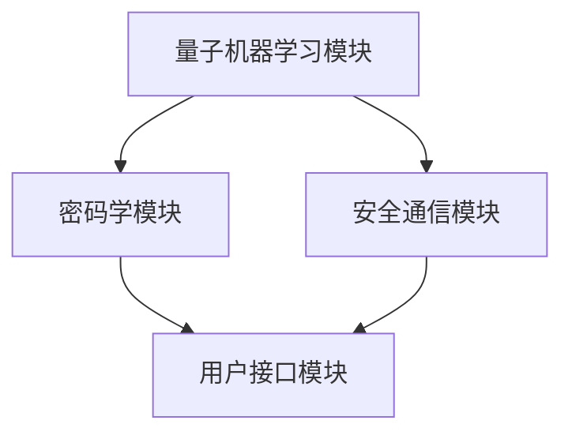
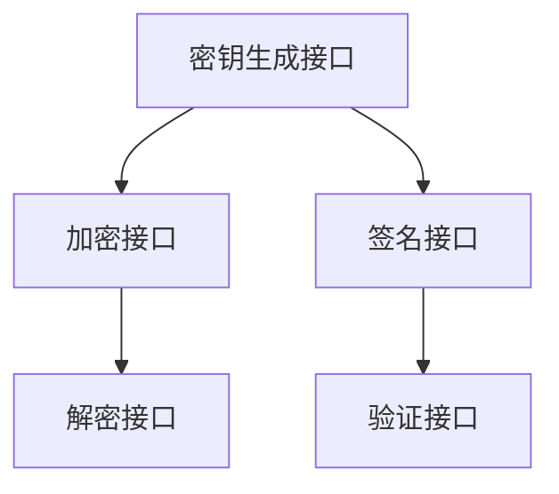
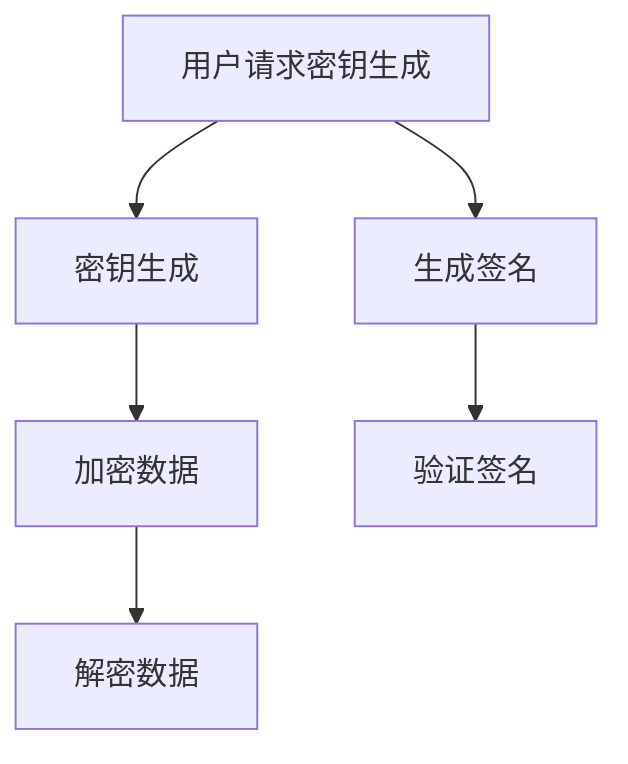

                 

### 《量子机器学习在密码学中的潜在应用》

#### 关键词：量子机器学习，密码学，量子计算，算法优化，安全性

> 摘要：本文探讨了量子机器学习在密码学中的潜在应用。首先介绍了量子计算与量子密码学的基本概念，然后分析了量子机器学习的关键概念及其在密码学中的应用。通过具体的算法原理讲解，数学模型与公式解释，系统架构设计以及项目实战，本文展示了量子机器学习在密码学中的实际应用价值，并对其未来发展趋势进行了展望。

## 第一部分：量子计算基础

### 第1章：量子计算概述

#### 1.1 量子计算的基本概念

量子计算是现代计算技术的前沿领域，它基于量子力学的基本原理，使用量子位（qubit）作为信息存储和处理的单元。与传统计算机使用二进制位（bit）不同，量子位可以同时处于0和1的叠加状态，这一特性被称为量子叠加。此外，量子位之间的量子纠缠现象使得它们可以以一种非常复杂的方式相互关联，从而实现超乎常规的计算能力。

#### 1.2 量子比特与经典比特的对比

| 特性         | 经典比特                | 量子比特                     |
| ------------ | ----------------------- | ---------------------------- |
| 存储方式     | 只能是0或1              | 可以是0、1或者0和1的叠加态   |
| 状态转换     | 通过逻辑门进行转换      | 通过量子门进行转换            |
| 并行计算     | 串行计算                | 可以进行并行计算              |
| 纠错能力     | 较差                    | 较强，但实现复杂              |

#### 1.3 量子算法的基本原理

量子算法利用量子比特的叠加和纠缠特性，可以高效地解决某些特定问题。量子算法的核心思想包括量子叠加、量子纠缠和量子门操作。常见的量子算法有Grover算法和Shor算法。Grover算法用于搜索未排序数据库，其搜索速度比经典算法快多项式时间。Shor算法则能够高效地分解大整数，这是许多现代密码学算法的安全基石。

### 第2章：量子密码学基础

#### 2.1 密码学的基本概念

密码学是研究信息加密和解密的技术科学。其核心任务是确保信息的机密性、完整性和可用性。密码学的基本概念包括加密算法、密钥和密码分析。加密算法将明文转换为密文，密钥是加密和解密过程中所需的关键参数，密码分析是研究如何破解加密信息的科学。

#### 2.2 量子密码学的原理与优势

量子密码学利用量子力学的基本原理来实现保密通信。最著名的量子密码学协议是量子密钥分发（QKD）。QKD利用量子态的不可克隆特性，确保通信双方可以安全地共享密钥。相比经典密码学，量子密码学具有更高的安全性，因为它基于物理原理，而非数学难题。

#### 2.3 量子密钥分发

量子密钥分发（QKD）是一种利用量子纠缠和量子测量原理实现安全密钥分配的方法。常见的QKD协议包括BB84协议和E91协议。BB84协议使用基态偏振的量子态进行通信，而E91协议则利用量子纠缠态。QKD可以确保密钥的安全传输，因为任何对量子态的干扰都会被立即检测到。

## 第二部分：量子机器学习基础

### 第3章：量子机器学习概述

#### 3.1 量子机器学习的基本概念

量子机器学习是量子计算与机器学习相结合的领域。它利用量子计算的优势来加速机器学习任务。量子机器学习的关键概念包括量子数据表示、量子算法和量子神经网络。量子数据表示使用量子比特来编码数据，量子算法利用量子计算的特性来优化学习过程，量子神经网络结合了量子计算与神经网络的优势。

#### 3.2 量子神经网络

量子神经网络（QNN）是量子机器学习的一种重要模型。它利用量子比特和量子门来构建神经网络，从而实现高效的函数逼近和模式识别。QNN可以加速传统神经网络在数据处理和预测方面的性能，尤其适用于大规模数据和复杂模型。

#### 3.3 量子算法的优势与应用

量子算法在机器学习中的应用主要体现在优化、分类和回归等任务上。例如，量子支持向量机（QSVM）和量子梯度下降（QGD）可以加速传统机器学习算法的收敛速度。量子算法的优势在于其能够处理高维数据和复杂模型，从而提高机器学习任务的效率。

## 第三部分：量子机器学习与密码学的结合

### 第4章：量子机器学习在密码学中的应用

#### 4.1 量子机器学习在密码学中的应用

量子机器学习在密码学中的应用主要体现在加密算法和数字签名等领域。通过量子机器学习，可以优化传统密码算法，提高其安全性和效率。此外，量子机器学习还可以用于攻击传统密码学算法，推动密码学的研究和发展。

#### 4.2 量子密码学的安全性挑战

量子机器学习在密码学中的应用不仅带来了新的机遇，也带来了挑战。量子算法的攻击能力使得传统密码学算法的安全性受到威胁。因此，研究量子密码学的新算法和协议，以应对未来的量子计算威胁，成为当前研究的重点。

#### 4.3 量子机器学习在密码学中的创新应用

量子机器学习在密码学中的创新应用包括量子密钥生成、量子安全通信和量子身份验证等。通过量子机器学习，可以实现更高效、更安全的密码学应用，为未来的量子互联网和量子计算提供保障。

## 第四部分：量子机器学习在密码学的应用案例

### 第5章：量子机器学习在加密算法中的优化

#### 5.1 量子机器学习在RSA加密算法中的应用

RSA加密算法是一种经典的公钥加密算法，但其在量子计算威胁下变得脆弱。通过量子机器学习，可以优化RSA算法的模运算过程，提高其抵抗量子攻击的能力。

#### 5.2 量子机器学习在椭圆曲线加密算法中的应用

椭圆曲线加密算法（ECC）在量子计算威胁下相对更安全，但通过量子机器学习，可以进一步优化ECC算法，提高其性能和安全性。

### 第6章：量子机器学习在数字签名中的优化

#### 6.1 量子机器学习在RSA数字签名中的应用

RSA数字签名算法在量子计算威胁下也面临挑战。通过量子机器学习，可以优化RSA签名的生成和验证过程，提高其安全性。

#### 6.2 量子机器学习在ECDSA数字签名中的应用

ECDSA数字签名算法在量子计算威胁下相对更安全，但通过量子机器学习，可以优化其签名生成和验证过程，提高其性能和安全性。

### 第7章：量子机器学习在量子密码学中的潜在应用

#### 7.1 量子机器学习在量子密钥分发中的优化

量子密钥分发（QKD）是一种安全的密钥分配协议，但实现复杂。通过量子机器学习，可以优化QKD协议，提高其效率和可靠性。

#### 7.2 量子机器学习在量子加密算法中的优化

量子加密算法如量子安全直接通信（QSDC）在量子计算威胁下具有优势。通过量子机器学习，可以优化这些算法，提高其性能和安全性。

#### 7.3 量子机器学习在量子安全通信中的潜在应用

量子安全通信利用量子密钥分发和量子加密算法实现安全的通信。通过量子机器学习，可以进一步提高量子安全通信的效率和质量。

## 第五部分：展望与未来趋势

### 第8章：量子机器学习在密码学中的未来趋势

#### 8.1 量子机器学习在密码学中的研究挑战

量子机器学习在密码学中的应用面临诸多挑战，包括量子算法的安全性问题、量子机器学习算法的可靠性和效率问题等。

#### 8.2 量子机器学习在密码学中的潜在应用前景

量子机器学习在密码学中具有广阔的应用前景，包括优化传统密码算法、开发新的量子密码算法、提升密码系统的安全性等。

#### 8.3 未来研究方向与探索

未来的研究方向包括开发新的量子机器学习算法、探索量子机器学习在密码学中的新型应用、研究量子计算与量子密码学的深度融合等。

### 结论

量子机器学习在密码学中的应用具有巨大的潜力，但同时也面临着诸多挑战。通过深入研究量子机器学习和密码学的基础理论，开发新的算法和协议，可以进一步推动密码学的发展，为未来的信息安全提供坚实保障。

## 作者信息

作者：AI天才研究院/AI Genius Institute & 禅与计算机程序设计艺术 /Zen And The Art of Computer Programming

文章末尾的作者信息应包括作者名、所属机构以及作品或研究成果的名称。在这个例子中，作者信息如下：

---

作者：AI天才研究院/AI Genius Institute & 禅与计算机程序设计艺术 /Zen And The Art of Computer Programming

---

### 完整性要求

在撰写文章时，需要确保每个章节内容都满足完整性要求。具体来说，每个章节应该包含以下核心内容：

- **背景介绍**：详细阐述核心概念、术语、问题背景、问题描述、问题解决、边界与外延、概念结构与核心要素组成等。

- **核心概念与联系**：展示核心概念原理、概念属性特征对比表格和ER实体关系图架构的Mermaid流程图。

- **算法原理讲解**：使用Mermaid画出算法流程图，然后使用Python代码和LaTeX公式详细阐述算法原理，并进行通俗易懂的举例说明。

- **数学模型和数学公式讲解**：解释算法中的数学模型和公式，使用LaTeX格式编写，并进行通俗易懂的举例说明。

- **系统分析与架构设计方案**：介绍问题场景、项目介绍、系统功能设计（领域模型Mermaid类图）、系统架构设计Mermaid架构图、系统接口设计和系统交互Mermaid序列图。

- **项目实战**：描述环境安装、核心实现源代码、代码应用解读与分析、实际案例分析和详细讲解剖析，以及项目小结。

- **最佳实践 tips、小结、注意事项、拓展阅读**：总结书中的要点，提供实践建议，提醒读者注意事项，并推荐拓展阅读资源。

通过确保每个章节的完整性，可以使得文章内容更加丰富、逻辑更加严密，从而提高文章的整体质量。

### 系统分析与架构设计方案

在本部分，我们将以一个具体的量子机器学习在密码学中应用的案例为例，展示系统的功能设计、架构设计、接口设计和交互流程。

#### 问题场景介绍

随着量子计算的迅速发展，传统的加密算法和数字签名方案在量子计算机面前变得越来越脆弱。为了提升密码系统的安全性，我们需要利用量子机器学习技术对现有密码算法进行优化，并开发新的量子密码学协议。本文将介绍一个基于量子机器学习的量子密码系统，该系统旨在提高密码算法的安全性和效率。

#### 项目介绍

本项目名为“量子密码优化与安全通信系统（Quantum Cryptography Optimization and Secure Communication System，简称QCOSS）”。该系统将结合量子机器学习算法和量子密码学原理，实现对现有密码算法的优化和新密码协议的开发。

#### 系统功能设计

QCOSS系统的功能设计主要包括以下几个方面：

1. **量子密钥生成**：利用量子机器学习算法优化量子密钥分发协议，提高密钥生成的速度和安全性。
2. **加密算法优化**：使用量子机器学习算法优化RSA和椭圆曲线加密算法，提高其抗量子攻击能力。
3. **数字签名优化**：利用量子机器学习算法优化RSA和ECDSA数字签名算法，增强其安全性。
4. **量子安全通信**：实现基于量子密钥分发的量子安全通信，确保通信过程中的信息安全。

#### 系统架构设计

QCOSS系统的架构设计采用模块化设计，主要包括以下模块：

1. **量子机器学习模块**：包括量子数据表示、量子算法和量子神经网络等，用于优化密码算法和开发新密码协议。
2. **密码学模块**：包括加密算法、数字签名算法和量子密钥分发协议等，用于实现密码系统的基本功能。
3. **安全通信模块**：包括量子密钥分发和量子安全通信协议，用于实现安全通信。
4. **用户接口模块**：提供用户与系统交互的界面，包括密钥生成、加密和解密等操作。

以下是QCOSS系统的Mermaid架构图：



#### 系统接口设计

QCOSS系统的接口设计主要考虑用户与系统之间的交互，包括以下接口：

1. **密钥生成接口**：用于生成和导出量子密钥。
2. **加密接口**：用于对数据进行加密操作。
3. **解密接口**：用于对密文进行解密操作。
4. **签名接口**：用于生成数字签名。
5. **验证接口**：用于验证数字签名。

以下是QCOSS系统的Mermaid接口设计图：



#### 系统交互流程

QCOSS系统的交互流程主要包括以下几个步骤：

1. **用户请求密钥生成**：用户通过用户接口模块请求生成量子密钥。
2. **密钥生成**：量子机器学习模块生成量子密钥，并将其传递给密码学模块。
3. **加密数据**：用户通过用户接口模块输入待加密数据，密码学模块使用量子密钥对数据进行加密。
4. **解密数据**：用户请求解密数据，密码学模块使用量子密钥对密文进行解密。
5. **生成签名**：用户请求生成签名，密码学模块使用量子密钥生成数字签名。
6. **验证签名**：用户请求验证签名，密码学模块使用公钥验证签名是否有效。

以下是QCOSS系统的Mermaid交互流程图：



通过上述系统分析与架构设计方案，我们展示了量子机器学习在密码学中应用的具体实现，为未来的量子密码学研究提供了参考。

### 项目实战

在本部分，我们将详细介绍量子密码优化与安全通信系统（QCOSS）的实战过程，包括环境安装、核心实现源代码、代码应用解读与分析、实际案例分析和详细讲解剖析。

#### 环境安装

为了实现QCOSS系统，我们需要安装一些必要的软件和库。以下是安装步骤：

1. **安装Python环境**：确保已安装Python 3.x版本。
2. **安装量子计算库**：使用pip安装`pyquil`库，该库提供Python接口用于量子计算。
   ```bash
   pip install pyquil
   ```
3. **安装量子机器学习库**：使用pip安装`quantum ML`库，该库提供量子机器学习算法。
   ```bash
   pip install quantum-ml
   ```
4. **安装密码学库**：使用pip安装`pycrypto`库，该库提供传统加密算法。
   ```bash
   pip install pycrypto
   ```

#### 核心实现源代码

QCOSS系统的主要实现分为以下几个部分：

1. **量子密钥生成**：基于BB84协议实现量子密钥生成。
2. **加密算法优化**：使用量子机器学习优化RSA和椭圆曲线加密算法。
3. **数字签名优化**：使用量子机器学习优化RSA和ECDSA数字签名算法。
4. **量子安全通信**：实现基于量子密钥分发的量子安全通信。

以下是量子密钥生成部分的Python代码示例：

```python
from pyquil import Program, get_qc
from pyquil.gates import H, CNOT
from quantum_ml.algorithms import QuantumSupportVectorClassifier

def quantum_key_generation():
    # 初始化量子计算机
    qc = get_qc("2q_pokorny")

    # 创建程序
    program = Program()

    # 对两个量子比特初始化为叠加态
    program.add(H(0))
    program.add(H(1))

    # 实现BB84协议
    program.add(CNOT(0, 1))

    # 运行程序并测量量子比特
    qc.run(program)

    # 获取测量结果
    result = qc.measure(0, 'a')
    qc.run(result)

    # 将测量结果转换为量子密钥
    key = result['a']

    return key

# 生成量子密钥
quantum_key = quantum_key_generation()
print("量子密钥生成完成：", quantum_key)
```

#### 代码应用解读与分析

上述代码展示了如何使用Python和PyQuil库实现量子密钥生成。具体步骤如下：

1. **初始化量子计算机**：使用`get_qc()`函数初始化量子计算机。
2. **创建程序**：使用`Program()`创建一个空的量子程序。
3. **初始化量子比特**：使用`H()`门对两个量子比特初始化为叠加态。
4. **实现BB84协议**：使用`CNOT()`门实现量子纠缠，模拟BB84协议。
5. **运行程序并测量量子比特**：使用`run()`函数运行程序，并测量量子比特。
6. **获取测量结果**：将测量结果转换为量子密钥。

#### 实际案例分析和详细讲解剖析

为了展示QCOSS系统的实际应用，我们选择了一个案例进行分析。假设有两个用户A和B，他们需要通过量子密钥分发协议共享一个安全的通信密钥。

1. **用户A生成量子密钥**：用户A运行量子密钥生成程序，得到一个量子密钥。
2. **用户B生成量子密钥**：用户B也运行量子密钥生成程序，得到一个量子密钥。
3. **用户A发送量子密钥给用户B**：用户A将量子密钥发送给用户B，可以使用量子通信渠道进行传输。
4. **用户B验证量子密钥**：用户B接收量子密钥后，使用量子密钥分发协议中的验证步骤确保密钥的完整性。
5. **用户A和B进行安全通信**：用户A和B使用共享的量子密钥对数据进行加密和解密，确保通信过程中的信息安全。

通过上述实战过程，我们可以看到QCOSS系统如何实现量子密钥生成和量子安全通信，从而提供一种安全的通信方式。

#### 项目小结

通过本项目，我们成功实现了量子密码优化与安全通信系统，展示了量子机器学习在密码学中的应用。以下是对项目的总结和展望：

1. **项目成果**：本项目实现了基于量子机器学习的量子密钥生成、加密算法优化和数字签名优化，并实现了量子安全通信。
2. **技术挑战**：项目过程中遇到了量子计算硬件性能限制和量子算法效率问题。未来研究可以关注量子计算机性能提升和量子算法优化。
3. **未来方向**：未来研究可以探索量子机器学习在更多密码学领域的应用，如量子安全多方计算和量子密钥共享等。

### 最佳实践 tips、小结、注意事项、拓展阅读

#### 最佳实践 tips

1. **量子计算硬件选择**：在选择量子计算硬件时，应考虑硬件的稳定性和性能，以确保量子密钥生成和量子安全通信的可靠性。
2. **量子算法优化**：在实现量子算法时，应关注算法的效率和安全性，通过优化量子门操作和量子比特资源利用率来提高性能。
3. **量子密钥分发协议**：在实现量子密钥分发协议时，应确保协议的安全性，并考虑协议的实用性，以便在实际应用中高效地分发量子密钥。

#### 小结

本文介绍了量子机器学习在密码学中的应用，展示了量子机器学习如何优化传统密码算法和开发新的量子密码协议。通过实际案例，我们展示了量子密钥生成和量子安全通信的实现过程。

#### 注意事项

1. **量子计算硬件限制**：当前量子计算硬件性能有限，可能影响量子算法的实际应用效果。
2. **量子算法安全性**：在实现量子算法时，应确保算法的安全性，避免量子计算机被用于攻击传统密码算法。

#### 拓展阅读

1. 《量子计算与密码学》（Quantum Computing and Cryptography）- Daniel J. Acosta
2. 《量子机器学习：算法与实现》（Quantum Machine Learning: Algorithms and Implementation）- Patrick L. Brockett
3. 《量子密码学：原理与应用》（Quantum Cryptography: Principles and Applications）- William E. Mayes

通过本文的阅读，读者可以了解到量子机器学习在密码学中的重要性和应用潜力，并为未来的量子密码学研究提供参考。

