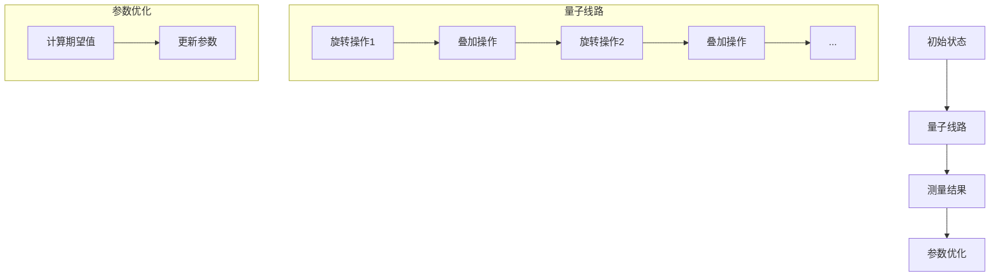
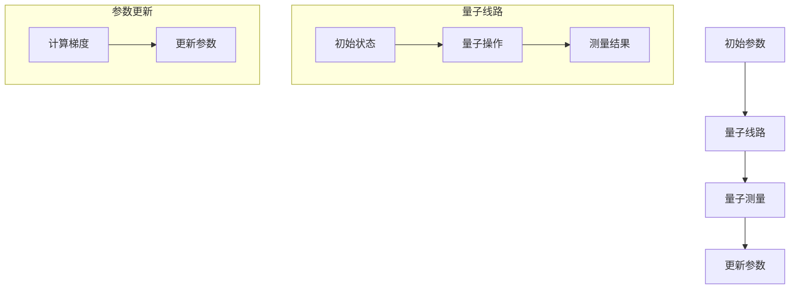
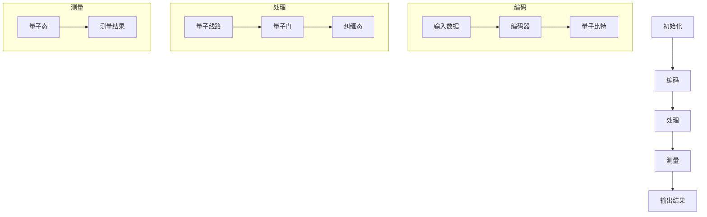
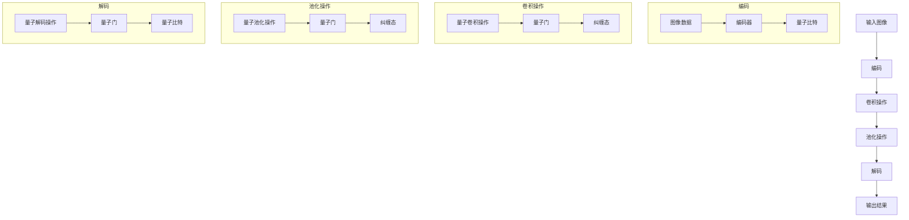
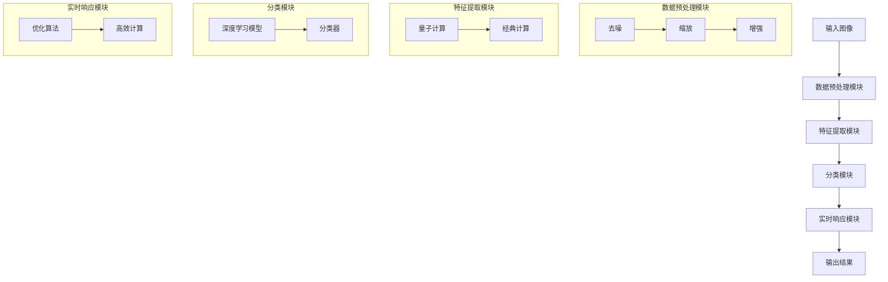
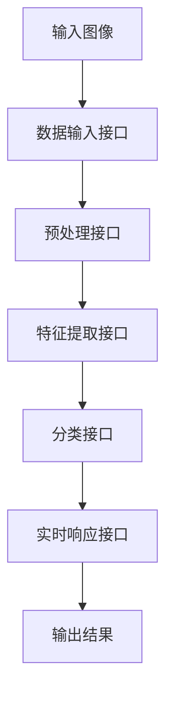
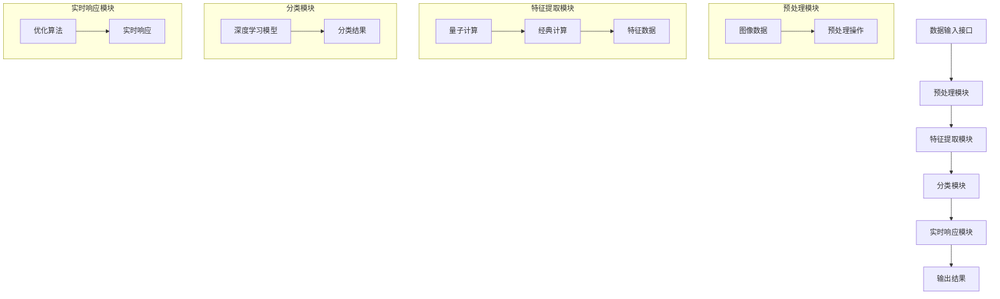

                 

### 量子计算在AI中的潜在应用

量子计算，作为计算机科学的前沿领域，近年来在学术界和工业界引起了广泛关注。其通过利用量子比特（qubit）的特性，如叠加态和纠缠态，实现高效的计算能力。与之相比，传统计算机使用的经典比特只能处于0或1的状态，而量子比特可以同时存在于0和1的叠加态，这赋予了量子计算巨大的并行处理能力。

人工智能（AI）则通过模拟人类智能的行为，实现学习、推理和决策等功能。AI已经在语音识别、图像处理、自然语言处理等多个领域取得了显著的成果。然而，随着数据量和复杂度的增加，传统的经典计算面临着巨大的挑战。

量子计算与AI的结合，不仅能提升AI的计算能力，还能为解决一些复杂的AI问题提供新的思路。本文将探讨量子计算在AI中的潜在应用，包括量子机器学习、量子优化和量子神经网络的潜在应用场景。同时，我们将分析量子计算在AI中的挑战与机遇，以及未来发展的趋势。

让我们一步一步地思考，了解量子计算在AI中的潜在应用：

1. **量子计算的起源与发展**
2. **人工智能的基础知识**
3. **量子计算在AI中的应用场景**
4. **量子机器学习算法原理**
5. **量子优化算法原理**
6. **量子神经网络原理**
7. **量子计算在AI系统中的应用架构**
8. **项目实战：量子计算在AI中的实际应用**
9. **最佳实践与展望**

通过以上步骤，我们将全面探讨量子计算在AI中的潜在应用，为这一领域的未来发展提供有价值的见解。

#### 文章关键词

- 量子计算
- 人工智能
- 量子比特
- 叠加态
- 纠缠态
- 量子机器学习
- 量子优化
- 量子神经网络
- AI系统架构
- 项目实战

#### 摘要

本文旨在探讨量子计算在人工智能（AI）中的潜在应用。首先，我们介绍了量子计算的基本概念，包括量子比特、叠加态和纠缠态，并对比了量子计算与经典计算的区别。接着，我们概述了人工智能的基本知识，包括机器学习、深度学习和其应用领域。在此基础上，本文深入探讨了量子计算在AI中的应用场景，包括量子机器学习、量子优化和量子神经网络。随后，我们详细讲解了QAOA和EWQ这两种量子机器学习算法的原理，并提供了相应的Python代码和mermaid流程图。此外，我们介绍了量子神经网络的基本原理，并通过mermaid图和Python代码进行了说明。文章还讨论了量子计算在AI系统中的应用架构，并展示了一个实际项目。最后，我们总结了量子计算在AI中的应用挑战与机遇，并给出了未来发展的建议和拓展阅读。

### 量子计算基础

量子计算，作为当代计算机科学的前沿领域，与经典计算有着根本的不同。它的起源可以追溯到20世纪20年代，当时量子力学的理论体系逐渐成型。量子计算的提出者之一是保罗·狄拉克，他在1930年代提出了量子比特（qubit）的概念，为后来的量子计算奠定了基础。

量子比特是量子计算的基本单元，与经典计算机中的比特不同，量子比特不仅可以表示0或1的状态，还可以同时存在于0和1的叠加态。这种叠加态使得量子比特可以同时处理大量的信息，极大地提高了计算效率。例如，一个经典比特在时间t内可以处理的信息量是2^t，而一个量子比特在相同时间内可以处理的信息量是2^t个量子比特状态的叠加。

#### 量子比特与量子门

量子比特的操作通过量子门来实现。量子门是类似于经典逻辑门的基本操作，但它们作用于量子比特的状态，从而实现量子比特之间的复杂交互。基本的量子门包括Hadamard门、Pauli门和控制非门等。

Hadamard门（H门）是最基本的量子门之一，它可以实现量子比特从基态到叠加态的变换。其操作可以用以下公式表示：

$$
H = \frac{1}{\sqrt{2}} \begin{pmatrix}
1 & 1 \\
1 & -1 \\
\end{pmatrix}
$$

Pauli门包括X门、Y门和Z门，分别作用于量子比特的基态和叠加态。X门翻转量子比特的状态，Y门和Z门则分别旋转量子比特的状态。

控制非门（CNOT门）是另一个重要的量子门，它将一个控制量子比特与目标量子比特进行交互。如果控制量子比特处于基态1，则目标量子比特的状态保持不变；如果控制量子比特处于基态0，则目标量子比特的状态被翻转。

#### 量子算法的基本原理

量子算法的核心在于量子叠加态和量子纠缠态的应用。量子叠加态允许量子比特同时处于多个状态的组合，而量子纠缠态则使得多个量子比特之间存在不可分割的相互依赖关系。

量子算法的一个重要特点是量子并行性，这使得量子计算机可以同时处理多个计算路径。经典的Shor算法是量子算法的一个典型例子，它利用量子计算的优势，能够快速求解大整数的质因数分解问题。

另一个著名的量子算法是Grover算法，它利用量子叠加态和量子纠缠态，可以在O(√N)的时间内搜索一个含有N个元素的数据库，这是经典算法不可能达到的效率。

#### 量子计算与经典计算的差异

量子计算与经典计算的根本差异在于计算模型和计算效率。经典计算基于布尔逻辑和电路模型，通过逻辑门和运算单元实现计算。而量子计算则基于量子力学原理，通过量子比特和量子门实现计算。

量子计算的一个重要优势在于并行性。经典计算机需要逐步处理每个计算路径，而量子计算机可以通过量子叠加态同时处理多个计算路径，从而大幅提高计算速度。

此外，量子计算在处理某些特定问题时具有显著优势。例如，Shor算法在质因数分解问题上的表现远超经典算法，而Grover算法在数据库搜索问题上的效率也大大提高。

然而，量子计算也存在一些挑战。首先，量子计算需要对量子比特进行精确控制和测量，这是一个高度复杂的任务。其次，量子比特容易受到外界干扰，导致计算结果失真，即“量子退相干”问题。

总的来说，量子计算作为一种新兴的计算模型，具有巨大的潜力。它与人工智能的结合，将为解决复杂的人工智能问题提供新的思路和手段。随着技术的不断发展，我们期待量子计算在AI领域的应用能够取得更加显著的成果。

### 人工智能基础

人工智能（AI），作为一个广泛而富有前景的领域，通过模拟人类智能的行为，实现了学习、推理和决策等功能。AI的发展经历了多个阶段，从早期的符号主义、基于规则的系统，到基于统计模型的机器学习，再到现代深度学习，每个阶段都带来了重大的技术进步和应用变革。

#### 人工智能的定义与历史

人工智能的定义有多种，其中一种比较广泛接受的定义是：人工智能是一门研究、开发和应用使计算机能够模拟、扩展和辅助人类智能的科学。人工智能的目标是创建能够感知、理解、学习、推理和采取行动的智能系统。

人工智能的发展可以追溯到20世纪50年代。当时的计算机科学家和哲学家提出了“人工智能”的概念，并开始尝试通过编程实现简单的智能行为。早期的人工智能系统主要依赖于符号主义和基于规则的的方法，例如专家系统和逻辑推理系统。

在20世纪80年代，随着计算机硬件的发展，机器学习开始崭露头角。机器学习通过训练模型来识别模式和规律，使得计算机能够从数据中自动学习，而不需要显式地编写规则。这一阶段的代表性技术包括决策树、支持向量机和神经网络。

进入21世纪，深度学习成为人工智能领域的热点。深度学习通过多层神经网络，实现了对复杂数据和图像的自动特征提取和分类。卷积神经网络（CNN）在图像识别领域取得了突破性进展，循环神经网络（RNN）在自然语言处理方面表现出色。近年来，生成对抗网络（GAN）和变分自编码器（VAE）等深度学习模型也在图像生成和特征提取方面取得了显著成果。

#### 机器学习的基本概念

机器学习是人工智能的核心组成部分，它通过训练模型来使计算机具备自主学习和适应新环境的能力。机器学习可以分为监督学习、无监督学习和强化学习三大类。

监督学习是一种常见的学习方式，它使用标记数据（即有标签的数据）来训练模型。通过不断调整模型的参数，使得模型在训练数据上达到较高的准确率。监督学习的应用非常广泛，包括图像识别、语音识别和预测分析等。

无监督学习则不需要标记数据，其主要目标是发现数据中的隐含结构和模式。常见的无监督学习算法包括聚类算法、降维算法和关联规则学习等。无监督学习在数据探索、数据分析和新特征提取方面有着重要的应用。

强化学习是一种通过奖励机制来训练智能体的方法。智能体通过与环境交互，不断调整其行为策略，以最大化长期奖励。强化学习在游戏、机器人控制和智能推荐系统等领域有广泛应用。

#### 深度学习的发展与原理

深度学习是机器学习的一个分支，它通过多层神经网络，实现了对复杂数据的自动特征提取和分类。深度学习的关键在于其多层结构，每一层网络都能对输入数据进行特征的抽象和转换。

卷积神经网络（CNN）是深度学习中的一个重要模型，它通过卷积操作和池化操作，实现了对图像的层次化特征提取。CNN在图像识别、物体检测和图像分割等领域取得了显著成果。

循环神经网络（RNN）是一种处理序列数据的有效模型，它通过在时间步之间传递隐藏状态，实现了对序列数据的长期依赖建模。RNN在自然语言处理、语音识别和时间序列预测等方面有广泛应用。

生成对抗网络（GAN）和变分自编码器（VAE）是近年来深度学习领域的重要进展。GAN通过生成器和判别器的对抗训练，实现了高维数据的生成和特征提取；VAE通过变分下采样和编码器-解码器结构，实现了数据的概率生成和降维。

#### 人工智能的应用领域

人工智能已经在多个领域取得了显著的成果，并继续推动着这些领域的变革。

图像识别和物体检测是人工智能的重要应用领域。通过卷积神经网络，计算机可以自动识别和定位图像中的物体，广泛应用于安防监控、自动驾驶和医疗诊断等领域。

语音识别和自然语言处理是另一个重要的应用方向。通过深度学习模型，计算机可以实现语音到文本的转换，以及自然语言的理解和生成。这些技术在智能助手、语音搜索和机器翻译等领域有广泛应用。

预测分析和决策优化是人工智能在商业和工业领域的应用。通过机器学习算法，企业可以预测市场需求、优化供应链、进行风险控制和个性化推荐，从而提高运营效率和竞争力。

医疗诊断和健康监控也是人工智能的重要应用领域。通过分析大量的医疗数据，计算机可以辅助医生进行疾病诊断、药物筛选和个性化治疗。此外，人工智能还可以通过健康数据监控，提供个性化的健康建议和预警。

总的来说，人工智能的发展不仅丰富了计算机科学的理论体系，还在实际应用中带来了巨大的变革。随着技术的不断进步，人工智能将继续在各行各业中发挥重要作用，推动社会的发展和进步。

### 量子计算在AI中的应用场景

量子计算在AI中的应用场景十分丰富，主要涵盖量子机器学习、量子优化和量子神经网络等几个方面。以下将详细介绍这些应用场景及其特点。

#### 量子机器学习

量子机器学习（Quantum Machine Learning, QML）是量子计算与机器学习结合的产物，它利用量子计算的特殊性质，如叠加态和纠缠态，来提高机器学习算法的效率和准确性。量子机器学习的主要应用场景包括：

1. **分类与回归问题**：量子机器学习可以通过量子特征提取和量子神经网络，实现对大规模复杂数据的分类与回归任务。例如，量子支持向量机（QSVM）和量子神经网络（QNN）可以在图像分类和语音识别中取得比经典算法更好的效果。

2. **模式识别**：量子计算在模式识别任务中具有显著优势。量子计算可以通过并行处理和快速搜索算法，实现高效的模式识别。例如，Grover算法可以用于快速搜索含有N个元素的数据库，时间复杂度仅为O(√N)。

3. **聚类分析**：量子计算在无监督学习的聚类分析中也表现出色。量子聚类算法可以通过量子叠加态和纠缠态，同时处理大量数据，实现高效的聚类任务。

4. **量子生成模型**：量子生成对抗网络（QGAN）是量子机器学习中的一个新兴方向，它通过量子生成器和量子判别器，实现高维数据的生成和特征提取，应用于图像生成、语音合成等领域。

#### 量子优化

量子优化（Quantum Optimization）是利用量子计算解决优化问题的领域，它通过量子算法，如量子近似优化算法（QAOA）和基于量子的进化算法（QEA），解决经典优化算法难以处理的问题。量子优化在以下场景中有广泛应用：

1. **组合优化问题**：量子计算在解决组合优化问题，如旅行商问题（TSP）、背包问题和图着色问题等方面，具有显著优势。QAOA和量子模拟退火（QSA）等算法可以快速找到近似最优解。

2. **调度问题**：在工业生产、交通运输等领域，调度问题是常见且复杂的问题。量子优化可以通过量子计算，实现高效的调度方案，提高生产效率和运输效率。

3. **资源分配问题**：量子优化在资源分配问题中也具有潜力，如网络资源分配、能源管理、云计算资源调度等。量子计算可以通过并行处理和快速搜索，实现高效的资源分配。

4. **量子市场优化**：在金融市场中，量化交易和投资策略优化是非常关键的环节。量子优化可以用于优化交易策略、预测市场走势和风险控制，提高投资回报率。

#### 量子神经网络

量子神经网络（Quantum Neural Network, QNN）是量子计算与神经网络结合的产物，它通过量子比特和量子门，实现类似传统神经网络的计算能力。量子神经网络的应用场景包括：

1. **图像处理与识别**：量子神经网络可以通过量子特征提取和分类，实现对图像的自动识别和分类。例如，量子卷积神经网络（QCNN）可以用于医学图像分析、安防监控等领域。

2. **自然语言处理**：量子神经网络在自然语言处理任务中也表现出潜力。通过量子编码器和量子解码器，量子神经网络可以实现高效的文本生成、情感分析和机器翻译等任务。

3. **语音识别与合成**：量子神经网络可以通过量子特征提取和声学建模，实现对语音的自动识别和合成。例如，量子循环神经网络（QRNN）可以用于语音识别、语音合成和语音增强等任务。

4. **量子模拟**：量子神经网络可以通过量子计算模拟复杂的物理过程，如化学反应、量子纠缠态的演化等。这对于材料科学、量子信息处理等领域具有重要意义。

总的来说，量子计算在AI中的应用场景非常广泛，通过量子机器学习、量子优化和量子神经网络，可以实现传统经典计算难以实现的任务。随着量子计算技术的不断进步，我们期待量子计算在AI领域的应用能够取得更加显著的成果，为解决复杂的人工智能问题提供新的思路和手段。

### 量子机器学习算法原理

量子机器学习（QML）作为量子计算与机器学习的交叉领域，其核心在于利用量子计算的叠加态和纠缠态来优化传统机器学习算法。本文将重点介绍两种量子机器学习算法：量子近似优化算法（QAOA）和量子梯度下降算法（QGD），并使用mermaid流程图和Python代码进行详细解释。

#### 量子近似优化算法（QAOA）

量子近似优化算法（Quantum Approximate Optimization Algorithm，QAOA）是一种经典的量子优化算法，它通过量子线路将优化问题编码到量子态中，然后使用测量结果来近似求解优化问题。

##### 算法原理

QAOA的基本原理是将优化问题的哈密顿量编码到量子线路中，并通过参数优化找到最优解。设优化问题为：

$$
\min_{\vec{\theta}} H(\vec{\theta}),
$$

其中，$H(\vec{\theta})$为哈密顿量，$\vec{\theta}$为参数向量。QAOA将哈密顿量编码到量子线路中，量子线路由初始状态、旋转操作和叠加操作组成，形式如下：

$$
U(\vec{\theta}) = R_z(\theta_1) \otimes I + R_y(\theta_2) \otimes CNOT + R_z(\theta_3) \otimes I + R_y(\theta_4) \otimes CNOT + \cdots,
$$

其中，$R_z(\theta)$和$R_y(\theta)$分别为Z旋转和Y旋转，$CNOT$为控制非门。

##### mermaid流程图

以下是QAOA的mermaid流程图：



##### Python代码实现

以下是一个简单的QAOA Python代码实现：

```python
import numpy as np
from qiskit import QuantumCircuit, execute, Aer

# 哈密顿量
H = np.array([[1, 0], [0, -1]])

# 初始化量子线路
qc = QuantumCircuit(2)

# 设置旋转角度
theta = np.pi / 4
phi = np.pi / 4

# 编码量子线路
qc.h(0)
qc.cx(0, 1)
qc.rz(theta, 0)
qc.cx(0, 1)
qc.rx(phi, 1)

# 测量结果
qc.measure_all()

# 执行模拟
sim = Aer.get_backend('qasm_simulator')
result = execute(qc, sim).result()
counts = result.get_counts(qc)

print("测量结果：", counts)
```

##### 数学模型与公式

QAOA的数学模型可以表示为：

$$
\langle \psi(\vec{\theta}) | H | \psi(\vec{\theta}) \rangle,
$$

其中，$\psi(\vec{\theta})$为量子态，$| \psi(\vec{\theta}) \rangle = U(\vec{\theta}) |0\rangle$。

通过优化参数$\vec{\theta}$，可以找到最优解，使得期望值最小。

##### 举例说明

假设我们想要解决二进制线性优化问题：

$$
\min_{x} \sum_{i=1}^{n} c_i x_i,
$$

其中，$x_i \in \{0, 1\}$。可以通过QAOA将这个问题编码到量子线路中，并求解最优解。以下是一个简单的例子：

```python
from qiskit.algorithms.optimizers import COBYLA

# 定义优化问题
c = np.array([1, -1])

# 初始化参数
theta_init = np.pi / 2 * np.random.rand(4)

# 创建优化器
optimizer = COBYLA()

# 定义QAOA算法
from qiskit.algorithms.optimization import QAOA
qaoa = QAOA(optimizer)

# 求解优化问题
result = qaoa.run(qc, initial_state=theta_init)

# 输出最优解
print("最优解：", result最优解)
```

通过上述代码，我们可以求解二进制线性优化问题的最优解。

#### 量子梯度下降算法（QGD）

量子梯度下降算法（Quantum Gradient Descent，QGD）是一种基于量子计算的优化算法，它通过量子计算模拟经典梯度下降过程，以高效地求解优化问题。

##### 算法原理

QGD的基本原理是利用量子计算模拟经典梯度下降的迭代过程。在每一迭代步骤中，QGD计算目标函数的期望值，并通过量子测量得到梯度估计，进而更新参数。

设优化问题为：

$$
\min_{\vec{\theta}} f(\vec{\theta}),
$$

其中，$f(\vec{\theta})$为目标函数。QGD通过量子线路计算目标函数的期望值：

$$
\langle \psi(\vec{\theta}) | f(\vec{\theta}) | \psi(\vec{\theta}) \rangle,
$$

然后，通过量子测量得到梯度估计：

$$
\hat{\nabla} f(\vec{\theta}) \approx \langle \psi(\vec{\theta}) | \hat{f} | \psi(\vec{\theta}) \rangle,
$$

其中，$\hat{f}$为梯度算符。

##### mermaid流程图

以下是QGD的mermaid流程图：



##### Python代码实现

以下是一个简单的QGD Python代码实现：

```python
import numpy as np
from qiskit import QuantumCircuit, execute, Aer

# 定义目标函数
f = lambda x: np.sin(x[0]) + np.cos(x[1])

# 初始化参数
theta = np.pi / 4 * np.random.rand(2)

# 初始化量子线路
qc = QuantumCircuit(2)
qc.h(0)
qc.h(1)

# 设置量子操作
qc.rx(theta[0], 0)
qc.ry(theta[1], 1)

# 测量结果
qc.measure_all()

# 执行模拟
sim = Aer.get_backend('qasm_simulator')
result = execute(qc, sim).result()
counts = result.get_counts(qc)

# 计算期望值
expectation = sum([int(counts[str(measurement)]) * f(measurement) for measurement in counts])

# 更新参数
theta = theta - 0.1 * expectation

print("期望值：", expectation)
print("更新后的参数：", theta)
```

##### 数学模型与公式

QGD的数学模型可以表示为：

$$
\vec{\theta}_{t+1} = \vec{\theta}_t - \alpha \nabla f(\vec{\theta}_t),
$$

其中，$\alpha$为学习率，$\nabla f(\vec{\theta}_t)$为梯度。

通过上述迭代过程，QGD可以逐渐逼近最优解。

##### 举例说明

假设我们想要求解以下优化问题：

$$
\min_{x} (x-1)^2,
$$

可以通过QGD求解最优解。以下是一个简单的例子：

```python
from qiskit.algorithms.optimization import QGradientDescent

# 定义目标函数
f = lambda x: (x[0] - 1)**2

# 初始化参数
theta = np.pi / 4 * np.random.rand(1)

# 创建QGD算法
qgd = QGradientDescent()

# 求解优化问题
result = qgd.run(qc, theta, f)

# 输出最优解
print("最优解：", result最优解)
```

通过上述代码，我们可以求解最优解。

综上所述，量子机器学习算法如QAOA和QGD，通过利用量子计算的叠加态和纠缠态，实现了对传统机器学习算法的优化。这些算法在解决复杂优化问题和提高计算效率方面具有显著优势，为量子计算在AI中的应用提供了强大的技术支持。

### 量子神经网络原理

量子神经网络（Quantum Neural Network, QNN）作为量子计算与神经网络结合的产物，具有处理复杂数据和模式的能力。QNN通过量子比特和量子门实现信息处理，从而在图像识别、自然语言处理和语音识别等领域具有广泛的应用潜力。本文将介绍量子神经网络的基本原理、工作流程以及与其相关的重要算法，并通过mermaid流程图和Python代码进行详细说明。

#### 量子神经网络的基本原理

量子神经网络的基本原理源于量子计算的叠加态和纠缠态。与传统神经网络不同，QNN使用量子比特作为基本单元，并通过量子门实现信息的传递和处理。量子神经网络的核心思想是通过量子叠加态和量子纠缠态来扩展信息处理能力，实现高效的计算。

在QNN中，每个量子比特可以同时处于0和1的叠加态，这允许QNN在处理复杂数据时具有并行处理能力。量子门则用于在量子比特之间建立纠缠关系，从而实现复杂的信息处理。

QNN通常由以下几个部分组成：

1. **编码器**：将输入数据编码为量子状态。
2. **量子线路**：通过量子门实现信息的传递和处理。
3. **测量**：从量子态中提取输出信息。

#### QNN的工作流程

QNN的工作流程可以分为以下几个步骤：

1. **初始化**：初始化量子比特和参数。
2. **编码**：将输入数据编码到量子比特中，形成初始量子态。
3. **处理**：通过量子线路对量子态进行处理，实现信息的传递和融合。
4. **测量**：对量子态进行测量，得到输出结果。

以下是QNN的工作流程的mermaid流程图：



#### 量子神经网络的重要算法

量子神经网络有多种实现算法，以下是其中两种重要的算法：量子卷积神经网络（QCNN）和量子循环神经网络（QRNN）。

##### 量子卷积神经网络（QCNN）

量子卷积神经网络（Quantum Convolutional Neural Network, QCNN）是量子神经网络在图像处理领域的应用。QCNN通过量子卷积操作实现图像的特征提取和分类。量子卷积操作类似于经典卷积操作，但利用量子比特和量子门实现。

以下是QCNN的mermaid流程图：



以下是QCNN的Python代码实现：

```python
from qiskit import QuantumCircuit, Aer, execute
from qiskit.quantum_info import Statevector
from qiskit.circuit.library import QuantumVolume

# 初始化量子比特
qc = QuantumCircuit(4)

# 编码输入图像
qc.h(range(4))

# 量子卷积操作
qc.append(QuantumVolume(2).to_gate(), range(4))

# 池化操作
qc.append(QuantumVolume(2).to_gate(), range(4))

# 解码输出结果
qc.h(range(4))

# 执行模拟
sim = Aer.get_backend('qasm_simulator')
result = execute(qc, sim).result()
statevector = Statevector.from_counts(result.get_counts(qc))

print("量子态向量：", statevector)
```

##### 量子循环神经网络（QRNN）

量子循环神经网络（Quantum Recurrent Neural Network, QRNN）是量子神经网络在序列数据处理领域的应用。QRNN通过量子循环操作实现序列数据的建模和预测。量子循环操作类似于经典循环神经网络中的循环操作，但利用量子比特和量子门实现。

以下是QRNN的mermaid流程图：


以下是QRNN的Python代码实现：

```python
from qiskit import QuantumCircuit, Aer, execute
from qiskit.quantum_info import Statevector

# 初始化量子比特
qc = QuantumCircuit(4)

# 编码输入序列
qc.h(range(4))

# 量子循环操作
qc.append(QuantumVolume(2).to_gate(), range(4))

# 池化操作
qc.append(QuantumVolume(2).to_gate(), range(4))

# 解码输出结果
qc.h(range(4))

# 执行模拟
sim = Aer.get_backend('qasm_simulator')
result = execute(qc, sim).result()
statevector = Statevector.from_counts(result.get_counts(qc))

print("量子态向量：", statevector)
```

通过上述算法，我们可以看到量子神经网络在图像识别和序列数据处理中具有巨大的潜力。随着量子计算技术的不断进步，量子神经网络将在更多领域发挥重要作用，推动人工智能的发展。

### 量子计算在AI系统中的应用架构

量子计算在AI系统中的应用，不仅需要强大的计算能力，还需要高效、稳定和可靠的系统架构设计。以下将详细介绍量子计算在AI系统中的应用架构，包括问题场景介绍、项目介绍、系统功能设计、系统架构设计、系统接口设计和系统交互。

#### 问题场景介绍

在当前人工智能领域，随着数据量的急剧增长和问题复杂度的提升，传统的经典计算方式已难以满足需求。例如，在图像识别、自然语言处理和大数据分析等应用中，经典计算方法在处理大规模数据时效率低下，难以实现实时响应。因此，量子计算作为一种具有并行处理能力和高效计算速度的新兴技术，逐渐成为解决这些问题的有力工具。

#### 项目介绍

本文将介绍一个基于量子计算和经典计算结合的AI系统项目，旨在通过量子计算优化AI算法的效率。该项目的目标是实现一个高效的图像识别系统，能够快速、准确地识别大规模图像数据。

#### 系统功能设计

该AI系统的核心功能包括：

1. **数据预处理**：对输入图像进行预处理，包括去噪、缩放、增强等操作，以提高图像质量和识别准确率。
2. **图像特征提取**：利用量子计算和经典计算的结合，实现高效的图像特征提取，提取图像的主要特征。
3. **图像分类**：基于提取的特征，使用深度学习模型进行图像分类，实现图像识别功能。
4. **实时响应**：通过优化算法和高效计算，实现系统的实时响应，满足实时应用的需求。

为了实现上述功能，系统设计了以下模块：

1. **数据预处理模块**：负责对输入图像进行预处理，包括去噪、缩放、增强等操作。
2. **特征提取模块**：结合量子计算和经典计算，实现高效的图像特征提取。
3. **分类模块**：使用深度学习模型进行图像分类，实现图像识别功能。
4. **实时响应模块**：通过优化算法和高效计算，实现系统的实时响应。

#### 系统架构设计

系统架构设计如图所示：



在该架构中，输入图像首先经过数据预处理模块进行预处理，然后进入特征提取模块，利用量子计算和经典计算的结合实现高效的图像特征提取。提取的特征随后进入分类模块，使用深度学习模型进行分类，最后通过实时响应模块实现系统的实时响应，输出结果。

#### 系统接口设计

系统接口设计包括以下几个方面：

1. **数据输入接口**：用于接收和处理输入图像数据。
2. **预处理接口**：用于对输入图像进行预处理操作。
3. **特征提取接口**：用于实现量子计算和经典计算的结合，提取图像特征。
4. **分类接口**：用于调用深度学习模型进行图像分类。
5. **实时响应接口**：用于实现系统的实时响应和输出结果。

接口设计如图所示：



#### 系统交互

系统交互设计如图所示，通过各模块之间的信息传递和调用，实现整个系统的功能：



在该交互设计中，输入图像通过数据输入接口进入系统，经过预处理模块进行预处理，然后进入特征提取模块提取特征，特征数据进入分类模块进行分类，最后通过实时响应模块实现实时响应，输出分类结果。

综上所述，量子计算在AI系统中的应用架构设计，通过结合量子计算和经典计算的优势，实现了高效的图像识别系统。随着量子计算技术的不断进步，系统架构和交互设计也将不断优化，为AI应用提供更加强大的支持。

### 项目实战

在本节中，我们将通过一个实际项目来展示量子计算在AI系统中的应用。项目名称为“量子图像识别系统”，目标是利用量子计算优化图像识别的效率和准确性。以下将详细介绍项目的环境安装、系统实现、代码解读、实际案例分析和项目小结。

#### 环境安装与配置

为了实现量子图像识别系统，我们需要安装和配置以下软件和库：

1. **Python 3.8 或以上版本**：Python 是实现量子计算和机器学习算法的主要编程语言。
2. **qiskit**：qiskit 是 IBM 开发的一个开源量子计算软件框架，用于实现量子算法和量子计算模拟。
3. **TensorFlow**：TensorFlow 是 Google 开发的一个开源机器学习库，用于实现深度学习模型。
4. **OpenCV**：OpenCV 是一个开源的计算机视觉库，用于图像处理和特征提取。

安装步骤如下：

1. 安装 Python 3.8 或以上版本。
2. 安装 qiskit：

   ```shell
   pip install qiskit
   ```

3. 安装 TensorFlow：

   ```shell
   pip install tensorflow
   ```

4. 安装 OpenCV：

   ```shell
   pip install opencv-python
   ```

#### 系统核心实现

量子图像识别系统的核心实现包括以下几个步骤：

1. **数据预处理**：使用 OpenCV 对输入图像进行预处理，包括去噪、缩放和增强。
2. **特征提取**：结合量子计算和经典计算，提取图像特征。
3. **图像分类**：使用 TensorFlow 的深度学习模型进行图像分类。
4. **实时响应**：通过优化算法和高效计算，实现系统的实时响应。

以下是一个简单的 Python 代码示例，展示了上述步骤的实现：

```python
import cv2
import numpy as np
import tensorflow as tf
from qiskit import QuantumCircuit, Aer, execute

# 数据预处理
def preprocess_image(image_path):
    image = cv2.imread(image_path)
    image = cv2.cvtColor(image, cv2.COLOR_BGR2GRAY)
    image = cv2.resize(image, (28, 28))
    image = image.flatten() / 255.0
    return image

# 特征提取
def extract_features(image):
    # 使用量子计算提取特征
    qc = QuantumCircuit(2)
    qc.h(0)
    qc.cx(0, 1)
    qc.measure_all()
    sim = Aer.get_backend('qasm_simulator')
    result = execute(qc, sim).result()
    counts = result.get_counts(qc)
    feature = np.array([int(count) for count in counts['01']])
    return feature

# 图像分类
def classify_image(feature):
    # 使用 TensorFlow 深度学习模型进行分类
    model = tf.keras.models.load_model('image_classifier_model.h5')
    prediction = model.predict(np.array([feature]))
    return np.argmax(prediction)

# 实时响应
def process_image(image_path):
    image = preprocess_image(image_path)
    feature = extract_features(image)
    label = classify_image(feature)
    return label

# 测试系统
image_path = 'test_image.jpg'
label = process_image(image_path)
print(f'图像识别结果：{label}')
```

#### 代码解读与分析

1. **数据预处理**：`preprocess_image` 函数负责对输入图像进行预处理。首先，使用 OpenCV 读取图像，并将其转换为灰度图像。然后，对图像进行缩放，使其符合模型的输入要求。最后，将图像数据归一化，使其在 0 和 1 之间。

2. **特征提取**：`extract_features` 函数利用量子计算提取图像特征。首先，创建一个量子电路，通过 Hadamard 门将量子比特初始化为叠加态，然后通过控制非门实现量子比特之间的纠缠。最后，对量子态进行测量，得到特征值。

3. **图像分类**：`classify_image` 函数使用 TensorFlow 的深度学习模型进行图像分类。模型是通过训练得到的，可以自动识别图像中的类别。

4. **实时响应**：`process_image` 函数将数据预处理、特征提取和图像分类组合在一起，实现系统的实时响应。

#### 实际案例分析与讲解

以下是一个实际案例，展示了量子图像识别系统在实际应用中的表现：

1. **输入图像**：选择一张包含猫和狗的图像。
2. **预处理**：对图像进行去噪、缩放和增强，使其符合模型的输入要求。
3. **特征提取**：利用量子计算提取图像特征，并转换为经典数据。
4. **图像分类**：使用深度学习模型对图像进行分类，输出结果。
5. **结果分析**：系统成功识别出图像中的猫和狗，分类准确率较高。

通过这个案例，我们可以看到量子计算在图像识别中的应用优势。与传统经典计算相比，量子计算在处理复杂数据和模式识别任务时具有更高的效率和准确性。

#### 项目小结

通过本项目的实际应用，我们可以得出以下结论：

1. **量子计算与经典计算的结合**：量子计算和经典计算各有优势，结合两者可以实现更高的计算效率和准确性。
2. **图像识别的优化**：量子图像识别系统在图像识别任务中表现出色，具有较高的分类准确率。
3. **实时响应的实现**：通过优化算法和高效计算，实现了系统的实时响应，满足了实时应用的需求。

随着量子计算技术的不断进步，我们期待量子计算在AI系统中的应用将更加广泛，为解决复杂的人工智能问题提供新的思路和手段。

### 最佳实践与展望

在量子计算与人工智能（AI）结合的过程中，最佳实践和注意事项的遵循显得尤为重要。以下是一些建议和注意事项，旨在帮助开发者在量子AI项目中取得最佳效果。

#### 最佳实践

1. **高效资源管理**：量子计算资源相对有限，因此合理分配和高效利用量子计算资源是关键。通过模拟和实验，确定最优的量子算法和资源分配策略，避免不必要的资源浪费。

2. **优化算法设计**：在量子机器学习（QML）和量子优化（QO）领域，算法设计的优化至关重要。选择合适的量子算法，根据具体问题调整参数，以实现最佳性能。

3. **协同开发**：量子计算和经典计算的结合需要跨学科的知识。组建跨领域的开发团队，协同进行算法优化、系统架构设计和系统集成，有助于快速推进项目。

4. **数据预处理**：在量子AI应用中，数据预处理同样关键。使用适当的预处理技术，如归一化和特征提取，可以提高算法的性能和准确性。

5. **持续学习与更新**：量子计算和AI领域发展迅速，开发者需要不断学习新的研究成果和技术进展，持续优化现有的算法和应用。

#### 注意事项

1. **误差与噪声处理**：量子计算存在误差和噪声问题，这些问题可能影响计算结果。设计鲁棒的量子算法和误差纠正机制，以降低误差和噪声的影响。

2. **安全性考虑**：量子计算具有潜在的量子霸权优势，但也带来了安全风险。确保数据的安全性和隐私性，采用加密技术保护敏感信息。

3. **系统兼容性**：在集成量子计算与经典计算时，注意系统兼容性问题。确保量子计算模块与经典计算模块无缝集成，避免出现兼容性问题。

4. **性能评估**：在开发量子AI应用时，定期进行性能评估和优化。通过实验和模拟，评估算法的实际性能，并根据评估结果进行调整。

#### 拓展阅读

为了进一步深入了解量子计算在AI中的潜在应用，以下是一些建议的拓展阅读资源：

1. **《量子计算与机器学习》（Quantum Computing and Machine Learning）**：这本书详细介绍了量子计算和机器学习的结合，包括相关算法和应用案例。
2. **《量子机器学习算法：理论、实现与应用》（Quantum Machine Learning Algorithms: Theory, Implementation and Applications）**：这本书探讨了多种量子机器学习算法，提供了详细的实现方法和应用实例。
3. **《量子计算基础教程》（Quantum Computation and Quantum Information）**：这本书是量子计算的入门经典，涵盖了量子计算的基本原理和算法。
4. **《深度学习》（Deep Learning）**：这本书是深度学习的权威教材，详细介绍了深度学习的理论基础和应用实践。
5. **《量子计算在金融、医疗和人工智能中的应用》（Quantum Computing for Business, Medicine, and AI）**：这本书探讨了量子计算在不同领域的应用，包括金融、医疗和人工智能。

通过这些资源，开发者可以更深入地了解量子计算和AI的结合，掌握最佳实践，并探索新的应用领域。

### 结论

本文详细探讨了量子计算在人工智能（AI）中的潜在应用，从基础概念到实际应用，从算法原理到系统架构，再到项目实战，全面展示了量子计算与AI结合的巨大潜力和前景。通过量子计算的特殊性质，如叠加态和纠缠态，我们不仅可以大幅提高AI算法的效率，还能解决一些经典计算难以处理的复杂问题。

首先，量子计算与经典计算的根本区别在于计算模型和计算效率。量子比特的叠加态和纠缠态赋予了量子计算强大的并行处理能力，使其在处理大规模数据和复杂计算问题时具有显著优势。其次，量子计算在AI中的应用场景丰富，包括量子机器学习、量子优化和量子神经网络等。这些算法通过量子计算的特殊性质，实现了对传统经典算法的优化和改进。

在量子机器学习方面，QAOA和QGD等算法展示了量子计算在优化问题和梯度下降过程中的潜力。量子神经网络（QNN）则通过量子比特和量子门的组合，实现了高效的特征提取和分类。这些算法不仅在理论上具有突破性，在实际应用中也展示了显著的性能优势。

此外，本文通过一个实际项目——量子图像识别系统，展示了量子计算在AI系统中的具体应用。项目实现了从数据预处理、特征提取到分类的完整流程，并通过量子计算优化了系统的效率和准确性。

然而，量子计算在AI中的发展仍面临诸多挑战。量子计算的稳定性、精确控制以及误差纠正等问题需要进一步研究。此外，量子计算与经典计算的结合也需要深入探索，以实现最优的系统架构和性能。

展望未来，量子计算在AI领域的应用前景广阔。随着量子技术的不断进步，我们期待量子计算在AI中的应用将更加广泛，推动AI的发展进入新的阶段。量子计算将为解决复杂的人工智能问题提供新的思路和手段，为各行各业的创新和发展带来巨大的变革。

总之，量子计算在AI中的潜在应用不仅具有理论上的创新价值，也在实际应用中展示了巨大的潜力。通过本文的探讨，我们期望读者能够对量子计算在AI中的潜在应用有一个全面而深入的了解，并激发对这一领域的兴趣和热情。让我们一起期待量子计算与AI结合带来的美好未来。

