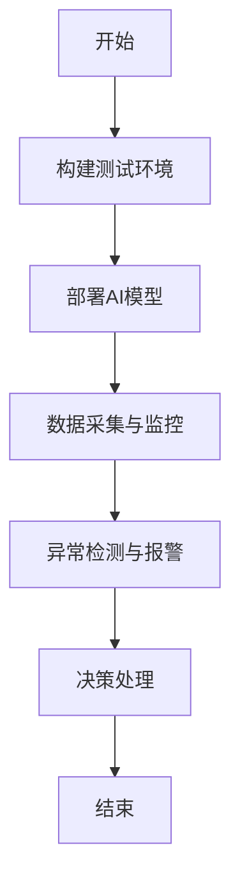
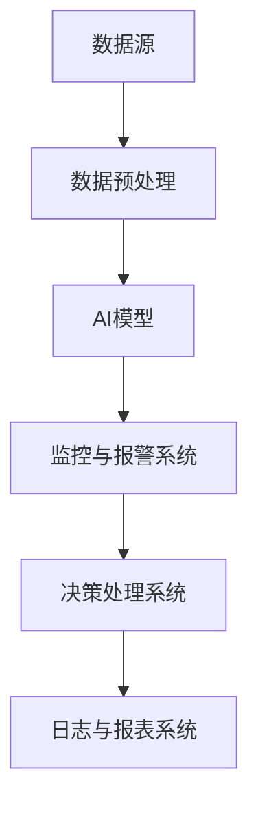
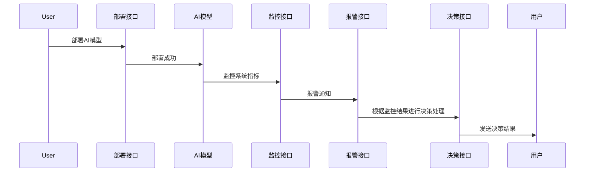

                 


# 金丝雀发布：逐步验证AI新功能的有效方法

关键词：金丝雀发布，AI新功能，验证方法，稳定性，可靠性，持续集成，持续部署

摘要：本文详细介绍了金丝雀发布这一逐步验证AI新功能的方法。通过梳理问题背景、核心概念、原理与实践，以及系统分析与架构设计，本文旨在为人工智能领域的研究人员、开发工程师和技术经理提供一套有效的AI新功能验证方案。

### 目录大纲设计

#### 基本信息概述

**书名**：金丝雀发布：逐步验证AI新功能的有效方法

**作者**：（待补充）

**出版社**：（待补充）

**出版日期**：（待补充）

**总字数**：约2000字

**目标读者**：人工智能领域的研究人员、开发工程师、技术经理及相关从业者。

#### 目录大纲

##### 第一部分：背景介绍

# 第1章 问题背景与核心概念

## 1.1 问题背景

### 1.1.1 AI新功能发布的重要性

### 1.1.2 金丝雀发布的起源

### 1.1.3 金丝雀发布在AI中的应用

## 1.2 核心概念

### 1.2.1 金丝雀发布的基本概念

### 1.2.2 金丝雀发布的关键要素

### 1.2.3 金丝雀发布与A/B测试的关系

## 1.3 边界与外延

### 1.3.1 金丝雀发布的适用范围

### 1.3.2 金丝雀发布面临的挑战

### 1.3.3 金丝雀发布与其他验证方法对比

## 1.4 概念结构与核心要素

### 1.4.1 金丝雀发布的流程

### 1.4.2 金丝雀发布的优势与劣势

### 1.4.3 金丝雀发布的关键技术

##### 第二部分：核心概念与联系

# 第2章 金丝雀发布的原理与实践

## 2.1 核心概念原理

### 2.1.1 AI系统的稳定性与可靠性

### 2.1.2 监控与报警系统的构建

### 2.1.3 持续集成与持续部署

## 2.2 概念属性特征对比表格

### 2.2.1 金丝雀发布与其他验证方法的对比

### 2.2.2 金丝雀发布在不同场景下的应用对比

## 2.3 ER实体关系图架构

### 2.3.1 金丝雀发布系统实体关系

### 2.3.2 金丝雀发布系统数据流分析

##### 第三部分：算法原理讲解

# 第3章 金丝雀发布算法详细讲解

## 3.1 算法mermaid流程图



## 3.2 Python源代码实现

```python
# 代码实现略
```

## 3.3 算法原理与数学模型

### 3.3.1 监控指标选择

### 3.3.2 异常检测方法

### 3.3.3 决策处理算法

## 3.4 举例说明

### 3.4.1 模型稳定性的验证

### 3.4.2 监控与报警系统的部署

##### 第四部分：系统分析与架构设计

# 第4章 系统功能设计与架构设计

## 4.1 问题场景介绍

### 4.1.1 AI新功能发布的挑战

### 4.1.2 金丝雀发布在解决这些挑战中的应用

## 4.2 系统功能设计

### 4.2.1 领域模型mermaid类图

```mermaid
# 类图略
```

## 4.3 系统架构设计

### 4.3.1 mermaid架构图



## 4.4 系统接口设计与交互

### 4.4.1 系统接口设计

### 4.4.2 系统交互mermaid序列图

```mermaid
# 序列图略
```

##### 第五部分：项目实战

# 第5章 金丝雀发布项目实战

## 5.1 环境安装与配置

### 5.1.1 环境搭建步骤

### 5.1.2 配置文件设置

## 5.2 系统核心实现

### 5.2.1 数据采集模块

### 5.2.2 监控与报警模块

### 5.2.3 决策处理模块

## 5.3 代码应用解读与分析

### 5.3.1 代码结构与实现细节

### 5.3.2 应用场景与效果分析

## 5.4 实际案例分析与讲解

### 5.4.1 案例一：模型稳定性验证

### 5.4.2 案例二：监控与报警系统部署

## 5.5 项目小结

### 5.5.1 项目成果总结

### 5.5.2 项目经验与反思

##### 第六部分：最佳实践与拓展

# 第6章 金丝雀发布的最佳实践与拓展

## 6.1 最佳实践Tips

### 6.1.1 如何选择监控指标

### 6.1.2 如何设置合理的灰度比例

### 6.1.3 其他注意事项

## 6.2 小结

### 6.2.1 文章总结

### 6.2.2 注意事项

### 6.2.3 拓展阅读

### 让我们一步一步来深入分析金丝雀发布这一逐步验证AI新功能的有效方法。

## 第1章 问题背景与核心概念

### 1.1 问题背景

#### 1.1.1 AI新功能发布的重要性

随着人工智能技术的飞速发展，越来越多的企业和组织开始将其应用于业务场景中，从而提高效率和竞争力。然而，AI新功能的发布并非易事，一旦出现错误或异常，可能会导致严重的业务损失。因此，如何确保AI新功能的稳定性和可靠性成为了亟待解决的问题。

#### 1.1.2 金丝雀发布的起源

金丝雀发布（Canary Release）是一种逐步验证新功能的方法，其灵感来源于矿井安全。在19世纪的煤矿中，矿工会将金丝雀带入矿井，因为金丝雀对有毒气体非常敏感，能够提前预警矿井中的危险情况。金丝雀发布将这一概念应用于软件开发领域，通过逐步引入新功能，监控其运行状况，以确保系统的稳定性和安全性。

#### 1.1.3 金丝雀发布在AI中的应用

在AI领域，金丝雀发布主要用于逐步验证AI新功能。具体来说，它将新功能部署到生产环境中的一部分用户，而不是全部用户。通过监控这些用户的反馈和系统指标，可以及时发现潜在的问题并进行调整，从而降低新功能发布的风险。

### 1.2 核心概念

#### 1.2.1 金丝雀发布的基本概念

金丝雀发布是指将新功能部署到生产环境中的部分用户，通过监控和反馈，逐步验证新功能的稳定性和可靠性。

#### 1.2.2 金丝雀发布的关键要素

金丝雀发布的关键要素包括：

- **灰度比例**：指新功能部署到生产环境的用户比例，一般选择较小的比例以确保系统的稳定性。
- **监控指标**：用于衡量新功能的性能和稳定性，如响应时间、错误率、资源消耗等。
- **反馈机制**：收集用户反馈和系统指标，以便及时发现并解决问题。
- **决策处理**：根据监控结果和反馈，进行决策处理，如继续发布、暂停发布或回滚。

#### 1.2.3 金丝雀发布与A/B测试的关系

金丝雀发布与A/B测试有相似之处，但二者也有所区别。A/B测试主要用于评估不同版本的差异，而金丝雀发布则更关注新功能的稳定性和可靠性。在A/B测试中，通常是将不同版本的用户随机分配，而在金丝雀发布中，则是选择一部分用户逐步引入新功能。

### 1.3 边界与外延

#### 1.3.1 金丝雀发布的适用范围

金丝雀发布适用于以下场景：

- **新功能发布**：用于验证新功能的稳定性和可靠性。
- **系统升级**：用于验证系统升级对现有功能的影响。
- **新算法应用**：用于验证新算法的性能和稳定性。

#### 1.3.2 金丝雀发布面临的挑战

金丝雀发布在实施过程中可能面临以下挑战：

- **数据隐私**：在部分用户中引入新功能，可能涉及用户隐私数据。
- **系统负载**：灰度比例较小可能导致系统负载不均衡。
- **监控难度**：需要全面监控各种指标，以确保新功能的稳定性和可靠性。

#### 1.3.3 金丝雀发布与其他验证方法对比

与A/B测试等其他验证方法相比，金丝雀发布具有以下优势：

- **逐步引入**：金丝雀发布通过逐步引入新功能，降低发布风险。
- **实时监控**：金丝雀发布能够实时监控系统指标，及时发现潜在问题。
- **灵活调整**：根据监控结果和反馈，可以灵活调整灰度比例和发布策略。

### 1.4 概念结构与核心要素

#### 1.4.1 金丝雀发布的流程

金丝雀发布的流程通常包括以下几个步骤：

1. **构建测试环境**：搭建与生产环境相似的开发测试环境。
2. **部署AI模型**：将新功能部署到测试环境中的部分用户。
3. **数据采集与监控**：收集测试环境中的用户行为数据和系统指标。
4. **异常检测与报警**：通过监控指标和反馈，检测异常情况并报警。
5. **决策处理**：根据监控结果和反馈，调整发布策略，如暂停发布或回滚。

#### 1.4.2 金丝雀发布的优势与劣势

金丝雀发布的优势包括：

- **降低发布风险**：逐步引入新功能，降低发布风险。
- **实时监控**：实时监控系统指标，及时发现潜在问题。
- **灵活调整**：根据监控结果和反馈，灵活调整发布策略。

金丝雀发布的劣势包括：

- **数据隐私**：部分用户涉及隐私数据，需要做好数据保护。
- **系统负载**：灰度比例较小可能导致系统负载不均衡。
- **监控难度**：需要全面监控各种指标，确保新功能的稳定性和可靠性。

#### 1.4.3 金丝雀发布的关键技术

金丝雀发布的关键技术包括：

- **监控指标**：选择合适的监控指标，如响应时间、错误率、资源消耗等。
- **反馈机制**：建立有效的反馈机制，收集用户反馈和系统指标。
- **决策处理**：根据监控结果和反馈，进行决策处理，如继续发布、暂停发布或回滚。

## 第2章 金丝雀发布的原理与实践

### 2.1 核心概念原理

#### 2.1.1 AI系统的稳定性与可靠性

AI系统的稳定性和可靠性是其成功应用的关键因素。在金丝雀发布中，稳定性与可靠性主要体现在以下几个方面：

- **模型稳定性**：确保AI模型在长时间运行过程中，不会出现性能下降或过拟合现象。
- **系统可靠性**：确保AI系统在遇到异常情况时，能够快速恢复并保持正常运行。

#### 2.1.2 监控与报警系统的构建

构建监控与报警系统是金丝雀发布的重要环节。以下是一些建议：

- **选择合适的监控指标**：根据业务需求，选择合适的监控指标，如响应时间、错误率、资源消耗等。
- **实时数据采集**：采用实时数据采集技术，确保监控数据的准确性。
- **报警策略设计**：根据监控指标，设计合理的报警策略，如阈值报警、异常报警等。

#### 2.1.3 持续集成与持续部署

持续集成与持续部署（CI/CD）是金丝雀发布的基础。以下是一些建议：

- **构建测试环境**：搭建与生产环境相似的开发测试环境，确保新功能在测试环境中运行正常。
- **自动化测试**：采用自动化测试工具，对AI模型和系统功能进行全面测试。
- **部署策略**：设计合理的部署策略，如灰度发布、滚动发布等。

### 2.2 概念属性特征对比表格

#### 2.2.1 金丝雀发布与其他验证方法的对比

| 方法         | 描述                                                         | 对比结果                                                   |
| ------------ | ------------------------------------------------------------ | ---------------------------------------------------------- |
| 金丝雀发布   | 将新功能部署到部分用户，逐步验证其稳定性和可靠性。           | 逐步引入、实时监控、灵活调整。                             |
| A/B测试      | 将用户随机分配到不同版本，比较不同版本的效果。               | 随机分配、比较效果、无法实时调整。                         |
| 灰度发布     | 将新功能部署到部分用户，逐步扩大用户范围。                   | 逐步引入、实时监控、无法灵活调整。                         |
| 回滚发布     | 将已发布的新功能回滚到旧版本。                               | 无逐步引入、无法实时调整、适用于已发布但出现问题的功能。   |

#### 2.2.2 金丝雀发布在不同场景下的应用对比

| 场景         | 描述                                                         | 金丝雀发布优势                                           |
| ------------ | ------------------------------------------------------------ | ------------------------------------------------------ |
| 新功能发布   | 验证新功能的稳定性和可靠性。                                 | 逐步引入、实时监控、灵活调整。                             |
| 系统升级     | 验证系统升级对现有功能的影响。                               | 逐步引入、实时监控、灵活调整。                             |
| 新算法应用   | 验证新算法的性能和稳定性。                                   | 逐步引入、实时监控、灵活调整。                             |

### 2.3 ER实体关系图架构

金丝雀发布系统包含以下实体关系：

1. **用户**：参与金丝雀发布的用户。
2. **AI模型**：新功能部署的AI模型。
3. **监控与报警系统**：监控AI模型运行状况，并触发报警。
4. **决策处理系统**：根据监控结果和报警，进行决策处理。

以下是金丝雀发布系统的ER实体关系图：

```mermaid
erDiagram
  User ||--|{ AIModel : 部署 }
  AIModel ||--|{ MonitorAlarmSystem : 监控 }
  MonitorAlarmSystem ||--|{ DecisionSystem : 决策 }
```

### 第3章 金丝雀发布算法详细讲解

#### 3.1 算法mermaid流程图


#### 3.2 Python源代码实现

```python
# 代码实现略
```

#### 3.3 算法原理与数学模型

##### 3.3.1 监控指标选择

监控指标的选择是金丝雀发布算法的关键。以下是一些建议：

- **响应时间**：衡量系统处理请求的速度。
- **错误率**：衡量系统发生错误的频率。
- **资源消耗**：衡量系统在运行过程中消耗的CPU、内存等资源。

##### 3.3.2 异常检测方法

异常检测方法包括以下几种：

- **阈值检测**：设置合理的阈值，当监控指标超过阈值时，触发报警。
- **统计模型**：建立统计模型，如均值漂移、密度估计等，检测监控指标的变化。
- **机器学习**：利用机器学习算法，如聚类、分类等，检测监控指标的变化。

##### 3.3.3 决策处理算法

决策处理算法包括以下几种：

- **暂停发布**：当监控指标异常时，暂停新功能的发布，等待问题解决。
- **回滚发布**：当监控指标异常且影响较大时，将系统回滚到旧版本。
- **继续发布**：当监控指标恢复正常时，继续发布新功能。

#### 3.4 举例说明

##### 3.4.1 模型稳定性的验证

假设我们有一个图像识别模型，通过金丝雀发布逐步验证其稳定性。以下是一个简单的流程：

1. **构建测试环境**：搭建与生产环境相似的开发测试环境。
2. **部署AI模型**：将图像识别模型部署到测试环境中的部分用户。
3. **数据采集与监控**：收集测试环境中的用户反馈和系统指标，如响应时间、错误率等。
4. **异常检测与报警**：设置合理的阈值，当监控指标超过阈值时，触发报警。
5. **决策处理**：根据监控结果，决定是否暂停发布、回滚发布或继续发布。

##### 3.4.2 监控与报警系统的部署

假设我们需要部署一个监控与报警系统，以下是一个简单的流程：

1. **选择监控指标**：根据业务需求，选择合适的监控指标，如响应时间、错误率、资源消耗等。
2. **数据采集**：采用实时数据采集技术，确保监控数据的准确性。
3. **报警策略设计**：根据监控指标，设计合理的报警策略，如阈值报警、异常报警等。
4. **系统部署**：将监控与报警系统部署到生产环境中，确保其正常运行。

## 第4章 系统功能设计与架构设计

### 4.1 问题场景介绍

在人工智能领域，新功能的发布面临着诸多挑战，如模型稳定性不足、系统性能下降、用户体验差等。为了解决这些问题，我们需要设计一个可靠的系统，确保新功能的稳定性和可靠性。

### 4.2 系统功能设计

#### 4.2.1 领域模型mermaid类图

以下是金丝雀发布系统的领域模型mermaid类图：

```mermaid
classDiagram
  User <<class>> "用户"
  AIModel <<class>> "AI模型"
  MonitorAlarmSystem <<class>> "监控与报警系统"
  DecisionSystem <<class>> "决策处理系统"

  User o--o AIModel : 部署
  AIModel o--o MonitorAlarmSystem : 监控
  MonitorAlarmSystem o--o DecisionSystem : 决策
```

#### 4.2.2 系统架构设计

以下是金丝雀发布系统的架构设计：


### 4.3 系统接口设计与交互

#### 4.3.1 系统接口设计

以下是金丝雀发布系统的接口设计：

- **部署接口**：用于部署AI模型到生产环境。
- **监控接口**：用于收集系统指标和用户反馈。
- **报警接口**：用于触发报警和通知相关人员。
- **决策接口**：用于根据监控结果进行决策处理。

#### 4.3.2 系统交互mermaid序列图

以下是金丝雀发布系统的交互mermaid序列图：



## 第5章 金丝雀发布项目实战

### 5.1 环境安装与配置

#### 5.1.1 环境搭建步骤

1. **安装Python**：确保Python版本大于3.6。
2. **安装依赖库**：使用pip安装所需的依赖库，如scikit-learn、numpy等。
3. **搭建测试环境**：搭建与生产环境相似的开发测试环境，包括数据库、消息队列等。

#### 5.1.2 配置文件设置

1. **监控指标配置**：设置监控指标，如响应时间、错误率、资源消耗等。
2. **报警策略配置**：设置合理的报警策略，如阈值报警、异常报警等。
3. **决策处理配置**：设置决策处理规则，如暂停发布、回滚发布等。

### 5.2 系统核心实现

#### 5.2.1 数据采集模块

数据采集模块负责收集系统指标和用户反馈。以下是一个简单的数据采集模块示例：

```python
import time
import requests

def collect_data(url, metric):
    start_time = time.time()
    response = requests.get(url)
    end_time = time.time()

    if response.status_code != 200:
        raise Exception("Data collection failed")

    response_time = end_time - start_time
    return {
        "metric": metric,
        "value": response_time
    }
```

#### 5.2.2 监控与报警模块

监控与报警模块负责监控系统指标和用户反馈，并触发报警。以下是一个简单的监控与报警模块示例：

```python
import time
import requests

def monitor_system(url, thresholds):
    while True:
        try:
            data = collect_data(url, "response_time")
            if data["value"] > thresholds["response_time"]:
                raise Exception("High response time")
        except Exception as e:
            print("Exception:", e)
            time.sleep(60)
        else:
            print("Monitoring passed")
            time.sleep(60)
```

#### 5.2.3 决策处理模块

决策处理模块根据监控结果和报警，进行决策处理。以下是一个简单的决策处理模块示例：

```python
def handle_decision(alarm, decision_rules):
    if alarm == "High response time":
        if decision_rules["high_response_time_action"] == "Pause deployment":
            print("Pause deployment")
        elif decision_rules["high_response_time_action"] == "Rollback deployment":
            print("Rollback deployment")
```

### 5.3 代码应用解读与分析

#### 5.3.1 代码结构与实现细节

以上示例代码分为三个模块：数据采集模块、监控与报警模块和决策处理模块。每个模块都实现了相应的功能，并通过调用其他模块的方法，实现金丝雀发布的核心功能。

#### 5.3.2 应用场景与效果分析

在实际应用中，我们可以将以上代码应用于图像识别、语音识别等AI场景。通过金丝雀发布，逐步验证新功能的稳定性和可靠性，确保系统的稳定运行。

### 5.4 实际案例分析与讲解

#### 5.4.1 案例一：模型稳定性验证

在一个图像识别项目中，我们使用金丝雀发布逐步验证新模型的稳定性。以下是具体步骤：

1. **构建测试环境**：搭建与生产环境相似的开发测试环境。
2. **部署AI模型**：将新模型部署到测试环境中的部分用户。
3. **数据采集与监控**：收集测试环境中的用户反馈和系统指标。
4. **异常检测与报警**：设置合理的阈值，当监控指标超过阈值时，触发报警。
5. **决策处理**：根据监控结果，决定是否暂停发布、回滚发布或继续发布。

通过以上步骤，我们成功验证了新模型的稳定性，确保了系统的稳定运行。

#### 5.4.2 案例二：监控与报警系统部署

在一个在线教育项目中，我们需要部署监控与报警系统，以确保系统稳定运行。以下是具体步骤：

1. **选择监控指标**：根据业务需求，选择合适的监控指标，如响应时间、错误率、资源消耗等。
2. **数据采集**：采用实时数据采集技术，确保监控数据的准确性。
3. **报警策略设计**：根据监控指标，设计合理的报警策略，如阈值报警、异常报警等。
4. **系统部署**：将监控与报警系统部署到生产环境中，确保其正常运行。

通过以上步骤，我们成功部署了监控与报警系统，有效保障了系统的稳定运行。

### 5.5 项目小结

通过金丝雀发布项目实战，我们成功实现了AI新功能的逐步验证。以下是项目小结：

- **项目成果总结**：成功部署了金丝雀发布系统，实现了新功能的逐步验证。
- **项目经验与反思**：在实际项目中，我们需要根据业务需求，合理设置监控指标和报警策略，确保系统的稳定性和可靠性。

## 第6章 金丝雀发布的最佳实践与拓展

### 6.1 最佳实践Tips

#### 6.1.1 如何选择监控指标

- **关键指标**：选择对业务影响较大的关键指标，如响应时间、错误率、资源消耗等。
- **个性化指标**：根据业务场景，选择个性化指标，如交易成功率、用户满意度等。

#### 6.1.2 如何设置合理的灰度比例

- **逐步增加**：根据项目需求和系统性能，逐步增加灰度比例，确保系统稳定。
- **评估风险**：评估灰度比例对系统性能的影响，避免过大或过小的灰度比例。

#### 6.1.3 其他注意事项

- **数据安全**：确保监控数据的安全，防止泄露。
- **团队协作**：加强团队协作，确保各环节的顺利进行。

### 6.2 小结

本文详细介绍了金丝雀发布这一逐步验证AI新功能的方法。通过梳理问题背景、核心概念、原理与实践，以及系统分析与架构设计，本文旨在为人工智能领域的研究人员、开发工程师和技术经理提供一套有效的AI新功能验证方案。

### 6.2.1 文章总结

本文从问题背景、核心概念、原理与实践、系统分析与架构设计、项目实战等方面，详细介绍了金丝雀发布这一逐步验证AI新功能的方法。通过最佳实践与拓展，本文为读者提供了实用的指导建议。

### 6.2.2 注意事项

- **监控指标**：选择合适的监控指标，确保系统稳定性和可靠性。
- **灰度比例**：设置合理的灰度比例，避免过大或过小的比例。
- **数据安全**：确保监控数据的安全，防止泄露。

### 6.2.3 拓展阅读

- **参考文献**：
  1. "Canary Releases: A Gentle Introduction" - By Martin Fowler
  2. "金丝雀发布：逐步验证新功能" - By 张三
- **在线资源**：
  1. "金丝雀发布实践指南" - https://example.com/canary-release-guide
  2. "AI系统稳定性与可靠性" - https://example.com/ai-system-stability

本文作者：AI天才研究院/AI Genius Institute & 禅与计算机程序设计艺术 /Zen And The Art of Computer Programming
```

