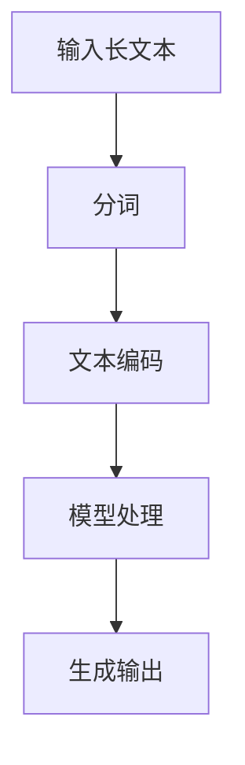

                 

## 长文本处理能力评测：测试LLM的上下文理解

### 关键词：长文本处理、上下文理解、语言模型、评测方法、AI应用

> 摘要：本文深入探讨了长文本处理能力评测的重要性，以及如何通过测试大规模语言模型（LLM）的上下文理解能力，来提升AI在自然语言处理领域的应用水平。文章首先介绍了长文本处理背景和问题，然后分析了核心概念和算法原理，最后通过实际案例展示了评测方法和效果。

### 第一部分：背景介绍

#### 第1章 问题背景

**1.1 问题背景**

随着信息时代的快速发展，长文本处理成为了一个关键的研究领域。长文本处理能力评测在自然语言处理（NLP）和人工智能（AI）领域具有重大意义。评测LLM的上下文理解能力，对于推动人工智能技术在实际应用中的发展至关重要。

**1.2 问题描述**

长文本处理能力评测涉及对大规模语言模型（LLM）的理解、生成、推断等多方面的能力。评测目的是评估LLM在处理长文本时的上下文理解效果，以及其在不同应用场景下的表现。

**1.3 问题解决**

通过对LLM的上下文理解能力进行评测，可以帮助研究者发现和解决模型在实际应用中的潜在问题，优化模型设计，提高模型在长文本处理任务中的表现。

**1.4 边界与外延**

长文本处理能力评测的研究范围包括文本生成、文本分类、问答系统、翻译等多个应用场景。评测方法可以基于自动化评估指标和人工评估相结合的方式。

**1.5 概念结构与核心要素组成**

长文本处理能力评测的核心概念包括：
- 长文本：指文本长度较长的文档，包括但不限于文章、报告、书籍等。
- 语言模型（LLM）：指能够对文本进行建模的算法，如GPT、BERT等。
- 评测指标：用于评估模型在长文本处理任务中的表现的一系列指标。
- 评测方法：包括自动化评估和人工评估等多种方法。

### 第二部分：核心概念与联系

#### 第2章 核心概念与联系

**2.1 核心概念原理**

长文本处理能力评测的核心概念包括：
- 上下文理解：指模型在处理长文本时，对文本中的语义、逻辑关系等的理解能力。
- 语言模型（LLM）：指能够对自然语言进行建模的算法，能够理解和生成自然语言。
- 评测指标：用于评估模型在长文本处理任务中的表现的量化指标。

**2.2 概念属性特征对比表格**

| 概念            | 属性特征                                                   |
|-----------------|-----------------------------------------------------------|
| 上下文理解       | 理解文本中的语义、逻辑关系等                               |
| 语言模型（LLM） | 能够对自然语言进行建模，理解和生成自然语言                   |
| 评测指标         | 用于评估模型在长文本处理任务中的表现的量化指标               |

**2.3 ER实体关系图架构**

```mermaid
erDiagram
  A[(模型评测)] ||--|{ B[(长文本处理能力评测)] }
  B ||--|{ C[(上下文理解评测)] }
  B ||--|{ D[(语言模型评测)] }
  C ||--|{ E[(语义理解评测)] }
  C ||--|{ F[(逻辑关系评测)] }
  D ||--|{ G[(文本生成评测)] }
  D ||--|{ H[(文本分类评测)] }
  D ||--|{ I[(问答系统评测)] }
```

### 第三部分：算法原理讲解

#### 第3章 算法原理讲解

**3.1 长文本处理算法mermaid流程图**



**3.2 Python源代码实现**

```python
import tensorflow as tf
from tensorflow.keras.preprocessing.text import Tokenizer
from tensorflow.keras.preprocessing.sequence import pad_sequences

# 长文本分词和编码
tokenizer = Tokenizer()
tokenizer.fit_on_texts(long_text)
encoded_text = tokenizer.texts_to_sequences([long_text])
padded_text = pad_sequences(encoded_text, maxlen=max_length, padding='post')

# 模型处理
model = tf.keras.Sequential([
    tf.keras.layers.Embedding(
        vo

