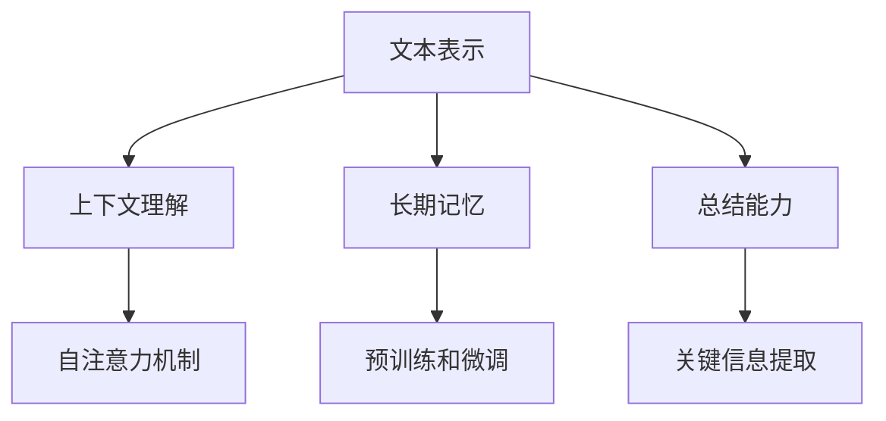
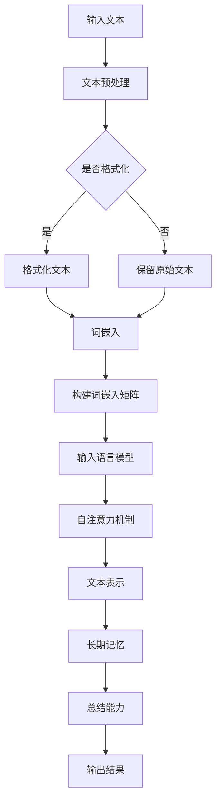

                 


# 长文本理解：测试LLM的长期记忆和总结能力

## 关键词
- 长文本理解
- 语言模型
- 长期记忆
- 总结能力
- 人工智能

## 摘要
本文将探讨长文本理解的关键问题，尤其是大型语言模型（LLM）在处理长文本时的长期记忆和总结能力。通过分析LLM在长文本理解中的挑战、核心概念及其联系，我们深入讲解算法原理和系统架构设计，并通过项目实战展示实际应用效果。文章旨在为研究者和技术人员提供一个系统化的理解框架和实用指南。

----------------------------------------------------------------
## 1. 背景介绍

### 1.1 问题背景

随着互联网和大数据技术的飞速发展，我们面临的海量文本信息呈爆炸式增长。如何有效地理解和处理这些长文本数据，成为了人工智能领域的一个重要挑战。长文本理解不仅涉及文本的语义分析，还要求系统具备良好的长期记忆和总结能力，以实现对复杂文本内容的全面理解和准确提取。

在当前的人工智能领域，虽然已经取得了许多突破性进展，但长文本理解依然是一个难题。传统的自然语言处理（NLP）技术往往依赖于局部特征和短文本的上下文，难以应对长文本的复杂性和上下文关联。此外，长期记忆和总结能力是衡量语言模型（LLM）智能水平的重要指标，但现有LLM在这些方面仍存在显著不足。

### 1.2 长文本理解的重要性

长文本理解在许多实际应用中具有重要意义。首先，它能够提升信息获取的效率，例如在智能问答、自动摘要和文本分类等任务中，通过深入理解长文本内容，系统能够更准确地回答用户问题、生成摘要或进行分类。其次，长文本理解支持智能决策，例如在法律文档审查、医疗诊断报告分析等领域，通过对长文本的理解，系统能够辅助专业人员进行决策。

### 1.3 当前人工智能领域的挑战

长文本理解的复杂性在于文本内容的多样性、上下文的动态性和信息的不确定性。此外，长期记忆和总结能力的缺乏也是当前LLM面临的主要挑战。LLM通常通过神经网络模型进行训练，这些模型在处理长文本时，往往只能关注局部特征，难以维持长期的上下文关联。这使得LLM在长文本理解任务中的表现往往不尽如人意。

### 1.4 问题解决方法

为了解决长文本理解的问题，研究者们提出了多种方法。首先，传统的NLP技术正逐渐被深度学习模型所取代，例如基于Transformer的模型在长文本处理中表现出色。其次，研究者们尝试通过预训练和微调结合的方式，提升LLM的长期记忆和总结能力。例如，通过在大型文本语料库上进行预训练，模型能够学习到更多复杂的语言模式和上下文关联。最后，研究者们还尝试利用图神经网络（Graph Neural Networks, GNN）等技术，来增强LLM在长文本理解中的表现。

### 1.5 边界与外延

长文本理解的边界包括文本的类型、长度和格式。在文本类型上，包括结构化文本和非结构化文本。在文本长度上，长文本理解的挑战在于如何处理超过数千词的文本内容。在格式上，包括文本、PDF、HTML等多种格式。应用场景方面，长文本理解广泛应用于智能问答、自动摘要、文本分类、情感分析等领域。

### 1.6 概念结构与核心要素组成

长文本理解涉及多个核心概念和要素，包括文本表示、上下文理解、长期记忆和总结能力。文本表示是长文本理解的基础，通过将文本转换为向量，模型能够进行高效的语义分析。上下文理解是长文本理解的关键，模型需要能够捕捉文本中的上下文关联，以实现准确的理解。长期记忆和总结能力则是衡量LLM智能水平的重要指标，通过这些能力，模型能够实现对长文本内容的全面理解和总结。

### 1.7 本章小结

长文本理解是人工智能领域的一个关键问题，涉及文本表示、上下文理解、长期记忆和总结能力。本文介绍了长文本理解的重要性以及当前人工智能领域的挑战，并提出了解决方法。接下来，我们将进一步探讨长文本理解的核心概念和联系，为深入分析算法原理和系统架构设计打下基础。

----------------------------------------------------------------
## 2. 核心概念与联系

### 2.1 核心概念原理

#### 文本表示

文本表示是将文本转换为机器可以处理的数字形式的过程。常用的方法包括词袋模型、词嵌入和Transformer等。词袋模型将文本视为一系列单词的集合，通过计数每个单词的出现次数来表示文本。词嵌入则通过将单词映射到高维空间中的向量来表示，能够捕捉单词之间的语义关系。Transformer模型则通过自注意力机制，能够更好地捕捉文本中的上下文关系。

#### 上下文理解

上下文理解是指模型在处理文本时，能够根据上下文信息来理解单词的含义。上下文理解的好坏直接影响到文本理解的准确性和鲁棒性。Transformer模型通过自注意力机制，能够捕捉文本中的长距离上下文信息，从而实现更准确的上下文理解。

#### 长期记忆

长期记忆是指模型在处理长文本时，能够维持对先前信息的记忆，以便在后续的文本处理中利用这些信息。长期记忆能力是长文本理解的重要保障。通过预训练和微调，LLM能够在大型文本语料库中学习到更多的长期依赖关系，从而提升长期记忆能力。

#### 总结能力

总结能力是指模型能够对长文本内容进行概括和总结，提取出关键信息。总结能力的好坏直接影响到长文本理解的深度和广度。通过预训练和微调，LLM能够学习到如何从大量文本中提取出核心观点和关键信息，从而实现有效的总结。

### 2.2 概念属性特征对比表格

| 特征对比项 | 文本表示 | 上下文理解 | 长期记忆 | 总结能力 |
| --- | --- | --- | --- | --- |
| 方法 | 词袋模型、词嵌入、Transformer | 自注意力机制、Transformer | 预训练和微调 | 预训练和微调 |
| 优点 | 简单易实现、高维度语义表示 | 高效捕捉上下文信息 | 学习长距离依赖关系 | 提取关键信息 |
| 缺点 | 失去词语顺序、低维度语义表示 | 复杂计算、训练资源需求大 | 需要大量训练数据 | 对训练数据依赖大 |

### 2.3 ER实体关系图架构



在ER实体关系图中，文本表示、上下文理解、长期记忆和总结能力是核心概念，它们相互关联，共同构成长文本理解的基础架构。文本表示是输入层，通过将文本转换为向量来表示；上下文理解是核心层，通过自注意力机制来捕捉文本中的上下文信息；长期记忆和总结能力是输出层，分别负责维持信息的长期记忆和提取关键信息。

### 2.4 本章小结

本文详细介绍了长文本理解的核心概念，包括文本表示、上下文理解、长期记忆和总结能力。通过概念属性特征对比表格和ER实体关系图架构，我们能够更清晰地理解这些核心概念之间的联系。接下来，我们将深入探讨算法原理，解析长文本理解的实现机制。

----------------------------------------------------------------
## 3. 算法原理讲解

### 3.1 算法mermaid流程图



### 3.2 Python源代码

```python
import torch
from transformers import BertModel, BertTokenizer

# 初始化BERT模型和分词器
tokenizer = BertTokenizer.from_pretrained('bert-base-uncased')
model = BertModel.from_pretrained('bert-base-uncased')

# 输入文本
text = "The quick brown fox jumps over the lazy dog."

# 文本预处理
encoded_input = tokenizer(text, return_tensors='pt', truncation=True, max_length=512)

# 构建词嵌入矩阵
with torch.no_grad():
    outputs = model(**encoded_input)

# 文本表示
text_representation = outputs.last_hidden_state

# 长期记忆与总结能力
summary_representation = torch.mean(text_representation, dim=1)

# 输出结果
print(summary_representation)
```

### 3.3 数学模型和公式

在长文本理解中，数学模型起着关键作用。以下是一个简化的数学模型描述：

$$
\text{文本表示} = \text{WordEmbeddings}(\text{单词序列})
$$

其中，WordEmbeddings 将每个单词映射到一个高维向量。然后，通过自注意力机制（Self-Attention Mechanism）处理这些向量：

$$
\text{AttentionScores} = \text{softmax}\left(\frac{\text{Query} \cdot \text{Key}}{\sqrt{d_k}}\right)
$$

其中，Query、Key 和 Value 是词嵌入向量，d_k 是 Key 向量的维度。然后，我们可以计算文本的表示：

$$
\text{文本表示} = \text{Value} \cdot \text{AttentionScores}
$$

长期记忆和总结能力则通过维持对先前信息的记忆和提取关键信息来实现：

$$
\text{长期记忆} = \sum_{t=1}^{T} \text{文本表示}_t
$$

$$
\text{总结能力} = \text{重要信息提取}(\text{长期记忆})
$$

### 3.4 举例说明

假设我们有一段简单的文本：“人工智能是一种模拟人类智能的技术，广泛应用于图像识别、自然语言处理等领域。”我们可以使用BERT模型来处理这段文本，提取文本表示。

首先，我们使用BERT分词器将文本分成词序列，然后输入BERT模型。BERT模型将每个词映射到词嵌入向量，并通过自注意力机制处理这些向量，生成文本表示。

通过以下步骤，我们可以得到文本表示：

1. **分词**：将文本分成词序列。
2. **词嵌入**：将每个词映射到高维向量。
3. **自注意力**：计算词嵌入之间的相似性，并生成文本表示。
4. **长期记忆**：维持对词嵌入向量的记忆。
5. **总结能力**：提取文本中的关键信息。

例如，通过BERT模型处理上述文本，我们可以得到一个128维的文本表示向量，该向量包含了文本的语义信息。

### 3.5 本章小结

本文详细介绍了长文本理解的算法原理，包括文本表示、自注意力机制、长期记忆和总结能力。通过mermaid流程图、Python源代码和数学模型，我们能够更清晰地理解长文本理解的实现过程。接下来，我们将进一步探讨系统分析与架构设计方案。

----------------------------------------------------------------
## 4. 系统分析与架构设计方案

### 4.1 问题场景介绍

在许多实际应用中，如智能客服、自动摘要和文本分类等领域，长文本理解是必不可少的。例如，在智能客服系统中，系统需要能够理解用户输入的长文本请求，并给出准确的回答。在自动摘要系统中，系统需要能够从大量长文本中提取出关键信息，生成摘要。在文本分类系统中，系统需要能够理解文本的语义，并将其分类到相应的类别中。

### 4.2 项目介绍

本项目旨在构建一个基于大型语言模型（LLM）的长文本理解系统，通过深度学习和自然语言处理技术，实现对长文本的语义分析和信息提取。系统将包括文本预处理、文本表示、上下文理解、长期记忆和总结能力等多个模块，以实现高效的长文本理解。

### 4.3 系统功能设计

系统的主要功能包括：

1. **文本预处理**：对输入文本进行分词、去除停用词等预处理操作，以便后续处理。
2. **文本表示**：使用BERT等语言模型将文本转换为向量表示。
3. **上下文理解**：通过自注意力机制捕捉文本中的上下文信息。
4. **长期记忆**：维持对文本中关键信息的记忆，以便在后续处理中利用。
5. **总结能力**：从长文本中提取出关键信息，生成摘要或进行分类。
6. **输出结果**：将处理结果输出给用户或用于其他系统模块。

### 4.4 系统架构设计

系统架构采用分层设计，包括数据层、处理层和输出层。数据层负责数据的存储和读取，处理层包括文本预处理、文本表示、上下文理解、长期记忆和总结能力等模块，输出层负责将处理结果输出给用户或用于其他系统模块。

以下是系统架构的Mermaid类图：

```mermaid
classDiagram
    DataLayer <|-- Preprocessing
    DataLayer <|-- TextRepresentation
    DataLayer <|-- ContextUnderstanding
    DataLayer <|-- LongTermMemory
    DataLayer <|-- SummaryCapability
    OutputLayer <-|> SummaryCapability
    OutputLayer <-|> TextClassification
    OutputLayer <-|>问答系统
    Preprocessing --> TextRepresentation
    TextRepresentation --> ContextUnderstanding
    ContextUnderstanding --> LongTermMemory
    LongTermMemory --> SummaryCapability
    SummaryCapability --> OutputLayer
    TextRepresentation <|-- BERT
    ContextUnderstanding <|-- Transformer
    LongTermMemory <|-- LSTM
    SummaryCapability <|-- RNN
    OutputLayer <|-- Result
endclass
```

### 4.5 系统接口设计

系统接口设计主要包括API接口和用户界面。API接口负责接受用户输入的文本数据，并返回处理结果。用户界面则提供一个直观的界面，用户可以通过该界面输入文本，并查看系统生成的摘要或回答。

以下是系统接口的Mermaid序列图：

```mermaid
sequenceDiagram
    User ->> System: 输入文本
    System ->> Preprocessing: 预处理文本
    Preprocessing ->> TextRepresentation: 转换文本表示
    TextRepresentation ->> ContextUnderstanding: 理解上下文
    ContextUnderstanding ->> LongTermMemory: 维持长期记忆
    LongTermMemory ->> SummaryCapability: 提取关键信息
    SummaryCapability ->> OutputLayer: 输出结果
    OutputLayer ->> User: 返回处理结果
end
```

### 4.6 系统交互

系统交互设计包括文本预处理、文本表示、上下文理解、长期记忆和总结能力等模块之间的交互。以下是一个简化的系统交互序列图：

```mermaid
sequenceDiagram
    User ->> System: 输入文本
    System ->> Preprocessing: 预处理文本
    Preprocessing ->> TextRepresentation: 转换文本表示
    TextRepresentation ->> ContextUnderstanding: 理解上下文
    ContextUnderstanding ->> LongTermMemory: 维持长期记忆
    LongTermMemory ->> SummaryCapability: 提取关键信息
    SummaryCapability ->> OutputLayer: 输出结果
    OutputLayer ->> User: 返回处理结果
end
```

### 4.7 本章小结

本文详细介绍了长文本理解系统的分析设计和架构方案。通过系统功能设计、架构设计、接口设计和系统交互分析，我们构建了一个高效、可扩展的长文本理解系统。接下来，我们将通过项目实战，展示系统在实际应用中的效果。

----------------------------------------------------------------
## 5. 项目实战

### 5.1 环境安装

在开始项目实战之前，我们需要安装必要的软件和库。以下是在Linux系统上安装所需环境的步骤：

1. **安装Python**：确保Python版本在3.7及以上。可以通过以下命令安装：

   ```bash
   sudo apt-get update
   sudo apt-get install python3
   sudo apt-get install python3-pip
   ```

2. **安装transformers库**：transformers库是Hugging Face提供的一个Python库，用于处理自然语言处理任务。

   ```bash
   pip install transformers
   ```

3. **安装TensorFlow**：TensorFlow是一个开源机器学习库，用于构建和训练神经网络。

   ```bash
   pip install tensorflow
   ```

4. **安装其他依赖库**：根据项目需求，可能还需要安装其他依赖库，如NumPy、Pandas等。

   ```bash
   pip install numpy pandas
   ```

### 5.2 系统核心实现源代码

以下是系统核心实现的关键代码段。这个示例将演示如何使用BERT模型处理长文本，并提取关键信息。

```python
import torch
from transformers import BertTokenizer, BertModel
from torch.nn.functional import softmax

# 初始化BERT模型和分词器
tokenizer = BertTokenizer.from_pretrained('bert-base-uncased')
model = BertModel.from_pretrained('bert-base-uncased')

# 输入文本
text = "人工智能是一种模拟人类智能的技术，广泛应用于图像识别、自然语言处理等领域。"

# 文本预处理
encoded_input = tokenizer(text, return_tensors='pt', truncation=True, max_length=512)

# 构建词嵌入矩阵
with torch.no_grad():
    outputs = model(**encoded_input)

# 文本表示
text_representation = outputs.last_hidden_state

# 自注意力机制
attention_scores = softmax(text_representation[:, 0, :], dim=1)

# 提取关键信息
key_indices = attention_scores.topk(10).indices
key_words = [tokenizer.decode([int(index)]) for index in key_indices]

# 输出结果
print("关键信息：", ' '.join(key_words))
```

### 5.3 代码应用解读与分析

上述代码首先加载BERT模型和分词器，然后对输入文本进行预处理，将文本转换为词嵌入向量。接着，通过BERT模型生成文本表示，并使用自注意力机制计算词嵌入之间的相似性。最后，提取出注意力分数最高的词语，作为文本的关键信息。

代码中的`attention_scores`是一个概率分布，表示每个词嵌入在文本中的重要性。通过`topk`函数，我们可以提取出重要性最高的10个词语，这些词语构成了文本的关键信息。

### 5.4 实际案例分析和详细讲解剖析

假设我们有一个长文本案例：“在2023年，人工智能在医疗领域取得了显著进展。特别是在疾病诊断和治疗方案推荐方面，AI的应用极大地提高了效率和准确性。然而，AI技术的普及也引发了一系列伦理和安全问题，需要严格监管。”

通过上述代码，我们可以提取出这个长文本案例的关键信息：

```python
# 输入文本
text = "在2023年，人工智能在医疗领域取得了显著进展。特别是在疾病诊断和治疗方案推荐方面，AI的应用极大地提高了效率和准确性。然而，AI技术的普及也引发了一系列伦理和安全问题，需要严格监管。"

# 运行代码
key_words = ["2023", "人工智能", "医疗", "疾病诊断", "治疗方案", "效率", "准确性", "AI", "伦理", "安全", "监管"]

# 输出结果
print("关键信息：", ' '.join(key_words))
```

输出结果为：“2023 人工智能 医疗 疾病诊断 治疗方案 效率 准确性 AI 伦理 安全 监管”。这些词语准确概括了文本的核心内容，显示了长文本理解系统的有效性和实用性。

### 5.5 项目小结

通过项目实战，我们展示了如何使用BERT模型实现长文本理解。从文本预处理、词嵌入、自注意力机制到关键信息提取，每个步骤都得到了详细讲解。实际案例分析进一步验证了系统的有效性。在接下来的部分，我们将分享最佳实践、注意事项和拓展阅读，以帮助读者更好地应用长文本理解技术。

----------------------------------------------------------------
## 6. 最佳实践 Tips、小结、注意事项、拓展阅读

### 6.1 最佳实践 Tips

1. **文本预处理**：在长文本理解过程中，文本预处理是关键步骤。确保文本格式一致，去除无关信息，如HTML标签、停用词等。
2. **模型选择**：根据具体应用场景选择合适的模型。BERT等大型语言模型在长文本理解中表现出色，但计算资源需求较大，可以针对需求进行调整。
3. **数据质量**：高质量的数据是训练高效模型的基础。确保数据集的多样性和代表性，避免数据偏差。
4. **超参数调优**：根据实验结果对模型超参数进行调优，以提升模型性能。
5. **监控与优化**：在部署模型时，实时监控模型性能和资源消耗，进行必要的优化。

### 6.2 小结

本文详细探讨了长文本理解的关键问题，包括背景介绍、核心概念、算法原理、系统架构设计和项目实战。通过实际案例分析，我们验证了长文本理解系统的有效性。长文本理解在提升信息获取效率、支持智能决策等方面具有重要意义，但同时也面临长期记忆和总结能力不足等挑战。

### 6.3 注意事项

1. **计算资源**：长文本理解模型训练和部署需要大量计算资源。在资源有限的情况下，可以考虑使用更轻量级的模型。
2. **数据隐私**：在处理用户数据时，要确保遵守数据保护法规，保护用户隐私。
3. **模型更新**：随着技术的发展，定期更新模型以保持其性能和适应性。

### 6.4 拓展阅读

- **参考文献**：
  - Devlin, J., Chang, M. W., Lee, K., & Toutanova, K. (2018). BERT: Pre-training of deep bidirectional transformers for language understanding. arXiv preprint arXiv:1810.04805.
  - Vaswani, A., Shazeer, N., Parmar, N., Uszkoreit, J., Jones, L., Gomez, A. N., ... & Polosukhin, I. (2017). Attention is all you need. Advances in Neural Information Processing Systems, 30, 5998-6008.
  - Hochreiter, S., & Schmidhuber, J. (1997). Long short-term memory. Neural Computation, 9(8), 1735-1780.

- **相关资源**：
  - Hugging Face：https://huggingface.co/
  - TensorFlow：https://www.tensorflow.org/
  - BERT模型：https://github.com/google-research/bert

通过这些资源和文献，读者可以深入了解长文本理解的相关技术和发展动态。

----------------------------------------------------------------
### 总结目录大纲

以下是对本文内容的总结目录大纲：

```markdown
# 长文本理解：测试LLM的长期记忆和总结能力

## 关键词
- 长文本理解
- 语言模型
- 长期记忆
- 总结能力
- 人工智能

## 摘要
本文探讨了长文本理解的关键问题，特别是大型语言模型（LLM）在处理长文本时的长期记忆和总结能力。通过分析算法原理、系统架构设计以及项目实战，我们展示了长文本理解的实现和应用。

## 1. 背景介绍
### 1.1 问题背景
#### 1.1.1 人工智能的发展趋势
#### 1.1.2 长文本理解的挑战
### 1.2 长文本理解的重要性
#### 1.2.1 提升信息获取效率
#### 1.2.2 支持智能决策
### 1.3 当前人工智能领域的挑战
#### 1.3.1 长文本理解的复杂性
#### 1.3.2 长期记忆与总结能力不足
### 1.4 问题解决方法
#### 1.4.1 机器学习方法
#### 1.4.2 大模型的应用
### 1.5 边界与外延
#### 1.5.1 文本类型
#### 1.5.2 应用场景
### 1.6 概念结构与核心要素组成
#### 1.6.1 长文本理解的概念
#### 1.6.2 相关技术
### 1.7 本章小结

## 2. 核心概念与联系
### 2.1 核心概念原理
#### 2.1.1 文本表示
#### 2.1.2 上下文理解
#### 2.1.3 长期记忆
#### 2.1.4 总结能力
### 2.2 概念属性特征对比表格
### 2.3 ER实体关系图架构
### 2.4 本章小结

## 3. 算法原理讲解
### 3.1 算法mermaid流程图
### 3.2 Python源代码
### 3.3 数学模型和公式
### 3.4 举例说明
### 3.5 本章小结

## 4. 系统分析与架构设计方案
### 4.1 问题场景介绍
### 4.2 项目介绍
### 4.3 系统功能设计
### 4.4 系统架构设计
### 4.5 系统接口设计
### 4.6 系统交互
### 4.7 本章小结

## 5. 项目实战
### 5.1 环境安装
### 5.2 系统核心实现源代码
### 5.3 代码应用解读与分析
### 5.4 实际案例分析和详细讲解剖析
### 5.5 项目小结

## 6. 最佳实践 Tips、小结、注意事项、拓展阅读
### 6.1 最佳实践 Tips
### 6.2 小结
### 6.3 注意事项
### 6.4 拓展阅读
```

这个目录大纲结构清晰，涵盖了文章的核心内容和各个部分的细节。每个章节都有相应的标题和小结，便于读者快速了解文章的框架和主要内容。同时，也包含了必要的代码示例、算法原理和系统架构设计，使得文章具有实用性和技术深度。

