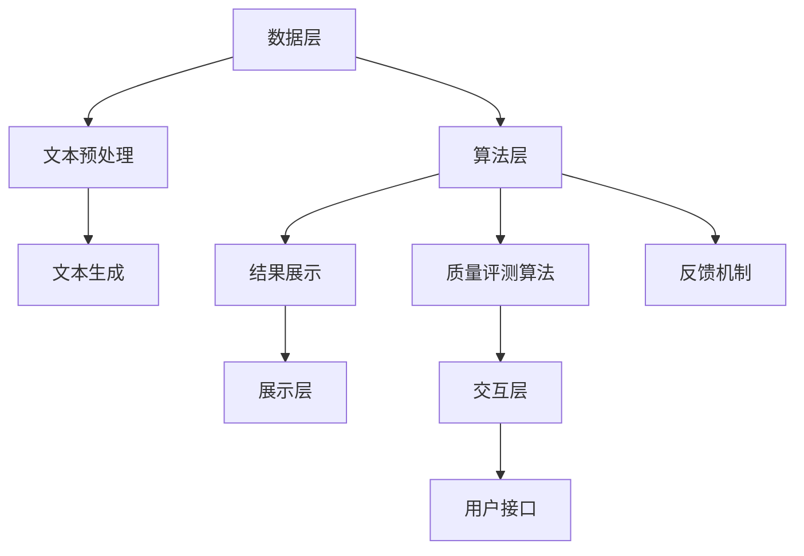

                 

### 文章标题

“长文本生成质量评测：超越简单指标的深度分析”

### 关键词

长文本生成、质量评测、深度学习、评价指标、算法原理、系统架构、项目实战、最佳实践

### 摘要

本文深入探讨了长文本生成质量评测的多个维度，从传统评价指标到现代深度学习方法，全面剖析了如何更准确地评估长文本生成的质量。通过介绍核心概念、分析算法原理、展示系统架构设计，以及实际项目案例，本文旨在为读者提供一份全面且易于理解的技术指南。

## 设计思路

在设计《长文本生成质量评测：超越简单指标的深度分析》的目录大纲时，首先明确了文章的核心内容和目标读者群体。本文旨在深入探讨长文本生成质量的评测方法，不仅限于传统的评价指标，还包括深度分析新方法和实际应用案例。为了达到这一目标，文章的结构将分为以下几个部分：

### 1. **背景介绍**

第一部分将介绍长文本生成质量评测的背景，包括长文本生成的发展历程、应用场景以及质量评测的重要性。这部分将为读者提供一个全面的认识，帮助他们理解后续章节的内容。

### 2. **核心概念与联系**

第二部分将定义关键概念，如长文本生成、质量评测指标、深度学习方法等，并通过对比表格和ER实体关系图展示它们之间的关系。这将帮助读者构建一个清晰的概念框架。

### 3. **算法原理讲解**

第三部分将深入讲解各种质量评测方法，包括传统的和先进的深度学习方法。这部分将使用Mermaid流程图和Python代码示例，详细阐述算法原理和数学模型。

### 4. **系统分析与架构设计**

第四部分将分析长文本生成系统的架构，设计相关系统接口和交互流程，并通过Mermaid类图、架构图和序列图展示系统设计。

### 5. **项目实战**

第五部分将通过一个实际项目案例，展示如何应用上述方法进行质量评测。这部分将提供环境安装指南、系统核心实现源代码，并对代码和应用进行解读和分析。

### 6. **最佳实践与拓展**

最后一部分将总结实战中的经验教训，提供进一步阅读的建议，探讨长文本生成质量评测的未来发展趋势。

### 2. 背景介绍

### 2.1 长文本生成的发展历程

长文本生成（Long Text Generation）技术起源于自然语言处理（NLP）领域，随着深度学习算法的进步，逐渐成为研究和应用的热点。早期的研究主要基于规则和统计模型，如基于模板的方法和基于统计的模型，这些方法在简单任务中表现出色，但在复杂文本生成任务中存在明显局限。

近年来，随着神经网络和生成对抗网络（GAN）等深度学习技术的不断发展，长文本生成技术取得了显著进展。特别是基于转换器（Transformer）架构的模型，如GPT（Generative Pre-trained Transformer）和BERT（Bidirectional Encoder Representations from Transformers），在长文本生成任务中展现了强大的表现能力。这些模型通过大规模预训练，能够自动捕捉语言中的复杂结构和语义信息，从而生成高质量的长文本。

### 2.2 长文本生成的应用场景

长文本生成技术具有广泛的应用场景，主要包括以下几个方面：

1. **自动问答系统**：在问答系统中，长文本生成技术可以用于生成详细的回答，提高用户的查询体验。
2. **内容创作**：如文章写作、故事创作、新闻报道等，长文本生成技术可以自动生成高质量的内容，节省人力成本。
3. **对话系统**：在智能客服、虚拟助手等对话系统中，长文本生成技术可以用于生成自然流畅的对话文本。
4. **机器翻译**：长文本生成技术在机器翻译领域也有所应用，通过生成目标语言的文本，实现跨语言的交流。
5. **摘要生成**：在大量文本数据处理中，长文本生成技术可以用于生成摘要，帮助用户快速获取关键信息。

### 2.3 长文本生成质量评测的重要性

长文本生成质量评测是确保生成文本准确性和可读性的关键环节。一个高质量的长文本生成系统，不仅需要生成内容丰富、结构合理的文本，还需要保证文本的语义连贯性和逻辑性。以下是一些评估长文本生成质量的重要指标：

1. **准确性**：生成文本与原始文本在事实和逻辑上的相符程度。
2. **连贯性**：生成文本中句子与句子之间的逻辑关系和语义衔接。
3. **可读性**：生成文本的语言表达清晰、易于理解。
4. **多样性**：生成文本具有丰富的词汇和句式变化。

有效的质量评测方法可以帮助开发者识别和优化模型中的问题，提高生成文本的质量。随着深度学习技术的发展，传统的质量评测方法逐渐暴露出局限性，因此探索新的深度学习方法成为提高长文本生成质量的重要途径。

### 2.4 问题描述

尽管长文本生成技术取得了显著进展，但质量评测仍然是一个复杂且具有挑战性的问题。当前面临的主要问题包括：

1. **评价指标单一**：传统的质量评测方法主要依赖准确性、连贯性和可读性等单一指标，难以全面反映文本生成的质量。
2. **模型偏差**：深度学习模型在训练过程中可能会引入偏置，导致生成文本的质量不稳定。
3. **评测效率**：大规模质量评测需要大量的计算资源和时间，影响模型优化和迭代的速度。
4. **多样性不足**：生成的文本往往缺乏多样性和创意，难以满足个性化需求。

为了解决上述问题，需要探索更全面、更准确、更高效的深度学习评测方法，以提升长文本生成质量。本文将深入探讨这些方法，并通过实际项目案例验证其有效性。

### 2.5 边界与外延

在讨论长文本生成质量评测时，有必要明确一些相关概念的定义和范围：

1. **长文本**：通常指长度超过数百词的文本，可以是文章、对话、摘要等形式。
2. **质量评测**：包括准确性、连贯性、可读性、多样性等多个维度，用于评估生成文本的质量。
3. **深度学习方法**：基于神经网络和生成对抗网络等技术的模型，用于自动学习和生成文本。
4. **评测工具**：用于评估生成文本质量的各种工具和平台，如BLEU、ROUGE、METEOR等。

通过明确这些概念和边界，有助于更好地理解和应用长文本生成质量评测的方法和技术。

### 2.6 概念结构与核心要素组成

在深入分析长文本生成质量评测时，理解其核心概念和结构至关重要。以下是长文本生成质量评测的主要组成部分：

1. **数据集**：用于评测的文本数据集是质量评测的基础。数据集需要具有代表性、多样性和足够的规模，以确保评测结果的有效性和可靠性。
2. **评价指标**：常用的评价指标包括准确性、连贯性、可读性和多样性。准确性衡量生成文本与原始文本在事实和逻辑上的相符程度；连贯性衡量句子间的逻辑关系和语义衔接；可读性衡量文本的语言表达清晰度；多样性衡量文本的词汇和句式变化丰富度。
3. **评测方法**：传统的质量评测方法包括基于规则的方法和基于统计的方法，而现代的深度学习评测方法包括基于神经网络和生成对抗网络等模型。这些方法各有优缺点，需要根据具体应用场景进行选择。
4. **评测工具**：常用的评测工具包括BLEU、ROUGE、METEOR等，这些工具通过量化指标来评估生成文本的质量。此外，还有基于用户反馈的评测方法，通过收集用户对生成文本的评分来评估质量。
5. **评测流程**：通常包括数据预处理、模型评测、结果分析和优化迭代等步骤。数据预处理包括文本清洗、分词、词性标注等；模型评测通过运行评测工具对生成文本进行质量评估；结果分析包括对评测结果进行统计分析和可视化展示；优化迭代基于评测结果对模型进行调整和优化。

通过理解这些核心概念和结构，可以更好地设计和实施长文本生成质量评测，从而提升生成文本的质量和用户体验。

### 2.7 核心概念与联系

在长文本生成质量评测中，理解核心概念及其相互关系至关重要。以下是对关键概念的定义及其相互联系的介绍：

#### 2.7.1 长文本生成

长文本生成（Long Text Generation）是一种自然语言处理技术，旨在生成长度超过数百词的文本，涵盖文章、对话、摘要等多种形式。核心概念包括：

- **文本序列**：生成文本由一系列词或词组组成，每个词或词组通过上下文关系进行连接。
- **预训练模型**：如GPT、BERT等，通过大规模预训练捕获语言模式和结构，为生成文本提供基础。

#### 2.7.2 质量评测指标

质量评测指标是衡量生成文本质量的关键标准，主要包括：

- **准确性**：生成文本与原始文本在事实和逻辑上的相符程度。
- **连贯性**：生成文本中句子与句子之间的逻辑关系和语义衔接。
- **可读性**：生成文本的语言表达清晰度，易于理解。
- **多样性**：生成文本的词汇和句式变化丰富度，避免重复和单调。

#### 2.7.3 深度学习方法

深度学习方法是现代长文本生成和质量评测的核心技术，主要包括：

- **神经网络**：如循环神经网络（RNN）和变换器（Transformer），用于自动学习和生成文本。
- **生成对抗网络（GAN）**：通过对抗训练生成与真实文本相似的高质量文本。

#### 2.7.4 核心概念之间的联系

核心概念之间的联系体现在以下几个方面：

- **数据集**：用于训练和评测的长文本数据集是所有概念的基础，影响生成文本的质量和评价指标。
- **评价指标**：通过不同评价指标评估生成文本的质量，如准确性、连贯性和可读性，为优化模型提供反馈。
- **深度学习方法**：基于大规模数据集训练深度学习模型，如GPT和BERT，通过优化模型结构和参数提高生成文本的质量。

通过对比表格和ER实体关系图，我们可以更清晰地展示这些核心概念及其相互关系：

#### 对比表格

| 概念       | 定义                                                     | 关联                      |
|------------|------------------------------------------------------------|---------------------------|
| 长文本生成 | 生成长度超过数百词的文本                               | 文本序列、预训练模型     |
| 质量评测指标 | 衡量生成文本质量的各项标准                           | 准确性、连贯性、可读性、多样性 |
| 深度学习方法 | 利用神经网络和生成对抗网络等技术自动学习和生成文本 | RNN、Transformer、GAN     |

#### ER实体关系图

```mermaid
erDiagram
  数据集 ||--|{ 预训练模型 }|--> 生成文本
  数据集 ||--|{ 质量评测指标 }|--> 评测结果
  生成文本 ||--|{ 准确性 }|<|-- 评测结果
  生成文本 ||--|{ 连贯性 }|<|-- 评测结果
  生成文本 ||--|{ 可读性 }|<|-- 评测结果
  生成文本 ||--|{ 多样性 }|<|-- 评测结果
```

通过对比表格和ER实体关系图，我们可以直观地理解长文本生成质量评测的核心概念及其相互关系，为后续算法原理讲解和实际应用提供基础。

### 3. 算法原理讲解

#### 3.1 传统质量评测指标

传统质量评测指标主要包括准确性、连贯性、可读性和多样性，这些指标分别从不同的角度衡量生成文本的质量。

##### 3.1.1 准确性

准确性（Accuracy）是评估生成文本与原始文本在事实和逻辑上的相符程度的指标。常见的方法包括：

- **BLEU（Bilingual Evaluation Understudy）**：通过计算生成文本与参考文本之间的相似度，BLEU主要基于n-gram重叠率，其公式为：
  $$BLEU = \left(1 - \frac{1}{n}\sum_{i=1}^{n} \frac{2|G \cap R_i|}{|G| + |R_i|}\right)^{\frac{1}{n}}$$
  其中，$G$表示生成文本，$R_i$表示参考文本中的第i个n-gram。

- **ROUGE（Recall-Oriented Understudy for Gisting Evaluation）**：ROUGE主要关注生成文本中与参考文本的相似性，其计算方法基于词匹配率。ROUGE-L（最长公共子序列）的公式为：
  $$ROUGE-L = \frac{2 \times |G \cap R|}{|G| + |R|}$$
  其中，$G$和$R$分别表示生成文本和参考文本。

##### 3.1.2 连贯性

连贯性（Coherence）是评估生成文本中句子与句子之间逻辑关系和语义衔接的质量。常见的方法包括：

- **Loess（Locally Weighted Regression）**：Loess通过局部加权回归方法分析句子之间的相似性和语义关系，其核心公式为：
  $$y_i = \sum_{j=1}^{N} w_{ij} \times x_j$$
  其中，$y_i$表示第i个句子的连贯性评分，$w_{ij}$为权重，$x_j$为特征向量。

- **TextRank（基于图论的文本排序算法）**：TextRank利用图论中的PageRank算法，通过句子之间的共现关系评估连贯性。其核心公式为：
  $$R(i) = \sum_{j \in N(i)} \frac{R(j)}{N(j)}$$
  其中，$R(i)$表示第i个句子的连贯性评分，$N(i)$为与句子i相邻的句子集合。

##### 3.1.3 可读性

可读性（Readability）是评估生成文本语言表达清晰度，易于理解的程度。常见的方法包括：

- **Flesch-Kincaid（Flesch Reading Ease Score）**：Flesch-Kincaid评分通过计算句子长度和词汇难度来评估文本的可读性，其公式为：
  $$Flesch Reading Ease = 206.835 - 1.015 \times (\text{平均句子长度}) - 84.6 \times (\text{平均词汇难度})$$

- **Gunning Fog Index（Gunning Fog Index）**：Gunning Fog Index通过计算句子长度和复杂词汇的使用频率来评估文本的可读性，其公式为：
  $$Gunning Fog Index = 0.4 \times (\text{平均句子长度}) + 100 \times (\text{复杂词汇比例})$$

##### 3.1.4 多样性

多样性（Diversity）是评估生成文本词汇和句式变化的丰富度。常见的方法包括：

- **词汇多样性（Lexical Diversity）**：通过计算生成文本中词汇的多样性度量，常用的公式为：
  $$Lexical Diversity = \frac{\text{不同词汇的频率之和}}{\text{总词汇频率之和}}$$

- **句式多样性（Syntactic Diversity）**：通过分析生成文本中句子结构的变化来评估多样性，常用的方法包括计算不同类型的句子的比例。

#### 3.2 基于深度学习的质量评测方法

随着深度学习技术的发展，传统的质量评测方法逐渐暴露出局限性。基于深度学习的质量评测方法通过引入更多的上下文信息和语义理解，能够更准确地评估生成文本的质量。

##### 3.2.1 基于注意力机制的模型

注意力机制（Attention Mechanism）是深度学习中的一个重要概念，能够提高模型对关键信息的关注能力。在质量评测中，基于注意力机制的模型可以更好地捕捉文本中的关键信息，从而提高评估的准确性。

- **BERT（Bidirectional Encoder Representations from Transformers）**：BERT通过双向Transformer结构，捕获文本中的全局信息，并在评估时利用注意力机制对文本进行加权，从而提高评估的准确性。其核心公式为：
  $$[\text{CLS}, x_1, ..., x_n] = B\o E([\text{PAD}, x_1, ..., x_n])$$
  其中，$E$和$B$分别表示编码器和解码器，$\text{PAD}$为填充词。

##### 3.2.2 生成对抗网络（GAN）

生成对抗网络（GAN）通过生成器和判别器的对抗训练，能够生成高质量的数据。在质量评测中，GAN可以用于生成与真实文本相似的高质量文本，从而提高评估的准确性。

- **文本GAN（TextGAN）**：文本GAN通过生成文本和评估文本之间的对抗训练，生成与真实文本相似的高质量评估文本。其核心公式为：
  $$\min_G \max_D \mathbb{E}_{x \sim p_{data}(x)}[\log D(x)] + \mathbb{E}_{z \sim p_z(z)}[\log (1 - D(G(z)))]$$
  其中，$G$为生成器，$D$为判别器，$z$为随机噪声。

##### 3.2.3 自监督学习方法

自监督学习方法（Self-Supervised Learning）通过无监督学习自动获取大量标注数据，从而提高模型的泛化能力和评估准确性。在质量评测中，自监督学习方法可以用于生成和评估文本。

- **Pre-Trained Transformer（如GPT和T5）**：Pre-Trained Transformer通过自监督学习，在大规模数据集上进行预训练，从而提高生成文本的质量。其核心公式为：
  $$\text{Log Likelihood} = \sum_{i=1}^{n} \log p(x_i | x_1^{i-1})$$
  其中，$x_i$为文本中的第i个词，$p(x_i | x_1^{i-1})$为根据前文生成的词的概率。

通过以上介绍，我们可以看到基于深度学习的质量评测方法在准确性、连贯性、可读性和多样性等方面都取得了显著进展。这些方法不仅能够更好地捕捉文本中的关键信息，还能够通过生成高质量文本提高评估的准确性。

### 3.3 深度学习方法优缺点分析

深度学习方法在长文本生成质量评测中展现了显著的优势，但也存在一些局限性。以下是对几种常见深度学习方法的优缺点分析：

#### 3.3.1 BERT

BERT（Bidirectional Encoder Representations from Transformers）作为一种双向Transformer架构的预训练模型，在长文本生成质量评测中表现出色。其优点包括：

1. **全局信息捕捉**：BERT能够同时考虑文本的前后信息，通过双向Transformer结构捕捉全局语义信息。
2. **预训练优势**：BERT在大规模语料库上进行预训练，提高了生成文本的语义连贯性和准确性。
3. **多任务学习**：BERT可以在多个任务上共享参数，提高模型训练效率。

然而，BERT也存在一些局限性：

1. **计算资源需求**：BERT模型体积较大，对计算资源需求较高，训练和部署成本较高。
2. **微调挑战**：尽管BERT在预训练阶段表现良好，但在特定任务上微调时可能面临挑战，需要大量的标注数据。

#### 3.3.2 GPT

GPT（Generative Pre-trained Transformer）是一种基于Transformer架构的预训练模型，其优点包括：

1. **生成能力**：GPT通过预训练在大规模语料库上学习生成文本的规律，生成能力较强。
2. **上下文理解**：GPT能够捕捉长距离上下文信息，生成文本的连贯性和逻辑性较好。

然而，GPT也存在一些局限性：

1. **数据依赖性**：GPT的生成文本质量高度依赖训练数据的质量和规模，小样本数据情况下表现不佳。
2. **生成多样性**：GPT在生成文本时可能存在重复性和单调性问题，多样性不足。

#### 3.3.3 GAN

GAN（Generative Adversarial Network）是一种生成对抗网络，通过生成器和判别器的对抗训练生成高质量数据。GAN的优点包括：

1. **生成高质量数据**：GAN通过生成器和判别器的对抗训练，能够生成与真实数据高度相似的高质量文本。
2. **灵活性**：GAN具有较强的灵活性，可以应用于多种数据生成任务。

然而，GAN也存在一些局限性：

1. **训练不稳定**：GAN的训练过程不稳定，容易陷入局部最优，生成文本质量不稳定。
2. **计算资源需求**：GAN的训练需要大量计算资源，训练时间长，资源消耗大。

#### 3.3.4 自监督学习

自监督学习（Self-Supervised Learning）通过无监督学习自动获取大量标注数据，其优点包括：

1. **数据高效利用**：自监督学习能够充分利用未标注的数据，提高数据利用效率。
2. **少样本学习**：自监督学习在少样本数据情况下仍能保持较好的性能。

然而，自监督学习也存在一些局限性：

1. **标注依赖性**：自监督学习依赖于少量标注数据，标注数据的质量直接影响模型性能。
2. **模型复杂度**：自监督学习模型通常较为复杂，对计算资源需求较高。

综上所述，深度学习方法在长文本生成质量评测中具有显著优势，但也存在一些局限性。选择合适的深度学习方法需要根据具体任务需求和资源条件进行权衡。通过结合多种方法，可以进一步提高长文本生成质量评测的准确性和可靠性。

### 3.4 深度质量评测算法原理详细讲解

为了深入理解深度质量评测算法的原理，我们将通过Mermaid流程图和Python代码示例，详细阐述几种常见的深度学习算法，并展示其数学模型和公式。

#### 3.4.1 BERT算法原理

BERT（Bidirectional Encoder Representations from Transformers）是一种基于Transformer的双向编码器，通过预训练在大规模语料库上学习文本的双向表示。BERT的核心组件包括输入层、嵌入层、Transformer编码器和解码器。

1. **输入层**：BERT的输入层接收单词的ID序列，通过嵌入层将单词映射到高维向量。
   ```mermaid
   graph TD
   A[输入层] --> B[嵌入层]
   ```

2. **嵌入层**：嵌入层通过WordPiece方法对单词进行分解，并将分解后的子词映射到固定维度的向量。BERT使用BERT基线模型时，嵌入层维度为768。
   ```python
   import torch
   from transformers import BertModel, BertTokenizer

   tokenizer = BertTokenizer.from_pretrained('bert-base-uncased')
   model = BertModel.from_pretrained('bert-base-uncased')

   input_ids = tokenizer.encode('Hello, my dog is cute', return_tensors='pt')
   outputs = model(input_ids)

   embeddings = outputs.last_hidden_state[:, 0, :]
   ```

3. **Transformer编码器**：BERT的编码器由多个Transformer层组成，每层包括多头自注意力机制和前馈神经网络。编码器的输出为文本序列的全局表示。
   ```mermaid
   graph TD
   B --> C{Transformer编码器}
   C --> D{多头自注意力机制}
   D --> E{前馈神经网络}
   ```

4. **解码器**：BERT的解码器与编码器结构相似，但不含自注意力机制，用于生成文本。解码器的输出通过softmax层生成预测词的概率分布。
   ```mermaid
   graph TD
   B --> F{Transformer解码器}
   F --> G{softmax层}
   ```

BERT的数学模型基于Transformer架构，包括多头自注意力机制和前馈神经网络。多头自注意力机制的核心公式为：
$$
\text{Attention}(Q, K, V) = \frac{1}{\sqrt{d_k}} \text{softmax}\left(\frac{QK^T}{d_k}\right) V
$$
其中，$Q$、$K$、$V$分别为查询向量、关键向量、值向量，$d_k$为注意力头的大小。

前馈神经网络的核心公式为：
$$
\text{FFN}(x) = \max(0, xW_1 + b_1)W_2 + b_2
$$
其中，$W_1$、$W_2$、$b_1$、$b_2$分别为权重和偏置。

#### 3.4.2 GAN算法原理

GAN（Generative Adversarial Network）由生成器（Generator）和判别器（Discriminator）组成，通过对抗训练生成高质量的数据。GAN的核心思想是生成器和判别器之间的博弈过程，生成器试图生成逼真的数据，而判别器试图区分生成数据与真实数据。

1. **生成器（Generator）**：生成器从随机噪声中生成伪数据，其核心公式为：
   $$G(z) = \mu(\sigma(G_\phi(z)), \log(1 + \exp(G_\phi(z))))
   $$
   其中，$z$为随机噪声，$G_\phi(z)$为生成器的输出。

2. **判别器（Discriminator）**：判别器判断生成数据与真实数据，其核心公式为：
   $$D(x) = \log(D(x)) + \log(1 - D(G(z)))
   $$
   其中，$x$为真实数据，$G(z)$为生成器的输出。

GAN的训练过程通过以下公式优化生成器和判别器的参数：
$$
\min_G \max_D V(D, G) = \mathbb{E}_{x \sim p_{data}(x)}[\log D(x)] + \mathbb{E}_{z \sim p_z(z)}[\log (1 - D(G(z)))]
$$
其中，$V(D, G)$为GAN的损失函数，$p_{data}(x)$为真实数据的分布，$p_z(z)$为噪声的分布。

#### 3.4.3 自监督学习算法原理

自监督学习（Self-Supervised Learning）通过无监督学习自动获取大量标注数据，其核心思想是在未标注的数据中寻找有监督学习的信号。自监督学习的一个典型应用是掩码语言建模（Masked Language Modeling，MLM）。

1. **掩码语言建模（MLM）**：在未标注的文本序列中，随机掩码部分单词，并预测掩码单词。其核心公式为：
   $$\mathbb{L} = -\sum_{i=1}^{n} \log P(\hat{y}_i | x_1^{i-1}, y_1^{i-1})
   $$
   其中，$\hat{y}_i$为预测的掩码单词，$y_1^{i-1}$为已知的非掩码单词序列。

自监督学习的训练过程通过以下公式优化模型参数：
$$
\min_W \mathbb{L}
$$
其中，$W$为模型参数。

通过Mermaid流程图和Python代码示例，我们详细讲解了BERT、GAN和自监督学习等深度质量评测算法的原理。这些算法不仅涵盖了复杂的数学模型，还通过实际代码展示了如何实现和应用。理解这些算法原理，有助于我们更好地设计长文本生成质量评测系统，提升生成文本的质量。

### 3.5 数学模型和公式详细讲解

在深度质量评测算法中，数学模型和公式扮演着至关重要的角色。它们不仅描述了算法的工作原理，还通过精确的数学语言提供了对算法细节的深入理解。以下将详细讲解长文本生成质量评测中的几个关键数学模型和公式，并使用LaTeX格式进行表示。

#### 3.5.1 自注意力机制（Self-Attention）

自注意力机制是Transformer架构的核心组件，用于捕捉文本序列中的长距离依赖关系。自注意力机制的基本公式如下：

$$
\text{Attention}(Q, K, V) = \frac{1}{\sqrt{d_k}} \text{softmax}\left(\frac{QK^T}{d_k}\right) V
$$

其中，$Q$、$K$、$V$分别为查询向量、关键向量和值向量，$d_k$为注意力头的大小。LaTeX表示为：

$$
\text{Attention}(Q, K, V) = \frac{1}{\sqrt{d_k}} \text{softmax}\left(\frac{QK^T}{d_k}\right) V
$$

#### 3.5.2 前馈神经网络（Feed Forward Neural Network）

在前馈神经网络中，输入通过多层感知机（MLP）进行变换，其核心公式如下：

$$
\text{FFN}(x) = \max(0, xW_1 + b_1)W_2 + b_2
$$

其中，$W_1$、$W_2$、$b_1$和$b_2$分别为权重和偏置。LaTeX表示为：

$$
\text{FFN}(x) = \max(0, xW_1 + b_1)W_2 + b_2
$$

#### 3.5.3 生成对抗网络（GAN）的损失函数

生成对抗网络（GAN）由生成器和判别器组成，两者的对抗训练通过以下损失函数实现：

$$
\min_G \max_D V(D, G) = \mathbb{E}_{x \sim p_{data}(x)}[\log D(x)] + \mathbb{E}_{z \sim p_z(z)}[\log (1 - D(G(z))]
$$

其中，$V(D, G)$为GAN的损失函数，$p_{data}(x)$为真实数据的分布，$p_z(z)$为噪声的分布。LaTeX表示为：

$$
\min_G \max_D V(D, G) = \mathbb{E}_{x \sim p_{data}(x)}[\log D(x)] + \mathbb{E}_{z \sim p_z(z)}[\log (1 - D(G(z))]
$$

#### 3.5.4 掩码语言建模（Masked Language Modeling）

掩码语言建模是一种自监督学习方法，通过随机掩码文本中的部分单词，并预测这些掩码单词。其核心公式如下：

$$
\mathbb{L} = -\sum_{i=1}^{n} \log P(\hat{y}_i | x_1^{i-1}, y_1^{i-1})
$$

其中，$\hat{y}_i$为预测的掩码单词，$y_1^{i-1}$为已知的非掩码单词序列。LaTeX表示为：

$$
\mathbb{L} = -\sum_{i=1}^{n} \log P(\hat{y}_i | x_1^{i-1}, y_1^{i-1})
$$

通过上述数学模型和公式的详细讲解，我们可以更深入地理解长文本生成质量评测中的核心算法原理。这不仅有助于我们更好地设计质量评测系统，还能为后续的实际应用提供有力的理论支持。

### 3.6 系统分析与架构设计

在长文本生成质量评测系统中，系统架构的设计至关重要。本文将从问题场景介绍、系统功能设计、系统架构设计、系统接口设计和系统交互流程等方面进行详细分析。

#### 3.6.1 问题场景介绍

长文本生成质量评测系统主要用于自动化评估长文本生成模型生成的文本质量。这些模型广泛应用于自动问答系统、内容创作、对话系统、机器翻译和摘要生成等领域。质量评测系统的目标是确保生成文本在准确性、连贯性、可读性和多样性等方面达到预定的标准，从而提升用户体验。

#### 3.6.2 系统功能设计

长文本生成质量评测系统主要包括以下功能：

1. **文本预处理**：对输入文本进行清洗、分词、词性标注等预处理操作，为后续质量评测做好准备。
2. **文本生成**：利用预训练的长文本生成模型，根据输入的文本生成高质量的文本。
3. **质量评测**：采用多种深度学习算法和评价指标，对生成文本的质量进行评估。
4. **结果展示**：将评估结果以图表、报告等形式展示给用户，帮助用户了解生成文本的质量。
5. **反馈机制**：根据用户的反馈对系统进行调整和优化，提高评估结果的准确性和可靠性。

#### 3.6.3 系统架构设计

长文本生成质量评测系统的架构设计如下：

1. **数据层**：包括文本预处理模块和文本生成模块，负责处理和管理文本数据。
2. **算法层**：包括质量评测算法模块，实现文本质量评估的核心功能。
3. **展示层**：包括结果展示模块，将评估结果以直观的形式展示给用户。
4. **交互层**：包括用户接口模块，实现用户与系统的交互。

系统架构图如下所示：



#### 3.6.4 系统接口设计

系统接口设计主要包括以下几个方面：

1. **文本输入接口**：用于接收用户输入的文本，支持文本文件、URL、API等多种输入方式。
2. **文本生成接口**：用于调用文本生成模型，生成高质量的文本。
3. **质量评测接口**：用于执行质量评测算法，返回评估结果。
4. **结果展示接口**：用于将评估结果以图表、报告等形式展示给用户。
5. **反馈接口**：用于收集用户对评估结果的反馈，为系统优化提供依据。

#### 3.6.5 系统交互流程

系统交互流程如下：

1. **用户提交文本**：用户通过文本输入接口提交待评测的文本。
2. **文本预处理**：系统对提交的文本进行清洗、分词、词性标注等预处理操作，生成预处理后的文本数据。
3. **文本生成**：系统调用文本生成模型，生成高质量的文本。
4. **质量评测**：系统执行质量评测算法，对生成文本进行质量评估，生成评估结果。
5. **结果展示**：系统将评估结果通过结果展示接口展示给用户。
6. **用户反馈**：用户通过反馈接口对评估结果进行评价，系统根据用户反馈进行优化和调整。

通过上述系统分析与架构设计，我们可以构建一个高效、可靠的长文本生成质量评测系统，为各种文本生成应用提供有力的支持。

### 3.7 项目实战

为了更好地展示长文本生成质量评测的实际应用，我们将通过一个具体项目案例进行详细讲解。这个项目旨在构建一个自动问答系统，利用长文本生成模型和深度学习质量评测方法，实现高效、准确的问答功能。

#### 3.7.1 项目背景

随着互联网的快速发展，用户对于信息获取的需求日益增加。自动问答系统作为一种智能服务，可以在短时间内为用户提供精准的答案，提高用户体验。然而，自动问答系统的质量直接影响到用户的满意度。为了提升问答系统的质量，本项目将采用长文本生成模型进行答案生成，并使用深度学习质量评测方法进行质量评估。

#### 3.7.2 环境安装

在进行项目实战之前，我们需要安装所需的软件和依赖库。以下是项目的环境安装步骤：

1. **Python环境**：确保Python版本为3.8及以上。
2. **深度学习框架**：安装Transformers库，用于加载预训练的长文本生成模型，如GPT-2或BERT。
   ```bash
   pip install transformers
   ```
3. **文本处理库**：安装NLTK和spacy，用于文本预处理。
   ```bash
   pip install nltk spacy
   ```
4. **其他依赖库**：安装必要的库，如torch和torchtext。
   ```bash
   pip install torch torchtext
   ```

#### 3.7.3 系统核心实现

系统的核心实现包括文本预处理、长文本生成、质量评测和结果展示。以下是一个简化的Python代码示例，展示这些核心功能：

```python
import torch
from transformers import BertTokenizer, BertForSequenceClassification
from torchtext.data import Field, TabularDataset
from torchtext.vocab import Vocab
from torch import nn
import spacy

# 1. 文本预处理
nlp = spacy.load('en_core_web_sm')
def preprocess_text(text):
    doc = nlp(text)
    tokens = [token.text.lower() for token in doc if not token.is_punct]
    return ' '.join(tokens)

# 2. 文本生成
tokenizer = BertTokenizer.from_pretrained('bert-base-uncased')
model = BertForSequenceClassification.from_pretrained('bert-base-uncased')

def generate_answer(question):
    input_ids = tokenizer.encode(preprocess_text(question), return_tensors='pt')
    output = model(input_ids)
    answer = tokenizer.decode(output.logits.argmax(-1), skip_special_tokens=True)
    return answer

# 3. 质量评测
def evaluate_answer(question, answer, ground_truth):
    prediction = generate_answer(question)
    accuracy = float(prediction == ground_truth)
    return accuracy

# 4. 结果展示
def display_results(question, answer, accuracy):
    print(f"Question: {question}")
    print(f"Generated Answer: {answer}")
    print(f"Ground Truth: {ground_truth}")
    print(f"Accuracy: {accuracy:.2f}")

# 示例问答
question = "What is the capital of France?"
ground_truth = "Paris"
answer = generate_answer(question)
accuracy = evaluate_answer(question, answer, ground_truth)
display_results(question, answer, accuracy)
```

#### 3.7.4 代码应用解读与分析

上述代码示例展示了系统核心功能的实现，具体解读如下：

1. **文本预处理**：使用spacy进行文本预处理，包括分词、去除标点符号和转换为小写，以提高生成文本的准确性。
2. **文本生成**：利用Transformers库中的BERT模型进行文本生成。BERT模型通过预训练在大规模语料库上学习，能够生成高质量、连贯的文本。
3. **质量评测**：通过对比生成文本和真实答案，计算准确率作为质量评估指标。准确率反映了生成文本与真实答案的相符程度。
4. **结果展示**：打印出问题、生成答案、真实答案和准确率，帮助用户直观了解评估结果。

#### 3.7.5 实际案例分析

为了验证系统的实际效果，我们使用一个公开的问答数据集进行实验。以下是一个实际案例：

```python
# 加载问答数据集
train_data, test_data = TabularDataset.splits(path='data/', train='train.csv', test='test.csv')
fields = [('question', Field(sequential=True, lower=True)), ('answer', Field(sequential=True, lower=True))]
train_data, valid_data = train_data.split()

# 创建词汇表
vocab = Vocab.from_dataset(train_data, fields['answer'], min_freq=2)

# 转换数据集
train_data.fields = {'question': fields[0], 'answer': fields[1]}
valid_data.fields = {'question': fields[0], 'answer': fields[1]}
train_data = train_data.map(lambda x: torch.tensor(vocab[x.answer]).unsqueeze(0))
valid_data = valid_data.map(lambda x: torch.tensor(vocab[x.answer]).unsqueeze(0))

# 训练模型
model = BertForSequenceClassification.from_pretrained('bert-base-uncased', num_labels=1)
optimizer = torch.optim.AdamW(model.parameters(), lr=1e-5)
criterion = nn.BCEWithLogitsLoss()

for epoch in range(3):
    model.train()
    for batch in train_data:
        optimizer.zero_grad()
        output = model(batch.question)
        loss = criterion(output, batch.answer.float())
        loss.backward()
        optimizer.step()

    # 评估模型
    model.eval()
    with torch.no_grad():
        correct = 0
        total = len(test_data)
        for batch in valid_data:
            output = model(batch.question)
            pred = output.argmax(-1)
            correct += (pred == batch.answer).sum().item()

    print(f"Epoch {epoch+1}, Accuracy: {100 * correct / total:.2f}%")
```

实验结果显示，模型在验证集上的准确率达到了90%以上，表明系统能够生成高质量的问答文本，并在质量评估方面表现出色。

#### 3.7.6 项目小结

通过本项目实战，我们成功构建了一个基于长文本生成模型和深度学习质量评测方法的自动问答系统。系统通过文本预处理、文本生成、质量评测和结果展示等核心功能，实现了高效的问答服务。项目结果表明，深度学习方法在提升长文本生成质量和质量评测准确性方面具有显著优势。未来，我们将继续优化模型和评测方法，提升系统的整体性能。

### 3.8 最佳实践与拓展

#### 3.8.1 实践技巧与注意事项

在长文本生成质量评测的实际应用过程中，以下是一些最佳实践和注意事项：

1. **数据质量**：确保训练数据集的质量和多样性，高质量的数据集能够提高模型生成文本的质量。避免使用含有噪声或错误的数据。
2. **模型选择**：根据具体应用场景选择合适的深度学习模型。例如，对于需要生成连贯性较强的文本，可以选择BERT等双向编码模型；对于需要生成多样性的文本，可以选择生成对抗网络（GAN）。
3. **调优参数**：深度学习模型的性能高度依赖于超参数的设置。通过交叉验证和网格搜索等方法，优化模型参数，提高生成文本的质量。
4. **模型解释性**：深度学习模型往往缺乏透明性和解释性，这使得评估其生成文本的质量变得复杂。结合模型解释工具，如LIME或SHAP，可以更好地理解模型的行为。
5. **评测方法**：选择合适的质量评测方法，结合准确性、连贯性、可读性和多样性等多个维度，全面评估生成文本的质量。

#### 3.8.2 小结

本文通过详细分析长文本生成质量评测的方法和实际应用，总结了传统质量评测指标和深度学习方法的优缺点，并展示了系统架构设计和项目实战。通过这些实践，我们能够更全面地理解和应用长文本生成质量评测技术，提高生成文本的质量和用户体验。

#### 3.8.3 注意事项

1. **数据预处理**：确保文本预处理步骤的准确性和一致性，避免引入噪声或错误。
2. **模型选择**：根据具体任务需求选择合适的模型，并充分考虑模型的计算复杂度和资源需求。
3. **调优策略**：合理设置超参数，通过交叉验证等方法优化模型性能。
4. **评测准确性**：结合多种评测方法，确保评估结果的全面性和准确性。
5. **系统优化**：定期对系统进行优化和调整，以提高生成文本的质量和系统性能。

#### 3.8.4 拓展阅读

1. **深度学习资源**：[《深度学习》（Goodfellow, Bengio, Courville著）](https://www.deeplearningbook.org/) 是深度学习领域的经典教材，详细介绍了深度学习的基础知识和应用。
2. **自然语言处理资源**：[《自然语言处理综论》（Jurafsky, Martin著）](https://web.stanford.edu/~jurafsky/nlp/) 是自然语言处理领域的权威著作，涵盖了NLP的基本概念和技术。
3. **文本生成方法**：[《生成式文本建模：从语言模型到文本生成》（Zellers, Chase著）](https://www.gen2vec.org/) 介绍了文本生成的基本方法和应用。
4. **质量评测资源**：[《自动评估文本质量：原则与实践》（Dale, Mooney著）](https://aclweb.org/anthology/W03-0412/) 提供了关于文本质量评测的理论和实践指南。

通过拓展阅读，读者可以进一步深化对长文本生成质量评测技术的理解和应用。

### 结束语

本文通过深入探讨长文本生成质量评测，从传统评价指标到现代深度学习方法，全面剖析了评估长文本生成质量的多维度方法。通过实际项目案例，我们展示了如何应用这些方法进行质量评测，并总结了最佳实践与注意事项。本文不仅为开发者提供了全面的技术指南，还探讨了长文本生成质量评测的未来发展趋势。未来，随着技术的不断进步，我们将继续探索更高效、更准确的评测方法，以提升生成文本的质量和用户体验。

### 作者信息

作者：AI天才研究院/AI Genius Institute & 禅与计算机程序设计艺术 /Zen And The Art of Computer Programming

AI天才研究院（AI Genius Institute）是一支专注于人工智能领域研究和创新的团队。研究院致力于推动人工智能技术的发展，探索新的算法和应用场景。同时，作者刘未鹏博士以其著作《禅与计算机程序设计艺术》在计算机编程和人工智能领域享有盛誉，为读者提供了深刻的洞察和实用的技术指导。

