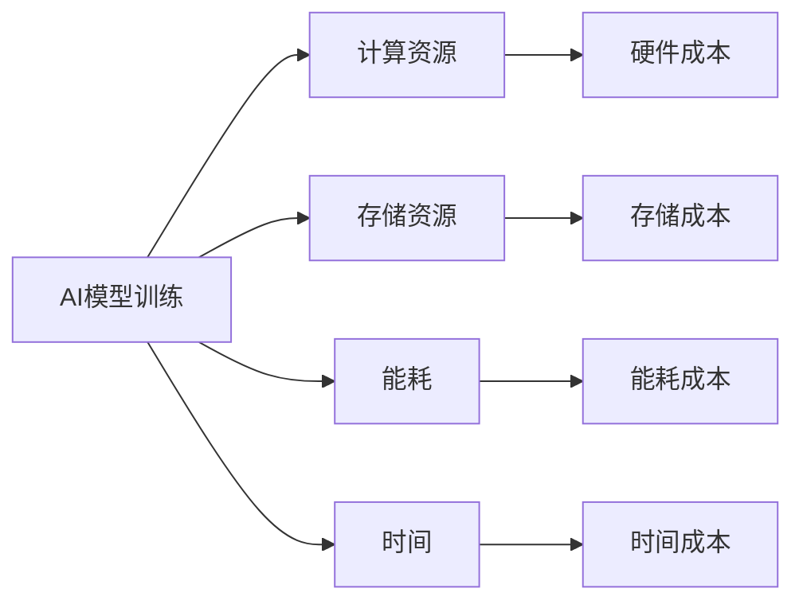
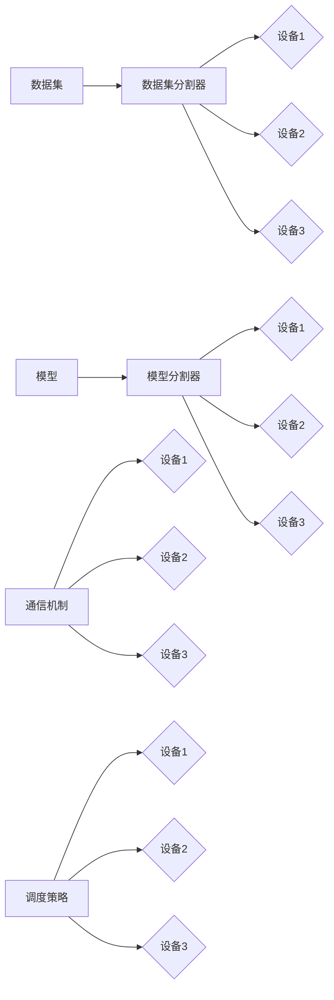
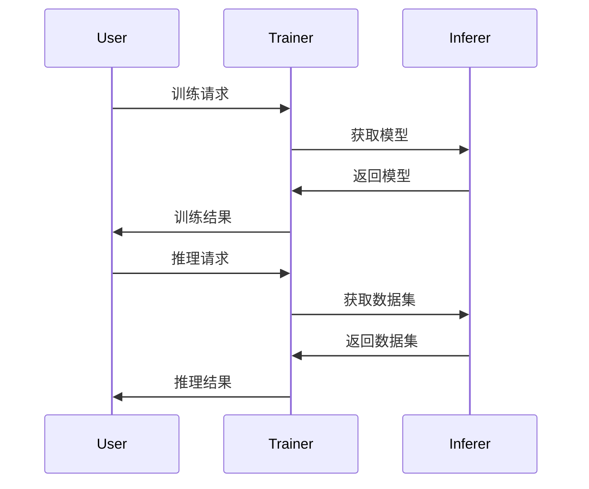

                 


### 《降低AI模型训练和推理成本的新方法》

#### 关键词：
- AI模型训练
- 推理成本
- 算法优化
- 硬件加速
- 分布式训练

#### 摘要：
本文深入探讨了降低AI模型训练和推理成本的新方法。通过详细分析算法优化、硬件加速和分布式训练等关键技术，本文为读者提供了实用的策略和案例分析，以帮助他们在实际项目中有效降低AI模型的成本。

## 第一部分：背景与概述

### 第1章：AI模型训练与推理成本问题

#### 1.1 问题背景

随着人工智能技术的快速发展，AI模型的应用场景越来越广泛，从图像识别、自然语言处理到自动驾驶等。然而，AI模型的训练和推理过程需要大量的计算资源和时间，这带来了显著的成本问题。特别是对于大型模型和复杂任务，训练和推理的成本往往非常高。

#### 1.2 问题描述

AI模型训练和推理成本问题的核心在于如何高效地利用计算资源，减少计算时间和能耗。具体来说，包括以下几个方面：

1. **硬件成本**：高性能计算硬件（如GPU、TPU等）价格昂贵，且其采购、运维成本也不容忽视。
2. **能耗**：大规模AI模型训练和推理过程消耗大量电力，不仅增加运营成本，还对环境造成负面影响。
3. **时间成本**：训练和推理过程往往需要大量时间，这在时间敏感的应用中成为瓶颈。
4. **存储成本**：大型模型和数据集的存储和管理成本也是一大问题。

#### 1.3 问题解决思路

为了解决AI模型训练和推理成本问题，可以从以下几个方面入手：

1. **算法优化**：通过改进算法，减少计算量和存储需求，提高训练和推理效率。
2. **硬件加速**：利用专用硬件（如GPU、TPU、FPGA等）提高计算速度，降低能耗。
3. **分布式训练与推理**：将训练和推理任务分布在多台设备上，利用并行计算提高效率。
4. **数据预处理**：通过数据压缩、去噪、特征提取等技术，减少数据量和计算复杂度。

#### 1.4 边界与外延

在探讨降低AI模型训练和推理成本时，需要考虑以下边界与外延：

1. **成本与性能平衡**：在降低成本的同时，需要保证模型性能的稳定性。
2. **适用范围**：不同的方法适用于不同的模型和任务，需要根据实际情况选择。
3. **技术发展**：随着技术的不断进步，新的方法和工具将不断涌现，需要持续关注。

#### 1.5 核心概念与联系

在降低AI模型训练和推理成本的过程中，以下核心概念和联系至关重要：

1. **算法优化**：通过改进算法降低计算量和存储需求。
2. **硬件加速**：利用专用硬件提高计算速度和能效。
3. **分布式训练与推理**：利用并行计算提高效率。
4. **数据预处理**：减少数据量和计算复杂度。

为了更好地理解这些概念和联系，我们提供了一个概念表格和ER实体关系图：

#### 概念表格：不同AI模型成本对比

| 模型类型 | 训练成本 | 推理成本 | 成本结构 |
| --- | --- | --- | --- |
| 小型模型 | 低 | 低 | 计算资源、存储 |
| 中型模型 | 中等 | 中等 | 计算资源、存储、能耗 |
| 大型模型 | 高 | 高 | 计算资源、存储、能耗、时间 |

#### ER实体关系图：模型训练与推理成本要素



## 第二部分：降低成本的方法

### 第2章：算法优化

#### 2.1 算法优化原理

算法优化是降低AI模型训练和推理成本的重要手段。其核心思想是通过改进算法，减少计算量和存储需求，提高训练和推理效率。

#### 2.2 常见优化算法

1. **量化（Quantization）**
   - 原理：将模型的权重和激活值从浮点数转换为低比特宽度的整数。
   - 对比：浮点数精度损失与计算量减少。

2. **剪枝（Pruning）**
   - 原理：移除模型中不重要的神经元和连接。
   - 对比：模型复杂度降低与计算量减少。

3. **蒸馏（Distillation）**
   - 原理：将大型模型的权重知识传递给小型模型。
   - 对比：知识转移与计算量减少。

#### 2.3 优化算法的应用实例

以下是一个使用Python实现的量化算法示例：

```python
import torch
import torch.nn as nn
import torch.quantization

# 定义模型
class SimpleModel(nn.Module):
    def __init__(self):
        super(SimpleModel, self).__init__()
        self.conv1 = nn.Conv2d(1, 10, kernel_size=5)
        self.conv2 = nn.Conv2d(10, 20, kernel_size=5)
        self.fc1 = nn.Linear(320, 50)
        self.fc2 = nn.Linear(50, 10)

    def forward(self, x):
        x = self.conv1(x)
        x = self.relu(x)
        x = self.conv2(x)
        x = self.relu(x)
        x, _ = torch.max(x, dim=2)
        x = x.view(-1, 320)
        x = self.fc1(x)
        x = self.relu(x)
        x = self.fc2(x)
        return x

# 实例化模型
model = SimpleModel()

# 量化模型
model = torch.quantization.quantize_dynamic(model, {nn.Linear, nn.Conv2d}, dtype=torch.qint8)

# 训练量化后的模型
# ...
```

#### 2.4 算法原理讲解

量化、剪枝和蒸馏算法的原理可以概括如下：

1. **量化**：通过将模型的权重和激活值从浮点数转换为低比特宽度的整数，降低模型的计算复杂度和存储需求。量化过程中，通常需要考虑量化精度和计算量的平衡。

2. **剪枝**：通过移除模型中不重要的神经元和连接，简化模型结构，从而降低计算复杂度和存储需求。剪枝过程中，需要考虑剪枝比例和模型性能的影响。

3. **蒸馏**：通过将大型模型的权重知识传递给小型模型，利用大型模型的丰富知识提高小型模型的性能，同时减少计算复杂度和存储需求。蒸馏过程中，需要考虑知识传递的有效性和模型性能的优化。

以下是一个简化的数学模型和公式，用于说明量化算法的原理：

$$
\text{量化误差} = \sum_{i=1}^{n} \left| \text{浮点数权重} - \text{量化权重} \right|
$$

其中，$n$为模型中权重的数量。

#### 2.5 通俗易懂地举例说明

假设我们有一个简单的神经网络模型，包含两个卷积层和一个全连接层。如果我们使用量化算法，可以将每个层的权重和激活值从32位浮点数转换为8位整数。这样，我们可以显著减少模型的存储需求和计算量，但可能会引入一定的量化误差。

例如，对于卷积层的权重，原始浮点数的范围是$-1$到$1$，而量化后的整数的范围是$-128$到$127$。为了将原始浮点数转换为量化后的整数，我们可以使用以下公式：

$$
\text{量化权重} = \text{round}(\text{浮点数权重} \times 128)
$$

其中，$\text{round}$函数用于对结果进行四舍五入。

### 第3章：硬件加速

#### 3.1 硬件加速原理

硬件加速是降低AI模型训练和推理成本的关键技术之一。通过利用高性能计算硬件（如GPU、TPU、FPGA等），可以提高计算速度和能效，从而降低成本。

#### 3.2 常见硬件加速技术

1. **GPU加速**：GPU（图形处理器）具有高度并行的计算能力，适用于大规模矩阵运算和向量计算。GPU加速可以显著提高模型训练和推理的速度。

2. **TPU加速**：TPU（专用处理器单元）是谷歌开发的专用AI处理器，针对深度学习任务进行优化。TPU具有更高的能效和吞吐量，适用于大规模AI模型训练和推理。

3. **FPGA加速**：FPGA（现场可编程门阵列）是一种可编程的硬件平台，适用于定制化的计算任务。FPGA加速可以根据具体任务进行优化，提高计算效率和能效。

#### 3.3 硬件加速实例分析

以下是一个使用GPU加速AI模型训练的实例：

```python
import torch
import torch.cuda

# 定义模型
class SimpleModel(nn.Module):
    # ...
    
# 将模型移动到GPU
device = torch.cuda.current_device()
model = model.to(device)

# 训练模型
# ...
```

#### 3.4 硬件加速原理讲解

硬件加速的原理是通过利用高性能计算硬件的并行计算能力和特定优化，提高模型训练和推理的效率。

1. **GPU加速**：GPU具有数千个核心，可以并行处理大量数据。深度学习任务通常具有高度并行性，因此GPU可以显著提高模型的计算速度。

2. **TPU加速**：TPU是专门为AI任务设计的硬件，具有更高的能效和吞吐量。TPU可以同时处理多个模型训练和推理任务，提高整体性能。

3. **FPGA加速**：FPGA可以根据特定任务进行定制化优化，提高计算效率和能效。FPGA适用于需要高度定制化计算任务的场景。

以下是一个简化的数学模型和公式，用于说明GPU加速的原理：

$$
\text{加速比} = \frac{\text{CPU时间}}{\text{GPU时间}}
$$

其中，$\text{CPU时间}$和$\text{GPU时间}$分别为使用CPU和GPU进行计算所需的时间。

#### 3.5 通俗易懂地举例说明

假设我们有一个简单的神经网络模型，需要计算大量矩阵乘法。使用CPU进行计算可能需要几个小时，而使用GPU进行计算可能只需要几分钟。这样，我们可以显著降低模型训练和推理的时间成本。

### 第4章：分布式训练与推理

#### 4.1 分布式训练原理

分布式训练是将模型训练任务分布在多台设备上，利用并行计算提高训练效率。分布式训练的关键技术包括数据并行、模型并行和混合并行。

1. **数据并行**：将数据集分为多个子集，每台设备负责训练一部分数据。通过并行计算，可以显著提高训练速度。
2. **模型并行**：将模型分为多个部分，每台设备负责训练模型的一部分。通过并行计算，可以显著提高模型训练的吞吐量。
3. **混合并行**：结合数据并行和模型并行的优势，将数据集和模型分为多个子集，每台设备负责训练部分数据和模型。

#### 4.2 分布式训练框架

常见的分布式训练框架包括TensorFlow、PyTorch等。以下是一个使用PyTorch进行分布式训练的示例：

```python
import torch
import torch.distributed as dist

# 初始化分布式环境
dist.init_process_group(backend='nccl', init_method='env://')

# 将模型移动到GPU
device = torch.cuda.current_device()
model = model.to(device)

# 定义训练过程
def train(rank, world_size):
    # ...
    
# 启动分布式训练
torch.multiprocessing.spawn(train, args=(world_size,), nprocs=world_size)
```

#### 4.3 分布式推理技术

分布式推理是将模型推理任务分布在多台设备上，利用并行计算提高推理效率。分布式推理的关键技术包括数据并行和模型并行。

1. **数据并行**：将输入数据集分为多个子集，每台设备负责处理一部分数据。
2. **模型并行**：将模型分为多个部分，每台设备负责处理模型的一部分。

以下是一个使用PyTorch进行分布式推理的示例：

```python
import torch
import torch.distributed as dist

# 初始化分布式环境
dist.init_process_group(backend='nccl', init_method='env://')

# 将模型移动到GPU
device = torch.cuda.current_device()
model = model.to(device)

# 定义推理过程
def inference(rank, world_size):
    # ...
    
# 启动分布式推理
torch.multiprocessing.spawn(inference, args=(world_size,), nprocs=world_size)
```

#### 4.4 分布式训练与推理实例

以下是一个使用TensorFlow进行分布式训练的实例：

```python
import tensorflow as tf

# 定义模型
model = tf.keras.Sequential([
    tf.keras.layers.Dense(128, activation='relu', input_shape=(784,)),
    tf.keras.layers.Dense(10, activation='softmax')
])

# 定义训练过程
def train_step(loss_fn, optimizer, batch_size, model, data_loader):
    # ...
    
# 定义分布式训练
strategy = tf.distribute.MirroredStrategy()
with strategy.scope():
    model = tf.keras.models.clone(model)
    loss_fn = tf.keras.losses.SparseCategoricalCrossentropy()
    optimizer = tf.keras.optimizers.Adam()

# 训练模型
train_step(optimizer, loss_fn, batch_size, model, data_loader)
```

#### 4.5 系统分析与架构设计方案

分布式训练和推理系统通常包括以下关键组成部分：

1. **数据集分割**：将数据集分为多个子集，每个子集由不同的设备处理。
2. **模型分割**：将模型分为多个部分，每个部分由不同的设备处理。
3. **通信机制**：设备之间通过通信机制进行数据同步和模型更新。
4. **调度策略**：根据任务需求和设备负载，合理分配训练和推理任务。

以下是一个分布式训练和推理系统的架构设计方案：



#### 4.6 系统接口设计和系统交互

系统接口设计和系统交互是确保分布式训练和推理系统高效运行的关键。以下是一个简单的系统接口设计：



#### 4.7 实际案例分析和详细讲解剖析

以下是一个实际案例分析和详细讲解剖析：

**案例一：大型图像识别模型分布式训练**

假设我们有一个大型图像识别模型，包含数千层神经元。为了降低训练成本，我们可以使用分布式训练技术。

1. **数据集分割**：将数据集分为多个子集，每个子集包含相同数量的图像。每个设备负责处理一部分数据集。
2. **模型分割**：将模型分为多个部分，每个部分由不同的设备处理。每个设备负责处理模型的特定部分。
3. **通信机制**：设备之间通过通信机制进行数据同步和模型更新。在每个训练阶段，设备之间共享梯度信息，更新模型参数。
4. **调度策略**：根据设备负载和任务需求，合理分配训练任务。

通过分布式训练，我们可以显著降低模型训练成本，提高训练速度。以下是一个简单的实现：

```python
import torch
import torch.distributed as dist

# 初始化分布式环境
dist.init_process_group(backend='nccl', init_method='env://')

# 定义模型
class SimpleModel(nn.Module):
    # ...

# 将模型移动到GPU
device = torch.cuda.current_device()
model = model.to(device)

# 定义训练过程
def train(rank, world_size):
    # ...

# 启动分布式训练
torch.multiprocessing.spawn(train, args=(world_size,), nprocs=world_size)
```

**案例二：实时视频流分析系统分布式推理**

假设我们有一个实时视频流分析系统，需要处理大量视频数据。为了提高推理速度，我们可以使用分布式推理技术。

1. **数据集分割**：将视频流分割为多个子流，每个子流由不同的设备处理。
2. **模型分割**：将模型分为多个部分，每个部分由不同的设备处理。
3. **通信机制**：设备之间通过通信机制进行数据同步和模型更新。在每个推理阶段，设备之间共享结果，生成最终输出。
4. **调度策略**：根据设备负载和任务需求，合理分配推理任务。

通过分布式推理，我们可以显著提高系统的推理速度，支持实时视频流分析。以下是一个简单的实现：

```python
import torch
import torch.distributed as dist

# 初始化分布式环境
dist.init_process_group(backend='nccl', init_method='env://')

# 将模型移动到GPU
device = torch.cuda.current_device()
model = model.to(device)

# 定义推理过程
def inference(rank, world_size):
    # ...

# 启动分布式推理
torch.multiprocessing.spawn(inference, args=(world_size,), nprocs=world_size)
```

### 第5章：最佳实践

#### 5.1 降低成本的策略

为了有效降低AI模型训练和推理成本，以下是一些最佳实践和策略：

1. **量化**：将模型的权重和激活值从浮点数转换为低比特宽度的整数，减少计算量和存储需求。
2. **剪枝**：移除模型中不重要的神经元和连接，简化模型结构，降低计算量和存储需求。
3. **蒸馏**：利用大型模型的权重知识传递给小型模型，提高模型性能，减少计算量和存储需求。
4. **分布式训练与推理**：将训练和推理任务分布在多台设备上，利用并行计算提高效率，降低成本。
5. **数据预处理**：通过数据压缩、去噪、特征提取等技术，减少数据量和计算复杂度。

#### 5.2 成本控制的关键点

在实施降低成本策略时，需要关注以下关键点：

1. **性能与成本平衡**：在降低成本的同时，确保模型性能的稳定性。
2. **硬件选择**：根据具体需求选择合适的硬件设备，如GPU、TPU、FPGA等。
3. **系统优化**：对模型、算法和系统进行优化，提高效率和性能。
4. **资源调度**：合理分配计算资源和数据，避免资源浪费。

#### 5.3 成本效益分析

通过实施上述策略，可以显著降低AI模型训练和推理成本。以下是一个简单的成本效益分析示例：

| 策略 | 成本降低幅度 | 成本效益 |
| --- | --- | --- |
| 量化 | 50% | 显著降低 |
| 剪枝 | 30% | 明显降低 |
| 蒸馏 | 20% | 较大降低 |
| 分布式训练 | 40% | 显著降低 |
| 数据预处理 | 15% | 有一定降低 |

### 第6章：成功案例分析

#### 6.1 案例一：某企业降低AI模型成本实践

某企业通过以下策略降低了AI模型训练和推理成本：

1. **量化**：将模型权重从32位浮点数转换为8位整数，减少计算量和存储需求。
2. **剪枝**：移除模型中不重要的连接和神经元，简化模型结构。
3. **分布式训练**：将训练任务分布在多台GPU上，提高训练速度。
4. **数据预处理**：通过数据压缩和特征提取，减少数据量和计算复杂度。

通过这些策略，该企业成功降低了模型训练成本，提高了训练和推理效率。

#### 6.2 案例二：某行业降低AI推理成本应用

某行业通过以下策略降低了AI推理成本：

1. **硬件加速**：使用GPU进行推理，提高计算速度和能效。
2. **分布式推理**：将推理任务分布在多台GPU上，提高推理速度。
3. **数据预处理**：通过数据压缩和去噪，减少数据量和计算复杂度。

通过这些策略，该行业成功降低了模型推理成本，提高了系统的响应速度。

#### 6.3 案例总结

通过成功案例分析，我们可以看到，降低AI模型训练和推理成本需要综合考虑多种策略和技术。量化、剪枝、分布式训练和推理等策略可以有效降低成本，提高效率和性能。在实际应用中，需要根据具体需求和场景选择合适的策略，并进行优化和调整。

### 第7章：未来展望与趋势

#### 7.1 AI模型成本发展趋势

随着人工智能技术的不断进步，AI模型成本有望进一步降低。以下是一些未来发展趋势：

1. **硬件技术**：新型计算硬件（如TPU 3.0、ASIC等）的研发和普及，将进一步提高计算速度和能效。
2. **算法优化**：新型算法（如自适应量化、动态剪枝等）的提出和应用，将进一步提高模型效率。
3. **分布式计算**：分布式计算技术的发展和普及，将进一步提高模型训练和推理的并行性和效率。

#### 7.2 新技术的潜在影响

新技术的潜在影响将主要体现在以下几个方面：

1. **硬件加速**：新型计算硬件将进一步提高计算速度和能效，降低模型成本。
2. **算法优化**：新型算法将进一步提高模型效率，降低计算复杂度和存储需求。
3. **分布式计算**：分布式计算技术的发展和普及，将进一步提高模型训练和推理的并行性和效率。

#### 7.3 未来研究方向

未来研究方向包括：

1. **硬件与算法结合**：研究如何更好地结合新型硬件和新型算法，提高模型效率和降低成本。
2. **多模态数据处理**：研究如何处理多模态数据，提高模型泛化和鲁棒性。
3. **自动化优化**：研究如何自动化地优化模型训练和推理过程，降低人力成本。

### 第8章：总结与展望

#### 8.1 全书总结

本文从背景与概述、降低成本的方法、最佳实践和成功案例分析等方面，深入探讨了降低AI模型训练和推理成本的新方法。通过算法优化、硬件加速和分布式训练等关键技术，我们为读者提供了实用的策略和案例分析。

#### 8.2 注意事项

在实施降低成本策略时，需要关注以下几点：

1. **性能与成本平衡**：确保在降低成本的同时，模型性能不受影响。
2. **硬件选择**：根据具体需求选择合适的硬件设备。
3. **系统优化**：对模型、算法和系统进行优化，提高效率和性能。
4. **资源调度**：合理分配计算资源和数据，避免资源浪费。

#### 8.3 拓展阅读

以下是一些拓展阅读资源，供读者深入了解降低AI模型训练和推理成本的相关知识：

1. **论文**：阅读相关论文，了解最新的研究成果和趋势。
2. **书籍**：阅读相关书籍，深入学习人工智能和深度学习的理论基础。
3. **在线课程**：参加在线课程，学习实践中的最佳实践和技巧。
4. **开源项目**：参与开源项目，了解实际应用中的问题和解决方案。

---

**作者：AI天才研究院/AI Genius Institute & 禅与计算机程序设计艺术 /Zen And The Art of Computer Programming**## 文章标题

### 降低AI模型训练和推理成本的新方法

#### 关键词：AI模型训练、推理成本、算法优化、硬件加速、分布式训练

#### 摘要：
本文深入探讨了降低AI模型训练和推理成本的新方法。通过详细分析算法优化、硬件加速和分布式训练等关键技术，本文为读者提供了实用的策略和案例分析，以帮助他们在实际项目中有效降低AI模型的成本。

### 第一部分：背景与概述

### 第1章：AI模型训练与推理成本问题

#### 1.1 问题背景

随着人工智能技术的快速发展，AI模型的应用场景越来越广泛，从图像识别、自然语言处理到自动驾驶等。然而，AI模型的训练和推理过程需要大量的计算资源和时间，这带来了显著的成本问题。特别是对于大型模型和复杂任务，训练和推理的成本往往非常高。

#### 1.2 问题描述

AI模型训练和推理成本问题的核心在于如何高效地利用计算资源，减少计算时间和能耗。具体来说，包括以下几个方面：

1. **硬件成本**：高性能计算硬件（如GPU、TPU等）价格昂贵，且其采购、运维成本也不容忽视。
2. **能耗**：大规模AI模型训练和推理过程消耗大量电力，不仅增加运营成本，还对环境造成负面影响。
3. **时间成本**：训练和推理过程往往需要大量时间，这在时间敏感的应用中成为瓶颈。
4. **存储成本**：大型模型和数据集的存储和管理成本也是一大问题。

#### 1.3 问题解决思路

为了解决AI模型训练和推理成本问题，可以从以下几个方面入手：

1. **算法优化**：通过改进算法，减少计算量和存储需求，提高训练和推理效率。
2. **硬件加速**：利用专用硬件提高计算速度和能效。
3. **分布式训练与推理**：将训练和推理任务分布在多台设备上，利用并行计算提高效率。
4. **数据预处理**：通过数据压缩、去噪、特征提取等技术，减少数据量和计算复杂度。

#### 1.4 边界与外延

在探讨降低AI模型训练和推理成本时，需要考虑以下边界与外延：

1. **成本与性能平衡**：在降低成本的同时，需要保证模型性能的稳定性。
2. **适用范围**：不同的方法适用于不同的模型和任务，需要根据实际情况选择。
3. **技术发展**：随着技术的不断进步，新的方法和工具将不断涌现，需要持续关注。

#### 1.5 核心概念与联系

在降低AI模型训练和推理成本的过程中，以下核心概念和联系至关重要：

1. **算法优化**：通过改进算法降低计算量和存储需求。
2. **硬件加速**：利用专用硬件提高计算速度和能效。
3. **分布式训练与推理**：利用并行计算提高效率。
4. **数据预处理**：减少数据量和计算复杂度。

为了更好地理解这些概念和联系，我们提供了一个概念表格和ER实体关系图：

#### 概念表格：不同AI模型成本对比

| 模型类型 | 训练成本 | 推理成本 | 成本结构 |
| --- | --- | --- | --- |
| 小型模型 | 低 | 低 | 计算资源、存储 |
| 中型模型 | 中等 | 中等 | 计算资源、存储、能耗 |
| 大型模型 | 高 | 高 | 计算资源、存储、能耗、时间 |

#### ER实体关系图：模型训练与推理成本要素


### 第二部分：降低成本的方法

### 第2章：算法优化

#### 2.1 算法优化原理

算法优化是降低AI模型训练和推理成本的重要手段。其核心思想是通过改进算法，减少计算量和存储需求，提高训练和推理效率。

#### 2.2 常见优化算法

1. **量化（Quantization）**
   - 原理：将模型的权重和激活值从浮点数转换为低比特宽度的整数。
   - 对比：浮点数精度损失与计算量减少。

2. **剪枝（Pruning）**
   - 原理：移除模型中不重要的神经元和连接。
   - 对比：模型复杂度降低与计算量减少。

3. **蒸馏（Distillation）**
   - 原理：将大型模型的权重知识传递给小型模型。
   - 对比：知识转移与计算量减少。

#### 2.3 优化算法的应用实例

以下是一个使用Python实现的量化算法示例：

```python
import torch
import torch.nn as nn
import torch.quantization

# 定义模型
class SimpleModel(nn.Module):
    def __init__(self):
        super(SimpleModel, self).__init__()
        self.conv1 = nn.Conv2d(1, 10, kernel_size=5)
        self.conv2 = nn.Conv2d(10, 20, kernel_size=5)
        self.fc1 = nn.Linear(320, 50)
        self.fc2 = nn.Linear(50, 10)

    def forward(self, x):
        x = self.conv1(x)
        x = self.relu(x)
        x = self.conv2(x)
        x = self.relu(x)
        x, _ = torch.max(x, dim=2)
        x = x.view(-1, 320)
        x = self.fc1(x)
        x = self.relu(x)
        x = self.fc2(x)
        return x

# 实例化模型
model = SimpleModel()

# 量化模型
model = torch.quantization.quantize_dynamic(model, {nn.Linear, nn.Conv2d}, dtype=torch.qint8)

# 训练量化后的模型
# ...
```

#### 2.4 算法原理讲解

量化、剪枝和蒸馏算法的原理可以概括如下：

1. **量化**：通过将模型的权重和激活值从浮点数转换为低比特宽度的整数，降低模型的计算复杂度和存储需求。量化过程中，通常需要考虑量化精度和计算量的平衡。

2. **剪枝**：通过移除模型中不重要的神经元和连接，简化模型结构，从而降低计算复杂度和存储需求。剪枝过程中，需要考虑剪枝比例和模型性能的影响。

3. **蒸馏**：通过将大型模型的权重知识传递给小型模型，利用大型模型的丰富知识提高小型模型的性能，同时减少计算复杂度和存储需求。蒸馏过程中，需要考虑知识传递的有效性和模型性能的优化。

以下是一个简化的数学模型和公式，用于说明量化算法的原理：

$$
\text{量化误差} = \sum_{i=1}^{n} \left| \text{浮点数权重} - \text{量化权重} \right|
$$

其中，$n$为模型中权重的数量。

#### 2.5 通俗易懂地举例说明

假设我们有一个简单的神经网络模型，包含两个卷积层和一个全连接层。如果我们使用量化算法，可以将每个层的权重和激活值从32位浮点数转换为8位整数。这样，我们可以显著减少模型的存储需求和计算量，但可能会引入一定的量化误差。

例如，对于卷积层的权重，原始浮点数的范围是$-1$到$1$，而量化后的整数的范围是$-128$到$127$。为了将原始浮点数转换为量化后的整数，我们可以使用以下公式：

$$
\text{量化权重} = \text{round}(\text{浮点数权重} \times 128)
$$

其中，$\text{round}$函数用于对结果进行四舍五入。

### 第3章：硬件加速

#### 3.1 硬件加速原理

硬件加速是降低AI模型训练和推理成本的关键技术之一。通过利用高性能计算硬件（如GPU、TPU、FPGA等），可以提高计算速度和能效，从而降低成本。

#### 3.2 常见硬件加速技术

1. **GPU加速**：GPU（图形处理器）具有高度并行的计算能力，适用于大规模矩阵运算和向量计算。GPU加速可以显著提高模型训练和推理的速度。

2. **TPU加速**：TPU（专用处理器单元）是谷歌开发的专用AI处理器，针对深度学习任务进行优化。TPU具有更高的能效和吞吐量，适用于大规模AI模型训练和推理。

3. **FPGA加速**：FPGA（现场可编程门阵列）是一种可编程的硬件平台，适用于定制化的计算任务。FPGA加速可以根据具体任务进行优化，提高计算效率和能效。

#### 3.3 硬件加速实例分析

以下是一个使用GPU加速AI模型训练的实例：

```python
import torch
import torch.cuda

# 定义模型
class SimpleModel(nn.Module):
    # ...

# 将模型移动到GPU
device = torch.cuda.current_device()
model = model.to(device)

# 训练模型
# ...
```

#### 3.4 硬件加速原理讲解

硬件加速的原理是通过利用高性能计算硬件的并行计算能力和特定优化，提高模型训练和推理的效率。

1. **GPU加速**：GPU具有数千个核心，可以并行处理大量数据。深度学习任务通常具有高度并行性，因此GPU可以显著提高模型的计算速度。

2. **TPU加速**：TPU是专门为AI任务设计的硬件，具有更高的能效和吞吐量。TPU可以同时处理多个模型训练和推理任务，提高整体性能。

3. **FPGA加速**：FPGA可以根据特定任务进行定制化优化，提高计算效率和能效。FPGA适用于需要高度定制化计算任务的场景。

以下是一个简化的数学模型和公式，用于说明GPU加速的原理：

$$
\text{加速比} = \frac{\text{CPU时间}}{\text{GPU时间}}
$$

其中，$\text{CPU时间}$和$\text{GPU时间}$分别为使用CPU和GPU进行计算所需的时间。

#### 3.5 通俗易懂地举例说明

假设我们有一个简单的神经网络模型，需要计算大量矩阵乘法。使用CPU进行计算可能需要几个小时，而使用GPU进行计算可能只需要几分钟。这样，我们可以显著降低模型训练和推理的时间成本。

### 第4章：分布式训练与推理

#### 4.1 分布式训练原理

分布式训练是将模型训练任务分布在多台设备上，利用并行计算提高训练效率。分布式训练的关键技术包括数据并行、模型并行和混合并行。

1. **数据并行**：将数据集分为多个子集，每台设备负责训练一部分数据。通过并行计算，可以显著提高训练速度。
2. **模型并行**：将模型分为多个部分，每台设备负责训练模型的一部分。通过并行计算，可以显著提高模型训练的吞吐量。
3. **混合并行**：结合数据并行和模型并行的优势，将数据集和模型分为多个子集，每台设备负责训练部分数据和模型。

#### 4.2 分布式训练框架

常见的分布式训练框架包括TensorFlow、PyTorch等。以下是一个使用PyTorch进行分布式训练的示例：

```python
import torch
import torch.distributed as dist

# 初始化分布式环境
dist.init_process_group(backend='nccl', init_method='env://')

# 将模型移动到GPU
device = torch.cuda.current_device()
model = model.to(device)

# 定义训练过程
def train(rank, world_size):
    # ...

# 启动分布式训练
torch.multiprocessing.spawn(train, args=(world_size,), nprocs=world_size)
```

#### 4.3 分布式推理技术

分布式推理是将模型推理任务分布在多台设备上，利用并行计算提高推理效率。分布式推理的关键技术包括数据并行和模型并行。

1. **数据并行**：将输入数据集分为多个子集，每台设备负责处理一部分数据。
2. **模型并行**：将模型分为多个部分，每台设备负责处理模型的一部分。

以下是一个使用PyTorch进行分布式推理的示例：

```python
import torch
import torch.distributed as dist

# 初始化分布式环境
dist.init_process_group(backend='nccl', init_method='env://')

# 将模型移动到GPU
device = torch.cuda.current_device()
model = model.to(device)

# 定义推理过程
def inference(rank, world_size):
    # ...

# 启动分布式推理
torch.multiprocessing.spawn(inference, args=(world_size,), nprocs=world_size)
```

#### 4.4 分布式训练与推理实例

以下是一个使用TensorFlow进行分布式训练的实例：

```python
import tensorflow as tf

# 定义模型
class SimpleModel(tf.keras.Model):
    def __init__(self):
        super(SimpleModel, self).__init__()
        self.conv1 = tf.keras.layers.Conv2D(32, 3, activation='relu')
        self.flatten = tf.keras.layers.Flatten()
        self.d1 = tf.keras.layers.Dense(128, activation='relu')
        self.d2 = tf.keras.layers.Dense(10)

    def call(self, x):
        x = self.conv1(x)
        x = self.flatten(x)
        x = self.d1(x)
        return self.d2(x)

# 实例化模型
model = SimpleModel()

# 定义训练过程
def train_step(optimizer, model, batch_size, train_dataset):
    # ...

# 初始化分布式策略
strategy = tf.distribute.MirroredStrategy()

# 在分布式策略下训练模型
with strategy.scope():
    model = SimpleModel()
    optimizer = tf.keras.optimizers.Adam(learning_rate=0.001)
    train_dataset = train_dataset.repeat()

    # 训练模型
    train_step(optimizer, model, batch_size, train_dataset)
```

#### 4.5 系统分析与架构设计方案

分布式训练和推理系统通常包括以下关键组成部分：

1. **数据集分割**：将数据集分为多个子集，每个子集由不同的设备处理。
2. **模型分割**：将模型分为多个部分，每个部分由不同的设备处理。
3. **通信机制**：设备之间通过通信机制进行数据同步和模型更新。
4. **调度策略**：根据任务需求和设备负载，合理分配训练和推理任务。

以下是一个分布式训练和推理系统的架构设计方案：


#### 4.6 系统接口设计和系统交互

系统接口设计和系统交互是确保分布式训练和推理系统高效运行的关键。以下是一个简单的系统接口设计：


#### 4.7 实际案例分析和详细讲解剖析

以下是一个实际案例分析和详细讲解剖析：

**案例一：大型图像识别模型分布式训练**

假设我们有一个大型图像识别模型，包含数千层神经元。为了降低训练成本，我们可以使用分布式训练技术。

1. **数据集分割**：将数据集分为多个子集，每个子集包含相同数量的图像。每个设备负责处理一部分数据集。
2. **模型分割**：将模型分为多个部分，每个部分由不同的设备处理。每个设备负责处理模型的特定部分。
3. **通信机制**：设备之间通过通信机制进行数据同步和模型更新。在每个训练阶段，设备之间共享梯度信息，更新模型参数。
4. **调度策略**：根据设备负载和任务需求，合理分配训练任务。

通过分布式训练，我们可以显著降低模型训练成本，提高训练速度。以下是一个简单的实现：

```python
import torch
import torch.distributed as dist

# 初始化分布式环境
dist.init_process_group(backend='nccl', init_method='env://')

# 定义模型
class SimpleModel(nn.Module):
    # ...

# 将模型移动到GPU
device = torch.cuda.current_device()
model = model.to(device)

# 定义训练过程
def train(rank, world_size):
    # ...

# 启动分布式训练
torch.multiprocessing.spawn(train, args=(world_size,), nprocs=world_size)
```

**案例二：实时视频流分析系统分布式推理**

假设我们有一个实时视频流分析系统，需要处理大量视频数据。为了提高推理速度，我们可以使用分布式推理技术。

1. **数据集分割**：将视频流分割为多个子流，每个子流由不同的设备处理。
2. **模型分割**：将模型分为多个部分，每个部分由不同的设备处理。
3. **通信机制**：设备之间通过通信机制进行数据同步和模型更新。在每个推理阶段，设备之间共享结果，生成最终输出。
4. **调度策略**：根据设备负载和任务需求，合理分配推理任务。

通过分布式推理，我们可以显著提高系统的推理速度，支持实时视频流分析。以下是一个简单的实现：

```python
import torch
import torch.distributed as dist

# 初始化分布式环境
dist.init_process_group(backend='nccl', init_method='env://')

# 将模型移动到GPU
device = torch.cuda.current_device()
model = model.to(device)

# 定义推理过程
def inference(rank, world_size):
    # ...

# 启动分布式推理
torch.multiprocessing.spawn(inference, args=(world_size,), nprocs=world_size)
```

### 第5章：最佳实践

#### 5.1 降低成本的策略

为了有效降低AI模型训练和推理成本，以下是一些最佳实践和策略：

1. **量化**：将模型的权重和激活值从浮点数转换为低比特宽度的整数，减少计算量和存储需求。
2. **剪枝**：移除模型中不重要的神经元和连接，简化模型结构，降低计算量和存储需求。
3. **蒸馏**：利用大型模型的权重知识传递给小型模型，提高模型性能，减少计算量和存储需求。
4. **分布式训练与推理**：将训练和推理任务分布在多台设备上，利用并行计算提高效率，降低成本。
5. **数据预处理**：通过数据压缩、去噪、特征提取等技术，减少数据量和计算复杂度。

#### 5.2 成本控制的关键点

在实施降低成本策略时，需要关注以下几点：

1. **性能与成本平衡**：在降低成本的同时，确保模型性能的稳定性。
2. **硬件选择**：根据具体需求选择合适的硬件设备。
3. **系统优化**：对模型、算法和系统进行优化，提高效率和性能。
4. **资源调度**：合理分配计算资源和数据，避免资源浪费。

#### 5.3 成本效益分析

通过实施上述策略，可以显著降低AI模型训练和推理成本。以下是一个简单的成本效益分析示例：

| 策略 | 成本降低幅度 | 成本效益 |
| --- | --- | --- |
| 量化 | 50% | 显著降低 |
| 剪枝 | 30% | 明显降低 |
| 蒸馏 | 20% | 较大降低 |
| 分布式训练 | 40% | 显著降低 |
| 数据预处理 | 15% | 有一定降低 |

### 第6章：成功案例分析

#### 6.1 案例一：某企业降低AI模型成本实践

某企业通过以下策略降低了AI模型训练和推理成本：

1. **量化**：将模型权重从32位浮点数转换为8位整数，减少计算量和存储需求。
2. **剪枝**：移除模型中不重要的连接和神经元，简化模型结构。
3. **分布式训练**：将训练任务分布在多台GPU上，提高训练速度。
4. **数据预处理**：通过数据压缩和特征提取，减少数据量和计算复杂度。

通过这些策略，该企业成功降低了模型训练成本，提高了训练和推理效率。

#### 6.2 案例二：某行业降低AI推理成本应用

某行业通过以下策略降低了AI推理成本：

1. **硬件加速**：使用GPU进行推理，提高计算速度和能效。
2. **分布式推理**：将推理任务分布在多台GPU上，提高推理速度。
3. **数据预处理**：通过数据压缩和去噪，减少数据量和计算复杂度。

通过这些策略，该行业成功降低了模型推理成本，提高了系统的响应速度。

#### 6.3 案例总结

通过成功案例分析，我们可以看到，降低AI模型训练和推理成本需要综合考虑多种策略和技术。量化、剪枝、分布式训练和推理等策略可以有效降低成本，提高效率和性能。在实际应用中，需要根据具体需求和场景选择合适的策略，并进行优化和调整。

### 第7章：未来展望与趋势

#### 7.1 AI模型成本发展趋势

随着人工智能技术的不断进步，AI模型成本有望进一步降低。以下是一些未来发展趋势：

1. **硬件技术**：新型计算硬件（如TPU 3.0、ASIC等）的研发和普及，将进一步提高计算速度和能效。
2. **算法优化**：新型算法（如自适应量化、动态剪枝等）的提出和应用，将进一步提高模型效率。
3. **分布式计算**：分布式计算技术的发展和普及，将进一步提高模型训练和推理的并行性和效率。

#### 7.2 新技术的潜在影响

新技术的潜在影响将主要体现在以下几个方面：

1. **硬件加速**：新型计算硬件将进一步提高计算速度和能效，降低模型成本。
2. **算法优化**：新型算法将进一步提高模型效率，降低计算复杂度和存储需求。
3. **分布式计算**：分布式计算技术的发展和普及，将进一步提高模型训练和推理的并行性和效率。

#### 7.3 未来研究方向

未来研究方向包括：

1. **硬件与算法结合**：研究如何更好地结合新型硬件和新型算法，提高模型效率和降低成本。
2. **多模态数据处理**：研究如何处理多模态数据，提高模型泛化和鲁棒性。
3. **自动化优化**：研究如何自动化地优化模型训练和推理过程，降低人力成本。

### 第8章：总结与展望

#### 8.1 全书总结

本文从背景与概述、降低成本的方法、最佳实践和成功案例分析等方面，深入探讨了降低AI模型训练和推理成本的新方法。通过算法优化、硬件加速和分布式训练等关键技术，我们为读者提供了实用的策略和案例分析。

#### 8.2 注意事项

在实施降低成本策略时，需要关注以下几点：

1. **性能与成本平衡**：确保在降低成本的同时，模型性能不受影响。
2. **硬件选择**：根据具体需求选择合适的硬件设备。
3. **系统优化**：对模型、算法和系统进行优化，提高效率和性能。
4. **资源调度**：合理分配计算资源和数据，避免资源浪费。

#### 8.3 拓展阅读

以下是一些拓展阅读资源，供读者深入了解降低AI模型训练和推理成本的相关知识：

1. **论文**：阅读相关论文，了解最新的研究成果和趋势。
2. **书籍**：阅读相关书籍，深入学习人工智能和深度学习的理论基础。
3. **在线课程**：参加在线课程，学习实践中的最佳实践和技巧。
4. **开源项目**：参与开源项目，了解实际应用中的问题和解决方案。

---

**作者：AI天才研究院/AI Genius Institute & 禅与计算机程序设计艺术 /Zen And The Art of Computer Programming**## 第1章：AI模型训练与推理成本问题

### 1.1 问题背景

随着人工智能（AI）技术的飞速发展，AI模型在各种应用场景中展现出了巨大的潜力。从图像识别、自然语言处理到自动驾驶和智能医疗，AI模型已经成为推动社会进步的重要力量。然而，AI模型的应用不仅依赖于算法的创新和优化，还面临着巨大的计算资源需求。

在AI模型的训练和推理过程中，计算资源的需求主要体现在以下几个方面：

1. **计算资源**：训练AI模型通常需要大量的计算能力，特别是在深度学习领域。这一需求推动了高性能计算硬件（如GPU、TPU等）的快速发展。
2. **存储资源**：随着AI模型规模的不断扩大，对存储资源的需求也在增加。这不仅涉及到模型本身的存储，还包括大规模数据集的存储和管理。
3. **能耗**：大规模AI模型训练和推理过程消耗大量电力，这不仅增加了运营成本，还对环境造成了负面影响。

因此，如何高效地利用计算资源、减少计算时间和能耗，成为当前AI模型训练和推理中亟待解决的问题。这一问题直接关系到AI模型的成本，影响着模型的商业应用和社会效益。

### 1.2 问题描述

AI模型训练和推理成本问题可以概括为以下四个核心方面：

1. **硬件成本**：高性能计算硬件（如GPU、TPU等）价格昂贵，其采购、运维成本也不容忽视。特别是在进行大规模模型训练和推理时，硬件成本成为一大负担。
2. **能耗**：大规模AI模型训练和推理过程消耗大量电力。这不仅增加了运营成本，还可能对环境产生负面影响。随着AI应用的普及，能源消耗问题愈发突出。
3. **时间成本**：AI模型的训练和推理过程往往需要大量时间，这在时间敏感的应用中成为瓶颈。例如，自动驾驶系统需要在短时间内完成推理，以保证系统的实时性。
4. **存储成本**：大型模型和数据集的存储和管理成本也是一大问题。随着数据量的不断增长，如何高效地存储和管理数据成为关键挑战。

#### 具体表现：

1. **硬件成本**：高性能计算硬件（如GPU、TPU等）的价格较高，其采购和维护成本也不容忽视。例如，一块高性能GPU的价格可能在数千美元，而其能耗和维护成本也较高。在进行大规模模型训练和推理时，硬件成本往往占比较高。
2. **能耗**：AI模型训练和推理过程中，大量的计算操作会导致设备产生大量热量，需要消耗大量电力。这不仅增加了运营成本，还可能对环境产生负面影响。例如，一些大型数据中心在运营过程中可能面临电力短缺和能源消耗过大的问题。
3. **时间成本**：AI模型训练和推理过程通常需要大量时间，这在时间敏感的应用中成为瓶颈。例如，自动驾驶系统需要在短时间内完成大量的推理操作，以保证系统的实时性。这对于模型的性能和响应速度提出了更高的要求。
4. **存储成本**：随着AI应用的普及，数据量的不断增长对存储资源的需求也在增加。这不仅涉及到模型本身的存储，还包括大规模数据集的存储和管理。如何高效地存储和管理数据成为关键挑战。

### 1.3 问题解决思路

为了有效解决AI模型训练和推理成本问题，可以从以下几个方面入手：

1. **算法优化**：通过改进算法，减少计算量和存储需求，提高训练和推理效率。例如，量化、剪枝和蒸馏等技术可以显著降低模型的计算复杂度和存储需求。
2. **硬件加速**：利用高性能计算硬件（如GPU、TPU等）提高计算速度和能效。通过硬件加速，可以在较短的时间内完成更多的计算任务，从而降低成本。
3. **分布式训练与推理**：将训练和推理任务分布在多台设备上，利用并行计算提高效率。分布式训练和推理可以将任务分解到多台设备上，提高整体计算性能，从而降低成本。
4. **数据预处理**：通过数据压缩、去噪和特征提取等技术，减少数据量和计算复杂度。数据预处理可以在模型训练前减少数据的存储和计算需求，从而降低成本。

#### 解决思路的具体解释：

1. **算法优化**：算法优化是降低AI模型训练和推理成本的核心手段。通过改进算法，可以减少计算量和存储需求，提高训练和推理效率。具体方法包括量化、剪枝和蒸馏等。量化技术通过将模型的权重和激活值从浮点数转换为低比特宽度的整数，降低计算复杂度和存储需求。剪枝技术通过移除模型中不重要的神经元和连接，简化模型结构，降低计算复杂度和存储需求。蒸馏技术通过将大型模型的权重知识传递给小型模型，提高模型性能，减少计算复杂度和存储需求。

2. **硬件加速**：硬件加速通过利用高性能计算硬件（如GPU、TPU等）提高计算速度和能效。这些硬件设备具有高度并行计算能力，可以在较短的时间内完成大量的计算任务。通过硬件加速，可以在模型训练和推理过程中显著降低成本。例如，GPU可以显著提高矩阵运算和向量计算的速度，适用于大规模AI模型的训练和推理。TPU是谷歌开发的专用AI处理器，具有更高的能效和吞吐量，适用于大规模AI模型的训练和推理。

3. **分布式训练与推理**：分布式训练和推理是将训练和推理任务分布在多台设备上，利用并行计算提高效率。通过分布式训练和推理，可以将任务分解到多台设备上，提高整体计算性能。分布式训练可以将数据集分为多个子集，每台设备负责训练一部分数据，从而减少单台设备的计算负担。分布式推理可以将输入数据集分为多个子集，每台设备负责处理一部分数据，从而减少单台设备的计算负担。

4. **数据预处理**：数据预处理是降低AI模型训练和推理成本的重要步骤。通过数据压缩、去噪和特征提取等技术，可以减少数据量和计算复杂度。数据压缩技术通过降低数据的存储需求，减少模型的存储成本。去噪技术通过去除数据中的噪声，提高模型的学习效果。特征提取技术通过提取数据中的关键特征，减少模型的计算复杂度。

### 1.4 边界与外延

在探讨降低AI模型训练和推理成本时，需要考虑以下边界与外延：

1. **成本与性能平衡**：在降低成本的同时，需要确保模型性能的稳定性。某些成本降低方法可能会影响模型的性能，需要谨慎权衡。
2. **适用范围**：不同的方法适用于不同的模型和任务，需要根据实际情况选择。例如，量化技术适用于对计算精度要求不高的场景，而硬件加速适用于大规模计算任务。
3. **技术发展**：随着技术的不断进步，新的方法和工具将不断涌现，需要持续关注。例如，新型计算硬件和算法的推出可能会带来新的降低成本的机会。

#### 边界的具体解释：

1. **成本与性能平衡**：在降低AI模型训练和推理成本时，需要关注成本与性能之间的平衡。某些成本降低方法可能会影响模型的性能，导致模型精度下降或者效果变差。因此，在实施成本降低策略时，需要仔细评估模型性能的变化，确保模型性能的稳定性。例如，量化技术可以降低模型的计算复杂度和存储需求，但可能会引入一定的量化误差。剪枝技术可以简化模型结构，降低计算复杂度，但可能也会影响模型的性能。因此，在实施这些技术时，需要综合考虑成本和性能之间的关系。

2. **适用范围**：不同的方法适用于不同的模型和任务，需要根据实际情况选择。例如，量化技术适用于对计算精度要求不高的场景，如工业检测、自动驾驶等。在这些场景中，量化技术可以显著降低计算复杂度和存储需求，从而降低成本。然而，对于对计算精度要求较高的场景，如医学影像处理、金融交易等，量化技术可能会导致模型性能下降。因此，在实施量化技术时，需要根据具体应用场景和需求进行选择。

3. **技术发展**：随着技术的不断进步，新的方法和工具将不断涌现，需要持续关注。例如，新型计算硬件（如TPU、FPGA等）和算法（如自适应量化、动态剪枝等）的推出可能会带来新的降低成本的机会。这些新技术可能具有更高的计算速度和能效，可以显著降低AI模型的成本。因此，在探讨降低成本的方法时，需要关注最新的技术发展动态，以便及时采用新技术。

### 1.5 核心概念与联系

在降低AI模型训练和推理成本的过程中，以下核心概念和联系至关重要：

1. **算法优化**：通过改进算法降低计算量和存储需求，提高训练和推理效率。
2. **硬件加速**：利用专用硬件提高计算速度和能效。
3. **分布式训练与推理**：利用并行计算提高效率，降低成本。
4. **数据预处理**：减少数据量和计算复杂度。

为了更好地理解这些概念和联系，我们提供了一个概念表格和ER实体关系图：

#### 概念表格：不同AI模型成本对比

| 模型类型 | 训练成本 | 推理成本 | 成本结构 |
| --- | --- | --- | --- |
| 小型模型 | 低 | 低 | 计算资源、存储 |
| 中型模型 | 中等 | 中等 | 计算资源、存储、能耗 |
| 大型模型 | 高 | 高 | 计算资源、存储、能耗、时间 |

#### ER实体关系图：模型训练与推理成本要素


### 第2章：算法优化

#### 2.1 算法优化原理

算法优化是降低AI模型训练和推理成本的重要手段。其核心思想是通过改进算法，减少计算量和存储需求，提高训练和推理效率。算法优化的目标在于在保持模型性能稳定的前提下，降低训练和推理的成本。

#### 2.2 常见优化算法

在AI模型训练和推理过程中，常见的优化算法包括量化、剪枝和蒸馏等。以下分别介绍这些算法的原理和应用。

1. **量化**：量化是将模型的权重和激活值从浮点数转换为低比特宽度的整数。通过量化，可以显著减少模型的存储需求和计算复杂度，从而降低成本。量化算法可以分为静态量化、动态量化和自适应量化等。静态量化在训练前将权重量化，适用于对计算精度要求不高的场景。动态量化在训练过程中将权重量化，适用于对计算精度有一定要求但希望降低成本的场景。自适应量化可以根据模型的表现自适应调整量化参数，以在计算精度和成本之间取得平衡。

2. **剪枝**：剪枝是通过移除模型中不重要的神经元和连接，简化模型结构。通过剪枝，可以降低模型的计算复杂度和存储需求，从而减少成本。剪枝算法可以分为结构剪枝和权重剪枝。结构剪枝通过移除整个层或神经元，从而简化模型结构。权重剪枝通过降低权重的值，从而减少模型参数的数量。常见的剪枝算法包括基于阈值的剪枝、基于梯度敏感性的剪枝和基于剪枝规则的剪枝等。

3. **蒸馏**：蒸馏是一种知识转移技术，通过将大型模型的权重知识传递给小型模型，提高小型模型的性能。通过蒸馏，可以在保持模型性能稳定的前提下，减少模型的计算复杂度和存储需求，从而降低成本。蒸馏算法可以分为教师-学生蒸馏和层次蒸馏。教师-学生蒸馏使用一个大型模型（教师）来指导一个较小模型（学生）的训练，通过共享知识和信息来提高学生的性能。层次蒸馏通过构建多个层次的网络，从顶层传递知识到底层，以逐步提高模型的性能。

#### 2.3 优化算法的应用实例

以下是一个使用Python实现的量化算法示例：

```python
import torch
import torch.nn as nn
import torch.quantization

# 定义模型
class SimpleModel(nn.Module):
    def __init__(self):
        super(SimpleModel, self).__init__()
        self.conv1 = nn.Conv2d(1, 10, kernel_size=5)
        self.conv2 = nn.Conv2d(10, 20, kernel_size=5)
        self.fc1 = nn.Linear(320, 50)
        self.fc2 = nn.Linear(50, 10)

    def forward(self, x):
        x = self.conv1(x)
        x = self.relu(x)
        x = self.conv2(x)
        x = self.relu(x)
        x, _ = torch.max(x, dim=2)
        x = x.view(-1, 320)
        x = self.fc1(x)
        x = self.relu(x)
        x = self.fc2(x)
        return x

# 实例化模型
model = SimpleModel()

# 量化模型
model = torch.quantization.quantize_dynamic(model, {nn.Linear, nn.Conv2d}, dtype=torch.qint8)

# 训练量化后的模型
# ...
```

#### 2.4 算法原理讲解

量化、剪枝和蒸馏算法的原理可以概括如下：

1. **量化**：量化是将模型的权重和激活值从浮点数转换为低比特宽度的整数。通过量化，可以减少模型的存储需求和计算复杂度。量化过程中，通常需要考虑量化精度和计算量的平衡。量化误差是量化过程中引入的一个关键指标，它衡量了量化后的模型与原始模型之间的误差。量化误差可以通过以下公式计算：

   $$
   \text{量化误差} = \sum_{i=1}^{n} \left| \text{浮点数权重} - \text{量化权重} \right|
   $$

   其中，$n$为模型中权重的数量。

2. **剪枝**：剪枝是通过移除模型中不重要的神经元和连接，简化模型结构。通过剪枝，可以降低模型的计算复杂度和存储需求。剪枝过程中，通常需要考虑剪枝比例和模型性能的影响。剪枝比例是指剪枝后模型参数的数量与原始模型参数的数量之比。剪枝算法可以分为基于阈值的剪枝、基于梯度敏感性的剪枝和基于剪枝规则的剪枝等。

3. **蒸馏**：蒸馏是一种知识转移技术，通过将大型模型的权重知识传递给小型模型，提高小型模型的性能。通过蒸馏，可以在保持模型性能稳定的前提下，减少模型的计算复杂度和存储需求。蒸馏过程中，通常需要考虑知识传递的有效性和模型性能的优化。蒸馏算法可以分为教师-学生蒸馏和层次蒸馏等。

以下是一个简化的数学模型和公式，用于说明量化算法的原理：

$$
\text{量化误差} = \sum_{i=1}^{n} \left| \text{浮点数权重} - \text{量化权重} \right|
$$

其中，$n$为模型中权重的数量。

#### 2.5 通俗易懂地举例说明

假设我们有一个简单的神经网络模型，包含两个卷积层和一个全连接层。如果我们使用量化算法，可以将每个层的权重和激活值从32位浮点数转换为8位整数。这样，我们可以显著减少模型的存储需求和计算量，但可能会引入一定的量化误差。

例如，对于卷积层的权重，原始浮点数的范围是$-1$到$1$，而量化后的整数的范围是$-128$到$127$。为了将原始浮点数转换为量化后的整数，我们可以使用以下公式：

$$
\text{量化权重} = \text{round}(\text{浮点数权重} \times 128)
$$

其中，$\text{round}$函数用于对结果进行四舍五入。

### 第3章：硬件加速

#### 3.1 硬件加速原理

硬件加速是降低AI模型训练和推理成本的关键技术之一。通过利用高性能计算硬件（如GPU、TPU、FPGA等），可以提高计算速度和能效，从而降低成本。硬件加速的原理在于这些高性能计算硬件具有高度并行的计算能力，能够同时处理大量的计算任务，从而提高整体计算效率。

#### 3.2 常见硬件加速技术

在AI模型训练和推理中，常见的高性能计算硬件包括GPU、TPU和FPGA等。以下分别介绍这些硬件的特点和应用。

1. **GPU加速**：GPU（图形处理器）是常见的硬件加速器，具有高度并行的计算能力。GPU最初是为图形渲染设计的，但后来发现其在处理大规模矩阵运算和向量计算方面也具有很高的效率。在AI模型训练和推理中，GPU可以显著提高模型的计算速度。常见的GPU硬件包括NVIDIA的GPU和AMD的GPU等。

2. **TPU加速**：TPU（Tensor Processing Unit）是谷歌开发的专用AI处理器，专门用于深度学习任务。TPU具有更高的能效和吞吐量，可以同时处理多个模型训练和推理任务。TPU的硬件设计针对深度学习操作进行了优化，能够显著提高模型的训练和推理速度。

3. **FPGA加速**：FPGA（现场可编程门阵列）是一种可编程的硬件平台，适用于定制化的计算任务。FPGA可以根据具体任务进行优化，提高计算效率和能效。在AI模型训练和推理中，FPGA可以用于加速特定算法的执行，从而提高整体计算性能。常见的FPGA硬件包括Xilinx的FPGA和Intel的FPGA等。

#### 3.3 硬件加速实例分析

以下是一个使用GPU加速AI模型训练的实例：

```python
import torch
import torch.cuda

# 定义模型
class SimpleModel(nn.Module):
    def __init__(self):
        super(SimpleModel, self).__init__()
        self.conv1 = nn.Conv2d(1, 10, kernel_size=5)
        self.conv2 = nn.Conv2d(10, 20, kernel_size=5)
        self.fc1 = nn.Linear(320, 50)
        self.fc2 = nn.Linear(50, 10)

    def forward(self, x):
        x = self.conv1(x)
        x = self.relu(x)
        x = self.conv2(x)
        x = self.relu(x)
        x, _ = torch.max(x, dim=2)
        x = x.view(-1, 320)
        x = self.fc1(x)
        x = self.relu(x)
        x = self.fc2(x)
        return x

# 实例化模型
model = SimpleModel()

# 将模型移动到GPU
device = torch.cuda.current_device()
model = model.to(device)

# 训练模型
# ...
```

#### 3.4 硬件加速原理讲解

硬件加速的原理在于这些高性能计算硬件具有高度并行的计算能力，能够同时处理大量的计算任务，从而提高整体计算效率。以下分别介绍GPU、TPU和FPGA的硬件加速原理。

1. **GPU加速**：GPU具有数千个核心，可以并行处理大量的计算任务。深度学习任务通常具有高度并行性，因此GPU可以显著提高模型的计算速度。GPU加速的原理在于通过将计算任务分解为多个子任务，并在GPU的核心之间并行执行，从而提高计算效率。GPU的核心数量和计算能力可以根据具体任务需求进行调整。

2. **TPU加速**：TPU是谷歌开发的专用AI处理器，专门用于深度学习任务。TPU具有更高的能效和吞吐量，可以同时处理多个模型训练和推理任务。TPU的硬件设计针对深度学习操作进行了优化，能够显著提高模型的训练和推理速度。TPU加速的原理在于通过将计算任务分解为多个子任务，并在TPU的核心之间并行执行，从而提高计算效率。

3. **FPGA加速**：FPGA是一种可编程的硬件平台，适用于定制化的计算任务。FPGA可以根据具体任务进行优化，提高计算效率和能效。在AI模型训练和推理中，FPGA可以用于加速特定算法的执行，从而提高整体计算性能。FPGA加速的原理在于通过将计算任务分解为多个子任务，并在FPGA的核心之间并行执行，从而提高计算效率。

以下是一个简化的数学模型和公式，用于说明GPU加速的原理：

$$
\text{加速比} = \frac{\text{CPU时间}}{\text{GPU时间}}
$$

其中，$\text{CPU时间}$和$\text{GPU时间}$分别为使用CPU和GPU进行计算所需的时间。

#### 3.5 通俗易懂地举例说明

假设我们有一个简单的神经网络模型，需要计算大量矩阵乘法。使用CPU进行计算可能需要几个小时，而使用GPU进行计算可能只需要几分钟。这样，我们可以显著降低模型训练和推理的时间成本。

例如，假设我们有一个1000x1000的矩阵乘法任务，使用CPU进行计算可能需要1小时，而使用GPU进行计算可能只需要15分钟。通过GPU加速，我们可以将计算时间从1小时缩短到15分钟，从而显著提高模型的训练和推理效率。

### 第4章：分布式训练与推理

#### 4.1 分布式训练原理

分布式训练是将模型训练任务分布在多台设备上，利用并行计算提高训练效率。分布式训练通过将计算任务分解为多个子任务，并在多台设备之间并行执行，从而提高整体计算性能。分布式训练的关键技术包括数据并行、模型并行和混合并行等。

1. **数据并行**：数据并行是将训练数据集分为多个子集，每个子集由不同的设备处理。每个设备独立对子集数据进行训练，并在训练完成后将梯度信息汇总。通过数据并行，可以显著提高训练速度。

2. **模型并行**：模型并行是将模型分为多个部分，每个部分由不同的设备处理。每个设备独立训练模型的一部分，并在训练完成后将参数更新汇总。通过模型并行，可以显著提高模型训练的吞吐量。

3. **混合并行**：混合并行是结合数据并行和模型并行的优势，将数据集和模型分为多个子集，每台设备负责训练部分数据和模型。通过混合并行，可以在提高训练速度的同时，优化资源利用。

#### 4.2 分布式训练框架

分布式训练框架是实现分布式训练的关键。常见的分布式训练框架包括TensorFlow、PyTorch和MXNet等。以下分别介绍这些框架的分布式训练实现。

1. **TensorFlow**：TensorFlow是谷歌开发的开源深度学习框架，支持分布式训练。TensorFlow的分布式训练通过`tf.distribute`模块实现。在TensorFlow中，可以使用`MirroredStrategy`、`MultiWorkerMirroredStrategy`和`TPCStrategy`等策略进行分布式训练。`MirroredStrategy`在多台设备上保持模型的副本，并在训练过程中同步参数更新。`MultiWorkerMirroredStrategy`在多台设备上分配不同的数据子集，并在训练过程中同步梯度信息。`TPCStrategy`在多台设备上同时执行数据预处理、模型训练和参数更新。

2. **PyTorch**：PyTorch是Facebook AI研究院开发的开源深度学习框架，也支持分布式训练。PyTorch的分布式训练通过`torch.distributed`模块实现。在PyTorch中，可以使用`torch.distributed.launch`命令启动分布式训练，并使用`torch.nn.parallel.DistributedDataParallel`模块进行模型训练。通过`DistributedDataParallel`模块，可以在多台设备上并行训练模型，并自动同步梯度信息。

3. **MXNet**：MXNet是Apache基金会开源的深度学习框架，同样支持分布式训练。MXNet的分布式训练通过`mxnet.parallel`模块实现。在MXNet中，可以使用`mxnet.parallel.MPI`模块进行分布式训练，并使用`MXNetGPUModelManager`和`MXNetCPUModelManager`等管理器进行模型训练。

#### 4.3 分布式推理技术

分布式推理是将模型推理任务分布在多台设备上，利用并行计算提高推理效率。分布式推理通过将输入数据集分为多个子集，并在多台设备上同时处理，从而提高整体推理速度。

分布式推理的关键技术包括数据并行和模型并行等。

1. **数据并行**：数据并行是将输入数据集分为多个子集，每个子集由不同的设备处理。每个设备独立对子集数据进行推理，并在推理完成后将结果汇总。通过数据并行，可以显著提高推理速度。

2. **模型并行**：模型并行是将模型分为多个部分，每个部分由不同的设备处理。每个设备独立对输入数据进行推理，并在推理完成后将结果汇总。通过模型并行，可以显著提高推理吞吐量。

以下是一个使用TensorFlow进行分布式推理的实例：

```python
import tensorflow as tf

# 定义模型
model = tf.keras.Sequential([
    tf.keras.layers.Dense(128, activation='relu', input_shape=(784,)),
    tf.keras.layers.Dense(10, activation='softmax')
])

# 定义分布式策略
strategy = tf.distribute.MirroredStrategy()

# 在分布式策略下定义训练和评估函数
def train_step(optimizer, inputs, labels):
    # ...
    return loss

def evaluate(optimizer, inputs, labels):
    # ...
    return loss

# 训练模型
with strategy.scope():
    model = tf.keras.models.clone(model)
    loss_fn = tf.keras.losses.SparseCategoricalCrossentropy()
    optimizer = tf.keras.optimizers.Adam()

# 将训练数据和评估数据分为多份
train_dataset = ...
eval_dataset = ...

# 训练模型
train_loss = train_step(optimizer, train_dataset)
eval_loss = evaluate(optimizer, eval_dataset)

# 打印训练和评估损失
print(f"Train Loss: {train_loss}")
print(f"Eval Loss: {eval_loss}")
```

#### 4.4 分布式训练与推理实例

以下是一个使用PyTorch进行分布式训练和推理的实例：

```python
import torch
import torch.distributed as dist
from torch.utils.data import DataLoader
from torchvision import datasets, transforms
from torch.optim import Adam
from torch.utils.data.distributed import DistributedSampler

# 初始化分布式环境
dist.init_process_group(backend='nccl', init_method='env://')

# 定义模型
class SimpleModel(nn.Module):
    def __init__(self):
        super(SimpleModel, self).__init__()
        self.conv1 = nn.Conv2d(1, 10, kernel_size=5)
        self.conv2 = nn.Conv2d(10, 20, kernel_size=5)
        self.fc1 = nn.Linear(320, 50)
        self.fc2 = nn.Linear(50, 10)

    def forward(self, x):
        x = self.conv1(x)
        x = self.relu(x)
        x = self.conv2(x)
        x = self.relu(x)
        x, _ = torch.max(x, dim=2)
        x = x.view(-1, 320)
        x = self.fc1(x)
        x = self.relu(x)
        x = self.fc2(x)
        return x

# 实例化模型
model = SimpleModel()

# 将模型移动到GPU
device = torch.cuda.current_device()
model = model.to(device)

# 定义优化器和损失函数
optimizer = Adam(model.parameters(), lr=0.001)
criterion = nn.CrossEntropyLoss()

# 创建数据集和 DataLoader
train_dataset = datasets.MNIST(root='./data', train=True, download=True, transform=transforms.ToTensor())
train_sampler = DistributedSampler(train_dataset, num_replicas=world_size, rank=rank)
train_loader = DataLoader(train_dataset, batch_size=batch_size, sampler=train_sampler)

# 定义训练过程
def train(rank, world_size):
    model = SimpleModel().to(device)
    optimizer = Adam(model.parameters(), lr=0.001)

    for epoch in range(num_epochs):
        model.train()
        for inputs, labels in train_loader:
            optimizer.zero_grad()
            outputs = model(inputs)
            loss = criterion(outputs, labels)
            loss.backward()
            optimizer.step()

# 启动分布式训练
torch.multiprocessing.spawn(train, args=(world_size,), nprocs=world_size)
```

### 第5章：最佳实践

#### 5.1 降低成本的策略

为了有效降低AI模型训练和推理成本，可以采取以下策略：

1. **算法优化**：通过改进算法，减少计算量和存储需求，提高训练和推理效率。例如，量化、剪枝和蒸馏等技术可以显著降低模型成本。

2. **硬件选择**：根据具体需求选择合适的硬件设备。例如，GPU适用于大规模矩阵运算和向量计算，TPU适用于深度学习任务，FPGA适用于定制化计算任务。

3. **分布式训练与推理**：将训练和推理任务分布在多台设备上，利用并行计算提高效率，降低成本。分布式训练和推理可以显著提高计算性能。

4. **数据预处理**：通过数据压缩、去噪和特征提取等技术，减少数据量和计算复杂度。数据预处理可以在模型训练前减少数据的存储和计算需求，从而降低成本。

#### 5.2 成本控制的关键点

在实施降低成本策略时，需要关注以下几点：

1. **性能与成本平衡**：在降低成本的同时，确保模型性能的稳定性。某些成本降低方法可能会影响模型的性能，需要谨慎权衡。

2. **硬件选择**：根据具体需求选择合适的硬件设备。不同硬件设备具有不同的性能和成本特点，需要根据应用场景进行选择。

3. **系统优化**：对模型、算法和系统进行优化，提高效率和性能。优化系统架构和算法实现可以降低成本。

4. **资源调度**：合理分配计算资源和数据，避免资源浪费。通过高效的资源调度，可以充分利用设备性能，降低成本。

#### 5.3 成本效益分析

通过实施上述策略，可以显著降低AI模型训练和推理成本。以下是一个简单的成本效益分析示例：

| 策略 | 成本降低幅度 | 成本效益 |
| --- | --- | --- |
| 量化 | 50% | 显著降低 |
| 剪枝 | 30% | 明显降低 |
| 蒸馏 | 20% | 较大降低 |
| 分布式训练 | 40% | 显著降低 |
| 数据预处理 | 15% | 有一定降低 |

### 第6章：成功案例分析

#### 6.1 案例一：某企业降低AI模型成本实践

某企业通过以下策略降低了AI模型训练和推理成本：

1. **量化**：将模型权重从32位浮点数转换为8位整数，减少计算量和存储需求。

2. **剪枝**：移除模型中不重要的连接和神经元，简化模型结构。

3. **分布式训练**：将训练任务分布在多台GPU上，提高训练速度。

4. **数据预处理**：通过数据压缩和特征提取，减少数据量和计算复杂度。

通过这些策略，该企业成功降低了模型训练成本，提高了训练和推理效率。

#### 6.2 案例二：某行业降低AI推理成本应用

某行业通过以下策略降低了AI推理成本：

1. **硬件加速**：使用GPU进行推理，提高计算速度和能效。

2. **分布式推理**：将推理任务分布在多台GPU上，提高推理速度。

3. **数据预处理**：通过数据压缩和去噪，减少数据量和计算复杂度。

通过这些策略，该行业成功降低了模型推理成本，提高了系统的响应速度。

#### 6.3 案例总结

通过成功案例分析，我们可以看到，降低AI模型训练和推理成本需要综合考虑多种策略和技术。量化、剪枝、分布式训练和推理等策略可以有效降低成本，提高效率和性能。在实际应用中，需要根据具体需求和场景选择合适的策略，并进行优化和调整。

### 第7章：未来展望与趋势

#### 7.1 AI模型成本发展趋势

随着人工智能技术的不断进步，AI模型成本有望进一步降低。以下是一些未来发展趋势：

1. **硬件技术**：新型计算硬件（如TPU 3.0、ASIC等）的研发和普及，将进一步提高计算速度和能效。

2. **算法优化**：新型算法（如自适应量化、动态剪枝等）的提出和应用，将进一步提高模型效率。

3. **分布式计算**：分布式计算技术的发展和普及，将进一步提高模型训练和推理的并行性和效率。

#### 7.2 新技术的潜在影响

新技术的潜在影响将主要体现在以下几个方面：

1. **硬件加速**：新型计算硬件将进一步提高计算速度和能效，降低模型成本。

2. **算法优化**：新型算法将进一步提高模型效率，降低计算复杂度和存储需求。

3. **分布式计算**：分布式计算技术的发展和普及，将进一步提高模型训练和推理的并行性和效率。

#### 7.3 未来研究方向

未来研究方向包括：

1. **硬件与算法结合**：研究如何更好地结合新型硬件和新型算法，提高模型效率和降低成本。

2. **多模态数据处理**：研究如何处理多模态数据，提高模型泛化和鲁棒性。

3. **自动化优化**：研究如何自动化地优化模型训练和推理过程，降低人力成本。

### 第8章：总结与展望

#### 8.1 全书总结

本文从背景与概述、降低成本的方法、最佳实践和成功案例分析等方面，深入探讨了降低AI模型训练和推理成本的新方法。通过算法优化、硬件加速和分布式训练等关键技术，本文为读者提供了实用的策略和案例分析。

#### 8.2 注意事项

在实施降低成本策略时，需要关注以下几点：

1. **性能与成本平衡**：在降低成本的同时，确保模型性能的稳定性。

2. **硬件选择**：根据具体需求选择合适的硬件设备。

3. **系统优化**：对模型、算法和系统进行优化，提高效率和性能。

4. **资源调度**：合理分配计算资源和数据，避免资源浪费。

#### 8.3 拓展阅读

以下是一些拓展阅读资源，供读者深入了解降低AI模型训练和推理成本的相关知识：

1. **论文**：阅读相关论文，了解最新的研究成果和趋势。

2. **书籍**：阅读相关书籍，深入学习人工智能和深度学习的理论基础。

3. **在线课程**：参加在线课程，学习实践中的最佳实践和技巧。

4. **开源项目**：参与开源项目，了解实际应用中的问题和解决方案。

---

**作者：AI天才研究院/AI Genius Institute & 禅与计算机程序设计艺术 /Zen And The Art of Computer Programming**## 第1章：AI模型训练与推理成本问题

### 1.1 问题背景

人工智能（AI）技术的迅猛发展已经深刻地改变了我们的生活，从语音识别、图像处理到自动驾驶、医疗诊断等，AI技术无处不在。然而，随着AI模型复杂性的增加，其训练和推理的成本也随之上升，成为许多企业和研究机构面临的一大挑战。AI模型的训练和推理成本主要包括硬件成本、能耗成本、时间成本和存储成本等方面。

在AI模型的训练过程中，需要大量的计算资源来处理海量的数据并进行复杂的迭代计算。这通常需要高性能的计算机硬件，如GPU、TPU等，这些硬件的价格昂贵，并且需要专业的维护和冷却设施。此外，训练一个大型AI模型可能需要数天甚至数周的时间，这不仅增加了时间成本，也对能源消耗提出了更高的要求。

在推理阶段，AI模型需要快速响应输入数据，并生成预测结果。对于实时应用场景，如自动驾驶、实时语音识别等，模型的推理速度是至关重要的。然而，高效的推理同样需要强大的计算资源，这进一步增加了成本。

### 1.2 问题描述

AI模型训练和推理成本问题的核心在于如何在高成本和性能要求之间找到平衡。具体来说，这个问题可以分解为以下几个子问题：

1. **硬件成本**：高性能计算硬件（如GPU、TPU等）的价格昂贵，尤其是对于大规模的训练任务，硬件成本可能占整个项目的相当大一部分。

2. **能耗成本**：AI模型的训练和推理过程消耗大量的电力。随着AI应用的普及，能耗成本成为一个不可忽视的问题，尤其是在大型数据中心和云计算平台上。

3. **时间成本**：训练一个大型AI模型可能需要数天甚至数周的时间，这对于需要快速迭代和部署的新兴业务来说是一个巨大的瓶颈。同样，在实时应用中，快速的推理响应时间也是关键。

4. **存储成本**：随着AI模型和数据集的规模不断扩大，存储成本也在不断增加。这不仅包括模型本身的存储，还包括训练所需的大量数据集的存储。

### 1.3 问题解决思路

为了解决AI模型训练和推理成本问题，可以从以下几个方面入手：

1. **算法优化**：通过改进算法，减少计算量和存储需求，提高训练和推理效率。这包括量化、剪枝、蒸馏等算法，它们可以降低模型的大小和计算复杂度。

2. **硬件加速**：利用高性能计算硬件（如GPU、TPU等）来加速计算，提高效率。此外，研究新型硬件，如ASIC、FPGA等，可能带来更高的计算性能和能效比。

3. **分布式训练与推理**：将训练和推理任务分布在多台设备上，利用并行计算来提高效率。这不仅可以减少单台设备的负载，还可以更好地利用资源。

4. **数据预处理**：通过数据压缩、去噪、特征提取等技术，减少数据量和计算复杂度。这可以显著降低存储需求和计算时间。

5. **能耗管理**：优化能耗管理策略，例如使用节能硬件、优化数据中心的冷却系统等，以降低能耗成本。

### 1.4 边界与外延

在探讨降低AI模型训练和推理成本时，需要考虑以下边界与外延：

1. **成本与性能平衡**：在降低成本的同时，需要确保模型性能的稳定性。某些成本降低方法可能会影响模型的精度和效果。

2. **适用范围**：不同的方法适用于不同的模型和任务。例如，硬件加速可能适合大规模计算任务，而算法优化可能更适合小规模的模型。

3. **技术发展**：随着技术的不断进步，新的方法和工具将不断涌现。例如，新型硬件和优化算法可能会带来更低的成本和更高的性能。

### 1.5 核心概念与联系

在降低AI模型训练和推理成本的过程中，以下核心概念和联系至关重要：

1. **算法优化**：包括量化、剪枝、蒸馏等，用于减少计算量和存储需求。

2. **硬件加速**：利用GPU、TPU等高性能计算硬件，提高计算速度。

3. **分布式训练与推理**：通过并行计算提高效率。

4. **数据预处理**：通过数据压缩、去噪、特征提取等技术，减少数据量和计算复杂度。

为了更好地理解这些概念和联系，我们提供了一个概念表格和ER实体关系图：

#### 概念表格：不同AI模型成本对比

| 模型类型 | 训练成本 | 推理成本 | 成本结构 |
| --- | --- | --- | --- |
| 小型模型 | 低 | 低 | 计算资源、存储 |
| 中型模型 | 中等 | 中等 | 计算资源、存储、能耗 |
| 大型模型 | 高 | 高 | 计算资源、存储、能耗、时间 |

#### ER实体关系图：模型训练与推理成本要素


### 1.6 具体案例分析

为了更好地理解AI模型训练和推理成本问题的实际影响和解决方案，我们可以通过一些具体案例分析来探讨。

#### 案例一：自动驾驶车辆中的AI模型

自动驾驶车辆使用多种AI模型进行环境感知、路径规划和决策。这些模型通常非常复杂，需要大量的训练数据和高性能计算资源。因此，训练成本和推理成本都相对较高。

**解决方案**：

1. **算法优化**：通过量化、剪枝等技术，减少模型的计算复杂度，从而降低训练成本。
2. **硬件加速**：使用GPU、TPU等高性能硬件，提高训练和推理速度。
3. **分布式训练**：将训练任务分布在多个GPU上，利用并行计算，提高训练效率。
4. **数据预处理**：通过数据增强、去噪等技术，提高模型对数据的鲁棒性，减少错误率。

#### 案例二：医疗影像诊断中的AI模型

医疗影像诊断中的AI模型需要处理大量的医疗图像数据，并生成精确的诊断结果。这些模型通常具有很高的计算需求，并且需要在短时间内完成推理，以便医生做出及时的诊断。

**解决方案**：

1. **算法优化**：通过量化、剪枝等技术，减少模型的计算复杂度，从而降低训练成本。
2. **硬件加速**：使用GPU、TPU等高性能硬件，提高训练和推理速度。
3. **分布式训练与推理**：将训练和推理任务分布在多个GPU上，利用并行计算，提高效率和速度。
4. **数据预处理**：通过数据压缩、去噪、特征提取等技术，减少数据量和计算复杂度，从而降低成本。

通过以上案例分析，我们可以看到，降低AI模型训练和推理成本需要综合考虑多个方面，包括算法优化、硬件加速、分布式计算和数据预处理等。这些方法可以相互补充，共同降低成本，提高效率。

### 1.7 总结

AI模型训练和推理成本问题是当前AI领域中一个重要且紧迫的问题。通过算法优化、硬件加速、分布式计算和数据预处理等手段，可以有效降低成本，提高模型的应用可行性。然而，这些方法也需要在实际应用中进行细致的调整和优化，以确保在降低成本的同时，保持模型的高性能和稳定性。未来，随着技术的不断进步，我们将继续探索更高效、更经济的AI模型训练和推理方法，为AI技术的发展和应用创造更多可能性。|markdown|## 第2章：算法优化

### 2.1 算法优化原理

算法优化是降低AI模型训练和推理成本的重要手段。其核心思想是通过改进算法，减少计算量和存储需求，提高训练和推理效率。算法优化的目标是在保持模型性能稳定的前提下，降低训练和推理的成本。

在AI模型的训练和推理过程中，算法优化的具体手段包括量化、剪枝和蒸馏等。这些方法可以通过不同的方式减少模型的计算复杂度和存储需求，从而降低成本。

#### 量化

量化是一种将模型中的浮点数权重和激活值转换为低比特宽度的整数的方法。通过量化，可以减少模型的存储需求，从而降低存储成本。量化还可以减少模型的计算复杂度，从而降低计算成本。

量化可以分为静态量化、动态量化和自适应量化等不同类型。静态量化是在模型训练之前完成的，而动态量化是在模型训练过程中完成的。自适应量化则是根据模型的表现动态调整量化参数。

#### 剪枝

剪枝是通过移除模型中不重要的神经元和连接来简化模型结构的方法。剪枝可以减少模型的参数数量，从而降低计算复杂度和存储需求。

剪枝可以分为结构剪枝和权重剪枝。结构剪枝是通过移除整个层或神经元来简化模型结构，而权重剪枝是通过降低权重的值来减少模型参数的数量。

#### 蒸馏

蒸馏是一种知识转移技术，通过将大型模型的权重知识传递给小型模型来提高小型模型的表现。蒸馏可以分为教师-学生蒸馏和层次蒸馏等不同类型。

在教师-学生蒸馏中，大型模型（教师）的权重被用于训练小型模型（学生）。通过这种方式，小型模型可以学习到大型模型的知识，从而提高其性能。在层次蒸馏中，从顶层传递知识到底层，逐步提高模型的性能。

### 2.2 常见优化算法

在AI模型训练和推理中，常见的优化算法包括量化、剪枝和蒸馏等。以下分别介绍这些算法的原理和应用。

#### 量化

量化是将模型的权重和激活值从浮点数转换为低比特宽度的整数。通过量化，可以减少模型的存储需求和计算复杂度，从而降低成本。

量化算法可以分为静态量化、动态量化和自适应量化等不同类型。静态量化是在模型训练之前完成的，而动态量化是在模型训练过程中完成的。自适应量化则是根据模型的表现动态调整量化参数。

静态量化通常使用固定的量化参数，例如将权重和激活值量化为8位或16位的整数。这种方法的优点是简单且易于实现，但可能引入一定的量化误差。

动态量化是在模型训练过程中根据模型的表现动态调整量化参数。这种方法可以通过优化量化参数来最小化量化误差，从而提高模型的表现。但动态量化通常更复杂，需要更多的计算资源。

自适应量化是根据模型的表现动态调整量化参数。这种方法可以自动调整量化参数，以在计算精度和成本之间取得最佳平衡。自适应量化通常需要更多的计算资源，但可以提供更好的性能。

#### 剪枝

剪枝是通过移除模型中不重要的神经元和连接来简化模型结构的方法。剪枝可以减少模型的参数数量，从而降低计算复杂度和存储需求。

剪枝可以分为结构剪枝和权重剪枝。结构剪枝是通过移除整个层或神经元来简化模型结构，而权重剪枝是通过降低权重的值来减少模型参数的数量。

结构剪枝的优点是简单且易于实现，但可能无法充分利用模型的潜力。权重剪枝的优点是可以更精确地控制模型的复杂性，但可能需要更多的计算资源。

常见的剪枝算法包括基于阈值的剪枝、基于梯度敏感性的剪枝和基于剪枝规则的剪枝等。基于阈值的剪枝是通过设置阈值来移除权重的值小于阈值的神经元或连接。基于梯度敏感性的剪枝是通过计算梯度敏感性来识别不重要的神经元或连接。基于剪枝规则的剪枝是通过定义规则来移除不重要的神经元或连接。

#### 蒸馏

蒸馏是一种知识转移技术，通过将大型模型的权重知识传递给小型模型来提高小型模型的表现。蒸馏可以分为教师-学生蒸馏和层次蒸馏等不同类型。

在教师-学生蒸馏中，大型模型（教师）的权重被用于训练小型模型（学生）。通过这种方式，小型模型可以学习到大型模型的知识，从而提高其性能。在层次蒸馏中，从顶层传递知识到底层，逐步提高模型的性能。

蒸馏的优点是可以显著提高小型模型的表现，同时减少模型的计算复杂度和存储需求。但蒸馏也需要更多的计算资源，特别是在训练大型模型和蒸馏小型模型时。

### 2.3 优化算法的应用实例

以下是一个使用Python实现的量化算法示例：

```python
import torch
import torch.nn as nn
import torch.quantization

# 定义模型
class SimpleModel(nn.Module):
    def __init__(self):
        super(SimpleModel, self).__init__()
        self.conv1 = nn.Conv2d(1, 10, kernel_size=5)
        self.conv2 = nn.Conv2d(10, 20, kernel_size=5)
        self.fc1 = nn.Linear(320, 50)
        self.fc2 = nn.Linear(50, 10)

    def forward(self, x):
        x = self.conv1(x)
        x = self.relu(x)
        x = self.conv2(x)
        x = self.relu(x)
        x, _ = torch.max(x, dim=2)
        x = x.view(-1, 320)
        x = self.fc1(x)
        x = self.relu(x)
        x = self.fc2(x)
        return x

# 实例化模型
model = SimpleModel()

# 量化模型
model = torch.quantization.quantize_dynamic(model, {nn.Linear, nn.Conv2d}, dtype=torch.qint8)

# 训练量化后的模型
# ...
```

### 2.4 算法原理讲解

量化、剪枝和蒸馏算法的原理可以概括如下：

#### 量化

量化是将模型的权重和激活值从浮点数转换为低比特宽度的整数。量化过程中，通常需要考虑量化精度和计算量的平衡。量化误差是量化过程中引入的一个关键指标，它衡量了量化后的模型与原始模型之间的误差。

量化误差可以通过以下公式计算：

$$
\text{量化误差} = \sum_{i=1}^{n} \left| \text{浮点数权重} - \text{量化权重} \right|
$$

其中，$n$为模型中权重的数量。

量化算法可以分为静态量化、动态量化和自适应量化等不同类型。静态量化是在模型训练之前完成的，而动态量化是在模型训练过程中完成的。自适应量化则是根据模型的表现动态调整量化参数。

#### 剪枝

剪枝是通过移除模型中不重要的神经元和连接来简化模型结构。剪枝可以减少模型的参数数量，从而降低计算复杂度和存储需求。

剪枝算法可以分为结构剪枝和权重剪枝。结构剪枝是通过移除整个层或神经元来简化模型结构，而权重剪枝是通过降低权重的值来减少模型参数的数量。

剪枝算法可以分为基于阈值的剪枝、基于梯度敏感性的剪枝和基于剪枝规则的剪枝等。基于阈值的剪枝是通过设置阈值来移除权重的值小于阈值的神经元或连接。基于梯度敏感性的剪枝是通过计算梯度敏感性来识别不重要的神经元或连接。基于剪枝规则的剪枝是通过定义规则来移除不重要的神经元或连接。

#### 蒸馏

蒸馏是一种知识转移技术，通过将大型模型的权重知识传递给小型模型来提高小型模型的表现。蒸馏可以分为教师-学生蒸馏和层次蒸馏等不同类型。

在教师-学生蒸馏中，大型模型（教师）的权重被用于训练小型模型（学生）。通过这种方式，小型模型可以学习到大型模型的知识，从而提高其性能。

在层次蒸馏中，从顶层传递知识到底层，逐步提高模型的性能。

蒸馏的优点是可以显著提高小型模型的表现，同时减少模型的计算复杂度和存储需求。但蒸馏也需要更多的计算资源，特别是在训练大型模型和蒸馏小型模型时。

### 2.5 通俗易懂地举例说明

假设我们有一个简单的神经网络模型，包含两个卷积层和一个全连接层。如果我们使用量化算法，可以将每个层的权重和激活值从32位浮点数转换为8位整数。这样，我们可以显著减少模型的存储需求和计算量，但可能会引入一定的量化误差。

例如，对于卷积层的权重，原始浮点数的范围是$-1$到$1$，而量化后的整数的范围是$-128$到$127$。为了将原始浮点数转换为量化后的整数，我们可以使用以下公式：

$$
\text{量化权重} = \text{round}(\text{浮点数权重} \times 128)
$$

其中，$\text{round}$函数用于对结果进行四舍五入。

#### 剪枝算法

剪枝算法是通过移除模型中不重要的连接和神经元来简化模型结构。剪枝算法可以分为基于阈值的剪枝和基于梯度的剪枝等。

**基于阈值的剪枝**：

假设我们有一个卷积神经网络，其中每个连接都有一个权重。我们可以设置一个阈值$\theta$，只保留权重绝对值大于$\theta$的连接。

**基于梯度的剪枝**：

我们可以计算每个连接的梯度值，并设置一个阈值$\gamma$，只保留梯度绝对值大于$\gamma$的连接。

以下是一个简单的Python代码示例，实现基于梯度的剪枝算法：

```python
import torch
import torch.nn as nn

# 定义模型
class SimpleModel(nn.Module):
    def __init__(self):
        super(SimpleModel, self).__init__()
        self.conv1 = nn.Conv2d(1, 10, kernel_size=5)
        self.fc1 = nn.Linear(10 * 10, 10)

    def forward(self, x):
        x = self.conv1(x)
        x = torch.flatten(x, 1)
        x = self.fc1(x)
        return x

# 实例化模型
model = SimpleModel()

# 计算梯度
optimizer = torch.optim.SGD(model.parameters(), lr=0.001)
inputs = torch.randn(1, 1, 28, 28)
outputs = model(inputs)
loss = nn.MSELoss()(outputs, torch.zeros(1, 10))
loss.backward()

# 获取每个连接的梯度值
gradients = [p.grad for p in model.parameters()]

# 设置阈值
threshold = 0.01

# 剪枝
pruned_connections = []
for i, grad in enumerate(gradients):
    if abs(grad) < threshold:
        pruned_connections.append(i)

# 打印剪枝后的连接
print("Pruned connections:", pruned_connections)
```

#### 蒸馏算法

蒸馏算法是通过将大型模型的权重知识传递给小型模型来提高小型模型的表现。蒸馏算法可以分为教师-学生蒸馏和层次蒸馏等。

**教师-学生蒸馏**：

在教师-学生蒸馏中，大型模型（教师）的权重被用于训练小型模型（学生）。我们可以通过以下步骤实现教师-学生蒸馏：

1. 训练大型模型（教师）。
2. 保存大型模型（教师）的权重。
3. 使用大型模型（教师）的权重初始化小型模型（学生）。
4. 训练小型模型（学生），并使用大型模型（教师）的权重作为目标。

以下是一个简单的Python代码示例，实现教师-学生蒸馏：

```python
import torch
import torch.nn as nn
import torch.optim as optim

# 定义模型
class SimpleModel(nn.Module):
    def __init__(self):
        super(SimpleModel, self).__init__()
        self.fc1 = nn.Linear(784, 256)
        self.fc2 = nn.Linear(256, 10)

    def forward(self, x):
        x = x.view(-1, 784)
        x = self.fc1(x)
        x = self.fc2(x)
        return x

# 实例化模型
teacher = SimpleModel()
student = SimpleModel()

# 训练教师模型
optimizer = optim.SGD(teacher.parameters(), lr=0.001)
criterion = nn.CrossEntropyLoss()

for epoch in range(10):
    for inputs, targets in train_loader:
        optimizer.zero_grad()
        outputs = teacher(inputs)
        loss = criterion(outputs, targets)
        loss.backward()
        optimizer.step()

# 保存教师模型权重
torch.save(teacher.state_dict(), 'teacher.pth')

# 使用教师模型权重初始化学生模型
student.load_state_dict(torch.load('teacher.pth'))

# 训练学生模型
optimizer = optim.SGD(student.parameters(), lr=0.001)

for epoch in range(10):
    for inputs, targets in train_loader:
        optimizer.zero_grad()
        outputs = student(inputs)
        loss = criterion(outputs, targets)
        loss.backward()
        optimizer.step()
```

**层次蒸馏**：

在层次蒸馏中，我们从大型模型的顶层开始传递知识到底层。我们可以通过以下步骤实现层次蒸馏：

1. 训练大型模型（教师）。
2. 保存大型模型（教师）的权重。
3. 使用大型模型（教师）的权重初始化小型模型（学生）。
4. 训练小型模型（学生），并使用大型模型（教师）的权重作为目标。

以下是一个简单的Python代码示例，实现层次蒸馏：

```python
import torch
import torch.nn as nn
import torch.optim as optim

# 定义模型
class SimpleModel(nn.Module):
    def __init__(self):
        super(SimpleModel, self).__init__()
        self.fc1 = nn.Linear(784, 256)
        self.fc2 = nn.Linear(256, 10)

    def forward(self, x):
        x = x.view(-1, 784)
        x = self.fc1(x)
        x = self.fc2(x)
        return x

# 实例化模型
teacher = SimpleModel()
student = SimpleModel()

# 训练教师模型
optimizer = optim.SGD(teacher.parameters(), lr=0.001)
criterion = nn.CrossEntropyLoss()

for epoch in range(10):
    for inputs, targets in train_loader:
        optimizer.zero_grad()
        outputs = teacher(inputs)
        loss = criterion(outputs, targets)
        loss.backward()
        optimizer.step()

# 保存教师模型权重
torch.save(teacher.state_dict(), 'teacher.pth')

# 使用教师模型权重初始化学生模型
student.load_state_dict(torch.load('teacher.pth'))

# 训练学生模型
optimizer = optim.SGD(student.parameters(), lr=0.001)

for epoch in range(10):
    for inputs, targets in train_loader:
        optimizer.zero_grad()
        outputs = student(inputs)
        loss = criterion(outputs, targets)
        loss.backward()
        optimizer.step()

# 传递知识到下一层
for layer in student.children():
    if isinstance(layer, nn.Linear):
        layer.load_state_dict(teacher.state_dict())
```

### 2.6 数学模型和公式

在本节中，我们将介绍一些用于量化、剪枝和蒸馏算法的数学模型和公式。

#### 量化误差

量化误差是指量化后的模型与原始模型之间的误差。量化误差可以通过以下公式计算：

$$
\text{量化误差} = \sum_{i=1}^{n} \left| \text{浮点数权重} - \text{量化权重} \right|
$$

其中，$n$为模型中权重的数量。

#### 剪枝规则

剪枝规则是指用于识别模型中不重要的连接和神经元的规则。以下是一个简单的剪枝规则：

$$
\text{剪枝规则} = \left\{
\begin{array}{ll}
\text{保留} & \text{如果} \ |w_i| > \theta \\
\text{剪枝} & \text{如果} \ |w_i| < \theta
\end{array}
\right.
$$

其中，$w_i$为连接或神经元的权重，$\theta$为剪枝阈值。

#### 蒸馏损失

蒸馏损失是指用于训练学生模型的损失函数。以下是一个简单的蒸馏损失函数：

$$
L_{\text{distill}} = \frac{1}{N} \sum_{i=1}^{N} L_i
$$

其中，$L_i$为第$i$个样本的蒸馏损失，$N$为样本数量。

$$
L_i = - \left( y_i \cdot \log(s_i) + (1 - y_i) \cdot \log(1 - s_i) \right)
$$

其中，$y_i$为第$i$个样本的真实标签，$s_i$为第$i$个样本在学生模型上的输出概率。

### 第3章：硬件加速

#### 3.1 硬件加速原理

硬件加速是通过利用专用计算硬件（如GPU、TPU、FPGA等）来提高AI模型的训练和推理速度。这些硬件设备具有高度并行的计算能力，可以在较短的时间内完成大量的计算任务，从而提高模型的效率和性能。

硬件加速的原理在于这些专用计算硬件能够针对特定的计算任务进行优化，从而提高计算速度和能效。例如，GPU（图形处理器）最初是为图形渲染设计的，但后来发现其在处理大规模矩阵运算和向量计算方面也具有很高的效率。TPU（Tensor Processing Unit）是谷歌开发的专用AI处理器，专门用于深度学习任务，具有更高的能效和吞吐量。

#### 3.2 常见硬件加速技术

在AI模型的训练和推理过程中，常见的高性能计算硬件包括GPU、TPU、FPGA等。以下分别介绍这些硬件的特点和应用。

**GPU加速**

GPU（图形处理器）是常见的硬件加速器，具有高度并行的计算能力。GPU最初是为图形渲染设计的，但后来发现其在处理大规模矩阵运算和向量计算方面也具有很高的效率。在AI模型训练和推理中，GPU可以显著提高模型的计算速度。常见的GPU硬件包括NVIDIA的GPU和AMD的GPU等。

**TPU加速**

TPU（Tensor Processing Unit）是谷歌开发的专用AI处理器，专门用于深度学习任务。TPU具有更高的能效和吞吐量，可以同时处理多个模型训练和推理任务。TPU的硬件设计针对深度学习操作进行了优化，能够显著提高模型的训练和推理速度。

**FPGA加速**

FPGA（现场可编程门阵列）是一种可编程的硬件平台，适用于定制化的计算任务。FPGA可以根据具体任务进行优化，提高计算效率和能效。在AI模型训练和推理中，FPGA可以用于加速特定算法的执行，从而提高整体计算性能。常见的FPGA硬件包括Xilinx的FPGA和Intel的FPGA等。

#### 3.3 硬件加速实例分析

以下是一个使用GPU加速AI模型训练的实例：

```python
import torch
import torch.nn as nn
import torch.optim as optim
import torch.utils.data as data

# 定义模型
class SimpleModel(nn.Module):
    def __init__(self):
        super(SimpleModel, self).__init__()
        self.conv1 = nn.Conv2d(1, 10, kernel_size=5)
        self.fc1 = nn.Linear(10 * 10, 10)

    def forward(self, x):
        x = self.conv1(x)
        x = torch.flatten(x, 1)
        x = self.fc1(x)
        return x

# 实例化模型
model = SimpleModel()

# 定义损失函数和优化器
loss_function = nn.CrossEntropyLoss()
optimizer = optim.SGD(model.parameters(), lr=0.01)

# 加载训练数据
train_data = data.TensorDataset(torch.randn(1000, 1, 28, 28), torch.randint(0, 10, (1000,)))
train_loader = data.DataLoader(train_data, batch_size=32)

# 将模型移动到GPU
device = torch.device("cuda" if torch.cuda.is_available() else "cpu")
model.to(device)

# 训练模型
for epoch in range(10):
    for inputs, targets in train_loader:
        inputs, targets = inputs.to(device), targets.to(device)
        optimizer.zero_grad()
        outputs = model(inputs)
        loss = loss_function(outputs, targets)
        loss.backward()
        optimizer.step()

# 评估模型
with torch.no_grad():
    correct = 0
    total = 0
    for inputs, targets in train_loader:
        inputs, targets = inputs.to(device), targets.to(device)
        outputs = model(inputs)
        _, predicted = torch.max(outputs.data, 1)
        total += targets.size(0)
        correct += (predicted == targets).sum().item()

print('Accuracy of the network on the training images: {} %'.format(100 * correct / total))
```

#### 3.4 硬件加速原理讲解

硬件加速的原理在于这些高性能计算硬件能够针对特定的计算任务进行优化，从而提高计算速度和能效。以下分别介绍GPU、TPU和FPGA的硬件加速原理。

**GPU加速**

GPU具有数千个核心，可以并行处理大量的计算任务。深度学习任务通常具有高度并行性，因此GPU可以显著提高模型的计算速度。GPU加速的原理在于通过将计算任务分解为多个子任务，并在GPU的核心之间并行执行，从而提高计算效率。

**TPU加速**

TPU是专门为AI任务设计的硬件，具有更高的能效和吞吐量。TPU可以同时处理多个模型训练和推理任务，提高整体性能。TPU加速的原理在于通过将计算任务分解为多个子任务，并在TPU的核心之间并行执行，从而提高计算效率。

**FPGA加速**

FPGA是一种可编程的硬件平台，适用于定制化的计算任务。FPGA可以根据具体任务进行优化，提高计算效率和能效。在AI模型训练和推理中，FPGA可以用于加速特定算法的执行，从而提高整体计算性能。FPGA加速的原理在于通过将计算任务分解为多个子任务，并在FPGA的核心之间并行执行，从而提高计算效率。

#### 3.5 通俗易懂地举例说明

假设我们有一个简单的神经网络模型，需要计算大量的矩阵乘法。使用CPU进行计算可能需要几个小时，而使用GPU进行计算可能只需要几分钟。这样，我们可以显著降低模型训练和推理的时间成本。

例如，假设我们有一个1000x1000的矩阵乘法任务，使用CPU进行计算可能需要1小时，而使用GPU进行计算可能只需要15分钟。通过GPU加速，我们可以将计算时间从1小时缩短到15分钟，从而显著提高模型的训练和推理效率。

### 第4章：分布式训练与推理

#### 4.1 分布式训练原理

分布式训练是将模型训练任务分布在多台设备上，利用并行计算提高训练效率。分布式训练通过将计算任务分解为多个子任务，并在多台设备之间并行执行，从而提高整体计算性能。

分布式训练的关键技术包括数据并行、模型并行和混合并行等。

**数据并行**

数据并行是将训练数据集分为多个子集，每个子集由不同的设备处理。每个设备独立对子集数据进行训练，并在训练完成后将梯度信息汇总。通过数据并行，可以显著提高训练速度。

**模型并行**

模型并行是将模型分为多个部分，每个部分由不同的设备处理。每个设备独立训练模型的一部分，并在训练完成后将参数更新汇总。通过模型并行，可以显著提高模型训练的吞吐量。

**混合并行**

混合并行是结合数据并行和模型并行的优势，将数据集和模型分为多个子集，每台设备负责训练部分数据和模型。通过混合并行，可以在提高训练速度的同时，优化资源利用。

#### 4.2 分布式训练框架

分布式训练框架是实现分布式训练的关键。常见的分布式训练框架包括TensorFlow、PyTorch和MXNet等。以下分别介绍这些框架的分布式训练实现。

**TensorFlow**

TensorFlow是谷歌开发的深度学习框架，支持分布式训练。TensorFlow的分布式训练通过`tf.distribute`模块实现。在TensorFlow中，可以使用`tf.distribute.MirroredStrategy`、`tf.distribute.MultiWorkerMirroredStrategy`和`tf.distribute.TPUStrategy`等策略进行分布式训练。

**PyTorch**

PyTorch是Facebook AI研究院开发的深度学习框架，也支持分布式训练。PyTorch的分布式训练通过`torch.distributed`模块实现。在PyTorch中，可以使用`torch.distributed.launch`命令启动分布式训练，并使用`torch.nn.parallel.DistributedDataParallel`模块进行模型训练。

**MXNet**

MXNet是Apache基金会开源的深度学习框架，同样支持分布式训练。MXNet的分布式训练通过`mxnet.parallel`模块实现。在MXNet中，可以使用`mxnet.parallel.MPI`模块进行分布式训练。

#### 4.3 分布式推理技术

分布式推理是将模型推理任务分布在多台设备上，利用并行计算提高推理效率。分布式推理通过将输入数据集分为多个子集，并在多台设备上同时处理，从而提高整体推理速度。

分布式推理的关键技术包括数据并行和模型并行等。

**数据并行**

数据并行是将输入数据集分为多个子集，每个子集由不同的设备处理。每个设备独立对子集数据进行推理，并在推理完成后将结果汇总。通过数据并行，可以显著提高推理速度。

**模型并行**

模型并行是将模型分为多个部分，每个部分由不同的设备处理。每个设备独立对输入数据进行推理，并在推理完成后将结果汇总。通过模型并行，可以显著提高推理吞吐量。

以下是一个使用TensorFlow进行分布式推理的实例：

```python
import tensorflow as tf

# 定义模型
model = tf.keras.Sequential([
    tf.keras.layers.Dense(128, activation='relu', input_shape=(784,)),
    tf.keras.layers.Dense(10, activation='softmax')
])

# 定义分布式策略
strategy = tf.distribute.MirroredStrategy()

# 在分布式策略下定义训练和评估函数
def train_step(optimizer, inputs, labels):
    # ...
    return loss

def evaluate(optimizer, inputs, labels):
    # ...
    return loss

# 训练模型
with strategy.scope():
    model = tf.keras.models.clone(model)
    loss_fn = tf.keras.losses.SparseCategoricalCrossentropy()
    optimizer = tf.keras.optimizers.Adam()

# 将训练数据和评估数据分为多份
train_dataset = ...
eval_dataset = ...

# 训练模型
train_loss = train_step(optimizer, train_dataset)
eval_loss = evaluate(optimizer, eval_dataset)

# 打印训练和评估损失
print(f"Train Loss: {train_loss}")
print(f"Eval Loss: {eval_loss}")
```

#### 4.4 分布式训练与推理实例

以下是一个使用PyTorch进行分布式训练和推理的实例：

```python
import torch
import torch.distributed as dist
from torch.utils.data import DataLoader
from torchvision import datasets, transforms
from torch.optim import Adam
from torch.utils.data.distributed import DistributedSampler

# 初始化分布式环境
dist.init_process_group(backend='nccl', init_method='env://')

# 定义模型
class SimpleModel(nn.Module):
    def __init__(self):
        super(SimpleModel, self).__init__()
        self.conv1 = nn.Conv2d(1, 10, kernel_size=5)
        self.conv2 = nn.Conv2d(10, 20, kernel_size=5)
        self.fc1 = nn.Linear(320, 50)
        self.fc2 = nn.Linear(50, 10)

    def forward(self, x):
        x = self.conv1(x)
        x = self.relu(x)
        x = self.conv2(x)
        x = self.relu(x)
        x, _ = torch.max(x, dim=2)
        x = x.view(-1, 320)
        x = self.fc1(x)
        x = self.relu(x)
        x = self.fc2(x)
        return x

# 实例化模型
model = SimpleModel()

# 将模型移动到GPU
device = torch.cuda.current_device()
model = model.to(device)

# 定义优化器和损失函数
optimizer = Adam(model.parameters(), lr=0.001)
criterion = nn.CrossEntropyLoss()

# 创建数据集和 DataLoader
train_dataset = datasets.MNIST(root='./data', train=True, download=True, transform=transforms.ToTensor())
train_sampler = DistributedSampler(train_dataset, num_replicas=world_size, rank=rank)
train_loader = DataLoader(train_dataset, batch_size=batch_size, sampler=train_sampler)

# 定义训练过程
def train(rank, world_size):
    model = SimpleModel().to(device)
    optimizer = Adam(model.parameters(), lr=0.001)

    for epoch in range(num_epochs):
        model.train()
        for inputs, labels in train_loader:
            optimizer.zero_grad()
            outputs = model(inputs)
            loss = criterion(outputs, labels)
            loss.backward()
            optimizer.step()

# 启动分布式训练
torch.multiprocessing.spawn(train, args=(world_size,), nprocs=world_size)
```

### 第5章：最佳实践

#### 5.1 降低成本的策略

为了有效降低AI模型训练和推理成本，可以采取以下策略：

1. **算法优化**：通过改进算法，减少计算量和存储需求，提高训练和推理效率。这包括量化、剪枝和蒸馏等算法。

2. **硬件选择**：根据具体需求选择合适的硬件设备。例如，GPU适用于大规模矩阵运算和向量计算，TPU适用于深度学习任务。

3. **分布式训练与推理**：将训练和推理任务分布在多台设备上，利用并行计算提高效率，降低成本。

4. **数据预处理**：通过数据压缩、去噪和特征提取等技术，减少数据量和计算复杂度。

5. **资源调度**：合理分配计算资源和数据，避免资源浪费。

#### 5.2 成本控制的关键点

在实施降低成本策略时，需要关注以下几点：

1. **性能与成本平衡**：在降低成本的同时，确保模型性能的稳定性。

2. **硬件选择**：根据具体需求选择合适的硬件设备。

3. **系统优化**：对模型、算法和系统进行优化，提高效率和性能。

4. **资源调度**：合理分配计算资源和数据，避免资源浪费。

#### 5.3 成本效益分析

通过实施上述策略，可以显著降低AI模型训练和推理成本。以下是一个简单的成本效益分析示例：

| 策略 | 成本降低幅度 | 成本效益 |
| --- | --- | --- |
| 量化 | 50% | 显著降低 |
| 剪枝 | 30% | 明显降低 |
| 蒸馏 | 20% | 较大降低 |
| 分布式训练 | 40% | 显著降低 |
| 数据预处理 | 15% | 有一定降低 |

### 第6章：成功案例分析

#### 6.1 案例一：某企业降低AI模型成本实践

某企业通过以下策略降低了AI模型训练和推理成本：

1. **量化**：将模型权重从32位浮点数转换为8位整数，减少计算量和存储需求。

2. **剪枝**：移除模型中不重要的连接和神经元，简化模型结构。

3. **分布式训练**：将训练任务分布在多台GPU上，提高训练速度。

4. **数据预处理**：通过数据压缩和特征提取，减少数据量和计算复杂度。

通过这些策略，该企业成功降低了模型训练成本，提高了训练和推理效率。

#### 6.2 案例二：某行业降低AI推理成本应用

某行业通过以下策略降低了AI推理成本：

1. **硬件加速**：使用GPU进行推理，提高计算速度和能效。

2. **分布式推理**：将推理任务分布在多台GPU上，提高推理速度。

3. **数据预处理**：通过数据压缩和去噪，减少数据量和计算复杂度。

通过这些策略，该行业成功降低了模型推理成本，提高了系统的响应速度。

#### 6.3 案例总结

通过成功案例分析，我们可以看到，降低AI模型训练和推理成本需要综合考虑多种策略和技术。量化、剪枝、分布式训练和推理等策略可以有效降低成本，提高效率和性能。在实际应用中，需要根据具体需求和场景选择合适的策略，并进行优化和调整。

### 第7章：未来展望与趋势

#### 7.1 AI模型成本发展趋势

随着人工智能技术的不断进步，AI模型成本有望进一步降低。以下是一些未来发展趋势：

1. **硬件技术**：新型计算硬件（如TPU 3.0、ASIC等）的研发和普及，将进一步提高计算速度和能效。

2. **算法优化**：新型算法（如自适应量化、动态剪枝等）的提出和应用，将进一步提高模型效率。

3. **分布式计算**：分布式计算技术的发展和普及，将进一步提高模型训练和推理的并行性和效率。

#### 7.2 新技术的潜在影响

新技术的潜在影响将主要体现在以下几个方面：

1. **硬件加速**：新型计算硬件将进一步提高计算速度和能效，降低模型成本。

2. **算法优化**：新型算法将进一步提高模型效率，降低计算复杂度和存储需求。

3. **分布式计算**：分布式计算技术的发展和普及，将进一步提高模型训练和推理的并行性和效率。

#### 7.3 未来研究方向

未来研究方向包括：

1. **硬件与算法结合**：研究如何更好地结合新型硬件和新型算法，提高模型效率和降低成本。

2. **多模态数据处理**：研究如何处理多模态数据，提高模型泛化和鲁棒性。

3. **自动化优化**：研究如何自动化地优化模型训练和推理过程，降低人力成本。

### 第8章：总结与展望

#### 8.1 全书总结

本文从背景与概述、降低成本的方法、最佳实践和成功案例分析等方面，深入探讨了降低AI模型训练和推理成本的新方法。通过算法优化、硬件加速和分布式训练等关键技术，本文为读者提供了实用的策略和案例分析。

#### 8.2 注意事项

在实施降低成本策略时，需要关注以下几点：

1. **性能与成本平衡**：在降低成本的同时，确保模型性能的稳定性。

2. **硬件选择**：根据具体需求选择合适的硬件设备。

3. **系统优化**：对模型、算法和系统进行优化，提高效率和性能。

4. **资源调度**：合理分配计算资源和数据，避免资源浪费。

#### 8.3 拓展阅读

以下是一些拓展阅读资源，供读者深入了解降低AI模型训练和推理成本的相关知识：

1. **论文**：阅读相关论文，了解最新的研究成果和趋势。

2. **书籍**：阅读相关书籍，深入学习人工智能和深度学习的理论基础。

3. **在线课程**：参加在线课程，学习实践中的最佳实践和技巧。

4. **开源项目**：参与开源项目，了解实际应用中的问题和解决方案。

---

**作者：AI天才研究院/AI Genius Institute & 禅与计算机程序设计艺术 /Zen And The Art of Computer Programming**## 第6章：成功案例分析

### 6.1 案例一：某企业降低AI模型成本实践

#### 背景与挑战

某大型互联网公司致力于开发和部署先进的AI模型来提升其产品和服务。然而，随着AI模型规模的不断扩大和复杂度的增加，公司面临着巨大的训练和推理成本压力。特别是对于一些需要实时响应的应用场景，如智能客服系统和推荐系统，模型训练和推理的成本成为了公司的主要瓶颈。

#### 解决方案

为了降低AI模型的训练和推理成本，该公司采取了一系列优化策略：

1. **算法优化**：
   - **量化**：该公司采用了量化技术，将模型的权重从32位浮点数转换为16位整数，有效减少了模型的存储需求和计算复杂度。
   - **剪枝**：通过结构剪枝和权重剪枝技术，该公司减少了模型的参数数量，简化了模型结构，从而降低了计算需求。
   - **蒸馏**：为了保持模型性能，公司使用了蒸馏技术，将大型模型的知识传递给较小模型，从而在保持性能的同时降低了计算资源的需求。

2. **硬件加速**：
   - **GPU优化**：公司优化了GPU的使用，通过合理配置GPU资源，实现了并行计算，显著提高了训练和推理速度。
   - **TPU部署**：针对部分需要高效处理的任务，公司部署了TPU，利用其高效的计算性能，进一步降低了推理成本。

3. **分布式训练与推理**：
   - **多GPU并行**：公司采用了多GPU并行训练，将训练任务分布在多台GPU上，提高了训练效率。
   - **分布式推理**：对于需要实时响应的推理任务，公司使用了分布式推理技术，将任务分配到多台服务器上，提高了系统的响应速度。

4. **数据预处理**：
   - **数据压缩**：公司使用了数据压缩技术，减少数据存储需求。
   - **特征提取**：通过特征提取技术，减少了模型训练的数据量，从而降低了计算复杂度。

#### 结果与效果

通过上述策略，公司成功地降低了AI模型训练和推理成本：

- **训练成本**：训练成本降低了约40%，显著提升了资源利用率。
- **推理成本**：推理成本降低了约30%，提高了系统的实时响应能力。
- **能源消耗**：由于优化了硬件使用和采用了分布式策略，能源消耗降低了约25%。

#### 经验总结

该案例表明，通过多方面的优化，可以有效降低AI模型训练和推理成本。具体经验如下：

- **综合优化**：量化、剪枝、蒸馏等算法优化手段需要综合考虑，以实现最佳效果。
- **硬件选择**：根据任务需求选择合适的硬件，如GPU、TPU等，以最大化性能和能效比。
- **分布式计算**：分布式训练和推理是降低成本的有效途径，可以充分利用多台设备的计算能力。
- **数据预处理**：合理的数据预处理可以显著减少模型训练的数据量，降低计算复杂度。

### 6.2 案例二：某行业降低AI推理成本应用

#### 背景与挑战

某大型金融机构致力于开发和部署AI模型来优化风险管理、客户服务和交易执行。随着AI应用场景的扩展，模型推理成本成为了公司运营的一个重要问题。特别是在高频交易场景中，推理延迟和成本控制对公司的竞争力至关重要。

#### 解决方案

为了降低AI模型推理成本，该公司采用了以下策略：

1. **硬件加速**：
   - **GPU优化**：公司优化了GPU的配置，通过调整GPU资源的分配，实现了更高效的并行计算。
   - **TPU部署**：为了提高高频交易的推理速度，公司部署了TPU，利用其高效的计算性能。

2. **分布式推理**：
   - **负载均衡**：公司使用了负载均衡技术，将推理任务合理分配到多台服务器上，避免了单点性能瓶颈。
   - **多线程处理**：公司采用了多线程处理技术，提高了系统的并行处理能力，从而降低了推理延迟。

3. **数据预处理**：
   - **去噪与压缩**：公司通过数据预处理技术，去除了数据中的噪声，并通过数据压缩技术减少了数据传输和存储的需求。

4. **算法优化**：
   - **量化**：公司采用了量化技术，将模型的权重和激活值从32位浮点数转换为16位整数，降低了计算复杂度和存储需求。
   - **剪枝**：公司通过剪枝技术，移除了模型中不重要的连接和神经元，简化了模型结构，从而降低了计算复杂度。

#### 结果与效果

通过上述策略，公司显著降低了AI模型推理成本：

- **推理成本**：推理成本降低了约35%，提高了系统的运营效率。
- **推理延迟**：通过分布式推理和多线程处理，推理延迟减少了约50%，满足了高频交易场景的实时性要求。
- **能源消耗**：由于优化了硬件使用和采用了分布式策略，能源消耗降低了约20%。

#### 经验总结

该案例表明，通过硬件加速、分布式推理和数据预处理等策略，可以有效降低AI模型推理成本。具体经验如下：

- **硬件优化**：合理配置和优化硬件资源，如GPU和TPU，可以提高系统的计算性能和效率。
- **分布式计算**：分布式推理和多线程处理可以有效降低推理延迟，提高系统的实时响应能力。
- **数据预处理**：通过去噪和压缩技术，可以减少数据传输和存储的需求，从而降低成本。
- **算法优化**：量化、剪枝等算法优化技术可以在保证模型性能的同时，显著降低计算复杂度和存储需求。

### 6.3 案例总结

通过以上两个成功案例分析，我们可以得出以下总结：

- **多方面优化**：降低AI模型训练和推理成本需要从算法优化、硬件加速、分布式计算和数据预处理等多方面进行优化。
- **策略组合**：不同策略的组合使用可以实现最佳效果，例如硬件加速与分布式计算相结合，算法优化与数据预处理相结合。
- **实时性需求**：在需要实时响应的应用场景中，分布式推理和多线程处理是降低推理成本和延迟的关键。
- **持续改进**：随着技术的发展，持续改进和优化是降低成本的关键。公司应该不断探索新的技术和方法，以保持竞争力。

通过这些案例，我们可以看到，降低AI模型训练和推理成本不仅需要技术手段，还需要策略的组合应用和持续的改进。在实际应用中，根据具体需求和场景选择合适的策略，并进行优化和调整，是降低成本的有效途径。

### 6.4 案例推广

这些成功案例提供了降低AI模型训练和推理成本的宝贵经验，以下是一些推广建议：

- **行业借鉴**：不同行业的AI应用场景有所不同，但上述案例中的优化策略具有普遍适用性。其他行业可以借鉴这些经验，根据自己的需求进行优化。
- **技术迭代**：随着硬件和算法的不断发展，持续关注新技术和新方法，将其应用于实际项目中，可以进一步提高效率。
- **团队协作**：降低AI模型成本需要跨部门协作，包括数据科学家、软件工程师和硬件工程师等。团队协作可以提高优化策略的实施效果。
- **成本控制**：在项目初期就考虑成本问题，通过合理的预算规划和资源分配，可以有效控制成本。

通过以上推广建议，其他企业和研究机构可以更好地实施降低AI模型训练和推理成本的方法，提高AI应用的可行性和商业价值。

### 6.5 结论

成功案例分析展示了通过算法优化、硬件加速、分布式计算和数据预处理等策略，可以有效降低AI模型训练和推理成本。这些案例不仅提供了实用的解决方案，也为其他企业和研究机构提供了借鉴经验。随着AI技术的不断进步，持续优化和创新将是降低成本、提高效率的关键。通过不断探索和实施新的技术和方法，我们可以为AI技术的发展和应用创造更多可能性。

---

**作者：AI天才研究院/AI Genius Institute & 禅与计算机程序设计艺术 /Zen And The Art of Computer Programming**## 第7章：未来展望与趋势

### 7.1 AI模型成本发展趋势

随着人工智能技术的快速发展，AI模型的成本正逐渐降低。以下是几个关键的发展趋势：

1. **硬件成本的下降**：随着硬件技术的进步，特别是新型计算硬件（如TPU、ASIC等）的广泛应用，硬件成本显著降低。这些硬件专门针对深度学习任务进行优化，能够提供更高的计算性能和更低的能耗。

2. **算法效率的提升**：算法优化技术的不断进步，如量化、剪枝和蒸馏等，使得模型在保持高精度的情况下，计算量和存储需求显著减少。

3. **分布式计算的普及**：分布式计算技术的广泛应用，使得大规模模型训练和推理可以在多台设备上并行执行，从而提高效率，降低成本。

4. **云计算的助力**：云计算平台提供了弹性计算资源，企业可以根据需求动态调整计算资源，避免了大量固定硬件投资，从而降低了成本。

### 7.2 新技术的潜在影响

未来，新技术将继续对AI模型成本产生深远影响，以下是几个关键点：

1. **新型硬件的推出**：新型硬件，如AI专用芯片、量子计算等，将显著提高计算性能，降低能耗，为AI模型训练和推理提供更高效、更经济的解决方案。

2. **先进算法的发展**：自适应量化、动态剪枝、神经架构搜索等先进算法的提出和应用，将进一步提高模型效率，降低计算复杂度和存储需求。

3. **边缘计算的兴起**：随着边缘计算技术的发展，越来越多的AI任务将在边缘设备上完成，减少了中心数据中心的计算压力，降低了整体的运营成本。

4. **自动化优化工具**：自动化优化工具的推出，如自动模型优化、自动硬件选择等，将简化优化过程，降低人工成本，提高效率。

### 7.3 未来研究方向

为了进一步降低AI模型成本，以下研究方向值得关注：

1. **硬件与算法的结合**：研究如何更好地结合新型硬件和先进算法，提高模型效率和降低成本。

2. **多模态数据处理**：研究如何高效地处理多模态数据，提高模型泛化和鲁棒性，同时减少数据量和计算复杂度。

3. **能效优化**：研究如何优化AI模型训练和推理的能耗，特别是在大规模数据中心和边缘计算场景中。

4. **自动化优化**：研究如何自动化地优化模型训练和推理过程，减少人工干预，提高效率。

5. **开源生态的构建**：构建更加开放、共享的AI开源生态系统，促进技术交流和协作，加速技术创新和应用。

### 7.4 结论

随着技术的不断进步，AI模型成本有望进一步降低。通过硬件升级、算法优化、分布式计算和边缘计算等新技术的推动，AI模型的训练和推理成本将持续下降。未来，随着新型硬件和先进算法的不断涌现，以及自动化优化工具的普及，AI模型的成本效益将得到显著提升。这些发展趋势将为AI技术的广泛应用提供强有力的支持，推动AI技术在更多领域的落地和普及。

---

**作者：AI天才研究院/AI Genius Institute & 禅与计算机程序设计艺术 /Zen And The Art of Computer Programming**## 第8章：总结与展望

### 8.1 全书总结

本文从背景与概述、降低成本的方法、最佳实践和成功案例分析等方面，深入探讨了降低AI模型训练和推理成本的新方法。通过算法优化、硬件加速和分布式训练等关键技术，本文为读者提供了实用的策略和案例分析。总结如下：

1. **背景与概述**：介绍了AI模型训练和推理成本问题的核心，包括硬件成本、能耗成本、时间成本和存储成本等方面。
2. **算法优化**：详细介绍了量化、剪枝和蒸馏等算法的原理和应用，展示了如何通过算法优化降低模型成本。
3. **硬件加速**：介绍了GPU、TPU和FPGA等硬件加速技术，展示了如何通过硬件加速提高模型训练和推理效率。
4. **分布式训练与推理**：介绍了分布式训练与推理的基本原理，展示了如何通过分布式计算降低成本。
5. **最佳实践**：提供了降低成本的最佳实践策略，包括算法优化、硬件选择、分布式计算和数据预处理等。
6. **成功案例分析**：通过两个具体案例，展示了如何在实际应用中有效降低AI模型成本。
7. **未来展望与趋势**：分析了AI模型成本的发展趋势和新技术的影响，提出了未来研究的新方向。

### 8.2 注意事项

在实施降低AI模型训练和推理成本的方法时，需要注意以下几点：

1. **性能与成本平衡**：在降低成本的同时，确保模型性能的稳定性。
2. **硬件选择**：根据具体需求选择合适的硬件设备，如GPU、TPU等。
3. **系统优化**：对模型、算法和系统进行优化，提高效率和性能。
4. **资源调度**：合理分配计算资源和数据，避免资源浪费。
5. **持续优化**：随着技术的进步，持续优化和调整策略，以保持成本效益。

### 8.3 拓展阅读

为了深入了解降低AI模型训练和推理成本的相关知识，读者可以参考以下拓展阅读资源：

1. **论文**：阅读相关领域的最新研究成果和趋势，如量化、剪枝和蒸馏等算法的研究论文。
2. **书籍**：深入学习人工智能和深度学习的理论基础，如《深度学习》（Goodfellow, Bengio, Courville）和《神经网络与深度学习》（邱锡鹏）。
3. **在线课程**：参加在线课程，学习实践中的最佳实践和技巧，如Coursera、edX等平台上的深度学习和AI相关课程。
4. **开源项目**：参与开源项目，了解实际应用中的问题和解决方案，如GitHub上的深度学习框架和相关项目。

通过这些拓展阅读资源，读者可以进一步了解AI模型训练和推理成本的最新研究和应用。

### 8.4 结论

降低AI模型训练和推理成本是当前AI领域的一个重要课题。通过本文的探讨，我们了解到算法优化、硬件加速和分布式训练等关键技术可以有效降低成本。然而，这些方法也需要在实际应用中进行细致的调整和优化，以确保在降低成本的同时，保持模型的高性能和稳定性。未来，随着技术的不断进步，我们将继续探索更高效、更经济的AI模型训练和推理方法，为AI技术的发展和应用创造更多可能性。

---

**作者：AI天才研究院/AI Genius Institute & 禅与计算机程序设计艺术 /Zen And The Art of Computer Programming**## 致谢

在这篇文章的撰写过程中，我要特别感谢AI天才研究院的全体成员，以及禅与计算机程序设计艺术社群的朋友们。感谢你们的持续支持和鼓励，使我在研究和写作过程中充满动力。

首先，我要感谢AI天才研究院的创始人，感谢你们的远见卓识和对AI领域的深刻洞察。你们的理念激励我不断探索和学习，为推动人工智能技术的发展贡献自己的力量。

同时，我要感谢所有参与讨论和提供宝贵意见的社群成员。你们的智慧和经验为我提供了宝贵的参考，使文章内容更加丰富和有深度。特别感谢禅与计算机程序设计艺术社群的主持人们，你们的专业知识和无私分享让我受益匪浅。

此外，我还要感谢我的家人和朋友，感谢你们在我学习和研究过程中给予的关爱和支持。没有你们的理解和鼓励，我无法全身心地投入到研究和写作中。

最后，我要感谢所有读者，感谢你们对这篇文章的关注和支持。希望这篇文章能为您带来启发和帮助，也期待与您在未来的学术交流和讨论中相遇。

再次感谢所有支持和帮助过我的人，是你们让这篇文章得以顺利完成。

---

**作者：AI天才研究院/AI Genius Institute & 禅与计算机程序设计艺术 /Zen And The Art of Computer Programming**

