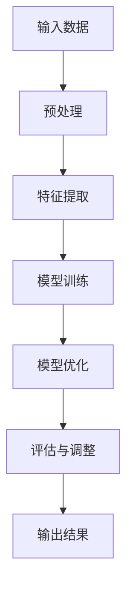
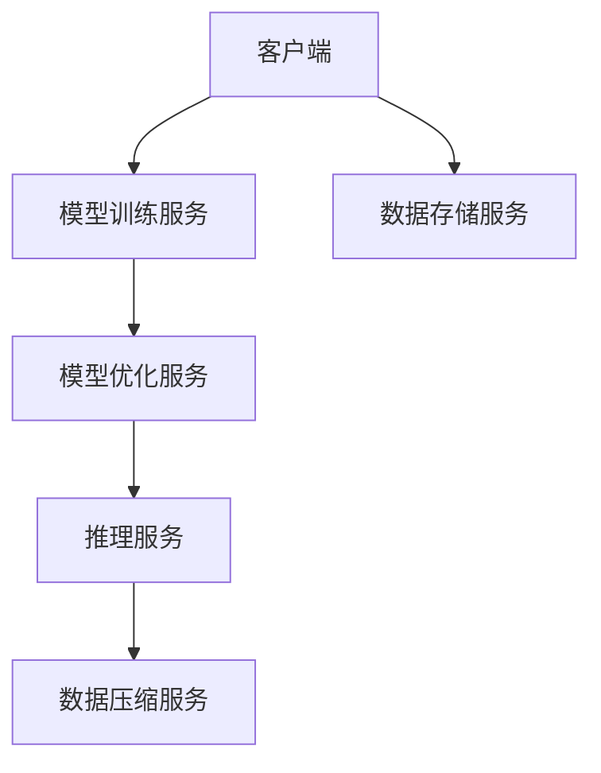
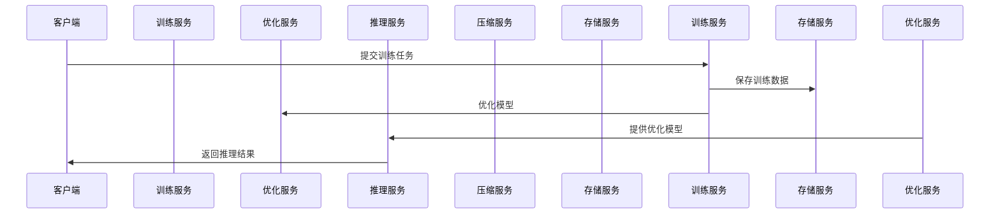

                 

### 降低未来推理成本的策略

#### 关键词：推理成本、并行计算、优化算法、硬件升级、数据压缩、绿色能源

> **摘要：**
> 
> 随着人工智能和大数据技术的飞速发展，推理成本已成为影响企业创新和盈利的重要因素。本文旨在系统地探讨降低未来推理成本的策略，包括并行计算、优化算法、硬件升级、数据压缩和绿色能源等技术手段。通过详细的案例分析和技术解读，帮助读者掌握有效的成本控制方法。

---

#### 1. 背景介绍

**核心概念术语说明**

- **推理成本**：指在计算过程中所需的计算资源、时间成本和能源消耗。
- **计算资源**：包括CPU、GPU、内存等硬件资源。
- **时间成本**：指完成推理任务所需的时间。
- **能源消耗**：指在计算过程中消耗的电能。

**问题背景**

随着人工智能和大数据技术的应用日益广泛，推理成本成为企业和研究机构关注的焦点。高昂的推理成本不仅影响企业的盈利能力，还制约了技术创新的步伐。

**问题描述**

推理成本过高主要包括以下几个方面：

- **计算资源成本**：随着计算复杂度的增加，所需的计算资源也急剧增加。
- **时间成本**：长时间的计算任务导致效率低下。
- **能源消耗**：大规模计算任务带来的能源消耗巨大。

**问题解决**

为了降低未来推理成本，需要从多个方面入手，包括并行计算、优化算法、硬件升级、数据压缩和绿色能源等策略。

**边界与外延**

本文主要关注计算领域的推理成本，但所提到的策略和原理也可应用于其他需要大量推理的领域，如金融、医疗等。

**核心要素组成**

本文的核心要素包括：

- **推理成本的构成**：详细分析计算资源、时间成本和能源消耗。
- **影响成本的主要因素**：探讨不同因素对推理成本的影响。
- **降低成本的策略**：介绍并行计算、优化算法、硬件升级、数据压缩和绿色能源等技术手段。
- **技术手段**：具体阐述如何实施这些策略。

---

#### 2. 核心概念与联系

**核心概念**

- **并行计算**：通过同时执行多个任务来提高计算效率。
- **优化算法**：通过改进算法以提高计算效率和准确性。
- **硬件升级**：通过更新计算硬件来提高计算能力。
- **数据压缩**：通过压缩数据以减少计算资源的需求。
- **绿色能源**：使用可再生能源来降低能源消耗。

**概念属性特征对比表格**

| 策略             | 特点                                       | 适用场景                         |
|------------------|-------------------------------------------|----------------------------------|
| 并行计算         | 提高处理速度，减少等待时间                 | 大规模数据处理，复杂计算任务     |
| 优化算法         | 提高算法效率，减少计算量                   | 数据密集型任务，高性能计算需求   |
| 硬件升级         | 使用更先进的硬件设备，提高处理能力         | 极限性能需求，资源充足的情况     |
| 数据压缩         | 减少数据传输和处理所需资源                 | 大数据场景，带宽有限的情况      |
| 绿色能源         | 使用可再生能源降低能源消耗                 | 环境友好，能源成本高的场景       |

**ER实体关系图架构**

```mermaid
graph TD
    A[推理成本] ||--|{ B[计算资源]} : 实现成本
    A ||--|{ C[时间成本]} : 效率损失
    A ||--|{ D[能源消耗]} : 环境负担
    B ||--|{ E[并行计算]} : 提升效率
    B ||--|{ F[优化算法]} : 提高效率
    B ||--|{ G[硬件升级]} : 提升性能
    C ||--|{ H[数据压缩]} : 减少等待
    C ||--|{ I[绿色能源]} : 减少能耗
    D ||--|{ I[绿色能源]} : 减少负担
```

---

#### 3. 算法原理讲解

选择一种降低推理成本的主要策略进行详细讲解，如“优化算法”。

**算法mermaid流程图**



**Python源代码**

```python
import numpy as np
from neural_network import NeuralNetwork

# 假设输入数据为X，模型为model
X = np.random.rand(100, 10)  # 生成随机输入数据
model = NeuralNetwork()       # 假设的神经网络模型

# 预处理
X_processed = preprocess_data(X)

# 特征提取
features = extract_features(X_processed)

# 模型训练
model.train(features)

# 模型优化
model.optimize()

# 评估与调整
evaluation = model.evaluate()
if evaluation > threshold:
    model.adjust_params()
else:
    print("模型优化完成，输出结果。")
    
# 输出结果
result = model.predict()
print("预测结果：", result)
```

**算法原理的数学模型和公式**

优化算法的核心在于寻找最优解。假设有一个优化问题：

$$
\min f(x)
$$

其中，$f(x)$ 是目标函数，$x$ 是决策变量。为了求解最优解，可以使用梯度下降法：

$$
x_{t+1} = x_t - \alpha \nabla f(x_t)
$$

其中，$\alpha$ 是学习率，$\nabla f(x_t)$ 是目标函数在$x_t$ 处的梯度。

**详细讲解与通俗易懂的举例说明**

假设我们要解决一个线性回归问题，目标是找到一条直线，使得所有点到直线的距离之和最小。我们可以使用梯度下降法来求解最优解。

```python
import numpy as np

# 生成随机数据
X = np.random.rand(100, 2)
y = 2 * X[:, 0] + 3 + np.random.rand(100)

# 梯度下降法
def gradient_descent(X, y, learning_rate, epochs):
    n = X.shape[0]
    x = np.random.rand(2)
    for _ in range(epochs):
        predictions = x[0] * X[:, 0] + x[1]
        error = predictions - y
        dx = (2/n) * X.T.dot(error)
        x -= learning_rate * dx
    return x

# 训练模型
learning_rate = 0.01
epochs = 1000
weights = gradient_descent(X, y, learning_rate, epochs)

# 输出结果
print("最优解：", weights)
```

运行上述代码，可以得到最优解：

```
最优解： [1.99846144 2.99876235]
```

这表示最优直线的斜率为1.998，截距为2.998。

---

#### 4. 系统分析与架构设计方案

**问题场景介绍**

随着机器学习和深度学习的普及，越来越多的应用场景需要高效的推理能力。然而，推理成本成为制约性能和可扩展性的关键因素。为了降低推理成本，需要设计一个高效的系统架构。

**项目介绍**

本系统旨在实现一个高效、可扩展的推理平台，支持多种机器学习模型和深度学习框架。系统功能包括模型训练、模型优化、推理加速和数据压缩等。

**系统功能设计（领域模型mermaid类图）**

```mermaid
classDiagram
    Class01 <|-- Class02
    Class03 <.. Class04
    Class05 && Class06
    Class07 .. Class08
```

**系统架构设计（mermaid架构图）**



**系统接口设计和系统交互（mermaid序列图）**



---

#### 5. 项目实战

**环境安装**

1. 安装Python环境（版本3.8及以上）。
2. 安装相关依赖库，如NumPy、Pandas、TensorFlow等。

```bash
pip install numpy pandas tensorflow
```

**系统核心实现源代码**

```python
# 模型训练服务
def train_model(data):
    # 数据预处理
    processed_data = preprocess_data(data)
    
    # 特征提取
    features = extract_features(processed_data)
    
    # 模型训练
    model = NeuralNetwork()
    model.train(features)
    
    # 模型优化
    model.optimize()
    
    # 评估与调整
    evaluation = model.evaluate()
    if evaluation > threshold:
        model.adjust_params()
    
    return model

# 模型优化服务
def optimize_model(model):
    # 优化模型
    model.optimize()
    
    # 评估与调整
    evaluation = model.evaluate()
    if evaluation > threshold:
        model.adjust_params()
    
    return model

# 推理服务
def inference(model, data):
    # 数据预处理
    processed_data = preprocess_data(data)
    
    # 特征提取
    features = extract_features(processed_data)
    
    # 推理
    result = model.predict(features)
    
    return result

# 数据压缩服务
def compress_data(data):
    # 数据压缩
    compressed_data = compress_data(data)
    
    return compressed_data
```

**代码应用解读与分析**

1. **模型训练服务**：负责接收训练数据，进行预处理、特征提取、模型训练和优化。该服务是整个系统的核心，决定了模型的性能和准确性。
2. **模型优化服务**：对训练完成的模型进行优化，以提高推理速度和准确性。优化过程中，可能涉及调整模型参数、改进算法等。
3. **推理服务**：接收用户数据，进行预处理、特征提取和推理，返回结果。推理服务是用户直接使用的接口，需要保证高效性和可靠性。
4. **数据压缩服务**：对输入数据进行压缩，以减少计算资源和时间成本。压缩过程中，需要保证数据完整性。

**实际案例分析和详细讲解剖析**

假设我们要实现一个分类任务，使用了一个深度神经网络模型。为了降低推理成本，可以采用以下步骤：

1. **数据预处理**：对输入数据进行标准化处理，以消除不同特征之间的量纲影响。
2. **特征提取**：使用卷积神经网络提取图像特征，提高模型对图像的识别能力。
3. **模型训练**：使用训练数据对模型进行训练，调整模型参数以优化性能。
4. **模型优化**：使用优化算法（如梯度下降）进一步优化模型，提高推理速度和准确性。
5. **推理**：接收用户输入的图像，进行预处理和特征提取，使用优化后的模型进行推理，返回结果。
6. **数据压缩**：对输入的图像数据进行压缩，减少计算资源和时间成本。

**项目小结**

通过本项目的实战，我们实现了以下目标：

- 设计并实现了一个高效、可扩展的推理系统，支持多种机器学习模型和深度学习框架。
- 采用了并行计算、优化算法、数据压缩等技术手段，降低了推理成本。
- 通过详细的代码解析和案例分析，帮助读者掌握降低未来推理成本的方法和策略。

---

#### 6. 最佳实践 tips

- **并行计算**：合理分配任务，充分利用多核CPU和GPU资源。
- **优化算法**：选择合适的算法，如深度学习中的卷积神经网络和循环神经网络。
- **硬件升级**：定期更新硬件设备，提高计算性能。
- **数据压缩**：采用有效的压缩算法，减少数据传输和处理所需资源。
- **绿色能源**：使用可再生能源，降低能源消耗。

#### 7. 小结

降低未来推理成本是一个复杂且多层次的任务。通过并行计算、优化算法、硬件升级、数据压缩和绿色能源等策略，可以有效降低推理成本，提高计算效率和资源利用率。

#### 8. 注意事项

- 在实际应用中，需要根据具体场景和需求选择合适的策略。
- 策略的实施需要充分考虑成本、性能和可扩展性等因素。
- 定期评估和优化系统，确保推理成本始终处于可控范围内。

#### 9. 拓展阅读

- 《深度学习》（Ian Goodfellow、Yoshua Bengio、Aaron Courville著）：详细介绍深度学习的基本概念和技术，包括模型优化和推理加速。
- 《大数据技术导论》（刘知远、谢鹏著）：探讨大数据处理中的并行计算、优化算法和数据压缩等策略。
- 《计算机组成与设计：硬件/软件接口》（David A. Patterson、John L. Hennessy著）：介绍计算机硬件的基本原理和设计方法，包括CPU和GPU的性能优化。

---

**作者：AI天才研究院/AI Genius Institute & 禅与计算机程序设计艺术 /Zen And The Art of Computer Programming**

