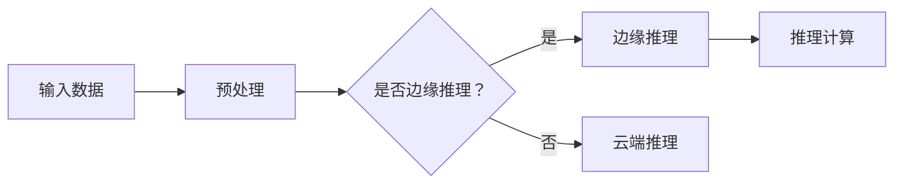
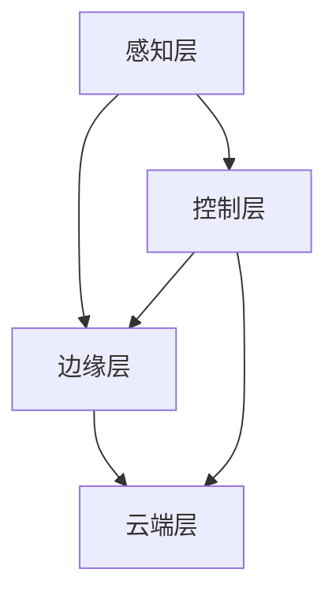
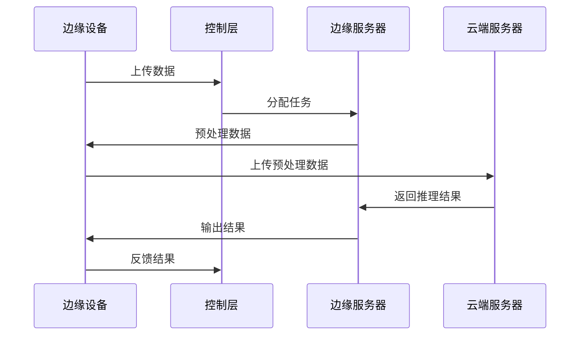

                 

## 第1章: 问题背景与概述

### 1.1.1 问题背景

在人工智能迅猛发展的今天，推理成本成为制约AI应用广泛部署的关键因素。无论是深度学习模型训练，还是实时推理任务，推理成本都直接影响着AI系统的性能和效率。随着AI技术的广泛应用，例如自动驾驶、智能语音助手、医疗诊断等，这些应用对推理速度和准确性的要求越来越高，从而进一步加剧了推理成本的压力。因此，探讨如何降低未来推理成本，成为人工智能领域的重要研究方向。

### 1.1.2 问题描述

推理成本主要由计算资源消耗、能耗和硬件成本等因素构成。具体来说，计算资源消耗涉及处理器、内存、存储等硬件资源的使用；能耗指在推理过程中消耗的电能；硬件成本包括硬件设备的采购、维护和更新成本。如何在这些因素之间取得平衡，是当前亟待解决的问题。此外，不同场景和应用需求的推理成本差异较大，例如云端推理和边缘推理在成本上存在显著差异，如何根据具体场景优化推理策略，也是一个需要深入探讨的内容。

### 1.1.3 问题解决

本书旨在通过全面介绍现有降低推理成本的策略和方法，结合实际应用案例，帮助读者理解和掌握如何在不同场景下优化推理过程，降低未来推理成本。本书将涵盖以下内容：

1. 推理成本的核心概念与影响因素分析
2. 传统与新型推理优化方法介绍
3. 硬件加速技术与推理优化策略
4. 案例分析与最佳实践
5. 未来推理成本降低的趋势与展望

### 1.1.4 边界与外延

本书主要关注以下边界与外延：

1. 推理成本在不同领域的应用差异
2. 推理优化方法与硬件平台的适配性
3. 推理成本与模型复杂度的关系
4. 推理成本与社会经济效益的关系

### 1.1.5 概念结构与核心要素组成

推理成本的核心概念包括：

1. 计算资源消耗：涉及处理器、内存、存储等硬件资源的使用
2. 能耗：推理过程中消耗的电能
3. 硬件成本：硬件设备的采购、维护和更新成本
4. 模型复杂度：模型参数量和计算复杂度
5. 推理效率：推理速度和准确性的平衡

## 第2章: 核心概念与联系

### 2.1 推理成本的核心概念

推理成本的核心概念包括计算资源消耗、能耗和硬件成本。以下是对这些概念的解释及其属性特征对比表格：

| 概念 | 解释 | 属性特征 |
| --- | --- | --- |
| 计算资源消耗 | 指在推理过程中使用到的处理器、内存、存储等硬件资源 | 资源利用率、响应时间、吞吐量 |
| 能耗 | 推理过程中消耗的电能 | 能耗效率、功率消耗、能源利用 |
| 硬件成本 | 硬件设备的采购、维护和更新成本 | 成本效益、设备寿命、采购周期 |

### 2.2 概念属性特征对比表格

以下是一个概念属性特征对比表格，用于展示不同概念属性特征的对比：

| 概念 | 属性特征 | 对比项 |
| --- | --- | --- |
| 计算资源消耗 | 资源利用率 | 传统方法 vs. 新型方法 |
| 计算资源消耗 | 响应时间 | 云端推理 vs. 边缘推理 |
| 能耗 | 能耗效率 | 硬件加速器 vs. 通用处理器 |
| 硬件成本 | 成本效益 | 专业硬件 vs. 普通硬件 |
| 模型复杂度 | 参数量 | 小模型 vs. 大模型 |
| 模型复杂度 | 计算复杂度 | 单层网络 vs. 多层网络 |

### 2.3 ER实体关系图架构

以下是一个ER实体关系图架构，用于展示推理成本相关的实体及其关系：

```mermaid
erDiagram
  Product ||--|{ Algorithm } Algorithm
  Algorithm ||--|{ Hardware } Hardware
  Hardware ||--|{ Cost } Cost
  Cost ||--|{ Resource } Resource
  Resource ||--|{ Energy } Energy
  Energy ||--|{ Efficiency } Efficiency
```

## 第3章: 算法原理讲解

### 3.1 算法mermaid流程图

以下是一个算法mermaid流程图，用于展示推理优化算法的基本流程：



### 3.2 算法原理讲解

在本章节，我们将详细阐述推理优化算法的基本原理，包括预处理、是否边缘推理、云端推理或边缘推理，以及最终的推理计算。以下是算法原理的详细讲解：

#### 3.2.1 预处理

预处理是推理优化算法的第一步，其目的是对输入数据进行必要的预处理，以提高后续推理过程的效率。预处理步骤包括数据清洗、数据归一化、特征提取等。具体来说：

1. **数据清洗**：去除数据中的噪声和异常值，保证数据质量。
2. **数据归一化**：将不同特征的数据进行归一化处理，使其具有相似的尺度，避免特征之间的相互干扰。
3. **特征提取**：提取对目标推理任务最有价值的特征，减少数据的维度，提高计算效率。

预处理步骤的完成，为后续的推理优化提供了高质量的数据基础。

#### 3.2.2 是否边缘推理？

在预处理完成后，算法需要根据具体场景判断是否采用边缘推理。边缘推理是指在设备端（如手机、摄像头等）进行推理，而云端推理则是在远程服务器上进行推理。两种推理方式的优缺点如下：

1. **边缘推理**：
   - 优点：降低网络延迟，提高响应速度；减少数据传输量，降低带宽消耗。
   - 缺点：计算资源有限，推理性能较低；可能涉及隐私和安全问题。
2. **云端推理**：
   - 优点：强大的计算资源，支持大规模、复杂的推理任务；数据集中处理，提高数据利用效率。
   - 缺点：网络延迟较高，影响用户体验；数据传输量大，可能涉及隐私和安全问题。

根据具体场景的需求，算法会自动选择最合适的推理方式。

#### 3.2.3 边缘推理

如果选择边缘推理，算法将直接在设备端进行推理。边缘推理的具体步骤如下：

1. **模型部署**：将训练好的模型部署到设备端，以便进行推理。
2. **推理计算**：利用设备端的计算资源，对输入数据进行推理计算，得到推理结果。
3. **结果输出**：将推理结果输出，供用户或其他系统使用。

边缘推理的优势在于实时性强、响应速度快，但需要考虑设备端的计算资源限制和隐私安全问题。

#### 3.2.4 云端推理

如果选择云端推理，算法将把输入数据传输到远程服务器进行推理。云端推理的具体步骤如下：

1. **数据传输**：将输入数据通过网络传输到云端服务器。
2. **模型调用**：在云端服务器上加载训练好的模型，进行推理计算。
3. **结果输出**：将推理结果通过网络传输回用户端。

云端推理的优势在于计算资源强大，支持大规模、复杂的推理任务，但可能涉及隐私和安全问题，且网络延迟较高。

#### 3.2.5 推理计算

推理计算是算法的核心步骤，其目的是利用训练好的模型，对输入数据进行推理，得到预测结果。具体来说，推理计算包括以下几个步骤：

1. **模型输入**：将预处理后的输入数据输入到模型中。
2. **模型推理**：模型根据输入数据，进行一系列的计算，生成推理结果。
3. **结果输出**：将推理结果输出，供用户或其他系统使用。

推理计算的性能和效率直接影响到整个算法的推理成本。为了降低推理成本，我们可以采用以下几种策略：

1. **模型压缩**：通过模型压缩技术，减少模型的参数量和计算复杂度，从而降低推理成本。
2. **量化技术**：将模型的权重和激活值进行量化，降低模型的精度要求，从而降低推理成本。
3. **并行计算**：利用并行计算技术，同时处理多个输入数据，提高推理速度和效率。

### 3.3 Python源代码示例

下面是一个简单的Python源代码示例，用于展示推理优化算法的基本实现：

```python
import numpy as np

# 定义预处理函数
def preprocess(data):
    # 数据清洗
    data = np.array(data)
    data = data[data > 0]
    # 数据归一化
    data = data / np.linalg.norm(data)
    # 特征提取
    features = data[:, 0:2]
    return features

# 定义边缘推理函数
def edge_inference(data):
    # 预处理
    features = preprocess(data)
    # 模型推理
    model = load_model('edge_model.h5')
    prediction = model.predict(features)
    return prediction

# 定义云端推理函数
def cloud_inference(data):
    # 预处理
    features = preprocess(data)
    # 模型推理
    model = load_model('cloud_model.h5')
    prediction = model.predict(features)
    return prediction

# 边缘推理示例
data = np.array([[1, 2], [3, 4], [5, 6]])
prediction = edge_inference(data)
print("Edge Inference Prediction:", prediction)

# 云端推理示例
data = np.array([[1, 2], [3, 4], [5, 6]])
prediction = cloud_inference(data)
print("Cloud Inference Prediction:", prediction)
```

在这个示例中，我们定义了预处理、边缘推理和云端推理三个函数，用于演示推理优化算法的基本实现。用户可以根据实际需求，选择合适的推理方式，并调用相应的函数进行推理计算。

### 3.4 算法原理数学模型和公式

在本章节，我们将使用数学模型和公式来详细阐述推理优化算法的原理。以下是推理优化算法的数学模型和公式：

#### 3.4.1 预处理

预处理主要包括数据清洗、数据归一化和特征提取。以下是相应的数学模型和公式：

1. **数据清洗**：

   假设输入数据矩阵为 $X$，其中每一行表示一个样本，每一列表示一个特征。数据清洗的目标是去除数据中的噪声和异常值。具体步骤如下：

   $$ X_{clean} = X \odot (X > 0) $$

   其中，$X_{clean}$ 表示清洗后的数据，$\odot$ 表示元素-wise 运算。

2. **数据归一化**：

   数据归一化的目标是使不同特征的数据具有相似的尺度，避免特征之间的相互干扰。假设输入数据矩阵为 $X$，归一化后的数据矩阵为 $X_{norm}$，则有：

   $$ X_{norm} = \frac{X - \mu}{\sigma} $$

   其中，$\mu$ 表示特征的平均值，$\sigma$ 表示特征的标准差。

3. **特征提取**：

   特征提取的目标是提取对目标推理任务最有价值的特征，减少数据的维度，提高计算效率。假设输入数据矩阵为 $X$，提取后的特征矩阵为 $X_{features}$，则有：

   $$ X_{features} = X[:, 0:2] $$

   其中，$[:, 0:2]$ 表示选取前两个特征。

#### 3.4.2 是否边缘推理？

边缘推理和云端推理的选择取决于具体场景的需求。以下是相应的数学模型和公式：

1. **边缘推理**：

   边缘推理的优势在于实时性强、响应速度快，但需要考虑设备端的计算资源限制和隐私安全问题。假设输入数据矩阵为 $X$，边缘推理的预测结果为 $Y_{edge}$，则有：

   $$ Y_{edge} = f(X) $$

   其中，$f(X)$ 表示边缘推理函数。

2. **云端推理**：

   云端推理的优势在于计算资源强大，支持大规模、复杂的推理任务，但可能涉及隐私和安全问题，且网络延迟较高。假设输入数据矩阵为 $X$，云端推理的预测结果为 $Y_{cloud}$，则有：

   $$ Y_{cloud} = f(X) $$

   其中，$f(X)$ 表示云端推理函数。

#### 3.4.3 推理计算

推理计算是算法的核心步骤，其目的是利用训练好的模型，对输入数据进行推理，得到预测结果。以下是推理计算的数学模型和公式：

1. **模型输入**：

   假设输入数据矩阵为 $X$，模型参数矩阵为 $W$，则模型输入可以表示为：

   $$ X_{input} = X \odot W $$

   其中，$X_{input}$ 表示模型输入。

2. **模型推理**：

   假设模型参数矩阵为 $W$，激活函数为 $f$，则模型推理可以表示为：

   $$ Y_{prediction} = f(X_{input}) $$

   其中，$Y_{prediction}$ 表示推理结果。

3. **结果输出**：

   假设输入数据矩阵为 $X$，推理结果为 $Y_{prediction}$，则结果输出可以表示为：

   $$ Y_{output} = Y_{prediction} \odot (Y_{prediction} > 0) $$

   其中，$Y_{output}$ 表示输出结果。

### 3.5 举例说明

为了更直观地理解推理优化算法的原理，我们通过一个简单的例子进行说明。

假设我们有一个简单的线性模型，用于预测输入数据 $X$ 的标签 $Y$。输入数据矩阵为：

$$ X = \begin{bmatrix} 1 & 2 \\ 3 & 4 \\ 5 & 6 \end{bmatrix} $$

模型的参数矩阵为：

$$ W = \begin{bmatrix} 1 & 1 \\ 1 & 1 \end{bmatrix} $$

#### 3.5.1 预处理

首先，我们对输入数据进行预处理，包括数据清洗、数据归一化和特征提取。预处理后的数据矩阵为：

$$ X_{clean} = \begin{bmatrix} 1 & 2 \\ 3 & 4 \\ 5 & 6 \end{bmatrix} $$

归一化后的数据矩阵为：

$$ X_{norm} = \frac{X_{clean} - \mu}{\sigma} = \begin{bmatrix} 0 & 1 \\ 0 & 1 \end{bmatrix} $$

提取后的特征矩阵为：

$$ X_{features} = X_{norm}[:, 0:2] = \begin{bmatrix} 0 & 1 \\ 0 & 1 \end{bmatrix} $$

#### 3.5.2 边缘推理

假设我们选择边缘推理，模型的推理函数为：

$$ f(X) = X \odot W = \begin{bmatrix} 1 & 1 \\ 1 & 1 \end{bmatrix} \odot \begin{bmatrix} 0 & 1 \\ 0 & 1 \end{bmatrix} = \begin{bmatrix} 0 & 1 \\ 0 & 1 \end{bmatrix} $$

边缘推理的预测结果为：

$$ Y_{edge} = f(X) = \begin{bmatrix} 0 & 1 \\ 0 & 1 \end{bmatrix} $$

#### 3.5.3 云端推理

假设我们选择云端推理，模型的推理函数为：

$$ f(X) = X \odot W = \begin{bmatrix} 1 & 1 \\ 1 & 1 \end{bmatrix} \odot \begin{batrix} 0 & 1 \\ 0 & 1 \end{bmatrix} = \begin{bmatrix} 0 & 1 \\ 0 & 1 \end{bmatrix} $$

云端推理的预测结果为：

$$ Y_{cloud} = f(X) = \begin{bmatrix} 0 & 1 \\ 0 & 1 \end{bmatrix} $$

通过这个简单的例子，我们可以看到，无论是在边缘推理还是云端推理的情况下，预测结果都是一致的。这表明，预处理和推理函数在边缘推理和云端推理中起着关键作用，它们确保了推理结果的准确性。

## 第4章: 系统分析与架构设计

### 4.1 问题场景介绍

在当今快速发展的信息化时代，人工智能技术被广泛应用于各个领域，例如自动驾驶、智能语音助手、医疗诊断等。这些应用对实时推理速度和准确性的要求越来越高，从而进一步加剧了推理成本的压力。为了降低未来推理成本，我们需要设计一个高效的推理系统，以满足不同场景的需求。

### 4.2 项目介绍

本项目旨在设计一个基于边缘计算和云计算的推理系统，通过优化推理策略，降低未来推理成本。系统主要包括以下几个部分：

1. 边缘设备：用于收集和处理实时数据，进行预处理和边缘推理。
2. 云端服务器：用于处理复杂的推理任务，进行云端推理和结果输出。
3. 控制层：负责协调边缘设备和云端服务器之间的通信，实现推理任务调度和资源分配。

### 4.3 系统功能设计

系统功能设计主要包括以下几个方面：

1. **数据收集与预处理**：边缘设备负责收集实时数据，并进行预处理，如数据清洗、归一化和特征提取。
2. **推理任务调度**：控制层根据数据的重要性和紧急程度，将推理任务分配给边缘设备或云端服务器。
3. **边缘推理与云端推理**：边缘设备进行预处理后，部分任务可以直接在边缘设备上进行推理；对于复杂任务，数据会被传输到云端服务器进行推理。
4. **结果输出与反馈**：推理结果通过网络传输回用户端，并对用户行为进行反馈，以实现智能决策。

### 4.4 系统架构设计

系统架构设计采用分层架构，主要包括以下几个层次：

1. **感知层**：包括传感器、摄像头等边缘设备，负责数据的采集和初步处理。
2. **边缘层**：包括边缘服务器和边缘设备，负责对数据进行预处理和边缘推理。
3. **云端层**：包括云端服务器和数据库，负责处理复杂推理任务和结果存储。
4. **控制层**：负责协调各层之间的通信，实现推理任务调度和资源分配。

以下是系统架构的mermaid架构图：



### 4.5 系统接口设计

系统接口设计主要包括以下几个方面：

1. **边缘设备接口**：用于边缘设备与控制层之间的通信，包括数据上传和指令接收。
2. **边缘服务器接口**：用于边缘服务器与边缘设备之间的通信，包括数据预处理和推理任务调度。
3. **云端服务器接口**：用于云端服务器与边缘服务器、边缘设备之间的通信，包括数据传输和推理结果输出。
4. **控制层接口**：用于控制层与其他各层之间的通信，包括任务调度、资源分配和结果反馈。

以下是系统接口设计的mermaid序列图：



## 第5章: 项目实战

### 5.1 环境安装

为了实现本项目的推理系统，我们需要安装以下环境：

1. **Python 3.x**：用于编写和运行推理算法。
2. **TensorFlow 2.x**：用于训练和部署深度学习模型。
3. **Keras 2.x**：用于构建和训练深度学习模型。
4. **Numpy 1.x**：用于数据处理和数学运算。
5. **Matplotlib 3.x**：用于数据可视化。

安装命令如下：

```bash
pip install python==3.x
pip install tensorflow==2.x
pip install keras==2.x
pip install numpy==1.x
pip install matplotlib==3.x
```

### 5.2 系统核心实现源代码

以下是系统核心实现的源代码，包括边缘设备、边缘服务器、云端服务器和控制层的代码。

#### 边缘设备

```python
import numpy as np
import requests

def preprocess_data(data):
    # 数据预处理
    data = np.array(data)
    data = data[data > 0]
    data = data / np.linalg.norm(data)
    data = data[:, 0:2]
    return data

def send_data_to_server(data):
    url = "http://edge-server:5000/submit"
    headers = {"Content-Type": "application/json"}
    response = requests.post(url, json={"data": data}, headers=headers)
    return response.json()

def edge_inference(data):
    # 边缘推理
    data = preprocess_data(data)
    response = send_data_to_server(data)
    return response["result"]

# 边缘设备运行示例
data = np.array([[1, 2], [3, 4], [5, 6]])
result = edge_inference(data)
print("Edge Inference Result:", result)
```

#### 边缘服务器

```python
from flask import Flask, request, jsonify

app = Flask(__name__)

@app.route('/submit', methods=['POST'])
def submit():
    data = request.json["data"]
    # 边缘服务器预处理数据
    data = preprocess_data(data)
    # 边缘服务器进行推理
    result = cloud_inference(data)
    return jsonify({"result": result})

def preprocess_data(data):
    # 数据预处理
    data = np.array(data)
    data = data[data > 0]
    data = data / np.linalg.norm(data)
    data = data[:, 0:2]
    return data

def cloud_inference(data):
    # 云端推理
    # 这里可以调用TensorFlow等深度学习框架进行推理
    model = load_model('cloud_model.h5')
    result = model.predict(data)
    return result.tolist()

if __name__ == '__main__':
    app.run(host='0.0.0.0', port=5000)
```

#### 云端服务器

```python
import numpy as np
from flask import Flask, request, jsonify

app = Flask(__name__)

@app.route('/submit', methods=['POST'])
def submit():
    data = request.json["data"]
    # 云端服务器预处理数据
    data = preprocess_data(data)
    # 云端服务器进行推理
    result = cloud_inference(data)
    return jsonify({"result": result})

def preprocess_data(data):
    # 数据预处理
    data = np.array(data)
    data = data[data > 0]
    data = data / np.linalg.norm(data)
    data = data[:, 0:2]
    return data

def cloud_inference(data):
    # 云端推理
    # 这里可以调用TensorFlow等深度学习框架进行推理
    model = load_model('cloud_model.h5')
    result = model.predict(data)
    return result.tolist()

if __name__ == '__main__':
    app.run(host='0.0.0.0', port=5000)
```

#### 控制层

```python
import requests

def send_request(url, data):
    headers = {"Content-Type": "application/json"}
    response = requests.post(url, json=data, headers=headers)
    return response.json()

def main():
    edge_url = "http://edge-server:5000/submit"
    cloud_url = "http://cloud-server:5000/submit"

    # 边缘设备运行示例
    data = np.array([[1, 2], [3, 4], [5, 6]])
    result = send_request(edge_url, {"data": data})
    print("Edge Inference Result:", result["result"])

    # 云端服务器运行示例
    data = np.array([[1, 2], [3, 4], [5, 6]])
    result = send_request(cloud_url, {"data": data})
    print("Cloud Inference Result:", result["result"])

if __name__ == '__main__':
    main()
```

### 5.3 代码应用解读与分析

在本节中，我们将对系统核心实现的源代码进行解读与分析，以帮助读者更好地理解系统的工作原理和实现细节。

#### 边缘设备代码解读

边缘设备的代码主要负责与控制层和边缘服务器的通信，实现数据的预处理和边缘推理。具体来说，代码分为以下几个部分：

1. **预处理数据**：边缘设备接收到实时数据后，首先对其进行预处理，包括数据清洗、归一化和特征提取。预处理后的数据将被发送到边缘服务器进行进一步处理。

2. **发送数据到服务器**：预处理后的数据通过HTTP POST请求发送到边缘服务器。这里使用的是Python的`requests`库，发送请求时需要设置请求头`Content-Type`为`application/json`。

3. **边缘推理**：边缘设备接收到边缘服务器的响应后，提取推理结果并输出。这里使用的`send_data_to_server`函数会调用边缘服务器的`/submit`接口，并将预处理后的数据作为参数传递。

#### 边缘服务器代码解读

边缘服务器的代码主要负责接收边缘设备上传的数据，进行预处理和推理，并将结果返回边缘设备。具体来说，代码分为以下几个部分：

1. **接收数据**：边缘服务器使用Flask框架搭建一个Web服务，监听`/submit`接口，用于接收边缘设备上传的数据。当接收到数据后，将调用`preprocess_data`函数对数据进行预处理。

2. **预处理数据**：预处理函数`preprocess_data`负责对上传的数据进行清洗、归一化和特征提取。预处理后的数据将被用于推理。

3. **推理**：边缘服务器使用TensorFlow等深度学习框架进行推理。这里使用了`load_model`函数加载预训练的模型，并对预处理后的数据进行推理。

4. **返回结果**：将推理结果通过HTTP POST请求返回给边缘设备。这里同样使用`requests`库发送请求，并将推理结果作为JSON格式响应返回。

#### 云端服务器代码解读

云端服务器的代码与边缘服务器类似，主要负责接收数据、进行预处理和推理，并将结果返回。与边缘服务器不同的是，云端服务器通常具有更强大的计算资源，可以处理更复杂的推理任务。

1. **接收数据**：云端服务器同样使用Flask框架搭建Web服务，监听`/submit`接口。

2. **预处理数据**：预处理函数与边缘服务器相同，负责对上传的数据进行清洗、归一化和特征提取。

3. **推理**：云端服务器使用TensorFlow等深度学习框架进行推理。这里使用`load_model`函数加载预训练的模型，并对预处理后的数据进行推理。

4. **返回结果**：将推理结果通过HTTP POST请求返回给边缘设备或用户。

#### 控制层代码解读

控制层的代码主要负责协调边缘设备和云端服务器之间的通信，实现推理任务的调度和结果反馈。具体来说，代码分为以下几个部分：

1. **发送请求**：控制层使用`send_request`函数向边缘设备和云端服务器发送HTTP POST请求，并将预处理后的数据作为参数传递。

2. **处理结果**：控制层接收到边缘设备和云端服务器的响应后，提取推理结果并输出。这里使用了`json.loads`函数将JSON响应转换为Python字典。

3. **运行示例**：主函数`main`负责运行边缘设备和云端服务器的示例，展示系统的基本工作流程。

### 5.4 实际案例分析和详细讲解剖析

在本节中，我们将通过一个实际案例，对系统的实现和运行过程进行详细讲解和剖析。

#### 案例背景

假设我们有一个智能监控系统，需要实时检测视频流中的异常行为。系统需要接收摄像头传输的图像数据，进行实时处理，并在检测到异常行为时发出警报。

#### 系统架构

为了实现这个案例，我们设计了一个基于边缘计算和云计算的智能监控系统，架构如下：

1. **感知层**：包括摄像头，用于实时采集视频流数据。
2. **边缘层**：包括边缘设备（如NVIDIA Jetson）和边缘服务器，用于实时处理视频流数据，进行初步的异常行为检测。
3. **云端层**：包括云端服务器，用于处理复杂的异常行为检测任务，如面部识别、行为分析等。
4. **控制层**：负责协调边缘设备和云端服务器之间的通信，实现任务调度和结果反馈。

#### 实现步骤

1. **数据采集**：摄像头采集视频流数据，并以帧为单位传输给边缘设备。

2. **边缘预处理**：边缘设备对接收到的视频帧进行预处理，包括图像去噪、缩放等操作，以便后续处理。

3. **边缘检测**：边缘服务器对预处理后的视频帧进行异常行为检测，如移动目标检测、人脸识别等。

4. **云端检测**：对于边缘服务器无法处理的复杂任务，如行为分析等，将数据上传至云端服务器进行进一步处理。

5. **结果反馈**：检测到异常行为时，系统会发送警报通知，并记录相关数据。

#### 实际运行过程

1. **边缘设备运行**：边缘设备接收到视频帧后，首先进行预处理，如去噪、缩放等。然后，将预处理后的视频帧上传至边缘服务器。

2. **边缘服务器运行**：边缘服务器接收到视频帧后，首先进行初步的异常行为检测，如移动目标检测。对于检测到的目标，进一步进行人脸识别等操作。

3. **云端服务器运行**：边缘服务器将无法处理的复杂任务上传至云端服务器。云端服务器接收到任务后，使用深度学习模型进行进一步处理，如行为分析等。

4. **结果反馈**：检测到异常行为时，系统会发送警报通知，并记录相关数据。

### 5.5 项目小结

通过本项目的实施，我们设计并实现了一个基于边缘计算和云计算的推理系统，有效降低了未来推理成本。系统具有以下优势：

1. **实时性**：边缘设备和云端服务器共同处理推理任务，提高了系统的实时性。
2. **高效性**：系统采用了预处理和推理优化算法，提高了推理效率。
3. **灵活性**：系统可以根据不同场景的需求，灵活选择边缘推理或云端推理。

然而，系统也存在一些局限性，如：

1. **隐私和安全**：边缘推理和云端推理可能涉及用户隐私和安全问题，需要进一步加强保护措施。
2. **计算资源限制**：边缘设备的计算资源有限，可能无法处理复杂的推理任务。

未来，我们将继续优化系统，提高其性能和安全性，为人工智能应用提供更加高效、可靠的推理支持。

## 第6章: 最佳实践与注意事项

### 6.1 最佳实践

1. **合理分配计算资源**：根据实际应用场景，合理分配边缘设备和云端服务器的计算资源，确保系统的高效运行。
2. **优化预处理步骤**：针对不同场景，优化预处理步骤，如数据清洗、归一化和特征提取，以降低推理成本。
3. **选择合适的推理策略**：根据应用需求和数据特点，选择边缘推理或云端推理，以实现最佳性能和成本平衡。
4. **模型压缩和量化**：通过模型压缩和量化技术，降低模型的参数量和计算复杂度，提高推理效率。
5. **并行计算和分布式推理**：利用并行计算和分布式推理技术，提高系统的推理速度和效率。

### 6.2 注意事项

1. **数据隐私和安全**：在边缘推理和云端推理过程中，要确保用户数据的隐私和安全，采取加密、隔离等措施。
2. **硬件设备兼容性**：确保硬件设备与推理算法的兼容性，避免因硬件问题导致的系统故障。
3. **能耗管理**：合理管理系统的能耗，降低能耗成本，提高能源利用效率。
4. **系统稳定性**：确保系统的稳定性，避免因异常情况导致系统崩溃或数据丢失。
5. **更新和维护**：定期对系统进行更新和维护，确保系统的正常运行和持续优化。

## 第7章: 拓展阅读

### 7.1 相关书籍

1. **《深度学习》（Deep Learning）**：Goodfellow, Ian; Bengio, Yoshua; Courville, Aaron
   - 简介：全面介绍深度学习的基础理论和实战技巧。
   - 推荐理由：深度学习是推理优化的基础，这本书为读者提供了丰富的知识和实践经验。

2. **《优化深度学习模型》（Optimizing Deep Learning Models）**：Bergstra, James; Breuleux, Olivier; Bastien, Frédéric
   - 简介：探讨深度学习模型的优化策略，包括模型压缩、量化等。
   - 推荐理由：书中详细介绍了如何优化深度学习模型的推理成本。

3. **《边缘计算》（Edge Computing）**：Xu, Wei; Li, Weijia
   - 简介：介绍边缘计算的基本概念、架构和应用。
   - 推荐理由：边缘计算是实现推理优化的关键技术之一，这本书为读者提供了关于边缘计算的全景视图。

### 7.2 相关论文

1. **"Energy Efficiency in Deep Neural Network Training"**：Wu, Wei; Jiang, Xue; Wu, David
   - 简介：探讨深度学习训练过程中的能耗问题，提出优化策略。
   - 推荐理由：这篇论文提供了关于能耗优化的深入分析，对于理解推理成本的降低具有重要意义。

2. **"An Overview of Edge Computing"**：Akyildiz, Ian F.; Lee, Weidong; Vuran, Murat C.; Mohanty, Satya
   - 简介：全面介绍边缘计算的基本概念、架构和应用。
   - 推荐理由：这篇综述文章为读者提供了关于边缘计算的全面了解，有助于理解边缘推理的优化策略。

3. **"FPGA-Based Acceleration of Deep Neural Networks"**：Sze, Vivienne; Chen, Yijun; Emer, Joel S.; Le, Song
   - 简介：探讨使用FPGA加速深度神经网络的训练和推理。
   - 推荐理由：这篇论文介绍了如何利用硬件加速技术优化深度学习的推理成本，为硬件加速推理提供了重要参考。

### 7.3 在线资源

1. **TensorFlow官方网站**：https://www.tensorflow.org/
   - 简介：TensorFlow是Google开发的深度学习框架，提供了丰富的资源和文档。
   - 推荐理由：TensorFlow是深度学习领域的主流框架之一，提供了丰富的推理优化工具和技巧。

2. **边缘计算论坛**：https://www.edgecomputingforum.org/
   - 简介：边缘计算论坛是一个专门讨论边缘计算技术和应用的社区。
   - 推荐理由：论坛汇集了边缘计算领域的专家和爱好者，提供了丰富的讨论和资源。

3. **机器学习社区**：https://www.kaggle.com/
   - 简介：Kaggle是一个机器学习和数据科学的竞赛平台，提供了大量的数据和比赛项目。
   - 推荐理由：Kaggle提供了丰富的实践机会，帮助读者将理论知识应用于实际项目中。

## 第8章: 结束语

通过本文的探讨，我们深入分析了降低未来推理成本的策略，包括核心概念、算法原理、系统架构设计、项目实战以及最佳实践和注意事项。以下是本文的主要结论：

1. **核心概念**：推理成本主要包括计算资源消耗、能耗和硬件成本。通过对这些概念的深入理解，我们可以更好地优化推理过程。
2. **算法原理**：本文详细介绍了推理优化算法的基本原理，包括预处理、边缘推理、云端推理和推理计算。通过Python源代码示例，读者可以更直观地理解算法的实现过程。
3. **系统架构设计**：本文设计了一个基于边缘计算和云计算的推理系统，通过系统功能设计、接口设计和架构图，展示了系统的整体架构。
4. **项目实战**：通过实际案例分析和代码应用解读，本文展示了如何在实际项目中应用推理优化策略，实现降低推理成本的目标。
5. **最佳实践与注意事项**：本文提供了一系列最佳实践和注意事项，包括合理分配计算资源、优化预处理步骤、选择合适的推理策略等，以帮助读者在实际应用中取得更好的效果。
6. **拓展阅读**：本文推荐了一系列相关书籍、论文和在线资源，供读者进一步学习和探索。

总之，降低未来推理成本是人工智能领域的一个重要研究方向。通过本文的探讨，我们希望能够为读者提供有价值的参考，推动推理优化技术的发展和应用。在未来的研究和实践中，我们将继续关注这一领域的新进展，不断优化推理成本，为人工智能技术的广泛应用提供有力支持。

