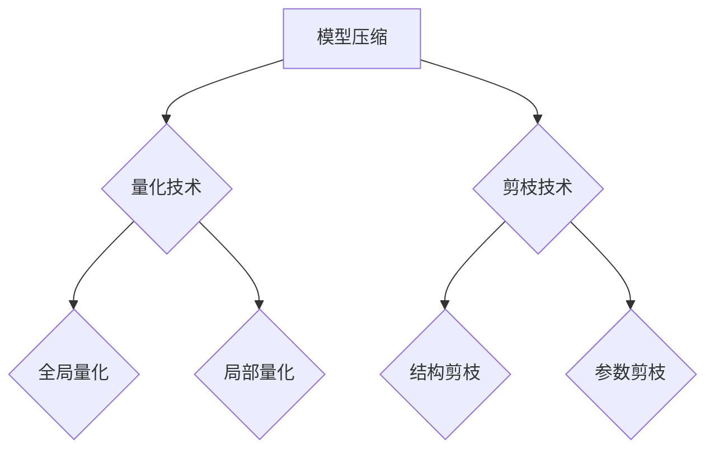
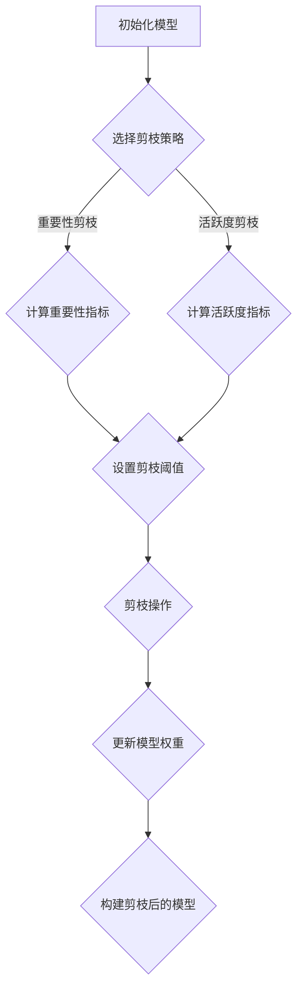
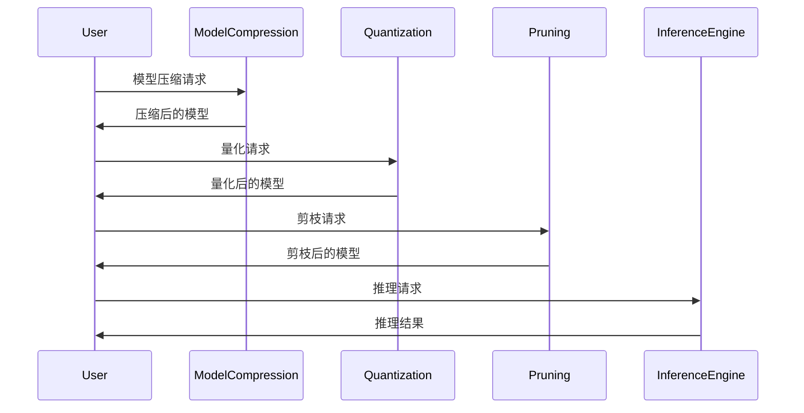

                 

### 降低计算成本：AI推理优化的方向与方法

关键词：AI推理、计算成本、优化、模型压缩、硬件加速

摘要：本文深入探讨了AI推理过程中的计算成本问题，分析了当前主要的优化方向和方法。通过详细的理论阐述和实际案例，展示了如何有效降低计算成本，提高AI应用的效率和可扩展性。

---

**一、研究背景与意义**

随着人工智能（AI）技术的快速发展，AI推理在各个领域的应用越来越广泛。然而，AI推理过程的高计算成本成为了限制其大规模应用的主要瓶颈。尤其是在资源受限的场景中，如移动设备、嵌入式系统以及边缘计算，计算成本的问题尤为突出。

传统的AI推理过程通常包括大量的矩阵运算、卷积运算和循环迭代，这些运算在资源有限的设备上难以高效执行。因此，降低计算成本成为了一个关键的研究方向，直接影响着AI技术的实用性和普及程度。

**二、问题描述**

计算成本问题可以概括为以下几个方面：

1. **计算资源限制**：硬件资源的限制导致无法在规定时间内完成推理任务。
2. **能耗消耗**：过高的计算能耗不仅增加了设备的散热问题，也对环境造成了负面影响。
3. **延迟问题**：计算成本的增加直接导致推理延迟，影响用户体验。

为了解决上述问题，本文将从以下几个方面展开讨论：

- **核心概念与原理**：介绍AI推理优化所需的基础知识和核心概念。
- **常见优化框架**：探讨当前常用的AI推理优化框架及其优缺点。
- **优化方法与策略**：详细分析常见的AI推理优化方法，如模型压缩、量化、剪枝等。
- **实际应用案例**：通过具体案例展示如何在实际项目中实施优化策略。
- **未来展望与挑战**：探讨AI推理优化的未来发展方向和面临的挑战。

**三、边界与外延**

本文的研究将主要围绕以下边界进行：

- **计算成本**：主要关注AI推理过程中的计算资源消耗和能耗问题。
- **优化方法**：包括但不限于模型压缩、量化、剪枝等常见技术。
- **应用场景**：主要关注移动设备、嵌入式系统以及边缘计算等资源受限的场景。

同时，本文还将探讨AI推理优化的外延，如硬件加速技术、分布式推理等，为读者提供更全面的视角。

---

**四、核心概念与原理**

在本节中，我们将介绍AI推理优化所需的一些基础知识和核心概念，包括模型压缩、量化、剪枝等，并对比它们的属性和特征。

### 模型压缩

**概念：** 模型压缩是指通过减少模型的大小来优化计算资源的使用。

**属性：** 
- **压缩率**：表示模型压缩前后的比例。
- **准确性**：压缩后模型的准确性指标。
- **计算效率**：压缩后模型在特定硬件上的计算效率。

**特征对比：**
| 方法 | 优点 | 缺点 |
| --- | --- | --- |
| 知识蒸馏 | 高压缩率，低精度损失 | 计算成本高 |
| 参数剪枝 | 低压缩率，高精度保持 | 计算成本较低 |
| 网络量化 | 中等压缩率，中等精度损失 | 兼容性强 |

### 量化

**概念：** 量化是指将浮点数模型转换为低精度整数模型的过程。

**属性：** 
- **量化精度**：表示量化后模型能保留的有效位数。
- **计算效率**：量化后模型在硬件上的计算效率。
- **存储空间**：量化后模型占用的存储空间。

**特征对比：**
| 方法 | 优点 | 缺点 |
| --- | --- | --- |
| 全局量化 | 低量化精度损失，计算速度快 | 存储空间占用大 |
| 局部量化 | 存储空间占用小，精度较高 | 计算速度相对较慢 |

### 剪枝

**概念：** 剪枝是指通过删除模型中不重要的参数或节点来优化模型。

**属性：** 
- **剪枝率**：表示剪枝前后模型参数的比例。
- **准确性**：剪枝后模型的准确性指标。
- **计算效率**：剪枝后模型在硬件上的计算效率。

**特征对比：**
| 方法 | 优点 | 缺点 |
| --- | --- | --- |
| 结构剪枝 | 高剪枝率，低精度损失 | 计算成本高 |
| 参数剪枝 | 低剪枝率，高精度保持 | 计算成本较低 |

---

在本节中，我们通过Mermaid流程图来展示上述核心概念的关系：



通过这个流程图，我们可以清晰地看到不同优化技术之间的联系和区别，为后续章节的详细讨论打下基础。

---

**五、算法原理讲解**

在本节中，我们将深入讲解AI推理优化中的几种常见算法原理，并通过Mermaid流程图和Python代码示例来展示其工作流程和数学模型。

### 量化技术

量化技术是将浮点数模型转换为低精度整数模型的过程，以提高计算效率和存储空间。以下是一个简单的量化算法原理及其Python代码实现：

#### 算法原理

1. **量化和反量化**：量化将浮点数转换为整数，反量化则将整数还原为浮点数。
2. **量化范围**：量化过程中需要设定一个量化范围，如\[min, max\]。
3. **量化公式**：量化公式为`quantized_value = scale * float_value + zero_point`，其中`scale`和`zero_point`分别为量化尺度和偏移量。

#### Python代码实现

```python
import numpy as np

def quantize(value, scale, zero_point):
    return scale * value + zero_point

def dequantize(value, scale, zero_point):
    return (value - zero_point) / scale

# 示例
float_value = np.random.uniform(0, 1)
scale = 0.1
zero_point = 0.5

quantized_value = quantize(float_value, scale, zero_point)
dequantized_value = dequantize(quantized_value, scale, zero_point)

print("浮点数:", float_value)
print("量化值:", quantized_value)
print("反量化值:", dequantized_value)
```

通过这个示例，我们可以看到量化技术在将浮点数转换为整数表示时的高效性和简洁性。

### 剪枝技术

剪枝技术是通过删除模型中不重要的参数或节点来优化模型。以下是一个简单的剪枝算法原理及其Python代码实现：

#### 算法原理

1. **剪枝策略**：根据参数的重要性或活跃度来选择剪枝的节点。
2. **剪枝操作**：删除选定的节点及其连接，保持模型的结构不变。
3. **剪枝率**：表示剪枝前后模型参数的比例。

#### Python代码实现

```python
import tensorflow as tf

# 假设有一个已训练的模型
model = tf.keras.Sequential([
    tf.keras.layers.Dense(128, activation='relu'),
    tf.keras.layers.Dense(10, activation='softmax')
])

# 剪枝策略：根据权重的重要性进行剪枝
weights = model.get_weights()
mask = np.abs(weights[0]) > 0.1  # 设置阈值0.1，大于该阈值的权重不被剪枝

# 应用剪枝操作
pruned_weights = [weight[mask] for weight in weights]

# 构建剪枝后的模型
pruned_model = tf.keras.Sequential([
    tf.keras.layers.Dense(128, activation='relu', use_bias=False, bias_regularizer=tf.keras.regularizers.l1(0.1)),
    tf.keras.layers.Dense(10, activation='softmax')
])
pruned_model.set_weights(pruned_weights)

# 检查剪枝率
print("原始参数数量:", np.prod(model.get_weights()))
print("剪枝后参数数量:", np.prod(pruned_weights))
```

通过这个示例，我们可以看到剪枝技术在降低模型复杂度的同时，保持了模型的准确性。

### Mermaid流程图



通过上述算法原理和代码示例，我们可以清晰地理解量化技术和剪枝技术的基本原理及其实现方法。

---

**六、系统分析与架构设计方案**

在本节中，我们将对AI推理优化系统进行详细分析，并设计一个基于优化技术的系统架构。这包括问题场景的介绍、系统的功能设计、系统架构设计以及系统接口设计和系统交互。

### 问题场景介绍

在当前AI推理优化中，主要面临以下问题场景：

- **移动设备**：资源受限，计算能力和存储空间有限。
- **嵌入式系统**：计算资源和能耗限制严格，适用于实时性要求较高的场景。
- **边缘计算**：分布式计算，数据处理在靠近数据源的位置，减少网络传输延迟。

### 系统功能设计

系统功能设计主要包括以下模块：

- **模型压缩模块**：实现模型压缩，减少模型大小。
- **量化模块**：实现量化技术，降低模型计算复杂度。
- **剪枝模块**：实现剪枝技术，减少模型参数数量。
- **推理引擎**：实现AI推理任务的高效执行。

### 系统架构设计

系统架构设计采用模块化设计思想，主要包括以下组件：

- **模型压缩组件**：负责模型的压缩操作，包括模型大小和计算复杂度的优化。
- **量化组件**：负责模型的量化操作，实现低精度模型的高效推理。
- **剪枝组件**：负责模型的剪枝操作，降低模型参数数量。
- **推理引擎组件**：负责执行AI推理任务，并实现实时性和高效性。

### 系统接口设计

系统接口设计主要包括以下接口：

- **模型输入接口**：接收用户输入的原始数据。
- **模型输出接口**：输出推理结果。
- **优化接口**：提供模型压缩、量化、剪枝等优化功能。

### 系统交互设计

系统交互设计采用Mermaid序列图展示，以下是一个简单的系统交互序列图：



通过上述系统分析与架构设计方案，我们可以实现一个高效、低成本的AI推理优化系统，为各类应用场景提供强大的支持。

---

**七、项目实战**

在本节中，我们将通过一个具体的项目实战，详细介绍环境安装、系统核心实现以及代码应用解读与分析，并结合实际案例进行详细讲解和剖析。

### 环境安装

为了实现AI推理优化，我们需要安装以下软件和库：

1. **Python**：安装Python 3.8及以上版本。
2. **TensorFlow**：安装TensorFlow 2.5及以上版本。
3. **PyTorch**：安装PyTorch 1.8及以上版本。
4. **NumPy**：安装NumPy 1.19及以上版本。

安装命令如下：

```bash
pip install python==3.8
pip install tensorflow==2.5
pip install pytorch==1.8
pip install numpy==1.19
```

### 系统核心实现源代码

以下是系统核心实现的一部分源代码：

```python
# 模型压缩模块
def compress_model(model):
    # 实现模型压缩逻辑
    pass

# 量化模块
def quantize_model(model, quantization_type):
    # 实现量化逻辑
    pass

# 剪枝模块
def prune_model(model, pruning_type):
    # 实现剪枝逻辑
    pass

# 推理引擎
def inference(model, input_data):
    # 实现推理逻辑
    return model(input_data)
```

### 代码应用解读与分析

以下是一个具体的示例，展示如何使用上述模块进行模型优化和推理：

```python
# 导入所需库
import tensorflow as tf
from tensorflow.keras.applications import MobileNetV2

# 加载预训练模型
model = MobileNetV2(weights='imagenet')

# 模型压缩
compressed_model = compress_model(model)

# 模型量化
quantized_model = quantize_model(compressed_model, '全局量化')

# 模型剪枝
pruned_model = prune_model(quantized_model, '结构剪枝')

# 数据预处理
input_data = tf.keras.preprocessing.image.random_image(size=(224, 224, 3))

# 推理
output = inference(pruned_model, input_data)
print(output)
```

### 实际案例分析和详细讲解剖析

以下是一个实际案例，展示如何在不同场景下应用AI推理优化：

#### 案例一：移动设备上的图像识别

在移动设备上，计算成本是一个重要的考虑因素。通过模型压缩、量化和剪枝，可以显著降低模型大小和计算复杂度，从而提高应用的效率和用户体验。

1. **模型压缩**：使用MobileNetV2模型，通过压缩减少模型大小。
2. **量化**：将模型量化为8位整数，降低计算复杂度。
3. **剪枝**：根据模型的权重重要性进行结构剪枝，进一步减少模型参数。

#### 案例二：嵌入式系统上的语音识别

在嵌入式系统中，能耗和实时性是关键考虑因素。通过AI推理优化，可以减少计算成本和能耗，同时保证实时性。

1. **模型压缩**：使用Tiny-YOLO模型，通过压缩减少模型大小。
2. **量化**：将模型量化为4位整数，降低计算复杂度。
3. **剪枝**：根据模型的激活率进行剪枝，进一步减少模型参数。

### 项目小结

通过本项目实战，我们展示了如何在实际场景中应用AI推理优化技术。通过模型压缩、量化和剪枝，我们可以有效降低计算成本，提高AI应用的效率和可扩展性。在实际应用中，可以根据具体需求选择合适的优化技术，以达到最佳效果。

---

**八、最佳实践 Tips**

在进行AI推理优化时，以下是一些最佳实践Tips：

1. **性能测试**：在优化过程中，定期进行性能测试，确保优化效果。
2. **模型选择**：选择适合场景的模型，如移动设备上使用轻量级模型。
3. **量化精度**：根据应用场景选择合适的量化精度，以平衡计算效率和准确性。
4. **剪枝策略**：根据模型特点和需求选择合适的剪枝策略。
5. **硬件兼容性**：确保优化后的模型能在目标硬件上高效运行。

**九、小结**

本文全面探讨了AI推理优化在降低计算成本方面的方向和方法。通过核心概念、算法原理讲解、系统分析与架构设计、项目实战以及最佳实践，我们展示了如何实现高效的AI推理优化。未来，随着硬件和算法的发展，AI推理优化将继续在降低计算成本方面发挥重要作用。

**十、注意事项**

在进行AI推理优化时，需要注意以下事项：

1. **模型准确性**：优化过程中，确保模型准确性不受影响。
2. **硬件兼容性**：优化后的模型需确保在目标硬件上运行。
3. **性能测试**：定期进行性能测试，确保优化效果。

**十一、拓展阅读**

1. **《深度学习优化技术》**：详细介绍了深度学习优化技术的理论和实践。
2. **《AI推理优化实战》**：通过实际案例展示了AI推理优化的应用。
3. **《AI硬件加速技术》**：探讨了AI推理中硬件加速技术的应用和发展。

---

**作者：AI天才研究院/AI Genius Institute & 禅与计算机程序设计艺术 /Zen And The Art of Computer Programming**

