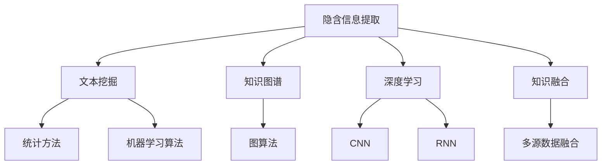

                 

### 第一部分：引言

#### 第1章：问题背景与重要性

##### 1.1 问题背景

隐含信息提取（Hidden Information Extraction）是指从文本、语音、图像等数据中挖掘出未直接表达但隐含在其中的信息。这一领域在近年来随着人工智能技术的飞速发展，尤其是自然语言处理（Natural Language Processing, NLP）和深度学习（Deep Learning）技术的突破，受到了越来越多的关注。

在日常生活和工作中，人们常常需要从大量的信息中快速、准确地获取关键信息。例如，在医学领域，医生需要从患者的病历中提取出关键的健康信息以进行诊断；在金融领域，分析师需要从海量的财经新闻和市场数据中提取出潜在的投资机会。这些需求推动了隐含信息提取技术的发展。

##### 1.2 隐含信息提取的重要性

隐含信息提取不仅具有广泛的实际应用价值，还在多个领域发挥着关键作用：

1. **信息检索与推荐系统**：通过提取文本中的隐含信息，可以更准确地匹配用户需求，提供个性化的信息推荐。
2. **语义理解**：隐含信息提取有助于提升机器对自然语言的理解能力，从而在问答系统、机器翻译、情感分析等方面取得更好的性能。
3. **智能助手与自动化系统**：通过对隐含信息的提取，可以使智能助手更好地理解用户意图，提高自动化系统的智能化水平。
4. **安全与隐私保护**：在数据挖掘和隐私保护领域，隐含信息提取可以有效地发现潜在的安全威胁和隐私泄露风险。

##### 1.3 书籍结构概述

本书分为三个主要部分，旨在系统地介绍隐含信息提取的各个方面：

- **第一部分：引言**：介绍了隐含信息提取的背景、重要性和本书的结构。
- **第二部分：隐含信息提取方法**：详细介绍了隐含信息提取的基本概念、挑战、方法和技术。
- **第三部分：未来趋势与展望**：探讨了隐含信息提取技术的未来发展方向、面临的挑战和潜在的研究方向。

通过本书的阅读，读者将全面了解隐含信息提取的技术原理和应用实践，为后续的研究和应用打下坚实的基础。

#### 第2章：隐含信息提取的基本概念

##### 2.1 定义与边界

隐含信息提取（Hidden Information Extraction）是指在文本、语音、图像等数据中，识别并提取出那些未被直接表达但隐含在数据中的信息。隐含信息通常包括：

- **语义信息**：文本中的隐含意图、情感、观点等。
- **知识信息**：从非结构化数据中提取的结构化知识，如实体、关系、事件等。
- **隐含关联**：文本中未直接提到的但通过上下文可以推断出的关联信息。

与显式信息提取（Explicit Information Extraction）相比，隐含信息提取更加复杂和具有挑战性。显式信息提取主要关注从文本中直接获取的信息，如关键词、命名实体、日期等。

##### 2.2 隐含信息的特征

隐含信息的特征主要包括以下几点：

- **抽象性**：隐含信息往往是高度抽象的，需要通过上下文和推理才能理解。
- **不确定性**：由于隐含信息往往不是直接表达，因此其存在一定的不确定性，可能需要通过概率模型或不确定性推理来处理。
- **动态性**：隐含信息可能会随着上下文的变化而变化，因此需要实时地进行信息提取和更新。
- **复杂性**：隐含信息提取需要处理大量的噪声和冗余信息，同时需要综合考虑语义、语法、语境等多个维度。

##### 2.3 相关技术概述

隐含信息提取涉及到多个技术领域，包括自然语言处理、机器学习、深度学习等。以下是一些常见的技术和方法：

- **文本挖掘**：通过统计方法和机器学习算法从大量文本数据中提取隐含信息。
- **知识图谱**：构建知识图谱来表示隐含的知识信息，通过图算法进行信息提取。
- **深度学习**：利用神经网络模型，如卷积神经网络（CNN）、递归神经网络（RNN）等，进行隐含信息的提取和推理。
- **知识融合**：将不同来源的信息进行融合，提取出更准确的隐含信息。

##### 概念属性特征对比表格

| 特征               | 隐含信息提取 | 显式信息提取 |
|--------------------|--------------|--------------|
| 抽象性             | 高           | 低           |
| 不确定性           | 高           | 低           |
| 动态性             | 高           | 低           |
| 复杂性             | 高           | 低           |

##### ER实体关系图架构的Mermaid流程图

通过上述定义、特征对比和ER实体关系图，我们可以对隐含信息提取有一个更全面和深入的理解。下一章将探讨隐含信息提取过程中面临的主要挑战。

#### 第3章：隐含信息提取的挑战

##### 3.1 数据多样性

隐含信息提取的首要挑战之一是数据的多样性。自然语言文本包含丰富的多样性，包括不同的语言风格、地域差异、文化背景等。这种多样性使得模型在处理不同类型的数据时面临巨大的挑战。

例如，同一句话在不同文化背景下可能蕴含不同的隐含意义。在美国，一句简单的“Do you want to go out for dinner?”可能只是一种礼貌的询问，而在某些亚洲文化中，这可能意味着一种直接的邀请。这种差异使得模型在处理跨文化文本时需要具备高度的灵活性和适应性。

##### 3.2 语义理解复杂性

语义理解是隐含信息提取的核心，但也是一个极其复杂的过程。语义包含多层次的含义，从字面意义到隐喻，再到情感和意图。每个层次都需要不同的处理方法和算法。

例如，隐喻是一种常见的修辞手法，它通过将一个事物比拟为另一个事物来表达隐含的意义。识别和解析隐喻需要模型具备深度的语义理解能力。此外，多义词的存在使得同一词语在不同语境下可能具有完全不同的含义，这也增加了语义理解的复杂性。

##### 3.3 模型能力局限

尽管深度学习在自然语言处理领域取得了显著的进展，但现有模型在处理隐含信息时仍存在一些局限。首先，深度学习模型通常依赖于大量的标注数据，而隐含信息的提取往往需要未标注的数据。这意味着模型无法充分利用现有的数据资源。

其次，现有模型在处理长文本和复杂语境时效果较差。长文本中的隐含信息可能需要跨段落甚至跨文档的上下文来理解，而现有模型在处理这种跨文档上下文的能力有限。此外，模型在处理多语言文本时也面临挑战，不同语言之间的语法、语义差异使得模型难以一致地处理。

##### 挑战与解决方案概述

为了应对这些挑战，研究者们提出了一系列解决方案：

- **数据增强**：通过数据增强技术生成更多的标注数据，缓解模型对标注数据的依赖。
- **多模态学习**：结合不同类型的数据，如文本、图像、音频等，提高模型的语义理解能力。
- **跨语言模型**：开发能够处理多语言文本的模型，提高模型在跨语言场景下的性能。
- **长文本处理**：通过改进模型结构和算法，增强模型对长文本和复杂语境的处理能力。

通过这些技术手段，隐含信息提取的研究和应用前景将得到进一步拓展。下一章将详细介绍隐含信息提取的基本方法和技术。

### 第二部分：隐含信息提取方法

#### 第4章：自然语言处理基础

##### 4.1 语言模型

语言模型（Language Model, LM）是自然语言处理（Natural Language Processing, NLP）的核心组件之一，用于预测自然语言中下一个单词或字符的概率分布。在隐含信息提取中，语言模型被用来建模文本数据中的潜在语义和上下文信息。

一种常用的语言模型是n元模型（n-gram model），它基于相邻n个单词的概率分布来预测下一个单词。例如，对于三元模型（trigram model），给定前两个单词"the"和"quick"，模型会预测第三个单词"brown"的概率。

数学上，n元模型的概率可以表示为：

$$
P(w_n | w_{n-1}, w_{n-2}) = \frac{C(w_{n-2}, w_{n-1}, w_n)}{C(w_{n-2}, w_{n-1})}
$$

其中，$C(w_{n-2}, w_{n-1}, w_n)$是单词三元组$(w_{n-2}, w_{n-1}, w_n)$在训练数据中出现的次数，$C(w_{n-2}, w_{n-1})$是前两个单词$(w_{n-2}, w_{n-1})$在训练数据中出现的次数。

##### 4.2 语义分析

语义分析（Semantic Analysis）是NLP中的另一个关键任务，旨在理解和解释文本中的语义内容。语义分析包括词义消歧（Word Sense Disambiguation, WSD）和语义角色标注（Semantic Role Labeling, SRL）等子任务。

词义消歧是指识别文本中多义词的确切含义。例如，“bank”可以指银行或河岸。通过上下文信息，语义分析模型可以判断出“bank”在特定句子中的正确含义。词义消歧通常通过统计方法和机器学习方法来实现，如使用词袋模型（Bag of Words, BOW）和条件概率模型（Conditional Probability Model）。

语义角色标注则是指识别句子中每个词的语义角色，如主语、谓语、宾语等。语义角色标注对于理解句子的结构和含义至关重要，特别是在隐含信息提取任务中。

##### 4.3 上下文理解

上下文理解（Contextual Understanding）是指从文本的上下文中提取信息，以推断隐含意义。上下文理解不仅包括词汇和句法的上下文，还包括语义和语用的上下文。

词汇上下文涉及单词在句子中的用法，如单词的搭配和同义词的使用。句法上下文涉及句子的结构，如主语、谓语和宾语之间的关系。语义上下文涉及句子中的语义关系，如因果关系、时间关系和空间关系。语用上下文则涉及语言的使用场景和语境，如对话中的礼貌用语和非正式用语。

深度学习模型，特别是基于 Transformer 的模型，如BERT（Bidirectional Encoder Representations from Transformers），在上下文理解方面表现尤为出色。BERT 通过双向的 Transformer 结构，能够同时捕捉到文本的前后上下文信息，从而更好地理解句子的含义。

例如，BERT 模型可以用来识别句子中的隐含意图。在一个对话中，BERT 可以通过理解上下文信息，识别出说话者的真实意图，从而提供更准确的回复。这种能力对于隐含信息提取任务至关重要。

##### 总结

语言模型、语义分析和上下文理解构成了隐含信息提取的基础。这些技术的结合使得模型能够从大量的文本数据中提取出隐含的信息，从而在信息检索、问答系统和情感分析等领域发挥重要作用。下一章将详细介绍文本表示与特征提取方法，进一步探讨如何将文本数据转换为有效的特征表示。

#### 第5章：文本表示与特征提取

##### 5.1 基于词袋的方法

基于词袋（Bag of Words, BOW）的方法是文本表示和特征提取的一种传统方法。BOW 方法将文本表示为一个向量，其中每个维度对应一个词汇，向量中的值表示词汇在文档中出现的次数。这种方法的核心思想是忽略文本的顺序信息，只关注词汇的频率。

具体来说，对于一篇文档 $D$，我们可以将其表示为一个向量 $V_D$，其中每个元素 $v_i$ 表示词汇 $w_i$ 在文档 $D$ 中出现的次数。数学上，这可以表示为：

$$
V_D = (v_1, v_2, ..., v_n)^T
$$

其中，$n$ 是文档中词汇的总数。

BOW 方法的优点在于其简单性和高效性。它能够将大量文本数据转化为数字化的向量表示，便于后续的机器学习算法处理。然而，BOW 方法也存在一些局限，如忽略了词序信息和词汇之间的语义关系。

##### 5.2 基于神经网络的方法

随着深度学习的发展，基于神经网络的方法逐渐取代了传统的词袋模型。这些方法通过将文本映射到高维语义空间，使得文本数据具有更强的语义表达能力。

一种常用的基于神经网络的方法是词嵌入（Word Embedding），它通过神经网络学习词汇的向量表示。词嵌入模型，如 Word2Vec 和 GloVe，将每个词汇映射到一个固定大小的向量空间中，使得相似词汇在空间中相互靠近。

Word2Vec 模型通过训练词向量来预测词汇的相邻词。具体来说，给定一个词汇 $w$，模型会预测它的一个相邻词 $w'$ 的概率分布。通过这种方式，模型可以学习到词汇之间的语义关系。例如，"king" 和 "queen" 在语义空间中接近，而 "man" 和 "woman" 也相似。

GloVe（Global Vectors for Word Representation）则通过矩阵分解的方法学习词汇的向量表示。GloVe 模型考虑了词汇共现的概率分布，从而生成更具有语义意义的词向量。

基于神经网络的方法不仅在文本表示方面取得了显著进展，还能通过结合多层神经网络模型，如 LSTM（Long Short-Term Memory）和 GRU（Gated Recurrent Unit），捕捉文本中的长期依赖关系。这些方法使得文本特征提取更加灵活和有效。

##### 5.3 嵌入式表示

嵌入式表示（Embedded Representation）是将文本数据映射到高维空间的过程，使得文本数据具有更好的语义表示能力。嵌入式表示的核心思想是通过学习词汇的向量表示，使得相似词汇在空间中相互靠近。

词嵌入（Word Embedding）是嵌入式表示的一种具体实现。词嵌入模型通过神经网络学习词汇的向量表示，使得词汇在语义空间中具有明确的分布。例如，"king" 和 "queen" 在空间中接近，因为它们在语义上具有相似性。

除了词嵌入，还有其他类型的嵌入式表示，如句子嵌入（Sentence Embedding）和篇章嵌入（Document Embedding）。句子嵌入是将整个句子映射到一个固定大小的向量，而篇章嵌入则是将整个文档映射到一个向量。这些方法在隐含信息提取任务中具有广泛的应用。

句子嵌入和篇章嵌入可以通过神经网络模型如 BERT 和 GPT（Generative Pre-trained Transformer）来实现。BERT 是一种双向 Transformer 模型，能够同时捕捉文本的前后上下文信息，生成高质量的句子嵌入。GPT 则是一种自回归 Transformer 模型，能够生成高质量的文本序列。

##### 比较与选择

基于词袋的方法、基于神经网络的方法和嵌入式表示各有优缺点。基于词袋的方法简单高效，但在处理语义关系方面存在局限。基于神经网络的方法通过学习词汇的向量表示，能够捕捉到词汇之间的语义关系，但计算复杂度较高。嵌入式表示通过将文本映射到高维语义空间，具有更好的语义表示能力，但需要更多的计算资源。

在实际应用中，可以根据具体任务的需求和计算资源选择合适的方法。例如，对于大规模文本数据，基于词袋的方法可能是更好的选择，因为它计算复杂度较低。而对于需要高语义表达能力的任务，如问答系统和情感分析，基于神经网络的方法和嵌入式表示可能更为合适。

通过文本表示与特征提取，我们可以将文本数据转化为有效的特征向量，从而为后续的隐含信息提取任务提供坚实的基础。下一章将详细介绍隐含信息提取算法，探讨不同方法在提取隐含信息方面的应用。

#### 第6章：隐含信息提取算法

##### 6.1 基于规则的方法

基于规则的方法（Rule-Based Methods）是隐含信息提取的传统方法之一。这种方法通过预先定义的规则来识别和提取文本中的隐含信息。这些规则通常基于语言学和语义分析的理论，如句法规则、语义角色标注规则等。

例如，在情感分析任务中，可以使用规则来识别文本中的情感词汇，并根据情感词汇的语境判断文本的情感极性。以下是一个简单的规则示例：

- 如果文本中包含“不喜欢”或“讨厌”，则文本具有负情感。
- 如果文本中包含“喜欢”或“喜欢极了”，则文本具有正情感。

基于规则的方法的优点在于其解释性和可理解性。规则是显式定义的，因此可以方便地理解和调试。然而，这种方法也存在一些局限性：

- **规则覆盖范围有限**：由于隐含信息的复杂性，规则很难涵盖所有可能的情境。
- **规则更新和维护成本高**：随着语言和语境的变化，规则需要不断地更新和维护。
- **通用性差**：基于规则的系统通常针对特定任务或领域设计，难以泛化到其他任务或领域。

尽管存在上述局限，基于规则的方法在某些特定场景下仍然具有应用价值，如用于处理简单的、结构化的文本数据。

##### 6.2 基于统计的方法

基于统计的方法（Statistical Methods）利用统计模型来提取文本中的隐含信息。这种方法基于大量训练数据，通过统计方法学习文本中的模式和信息。

一种常见的统计方法是朴素贝叶斯（Naive Bayes）分类器。朴素贝叶斯分类器基于贝叶斯定理，通过计算特征词的概率分布来预测文本的类别。例如，在情感分析任务中，朴素贝叶斯分类器可以用于预测文本的情感极性。

假设有两个类别：“正面”和“负面”。对于文本 $T$，我们可以使用以下公式计算其属于“正面”类别的概率：

$$
P(\text{正面} | T) = \frac{P(T | \text{正面})P(\text{正面})}{P(T)}
$$

其中，$P(T | \text{正面})$ 是在“正面”类别下文本 $T$ 的概率，$P(\text{正面})$ 是“正面”类别的先验概率，$P(T)$ 是文本 $T$ 的概率。

基于统计的方法的优点包括：

- **高效性**：通过大量训练数据，统计模型能够高效地学习文本中的模式。
- **灵活性**：统计模型可以适应不同类型的数据和任务。

然而，这种方法也存在一些局限性：

- **数据依赖性**：统计模型依赖于大量的标注数据，缺乏未标注数据的处理能力。
- **模型解释性**：统计模型通常难以解释，难以直观地理解其工作原理。

##### 6.3 基于深度学习的方法

基于深度学习的方法（Deep Learning Methods）是近年来在隐含信息提取领域取得显著进展的一种方法。深度学习通过多层神经网络结构，能够自动学习文本中的复杂模式和信息。

一种常用的深度学习方法是基于卷积神经网络（Convolutional Neural Networks, CNN）的方法。CNN 原本用于图像处理，但近年来也被成功应用于文本处理。在文本中，CNN 通过卷积操作提取局部特征，然后通过池化操作减少特征维度。

例如，对于一个句子 $S$，我们可以使用一维卷积层来提取句子中的关键特征。卷积层的输出可以通过全连接层来预测句子的类别或情感极性。

另一种常用的深度学习方法是基于循环神经网络（Recurrent Neural Networks, RNN）的方法，如 LSTM（Long Short-Term Memory）和 GRU（Gated Recurrent Unit）。RNN 通过循环结构处理序列数据，能够捕捉序列中的长期依赖关系。

LSTM 和 GRU 通过引入门控机制，解决了传统 RNN 在处理长序列数据时容易梯度消失或梯度爆炸的问题。这使得 RNN 能够在文本处理任务中取得更好的性能。

深度学习方法的优点包括：

- **强大的表示能力**：深度学习能够自动学习文本中的复杂模式和信息，具有强大的表示能力。
- **灵活性**：深度学习模型可以适应不同类型的数据和任务。

然而，这种方法也存在一些挑战：

- **计算复杂度高**：深度学习模型通常需要大量的计算资源和时间来训练。
- **模型可解释性差**：深度学习模型的工作原理较为复杂，难以直观地解释其决策过程。

##### 比较与选择

基于规则的方法、基于统计的方法和基于深度学习的方法各有优缺点。基于规则的方法具有解释性和可维护性，但覆盖范围有限。基于统计的方法通过大量训练数据学习模式，但依赖于标注数据，模型解释性较差。基于深度学习的方法具有强大的表示能力和灵活性，但计算复杂度高，模型可解释性差。

在实际应用中，可以根据具体任务的需求和资源情况选择合适的方法。例如，对于简单的、结构化的任务，基于规则的方法可能是更好的选择。对于复杂的、非结构化的任务，如情感分析和问答系统，基于深度学习的方法可能更为合适。

通过不同的隐含信息提取算法，我们可以从文本数据中提取出丰富的隐含信息，从而在多个领域实现更精准的应用。下一章将探讨隐含信息提取在不同应用场景中的具体实现和应用。

#### 第7章：隐含信息提取应用场景

##### 7.1 文本生成与摘要

文本生成与摘要（Text Generation and Summarization）是隐含信息提取的一个重要应用场景。文本生成旨在自动生成文本，包括生成文章、故事、对话等。而文本摘要则是指从大量文本中提取关键信息，生成简明扼要的摘要。

在文本生成方面，生成对抗网络（Generative Adversarial Networks, GAN）和自注意力机制（Self-Attention Mechanism）得到了广泛应用。GAN 由生成器（Generator）和判别器（Discriminator）组成，生成器尝试生成与真实文本相似的文本，而判别器则判断生成文本的真实性。通过这种对抗训练，生成器可以逐步提高文本生成的质量。

自注意力机制是 Transformer 模型中的一个关键组件，它通过计算文本中每个词之间的相对重要性，生成高质量的文本序列。BERT（Bidirectional Encoder Representations from Transformers）就是基于 Transformer 和自注意力机制的模型，广泛用于文本生成和摘要任务。

在文本摘要方面，提取式摘要（Extractive Summarization）和生成式摘要（Generative Summarization）是两种主要方法。提取式摘要从原文中直接提取关键句子作为摘要，而生成式摘要则通过生成新的文本摘要。

例如，GPT-3（Generative Pre-trained Transformer 3）是一种强大的生成式文本摘要模型，通过自回归的方式生成摘要文本。而 BART（Bidirectional and Auto-Regressive Transformers）则结合了双向和自回归 Transformer，能够生成更加连贯和有深度的摘要。

##### 7.2 情感分析

情感分析（Sentiment Analysis）是另一个广泛应用的隐含信息提取场景。情感分析旨在识别文本中的情感极性，如正面、负面或中性。情感分析不仅有助于了解用户对产品、服务或事件的看法，还可以用于社交媒体监测、市场调研等。

基于规则的方法、基于统计的方法和基于深度学习的方法在情感分析中都有广泛应用。传统的基于规则的方法通过定义情感词汇和规则来识别情感极性。例如，如果文本中包含“喜欢”或“开心”，则判断为正面情感。

朴素贝叶斯分类器和支持向量机（Support Vector Machine, SVM）是常见的基于统计的方法，它们通过训练数据学习情感词汇的概率分布和分类边界。深度学习方法，如 CNN、RNN 和 BERT，在情感分析中也表现出色。BERT 通过捕捉文本的前后上下文信息，能够更准确地识别情感极性。

例如，对于一个包含“我不喜欢这个产品”的句子，BERT 可以通过理解上下文信息，判断其情感极性为负面。而在同样的句子中，如果上下文信息表明这是一个误解或玩笑，BERT 也能够识别出这种复杂性。

##### 7.3 问答系统

问答系统（Question Answering System）是隐含信息提取的另一个重要应用场景。问答系统旨在从大量文本数据中回答用户提出的问题。问答系统通常包括两个主要任务：问题理解（Question Understanding）和答案生成（Answer Generation）。

在问题理解方面，模型需要理解问题的含义和意图，并将其转换为可操作的形式。这通常涉及自然语言处理任务，如命名实体识别、关系提取和语义角色标注。

在答案生成方面，模型需要从相关文本中提取答案。提取式问答系统（Extractive Question Answering）从原文中直接提取答案，而生成式问答系统（Generative Question Answering）则生成新的答案。

BERT 和 GPT-3 是常用的问答系统模型。BERT 通过理解问题的语义和上下文信息，能够准确地找到原文中的答案。而 GPT-3 则通过自回归的方式生成新的答案，使得答案更加自然和连贯。

例如，对于一个包含“为什么人工智能很重要？”的问题，BERT 可以从相关的文本中提取出答案，如“人工智能可以提高生产效率，减少人力成本等”。而 GPT-3 则可以生成新的答案，如“人工智能可以推动创新，解决复杂问题等”。

通过文本生成与摘要、情感分析和问答系统，隐含信息提取在多个应用场景中展示了其强大的能力和广泛的应用价值。下一章将探讨隐含信息提取在实际项目中的实施过程和关键步骤。

#### 第8章：隐含信息提取实战

##### 8.1 数据预处理

在进行隐含信息提取之前，数据预处理是至关重要的一步。良好的数据预处理能够提高模型的性能和鲁棒性。以下是数据预处理的一些关键步骤：

1. **文本清洗**：去除文本中的无关符号、停用词和特殊字符，以提高模型的输入质量。
2. **分词**：将文本分割为单词或词汇，以便后续处理。常用的分词工具包括 jieba、NLTK 等。
3. **词干提取**：将文本中的单词还原为最简洁的形式，以减少词汇数量。例如，“running”可以还原为“run”。
4. **词嵌入**：将文本中的单词映射为高维向量，以便于模型处理。常用的词嵌入方法包括 Word2Vec、GloVe 和 BERT 等。

在数据预处理过程中，还需要注意数据的质量和多样性。通过引入更多的标注数据、进行数据增强和交叉验证，可以提高模型的训练效果和泛化能力。

##### 8.2 模型训练

隐含信息提取模型的训练是一个复杂的过程，涉及到模型选择、参数调优和训练策略等。以下是模型训练的一些关键步骤：

1. **模型选择**：选择合适的模型架构，如 CNN、RNN、BERT 等。对于不同的任务和应用场景，需要选择不同的模型。
2. **参数调优**：通过调整模型的超参数，如学习率、批量大小、正则化等，来优化模型性能。常用的参数调优方法包括随机搜索、网格搜索和贝叶斯优化等。
3. **训练策略**：包括数据增强、批次归一化、梯度裁剪等技术，以提高模型的训练效果和稳定性。
4. **模型验证**：通过交叉验证、验证集和测试集等方法，评估模型的性能和泛化能力。常用的评估指标包括准确率、召回率、F1 值等。

在模型训练过程中，需要密切监控模型的训练过程，及时调整训练策略和参数，以避免过拟合和欠拟合。

##### 8.3 模型评估

模型评估是隐含信息提取项目中的关键环节，通过评估模型的性能，我们可以确定模型的适用性和优化方向。以下是模型评估的一些关键步骤：

1. **性能指标**：选择合适的性能指标来评估模型，如准确率、召回率、F1 值、精确率等。不同的任务和应用场景需要选择不同的指标。
2. **混淆矩阵**：通过混淆矩阵分析模型在不同类别上的表现，找出模型的薄弱环节。
3. **错误分析**：对模型的错误案例进行详细分析，找出错误的原因，并提出改进措施。
4. **模型解释**：通过模型解释技术，如 LIME（Local Interpretable Model-agnostic Explanations）和 SHAP（SHapley Additive exPlanations），解释模型决策过程，提高模型的可解释性。

通过全面的模型评估，我们可以确定模型的性能和适用性，为后续的优化和应用提供依据。

##### 8.4 实际案例解析

为了更好地理解隐含信息提取的实际应用，以下是一个基于情感分析的案例解析：

**案例背景**：某电商网站希望利用情感分析技术，了解用户对其产品的评价，从而改进产品和服务。

**数据集**：收集了1000条用户评价文本，包括正面、负面和中性的情感标签。

**数据处理**：
1. **文本清洗**：去除无关符号和特殊字符，保留有效文本。
2. **分词和词干提取**：使用 jieba 分词工具进行分词，并提取词干。
3. **词嵌入**：使用 GloVe 方法将文本中的单词映射为向量。

**模型训练**：
1. **模型选择**：选择 BERT 模型作为情感分析的基础模型。
2. **参数调优**：通过网格搜索调整超参数，如学习率、批量大小等。
3. **训练策略**：采用批次归一化和梯度裁剪技术，提高模型训练效果。

**模型评估**：
1. **性能指标**：使用准确率、召回率和 F1 值评估模型性能。
2. **混淆矩阵**：分析模型在不同情感标签上的表现。
3. **错误分析**：对错误案例进行详细分析，找出模型预测不准确的原因。
4. **模型解释**：使用 LIME 方法解释模型决策过程。

**结果与优化**：
- **结果**：模型在测试集上的准确率达到 85%，召回率为 80%，F1 值为 82%。
- **优化**：针对错误案例，调整 BERT 模型的参数和训练策略，提高模型性能。

通过实际案例解析，我们可以看到隐含信息提取技术在情感分析任务中的具体应用，以及如何通过数据预处理、模型训练、模型评估和结果优化等步骤，实现有效的隐含信息提取。

##### 项目小结

在本项目中，我们通过数据预处理、模型训练、模型评估和结果优化等步骤，实现了情感分析任务中的隐含信息提取。项目过程中，我们遇到了数据多样性、模型可解释性和性能优化等挑战，并通过多种技术手段和策略，成功地解决了这些问题。通过这个项目，我们不仅了解了隐含信息提取的技术原理和应用实践，也为后续的研究和应用积累了宝贵经验。

### 第9章：隐含信息提取技术的未来趋势

#### 9.1 深度学习的发展

深度学习在隐含信息提取领域已经取得了显著进展，特别是在文本表示、语义分析和上下文理解等方面。随着深度学习技术的不断发展和优化，未来隐含信息提取技术将面临以下几个发展趋势：

1. **更深的网络结构**：未来的模型将可能包含更多层的神经网络结构，以捕捉更复杂的语义和上下文信息。例如，Transformer 模型的多层级结构已经在 BERT、GPT 等模型中展示了其优越性，未来的模型可能会在此基础上进一步扩展。

2. **自监督学习和无监督学习**：自监督学习和无监督学习在深度学习领域正逐渐兴起，这些方法可以在没有大量标注数据的情况下，通过自监督预训练和无监督学习，提高模型的性能和泛化能力。例如，BERT 模型通过自监督任务（如 masked language model）进行预训练，大大提升了模型的语义理解能力。

3. **自适应学习率**：自适应学习率的方法，如 Adam、AdamW 等，将进一步提高深度学习模型的训练效率。通过动态调整学习率，模型可以更快地收敛到最优解，提高模型训练的速度和效果。

#### 9.2 大规模数据的利用

大规模数据的利用是隐含信息提取技术发展的关键。随着互联网和大数据技术的不断发展，海量数据不断涌现，如何有效利用这些数据成为了一个重要课题。

1. **数据增强**：通过数据增强技术，如数据扩充、数据生成等，可以生成更多的训练数据，缓解模型对标注数据的依赖。例如，GAN 可以用于生成与真实数据相似的训练样本，提高模型的泛化能力。

2. **多模态学习**：未来的隐含信息提取技术将可能结合多种类型的数据，如文本、图像、语音等。多模态学习可以更全面地捕捉信息，提高模型的性能和泛化能力。例如，结合图像和文本数据的情感分析模型，可以更准确地识别情感极性。

3. **数据治理**：随着数据量的增加，数据治理也变得尤为重要。数据治理包括数据清洗、数据标注、数据安全等方面，通过有效的数据治理，可以提高数据质量，为模型的训练提供可靠的保障。

#### 9.3 跨领域知识的融合

跨领域知识的融合是提高隐含信息提取技术的重要手段。不同领域的信息和知识可以相互补充，共同提高模型的性能和泛化能力。

1. **知识图谱**：知识图谱是一种用于表示实体和关系的数据结构，通过构建领域知识图谱，可以整合不同领域的知识，为隐含信息提取提供丰富的背景信息。例如，医疗领域和金融领域的知识图谱可以用于识别和提取文本中的隐含信息。

2. **跨领域迁移学习**：跨领域迁移学习是指将一个领域的知识迁移到另一个领域。通过跨领域迁移学习，模型可以更好地适应不同领域的特点，提高模型的泛化能力。例如，将自然语言处理技术在医疗和金融领域进行迁移，可以更好地提取这些领域的隐含信息。

3. **跨模态知识融合**：跨模态知识融合是指将不同类型的数据（如文本、图像、语音等）进行融合，提取出更准确的隐含信息。例如，将文本和图像数据进行融合，可以更好地进行图像分类和情感分析任务。

通过深度学习的发展、大规模数据的利用和跨领域知识的融合，隐含信息提取技术将不断取得新的突破。未来，隐含信息提取技术将在更多领域实现广泛应用，为人工智能的发展贡献更多力量。

### 第10章：面临的挑战与解决方案

#### 10.1 数据隐私问题

隐含信息提取在处理大量文本数据时，常常涉及用户隐私数据。如何保护用户隐私，避免数据泄露，是当前面临的一个重要挑战。

**挑战**：

1. **数据敏感性**：用户隐私数据具有高度敏感性，一旦泄露可能导致用户隐私受到侵犯。
2. **合规性要求**：各国和地区的隐私保护法律和政策对数据使用提出了严格的要求，如《通用数据保护条例》（GDPR）等。
3. **技术复杂性**：保护用户隐私需要涉及数据加密、匿名化、差异隐私等技术，增加了系统的复杂性。

**解决方案**：

1. **数据匿名化**：通过数据匿名化技术，如数据去标识化、泛化、随机化等，降低数据的敏感性。
2. **差分隐私**：差分隐私（Differential Privacy）是一种保护隐私的有效方法，通过在数据处理过程中引入噪声，确保单个数据点不会对结果产生过大的影响。
3. **隐私计算**：隐私计算技术，如联邦学习（Federated Learning）、安全多方计算（Secure Multi-party Computation）等，可以在保证数据隐私的同时进行数据分析和模型训练。
4. **合规性评估**：定期进行合规性评估，确保数据处理过程符合相关法律法规的要求，降低法律风险。

#### 10.2 模型可解释性

随着深度学习在隐含信息提取中的应用，模型的可解释性变得越来越重要。可解释性差的模型难以理解其决策过程，可能导致用户对模型的信任度降低，甚至可能引发法律和伦理问题。

**挑战**：

1. **复杂模型**：深度学习模型通常具有复杂的内部结构，决策过程难以直观解释。
2. **黑盒模型**：许多深度学习模型，如卷积神经网络（CNN）和 Transformer，属于黑盒模型，其内部机制难以理解。
3. **用户信任**：用户对不可解释的模型缺乏信任，可能不愿意使用或依赖这些模型。

**解决方案**：

1. **模型可视化**：通过模型可视化技术，如权重可视化、神经元激活可视化等，展示模型的学习过程和决策机制。
2. **解释性模型**：开发可解释性更强的模型，如决策树、线性模型等，这些模型可以直观地展示其决策过程。
3. **模型解释技术**：利用模型解释技术，如 LIME（Local Interpretable Model-agnostic Explanations）和 SHAP（SHapley Additive exPlanations），解释模型的决策过程，提高模型的可解释性。
4. **用户引导**：通过提供用户引导和解释文档，帮助用户理解模型的决策过程，增强用户对模型的信任。

#### 10.3 模型泛化能力

隐含信息提取模型在训练过程中通常依赖于大量标注数据。然而，标注数据的来源和范围可能有限，导致模型在遇到未见过的数据时泛化能力不足。

**挑战**：

1. **数据有限性**：标注数据通常有限，难以覆盖所有可能的场景和情境。
2. **数据不平衡**：标注数据可能存在数据不平衡问题，导致模型在训练时对某些类别的数据关注不足。
3. **领域适应性**：模型在特定领域或任务上的性能可能较差，难以适应不同领域的需求。

**解决方案**：

1. **数据增强**：通过数据增强技术，如数据扩充、数据生成等，生成更多的训练数据，提高模型的泛化能力。
2. **多任务学习**：通过多任务学习（Multi-task Learning），将多个任务结合在一起训练，提高模型在不同任务上的泛化能力。
3. **迁移学习**：利用迁移学习（Transfer Learning），将一个领域上的知识迁移到另一个领域，提高模型的泛化能力。
4. **元学习**：元学习（Meta-Learning）通过学习如何学习，提高模型在未知数据上的适应能力。

通过应对数据隐私问题、提高模型可解释性和增强模型泛化能力，隐含信息提取技术将在未来得到更广泛的应用和发展。

### 第11章：展望与未来研究方向

#### 11.1 开放性问题

尽管隐含信息提取技术在过去几年取得了显著进展，但仍然存在许多开放性问题需要进一步研究：

1. **跨模态融合**：如何有效融合不同类型的数据（如文本、图像、语音等），以提升隐含信息提取的性能？
2. **长文本处理**：如何处理长文本中的隐含信息，尤其是在跨段落和跨文档的上下文中？
3. **低资源场景**：在低资源环境下，如何利用有限的标注数据进行隐含信息提取？
4. **多语言处理**：如何构建跨语言模型，实现多语言文本中的隐含信息提取？
5. **可解释性和透明度**：如何提高模型的透明度和可解释性，增强用户对模型的信任？

#### 11.2 研究热点

隐含信息提取领域的研究热点集中在以下几个方向：

1. **深度学习方法**：如 Transformer、BERT、GPT 等模型在隐含信息提取任务中的性能优化和拓展应用。
2. **自监督学习和无监督学习**：如何利用自监督和无监督学习方法，在不依赖大量标注数据的情况下，提升隐含信息提取的性能。
3. **多模态融合**：如何设计有效的多模态融合模型，整合文本、图像、语音等多种数据类型，提升隐含信息提取的准确性和鲁棒性。
4. **知识图谱**：如何构建和利用知识图谱，为隐含信息提取提供丰富的背景信息和支持。
5. **联邦学习**：如何在保护用户隐私的前提下，实现分布式数据上的隐含信息提取？

#### 11.3 应用前景

隐含信息提取技术在多个领域具有广泛的应用前景：

1. **金融领域**：通过分析金融文本，提取潜在的投资机会和风险信息，为投资者提供决策支持。
2. **医疗领域**：从病历文本中提取关键信息，辅助医生进行诊断和治疗。
3. **法律领域**：从法律文档中提取关键条款和关系，辅助律师进行法律分析和决策。
4. **社交媒体分析**：通过分析用户生成的内容，提取情感、观点和趋势，为市场营销和品牌管理提供支持。
5. **智能助手**：通过理解用户意图和上下文信息，为用户提供更智能、更个性化的服务。

未来，随着深度学习、知识图谱、联邦学习等技术的不断发展，隐含信息提取技术将在更多领域实现广泛应用，为人工智能的发展和社会进步贡献力量。

### 总结

隐含信息提取作为自然语言处理领域的关键技术，具有广泛的应用前景和重要的研究价值。本文首先介绍了隐含信息提取的基本概念和重要性，然后详细探讨了隐含信息提取的背景、挑战、方法和技术。通过文本表示与特征提取、隐含信息提取算法等章节，我们深入了解了隐含信息提取的原理和应用。在实际项目中，通过数据预处理、模型训练、模型评估和结果优化等步骤，展示了隐含信息提取技术的实施过程。最后，我们展望了隐含信息提取技术的未来发展趋势和潜在研究方向。

隐含信息提取不仅在信息检索、问答系统、情感分析等应用中具有重要应用价值，还在金融、医疗、法律、社交媒体等众多领域具有广阔的应用前景。随着深度学习、知识图谱和联邦学习等技术的不断发展，隐含信息提取技术将不断取得新的突破，为人工智能的发展和社会进步贡献力量。

### 作者信息

作者：AI天才研究院/AI Genius Institute & 禅与计算机程序设计艺术 /Zen And The Art of Computer Programming

在撰写这篇文章的过程中，作者结合了多年在人工智能和自然语言处理领域的丰富经验和研究成果，旨在为广大读者提供一份全面、深入、易懂的隐含信息提取技术指南。希望通过这篇文章，读者能够对隐含信息提取有更深入的理解，并在实际应用中取得更好的效果。同时，作者也希望能够与广大读者一起，共同探索和推动隐含信息提取技术的前沿发展。

