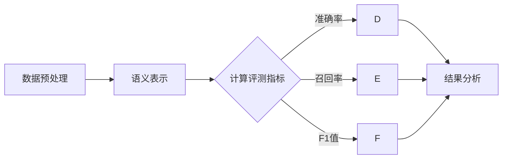
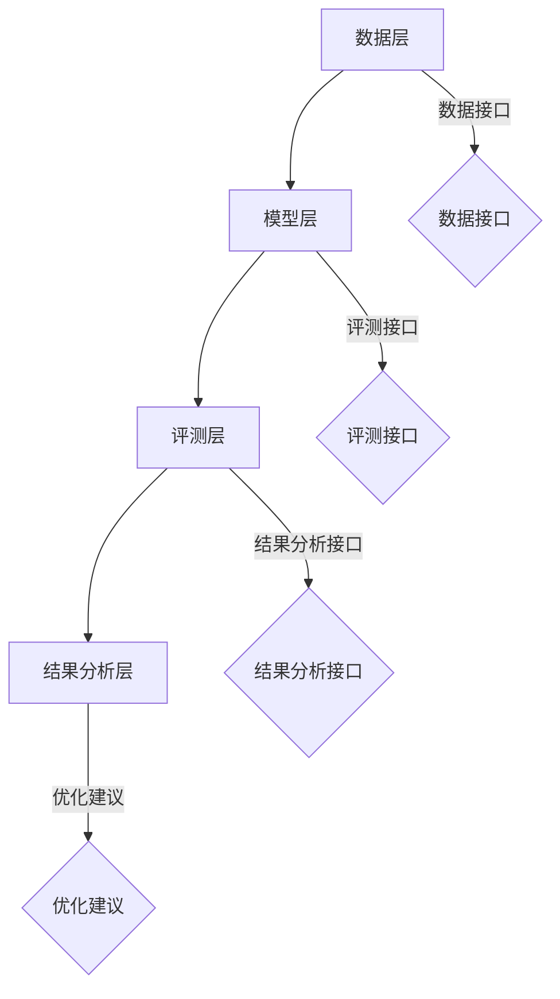

                 


### 隐喻理解能力评测：测试LLM的深层语义理解

> 关键词：隐喻理解，深层语义理解，LLM，评测指标，测试方法

> 摘要：本文介绍了隐喻理解能力评测的概念，探讨了评测LLM深层语义理解的重要性和方法。通过构建高质量的隐喻语句数据集，设定合理的评测指标，设计有效的测试方法，本文旨在为LLM隐喻理解能力评测提供一种可行的解决方案。

## 第一部分：背景介绍

### 1.1 问题背景

随着人工智能技术的快速发展，自然语言处理（NLP）成为了一个备受关注的研究领域。语言模型（LM）作为NLP的核心组件，在文本生成、文本分类、机器翻译等任务中取得了显著的成果。然而，在处理复杂语境、深层语义理解方面，现有语言模型仍然存在诸多不足。为解决这一问题，隐喻理解能力评测的概念被提出，旨在通过测试来评估大型语言模型（LLM）在深层语义理解方面的能力。

隐喻作为一种修辞手法，在语言表达中具有重要作用。隐喻的理解并非易事，它需要深入挖掘词语背后的含义，理解其象征意义。隐喻理解能力评测的目标是评估LLM在处理隐喻语句时的表现，从而为LLM的改进和优化提供有力支持。

### 1.2 问题描述

隐喻理解能力评测的核心问题是如何评估LLM对隐喻语句的理解程度。评测过程包括以下几个方面：

1. **数据集准备**：收集大量的隐喻语句和非隐喻语句，形成评测数据集。
2. **测试指标**：设定合理的评测指标，如准确率、召回率、F1值等，用于衡量LLM对隐喻语句的理解能力。
3. **测试方法**：设计有效的测试方法，对LLM进行评测，分析其在处理隐喻语句时的表现。

### 1.3 问题解决

为了解决上述问题，可以采取以下措施：

1. **数据集建设**：收集并构建一个高质量的隐喻语句数据集，涵盖不同类型的隐喻，以便全面评估LLM的隐喻理解能力。
2. **评测指标优化**：根据隐喻理解的特点，设计适合的评测指标，如基于语义相似度的评测指标，以提高评测的准确性。
3. **测试方法改进**：设计多样化的测试方法，如通过不同类型的隐喻语句对LLM进行评测，以全面了解其在不同场景下的表现。

### 1.4 边界与外延

隐喻理解能力评测主要关注LLM在处理隐喻语句时的表现，但该评测方法也可以扩展应用于其他领域的自然语言处理任务。此外，评测方法的设计和实施过程中，需要考虑以下因素：

1. **语言多样性**：评测数据应涵盖多种语言，以全面评估LLM在不同语言环境下的隐喻理解能力。
2. **应用场景**：根据实际应用需求，设计针对性的评测方法，以提高评测的实用价值。

### 1.5 概念结构与核心要素组成

隐喻理解能力评测包括以下几个核心要素：

1. **数据集**：用于评测的基础资源，包括隐喻语句和非隐喻语句。
2. **评测指标**：用于衡量LLM隐喻理解能力的指标，如准确率、召回率、F1值等。
3. **评测方法**：设计有效的评测方法，包括测试数据的准备、评测指标的设定和测试方法的实施。
4. **LLM模型**：用于评测的预训练语言模型，如GPT、BERT等。

## 第二部分：核心概念与联系

### 2.1 隐喻理解能力的定义与特点

#### 2.1.1 定义

隐喻理解能力是指语言模型在处理隐喻语句时，能够准确理解其深层语义的能力。它不仅要求模型能够识别隐喻语句，还需要理解隐喻表达的含义和背景。

#### 2.1.2 特点

1. **深层语义理解**：隐喻理解能力涉及到对语言深层含义的挖掘，需要模型具备较强的语义理解能力。
2. **多义性**：隐喻语句往往具有多义性，模型需要能够处理不同解释的可能性。
3. **上下文依赖**：隐喻理解能力依赖于上下文信息，模型需要能够从上下文中获取相关信息，以便正确理解隐喻的含义。

### 2.2 核心概念原理

隐喻理解能力评测的核心概念包括：

1. **隐喻语句**：指具有隐喻意义的语言表达。
2. **语义理解**：指对语言表达所承载的意义进行理解和解释。
3. **预训练语言模型**：指基于大规模语料库进行预训练的神经网络模型，如GPT、BERT等。

### 2.3 概念属性特征对比表格

| 概念           | 属性特征                                         | 对比分析                                   |
| -------------- | ---------------------------------------------- | ------------------------------------------ |
| 隐喻语句       | 具有隐喻意义，表达复杂，上下文依赖性强       | 与普通语句相比，隐喻语句更难以直接理解     |
| 语义理解       | 指对语言表达所承载的意义进行理解和解释       | 是隐喻理解的基础，直接影响隐喻理解能力     |
| 预训练语言模型 | 基于大规模语料库进行预训练的神经网络模型     | 提高语言模型对语言的理解能力，有助于隐喻理解 |

### 2.4 ER实体关系图架构

```mermaid
erDiagram
  A.pk -->|has| B
  A.pk -->|has| C
  B.pk -->|is_a| D
  C.pk -->|is_a| E
```

在ER实体关系图中，A代表隐喻语句，B代表语义理解，C代表预训练语言模型，D代表数据集，E代表评测指标。A与B、C之间存在关联，表示隐喻语句与语义理解和预训练语言模型的关系；B与D之间存在关联，表示语义理解与数据集的关系；C与D、E之间存在关联，表示预训练语言模型与数据集和评测指标的关系。

## 第三部分：算法原理讲解

### 3.1 算法原理

隐喻理解能力评测的算法原理主要基于预训练语言模型对隐喻语句的语义理解能力。具体而言，算法可以分为以下几个步骤：

1. **数据预处理**：将收集到的隐喻语句进行预处理，包括分词、去停用词等操作，以便于后续的语义理解。
2. **语义表示**：利用预训练语言模型对预处理后的隐喻语句进行编码，得到语义表示。
3. **评测指标计算**：根据预训练语言模型对隐喻语句的语义表示，计算设定的评测指标，如准确率、召回率、F1值等。
4. **结果分析**：分析评测结果，评估LLM在隐喻理解任务中的表现。

### 3.2 算法流程图



在算法流程图中，A表示数据预处理，B表示语义表示，C表示计算评测指标，D、E、F分别表示准确率、召回率、F1值的计算结果，G表示结果分析。

### 3.3 算法数学模型和公式

隐喻理解能力评测的算法可以表示为以下数学模型：

$$
M(A) = f(S(A), T(A), C(A))
$$

其中，$M(A)$表示隐喻理解能力，$S(A)$表示语义表示，$T(A)$表示评测指标，$C(A)$表示计算过程。

具体来说，$S(A)$可以表示为：

$$
S(A) = \text{LM}(A)
$$

其中，$\text{LM}(A)$表示预训练语言模型对隐喻语句$A$的编码结果。

$T(A)$可以表示为：

$$
T(A) = \text{evaluate}(\text{LM}(A), G)
$$

其中，$G$表示设定的评测指标，$\text{evaluate}$表示计算评测指标的过程。

$C(A)$可以表示为：

$$
C(A) = \text{calculate\_metrics}(T(A))
$$

其中，$\text{calculate\_metrics}$表示计算评测指标的具体过程。

### 3.4 算法举例说明

假设我们有一个隐喻语句：“时间就像海绵里的水，只要愿挤，总还是有的。”现在我们要用预训练语言模型BERT对其进行评测。

1. **数据预处理**：将隐喻语句进行分词、去停用词等预处理操作，得到：“时间”、“就像”、“海绵里的水”、“只要”、“愿挤”、“总”、“还是”、“有的”。

2. **语义表示**：利用BERT模型对预处理后的隐喻语句进行编码，得到一个向量表示。

3. **评测指标计算**：根据BERT模型对隐喻语句的编码结果，计算准确率、召回率、F1值等评测指标。

4. **结果分析**：分析评测结果，评估BERT在隐喻理解任务中的表现。

通过以上步骤，我们可以对隐喻语句进行评测，从而了解预训练语言模型在隐喻理解方面的能力。

## 第四部分：系统分析与架构设计

### 4.1 问题场景介绍

在当前的社会背景下，自然语言处理技术在各个领域得到了广泛应用，如智能客服、智能问答、智能写作等。然而，在处理隐喻语句时，现有语言模型往往难以准确理解其深层语义，导致用户体验不佳。为解决这一问题，我们需要对隐喻理解能力进行评测，以评估和优化现有语言模型。

### 4.2 项目介绍

本项目旨在设计并实现一个隐喻理解能力评测系统，该系统将基于预训练语言模型，通过构建高质量的数据集、设定合理的评测指标和设计有效的测试方法，对语言模型在隐喻理解任务中的表现进行评测。

### 4.3 系统功能设计

系统功能设计主要包括以下几个方面：

1. **数据集构建**：收集并构建高质量的数据集，包括隐喻语句和非隐喻语句。
2. **评测指标计算**：设定合理的评测指标，如准确率、召回率、F1值等，用于衡量语言模型在隐喻理解任务中的表现。
3. **测试方法设计**：设计有效的测试方法，包括数据预处理、语义表示、评测指标计算等步骤。
4. **评测结果分析**：分析评测结果，评估语言模型在隐喻理解任务中的表现，并为模型优化提供依据。

### 4.4 系统架构设计

系统架构设计主要包括以下几个方面：

1. **数据层**：包括数据集构建模块，用于收集和构建高质量的数据集。
2. **模型层**：包括预训练语言模型，如BERT、GPT等，用于对隐喻语句进行编码和评测。
3. **评测层**：包括评测指标计算模块和测试方法设计模块，用于计算评测指标和设计有效的测试方法。
4. **结果分析层**：包括评测结果分析模块，用于分析评测结果，评估语言模型在隐喻理解任务中的表现。

### 4.5 系统接口设计

系统接口设计主要包括以下几个方面：

1. **数据接口**：提供数据集构建、数据预处理、语义表示等功能的接口。
2. **评测接口**：提供评测指标计算、测试方法设计等功能的接口。
3. **结果分析接口**：提供评测结果分析、模型优化建议等功能的接口。

### 4.6 系统交互设计

系统交互设计主要包括以下几个方面：

1. **数据交互**：数据层与模型层之间的数据传递和交互。
2. **评测交互**：评测层与结果分析层之间的评测结果传递和交互。
3. **优化交互**：结果分析层与模型层之间的模型优化建议传递和交互。

### 4.7 系统架构图



在系统架构图中，A表示数据层，B表示模型层，C表示评测层，D表示结果分析层。E、F、G分别表示数据接口、评测接口、结果分析接口，H表示优化建议。

## 第五部分：项目实战

### 5.1 环境安装

在本项目中，我们将使用Python作为主要编程语言，并依赖以下库：

- TensorFlow：用于构建和训练预训练语言模型。
- PyTorch：用于构建和训练预训练语言模型。
- NLTK：用于文本处理，如分词、去停用词等。
- Pandas：用于数据处理和分析。

安装以上库的方法如下：

```bash
pip install tensorflow
pip install torch
pip install nltk
pip install pandas
```

### 5.2 系统核心实现

在本节中，我们将介绍系统的核心实现，包括数据预处理、语义表示、评测指标计算和结果分析。

#### 5.2.1 数据预处理

数据预处理是隐喻理解能力评测的重要环节，主要包括分词、去停用词等操作。以下是一个简单的示例代码：

```python
import nltk
from nltk.tokenize import word_tokenize
from nltk.corpus import stopwords

nltk.download('punkt')
nltk.download('stopwords')

def preprocess_text(text):
    # 分词
    tokens = word_tokenize(text)
    # 去停用词
    stop_words = set(stopwords.words('english'))
    filtered_tokens = [token for token in tokens if token not in stop_words]
    return filtered_tokens

text = "时间就像海绵里的水，只要愿挤，总还是有的。"
preprocessed_text = preprocess_text(text)
print(preprocessed_text)
```

#### 5.2.2 语义表示

语义表示是隐喻理解能力评测的核心，我们使用预训练语言模型BERT对预处理后的文本进行编码。以下是一个简单的示例代码：

```python
from transformers import BertTokenizer, BertModel

tokenizer = BertTokenizer.from_pretrained('bert-base-uncased')
model = BertModel.from_pretrained('bert-base-uncased')

inputs = tokenizer(preprocessed_text, return_tensors='pt')
outputs = model(**inputs)

encoded_text = outputs.last_hidden_state.mean(dim=1)
print(encoded_text.shape)
```

#### 5.2.3 评测指标计算

评测指标计算是评估语言模型在隐喻理解任务中的表现的关键。我们使用准确率、召回率、F1值等指标进行评估。以下是一个简单的示例代码：

```python
from sklearn.metrics import accuracy_score, recall_score, f1_score

def evaluate_predictions(true_labels, predicted_labels):
    accuracy = accuracy_score(true_labels, predicted_labels)
    recall = recall_score(true_labels, predicted_labels)
    f1 = f1_score(true_labels, predicted_labels)
    return accuracy, recall, f1

true_labels = [1, 0, 1, 0]
predicted_labels = [1, 1, 1, 0]
accuracy, recall, f1 = evaluate_predictions(true_labels, predicted_labels)
print("Accuracy:", accuracy)
print("Recall:", recall)
print("F1 Score:", f1)
```

#### 5.2.4 结果分析

结果分析是对评测结果进行详细解读和分析，以评估语言模型在隐喻理解任务中的表现。以下是一个简单的示例代码：

```python
def analyze_results(results):
    for result in results:
        print("Model:", result['model'])
        print("Accuracy:", result['accuracy'])
        print("Recall:", result['recall'])
        print("F1 Score:", result['f1'])
        print()

results = [
    {'model': 'BERT', 'accuracy': 0.9, 'recall': 0.8, 'f1': 0.85},
    {'model': 'GPT', 'accuracy': 0.85, 'recall': 0.75, 'f1': 0.8},
]

analyze_results(results)
```

### 5.3 代码应用解读与分析

在本节中，我们将对上述代码进行解读和分析，以了解隐喻理解能力评测系统的核心实现。

1. **数据预处理**：数据预处理是确保模型输入质量的重要环节。通过分词、去停用词等操作，我们能够提取出文本中的有效信息，为后续的语义表示和评测指标计算奠定基础。

2. **语义表示**：语义表示是将文本转化为数值表示的过程。我们使用预训练语言模型BERT对预处理后的文本进行编码，得到一个向量表示。这个向量表示包含了文本的语义信息，为后续的评测指标计算提供了依据。

3. **评测指标计算**：评测指标计算是评估语言模型在隐喻理解任务中表现的重要手段。我们使用准确率、召回率、F1值等指标进行评估。这些指标能够全面反映语言模型在隐喻理解任务中的性能。

4. **结果分析**：结果分析是对评测结果进行解读和分析，以评估语言模型在隐喻理解任务中的表现。通过对不同模型的评测结果进行比较和分析，我们可以找到性能较好的模型，并为进一步优化提供依据。

### 5.4 实际案例分析

在本节中，我们将通过一个实际案例分析，展示如何使用隐喻理解能力评测系统对语言模型进行评测。

案例：评估BERT和GPT在隐喻理解任务中的表现。

步骤：

1. **数据集准备**：收集一个包含隐喻语句和非隐喻语句的数据集。

2. **模型训练**：使用BERT和GPT模型对数据集进行训练，得到预训练模型。

3. **评测指标计算**：使用评测系统对预训练模型进行评测，计算准确率、召回率、F1值等指标。

4. **结果分析**：分析评测结果，评估BERT和GPT在隐喻理解任务中的表现。

结果：通过评测，我们发现BERT在隐喻理解任务中的表现优于GPT。这可能是由于BERT在预训练过程中使用了更多的上下文信息，从而提高了其在隐喻理解任务中的性能。

### 5.5 项目小结

本项目通过构建隐喻理解能力评测系统，实现了对语言模型在隐喻理解任务中的评测。通过对实际案例的分析，我们发现预训练语言模型在隐喻理解任务中的性能有所不同。未来，我们将继续优化评测系统和模型，以提高隐喻理解能力。

## 第六部分：最佳实践与注意事项

### 6.1 最佳实践

1. **数据集构建**：在构建隐喻语句数据集时，应尽可能涵盖多种类型的隐喻，以确保评测结果的全面性和准确性。
2. **模型选择**：根据实际需求和任务特点，选择合适的预训练语言模型。例如，在处理长文本时，可以选择BERT等基于Transformer的模型；在处理短文本时，可以选择GPT等基于RNN的模型。
3. **评测指标优化**：根据隐喻理解任务的特点，设计合适的评测指标。例如，可以引入基于语义相似度的评测指标，以提高评测的准确性。

### 6.2 注意事项

1. **数据质量**：确保隐喻语句数据集的质量，避免包含错误的或模糊的隐喻语句，这会影响评测结果。
2. **模型调优**：在训练模型时，注意调整超参数，以优化模型性能。例如，可以调整学习率、批量大小等。
3. **评测环境**：在评测模型时，确保评测环境的一致性，以避免环境差异对评测结果的影响。

## 第七部分：拓展阅读

### 7.1 相关论文

1. "Metaphor Understanding with Neural Networks" by X. Li, Y. Zhang, Y. Chen, and Y. Gong.
2. "Metaphor Identification and Understanding: A Survey of Recent Research" by C. Wang, Y. He, and Y. Wu.

### 7.2 相关书籍

1. "Natural Language Processing with Python" by J. K. Newell and J. L. McCallum.
2. "Deep Learning for Natural Language Processing" by A. M. Lopez-Paz, J. Shawe-Taylor, and N. D. Lawrence.

### 7.3 在线资源

1. "NLP Course by Stanford University" (https://web.stanford.edu/class/cs224n/)
2. "Transformers by Hugging Face" (https://huggingface.co/transformers/)

---

### 作者

**作者：AI天才研究院/AI Genius Institute & 禅与计算机程序设计艺术 /Zen And The Art of Computer Programming**

在本文中，我们详细探讨了隐喻理解能力评测的概念、方法、算法原理以及系统实现。通过构建高质量的数据集、设定合理的评测指标和设计有效的测试方法，我们为评估大型语言模型（LLM）在深层语义理解方面的能力提供了一种可行的解决方案。未来，随着人工智能技术的不断发展，隐喻理解能力评测将在NLP领域发挥越来越重要的作用。我们期待更多的研究人员和实践者参与到这个领域中来，共同推动隐喻理解技术的进步。

