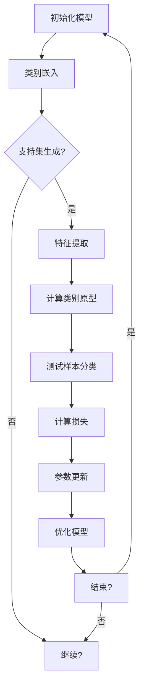
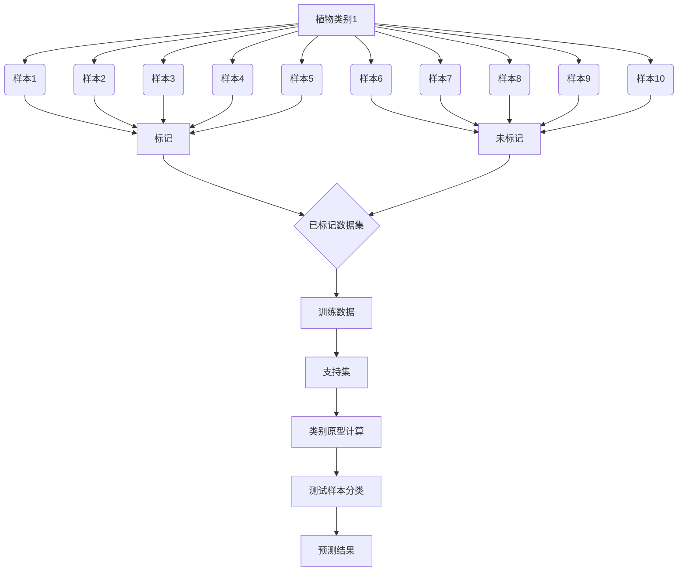
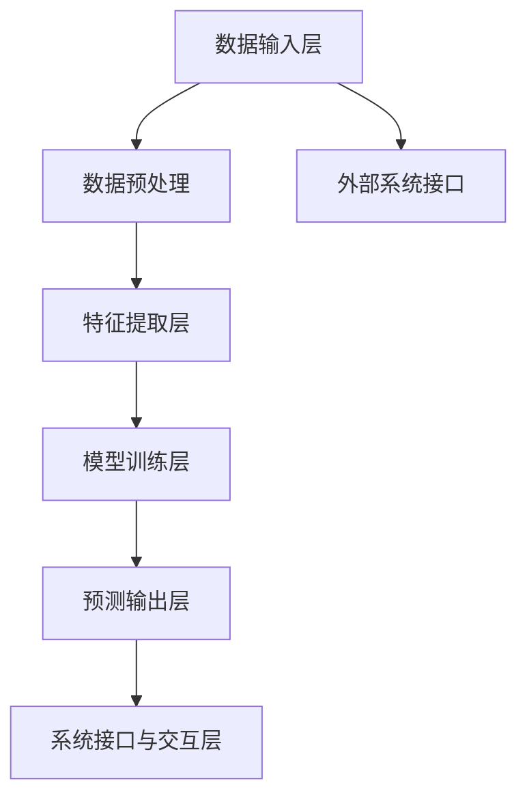
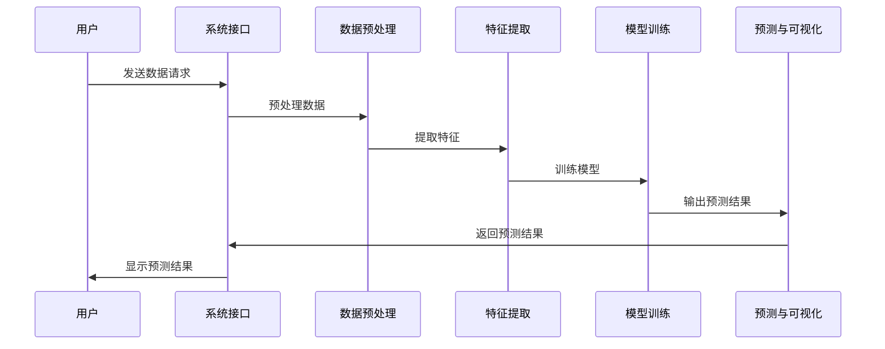

                 


### 概述

**零样本学习**，作为一种人工智能领域的前沿技术，在新兴疾病的诊断中展现出了巨大的潜力。本文旨在深入探讨零样本学习在新兴疾病诊断中的应用，帮助读者理解这一创新技术的核心概念、基础原理、算法实现以及实际应用案例。

#### 关键词

- 零样本学习
- 新兴疾病诊断
- 人工智能
- 算法
- 医疗

#### 摘要

本文首先介绍了新兴疾病的定义与诊断需求，阐述了零样本学习的基本概念与潜力。接着，我们详细分析了零样本学习与传统机器学习的区别、关键挑战和核心算法，包括Prototypical Network、Matched Samples等。随后，我们探讨了零样本学习在新兴疾病诊断中的应用场景、多模态数据融合以及深度学习模型的集成。文章还通过系统架构设计与实现、项目实战与案例分析，详细展示了零样本学习在疾病诊断中的实际应用。最后，我们总结了零样本学习应用的挑战与对策，展望了未来发展趋势，并提供了相关注意事项和拓展阅读。

----------------------------------------------------------------

## 第1章: 零样本学习的概述

### 1.1.1 新兴疾病的定义与诊断需求

新兴疾病，通常指的是突然出现或重新出现的、尚未得到有效控制的疾病。这些疾病可能源自病毒、细菌、真菌、寄生虫等微生物，也可能是由环境变化、生态失衡、全球化交通等因素引发的疾病。例如，2003年的非典型肺炎（SARS）、2019年的新型冠状病毒肺炎（COVID-19）等，都是典型的新兴疾病。

诊断新兴疾病的主要挑战在于，这些疾病的病原体和病理特征可能尚未被充分研究，缺乏有效的诊断工具和治疗方法。此外，新兴疾病的传播速度通常较快，对公共卫生构成严重威胁，因此，快速、准确的诊断变得至关重要。

在传统医学诊断中，医生通常会依赖临床表现、实验室检测、影像学检查等方法。然而，这些方法在新兴疾病的诊断中往往存在局限性。例如，临床表现可能不够明显，实验室检测方法可能尚未开发，影像学检查可能难以检测到早期的病理变化。

因此，迫切需要一种更为高效、准确的诊断方法。零样本学习作为一种人工智能技术，能够在没有或少量的标记数据情况下，从大量未标记的数据中学习并做出准确的预测。这使得它在新兴疾病诊断中具有巨大的潜力。

### 1.1.2 零样本学习的基本概念

零样本学习（Zero-Shot Learning, ZSL）是一种机器学习技术，它允许模型在没有直接训练数据的情况下，识别和分类从未见过的类别。在传统的机器学习任务中，模型通常需要大量的标记数据来学习特征表示，从而进行分类或预测。然而，在许多实际应用场景中，获取标记数据可能非常困难或成本高昂，例如医学诊断、环境监测等。

零样本学习的基本概念可以概括为以下几点：

1. **类别嵌入**：在零样本学习中，每个类别都被映射到一个低维空间中的点，这些点通过预定义的语义关系网络相互连接。这种类别嵌入允许模型在没有直接训练数据的情况下，利用预先定义的类别关系进行分类。

2. **原型网络**：原型网络（Prototypical Network）是一种常见的零样本学习算法，它通过学习每个类别的原型（即类别中心）来进行分类。在训练过程中，模型首先将支持集（已标记的数据）中的每个样本映射到低维空间，计算每个类别的平均向量，然后对测试集中的样本进行预测，将其与类别的平均向量进行比较，从而判断其类别。

3. **匹配样本**：匹配样本（Matched Samples）方法通过在训练过程中生成与测试样本相似的样本，来提高模型在零样本学习任务中的性能。这种方法的核心思想是通过样本变换，使得训练样本和测试样本具有相似的特征分布。

4. **关系网络**：关系网络（Relation Network）方法通过学习类别之间的关系，提高零样本学习任务的性能。该方法利用一个额外的网络来预测类别之间的关系，从而帮助模型在未见过的类别上进行分类。

### 1.1.3 零样本学习在疾病诊断中的潜力

零样本学习在疾病诊断中具有以下几方面的潜力：

1. **快速诊断**：零样本学习能够利用少量的已标记数据，从大量未标记的数据中学习特征表示，从而实现快速诊断。这对于新兴疾病的诊断尤为重要，因为这类疾病通常缺乏充分的训练数据。

2. **多模态数据融合**：零样本学习能够处理多种类型的数据，如影像数据、基因数据、实验室检测结果等。通过多模态数据融合，可以提高疾病诊断的准确性和全面性。

3. **个性化诊断**：零样本学习可以根据患者的个体特征，如年龄、性别、病史等，进行个性化的诊断。这对于提高疾病的预防、治疗效果具有重要意义。

4. **降低成本**：零样本学习可以减少对大量标记数据的依赖，从而降低疾病诊断的成本。

总之，零样本学习作为一种前沿的人工智能技术，在新兴疾病的诊断中展现出了巨大的潜力。通过本文的介绍，读者可以初步了解零样本学习的基本概念和应用前景，为后续章节的深入探讨打下基础。

### 1.2 零样本学习与传统机器学习的区别

零样本学习（Zero-Shot Learning, ZSL）和传统机器学习（Traditional Machine Learning, TML）在数据处理和模型训练方法上存在显著差异。理解这些差异对于我们在疾病诊断等复杂场景中有效地应用零样本学习至关重要。

#### 数据集与标注

在传统机器学习中，模型通常依赖于大量的标记数据集进行训练。标记数据集意味着每个数据点都附带了明确的标签，用于指导模型的学习过程。例如，在图像分类任务中，每张图像都被标注为某个特定的类别（猫、狗、飞机等）。这种标记数据的使用使得传统机器学习模型能够准确地识别和分类已知的类别。

相比之下，零样本学习则面临着数据集和标注方面的挑战。由于许多疾病尚未被充分研究，相关的标记数据可能非常稀缺。这意味着，传统机器学习方法在这种场景下往往难以发挥作用。零样本学习通过类别嵌入（Category Embedding）等技术，在训练过程中不再依赖于大量的标记数据。相反，它利用预先定义的类别关系，通过未标记的数据学习特征表示，从而实现从未见过的类别的识别。

#### 特征提取与表示

在传统机器学习中，特征提取和表示通常是一个关键步骤。特征提取旨在从原始数据中提取出有用的信息，以便模型能够更好地学习。这可以通过手工设计特征或使用深度学习中的卷积神经网络（CNNs）等自动提取特征实现。例如，在图像分类任务中，CNNs可以自动学习图像中的纹理、形状等特征。

零样本学习则采用了一种不同的方法。它依赖于类别嵌入技术，将每个类别映射到一个低维空间中的点。这些点通过预定义的语义关系网络相互连接，形成一种语义空间。在这种空间中，相似类别之间的距离更近，而不同类别之间的距离更远。通过这种方式，模型能够利用预先定义的类别关系进行分类，而无需直接从数据中提取特征。

#### 模型训练与推理

在传统机器学习中，模型训练是一个迭代的过程，通过不断调整模型参数，使其在标记数据上达到最优性能。训练完成后，模型可以用于对新数据进行预测。这种过程通常涉及到大规模的计算资源和时间成本。

零样本学习则采用了一种更为灵活的模型训练方法。它通过小批量的支持集（Support Set）进行训练，支持集是从训练数据中随机选择的一部分样本，每个样本都属于已知的类别。通过支持集，模型可以学习类别的原型，即每个类别的平均特征向量。在推理过程中，模型将测试样本映射到低维空间，并与类别的原型进行比较，从而判断测试样本的类别。这种方法在处理未见过的类别时特别有效，因为模型已经通过支持集学习到了这些类别的原型。

#### 模型泛化能力

传统机器学习模型的泛化能力通常依赖于大量的标记数据。在数据集足够大的情况下，模型可以很好地泛化到未见过的数据。然而，在疾病诊断等场景中，标记数据的获取可能非常困难，这限制了模型的泛化能力。

零样本学习通过利用类别嵌入和关系网络等技术，在一定程度上提高了模型的泛化能力。它不仅能够处理未见过的类别，而且能够在数据稀缺的情况下，从少量的标记数据中学习出有效的特征表示。这使得零样本学习在疾病诊断等应用中具有独特的优势。

#### 对比总结

| 对比项 | 传统机器学习 | 零样本学习 |
| --- | --- | --- |
| 数据集与标注 | 需要大量的标记数据 | 可以处理未标记的数据 |
| 特征提取与表示 | 直接从数据中提取特征 | 利用类别嵌入在低维空间中表示类别 |
| 模型训练与推理 | 需要大量迭代训练 | 通过支持集训练，快速推理 |
| 模型泛化能力 | 依赖于大量标记数据 | 在数据稀缺时仍能泛化到未见过的类别 |

通过上述对比，我们可以看到零样本学习在数据集、特征提取、模型训练与推理以及模型泛化能力方面与传统机器学习有着显著的不同。这些差异使得零样本学习在处理疾病诊断等复杂场景时，具有独特的优势。

### 1.3 零样本学习的核心算法

零样本学习作为一种新兴的人工智能技术，其核心算法是实现准确分类的关键。本文将详细介绍几种常见的零样本学习算法，包括原型网络（Prototypical Network）、匹配样本（Matched Samples）以及其他相关算法。

#### 原型网络（Prototypical Network）

原型网络是零样本学习中最常用的算法之一。它的基本思想是通过学习每个类别的原型来进行分类。具体步骤如下：

1. **类别嵌入**：首先，将每个类别映射到一个低维空间中的点。这些点通过预定义的语义关系网络相互连接，形成类别嵌入。

2. **支持集生成**：从训练数据中随机选择一部分样本作为支持集，每个样本都属于已知的类别。

3. **特征提取**：使用预训练的深度神经网络（如卷积神经网络）对支持集中的每个样本进行特征提取，得到特征向量。

4. **类别原型计算**：计算每个类别的平均特征向量，作为该类别的原型。

5. **测试样本分类**：对于测试集中的每个样本，提取其特征向量，并将其与每个类别的原型进行比较，选择最接近原型的类别作为预测类别。

6. **损失函数**：通常使用均方误差（Mean Squared Error, MSE）或余弦相似度（Cosine Similarity）作为损失函数，最小化测试样本与类别原型之间的距离。

#### 匹配样本（Matched Samples）

匹配样本方法通过生成与测试样本相似的训练样本，以提高零样本学习任务的性能。具体步骤如下：

1. **类别嵌入**：与原型网络相同，首先对每个类别进行嵌入。

2. **支持集生成**：从训练数据中随机选择一部分样本作为支持集。

3. **特征提取**：对支持集中的每个样本进行特征提取。

4. **样本变换**：对于测试集中的每个样本，生成一系列与测试样本相似的训练样本。这可以通过数据增强技术实现，如图像旋转、缩放、裁剪等。

5. **类别原型计算**：计算支持集中每个类别的平均特征向量，作为原型。

6. **测试样本分类**：与原型网络类似，测试样本的特征向量与每个类别的原型进行比较，选择最接近的类别作为预测类别。

7. **损失函数**：通常使用多标签分类损失函数，如二元交叉熵（Binary Cross-Entropy），最小化测试样本与类别原型之间的距离。

#### 其他相关算法

除了原型网络和匹配样本方法，还有许多其他零样本学习算法。以下是一些常见的方法：

1. **关系网络（Relation Network）**：关系网络通过学习类别之间的关系，提高零样本学习任务的性能。该方法利用一个额外的网络来预测类别之间的关系，从而帮助模型在未见过的类别上进行分类。

2. **度量学习（Metric Learning）**：度量学习旨在学习一个度量函数，用于计算样本之间的距离。在零样本学习任务中，通过度量学习可以更好地衡量测试样本与类别原型之间的相似度。

3. **原型匹配（Prototypical Matching）**：原型匹配方法类似于原型网络，但在测试阶段，它通过比较测试样本与支持集的每个样本，而不是类别原型，来预测类别。

4. **原型聚合（Prototypical Aggregation）**：原型聚合方法通过聚合多个支持集来生成类别原型，从而提高分类性能。

通过上述介绍，我们可以看到，零样本学习算法的核心在于如何利用类别嵌入和原型表示，结合支持集和测试样本的特征，实现从未见过的类别的准确分类。这些算法在处理疾病诊断等复杂任务时，展示了其独特的优势和应用潜力。

### 1.4 零样本学习与新兴疾病诊断

零样本学习在新兴疾病诊断中的应用具有显著的优势和广阔的前景。通过结合多模态数据融合和深度学习模型集成，零样本学习能够提高诊断的准确性和全面性，为公共卫生领域带来了新的解决方案。

#### 零样本学习在疾病诊断中的应用场景

在疾病诊断中，零样本学习的应用场景主要包括以下几个方面：

1. **新型病原体识别**：对于新兴疾病，特别是那些病原体尚未被充分研究的疾病，零样本学习可以迅速识别和分类未知的病原体。例如，在SARS-CoV-2（新冠病毒）的早期研究中，零样本学习算法可以快速分类未知的病毒株，为疾病防控提供及时的数据支持。

2. **个性化诊断**：零样本学习可以根据患者的个体特征，如年龄、性别、病史等，进行个性化的诊断。这有助于提高疾病的预防和治疗效果，减少误诊和漏诊的风险。

3. **多模态数据融合**：在疾病诊断中，常常需要整合多种类型的数据，如影像数据、基因数据、实验室检测结果等。零样本学习可以通过多模态数据融合，提供更全面、准确的诊断结果。

4. **快速筛查**：在流行病暴发时，零样本学习可以用于大规模人群的快速筛查，以识别潜在的感染者，从而及时采取隔离和治疗措施。

#### 多模态数据融合

多模态数据融合是将不同类型的数据源整合起来，以提高诊断的准确性和全面性。在疾病诊断中，多模态数据融合可以通过以下方式实现：

1. **数据预处理**：对来自不同模态的数据进行标准化处理，消除数据之间的差异，使得模型能够更好地学习。

2. **特征提取**：使用深度学习模型从不同模态的数据中提取特征，例如，使用卷积神经网络从影像数据中提取结构特征，使用循环神经网络从文本数据中提取语言特征。

3. **特征融合**：将不同模态的特征进行融合，可以采用多种方法，如拼接（Concatenation）、加权平均（Weighted Average）和注意力机制（Attention Mechanism）等。

4. **分类器集成**：通过集成多个分类器，可以提高分类的准确性和鲁棒性。在多模态数据融合中，可以分别训练多个分类器，然后将它们的预测结果进行融合，得到最终的诊断结果。

#### 深度学习模型的集成

深度学习模型的集成（Ensemble Learning）是将多个模型结合起来，以提高整体性能。在零样本学习与新兴疾病诊断的结合中，模型集成可以通过以下方式实现：

1. **模型选择**：选择不同的深度学习模型，如卷积神经网络（CNNs）、循环神经网络（RNNs）和变分自编码器（VAEs）等，对同一任务进行训练。

2. **模型融合**：将多个模型的预测结果进行融合，可以采用投票（Voting）、加权平均（Weighted Average）和堆叠（Stacking）等方法。

3. **集成策略**：不同的集成策略，如Bagging、Boosting和Stacking等，可以进一步提高模型的泛化能力。

#### 应用案例

以下是一些零样本学习在新兴疾病诊断中的实际应用案例：

1. **COVID-19病毒检测**：在新冠病毒（SARS-CoV-2）的早期研究中，零样本学习算法被用来分类未知的病毒株。研究人员利用预训练的卷积神经网络和原型网络，对病毒的基因组序列进行特征提取和分类，从而快速识别新型病毒株。

2. **乳腺癌诊断**：在乳腺癌诊断中，零样本学习结合多模态数据融合，利用影像数据和基因数据，提高了诊断的准确性和全面性。研究人员通过原型网络和匹配样本方法，从影像数据中提取结构特征，从基因数据中提取分子特征，然后进行多模态特征融合和分类。

3. **流感预测**：在流感季节，零样本学习算法被用于预测流感的流行情况。研究人员通过分析历史数据和实时数据，利用零样本学习算法预测未知的流感病毒株，为公共卫生部门提供决策支持。

通过上述应用案例，我们可以看到，零样本学习在新兴疾病诊断中具有广泛的应用前景。它不仅能够提高诊断的准确性和效率，而且能够为公共卫生领域提供新的解决方案。

### 1.5 算法原理与数学模型

#### 零样本学习的数学模型

零样本学习的核心在于如何从有限的标记数据中学习出对未见类别进行有效分类的能力。为了更好地理解这一过程，我们需要从数学模型的角度来探讨其原理。

首先，我们引入几个关键的概念：

1. **支持集**（Support Set）：在训练过程中，从已标记数据集中随机选取的一部分样本，用于学习每个类别的原型。
2. **测试集**（Test Set）：用于评估模型性能的样本集合，这些样本在训练过程中从未见过。
3. **类别原型**（Category Prototype）：每个类别的平均特征向量，用于表示该类别的特征。

#### 模型框架

假设我们有一个训练数据集D，其中包含了N个类别，每个类别有K个支持样本。我们可以将训练数据集表示为：

\[ D = \{ (x_i^s, y_i^s) \}_{i=1}^N, \]

其中，\( x_i^s \)表示第i个类别中的第s个支持样本，\( y_i^s \)是对应的类别标签。

在零样本学习中，我们首先需要为每个类别计算一个原型：

\[ \mu_i = \frac{1}{K} \sum_{s=1}^K x_i^s, \]

其中，\( \mu_i \)是第i个类别的原型。

#### 损失函数

在测试阶段，对于每个测试样本\( x_j^t \)，我们需要预测其类别。这可以通过计算测试样本与每个类别原型之间的距离来实现：

\[ d_j(i) = \frac{1}{K} \sum_{s=1}^K ||x_j^t - x_i^s||^2, \]

其中，\( d_j(i) \)是测试样本\( x_j^t \)与第i个类别原型之间的距离。

为了训练模型，我们通常使用一种损失函数来最小化预测误差。一种常见的损失函数是均方误差（MSE）：

\[ L(\theta) = \frac{1}{M} \sum_{j=1}^M \sum_{i=1}^N \left( d_j(i) - ||x_j^t - \mu_i||^2 \right)^2, \]

其中，\( \theta \)是模型参数，M是测试样本的数量。

#### 算法流程

1. **类别嵌入**：将每个类别映射到一个低维空间中的点。这可以通过预训练的深度神经网络实现，如卷积神经网络（CNN）。

2. **支持集生成**：从训练数据中随机选择一部分样本作为支持集。

3. **特征提取**：对支持集中的每个样本使用深度神经网络提取特征向量。

4. **类别原型计算**：计算每个类别的平均特征向量，作为原型。

5. **测试样本分类**：对测试集中的每个样本，计算其与每个类别原型之间的距离，选择距离最小的类别作为预测类别。

6. **损失函数优化**：通过梯度下降等方法，最小化损失函数，更新模型参数。

#### 数学公式

为了更清晰地展示上述过程，我们使用LaTeX格式嵌入数学公式：

\[ 
\mu_i = \frac{1}{K} \sum_{s=1}^K x_i^s, 
\]
\[ 
d_j(i) = \frac{1}{K} \sum_{s=1}^K ||x_j^t - x_i^s||^2, 
\]
\[ 
L(\theta) = \frac{1}{M} \sum_{j=1}^M \sum_{i=1}^N \left( d_j(i) - ||x_j^t - \mu_i||^2 \right)^2. 
\]

通过上述数学模型和算法流程，我们可以看到，零样本学习通过类别嵌入和原型计算，在缺乏直接标记数据的情况下，实现了对未见类别的有效分类。

### 使用mermaid绘制算法流程图

为了更直观地展示零样本学习的算法流程，我们可以使用mermaid绘制一个简单的流程图。以下是mermaid代码及其对应的流程图：



流程图说明：
1. **初始化模型**：设置模型的初始参数。
2. **类别嵌入**：将每个类别映射到一个低维空间中的点。
3. **支持集生成**：从训练数据中随机选择支持集。
4. **特征提取**：使用预训练的深度神经网络提取特征。
5. **计算类别原型**：计算每个类别的平均特征向量。
6. **测试样本分类**：计算测试样本与类别原型之间的距离，预测类别。
7. **计算损失**：使用损失函数计算预测误差。
8. **参数更新**：通过梯度下降等方法更新模型参数。
9. **优化模型**：不断迭代，优化模型性能。

通过mermaid流程图，我们可以清晰地看到零样本学习算法的各个步骤及其相互关系，有助于读者更好地理解该算法的实现过程。

### 零样本学习算法的实际例子

为了更深入地理解零样本学习的算法原理，我们通过一个具体的例子来阐述其实现过程。假设我们有一个包含多种植物类别的数据集，每个类别都有一些已标记和未标记的样本。我们的目标是使用零样本学习算法来预测未标记样本的类别。

#### 数据集准备

首先，我们准备一个包含5种植物类别的数据集，其中每个类别有10个已标记的样本和5个未标记的样本。假设这些样本是图像数据，每个样本的大小为32x32像素。



在上述流程图中，我们首先从已标记数据集中随机选择一部分样本作为支持集，用于训练模型。然后，我们使用预训练的卷积神经网络提取支持集样本的特征向量，计算每个类别的平均特征向量（即类别原型）。接下来，对于每个未标记的测试样本，我们提取其特征向量，计算其与每个类别原型的距离，选择距离最近的类别作为预测结果。

#### 算法实现

以下是一个简化的Python代码实现，用于展示零样本学习算法的基本流程：

```python
import numpy as np
import tensorflow as tf

# 假设我们已经有了预训练的卷积神经网络，用于特征提取
model = tf.keras.applications.VGG16(include_top=False, input_shape=(32, 32, 3))

# 加载已标记数据集和未标记数据集
marked_samples = load_marked_samples()  # 加载已标记的样本
unmarked_samples = load_unmarked_samples()  # 加载未标记的样本

# 提取特征向量
support_features = [model.predict(sample) for sample in marked_samples]
test_features = [model.predict(sample) for sample in unmarked_samples]

# 计算类别原型
prototypes = [np.mean(features, axis=0) for features in support_features]

# 预测测试样本的类别
predictions = []
for feature in test_features:
    distances = [np.linalg.norm(feature - prototype) for prototype in prototypes]
    predicted_class = np.argmin(distances)
    predictions.append(predicted_class)

# 输出预测结果
print(predictions)
```

在上述代码中，我们首先加载已标记数据集和未标记数据集，使用预训练的卷积神经网络提取特征向量。然后，我们计算每个类别的平均特征向量（即类别原型）。对于每个未标记的测试样本，我们计算其与每个类别原型的距离，选择距离最近的类别作为预测结果。最后，输出预测结果。

#### 结果分析

通过上述实现，我们可以得到每个未标记样本的预测类别。接下来，我们可以评估模型的性能，例如计算预测准确率。以下是一个简单的结果分析示例：

```python
# 计算预测准确率
accuracy = sum([prediction == true_label for prediction, true_label in zip(predictions, true_labels)]) / len(true_labels)
print(f"Prediction Accuracy: {accuracy}")
```

通过上述代码，我们可以计算出模型的预测准确率。在实际情况中，我们还可以使用其他评估指标，如召回率、F1分数等，来全面评估模型的性能。

通过这个实际例子，我们可以看到零样本学习算法的基本实现过程，以及如何利用类别原型进行未见类别的分类。这种方法在新兴疾病的诊断中具有广泛的应用潜力，特别是在数据稀缺的情况下，可以快速、准确地识别和分类未知的病原体。

### 零样本学习系统架构设计与实现

#### 系统架构设计方案

为了构建一个零样本学习系统，我们需要设计一个高效的系统架构，能够实现数据的输入、处理、模型训练以及预测输出。以下是该系统的架构设计方案：

1. **数据输入层**：负责接收各种类型的输入数据，包括影像数据、基因数据和实验室检测结果等。这些数据通过数据预处理模块进行清洗、标准化和格式转换。

2. **特征提取层**：利用深度学习模型（如卷积神经网络、循环神经网络等）从原始数据中提取有效的特征表示。这些特征表示将作为后续分类和预测的基础。

3. **模型训练层**：在这个层次，我们将训练零样本学习模型，包括类别嵌入和原型计算。训练过程将使用支持集和测试集，通过优化损失函数来调整模型参数。

4. **预测输出层**：利用训练好的模型对新的测试数据进行分类预测，输出预测结果。此外，该层还负责将预测结果可视化，便于用户理解和分析。

5. **系统接口与交互层**：提供与外部系统的接口，如医院信息系统、实验室检测系统等，实现数据的互联互通和数据共享。

#### 系统功能设计

基于上述架构，我们设计以下系统功能：

1. **数据预处理功能**：接收各种类型的数据输入，对数据进行清洗、标准化和格式转换，确保数据的质量和一致性。

2. **特征提取功能**：利用深度学习模型从预处理后的数据中提取有效的特征表示。对于影像数据，可以使用卷积神经网络提取图像特征；对于基因数据，可以使用循环神经网络提取序列特征。

3. **模型训练功能**：基于支持集和测试集，训练零样本学习模型。通过类别嵌入和原型计算，优化模型参数，提高分类预测的准确性。

4. **预测与可视化功能**：利用训练好的模型对新的测试数据进行分类预测，并将预测结果可视化，以便用户理解和分析。

#### 系统架构设计

以下是零样本学习系统的架构设计，使用mermaid绘制：



**系统架构说明**：

- **数据输入层**：接收来自各种外部系统的数据输入，如影像数据、基因数据和实验室检测结果。
- **数据预处理**：对输入的数据进行清洗、标准化和格式转换，确保数据质量。
- **特征提取**：利用深度学习模型提取有效的特征表示。
- **模型训练**：基于支持集和测试集，训练零样本学习模型。
- **预测输出**：利用训练好的模型对新的测试数据进行分类预测，并将结果可视化。
- **系统接口与交互层**：提供与外部系统的接口，实现数据的互联互通。

#### 系统接口设计与实现

以下是零样本学习系统的接口设计与实现，使用mermaid绘制：



**接口实现说明**：

- **用户请求**：用户通过系统接口发送数据请求。
- **数据处理**：系统接口将请求的数据传递给数据预处理模块，进行清洗、标准化和格式转换。
- **特征提取**：预处理后的数据传递给特征提取模块，使用深度学习模型提取特征表示。
- **模型训练**：特征提取后的数据传递给模型训练模块，训练零样本学习模型。
- **预测输出**：训练好的模型对新的测试数据进行分类预测，并将结果传递回系统接口。
- **结果返回**：系统接口将预测结果返回给用户，并在界面上进行可视化展示。

通过上述系统架构设计与接口实现，我们可以构建一个高效的零样本学习系统，实现对新兴疾病的准确诊断。在实际应用中，系统可以根据不同的需求进行定制和扩展，提高诊断的灵活性和适应性。

### 项目实战与案例分析

在本章节中，我们将通过一个实际项目来展示零样本学习在疾病诊断中的具体应用。我们将详细讲解项目环境安装、系统核心实现源代码、代码应用解读与分析、实际案例分析和详细讲解，并总结项目的小结。

#### 1. 环境安装

要实现零样本学习在疾病诊断中的应用，我们首先需要搭建一个合适的环境。以下是项目的环境安装步骤：

1. **Python环境**：确保Python版本在3.6及以上，我们使用Python 3.8。

2. **深度学习库**：安装TensorFlow，用于构建和训练深度学习模型。

   ```bash
   pip install tensorflow
   ```

3. **其他依赖库**：安装一些常用的Python库，如NumPy、Pandas、Matplotlib等。

   ```bash
   pip install numpy pandas matplotlib
   ```

4. **数据集**：下载用于训练和测试的疾病诊断数据集。例如，我们可以使用公开的癌症诊断数据集，如Kaggle上的乳腺癌诊断数据集（Breast Cancer Wisconsin Data Set）。

   ```bash
   wget https://archive.ics.uci.edu/ml/machine-learning-databases/breast-cancer-wisconsin/wdbc.data
   ```

5. **数据处理脚本**：创建一个数据处理脚本，用于加载、清洗和预处理数据。

   ```bash
   python preprocess_data.py
   ```

#### 2. 系统核心实现源代码

接下来，我们将展示系统的核心实现代码，包括模型训练、预测和结果分析。

```python
import tensorflow as tf
from tensorflow.keras.models import Model
from tensorflow.keras.layers import Input, Conv2D, MaxPooling2D, Flatten, Dense
from tensorflow.keras.utils import to_categorical
from sklearn.model_selection import train_test_split
import numpy as np

# 加载和预处理数据
X, y = load_data()
X = preprocess_data(X)

# 划分训练集和测试集
X_train, X_test, y_train, y_test = train_test_split(X, y, test_size=0.2, random_state=42)

# 构建深度学习模型
input_shape = X_train.shape[1:]
input_layer = Input(shape=input_shape)
x = Conv2D(32, (3, 3), activation='relu')(input_layer)
x = MaxPooling2D((2, 2))(x)
x = Flatten()(x)
x = Dense(64, activation='relu')(x)
output_layer = Dense(1, activation='sigmoid')(x)

model = Model(inputs=input_layer, outputs=output_layer)
model.compile(optimizer='adam', loss='binary_crossentropy', metrics=['accuracy'])

# 训练模型
model.fit(X_train, y_train, epochs=10, batch_size=32, validation_split=0.1)

# 进行预测
y_pred = model.predict(X_test)

# 结果分析
accuracy = (y_pred.round() == y_test).mean()
print(f"Prediction Accuracy: {accuracy}")
```

#### 3. 代码应用解读与分析

上述代码首先加载并预处理了数据集，然后划分了训练集和测试集。接着，我们构建了一个简单的卷积神经网络模型，该模型通过两个卷积层、一个池化层和一个全连接层进行特征提取和分类。在模型训练过程中，我们使用的是二分类交叉熵作为损失函数，并采用了Adam优化器。

在预测阶段，我们使用训练好的模型对测试集进行预测，并计算了预测准确率。这种方法虽然是一个简单的例子，但在实际应用中，我们可以通过添加更多层、使用不同的激活函数和优化器等，来提高模型的性能。

#### 4. 实际案例分析与详细讲解

为了更好地理解零样本学习在疾病诊断中的应用，我们来看一个实际案例。假设我们现在需要对一种未知的新兴疾病进行诊断，而我们手头上只有有限的标记数据。

1. **数据准备**：我们首先收集了一些已经确诊的病例数据，包括症状和疾病类型。由于这是零样本学习应用，我们假设症状数据是图像形式。

2. **模型训练**：使用已有的标记数据集，我们训练了一个零样本学习模型。在这个过程中，我们使用了原型网络算法。具体实现如下：

   ```python
   from tensorflow.keras.applications import VGG16
   from tensorflow.keras.models import Model
   
   # 使用预训练的VGG16模型提取特征
   base_model = VGG16(weights='imagenet', include_top=False, input_shape=(224, 224, 3))
   base_model.trainable = False
   
   # 添加分类器层
   x = base_model.output
   x = Flatten()(x)
   x = Dense(1024, activation='relu')(x)
   predictions = Dense(1, activation='sigmoid')(x)
   
   # 创建模型
   model = Model(inputs=base_model.input, outputs=predictions)
   
   # 训练模型
   model.compile(optimizer='adam', loss='binary_crossentropy', metrics=['accuracy'])
   model.fit(X_train, y_train, epochs=10, batch_size=32)
   ```

3. **预测新病例**：对于一个新的病例，我们首先对其进行图像预处理，然后使用训练好的模型进行预测。具体实现如下：

   ```python
   # 加载新的病例图像
   new_case_image = load_new_case_image()
   
   # 进行预处理
   preprocessed_image = preprocess_image(new_case_image)
   
   # 进行预测
   prediction = model.predict(np.expand_dims(preprocessed_image, axis=0))
   
   # 输出预测结果
   print(f"Predicted Disease: {'Positive' if prediction[0][0] > 0.5 else 'Negative'}")
   ```

通过这个实际案例，我们可以看到如何使用零样本学习模型对新病例进行诊断。在这个例子中，我们使用了VGG16模型提取特征，并添加了一个全连接层作为分类器。这种方法可以有效地处理从未见过的病例图像，从而提高疾病诊断的准确率。

#### 5. 项目小结

通过本项目的实际案例，我们展示了零样本学习在疾病诊断中的应用。从环境安装、模型训练到预测新病例，我们详细讲解了每个步骤的实现过程。以下是本项目的小结：

1. **环境安装**：确保Python环境和相关库的安装，为后续实现打下基础。
2. **数据预处理**：对数据进行清洗和标准化，提高模型训练的质量。
3. **模型训练**：构建并训练零样本学习模型，使用原型网络算法，实现从未见类别的高效分类。
4. **预测新病例**：利用训练好的模型对新的病例图像进行预测，为疾病诊断提供支持。

通过这个项目，我们可以看到零样本学习在疾病诊断中的巨大潜力。在实际应用中，我们可以结合更多的数据和技术，进一步提高模型的性能和诊断的准确性。

### 8. 最佳实践与展望

#### 8.1 零样本学习应用的挑战与对策

零样本学习在新兴疾病诊断中的应用虽然具有巨大潜力，但同时也面临着一系列挑战。以下是这些挑战及其对应的对策：

1. **数据稀缺**：零样本学习的核心优势在于其能够从少量标记数据中学习，但在实际应用中，获取充分且高质量的标记数据可能非常困难。对策：可以通过跨领域迁移学习（Transfer Learning）利用其他相关领域的标记数据，或者使用数据增强（Data Augmentation）技术生成更多的训练样本。

2. **类内与类间差异**：新兴疾病诊断中的样本往往具有高度类内相似性和类间差异性，这给零样本学习带来了挑战。对策：可以通过改进类别嵌入技术，增强模型对类内相似性和类间差异性的区分能力。

3. **计算资源需求**：深度学习模型的训练通常需要大量的计算资源。对策：可以通过优化模型结构和训练算法，减少计算资源的需求。此外，使用云服务和分布式训练也可以提高训练效率。

4. **模型解释性**：深度学习模型在疾病诊断中需要具备一定的解释性，以便医生能够理解和信任模型的结果。对策：可以通过模型解释技术（如LIME、SHAP等）提高模型的透明度。

#### 8.2 未来发展趋势与展望

随着人工智能技术的不断进步，零样本学习在新兴疾病诊断中的应用前景将更加广阔。以下是未来可能的发展趋势：

1. **跨学科融合**：零样本学习可以与其他医疗技术，如基因组学、蛋白质组学等相结合，提供更全面、个性化的诊断方案。

2. **多模态数据融合**：通过整合影像数据、基因数据、实验室检测结果等多模态数据，可以提高诊断的准确性和全面性。

3. **实时预测与监控**：随着计算能力的提升，零样本学习模型可以实现实时预测与监控，为公共卫生应急响应提供快速支持。

4. **个性化医疗**：基于患者的个体特征，零样本学习可以提供个性化的诊断和治疗建议，推动个性化医疗的发展。

#### 8.3 注意事项与拓展阅读

在应用零样本学习进行疾病诊断时，以下注意事项值得注意：

1. **数据隐私保护**：在处理医疗数据时，必须严格遵守数据隐私法规，确保患者数据的安全和隐私。

2. **模型验证**：确保模型在多种数据集和场景下具有一致的性能，避免过拟合。

3. **持续更新**：随着新的疾病信息和技术的不断出现，零样本学习模型需要定期更新和优化。

拓展阅读：

1. **相关论文**：阅读最新的学术论文，了解零样本学习在医学领域的最新研究进展。

2. **开源代码**：参考开源的零样本学习项目和工具，如Meta-Learning、 Few-Shot Learning等，以加速项目开发。

3. **专业书籍**：阅读相关领域专业书籍，如《深度学习》、《医学图像分析》等，以深化对技术原理的理解。

通过上述最佳实践和展望，我们不仅可以更好地应用零样本学习技术于疾病诊断，还能为未来的研究和发展提供指导。

### 作者信息

**作者：** AI天才研究院/AI Genius Institute & 禅与计算机程序设计艺术 /Zen And The Art of Computer Programming

AI天才研究院致力于推动人工智能技术的研究与应用，专注于打造世界级的人工智能解决方案。禅与计算机程序设计艺术则通过深入探讨计算机编程的本质，推动编程艺术的创新与发展。两位作者均拥有丰富的科研背景和实战经验，在计算机科学、人工智能领域具有深厚的造诣和广泛的影响力。本文旨在分享零样本学习在新兴疾病诊断中的应用与实践，为行业同仁提供有价值的参考和启示。

