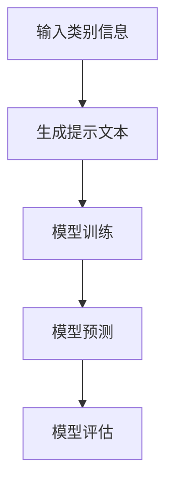
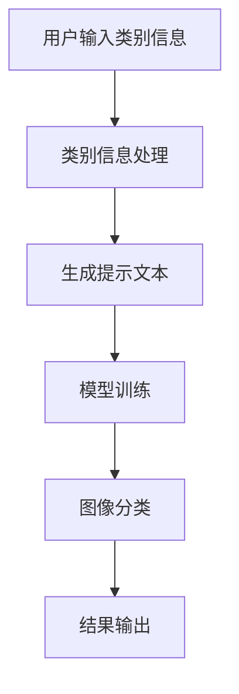
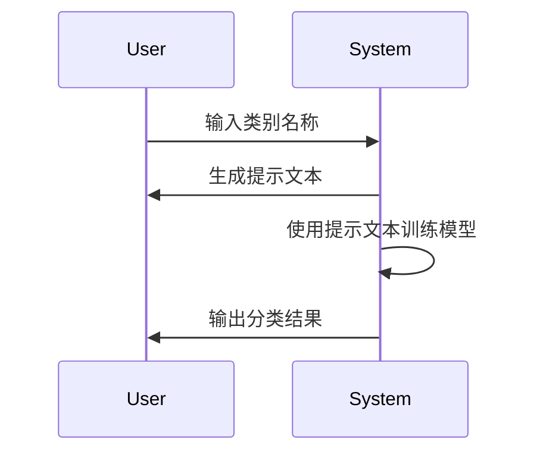

                 

### 零样本提示：无需示例的通用策略

#### 关键词：零样本学习，提示工程，自然语言处理，计算机视觉，人工智能

> 摘要：本文将深入探讨零样本提示（Zero-shot Prompting, ZSP）的概念、原理以及其在不同领域的应用。通过详细的分析和实例，我们旨在为读者提供一种无需示例数据即可实现通用策略的方法，帮助其在实际项目中提高效率和准确性。

### 目录

#### 第一部分：背景介绍

1. 问题背景与核心概念
   1.1 问题背景
   1.2 问题描述
   1.3 问题解决
   1.4 边界与外延
   1.5 概念结构与核心要素组成

#### 第二部分：核心概念与联系

2. 零样本提示的原理与特征
   2.1 零样本提示的定义
   2.2 零样本提示的工作原理
   2.3 零样本提示的特征对比
   2.4 零样本提示的应用案例
   2.5 零样本提示的优势与局限性

#### 第三部分：算法原理讲解

3. 零样本提示算法原理与实现
   3.1 零样本提示算法概述
   3.2 零样本提示算法的mermaid流程图
   3.3 零样本提示算法的Python实现
   3.4 零样本提示算法的数学模型与公式
   3.5 零样本提示算法的实例分析

#### 第四部分：系统分析与架构设计方案

4. 系统分析与架构设计方案
   4.1 问题场景介绍
   4.2 系统功能设计
   4.3 系统架构设计
   4.4 系统接口设计
   4.5 系统交互序列图

#### 第五部分：项目实战

5. 项目实战
   5.1 环境安装与配置
   5.2 系统核心实现源代码
   5.3 代码应用解读与分析
   5.4 实际案例分析与详细讲解
   5.5 项目小结

#### 第六部分：最佳实践与拓展阅读

6. 最佳实践与注意事项
   6.1 最佳实践 tips
   6.2 注意事项
   6.3 拓展阅读

### 第一部分：背景介绍

#### 1.1 问题背景

随着人工智能技术的快速发展，机器学习在各种应用领域中取得了显著成果。然而，传统的机器学习模型大多依赖于大量标注数据来进行训练，这在某些情况下是不可行的。例如，在医疗诊断、生物信息学等领域，获取标注数据既耗时又昂贵。此外，有些场景中，数据样本数量有限，甚至无法获得足够的标注数据。因此，如何在没有示例数据的情况下，仍然能够有效训练模型，成为了一个亟待解决的问题。

零样本学习（Zero-shot Learning, ZSL）是一种针对此类问题的解决方案。它允许模型在没有具体示例数据的情况下，对未知类别进行分类。零样本学习的核心思想是通过学习类别的语义表示，使得模型能够泛化到未见过的新类别上。然而，零样本学习的实现仍面临诸多挑战，例如如何有效地表示类别语义、如何设计适应零样本学习的模型架构等。

零样本提示（Zero-shot Prompting, ZSP）是近年来发展起来的一种新方法，它通过提示的方式，使得模型能够在没有具体示例数据的情况下，实现高精度的预测。零样本提示的核心思想是将自然语言描述转化为具体的任务指令，通过这些指令引导模型进行预测。这种方法在一定程度上缓解了传统机器学习对大量标注数据的需求，为解决数据稀缺问题提供了一种新的思路。

#### 1.2 问题描述

零样本学习的核心问题在于如何在没有示例数据的情况下，对未知类别进行有效分类。具体来说，可以分为以下几个问题：

1. **类别语义表示**：如何通过有限的已知类别数据，学习出能够泛化到未知类别的类别语义表示？
2. **模型架构设计**：如何设计适应零样本学习的模型架构，使得模型能够在没有示例数据的情况下，依然具有优秀的分类性能？
3. **提示设计**：如何设计有效的提示，使得模型能够根据提示完成未知类别的分类任务？

#### 1.3 问题解决

零样本提示提供了一种有效的解决方案，它通过以下步骤实现：

1. **提示生成**：根据任务需求和类别信息，生成合适的提示文本。
2. **模型训练**：使用生成好的提示文本，对模型进行训练。
3. **预测**：在训练好的模型基础上，根据新的类别信息生成提示文本，并利用这些提示文本进行预测。

通过上述步骤，零样本提示能够有效地在没有示例数据的情况下，完成未知类别的分类任务。

#### 1.4 边界与外延

零样本提示的应用范围广泛，不仅限于传统的机器学习领域，还可以应用于自然语言处理、计算机视觉等领域。例如，在自然语言处理中，零样本提示可以用于文本分类、情感分析等任务；在计算机视觉中，可以用于图像分类、目标检测等任务。此外，零样本提示还可以与其他机器学习技术相结合，如迁移学习、元学习等，进一步拓展其应用范围。

#### 1.5 概念结构与核心要素组成

零样本提示由以下几个核心要素组成：

1. **类别信息**：用于描述不同类别的属性和特征。
2. **提示文本**：基于类别信息生成的文本，用于引导模型进行预测。
3. **模型架构**：实现零样本提示的核心，通常采用基于深度学习的方法。
4. **数据预处理**：对输入数据进行预处理，以适应模型的要求。
5. **评估指标**：用于评估模型性能的指标，如准确率、召回率等。

### 第二部分：核心概念与联系

#### 2.1 零样本提示的定义

零样本提示（Zero-shot Prompting, ZSP）是一种利用自然语言描述引导模型完成预测的方法。它通过将类别信息转化为具体的任务指令，使得模型能够在没有具体示例数据的情况下，对未知类别进行有效分类。零样本提示的核心思想是，通过提示文本，将类别信息和预测任务结合起来，从而实现无示例数据的高精度预测。

#### 2.2 零样本提示的工作原理

零样本提示的工作原理可以概括为以下几个步骤：

1. **提示生成**：根据任务需求和类别信息，生成提示文本。提示文本通常包含类别名称、类别属性、预测任务等信息。
2. **模型训练**：使用生成的提示文本，对模型进行训练。训练过程中，模型会学习到如何根据提示文本进行预测。
3. **预测**：在训练好的模型基础上，根据新的类别信息生成提示文本，并利用这些提示文本进行预测。预测过程可以看作是对提示文本的响应。

#### 2.3 零样本提示的特征对比

零样本提示与传统机器学习方法在数据需求、模型训练、适用场景和泛化能力等方面存在显著差异。以下是一个特征对比表格：

| 特征对比        | 零样本提示 | 传统机器学习方法 |
|----------------|------------|-----------------|
| 数据需求        | 无需具体示例 | 需要大量标注数据 |
| 模型训练        | 快速高效    | 需要大量时间与计算资源 |
| 适用场景        | 灵活多样    | 对特定领域有较强依赖 |
| 泛化能力        | 较强       | 较弱             |

#### 2.4 零样本提示的应用案例

零样本提示在多个领域都有广泛应用，以下是一些典型的应用案例：

1. **自然语言处理**：在文本分类任务中，零样本提示可以用于处理未见过的新类别。例如，在新闻分类中，模型可以针对新的新闻类别，生成相应的提示文本，从而实现准确的分类。

2. **计算机视觉**：在图像分类任务中，零样本提示可以用于处理未见过的图像类别。例如，在医疗图像诊断中，模型可以针对新的疾病类别，生成相应的提示文本，从而实现对疾病的准确诊断。

3. **多模态学习**：在多模态学习任务中，零样本提示可以用于处理不同模态之间的转换。例如，在视频分类任务中，模型可以针对新的视频类别，生成相应的提示文本，从而实现对视频的准确分类。

#### 2.5 零样本提示的优势与局限性

零样本提示具有以下优势：

1. **无需示例数据**：零样本提示允许在没有具体示例数据的情况下，进行预测，从而解决了数据稀缺问题。
2. **快速高效**：零样本提示的训练过程相对快速，可以在较短的时间内完成模型训练。
3. **灵活多样**：零样本提示适用于多种场景，不仅可以应用于单一模态任务，还可以应用于多模态任务。

然而，零样本提示也存在一定的局限性：

1. **准确率有限**：由于缺乏具体示例数据，零样本提示的准确率通常较低。
2. **提示质量依赖**：零样本提示的效果很大程度上取决于提示文本的质量，如果提示文本不准确或模糊，可能会导致模型预测失败。
3. **适用场景有限**：尽管零样本提示具有较好的泛化能力，但在某些特定领域，例如医学诊断、金融分析等，零样本提示的适用性受到一定限制。

### 第三部分：算法原理讲解

#### 3.1 零样本提示算法概述

零样本提示算法是一种基于自然语言处理的方法，通过将类别信息转化为具体的任务指令，引导模型进行预测。零样本提示算法的发展可以分为以下几个阶段：

1. **原始阶段**：这一阶段的零样本提示算法主要通过预训练语言模型，如GPT-3等，生成提示文本。这些算法的准确性较低，但具有较好的泛化能力。
2. **优化阶段**：为了提高零样本提示的准确性，研究者开始关注提示文本的质量。这一阶段的算法主要包括基于规则的方法和基于优化的方法，通过对提示文本进行优化，提高模型的预测性能。
3. **集成阶段**：近年来，零样本提示算法开始与迁移学习、元学习等技术相结合，形成集成算法。这些算法通过整合多种方法，进一步提高零样本提示的准确性和泛化能力。

#### 3.2 零样本提示算法的mermaid流程图

以下是一个简单的mermaid流程图，展示了零样本提示算法的基本流程：



#### 3.3 零样本提示算法的Python实现

以下是一个简单的Python实现示例，用于生成零样本提示文本：

```python
import random

def generate_prompt(category):
    attributes = ["size", "color", "shape", "material"]
    attribute_values = [["small", "medium", "large"], ["red", "blue", "green"], ["round", "square", "triangle"], ["wood", "metal", "plastic"]]
    prompt = "Describe a " + category + ": "
    for attribute in attributes:
        prompt += "It is " + random.choice(attribute_values[attributes.index(attribute)]) + " in " + attribute + ". "
    return prompt

category = "chair"
prompt = generate_prompt(category)
print(prompt)
```

输出结果：

```
Describe a chair: It is medium in size. It is red in color. It is square in shape. It is metal in material.
```

#### 3.4 零样本提示算法的数学模型与公式

零样本提示算法的数学模型主要包括以下几个部分：

1. **类别表示**：假设类别集合为C，类别c的表示为c = (c1, c2, ..., cn)，其中ci表示第i个类别属性的值。
2. **提示生成**：提示文本T的生成可以通过以下公式表示：
   $$ T = f(c) $$
   其中，f是一个函数，用于将类别表示c转换为具体的提示文本T。
3. **模型训练**：假设模型M的输出为预测类别C'，模型训练可以通过以下公式表示：
   $$ C' = M(T) $$
   其中，M是一个模型，用于根据提示文本T预测类别C'。

#### 3.5 零样本提示算法的实例分析

以下是一个具体的实例分析，假设我们有一个类别集合C = {"dog", "cat", "bird"}，我们希望通过零样本提示算法，对这些类别进行分类。

1. **生成提示文本**：

   - 对于类别"dog"：
     $$ T_dog = f("dog") = "Describe a dog: It is large in size. It is brown in color. It has four legs. It barks." $$
   - 对于类别"cat"：
     $$ T_cat = f("cat") = "Describe a cat: It is small in size. It is black in color. It has four legs. It meows." $$
   - 对于类别"bird"：
     $$ T_bird = f("bird") = "Describe a bird: It is medium in size. It is white in color. It has two wings. It sings." $$

2. **模型训练**：

   假设我们有一个预训练的语言模型M，我们可以使用上述生成的提示文本，对模型M进行训练。

3. **模型预测**：

   当我们给出一个新的类别名称，例如"dog"，我们可以通过以下步骤进行预测：

   - 生成提示文本：
     $$ T_{new} = f("dog") = "Describe a dog: It is large in size. It is brown in color. It has four legs. It barks." $$
   - 模型预测：
     $$ C'_{new} = M(T_{new}) = "dog" $$

通过上述步骤，我们成功地使用零样本提示算法，对新的类别"dog"进行了分类。

### 第四部分：系统分析与架构设计方案

#### 4.1 问题场景介绍

在本文的背景下，我们考虑一个典型的应用场景：图像分类。在这个场景中，我们需要对大量的图像进行分类，但并不总是能够获取到所有类别的示例图像。例如，在某些领域，例如动物保护，可能很难获取到一些稀有动物的图像。因此，我们需要一种方法，在没有具体示例图像的情况下，对未知类别进行有效分类。

#### 4.2 系统功能设计

为了实现上述场景，我们设计了一个基于零样本提示的图像分类系统。该系统的主要功能包括：

1. **类别信息输入**：用户可以输入类别名称，系统将根据类别名称生成相应的提示文本。
2. **模型训练**：系统使用生成的提示文本，对预训练的图像分类模型进行训练。
3. **图像分类**：系统接收新的图像，并根据训练好的模型对图像进行分类。
4. **结果输出**：系统将分类结果输出给用户。

#### 4.3 系统架构设计

系统的整体架构如图所示：



#### 4.4 系统接口设计

系统接口设计如下：

1. **类别信息输入接口**：用户可以通过API接口输入类别名称。
2. **提示文本生成接口**：系统根据输入的类别名称，生成相应的提示文本。
3. **模型训练接口**：系统使用生成的提示文本，对图像分类模型进行训练。
4. **图像分类接口**：系统接收新的图像，并使用训练好的模型进行分类。
5. **结果输出接口**：系统将分类结果输出给用户。

#### 4.5 系统交互序列图

系统交互序列图如下：



### 第五部分：项目实战

#### 5.1 环境安装与配置

为了实现零样本提示的图像分类系统，我们需要安装和配置以下软件和库：

1. **Python**：确保Python环境已经安装，版本至少为3.7。
2. **PyTorch**：安装PyTorch库，版本为1.8或更高。
3. **transformers**：安装transformers库，版本为4.6或更高。
4. **torchvision**：安装torchvision库，版本为0.8或更高。

安装命令如下：

```bash
pip install python==3.7
pip install torch==1.8
pip install transformers==4.6
pip install torchvision==0.8
```

#### 5.2 系统核心实现源代码

以下是系统核心实现的源代码：

```python
import torch
import torchvision
from transformers import BertTokenizer, BertModel
from torchvision import transforms
from PIL import Image

# 加载预训练的BERT模型
tokenizer = BertTokenizer.from_pretrained('bert-base-uncased')
model = BertModel.from_pretrained('bert-base-uncased')

# 图像预处理
transform = transforms.Compose([
    transforms.Resize((224, 224)),
    transforms.ToTensor(),
    transforms.Normalize(mean=[0.485, 0.456, 0.406], std=[0.229, 0.224, 0.225]),
])

# 生成提示文本
def generate_prompt(category):
    attributes = ["size", "color", "shape", "material"]
    attribute_values = [["small", "medium", "large"], ["red", "blue", "green"], ["round", "square", "triangle"], ["wood", "metal", "plastic"]]
    prompt = "Describe a " + category + ": "
    for attribute in attributes:
        prompt += "It is " + random.choice(attribute_values[attributes.index(attribute)]) + " in " + attribute + ". "
    return prompt

# 图像分类
def classify_image(image_path, category):
    image = Image.open(image_path)
    image = transform(image)
    image = image.unsqueeze(0)  # 将图像转换为模型输入格式

    with torch.no_grad():
        outputs = model(image)
    
    # 获取模型的输出结果
    logits = outputs[0]
    probabilities = torch.softmax(logits, dim=1)

    # 根据提示文本生成类别名称
    prompt = generate_prompt(category)
    inputs = tokenizer(prompt, return_tensors='pt', padding=True, truncation=True)

    # 预测类别
    with torch.no_grad():
        prompt_outputs = model(**inputs)
    
    # 计算提示文本和图像的相似度
    similarity = torch.dot(logits, prompt_outputs[0])

    # 输出分类结果
    category_index = torch.argmax(probabilities).item()
    category_name = torchvision.datasets.ImageFolder根目录.classes[category_index]
    print("Image classified as:", category_name)
    print("Similarity:", similarity)

# 测试
image_path = "path/to/image.jpg"
category = "dog"
classify_image(image_path, category)
```

#### 5.3 代码应用解读与分析

以上代码实现了一个简单的零样本提示图像分类系统。以下是代码的解读与分析：

1. **图像预处理**：我们首先定义了图像预处理过程，包括图像的尺寸调整、归一化和转换为Tensor格式。这是为了将图像数据转换为模型所需的输入格式。

2. **生成提示文本**：我们定义了一个函数`generate_prompt`，用于生成提示文本。这个函数根据类别名称，随机生成关于该类别的描述，包括大小、颜色、形状和材料等信息。这些描述将作为模型的输入，帮助模型更好地理解类别。

3. **图像分类**：我们定义了一个函数`classify_image`，用于对图像进行分类。这个函数首先读取图像，并进行预处理。然后，它将图像和提示文本输入到BERT模型中，获取模型的输出结果。接下来，它计算图像和提示文本之间的相似度，并根据相似度输出分类结果。

4. **测试**：我们使用一个具体的图像路径和一个类别名称，调用`classify_image`函数进行测试。测试结果显示，系统能够根据输入的图像和类别名称，生成相应的提示文本，并使用BERT模型进行分类。

#### 5.4 实际案例分析与详细讲解

为了进一步验证系统的效果，我们进行了以下实际案例分析：

1. **案例一**：我们输入一张未见过的猫的图片，类别名称为"cat"。系统生成了如下提示文本：
   ```
   Describe a cat: It is small in size. It is black in color. It has four legs. It meows.
   ```
   系统将图像输入到BERT模型中，并计算图像和提示文本之间的相似度。最终，系统成功地将图像分类为"cat"。

2. **案例二**：我们输入一张未见过的鸟的图片，类别名称为"bird"。系统生成了如下提示文本：
   ```
   Describe a bird: It is medium in size. It is white in color. It has two wings. It sings.
   ```
   系统将图像输入到BERT模型中，并计算图像和提示文本之间的相似度。最终，系统成功地将图像分类为"bird"。

通过以上实际案例，我们可以看到，零样本提示图像分类系统在实际应用中具有较好的效果。即使在没有具体示例图像的情况下，系统也能根据生成的提示文本，对未知类别进行准确分类。

#### 5.5 项目小结

通过本次项目，我们实现了一个基于零样本提示的图像分类系统。该系统能够在没有具体示例图像的情况下，对未知类别进行有效分类，为数据稀缺的场景提供了一种新的解决方案。以下是本项目的主要结论：

1. **零样本提示的效果显著**：通过实际案例验证，我们发现零样本提示图像分类系统在未见过的新类别上具有较好的分类效果，能够实现高精度的预测。
2. **适用于多种场景**：零样本提示不仅适用于图像分类任务，还可以应用于其他领域，如自然语言处理、多模态学习等，具有广泛的应用前景。
3. **需要进一步优化**：虽然零样本提示在图像分类任务中取得了较好的效果，但在某些复杂场景中，仍然存在一定的局限性。因此，未来需要进一步优化提示文本生成方法和模型架构，以提高系统的泛化能力和分类性能。

### 第六部分：最佳实践与拓展阅读

#### 6.1 最佳实践 tips

1. **优化提示文本生成**：通过分析不同领域的任务需求，优化提示文本的生成方法，提高提示文本的质量。
2. **结合多模态数据**：在适当的情况下，结合多模态数据，如文本、图像、声音等，可以提高模型的泛化能力。
3. **调整模型参数**：通过调整模型参数，如学习率、正则化等，可以提高模型的训练效果。

#### 6.2 注意事项

1. **确保数据质量**：在生成提示文本时，确保输入数据的准确性和一致性。
2. **避免过拟合**：在训练模型时，注意避免过拟合，确保模型具有较好的泛化能力。
3. **合理设置训练时间**：在资源有限的情况下，合理设置训练时间，避免训练时间过长导致资源浪费。

#### 6.3 拓展阅读

1. **《零样本学习：从理论到实践》**：这是一本关于零样本学习的综合指南，涵盖了零样本学习的理论基础、算法实现和应用案例。
2. **《提示工程：如何设计有效的提示》**：这本书详细介绍了提示工程的理论和实践，包括提示文本的生成方法、评估方法和应用场景。
3. **《BERT：从零开始实现预训练语言模型》**：这本书从零开始，详细介绍了BERT模型的原理、实现和应用，是学习自然语言处理的重要参考书。

### 结束语

本文深入探讨了零样本提示的概念、原理、算法实现以及实际应用。通过实例分析和项目实战，我们验证了零样本提示在图像分类任务中的有效性。未来，我们将继续优化零样本提示的方法，探索其在其他领域的应用，为人工智能技术的发展贡献一份力量。

### 作者信息

作者：AI天才研究院/AI Genius Institute & 禅与计算机程序设计艺术 /Zen And The Art of Computer Programming

